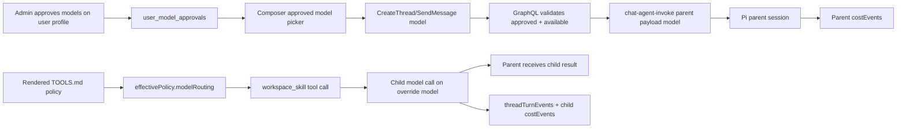

# feat: Add approved turn models and TOOLS.md tool-level model routing

## Overview

Ship the minimum credible model-stacking demo: users can select an approved parent model per new thread and follow-up turn, while Pi can route a specific tool call to a different approved model and leave trace/cost evidence afterward.

The near-term runtime target is `workspace_skill` with skill-slug matching. That keeps the implementation honest about true within-turn child-model execution without trying to hot-swap every built-in Pi SDK tool in the first slice.

The feature is not complete until an end-to-end proof seeds layered `TOOLS.md` policy at agent, Space, and user levels, runs a real routed turn, and shows the model plus input/output tokens on each tool output row in Settings -> Activity -> Thread Detail -> Tool.

---

## Problem Frame

The largest customer needs model stacking to optimize token spend during an agent turn. The product must prove two things at once: governed user-visible model choice, and real by-tool-call model switching inside the turn (see origin: `docs/brainstorms/2026-06-06-model-stacking-tool-routing-requirements.md`).

The repo already has a `model_catalog`, turn-level Pi model selection, workspace-rendered `TOOLS.md` files, `thread_turns`, `thread_turn_events`, and `cost_events`. The plan extends those existing paths rather than introducing a separate policy store.

---

## Requirements Trace

- R1. User model approval is per user and sourced from `model_catalog`.
- R2. New-thread and follow-up composers let users select from approved models.
- R3. Composer options show input/output token cost context.
- R4. Turn submission fails loudly for unapproved or unavailable selected models.
- R5. User Profile Settings adds a Models section with Approved switches.
- R6. Admins see model display name, provider, and token costs while approving.
- R7. Tool-level routing is runtime-enforced policy, not prose.
- R8. `TOOLS.md` is the enforceable tool behavior policy file.
- R9. Runtime checks effective model routing before each covered tool call.
- R10. Tool-level overrides only use approved, available models.
- R11. First true-stacking demo target is `workspace_skill` with skill slug matching.
- R12. Routing is by tool call, not only by skill/agent/space/turn.
- R13. No matching rule means normal parent-turn behavior.
- R14. Policy precedence is agent root -> active Space -> active workspace/folder -> user workspace.
- R15. Higher precedence can override lower policy but cannot grant unapproved models.
- R16. `AGENTS.md`, `SPACE.md`/`CONTEXT.md`, and `USER.md` may explain but not enforce routing.
- R17. Runtime reads a machine-readable `TOOLS.md` section.
- R18. Trace shows parent/planner model selected in composer.
- R19. Routed tool calls record tool, match, rule source, override model, tokens, cost, duration, and status.
- R20. Demo shows parent and tool-call model differ.
- R21. Cost reporting keeps child model calls explainable.

**Origin actors:** A1 tenant admin, A2 tenant user, A3 agent author/operator, A4 Pi runtime, A5 customer evaluator.

**Origin flows:** F1 user selects model for a turn, F2 admin approves models for a user, F3 runtime switches model for a tool call.

**Origin acceptance examples:** AE1 approved composer model list, AE2 Models section in profile, AE3 Sonnet parent plus Haiku `workspace_skill`, AE4 precedence plus unapproved Opus rejection, AE5 unmatched `send_email` has no override.

---

## Scope Boundaries

- Do not build a dynamic optimizer that picks models from live token estimates or confidence.
- Do not hot-swap every Pi built-in SDK tool in v1.
- Do not make `AGENTS.md`, `SPACE.md`, `CONTEXT.md`, or `USER.md` the machine-enforced routing surface.
- Do not silently downgrade unapproved model requests. Fail loudly.
- Do not implement customer invoices or billing presentation beyond traceable model/cost evidence.

### Demo Slice

- Parent turn model: selected in the Spaces composer from the current user's approved model list.
- Tool override: `TOOLS.md` route for `workspace_skill` with a `slug` matcher.
- Evidence: turn trace and cost rows show the parent model and the child routed tool model separately.

---

## Context & Research

### Relevant Code and Patterns

- `packages/database-pg/src/schema/agents.ts` defines `modelCatalog`.
- `packages/database-pg/graphql/types/agents.graphql` exposes `ModelCatalogEntry` and `modelCatalog`.
- `packages/api/src/graphql/resolvers/tenant-agent/modelCatalog.query.ts` filters available catalog entries.
- `packages/database-pg/src/schema/core.ts` defines `users`, `tenantMembers`, and `userProfiles`; no per-user model approval exists yet.
- `apps/admin/src/routes/_authed/_tenant/users/$userId.tsx` shows the user's Configuration tab and renders `HumanProfileSection`.
- `apps/admin/src/components/humans/HumanProfileSection.tsx` is the current profile card pattern.
- `apps/spaces/src/components/workbench/SpacesComposer.tsx` owns the empty-thread composer UI.
- `apps/spaces/src/components/workbench/SpacesWorkbench.tsx` creates a thread, uploads attachments, and sends the first message.
- `apps/spaces/src/components/workbench/SpacesThreadDetailRoute.tsx` sends follow-up messages.
- `apps/spaces/src/lib/use-chat-appsync-transport.ts` is the single SendMessage mutation owner for app-style chat transport.
- `packages/database-pg/graphql/types/threads.graphql` and `packages/database-pg/graphql/types/messages.graphql` need turn model inputs.
- `packages/api/src/graphql/resolvers/threads/createThread.mutation.ts` and `packages/api/src/graphql/resolvers/messages/sendMessage.mutation.ts` insert messages and dispatch turns.
- `packages/api/src/lib/mentions/default-agent-routing.ts`, `packages/api/src/lib/mentions/dispatch-agent-mentions.ts`, and `packages/api/src/graphql/utils.ts` need selected-model propagation into direct and wakeup paths.
- `packages/api/src/handlers/chat-agent-invoke.ts` creates `thread_turns`, stores `context_snapshot.model`, and sends the Pi payload `model`.
- `packages/api/src/handlers/wakeup-processor.ts` has the older wakeup path that also records `context_snapshot.model` and passes a runtime payload model.
- `packages/api/src/lib/workspace-renderer/compose-tuple.ts` renders agent, Space, user, and thread files and already mounts `TOOLS.md`.
- `packages/api/src/lib/workspace-renderer/effective-policy-composer.ts` currently composes allow/block policy only.
- `packages/pi-extensions/src/skills.ts` registers `workspace_skill`, which currently returns the skill file content to the parent model.
- `packages/pi-runtime-core/src/agent-loop.ts` runs a single parent session, records tool invocation events, and returns usage/model/tool costs.
- `packages/agentcore-pi/agent-container/src/server.ts` accepts `payload.model`, builds extensions, runs the Pi loop, and returns usage/tool invocation data.
- `packages/database-pg/src/schema/scheduled-jobs.ts` defines `threadTurns` and `threadTurnEvents`.
- `packages/database-pg/src/schema/cost-events.ts` defines `costEvents`; its unique `(request_id, event_type)` index means child LLM rows need distinct request IDs.
- `packages/api/src/lib/chat-finalize/process-finalize.ts` records the main LLM cost row and tool costs during finalize.
- `packages/api/src/graphql/resolvers/observability/threadTraces.query.ts` already returns LLM `cost_events` metadata for a thread.

### Institutional Learnings

- `docs/solutions/workflow-issues/manually-applied-drizzle-migrations-drift-from-dev-2026-04-21.md` matters for any hand-written migration: include `-- creates:` / `-- creates-column:` markers when needed.
- `docs/solutions/build-errors/worktree-stale-tsbuildinfo-drizzle-implicit-any-2026-04-24.md` is relevant for Drizzle and generated GraphQL changes in worktrees.

### External References

- None. This is a ThinkWork-native policy contract, and local patterns are strong enough for planning.

---

## Key Technical Decisions

- Use a `user_model_approvals` table, not profile JSON. Model approval is operational policy that needs joins, toggles, validation, and audit-like behavior.
- Represent approval as explicit rows keyed by tenant, user, and `model_id`. For demo continuity, the migration or resolver should ensure each user retains access to the current tenant/agent default model so existing chat still works.
- Add GraphQL approval query/mutation instead of overloading `modelCatalog`. Admin needs approved state and mutation authority; composer needs an approved-only self query.
- Carry selected parent model as an explicit `model`/`modelId` field on create/send inputs, then also persist it in message metadata for audit and fallback compatibility.
- Validate selected parent model synchronously in GraphQL before dispatch. The user should see an immediate error instead of a background failed wakeup.
- Extend the existing workspace-renderer policy channel to include `modelRouting`. The renderer already knows agent/Space/user layers and returns `effectivePolicy`; use that path, but explicitly add user `TOOLS.md` and active workspace/folder `TOOLS.md` participation where the current renderer does not yet include them.
- Treat `TOOLS.md` as ThinkWork-owned. The machine-readable section should be stable YAML frontmatter for v1, with prose below it allowed for human explanation.
- First child execution is a model-routed `workspace_skill` tool. The child model reads the selected skill content and produces a compact result/instructions summary returned to the parent.
- Record child LLM usage as separate child rows, not folded into the parent cost event. Use unique child request IDs such as `${turnId}:tool:${toolCallId}:model`.

---

## Open Questions

### Resolved During Planning

- **Policy file name:** use `TOOLS.md`.
- **Policy precedence:** agent root -> active Space -> active workspace/folder -> user workspace.
- **Enforcement surface:** only `TOOLS.md` is machine-enforced; AGENTS/SPACE/USER prose can explain.
- **First true stacking target:** `workspace_skill` by slug.
- **Unapproved override behavior:** fail loud and trace the rejected rule.

### Deferred to Implementation

- Exact `TOOLS.md` frontmatter key names can be refined during parser implementation, but the plan assumes `modelRouting` with entries containing `tool`, optional `match`, and `model`.
- Whether the follow-up composer path is only `SpacesThreadDetailRoute.tsx` or also `TaskThreadView.tsx` depends on the active UX route at implementation time. The implementer should cover the route used for normal Spaces follow-ups and add tests for that route.
- Exact child prompt shape for `workspace_skill` can be tuned for the demo, but it must make a real model call and return traceable usage.

---

## High-Level Technical Design

> Directional guidance only. The implementer should follow local code shape and tests rather than copying this as code.



### Proposed `TOOLS.md` Shape

```yaml
---
modelRouting:
  - tool: workspace_skill
    match:
      slug: financial-analysis
    model: us.anthropic.claude-haiku-4-5-v1:0
    reason: Use a cheaper model for skill-specific analysis.
---
```

Precedence is resolved by source layer. A higher-precedence matching entry replaces the lower-precedence entry for the same tool and match signature, but the approval gate still runs after precedence. The active workspace/folder layer should map to the selected folder context inside the rendered agent workspace, such as `workspaces/<slug>/TOOLS.md`, when a turn or tool call declares that workspace context.

---

## Implementation Units

- U1. **Add per-user model approval data and API**

**Goal:** Let the backend answer "which available catalog models is this user approved to use?"

**Requirements:** R1, R4, R5, R6, R10; supports F1, F2, AE1, AE2.

**Dependencies:** None.

**Files:**

- Modify: `packages/database-pg/src/schema/agents.ts`
- Modify: `packages/database-pg/src/schema/index.ts`
- Modify: `packages/database-pg/graphql/types/agents.graphql`
- Create: `packages/database-pg/drizzle/0145_user_model_approvals.sql`
- Create: `packages/api/src/lib/model-approvals.ts`
- Modify: `packages/api/src/graphql/resolvers/tenant-agent/modelCatalog.query.ts`
- Modify: `packages/api/src/graphql/resolvers/tenant-agent/index.ts`
- Test: `packages/api/src/lib/model-approvals.test.ts`
- Test: `packages/database-pg/__tests__/migration-0145-user-model-approvals.test.ts`

**Approach:**

- Add `user_model_approvals` with `tenant_id`, `user_id`, `model_id`, timestamps, and a unique index on `(tenant_id, user_id, model_id)`.
- Reference `users` and `model_catalog.model_id` where practical; if Drizzle FK shape is awkward, keep a DB-level FK in the migration and expose relations where useful.
- Add GraphQL type `UserModelApproval` or `UserModelCatalogEntry` carrying catalog fields plus `approved`.
- Add admin query for profile surfaces, for example `userModelCatalog(userId: ID!): [UserModelCatalogEntry!]!`, plus a self-scoped composer query such as `myApprovedModelCatalog: [ModelCatalogEntry!]!`.
- Add mutation `setUserModelApproval(userId: ID!, modelId: String!, approved: Boolean!): [UserModelCatalogEntry!]!` or a single-entry return; mutation authority should be tenant-admin/operator only. Normal users may read their own approved list but must not approve models for themselves.
- Add helper `assertUserModelApproved({ tenantId, userId, modelId })` that checks catalog availability and row approval, and throws typed GraphQL-friendly errors.
- Preserve existing behavior by ensuring the current platform default or agent default model is approved for users after migration/bootstrap, rather than leaving composers empty.

**Patterns to follow:**

- `packages/api/src/graphql/resolvers/tenant-agent/modelCatalog.query.ts` for catalog mapping.
- `packages/api/src/graphql/resolvers/core/updateUserProfile.mutation.ts` for self/admin user authorization.
- Manual migration marker guidance in `docs/solutions/workflow-issues/manually-applied-drizzle-migrations-drift-from-dev-2026-04-21.md`.

**Test scenarios:**

- Admin can list a user's catalog entries with accurate `approved` values and pricing fields.
- A normal user can read their own approved catalog list but cannot toggle approvals.
- Toggling approval on creates an approval row; toggling off removes or disables it consistently.
- Unavailable `model_catalog` entries are not returned as selectable/approvable active options.
- `assertUserModelApproved` accepts approved available models and rejects unapproved, unavailable, and cross-tenant requests.
- Existing users retain at least the default model after migration/bootstrap.

---

- U2. **Add the admin Models section on user profile settings**

**Goal:** Give admins the required UI to approve per-user models from the catalog with cost context.

**Requirements:** R1, R5, R6; supports F2, AE2.

**Dependencies:** U1.

**Files:**

- Modify: `apps/admin/src/lib/graphql-queries.ts`
- Modify: `apps/admin/src/routes/_authed/_tenant/users/$userId.tsx`
- Create: `apps/admin/src/components/humans/UserModelsSection.tsx`
- Test: `apps/admin/src/components/humans/UserModelsSection.test.tsx`
- Test: `apps/admin/src/routes/_authed/_tenant/users/-user-models.test.tsx`

**Approach:**

- Add GraphQL query/mutation documents for `userModelCatalog` and `setUserModelApproval`.
- Render a second settings section under or near `HumanProfileSection` in the Configuration tab.
- Display `displayName`, `provider`, and a second line like `$input / $output per 1M tokens`.
- Use switches for Approved state; optimistic UI is acceptable if failed mutations restore state and toast the error.
- Keep the visual language aligned with existing admin settings sections: compact rows, restrained styling, no marketing copy.

**Test scenarios:**

- Models section renders catalog rows with display name, provider, input cost, output cost, and switch state.
- Toggling a switch calls the mutation with `userId`, `modelId`, and `approved`.
- Mutation error leaves or restores the prior state and shows an error.
- Empty catalog state is clear and does not crash the profile page.

---

- U3. **Add approved model pickers to new-thread and follow-up composers**

**Goal:** Let users select the parent/planner model for each turn from their approved set.

**Requirements:** R2, R3, R4, R18; supports F1, AE1.

**Dependencies:** U1.

**Files:**

- Modify: `apps/spaces/src/lib/graphql-queries.ts`
- Modify: `apps/spaces/src/components/workbench/SpacesComposer.tsx`
- Modify: `apps/spaces/src/components/workbench/SpacesWorkbench.tsx`
- Modify: `apps/spaces/src/components/workbench/SpacesThreadDetailRoute.tsx`
- Modify: `apps/spaces/src/components/workbench/TaskThreadView.tsx` if this is the active follow-up composer path
- Modify: `apps/spaces/src/lib/use-chat-appsync-transport.ts`
- Test: `apps/spaces/src/components/workbench/SpacesComposer.test.tsx`
- Test: `apps/spaces/src/components/workbench/SpacesWorkbench.test.tsx`
- Test: `apps/spaces/src/components/workbench/SpacesThreadDetailRoute.test.tsx`
- Test: `apps/spaces/src/lib/use-chat-appsync-transport.test.ts`

**Approach:**

- Add the self-scoped approved-model query for the signed-in user in the Spaces shell/workbench context.
- Add a compact model select in `SpacesComposer` footer matching the screenshot intent. Show short model name on the trigger and pricing/provider in menu rows.
- Include selected `modelId` in the `onSubmit` boundary so composer remains transport-agnostic.
- Persist a reasonable default selected model: last selected model in local state/storage if still approved; otherwise first approved model, preferably the platform default.
- Add the same selected model behavior to follow-up submit paths.
- Pass selected model into `CreateThreadInput` for first-message flow when used, and `SendMessageInput` for normal message dispatch. For the current Spaces flow that creates a thread then sends a message, the selected model should travel on `sendMessage`.

**Patterns to follow:**

- `apps/spaces/src/components/agents/ModelSelect.tsx` for catalog select behavior.
- `apps/spaces/src/components/workbench/SpacesComposer.tsx` for footer controls and tests.
- `apps/spaces/src/lib/use-composer-state.test.ts` for the single-submit invariant: composers must not import mutation documents directly.

**Test scenarios:**

- Composer shows only approved models and hides unapproved models.
- Model menu rows include pricing context.
- Submitting a new thread sends the selected `modelId` through the existing submit boundary.
- Follow-up submission sends the selected `modelId`.
- If the selected model disappears from approvals, the composer falls back to an approved model or disables submit with a clear error.

---

- U4. **Propagate and validate selected parent model through GraphQL dispatch**

**Goal:** Ensure the selected parent model is validated synchronously and reaches every agent dispatch path.

**Requirements:** R2, R4, R10, R18; supports F1, AE1.

**Dependencies:** U1, U3.

**Files:**

- Modify: `packages/database-pg/graphql/types/threads.graphql`
- Modify: `packages/database-pg/graphql/types/messages.graphql`
- Modify: `packages/api/src/graphql/resolvers/threads/createThread.mutation.ts`
- Modify: `packages/api/src/graphql/resolvers/messages/sendMessage.mutation.ts`
- Modify: `packages/api/src/lib/mentions/default-agent-routing.ts`
- Modify: `packages/api/src/lib/mentions/dispatch-agent-mentions.ts`
- Modify: `packages/api/src/graphql/utils.ts`
- Modify: `packages/api/src/handlers/chat-agent-invoke.ts`
- Modify: `packages/api/src/handlers/wakeup-processor.ts`
- Test: `packages/api/src/graphql/resolvers/messages/sendMessage.mutation.test.ts`
- Test: `packages/api/src/graphql/resolvers/threads/createThread.mutation.test.ts`
- Test: `packages/api/src/lib/mentions/default-agent-routing.test.ts`
- Test: `packages/api/src/handlers/chat-agent-invoke.test.ts`

**Approach:**

- Add optional `modelId` or `model` to `CreateThreadInput` and `SendMessageInput`; prefer one name consistently across GraphQL and UI.
- For user-submitted agent turns, call `assertUserModelApproved` before inserting/dispatching the agent turn. If invalid, return a GraphQL error and do not enqueue background work.
- Store selected parent model in message metadata, and in `thread_turns.context_snapshot.requested_model` / `model` when the turn starts.
- Thread direct invoke and wakeup payloads through default-agent routing and mention routing.
- In `chat-agent-invoke.ts`, resolve `agentModel` as selected approved parent model first, then agent/template fallback. Keep fallback for non-user/system wakeups.
- In `wakeup-processor.ts`, respect payload-selected model only after approval has been validated or when the source is trusted system work. Avoid letting arbitrary wakeup payloads bypass approval.

**Patterns to follow:**

- Existing message metadata parsing in `sendMessage.mutation.ts`.
- Existing `invokeChatAgent` payload shape in `packages/api/src/graphql/utils.ts`.
- Current `context_snapshot.model` persistence in `chat-agent-invoke.ts` and `wakeup-processor.ts`.

**Test scenarios:**

- Approved selected model dispatches and is persisted in message metadata and turn context snapshot.
- Unapproved selected model fails before dispatch and creates no wakeup/direct invocation.
- Unavailable catalog model fails before dispatch.
- Mention dispatch and default-agent dispatch both preserve selected model.
- System/background wakeups without a user-selected model still use the agent/template model fallback.

---

- U5. **Extend `TOOLS.md` effective policy with model routing**

**Goal:** Parse and compose machine-readable tool model routing across agent, Space, workspace/folder, and user policy layers.

**Requirements:** R7, R8, R9, R12, R13, R14, R15, R16, R17; supports F3, AE4, AE5.

**Dependencies:** U1.

**Files:**

- Modify: `packages/api/src/lib/workspace-renderer/effective-policy-composer.ts`
- Modify: `packages/api/src/lib/workspace-renderer/compose-tuple.ts`
- Modify: `packages/api/src/lib/workspace-renderer/prefixes.ts`
- Modify: `packages/api/src/lib/workspace-renderer/repository.ts`
- Modify: `packages/api/src/lib/workspace-renderer/types.ts`
- Modify: `packages/api/src/lib/workspace-renderer/compose-tuple.test.ts`
- Modify: `packages/api/src/lib/workspace-renderer/effective-policy-composer.test.ts`
- Create: `packages/api/src/lib/workspace-renderer/tools-md-parser.ts`
- Test: `packages/api/src/lib/workspace-renderer/tools-md-parser.test.ts`
- Modify: `packages/workspace-defaults/files/AGENTS.md`
- Create: `packages/workspace-defaults/files/TOOLS.md`
- Modify: `packages/workspace-defaults/src/index.ts`

**Approach:**

- Parse YAML frontmatter from every `TOOLS.md` source that participates in the tuple: agent root, active Space, active workspace/folder, and user workspace.
- Update user source filtering so `tenants/<tenant>/users/<user>/TOOLS.md` can participate in policy composition even if it is not broadly rendered as editable memory/context.
- Add active workspace/folder resolution for `workspaces/<slug>/TOOLS.md` or the current equivalent workspace folder path. If no active workspace/folder can be resolved, skip this layer and add a diagnostic instead of guessing.
- Extend `EffectiveWorkspacePolicy` with `modelRouting` entries carrying `tool`, `match`, `model`, `sourcePath`, `sourceOwner`, `precedence`, and optional `reason`.
- Compose routes in precedence order. For identical route keys, higher precedence replaces lower; distinct matches can coexist.
- Include diagnostics for malformed routes and ignored entries, but fail loud at runtime when a matched route requests an unavailable/unapproved model.
- Keep existing allow/block/MCP policy behavior unchanged.
- Add a default `TOOLS.md` explaining the machine-readable contract and leaving `modelRouting: []` by default.

**Patterns to follow:**

- `packages/api/src/lib/workspace-renderer/space-md-parser.ts` for frontmatter parsing style.
- Current `composeWorkspacePolicy` normalization and diagnostics.
- Existing `TOOLS.md` fixture coverage in `compose-tuple.test.ts`.

**Test scenarios:**

- Agent-root `TOOLS.md` route appears in `effectivePolicy.modelRouting`.
- Space route overrides an identical agent route.
- Active workspace/folder route overrides Space route for the same tool/match key.
- User route overrides Space route for the same tool/match key.
- Distinct skill slug routes coexist.
- Malformed frontmatter is reported in diagnostics without breaking unrelated allow/block policy.
- Prose in `AGENTS.md`, `CONTEXT.md`, and `USER.md` does not create enforceable model routes.

---

- U6. **Implement model-routed `workspace_skill` child execution in Pi**

**Goal:** Make the first demo target perform a real child model call on the override model and return its result to the parent.

**Requirements:** R7, R9, R10, R11, R12, R13, R19, R20; supports F3, AE3, AE4, AE5.

**Dependencies:** U1, U4, U5.

**Files:**

- Modify: `packages/agentcore-pi/agent-container/src/server.ts`
- Modify: `packages/pi-extensions/src/skills.ts`
- Modify: `packages/pi-runtime-core/src/agent-loop.ts`
- Modify: `packages/pi-runtime-core/src/types.ts`
- Create: `packages/pi-runtime-core/src/model-routing-policy.ts`
- Test: `packages/pi-extensions/src/skills.test.ts`
- Test: `packages/pi-runtime-core/src/model-routing-policy.test.ts`
- Test: `packages/pi-runtime-core/src/agent-loop.test.ts`
- Test: `packages/agentcore-pi/agent-container/src/server.test.ts`

**Approach:**

- Add `effective_model_policy` or `model_routing_policy` to the AgentCore Pi payload from `chat-agent-invoke.ts`.
- Add requester identity and approved model list or signed approval snapshot to the runtime payload so Pi can enforce R10 even if policy arrives from workspace files.
- Teach `createSkillsExtension` to accept a model-routing resolver and child model caller.
- When `workspace_skill` executes, match `{ tool: "workspace_skill", match.slug }` against effective policy.
- If no match, preserve current behavior: return full skill content.
- If matched and approved, run a child model call with the override model against the skill content and current tool parameters. Return a structured tool result containing the child output plus routing details.
- If matched but unapproved/unavailable, throw a clear tool error and record the rejected route in diagnostics.
- Capture child usage, model ID, duration, and routing metadata in the run result.
- Keep the parent session model unchanged.

**Patterns to follow:**

- `packages/pi-extensions/src/skills.ts` extension registration shape.
- `packages/pi-runtime-core/src/model-provider.ts` fail-loud model resolution contract.
- Tool invocation collection in `packages/pi-runtime-core/src/agent-loop.ts`.

**Test scenarios:**

- No route: `workspace_skill` returns the full skill content as before.
- Matching route: `workspace_skill(slug: "financial-analysis")` invokes child model with configured override model and returns child output.
- Tool-call route applies per invocation: two different skill slugs in one turn can resolve differently.
- Unapproved route throws a visible error and does not call the child model.
- Child usage and route metadata appear in `RunAgentLoopResult`.

---

- U7. **Record trace and cost evidence for parent and child models**

**Goal:** Make the demo auditable after the turn finishes.

**Requirements:** R18, R19, R20, R21; supports AE3, AE4.

**Dependencies:** U4, U6.

**Files:**

- Modify: `packages/pi-runtime-core/src/types.ts`
- Modify: `packages/agentcore-pi/agent-container/src/server.ts`
- Modify: `packages/api/src/lib/chat-finalize/types.ts`
- Modify: `packages/api/src/lib/chat-finalize/process-finalize.ts`
- Modify: `packages/api/src/lib/cost-recording.ts`
- Modify: `packages/api/src/graphql/resolvers/observability/threadTraces.query.ts`
- Modify: `packages/api/src/graphql/resolvers/triggers/threadTurnEvents.query.ts`
- Test: `packages/api/src/lib/chat-finalize/process-finalize.test.ts`
- Test: `packages/api/src/graphql/resolvers/observability/threadTraces.query.test.ts`
- Test: `packages/api/src/graphql/resolvers/triggers/threadTurnEvents.query.test.ts`

**Approach:**

- Extend the runtime/finalize payload with `child_model_usage` or equivalent entries: `toolCallId`, `toolName`, `match`, `ruleSource`, `model`, `inputTokens`, `outputTokens`, `cachedReadTokens`, `durationMs`, `status`, and `error`.
- During finalize, insert child LLM `cost_events` with unique `request_id` values and metadata `{ source: "pi_tool_model_route", parent_request_id: turnId, tool_call_id, tool_name, rule_source, match }`.
- Keep the parent LLM row as `request_id = turnId`.
- Add or enrich `thread_turn_events` entries for routed tool model starts/completions/rejections so live and historical views have the same evidence.
- Enrich `tool_invocations` records with routed model metadata when present: `model`, `inputTokens`, `outputTokens`, `cachedReadTokens`, `modelRouting.ruleSource`, `modelRouting.match`, and `modelRouting.status`.
- Ensure `threadTraces` returns enough metadata for the UI to distinguish parent vs child model rows.
- Update cost notification if needed so model-level spend refreshes after child rows are recorded.

**Patterns to follow:**

- Parent cost recording in `packages/api/src/lib/chat-finalize/process-finalize.ts`.
- Existing `tool_costs` insertion for non-LLM tool spend.
- Existing `threadTurnEvents` streaming/event schemas.

**Test scenarios:**

- Finalize inserts one parent LLM cost row and one child LLM cost row for a routed skill call.
- Child cost row uses a unique request ID and does not conflict with parent `(request_id, event_type)`.
- Child row metadata identifies tool name, tool call ID, match, and rule source.
- Tool invocation payload includes model plus input/output token counts for routed model calls.
- Rejected override records a trace event with status/error but no child LLM cost row.
- Thread traces expose parent and child model rows separately.

---

- U8. **Surface model-stacking evidence in Settings Activity thread detail**

**Goal:** Make parent and child model usage visible enough for the customer demo, specifically in Settings -> Activity -> Thread Detail -> Tool.

**Requirements:** R18, R19, R20, R21; supports A5, AE3.

**Dependencies:** U7.

**Files:**

- Modify: `apps/spaces/src/lib/graphql-queries.ts`
- Modify: `apps/spaces/src/components/workbench/TaskThreadView.tsx`
- Modify: `apps/spaces/src/components/workbench/SpacesThreadDetailRoute.tsx`
- Modify: `apps/spaces/src/components/workbench/render-typed-part.tsx` if the Activity tool row uses typed tool parts for this surface
- Modify: `apps/spaces/src/components/settings/SettingsAnalytics.tsx` if model cost rollups need child visibility
- Modify: `apps/admin/src/routes/_authed/_tenant/threads/index.tsx` if admin trace entry point is used for demo
- Test: `apps/spaces/src/components/workbench/TaskThreadView.test.tsx`
- Test: `apps/spaces/src/components/workbench/SpacesThreadDetailRoute.test.tsx`
- Test: `apps/spaces/src/components/workbench/render-typed-part.test.tsx` if the tool row lives there

**Approach:**

- Show the selected parent model in turn details using existing `context_snapshot.model` / result model parsing.
- Show routed child model entries under tool invocation details or trace details: tool name, skill slug, override model, input tokens, output tokens, status, and rule source.
- On each Settings -> Activity -> Thread Detail -> Tool output row, display the model used and input/output token counts. If the tool was not model-routed or token counts are unavailable, show an explicit empty/unknown state rather than implying it used the parent model.
- Ensure model cost rollups include child model cost rows because they are regular `cost_events` rows.
- For the demo, prefer a compact trace panel over a broad analytics redesign.

**Patterns to follow:**

- Existing model parsing in `SpacesThreadDetailRoute.tsx`.
- Existing timing/tool detail display in `TaskThreadView.tsx`.
- Existing model display mapping from `modelCatalog` in admin thread/cost views.

**Test scenarios:**

- Turn detail shows parent model selected in composer.
- Routed `workspace_skill` shows child model different from parent with rule source.
- Each tool row in Settings -> Activity -> Thread Detail shows model, input tokens, and output tokens when routed model usage is available.
- Rejected route shows error status and does not imply the tool silently used another model.
- Cost-by-model views include child model spend rows.

---

- U9. **Add end-to-end layered `TOOLS.md` model-stacking proof**

**Goal:** Prove the full behavior against a realistic workspace with policy files at agent, Space, and user levels.

**Requirements:** R7, R8, R9, R10, R12, R14, R15, R18, R19, R20, R21; supports F3, AE3, AE4, AE5.

**Dependencies:** U1-U8.

**Files:**

- Create: `packages/api/test/integration/model-stacking/tool-model-routing.e2e.test.ts`
- Create: `packages/api/vitest.model-stacking-e2e.config.ts`
- Create: `docs/verification/model-stacking-e2e.md`
- Modify: `scripts/e2e-cli-smoke.sh` or create a dedicated script if implementation finds that deployed-stack orchestration belongs there

**Approach:**

- Seed or write a demo workspace with at least three policy files:
  - Agent root `TOOLS.md` with a baseline `workspace_skill` route.
  - Active Space `TOOLS.md` overriding the same tool/slug route.
  - User workspace `TOOLS.md` overriding the same tool/slug route again.
- Include an active workspace/folder `TOOLS.md` case if U5 exposes that layer in the rendered tuple; at minimum the e2e must cover the user-requested agent, Space, and user levels.
- Approve the parent model and the intended override model for the demo user, and leave one higher-cost model unapproved for the negative case.
- Start a real thread/turn with parent model A and a prompt that invokes the target `workspace_skill` slug.
- Assert the effective policy winner is the highest-precedence approved route, the tool child call ran on model B, and parent model A remains the turn model.
- Assert Settings -> Activity -> Thread Detail -> Tool displays model B plus input/output token counts for the routed tool output.
- Change the user-level policy to an unapproved model and assert the runtime rejects the route visibly and records the rejection without a child LLM cost row.
- Capture the exact demo steps, policy file contents, expected UI locations, and cleanup steps in `docs/verification/model-stacking-e2e.md`.

**Patterns to follow:**

- Existing deployed-stack e2e patterns in `packages/api/test/integration/*/*.e2e.test.ts`.
- Existing script conventions in `scripts/e2e-cli-smoke.sh`.
- Workspace rendering fixture patterns in `packages/api/src/lib/workspace-renderer/compose-tuple.test.ts`.

**Test scenarios:**

- Agent-level route applies when no Space or user override exists.
- Space-level route wins over agent-level route.
- User-level route wins over Space-level route when approved.
- User-level route to an unapproved model is rejected and does not silently fall back.
- Activity thread detail shows the routed model and input/output tokens on the tool row after a successful routed call.

---

- U10. **Regenerate schemas and add demo policy documentation**

**Goal:** Keep generated clients and operator docs in sync.

**Requirements:** R1-R21 indirectly; supports the whole demo.

**Dependencies:** U1-U9.

**Files:**

- Modify: `apps/admin/src/gql/*`
- Modify: `apps/spaces/src/gql/*`
- Modify: `apps/mobile/src/gql/*` if GraphQL codegen includes shared schema changes
- Modify: `packages/api/src/gql/*` if present
- Modify: `terraform/schema.graphql`
- Create: `docs/solutions/model-stacking-tools-md-routing-2026-06-06.md`
- Test: `packages/api/src/lib/workspace-renderer/tools-md-parser.test.ts`

**Approach:**

- Run schema/codegen for all consumers that have a `codegen` script after GraphQL type changes.
- Add a short solution note with `TOOLS.md` syntax, precedence, and the demo `workspace_skill` example.
- Link to `docs/verification/model-stacking-e2e.md` so demo operators can replay the proof.
- Include an explicit note that `TOOLS.md` is ThinkWork-native, not an external standard.

**Verification:**

- `pnpm schema:build`
- `pnpm --filter @thinkwork/database-pg db:generate` if the Drizzle schema change needs generated migration metadata; otherwise preserve hand-written migration markers.
- `pnpm --filter @thinkwork/admin codegen`
- `pnpm --filter @thinkwork/spaces codegen`
- `pnpm --filter @thinkwork/api codegen`
- `pnpm --filter @thinkwork/mobile codegen` if mobile consumes changed shared operations.

---

## Sequencing

1. U1 first: approval data/API is the gate for both composer and runtime overrides.
2. U2 and U3 can proceed in parallel after U1: admin approval UI and composer picker.
3. U4 after U3: selected parent model must reach dispatch and runtime.
4. U5 after U1: policy parser/composer can use model availability concepts but does not need the UI.
5. U6 after U4 and U5: Pi needs both selected parent model and effective routing policy.
6. U7 after U6: trace/cost recording needs child usage shape.
7. U8 after U7: UI evidence depends on persisted trace/cost shape.
8. U9 after U8: end-to-end proof needs working policy, runtime, trace, cost, and Activity UI evidence.
9. U10 last: regenerate, document, and prepare demo policy.

For a two-day demo, prioritize U1, U3, U4, U5, U6, U7, U8, and the happy-path portion of U9. U2 is required by the written requirement, but the UI can be a compact first pass. U8 can be a narrow Activity thread-detail display rather than a broad analytics overhaul.

---

## Verification Plan

- Unit tests:
  - `packages/api/src/lib/model-approvals.test.ts`
  - `packages/api/src/lib/workspace-renderer/tools-md-parser.test.ts`
  - `packages/api/src/lib/workspace-renderer/effective-policy-composer.test.ts`
  - `packages/pi-extensions/src/skills.test.ts`
  - `packages/pi-runtime-core/src/model-routing-policy.test.ts`
  - `packages/api/src/lib/chat-finalize/process-finalize.test.ts`
  - `packages/api/test/integration/model-stacking/tool-model-routing.e2e.test.ts`
- Resolver/handler tests:
  - `packages/api/src/graphql/resolvers/messages/sendMessage.mutation.test.ts`
  - `packages/api/src/graphql/resolvers/threads/createThread.mutation.test.ts`
  - `packages/api/src/handlers/chat-agent-invoke.test.ts`
- UI tests:
  - `apps/admin/src/components/humans/UserModelsSection.test.tsx`
  - `apps/spaces/src/components/workbench/SpacesComposer.test.tsx`
  - `apps/spaces/src/components/workbench/SpacesWorkbench.test.tsx`
  - `apps/spaces/src/components/workbench/TaskThreadView.test.tsx`
  - `apps/spaces/src/components/workbench/render-typed-part.test.tsx` if U8 uses typed tool rows
- Local commands:
  - `pnpm --filter @thinkwork/database-pg build`
  - `pnpm --filter @thinkwork/api test`
  - `pnpm --filter @thinkwork/agentcore-pi test`
  - `pnpm --filter @thinkwork/pi-runtime-core test`
  - `pnpm --filter @thinkwork/pi-extensions test`
  - `pnpm --filter @thinkwork/admin test`
  - `pnpm --filter @thinkwork/spaces test`
  - `pnpm --filter @thinkwork/api test -- --config packages/api/vitest.model-stacking-e2e.config.ts` or the final e2e command chosen in U9
  - `pnpm -r --if-present typecheck`

### Demo Verification

1. Approve Sonnet and Haiku for a demo user, leave Opus unapproved.
2. Confirm the composer only offers approved models and shows costs.
3. Select Sonnet as the parent model.
4. Add layered `TOOLS.md` routes for `workspace_skill` slug `financial-analysis`: agent root baseline, active Space override, and user workspace override.
5. Run a turn that invokes that skill and confirm the approved highest-precedence route wins.
6. Confirm trace shows Sonnet parent model and Haiku child tool-call model.
7. Confirm Settings -> Activity -> Thread Detail -> Tool shows Haiku plus input/output tokens on the tool output row.
8. Confirm cost events include separate parent and child LLM rows.
9. Change the user-level route to unapproved Opus and confirm the runtime rejects it visibly.

---

## Risks and Mitigations

- **Risk: Pi SDK does not expose an easy child model-call API.** Mitigation: implement the child call in the AgentCore Pi host using the same Bedrock/model registry path used for the parent, behind a small injected child-call interface tested with fakes.
- **Risk: `workspace_skill` currently returns instructions, so child summarization could reduce parent fidelity.** Mitigation: for routed calls, prompt the child to return actionable distilled instructions plus key source excerpts; no-route behavior remains unchanged.
- **Risk: Approval bootstrap could accidentally expose every model.** Mitigation: only bootstrap the existing default model; require explicit rows for additional models.
- **Risk: Policy parser becomes too broad.** Mitigation: v1 only supports `modelRouting` with tool and simple equality match fields.
- **Risk: Cost rows collide on `(request_id, event_type)`.** Mitigation: use unique child request IDs and record parent ID in metadata.
- **Risk: Demo UI scope grows.** Mitigation: show trace evidence in the narrow turn detail path first; broad analytics improvements can follow after the client demo.

---

## Handoff Notes

- Keep the first implementation honest: a child routed call must really invoke the override model. Metadata-only routing is not acceptable for this requirement.
- Do not let parent model prose decide routing. The runtime policy check is the contract.
- The fastest credible route is to make `workspace_skill` routeable first, then generalize the same policy resolver to other tools later.
- `TOOLS.md` is not a public standard here; it is ThinkWork's native tool policy file.
