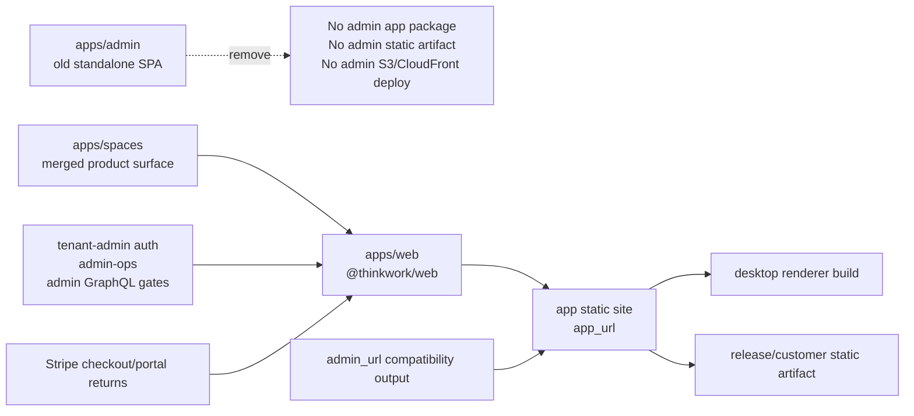

# refactor: Remove Admin App and Rename Spaces to Web

## Overview

Retire the standalone `apps/admin` SPA and make the merged Spaces surface the single web application under `apps/web`. The cleanup must remove the admin static-site deployment path, rename the Spaces workspace package and build scripts to web-oriented names, and update release/deploy/customer-deployment references so there is no longer a separate admin web bundle.

The important boundary: this removes the admin **application**, not tenant-admin authorization, `@thinkwork/admin-ops`, admin GraphQL mutations, or the shared Cognito app client. Those backend concepts still exist because the web app, CLI, mobile, agents, and Stripe flows continue to rely on them.

---

## Problem Frame

The repo currently carries two web SPAs in `apps/`: `apps/admin` and `apps/spaces`. Product work has moved operator/admin capabilities into the Spaces application, but the repository and deployment pipeline still build, publish, document, and provision the old admin site. This creates duplicated app surfaces, stale docs, extra CloudFront/S3 infrastructure, and release artifacts that imply a product split that no longer exists.

Local research also found two remaining admin-only billing/onboarding paths in the current checkout: `apps/admin/src/routes/_authed/_tenant/billing.tsx` and `apps/admin/src/routes/onboarding/welcome.tsx`. Terraform/Lambda still points Stripe success and portal return URLs through `ADMIN_URL`, and `packages/api/src/handlers/stripe-portal.ts` currently returns users to `/settings/billing` even though the admin route lives at `/billing`. Those are blocking survivors to normalize before deleting `apps/admin`.

---

## Requirements Trace

- R1. Remove `apps/admin` from the workspace without leaving package-manager, CI, build, codegen, route, or generated-artifact references that require it.
- R2. Rename `apps/spaces` to `apps/web` and update package identity, scripts, path references, release artifacts, env-file writes, and desktop renderer wiring accordingly.
- R3. Remove the standalone admin static-site deployment from Terraform and GitHub Actions while preserving the single web app deployment at the app host.
- R4. Preserve tenant-admin/operator authorization and admin-ops backend capabilities; only the retired UI app and its static hosting are removed.
- R5. Preserve user-facing billing/onboarding flows by porting any remaining admin-only Stripe routes into the web app or intentionally redirecting them before deleting `apps/admin`.
- R6. Keep compatibility for external consumers during rollout where outputs such as `admin_url` are still used as "operator app URL" inputs, but make them aliases to the web app rather than a separate static site.

---

## Scope Boundaries

- Do not rename the domain model, database table, GraphQL type, routes, or product concept named `spaces`; `/spaces/...` routes and `spaces` data remain unless a separate product decision says otherwise.
- Do not remove `@thinkwork/admin-ops`, `admin-ops-mcp`, admin GraphQL resolver gates, tenant roles, `requireTenantAdmin`, or Cognito's shared admin client.
- Do not remove historical `apps/admin` mentions from archived plans or old brainstorm documents unless they are actively misleading current operator documentation.
- Do not introduce a new web deployment surface; `apps/web` replaces the old `apps/spaces` source path and remains the one app hosted at `app.<apex>`.

### Deferred to Follow-Up Work

- Fully retiring compatibility names such as `admin_url`, `admin_client_id`, and `computer_*` outputs can happen after customer deploy templates, downstream repos, and active stages have moved to `app_url`/web naming.

---

## Context & Research

### Relevant Code and Patterns

- `apps/spaces/package.json` is the current merged web app package; it builds the main Vite bundle and `build:iframe-shell`.
- `scripts/build-spaces.sh` writes `apps/spaces/.env.production`, builds `@thinkwork/spaces`, syncs `apps/spaces/dist` to the app bucket, and syncs `apps/spaces/dist/iframe-shell` to the sandbox bucket.
- `scripts/build-desktop.sh` writes the shared renderer env into `apps/spaces/.env.production` and builds `@thinkwork/spaces` for the Electron shell.
- `.github/workflows/release-desktop.yml` deploys the Spaces web app on desktop release tags through `scripts/build-spaces.sh`.
- `.github/workflows/deploy.yml` still detects `apps/admin/**`, runs `build-admin`, prints `Admin App`, and includes `build-admin` in post-deploy dependency/reporting.
- `scripts/build-admin.sh`, `scripts/release/package-static-assets.sh`, `.github/workflows/release.yml`, and `scripts/release/__tests__/build-release-manifest.test.ts` still produce or require an `admin` static-site artifact.
- `terraform/modules/thinkwork/main.tf` provisions `module "admin_site"` and uses it in Cognito callback/logout URLs, API `admin_url`, CSP frame ancestors, and outputs.
- `terraform/examples/greenfield/main.tf` derives `admin.<apex>`, passes `admin_domain`, includes admin DNS, and outputs admin bucket/distribution/url values.
- `terraform/modules/app/lambda-api/handlers.tf` passes `ADMIN_URL` and Stripe checkout/portal return URLs derived from the old admin URL.
- `terraform/modules/app/lambda-api/mcp-oauth.tf` uses `apps/admin/public/logo.png` for the OAuth logo path.
- `apps/cli/src/commands/init.ts`, enterprise deploy templates, README/AGENTS guidance, docs pages, and smoke scripts still assume an admin web app.

### Institutional Learnings

- `docs/solutions/conventions/admin-trim-ui-preserve-backend-mutations-2026-05-13.md` says UI removal and backend removal are independent decisions; keep backend mutations and shared admin capabilities unless a caller audit proves they are truly dead.
- `docs/solutions/runbooks/update-cognito-callback-urls-2026-05-22.md` documents that `ThinkworkAdmin` is the shared Cognito client for admin web, Spaces web, and desktop; callback URL changes should go through Terraform, not ad hoc console edits.
- `docs/solutions/integration-issues/spaces-urql-doc-cache-no-live-invalidation.md` is relevant for any migrated operator mutations in the web app: Spaces uses document cache, so post-mutation refreshes must be explicit.

### External References

- External research skipped. This is repo-specific cleanup with strong local patterns; current Terraform/GitHub Actions/Vite behavior is discoverable in the codebase.

---

## Key Technical Decisions

- Keep `admin` as an authorization/backend adjective: It remains valid in role checks, resolver names, admin-ops packages, and Cognito app-client outputs. The removed thing is the `apps/admin` SPA and static-site deployment.
- Rename the workspace package to `@thinkwork/web`: The source path rename should be paired with package identity and script names so future `pnpm --filter` commands no longer encode the old Spaces app name.
- Keep product routes and labels named Spaces where they represent the domain model: This plan renames the application folder to `web`, not the `/spaces` resource or UI concept.
- Replace admin hosting with web-app aliases rather than a new admin site: `admin_url` should become a compatibility alias for `app_url` where downstream consumers still expect it, while `admin_bucket_name`/`admin_distribution_id` should be removed from new build/deploy paths.
- Treat Stripe billing/onboarding as blocking survivors: If billing/welcome routes are not already available in `apps/web` at implementation time, port them before deleting `apps/admin`; do not leave checkout or portal sessions returning to a dead origin.
- Preserve desktop/web deployment sync: The current release-desktop workflow intentionally deploys the web app on desktop tag cuts. Rename that machinery, but keep the release coupling unless a separate release-policy decision changes it.

---

## Open Questions

### Resolved During Planning

- Should admin backend and auth concepts be deleted with the app? No. Local code shows `@thinkwork/admin-ops`, tenant-admin gates, Cognito's shared client, and API env names are used beyond the old SPA.
- Should `/spaces` routes be renamed to `/web`? No. The user asked for folder cleanup and `spaces -> web` as an app path; route/model renames would be product behavior and are out of scope.
- Is `apps/admin` currently safe to delete without auditing remaining routes? No. Current code still has billing and onboarding welcome routes only under `apps/admin`, and Stripe envs point at the admin URL.

### Deferred to Implementation

- Exact compatibility window for `admin_url`: Implementation should keep it as an alias to the web app unless customer-deploy consumers are updated in the same PR and the deploy templates prove no active dependency remains.
- Exact docs deletion vs rewrite boundary: Implementation should update current docs and README/AGENTS guidance, but can leave archived plans/brainstorms as history.

---

## High-Level Technical Design

> *This illustrates the intended approach and is directional guidance for review, not implementation specification. The implementing agent should treat it as context, not code to reproduce.*

---

## Implementation Units

- U1. **Port Remaining Admin-Only Runtime Flows**

**Goal:** Ensure deleting `apps/admin` does not remove live billing or onboarding flows.

**Requirements:** R4, R5

**Dependencies:** None

**Files:**
- Modify/Create: `apps/spaces/src/routes/**` or final renamed `apps/web/src/routes/**`
- Modify/Create: `apps/spaces/src/components/settings/**` or final renamed `apps/web/src/components/settings/**`
- Modify: `packages/api/src/handlers/stripe-portal.ts`
- Modify: `packages/api/src/handlers/stripe-checkout.ts`
- Modify: `packages/api/src/lib/stripe-welcome-email.ts`
- Modify: `terraform/modules/app/lambda-api/handlers.tf`
- Test: `apps/spaces/src/**/*.test.tsx` or final renamed `apps/web/src/**/*.test.tsx`
- Test: `packages/api/src/**/*.test.ts`

**Approach:**
- Audit `apps/admin` for route files that still have no web equivalent, with billing and onboarding welcome treated as known blocking survivors.
- Port or intentionally replace `apps/admin/src/routes/_authed/_tenant/billing.tsx` into the web settings/operator surface, preserving Stripe subscription read, checkout-session, and portal-session behavior. Normalize on one web route path for billing, preferably `/settings/billing`, because the portal handler already intends that return shape.
- Port or replace `apps/admin/src/routes/onboarding/welcome.tsx` so Stripe checkout success and welcome email links land on the web app.
- Update Stripe return URL construction from an admin-only URL to the web app URL or compatibility alias that resolves to the web app.
- Keep server authorization unchanged; if a billing surface is operator-only, gate it through existing web tenant/operator patterns.

**Execution note:** Start with characterization coverage around the existing billing/welcome redirect contracts before moving them.

**Patterns to follow:**
- Existing web settings route pattern in `apps/spaces/src/routes/_authed/settings*.tsx`
- Operator guard/navigation pattern in `apps/spaces/src/components/settings/OperatorGuard.tsx` and `apps/spaces/src/components/settings/settings-nav.tsx`
- Stripe REST handlers in `packages/api/src/handlers/stripe-{subscription,checkout,portal}.ts`
- Spaces explicit refresh pattern from `docs/solutions/integration-issues/spaces-urql-doc-cache-no-live-invalidation.md`

**Test scenarios:**
- Happy path: authenticated tenant operator opens `/settings/billing` in the web app and sees current subscription state from `/api/stripe/subscription`.
- Happy path: billing portal session creation returns a Stripe URL with `return_url` pointing to the web app `/settings/billing` route, not the retired admin origin.
- Happy path: checkout success URL and welcome email URL point at the web `/onboarding/welcome` route with the session id preserved.
- Error path: non-operator or unresolved-tenant users cannot access operator-only billing controls if the new web route is operator gated.
- Error path: missing Stripe configuration still surfaces the existing server-side misconfiguration response without frontend crashes.
- Integration: deleting `apps/admin` leaves no Stripe return path, welcome email link, or GraphQL/API env var pointing to a dead admin route.

**Verification:**
- Billing and onboarding URLs resolve inside the web app.
- Stripe handlers no longer depend on a standalone admin origin.
- The implementation can remove `apps/admin` without losing known billing/welcome behavior.

---

- U2. **Rename Spaces Source Path and Workspace Package**

**Goal:** Move the merged app from `apps/spaces` to `apps/web` and align package identity and local scripts with the new app name.

**Requirements:** R1, R2

**Dependencies:** U1

**Files:**
- Move: `apps/spaces/**` to `apps/web/**`
- Delete: `apps/admin/**`
- Modify: `apps/web/package.json`
- Modify: `apps/web/README.md`
- Modify: `apps/web/.env.example`
- Modify: `apps/web/vite.config.ts`
- Modify: `apps/web/vite.iframe-shell.config.ts`
- Modify: `apps/web/codegen.ts`
- Modify: `pnpm-lock.yaml`
- Modify: `package.json`
- Test: `apps/web/test/**/*.test.tsx`
- Test: `apps/web/src/**/*.test.tsx`

**Approach:**
- Perform a source-tree move from `apps/spaces` to `apps/web`.
- Rename package identity from `@thinkwork/spaces` to `@thinkwork/web`; update workspace filters, import comments, generated-code docs, and scripts that refer to the package by filter.
- Keep app-internal route paths such as `/spaces/$spaceId` intact unless they are purely file-path comments.
- Delete `apps/admin` only after U1 has handled runtime survivors and after package-manager references have moved.
- Regenerate lockfile/workspace metadata through pnpm so `apps/admin` disappears and `apps/web` appears cleanly.

**Patterns to follow:**
- Existing Vite/TanStack/codegen setup in `apps/spaces`
- `apps/desktop/README.md` description of the shared renderer relationship
- Repo rule: use pnpm, never npm, and regenerate codegen for GraphQL consumers touched by schema/query changes

**Test scenarios:**
- Happy path: package manager workspace discovery includes `apps/web` and no longer includes `apps/admin` or `apps/spaces`.
- Happy path: `@thinkwork/web` builds the main Vite bundle and iframe-shell bundle from the moved source path.
- Edge case: generated TanStack route tree and codegen outputs continue to reference route paths, not stale filesystem paths.
- Integration: desktop renderer imports/builds the moved web package without relying on `apps/spaces`.

**Verification:**
- Root workspace install/type/build surfaces no missing `apps/admin` or `apps/spaces` path errors.
- Web package scripts pass under the new package filter.

---

- U3. **Rename Web Build and Desktop Wiring**

**Goal:** Replace Spaces-named build scripts and env-file writes with web-named equivalents while preserving app and desktop deployment behavior.

**Requirements:** R2, R3

**Dependencies:** U2

**Files:**
- Rename/Modify: `scripts/build-spaces.sh` to `scripts/build-web.sh`
- Rename/Modify: `scripts/build-spaces.test.sh` to `scripts/build-web.test.sh`
- Modify: `scripts/build-desktop.sh`
- Modify: `.github/workflows/release-desktop.yml`
- Modify: `.github/workflows/deploy.yml`
- Modify: `.github/workflows/verify.yml`
- Modify: `scripts/smoke-spaces.sh`
- Modify: `scripts/post-deploy-smoke-spaces-thread-streaming.sh`
- Modify: `scripts/smoke/*.mjs`
- Test: `scripts/build-web.test.sh`
- Test: `apps/cli/__tests__/terraform-sandbox-host-fixture.test.ts`

**Approach:**
- Rename the build script to `build-web.sh`, but keep its deployment target as the app static site and sandbox iframe-shell site.
- Update env-file writes from `apps/spaces/.env.production` to `apps/web/.env.production`.
- Update `pnpm --filter @thinkwork/spaces` calls to `pnpm --filter @thinkwork/web`.
- Update desktop build wiring so Electron still builds the shared renderer from the moved web app.
- Decide whether smoke script names stay domain-oriented (`smoke-spaces`) or become deployment-oriented (`smoke-web`) based on what they actually test; if renamed, update workflow references and comments together.
- Remove `build-admin` from deploy workflow dependencies, summaries, and path filters.

**Patterns to follow:**
- Existing `scripts/build-spaces.sh` output-resolution guardrails and sandbox mandatory checks
- `scripts/build-spaces.test.sh` coverage that verifies Terraform output names used by the build script exist in the greenfield root
- `.github/workflows/release-desktop.yml` release-sync note preserving desktop/web deployment coupling

**Test scenarios:**
- Happy path: build script prefers `app_bucket_name`, `app_distribution_id`, and `app_url` before compatibility `computer_*` aliases.
- Happy path: desktop build writes web env into `apps/web/.env.production` and builds `@thinkwork/web`.
- Edge case: missing sandbox outputs still fail before building, with the error message updated to reference `apps/web`.
- Integration: release-desktop workflow still deploys the web app on desktop tag cuts.
- Integration: deploy workflow no longer contains a build-admin job or a dependency on it.

**Verification:**
- No active script or workflow calls `scripts/build-admin.sh`, `scripts/build-spaces.sh`, or `pnpm --filter @thinkwork/spaces`.
- The web build and desktop release wiring still target the same app/sandbox Terraform outputs.

---

- U4. **Remove Admin Static-Site Terraform and Rewire URLs**

**Goal:** Delete the standalone admin S3/CloudFront infrastructure while preserving required OAuth, API, Stripe, and compatibility URL behavior through the web app.

**Requirements:** R3, R4, R5, R6

**Dependencies:** U1, U3

**Files:**
- Modify: `terraform/modules/thinkwork/main.tf`
- Modify: `terraform/modules/thinkwork/variables.tf`
- Modify: `terraform/modules/thinkwork/outputs.tf`
- Modify: `terraform/examples/greenfield/main.tf`
- Modify: `terraform/modules/app/lambda-api/handlers.tf`
- Modify: `terraform/modules/app/lambda-api/variables.tf`
- Modify: `terraform/modules/app/lambda-api/mcp-oauth.tf`
- Modify: `terraform/modules/app/static-site/main.tf`
- Test: `apps/cli/__tests__/terraform-sandbox-host-fixture.test.ts`

**Approach:**
- Remove `module "admin_site"` from `terraform/modules/thinkwork/main.tf`.
- Remove or deprecate `admin_domain`/`admin_certificate_arn` inputs from new wiring; in greenfield, stop deriving/provisioning `admin.<apex>` DNS unless a short-lived redirect is intentionally retained.
- Rebuild Cognito callback/logout URL lists around the web app distribution/custom domain, localhost web dev port, desktop callbacks, and any necessary compatibility domains. Keep `admin_client_id` as the Cognito output name unless a separate compatibility plan renames it.
- Change API `admin_url` input to receive the web app URL, or introduce `app_url`/`web_url` and make `admin_url` an alias for compatibility.
- Update Stripe success and portal URLs to the web app billing/onboarding routes established in U1.
- Move MCP OAuth logo asset resolution away from `apps/admin/public/logo.png` to `apps/web/public/logo.png` or a shared package/static asset.
- Update CSP `frame-ancestors` to remove admin distribution/domain origins and include the web app origins that need to embed the sandbox.
- Preserve compatibility outputs only where downstream templates still read them; outputs that only support S3 sync/invalidation for admin should be removed from active scripts.

**Patterns to follow:**
- Existing `app_domain`/`app_certificate_arn` and `computer_*` compatibility alias pattern in `terraform/modules/thinkwork`
- Cognito callback update runbook in `docs/solutions/runbooks/update-cognito-callback-urls-2026-05-22.md`
- Static-site module usage for `computer_site`, `docs_site`, and `www_site`

**Test scenarios:**
- Happy path: Terraform validate succeeds after removing admin site and DNS wiring.
- Happy path: Cognito callback/logout URLs still include the web app distribution/custom domain and local web dev callback.
- Happy path: Lambda env has a web-app return URL for billing/onboarding flows.
- Edge case: stages without custom `app_domain` still derive compatibility URLs from the app CloudFront distribution.
- Integration: sandbox parent-origin allowlist includes the web origin and no longer depends on an admin origin.
- Integration: customer deployment templates still receive a usable operator/web URL even if they read the legacy `admin_url` key.

**Verification:**
- Terraform no longer plans an admin S3 bucket or CloudFront distribution for new applies.
- No build/deploy script requires `admin_bucket_name` or `admin_distribution_id`.
- OAuth and Stripe URLs point to the web app.

---

- U5. **Update Release Artifacts and Customer Deployment Templates**

**Goal:** Ensure releases and managed customer deployments no longer package or expect a separate admin static-site artifact.

**Requirements:** R1, R2, R3, R6

**Dependencies:** U3, U4

**Files:**
- Modify: `.github/workflows/release.yml`
- Modify: `scripts/release/package-static-assets.sh`
- Modify: `scripts/release/__tests__/build-release-manifest.test.ts`
- Modify: `scripts/release/build-release-manifest.ts` if logical artifact names are validated or documented there
- Modify: `apps/cli/src/commands/enterprise/templates/deploy-repo/scripts/apply-release.mjs`
- Modify: `apps/cli/src/commands/enterprise/templates/deploy-repo/scripts/smoke.mjs`
- Modify: `apps/cli/src/aws-discovery.ts`
- Test: `scripts/release/__tests__/build-release-manifest.test.ts`
- Test: `apps/cli/__tests__/**/*.test.ts`

**Approach:**
- Replace `admin.tar.gz` and `spaces.tar.gz` with a single `web.tar.gz` static-site artifact, or keep a temporary `spaces.tar.gz` alias only if customer deployment templates require a phased rollout.
- Update release build steps from `@thinkwork/admin` + `@thinkwork/spaces` to just `@thinkwork/web` and docs.
- Update manifest tests so required artifacts reflect the single web app.
- Update customer deploy templates to read/deploy the web static artifact and report `app_url`/web URL as the operator surface.
- If `admin_url` remains in customer summaries for compatibility, make the smoke label reflect that it aliases the web app rather than a separate admin app.

**Patterns to follow:**
- Existing release manifest artifact parser tests
- Enterprise deploy template's `terraformOutputs()` and smoke target mapping
- Existing `computer_url` to app compatibility handling

**Test scenarios:**
- Happy path: release manifest contains lambda artifacts, `web.tar.gz`, docs artifact, and runtime images; no admin static-site artifact is required.
- Happy path: package-static-assets errors when `apps/web/dist` is missing and succeeds when it exists.
- Error path: duplicate logical artifact names are still rejected.
- Integration: enterprise deploy smoke probes the API, web app, and docs URL without trying to probe a removed admin site.

**Verification:**
- Release workflow no longer builds `@thinkwork/admin`.
- Release assets no longer include `admin.tar.gz`.
- Customer deploy templates do not require admin bucket/distribution outputs.

---

- U6. **Clean Documentation, Repo Guidance, and Stale References**

**Goal:** Update current documentation and contributor guidance so the repo presents one web app and no separate admin app.

**Requirements:** R1, R2, R3, R4

**Dependencies:** U2, U3, U4, U5

**Files:**
- Modify: `README.md`
- Modify: `AGENTS.md`
- Modify: `CLAUDE.md`
- Modify: `docs/src/content/docs/getting-started.mdx`
- Modify: `docs/src/content/docs/deploy/greenfield.mdx`
- Modify: `docs/src/content/docs/applications/**`
- Modify: `docs/src/content/docs/compliance/**`
- Modify: `docs/runbooks/pi-runtime-capability-smoke.md`
- Modify: `packages/ui/README.md`
- Modify: `apps/desktop/README.md`
- Modify: current scripts/docs that mention `apps/spaces` or `apps/admin` as active source paths

**Approach:**
- Rewrite current top-level repo docs around `apps/web`, `apps/mobile`, `apps/desktop`, and `apps/cli`.
- Replace "Admin App URL" instructions with "Web App URL" or "Operator/Web App URL" depending on context.
- Update GraphQL codegen guidance to include `apps/web` and remove `apps/admin`/`apps/spaces`.
- Update local dev env-copy instructions from `apps/spaces/.env` to `apps/web/.env`; remove `apps/admin` dev server guidance.
- Rewrite current docs pages under `docs/src/content/docs/applications/admin/` into web/operator docs or remove them from navigation if the same content now lives elsewhere.
- Leave archived plans/brainstorms alone except where docs build or current navigation points to stale active pages.

**Patterns to follow:**
- Existing docs applications taxonomy under `docs/src/content/docs/applications`
- Current README "Repository at a glance" format
- AGENTS/CLAUDE command guidance conventions

**Test scenarios:**
- Happy path: docs build/navigation no longer links users to a retired admin app as the primary operator surface.
- Happy path: repo guidance tells developers to run `pnpm --filter @thinkwork/web dev` and copy `apps/web/.env`.
- Edge case: historical docs can still mention `apps/admin` when explicitly describing old plans or provenance, but current operational docs do not.

**Verification:**
- Search for active `apps/admin` and `apps/spaces` references returns only intentional historical/provenance notes or backend names that are still valid.
- Docs build succeeds after navigation/content changes.

---

## System-Wide Impact

- **Interaction graph:** Web app, desktop renderer, release workflow, deploy workflow, Terraform static-site modules, Cognito callbacks, Stripe handlers, customer deploy templates, docs, and smoke scripts all touch this change.
- **Error propagation:** Stripe misrouting is the most user-visible failure mode; checkout success, welcome email, and portal return URLs must be verified against the new web routes.
- **State lifecycle risks:** Terraform removal of `admin_site` deletes the standalone bucket/distribution from desired state. Existing stages may retain orphaned resources until applies destroy them; rollout notes should call this out.
- **API surface parity:** `admin_url` may remain as a compatibility output/env var, but it should resolve to the web app. `admin_client_id` can remain as the Cognito client identifier until a separate compatibility migration renames it.
- **Integration coverage:** Unit tests alone will not prove Terraform output compatibility, release manifest behavior, or OAuth callback URL correctness; include Terraform validation and release-script tests in implementation verification.
- **Unchanged invariants:** Tenant-admin role semantics, admin GraphQL gates, admin-ops package APIs, `spaces` data model, `/spaces` routes, desktop/web release coupling, and sandbox iframe deployment behavior remain intact.

---

## Risks & Dependencies

| Risk | Mitigation |
|------|------------|
| Deleting `apps/admin` removes a still-live route such as billing or onboarding welcome | U1 audits and ports/blockers before deletion; Stripe URL tests verify new web destinations |
| Terraform output removal breaks customer deploy templates or scripts | Keep compatibility aliases such as `admin_url` where externally consumed; update templates and smoke tests in U5 |
| Cognito hosted UI redirects fail after callback cleanup | Follow the callback URL runbook and validate web/custom/localhost/desktop callback lists in Terraform |
| Backend admin capabilities are accidentally removed with UI cleanup | Scope explicitly preserves admin auth, admin-ops, and resolver gates; grep caller audit before deleting backend code |
| Release workflow still publishes stale admin artifacts | U5 updates release packaging and manifest tests so `admin.tar.gz` is not required |
| Docs continue to send operators to the retired app | U6 updates active docs/navigation and verifies stale references are intentional |

---

## Documentation / Operational Notes

- Deploy notes should say the standalone admin S3 bucket and CloudFront distribution are retired; the web app at `app.<apex>` is the operator and user surface.
- OAuth app configuration should be checked after Terraform apply to confirm callback/logout URLs match the new web host and desktop callbacks.
- Customer deployment release notes should call out the static artifact rename and any temporary compatibility aliases.
- Internal guidance should distinguish "admin app removed" from "admin permissions still exist."

---

## Sources & References

- Request: remove `apps/admin`, rename `apps/spaces` to `apps/web`, and clean up admin-site deployment because the admin capabilities have merged into the web application.
- Related code: `apps/spaces/package.json`
- Related code: `scripts/build-spaces.sh`
- Related code: `scripts/build-desktop.sh`
- Related code: `.github/workflows/deploy.yml`
- Related code: `.github/workflows/release-desktop.yml`
- Related code: `.github/workflows/release.yml`
- Related code: `terraform/modules/thinkwork/main.tf`
- Related code: `terraform/modules/thinkwork/outputs.tf`
- Related code: `terraform/examples/greenfield/main.tf`
- Related code: `terraform/modules/app/lambda-api/handlers.tf`
- Related learning: `docs/solutions/conventions/admin-trim-ui-preserve-backend-mutations-2026-05-13.md`
- Related learning: `docs/solutions/runbooks/update-cognito-callback-urls-2026-05-22.md`
