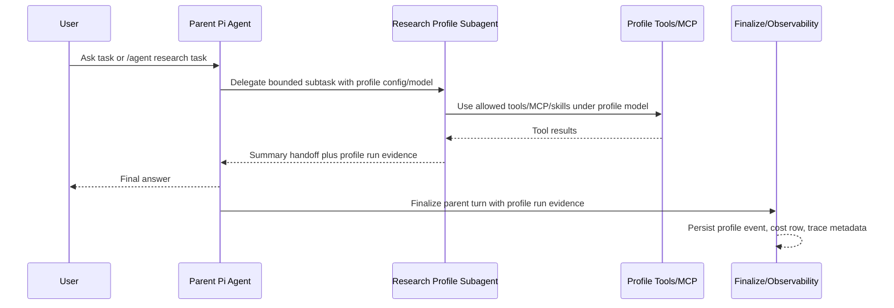

# Agent Profiles And Pi Subagent Model Stacking

## Problem

ThinkWork needs model stacking that enterprise customers can understand and
verify. The previous `TOOLS.md` / per-tool model-routing approach is the wrong
product boundary: raw tools and MCP calls are operations inside an agent loop,
not separate delegated workers with their own job, model, limits, and cost
story.

The new boundary is an **Agent Profile**: a configured, task-specialized Pi
subagent that runs inside the existing AgentCore parent turn. The parent can
delegate a bounded subtask to a profile such as Research, Coding, or Analyst;
the profile uses its own model and capability bundle; the parent receives a
summary handoff; Activity and Traces show the nested profile run with its own
model, tokens, cost, duration, status, and lane.

This plan builds from
`docs/brainstorms/2026-06-07-agent-profiles-pi-subagents-model-stacking-requirements.md`
and intentionally supersedes the tool-routing model-stacking plans.

## Scope

In scope:

- Add Settings -> Agents in the renamed `apps/web` application.
- Move the existing tenant Agent runtime/default model configuration out of
  Settings -> General and into Settings -> Agents.
- Add Agent Profile definition, persistence, GraphQL, and operator UI.
- Ship built-in Research, Coding, and Analyst profiles.
- Support global profiles with optional Space restrictions; no per-Space profile
  customization.
- Resolve active profile availability into AgentCore/Pi runtime config.
- Execute profiles as Pi subagents inside the existing AgentCore turn, not as
  separate AgentCore instances.
- Support parent auto-delegation and manual `/agent <profile> <task>`
  invocation.
- Ship v1 profile execution as foreground, bounded child work only. Background
  profile execution, resume/status polling, output files, chained delegation,
  and nested delegation are deferred.
- Persist profile-run observability and cost evidence.
- Render nested profile steps in Activity and preserve profile lanes in the
  existing multi-lane Trace UI.
- Retire `TOOLS.md` / per-tool model switching as the model-stacking product
  surface.

Out of scope:

- Separate AgentCore instances for delegated long-running jobs.
- Independent profile lifecycle, background job queueing, process supervision,
  or separate profile memory stores.
- Raw access to the generic `pi-subagents` control surface in the managed
  ThinkWork runtime.
- Hermes-style profile isolation beyond the configuration ideas explicitly used
  here.
- Per-Space profile edits.
- Per-raw-tool or per-specific-MCP-operation model switching.
- Manual production deployment outside the normal PR/merge/deploy pipeline.

## Requirements Trace

- R1-R3, AE1: Settings -> Agents exists, owns default Agent config, and includes
  Agent Profiles.
- R4, R7-R8, AE2: built-in Research, Coding, Analyst profiles include model,
  instructions, routing guidance, capability access, and execution controls.
- R5-R6, R14, AE3: profiles are globally defined and optionally restricted to
  Spaces; no Space assignments means available everywhere.
- R9-R12: profiles bundle instructions, model, skills, default tools, explicit
  tool additions, MCP server access, and limits. Raw tools/MCP operations are not
  the model-stacking boundary.
- R13-R15, AE4: parent Pi agent delegates to a profile subagent inside the same
  AgentCore thread/turn and receives summary-only handoff.
- R16-R17, AE5: natural-language delegation and the ThinkWork `/agent <profile>
<task>` alias invoke an available profile and fail clearly when unavailable,
  disabled, or unknown.
- R18-R22, AE4-AE6: Activity shows nested profile steps; Traces preserve
  profile lanes; raw tool/MCP calls remain inspectable as child details.
- R23-R24: profile editor is hybrid: structured settings for config and an
  editor/workspace path for richer instructions/context.

## Current-State Findings

- `apps/web` is the tracked settings app. Historical `apps/admin` and
  `apps/spaces` paths are obsolete and must not be targeted for this work.
- `apps/web/src/components/settings/SettingsGeneral.tsx` still contains
  `AgentConfigSection`. That component is the source to move to the new Agents
  page.
- `apps/web/src/components/settings/settings-nav.tsx` controls Settings nav
  entries and currently has no Agents item.
- `apps/web/src/lib/settings-queries.ts` holds the Settings GraphQL operations
  to extend for profiles.
- `packages/database-pg/graphql/types/agents.graphql` currently models one
  tenant-visible platform Agent and explicitly says sub-agents were workspace
  folders historically. Agent Profiles should be a new configuration domain, not
  durable rows in `agents`.
- `packages/database-pg/src/schema/agents.ts` has tenant agent config, model
  catalog, and legacy `agentSkills.model_override`. That legacy per-skill field
  should not become the model-stacking primitive.
- `packages/api/src/lib/resolve-agent-runtime-config.ts` is the central runtime
  config resolver. Profile availability and capability bundles should be
  resolved here so every AgentCore invocation sees the same contract.
- `packages/api/src/handlers/agents-runtime-config.ts` exposes the resolved
  runtime config to the AgentCore runtime.
- `packages/agentcore-pi/agent-container/src/server.ts` still carries
  `model_routing_policy`, `approved_model_ids`, `childModelCaller`, and
  `model_routed_tool_calls` from the old tool-routing plan.
- `packages/agentcore-pi/agent-container/src/server.ts` already supports a
  `DelegationProvider` and `createDelegationExtension()`.
- `packages/agentcore-pi/agent-container/tests/server.test.ts` already verifies
  delegation extension registration when a host supplies a `DelegationProvider`.
- `apps/web/src/components/settings/SettingsActivityExecutionTrace.tsx` already
  has a Git-like multi-lane UI for `sub_agent` tool invocation records, but much
  of its evidence plumbing is named around `model_routed_tool_call`.
- `packages/api/src/lib/chat-finalize/process-finalize.ts` already knows how to
  persist child model cost evidence and join it back to Activity. That pattern
  should be repurposed around profile runs instead of tool routes.
- `packages/api/src/graphql/resolvers/observability/threadTraces.query.ts` reads
  `cost_events` metadata into trace rows. Profile runs need explicit metadata
  fields so Trace lanes do not rely on prompt heuristics.
- `docs/solutions/architecture-patterns/runtime-swap-tool-parity-and-record-contract.md`
  is directly relevant: any runtime/profile work must keep tool availability and
  persisted tool invocation record shape stable.
- `docs/solutions/design-patterns/audit-existing-ui-and-data-model-before-parallel-build-2026-04-28.md`
  applies to Settings -> Agents: reuse existing Settings, Tools, MCP Servers,
  and Skills UI/data patterns rather than building parallel management surfaces.
- `pi-subagents` is a Pi package at `https://pi.dev/packages/pi-subagents`
  (package `pi-subagents`, version `0.28.0`, published June 3, 2026) describing
  parent Pi sessions delegating to focused child Pi sessions. Implementation
  should validate the exact API and supply-chain posture before integrating, but
  the product direction matches the origin requirements.
- The Pi package guidance describes a generic `subagent` tool, built-in agents
  that can inherit default model unless overridden, custom markdown agents with
  frontmatter, and controls such as `model`, `fallbackModels`, `thinking`,
  `tools`, `skills`, `extensions`, `inheritProjectContext`, `inheritSkills`,
  `defaultContext`, `maxSubagentDepth`, `maxExecutionTimeMs`, and `maxTokens`.
  ThinkWork should compile managed Agent Profile configuration into that shape
  only through a controlled adapter.
- The existing `DelegationProvider` / `createDelegationExtension()` path is a
  hosted managed-agent delegation seam, not the final Agent Profile seam. It can
  inspire tests or fallback mechanics, but profile execution needs its own
  `ProfileDelegationProvider` or equivalent wrapper contract.

## Technical Design

### Domain Model

Create an Agent Profile configuration domain separate from `agents`.

Minimum persistent shape:

- `agent_profiles`
  - `id`, `tenant_id`, `slug`, `name`, `description`
  - `routing_guidance`
  - `instructions`
  - `model_id`
  - `status` or `enabled`
  - `built_in_key` for Research/Coding/Analyst seeds
  - `tool_policy` JSON for default tools, explicit built-in tools, MCP server
    access, and any disabled defaults
  - `skill_policy` JSON or relation data for assigned skills
  - `execution_controls` JSON for thinking level, max runtime, token/cost
    budget, and future async/background flags. V1 enforces foreground-only
    execution regardless of stored future flags.
  - `created_at`, `updated_at`
- `agent_profile_space_assignments`
  - `profile_id`, `space_id`
  - Empty assignment set means global availability.

The implementation can normalize skills and MCP server access into join tables
if that matches resolver/test ergonomics, but the v1 invariant is clearer than
the storage detail: profile definition is global; Space assignment only controls
availability.

### Pi Profile Adapter Contract

ThinkWork workspace files remain the source of truth for profile configuration.
Settings -> Agents is a hybrid editor over those files: the normal form edits
structured frontmatter/managed sections, and advanced users can open the same
file in the workspace CodeMirror editor. Database rows may exist as indexed
projections for fast listing, filtering, and runtime resolution, but they must
be derived from workspace files rather than becoming the authored source.

The runtime adapter must prove and document this mapping before schema/UI work
locks in:

- `model_id` -> Pi `model` or an explicit per-run child model override.
- approved fallback models -> Pi `fallbackModels` only when all entries pass
  ThinkWork model approval.
- thinking setting -> Pi `thinking`.
- default tools, explicit built-in tools, and denied defaults -> Pi `tools`.
- assigned skills -> Pi `skills`.
- allowed extensions -> Pi `extensions`, restricted to reviewed allowlisted
  extensions.
- context mode -> Pi `inheritProjectContext`, `inheritSkills`, and
  `defaultContext`.
- max runtime -> Pi foreground `timeoutMs` / `maxRuntimeMs` and/or
  `maxExecutionTimeMs`, depending on the proven API.
- max tokens -> Pi `maxTokens`.
- cost budget -> ThinkWork-side policy and telemetry in v1, not assumed to be
  Pi-enforced until proven.

Authored Agent Profile files should live in the Agent workspace tree, for
example `Agent/agents/<profile-slug>.md` in the consolidated editor view
(`agents/<profile-slug>.md` relative to the Agent source). The runtime adapter
may also materialize generated Pi files in an isolated runtime directory such as
`.thinkwork/generated-pi-agents` or `.pi/agents` inside the container
workspace. The adapter/indexer must reject unrecognized frontmatter fields,
unapproved models/fallbacks, unapproved tools/extensions, unsafe output paths,
and prompt-supplied attempts to override model/tools/skills.

### Runtime Config Contract

Extend the resolved AgentCore runtime config with a bounded list of available
profiles for the active tenant/user/Space.

Each resolved profile should include:

- profile identity: id, slug, display name, built-in key
- model id and display metadata where useful
- model availability status for the invoking user/tenant, resolved against
  `modelCatalog` and existing user approval behavior
- routing guidance and instructions
- available skills
- effective default tools and explicit built-in tools
- effective MCP server grants for operator display, plus the compiled
  per-operation child-session allowlist the runtime will enforce
- execution controls
- availability metadata: global or Space-restricted

`packages/api/src/lib/resolve-agent-runtime-config.ts` remains the source of
truth. Avoid a UI-only or invoke-only profile resolver.

### Execution Contract

The parent turn runs in the existing AgentCore/Pi invocation. Profile execution
is a child Pi subagent/session inside that turn.

Directional flow:

Profile evidence should be returned by the runtime as a first-class collection,
for example `agent_profile_runs`, rather than overloading
`model_routed_tool_calls`. Each record should carry:

- `profileRunId`
- `profileId`, `profileSlug`, `profileName`
- `model`
- `status`
- `startedAt`, `finishedAt`, `durationMs`
- `inputTokens`, `outputTokens`, `cachedReadTokens`, `cachedWriteTokens`
- `costUsd`
- `parentRequestId` or parent `thread_turn_id`
- `handoffSummary`
- raw child `tool_invocations` or references to persisted details
- trace/lane metadata

Raw tool/MCP calls inside the child profile remain tool invocation records. They
do not get independent model override semantics.

### Managed Delegation Guardrails

Do not expose the raw generic `subagent` tool in the managed ThinkWork runtime.
Register a constrained ThinkWork tool such as
`delegate_to_agent_profile({ profileSlug, task })` that can only list and run
enabled, available profiles from the resolved runtime config.

V1 constraints:

- Force foreground execution: no `asyncByDefault`, background launch,
  status/resume polling, output files, or long-running supervision.
- Disable TUI clarification behavior (`clarify=false` or equivalent) so managed
  web/API calls do not block on an interactive prompt.
- Reject prompt/tool-input overrides for child model, tools, skills, MCP,
  extensions, context inheritance, output paths, timeout, or token caps.
- Validate profile model and fallback models against the model catalog and user
  approval before launch.
- Exclude child access to delegation by default. Set `maxSubagentDepth: 0` or
  the equivalent child-runtime cap unless a future design explicitly enables
  nested delegation.
- Cap concurrent profile runs per parent turn.
- Store child context and artifacts under tenant-scoped, encrypted storage with
  the same retention/deletion behavior as parent turn evidence.
- Redact secrets and PII before profile telemetry, child context excerpts, tool
  arguments, or artifacts are persisted.

### MCP Capability Contract

The product UI may grant MCP access at the server level for operator simplicity,
but the runtime compiler must enforce the actual operations available to the
child session.

Preferred v1 path:

- Reuse ThinkWork's existing MCP bridge/tool construction, including handle
  auth, tenant/user credential scoping, input/output scrubbing, and invocation
  record shape.
- Compile profile MCP grants into a child-session `toolWhitelist` /
  per-operation allowlist derived from the server's discovered tools.
- Bind child MCP calls to the invoking tenant and user credential scope.
- Disable generic discovery/proxy access to MCP servers unless explicitly
  granted through the compiled profile policy.
- Only adopt `pi-mcp-adapter` if the U0 spike proves it preserves ThinkWork's
  handle, credential, scrubber, and record-shape guarantees.

Tests must cover a profile allowed to use one MCP server operation and denied
from another operation on the same server.

### Manual Invocation

Support natural-language delegation as the primary path and `/agent <profile>
<task>` as a ThinkWork command alias that results in profile delegation. If Pi's
native `/run` command maps cleanly through the adapter, the web composer may
recognize it later, but `/agent` is the ThinkWork product surface.

The validation boundary should be server/runtime-side because availability
depends on tenant, profile status, and active Space. The web composer may add
autocomplete later, but v1 must work from plain message text.

Failure cases should produce clear user-facing errors before child execution:

- unknown profile
- disabled profile
- profile restricted away from the active Space
- empty delegated task

### Observability And Cost

Use existing persistence surfaces:

- `thread_turns.usage_json` for reload-safe profile run summaries and child tool
  invocation details.
- `thread_turn_events` for live and durable profile start/completion/error
  events.
- `cost_events` for billable profile LLM calls, using distinct request ids such
  as `${threadTurnId}:profile:${profileRunId}`.
- `cost_events.metadata` for profile fields: `source: "pi_agent_profile"`,
  `parent_request_id`, `profile_run_id`, `profile_id`, `profile_slug`,
  `profile_name`, `lane_key`, and any child tool summary needed by traces.

The parent turn total should include parent model cost plus profile subagent LLM
costs. Activity rows can show raw tools as inspectable operations, but customer
model-stacking proof should add up at the parent + nested profile level.

### UI Model

Settings -> Agents has two sections:

1. Default Agent
   - Move the existing runtime/default model settings from General.
   - Add a Capabilities section for the parent Agent's default tools, MCP
     servers, and skills. These controls edit the Agent workspace source files,
     not tenant-agent DB rows directly, so the parent capability envelope is
     visible in the same files the runtime reads.
   - Provide an advanced editor affordance that opens the underlying Agent
     workspace file in the Settings -> Workspace CodeMirror editor.
2. Agent Profiles
   - list ThinkWork built-in profiles Research, Coding, Analyst, and custom
     profiles
   - status, model, Space availability, tools/MCP/skills summary
   - create/edit profile editor
   - preset-first controls for enable/disable, model, Space availability, and
     concise capability summary
   - advanced controls for routing guidance, instructions, capabilities,
     execution controls, and Space availability
   - every profile has a corresponding workspace markdown file with frontmatter
     for structured fields and markdown body for richer instructions/context
   - an "open workspace/editor" path for richer profile instructions/context;
     the form and editor must round-trip the same file

ThinkWork built-in profile mapping:

- Research maps to a Pi researcher-style child agent or generated custom
  profile. It is selected for research/citation/current-information tasks and
  starts with web search/extract plus read-only MCP access where granted.
- Coding maps to a ThinkWork custom profile or a constrained parent-controlled
  chain if the adapter spike proves a chain is safe. Do not imply one Pi built-in
  agent owns Coding in v1.
- Analyst maps to a ThinkWork custom Pi profile for data interpretation,
  summarization, and structured analysis tasks.

Activity/Trace UI:

- In the parent thread conversation, use the Codex spawned-agents screenshot as
  the starting pattern: a lightweight collapsible "Delegated to N profiles" /
  "Spawned N agents" group with per-profile icon/color, profile name, role label,
  and truncated task/instruction preview.
- The conversation pattern is not the full trace. It should keep the parent
  "Working..." / "Worked for" thread readable while exposing that delegated
  profile work happened.
- Show a nested Agent Profile step in the parent turn timeline.
- Show model/tokens/cost/duration/status on the profile row.
- Preserve the existing multi-lane Trace UI by using explicit profile run/lane
  metadata rather than inferring sub-agents from old route records.
- Keep raw tool/MCP details expandable beneath the profile execution.
- Rename UI copy away from "MODEL ROUTING" when showing profile evidence.

## Implementation Units

### U0: Pi Profile Adapter Spike

Files:

- Inspect `packages/agentcore-pi/agent-container/src/server.ts`
- Inspect `packages/pi-runtime-core/src/*`
- Inspect `packages/pi-extensions/src/*`
- Add exploratory tests under
  `packages/agentcore-pi/agent-container/tests/agent-profile-adapter.test.ts`
- Add a short decision note under `docs/solutions/` if the outcome materially
  affects implementation

Approach:

- Install or inspect `pi-subagents` in an isolated local spike without changing
  production runtime behavior first.
- Prove one tenant profile can be materialized or passed as structured config
  and invoked as a child Pi session inside the existing AgentCore parent turn.
- Prove explicit child model selection, fallback model validation, tools,
  skills, MCP allowlisting, timeout, max tokens, and telemetry extraction.
- Decide whether to use package files/frontmatter, `agentOverrides`, a
  structured provider, or a ThinkWork wrapper around child Pi sessions.
- Define the production adapter contract before U1 schema/UI fields are frozen.

Test scenarios:

- A generated Research profile launches on its explicit model, not the parent
  model.
- Prompt-supplied model/tool/skill overrides are ignored or rejected.
- A child profile can use one allowlisted built-in tool and cannot use a denied
  one.
- A child profile can use an allowlisted MCP operation and cannot use a denied
  operation on the same server.
- Child profile telemetry can be extracted into the proposed
  `agent_profile_runs` shape for completed, timed out, interrupted, and
  resource-limit-exceeded outcomes.
- Raw credentials and tool secrets do not appear in extracted telemetry.

### U1: Agent Profile Workspace Files, Projection, And GraphQL

Files:

- Add Agent Profile workspace file parsing/serialization helpers
- Modify `packages/database-pg/src/schema/agents.ts` or add
  `packages/database-pg/src/schema/agent-profiles.ts` only for indexed
  projections of authored workspace files
- Modify `packages/database-pg/src/schema/index.ts`
- Add Drizzle migration under `packages/database-pg/drizzle/`
- Modify `packages/database-pg/graphql/types/agents.graphql` or add
  `packages/database-pg/graphql/types/agent-profiles.graphql`
- Modify `packages/api/src/graphql/resolvers/*`
- Modify `packages/api/src/graphql/schema.ts` if resolver registration requires
  it
- Modify `apps/web/src/lib/settings-queries.ts`
- Regenerate GraphQL/codegen outputs in API and web packages
- Test `packages/api/src/graphql/resolvers/agent-profiles.test.ts`
- Test `packages/database-pg/src/schema/agent-profiles.test.ts` if schema-level
  tests exist; otherwise cover constraints in API resolver tests

Approach:

- Define the Agent Profile file format. V1 uses markdown files under the Agent
  workspace, such as `agents/research.md`, with YAML-style frontmatter for
  structured fields (name, model, enabled, Space availability, tools, MCP
  servers, skills, execution controls) and the markdown body for instructions.
- Add projection tables only as derived/indexed state for fast listing,
  filtering, and runtime resolution.
- Seed ThinkWork built-in Research, Coding, and Analyst profile files for each
  tenant during bootstrap or first resolver access, matching existing
  tenant-agent workspace bootstrap conventions.
- Add GraphQL types for `AgentProfile`, `AgentProfileSpaceAssignment`,
  `AgentProfileToolPolicy`, and `AgentProfileExecutionControls`.
- Add queries for listing profiles, fetching one profile, and listing editor
  source data: model catalog, Spaces, skills, built-in tools, MCP servers.
- Add mutations or workspace-file operations to create, update, enable/disable,
  delete custom profiles, and update built-in profile settings without losing
  the built-in identity. The write path must write the profile workspace file
  first and then refresh any derived projection.
- Enforce tenant scoping and operator-only mutations.

Test scenarios:

- Listing profiles returns Research, Coding, and Analyst for a tenant with no
  existing rows.
- Creating a custom profile writes the workspace markdown file and refreshes the
  indexed projection for model, instructions, tool policy, skill policy,
  execution controls, and Space assignments.
- Updating a built-in profile can change model/status/policies in the
  frontmatter but cannot change its built-in key into a custom profile.
- A profile with no Space assignments is marked globally available.
- A profile with assigned Spaces is only available for those Space ids.
- Non-operators cannot mutate profile configuration.

### U2: Settings -> Agents Page And Profile Editor

Files:

- Add `apps/web/src/routes/_authed/settings.agents.tsx`
- Add `apps/web/src/components/settings/SettingsAgents.tsx`
- Modify `apps/web/src/components/settings/SettingsGeneral.tsx`
- Modify `apps/web/src/components/settings/settings-nav.tsx`
- Modify `apps/web/src/lib/settings-queries.ts`
- Reuse patterns from `apps/web/src/components/settings/SettingsTools.tsx`
- Reuse patterns from `apps/web/src/components/settings/SettingsMcpServers.tsx`
- Reuse patterns from `apps/web/src/components/settings/SettingsSkills.tsx`
- Test `apps/web/src/components/settings/settings-nav.test.ts`
- Test `apps/web/src/components/settings/SettingsAgents.test.tsx`

Approach:

- Add operator-only Settings nav item "Agents".
- Move `AgentConfigSection` from General into `SettingsAgents`.
- Update General header copy so it no longer claims agent runtime/default model
  configuration.
- Build an Agent Profiles section with a compact list and editor.
- Show each profile's model, status, Space availability, tools/MCP/skills
  summary, and execution limits.
- Make profile capability selectors reuse existing catalog data instead of
  duplicating management surfaces.
- Make the Default Agent capabilities section use the same selector pattern for
  parent default tools, MCP servers, and skills.
- Save structured profile/default-capability edits through the workspace-file
  API so they update the underlying Agent workspace files. Do not write profile
  or capability policy directly to tenant-agent DB rows from the UI.
- Add an advanced CodeMirror/editor affordance that opens the same underlying
  Agent workspace file used by the form. For profiles, this is the profile
  markdown file; for parent capabilities, this is the Agent map/capabilities
  file.
- Support built-in profiles as editable but not destructively removable; custom
  profiles can be deleted or disabled per product conventions.
- Add an "open workspace/editor" affordance for richer instructions/context, but
  keep structured profile settings in the Settings page.

Test scenarios:

- General no longer renders the default Agent config.
- Agents nav is visible to operators and hidden from non-operators.
- Settings -> Agents renders Default Agent and Agent Profiles sections.
- Built-in profiles appear with status, model, and capability summaries.
- Editing profile model, routing guidance, execution controls, and Space
  assignments writes the profile workspace file and refreshes the structured
  projection.
- Editing parent default tools, MCP servers, and skills writes the Agent
  workspace source file and is visible through the advanced editor path.
- Capability summaries distinguish default tools, explicit built-in tools, MCP
  servers, and skills.

### U3: Resolve Profiles Into AgentCore Runtime Config

Files:

- Modify `packages/api/src/lib/resolve-agent-runtime-config.ts`
- Modify `packages/api/src/handlers/agents-runtime-config.ts`
- Modify `packages/api/src/lib/mcp-configs.ts` if profile MCP server filtering
  needs a helper
- Modify related API GraphQL/codegen types as needed
- Test `packages/api/src/lib/resolve-agent-runtime-config.test.ts`
- Test `packages/api/src/handlers/agents-runtime-config.test.ts`

Approach:

- Load enabled profiles for the tenant.
- Filter profiles by active Space: unassigned profiles are global; assigned
  profiles require the invocation Space id to match.
- Compile each profile's effective capabilities:
  - platform default safe tools
  - explicit built-in tools
  - MCP servers granted by profile for display
  - per-operation MCP allowlists enforced by the child runtime
  - assigned skills
  - disabled defaults, if supported
- Keep raw tool/MCP operation names out of the model-stacking product boundary,
  while still compiling operation allowlists for runtime enforcement.
- Include profile config in the runtime payload as `agent_profiles`.
- Preserve existing tenant agent model, user-approved model, and composer model
  behavior for the parent agent.

Test scenarios:

- Runtime config includes Research when it has no Space assignments.
- Runtime config excludes Coding when the current Space is not assigned.
- Runtime config includes Coding when the current Space is assigned.
- Profile MCP access displays by server id/name but compiles into operation
  allowlists.
- Parent tenant-agent runtime config remains unchanged when no profiles are
  enabled.
- Disabled profiles are excluded from runtime config and slash invocation.
- Profiles whose configured model is missing from the model catalog or not
  approved for the invoking user are excluded or fail with a clear validation
  error, rather than silently falling back to the parent model.

### U4: Pi Subagent Execution And Slash Invocation

Files:

- Modify `packages/agentcore-pi/package.json` if integrating `pi-subagents`
- Modify `packages/agentcore-pi/agent-container/src/server.ts`
- Add or modify profile helpers under
  `packages/agentcore-pi/agent-container/src/`
- Modify `packages/pi-runtime-core/src/*` if the shared loop/result contract
  must expose profile runs
- Modify `packages/pi-extensions/src/*` if the profile delegation extension
  belongs in the extension package
- Test `packages/agentcore-pi/agent-container/tests/server.test.ts`
- Test `packages/agentcore-pi/agent-container/tests/agent-profiles.test.ts`
- Test `packages/agentcore-pi/agent-container/tests/integration/tenant-isolation.test.ts`
  when profile execution touches session isolation

Approach:

- Inspect the exact `pi-subagents` package contract during implementation and
  prefer using it when it fits ThinkWork's managed AgentCore runtime.
- Before adding `pi-subagents` as a dependency, review its package manifest,
  transitive dependencies, runtime entry points, and managed-container behavior.
  Treat the Pi package page's security note seriously: packages can execute code
  and influence agent behavior.
- If `pi-subagents` cannot be used directly because it assumes local CLI/TUI
  behavior, adapt the same Pi child-session pattern through a new
  `ProfileDelegationProvider` / `delegate_to_agent_profile` wrapper. Do not
  reuse the existing hosted `DelegationProvider` as-is.
- Add a constrained profile delegation tool/extension that the parent model can
  call for auto-delegation.
- Parse `/agent <profile> <task>` into an explicit profile delegation request
  before or inside the runtime loop, while preserving normal chat history.
- Launch the profile as a child Pi subagent using the profile model,
  instructions, capability bundle, and execution controls.
- Return only the handoff summary to the parent by default.
- Return first-class `agent_profile_runs` evidence in the runtime response.
- Force v1 profile runs to foreground execution and disable nested delegation.
- Stop using `TOOLS.md`, `model_routing_policy`, and
  `model_routed_tool_calls` as the model-stacking path. Keep compatibility only
  where needed for old data/tests until explicitly removed.

Test scenarios:

- Runtime registers profile delegation only when `agent_profiles` are present.
- Runtime does not register the raw generic `subagent` tool in managed mode.
- Parent auto-delegation can invoke the Research profile with its configured
  model and tool bundle.
- `/agent research find source X` invokes Research when available.
- `/agent coding ...` fails clearly when Coding is restricted away from the
  active Space.
- Profile child run uses the profile model, not the parent composer model.
- Profile child run refuses execution when the profile model is not approved for
  the invoking user/tenant.
- Profile child run can use granted built-in tools and MCP servers.
- Profile child run cannot use an ungranted MCP operation on an otherwise
  granted MCP server.
- Prompt-supplied model/tool/skill overrides are rejected.
- Raw tool calls inside the profile do not create independent model override
  records.
- Profile execution returns a summary handoff plus `agent_profile_runs`
  telemetry.
- Timed out, interrupted, and resource-limit-exceeded child runs return durable
  status evidence.
- Tenant/session isolation holds for a child profile subagent.

### U5: Finalize, Cost, Activity Events, And Trace Metadata

Files:

- Modify `packages/api/src/lib/chat-finalize/types.ts`
- Modify `packages/api/src/lib/chat-finalize/process-finalize.ts`
- Modify `packages/api/src/handlers/chat-agent-activity.ts` if live profile
  events need new normalized payloads
- Modify `packages/api/src/graphql/resolvers/triggers/threadTurns.query.ts`
- Modify `packages/api/src/graphql/resolvers/observability/threadTraces.query.ts`
- Modify `packages/database-pg/graphql/types/observability.graphql`
- Modify `apps/web/src/lib/graphql-queries.ts`
- Test `packages/api/src/lib/chat-finalize/process-finalize.test.ts`
- Test `packages/api/src/graphql/resolvers/triggers/threadTurns.query.test.ts`
- Test `packages/api/src/graphql/resolvers/observability/threadTraces.query.test.ts`

Approach:

- Extend `FinalizePayload.response` with `agent_profile_runs`.
- Persist profile run summaries into `thread_turns.usage_json`.
- Record profile start/completion/error events in `thread_turn_events`.
- Record profile LLM costs in `cost_events` with unique request ids and explicit
  profile metadata.
- Include profile subagent costs in `ThreadTurn.totalCost`.
- Extend `TraceEvent` with profile fields such as `profileRunId`,
  `profileId`, `profileSlug`, `profileName`, and `laneKey`.
- Keep raw child tool calls inspectable from persisted usage records.
- Avoid double-counting: parent cost, profile child LLM cost, and external tool
  costs should remain separate cost rows with clear metadata.
- Store child artifacts/context excerpts only after applying tenant/user scoped
  redaction and retention rules.

Test scenarios:

- Finalize with one Research profile run persists usage JSON and a profile
  completion event.
- Finalize records a profile cost event with profile metadata and parent request
  linkage.
- Activity turn total includes parent cost plus profile child LLM cost.
- `threadTraces` returns profile metadata for profile cost rows.
- Raw tool calls inside a profile remain present in usage JSON details.
- Replayed/idempotent finalize does not duplicate profile cost rows or events.
- Timeout, interruption, and resource-limit outcomes persist with distinct
  profile statuses and do not disappear from Activity/Traces.
- Raw credentials, MCP tokens, and tool secrets are absent from persisted
  profile metadata and trace payloads.

### U6: Activity Nested Profile Step And Multi-Lane Trace UI

Files:

- Modify `apps/web/src/components/settings/SettingsActivityExecutionTrace.tsx`
- Modify `apps/web/src/components/settings/SettingsActivityThreadDetail.tsx`
- Modify `apps/web/src/lib/settings-activity.ts` if formatting helpers need
  profile-aware labels
- Test `apps/web/src/components/settings/SettingsActivityThreadDetail.test.tsx`
- Test `apps/web/src/components/settings/SettingsActivityExecutionTrace.test.tsx`

Approach:

- Rename the UI evidence concept from model routing to profile execution where
  profile records are shown.
- Add the lightweight parent conversation rendering for delegated profiles based
  on the Codex spawned-agents pattern: collapsible group, profile icon/color,
  profile name, role label, and task preview.
- Add a nested Agent Profile step row inside the parent turn timeline.
- Show model, tokens, cost, duration, and status on the profile row.
- Expand profile details to show handoff summary, child model evidence, and raw
  child tool/MCP calls.
- Use explicit `laneKey` / profile run metadata to place child events in the
  existing multi-lane Trace UI.
- Keep old tool invocation rows usable for historical data, but do not label
  profile behavior as `not routed`.

Test scenarios:

- Activity detail renders Research as a nested profile step with model, tokens,
  cost, duration, and completed status.
- Parent conversation rendering shows delegated profile rows without forcing the
  user into the Trace UI.
- Expanding the Research step shows handoff summary and child tool calls.
- Trace UI renders a Research lane using profile metadata.
- A turn with no profile runs continues to render the parent/tool timeline.
- Historical `model_routed_tool_call` records do not break rendering, but new
  profile records prefer profile labels.

### U7: End-To-End Demo Fixtures, Docs, And Rollout Proof

Files:

- Modify `docs/solutions/model-stacking-tools-md-routing-2026-06-06.md`
- Add `docs/solutions/agent-profiles-pi-subagent-model-stacking-2026-06-07.md`
- Add or update E2E fixtures under the existing API/runtime test structure
- Update the PR description checklist for visual/browser proof when shipping
  this feature

Approach:

- Mark the `TOOLS.md` model-routing solution as superseded for model stacking.
- Document the Agent Profiles mental model and how to inspect profile cost
  evidence.
- Create a local/demo validation path:
  - configure Research on a cheaper model
  - ask parent a research task
  - parent delegates Research
  - parent summarizes Research handoff
  - Activity shows nested Research cost
  - Traces show Research lane
- Keep the old tool tracking regressions in mind, but move customer proof to
  parent/profile cost attribution.

Test scenarios:

- Fresh web research task delegates to Research and records a profile run.
- Activity shows parent cost and nested Research cost.
- Trace view shows parent lane plus Research lane.
- Raw `web_search` / `web_extract` calls remain inspectable under Research.
- `/agent analyst summarize this thread` works when Analyst is available.
- `/agent coding ...` fails clearly in a Space where Coding is unavailable.

## Sequencing

1. U0 proves the Pi adapter contract before product/schema fields are frozen.
2. U1 establishes the durable Agent Profile configuration domain.
3. U2 gives operators a place to configure profiles and moves default Agent
   settings out of General.
4. U3 compiles profile availability and capability bundles into runtime config.
5. U4 makes profiles executable as Pi subagents and retires tool routing as the
   model-stacking path.
6. U5 persists profile evidence and cost attribution.
7. U6 makes that evidence visible in Activity and Traces.
8. U7 documents the new model and records the customer-demo validation path.

U1-U3 can be implemented as separate PRs if needed. U4-U6 are tightly coupled:
do not claim the feature is demo-ready until runtime execution, finalize
persistence, and Activity/Trace rendering have passed together on a fresh turn.

## Verification Plan

Focused checks:

- `pnpm --filter @thinkwork/database-pg typecheck`
- `pnpm --filter @thinkwork/api typecheck`
- `pnpm --filter @thinkwork/agentcore-pi typecheck`
- `pnpm --filter @thinkwork/web typecheck`
- `pnpm --filter @thinkwork/api exec vitest run src/graphql/resolvers/agent-profiles.test.ts`
- `pnpm --filter @thinkwork/api exec vitest run src/lib/resolve-agent-runtime-config.test.ts`
- `pnpm --filter @thinkwork/api exec vitest run src/lib/chat-finalize/process-finalize.test.ts`
- `pnpm --filter @thinkwork/agentcore-pi exec vitest run agent-container/tests/agent-profiles.test.ts`
- `pnpm --filter @thinkwork/agentcore-pi exec vitest run agent-container/tests/agent-profile-adapter.test.ts`
- `pnpm --filter @thinkwork/web exec vitest run src/components/settings/SettingsAgents.test.tsx`
- `pnpm --filter @thinkwork/web exec vitest run src/components/settings/SettingsActivityThreadDetail.test.tsx`

Broader checks before PR merge:

- `pnpm --filter @thinkwork/database-pg codegen`
- `pnpm --filter @thinkwork/api codegen`
- `pnpm --filter @thinkwork/web codegen`
- `pnpm --filter @thinkwork/api test`
- `pnpm --filter @thinkwork/agentcore-pi test`
- `pnpm --filter @thinkwork/web test`

Manual/browser proof for the demo:

- Start the local web dev server with the current `.env`.
- Open Settings -> Agents and verify Default Agent plus Research/Coding/Analyst
  profiles.
- Configure Research to use a cheaper approved model and grant web tools.
- In a Space where Research is available, ask a research-heavy question.
- Verify the parent answer includes a Research handoff.
- Open Settings -> Activity -> Thread Detail for the fresh turn.
- Verify the parent turn shows a nested Research profile step with model,
  tokens, duration, cost, and status.
- Expand the Research step and verify raw web/MCP tool calls remain inspectable.
- Open Traces and verify the Research lane appears with profile cost metadata.
- Try `/agent research <task>` and verify explicit invocation.
- Try a restricted profile in an unavailable Space and verify a clear failure.
- Verify the parent conversation shows a lightweight delegated-profile group
  before opening the detailed Trace UI.

## Risks

- **Pi package fit.** `pi-subagents` may assume local CLI/TUI affordances that do
  not map directly to managed AgentCore. Mitigation: validate package API in U0
  and adapt through a ThinkWork `ProfileDelegationProvider` / child-session
  wrapper if direct install is unsafe.
- **Third-party package safety.** `pi-subagents` is external code that can
  influence agent behavior. Mitigation: inspect package source, manifest,
  transitive dependencies, and runtime side effects before adding it to the
  managed container; pin the exact version; block runtime package installs;
  require lockfile, license, audit, and rollback/kill-switch review for
  dependency changes; prefer a small ThinkWork wrapper over direct install if
  the package does more than the managed runtime needs.
- **Raw subagent bypass.** Exposing generic Pi subagent creation could bypass
  tenant policy, profile approval, or observability. Mitigation: expose only the
  constrained ThinkWork delegation wrapper in managed mode.
- **MCP overgranting.** Granting an MCP server by name can expose more operations
  than intended. Mitigation: compile server-level UI grants into operation
  allowlists and test denied operations on granted servers.
- **Context/artifact leakage.** Child sessions can persist sensitive prompt,
  tool, or artifact data. Mitigation: default child context to fresh/minimal,
  redact secrets/PII before persistence, encrypt tenant-scoped storage, and test
  that credentials never appear in traces.
- **Model approval bypass.** A globally configured profile could accidentally
  use a model that a user is not approved to run. Mitigation: resolve profile
  model availability through the same model catalog/user approval path used for
  composer models and fail clearly when unavailable.
- **Cost double-counting.** Parent and profile LLM costs can be counted twice if
  profile child calls are also folded into parent usage. Mitigation: store
  profile cost rows as separate request ids with explicit metadata and add tests
  for Activity totals.
- **Trace inference drift.** Existing Trace lane behavior can infer branches from
  prompt/log shape. Mitigation: use explicit `profile_run_id` / `lane_key`
  metadata for profile lanes.
- **Capability mismatch.** Profiles can appear configured for tools/MCP/skills
  the runtime does not actually register. Mitigation: apply the runtime tool
  parity checklist from
  `docs/solutions/architecture-patterns/runtime-swap-tool-parity-and-record-contract.md`.
- **Settings duplication.** A full profile editor could duplicate Skills, MCP
  Servers, and Built-in Tools pages. Mitigation: Settings -> Agents selects
  access to existing resources; it does not become the management UI for those
  resources.
- **Demo incompleteness.** A partial PR that only adds Settings or only adds
  runtime delegation will not satisfy the customer proof. Mitigation: treat U4-U6
  as the demo readiness gate.

## Open Implementation Questions

- Which `pi-subagents` APIs are safe to use inside the managed AgentCore runtime,
  and which should be adapted through local ThinkWork wrappers?
- Whether U0 proves generated custom-agent files/frontmatter or a structured
  provider as the safer production materialization path.
- Which execution controls are enforceable immediately by Pi and which must be
  displayed as disabled/future until runtime support exists?
- The exact section/file names for parent Agent capability policy, as long as
  the source is authored in the Agent workspace and visible through Settings ->
  Workspace.
- Whether derived profile projections use normalized join tables or JSON
  policies. The plan permits either as long as they are derived from workspace
  files and GraphQL/runtime config expose the same behavior.

## Done Criteria

- Settings -> Agents exists in `apps/web` and owns default Agent configuration.
- Default Agent capabilities for parent tools, MCP servers, and skills are
  editable in Settings -> Agents and persist to Agent workspace files.
- Research, Coding, and Analyst profiles are present and configurable.
- Profile forms and the advanced CodeMirror workspace editor round-trip the same
  profile markdown files.
- Profile Space availability works for global and restricted profiles.
- Parent auto-delegation and `/agent <profile> <task>` execute profiles as Pi
  subagents inside the existing AgentCore turn.
- Managed runtime exposes only the constrained ThinkWork profile delegation
  wrapper, not the raw generic subagent tool.
- Profile model/capability bundle is honored during child execution.
- Profile MCP server grants compile to enforceable child-session operation
  allowlists.
- Finalize persists profile run evidence and child profile cost.
- Activity shows nested profile steps with model/tokens/cost/duration/status.
- Traces show profile lanes with explicit profile metadata.
- Parent conversation shows delegated profile work using the lightweight
  spawned-agents-style group.
- Raw tool/MCP calls remain inspectable as child details.
- The old `TOOLS.md` model-routing direction is documented as superseded.
- A fresh local/browser E2E validates the customer demo scenario.
