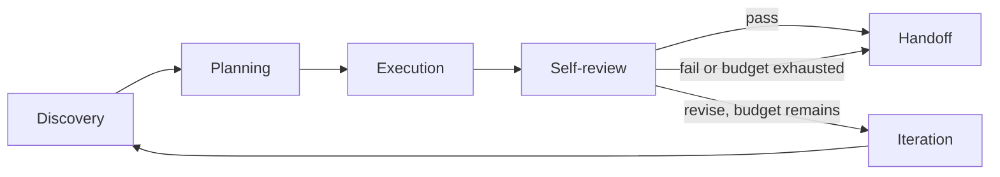
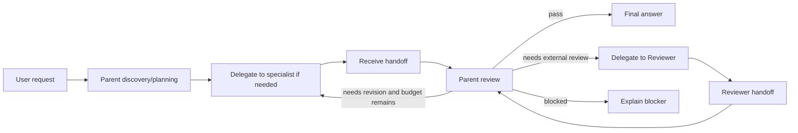

# Agent Profile Closed Loops

## Problem

ThinkWork Agent Profiles now provide the right model-stacking boundary:
specialized Pi child sessions run inside the parent AgentCore turn with their
own model, capability bundle, telemetry, and Activity lane. The current
orchestration is still too linear and prompt-shaped for the next product
requirement. A parent Agent can delegate to Research and then Reviewer, but the
system does not yet have a first-class closed-loop contract for discovery,
planning, execution, review, iteration, and final answer ownership.

The new behavior should treat the parent Agent as the orchestrator and each
Agent Profile as a specialist that owns a bounded internal loop. The parent
delegates work, receives structured handoffs, reviews those handoffs, retries or
escalates when necessary, and only then sends the user-facing response. Reviewer
is an optional escalation or explicit quality-gate profile, not the default
author of the user response.

This plan builds from
`docs/brainstorms/2026-06-08-agent-profile-closed-loops-requirements.md` and
extends, rather than replaces, the Agent Profile plan in
`docs/plans/2026-06-07-002-feat-agent-profiles-pi-subagents-plan.md`.

## Scope

In scope:

- Define a closed-loop runtime contract for the parent Agent and each Agent
  Profile.
- Preserve the existing Agent Profile implementation boundary: child Pi sessions
  inside the existing AgentCore turn, not separate AgentCore instances.
- Add explicit loop policy and loop evidence to profile runs and parent turns.
- Make the parent Agent own final response synthesis for single-profile,
  multi-profile, automatic, and explicit `#Profile` flows.
- Support sequential specialist/reviewer orchestration in one turn, including
  retry with reviewer feedback when allowed by configured budgets.
- Keep Reviewer available as an Agent Profile and use it when explicitly
  requested or when a profile/parent policy requires an external review gate.
- Preserve Activity and Trace visibility for parent work, specialist lanes,
  reviewer lanes, retries, tokens, duration, cost, model badges, handoffs, and
  child tools.
- Expose operator controls for bounded review/iteration behavior in Settings ->
  Agents.
- Update automated and live verification so the “Research then Reviewer then
  parent answer” path is proven end to end.

Out of scope:

- Open-ended autonomous fleet loops with unbounded exploration.
- Parallel profile execution in v1. Parallel lanes remain a trace concept for
  future work; this plan targets sequential closed loops.
- Separate AgentCore instances or background jobs for long-running delegated
  work.
- Profile-to-profile delegation from inside child sessions. The parent remains
  the orchestrator.
- Mandatory external Reviewer on every turn. Review is always present as an
  internal parent/profile step; external Reviewer is policy-driven or
  explicitly requested.
- Manual deployment or production mutation outside the normal PR/merge/deploy
  pipeline.

## Requirements Trace

- R1-R2, F1, F4: Every Agent and Agent Profile follows
  Discovery -> Planning -> Execution -> Self-review -> Iteration -> Handoff or
  Final response.
- R3-R6, AE1: Agent Profiles run bounded internal loops and return structured
  handoffs with findings, evidence, confidence, and retry feedback.
- R7-R12, F2-F3, AE2-AE3: The parent Agent owns orchestration, final review,
  retry decisions, optional Reviewer delegation, and the final user response.
- R13-R15, AE4: Reviewer is a profile used as a quality gate or escalation; it
  returns a review handoff to the parent and never answers the user directly.
- R16-R18, AE5: Activity and Trace views show nested profile loops, reviewer
  loops, retries, child tools, tokens, cost, duration, and final parent decision
  without making sequential reviewer work look parallel.
- R19-R20: Operators can bound loop depth, retries, token/runtime/cost budgets,
  and failure behavior.

## Current-State Findings

- `@ramarivera/pi-goal` is a Pi extension/skill package, published June 7,
  2026, that adds persisted goals, `/goal` commands, model goal tools, hidden
  continuation pressure, goal lifecycle status, budget usage, model breakdown,
  and structured logs. It is relevant to ThinkWork's loop roadmap, especially
  for persisted/open or long-running goals, but it should be reviewed and
  adapted through ThinkWork's managed runtime boundary before production use.
- `packages/database-pg/src/schema/agent-profiles.ts` already stores
  `execution_controls` JSON and profile policies; this can carry loop controls
  without a relational redesign.
- `packages/database-pg/graphql/types/agents.graphql` already exposes
  `AgentProfile.executionControls` and `AgentProfileInput.executionControls`.
- `packages/api/src/graphql/resolvers/agent-profiles/built-in-agent-profiles.ts`
  defines built-in Research, Coding, Analyst, and Reviewer seeds. Reviewer
  already has `reviewGate: true` and `maxReviewLoops: 2`.
- `packages/api/src/lib/agent-profile-workspace-files.ts` already serializes and
  parses `reviewGate` and `maxReviewLoops`, which keeps the hybrid
  workspace-file/form editor path viable.
- `packages/api/src/lib/resolve-agent-runtime-config.ts` already normalizes
  `reviewGate` and `maxReviewLoops` into runtime profile config.
- `packages/agentcore-pi/agent-container/src/agent-profile-adapter.ts` already
  models `reviewGate`, `maxReviewLoops`, profile execution controls, and
  `AgentProfileRunEvidence`.
- `packages/agentcore-pi/agent-container/src/agent-profile-delegation.ts`
  launches child `runAgentLoop` sessions with narrowed tools/capabilities and a
  profile system prompt, but the prompt does not yet encode a durable loop
  contract or structured handoff/review schema.
- `packages/agentcore-pi/agent-container/src/server.ts` has an explicit
  multi-profile chain path for `#Research ... #Reviewer ...` and a separate
  single-profile fast path. The multi-profile path eventually runs the parent,
  but the single-profile path returns the profile handoff directly. Closed loops
  need one parent-owned orchestration path.
- `packages/agentcore-pi/agent-container/tests/server.test.ts` already covers
  sequential Research -> Reviewer -> parent final answer, providing a strong
  characterization baseline.
- `packages/api/src/lib/chat-finalize/process-finalize.ts` already collects
  `agent_profile_runs`, records profile cost evidence, and persists profile
  runs in `usage_json`.
- `apps/web/src/components/settings/SettingsActivityExecutionTrace.tsx` and
  `apps/web/src/components/settings/SettingsActivityThreadDetail.test.tsx`
  already render interleaved delegate/profile rows and model/cost evidence. The
  plan should refine this evidence shape rather than infer more from display
  ordering.
- `apps/web/src/components/workbench/TaskThreadView.tsx` already renders profile
  rows in the conversation “Worked for” area and will need the same loop
  semantics as Settings -> Activity.
- `docs/verification/agent-profiles-e2e.md` already captures the model-stacking
  proof; it needs a closed-loop section for Research + Reviewer in one turn and
  retry/fail behavior.

## Technical Design

### Closed-Loop Contract

Add a ThinkWork-owned loop contract that is separate from raw Pi tool calling.
The contract should be represented in runtime config, child run prompts, run
evidence, and UI timelines.

Each specialist run should follow this bounded loop:



The parent run should follow:



The runtime should not rely on the presence of `#Reviewer` text in the final
answer. Profile mentions are routing shortcuts; the parent receives structured
handoffs and synthesizes the answer.

### Loop Policy Shape

Use `execution_controls` as the storage/API vehicle, but normalize it into an
explicit runtime shape before AgentCore receives it.

Directional shape:

```ts
type AgentLoopPolicy = {
  mode: "closed";
  enabled: boolean;
  maxIterations: number;
  maxReviewLoops: number;
  reviewGate: boolean;
  externalReviewerPolicy: "never" | "explicit" | "profile_required" | "always";
  failBehavior: "return_blocker" | "best_effort_with_warning";
  maxRuntimeMs?: number;
  maxTokens?: number;
  costBudgetUsd?: number;
};
```

The exact TypeScript names can change during implementation, but the semantics
should remain stable:

- `maxIterations` bounds self-revision inside a parent/profile loop.
- `maxReviewLoops` bounds parent retry cycles after reviewer feedback.
- `reviewGate` means a profile or parent must produce review verdict evidence.
- `externalReviewerPolicy` determines when the Reviewer profile is invoked.
- `failBehavior` determines whether unresolved review failures block the final
  answer or produce an explicitly qualified answer.

### Relationship To Pi Goal

`@ramarivera/pi-goal` should inform this design in two layers:

1. **Immediate closed-loop profile turns.** Use the package's goal concepts as
   design input: objective, status, budget, elapsed time, model breakdown,
   completion audit, and continuation pressure. Do not directly expose `/goal`
   commands or generic model goal tools inside managed ThinkWork turns until the
   source and behavior are reviewed.
2. **Future open/long-running loops.** Treat `pi-goal` as a candidate adapter
   for persisted goals that survive context windows, recoverable provider
   errors, and multi-turn continuation. This likely belongs with the heavier
   long-running AgentCore job concept that was deferred from v1 Agent Profiles.

Implementation should add a small compatibility spike before adopting the
package directly:

- Review package source, manifest, dependency tree, lifecycle hooks, and log
  behavior.
- Verify whether goal state can be tenant-scoped and persisted through
  ThinkWork storage rather than local `~/.pi` state.
- Verify that hidden continuation pressure cannot bypass ThinkWork budgets,
  approval gates, or finalization semantics.
- Map package goal status/usage/model breakdown to ThinkWork Activity and
  cost-event evidence.
- Decide whether to install the package, vendor a constrained subset, or
  reimplement the goal-state contract in ThinkWork-owned code.

### Evidence Shape

Extend profile and parent turn evidence with explicit loop metadata so Activity
does not infer semantics from prompt text or row order.

Directional evidence:

```ts
type AgentLoopEvidence = {
  loopId: string;
  ownerType: "parent" | "profile";
  ownerSlug?: string;
  policy: AgentLoopPolicy;
  iterations: Array<{
    index: number;
    phase:
      | "discovery"
      | "planning"
      | "execution"
      | "self_review"
      | "iteration"
      | "handoff"
      | "final_review";
    status: "completed" | "revised" | "failed" | "skipped";
    summary?: string;
    verdict?: "pass" | "revise" | "fail";
    feedback?: string;
    startedAt?: string;
    finishedAt?: string;
  }>;
};
```

This evidence can be embedded in existing `agent_profile_runs` and turn
`usage_json.diagnostics` before any schema-specific trace API change is needed.
If implementation discovers the current GraphQL Activity payload cannot expose
it cleanly, add a focused field to `observability.graphql` rather than
overloading text previews.

### Orchestration Rules

- The parent Agent is always the final answer owner.
- Explicit `#Profile` mentions select specialists/reviewers but are stripped
  from profile tasks and user-visible final response text.
- A single explicit specialist should still return through the parent, not
  bypass parent synthesis.
- Multiple explicit profiles execute sequentially in mention order unless future
  policy explicitly marks them parallel.
- Reviewer runs after candidate work exists. It should appear after the
  specialist handoff in Activity, sharing a sequential continuation lane rather
  than visually splitting at turn start.
- Reviewer returns a verdict and feedback to the parent. The parent decides
  whether to answer, retry the original specialist with feedback, escalate, or
  report a blocker.
- Child profiles should not receive `delegate_to_agent_profile`; nested
  profile-to-profile delegation remains disabled.

## Implementation Units

### U1 — Normalize Loop Policy Through Agent Profile Config

Goal: make closed-loop controls explicit from storage through runtime config.

Files:

- `packages/database-pg/graphql/types/agents.graphql`
- `packages/database-pg/src/schema/agent-profiles.ts`
- `packages/api/src/lib/agent-profile-workspace-files.ts`
- `packages/api/src/lib/resolve-agent-runtime-config.ts`
- `packages/api/src/graphql/resolvers/agent-profiles/shared.ts`
- `packages/api/src/graphql/resolvers/agent-profiles/built-in-agent-profiles.ts`
- `packages/api/src/graphql/resolvers/agent-profiles/agentProfiles.resolver.test.ts`
- `packages/api/src/lib/agent-profile-workspace-files.test.ts`
- `packages/api/src/lib/__tests__/resolve-agent-runtime-config.test.ts`

Work:

- Define a normalized loop policy helper that reads existing
  `execution_controls` and fills conservative defaults.
- Preserve compatibility with existing `reviewGate` and `maxReviewLoops`.
- Update built-in Reviewer defaults to use the new policy shape while keeping
  the old fields readable during migration.
- Ensure workspace-file serialization keeps the loop policy portable in
  `Agent/agents/<slug>.md`.
- Regenerate GraphQL code in `apps/web`, `apps/mobile`, `apps/cli`, and
  `packages/api` if GraphQL source changes.

Tests:

- Profile workspace-file round trip preserves loop controls.
- Runtime config resolves loop policy defaults for Research/Coding/Analyst.
- Reviewer resolves with external review enabled and bounded retries.
- Invalid loop controls are rejected or normalized without leaking unsafe values
  into runtime config.

### U2 — Spike Pi Goal Compatibility And Goal State Mapping

Goal: determine whether `@ramarivera/pi-goal` should be installed, vendored, or
used only as design inspiration for ThinkWork loop state.

Files:

- `packages/agentcore-pi/agent-container/src/agent-profile-adapter.ts`
- `packages/agentcore-pi/agent-container/src/agent-profile-delegation.ts`
- `packages/agentcore-pi/agent-container/tests/agent-profile-adapter.test.ts`
- Add a spike note under `docs/solutions/` if direct package adoption is
  deferred.

Work:

- Inspect the package source and dependency tree before any runtime install.
- Compare `pi-goal` lifecycle/status/budget/model-breakdown concepts to the
  `AgentLoopPolicy` and `AgentLoopEvidence` contracts.
- Decide whether closed-loop in-turn execution should call the package, compile
  to a compatible goal state, or stay fully ThinkWork-owned.
- Document the decision and constraints for future open-loop/long-running goal
  work.

Tests:

- If no package code is installed, add contract tests proving ThinkWork goal
  state captures objective, budget, status, usage, and completion verdict.
- If a constrained adapter is installed, add tests proving tenant scoping,
  budget enforcement, no unauthorized continuation, and sanitized logs.

### U3 — Add Specialist Loop Prompt And Handoff Contract

Goal: make each Agent Profile run a bounded closed loop and return structured
handoff evidence.

Files:

- `packages/agentcore-pi/agent-container/src/agent-profile-adapter.ts`
- `packages/agentcore-pi/agent-container/src/agent-profile-delegation.ts`
- `packages/agentcore-pi/agent-container/tests/agent-profile-adapter.test.ts`
- `packages/agentcore-pi/agent-container/tests/agent-profile-delegation.test.ts`

Work:

- Extend the compiled profile run request with normalized loop policy.
- Update `profileSystemPrompt()` to require Discovery, Planning, Execution,
  Self-review, bounded Iteration, and Handoff.
- Require child runs to return a concise handoff that includes verdict-like
  review metadata when the policy requires it.
- Preserve the existing narrowed tool surface and `maxSubagentDepth: 0`.
- Attach loop evidence to `AgentProfileRunEvidence` without exposing raw chain
  of thought.

Tests:

- Child run receives loop policy, profile model, bounded runtime, and narrowed
  tools.
- Profile prompt includes the loop phases and forbids user-facing final answer
  ownership.
- Profile evidence records pass/revise/fail handoff metadata.
- Tool invocation redaction and MCP allowlist behavior still hold.

### U4 — Replace Special-Case Profile Chains With Parent-Owned Orchestration

Goal: route single-profile, multi-profile, automatic, and in-loop profile calls
through one parent-owned orchestration path.

Files:

- `packages/agentcore-pi/agent-container/src/server.ts`
- `packages/agentcore-pi/agent-container/tests/server.test.ts`

Work:

- Extract profile orchestration helpers from `server.ts` if needed to keep the
  handler readable.
- Remove the single-profile fast path that returns the profile handoff directly.
- Treat explicit and automatic profile selection as parent orchestration inputs.
- For explicit `#Research ... #Reviewer ...`, run Research, pass its handoff to
  parent review, run Reviewer after candidate work exists, then have the parent
  produce the final answer.
- Add bounded retry behavior: when Reviewer or parent review returns `revise`
  and budget remains, delegate back to the relevant specialist with feedback.
- Ensure profile mention stripping happens before profile tasks and final
  response synthesis.
- Preserve the existing `delegate_to_agent_profile` tool for cases where the
  parent model chooses to delegate during normal Pi tool use.

Tests:

- `#Research` alone still produces a final parent answer, not raw profile
  handoff.
- `#Research ... #Reviewer ...` calls Research, then Reviewer, then parent in
  that order.
- Reviewer never becomes the final assistant answer author.
- Reviewer `revise` triggers one bounded Research retry when policy allows it.
- Retry stops at `maxReviewLoops` and returns a clear blocker or qualified
  response according to policy.
- Automatic research routing still works when no explicit profile is mentioned.

### U5 — Persist Loop Evidence And Cost Totals

Goal: make loop evidence durable and keep total tokens/costs correct across
parent, specialist, reviewer, and retry work.

Files:

- `packages/api/src/lib/chat-finalize/types.ts`
- `packages/api/src/lib/chat-finalize/process-finalize.ts`
- `packages/api/src/lib/chat-finalize/process-finalize.test.ts`
- `packages/api/src/graphql/resolvers/observability/threadTraces.query.ts`
- `packages/api/src/graphql/resolvers/observability/threadTraces.query.test.ts`
- `packages/database-pg/graphql/types/observability.graphql` if trace payload
  fields need schema support.

Work:

- Extend finalize payload/profile-run normalization to carry `loopEvidence`.
- Add parent-loop evidence to `usage_json` alongside `agent_profile_runs`.
- Ensure parent turn usage totals include profile/reviewer/retry tokens as
  already done for costs.
- Record cost event metadata with loop owner, profile slug, iteration index, and
  reviewer role where applicable.
- Keep existing child tool invocation records inspectable under the owning
  profile run.

Tests:

- Finalize preserves parent and profile loop evidence in `usage_json`.
- Turn total token summary includes Research and Reviewer tokens.
- Turn total cost remains the sum of parent plus profile/reviewer costs.
- Trace rows include profile/reviewer loop metadata without duplicating tool
  costs.
- Idempotent finalize does not double-record loop cost evidence.

### U6 — Render Closed Loops In Activity, Traces, And Thread Conversation

Goal: make loop behavior visually match the product model: delegate, specialist
path, optional reviewer continuation, retry if needed, parent return.

Files:

- `apps/web/src/components/settings/SettingsActivityExecutionTrace.tsx`
- `apps/web/src/components/settings/SettingsActivityThreadDetail.tsx`
- `apps/web/src/components/settings/SettingsActivityThreadDetail.test.tsx`
- `apps/web/src/components/workbench/TaskThreadView.tsx`
- `apps/web/src/components/workbench/TaskThreadView.test.tsx`
- `apps/web/src/components/workbench/InlineShortcutText.tsx`
- `apps/web/src/components/workbench/InlineShortcutText.test.tsx`

Work:

- Render parent Agent loop rows with tokens in/out, duration, cost, and model or
  Mixed badge.
- Render profile loop rows with display model names and loop verdicts.
- Place each `delegate_to_agent_profile` row immediately before the profile lane
  it starts.
- For sequential Reviewer review, continue from the parent lane after Research
  completes; do not draw it as a parallel branch from the beginning of the turn.
- Show retry iterations as repeated specialist lanes or indented loop segments
  with clear feedback context.
- Keep profile shortcuts color-coded in user messages and titles without
  displaying raw `#`.

Tests:

- Activity row order is delegate -> Research path -> delegate -> Reviewer path
  -> parent response.
- Reviewer lane starts after Research returns, not at the top of the turn.
- Retry rows show the revision feedback and second specialist run.
- User-visible message/title formatting hides `#Research` / `#Reviewer` while
  preserving profile names.
- Thread conversation “Worked for” renders the same parent/profile/reviewer
  sequence as Settings -> Activity.

### U7 — Add Loop Controls To Settings -> Agents

Goal: let operators configure closed-loop bounds without editing JSON manually,
while preserving the workspace-file editor path.

Files:

- `apps/web/src/components/settings/SettingsAgents.tsx`
- `apps/web/src/components/settings/SettingsAgents.test.tsx`
- `apps/web/src/lib/settings-queries.ts`
- `apps/web/src/gql/graphql.ts`
- `apps/web/src/gql/gql.ts`

Work:

- Add a Loop / Review section to Agent Profile detail near Capabilities and
  Execution.
- Surface controls for enabled/closed mode, max iterations, review gate,
  external reviewer policy, max review loops, and failure behavior.
- Keep the form writing to `executionControls` so the workspace markdown stays
  the authored source.
- Preserve existing layout conventions from Settings -> Agents and Settings ->
  General.

Tests:

- Operator can save loop controls and refetch them.
- Built-in Reviewer displays review-gate defaults.
- Invalid numeric limits are blocked client-side or normalized server-side.
- Advanced markdown icon still opens the same `Agent/agents/<slug>.md` source.

### U8 — Update Verification And Institutional Docs

Goal: make the closed-loop behavior easy to validate before each release.

Files:

- `docs/verification/agent-profiles-e2e.md`
- `docs/solutions/agent-profiles-pi-subagent-model-stacking-2026-06-07.md`
- Add `docs/solutions/agent-profile-closed-loops-2026-06-08.md` after the work
  ships.

Work:

- Add a live verification scenario:
  `#Research find the current CEO of Stripe today and cite one source. Keep it
concise. Please use #Reviewer to verify.`
- Require validation that Research runs first, Reviewer runs second, parent
  answers last, and Activity totals include all work.
- Add a negative/retry scenario where Reviewer requests revision and the parent
  loops back to Research within budget.
- Document that external Reviewer is optional/policy-driven; internal
  self-review is always part of closed-loop work.

Tests:

- The runbook points to the focused unit/integration test commands.
- The runbook includes local `:5174` UI verification points and deployed
  post-merge checks.

## Sequencing

1. U1 first, because runtime and UI need one normalized loop policy.
2. U2 next, because `pi-goal` may affect whether goal state is package-backed,
   adapted, or ThinkWork-owned.
3. U3 next, because specialist loop evidence is the basis for orchestration.
4. U4 after U3, because parent retries and Reviewer sequencing depend on the
   specialist handoff contract.
5. U5 after U4, because finalize should persist the final evidence shape.
6. U6 after U5, because UI should render durable evidence rather than infer
   behavior from prompt text.
7. U7 can run after U1/U2 and in parallel with U3/U4 only if the policy shape has
   stabilized.
8. U8 last, after implementation and UI behavior are known.

## Risks And Mitigations

- **Prompt-only loop semantics drift.** Mitigate by normalizing loop policy and
  evidence in TypeScript, then using prompts only to explain the contract to Pi.
- **Reviewer accidentally answers the user.** Mitigate with tests that assert
  final assistant content comes from the parent path and reviewer output is a
  handoff.
- **Sequential work drawn as parallel lanes.** Mitigate with explicit
  parent/delegate/profile event ordering metadata and Activity tests.
- **Token/cost totals regress.** Mitigate with finalize tests that assert parent
  totals include profile/reviewer/retry usage.
- **Unbounded retry cost.** Mitigate with `maxIterations`, `maxReviewLoops`,
  runtime/token/cost budgets, and deterministic fail behavior.
- **Generic Pi goal continuation bypasses ThinkWork controls.** Mitigate by
  reviewing `@ramarivera/pi-goal` first and either adapting it behind
  ThinkWork's policy boundary or reimplementing only the safe goal-state
  contract.
- **Server handler complexity grows.** Mitigate by extracting profile
  orchestration helpers from `server.ts` once the shape is stable.
- **Workspace-file and DB projections drift.** Mitigate by keeping
  `agent-profile-workspace-files.ts` as the serialization boundary and testing
  round trips.

## Verification Strategy

Focused automated checks:

```bash
pnpm --filter @thinkwork/agentcore-pi exec vitest run agent-container/tests/agent-profile-delegation.test.ts agent-container/tests/server.test.ts
pnpm --filter @thinkwork/api exec vitest run src/lib/chat-finalize/process-finalize.test.ts src/graphql/resolvers/observability/threadTraces.query.test.ts
pnpm --filter @thinkwork/web exec vitest run src/components/settings/SettingsActivityThreadDetail.test.tsx src/components/workbench/TaskThreadView.test.tsx src/components/settings/SettingsAgents.test.tsx
```

Broader checks before PR merge:

```bash
pnpm --filter @thinkwork/agentcore-pi test
pnpm --filter @thinkwork/api test
pnpm --filter @thinkwork/web test
pnpm --filter @thinkwork/web typecheck
```

Live validation on `:5174` after the web app is running with `apps/web/.env`:

1. Open `http://localhost:5174/new`.
2. Send:
   `#Research find the current CEO of Stripe today and cite one source. Keep it
concise. Please use #Reviewer to verify.`
3. Confirm the thread conversation shows Research work, Reviewer review, and a
   final ThinkWork response from the parent Agent.
4. Open the Activity detail for the thread.
5. Confirm ordering:
   delegate -> Research lane/tools -> delegate -> Reviewer lane -> parent
   response.
6. Confirm tokens, cost, duration, model badges, and total turn tokens/costs
   include parent, Research, Reviewer, and any retries.
7. Run a retry fixture or prompt that causes Reviewer to request revision and
   confirm bounded retry behavior.

## Decisions And Execution-Time Unknowns

- External Reviewer is not mandatory for every turn. Default policy should be
  `explicit` or `profile_required`, not `always`. This preserves cost while
  allowing the product to prove review loops. A future customer setting can make
  it stricter.
- Internal self-review is mandatory for parent and profile loops. External
  Reviewer is an escalation/profile gate, not the only review mechanism.
- `@ramarivera/pi-goal` is a serious candidate for persisted goal lifecycle and
  open-loop continuation, but direct package adoption is an execution-time
  decision after source/security review.
- The exact structured handoff format remains an implementation detail: JSON,
  tagged text, or a validated object are all acceptable if the current Pi
  runtime can parse it reliably without exposing chain of thought.
- If UI needs richer Trace APIs, add narrow fields to observability rather than
  moving Activity to a new data source.

## Definition Of Done

- Parent and specialist closed-loop policies are normalized and test-covered.
- Research and Reviewer can both run in the same turn and the parent produces
  the final user response.
- Reviewer feedback can trigger a bounded retry.
- Activity and thread conversation render the loop sequence clearly and
  sequentially.
- Turn totals include parent, specialist, reviewer, and retry token/cost usage.
- Settings -> Agents exposes loop controls without breaking workspace-file
  editing.
- `docs/verification/agent-profiles-e2e.md` covers automated and local `:5174`
  verification for closed loops.
