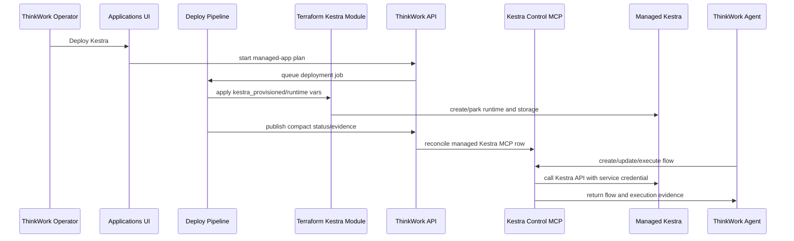

> Superseded by docs/plans/2026-06-12-001-feat-application-plugins-plan.md — Kestra was removed end-to-end (U1) in favor of the Application Plugin system.

# feat: Add Kestra as a Managed Application

## Overview

Add Kestra as an optional ThinkWork-managed application and register a
ThinkWork-owned Kestra control MCP server when the runtime is healthy. Operators
should deploy, park, inspect, repair, and destroy Kestra through the existing
Applications lifecycle. Agents should manage Kestra flows through a curated MCP
tool surface backed by a server-side tenant service credential, rather than
requiring users to log into Kestra and build flows manually.

V1 deliberately optimizes for an AWS-native ECS/Fargate managed orchestrator.
It should support Kestra flows that fit that runtime, but explicitly exclude
Docker-in-Docker, host Docker socket access, EC2 worker pools, Kubernetes, and
arbitrary container/script execution classes that Fargate cannot safely provide
(see origin: `docs/brainstorms/2026-06-08-kestra-managed-application-requirements.md`).

---

## Problem Frame

ThinkWork already has the managed-app path needed for this kind of feature:
Twenty CRM proved deploy/park/destroy state, release manifest descriptors,
deployment-runner adapters, public HTTPS app modules, compact deployment
status, app-specific settings pages, health smokes, and managed MCP
registration. Kestra should reuse that operating model, but with one important
difference: the managed MCP server is not a third-party OAuth connector. It is a
ThinkWork control plane wrapper that lets agents create, validate, update,
trigger, and inspect Kestra flows through audited tools.

The plan therefore has two coupled surfaces:

- A managed Kestra runtime deployed inside the customer's ThinkWork AWS stack.
- A ThinkWork control MCP endpoint registered into the tenant MCP registry and
  assigned to platform default agents when Kestra is running.

---

## Requirements Trace

- R1. Applications includes Kestra as an operator-managed application alongside
  Cognee and Twenty CRM.
- R2. Kestra deploy, park, redeploy, and destroy actions use the same
  deployment-job, approval, evidence, and smoke-check lifecycle as other
  managed applications.
- R3. Kestra exposes a managed HTTPS UI/API endpoint after deployment, with
  enough status for an operator to see URL, stage, region, service names, log
  groups, load balancer/target-group details, and health status.
- R4. Kestra uses a dedicated database and durable internal storage owned by the
  managed application, not the shared ThinkWork application schema.
- R5. Kestra v1 is optimized for an ECS/Fargate managed runtime using
  Postgres-backed repository/queue state and durable object/file storage.
- R6. Kestra must model retained/provisioned state separately from
  runtime-enabled state so parking can stop capacity without deleting customer
  orchestration state.
- R7. Kestra app images and deployment artifacts must be pinned or otherwise
  reviewable through the release-manifest flow before customer deployment.
- R8. Kestra health evidence must prove the public endpoint and API are usable,
  not only that Terraform applied successfully.
- R9. ThinkWork registers a system-managed MCP server for Kestra when the
  managed app is running.
- R10. The Kestra MCP server is a ThinkWork control wrapper over the customer's
  Kestra instance, not merely the public read-only Kestra catalog MCP.
- R11. The control MCP uses a ThinkWork-managed tenant service credential for
  v1, stored server-side and never exposed to browser, desktop, mobile, or
  agent prompt state.
- R12. MCP registration is idempotent across deploy, redeploy, and repair, and
  updates the target endpoint when the Kestra URL changes.
- R13. Parking Kestra disables active agent use of the managed MCP server while
  preserving the row and service credential continuity for redeploy.
- R14. Destroying Kestra removes the managed MCP row, runtime assignments, and
  app-owned service credential material.
- R15. The control MCP exposes curated orchestration tools for flow validation,
  create/update, execution trigger, execution status, log retrieval, namespace
  listing, and safe read-only inspection.
- R16. The control MCP constrains writes to ThinkWork-approved namespaces or
  ownership conventions so agents do not accidentally mutate arbitrary customer
  Kestra content.
- R17. The control MCP records enough audit context to connect agent requests,
  Kestra flow changes, executions, and returned evidence.
- R18. Agents may use the official public Kestra MCP/catalog as a read-only
  helper for plugin and Blueprint discovery, but state-changing operations must
  go through the ThinkWork control MCP.
- R19. A release proof must show a ThinkWork agent creating or updating a simple
  Kestra flow, triggering it, and returning execution evidence.
- R20. V1 explicitly excludes Docker-in-Docker, host Docker socket access, and
  arbitrary script/container task execution that Fargate cannot support safely.
- R21. The Kestra application page must communicate v1 execution limits so
  operators understand which orchestration patterns are supported.
- R22. Destructive destroy must communicate that Kestra flow definitions,
  execution history, internal storage, credentials, and managed MCP
  registration are removed.

**Origin actors:** A1 ThinkWork operator, A2 ThinkWork agent, A3 ThinkWork
platform, A4 customer stakeholder, A5 Kestra runtime.

**Origin flows:** F1 Deploy Kestra as a managed application, F2 Register the
ThinkWork Kestra control MCP, F3 Agent builds and runs an orchestration, F4 Park
or destroy Kestra.

**Origin acceptance examples:** AE1 Applications deploy/status, AE2 park keeps
MCP continuity, AE3 idempotent managed MCP reconciliation, AE4 agent
create/update/execute proof, AE5 unsupported Docker execution class, AE6 destroy
cleans app data and MCP registration.

---

## Scope Boundaries

- No Kubernetes, EKS, Docker Compose, GCP, or Azure deployment path in v1.
- No EC2 worker pool in v1.
- No Docker-in-Docker, host Docker socket mounting, or arbitrary container task
  execution in v1.
- No per-user Kestra auth in v1; agents use a tenant service credential through
  ThinkWork policy and audit.
- No broad pass-through MCP that exposes every Kestra API operation without
  ThinkWork guardrails.
- No custom end-user orchestration builder UI inside ThinkWork in v1.
- No promise that all Kestra plugins are supported on the managed Fargate
  runtime.
- No replacement for ThinkWork's native workspace orchestration primitive;
  Kestra is for customer workflow/DAG automation, not internal folder-addressed
  agent wakeups.

### Deferred to Follow-Up Work

- EC2 or split worker pool for Docker-capable Kestra task classes.
- Per-user Kestra identity and SSO.
- Rich ThinkWork orchestration authoring UI beyond the managed app settings and
  MCP agent path.
- Fine-grained per-Space Kestra namespace policy beyond the first approved
  namespace convention.

---

## Context & Research

### Relevant Code and Patterns

- `docs/brainstorms/2026-06-08-kestra-managed-application-requirements.md`
  defines the product scope, identity model, and v1 execution boundary.
- `docs/brainstorms/2026-06-05-twenty-crm-managed-application-requirements.md`
  and `docs/plans/2026-06-05-003-feat-twenty-crm-managed-app-plan.md` are the
  closest managed-app lifecycle precedent.
- `docs/plans/2026-06-06-003-feat-twenty-crm-mcp-oauth-plan.md` and
  `docs/solutions/architecture-patterns/managed-app-mcp-oauth-lifecycle-2026-06-06.md`
  establish the separation between managed application lifecycle and managed MCP
  registration.
- `packages/deployment-runner/src/apps/registry.ts`,
  `packages/deployment-runner/src/apps/twenty.ts`, and
  `packages/deployment-runner/src/shared.ts` define the managed-app adapter
  contract and currently restrict app keys to `cognee | twenty`.
- `terraform/modules/app/twenty` provides the public HTTPS app-module pattern:
  ECS/Fargate services, ALB, CloudWatch logs, EFS, ElastiCache where needed,
  secret injection, parking via desired count zero, and Terraform outputs.
- `terraform/modules/thinkwork/main.tf`, `variables.tf`, and `outputs.tf` wire
  managed apps into the composite registry-shaped module.
- `scripts/release/build-release-manifest.ts` lists managed app descriptors and
  release smoke contracts.
- `packages/api/src/graphql/resolvers/core/managedApplications.ts` reads compact
  Lambda environment status for Cognee/Twenty and emits the unified
  `managedApplications` list.
- `packages/api/src/lib/managed-mcp-applications.ts` owns Twenty managed MCP
  state, idempotent reconciliation, parking disablement, destroy cleanup, and
  platform default agent assignment.
- `packages/database-pg/src/schema/mcp-servers.ts` already models
  `management_source`, `managed_application_key`, tenant MCP rows, assignments,
  and user token records.
- `packages/api/src/lib/mcp-configs.ts` resolves tenant MCP rows into runtime
  config. It currently handles `tenant_api_key` by reading a token from
  `auth_config`, so this plan needs a secret-reference hardening before Kestra
  service credentials ship.
- `packages/lambda/admin-ops-mcp.ts` is a Lambda-backed stateless MCP server
  pattern using JSON-RPC `initialize`, `tools/list`, and `tools/call`.
- `packages/api/src/lib/mcp-client-call.ts` is the server-side JSON-RPC client
  pattern for testing/calling streamable HTTP MCP servers without adding the MCP
  SDK to `packages/api`.
- `apps/web/src/components/settings/SettingsCrm.tsx`,
  `apps/web/src/components/settings/SettingsCogneeApplication.tsx`, and
  `apps/web/src/components/settings/managed-applications/*` are the Applications
  and detail-page UI patterns to extend.
- `scripts/smoke/twenty-managed-app-smoke.mjs` and
  `scripts/smoke/twenty-mcp-oauth-smoke.mjs` are the smoke proof shapes to copy:
  dry-run by default, optional live mode, Terraform/API status correlation, and
  evidence attachment.

### Institutional Learnings

- `docs/solutions/architecture-patterns/managed-app-mcp-oauth-lifecycle-2026-06-06.md`
  says managed apps and MCP connectors are coupled but separate state machines.
  Parking disables active use but preserves continuity; destroy removes rows and
  secrets.
- `docs/solutions/workflow-issues/deploy-silent-arch-mismatch-took-a-week-to-surface-2026-04-24.md`
  argues for real post-deploy smoke checks because green Terraform does not
  prove a multi-component app is alive.
- `docs/solutions/patterns/mcp-custom-domain-setup-2026-04-23.md` notes that
  custom domains and Terraform variables are passed explicitly through CI and
  need careful Cloudflare/ACM handling.
- `docs/solutions/best-practices/oauth-client-credentials-in-secrets-manager-2026-04-21.md`
  reinforces that credential material should live in Secrets Manager, with only
  references in runtime/config surfaces.

### External References

- Kestra installation docs: `https://kestra.io/docs/installation`
- Kestra Docker Compose install docs: `https://kestra.io/docs/installation/docker-compose`
- Kestra configuration docs: `https://kestra.io/docs/configuration`
- Kestra basic authentication migration docs:
  `https://kestra.io/docs/migration-guide/v0.24.0/basic-authentication`
- Kestra Terraform provider docs: `https://kestra.io/docs/terraform`
- Kestra MCP announcement:
  `https://kestra.io/blogs/2026-04-30-kestra-mcp-plugins-blueprints`

---

## Key Technical Decisions

- **Extend the managed-app registry, do not create a Kestra-only deployment
  path:** Kestra should become the third `ManagedAppKey` and use the same
  deployment-runner, release manifest, deploy job, approval, evidence, and
  status surfaces as Cognee/Twenty.
- **Use a retained/runtime split:** Mirror Twenty with `kestra_provisioned` and
  `kestra_runtime_enabled`, so a park action can stop ECS capacity while keeping
  flow definitions, execution history, storage, credentials, and MCP continuity.
- **Use ECS/Fargate for v1:** Start with a public ALB and Fargate services. The
  plan should not introduce EC2 workers merely to support unsupported Docker task
  classes.
- **Use Postgres plus durable object/file storage:** Kestra should use a
  dedicated database/role on the existing Aurora/Postgres instance and managed
  durable storage owned by the app module. The exact storage mode is deferred to
  implementation research inside the Terraform unit because it depends on the
  Kestra configuration chosen.
- **Treat Kestra UI/API auth as app infrastructure:** OSS basic auth protects
  the Kestra endpoint. The credential is a tenant service credential in Secrets
  Manager, not a user OAuth credential.
- **Build a ThinkWork control MCP:** The MCP row should point to a ThinkWork
  Lambda/API endpoint that exposes curated Kestra tools. The control MCP should
  call the customer Kestra API server-side using a secret reference.
- **Keep two credential boundaries:** The Kestra UI/API basic-auth credential is
  the app service credential used only by the control MCP to call Kestra. The MCP
  bearer/API key is a separate ThinkWork credential used by agents/runtime to
  call the control MCP. Both should be stored as Secrets Manager references, and
  neither should be stored as plaintext in `tenant_mcp_servers.auth_config`.
- **Harden tenant API key runtime auth before Kestra uses it:** Existing
  `tenant_api_key` support can carry plaintext tokens in `auth_config`. Kestra
  needs a server-side secret-reference path so app service credentials are not
  copied into DB JSON, GraphQL results, browser state, or prompts.
- **Keep the public Kestra catalog MCP read-only:** It can help agents discover
  plugins and Blueprints, but any state-changing operation must go through the
  ThinkWork control MCP.

---

## Open Questions

### Resolved During Planning

- **Should v1 use per-user Kestra auth?** No. Use a tenant service credential
  stored server-side and enforce namespace/audit policy in ThinkWork.
- **Should v1 target EC2 workers for Docker/script-heavy workloads?** No. Use an
  ECS/Fargate managed orchestrator and explicitly communicate unsupported Docker
  execution classes.
- **Should ThinkWork register only Kestra's public MCP?** No. Register a
  ThinkWork control MCP for customer-instance operations; the public Kestra MCP
  is a read-only authoring helper at most.
- **Should Kestra use a separate managed-app lifecycle?** No. Extend the
  existing managed-app registry and lifecycle.

### Deferred to Implementation

- **Exact Kestra service split:** Decide whether the first Terraform module runs
  a single standalone service or separate webserver/scheduler/executor/worker
  services after validating the current Kestra container config.
- **Exact durable storage mode:** Choose S3, EFS, or both after validating
  Kestra's current storage configuration knobs and which safe v1 task types need
  file/object storage.
- **Exact health endpoint:** Pick the public/API health probe that best proves
  Kestra is usable in the deployed runtime.
- **Exact safe task set:** Identify the plugins/tasks that should be documented
  as supported under the Fargate runtime and which ones the MCP should warn
  about or reject.
- **Exact MCP tool schemas:** Finalize argument names and response envelopes
  during implementation, while preserving the tool categories in this plan.
- **Exact subdomain:** Use a product-friendly default such as
  `orchestrate.<domain>` or `kestra.<domain>` after checking existing DNS naming
  conventions and certificate constraints.

---

## Output Structure

    terraform/modules/app/kestra/
      main.tf
      variables.tf
      outputs.tf
      README.md
      tests/basic.tftest.hcl
    packages/deployment-runner/src/apps/kestra.ts
    packages/lambda/kestra-control-mcp.ts
    packages/lambda/kestra-control/
      client.ts
      flow-policy.ts
    scripts/smoke/kestra-managed-app-smoke.mjs
    scripts/smoke/kestra-control-mcp-smoke.mjs

The exact file split may change during implementation. The important scope
shape is a new Terraform app module, a managed-app adapter, a Lambda-backed
control MCP, API reconciliation/status support, web settings surfaces, and smoke
proofs.

---

## High-Level Technical Design

> _This illustrates the intended approach and is directional guidance for review, not implementation specification. The implementing agent should treat it as context, not code to reproduce._

Lifecycle state:

| Provisioned | Runtime enabled | Meaning                                                                    |
| ----------- | --------------- | -------------------------------------------------------------------------- |
| false       | false           | Kestra has never been deployed or has been destroyed.                      |
| true        | true            | Kestra is running; UI/API and control MCP are active.                      |
| true        | false           | Kestra is parked; data and credentials remain, active MCP use is disabled. |

---

## Implementation Units

- U1. **Managed-app registry and release descriptors**

**Goal:** Add Kestra to the managed-app deployment contract so plan/apply jobs,
release manifests, and deployment-runner status extraction understand the new
app key.

**Requirements:** R1, R2, R6, R7, R22; F1, F4; AE1, AE6

**Dependencies:** None

**Files:**

- Create: `packages/deployment-runner/src/apps/kestra.ts`
- Modify: `packages/deployment-runner/src/apps/registry.ts`
- Modify: `packages/deployment-runner/src/shared.ts`
- Modify: `packages/deployment-runner/test/deployment-runner-managed-apps.test.ts`
- Modify: `scripts/release/build-release-manifest.ts`
- Modify: `scripts/release/__tests__/build-release-manifest.test.ts`

**Approach:**

- Add `kestra` to the managed app key union and parser validation.
- Create a `kestraAdapter` mirroring Twenty's retained/runtime shape:
  `DESTROY` maps to `kestra_provisioned=false` and
  `kestra_runtime_enabled=false`; `ENABLE`/`UPGRADE` maps to both true; `PARK`
  maps to provisioned true and runtime false.
- Required inputs should include an immutable Kestra image URI, public URL or
  derived domain inputs, certificate ARN, database credential secret or secret
  setup inputs, and the Kestra service credential secret ARN.
- Status outputs should include provisioned/runtime flags, URL, ALB/target group,
  cluster/service/log identifiers, storage identifiers, and service credential
  secret metadata where safe.
- Data impact for destroy must explicitly list flow definitions, execution
  history, internal storage, service credential material, app database, log
  groups, and managed MCP cleanup.
- Add Kestra to release manifest defaults with its module source, required image
  artifact, and smoke command.

**Patterns to follow:**

- `packages/deployment-runner/src/apps/twenty.ts`
- `packages/deployment-runner/src/apps/cognee.ts`
- `packages/deployment-runner/test/deployment-runner-managed-apps.test.ts`
- `scripts/release/build-release-manifest.ts`

**Test scenarios:**

- Happy path: `ENABLE` with required Kestra config maps to
  `kestra_provisioned=true`, `kestra_runtime_enabled=true`, URL/certificate
  variables, and the expected smoke contract.
- Happy path: `PARK` keeps `kestra_provisioned=true` and sets
  `kestra_runtime_enabled=false`.
- Error path: missing Kestra image, credential secret, or public URL/certificate
  input throws a useful plan-time error.
- Error path: non-digest Kestra image URI is rejected.
- Covers AE6. Destroy maps to both booleans false and reports destructive app
  data plus managed MCP credential cleanup.
- Integration: release manifest includes the Kestra descriptor and smoke command
  alongside Cognee and Twenty.

**Verification:**

- Managed app plan summaries can be built for Kestra deploy, park, upgrade, and
  destroy.
- Release manifest output advertises Kestra as a managed app with required
  artifacts and smoke metadata.

---

- U2. **Terraform Kestra app module**

**Goal:** Create the AWS app module that provisions Kestra as a public HTTPS
ECS/Fargate managed runtime with dedicated database/storage, service credential
secrets, parking semantics, and outputs.

**Requirements:** R3, R4, R5, R6, R7, R8, R20, R22; F1, F4; AE1, AE5, AE6

**Dependencies:** U1 for variable naming contract

**Files:**

- Create: `terraform/modules/app/kestra/main.tf`
- Create: `terraform/modules/app/kestra/variables.tf`
- Create: `terraform/modules/app/kestra/outputs.tf`
- Create: `terraform/modules/app/kestra/README.md`
- Create: `terraform/modules/app/kestra/tests/basic.tftest.hcl`
- Test: `terraform/modules/app/kestra/tests/basic.tftest.hcl`

**Approach:**

- Model the module after `terraform/modules/app/twenty`, with a public ALB,
  ECS/Fargate task definitions/services, CloudWatch log groups, security groups,
  IAM roles, secret injection, and parking by setting desired count to zero.
- Use a dedicated Postgres database/name/user and dedicated secret references,
  never the shared ThinkWork application schema or admin database secret.
- Configure Kestra OSS basic auth for the UI/API using a service credential
  stored in Secrets Manager. The Terraform task definition should inject the
  credential as an ECS secret, not plaintext environment values.
- Provide durable internal storage according to current Kestra configuration:
  prefer S3 when Kestra supports it cleanly for repository/internal storage;
  use EFS only for storage classes that require POSIX-like filesystem semantics.
- Keep Fargate constraints explicit in module README and variables. Do not add
  Docker socket mounts, privileged containers, DinD sidecars, or EC2 capacity.
- Output the URL, ALB DNS/ARN, target group ARN, cluster ARN, service names,
  log group names, storage identifiers, and any secret ARNs needed by the
  control MCP reconciliation path.

**Patterns to follow:**

- `terraform/modules/app/twenty`
- `terraform/modules/app/cognee`
- `docs/solutions/workflow-issues/deploy-silent-arch-mismatch-took-a-week-to-surface-2026-04-24.md`

**Test scenarios:**

- Happy path: the module validation fixture can instantiate the Kestra module
  with placeholder VPC/subnet/security-group/certificate/secret inputs and
  digest-pinned image values.
- Error path: missing required image, credential, public URL, or certificate
  inputs should fail through module validations or parent guardrails before
  apply.
- Error path: non-digest Kestra image input should fail validation.
- Lifecycle: `runtime_enabled=false` should leave retained storage, database
  references, secret references, and ALB/configuration intact while ECS service
  desired count is zero.

**Verification:**

- Terraform can validate the module in the composite root once wired.
- Module outputs are sufficient for deployment status, smoke scripts, and MCP
  reconciliation without exposing secret values.

---

- U3. **Composite Terraform, deploy templates, and DNS/status outputs**

**Goal:** Wire the Kestra module through the published ThinkWork composite
module, generated deploy repo templates, lambda env/status plumbing, and DNS
surface.

**Requirements:** R1, R2, R3, R6, R7, R8, R21, R22; F1, F4; AE1, AE2, AE6

**Dependencies:** U1, U2

**Files:**

- Modify: `terraform/modules/thinkwork/main.tf`
- Modify: `terraform/modules/thinkwork/variables.tf`
- Modify: `terraform/modules/thinkwork/outputs.tf`
- Modify: `terraform/modules/app/lambda-api/variables.tf`
- Modify: `terraform/modules/app/lambda-api/handlers.tf`
- Modify: `terraform/modules/app/www-dns/variables.tf`
- Modify: `terraform/modules/app/www-dns/main.tf`
- Modify: `terraform/modules/app/www-dns/outputs.tf`
- Modify: `terraform/examples/greenfield/main.tf`
- Modify: `terraform/examples/greenfield/terraform.tfvars.example`
- Modify: `apps/cli/src/commands/init.ts`
- Modify: `apps/cli/src/commands/enterprise/templates/deploy-repo/terraform/main.tf`
- Test: `packages/api/src/graphql/resolvers/core/managedApplications.test.ts`
- Test: `packages/api/src/graphql/resolvers/core/general-reads-authz.test.ts`
- Test: `packages/api/src/__tests__/graphql-contract.test.ts`

**Approach:**

- Add root variables analogous to Twenty:
  `kestra_provisioned`, `kestra_runtime_enabled`, `kestra_image_uri`,
  `kestra_db_name`, `kestra_db_username`, Kestra credential secret inputs,
  domain/public URL/certificate inputs, desired counts, allowed CIDRs, and KMS
  key ARNs.
- Add guardrails for digest-pinned image, dedicated DB/secret references, public
  URL/certificate availability, provisioned/runtime consistency, and Fargate
  subnet requirements.
- Derive a default Kestra domain from `www_domain` using the chosen naming
  convention. Prefer a product-oriented default such as `orchestrate.<domain>`
  unless implementation chooses `kestra.<domain>` for clarity.
- Include the Kestra module conditionally when `kestra_provisioned=true`.
- Add compact Lambda env status for Kestra using the Twenty pattern to avoid
  Lambda environment size issues.
- Extend generated deploy templates and tfvars examples so customer deployment
  repos can configure Kestra through the same surface as Twenty.
- Extend Cloudflare/DNS module inputs if the public Kestra ALB needs a managed
  CNAME.

**Patterns to follow:**

- `terraform_data.twenty_configuration_guardrails` in
  `terraform/modules/thinkwork/main.tf`
- Twenty variables/outputs in `terraform/modules/thinkwork/variables.tf` and
  `terraform/modules/thinkwork/outputs.tf`
- Compact status wiring in `terraform/modules/app/lambda-api/handlers.tf`
- CRM CNAME wiring in `terraform/modules/app/www-dns/main.tf`

**Test scenarios:**

- Happy path: deployment status with compact Kestra env parses into a running
  managed app with URL, service names, logs, ALB, and target group evidence.
- Happy path: parked compact status parses into provisioned true, runtime false,
  enabled false, and an explanatory parked message.
- Error path: malformed compact Kestra status returns `unknown` without crashing
  `deploymentStatus`.
- Error path: `kestra_runtime_enabled=true` while `kestra_provisioned=false`
  fails parent guardrails.
- Integration: GraphQL contract includes Kestra in the generic
  `managedApplications` list without adding one-off top-level fields unless a
  UI needs them.

**Verification:**

- Greenfield templates expose Kestra variables without leaking secret values.
- Lambda API status includes enough Kestra metadata for the Applications UI and
  smoke scripts.

---

- U4. **API status, health, and Applications UI**

**Goal:** Surface Kestra in ThinkWork Applications with lifecycle actions,
runtime details, v1 limitations, health check, and managed MCP repair state.

**Requirements:** R1, R2, R3, R8, R12, R13, R14, R21, R22; F1, F2, F4; AE1,
AE2, AE3, AE5, AE6

**Dependencies:** U1, U3

**Files:**

- Modify: `packages/api/src/graphql/resolvers/core/managedApplications.ts`
- Modify: `packages/api/src/graphql/resolvers/core/managedApplicationHealthCheck.query.ts`
- Modify: `packages/api/src/graphql/resolvers/core/deploymentStatus.query.ts`
- Modify: `packages/database-pg/graphql/types/core.graphql`
- Modify: `apps/web/src/lib/settings-queries.ts`
- Modify: `apps/web/src/components/settings/managed-applications/types.ts`
- Modify: `apps/web/src/components/settings/managed-applications/ManagedApplicationRow.tsx`
- Modify: `apps/web/src/components/settings/managed-applications/ManagedApplicationLifecycleActions.tsx`
- Modify: `apps/web/src/components/settings/settings-nav.tsx`
- Modify: `apps/web/src/components/settings/SettingsSidebar.tsx`
- Create: `apps/web/src/components/settings/SettingsKestraApplication.tsx`
- Create: `apps/web/src/routes/_authed/settings.applications.kestra.tsx`
- Test: `packages/api/src/graphql/resolvers/core/managedApplications.test.ts`
- Test: `packages/api/src/graphql/resolvers/core/managedApplicationHealthCheck.query.test.ts`
- Test: `packages/api/src/__tests__/graphql-contract.test.ts`
- Test: `apps/web/src/components/settings/managed-applications/ManagedApplicationsPage.test.tsx`
- Test: `apps/web/src/components/settings/SettingsKestraApplication.test.tsx`
- Test: `apps/web/src/components/settings/settings-nav.test.ts`

**Approach:**

- Extend `ManagedApplicationKey`/normalization to include `kestra`.
- Add `readKestraStatus()` and `kestraManagedApplication()` using a compact
  `KESTRA`/`KESTRA_STATUS` env shape similar to `TWENTY`.
- Include Kestra in `readManagedApplications()` and the GraphQL status list.
- Extend health check routing to probe the Kestra public HTTPS endpoint and API
  health path. The health result should distinguish parked/not-ready from
  unhealthy.
- Add an Applications drill-in page for Kestra with breadcrumbs
  `Applications > Kestra`, lifecycle actions in the header, URL/details rows,
  service/log/ALB evidence, a health test, a managed MCP registration row, and
  a visible v1 limitations section for unsupported Docker/script-container
  execution classes.
- Keep lifecycle controls on Applications/header actions, not scattered in the
  generic MCP Servers page.
- Run GraphQL codegen for affected consumers after schema edits:
  `apps/cli`, `apps/web`, `apps/mobile`, and `packages/api`.

**Patterns to follow:**

- `apps/web/src/components/settings/SettingsCrm.tsx`
- `apps/web/src/components/settings/SettingsCogneeApplication.tsx`
- `apps/web/src/components/settings/ManagedApplicationRouteGuard.tsx`
- `packages/api/src/graphql/resolvers/core/managedApplications.ts`
- `packages/api/src/graphql/resolvers/core/managedApplicationHealthCheck.query.ts`

**Test scenarios:**

- Covers AE1. Applications renders a Kestra row and links to the Kestra detail
  page when Kestra exists in deployment status.
- Happy path: Kestra detail page shows running status, URL, stage, region,
  service names, log groups, and health test affordance.
- Covers AE2. Parked Kestra shows retained-state copy, disables active MCP
  repair/use states, and preserves lifecycle management.
- Covers AE5. Kestra detail page displays v1 execution limits for Docker-in-Docker
  and host Docker access.
- Error path: malformed Kestra status shows unknown/unavailable state rather
  than a broken settings page.
- Integration: install/repair MCP action uses the existing managed application
  MCP mutation shape with `key: "kestra"` once U6 adds backend support, then
  refreshes status.

**Verification:**

- Operators can see Kestra lifecycle/status/details from Applications.
- The UI does not imply unsupported Docker-heavy workflows are available in v1.

---

- U5. **Kestra control MCP server and client**

**Goal:** Add a Lambda-backed, streamable HTTP-compatible MCP server that exposes
curated Kestra orchestration tools and calls the managed Kestra API using a
server-side service credential.

**Requirements:** R10, R11, R15, R16, R17, R18, R19, R20; F2, F3; AE3, AE4,
AE5

**Dependencies:** U2 for Kestra API/auth configuration, U3 for Lambda wiring
inputs

**Files:**

- Create: `packages/lambda/kestra-control-mcp.ts`
- Create: `packages/lambda/kestra-control/client.ts`
- Create: `packages/lambda/kestra-control/flow-policy.ts`
- Modify: `scripts/build-lambdas.sh`
- Modify: `terraform/modules/app/lambda-api/handlers.tf`
- Modify: `terraform/modules/app/lambda-api/variables.tf`
- Test: `packages/lambda/__tests__/kestra-control-mcp.test.ts`
- Test: `packages/lambda/__tests__/kestra-control-client.test.ts`
- Test: `packages/lambda/__tests__/kestra-control-flow-policy.test.ts`

**Approach:**

- Implement the MCP server as a ThinkWork Lambda/API route, using the
  stateless JSON-RPC pattern from `packages/lambda/admin-ops-mcp.ts`.
- Expose a minimal tool set:
  - `kestra_namespaces_list`
  - `kestra_flows_get`
  - `kestra_flows_validate`
  - `kestra_flows_upsert`
  - `kestra_executions_start`
  - `kestra_executions_get`
  - `kestra_executions_logs`
  - `kestra_plugins_search` or a read-only helper that points agents at the
    official catalog/MCP information without performing state changes.
- Create a small Kestra API client local to the Lambda/control-MCP package
  boundary. It should resolve the Kestra endpoint and Kestra UI/API credential
  secret from environment/Secrets Manager and add the required basic auth/API
  headers without exposing credentials in responses.
- Add a namespace policy helper that defaults writes to a ThinkWork-owned prefix
  or naming convention. Reads may be broader if safe, but writes should require
  an allowed namespace and should reject unsupported Docker/host-execution task
  classes when detectable from the flow YAML.
- Return structured evidence from state-changing tools: namespace, flow id,
  revision or update marker when available, execution id, execution status, and
  a concise log/status summary.
- Include audit metadata in logs or downstream API calls where available:
  tenant id, agent id, principal id/email if supplied, namespace, flow id,
  execution id, and tool name.

**Patterns to follow:**

- `packages/lambda/admin-ops-mcp.ts`
- `packages/api/src/lib/mcp-client-call.ts`
- `packages/agentcore-pi/agent-container/src/mcp-connect.ts`
- `packages/api/src/handlers/mcp-proxy.ts`

**Test scenarios:**

- Happy path: `tools/list` returns the curated Kestra tool names and schemas.
- Happy path: `kestra_flows_validate` accepts a simple supported flow and
  returns validation evidence without mutating Kestra.
- Covers AE4. `kestra_flows_upsert` followed by
  `kestra_executions_start` returns flow and execution identifiers for an
  allowed namespace.
- Covers AE5. A flow containing a known Docker/host-execution task class is
  rejected or warned according to the policy helper.
- Error path: missing credential secret returns an MCP error without leaking
  secret names beyond safe operational metadata.
- Error path: Kestra API timeout or non-2xx response returns a structured MCP
  error that the agent can recover from.
- Integration: tool call logs include enough request/evidence metadata to trace
  a flow mutation to an agent action.

**Verification:**

- A local/unit test can exercise JSON-RPC initialize, tools/list, and tools/call
  without a live Kestra instance by mocking the Kestra client.
- The Lambda build includes the new handler and the Terraform route points to
  it.

---

- U6. **Managed MCP reconciliation and credential-secret runtime path**

**Goal:** Register, repair, park, and destroy the managed Kestra MCP row
idempotently while keeping both the MCP bearer credential and the Kestra UI/API
service credential in Secrets Manager and out of `auth_config` plaintext.

**Requirements:** R9, R10, R11, R12, R13, R14, R16, R17; F2, F4; AE2, AE3,
AE6

**Dependencies:** U4 for Kestra status, U5 for control MCP endpoint

**Files:**

- Modify: `packages/api/src/lib/managed-mcp-applications.ts`
- Modify: `packages/api/src/lib/mcp-configs.ts`
- Modify: `packages/api/src/handlers/skills.ts`
- Modify: `packages/api/src/graphql/resolvers/core/installManagedApplicationMcpServer.mutation.ts`
- Modify: `apps/web/src/components/settings/SettingsMcpServers.tsx`
- Modify: `apps/web/src/components/settings/SettingsMcpServerDetail.tsx`
- Test: `packages/api/src/__tests__/managed-mcp-lifecycle.test.ts`
- Test: `packages/api/src/lib/__tests__/mcp-configs-approved-filter.test.ts`
- Test: `packages/api/src/__tests__/mcp-user-servers.test.ts`
- Test: `apps/web/src/components/settings/SettingsMcpServers.test.tsx`
- Test: `apps/web/src/components/settings/SettingsMcpServerDetail.test.tsx`

**Approach:**

- Generalize managed MCP helpers that are currently Twenty-specific where it
  reduces duplication, but keep app-specific policy in small app functions
  rather than inventing a large registry abstraction.
- Add constants for `kestra-control`, display name `Kestra`, and the managed
  application key value.
- Register the tenant MCP row with:
  - URL pointing at the ThinkWork Kestra control MCP endpoint.
  - `transport="streamable-http"`.
  - `management_source="managed_application"`.
  - `managed_application_key="kestra"` or a stable app-specific key chosen to
    match the uniqueness convention.
  - `status="approved"` and a URL/auth hash.
  - `auth_type="tenant_api_key"` only if runtime auth resolution reads from a
    Secrets Manager reference, not plaintext token. This tenant API key
    authenticates the agent/runtime to the control MCP; it is not the Kestra
    basic-auth credential.
- Harden `buildMcpConfigs()` to resolve `auth_config.secretRef` for
  `tenant_api_key` and prefer that over `auth_config.token`. Existing manual MCP
  rows that still carry plaintext tokens should continue working for
  compatibility, but managed Kestra must use only `secretRef`.
- Keep the Kestra UI/API credential secret reference in app/control-MCP
  configuration, not in the tenant MCP row. The control MCP loads that secret
  server-side when it calls Kestra.
- Add install/repair handling for `key: "kestra"` in
  `installManagedApplicationMcpServer`.
- Parking should disable the managed row and all agent/template/space
  assignments while preserving row and secret continuity.
- Destroy should delete assignments, context tools, the managed row, and the
  app-owned MCP bearer and Kestra UI/API credential secrets.
- Preserve MCP Servers UI rules for managed rows: visible as system-managed,
  not manually removable, and clear about lifecycle being controlled from the
  application page.

**Patterns to follow:**

- `packages/api/src/lib/managed-mcp-applications.ts`
- `packages/database-pg/drizzle/0149_managed_mcp_servers.sql`
- `packages/api/src/lib/mcp-configs.ts`
- `apps/web/src/components/settings/SettingsMcpServerDetail.tsx`

**Test scenarios:**

- Covers AE3. Running Kestra with no managed row is installable; reconcile
  creates one managed row and assigns it to platform default agents.
- Covers AE3. Re-running reconcile with the same URL is idempotent and does not
  create duplicates.
- Covers AE3. Re-running reconcile after URL change repairs the row and updates
  the approved hash.
- Covers AE2. Park disables the managed row and assignments but keeps the row
  and credential secret reference.
- Covers AE6. Destroy removes row, assignments, context tools, and app-owned
  MCP bearer and Kestra UI/API credential secret material.
- Error path: a manual `kestra`/`kestra-control` slug conflict returns a clear
  conflict error rather than overwriting a manual MCP server.
- Security: `buildMcpConfigs()` resolves tenant API keys from Secrets Manager
  when `auth_config.secretRef` exists and does not require a plaintext token.

**Verification:**

- Kestra appears as a managed MCP server only when the managed app is running or
  parked with retained continuity.
- Runtime MCP config can call the control MCP without storing the Kestra service
  credential in the database JSON payload.

---

- U7. **Deployment and agent-level smokes**

**Goal:** Add dry-run and live smokes that prove Kestra deployment health,
managed MCP registration, and the agent/control-MCP create-run-inspect loop.

**Requirements:** R8, R9, R12, R15, R17, R19, R20; F1, F2, F3; AE1, AE3, AE4,
AE5

**Dependencies:** U4, U5, U6

**Files:**

- Create: `scripts/smoke/kestra-managed-app-smoke.mjs`
- Create: `scripts/smoke/kestra-control-mcp-smoke.mjs`
- Modify: `scripts/smoke/README.md`
- Modify: `scripts/release/build-release-manifest.ts`
- Modify: `scripts/release/__tests__/build-release-manifest.test.ts`
- Test: `scripts/smoke/kestra-managed-app-smoke.mjs`
- Test: `scripts/smoke/kestra-control-mcp-smoke.mjs`

**Approach:**

- Copy the dry-run/live-mode posture from Twenty smokes. Default dry-run should
  print required env, expected Terraform outputs, optional GraphQL credentials,
  and what live mode verifies.
- Managed-app smoke should read Terraform outputs and optional GraphQL
  deployment status, skip cleanly when Kestra is unprovisioned or parked, and
  probe the public Kestra UI/API health endpoint when running.
- Control MCP smoke should verify:
  - Managed MCP row exists and is approved/enabled when Kestra is running.
  - `tools/list` on the ThinkWork control MCP returns Kestra tools.
  - A safe sample flow can be validated, upserted in an allowed namespace,
    triggered, polled, and summarized.
  - Unsupported Docker/host task classes are rejected or surfaced with the v1
    limitation message.
- Attach smoke evidence through the existing deployment evidence helper.

**Patterns to follow:**

- `scripts/smoke/twenty-managed-app-smoke.mjs`
- `scripts/smoke/twenty-mcp-oauth-smoke.mjs`
- `scripts/smoke/deployment-evidence.mjs`

**Test scenarios:**

- Happy path: dry-run reports live-mode requirements and exits successfully.
- Happy path: unprovisioned or parked Kestra live mode skips with a clear
  reason.
- Covers AE1. running Kestra requires HTTPS URL and successful health probe.
- Covers AE3. managed MCP row is present, approved, and points at the control
  MCP endpoint.
- Covers AE4. live smoke validates/upserts/triggers a simple supported flow and
  records execution evidence.
- Covers AE5. live or mocked smoke verifies unsupported Docker task class
  rejection copy.
- Error path: missing credentials or failed health returns non-zero with a
  message that identifies the missing dependency.

**Verification:**

- Release manifest includes both Kestra health and control-MCP smoke contracts
  or clearly documents why one runs outside the release manifest.
- Deploy evidence contains enough Kestra app and MCP proof for support review.

---

- U8. **Documentation, operator guidance, and app-library positioning**

**Goal:** Document Kestra's managed-app lifecycle, MCP control model, supported
v1 execution class, and follow-up paths so operators and agents do not
overpromise the runtime.

**Requirements:** R1, R2, R3, R15, R18, R20, R21, R22; F1, F3, F4; AE1, AE5,
AE6

**Dependencies:** U1 through U7

**Files:**

- Modify: `docs/src/content/docs/deploy/managed-applications.mdx`
- Modify: `docs/src/content/docs/applications/admin/managed-applications.mdx`
- Modify: `docs/src/content/docs/applications/admin/mcp-servers.mdx`
- Create: `docs/src/content/docs/applications/admin/kestra.mdx`
- Modify: `terraform/modules/app/kestra/README.md`
- Modify: `scripts/smoke/README.md`
- Test: `docs/src/content/docs/deploy/managed-applications.mdx`

**Approach:**

- Add Kestra to Managed Applications docs with deploy/park/destroy lifecycle,
  evidence fields, smoke commands, support runbook, and destructive impact.
- Add a Kestra application page doc that explains what agents can manage through
  MCP and what v1 does not support.
- Update MCP Servers docs to explain that Kestra is a managed control MCP with a
  tenant service credential, unlike Twenty's per-user OAuth model.
- Document the public Kestra catalog MCP as read-only authoring context, not the
  customer-instance control plane.
- Make Fargate limitations prominent: no Docker-in-Docker, host Docker socket,
  arbitrary container task execution, or EC2 worker pool in v1.

**Patterns to follow:**

- `docs/src/content/docs/deploy/managed-applications.mdx`
- `docs/src/content/docs/applications/admin/managed-applications.mdx`
- `docs/src/content/docs/applications/admin/mcp-servers.mdx`
- `terraform/modules/app/twenty/README.md`

**Test scenarios:**

- Test expectation: docs changes are verified by docs build/format checks; no
  bespoke unit test is needed unless docs link checking is available in the
  implementation branch.
- Content check: docs clearly distinguish Kestra control MCP from public Kestra
  catalog MCP.
- Content check: docs explicitly state the unsupported Docker/host execution
  classes.

**Verification:**

- Operators can understand how to deploy, park, destroy, repair MCP, and run
  smoke checks from docs alone.
- Agent-facing docs do not imply unrestricted Kestra admin API access.

---

## System-Wide Impact

- **Interaction graph:** Applications UI -> GraphQL managed-app mutations ->
  deployment-runner -> Terraform -> Lambda env deployment status -> managed MCP
  reconciliation -> agent runtime MCP config -> Kestra control MCP -> Kestra
  API.
- **Error propagation:** Terraform/app health failures remain deployment job
  evidence. Kestra API failures inside MCP tools return structured MCP errors
  so agents can explain or retry. Runtime MCP config should skip unavailable or
  unapproved managed rows without breaking unrelated MCP servers.
- **State lifecycle risks:** Parking must not delete Kestra state or service
  credentials; destroy must remove app-owned state and managed MCP artifacts.
  Idempotent reconciliation must avoid duplicate MCP rows.
- **API surface parity:** GraphQL schema/codegen affects `apps/cli`,
  `apps/web`, `apps/mobile`, and `packages/api`. CLI/deploy templates must stay
  in sync with Terraform variables.
- **Integration coverage:** Unit tests prove parsing/reconciliation/tool policy;
  smoke tests prove Terraform status, live endpoint health, MCP discovery, and
  agent-level flow execution.
- **Unchanged invariants:** ThinkWork workspace orchestration remains the
  folder-native agent wakeup primitive. Kestra is an optional customer
  orchestration runtime, not a replacement for internal workspace events.

---

## Risks & Dependencies

| Risk                                                                     | Mitigation                                                                                                                                                            |
| ------------------------------------------------------------------------ | --------------------------------------------------------------------------------------------------------------------------------------------------------------------- |
| Kestra task classes need Docker/host access that Fargate cannot provide. | Explicitly scope v1 to Fargate-safe flows, reject/warn on known unsupported task classes, and document EC2 worker pool as follow-up.                                  |
| Service credentials leak through DB auth config or UI.                   | Keep the Kestra UI/API credential and the MCP bearer credential as separate Secrets Manager references, and harden `buildMcpConfigs()` before registering Kestra MCP. |
| Lambda env status grows past safe limits.                                | Use compact Kestra status strings following the Twenty pattern.                                                                                                       |
| Managed MCP reconciliation creates duplicate or stale rows.              | Use `managed_application_key` uniqueness, URL/hash repair detection, and idempotent reconcile tests.                                                                  |
| Kestra API/client details differ from docs during implementation.        | Keep client method names and exact endpoint mapping deferred to implementation, but preserve the tool categories and evidence contract.                               |
| Terraform app module overfits to a development-only Kestra mode.         | Require public health/API smoke and make storage/database choices explicit in module README and tests.                                                                |
| Agents mutate customer-owned flows outside intended boundaries.          | Enforce namespace/write policy in the control MCP before Kestra API calls.                                                                                            |

---

## Documentation / Operational Notes

- Update managed application docs before release so support can diagnose plan,
  apply, smoke, MCP repair, park, and destroy states.
- Deployment evidence should include app key, operation, release manifest digest,
  Step Functions/CodeBuild identifiers, Terraform output summary, Kestra URL,
  health result, managed MCP state, and control-MCP smoke evidence. Never include
  Kestra passwords, basic-auth headers, API keys, or raw secret values.
- Rollout should start with a single non-production tenant because this adds a
  new app runtime, public DNS, stored service credentials, and an agent tool
  surface.
- The first release proof should use a simple Fargate-safe flow, such as a
  no-op/log/HTTP-style task class verified as supported during implementation.

---

## Sources & References

- **Origin document:** `docs/brainstorms/2026-06-08-kestra-managed-application-requirements.md`
- Related requirements: `docs/brainstorms/2026-06-05-twenty-crm-managed-application-requirements.md`
- Related plan: `docs/plans/2026-06-05-003-feat-twenty-crm-managed-app-plan.md`
- Related plan: `docs/plans/2026-06-06-003-feat-twenty-crm-mcp-oauth-plan.md`
- Related pattern: `docs/solutions/architecture-patterns/managed-app-mcp-oauth-lifecycle-2026-06-06.md`
- Related code: `packages/deployment-runner/src/apps/registry.ts`
- Related code: `packages/api/src/lib/managed-mcp-applications.ts`
- Related code: `terraform/modules/app/twenty`
- External docs: `https://kestra.io/docs/installation`
- External docs: `https://kestra.io/docs/installation/docker-compose`
- External docs: `https://kestra.io/docs/configuration`
- External docs: `https://kestra.io/docs/migration-guide/v0.24.0/basic-authentication`
- External docs: `https://kestra.io/docs/terraform`
- External docs: `https://kestra.io/blogs/2026-04-30-kestra-mcp-plugins-blueprints`
