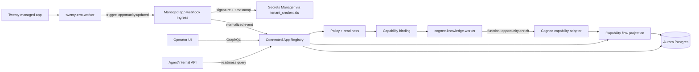
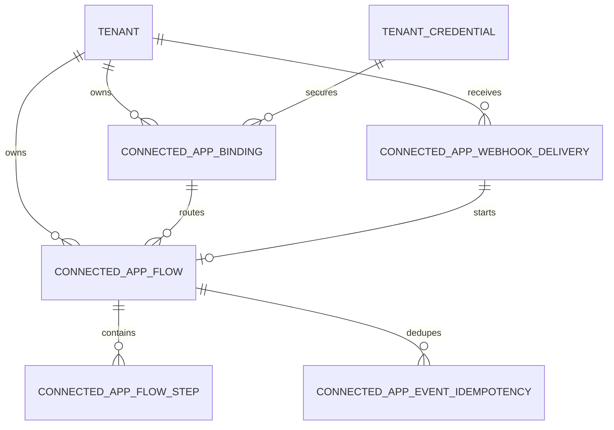

# feat: Connected application registry

## Overview

Build a ThinkWork Connected Application Registry that lets managed applications expose stable capability contracts for functions, triggers, events, workers, entities, auth requirements, health, and observability. The registry remains an AWS-native ThinkWork control-plane feature, not a new worker runtime. It composes existing managed application lifecycle state, MCP/user credential readiness, policy, audit, and trace projections into one inspectable capability graph.

The connected application definition should be encapsulated: each app gets a single manifest folder, and that folder can define one or more workers. In v1, a worker is the declarative capability owner for triggers and functions: it carries stable IDs, readiness source references, credential requirements, default binding templates, safe metadata rules, and UI-facing labels. Generic registry plumbing loads these app/worker manifests; app-specific behavior should not require editing scattered files across API, web, deployment-runner, and database packages.

V1 proves the model with a real cross-app automation: Twenty emits an `opportunity.updated` webhook, ThinkWork validates and normalizes it, routes it through an explicitly enabled tenant capability binding, invokes the canonical Cognee capability `cognee::opportunity.enrich`, and records an operator-visible waterfall. The route is deny-by-default until a tenant operator enables it with an audited grant.

---

## Problem Frame

ThinkWork can already deploy managed applications and expose some MCP tools, but the platform does not yet have a shared capability surface where agents, automations, and operators can understand what each app can do and how cross-app work happened. The iii Engine model is compelling because workers register functions/triggers and the engine can observe every cross-worker call. ThinkWork should borrow that product property while preserving the repo's AWS-only platform direction and managed-app boundaries (see origin: `docs/brainstorms/2026-06-08-connected-application-registry-requirements.md`).

The core planning decision is to implement a registry and flow projection, not an engine. ThinkWork continues to own tenancy, routing, authorization, audit, idempotency, and observability. Managed applications publish app and worker contracts; they do not call each other directly.

---

## Requirements Trace

- R1. ThinkWork owns the Connected Application Registry as the authoritative managed-app capability control point.
- R2. Cross-app automation routes through ThinkWork policy, audit, and observability rather than direct app-to-app calls.
- R3. Availability distinguishes tenant-level app readiness from user-specific OAuth/permission readiness.
- R4. Capability identifiers are stable across traces, automations, agent tools, and UI.
- R5. Capability contracts describe workers, functions, triggers, events, entities, MCP tools, credentials, health, smoke evidence, audit, idempotency, and destructive-operation policy.
- R6. Capability states distinguish installed, running, callable for tenant, and callable for this user.
- R7. Source app event names and safe payload summaries are preserved while normalizing into ThinkWork event contracts.
- R8. Capabilities can be hidden, disabled, or policy-blocked without changing deployment state.
- R9. V1 uses Twenty's real `opportunity.updated` webhook.
- R10. ThinkWork validates Twenty webhook signature and timestamp.
- R11. ThinkWork applies idempotency so repeated deliveries do not duplicate Cognee writes or audit records.
- R12. Normalized Twenty opportunity events route through a ThinkWork binding to Cognee.
- R13. Cognee results link back to the source Twenty event.
- R14. Failure handling distinguishes invalid webhook, duplicate webhook, missing route, Cognee unavailable, policy blocked, and enrichment failed.
- R15. Every v1 cross-app flow produces an ordered capability waterfall.
- R16. Flow logs and traces are safe for enterprise operators.
- R17. Operators can inspect recent flows and open one flow for detail.
- R18. Agents/internal tools can ask why a capability is unavailable and get a structured readiness reason.
- R19. V1 does not become a worker runtime, queue, cron, stream bus, general-purpose worker execution state store, process supervisor, marketplace, or iii replacement. It may store registry control-plane, idempotency, delivery, and observability projection state.
- R20. Future iii-style metadata compatibility remains possible but subordinate to ThinkWork tenant/auth/policy/AWS requirements.
- R21. Existing managed-app lifecycle boundaries remain intact: Managed Applications owns infrastructure lifecycle, MCP Servers owns user OAuth/tool connection state, and the Connected Registry composes across them.

**Origin actors:** A1 ThinkWork operator, A2 platform engineer, A3 automation runtime, A4 Pi agent runtime, A5 enterprise reviewer, A6 managed application.

**Origin flows:** F1 managed app publishes capabilities, F2 Twenty opportunity update enriches Cognee, F3 operator inspects capability waterfall, F4 runtime asks why capability is unavailable.

**Origin acceptance examples:** AE1 capability inspection, AE2 signed/deduped Twenty webhook handling, AE3 Cognee enrichment result linkage, AE4 safe operator waterfall, AE5 structured readiness reason.

---

## Scope Boundaries

### Deferred for later

- Generic third-party application marketplace or public worker registry.
- Importing arbitrary iii registry workers into production ThinkWork.
- Exporting ThinkWork capabilities as live iii workers.
- Direct app-to-app calls outside ThinkWork policy/routing.
- General-purpose workflow builder UI for arbitrary cross-app automations.
- Full event filtering UI for all Twenty event types.
- Broad conversion of every existing MCP tool or Lambda into registry capabilities.
- On-prem or offline iii edge runtime.
- Replacing routine recipes or Step Functions routines; connected-app bindings are a lower-level managed-app automation substrate that routines may consume later.

### Outside this product's identity

- ThinkWork should not become a generic iii Engine clone.
- ThinkWork should not own generic process supervision for arbitrary worker binaries or containers in v1.
- ThinkWork should not treat MCP tool listings alone as the application registry; MCP is one capability source, not the whole model.
- ThinkWork should not make managed applications responsible for each other's identity, tenant isolation, authorization, or audit evidence.

### Deferred to Follow-Up Work

- Pi runtime tool exposure for registry discovery can start with an API/internal service in this plan; broad agent planning UX can follow after the registry shape is proven.
- iii import/export adapters should wait until ThinkWork has stable internal contracts and at least two real managed-app integrations.
- DynamoDB hot-path ledgers should wait for measured webhook volume or latency pressure; Aurora remains canonical for v1.

---

## Context & Research

### Relevant Code and Patterns

- `packages/deployment-runner/src/apps/registry.ts` is the deployment-time managed app adapter registry. It currently knows `cognee` and `twenty`, required Terraform inputs, smoke contracts, and status outputs. The connected registry should not move runtime routing into this package.
- `packages/database-pg/src/schema/deployments.ts` stores managed application desired/current status and deployment job/event evidence. Connected capability readiness should compose this state rather than duplicate deployment lifecycle.
- `packages/database-pg/src/schema/mcp-servers.ts` stores managed MCP registration and user OAuth token readiness, including `management_source`, `managed_application_key`, `tools`, and `user_mcp_tokens`.
- `packages/api/src/lib/managed-mcp-applications.ts` repairs/parks/destroys managed MCP rows for Twenty and is the best pattern for keeping deployment lifecycle separate from user-scoped tool readiness.
- `packages/api/src/handlers/webhooks.ts`, `packages/database-pg/src/schema/webhooks.ts`, and `packages/database-pg/src/schema/webhook-deliveries.ts` provide reusable ideas for request redaction, body hashes, delivery logging, idempotency, and execution dispatch. The Twenty managed-app ingress should reuse these patterns but not rely on the token-auth generic webhook endpoint as its only entry point.
- `packages/database-pg/src/schema/scheduled-jobs.ts`, especially `thread_turns` and `thread_turn_events`, shows the existing durable event-log style for ordered execution details. Capability flows need a similar bounded projection because not every cross-app event is an agent thread turn.
- `packages/api/src/lib/thread-turn-events.ts` caps event payload size and serializes per-run sequence numbers; capability flow steps should mirror those guardrails.
- `packages/api/src/graphql/resolvers/observability/threadTraces.query.ts` and `apps/web/src/components/settings/SettingsActivityExecutionTrace.tsx` show how trace projections become operator-facing waterfall UI.
- `packages/database-pg/src/schema/tenant-credentials.ts` already models tenant-scoped `webhook_signing_secret` credentials backed by Secrets Manager.
- `packages/api/src/lib/compliance/emit.ts` is the compliance audit helper to use when cross-app flows need durable audit events.
- `docs/solutions/architecture-patterns/managed-app-mcp-oauth-lifecycle-2026-06-06.md` states the key lifecycle split: managed apps own deployment/park/destroy/status/evidence, while MCP Servers own user auth/connect/reconnect/tools.
- `docs/solutions/best-practices/cognee-thread-ingest-explorer-2026-06-04.md` cautions that Cognee value should be exposed through ThinkWork GraphQL/product surfaces, not by making operators inspect Cognee internals directly.

### External References

- Twenty's webhook docs confirm that Twenty sends HTTP POSTs for record changes, includes update events such as `opportunity.updated`, expects 2xx acknowledgment, and signs requests with `X-Twenty-Webhook-Signature` plus `X-Twenty-Webhook-Timestamp`.
- iii's Engine protocol documents worker registration of functions, triggers, trigger types, and services over the SDK protocol. This is useful as a metadata inspiration, not a runtime target.
- iii's Linkly observability tutorial shows the product property to emulate: end-to-end traces and logs because cross-worker calls flow through the engine. ThinkWork should create the same operator experience through hub-routed capability flows.

---

## Key Technical Decisions

- **Aurora Postgres is canonical for registry/control-plane data:** Capability contracts, tenant capability state, bindings, idempotency markers, and flow projections should live in `packages/database-pg`. This keeps the registry queryable with existing tenant/auth/GraphQL patterns and avoids inventing an AWS-only DynamoDB engine. S3 can store oversized evidence or payload snapshots later; CloudWatch/X-Ray/OTel remain raw telemetry sources.
- **DynamoDB is not part of v1:** Add it only if real volume proves Aurora unsuitable for webhook dedupe or flow step writes. Starting with DynamoDB would optimize an unproven hot path and split the control plane too early.
- **Capability contracts are shared static metadata plus tenant state:** The static contract should live in an encapsulated manifest folder so API, deployment surfaces, and future tooling can read the same identifiers. Tenant readiness is computed from existing source-of-truth rows: managed app status, MCP rows, credentials, policy, and recent health/evidence.
- **Workers are first-class declarative capability owners in v1:** Borrow iii's core insight that functions and triggers belong to workers, but keep the v1 worker shape small: app key, worker key, stable capability IDs, display labels, and readiness source references. Runtime polymorphism, independent worker health state, version digest enforcement, and generic worker lifecycle management are deferred until multiple independently managed workers need them.
- **Application definitions are manifest-folder encapsulated:** App-specific registry knowledge lives under one folder per app, for example `packages/connected-apps/src/apps/twenty/`. Each folder can contain app-level metadata plus `workers/<worker-key>/` bundles. Generic loaders, GraphQL resolvers, webhook dispatch, adapter dispatch, and UI panels should consume manifest metadata rather than hard-coding Twenty/Cognee branches throughout the repo. Some generic integration files still need one-time wiring, but adding the next app should mostly mean adding a new app/worker manifest folder plus tests.
- **Managed-app webhooks get a provider-signed ingress:** Twenty webhook handling should be a managed-app endpoint that validates Twenty's signature and tenant/app association. The existing generic `/webhooks/:token` path remains for agent/routine webhook targets.
- **Webhook deliveries and capability flows are separate:** Delivery records cover every inbound request, including pre-tenant invalid signatures and malformed bodies. Capability flows begin only after tenant/app/auth resolution and link back to accepted or duplicate delivery rows when available.
- **Cross-app bindings are deny-by-default:** V1 requires an explicit tenant operator/admin grant before `twenty::opportunity.updated` can invoke `cognee::opportunity.enrich`. The binding stores allowed data classes, destination scope, actor, audit reason, and enable/disable history.
- **Capability flows are a first-class projection:** Do not overload `thread_turn_events` for cross-app automation. Create flow/step tables with bounded, redacted metadata and optional links to delivery, audit, thread, and trace IDs.
- **Cognee invocation is wrapped by a ThinkWork capability adapter:** The canonical v1 target capability ID is `cognee::opportunity.enrich`. The adapter maps a normalized opportunity event to a direct Brain/wiki entity write or enrichment record that Cognee can ingest through existing Brain/Wiki paths; direct Cognee source-kind expansion is allowed only if U5 explicitly adds the loader/result contract.
- **iii compatibility remains metadata-compatible, not runtime-compatible:** Stable IDs, contract fields, and observability concepts should make future iii import/export plausible. V1 does not run iii workers, adopt iii ports/protocols, or expose a general worker process runtime.

---

## Open Questions

### Resolved During Planning

- **Where should all this registry information live?** Aurora Postgres is the canonical store for registry and flow state; DynamoDB is deferred until there is measured hot-path need.
- **Should the existing managed-app registry become the runtime registry?** No. The deployment-runner registry remains deployment-focused. Connected app contracts sit beside it and compose its state.
- **Should Twenty use the existing generic webhook endpoint?** No. The generic endpoint provides patterns, but Twenty needs provider signature validation and tenant/app association rather than token-only routing.
- **How should observability imitate iii without becoming iii?** Store a bounded capability-flow projection in ThinkWork and optionally link to raw telemetry; do not require every app call to be an engine-managed invocation.
- **Are workers just labels for apps?** No. Workers are first-class capability owners. The app is the product/integration boundary; the worker is the executable or service boundary that owns functions, triggers, health, lifecycle, and availability.
- **What is the v1 binding policy?** Deny-by-default. Operators must explicitly enable the Twenty -> Cognee route and see the source event, target function, data classes shared, destination scope, idempotency behavior, and audit visibility.
- **What is the canonical Cognee capability ID?** `cognee::opportunity.enrich`. Other Cognee operations may appear later as aliases or separate functions, but v1 traces and bindings use this ID.

### Deferred to Implementation

- **Exact shared package name and export structure:** The plan assumes a shared static contract package. Implementation may choose the final module boundaries if package graph constraints make a lighter module preferable.
- **Exact low-level Cognee write path:** U5 chooses the architecture at plan level: the canonical target is `cognee::opportunity.enrich`, implemented as a ThinkWork-owned adapter that writes a bounded Brain/wiki opportunity enrichment record and optionally invokes existing Cognee ingest if the current source model supports it. The exact helper names and result table fields remain implementation details.
- **Webhook secret provisioning UX:** Reuse `tenant_credentials` with kind `webhook_signing_secret`. V1 can require an operator-created credential plus setup/status surfacing, but the webhook handler must treat a missing or disabled credential as an explicit readiness blocker rather than an implementation afterthought.
- **Raw telemetry links:** Capability flows should work without X-Ray/OTel links. Linking to raw traces can be added where trace IDs are available.

---

## Output Structure

Expected new shape, subject to small implementation-driven adjustments:

```text
packages/connected-apps/
  package.json
  src/
    contracts.ts
    index.ts
    loader.ts
    apps/
      twenty/
        app.manifest.ts
        workers/
          crm-worker/
            worker.manifest.ts
            triggers.ts
            functions.ts
            webhooks.ts
            normalizers.ts
            smoke.ts
            __tests__/
              worker.manifest.test.ts
              webhooks.test.ts
        __tests__/
          app.manifest.test.ts
      cognee/
        app.manifest.ts
        workers/
          knowledge-worker/
            worker.manifest.ts
            functions.ts
            adapter-contract.ts
            smoke.ts
            __tests__/
              worker.manifest.test.ts
        __tests__/
          app.manifest.test.ts
    __tests__/
      loader.test.ts

packages/database-pg/src/schema/
  connected-applications.ts

packages/api/src/lib/connected-apps/
  registry.ts
  readiness.ts
  flows.ts
  manifest-runtime.ts
  webhook-dispatch.ts
  adapter-dispatch.ts

packages/api/src/graphql/resolvers/connected-applications/
  index.ts
  connectedApplicationCapabilities.query.ts
  connectedApplicationFlows.query.ts
  connectedApplicationFlow.query.ts
  connectedApplicationReadiness.query.ts

packages/api/src/handlers/
  connected-app-webhooks.ts
  capability-invocation-worker.ts

apps/web/src/components/settings/managed-applications/
  CapabilityRegistryPanel.tsx
  CapabilityFlowDetail.tsx
  CapabilityReadinessBadge.tsx

scripts/smoke/
  twenty-cognee-capability-flow-smoke.mjs
```

---

## High-Level Technical Design

> _This illustrates the intended approach and is directional guidance for review, not implementation specification. The implementing agent should treat it as context, not code to reproduce._



The main data path is:

1. Static app/worker contracts declare `twenty-crm-worker` with trigger `twenty::opportunity.updated` and `cognee-knowledge-worker` with function `cognee::opportunity.enrich`.
2. Tenant state marks whether Twenty and Cognee are deployed/running, which workers are available, and whether required MCP/credentials/policy are ready.
3. Twenty webhook ingress validates authenticity, logs a safe delivery record, and creates or reuses an idempotency marker.
4. Registry resolves the event to a policy-approved binding.
5. Cognee adapter performs the write/enrichment operation and returns a result reference.
6. Capability flow rows capture each step, status, duration, safe metadata, and result linkage for GraphQL/UI and internal tools.

---

## Implementation Units

- U1. **Worker Manifest Bundle Catalog**

**Goal:** Introduce a shared app/worker manifest catalog for connected application capabilities, including stable worker, trigger, and function identifiers for Twenty and Cognee v1.

**Requirements:** R1, R4, R5, R6, R19, R20, R21; supports F1 and AE1.

**Dependencies:** None.

**Files:**

- Create: `packages/connected-apps/package.json`
- Create: `packages/connected-apps/src/contracts.ts`
- Create: `packages/connected-apps/src/index.ts`
- Create: `packages/connected-apps/src/loader.ts`
- Create: `packages/connected-apps/src/apps/twenty/app.manifest.ts`
- Create: `packages/connected-apps/src/apps/twenty/workers/crm-worker/worker.manifest.ts`
- Create: `packages/connected-apps/src/apps/twenty/workers/crm-worker/triggers.ts`
- Create: `packages/connected-apps/src/apps/twenty/workers/crm-worker/functions.ts`
- Create: `packages/connected-apps/src/apps/twenty/workers/crm-worker/webhooks.ts`
- Create: `packages/connected-apps/src/apps/twenty/workers/crm-worker/normalizers.ts`
- Create: `packages/connected-apps/src/apps/twenty/workers/crm-worker/smoke.ts`
- Create: `packages/connected-apps/src/apps/cognee/app.manifest.ts`
- Create: `packages/connected-apps/src/apps/cognee/workers/knowledge-worker/worker.manifest.ts`
- Create: `packages/connected-apps/src/apps/cognee/workers/knowledge-worker/functions.ts`
- Create: `packages/connected-apps/src/apps/cognee/workers/knowledge-worker/adapter-contract.ts`
- Create: `packages/connected-apps/src/apps/cognee/workers/knowledge-worker/smoke.ts`
- Test: `packages/connected-apps/src/__tests__/loader.test.ts`
- Test: `packages/connected-apps/src/apps/twenty/__tests__/app.manifest.test.ts`
- Test: `packages/connected-apps/src/apps/twenty/workers/crm-worker/__tests__/worker.manifest.test.ts`
- Test: `packages/connected-apps/src/apps/twenty/workers/crm-worker/__tests__/webhooks.test.ts`
- Test: `packages/connected-apps/src/apps/cognee/__tests__/app.manifest.test.ts`
- Test: `packages/connected-apps/src/apps/cognee/workers/knowledge-worker/__tests__/worker.manifest.test.ts`
- Modify: `pnpm-workspace.yaml` only if the existing `packages/*` workspace pattern is insufficient after implementation
- Modify: relevant `package.json` dependencies for packages that consume the shared catalog

**Approach:**

- Define an app manifest model for product/integration metadata and a worker manifest model for declarative capability ownership. A v1 worker manifest describes worker key, display labels, readiness source references, functions, triggers, emitted/consumed events, credential requirements, audit/idempotency expectations, webhook validators, normalizers, default binding templates, data-class allowlists, safe metadata rules, and display labels.
- Put all app-specific registry definitions under `packages/connected-apps/src/apps/<app-key>/`, with worker-specific definitions under `workers/<worker-key>/`. The top-level loader should discover/import app manifests and their workers, then expose a normalized registry catalog.
- Start with two manifest folders:
  - `twenty/crm-worker` owning `twenty::opportunity.updated` as an emitted event/trigger source.
  - `cognee/knowledge-worker` owning canonical v1 function `cognee::opportunity.enrich`. Additional Cognee functions can be aliases or separate capabilities later, but v1 bindings and traces use this ID.
- Include only the iii-inspired fields needed for v1: stable worker IDs, trigger IDs, function IDs, request/response schema metadata, and display metadata. Reserve broad iii compatibility metadata, destructive-operation policy, entity catalogs, and generic MCP catalog mapping for later.
- Keep the base manifest package free of database, GraphQL, and deployment-runner side effects. It may contain pure worker-specific helpers such as signature verification, event normalization, safe metadata extraction, and smoke definitions. Runtime dispatch that needs database/AWS clients stays in generic API modules and calls into worker manifest hooks.

**Patterns to follow:**

- `packages/deployment-runner/src/apps/registry.ts` for app keys and catalog-style metadata.
- `packages/deployment-runner/src/apps/twenty.ts` and `packages/deployment-runner/src/apps/cognee.ts` for existing app vocabulary and health/smoke concepts.

**Test scenarios:**

- Happy path: loading manifests returns Twenty and Cognee contracts with stable app keys and capability IDs.
- Happy path: every trigger/function belongs to exactly one worker, and every worker belongs to exactly one connected app.
- Happy path: worker manifests expose stable IDs, display metadata, and readiness source references without requiring runtime clients.
- Happy path: each capability ID is unique across all app manifests.
- Happy path: worker-specific webhook/normalizer helpers can be imported from the worker manifest folder without importing API or database modules.
- Happy path: a fixture second route can be declared through app/worker/capability/binding metadata without adding new DB tables, GraphQL fields, UI branches, webhook handler branches, or route-specific dispatch branches.
- Edge case: contract validation rejects duplicate function/event IDs within one app.
- Edge case: contract validation rejects missing auth/readiness metadata for callable functions.
- Error path: invalid contract shape produces a useful validation error without importing AWS or database modules.

**Verification:**

- The manifest catalog can be imported by API code and tests without pulling in deployment-runner side effects.
- The v1 contracts can answer what events Twenty emits and what Cognee function can receive a normalized opportunity payload.
- Adding another connected app has a clear home: one new `packages/connected-apps/src/apps/<app-key>/` folder with one or more `workers/<worker-key>/` bundles plus any generic tests it exercises.

---

- U2. **Postgres Registry, Binding, Idempotency, and Flow Schema**

**Goal:** Add Aurora-backed durable tables for connected app policy bindings, webhook delivery audit, event idempotency, and capability waterfall projections.

**Requirements:** R1, R3, R6, R7, R8, R11, R13, R14, R15, R16, R21; supports F1, F2, F3, AE2, AE3, AE4, AE5.

**Dependencies:** U1.

**Files:**

- Create: `packages/database-pg/src/schema/connected-applications.ts`
- Modify: `packages/database-pg/src/schema/index.ts`
- Create or modify: `packages/database-pg/drizzle/<next>_connected_applications.sql`
- Create: `packages/database-pg/graphql/types/connected-applications.graphql`
- Modify: GraphQL schema/codegen inputs as needed by `scripts/schema-build.sh`
- Test: `packages/database-pg/src/schema/connected-applications.test.ts` or the closest existing schema test location if the package uses a different convention

**Approach:**

- Add canonical Postgres tables with JSONB for bounded schemas/metadata:
  - Capability bindings keyed by tenant, source app/worker/capability ID, target app/worker/capability ID, status, policy metadata, data-class allowlist, destination scope, actor/audit fields, and idempotency policy.
  - Connected app webhook delivery rows with nullable tenant/app instance fields for pre-tenant failures, safe headers, body hash, signature status, resolution status, status code, and optional flow ID.
  - Capability event idempotency rows keyed by tenant, source app key, source event name, and provider event ID or body hash.
  - Capability flows keyed by tenant, flow ID, trace/correlation ID, source app/event, status, and result references.
  - Capability flow steps keyed by flow ID and sequence number, with app/worker/capability owner, step type, status, duration, retry/skipped state, and redacted metadata.
- Do not persist worker/capability readiness state in v1. Compute readiness from static manifests plus `managed_applications`, MCP rows, tenant credentials, explicit binding policy, and recent health/evidence. Add worker state rows only when there is an independent worker lifecycle signal that cannot be derived.
- Keep large raw payloads out of these tables. Store only safe previews, hashes, IDs, and optional S3 evidence references if needed later.
- Reuse `tenant_credentials` for webhook signing secret references rather than adding secret material to registry tables.
- Add indexes for tenant/recent flow listing, flow detail, idempotency lookup, and capability availability lookup.

**Technical design:** Directional data model:



**Patterns to follow:**

- `packages/database-pg/src/schema/deployments.ts` for managed app lifecycle references.
- `packages/database-pg/src/schema/webhook-deliveries.ts` for safe request metadata and audit retention posture.
- `packages/database-pg/src/schema/agent-workspace-events.ts` for append-only event lineage and idempotency.
- `packages/database-pg/src/schema/tenant-credentials.ts` for tenant-scoped secret references.

**Test scenarios:**

- Happy path: schema exposes tables and relations for tenant-scoped bindings and flow steps.
- Happy path: schema exposes delivery rows that can record pre-tenant invalid requests and accepted requests linked to tenant-scoped flows.
- Happy path: flow steps can reference source/target worker keys without requiring persisted worker state rows.
- Happy path: idempotency uniqueness prevents duplicate provider events from creating multiple active idempotency rows.
- Edge case: flow steps preserve order by `(flow_id, sequence)` and reject duplicate sequence numbers for a flow.
- Edge case: JSON metadata defaults to empty objects/arrays where expected.
- Error path: deleting or parking managed app state does not cascade-delete historical flow rows.
- Integration: generated GraphQL schema includes connected application types without breaking existing deployment or observability types.

**Verification:**

- Database schema exports include the new connected application tables.
- Migration can create the tables with the intended indexes and uniqueness constraints.
- GraphQL schema generation has a clear type surface for later API units.

---

- U3. **Registry Readiness Service and GraphQL Queries**

**Goal:** Implement the API layer that merges static contracts, managed application lifecycle state, MCP/user readiness, credentials, policy bindings, and flow projections into queryable registry responses.

**Requirements:** R1, R3, R4, R5, R6, R8, R17, R18, R21; supports F1, F3, F4, AE1, AE4, AE5.

**Dependencies:** U1, U2.

**Files:**

- Create: `packages/api/src/lib/connected-apps/registry.ts`
- Create: `packages/api/src/lib/connected-apps/readiness.ts`
- Create: `packages/api/src/lib/connected-apps/flows.ts`
- Create: `packages/api/src/graphql/resolvers/connected-applications/index.ts`
- Create: `packages/api/src/graphql/resolvers/connected-applications/connectedApplicationCapabilities.query.ts`
- Create: `packages/api/src/graphql/resolvers/connected-applications/connectedApplicationFlows.query.ts`
- Create: `packages/api/src/graphql/resolvers/connected-applications/connectedApplicationFlow.query.ts`
- Create: `packages/api/src/graphql/resolvers/connected-applications/connectedApplicationReadiness.query.ts`
- Modify: `packages/api/src/graphql/resolvers/index.ts`
- Test: `packages/api/src/lib/connected-apps/readiness.test.ts`
- Test: `packages/api/src/lib/connected-apps/flows.test.ts`
- Test: `packages/api/src/graphql/resolvers/connected-applications/connectedApplicationCapabilities.query.test.ts`
- Test: `packages/api/src/graphql/resolvers/connected-applications/connectedApplicationFlow.query.test.ts`

**Approach:**

- Build registry reads from the shared catalog plus tenant rows. Do not store every static field redundantly unless a versioned snapshot is needed for historical flow detail.
- Compute readiness reasons with stable machine values and operator-friendly messages. Minimum reasons: `APP_NOT_DEPLOYED`, `APP_PARKED`, `APP_NOT_HEALTHY`, `WORKER_UNAVAILABLE`, `MCP_NOT_REGISTERED`, `USER_OAUTH_MISSING`, `CREDENTIAL_MISSING`, `POLICY_DISABLED`, `BINDING_DISABLED`, `CAPABILITY_NOT_FOUND`, `READY`.
- Return a structured readiness object for UI and runtime consumers: `scope`, `layer`, `primaryReason`, `secondaryReasons`, `callableForTenant`, `callableForUser`, `operatorMessage`, and `recommendedAction`.
- Apply blocker precedence so the same request is explainable across UI and automation: app deployment/parked state first, then worker/readiness source availability, then credential/secret status, then binding/policy state, then user OAuth/permission state, then capability-specific constraints.
- Join or query:
  - `managed_applications` for desired/current app state.
  - `tenant_mcp_servers`, `agent_mcp_servers`, `space_mcp_servers`, and `user_mcp_tokens` where a capability depends on MCP/user auth.
  - `tenant_credentials` for webhook signing secrets or app API credentials.
  - connected app binding, delivery, idempotency, and flow tables from U2.
- Expose GraphQL queries for:
  - capability catalog/readiness by app and tenant;
  - recent capability flows;
  - flow detail with ordered steps;
  - explicit readiness explanation for one capability.
- Expose a thin internal runtime contract for automation/Pi callers: `listCapabilities`, `explainReadiness`, and `resolveBinding`. These should use the same readiness object and policy checks as GraphQL, but may be implemented as internal API helpers before a user-facing agent tool exists.
- Require tenant admin/operator authorization for registry and flow inspection until product policy defines broader audience.

**Patterns to follow:**

- `packages/api/src/graphql/resolvers/deployments/managedApplications.query.ts` for catalog-plus-row fallback behavior.
- `packages/api/src/graphql/resolvers/deployments/shared.ts` for tenant admin checks and managed app key normalization.
- `packages/api/src/lib/managed-mcp-applications.ts` for interpreting managed app + MCP state together.
- `packages/api/src/graphql/resolvers/observability/threadTraces.query.ts` for trace projection response shape.

**Test scenarios:**

- Happy path: deployed Twenty and Cognee with available workers and enabled binding return ready tenant-level capabilities.
- Happy path: a recent flow query returns flows ordered newest first and scoped to the caller's tenant.
- Happy path: flow detail returns ordered steps with redacted metadata and stable capability IDs.
- Covers AE5. Edge case: deployed app with missing user OAuth returns `USER_OAUTH_MISSING` and is not callable for that user.
- Edge case: parked app returns `APP_PARKED` even if MCP rows still exist.
- Edge case: deployed app with unavailable worker returns `WORKER_UNAVAILABLE` even if app deployment state is running.
- Edge case: disabled binding hides or marks the route unavailable without changing app deployment state.
- Error path: unknown capability ID returns a structured not-found error or readiness reason, not a generic server error.
- Error path: non-admin tenant caller cannot inspect tenant-wide capability flows.
- Integration: GraphQL resolver uses `resolveCallerTenantId` fallback for Google-federated users, matching existing resolver practice.
- Integration: runtime helper refuses to resolve a binding when readiness is blocked, and returns the same primary reason the operator UI would display.

**Verification:**

- API responses can explain both "what can this app do?" and "why can't this capability be called right now?"
- Existing managed application and MCP GraphQL queries continue to behave unchanged.

---

- U4. **Twenty Managed-App Webhook Ingress**

**Goal:** Add a managed-app webhook handler for Twenty that validates signed requests, normalizes `opportunity.updated`, applies idempotency, and starts a capability flow.

**Requirements:** R7, R9, R10, R11, R14, R15, R16; supports F2, AE2, AE4.

**Dependencies:** U1, U2, U3.

**Files:**

- Create: `packages/api/src/handlers/connected-app-webhooks.ts`
- Create: `packages/api/src/lib/connected-apps/webhook-dispatch.ts`
- Create: `packages/api/src/lib/connected-apps/manifest-runtime.ts`
- Modify: `scripts/build-lambdas.sh`
- Modify: relevant Terraform module files under `terraform/modules/app/` to add the managed-app webhook Lambda/API route/environment
- Modify: `terraform/modules/thinkwork/` wiring if the public route or output needs module-level exposure
- Test: `packages/api/src/lib/connected-apps/webhook-dispatch.test.ts`
- Test: `packages/api/src/handlers/connected-app-webhooks.test.ts`

**Approach:**

- Prefer extending the existing provider-signed webhook pattern under `/webhooks/{integration}/{tenantId}` if Twenty's header/raw-body requirements fit the shared helper. Only create a separate `/managed-app-webhooks/{appKey}/{tenantOrInstanceKey}` route if the existing route/helper cannot support Twenty without weakening existing integrations. If a new route is added, document route precedence, shared helper reuse, tenant credential lookup, delivery logging, and coexistence with `/webhooks/{integration}/{tenantId}`.
- Dispatch by app key and worker key. The generic handler should load the `twenty/crm-worker` manifest and call its webhook signature/event normalizer hooks rather than containing Twenty-specific parsing inline.
- Resolve the tenant/app instance, load the active `webhook_signing_secret` tenant credential, and validate:
  - required Twenty signature header exists;
  - required timestamp header exists;
  - timestamp is within accepted skew;
  - HMAC over `{timestamp}:{raw JSON payload}` matches the signature using timing-safe comparison;
  - event is `opportunity.updated`;
  - body size is within a bounded limit.
- Use raw request body for signature validation before JSON normalization.
- Record a safe delivery row for every request outcome: accepted, invalid signature, stale timestamp, malformed body, ignored event, duplicate, missing route, or internal error. Capability flows start only after tenant/app/auth resolution; delivery rows without a resolved tenant do not create flow rows.
- Add explicit abuse controls: API Gateway/WAF throttles where available, body-size enforcement before secret lookup and DB writes, per-route/per-instance invalid-request limits, bounded or sampled persistence for repeated invalid signatures, and alarms for invalid signature spikes.
- Apply idempotency from provider event ID when available. Otherwise use a semantic key based on tenant, app instance, event name, source record ID, source update/occurred timestamp when present, and canonical body hash. Do not include delivery/signature timestamp in the fallback key. Claim idempotency atomically before dispatch so concurrent deliveries cannot double-invoke Cognee.
- Produce a normalized ThinkWork event payload that includes source app key, source event name, source record ID, safe summary fields, payload hash, received timestamp, and correlation/flow ID.
- Make setup explicit: the handler should depend on an active tenant credential and a discoverable endpoint/instance key. If automated Twenty webhook registration is not available in v1, readiness and docs must show that the operator needs to create the Twenty webhook URL in Twenty and store/rotate the signing secret in ThinkWork.
- Define webhook signing secret rotation semantics: active and previous credential versions, bounded grace window, maximum overlap, audit events for create/rotate/disable, readiness state during rotation, IAM access boundary for secret retrieval, and tests proving old secrets stop validating after the grace window.
- Emit compliance/audit events for accepted webhook, duplicate suppression, invalid signature burst, webhook secret lifecycle actions, and route/binding policy decisions. Avoid audit events for every single unauthenticated invalid request when throttling/sampling is active; aggregate burst evidence instead.

**Execution note:** Implement signature validation test-first using a raw-body fixture, because signature bugs tend to look correct while verifying the wrong serialization.

**Patterns to follow:**

- `packages/api/src/handlers/webhooks.ts` for delivery logging, safe header redaction, body preview/hash, rate limiting posture, and non-masking logging failures.
- `packages/connected-apps/src/apps/twenty/workers/crm-worker/` for worker-specific signature/event normalization hooks.
- `packages/database-pg/src/schema/webhook-deliveries.ts` for safe request snapshot fields.
- `packages/database-pg/src/schema/webhooks.ts` for idempotency table patterns.
- `packages/api/src/graphql/resolvers/deployments/shared.ts` for tenant resolution conventions where applicable.

**Test scenarios:**

- Covers AE2. Happy path: valid Twenty `opportunity.updated` request with matching signature creates one flow and one normalized source event.
- Happy path: valid duplicate request is recognized by idempotency and does not create a second Cognee invocation.
- Edge case: valid signature for an unsupported event type records an ignored flow/delivery state without invoking Cognee.
- Edge case: missing route records `missing_route` and returns a clear non-retry or accepted/skipped response based on final handler policy.
- Error path: missing signature is rejected and logged as invalid.
- Error path: stale timestamp is rejected and logged as stale/invalid.
- Error path: malformed JSON is rejected without throwing an unhandled exception.
- Error path: body over limit is rejected before unbounded preview/persistence.
- Error path: previous signing secret validates only inside the rotation grace window and fails afterward.
- Integration: handler can create flow and first flow steps using the U3 flow service.
- Integration: same logical event delivered twice with different signature timestamps produces one downstream invocation and one duplicate delivery outcome.
- Integration: invalid signature bursts are rate-limited or bounded without creating unbounded tenant flow rows.

**Verification:**

- A signed Twenty webhook can be accepted without using the generic token webhook path.
- Invalid or duplicate deliveries produce explainable flow/delivery records and do not duplicate downstream work.

---

- U8. **Capability Invocation Worker**

**Goal:** Add an explicit AWS execution boundary between accepted registry events and downstream function invocation so webhook handling can acknowledge quickly while Cognee work runs with durable status, retries, and idempotent updates.

**Requirements:** R11, R12, R13, R14, R15, R16, R19; supports F2, F3, AE2, AE3, AE4.

**Dependencies:** U1, U2, U3, U4.

**Files:**

- Create: `packages/api/src/handlers/capability-invocation-worker.ts`
- Create: `packages/api/src/lib/connected-apps/invocations.ts`
- Modify: `packages/api/src/lib/connected-apps/flows.ts`
- Modify: `packages/api/src/lib/connected-apps/adapter-dispatch.ts`
- Modify: `scripts/build-lambdas.sh`
- Modify: relevant Terraform module files under `terraform/modules/app/` to add worker Lambda, IAM permissions, retry/DLQ wiring, and environment variables
- Test: `packages/api/src/lib/connected-apps/invocations.test.ts`
- Test: `packages/api/src/handlers/capability-invocation-worker.test.ts`

**Approach:**

- The webhook ingress validates, resolves tenant/app, records delivery, atomically claims idempotency, creates the capability flow, and dispatches the invocation worker asynchronously using Lambda `Event` invocation or Step Functions if existing retry/DLQ conventions make that cleaner.
- The worker owns flow status transitions: `accepted -> running -> succeeded | failed | retryable | blocked | skipped`.
- The worker re-checks binding/readiness before invoking the target function so disabled bindings or revoked credentials stop queued work safely.
- Define retry/DLQ behavior explicitly. Retryable downstream failures should not re-open idempotency claims for the same source event; manual replay should use a distinct replay marker linked to the original delivery/flow.
- Keep this as an AWS execution boundary, not a generic worker runtime. It executes registry-dispatched capability invocations for v1; it does not supervise arbitrary worker processes.

**Patterns to follow:**

- Existing async Lambda invocation patterns in GraphQL/API utilities where long-running work uses background Lambda dispatch and durable callback/status updates.
- Existing Cognee/knowledge graph ingestion handler patterns for long-running knowledge work and timeout behavior.
- `packages/api/src/lib/thread-turn-events.ts` for bounded event payload updates and status progression.

**Test scenarios:**

- Happy path: accepted webhook creates flow with `accepted`, invocation worker marks `running`, invokes Cognee adapter, and marks `succeeded` with result reference.
- Happy path: duplicate delivery sees existing idempotency claim and does not dispatch a second worker invocation.
- Error path: downstream retryable failure marks flow `retryable` and preserves original idempotency claim.
- Error path: binding disabled after enqueue but before worker execution marks flow `blocked` without invoking Cognee.
- Error path: worker receives unknown flow/invocation ID and records a safe failure without throwing unbounded errors.
- Integration: worker status transitions are visible through the flow GraphQL detail query.

**Verification:**

- The trigger -> function execution path has a concrete AWS boundary, durable status model, and retry/idempotency semantics.
- Webhook response timing is not coupled to Cognee write latency.

---

- U5. **Twenty-to-Cognee Capability Binding and Adapter**

**Goal:** Implement the v1 route from normalized Twenty opportunity events to a Cognee knowledge write/enrichment capability, with result linkage and failure classification.

**Requirements:** R2, R8, R12, R13, R14, R15, R16, R21; supports F2, F3, AE3, AE4.

**Dependencies:** U1, U2, U3, U4, U8.

**Files:**

- Create: `packages/api/src/lib/connected-apps/adapter-dispatch.ts`
- Create: `packages/api/src/lib/connected-apps/bindings.ts`
- Modify: `packages/api/src/lib/connected-apps/flows.ts`
- Modify: relevant knowledge/Cognee integration files discovered during implementation, likely under `packages/api/src/lib/brain/`, `packages/api/src/graphql/resolvers/knowledge-graph/`, or existing Cognee service modules
- Test: `packages/api/src/lib/connected-apps/adapter-dispatch.test.ts`
- Test: `packages/api/src/lib/connected-apps/bindings.test.ts`
- Test: `packages/api/src/lib/connected-apps/twenty-to-cognee.integration.test.ts`

**Approach:**

- Seed or derive a visible but disabled tenant binding for `twenty::opportunity.updated` -> `cognee::opportunity.enrich` when both apps are deployed. The route is deny-by-default and becomes callable only after an operator/admin explicitly enables it.
- Store the binding grant with source app instance, source event, target function, allowed data classes, destination scope, enable/disable actor, timestamp, and audit reason.
- Normalize opportunity payloads into a bounded Cognee input:
  - source opportunity ID;
  - account/company relation only if permitted by the binding data-class allowlist;
  - business fields only if permitted by the binding data-class allowlist;
  - source timestamp and payload hash;
  - tenant/app/capability IDs.
- Treat CRM opportunity names, account/company relations, amounts, close dates, and stage metadata as sensitive business data, not automatically safe fields. Flow metadata should store IDs, hashes, statuses, and masked summaries by default; sending business fields to Cognee requires the explicit binding data-class allowlist.
- Invoke canonical target capability `cognee::opportunity.enrich`. V1 implementation writes a bounded Brain/wiki opportunity enrichment record and returns that reference. It may also invoke existing Cognee ingest if the current Brain/Wiki source path can represent the record without adding an ambiguous new source model; otherwise direct Cognee ingest source-kind expansion is deferred.
- Use the Cognee worker manifest's adapter contract to resolve the target operation. Worker-specific mapping rules belong in `packages/connected-apps/src/apps/cognee/workers/knowledge-worker/`; generic API dispatch owns database, auth, and AWS client access.
- Return a result reference that can be shown in the flow: entity/page ID, enrichment candidate ID, knowledge graph node ID, or job ID.
- Classify Cognee failures as unavailable, retryable, policy blocked, invalid input, or enrichment failed. Record the classification on the flow and step.
- Keep the adapter small and replaceable so future Cognee capabilities can add more functions without changing the webhook ingress.

**Patterns to follow:**

- `packages/api/src/lib/brain/enrichment-apply.ts` for existing wiki/entity enrichment write behavior.
- `docs/solutions/best-practices/cognee-thread-ingest-explorer-2026-06-04.md` for keeping product evidence in ThinkWork surfaces.
- `packages/api/src/lib/compliance/emit.ts` for audit events when the route mutates cross-app knowledge.

**Test scenarios:**

- Covers AE3. Happy path: normalized Twenty event with enabled binding invokes Cognee adapter and stores a result reference linked to the source flow.
- Happy path: adapter writes only allowed/masked summaries and payload hashes into flow metadata.
- Happy path: enabled binding includes explicit data classes and destination scope, and the adapter refuses fields outside the allowlist.
- Edge case: disabled binding records `policy_blocked` or `binding_disabled` without invoking Cognee.
- Edge case: Cognee app not running records `cognee_unavailable` and leaves the flow retryable or blocked according to final policy.
- Error path: invalid opportunity payload records `invalid_input` and does not call Cognee.
- Error path: Cognee adapter throws a retryable error; flow status and step status reflect retryable failure without losing source idempotency.
- Integration: a valid webhook from U4 reaches the binding service and produces a Cognee result or classified failure in one flow.
- Integration: binding create/update/disable, policy decision, duplicate suppression, accepted webhook, invalid signature burst, secret rotation, and downstream Cognee mutation emit compliance audit events.

**Verification:**

- The v1 tracer bullet can move a real Twenty opportunity update into ThinkWork-owned Cognee/knowledge evidence through the registry.
- Operators can trace the Cognee result back to the source Twenty event.

---

- U6. **Operator Capability Registry and Waterfall UI**

**Goal:** Add a settings UI for operators to inspect app capabilities, readiness reasons, recent flows, and a detailed capability waterfall.

**Requirements:** R1, R3, R5, R6, R14, R15, R16, R17, R18; supports F1, F3, F4, AE1, AE4, AE5.

**Dependencies:** U3, U5.

**Files:**

- Create: `apps/web/src/components/settings/managed-applications/CapabilityRegistryPanel.tsx`
- Create: `apps/web/src/components/settings/managed-applications/CapabilityFlowDetail.tsx`
- Create: `apps/web/src/components/settings/managed-applications/CapabilityReadinessBadge.tsx`
- Modify: `apps/web/src/components/settings/managed-applications/ManagedApplicationsPage.tsx`
- Modify: `apps/web/src/lib/settings-queries.ts`
- Modify: generated GraphQL files under `apps/web/src/gql/` after codegen
- Test: `apps/web/src/components/settings/managed-applications/CapabilityRegistryPanel.test.tsx`
- Test: `apps/web/src/components/settings/managed-applications/CapabilityFlowDetail.test.tsx`
- Test: update existing `apps/web/src/components/settings/managed-applications/ManagedApplicationsPage.test.tsx` if present

**Approach:**

- Extend the existing Managed Applications settings surface rather than creating a separate top-level IA item for v1.
- Use this information architecture:
  - Managed Applications list shows app deployment state and connected-registry readiness summary.
  - App detail opens with `Overview`, then `Workers`, `Capabilities`, `Routes`, and `Flows` sections or tabs.
  - Worker details are nested under the app; triggers/functions are nested under workers; bindings/routes connect a source trigger to a target function; flows are individual executions.
  - A global "Recent capability flows" panel is allowed only for cross-app investigation and should link back to app/route context.
- Define UI vocabulary consistently: App = integration, Worker = runtime/capability owner, Capability = trigger or function, Route/Binding = policy-approved connection, Flow = one execution. Friendly labels come first; stable IDs are secondary metadata.
- Include an operator setup path for the Twenty -> Cognee route: endpoint discovery/copy, signing secret status and rotation state, webhook verification status, route enable/disable control, data-class allowlist, destination scope, and visible audit implications.
- Show apps and capabilities in a dense operator UI:
  - app capability list with stable IDs, type, status, and readiness reason;
  - worker list/status under each app, including worker label/key, readiness source, owned trigger/function counts, and available/unavailable state;
  - binding row for Twenty -> Cognee with enabled/disabled/blocked state;
  - recent flows list with status, source event, target capability, duration, and timestamp;
  - detail drawer/page for ordered flow steps.
- Reuse existing settings/activity trace visual language where possible. The operator should see a waterfall, not raw JSON as the primary experience.
- Define waterfall step taxonomy and display rules: each step has label, owner app/worker, trigger/function badge when applicable, status (`success`, `skipped`, `retryable`, `blocked`, `failed`), failure reason, duration, safe metadata, and whether the next step ran or was suppressed.
- Redact or summarize metadata in the UI. Provide hashes, record IDs, capability IDs, status, and timing; do not show raw full CRM payloads or secrets.
- Make unavailable capabilities useful: show "not deployed", "parked", "missing OAuth", "credential missing", or "policy disabled" rather than generic disabled UI.

**Patterns to follow:**

- `apps/web/src/components/settings/SettingsActivityExecutionTrace.tsx` for trace/waterfall presentation patterns.
- `apps/web/src/components/settings/SettingsActivityThreadDetail.tsx` for trace list/detail composition.
- `apps/web/src/lib/settings-queries.ts` for settings GraphQL query organization.
- `apps/web/src/components/settings/managed-applications/ManagedApplicationsPage.tsx` for managed app settings structure.

**Test scenarios:**

- Covers AE1. Happy path: deployed Twenty and Cognee render their capability contracts and the Twenty -> Cognee binding.
- Happy path: worker cards/rows show `twenty-crm-worker` and `cognee-knowledge-worker` with status and owned trigger/function counts.
- Covers AE4. Happy path: selecting a recent flow displays ordered steps with owner, capability ID, status, duration, and safe metadata.
- Covers AE5. Edge case: missing user OAuth renders a specific readiness reason and does not label the capability callable.
- Edge case: no recent flows renders an empty state without implying setup failure.
- Edge case: disabled binding is visible as disabled/blocked, not silently absent.
- Edge case: app detail handles loading, empty registry, partial install, stale health, permission denied, paginated flows, and mixed success/failure panels without blocking unrelated sections.
- Edge case: setup panel shows missing webhook secret, unverified webhook, disabled route, and missing Cognee readiness as distinct remediations.
- Error path: GraphQL failure in recent flows panel does not crash the managed applications page.
- Error path: flow detail with redacted/missing metadata still renders step order and statuses.

**Verification:**

- Operators can answer "what can Twenty/Cognee do?", "is the route enabled?", and "what happened to this opportunity update?" from the UI.
- UI never requires raw CloudWatch or Cognee-internal inspection to understand the v1 flow.

---

- U7. **Docs, Smoke Coverage, and Operational Guardrails**

**Goal:** Document the connected registry model, add a smoke test for the Twenty-to-Cognee tracer bullet, and define rollout/retention guardrails.

**Requirements:** R14, R15, R16, R17, R19, R20, R21; supports F2, F3, F4, AE2, AE3, AE4, AE5.

**Dependencies:** U1, U2, U3, U4, U5, U6, U8. The deployed smoke portion should land with U4/U8/U5 and should not wait for final UI polish.

**Files:**

- Create: `docs/src/content/docs/concepts/connected-application-registry.mdx`
- Modify: relevant managed applications docs under `docs/src/content/docs/` discovered during implementation
- Create: `scripts/smoke/twenty-cognee-capability-flow-smoke.mjs`
- Modify: `docs/solutions/architecture-patterns/managed-app-mcp-oauth-lifecycle-2026-06-06.md` only if implementation clarifies a durable architecture extension worth capturing
- Test: `scripts/smoke/__tests__/twenty-cognee-capability-flow-smoke.test.ts` if smoke scripts have a local test convention; otherwise document manual/deployed-stack expectations in the smoke script header

**Approach:**

- Document the product and architecture boundary:
  - registry vs managed app deployment;
  - app vs worker vs trigger vs function;
  - registry vs MCP;
  - registry vs iii Engine;
  - Postgres canonical state vs telemetry/evidence stores;
  - why apps do not call each other directly.
- Add operator setup notes for Twenty webhook secret, route/binding status, and Cognee readiness.
- Add a deployed-stack smoke that can:
  - find the managed-app webhook endpoint;
  - create a signed Twenty-like `opportunity.updated` fixture using the configured secret or a test fixture;
  - assert one capability flow exists;
  - assert flow steps include webhook receipt, signature validation, route decision, Cognee adapter, and final status;
  - assert no raw secret/full payload is exposed in GraphQL flow detail.
- Add a conformance test or smoke fixture proving a second route can be represented by manifest/binding/adapter metadata without new route-specific database, GraphQL, UI, or webhook-dispatch branches.
- Add operational notes for retention and payload safety. Capability flow rows are audit/observability projections; raw full payload retention should remain intentionally limited.

**Patterns to follow:**

- `scripts/smoke/knowledge-graph-thread-ingest-smoke.mjs` if present, for Cognee/knowledge smoke style.
- `docs/solutions/best-practices/cognee-thread-ingest-explorer-2026-06-04.md` for deployed-stack validation posture.
- Existing docs under `docs/src/content/docs/` for Starlight page conventions.

**Test scenarios:**

- Happy path: smoke can post a valid signed opportunity update and verify a successful or classified capability flow.
- Edge case: smoke can verify duplicate replay does not create a second downstream result.
- Error path: smoke or local test can send an invalid signature and verify rejection plus safe flow/delivery evidence.
- Error path: smoke detects when Cognee is unavailable and reports the classified blocker rather than a vague failure.
- Integration: docs examples match actual GraphQL field names and setup flow after codegen.

**Verification:**

- A deployed dev stack can prove the connected registry tracer bullet end to end.
- Docs explain the architecture well enough for a future implementer to add another managed app capability without re-litigating iii vs ThinkWork.

---

## System-Wide Impact

- **Interaction graph:** Adds a new path from managed app webhook ingress -> registry normalization -> policy/readiness -> Cognee adapter -> flow projection -> GraphQL/UI. This should not change existing generic agent/routine webhooks.
- **Error propagation:** Provider webhook errors must be classified and recorded without leaking secrets. Duplicate and ignored events should be observable but should not trigger false alarms or repeated Cognee writes.
- **State lifecycle risks:** Managed app park/destroy must affect future capability availability without deleting historical flow records. Capability bindings should handle apps moving between running, parked, and disabled states.
- **Worker lifecycle risks:** Worker availability must change capability readiness without implying the whole app is destroyed. A running app may have one unavailable worker; the UI and API should expose that distinction.
- **API surface parity:** HTTP GraphQL schema/codegen updates are required for API and web. `terraform/schema.graphql` for AppSync subscriptions should remain unchanged unless implementation introduces subscription behavior, which v1 does not require.
- **Integration coverage:** Unit tests can prove contract/readiness behavior, but the Twenty-to-Cognee value needs a deployed-stack smoke because it crosses Lambda/API Gateway/Secrets/Postgres/managed app state.
- **Unchanged invariants:** Managed Applications remains infrastructure lifecycle owner. MCP Servers remains user OAuth/tool connection owner. The generic `/webhooks/:token` agent/routine endpoint remains valid and separate. ThinkWork remains AWS-only.

---

## Alternative Approaches Considered

- **Adopt iii Engine as the production foundation:** Rejected for v1 because ThinkWork already has AWS-native tenancy, deployment, Cognito/Bedrock/AgentCore, managed app, and compliance constraints. iii remains a design reference and possible compatibility target.
- **Build "iii, but on AWS" with workers/triggers/functions as new infrastructure:** Rejected because it risks recreating a worse AWS-only engine. This plan builds a registry/control plane and uses AWS-managed services where they already fit.
- **Use DynamoDB as the primary registry store:** Rejected for v1 because registry reads need joins across tenant, app, MCP, credentials, policy, and flow state. Postgres is simpler and already canonical for ThinkWork control-plane data.
- **Represent every capability as MCP tools only:** Rejected because app events, triggers, health, auth, bindings, and flow evidence are broader than MCP tool listings.
- **Reuse only the generic webhook endpoint:** Rejected for Twenty because provider-signed managed app events need raw-body signature validation, tenant/app association, and registry-specific idempotency.

---

## Success Metrics

- A signed Twenty `opportunity.updated` event creates one ThinkWork capability flow and either a Cognee result reference or a classified failure.
- The Twenty -> Cognee route is disabled until an operator enables it with data-class, destination-scope, and audit metadata.
- Replaying the same event does not create duplicate Cognee writes.
- Operator flow detail shows ordered steps, statuses, duration, capability IDs, and redacted metadata without requiring CloudWatch.
- Worker status is visible as its own layer between app deployment and trigger/function callability.
- Registry readiness explains at least deployed/running, parked, credential missing, user OAuth missing, policy disabled, and ready states.
- A second-route conformance fixture proves another source/target capability can be represented without new DB tables, GraphQL fields, UI branches, webhook handler branches, or route-specific dispatch branches.

---

## Dependencies / Prerequisites

- Twenty managed app deployments must be able to configure a public ThinkWork webhook URL and a signing secret.
- Cognee managed app deployments must expose or support a ThinkWork-owned knowledge write/enrichment operation.
- Tenant credential storage and secret retrieval must be available in the API Lambda environment for webhook validation.
- Deployed-stack verification is required for the final tracer bullet; local-only validation cannot prove the full path in this repo.

---

## Risk Analysis & Mitigation

| Risk                                                                | Likelihood | Impact | Mitigation                                                                                                                                                                     |
| ------------------------------------------------------------------- | ---------- | ------ | ------------------------------------------------------------------------------------------------------------------------------------------------------------------------------ |
| The registry drifts into a custom worker runtime                    | Medium     | High   | Keep contracts declarative, route through existing API/Lambda services, and explicitly exclude process supervision/queue/cron/runtime responsibilities.                        |
| Worker concept is flattened back into app metadata                  | Medium     | High   | Persist worker keys/status, show workers in UI, and require every trigger/function to declare an owning worker.                                                                |
| Postgres flow tables become too hot under webhook volume            | Low for v1 | Medium | Use bounded rows and indexes now; add DynamoDB/SQS hot-path only after measuring real volume.                                                                                  |
| Twenty signature validation uses parsed JSON instead of raw body    | Medium     | High   | Add raw-body validation fixtures and implement U4 test-first.                                                                                                                  |
| Public webhook route is abused with invalid traffic                 | Medium     | High   | Use API Gateway/WAF throttles, body-size checks before DB writes, invalid-request limits, sampled invalid persistence, and alarms on signature spikes.                         |
| Replay with changed delivery timestamp bypasses dedupe              | Medium     | High   | Use provider event ID or semantic fallback key based on source record/update identity and canonical body hash; atomically claim before dispatch.                               |
| Cognee write path is not mature enough for direct enrichment        | Medium     | Medium | Wrap Cognee behind a ThinkWork adapter and allow the adapter to use an existing knowledge/wiki/enrichment path while preserving the stable capability contract.                |
| Operator UI leaks raw CRM payloads                                  | Medium     | High   | Store and render safe previews, hashes, IDs, and bounded metadata only; test redaction.                                                                                        |
| Sensitive CRM data is sent to Cognee without tenant approval        | Medium     | High   | Keep binding deny-by-default and require explicit data-class allowlist, destination scope, actor, and audit reason before invocation.                                          |
| Readiness model becomes confusing by mixing tenant and user state   | Medium     | Medium | Use explicit readiness reason codes and separate tenant-callable from user-callable status.                                                                                    |
| Existing managed-app/MCP lifecycle gets tangled with registry state | Medium     | High   | Treat registry as a composition layer and follow the managed-app/MCP split documented in `docs/solutions/architecture-patterns/managed-app-mcp-oauth-lifecycle-2026-06-06.md`. |

---

## Phased Delivery

### Phase 1: Proof-First Vertical Slice

- Land the minimum of U1, U2, U3, U4, U8, U5, and the smoke portion of U7 needed to prove one deployed route: signed Twenty ingress, deny-by-default binding grant, idempotent dispatch, asynchronous invocation worker, Cognee result reference, and safe GraphQL/API flow detail.
- Keep worker manifests declarative and schema minimal in this phase. Do not build broad catalog/readiness expansion before the first real Twenty -> Cognee flow works.

### Phase 2: Operator Registry Surface

- Land U6 and the remaining U3 registry/readiness query polish so operators can inspect app, worker, capability, route, setup, and flow state with clear remediation.

### Phase 3: Expansion Guardrails and Documentation

- Finish U7 documentation and add the second-route conformance test. Only after this phase should the team broaden manifest fields, runtime metadata, or additional app integrations.

---

## Documentation / Operational Notes

- Update docs to describe the registry as ThinkWork's connected-app control plane, distinct from managed-app deployment, MCP OAuth, and iii Engine.
- Add setup notes for Twenty webhook URL/secret configuration and Cognee readiness.
- Define a retention posture for capability flow data before production rollout. Initial rows should be safe and bounded enough for normal operator audit, but raw payload retention should remain intentionally limited.
- Add deployed smoke coverage rather than relying on local-only tests. This repo's end-to-end behavior depends on AWS-deployed infrastructure.

---

## Sources & References

- **Origin document:** `docs/brainstorms/2026-06-08-connected-application-registry-requirements.md`
- Related plan: `docs/plans/2026-06-06-002-feat-worker-contract-tracer-bullet-plan.md`
- Related ideation: `docs/ideation/2026-06-08-001-iii-engine-foundation-vs-connected-application-registry.md`
- Related learning: `docs/solutions/architecture-patterns/managed-app-mcp-oauth-lifecycle-2026-06-06.md`
- Related learning: `docs/solutions/best-practices/cognee-thread-ingest-explorer-2026-06-04.md`
- Related code: `packages/deployment-runner/src/apps/registry.ts`
- Related code: `packages/database-pg/src/schema/deployments.ts`
- Related code: `packages/database-pg/src/schema/mcp-servers.ts`
- Related code: `packages/api/src/lib/managed-mcp-applications.ts`
- Related code: `packages/api/src/handlers/webhooks.ts`
- Related code: `packages/api/src/handlers/webhooks/_shared.ts`
- Related code: `packages/database-pg/src/schema/webhook-deliveries.ts`
- Related code: `packages/api/src/handlers/knowledge-graph-thread-ingest.ts`
- Related code: `packages/api/src/graphql/resolvers/observability/threadTraces.query.ts`
- External docs: `https://docs.twenty.com/developers/extend/webhooks`
- External docs: `https://iii.dev/docs/sdk-reference/engine-sdk`
- External docs: `https://iii.dev/docs/tutorials/linkly/observability`
