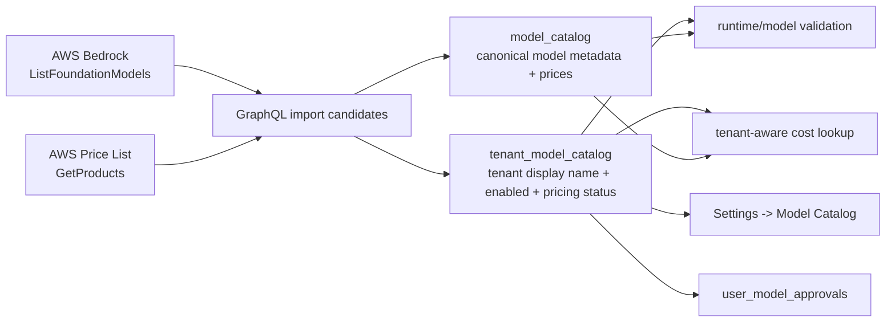

# feat: Add tenant model catalog management

## Overview

Add a tenant-admin Settings -> Model Catalog surface for managing which Bedrock
models a tenant can use. The plan keeps the existing global `model_catalog` as
the canonical Bedrock metadata/pricing registry, then adds a tenant-scoped
catalog layer for enabled state, pricing health, import provenance, and
tenant-specific display names.

This gives tenant admins a governed catalog without breaking existing model ID
references, user approval rows, agent profile model IDs, trace display helpers,
or cost attribution paths that already join through `model_catalog`.

---

## Problem Frame

Tenant admins need to import, name, inspect, enable, and disable Bedrock models
for their tenant. The current product already has a global `model_catalog` that
feeds model selectors, approvals, validation, and cost recording, but it is not a
tenant-admin-managed surface and currently makes availability global. The
implementation must preserve current model workflows while introducing tenant
governance, AWS-sourced model metadata, and AWS Price List-derived token costs
(see origin: `docs/brainstorms/2026-06-09-tenant-model-catalog-requirements.md`).

---

## Requirements Trace

- R1. Add a tenant-admin Model Catalog page using the existing Settings
  DataTable pattern.
- R2. Show provider, display name, model ID, input/output token costs, enabled
  status, and pricing/import health.
- R3. Show Bedrock as the v1 provider and surface available capability context.
- R4. Allow tenant admins to enable/disable eligible models; unpriced models
  remain disabled.
- R5. Add an import action backed by AWS Bedrock metadata, not a hard-coded UI
  list.
- R6. Show provider, name, model ID, capabilities, lifecycle, and pricing status
  in the import list.
- R7. Allow selecting one or more Bedrock models and setting display names before
  import.
- R8. Deduplicate imports by tenant and Bedrock model ID.
- R9. Populate token prices from AWS Price List APIs when possible.
- R10. Allow priced imports to be enabled during or immediately after import.
- R11. Import models with missing/ambiguous pricing disabled.
- R12. Make pricing resolution visible.
- R13. Allow display-name edits after import.
- R14. Keep provider/model ID/pricing source immutable when editing display name;
  use tenant display names wherever friendly names appear.
- R15. Make availability tenant-scoped.
- R16. Make runtime validation respect tenant catalog availability.
- R17. Constrain user-level approvals by the tenant catalog.
- R18. Use resolved tenant catalog prices for cost attribution.

**Origin actors:** A1 Tenant admin, A2 Tenant user, A3 ThinkWork runtime and
cost recorder, A4 AWS Bedrock and AWS Price List APIs.

**Origin flows:** F1 Admin reviews configured tenant models, F2 Admin imports
models from AWS Bedrock, F3 Admin edits a model display name.

**Origin acceptance examples:** AE1 configured-model DataTable, AE2 AWS-sourced
import and display names, AE3 unresolved pricing imports disabled, AE4 display
name edit preserves model ID, AE5 tenant-scoped availability.

---

## Scope Boundaries

- This does not add non-Bedrock providers in v1.
- This does not let tenant admins manually enter token prices when AWS pricing
  cannot be resolved.
- This does not cover imported custom models, provisioned throughput pricing,
  batch pricing, fine-tuning pricing, image pricing, embedding pricing, or
  Marketplace subscription management in v1.
- This does not replace user-level model approvals; tenant catalog availability
  becomes the upstream constraint.
- This does not define external customer billing or invoices.
- This does not require automatic periodic price refresh in v1, though import
  provenance should leave room for a later refresh flow.

---

## Context & Research

### Relevant Code and Patterns

- `packages/database-pg/src/schema/agents.ts` defines global `modelCatalog` and
  `userModelApprovals`; approvals currently reference `model_catalog.model_id`.
- `packages/database-pg/graphql/types/agents.graphql` exposes
  `ModelCatalogEntry`, `UserModelCatalogEntry`, `modelCatalog`,
  `userModelCatalog`, and `myApprovedModelCatalog`.
- `packages/api/src/lib/model-approvals.ts` centralizes user approval reads,
  writes, and `assertUserModelApproved`.
- `packages/api/src/graphql/resolvers/tenant-agent/modelCatalog.query.ts`
  currently returns globally available models.
- `packages/api/src/graphql/resolvers/agent-profiles/shared.ts`,
  `packages/api/src/lib/resolve-agent-runtime-config.ts`, and
  `packages/api/src/graphql/resolvers/evaluations/index.ts` validate models
  against global `model_catalog.is_available`.
- `packages/api/src/lib/cost-recording.ts` and
  `packages/api/src/lib/hindsight-cost.ts` try `model_catalog` first and then
  fall back to hard-coded model pricing.
- `apps/web/src/components/settings/SettingsUsers.tsx` is the closest Settings
  DataTable page pattern.
- `apps/web/src/components/settings/settings-nav.tsx` owns the Settings sidebar
  item list and operator-only visibility.
- `apps/web/src/lib/settings-queries.ts` holds typed Settings operations; the
  repo expects GraphQL codegen after schema/query edits.
- `scripts/seed-dev.sql` currently seeds global model catalog rows and should
  remain a compatibility seed until tenant import/backfill is in place.
- `terraform/modules/app/lambda-api/main.tf` already grants Bedrock invoke
  permissions to the shared API Lambda role; metadata import needs additional
  Bedrock control-plane read and AWS Pricing permissions.
- `scripts/build-lambdas.sh` bundles `graphql-http` with the special Bedrock SDK
  flags. `@aws-sdk/client-pricing` is not currently a dependency and should be
  bundled rather than externalized.

### Institutional Learnings

- `docs/solutions/design-patterns/audit-existing-ui-and-data-model-before-parallel-build-2026-04-28.md`
  argues for auditing existing UI/data substrates before creating parallel
  surfaces. Here the right move is to reuse Settings DataTable patterns and keep
  global `model_catalog` as the metadata substrate, adding only the tenant
  governance layer that the current model lacks.
- `docs/solutions/agent-profiles-pi-subagent-model-stacking-2026-06-07.md`
  makes Agent Profiles the supported model-stacking boundary. This plan must
  keep model availability and display names compatible with profile model
  validation and trace/cost evidence.
- `docs/solutions/workflow-issues/manually-applied-drizzle-migrations-drift-from-dev-2026-04-21.md`
  matters if the schema migration is hand-written; include `-- creates:` /
  `-- creates-column:` markers for the drift reporter.
- `docs/solutions/build-errors/worktree-stale-tsbuildinfo-drizzle-implicit-any-2026-04-24.md`
  is relevant when generated Drizzle/GraphQL types appear stale in a worktree.

### External References

- AWS Bedrock `ListFoundationModels` returns model metadata and capabilities,
  but not token pricing:
  `https://docs.aws.amazon.com/bedrock/latest/APIReference/API_ListFoundationModels.html`
- AWS SDK v3 `ListFoundationModelsCommand` exposes provider/name/model ID,
  modalities, streaming support, customizations, inference types, and lifecycle:
  `https://docs.aws.amazon.com/goto/SdkForJavaScriptV3/bedrock-2023-04-20/ListFoundationModels`
- AWS Price List APIs provide product attributes and SKU prices; AWS identifies
  `AmazonBedrockFoundationModels` as a service code example:
  `https://docs.aws.amazon.com/awsaccountbilling/latest/aboutv2/price-changes.html`
- AWS SDK v3 `PricingClient` / `GetProductsCommand` is the JS SDK surface for
  product pricing queries:
  `https://docs.aws.amazon.com/AWSJavaScriptSDK/v3/latest/client/pricing`

---

## Key Technical Decisions

- Keep `model_catalog` global and add a tenant catalog table. This avoids
  rewriting every model ID reference and lets current global seeds continue to
  act as canonical Bedrock metadata/pricing rows.
- Use tenant catalog rows for tenant-specific availability, display name,
  pricing health, and import provenance. Effective GraphQL model entries should
  be assembled from the tenant row plus the global metadata row.
- Treat the global `display_name` as canonical/default and the tenant catalog
  display name as the tenant-facing friendly label.
- Do AWS metadata/pricing lookup on the API side, not in the browser, so AWS
  credentials and pricing matching logic stay server-side.
- Add a dedicated pricing-resolution helper with explicit `resolved`,
  `missing`, `ambiguous`, and `error` outcomes. Unknown prices never become
  silent defaults.
- Keep cost fallback tables during migration, but make tenant-aware cost lookup
  prefer tenant-enabled catalog pricing before global/fallback pricing.
- Require tenant catalog availability before user approvals, agent profiles,
  eval model overrides, and runtime selected models accept a model.

---

## Open Questions

### Resolved During Planning

- Data model shape: keep global `model_catalog` and add a tenant-scoped catalog
  layer, rather than converting `model_catalog.model_id` uniqueness into a
  tenant-scoped unique key.
- Pricing failure behavior: preserve the brainstorm decision that unresolved or
  ambiguous pricing imports the tenant row disabled.
- AWS client placement: use `@aws-sdk/client-bedrock` plus
  `@aws-sdk/client-pricing` from `@thinkwork/api` / `graphql-http`.

### Deferred to Implementation

- Exact AWS Price List filters for all target text models: implementation should
  build a small resolver with fixtures from real `GetProducts` responses and
  make ambiguous matches explicit.
- Final naming of GraphQL operations and table fields: keep names close to
  existing `modelCatalog` / `userModelCatalog` conventions, but adapt to codegen
  constraints encountered during implementation.
- Whether current seed rows should be backfilled into every existing tenant or
  only the current tenant defaults: choose the smallest migration that preserves
  existing model selection, approvals, and runtime behavior in dev.

---

## High-Level Technical Design

> _This illustrates the intended approach and is directional guidance for review, not implementation specification. The implementing agent should treat it as context, not code to reproduce._

Effective tenant catalog entries are the join of:

- global `model_catalog`: stable provider/model ID/canonical name/cost and
  capability metadata;
- tenant catalog row: tenant ID, tenant-facing display name, enabled state,
  pricing health, import metadata, and timestamps.

---

## Implementation Units

- U1. **Add tenant catalog persistence**

**Goal:** Add tenant-scoped model catalog state without breaking existing global
model metadata and `model_id` references.

**Requirements:** R2, R4, R8, R11, R12, R13, R14, R15, R17, R18; supports AE3,
AE4, AE5.

**Dependencies:** None.

**Files:**

- Modify: `packages/database-pg/src/schema/agents.ts`
- Modify: `packages/database-pg/src/schema/index.ts`
- Modify: `packages/database-pg/graphql/types/agents.graphql`
- Create: `packages/database-pg/drizzle/0150_tenant_model_catalog.sql`
- Test: `packages/database-pg/__tests__/migration-0150-tenant-model-catalog.test.ts`

**Approach:**

- Add a `tenant_model_catalog` table keyed by tenant and `model_id`, referencing
  `tenants.id` and `model_catalog.model_id`.
- Store tenant-specific `display_name`, `enabled`, `pricing_status`,
  `pricing_source`, optional pricing diagnostics, import metadata, and
  timestamps.
- Keep `model_catalog.model_id` globally unique. Do not move provider/model ID
  metadata into tenant rows.
- Backfill tenant catalog rows for currently-used/default models so existing
  tenants do not lose model access when downstream reads become tenant-aware.
- Keep `user_model_approvals.model_id` as-is, but plan all joins/validators to
  require a matching enabled tenant catalog row.

**Execution note:** Characterization-first: add migration assertions before
changing approval/runtime helpers, because this table becomes an authorization
boundary.

**Patterns to follow:**

- `packages/database-pg/drizzle/0149_user_model_approvals.sql` for tenant/model
  migration style and marker comments.
- `packages/database-pg/src/schema/agents.ts` for colocating agent-governance
  catalog tables.

**Test scenarios:**

- Happy path: migration declares the tenant catalog table, tenant/model unique
  constraint, tenant FK, and model FK.
- Happy path: seed/backfill SQL creates tenant catalog rows for existing tenant
  default/agent/template models when corresponding global catalog rows exist.
- Edge case: duplicate `(tenant_id, model_id)` rows are rejected.
- Error path: tenant catalog rows cascade or are cleaned up consistently when a
  tenant is deleted.
- Integration: `user_model_approvals` rows remain valid after migration while
  tenant catalog rows become the new availability gate.

**Verification:**

- Database schema, migration tests, and generated snapshots reflect tenant
  catalog persistence with no loss of existing global `model_catalog` behavior.

---

- U2. **Implement tenant-aware model catalog services**

**Goal:** Centralize effective tenant catalog reads, imports, updates, approval
constraints, and cost lookup so GraphQL/UI/runtime do not reimplement joins.

**Requirements:** R4, R8, R9, R10, R11, R12, R15, R16, R17, R18; supports AE3,
AE5.

**Dependencies:** U1.

**Files:**

- Create: `packages/api/src/lib/model-catalog/tenant-catalog.ts`
- Create: `packages/api/src/lib/model-catalog/aws-bedrock-catalog.ts`
- Create: `packages/api/src/lib/model-catalog/aws-price-list.ts`
- Modify: `packages/api/src/lib/model-approvals.ts`
- Modify: `packages/api/src/lib/cost-recording.ts`
- Modify: `packages/api/src/lib/hindsight-cost.ts`
- Modify: `packages/api/package.json`
- Modify: `pnpm-lock.yaml`
- Test: `packages/api/src/lib/model-catalog/tenant-catalog.test.ts`
- Test: `packages/api/src/lib/model-catalog/aws-price-list.test.ts`
- Test: `packages/api/src/lib/model-approvals.test.ts`

**Approach:**

- Add `@aws-sdk/client-pricing` to `@thinkwork/api`. `graphql-http` already uses
  bundled SDK flags, so leave this package bundled rather than externalized.
- Build `listTenantModelCatalog`, `updateTenantModelCatalogEntry`,
  `importTenantBedrockModels`, and `assertTenantModelAvailable` helpers.
- Build Bedrock candidate listing with `ListFoundationModels` filtered toward
  text/on-demand foundation models for v1.
- Build AWS Price List resolution as a small, tested parser that can return:
  `resolved`, `missing`, `ambiguous`, or `error`, with raw match metadata kept
  only as diagnostics.
- Upsert canonical metadata/prices into global `model_catalog`, then upsert
  tenant display/enabled/pricing state into `tenant_model_catalog`.
- Update `listUserModelCatalog`, `listApprovedModelCatalog`, and
  `setUserModelApproval` to join through the effective tenant catalog so users
  cannot be approved for tenant-disabled or tenant-absent models.
- Update cost lookup to accept tenant context and prefer tenant-enabled resolved
  pricing before falling back to global/fallback pricing during migration.

**Execution note:** Test-first for AWS response parsing; use SDK response
fixtures rather than live AWS calls in unit tests.

**Patterns to follow:**

- `packages/api/src/lib/model-approvals.ts` for domain helper placement and
  typed errors.
- `packages/api/src/lib/cost-recording.ts` for existing fallback pricing
  behavior.
- `packages/api/src/graphql/resolvers/agent-profiles/shared.ts` for catalog
  availability validation expectations.

**Test scenarios:**

- Happy path: importing a Bedrock model with one resolved Price List match
  upserts global metadata, creates a tenant row, stores the admin display name,
  and allows enabled state.
- Covers AE3. Error path: no Price List match imports the tenant row disabled
  with `pricing_status = missing`.
- Covers AE3. Error path: multiple plausible Price List matches imports the row
  disabled with `pricing_status = ambiguous`.
- Edge case: importing a model already present for the tenant updates metadata
  safely without creating a duplicate tenant row.
- Error path: `setUserModelApproval` rejects tenant-disabled and tenant-absent
  models.
- Integration: `listApprovedModelCatalog` returns only approved models that are
  also enabled for the caller's tenant, with tenant display names.
- Integration: cost lookup for a tenant-enabled model returns catalog pricing;
  cost lookup for migration gaps still falls back rather than crashing.

**Verification:**

- Model-catalog helpers expose a single tenant-aware source of truth for
  GraphQL, approvals, runtime validation, and cost lookup.

---

- U3. **Expose tenant model catalog GraphQL API**

**Goal:** Add the GraphQL contract needed by Settings, import UI, display-name
edits, enable toggles, approvals, and downstream selectors.

**Requirements:** R1-R18; supports F1, F2, F3, AE1-AE5.

**Dependencies:** U1, U2.

**Files:**

- Modify: `packages/database-pg/graphql/types/agents.graphql`
- Modify: `packages/api/src/graphql/resolvers/tenant-agent/index.ts`
- Create: `packages/api/src/graphql/resolvers/tenant-agent/tenantModelCatalog.query.ts`
- Create: `packages/api/src/graphql/resolvers/tenant-agent/bedrockModelImportCandidates.query.ts`
- Create: `packages/api/src/graphql/resolvers/tenant-agent/importTenantBedrockModels.mutation.ts`
- Create: `packages/api/src/graphql/resolvers/tenant-agent/updateTenantModelCatalogEntry.mutation.ts`
- Modify: `packages/api/src/graphql/resolvers/tenant-agent/types.ts`
- Modify: `packages/api/src/__tests__/graphql-contract.test.ts`
- Test: `packages/api/src/graphql/resolvers/tenant-agent/tenantModelCatalog.resolver.test.ts`

**Approach:**

- Extend `ModelCatalogEntry` or add a tenant-specific type that includes
  effective display name, enabled state, pricing status, provider/model ID,
  token costs, and capability metadata.
- Keep the existing `modelCatalog` query compatible where possible, but make it
  resolve in the caller/tenant context or replace Settings usage with an
  explicit tenant catalog query.
- Add admin-only import candidate and mutation operations guarded by
  `requireTenantAdmin` / existing operator authorization patterns.
- Return disabled/unpriced rows from tenant management queries; keep user-facing
  selector queries approved-and-enabled only.
- Surface typed user-facing errors for AWS permission failures, pricing lookup
  failures, duplicate imports, and attempts to enable unpriced rows.
- Regenerate schema/codegen for all consumers after GraphQL changes.

**Patterns to follow:**

- `packages/api/src/graphql/resolvers/tenant-agent/userModelCatalog.query.ts`
  for tenant admin auth and tenant ownership checks.
- `packages/api/src/graphql/resolvers/tenant-agent/setUserModelApproval.mutation.ts`
  for mutation resolver shape.
- `packages/database-pg/graphql/types/agents.graphql` for keeping catalog types
  near agent governance.

**Test scenarios:**

- Covers AE1. Admin query returns enabled and disabled tenant catalog rows with
  display name, provider, model ID, costs, enabled state, and pricing status.
- Covers AE2. Import candidate query maps Bedrock summaries and pricing status
  into selectable rows.
- Covers AE3. Import mutation returns disabled entries when pricing is missing
  or ambiguous.
- Covers AE4. Display-name update returns the tenant display name while
  preserving provider/model ID.
- Covers AE5. Non-admin callers cannot import, enable, disable, or rename tenant
  catalog entries.
- Error path: enabling an unpriced row fails loudly and does not mutate the row.

**Verification:**

- GraphQL schema and generated documents support tenant catalog management while
  existing approved-model queries keep working with tenant-aware constraints.

---

- U4. **Build the Settings Model Catalog page**

**Goal:** Give tenant admins a usable Settings page for reviewing configured
models, importing Bedrock models, editing display names, and toggling eligible
models.

**Requirements:** R1-R14; supports F1, F2, F3, AE1-AE4.

**Dependencies:** U3.

**Files:**

- Create: `apps/web/src/routes/_authed/settings.model-catalog.tsx`
- Create: `apps/web/src/components/settings/SettingsModelCatalog.tsx`
- Modify: `apps/web/src/components/settings/settings-nav.tsx`
- Modify: `apps/web/src/lib/settings-queries.ts`
- Modify: `apps/web/src/routeTree.gen.ts`
- Modify: `apps/web/src/gql/graphql.ts`
- Modify: `apps/web/src/gql/gql.ts`
- Test: `apps/web/src/components/settings/SettingsModelCatalog.test.tsx`
- Test: `apps/web/src/components/settings/settings-nav.test.ts`

**Approach:**

- Add an operator-only "Model Catalog" Settings nav item with an appropriate
  icon and route.
- Use `SettingsTablePane`, `DataTable`, and the table/search conventions from
  `SettingsUsers`.
- Columns should include display name, provider, model ID, input/output costs,
  capability/lifecycle/pricing badges, and enabled state.
- Add an import dialog/sheet that loads AWS Bedrock import candidates, supports
  selecting multiple rows, allows display-name confirmation/editing, and clearly
  labels priced versus unpriced/ambiguous candidates.
- Disable the enabled toggle for rows with unresolved pricing and show the
  reason inline.
- Add a display-name edit affordance that updates only the tenant display name.
- Use concise operational UI copy; no in-app explanatory text beyond row state,
  errors, and labels needed for the workflow.

**Patterns to follow:**

- `apps/web/src/components/settings/SettingsUsers.tsx` for DataTable, search,
  actions, and error states.
- `apps/web/src/components/settings/UserModelsSection.tsx` for model cost
  formatting helpers.
- `apps/web/src/components/settings/settings-nav.tsx` for operator-only
  Settings navigation.

**Test scenarios:**

- Covers AE1. Configured models render with provider, display name, model ID,
  token costs, and enabled state.
- Covers AE2. Import action opens AWS-sourced candidates, allows multi-select,
  and submits display names.
- Covers AE3. Unpriced candidate/row is visibly disabled and cannot be enabled.
- Covers AE4. Editing a display name updates the row without changing model ID.
- Error path: import/query/mutation errors show retryable or actionable UI state
  without corrupting local table state.
- Edge case: duplicate existing tenant models appear as already imported or are
  not selectable for import.

**Verification:**

- Settings -> Model Catalog behaves like a first-class operator table and
  handles priced, unpriced, imported, duplicate, loading, empty, and error
  states.

---

- U5. **Update downstream model consumers to respect tenant catalog entries**

**Goal:** Ensure model selectors, approvals, agent profiles, eval overrides,
runtime config, traces, analytics, and cost attribution use tenant availability
and tenant display names where appropriate.

**Requirements:** R14-R18; supports AE4, AE5.

**Dependencies:** U2, U3.

**Files:**

- Modify: `packages/api/src/graphql/resolvers/agent-profiles/shared.ts`
- Modify: `packages/api/src/graphql/resolvers/agent-profiles/agentProfileEditorCatalog.query.ts`
- Modify: `packages/api/src/lib/resolve-agent-runtime-config.ts`
- Modify: `packages/api/src/graphql/resolvers/evaluations/index.ts`
- Modify: `packages/api/src/lib/cost-recording.ts`
- Modify: `packages/api/src/lib/hindsight-cost.ts`
- Modify: `apps/web/src/components/agents/ModelSelect.tsx`
- Modify: `apps/web/src/components/settings/UserModelsSection.tsx`
- Modify: `apps/web/src/components/settings/SettingsAgents.tsx`
- Modify: `apps/web/src/components/settings/SettingsAnalytics.tsx`
- Modify: `apps/web/src/components/settings/SettingsActivityExecutionTrace.tsx`
- Test: `packages/api/src/lib/__tests__/resolve-agent-runtime-config.test.ts`
- Test: `packages/api/src/graphql/resolvers/agent-profiles/agentProfiles.resolver.test.ts`
- Test: `packages/api/src/graphql/resolvers/evaluations/index.test.ts`
- Test: `packages/api/src/__tests__/cost-recording.test.ts`
- Test: `apps/web/src/components/settings/UserModelsSection.test.tsx`
- Test: `apps/web/src/components/settings/SettingsActivityThreadDetail.test.tsx`

**Approach:**

- Replace direct `model_catalog.is_available` checks in tenant/runtime contexts
  with tenant-aware helper calls.
- Keep user-facing approved model lists limited to rows approved for the user and
  enabled for the tenant.
- Make agent profile editor catalogs use tenant-enabled entries.
- Make eval model overrides validate against the tenant catalog, not global
  availability alone.
- Feed tenant display names into trace and analytics display mapping when a
  tenant context is available.
- Keep model IDs as the stable runtime value everywhere; display names are UI
  labels only.
- Preserve fallback pricing during migration, but prefer tenant catalog pricing
  whenever tenant ID is known.

**Patterns to follow:**

- Existing `SettingsModelCatalogQuery` usage in analytics/activity trace
  components.
- Existing approval helpers in `packages/api/src/lib/model-approvals.ts`.
- Agent profile solution notes in
  `docs/solutions/agent-profiles-pi-subagent-model-stacking-2026-06-07.md`.

**Test scenarios:**

- Covers AE5. Runtime config rejects a model absent or disabled in the tenant
  catalog.
- Covers AE5. Agent profile creation/update rejects tenant-disabled models.
- Covers AE5. Eval model override rejects tenant-disabled models.
- Covers AE4. Trace/activity/analytics display tenant display names while
  preserving raw model IDs in tooltips or metadata.
- Integration: user approval Settings no longer lists tenant-disabled models as
  approvable.
- Error path: existing cost recording does not fail when an older event lacks a
  tenant catalog row; it uses documented fallback behavior.

**Verification:**

- No tenant-facing or runtime path can accidentally use a globally seeded model
  that the tenant has not enabled.

---

- U6. **Add AWS IAM and deployment wiring**

**Goal:** Let `graphql-http` list Bedrock foundation models and query AWS Price
List without bloating Lambda env vars or relying on browser-side credentials.

**Requirements:** R5, R6, R9, R11, R12.

**Dependencies:** U2, U3.

**Files:**

- Modify: `terraform/modules/app/lambda-api/main.tf`
- Modify: `packages/api/package.json`
- Modify: `pnpm-lock.yaml`
- Test: `apps/cli/__tests__/terraform-root.test.ts`

**Approach:**

- Add Bedrock read permission for `bedrock:ListFoundationModels` on `*` or the
  narrowest AWS-supported resource scope for list operations.
- Add AWS Price List permissions for `pricing:DescribeServices`,
  `pricing:GetAttributeValues`, and `pricing:GetProducts`.
- Prefer a managed policy attachment if inline policy size is a concern; the
  lambda-api module already documents pressure on the shared Lambda role's
  inline policy budget.
- Do not add new `graphql-http` environment variables unless implementation
  proves they are necessary; this Lambda is already close to the 4 KB env limit.
- Keep `@aws-sdk/client-pricing` bundled into `graphql-http` by not adding it to
  the `BUNDLED_AGENTCORE_ESBUILD_FLAGS` external list.

**Patterns to follow:**

- `terraform/modules/app/lambda-api/main.tf` managed policies for Bedrock KB and
  Cognee health where inline size is a concern.
- `scripts/build-lambdas.sh` bundled-SDK allowlist comments.

**Test scenarios:**

- Static/IaC: Terraform policy includes Bedrock list and Price List query
  actions scoped appropriately.
- Static/IaC: packaged Terraform fixtures include the new IAM policy or
  attachment so published CLI deployments receive the permission change.
- Build packaging: `graphql-http` bundle includes `@aws-sdk/client-pricing`
  rather than externalizing it.
- Error path: GraphQL import candidate resolver maps AWS access denied into a
  clear admin-facing error.

**Verification:**

- Deployed API role can perform Bedrock model listing and Price List lookup from
  the GraphQL import flow.

---

- U7. **Regenerate schemas, update docs, and verify end to end**

**Goal:** Keep generated consumers, docs, and verification aligned with the new
tenant model catalog contract.

**Requirements:** R1-R18; supports all A/F/AE IDs.

**Dependencies:** U1-U6.

**Files:**

- Modify: `packages/database-pg/graphql/schema.graphql`
- Modify: `terraform/schema.graphql`
- Modify: `apps/web/src/gql/graphql.ts`
- Modify: `apps/web/src/gql/gql.ts`
- Modify: `apps/mobile/lib/gql/graphql.ts`
- Create: `docs/src/content/docs/applications/admin/model-catalog.mdx`
- Modify: `docs/src/content/docs/applications/admin/agent-templates.mdx`
- Modify: `docs/src/content/docs/applications/admin/evaluations.mdx`
- Create: `docs/verification/model-catalog-import-e2e.md`
- Test: `apps/web/src/components/settings/SettingsModelCatalog.test.tsx`

**Approach:**

- Regenerate GraphQL artifacts for every consumer with a `codegen` script:
  `apps/cli`, `apps/web`, `apps/mobile`, and `packages/api`.
- Run schema build so AppSync subscription schema stays in sync with canonical
  GraphQL sources.
- Document the admin Model Catalog workflow, the disabled-until-priced rule, and
  how tenant catalog availability interacts with user model approvals.
- Add an e2e verification runbook covering import candidates, priced import,
  unpriced disabled import, display-name edit, user approval constraints, and a
  runtime rejection for tenant-disabled models.

**Patterns to follow:**

- Existing admin docs under `docs/src/content/docs/applications/admin/`.
- Existing verification runbooks such as `docs/verification/model-stacking-e2e.md`.
- AGENTS.md GraphQL regeneration guidance.

**Test scenarios:**

- Integration: generated GraphQL types compile in web/mobile/API consumers.
- Documentation: model catalog docs mention AWS Price List pricing, unresolved
  pricing disabled state, and tenant/user approval relationship.
- E2E runbook: priced model import can be enabled and appears in user approval
  settings.
- E2E runbook: unpriced/ambiguous model import remains disabled and cannot be
  approved for a user.
- E2E runbook: tenant display name appears in Settings/trace displays while
  runtime payload still uses the Bedrock model ID.

**Verification:**

- The implementation is documented, generated artifacts are current, and the
  verification path proves the product flow from AWS import through runtime
  validation.

---

## System-Wide Impact

- **Interaction graph:** Settings UI -> GraphQL tenant catalog resolvers ->
  tenant/global catalog helpers -> Bedrock/Pricing SDK clients -> runtime,
  approvals, agent profiles, evals, traces, analytics, and cost recorders.
- **Error propagation:** AWS list/pricing failures must surface as import
  candidate or import errors; pricing ambiguity must be represented as row state,
  not swallowed as null pricing or fallback pricing.
- **State lifecycle risks:** Partial imports can create global metadata without
  an enabled tenant row; this is acceptable only if the tenant row records
  disabled pricing state and the mutation is idempotent.
- **API surface parity:** Web, mobile, CLI, and API generated GraphQL types must
  all regenerate after schema changes, even if only web renders the first
  management surface.
- **Integration coverage:** Unit tests alone will not prove that tenant catalog
  gating reaches runtime, approvals, agent profiles, and evals; add integration
  resolver/helper tests that cross those layers.
- **Unchanged invariants:** Runtime calls continue to use Bedrock model IDs, not
  display names. User approvals remain per-user. The global `model_catalog`
  remains the canonical metadata/pricing registry.

---

## Risks & Dependencies

| Risk                                                            | Mitigation                                                                                                                   |
| --------------------------------------------------------------- | ---------------------------------------------------------------------------------------------------------------------------- |
| AWS Price List products do not map cleanly to Bedrock model IDs | Keep pricing resolver isolated, fixture-driven, and explicit about `missing` / `ambiguous`; import disabled when unresolved. |
| Tenant scoping breaks existing model selectors                  | Backfill tenant rows for current defaults and update selectors through shared tenant-aware helpers.                          |
| Cost attribution silently uses old fallback prices              | Prefer tenant-aware catalog pricing where tenant ID is known; preserve fallback only for migration gaps and older events.    |
| Lambda role inline policy size grows too large                  | Use managed policy attachment for Bedrock list / Pricing permissions if inline size is risky.                                |
| GraphQL codegen drift breaks web/mobile/API builds              | Treat schema/codegen regeneration as its own implementation unit and include all consumers with codegen scripts.             |
| New Settings page duplicates existing table/search patterns     | Reuse `SettingsTablePane`, `DataTable`, and existing settings nav conventions.                                               |

---

## Documentation / Operational Notes

- Add admin docs for Model Catalog and clarify that unresolved pricing disables
  imported models until AWS pricing can be resolved.
- Add a verification runbook for import and runtime validation.
- After merge, deployed stacks need the new Lambda IAM permissions before import
  candidates can work.
- Dev data may need a one-time tenant catalog backfill from existing global
  model seeds and tenant defaults.

---

## Sources & References

- **Origin document:** `docs/brainstorms/2026-06-09-tenant-model-catalog-requirements.md`
- Related requirements: `docs/brainstorms/2026-06-06-model-stacking-tool-routing-requirements.md`
- Related solution: `docs/solutions/agent-profiles-pi-subagent-model-stacking-2026-06-07.md`
- Related solution: `docs/solutions/design-patterns/audit-existing-ui-and-data-model-before-parallel-build-2026-04-28.md`
- Related solution: `docs/solutions/workflow-issues/manually-applied-drizzle-migrations-drift-from-dev-2026-04-21.md`
- Related code: `packages/database-pg/src/schema/agents.ts`
- Related code: `packages/api/src/lib/model-approvals.ts`
- Related code: `apps/web/src/components/settings/SettingsUsers.tsx`
- External docs: `https://docs.aws.amazon.com/bedrock/latest/APIReference/API_ListFoundationModels.html`
- External docs: `https://docs.aws.amazon.com/goto/SdkForJavaScriptV3/bedrock-2023-04-20/ListFoundationModels`
- External docs: `https://docs.aws.amazon.com/awsaccountbilling/latest/aboutv2/price-changes.html`
- External docs: `https://docs.aws.amazon.com/AWSJavaScriptSDK/v3/latest/client/pricing`
