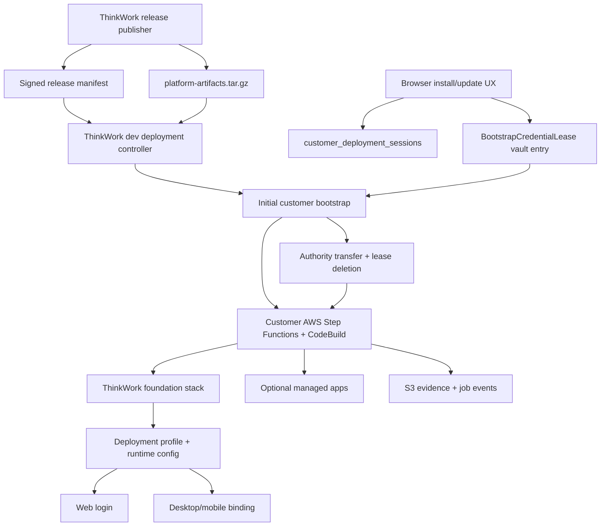

# feat: Deployment Controller Process

## Overview

Make the deployment controller the normal way ThinkWork installs, updates, and
tears down environments. The release manifest becomes the install/update
contract; GitHub Actions can still publish ThinkWork releases, but it should no
longer be the deployment authority for ThinkWork dev or customer environments.

The first milestone is to move ThinkWork dev onto the same controller path that
customers will use. After dev proves the loop, the browser-first installer uses
a short-lived `BootstrapCredentialLease` to create the customer-owned controller
inside the customer AWS account, transfers authority to that controller, deletes
the lease, and then runs all future install/update/teardown/optional-app work
from customer AWS.

TEI is the first customer-environment proving run. It should prove not just that
Terraform can create resources, but that release selection, runtime config,
first-admin login, managed-app lifecycle, update, evidence, and teardown all run
through the new deployment process.

## Problem Frame

ThinkWork has outgrown a GitHub Actions deployment model. The current system has
made progress toward GitHub-free deployment, but it is split across partially
connected pieces:

- Release publishing now creates a cleaner deployable asset set. As of
  `v0.1.0-canary.134`, the release contains `thinkwork-release.json` and
  `platform-artifacts.tar.gz` instead of a human-facing pile of Lambda zips.
  The observed asset list does not include a detached signature yet, so signed
  manifest publication must be made explicit before customer proof.
- `packages/release-manifest` already models signed release manifests,
  compatibility, runtime images, managed-app descriptors, and artifact bundles.
- `terraform/modules/app/deployment-control-plane` creates Step Functions,
  CodeBuild, evidence, SSM, AppConfig, and Secrets Manager plumbing.
- `terraform/modules/app/deployment-control-plane/runner.py` can run Terraform,
  initialize the database, write profile outputs, and sync static assets, but it
  still expects per-artifact URLs while current cleaned-up releases bundle
  backend artifacts.
- `packages/api/src/handlers/deployment-sessions.ts` and
  `apps/web/src/routes/onboarding/welcome.tsx` already have browser-first
  deployment sessions, timeline UI, and teardown hooks, but they do not yet have
  secure AWS credential lease ingestion or customer-owned authority transfer.
- Managed-app planning exists in `packages/api/src/graphql/resolvers/deployments`
  and `packages/deployment-runner`, but it must be wired to the same real
  controller and release contract as full-environment installs.

This plan is the corrective pass: finish the actual controller authority model
before adding more deployment UI surface area.

## Requirements Trace

This plan carries forward the actors, flows, requirements, and acceptance
examples from the origin document:
`docs/brainstorms/2026-06-06-github-free-customer-deployments-requirements.md`.

- R1/R7/R23/R24. Release manifests, not source checkouts or customer GitHub
  workflows, are the install and update contract.
- R2/R4/R8/R9. Initial bootstrap collects AWS environment and first-admin
  information, deploys only what is needed to log in and operate, and completes
  first-admin ownership through the deployed environment.
- R3/R6/R17. After bootstrap, deployment authority and configuration live in the
  customer AWS account.
- R11-R18. Managed applications are operated from Spaces with plan, approval,
  evidence, and teardown through the customer controller.
- R19-R22. Universal desktop/mobile clients bind to a deployment profile instead
  of requiring customer-specific builds.
- R25. Deployments preserve enough evidence for customer admins and ThinkWork
  support to debug failures without a GitHub Actions run.

New requirements for this corrective plan:

- DP1. The browser may store only an opaque deployment-session resume token
  before AWS resources exist. It must not store AWS credentials, first-admin
  passwords, Terraform variables, or bearer tokens in local storage.
- DP2. `BootstrapCredentialLease` stores temporary customer bootstrap authority
  only in a server-side vault, with TTL, audit events, least practical scope,
  no plaintext logs, and automatic deletion after authority transfer.
- DP3. ThinkWork dev must dogfood the deployment controller before TEI is
  treated as the first customer proof.
- DP4. The controller must consume the bundled release asset contract now shown
  on GitHub releases: desktop installers/updater metadata for humans, signed
  manifest and platform bundle for machines, not 100+ backend zip assets.
- DP5. Teardown must be available from every in-progress deployment session and
  must be able to destroy partially created resources using recorded state when
  present and tag/session recovery when state is not yet complete.
- DP6. Slack and Stripe remain optional integrations and must not be required or
  enabled by the base install.

## Scope

### In Scope

- Signed release manifest and platform bundle as the deployment contract.
- Real Step Functions/CodeBuild deployment controller for install, update,
  teardown, and optional managed apps.
- Browser-first deployment UX backed by durable server-side session state.
- `BootstrapCredentialLease` lifecycle and authority transfer into customer AWS.
- Migration of ThinkWork dev away from GitHub Actions as deployment authority.
- TEI end-to-end proving run with evidence and teardown.
- Documentation updates for operators and support.

### Out of Scope

- Non-AWS deployment targets.
- Custom domains as a bootstrap blocker.
- Customer-specific desktop/mobile binaries.
- A generic third-party marketplace.
- Hosted-SaaS style permanent custody of customer AWS credentials.
- Manual production mutation as the normal recovery path.

## Key Decisions

- **Release manifest is the contract.** The controller chooses a release by
  manifest URL and digest, verifies it, downloads the platform bundle, verifies
  contained artifacts, and records the manifest digest on every job.
- **Dev moves first.** ThinkWork dev should be the first environment deployed by
  this controller. Customer rollout starts only after dev can update through the
  same manifest/controller path.
- **Credentials are leased, not stored.** The browser receives a possession
  token for session resume. Temporary AWS bootstrap authority is stored in
  ThinkWork dev AWS Secrets Manager under a `BootstrapCredentialLease` record
  and deleted after the customer controller can run in customer AWS.
- **Authority transfer is explicit.** The successful bootstrap terminal state is
  not "Terraform applied"; it is "customer AWS controller owns future
  operations, selected release/config/profile are stored in customer AWS, and
  the bootstrap lease is revoked/deleted."
- **Browser is primary.** The web application is the primary install/update
  surface so local dev can iterate on UX. CLI commands remain support and
  recovery tools.
- **Optional apps stay optional.** Base install creates ThinkWork foundation
  only. Cognee, Twenty, Slack, Stripe, and later apps are selected after the
  environment is reachable unless the release/runbook explicitly marks them as
  required.

## Architecture

The important ownership boundary is after transfer: ThinkWork dev can continue
to publish releases and host the initial web installer, but the customer AWS
controller owns future mutations for that customer environment. After the
customer app URL is live, normal install completion, updates, managed apps, and
teardown should run from that customer environment's web app and controller,
not from `app.thinkwork.ai` holding long-lived customer authority.

## Existing Patterns To Follow

- `packages/release-manifest/src/index.ts` for manifest validation, digesting,
  signatures, compatibility, runtime images, managed-app descriptors, and
  artifact bundles.
- `scripts/release/build-release-manifest.ts`,
  `scripts/release/package-platform-artifacts.sh`, and
  `scripts/release/publish-release-assets.sh` for release construction.
- `.github/workflows/release.yml` for release publishing. Keep it focused on
  build/publish, not environment mutation.
- `terraform/modules/app/deployment-control-plane` for the AWS-native
  controller substrate.
- `terraform/modules/app/deployment-control-plane/runner.py` for current
  controller execution behavior, Terraform rendering, profile output, database
  initialization, and static sync.
- `packages/api/src/handlers/deployment-sessions.ts` for browser-first session
  creation, possession-token authorization, run start, and teardown endpoints.
- `packages/database-pg/src/schema/deployments.ts` for deployment session,
  managed application, deployment job, and event tables.
- `apps/web/src/routes/onboarding/welcome.tsx` for logged-out "Create New
  Environment" timeline UX.
- `packages/api/src/graphql/resolvers/deployments` and
  `apps/web/src/components/settings/managed-applications` for managed-app
  plan/approval/status patterns.
- `apps/web/src/lib/deployment-profile.ts`,
  `apps/web/src/routes/sign-in.tsx`, and `apps/web/src/routes/deployment-profile.tsx`
  for deployment profile display and login binding.

## Implementation Units

### U1. Make Bundled Release Manifests Executable By The Controller

**Goal:** The controller can install/update from the cleaned-up release asset
contract: `thinkwork-release.json` plus `platform-artifacts.tar.gz`.

**Files:**

- `packages/release-manifest/src/index.ts`
- `packages/release-manifest/test/manifest.test.ts`
- `scripts/release/build-release-manifest.ts`
- `scripts/release/__tests__/build-release-manifest.test.ts`
- `scripts/release/package-platform-artifacts.sh`
- `scripts/release/publish-release-assets.sh`
- `terraform/modules/app/deployment-control-plane/runner.py`
- `terraform/modules/app/deployment-control-plane/buildspec.yml`
- `docs/src/content/docs/deploy/release-manifests.mdx`

**Work:**

- Treat `artifactBundles` as first-class install sources.
- Resolve releases by explicit version/tag plus manifest digest. Do not use the
  GitHub Release "Latest" badge as deployment authority because prerelease and
  canary labelling can lag the actual release under test.
- Publish and consume a detached manifest signature, or explicitly mark an
  unsigned canary as dev-only. Customer and TEI runs should fail closed when a
  trusted signature is required but absent.
- Teach `runner.py` to download the platform bundle, verify bundle SHA-256,
  extract it safely, verify every contained artifact named by the manifest, and
  stage Lambda/static artifacts from extracted paths.
- Preserve support for explicit per-artifact URLs only as compatibility, not as
  the expected path for new releases.
- Fail closed on missing bundle URL, missing contained artifact, checksum
  mismatch, path traversal, unsupported schema, or compatibility mismatch.
- Record manifest digest, bundle digest, extracted artifact digests, and release
  version in evidence.

**Tests:**

- `packages/release-manifest/test/manifest.test.ts`
  - accepts a manifest with `artifactBundles`.
  - rejects bundles whose `contains` list names missing artifacts.
  - rejects duplicate artifact names.
- `scripts/release/__tests__/build-release-manifest.test.ts`
  - builds a bundled release where individual backend artifact URLs are null.
  - supports explicit bundle URLs.
- Add Python unit coverage in
  `terraform/modules/app/deployment-control-plane/test_runner_bundle.py` for
  `runner.py` extraction helpers.
  - bundle extraction rejects `../` paths.
  - extracted artifact hashes must match the manifest.
  - missing `platform-artifacts.tar.gz` blocks deploy before Terraform.

**Acceptance:**

- A canary release with only `thinkwork-release.json` and
  `platform-artifacts.tar.gz` can be consumed by the controller without adding
  every Lambda zip back to the GitHub Release asset list.

### U2. Finish The Full-Environment Controller Run Contract

**Goal:** Step Functions and CodeBuild can plan, apply, update, and destroy a
ThinkWork foundation stack from a release manifest without GitHub Actions or a
local Terraform process.

**Files:**

- `terraform/modules/app/deployment-control-plane/main.tf`
- `terraform/modules/app/deployment-control-plane/variables.tf`
- `terraform/modules/app/deployment-control-plane/outputs.tf`
- `terraform/modules/app/deployment-control-plane/runner.py`
- `terraform/modules/thinkwork/variables.tf`
- `terraform/modules/thinkwork/outputs.tf`
- `apps/cli/src/commands/enterprise/aws-deployments.ts`
- `apps/cli/src/commands/enterprise/bootstrap.ts`
- `packages/api/src/handlers/deployment-sessions.ts`
- `packages/api/src/handlers/deployment-sessions.test.ts`
- `scripts/smoke/foundation-bootstrap-smoke.mjs`

**Work:**

- Define a stable controller input envelope for `plan`, `deploy`, `update`, and
  `destroy`.
- Make plan output durable: Terraform plan artifact, redacted variables,
  manifest/bundle digests, resource summary, and expected runtime-profile
  outputs.
- Make apply output durable: Terraform outputs, runtime config, database
  bootstrap status, static sync status, smoke contract status, and profile JSON.
- Make destroy work for both clean state and partial session recovery.
- Persist controller outputs back to SSM/AppConfig and deployment session events.
- Ensure base install keeps Slack and Stripe disabled unless explicitly
  selected.

**Tests:**

- `packages/api/src/handlers/deployment-sessions.test.ts`
  - start sends `action=deploy` with release/digest/session metadata.
  - teardown sends `action=destroy` and remains idempotent.
  - runner-not-configured sessions stay resumable.
- Add or extend Terraform validation coverage for
  `terraform/modules/app/deployment-control-plane`.
- `scripts/smoke/foundation-bootstrap-smoke.mjs`
  - validates runtime config fields written by the controller.
  - records deployment controller output fields without secrets.

**Acceptance:**

- A controller execution can deploy, update, and destroy foundation resources in
  an isolated AWS account using only a manifest URL/digest and session input.

### U3. Move ThinkWork Dev To The Deployment Controller First

**Goal:** ThinkWork dev dogfoods the same release/controller path before TEI or
other customer environments rely on it.

**Files:**

- `.github/workflows/deploy.yml`
- `.github/workflows/release.yml`
- `apps/cli/src/commands/deploy.ts`
- `apps/cli/src/commands/release.ts`
- `terraform/examples/greenfield/main.tf`
- `terraform/examples/greenfield/variables.tf`
- `docs/src/content/docs/deploy/github-free-customer-deployments.mdx`
- `docs/src/content/docs/deploy/release-manifests.mdx`
- `docs/verification/tei-new-environment-deployment-e2e.md`

**Work:**

- Keep GitHub Actions responsible for building, testing, and publishing releases.
- Stop treating GitHub Actions as the dev environment's steady-state Terraform
  apply authority.
- Add a dev controller configuration that pins manifest URL and digest.
- Add a dev release-update path that starts the deployment controller, records
  evidence, and runs foundation smoke before considering dev updated.
- Update docs to say the dev environment is the first controller-managed
  environment and customer rollout depends on that proof.

**Tests:**

- Workflow/static tests verifying `.github/workflows/release.yml` publishes
  assets but does not deploy customer/dev infrastructure.
- CLI tests around release selection and controller trigger payloads.
- Smoke evidence validation for dev update jobs.

**Acceptance:**

- A new ThinkWork dev update can be performed by selecting a release manifest
  and running the dev deployment controller, not by directly applying Terraform
  from GitHub Actions.

### U4. Add BootstrapCredentialLease

**Goal:** The initial browser-first bootstrap can temporarily use customer AWS
authority without storing customer credentials permanently or in browser state.

**Files:**

- `packages/database-pg/src/schema/deployments.ts`
- `packages/database-pg/graphql/types/deployments.graphql`
- `packages/database-pg/drizzle/*`
- `packages/api/src/handlers/deployment-sessions.ts`
- `packages/api/src/handlers/deployment-sessions.test.ts`
- `packages/api/src/lib/bootstrap-credential-lease.ts`
- `terraform/modules/app/lambda-api/*`
- `apps/web/src/lib/deployment-sessions.ts`
- `apps/web/src/routes/onboarding/welcome.tsx`
- `apps/web/src/routes/onboarding/-welcome.test.ts`

**Work:**

- Introduce `BootstrapCredentialLease` metadata tied to
  `customer_deployment_sessions`.
- Store credential material only in AWS Secrets Manager, encrypted with KMS and
  addressed by secret ARN from the lease record.
- Store only a hash/fingerprint, expiration, status, and audit metadata in the
  database.
- Support lease states: `pending`, `validated`, `in_use`, `transferred`,
  `revoked`, `expired`, `failed_cleanup`.
- Accept only short-lived bootstrap credentials or an assumable role/external-id
  handoff. Do not support permanent access keys as a happy path.
- Redact all credential material from logs, DB rows, events, telemetry, and
  evidence.
- Extend browser UX to collect/validate AWS connection details without storing
  them in local storage. Local storage keeps only the existing opaque resume
  token.

**Tests:**

- `packages/api/src/handlers/deployment-sessions.test.ts`
  - create/start never persists AWS secret values in session config or events.
  - lease validation rejects expired credentials.
  - revoke deletes the Secrets Manager value or marks cleanup failure.
  - local session token hash continues to gate reads/teardown.
- `apps/web/src/routes/onboarding/-welcome.test.ts`
  - credential form does not write credential fields to local storage.
  - teardown remains available after credential connection.

**Acceptance:**

- Before customer AWS resources exist, recoverable deployment state lives in
  ThinkWork dev DB plus a server-side Secrets Manager lease. The browser stores
  only an opaque resume token.

### U5. Transfer Authority Into The Customer AWS Account

**Goal:** Successful bootstrap ends with the customer controller owning all
future mutations and the ThinkWork-hosted lease gone.

**Files:**

- `terraform/modules/app/deployment-control-plane/main.tf`
- `terraform/modules/app/deployment-control-plane/outputs.tf`
- `terraform/modules/app/deployment-control-plane/runner.py`
- `terraform/modules/thinkwork/main.tf`
- `terraform/modules/thinkwork/outputs.tf`
- `packages/api/src/handlers/deployment-sessions.ts`
- `packages/api/src/lib/bootstrap-credential-lease.ts`
- `packages/deployment-profile/src/index.ts`
- `apps/web/src/lib/deployment-profile.ts`
- `docs/src/content/docs/deploy/deployment-profiles.mdx`

**Work:**

- During bootstrap, create the customer-owned Step Functions, CodeBuild, state
  bucket, lock table, evidence bucket, SSM/AppConfig pointers, IAM roles, and
  runtime profile outputs.
- Write selected release version, manifest URL, manifest digest, profile JSON,
  and controller ARNs into customer AWS.
- Verify the customer controller can start a self-owned no-op/status execution.
- Mark the session as `authority_transferred` only after the customer
  controller and profile outputs are readable from customer AWS.
- Delete or revoke the `BootstrapCredentialLease` immediately after transfer.
- Make failed transfer recoverable: either retry with the same lease while it is
  valid or teardown and revoke.

**Tests:**

- Unit tests for transfer state transitions in
  `packages/api/src/handlers/deployment-sessions.test.ts`.
- Runner tests that customer profile output contains API, GraphQL/AppSync,
  Cognito/Auth, stage, region, account, release version, and issued timestamp.
- Terraform output tests or validation for controller ARN/profile outputs.

**Acceptance:**

- After bootstrap, an update or teardown request can run using customer-owned
  controller authority without reading the ThinkWork-hosted bootstrap lease.

### U6. Finish Browser UX For Install, Update, Teardown, And Optional Apps

**Goal:** Operators can run the standard deployment runbook from the web app
with a step timeline, loading states, resume, update, teardown, and optional-app
selection.

**Files:**

- `apps/web/src/routes/onboarding/welcome.tsx`
- `apps/web/src/routes/onboarding/-welcome.test.ts`
- `apps/web/src/lib/deployment-sessions.ts`
- `apps/web/src/components/settings/managed-applications/*`
- `apps/web/src/lib/settings-queries.ts`
- `packages/api/src/handlers/deployment-sessions.ts`
- `packages/api/src/graphql/resolvers/deployments/*`
- `packages/database-pg/graphql/types/deployments.graphql`

**Work:**

- Replace the current placeholder-ish AWS connection step with a clear form and
  connection validation state.
- Show timeline states for intake, AWS lease, foundation, stack deploy,
  authority transfer, first admin, optional apps, profile, update, and teardown.
- Show a real executing/loading state for the active step.
- Keep teardown visible and callable at every step after session creation.
- Add release selection/update UI driven by available signed manifests.
- Keep Slack and Stripe out of base install; expose them later as optional
  integrations only when descriptors exist.
- Make managed-app UI reuse the same job/evidence language as full environment
  updates so Cognee/Twenty feel like part of the same system.

**Tests:**

- `apps/web/src/routes/onboarding/-welcome.test.ts`
  - `Create New Environment` flow has no import/file textarea.
  - timeline marks completed/current/loading/failed steps correctly.
  - teardown is visible during each non-terminal state.
  - credential fields are not persisted locally.
- Managed-app component tests under
  `apps/web/src/components/settings/managed-applications`.
  - optional apps render disabled/not-installed by default.
  - destructive teardown requires explicit confirmation.

**Acceptance:**

- A user can start from `/sign-in`, click `Create New Environment`, complete
  the install/update/teardown runbook from the browser, and resume after reload
  without leaking credentials into local storage.

### U7. Route Managed Applications Through The Same Controller

**Goal:** Cognee and Twenty deploy, update, park/destroy, and report evidence
through customer AWS controller jobs using the selected release manifest.

**Files:**

- `packages/deployment-runner/src/apps/registry.ts`
- `packages/deployment-runner/src/apps/cognee.ts`
- `packages/deployment-runner/src/apps/twenty.ts`
- `packages/deployment-runner/src/plan.ts`
- `packages/deployment-runner/src/apply.ts`
- `packages/deployment-runner/test/deployment-runner-managed-apps.test.ts`
- `packages/api/src/graphql/resolvers/deployments/*`
- `terraform/modules/app/cognee/*`
- `terraform/modules/app/twenty/*`
- `docs/src/content/docs/deploy/managed-applications.mdx`

**Work:**

- Make managed-app plan/apply input match the full environment controller's
  manifest and evidence contract.
- Ensure Cognee and Twenty pull required artifacts/images from the verified
  manifest/bundle.
- Record app-specific data impact, resource summary, logs, endpoints, and smoke
  result.
- Keep optional managed apps disabled in base install.
- Support destructive teardown with explicit confirmation and recovery evidence.

**Tests:**

- `packages/deployment-runner/test/deployment-runner-managed-apps.test.ts`
  - plan digest changes when config/release changes.
  - destructive operations require expected confirmation path.
  - missing manifest artifact/image blocks app deploy.
- API resolver tests for plan/approve/reject/idempotency.
- Existing Cognee/Twenty smoke scripts continue to work against controller
  evidence.

**Acceptance:**

- In a controller-managed environment, Cognee and Twenty can be planned,
  approved, deployed, smoked, and destroyed without GitHub Actions.

### U8. Harden Deployment Profile And Client Binding

**Goal:** Web, desktop, and mobile can target the right deployment without
environment-specific builds, and login cannot silently drift across
environments.

**Files:**

- `packages/deployment-profile/src/index.ts`
- `packages/deployment-profile/test/*`
- `apps/web/src/lib/deployment-profile.ts`
- `apps/web/src/routes/sign-in.tsx`
- `apps/web/src/routes/-sign-in.test.tsx`
- `apps/web/src/routes/deployment-profile.tsx`
- `apps/desktop/*`
- `apps/mobile/*`

**Work:**

- Treat deployment profile JSON from customer AWS as the source of truth for
  desktop/mobile and as a runtime config source for web.
- Sign or fingerprint profiles so the UI can show trust state clearly.
- Ensure logout clears auth/session state without deleting the selected profile.
- Ensure login displays the selected environment and blocks OAuth when required
  profile fields are missing.
- Add a browser-accessible profile endpoint/page after authority transfer.

**Tests:**

- `packages/deployment-profile/test/*`
  - profile validation rejects missing Auth/API/AppSync fields.
  - profile fingerprint is stable.
- `apps/web/src/routes/-sign-in.test.tsx`
  - login uses the active web profile and does not redirect to a stale TEI
    profile on localhost/dev.
  - logout-cleared sessions require reauthentication but retain profile choice.
- Mobile/desktop tests should cover profile import and active environment label
  where local harnesses already exist.

**Acceptance:**

- The same app binary can bind to ThinkWork dev or TEI by profile, and login
  always targets the selected deployment.

### U9. TEI Proving Run And Operator Documentation

**Goal:** Prove the whole process on TEI, capture evidence, and update operator
docs so the next environment is repeatable.

**Files:**

- `docs/verification/tei-new-environment-deployment-e2e.md`
- `docs/src/content/docs/deploy/github-free-customer-deployments.mdx`
- `docs/src/content/docs/deploy/release-manifests.mdx`
- `docs/src/content/docs/deploy/managed-applications.mdx`
- `docs/src/content/docs/deploy/deployment-profiles.mdx`
- `scripts/smoke/foundation-bootstrap-smoke.mjs`
- `plugins/company-brain/smoke/cognee-managed-app-smoke.mjs`
- `plugins/twenty/smoke/twenty-managed-app-smoke.mjs`

**Work:**

- Update the TEI runbook to use a real canary manifest and bundle.
- Record exact preflight, release pin, AWS account/region, session id, evidence
  pointers, app URL, GraphQL/API smoke, first-admin login, profile output,
  optional-app smoke, release update, and teardown.
- Treat any manual AWS console fix as a test failure unless documented as a
  product gap with a follow-up implementation unit.
- Update user-facing deployment docs after the proving run reflects reality.

**Tests:**

- Foundation smoke succeeds against the TEI deployment.
- Optional Cognee/Twenty smoke succeeds only after those apps are selected.
- Teardown evidence proves no `tei-e2e` resources remain except deliberately
  retained evidence, if retention is selected.

**Acceptance:**

- TEI can be installed, logged into, optionally extended, updated, and torn down
  through the deployment controller process with evidence sufficient for support
  and customer review.

## Sequencing

1. U1 must land first. The runner cannot consume cleaned-up releases until it
   understands the platform bundle.
2. U2 makes the controller a real full-environment runner.
3. U3 moves ThinkWork dev to the controller and proves the update loop.
4. U4 and U5 add secure customer bootstrap and authority transfer.
5. U6 makes the browser flow usable for real test iterations.
6. U7 routes managed apps through the same controller contract.
7. U8 hardens profiles and login binding across web/desktop/mobile.
8. U9 runs TEI end to end and updates docs from evidence.

U4 and U6 can overlap after U1/U2 interfaces are stable, but U5 should not ship
without U4 because authority transfer depends on a lease lifecycle that can be
revoked and audited.

## Security And Operations

- `BootstrapCredentialLease` is temporary bootstrap authority, not customer
  credential storage.
- Lease secrets live in Secrets Manager with KMS encryption, TTL, audit events,
  and explicit revoke/delete on transfer or teardown.
- Deployment session local storage contains only an opaque resume token whose
  hash is stored server-side.
- Evidence must never contain credential material, bearer tokens, API keys,
  database passwords, Terraform variable files, or Cognito secrets.
- Controller jobs must fail before mutation on untrusted manifests, checksum
  mismatches, incompatible runner/CLI versions, or missing release artifacts.
- Customer AWS owns future mutations after transfer. ThinkWork dev should not
  retain credentials that can mutate the customer account.
- Teardown must be idempotent and available even when bootstrap fails partway
  through foundation creation.

## Risk Register

- **Credential custody risk:** Temporary customer AWS authority is sensitive.
  Mitigation: short TTL, Secrets Manager only, no plaintext logs, no browser
  persistence, automatic deletion after transfer, explicit audit events.
- **Bundle/runner mismatch:** Current runner behavior expects artifact URLs.
  Mitigation: U1 is first and blocks TEI proof until bundle extraction is
  verified.
- **Dev migration blast radius:** Moving ThinkWork dev off GitHub Actions can
  break the main environment. Mitigation: dogfood with plan/status executions,
  keep release publishing separate, preserve a documented recovery path.
- **Partial teardown gaps:** Failed early bootstraps may not have complete
  Terraform state. Mitigation: session-scoped tags, recorded resource IDs where
  possible, state-first destroy with tag recovery fallback.
- **Login/profile drift:** Localhost, app.thinkwork.ai, desktop, and TEI can
  accidentally share stale configuration. Mitigation: explicit profile display,
  runtime config from deployed outputs, and sign-in tests for selected
  deployment isolation.
- **Optional integrations creeping into base install:** Slack/Stripe can add
  secrets and setup blockers. Mitigation: base install disables them; optional
  descriptors and UX come later.

## Open Questions

- Whether v1 should accept temporary access keys directly, an assumable role
  with external ID, or both. The implementation should prefer assumable
  role/external ID and allow short-lived session credentials only as a bootstrap
  bridge.
- Whether profile signing needs to ship in the first TEI proof or whether stable
  fingerprint plus HTTPS-hosted profile is enough for the first run.
- Whether TEI evidence should retain the evidence bucket after teardown or prove
  full deletion. Pick one before the final TEI run and document it in
  `docs/verification/tei-new-environment-deployment-e2e.md`.

## Done Definition

- ThinkWork dev deploy/update runs through the deployment controller using a
  signed manifest and platform bundle.
- The browser installer creates a deployment session, validates a
  `BootstrapCredentialLease`, runs bootstrap, transfers authority to customer
  AWS, deletes the lease, and shows a resumable timeline.
- Customer-owned controller can install, update, and tear down the ThinkWork
  foundation from release manifest input.
- Cognee and Twenty can be managed through Spaces using the same controller and
  evidence contract.
- Web/desktop/mobile profiles bind to the selected deployment without stale
  cross-environment redirects.
- TEI has a recorded end-to-end run covering install, login, optional managed
  app smoke, update, teardown, and evidence.
