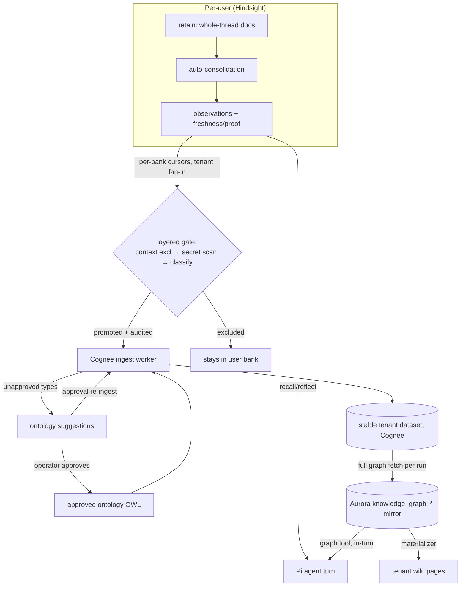

# feat: Cognee-centric memory pipeline

## Summary

Re-center institutional memory on Cognee as the tenant graph-of-record, in five phases: turn on Hindsight's observation engine (A), ingest observations into a stable per-tenant Cognee dataset under the approved ontology (B), expose graph retrieval to the agent at runtime (C), materialize a tenant-scoped wiki from the graph and retire the planner (D), and retire `brain.*` as source-of-record (E). Each phase ships independently behind flags, following the inert-first multi-PR pattern.

---

## Problem Frame

The three-tier memory stack is built but mis-leveraged (see origin: `docs/brainstorms/2026-06-09-cognee-centric-memory-pipeline-requirements.md`). Hindsight runs as a vector store — `configure_bank()` is never called, so no observations are synthesized and freshness/proof signals are discarded at recall. The pipeline runs backward relative to intent: Hindsight → planner LLM → wiki → brain → Cognee (read-only explorer), so the knowledge graph never reaches the agent and the wiki reflects raw memory instead of the governed entity graph. The agent recalls flat memory units instead of consolidated beliefs, and institutional knowledge never compounds.

---

## Requirements

Carried from origin R1–R17 with four requirements added during planning: R10–R12 (layered promotion gate, baseline ontology seed, promotion audit — Phase B deepening) and R18 (client-surface continuity — Phase D). The insertions shift origin numbering: origin R10–R12 (agent access) → plan R13–R15; origin R13–R15 (wiki) → plan R16, R17, R19; origin R16–R17 (brain retirement) → plan R20.

**Observation engine (Phase A)**

- R1. Hindsight banks carry explicit configuration — `observations_mission`, `enable_observations`, auto-consolidation — applied idempotently through the Hindsight bank-config HTTP API, not implicit defaults.
- R2. Consolidation runs over both new retains and the pre-existing corpus (backfill), so observations exist for tenants with months of history.
- R3. Recall parses observation freshness signals and proof counts into runtime-visible metadata.
- R4. The agent's recall→reflect path surfaces observations ahead of raw facts when both match.

**Graph ingest (Phase B)**

- R5. Cognee ingest sources from Hindsight observations aggregated across all user banks in a tenant, with per-bank incremental cursors.
- R6. Ingest is constrained to approved ontology entity/relationship types (OWL export, existing normalizer classification).
- R7. Ontology suggestions re-anchor their primary signal on Hindsight observations.
- R8. Unapproved-type knowledge routes to ontology suggestions as evidence; approving a suggestion triggers re-ingest of the deferred observations.
- R9. Ingest runs are observable: ingested / excluded / deferred-for-ontology / failed counts inspectable per run, plus a pipeline-lag signal (newest retained memory vs newest consolidated observation vs mirror cursor).
- R10. Only observations that pass a layered promotion gate (structural exclusions + secret scan + LLM classification, default-exclude) enter the tenant graph; personal-class observations stay in the user's bank.
- R11. New tenants get a seeded baseline approved ontology so the pipeline is not deadlocked behind first approval.
- R12. Every promotion is audited: run rows record promoted observation IDs with classifier label, model ID, and prompt version — the reconciliation index for future deletion propagation.

**Agent access (Phase C)**

- R13. The agent retrieves entities and relationships from the graph mirror during a turn via a registered tool.
- R14. Graph retrieval composes with Hindsight recall — episodic recall stays on Hindsight; the tool serves entity/relationship traversal. The tool degrades to an explicit "unavailable" result, never a thrown mid-turn error.
- R15. Retrieval is tenant-scoped with tenant identity derived server-side from a turn-bound credential, not a caller-asserted header; a service bearer presenting a foreign tenant claim is rejected.

**Wiki materialization (Phase D)**

- R16. Wiki pages are tenant-scoped and materialized from the graph mirror; existing user-scoped pages are archived (with the flip recorded for reversibility), not migrated.
- R17. Page sections carry provenance traceable graph → source observation IDs; for non-admin readers provenance resolves to observation IDs only, never another user's raw memory content.
- R18. Client surfaces (web, mobile, CLI, context-engine) read tenant-scoped wiki after cutover — no surface silently goes empty when the archive pass lands.
- R19. The planner LLM extraction path retires once graph materialization is authoritative; the moment it retires, `brain.*` writes freeze and that freeze is declared.

**Brain retirement (Phase E)**

- R20. `brain.*` retires as source-of-record only after the graph demonstrably serves both consumers (agent tool + wiki); destructive migration follows reader-removal-deploys-first ordering.

---

## Key Technical Decisions

- **Both consumers read the Aurora graph mirror (`knowledge_graph_*`), not live Cognee.** Agent turns survive Cognee ECS outages; queries are SQL-cheap; the Explorer UI already reads this mirror. Staleness = last completed ingest run. Live Cognee semantic search is deferred follow-up.
- **Stable per-tenant Cognee dataset with incremental ingest, plus a full-rebuild mode.** Today every run mints a throwaway dataset and `replaceKnowledgeGraphSnapshot` wipes-and-rewrites. A graph-of-record needs a stable dataset (`thinkwork:{tenantId}:observations`) fed incrementally (add+cognify of new/updated observations), with the Aurora mirror refreshed from a full dataset graph fetch after each run. Weakened/stale/retracted observations are reconciled by the full-rebuild path, which is also the interim deletion/reclassification propagation mechanism (see Scope Boundaries).
- **Layered promotion gate at the ingest boundary; promotion is irreversible disclosure.** Once an observation enters the tenant graph there is no post-ingest read gate — every tenant member's agent and the wiki can see it. The gate is therefore layered, not a single LLM call: (1) structural source-context exclusion — observations whose proof set derives from non-shared contexts (DM-context threads, private spaces) never promote; (2) deterministic secret/credential-pattern scan — a hit excludes regardless of classification; (3) batched LLM classification (pinned model + prompt version, per-item strict-JSON verdicts, default-exclude on any malformed verdict) labels institutional vs personal; (4) promotion audit on the run row. The `observations_mission` steers synthesis toward institutional facts but is not a control.
- **Bank config via the Hindsight HTTP API, ensured at the adapter write seam.** `PUT /v1/default/banks/{bankId}/config` from the adapter, called as an idempotent ensure inside the shared write path (`postItems`/`resolveBankId`) with a per-warm-container cache — covering conversation retain, daily memory, requester-memory markdown, and mobile capture, not just one handler branch. Direct `hindsight.*` SQL stays read-only/migration-only per existing convention.
- **Tenant wiki via archive-and-rematerialize.** The wiki schema's owner-scoped covenant relaxes (nullable `owner_id` on `wiki.pages` **and** `wiki.compile_jobs`, partial unique `(tenant, type, slug) WHERE owner_id IS NULL` — integrity-load-bearing, since the four-column index treats NULLs as distinct and would silently allow duplicates); existing user-scoped pages flip to archived with the flipped IDs recorded; the tenant wiki builds fresh from the graph. No page migration — avoids cross-user slug collisions.
- **Ontology suggestions re-anchor before the planner retires.** Brain materialization stops the moment the planner stops (it is the only brain writer), so the suggestion scan must already be feeding off observations (Phase B) before Phase D — otherwise ontology governance starves alongside brain.
- **Flag-gated seam swaps.** New ingest source, agent tool, and wiki materializer each land inert behind a flag (`docs/solutions/architecture-patterns/inert-first-seam-swap-multi-pr-pattern-2026-05-08.md`); the consumer seam flips in its own PR.

---

## High-Level Technical Design

Target data flow with read paths:



Observation ingest run (per tenant, scheduled or operator-triggered):

```mermaid
sequenceDiagram
  participant S as Scheduler/Mutation
  participant W as obs-ingest worker (Lambda)
  participant H as Hindsight (per-user banks)
  participant C as Cognee (stable dataset)
  participant A as Aurora mirror

  S->>W: start run (tenant); reap stale running rows first
  W->>W: enumerate tenant user banks
  loop each bank
    W->>H: listRecordsUpdatedSince(cursor, observations only), paginated
  end
  W->>W: layered gate (context exclusion, secret scan, batched classify)
  W->>C: add + cognify (idempotent per-observation identity) into stable dataset
  W->>C: fetch full dataset graph
  W->>A: one transaction: replace mirror snapshot (shrink-guarded) + advance cursors + mark run succeeded + write promotion audit
  W->>W: route unapproved types to suggestions
  W->>C: prune superseded run artifacts
```

---

## Implementation Units

Units appear in execution order. U-IDs are stable identifiers, not a sequence — U14 was added during deepening and sits between U10 and U11 because that is where it executes.

### Phase A — Hindsight observation engine

### U1. Bank configuration in the Hindsight adapter

- **Goal:** Provision and keep per-user banks configured with observation/consolidation settings.
- **Requirements:** R1.
- **Dependencies:** none.
- **Files:** `packages/api/src/lib/memory/adapter.ts` (optional `ensureBankConfigured` method), `packages/api/src/lib/memory/adapters/hindsight-adapter.ts`, `packages/api/src/lib/memory/adapters/hindsight-adapter.test.ts`.
- **Approach:** New private HTTP methods beside `postItems`: `GET/PUT /v1/default/banks/{bankId}/config`. Desired config (mission text, `enable_observations`, `enable_auto_consolidation`, consolidation budgets) built from env/SSM-backed settings. Ensure fires inside the adapter's shared write seam (around `postItems`/`resolveBankId`) so every retain path is covered — conversation retain, `retainDailyMemory`, `upsertMarkdownMemoryDocument` (requester memory), and the mobile quick-capture resolver all write through it. In-process cache of configured bank IDs per warm container; on miss, GET config, diff overrides against desired, PUT only on drift. Never blocks the write on config failure (log and continue).
- **Patterns to follow:** existing adapter HTTP shape and retry/timeout handling in `hindsight-adapter.ts`; optional-method pattern on `MemoryAdapter` (`retainConversation` precedent).
- **Test scenarios:**
  - Configures an unconfigured bank: GET returns no overrides → PUT issued with desired config.
  - Idempotent on configured bank: GET shows matching overrides → no PUT.
  - Drifted bank: one field differs → PUT issued.
  - Config endpoint 5xx → write proceeds, error logged, bank not cached as configured.
  - Ensure fires on the daily-memory and requester-memory paths, not only conversation retain.
  - Cache prevents repeat GETs within a container lifetime.
- **Verification:** deployed dev bank shows `observations_mission` in `GET .../config` overrides; retain latency unchanged on warm path.

### U2. Consolidation backfill and observation consumption at recall

- **Goal:** Synthesize observations over the existing corpus and surface freshness/proof signals to the runtime.
- **Requirements:** R2, R3, R4. Covers origin AE1.
- **Dependencies:** U1.
- **Files:** `packages/api/src/lib/memory/adapters/hindsight-adapter.ts` (`mapUnit` extension, consolidate trigger method), `packages/agentcore-pi/agent-container/src/runtime/providers/hindsight-memory-provider.ts`, `packages/pi-extensions/src/memory.ts` (recall/reflect docstrings mention observations — edit the pair together), `scripts/smoke/` (backfill/verify script), `packages/api/src/lib/memory/adapters/hindsight-adapter.test.ts`.
- **Approach:** Backfill = `POST /v1/default/banks/{bankId}/consolidate` (empty body processes all unconsolidated memories) iterated over existing banks via an ops script; one-shot, re-runnable. Legacy banks (agent-slug/name/id-derived, `resolveLegacyBankIds`) are included in the backfill sweep so historical corpus consolidates, but are excluded from Phase B tenant fan-in (their content predates the per-user model; revisit if dev shows material observation volume there). Recall: extend `mapUnit` to parse freshness trend and proof/evidence fields into `record.metadata`; provider passes them through `MemoryItem`. Reflect already does hierarchical retrieval server-side (mental models → observations → facts), so R4 is mostly verifying request types include `observation` and ordering observations first in recall presentation.
- **Execution note:** verify the deployed Hindsight image (`terraform/modules/app/hindsight-memory/main.tf` `image_tag`) ships the observation engine, and verify freshness field names empirically against the deployed recall response before coding the parser — the docs don't pin the JSON schema (wire-format rule).
- **Test scenarios:**
  - Recall response containing an observation unit with freshness + proof fields → metadata populated; missing fields → nulls, no throw.
  - Observation-type results ordered ahead of raw facts at equal score.
  - Backfill script: consolidate called once per bank including legacy banks; 4xx on one bank doesn't abort the sweep.
  - Covers AE1. After backfill on a seeded bank, recall returns ≥1 observation distinct from its source facts, carrying freshness + proof count (integration, dev stage).
- **Verification:** dev-stage recall for a real user shows observation units with freshness metadata.

### U3. Hindsight observation env defaults in Terraform

- **Goal:** Set platform-level observation/consolidation defaults on the Hindsight service.
- **Requirements:** R1.
- **Dependencies:** none (parallel with U1).
- **Files:** `terraform/modules/app/hindsight-memory/main.tf`, `terraform/modules/app/hindsight-memory/variables.tf`.
- **Approach:** Add `HINDSIGHT_API_ENABLE_AUTO_CONSOLIDATION`, `HINDSIGHT_API_CONSOLIDATION_DEDUP_THRESHOLD`, and a default `HINDSIGHT_API_OBSERVATIONS_MISSION` to the ECS task env. Variable-ize (don't hardcode literals) per the wiki-compile env precedent so unrelated deploys don't wipe them. Per-bank config from U1 overrides these defaults.
- **Test scenarios:** Test expectation: none — Terraform env wiring; verified by deploy.
- **Verification:** post-deploy ECS task definition shows the env vars; a fresh bank with no overrides inherits them (GET config `config` block).

### Phase B — Observations → Cognee

### U4. Observations source kind, tenant fan-in, and the layered promotion gate

- **Goal:** Read new/updated observations across all of a tenant's user banks, gate them, and produce an ingest bundle with a promotion audit.
- **Requirements:** R5, R10, R12.
- **Dependencies:** U2 (observations must exist).
- **Files:** `packages/database-pg/src/schema/` (source-kind CHECK-constraint extension + per-(tenant, bank) cursor table, Drizzle migration), `packages/database-pg/graphql/types/knowledge-graph.graphql` (enum), `packages/api/src/lib/knowledge-graph/observations-source.ts` (new), `packages/api/src/lib/memory/adapters/hindsight-adapter.ts` (`listRecordsUpdatedSince` observation filter), `packages/api/src/lib/knowledge-graph/observations-source.test.ts`.
- **Approach:** `observations` joins the source-kind vocabulary — which is four hand-rolled CHECK constraints (`ingest_runs`/`entities`/`relationships`/`evidence`), not a pg enum; the migration drops and re-adds them following the `0146_knowledge_graph_source_scope.sql` shape, plus the GraphQL enum (codegen in all consumers). Loader enumerates tenant users (active membership from `users`), reads each bank via `listRecordsUpdatedSince` with a pagination loop (new-user cursor floods past the 500-row page cap otherwise). The observation filter keys on synthesis provenance, not `fact_type` alone — mobile capture can post units with `fact_type=observation`, a user-forgeable injection path; verify empirically how Hindsight distinguishes engine-synthesized observations and filter on that. Cursor table carries the wiki-cursor tiebreaker shape (`last_record_updated_at` + `last_record_id`) — timestamp-only cursors skip or re-read boundary records. Layered gate per the KTD: structural source-context exclusion (proof set touching non-shared contexts → never promote; `threadVisibilityWhereSql` precedent defines "shared"), deterministic secret/high-entropy scan (hit → exclude), then batched Haiku classification — pinned model ID + prompt version, strict per-item JSON verdicts with item-count validation, default-exclude on any malformed/missing verdict. Run rows record both excluded IDs and promoted IDs with classifier label, model ID, and prompt version (R12). A small labeled golden set gates classifier model/prompt changes as a regression test.
- **Patterns to follow:** `packages/api/src/lib/knowledge-graph/brain-source.ts` / `wiki-source.ts` loader shape; wiki compiler cursor discipline; `invokeClaudeJson` in `packages/api/src/lib/wiki/bedrock.ts` for the classifier (shared with `ontology/suggestions.ts`, so it survives U11's planner deletion).
- **Test scenarios:**
  - Two users in tenant, one observation each → bundle contains both, cursors tracked per bank.
  - Pagination: bank with > page-cap rows since cursor → loop drains fully.
  - Observation with DM-context proof source → excluded structurally, classifier never sees it.
  - Candidate text containing a credential-shaped token → excluded by the secret scan regardless of classifier label.
  - Classifier marks one observation personal → excluded from bundle, ID recorded.
  - Malformed per-item verdict (count mismatch, bad JSON) → that item default-excluded, run continues.
  - Promoted observations recorded with label + model ID + prompt version on the run.
  - Mobile-captured unit with `fact_type=observation` → not treated as an engine observation.
  - User outside tenant never enumerated (tenant scoping).
  - Golden-set fixture: classifier output matches labeled expectations (gates model/prompt bumps).
- **Verification:** unit suite green; dry-run loader against dev returns a plausible bundle for a seeded tenant with audit fields populated.

### U5. Stable tenant dataset ingest worker and scheduling

- **Goal:** Ingest observation bundles into a stable per-tenant Cognee dataset and refresh the Aurora mirror with crash-safe consistency.
- **Requirements:** R5, R6, R9. Covers origin AE2 (graph half).
- **Dependencies:** U4.
- **Files:** `packages/api/src/lib/knowledge-graph/runs.ts` (stable-dataset run mode + stale-run reaper), `packages/api/src/lib/knowledge-graph/cognee-client.ts` (incremental add+cognify into named dataset, prune), `packages/api/src/handlers/knowledge-graph-observations-ingest.ts` (new handler), `scripts/build-lambdas.sh` + `terraform/modules/app/lambda-api/handlers.tf` (both — two-file rule; add to `BUNDLED_AGENTCORE_ESBUILD_FLAGS` since the classifier uses Bedrock), GraphQL mutation + resolver under `packages/api/src/graphql/resolvers/knowledge-graph/`, `packages/api/src/handlers/knowledge-graph-observations-ingest.test.ts`.
- **Approach:** Stable dataset name `thinkwork:{tenantId}:observations` (one per tenant, no per-run mint). Incremental mode: add+cognify the bundle with deterministic per-observation document identity (observation ID as the item key) so retries are idempotent — Cognee writes are at-least-once, and without stable identity a worker crash between cognify and snapshot turns every re-run into persistent duplicates. Then fetch full dataset graph, normalize against approved ontology, and in **one Aurora transaction**: replace the mirror snapshot, advance all per-bank cursors, mark the run succeeded, and write the promotion audit — split commits make cursors-ahead silent data loss. Mirror replace is shrink-guarded: refuse (flag for operator) when node count drops beyond a threshold vs the prior snapshot, since one poisoned normalization otherwise replaces the entire tenant graph. Stale-run reaper at run start: the stable source ref inverts the active-run dedupe key (`onConflictDoNothing` on `(tenant, source_kind, source_ref) WHERE status IN ('queued','running')`) — a stranded `running` row would block every future run for the tenant permanently, so rows older than the Lambda ceiling are reaped to failed before claiming. Per-run bundle size capped so backlog recovery (e.g., after a consolidation outage) chunks across runs. Full-rebuild mode (flagged on the run): clear dataset, reset cursors, re-read whole corpus — the retraction/reconciliation path. Scheduling: AWS Scheduler drainer (wiki-compile `rate()` precedent) + operator mutation. Run rows record ingested/excluded/unapproved/failed counts and the pipeline-lag signal (R9).
- **Patterns to follow:** `packages/api/src/handlers/knowledge-graph-thread-ingest.ts` worker shape and `deps.cogneeClient` injection seam; `invoke-worker.ts` RequestResponse invoke; never-throw `{ok, status}` handler results.
- **Test scenarios:**
  - Incremental run: bundle of 3 observations → add+cognify against the stable dataset; mirror replaced; cursors advanced; run succeeded — all in one transaction.
  - Worker crash simulated after cognify, before snapshot → re-run produces no duplicate nodes in the mirror (idempotent identity).
  - Snapshot transaction failure → cursors NOT advanced (same transaction), next run re-reads.
  - Stranded `running` row older than the Lambda ceiling → reaped; new run claims successfully.
  - Mirror shrink beyond threshold → replacement refused, run flagged for operator review.
  - Unapproved-type nodes classified by the normalizer → counted on the run, not written as grounded.
  - Full-rebuild flag → dataset cleared, cursors reset to epoch, full corpus re-read.
  - Concurrent start while a run is active → conflict-dropped (dedupe key).
  - Empty bundle → run completes "no-op", cursor untouched, zero-node graph not treated as failure.
  - Oversized backlog → bundle capped, remainder picked up next run.
- **Verification:** extend `scripts/smoke/knowledge-graph-thread-ingest-smoke.mjs` with an observations-source mode (don't write a parallel smoke); dev run shows entities in the Explorer sourced from observations.

### U6. Ontology loop: baseline seed, suggestion re-anchor, approval re-ingest

- **Goal:** Keep ontology governance fed by observations and unblock cold-start tenants.
- **Requirements:** R7, R8, R11. Covers origin AE2 (suggestion half).
- **Dependencies:** U5.
- **Files:** `packages/api/src/lib/ontology/suggestions.ts` (observation source becomes primary signal), `packages/api/src/lib/ontology/templates.ts` (baseline seed), tenant bootstrap path that creates the first ontology version, `packages/api/src/lib/ontology/reprocess.ts` (approval → targeted observations re-ingest hook), `packages/api/src/lib/ontology/suggestions.test.ts`.
- **Approach:** Suggestion scan reads deferred/unapproved observation evidence recorded by U5 runs as its primary source (brain-section scanning demotes to legacy). Approval of a change set enqueues a targeted observations re-ingest for the affected tenant (extend the existing reprocess job rather than a new mechanism); a re-ingest enqueued while Cognee is down rides the normal run retry/reap path rather than a bespoke retry. Baseline ontology: seed a minimal approved version from templates at tenant creation so a fresh tenant's first ingest extracts something.
- **Test scenarios:**
  - Covers AE2. Observation referencing an unapproved entity type → no grounded graph node; suggestion raised citing the observation as evidence.
  - Approving that suggestion → re-ingest run enqueued for the tenant; previously deferred observation lands as grounded on the next run.
  - New tenant bootstrap → active ontology version exists with seeded approved types.
  - Rejecting a suggestion → no re-ingest, evidence retained on the change set.
- **Verification:** dev tenant walk-through: unapproved type → suggestion → approve → entity appears in Explorer.

### Phase C — Agent access

### U7. Graph read service and provider seam

- **Goal:** Tenant-scoped entity/relationship retrieval over the Aurora mirror, exposed through the platform API, inert.
- **Requirements:** R13, R15.
- **Dependencies:** U5 (mirror populated).
- **Files:** `packages/api/src/lib/knowledge-graph/graph-search.ts` (new: entity lookup by name/alias, n-hop neighborhood), GraphQL query + resolver under `packages/api/src/graphql/resolvers/knowledge-graph/`, `packages/pi-runtime-core/src/knowledge-graph-provider.ts` (new provider interface), `packages/api/src/lib/knowledge-graph/graph-search.test.ts`.
- **Approach:** SQL over `knowledge_graph_*` mirror tables: alias-tolerant entity match, then bounded relationship expansion (cap hops and row counts). Source-kind filter defaults to `observations` with brain/wiki/thread rows excluded from agent-facing reads (mixed-source dedup rule). Agent-facing results return entity/relationship labels, summaries, and observation-ID refs — **not** verbatim evidence snippets; snippets are the channel that carries raw per-user text past the ontology gate, so they stay admin-only (Explorer). Service-path tenant identity derives server-side from a turn-bound credential (resolve `x-thread-turn-id` → thread turn row → tenant) rather than trusting an asserted `x-tenant-id` header — the context-engine header pattern is a known weakness, not a pattern to import (see Risks). Provider interface mirrors the `MemoryProvider` seam shape: narrow request/response, host supplies transport.
- **Test scenarios:**
  - Entity found by alias → entity + 1-hop relationships returned with observation-ID refs, no snippet text.
  - Unknown entity → empty result, not error.
  - Tenant A query never returns tenant B rows.
  - Service bearer + tenant-B claim from a tenant-A turn context → rejected (R15 negative test).
  - Hop/row caps enforced on a dense node.
  - Mirror rows from `brain` source kind excluded from results.
- **Verification:** GraphQL query returns expected graph slices on dev; no Pi wiring yet (inert).

### U8. Pi knowledge-graph tool extension and host wiring

- **Goal:** Register the graph tool with the Pi runtime and wire it in the cloud host.
- **Requirements:** R13, R14, R15. Covers origin AE3.
- **Dependencies:** U7.
- **Files:** `packages/pi-extensions/src/knowledge-graph.ts` (new extension), `packages/pi-extensions/src/define-extension.ts` (provider bundle addition), `packages/agentcore-pi/agent-container/src/server.ts` (provider construction + `addExtension` in `buildInvocationResources`), `packages/pi-extensions/test/knowledge-graph.test.ts`.
- **Approach:** Follow `createMemoryExtension` shape: TypeBox params, `executionMode: "sequential"`, backend reached only through the host-supplied provider. Tool params never include tenant/user identifiers — identity is closed over in host-supplied options, so a prompt-injected turn cannot flip tenants by parameter. Cloud provider calls the U7 API facade with the turn-bound credential (snapshot env at entry). Tool docstring positions it against recall/reflect — graph for entity/relationship traversal, recall for episodic memory; update the recall/reflect docstring pair to mention it. Backend failure returns an explicit "knowledge graph unavailable" tool result. Gate behind a payload flag from chat-agent-invoke.
- **Execution note:** the `createAgentSession` tools allowlist also gates extension tools — fold `toolNames` in, and verify activation via `tools_called` in a deployed turn, not registration logs.
- **Test scenarios:**
  - Tool registered and present in extension `toolNames`.
  - Tool param schema contains no tenant/user identifier fields; model-supplied extras ignored.
  - Provider success → formatted entity/relationship result to the model.
  - Provider timeout/5xx → "unavailable" result, no throw.
  - Payload flag off → extension not added.
  - Covers AE3. Deployed dev turn asking a traversal question ("which opportunities is this customer tied to?") → `tools_called` includes the graph tool and the answer reflects a relationship spanning multiple source observations (smoke targets the `thinkwork-<stage>-agentcore-pi` Lambda path).
- **Verification:** `tools_called` evidence in a real dev turn; degraded path exercised by pointing the provider at a dead endpoint.

### Phase D — Wiki from the graph

### U9. Wiki schema: tenant scope, authz, and archive of user-scoped pages

- **Goal:** Allow tenant-scoped wiki pages with a defined read rule, and archive the existing user-scoped corpus reversibly.
- **Requirements:** R16.
- **Dependencies:** none (can land before C completes).
- **Files:** `packages/database-pg/src/schema/wiki.ts`, hand-rolled migration under `packages/database-pg/drizzle/` with `-- creates:` markers, `packages/api/src/lib/wiki/repository.ts` (null-owner read/write paths), `packages/api/src/graphql/resolvers/wiki/auth.ts` (tenant-member read rule), repository tests.
- **Approach:** Migration sequence: (1) additive — `owner_id` nullable on `wiki.pages` **and** `wiki.compile_jobs` (graph-mode jobs are tenant-keyed; this is the same covenant change), partial unique index `(tenant_id, type, slug) WHERE owner_id IS NULL` (the existing four-column index treats NULLs as distinct, so without the partial index duplicate tenant pages are silently allowed), existing owner-scoped index untouched; (2) deploy repository code handling null owner **before** any tenant-page writer — Drizzle `eq(col, null)` emits `= NULL` (never true), so every `(tenant, owner)` read (`findPageBySlug`, the active-listing queries) needs an `isNull(owner_id)` branch, and the find-then-insert page upsert misses on null owner without it; (3) archive pass last, as a data migration that records the flipped page IDs (tags marker or S3 list) — `archived` status is already written today by the ontology gate and rebuild runner, so a blanket reverse-UPDATE would resurrect unrelated archives; the recorded list is what makes the flip reversible. Authz: null-owner pages readable by any tenant member (`assertCanReadWikiScope` extension); the owner-match-or-admin rule stays for user-scoped pages. Other wiki child tables key off `page_id` and inherit scope — no relaxation needed; `wiki.unresolved_mentions` and `wiki.places` stay owner-scoped because the graph materializer never writes them (constraint on U10).
- **Test scenarios:**
  - Tenant page (null owner) upserts and re-upserts on `(tenant, type, slug)` without violating user-scoped uniqueness.
  - Second insert of the same tenant slug → rejected by the partial unique index.
  - User-scoped page with same slug coexists with tenant page.
  - Null-owner reads: `findPageBySlug` and active-listing queries return tenant pages (isNull branch).
  - Non-admin tenant member reads a null-owner page; non-member cannot; tenant A member cannot read tenant B pages.
  - Archive pass: flipped IDs recorded; reverse pass restores only those IDs, not previously archived pages.
  - Archived user pages excluded from default page queries.
- **Verification:** `pnpm db:migrate-manual` reports the new objects present on dev; existing wiki UI still renders (archived filter).

### U10. Graph→wiki materializer behind a source flag

- **Goal:** Build tenant wiki pages from the Aurora mirror, reusing the wiki repository layer, flag-gated alongside the planner.
- **Requirements:** R16, R17. Covers origin AE4.
- **Dependencies:** U5, U9.
- **Files:** `packages/api/src/lib/wiki/graph-materializer.ts` (new), `packages/api/src/handlers/wiki-compile.ts` (source dispatch on a `WIKI_SOURCE` flag: `planner` | `graph`), `packages/api/src/lib/wiki/repository.ts` (tenant-scope dedupe-key support), `terraform/modules/app/lambda-api/handlers.tf` (flag env), `packages/api/src/lib/wiki/graph-materializer.test.ts`.
- **Approach:** Materializer reads grounded entities/relationships/evidence from the mirror (observations source kind only), renders entity/topic pages through `upsertPage`/`upsertSections`/`recordSectionSources`/`upsertPageLink` with section sources pointing at observation IDs under a distinct `source_kind` value (don't overload `memory_unit`); verify the "Based on N memories" drill-in resolves observation IDs through the existing `MemoryRecord` lookup. For non-admin readers provenance resolves to IDs only — raw-memory dereference stays gated by the existing user-scope rule (R17). Deterministic, LLM-free — extraction already happened in Cognee. Reconciliation: entities that disappear from the mirror archive their pages (this is also the recovery path after a shrink-guard event or full rebuild — without it, poison persisted to pages outlives the mirror fix). Graph-mode compile jobs are tenant-keyed with a four-part dedupe key (e.g. `graph:` prefix) — a naive three-part key parses through `parseCompileDedupeBucket` and silently enters the planner's continuation-chaining logic. Aggregation/promotion fields (`parent`/`children`/`promotedFromSection`) are not produced by the materializer; their disposition (graph-derived hub pages vs deprecation of the rollup UI) lands with U14's client work. Planner path untouched while the flag is `planner`.
- **Test scenarios:**
  - Grounded entity with two relationships → page with sections, links, and section sources referencing observation IDs under the new source kind.
  - Re-run with unchanged mirror → idempotent (no duplicate sections/pages).
  - Entity renamed in mirror → alias recorded, page slug stable.
  - Entity removed from mirror → its page archived on the next materialization.
  - Covers AE4. Materialized page's sections trace to source observations; no content from the planner path when flag is `graph`.
  - Graph-mode dedupe key never parses as a planner continuation bucket.
  - Flag `planner` → graph materializer never invoked.
- **Verification:** dev tenant with flag `graph` shows wiki pages matching Explorer entities, provenance links resolve.

### U14. Client and contract surfaces for the tenant wiki

- **Goal:** Flip every wiki consumer to the tenant-scoped contract so no surface goes silently empty at cutover.
- **Requirements:** R18.
- **Dependencies:** U9; lands with or before U11's flag flip.
- **Files:** `packages/database-pg/graphql/types/wiki.graphql` (+ `memory.graphql` wiki reads: `mobileWikiSearch`, `recentWikiPages`), codegen in `apps/web`, `apps/mobile`, `apps/cli`, `packages/api`, **and** `packages/react-native-sdk`; `packages/react-native-sdk/src/graphql/queries.ts` (wiki queries drop non-null `$userId`), `packages/graph/src/queries.ts` (`wikiGraph`), `apps/mobile/app/wiki/` + `apps/mobile/components/wiki/`, `apps/web/src/routes/_authed/_shell/memory.pages.tsx` + `apps/web/src/components/settings/SettingsWiki.tsx`, `apps/cli/src/commands/wiki/`, `packages/api/src/lib/context-engine/providers/wiki.ts`, `packages/api/src/handlers/wiki-export.ts`, `packages/api/src/handlers/wiki-bootstrap-import.ts` (contract note).
- **Approach:** `WikiPage.userId`/`ownerId` relax to nullable in GraphQL (non-null fields error whole responses on tenant pages); all user-keyed wiki queries gain tenant-scope reads. Mobile's wiki operations live in `react-native-sdk` — a fifth codegen surface beyond the four-consumer convention. CLI re-semantics: `wiki compile` drops per-agent fan-out (tenant-keyed jobs), `wiki rebuild` re-targets to Cognee full-rebuild + rematerialize, `wiki status` drops `ownerId` keying. Context-engine `query_wiki_context` retargets from owner-scoped to tenant pages (it returns nothing after cutover otherwise) and its overlap with the U8 graph tool gets a positioning note in both docstrings. `wiki-export` handles null-owner pages (tenant-level S3 prefix instead of `<owner_slug>`). `wiki-bootstrap-import`'s "retain → terminal compile produces pages" contract changes in graph mode (pages appear only after consolidation + ingest + materialization) — document the new contract in the import's operator-facing output rather than faking synchronous pages.
- **Test scenarios:**
  - Tenant page round-trips GraphQL with null owner (no null-propagation error).
  - Mobile wiki list/detail/graph queries return tenant pages without a userId variable.
  - Web memory pages route and SettingsWiki render tenant pages.
  - CLI `wiki status` reflects tenant-keyed jobs; `rebuild` triggers the graph path.
  - Context-engine `query_wiki_context` returns tenant pages post-cutover.
  - `wiki-export` writes tenant pages under the tenant-level prefix.
- **Verification:** dev walkthrough on web + mobile (TestFlight or simulator) + CLI after the U11 flag flip shows populated wiki surfaces; no empty-state regressions.

### U11. Cutover: planner retirement and brain freeze

- **Goal:** Flip wiki to graph source, remove the planner extraction path, declare brain frozen.
- **Requirements:** R19.
- **Dependencies:** U6 (suggestions re-anchored), U10 verified on dev, U14 (clients ready).
- **Files:** `packages/api/src/lib/wiki/planner.ts`, `section-writer.ts`, `aggregation-planner.ts` (remove), `packages/api/src/lib/ontology/materializer.ts` (brain materialization path removed), `packages/api/src/handlers/wiki-compile.ts` (flag default flip then dispatch removal), `packages/api/src/handlers/wiki-lint.ts` (retire or re-spec its promotion sweep — it writes to and sweeps `wiki.unresolved_mentions`, which freezes with the planner), `packages/api/src/handlers/memory-retain.ts` (post-turn enqueue retargets observation-ingest cadence if needed), docs note declaring brain frozen.
- **Approach:** Two steps in one unit, separate commits: flip `WIKI_SOURCE` default to `graph` and watch a full compile cycle; then delete the planner modules and the brain materialization call. The deletion is the brain-write freeze — record the freeze date in the operational note and the brain UI surfaces (Phase E removes them). `wiki.unresolved_mentions` stops receiving writes at the same moment; wiki-lint's promotion sweep retires with it (the graph materializer ignores promotion compile jobs).
- **Test scenarios:**
  - Full `pnpm --filter @thinkwork/api test` suite green after planner removal (whole-suite rule — retired surfaces break registration smokes).
  - Compile job on a tenant with graph data → pages produced, no Bedrock planner invocation in the trace.
  - wiki-lint run post-retirement → no promotion jobs enqueued.
  - No write path to `brain.pages` remains (grep-gated: all 7 import forms).
- **Verification:** dev compile cycle produces graph-sourced pages; CloudWatch shows zero planner model invocations.

### Phase E — Brain retirement

### U12. Brain consumer retirement

- **Goal:** Remove code that reads `brain.*` as source-of-record.
- **Requirements:** R20.
- **Dependencies:** U11.
- **Files:** `packages/api/src/lib/knowledge-graph/brain-source.ts` + `brain` source-kind GraphQL enum member, `packages/api/src/graphql/resolvers/brain/`, `packages/database-pg/graphql/types/brain.graphql`, `packages/api/src/lib/context-engine/providers/brain.ts`, `packages/react-native-sdk/src/brain.ts` + `apps/mobile/components/brain/` + brain routes/search mode in `apps/mobile/app/`, brain surfaces in `apps/web` settings, `packages/api/src/lib/ontology/suggestions.ts` (drop brain-section source), codegen in all five consumer surfaces.
- **Approach:** Survey-fresh at execution time — re-grep every consumer surface (all import forms) rather than replaying this list. The mobile brain enrichment UX (enrichment sheets, fact editing, brain search mode) is a user-facing feature, not dead code: it retires with an explicit disposition (removed; graph/wiki surfaces are the successor). Tighten only the GraphQL enum here — DB CHECK constraints still contain `'brain'` rows in the mirror; the CHECK tightening and `source_kind='brain'` row cleanup belong in U13's migration (adding a constraint that existing rows violate fails validation). Ship reader removal and let it deploy fully before U13.
- **Test scenarios:**
  - Whole `@thinkwork/api` suite + web/mobile typecheck green after removal.
  - Knowledge-graph ingest GraphQL no longer accepts `brain` (validation error).
  - Ontology suggestion scan runs without the brain source.
  - Context-engine `query_context` no longer routes to the brain provider.
- **Verification:** post-merge Deploy run watched green; dev GraphQL schema no longer exposes brain operations.

### U13. Brain schema drop

- **Goal:** Drop `brain.*` tables.
- **Requirements:** R20.
- **Dependencies:** U12 merged **and deployed**.
- **Files:** hand-rolled migration under `packages/database-pg/drizzle/` with markers, `packages/database-pg/src/schema/brain.ts` removal.
- **Approach:** Destructive migration only after U12's deploy is verified (PG 42703 ordering rule). No inbound FKs exist — brain FKs only outward to `public.tenants`, compat views already dropped — so the drop is structurally clean. The migration also deletes `knowledge_graph_*` rows with `source_kind='brain'` and then tightens the four source-kind CHECK constraints (ordering matters: constraint-add fails validation against surviving rows). Pre-drop checks: confirm no `wiki.section_sources.source_ref` dangles into brain rows; confirm no external consumer (compliance exports, BI) reads `brain.*`. Rollback artifact: `pg_dump --schema=brain` custom format to S3 (restores tables, trigger, constraints, indexes in one `pg_restore`) — not CSV. Annotate the migration header as the sanctioned owner-retirement of a protected schema so a future session doesn't read it as a rule violation.
- **Test scenarios:** Test expectation: none — destructive migration; verified by drift reporter and post-deploy checks.
- **Verification:** `pnpm db:migrate-manual` clean; dev queries against `brain.pages` fail with undefined-table as expected; app surfaces unaffected.

---

## System-Wide Impact

- **Consumer surfaces: six, not three.** Beyond `apps/web`, `apps/mobile`, `apps/cli`: `packages/react-native-sdk` (where all of mobile's wiki/brain GraphQL operations live — its own codegen surface), `packages/graph` (shared force-graph queries used by web), and the context-engine MCP (`query_context` / `query_wiki_context` — the agent is a wiki+brain consumer today). U14 and U12 carry the client work; any surface skipped goes silently empty at cutover.
- **Failure propagation.** Consolidation backlog → recall degrades to raw facts and the graph/wiki go stale, all silently — the R9 lag signal is the only visibility. Cognee down → mirror serves stale (by design); the stale-run reaper (U5) prevents the stable source-ref from converting an outage + Lambda timeout into a permanent tenant ingest deadlock. Poisoned normalization → full-snapshot replace would swap the whole tenant graph; the shrink guard (U5) blocks it, and page reconciliation (U10) un-writes poison that reached the wiki.
- **AppSync subscriptions: non-issue.** No wiki/brain/knowledge-graph mutations appear in `notification_mutations`; these surfaces poll. No parity work needed.
- **Audit boundary.** The promotion gate is the platform's most audit-worthy crossing (per-user memory → tenant visibility). R12's promotion audit covers it at the run level; full audit-event emission (`emitAuditEvent`) for ingest runs and ontology approvals is deferred to the compliance push (Scope Boundaries).
- **Retain plumbing is shared.** Daily memory, requester-memory markdown, and mobile capture write through the same adapter seam as conversation retain — U1's ensure lives at that seam so all paths get configured banks; U4's provenance filter exists because one of those paths (mobile capture) can forge `fact_type=observation`.

---

## Scope Boundaries

**Deferred to follow-up work**

- Live Cognee semantic search as an agent tool (the mirror serves v1).
- Event-driven ingest cadence tuning and dataset prune automation beyond per-run cleanup.
- Per-user filtered views over the tenant wiki.
- Deletion/reclassification propagation: the full-rebuild path (U5) is the named interim mechanism — clear dataset, reset cursors, re-read re-applies current gate verdicts and drops deleted source memories; U10's reconciliation carries that to wiki pages. Operator-triggered, run within days of a deletion request. Until then, content promoted to the tenant graph survives user-side memory deletion — the compliance-push tombstone contract will be designed against the R12 promotion audit, not by re-reading banks.
- Per-tenant mission/config customization UI (env-level defaults + adapter constants for v1; config-version field reserved).
- Backfill of existing `brain.*`/wiki page content into the graph (origin deferral) — resolved as not-backfilled: the graph re-derives from the consolidated Hindsight corpus; brain content survives only in the S3 dump.
- Audit-event (`emitAuditEvent`) emission for ingest runs and ontology approvals (compliance push; R12's run-level audit ships now).

**Outside this product's identity** (carried from origin)

- Replacing Hindsight as the agent-memory substrate; changing the `managed`/`hindsight` toggle or retain granularity.
- Ungoverned graph extraction bypassing ontology approval.

---

## Risks & Dependencies

- **Hindsight image capability:** the deployed `image_tag` (0.5.0) must ship the observation engine; verify on dev before U1 work proceeds. If not, an image bump is a Phase A prerequisite.
- **Observation wire format:** freshness/proof field names and the engine-vs-posted provenance marker are not pinned in docs — empirical verification gates the U2 parser and the U4 filter.
- **Classifier as a promotion gate:** observations synthesize from content the agent read (email, Slack, web) — prompt-injection can target the batch classifier, and a model bump can shift the institutional/personal boundary. Mitigations are structural (U4's layered gate, golden set, pinned model); residual risk is accepted and audited (R12).
- **Context-engine auth pattern:** the existing service path trusts caller-asserted tenant headers, and its `x-thread-turn-id` mode has no server-side consumer today. U7 does not import that pattern; implement turn-bound resolution for the graph tool, and either implement or remove the dangling context-engine mode when touched.
- **Cognee dogfood mode:** single ECS task with EFS-backed Kuzu/LanceDB; stable per-tenant datasets grow without per-run replacement. Watch storage and cognify latency; capacity work is out of scope but may be forced.
- **Classifier cost/quality:** batched Haiku per ingest run scales with observation volume; default-exclude errs private, which can starve the graph if the mission produces mostly personal-class observations — tune mission text first, classifier second.
- **Warm-container env race:** new Pi env (graph endpoint/flag) hits the known AgentCore deploy race; expect up to 15 minutes of reconciler lag on rollout.
- **Multi-tenancy assumption:** bank IDs carry no tenant component; the plan assumes one-user-one-tenant. Verify before U4; if false, tenant fan-in needs a membership-scoped filter on bank content, not just bank enumeration.

---

## Documentation / Operational Notes

- Record the brain-freeze date when U11 lands; brain UI removal (U12) should follow within the same arc to avoid a long frozen-data window.
- **Brain freeze declared 2026-06-10 (U11 PR):** `brain.*` writes freeze the moment this PR deploys — the wiki planner was the only brain writer (`materializePlannerPageToBrain` + the compiler's `upsertTenantEntityPageLink` call), and both were deleted with the planner. One ontology-owned writer remains by design: `lib/ontology/reprocess.ts` rewrites brain pages via `materializeOntologyTemplatesForImpact` when an approved change-set applies — Phase E (U12) must retire or re-target that path along with the brain read surfaces.
- Wire the R9 pipeline-lag signal into run rows / Explorer and set an alarm threshold — every backlog failure mode degrades silently without it.
- Update `docs/src/content/docs/` memory architecture pages after Phase D (wiki source change is user-visible).
- Each PR in the arc: watch the post-merge Deploy run (pre-merge CI doesn't run terraform apply).
- Phase gates: B starts after dev shows real observations (U2 verification); C/D start after U5's smoke passes; E starts after both consumers verified on dev (R20).

---

## Sources / Research

- Origin: `docs/brainstorms/2026-06-09-cognee-centric-memory-pipeline-requirements.md` (audit table, target architecture, R1–R17, AE1–AE4).
- Hindsight bank config + observations: https://hindsight.vectorize.io/developer/observations and /developer/api/memory-banks (`PUT /v1/default/banks/{id}/config`, `enable_observations`, `observations_mission`, consolidation budgets; `POST .../consolidate` with empty body processes all unconsolidated memories).
- Adapter surface: `packages/api/src/lib/memory/adapters/hindsight-adapter.ts` (`resolveBankId`, `resolveLegacyBankIds`, `mapUnit`, `listRecordsUpdatedSince` cursor), `packages/api/src/lib/memory/adapter.ts` optional-method pattern.
- Cognee client + runs: `packages/api/src/lib/knowledge-graph/{cognee-client,runs,normalizer,source-adapters,repository}.ts`; worker seam `packages/api/src/handlers/knowledge-graph-thread-ingest.ts`; source-kind CHECK constraints in `packages/database-pg/drizzle/0146_knowledge_graph_source_scope.sql`.
- Authz surfaces: `packages/api/src/graphql/resolvers/knowledge-graph/auth.ts`, `packages/api/src/graphql/resolvers/wiki/auth.ts`, `packages/api/src/graphql/resolvers/core/require-user-scope.ts`, `packages/api/src/handlers/mcp-context-engine.ts`, `packages/pi-extensions/src/context-engine.ts`.
- Pi extension pattern: `packages/pi-extensions/src/memory.ts`, allowlist spike `docs/solutions/spikes/2026-05-29-pi-extension-loading-agentcore-spike.md`.
- Wiki layer: `packages/api/src/lib/wiki/{compiler,planner,repository}.ts` (find-then-insert upsert, dedupe-key parsing, cursors); compile triggers in `terraform/modules/app/lambda-api/handlers.tf`; client queries in `packages/react-native-sdk/src/graphql/queries.ts`, `packages/graph/src/queries.ts`.
- Institutional learnings applied: inert-first seam swaps (`docs/solutions/architecture-patterns/inert-first-seam-swap-multi-pr-pattern-2026-05-08.md`), ontology change-set governance (`docs/solutions/best-practices/business-ontology-change-set-loop-2026-05-17.md`), Cognee smoke + zero-node diagnostic (`docs/solutions/best-practices/cognee-thread-ingest-explorer-2026-06-04.md`), schema extraction/retirement mechanics (`docs/solutions/database-issues/feature-schema-extraction-pattern.md`), compat-view writer limits, destructive-migration ordering, two-file Lambda rule, pipeline-stage probing (`docs/solutions/best-practices/probe-every-pipeline-stage-before-tuning-2026-04-20.md`).
