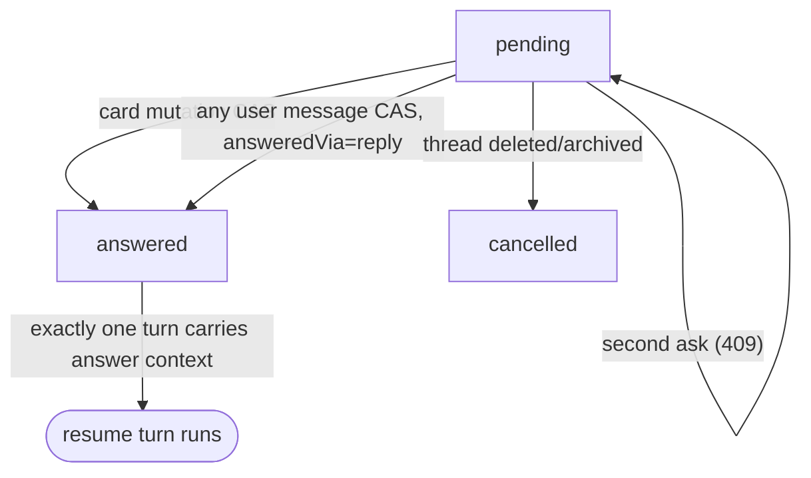
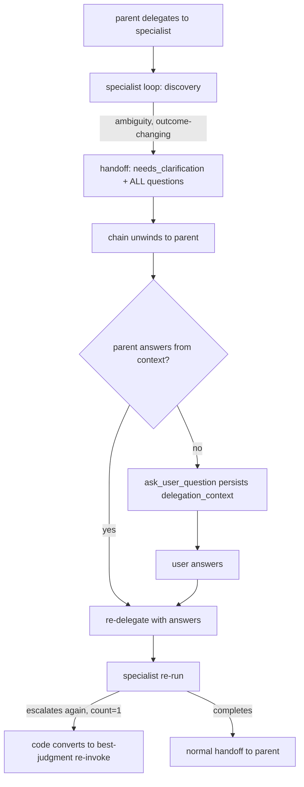

# feat: ask_user_question HITL for the Pi agent

## Summary

Add a native `ask_user_question` capability to the Pi runtime: the parent session asks the user a structured, optioned question batch, the turn ends with the thread parked in a waiting state, and the user's answer — interactive card on web or any plain reply from any surface — resumes the agent with the answers bound to the question. Specialist profiles escalate ambiguity to the parent through a `needs_clarification` handoff instead of assuming. Ships default-on.

---

## Problem Frame

The agent barrels ahead on ambiguous requests and never asks. The origin doc (`docs/brainstorms/2026-06-09-ask-user-question-requirements.md`) pins the product shape: parent-only asking, specialist escalation, wait-indefinitely, baked-in trigger policy, web card + text fallback. This plan settles the how: the Pi loop has no mid-turn tool suspension, the closest UI precedent (`RunbookConfirmation`) is an inert stub, and `messages.parts` has a live read path but no producer — so the answer round-trip is built net-new from live primitives (typed parts rendering, the wakeup substrate, the closed-loop handoff contract).

---

## Requirements

Origin requirements R1–R17 carry forward unchanged (see origin doc). Plan-level additions, continuing the numbering:

- R18. A specialist surfaces all of its clarification needs in a single needs-clarification handoff (max 4 questions); the escalation contract states this front-loading rule.
- R19. The parent consolidates its own open questions and escalated specialist questions into one `ask_user_question` batch per pause.
- R20. Clarification re-delegation has its own budget — one escalate→ask→re-delegate cycle per delegation; a second escalation in the same delegation gets a proceed-on-best-judgment instruction. The budget is enforced from the escalation count persisted on the pending-question row, separate from `maxReviewLoops`.
- R21. In eval mode (`eval_mode === true`) the tool is not registered, and a `needs_clarification` handoff is converted by the orchestration into an immediate best-judgment re-invoke; evals never park.
- R22. The answer→resume path is idempotent: answer marking is a compare-and-swap, the card-path resume wakeup is keyed on the question id, and a swallowed enqueue (`inserted=false`) is logged and surfaced as an error, never silently dropped.

---

## Key Technical Decisions

- **Sentinel turn-end, not mid-turn suspension — with loop-enforced termination day one.** `runAgentLoop` awaits `session.prompt()` to completion inside one Lambda invocation; there is no path that parks a pending tool call and injects its result later. The tool persists the question via an awaited API call and returns a sentinel tool result; the loop detects the sentinel detail flag on `tool_execution_end` and ends the turn deterministically (`session.abort()` seam exists) rather than relying on the model to stop. AWAITING_USER emission and don't-do-the-work-anyway both depend on prompt turn end, so termination is in scope, not a contingency. On resume, the answers are injected as a structured context block that echoes the questions. Editing the persisted S3 session JSONL to splice answers into the tool-result slot is rejected as fragile surgery on the Pi SDK's internal format. This matches the hosted-harness consensus (Bedrock `returnControl`, LangGraph `interrupt()`, ADK `requestConfirmation`) (see origin).
- **Pending state is a new table, not a turn status.** The asking turn ends `succeeded`, so the stall monitor and finalize idempotency machinery are untouched. A `pending_user_questions` table holds the batch (tenant-scoped, FK to thread and originating message/turn, status `pending | answered | cancelled`, jsonb question payload + answer payload, nullable jsonb `delegation_context` carrying profile slug, original task, and escalation count for the specialist flow). The questions payload is size-capped (≤ 8 KB) at intake. A partial unique index enforces one `pending` row per thread (R8); the intake endpoint returns 409 on conflict. Consume paths clear ALL pending rows for the thread, not one by id, so an orphan row (e.g., created in the window before the hand-applied index lands) can never wedge the badge.
- **Two answer routes, one turn.** The card mutation marks answered and enqueues a resume wakeup keyed on the question id. A plain reply does NOT enqueue a second wakeup: `sendMessage` CAS-consumes the pending batch and attaches the answer context to the turn it already dispatches — exactly one turn carries the answer context regardless of route. The card-path enqueue follows the producer-side wakeup-defer contract: call `shouldDeferWakeup()` and insert `status='deferred'` when a turn is running, and carry `threadId` at the payload top-level key `promoteNextDeferredWakeup()` matches on.
- **Waiting badge = the reserved `AWAITING_USER` lifecycle status.** `packages/api/src/graphql/resolvers/threads/lifecycle-status.ts` defines `AWAITING_USER` but never emits it (a test asserts that). Emit it when a pending question exists — including when the latest turn failed, so an unattended thread never loses its needs-attention signal. It clears on the same thread-update event that fires when the question is consumed; no separate dismissal logic.
- **Fan-out reuses existing notify mutations.** The question lands as a new assistant message (`notifyNewMessage`) and the waiting state as a thread update (`notifyThreadUpdate`). No new `@aws_subscribe` field, so no terraform `notification_mutations` change.
- **The question message is written at intake time, not finalize.** The tool's API call creates the pending row and the assistant message in one transaction: `content` carries a readable markdown rendering (text fallback for mobile/connectors, R16), `parts` carries the structured `data-user-question` payload (first live producer of `messages.parts`). The card appears the moment the agent asks. The asking turn's finalize still runs: any trailing assistant text is kept as a normal message, but `last_response_preview` is set from the question (not the trailing prose) and the turn-completed push is suppressed for asking turns — the thread is waiting on the user, not done.
- **Answered state derives from the question row, never from parts mutation.** The `parts` payload is written once (questions only). Answers, answered-by, and answered-at are read from `pending_user_questions` via a GraphQL field resolved alongside messages (DataLoader by message id). This avoids in-place mutation of a persisted message's parts (a novel write pattern) and removes any CAS-vs-parts atomicity gap — there is one writer and one source of truth for answer state.
- **Any thread participant may answer; consumption is recorded distinctly.** Questions are addressed to the thread, not a user — an explicit trust decision: Space threads are collaborative and participants share the agent. No intent classification. Card answers record the structured payload; plain-reply consumption records `answeredVia: "reply"` plus a reference to the consuming message rather than copying its text as a structured answer. The user gets no system-message acknowledgment that their reply consumed the question — accepted trade-off (the agent's response framing resolves any mismatch); implementers must not invent one. If the resume turn re-asks, a new question row is created and AWAITING_USER re-asserts.
- **`needs_clarification` extends the handoff contract; chains unwind before asking.** New verdict alongside `pass | revise | fail` plus a `questions` field, parsed in `agent-profile-adapter.ts`, dictated to specialists in `profileSystemPrompt()`. There is no mid-chain park: `runParentOwnedProfileOrchestration` holds chain state in invocation-local variables, so on `needs_clarification` the orchestration terminates the chain and surfaces the questions (plus delegation context) to the parent. The parent asks; the intake persists `delegation_context` on the question row. The resume context block carries an explicit re-delegation instruction (original task + answers), and the budget (R20) is enforced in code from the persisted escalation count — a re-escalation for the same delegation context is converted to a best-judgment re-invoke, not another ask. Specialists never get the tool: profile tool policies gate it out via the existing `childToolSurface()` filter (verify no profile auto-includes it).
- **Trigger policy lives in the runtime tool policy block.** `buildRuntimeToolPolicy()` in `packages/pi-extensions/src/system-prompt-compose.ts` is the per-tool guidance seam: ask-when / don't-ask criteria, batching, the " (Recommended)" convention. The workspace default `AGENTS.md` line "Come back with answers, not questions" is rewritten to carve out outcome-changing ambiguity — otherwise the personality line and the tool policy fight.
- **User answer text is data, not instructions.** The resume context block wraps all user-provided answer text (structured free-text and plain replies) in delimited literal tags (e.g., `<user_answer>…</user_answer>`) with explicit treat-as-literal framing — defense-in-depth against prompt injection through the answer path, which lands at turn-context level rather than as a chat message.

---

## High-Level Technical Design

Ask → park → answer → resume (parent flow):

```mermaid
sequenceDiagram
  participant M as Pi model (parent)
  participant X as ask-user extension
  participant API as packages/api
  participant DB as Aurora
  participant W as Web client
  M->>X: ask_user_question(questions)
  X->>API: POST question intake (awaited)
  API->>DB: insert pending_user_questions + assistant message (content + parts)
  API-->>W: notifyNewMessage / notifyThreadUpdate
  X-->>M: sentinel result
  Note over M: loop detects sentinel flag → ends turn (succeeded);<br/>thread lifecycle → AWAITING_USER
  alt structured card answer
    W->>API: answerUserQuestion mutation
    API->>DB: CAS pending→answered (consume all)
    API->>DB: enqueue wakeup (idempotency_key = question id, defer-aware)
    API->>M: resume turn with answer context block
  else plain reply (any surface)
    W->>API: sendMessage
    API->>DB: CAS-consume pending (answeredVia: reply)
    API->>M: the message's own dispatched turn carries the answer context
  end
```

Pending-question state machine:



Specialist escalation (chain unwinds; one clarification cycle per delegation, enforced from persisted count):



---

## Implementation Units

### U1. Pending-question schema and GraphQL surface

- **Goal:** Persistence and API contract for question batches and answers.
- **Requirements:** R5, R8, origin R1–R3; R20 (delegation_context); R22 (CAS shape).
- **Dependencies:** none.
- **Files:** `packages/database-pg/src/schema/pending-user-questions.ts` (new), `packages/database-pg/src/schema/index.ts`, generated `packages/database-pg/drizzle/NNNN_*.sql`, hand-rolled partial-index migration in `packages/database-pg/drizzle/` with `-- creates:` markers, `packages/database-pg/graphql/types/messages.graphql` (or new `questions.graphql`): question/answer payload types, `answerUserQuestion` mutation, a message-level `userQuestion` field (answer state read path), pending-question probe on Thread.
- **Approach:** Table: id, tenant_id, thread_id, message_id, thread_turn_id, status (`pending | answered | cancelled`), questions jsonb (validated tool payload, ≤ 8 KB), answers jsonb, answered_via (`card | reply`), answered_by, answered_at, delegation_context jsonb nullable, created_at. Partial unique index on `thread_id WHERE status = 'pending'` is hand-rolled SQL with `-- creates:` markers for the `db:migrate-manual` gate. Run `pnpm schema:build` and codegen in api/web/cli/mobile after the GraphQL edit.
- **Patterns to follow:** existing hand-rolled migrations in `packages/database-pg/drizzle/` with marker headers; `docs/solutions/workflow-issues/manually-applied-drizzle-migrations-drift-from-dev-2026-04-21.md`.
- **Test scenarios:** schema round-trip insert/read of a 4-question batch with multiSelect, answers, and delegation_context; second `pending` insert for the same thread violates the partial index; `cancelled` and `answered` rows coexist with a new `pending` row on the same thread.
- **Verification:** `pnpm --filter @thinkwork/database-pg build` green; `db:migrate-manual` reports the partial index marker; the index is applied to dev before U2 merges (the 409 contract and badge correctness date from index-apply, not code deploy); codegen diffs committed in all four consumers.

### U2. Question intake endpoint

- **Goal:** Authenticated runtime-facing endpoint that persists a question batch and emits the question message.
- **Requirements:** origin R1–R4, R8, R15, R16.
- **Dependencies:** U1.
- **Files:** extend `packages/api/src/handlers/chat-agent-activity.ts` (or its route-sibling) with a `/api/threads/{threadId}/questions` route — a route on the existing handler, NOT a new Lambda (no new handlers.tf + build-lambdas.sh entries; terraform route mapping only if the API Gateway routes are enumerated), `packages/api/src/lib/` helper for the question-message write.
- **Approach:** Validate payload against the question contract (1–4 questions, 2–4 options, header/label lengths, ≤ 8 KB total). Authorization is the API auth secret PLUS an ownership join stated here, not just in tests: resolve the `thread_turns` row from the payload's turn id, require it to belong to the target thread and to an active turn, and require the thread's `tenant_id` to match the turn's tenant — a secret-holder cannot post questions to arbitrary threads. In one transaction: insert `pending_user_questions` (409 on partial-index conflict) and insert the assistant message — `content` = readable markdown rendering of the batch, `parts` = `[{ type: "data-user-question", ... }]` (questions + question row id; no answer state). Then `notifyNewMessage` + `notifyThreadUpdate`, awaited (LWA: only awaited promises are guaranteed — `docs/solutions/runtime-errors/lambda-web-adapter-in-flight-promise-lifecycle-2026-05-06.md`). Persist `delegation_context` when the tool call carries it.
- **Patterns to follow:** `packages/api/src/handlers/chat-agent-activity.ts` (route + auth shape); `packages/api/src/lib/task-queues/message-parts.ts` (parts-writer helper shape).
- **Test scenarios:** valid batch → pending row + message with both content and parts, notify called; second batch while one pending → 409, no message written; invalid payload (5 questions, 1 option, > 8 KB) → 400; turn id not belonging to the target thread → 403/404 (ownership join); tenant mismatch → 403/404.
- **Verification:** integration test in `packages/api/test/integration/`; manual: curl the dev endpoint, observe the card message row and `AWAITING_USER` (after U3).

### U3. Answer path, lifecycle status, and resume dispatch

- **Goal:** Both answer routes converge on one consume function with exactly one answer-carrying turn; the thread badges while waiting.
- **Requirements:** origin R5–R8, R17; R22.
- **Dependencies:** U1, U2.
- **Files:** `packages/api/src/graphql/resolvers/messages/answerUserQuestion.mutation.ts` (new), `packages/api/src/graphql/resolvers/messages/sendMessage.mutation.ts` (pre-dispatch consume branch), message-level `userQuestion` field resolver + DataLoader, `packages/api/src/graphql/resolvers/threads/lifecycle-status.ts` + `packages/api/src/graphql/resolvers/threads/loaders.ts` (emit `AWAITING_USER`; pending-question probe), `packages/api/src/graphql/resolvers/threads/deleteThread.mutation.ts` + `updateThread.mutation.ts` (cancel hygiene), `packages/api/src/lib/chat-finalize/process-finalize.ts` (asking-turn finalize behavior).
- **Approach:** `consumePendingQuestions(threadId, {answers | replyMessageId}, answeredBy)`: CAS-update ALL `pending` rows for the thread to `answered` in one transaction (defensive against orphans); loser of any race no-ops (card double-click → already-answered; plain reply that loses lands as a normal message whose turn is serialized by wakeup-defer). Card mutation route: requires the caller to be a thread participant (thread-level access check — `resolveCallerTenantId(ctx)` alone is insufficient; `ctx.auth.tenantId` is null for Google-federated users), records structured answers (`answeredVia: card`), then enqueues the resume wakeup — `idempotency_key` = question id, `shouldDeferWakeup()`-aware insert with `threadId` at the payload top-level key promotion matches on; `inserted=false` is logged and surfaced as a mutation error (no fire-and-forget; the card shows retry). Plain-reply route: `sendMessage` consumes (`answeredVia: reply` + message ref) and attaches the answer context to the turn it already dispatches — no second wakeup, exactly one answer-carrying turn. Lifecycle: `AWAITING_USER` whenever a pending question exists (including failed latest turn); guard test flipped to the new invariant; grep web/mobile/CLI for exhaustive `ThreadLifecycleStatus` switches first. Finalize: when the turn's tool results include the ask sentinel, set `last_response_preview` from the question headers and suppress the turn-completed push; trailing assistant text persists normally. Thread delete/archive cancels pending rows. No reconciler in v1 (deferred; see Scope Boundaries).
- **Patterns to follow:** `sendMessage.mutation.ts` resolver auth/error shape; `packages/api/src/lib/wakeup-defer.ts` (producer-side contract); `docs/solutions/logic-errors/compile-continuation-dedupe-bucket-2026-04-20.md` (surfaced `inserted=false`).
- **Test scenarios:** Covers AE3 — plain reply with off-option text consumes the batch (`answeredVia: reply`) and its own turn carries the answer context. Covers AE4 — pending question on a schedule-initiated thread badges `AWAITING_USER`; answer resumes with `invocation_source` `question_answer`, not `schedule`. Covers AE6 — card CAS vs plain reply race: exactly one winner, exactly one answer-carrying turn (card path wakeup vs reply path dispatch). Double card submit → second gets already-answered. Non-participant same-tenant caller → rejected. User answers with an attached file via sendMessage — attachment resolves to the turn payload (the #2013 parity test lives HERE, where sendMessage changes). Wakeup `inserted=false` → mutation error surfaced. Thread delete cancels pending rows. Lifecycle: pending → `AWAITING_USER` (succeeded AND failed latest turn); consumed → clears. Asking-turn finalize: preview = question text, no push.
- **Verification:** `pnpm --filter @thinkwork/api test` (whole suite — lifecycle guard test flips); dev-stage manual round-trip.

### U4. Runtime resume injection

- **Goal:** The resume turn delivers answers as a structured block bound to the question.
- **Requirements:** origin R6, R7; flow F1/F3.
- **Dependencies:** U3.
- **Files:** `packages/api/src/handlers/chat-agent-invoke.ts` and `packages/api/src/handlers/wakeup-processor.ts` (carry answer payload into `invokePayload`), `packages/agentcore-pi/agent-container/src/server.ts` (compose the answer context block into the turn prompt).
- **Approach:** The wakeup/dispatch payload carries question id + questions + answers (or reply reference) + delegation_context. The container renders a block: each question echoed with its answer, all user-provided text wrapped in `<user_answer>` literal tags with treat-as-data framing; unanswered questions → "use the Recommended option if one exists, otherwise best judgment"; reply-consumed → "the user replied while this question was pending; it may answer fully, partially, or be a new request — address it, re-ask only if still needed; a clear never-mind/skip means proceed on best judgment." When delegation_context is present, the block carries an explicit re-delegation instruction (original task + answers + escalation count). Snapshot env at entry (`feedback_completion_callback_snapshot_pattern`). New `invocation_source` value `question_answer` on the turn row.
- **Patterns to follow:** `messages_history` / `message_attachments` payload plumbing in `chat-agent-invoke.ts`.
- **Test scenarios:** resume payload with full structured answers renders all Q/A pairs inside literal tags; partial answers render the recommended-option fallback; reply-consumed renders the may-not-answer + never-mind framing; delegation_context renders the re-delegation instruction; attachments on the answering message still resolve.
- **Verification:** `packages/agentcore-pi` vitest (`agent-container/tests/`); dev smoke via the `thinkwork-<stage>-agentcore-pi` Lambda path (not `invoke-agent-runtime`).

### U5. `ask_user_question` Pi extension and loop turn-end

- **Goal:** The tool itself — parent-only, allowlisted, eval-safe — and deterministic turn termination after asking.
- **Requirements:** origin R1–R4; R21.
- **Dependencies:** U2.
- **Files:** `packages/pi-extensions/src/ask-user-question.ts` (new), `packages/pi-extensions/src/index.ts`, `packages/pi-extensions/test/ask-user-question.test.ts`, `packages/agentcore-pi/agent-container/src/server.ts` (`buildInvocationResources()` wiring), `packages/pi-runtime-core/src/agent-loop.ts` (sentinel-flag turn end).
- **Approach:** `defineExtension({ name, toolNames: ["ask_user_question"], register })` with TypeBox `parameters` enforcing the contract (1–4 questions; question text; header ≤12 chars; 2–4 options of label+description; optional multiSelect). `executionMode: "sequential"`. `execute` POSTs to the U2 endpoint (awaited; apiUrl/apiSecret/threadId/turnId closed over from the invocation payload, mirroring `task-status.ts`); success returns the sentinel result with a machine-readable detail flag; 409 returns a tool error ("a question is already pending — end your turn"); other failures return a tool error telling the model to proceed on best judgment or ask in prose — never end the turn with a sentinel if the pending record wasn't persisted (phantom wait). The loop ends the turn when it observes the sentinel detail flag on `tool_execution_end` (deterministic; do not rely on model compliance). Same-turn guard is **turn-scoped** (reset at invocation entry, never session-scoped — durable sessions on warm containers would otherwise wedge legitimate re-asks): second call in one turn short-circuits with the already-pending error without POSTing. Not registered when `eval_mode === true`. Wiring: `addExtension(...)` so `toolNames` folds into `buildToolAllowlist()` — the allowlist entry is part of definition-of-done (`project_pi_extension_tool_activation_allowlist`); extension factories flow to profile children wholesale but `childToolSurface()` gates the tool out — verify no compiled profile tool policy auto-includes it.
- **Patterns to follow:** `packages/pi-extensions/src/task-status.ts` (closure config, TypeBox, sequential execute); `docs/solutions/spikes/2026-05-29-pi-extension-loading-agentcore-spike.md`.
- **Test scenarios:** schema rejects 0 and 5 questions, 1 and 5 options, over-length header; happy path POSTs once, returns sentinel with detail flag; loop ends turn on sentinel flag; 409 → already-pending tool error; network failure → best-judgment tool error, no sentinel, no throw out of the turn; second same-turn call short-circuits without POST; warm-path: ask → answer → ask again in a later turn of the same session succeeds (turn-scoped guard); eval_mode → extension absent.
- **Verification:** `pnpm --filter @thinkwork/pi-extensions test` + `pi-runtime-core` tests; dev probe turn proving the model can see and call the tool (allowlist check).

### U6. Specialist needs-clarification escalation

- **Goal:** Specialists escalate instead of assuming; the chain unwinds; the parent consolidates, asks once, re-delegates with answers under a code-enforced budget.
- **Requirements:** origin R9–R11; R18–R21; flow F2.
- **Dependencies:** U5.
- **Files:** `packages/agentcore-pi/agent-container/src/agent-profile-adapter.ts` (verdict union + `questions` field + parsing + goal/phase status mapping), `packages/agentcore-pi/agent-container/src/agent-profile-delegation.ts` (`profileSystemPrompt()` handoff contract + discovery-stage text; delegation tool result surface), `packages/agentcore-pi/agent-container/src/server.ts` (`runParentOwnedProfileOrchestration()` unwind branch), `packages/agentcore-pi/agent-container/tests/agent-profile-delegation.test.ts`.
- **Approach:** Add `needs_clarification` to the handoff verdict union with a structured `questions` list (same shape as the tool contract). Contract text: discovery stage — "if the request is ambiguous on a decision that changes the outcome, hand off `needs_clarification` instead of assuming; surface ALL clarification needs in this one handoff (max 4 questions) — you get one escalation per delegation." No mid-chain park: on `needs_clarification` the orchestration terminates the chain and surfaces questions + delegation context (profile slug, original task, escalation count) to the parent model via the delegation tool result / orchestration synthesis. The parent's tool policy (U7) instructs: answer what you can from context, consolidate the rest with your own questions, ask once; the ask carries `delegation_context` to intake. On resume (U4 block), the parent re-delegates; when a specialist re-escalates and the persisted escalation count for this delegation context is already 1, code converts the escalation to an immediate best-judgment re-invoke (same conversion in eval mode, where the ask tool is absent). Goal/phase status maps to a clarification analog, not `failed`.
- **Test scenarios:** Covers AE2 — handoff parsing of `needs_clarification` from JSON record and labeled-text forms; orchestration unwinds the chain and surfaces questions + delegation context; re-delegation injects answers; re-escalation with count=1 converts to best-judgment re-invoke (no second ask); eval-mode escalation converts to best-judgment immediately; `reviewLoops` budget is not consumed by a clarification cycle; goal/phase status maps to a clarification analog.
- **Verification:** `pnpm --filter @thinkwork/agentcore-pi test`; dev E2E: `#Research` delegation with a deliberately ambiguous task escalates and resumes.

### U7. Trigger-policy prompt guidance

- **Goal:** Default-on ask/don't-ask guidance, reconciled with the existing personality line.
- **Requirements:** origin R12–R14; R19.
- **Dependencies:** U5 (tool name must exist in the allowlist for the policy block to render).
- **Files:** `packages/pi-extensions/src/system-prompt-compose.ts` (`buildRuntimeToolPolicy()`), `packages/workspace-defaults/files/AGENTS.md`, `packages/pi-extensions/test/system-prompt.test.ts`.
- **Approach:** Policy block: ask only when (a) two or more valid approaches differ meaningfully in outcome, (b) a required parameter can't be inferred, or (c) a wrong guess wastes significant effort; don't ask when the path is obvious, the answer is in context/workspace/memory, or the question is cosmetic; batch every question for the decision point into one call (max 4); mark one option per question " (Recommended)"; when a specialist handoff carries questions, answer from context first and consolidate the rest into one batch; the turn ends after asking. Rewrite the AGENTS.md "Come back with answers, not questions" line to carve out outcome-changing ambiguity so the two texts agree.
- **Test scenarios:** Covers AE1 (prompt-level — assertable as text). Policy block renders only when `ask_user_question` is in the allowlist; AGENTS.md default no longer contains the unqualified never-ask line; compose snapshot includes batching + Recommended + consolidation conventions.
- **Test expectation note:** behavioral ask-vs-not-ask quality is validated in dev (and later evals), not unit tests.
- **Verification:** `pnpm --filter @thinkwork/pi-extensions test`; dev threads spot-checked against AE1's two cases.

### U8. Web question card and waiting badge

- **Goal:** Interactive card on web; answered state persists; thread badges while waiting.
- **Requirements:** origin R15–R17.
- **Dependencies:** U1, U2, U3.
- **Files:** `apps/web/src/lib/ui-message-types.ts` (`UserQuestionData` type), `apps/web/src/components/workbench/UserQuestionCard.tsx` (new), `apps/web/src/components/workbench/render-typed-part.tsx` (+ co-located test), `apps/web/src/components/workbench/TaskThreadView.tsx` / `SpacesThreadDetailRoute.tsx` (wiring + urql refetch), `apps/web/src/components/shell/ChatSidebar.tsx` + `GlobalInboxSection.tsx` (`AWAITING_USER` badge).
- **Approach:** Pending card: questions stacked as labeled sections; per question, option groups (radio / checkbox for multiSelect) with description text and a " (Recommended)" badge; an "Other" option per question reveals an inline text input when selected; no in-card whole-batch textarea — the chat input is the free-text bypass (a short hint says a plain reply also answers). Submit is always enabled; unanswered questions render visually muted, no confirmation prompt (partial submit passes only answered questions). During flight the whole card freezes (all inputs + button disabled); on failure — mutation transport error or surfaced dispatch failure alike — the card re-enables with an inline error and selections preserved. Answered card (rendered from the message-level `userQuestion` field, never component state): collapses to read-only — question headers + chosen option labels highlighted (or "answered by reply" linking the consuming message) + answered-by display name + relative timestamp, no submit affordance; correct across sessions and devices. Post-submit sequence: card flips to answered → thread lifecycle leaves `AWAITING_USER` and shows the standard running indicator when the resume turn starts (subscription event) — no in-card spinner. urql uses document cache: on thread-update events, `reexecute` affected queries `network-only`, coalesced, plus the window-focus refetch backstop (no event replay in the subscription client). Badge: render `AWAITING_USER` in sidebar/inbox status affordances alongside existing lifecycle badges; it clears on the same thread-update event that fires on consumption. Use existing vendored AI Elements primitives as-is; extend the local copy with typed slot props only if genuinely blocked, not preemptively.
- **Patterns to follow:** `render-typed-part.tsx` `data-*` switch and its co-located tests; `RunbookConfirmationData` shape in `ui-message-types.ts` (reference only — the component is inert); `docs/solutions/integration-issues/spaces-urql-doc-cache-no-live-invalidation.md`.
- **Test scenarios:** Covers AE5 — three-question batch renders as one card, one submit. render-typed-part routes `data-user-question` to the card; unknown-part forward-compat untouched. multiSelect toggles accumulate; single-select replaces. "Other" selection reveals the inline input; its text submits as the answer. Partial submit passes only answered questions; unanswered render muted. Card freezes during flight; error re-enables with selections preserved. Answered render (from the `userQuestion` field) shows chosen labels + answered-by + timestamp after remount; reply-consumed shows the answered-by-reply state. Mutation error keeps the card editable with retry. Sidebar shows the waiting badge for `AWAITING_USER` and clears it on the consumed event.
- **Verification:** `pnpm --filter @thinkwork/web test`; visual pass on dev (port 5180) — Eric validates before PR per workflow rules.

---

## Acceptance Examples

Origin AE1–AE5 carry forward as the behavioral contract; unit test scenarios above link to them (`Covers AE…`). Plan-level addition:

- AE6. **Covers R8, R22.** Given a pending question, when the runtime attempts a second `ask_user_question` from any turn, the intake returns 409 and the model receives an already-pending tool error; when card click and plain reply race, exactly one consume wins and exactly one turn carries the answer context.

---

## Scope Boundaries

Carried from origin: structured card on mobile/connectors (text fallback ships), timeout machinery and blocked/backlog states, per-profile chattiness knob — deferred; action-approval gating and installable-skill packaging — outside this feature's identity.

### Deferred to Follow-Up Work

- Answered-no-resume reconciler — v1 logs and surfaces `inserted=false` from the wakeup enqueue and fails the mutation loudly; if the stuck case materializes, add an inspect-and-reset reconciler (reset the existing keyed wakeup row, never blind re-insert — a blind re-enqueue with the same deterministic key is a no-op in exactly the stuck case).
- First-class cancel/withdraw mutation for a pending question — "any reply answers it" is the v1 escape hatch; the resume framing treats a clear never-mind as proceed-on-best-judgment.
- Intent classification of replies while a question is pending — resume framing handles mismatch.
- Push notifications for pending questions — the `AWAITING_USER` badge satisfies R17.
- Per-question answer tracking / partial-batch pending state — batches answer atomically.
- Relaxing the one-clarification-cycle-per-delegation cap — loosen only with evidence.
- `schema_version` on question payloads — revisit when the card schema first evolves.

---

## System-Wide Impact

- Default-on behavior change for every tenant's agent (asking instead of assuming) — the most user-visible prompt change since the profile loop landed; dev-stage observation before merge matters more than usual.
- First live writer of `messages.parts` — the parts-wins-over-content render precedence becomes load-bearing in production for the first time.
- Flips the `AWAITING_USER` never-emitted invariant — audit exhaustive `ThreadLifecycleStatus` switches in web/mobile/CLI before emitting.
- New table + hand-rolled partial index ride the `db:migrate-manual` deploy gate; apply the index to dev before merging U2 (invariant safety, not just data safety).

---

## Risks & Dependencies

- **Over-asking regression.** Default-on guidance could make the agent chatty. Mitigation: don't-ask criteria are as prominent as ask criteria; one-batch-per-decision-point; the deferred chattiness knob is the relief valve.
- **AGENTS.md tension.** Tenants with customized AGENTS.md keep their old "answers, not questions" line; only the shipped default is rewritten. Accepted: workspace files are tenant-owned.
- **Specialist contract drift.** Handoff parsing is text/JSON from model output; `needs_clarification` adds a parse surface. Mitigation: both record and labeled-text forms tested, unknown verdicts fall back to existing normalization.
- **Sentinel residue in durable sessions.** Repeated ask/answer cycles persist sentinel tool-results in the session transcript; the model could learn odd patterns (re-asking answered questions). Dev-validate a session with 2–3 completed ask/answer cycles; if degraded, reference the originating tool-call id in the echo block.
- **Security vectors (named):** (1) same-tenant non-participant answering another thread's question — mitigated by the thread-membership check in U3; (2) a compromised secret-holder parking arbitrary threads / reading answers — mitigated by the intake ownership join in U2; (3) prompt injection through answer text — mitigated by the literal-tag boundary in U4.
- **Dependency:** agent-profile closed-loop machinery (`docs/plans/2026-06-08-001-feat-agent-profile-closed-loops-plan.md`) is the escalation substrate; U6 assumes its handoff parsing and retry seams as currently shipped.

---

## Sources / Research

- Origin: `docs/brainstorms/2026-06-09-ask-user-question-requirements.md` (product scope, harness survey, schema model).
- Turn lifecycle and session durability: `packages/api/src/handlers/chat-agent-invoke.ts`, `packages/pi-runtime-core/src/agent-loop.ts` (`buildToolAllowlist`, prompt-to-completion, `session.abort()` seam), `packages/agentcore-pi/agent-container/src/runtime/session-store.ts` (S3 JSONL sessions) — no mid-turn suspension exists; sentinel design follows.
- Handoff contract: `packages/agentcore-pi/agent-container/src/agent-profile-adapter.ts` (verdict union, parsing), `agent-profile-delegation.ts` (`profileSystemPrompt`, `retrySpecialistTask`, `childToolSurface`), `server.ts` (`runParentOwnedProfileOrchestration` — invocation-local chain state; the reason chains unwind before asking).
- Dead precedent: `apps/web/src/components/runbooks/RunbookConfirmation.tsx` is inert; `RunbookConfirmationData` in `apps/web/src/lib/ui-message-types.ts` survives as a shape reference only.
- Finalize path: `packages/api/src/lib/chat-finalize/process-finalize.ts` (asking-turn preview/push behavior lands here).
- Learnings applied: LWA awaited-promise lifecycle (`docs/solutions/runtime-errors/lambda-web-adapter-in-flight-promise-lifecycle-2026-05-06.md`), continuation dedupe keys + surfaced `inserted=false` (`docs/solutions/logic-errors/compile-continuation-dedupe-bucket-2026-04-20.md`), urql document-cache invalidation (`docs/solutions/integration-issues/spaces-urql-doc-cache-no-live-invalidation.md`), extension loading + allowlist (`docs/solutions/spikes/2026-05-29-pi-extension-loading-agentcore-spike.md`), closed-loop ownership (`docs/solutions/agent-profile-closed-loops-2026-06-08.md`).
