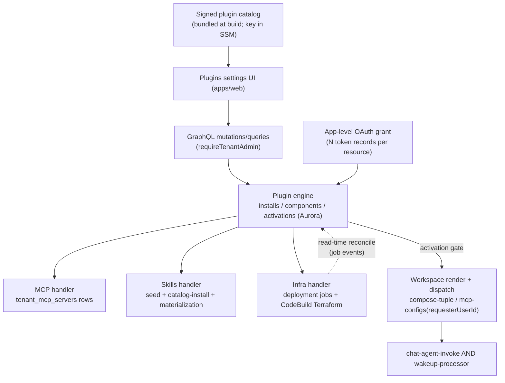
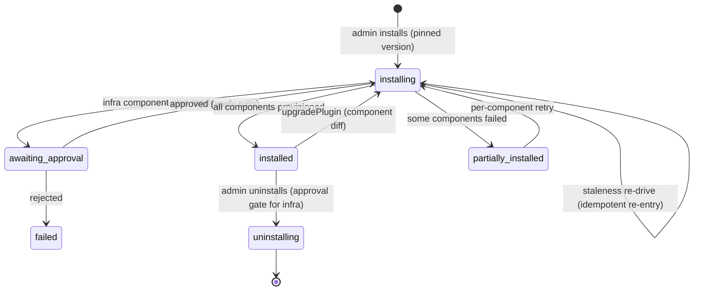
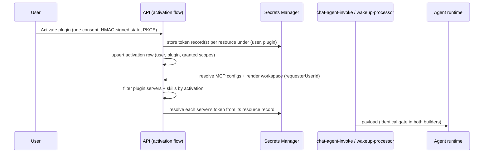

# feat: Application plugins

## Summary

Build the Application Plugin system: a versioned manifest format bundling MCP servers, skills, reserved UI surfaces, and optional managed infrastructure; a plugin engine that owns canonical install/component/activation state; a curated signed catalog tenant admins install from; and per-user app-level OAuth activation that gates which plugin tools and skills appear in each user's rendered agent workspace. V1 ships the LastMile plugin (external SaaS) and rebuilds Twenty as an infrastructure-bundling plugin. Kestra and the legacy zip-upload plugin machinery are removed in parallel.

---

## Problem Frame

Adding an application today is bespoke wiring across three subsystems — managed-app deployment adapters, managed-MCP registration with per-server user OAuth, and the tenant skill catalog — with no package format, no install surface, no versioning, and no per-user gating of workspace contents. TEI needs LastMile (CRM/Task/Routing MCPs + skills) now; Company Brain and LakeHouse plugins follow. The brainstorm (see origin) settled the model: plugins are the universal package, the plugin engine is the source of truth, and existing machinery becomes component handlers.

---

## Requirements Trace

From origin `docs/brainstorms/2026-06-12-application-plugins-requirements.md`:

- R1. A plugin is a versioned package described by a manifest declaring identity, version, and components.
- R2. Exactly four component types in v1: MCP servers, skills, infrastructure, UI surfaces.
- R3. One manifest format covers external-SaaS and infrastructure-bundling shapes.
- R4. UI surface components are declared but not rendered in v1.
- R5. ThinkWork publishes plugins to a curated catalog deployed platforms can check.
- R6. Tenant admins browse the catalog, see contents/versions, and install.
- R7. The plugin engine is the canonical record of install, component, and activation state.
- R8. Install provisions every component through its handler; infrastructure reuses the Terraform deployment machinery.
- R9. Install is tenant-wide and admin-only; install alone exposes nothing to end users.
- R10. Admins see per-component install/health status.
- R11. Uninstall removes all components and derived state with no orphans.
- R12. Activation is one app-level OAuth grant covering all the app's MCP servers.
- R13. Users can deactivate, revoking ThinkWork's stored credentials and the app's workspace presence (provider-side grant revocation is deferred; UI copy must not claim it).
- R14. A user's rendered workspace includes an app's tools and skills only when that user activated it.
- R15. Skills gating is per-requester.
- R16. Directly-added MCP servers continue working unchanged.
- R17. LastMile plugin ships with CRM/Task/Routing MCP servers and skills.
- R18. Twenty is rebuilt as an infrastructure-bundling plugin with a one-time re-auth.

**Origin actors:** A1 ThinkWork publisher, A2 tenant admin, A3 end user, A4 agent runtime. **Origin flows:** F1 publish, F2 install, F3 activate, F4 workspace gating, F5 uninstall/deactivate. **Origin acceptance examples:** AE1 activation gating, AE2 single OAuth, AE3 uniform provisioning, AE4 no-orphan teardown, AE5 catalog update visible and installable.

---

## Scope Boundaries

### Deferred for later (from origin)

- Company Brain and LakeHouse plugin migrations.
- Premium plugin entitlements and billing.
- Rendering UI surface components.
- Zip/bundle sideload for custom plugins.
- Third-party plugin authoring and self-publishing.
- Resuming connected-application registry work (cross-app bindings, capability flows) on the plugin model.

### Outside this product's identity (from origin)

- No abstract capability-requirement layer; plugins name concrete vendor MCP servers.
- No public open marketplace; the catalog is ThinkWork-curated.

### Deferred to Follow-Up Work

- Dropping the `plugin_uploads` table and other superseded DB objects (destructive migrations wait until the code-removal PRs have deployed; see U2).
- Provider-side OAuth grant revocation on deactivation (v1 deletes local tokens only).
- Push/update notifications for new catalog versions (v1 is page-visible only, per AE5).
- Per-component health refresh beyond read-time reconciliation (evented health can reuse deployment events later).
- Thread-level signal for mixed-activation shared threads ("LastMile tools active for Alice — Connect to use them"). V1 deliberately ships without it; activation discovery lives on the Plugins surface.
- Thread-level needs_reauth messaging (readable skip reason in the thread when a plugin's servers drop for auth). V1 surfaces needs_reauth via the plugin detail badge and the sidebar health indicator only.
- Remotely-fetched catalog (S3/API channel). V1 bundles the catalog at build time; the fetch channel comes when catalog cadence decouples from platform deploys.

---

## Context & Research

### Relevant code and patterns

- `packages/deployment-runner/src/apps/registry.ts` — `ManagedAppAdapter` interface and the closed `cognee|kestra|twenty` key union (duplicated in `packages/deployment-runner/src/shared.ts` and `packages/api/src/graphql/resolvers/core/managedApplications.ts`). The infra component handler builds on this seam.
- `packages/database-pg/src/schema/deployments.ts` — `managed_applications`, deployment jobs (idempotency keys, plan-digest-pinned approvals, data-impact disclosure), deployment events. The lifecycle invariants to preserve.
- `packages/api/src/lib/managed-mcp-applications.ts` — per-app hardcoded reconcilers (Twenty/Kestra) that the MCP component handler generalizes; includes full destroy cleanup (tokens, secrets, assignments).
- `packages/database-pg/src/schema/mcp-servers.ts` — `tenant_mcp_servers` (`management_source` + `managed_application_key` ownership columns), `user_mcp_tokens` (per-user × per-server, Secrets Manager refs).
- `packages/api/src/handlers/skills.ts` (mcp-oauth authorize ~line 673, callback ~line 901) + `packages/api/src/lib/mcp-oauth-client.ts` — RFC 9728 discovery + DCR + PKCE flow the app-level grant reuses. Note: the existing flow binds tokens to ONE resource indicator per grant (`resolveMcpOAuthResource` defaults to the server URL) and hardcodes scopes; state is parsed from unsigned base64.
- `packages/api/src/lib/mcp-configs.ts` — dispatch-time MCP config resolution; both dispatch call sites pass `agent.human_pair_id`, not the requesting user (`resolve-agent-runtime-config.ts:655`, `wakeup-processor.ts:1643`).
- `packages/api/src/lib/workspace-renderer/compose-tuple.ts` — per-thread render already receives `userId`; `effective-policy-composer.ts` is the existing render-time filter layer.
- `packages/api/src/handlers/chat-agent-invoke.ts` (~line 1122) and `packages/api/src/handlers/wakeup-processor.ts` (~line 1648) — duplicated MCP config filtering; the parity seam (3 prior bugs).
- `packages/api/src/lib/catalog-install.ts` / `catalog-uninstall.ts` / `catalog-reinstall.ts` — skill install machinery; sources only from `tenants/<tenant-slug>/skill-catalog/<slug>/`, slugs validated by `SLUG_RE /^[a-z0-9][a-z0-9-]{0,63}$/` (`packages/api/src/types/catalog-skill.ts:19` — no slashes).
- `packages/release-manifest/src/index.ts` + `scripts/release/build-release-manifest.ts` — signed, versioned manifest precedent. Its ed25519 sign/verify helpers are coupled to the release-manifest document shape; U3 extracts/adapts rather than pure-imports.
- `model_catalog` + `tenant_model_catalog` (`packages/database-pg/src/schema/agents.ts`) — platform-catalog-plus-tenant-overlay precedent.
- `packages/api/src/lib/compliance/emit.ts` + `COMPLIANCE_EVENT_TYPES` (`packages/database-pg/src/schema/compliance.ts` — has `mcp.added`/`mcp.removed`) — audit event seam.
- `packages/api/src/lib/plugin-installer.ts`, `plugin-validator.ts`, `plugin-zip-safety.ts`, `plugin-field-policy.ts`, `packages/api/src/handlers/plugin-upload.ts`, `plugin-staging-sweeper.ts`, `plugin_uploads` table — the legacy zip-upload "plugin" machinery U2 retires.
- `apps/web/src/components/settings/` — `settings-nav.tsx` (`operatorOnly`, `managedAppKey` gating), `OperatorGuard.tsx` (route-level redirect), `SettingsMcpServerDetail.tsx` (OAuth return-param handling lines ~93–118; Expired/Authenticate badge lines ~355–368; managed-server lockout lines ~324–346), `managed-applications/ManagedApplicationPlanDialog.tsx` + `ManagedApplicationLifecycleActions.tsx` (approval dialog pattern; `appKey` is typed as the closed `ManagedAppKey` union — reuse requires widening that interface), `ManagedApplicationsPage.tsx` ("unavailable" error-state pattern).
- `packages/api/src/lib/lastmile/tasks-adapter.ts` — the only LastMile code today; the LastMile plugin is greenfield.

### Institutional learnings

- `docs/solutions/architecture-patterns/managed-app-mcp-oauth-lifecycle-2026-06-06.md` — two coupled state machines: infra lifecycle vs user OAuth; managed MCP connectors must be real `tenant_mcp_servers` rows, not plugin-internal config.
- `docs/solutions/architecture-patterns/workspace-skills-load-from-copied-agent-workspace-2026-04-28.md` — skill activation derives from materialized workspace files; don't build a DB-side gate that diverges from what the runtime materializes.
- `docs/solutions/best-practices/every-admin-mutation-requires-requiretenantadmin-2026-04-22.md` — `ctx.auth.tenantId` is null for Google-federated users; every install mutation needs `requireTenantAdmin` with `resolveCallerTenantId(ctx)`.
- `docs/solutions/logic-errors/oauth-authorize-wrong-user-id-binding-2026-04-21.md` — activation rows must bind the caller's canonical user id, verified end-to-end.
- `docs/solutions/workflow-issues/manually-applied-drizzle-migrations-drift-from-dev-2026-04-21.md` + #1618 — migration markers and never-destructive-before-code-removal-deploys ordering.
- `docs/solutions/workflow-issues/survey-before-applying-parent-plan-destructive-work-2026-04-24.md` — survey live consumers before Kestra/legacy-plugin destructive work.
- `docs/solutions/integration-issues/spaces-urql-doc-cache-no-live-invalidation.md` — urql document cache doesn't invalidate on events; install/activation status UIs need explicit refetch wiring.
- Session memory (no solutions doc): new `@aws_subscribe` subscriptions need `notification_mutations` entries in the AppSync Terraform or they silently no-op; user-initiated Lambda invokes must be `RequestResponse`; `graphql-http` Lambda env is near the 4KB cap — no new env-var plumbing; non-`public.*` schemas are off-limits in cleanups.

---

## Key Technical Decisions

- **Plugin engine state lives in Aurora; the env-var status projection retires.** New `public.*` tables are canonical for plugin installs, component provisioning, and user activations. The Twenty cutover (U10) replaces the Lambda-env-based managed-application status read path, relieving 4KB env pressure rather than adding to it.
- **Manifests are repo-authored TypeScript in a shared package; the catalog is bundled at build time and signed.** `packages/plugin-catalog` holds typed manifests (consumed by API and deployment-runner). The catalog document (version list per plugin, sha256 per artifact, ed25519 signature) is built into the package artifact and loaded at Lambda cold start — no runtime fetch channel in v1, so catalog updates ship with platform deploys. Installs pin a catalog version; signature verification fails closed. The trusted public key is read from SSM (`/thinkwork/{stage}/plugin-catalog/trusted-public-key`) via the `@thinkwork/runtime-config` path — never a new env var — with the IAM grant added to the grouped policies.
- **Handlers reconcile real runtime rows; the engine owns orchestration state only.** The MCP handler creates/repairs `tenant_mcp_servers` rows (`management_source: 'plugin'` + `plugin_install_id` column); the skills handler drives the existing S3 catalog install into workspace materialization; the infra handler drives the existing deployment-job machinery. No shadow copies of runtime state.
- **Plugin install/component status reconciles at read time.** Infrastructure jobs complete asynchronously (Step Functions → CodeBuild) and nothing pushes completion into the engine. Install/component status queries join the linked deployment job's latest events/evidence and update component state on read (lazy reconciliation). This matches the no-readiness-snapshots decision; an evented write-back is deferred follow-up.
- **Activation is one grant per (user, plugin) holding N token records.** The user consents once; under the grant, the activation stores one token record per resource indicator the plugin's MCP servers require (often 1, possibly N — RFC 8707 binds tokens to a single resource, and "single auth domain" does not guarantee a single token audience). Dispatch resolves each plugin server's token from its resource record. Activation survives version upgrades. The activation row records the granted scope set; manifests declare required scopes per version, and an upgrade whose required scopes are no longer covered (or whose auth domain changes) flips affected activations to `needs_reauth`.
- **Install is a state machine, not a step.** `installing → awaiting_approval (infra plan ready) → installing (approved; apply runs) → installed | partially_installed | failed`, with `awaiting_approval → failed` on rejection and per-component status (`pending → provisioned | failed`, `failed → pending` on retry). Partial failures hold with per-component retry — no rollback-all. An install stuck in `installing` past a staleness threshold (or with no in-flight infra job) is re-drivable: the install mutation re-enters the handler sequence idempotently instead of returning the wedged row.
- **Upgrade is a first-class mutation.** `upgradePlugin` pins the new catalog version, diffs component sets, runs handlers for added/changed/removed components through the same state machine, and applies the scope/auth-domain re-auth rule above. AE5's "visible and installable" is served end-to-end.
- **Uninstall is async for infra plugins.** Infrastructure destroy goes through the existing approval gate with destructive confirmation and data-impact disclosure. Teardown order: user activations and token secrets → skill folders (workspace and seeded catalog prefixes) → MCP rows → infrastructure job. Deactivation deletes local tokens only (no provider-side revocation in v1; UI copy says "disconnect", not "revoke").
- **Automation turns gate on the thread- or job-owner's activation, evaluated at dispatch time.** The activation gate is applied identically in both payload builders via one shared module; a user deactivating mid-automation drops the tools on the next turn. Mixed-activation shared threads are blessed: the tool surface follows the requesting turn's user, prior turns' outputs remain visible to all participants, and v1 ships no thread-level explanation signal (explicitly deferred).
- **Dispatch identity is plumbed explicitly.** `buildMcpConfigs` gains a `requesterUserId` parameter (resolved from the thread/job owner) at both call sites. Plugin-managed servers resolve activation/tokens by `requesterUserId`; direct `per_user_oauth` servers keep today's `human_pair_id` semantics, preserving R16.
- **Plugin skills use hyphenated namespace slugs** (e.g. `lastmile--crm-update`) that satisfy the existing `SLUG_RE`; the skills handler seeds bundled sources into `tenants/<tenant-slug>/skill-catalog/<namespaced-slug>/` before invoking catalog-install, records the seeded prefix on the component row, and uninstall removes both the workspace folders and the seeded prefix. `plugin_install_id` on the component row is the authoritative ownership marker.
- **Direct-add MCP coexistence: dedupe by endpoint URL, direct entry untouched.** A server registered both directly and via plugin keeps the direct row independent; the dispatch merge dedupes by URL with the plugin entry taking precedence for activated users.
- **Plugin lifecycle emits compliance audit events.** New `COMPLIANCE_EVENT_TYPES`: `plugin.installed`, `plugin.uninstalled`, `plugin.activation_granted`, `plugin.activation_revoked`, emitted transactionally with the state transitions via `emit.ts`. MCP sub-actions reuse the existing `mcp.added`/`mcp.removed` events.
- **Activation OAuth state is HMAC-signed.** The reused flow's plain-base64url state blob is insufficient for the app-level grant (the wrong-user-binding bug class); the plugin flow signs the state payload and the callback verifies before consuming any state-embedded field (`completion_hmac_secret` idiom already in `skills.ts`).
- **Legacy "plugin" machinery is superseded, not extended.** The zip-upload saga (`plugin_uploads`, installer/validator/sweeper) is removed from routes and UI in U2; its table drop is deferred follow-up per migration ordering rules.

---

## High-Level Technical Design

Component topology — engine, handlers, catalog, and the gated render path:



Install lifecycle state machine:



Activation and dispatch gating sequence:



---

## Output Structure

```text
packages/plugin-catalog/                 # shared manifest types + repo-authored manifests + bundled signed catalog
  src/
    contracts.ts                         # manifest + component type definitions (incl. required scopes per version)
    catalog.ts                           # catalog document shape, signing/verification helpers
    plugins/
      lastmile/manifest.ts
      twenty/manifest.ts                 # authored in U10
    index.ts
  scripts/build-catalog.ts

packages/database-pg/src/schema/plugins.ts
packages/database-pg/graphql/types/plugins.graphql

packages/api/src/lib/plugins/
  engine.ts                              # install/uninstall/upgrade orchestration + state machine + read-time reconcile
  activation.ts                          # app-level OAuth grant + activation rows + token records
  gating.ts                              # shared activation-gate used by both dispatchers
  handlers/
    mcp.ts
    skills.ts
    infra.ts                             # U11

packages/api/src/graphql/resolvers/plugins/

apps/web/src/components/settings/plugins/
apps/web/src/routes/_authed/settings.plugins.*.tsx
```

---

## Implementation Units

> Phase 0 (U1–U2) clears the decks and runs **in parallel** with Phase 1 — it gates only U10/U11, not the LastMile path. Phase 1 (U3–U7) builds the engine; Phase 2 (U8–U11, then U9/U10) ships surfaces and the two v1 plugins. Ship-inert applies: new modules land with tests before live wiring. The LastMile-critical chain is U3 → U4 → U5 → U6 → U7 → U8 → U9.

### U1. Remove Kestra

**Goal:** Delete Kestra end-to-end so the infra handler and plugin surfaces never inherit dead branches.

**Requirements:** Origin Key Decision (Kestra removed); unblocks R8, R18.

**Dependencies:** None. Runs parallel to Phase 1; hard prerequisite only for U10/U11. Must complete the destroy pass before Terraform module deletion.

**Files:**

- Delete: `packages/deployment-runner/src/apps/kestra.ts`; trim registry/key unions in `packages/deployment-runner/src/apps/registry.ts`, `packages/deployment-runner/src/shared.ts`, `packages/api/src/graphql/resolvers/core/managedApplications.ts`
- Modify: `packages/api/src/lib/managed-mcp-applications.ts` (remove Kestra reconciler + admin-key minting), `packages/api/src/graphql/resolvers/deployments/*` Kestra branches, `packages/api/src/graphql/resolvers/core/installManagedApplicationMcpServer.mutation.ts`
- Delete: `packages/lambda/kestra-control-{mcp,client,policy}.ts`; remove from `scripts/build-lambdas.sh` and `terraform/modules/app/lambda-api/handlers.tf`
- Delete: `terraform/modules/app/kestra/`; remove `kestra_*` vars in `terraform/modules/thinkwork/variables.tf` and `terraform/examples/greenfield/main.tf`; remove `orchestrate.` subdomain logic in the `www-dns` module
- Delete: `apps/web/src/components/settings/SettingsKestraApplication.tsx`, route `apps/web/src/routes/_authed/settings.applications.kestra.tsx`; trim `settings-nav.tsx`, `SettingsSidebar.tsx`
- Delete: `scripts/smoke/kestra-*.mjs`; remove the entry in `scripts/release/build-release-manifest.ts`
- Modify: mark `docs/plans/2026-06-08-002-feat-kestra-managed-app-plan.md` and its brainstorm superseded
- Test: update registry/parser/resolver tests that enumerate managed app keys

**Approach:** Survey live consumers first (grep all import forms, not just key strings). Destroy any deployed Kestra instances via the existing DESTROY operation before deleting the Terraform module, or state orphans result. No destructive DB migrations in this unit; `tenant_mcp_admin_keys` Kestra rows and secrets are cleaned by the destroy path.

**Test scenarios:**

- Happy path: managed app key unions no longer accept `kestra`; registry tests pass with two adapters.
- Edge case: `managedApplications` query returns no Kestra entry and no longer reads Kestra env vars.
- Error path: a stale `kestra` key in `parseRunnerInput` is rejected with a clear validation error.
- Integration: web settings nav renders without the Kestra item; the route returns not-found.

**Verification:** Typecheck/test/lint pass monorepo-wide; `terraform validate` passes in `terraform/modules/thinkwork`; no remaining `kestra` references outside docs history.

---

### U2. Retire legacy zip-upload plugin machinery

**Goal:** Free the "plugin" name and remove the tenant zip-upload saga the new system supersedes.

**Requirements:** Key Decision (legacy machinery superseded); protects R5/R6 naming.

**Dependencies:** None. Runs parallel to Phase 1 (the new code lives at `lib/plugins/`; the legacy files are `lib/plugin-*.ts` — no on-disk collision).

**Files:**

- Delete: `packages/api/src/lib/plugin-installer.ts`, `plugin-validator.ts`, `plugin-zip-safety.ts`, `plugin-field-policy.ts`, `packages/api/src/handlers/plugin-upload.ts`, `packages/api/src/handlers/plugin-staging-sweeper.ts`
- Modify: `scripts/build-lambdas.sh` (remove both handler build entries) and `terraform/modules/app/lambda-api/handlers.tf` (remove the plugin-upload and plugin-staging-sweeper handler registrations and the `/api/plugins/*` route mappings)
- Modify: any web UI entry points to the upload flow
- Test: remove/replace the suite covering the saga

**Approach:** Survey-before-destructive: confirm no tenant has in-flight `plugin_uploads` rows in dev before removal. Code removal only — the `plugin_uploads` table drop is Deferred Follow-Up per migration ordering (#1618). Existing `tenant_mcp_servers` rows created by past uploads stay untouched.

**Test scenarios:**

- Happy path: upload routes return 404/410 after removal.
- Integration: MCP servers created by the legacy path continue to resolve in `mcp-configs`.

**Verification:** API suite passes; no references to `plugin-installer` remain; deployed dev stack drops the routes without errors.

---

### U3. Plugin manifest contracts and signed catalog package

**Goal:** Create `packages/plugin-catalog` with typed manifests for the four component types, the bundled signed catalog, and the LastMile manifest.

**Requirements:** R1, R2, R3, R4, R5; F1; AE5.

**Dependencies:** None (Twenty manifest authoring moved to U10; this unit is dependency-free so the LastMile chain starts immediately).

**Files:**

- Create: `packages/plugin-catalog/src/contracts.ts`, `src/catalog.ts`, `src/index.ts`, `src/plugins/lastmile/manifest.ts`, `scripts/build-catalog.ts`, `package.json`, `tsconfig.json`
- Test: `packages/plugin-catalog/src/__tests__/contracts.test.ts`, `catalog.test.ts`, per-manifest validation tests

**Approach:** Component types: `mcp-server` (endpoint, auth domain ref, resource indicator, display metadata, tool notes), `skills` (bundled skill folder sources with namespaced slugs satisfying `SLUG_RE`), `infrastructure` (managed-app adapter key + Terraform inputs contract), `ui-surface` (declared-only: identity + intended mount, no render fields). Manifests declare required OAuth scopes per version. Validation rejects unknown component types, duplicate component keys, slugs violating `SLUG_RE`, and missing auth metadata (auth domain, resource indicator, scopes) for OAuth servers. Catalog document: version list per plugin, sha256 per artifact, ed25519 signature. The signing approach follows `packages/release-manifest` conventions — extract or adapt its sign/verify helpers (they are coupled to the release-manifest document shape; a small refactor is expected, not a pure import). The catalog artifact is bundled into the package at build time and loaded at Lambda cold start; verification reads the trusted public key from SSM (`/thinkwork/{stage}/plugin-catalog/trusted-public-key`) and fails closed on bad signature, digest mismatch, or missing key. Bundled skill content passes the same structural constraints as tenant-uploaded skills (`skill-md-parser.ts` conventions). The package has no DB/AWS-client imports except the catalog loader's SSM read living API-side — keep `plugin-catalog` itself pure (types + validation + signed document), with the SSM-backed verification wrapper in `packages/api`.

**Patterns to follow:** `packages/release-manifest/src/index.ts` (signing, schema versioning); `packages/api/src/lib/skill-md-parser.ts` (frontmatter conventions for bundled skills); `@thinkwork/runtime-config` (SSM-backed config reads, IAM grants in `iam-grouped.tf`).

**Test scenarios:**

- Happy path: LastMile manifest validates with three MCP server components sharing one auth domain (resource indicators may differ) plus namespaced skill components and declared scopes.
- Edge case: duplicate component keys rejected; unknown component type rejected; OAuth MCP component without auth domain/resource/scopes rejected; skill slug with a slash rejected.
- Error path: catalog verification fails closed on bad signature, digest mismatch, and missing/unreadable SSM key.

**Verification:** Package builds and tests pass standalone; API and deployment-runner can import contracts without side effects; the bundled catalog round-trips sign → verify.

---

### U4. Plugin engine schema and GraphQL types

**Goal:** Add canonical Aurora tables and GraphQL types for plugin installs, component state, and user activations.

**Requirements:** R7, R9, R10, R12 (state shape), R14 (gate inputs); F2–F5.

**Dependencies:** U3.

**Files:**

- Create: `packages/database-pg/src/schema/plugins.ts`; modify `src/schema/index.ts`
- Modify: `packages/database-pg/src/schema/mcp-servers.ts` (add nullable `plugin_install_id` FK to `tenant_mcp_servers`)
- Create: `packages/database-pg/drizzle/<next>_plugins.sql` via `db:generate` — the `tenant_mcp_servers` column addition must carry a `-- creates-column: public.tenant_mcp_servers.plugin_install_id` marker if hand-adjusted, per the migration-precheck gate
- Create: `packages/database-pg/graphql/types/plugins.graphql`; run `pnpm schema:build` and codegen in `apps/cli`, `apps/web`, `apps/mobile`
- Test: schema tests per package convention

**Approach:** Tables: `plugin_installs` (tenant_id + plugin_key unique, pinned catalog version, state: installing/awaiting_approval/installed/partially_installed/failed/uninstalling, idempotency key, staleness timestamp for re-drive), `plugin_components` (install FK + component key unique, type, state: `pending | provisioned | failed` with `failed → pending` on retry, handler reference — e.g. `tenant_mcp_servers.id`, seeded skill catalog prefix + workspace folder, managed_application id — last error, timestamps), `user_plugin_activations` (user_id + plugin_install_id unique, status active/needs_reauth/revoked, granted scope set, granted/revoked timestamps) and `user_plugin_activation_tokens` (activation FK + resource indicator unique, token secret ref). GraphQL exposes `activatedUserCount` on installs (count of active activations) for the uninstall dialog. No readiness snapshots — install/component status queries reconcile against linked deployment-job events at read time (implemented in U5/U11; schema carries the job linkage). Indexes for tenant listing and dispatch-time activation lookup (user_id, plugin_install_id).

**Patterns to follow:** `packages/database-pg/src/schema/deployments.ts` (job/state conventions); `user_mcp_tokens` (per-user secret-ref rows); `tenant_model_catalog` (catalog overlay).

**Test scenarios:**

- Happy path: unique constraints hold for (tenant, plugin) installs, (user, install) activations, and (activation, resource) token records.
- Edge case: component rows reject duplicate (install, component key); activation rows survive install version bump (no FK to version).
- Error path: uninstalling install cascades component rows but never deletes historical deployment jobs.
- Integration: `pnpm schema:build` and consumer codegen succeed with the new types; `activatedUserCount` resolves.

**Verification:** Migration applies cleanly to dev; GraphQL schema exposes plugin types without breaking existing queries.

---

### U5. Plugin engine: install/uninstall/upgrade orchestration, MCP + skills handlers

**Goal:** Implement the engine state machine (including upgrade and staleness re-drive), the MCP and skills component handlers, read-time status reconciliation, compliance events, and admin GraphQL mutations. (Infra handler is U11.)

**Requirements:** R6, R8 (non-infra), R9, R10, R11; F2, F5; AE4, AE5 (installable half).

**Dependencies:** U3, U4. (U2 is a naming-supersession prerequisite for _shipping_, not a code dependency — no on-disk collision.)

**Files:**

- Create: `packages/api/src/lib/plugins/engine.ts`, `handlers/mcp.ts`, `handlers/skills.ts`
- Create: `packages/api/src/graphql/resolvers/plugins/` — install/uninstall/upgrade/retryComponent mutations, catalog + installs queries (incl. `activatedUserCount`); modify resolvers index
- Test: `packages/api/src/lib/plugins/engine.test.ts`, per-handler tests, resolver tests

**Approach:** Mutations gated by `requireTenantAdmin` with `resolveCallerTenantId(ctx)`; all user-initiated invokes `RequestResponse` with surfaced errors. Install: verify catalog signature (SSM key), pin version, create install + component rows, run handlers skills → MCP (infra parks the install at `awaiting_approval` once U11 lands; until then infra components are rejected at validation). The skills handler seeds bundled sources into `tenants/<tenant-slug>/skill-catalog/<namespaced-slug>/`, records the seeded prefix on the component row, then drives `catalog-install`; the MCP handler writes `tenant_mcp_servers` rows with `management_source: 'plugin'` + `plugin_install_id`. Partial failure holds `partially_installed` with per-component retry (`failed → pending`). Concurrent install is idempotent (returns the in-flight install) **except** when the install is stuck in `installing` past the staleness threshold with no in-flight infra job — then the mutation re-enters the handler sequence idempotently (re-drive). `upgradePlugin`: pin new version, diff component sets, run handlers for added/removed/changed components, apply the scope/auth-domain re-auth rule (flip affected activations to `needs_reauth`). Uninstall teardown order: activations + token secrets → skill folders (workspace + seeded catalog prefix) → MCP rows → infra destroy job (U11). Status queries reconcile component state against linked deployment-job events at read time. Emit compliance events (`plugin.installed`, `plugin.uninstalled`; MCP sub-actions reuse `mcp.added`/`mcp.removed`) transactionally with state transitions.

**Execution note:** Build the engine state machine test-first; partial-failure, re-drive, and upgrade-diff transitions are where silent state corruption hides.

**Test scenarios:**

- Happy path: installing LastMile (no infra) seeds skills, writes MCP rows, and goes straight to `installed`.
- Covers AE5. Happy path: `upgradePlugin` to a version adding a skill component installs the new skill and leaves activations active when scopes are unchanged.
- Edge case: upgrade requiring broader scopes flips active activations to `needs_reauth` without dropping the install.
- Edge case: second concurrent install for the same (tenant, plugin) returns the in-flight install; a stuck-`installing` install past the staleness threshold re-drives the handler sequence and converges (crash-after-MCP-rows-written test).
- Edge case: skills handler failure leaves the MCP component `pending` and install `partially_installed`; retry completes it.
- Covers AE4. Error path: uninstall removes activations, token records/secrets, workspace skill folders, the seeded catalog prefix, and MCP rows; nothing orphaned.
- Error path: install of an unsigned/tampered catalog entry fails closed before any component runs.
- Error path: non-admin caller gets a structured authorization error.
- Integration: compliance events recorded for install/uninstall; install state and per-component status queryable via GraphQL (admin-only).

**Verification:** A LastMile install on dev completes end-to-end without manual fixes; upgrade and uninstall leave no rows, secrets, or folders behind.

---

### U6. App-level OAuth activation

**Goal:** One consent per (user, plugin) minting N token records (one per resource indicator); HMAC-signed state; activate/deactivate flows; dispatch identity plumbing.

**Requirements:** R12, R13; F3; AE2.

**Dependencies:** U4, U5. Pre-step: capture LastMile's live OAuth discovery metadata (authorization server(s), resource indicators per MCP server, refresh-token/DCR support, scope vocabulary) **before** freezing the token model — the single-auth-domain confirmation does not guarantee a single token audience.

**Files:**

- Create: `packages/api/src/lib/plugins/activation.ts`
- Modify: `packages/api/src/handlers/skills.ts` (plugin-grant authorize/callback route pair alongside the existing per-server pair; HMAC-signed state via the `completion_hmac_secret` idiom), `packages/api/src/lib/mcp-oauth-client.ts` (multi-resource token minting where the AS supports it), `packages/api/src/lib/mcp-configs.ts` (add `requesterUserId` parameter; plugin-managed servers resolve tokens from activation token records by resource; direct `per_user_oauth` servers keep `human_pair_id` semantics), `packages/api/src/lib/resolve-agent-runtime-config.ts` and `packages/api/src/handlers/wakeup-processor.ts` (thread the requester id into both `buildMcpConfigs` call sites)
- Create: GraphQL mutations/queries (`activatePlugin` start URL, `deactivatePlugin`, `myPluginActivations`)
- Test: activation lib tests, mcp-configs resolution tests, callback handler tests (forged-state test mandatory)

**Approach:** One consent flow against the plugin's declared auth domain; mint a token per declared resource indicator from the same authorization session (single round-trip with multiple resource parameters where supported; sequential exchanges otherwise). Secrets at `thinkwork/{stage}/plugin-tokens/{userId}/{pluginInstallId}/{resourceKey}`; activation row binds the resolved canonical caller user id and records granted scopes. Refresh-on-expiry mirrors the existing flow per token record; refresh failure flips the activation to `needs_reauth` (all the plugin's servers drop next turn). Deactivation deletes all token secrets and flips status — local-only; UI copy says "disconnect". Verify the Lambda IAM role covers `secretsmanager:DeleteSecret` on the plugin-tokens path and name the path in the grouped IAM policy rather than relying on the open wildcard; emit `plugin.activation_granted`/`plugin.activation_revoked`.

**Test scenarios:**

- Covers AE2. Happy path: one consent mints token records covering all three LastMile servers; all three resolve configs.
- Happy path: deactivation deletes every token secret (asserted against Secrets Manager, not just the DB row) and drops all three servers from the next config resolution.
- Edge case: refresh failure on one token record marks the activation `needs_reauth` and skips that plugin's servers without throwing.
- Edge case: activation row binds the canonical caller user id; a forged/unsigned state blob is rejected at the callback before any field is consumed.
- Edge case: plugin servers resolve by `requesterUserId` while a direct `per_user_oauth` server in the same dispatch keeps resolving by `human_pair_id` (R16).
- Error path: OAuth denial/abandonment leaves no activation row and no secrets.

**Verification:** A real user on dev activates LastMile once and the agent can call tools on all three servers; deactivation removes them on the next turn and leaves no secrets.

---

### U7. Workspace and dispatch activation gating

**Goal:** Gate plugin skills and MCP tools by requester activation in the rendered workspace and both dispatch paths.

**Requirements:** R14, R15, R16; F4; AE1.

**Dependencies:** U5, U6. Soft ordering: the Dynamic Workspace renderer restructure (THNK-10 — source folders, AGENTS.md routing tree, projected-workspace debug view) should land before this unit so gating is built against the new workspace shape and the Thread Detail projection can verify per-requester injection; if THNK-10 stalls, this unit may proceed against the current renderer.

**Files:**

- Create: `packages/api/src/lib/plugins/gating.ts` (single shared gate)
- Modify: `packages/api/src/lib/workspace-renderer/compose-tuple.ts` (filter plugin-namespaced skill folders + AGENTS.md routing entries by requester activation), `packages/api/src/handlers/chat-agent-invoke.ts`, `packages/api/src/handlers/wakeup-processor.ts`
- Test: compose-tuple gating tests; a dispatch-parity test exercising both builders; a resume/wakeup-turn integration test

**Approach:** One shared `gating.ts` module consumed by both payload builders — no duplicated filter code. Skills gate at render time: plugin-namespaced skill folders and their routing entries are excluded from the rendered tuple when the requesting user lacks an active activation (filesystem-truth preserved — the runtime still reads only materialized files). MCP gate rides the config-resolution path from U6. Automation turns resolve the thread/job owner as the gating user at dispatch time. Mixed-activation shared threads: gate per requesting turn; no thread-owner override; no thread-level signal in v1 (deferred).

**Execution note:** Write the wakeup/resume-turn parity test first; this seam has produced three prior bugs.

**Test scenarios:**

- Covers AE1. Happy path: activated user's rendered workspace contains LastMile skills + tools; non-activated user's contains neither, same agent, same tenant.
- Happy path: directly-added MCP servers appear for both users regardless of activation.
- Edge case: wakeup-processor resume turn applies the identical gate as chat-agent-invoke for the same user (parity test).
- Edge case: scheduled-job turn gates on the job owner's current activation; owner deactivating since scheduling drops the tools.
- Edge case: deduped server (direct + plugin, same URL) resolves once; plugin precedence for activated users, direct config for others.
- Error path: gating with no resolvable requesting user excludes all plugin-gated components rather than failing open.
- Integration: skill activation in the runtime matches the rendered folder set (no DB/filesystem divergence).

**Verification:** AE1 demonstrated on dev with two users; parity test green; no plugin tools reach a non-activated user's payload in either dispatch path.

---

### U8. Plugins settings UI

**Goal:** The Plugins surface in `apps/web`: catalog browse/install/update, per-component status, approval handoff, user activation, uninstall.

**Requirements:** R6, R9, R10, R13; F2, F3, F5; AE5.

**Dependencies:** U5, U6.

**Files:**

- Create: `apps/web/src/components/settings/plugins/` — `PluginsPage.tsx` (catalog + installed list), `PluginDetail.tsx` (components, status, versions, activation), install/update/uninstall dialogs
- Create: routes `apps/web/src/routes/_authed/settings.plugins.index.tsx`, `settings.plugins.$pluginKey.tsx`; modify `settings-nav.tsx`, `SettingsSidebar.tsx`
- Modify: `ManagedApplicationPlanDialog.tsx` interface (widen `appKey: ManagedAppKey` to accept plugin keys, or extract a key-agnostic wrapper) — needed for the approval handoff
- Modify: sidebar health surface (`apps/web/src/components/shell/sidebar-health.tsx`) to include a `needs_reauth` activation indicator
- Modify: codegen after GraphQL changes
- Test: component tests per existing settings page conventions

**Approach:** Resolved interaction decisions (do not improvise):

- **Route gating:** the Plugins nav item is NOT `operatorOnly` and the route does NOT use `OperatorGuard` — all authenticated users can reach `PluginDetail` for Connect; install/update/uninstall/retry actions gate at render time on the operator check.
- **OAuth callback landing:** activation returns to `/settings/plugins/$pluginKey?pluginOAuth=success|error&reason=<reason>`; `PluginDetail` reads and clears the params on mount, shows the notice, and refetches activation state (mirrors `SettingsMcpServerDetail.tsx` lines ~93–118).
- **Approval handoff:** when an install/uninstall is `awaiting_approval` with an infra component, `PluginDetail` renders a "Review deployment plan" action that opens `ManagedApplicationPlanDialog` inline with the linked job id (pattern: `ManagedApplicationLifecycleActions.openPlan`).
- **needs_reauth:** `PluginDetail` swaps the Connected badge for a Reconnect badge + button (pattern: `SettingsMcpServerDetail` Expired/Authenticate, lines ~355–368); the sidebar health indicator counts `needs_reauth` activations for the current user. No thread-level notice in v1.
- **Uninstall dialog:** shows component inventory, `activatedUserCount` (from the U4/U5 field) with warning copy when > 0, and destructive confirmation for infra.
- **Catalog unreachable / verification failure:** browse section renders an error state with retry ("Plugin catalog is currently unavailable. Installed plugins remain active."), installed plugins still render (pattern: `ManagedApplicationsPage` unavailable branch).
- **Update flow:** update-available badge per AE5 plus an "Install update" action invoking `upgradePlugin`; show the component diff and whether re-auth will be required.
- Explicit urql refetch wiring after install/update/activation mutations (document cache does not invalidate on events); enumerate the affected queries (installs list, install detail, myPluginActivations) in the implementation.

**Test scenarios:**

- Covers AE5. Happy path: a newer catalog version renders the update badge; "Install update" invokes `upgradePlugin` and refetches.
- Happy path: non-operator loads `/settings/plugins/$pluginKey`, sees Connect and the component list, sees no install/update/uninstall actions.
- Edge case: `awaiting_approval` renders the "Review deployment plan" action and the dialog opens with the linked job.
- Edge case: `partially_installed` renders per-component error states with retry actions; `needs_reauth` renders the Reconnect badge.
- Edge case: catalog fetch failure renders the degraded browse state while installed plugins render normally.
- Integration: install mutation completion refetches install state without a manual reload; OAuth return params produce the success notice and a refetch.

**Verification:** TEI-shaped walkthrough on dev: browse → install LastMile → connect as a non-operator user → status reflects reality without refresh.

---

### U11. Infrastructure component handler

**Goal:** The infra handler bridging plugin components to the deployment-job machinery (plan/approve/apply, evidence, smoke), with read-time completion reconciliation.

**Requirements:** R8 (infra), R10, R11; F2, F5; AE3 (handler half).

**Dependencies:** U1, U4, U5.

**Files:**

- Create: `packages/api/src/lib/plugins/handlers/infra.ts`
- Modify: `packages/api/src/lib/plugins/engine.ts` (enable infra component validation; `awaiting_approval` transitions)
- Test: `packages/api/src/lib/plugins/handlers/infra.test.ts`

**Approach:** The handler maps a manifest infrastructure component onto the existing deployment-job flow keyed by the managed-app adapter key: create the plan job, transition the install to `awaiting_approval`, and let the existing approve/reject mutations gate apply. Completion is learned by read-time reconciliation: install/component status queries join the linked job's latest events/evidence and update component state (`pending → provisioned | failed`) on read — no env-var projection, no polling loop. Uninstall creates the destroy job behind the same approval gate with destructive confirmation. Preserve idempotency keys, plan-digest pinning, and data-impact disclosure.

**Test scenarios:**

- Covers AE3 (handler half). Happy path: an infra component creates a plan job and parks the install at `awaiting_approval`; approval transitions to `installing`; a completed apply reconciles the component to `provisioned` and the install to `installed` on the next status read.
- Edge case: rejected plan transitions the install to `failed` with the job evidence linked.
- Edge case: apply failure reconciles the component to `failed` with the job's error surfaced; retry creates a fresh job.
- Error path: uninstall's destroy job requires the approval gate and destructive confirmation; component rows survive until the job completes.

**Verification:** Status reads converge on deployment-job reality without any push mechanism; no install is permanently stuck after an approved apply completes.

---

### U9. LastMile plugin end-to-end

**Goal:** Ship the LastMile plugin: finalize its manifest against the real MCP endpoints, auth domain, resource indicators, and scopes; bundle skills; validate the full install → activate → use path.

**Requirements:** R17; AE1, AE2.

**Dependencies:** U5, U6, U7, U8. (No infra — does not wait on U11.)

**Files:**

- Modify: `packages/plugin-catalog/src/plugins/lastmile/manifest.ts` (real endpoints, auth domain, per-server resource indicators, scopes, skill bundle)
- Create: bundled skill sources for the LastMile skills (location per U3 manifest contract)
- Create: `scripts/smoke/lastmile-plugin-smoke.mjs`
- Test: manifest validation against live discovery metadata (recorded fixture)

**Approach:** The U6 pre-step's captured discovery metadata feeds the manifest (resource indicators and scopes recorded per server). If LastMile's authorization server lacks refresh tokens or DCR, document the degradation (activation lifetime) and adjust the flow before freeze. Smoke: install on dev, activate a test user, agent turn calls one tool per server.

**Test scenarios:**

- Happy path: manifest validates; install + activation + a tool call per server succeed on dev.
- Error path: catalog entry with a stale endpoint fails smoke with a readable readiness reason, not a generic tool error.

**Verification:** TEI acceptance scenario end-to-end on dev with two users (one activated, one not).

---

### U10. Twenty plugin migration

**Goal:** Rebuild Twenty as an infrastructure-bundling plugin; retire the env-var status path and per-app reconciler; one-time user re-auth; resolve the settings IA.

**Requirements:** R18; R3, R8; AE3.

**Dependencies:** U1, U8, U11 (and transitively U5–U7).

**Files:**

- Create: `packages/plugin-catalog/src/plugins/twenty/manifest.ts` (infrastructure component → existing `twenty` adapter + Terraform inputs; MCP + skills components)
- Modify: `packages/api/src/graphql/resolvers/core/managedApplications.ts` (drop env-var status reads for Twenty; serve from engine state), `packages/api/src/lib/managed-mcp-applications.ts` (retire the Twenty reconciler in favor of the plugin MCP handler)
- Modify: `apps/web` — Twenty leaves the Managed Applications surface; the Applications nav item **remains for Cognee only** with its description updated, and the Twenty row/`SettingsCrm.tsx` wiring is removed or folded into `PluginDetail`; update the `managedAppKey: 'twenty'` guard in `settings-nav.tsx` (it would otherwise go permanently false and hide the crm route silently)
- Modify: `terraform/modules/app/lambda-api/handlers.tf` (remove Twenty status env injection)
- Test: cutover tests; regression tests for Cognee's unchanged managed-app path

**Approach:** **Pre-implementation verification step:** on the test deployment, confirm that an UPGRADE job created by the plugin infra handler against the existing (tenant, `twenty`) `managed_applications` row produces a no-change Terraform plan (state adoption works). If it does not, define the fallback before proceeding: an explicit adoption job type, or an accepted destroy/re-provision with data-impact disclosure. Then: install the Twenty plugin adopting existing state, migrate the managed MCP row to plugin ownership (`management_source: 'plugin'`, set `plugin_install_id`), and invalidate per-server user tokens so users re-activate at the app level. The cutover relies on the U8 reconnect affordance with no proactive notification — accepted because the affected population is the test-server cohort; coordinate a heads-up to those users. Cognee stays on the legacy managed-app path until the Company Brain plugin (deferred); the legacy path shrinks but is not deleted in this plan.

**Test scenarios:**

- Covers AE3. Happy path: Twenty plugin install provisions through the same handler path LastMile used, plus an infra component with approval.
- Edge case: pre-cutover per-server tokens no longer resolve; users see the reconnect affordance, and one app-level activation restores tools.
- Edge case: Cognee's managed-application queries, nav entry, and lifecycle actions behave unchanged; the Applications page renders Cognee-only.
- Error path: infra adoption failure leaves the install `partially_installed` with the existing deployment evidence linked, not a half-migrated MCP row.
- Integration: managed-application status for Twenty is served from engine/DB state with the env vars removed.

**Verification:** Twenty operates as a plugin on the test deployment; env-var entries removed from the Lambda config; users re-authenticated once; Cognee untouched; no orphaned nav guards.

---

## Risks & Dependencies

- **Dispatch parity regression (high).** Activation gating spans both payload builders. Mitigation: single shared gate module (U7) plus the mandated resume-turn parity test, and explicit `requesterUserId` plumbing (U6) asserted by identity in tests.
- **LastMile token audience (medium).** One consent may need N tokens if resource indicators differ. Mitigation: token-record-per-resource design (U4/U6) plus the U6 discovery pre-step before the model freezes.
- **Twenty infra adoption (medium).** UPGRADE-path state adoption is unverified. Mitigation: U10's pre-implementation verification with a defined fallback; dev/test-only deployment; evidence-linked failure states.
- **Kestra Terraform state orphans (medium).** Deleting the module before destroying deployed instances strands state. Mitigation: U1 sequences destroy-before-delete explicitly.
- **Catalog key custody (low).** Signing follows release-manifest conventions; the verification key is pinned in SSM out-of-band from the bundled artifact.
- **graphql-http env budget (constraint).** No new env vars on the GraphQL Lambda; catalog key via SSM, plugin state DB-served, and U10 removes Twenty's env entries.
- **In-flight turn windows (accepted).** A dispatched turn holds its fanned-out tokens until the turn ends; deactivation and uninstall take effect on the next turn. Bounded TOCTOU, documented rather than engineered around in v1.

---

## Open Questions

### Deferred to Implementation

- Exact multi-resource minting mechanics (single authorize round-trip with multiple `resource` params vs sequential exchanges) — U6 decides from the captured LastMile discovery metadata.
- Whether `SettingsCrm.tsx` (Twenty operator detail) survives as a plugin-detail tab or folds into `PluginDetail.tsx` — U10 decides in front of the actual UI.
- UI-surface component declaration fields beyond identity — minimal in U3, expanded when rendering ships.
