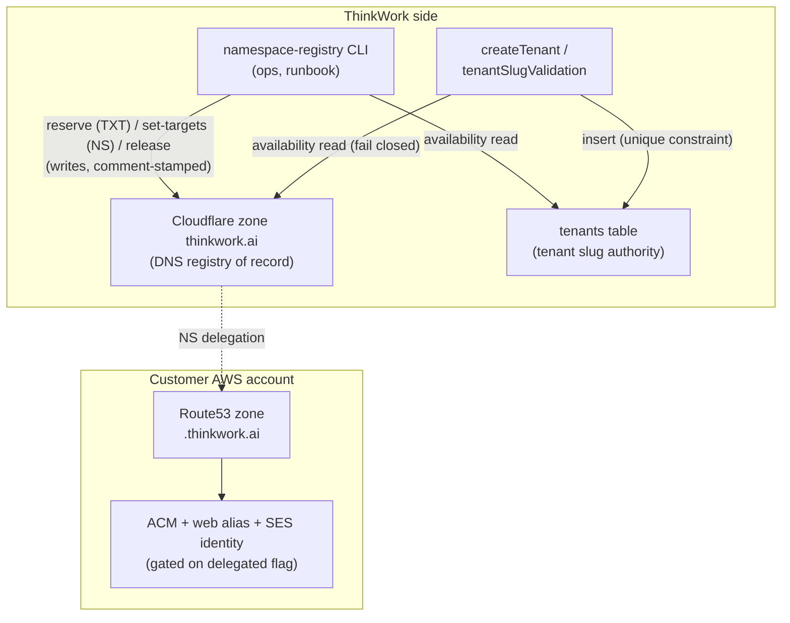
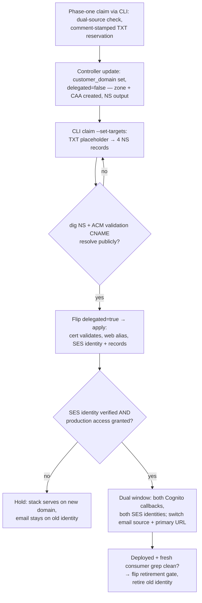

# feat: Customer domain namespace on thinkwork.ai

## Summary

Give every deployed customer environment a `<name>.thinkwork.ai` subdomain NS-delegated from the Cloudflare apex zone into the customer's AWS account, serving the web app and a send+receive SES identity. A shared claim tool is the only writer to the Cloudflare zone; the SaaS tenant-signup path checks the same namespace. TEI is the first consumer, migrating off `lastmile-tei.com`.

---

## Problem Frame

Customer deployments inherit whatever domain exists in the customer's AWS account (TEI: `lastmile-tei.com`), and the deployment controller exposes no domain configuration — there is no repeatable answer for customer #2. The SaaS stack already runs the in-account version of the target pattern (`acme.thinkwork.ai` Route53 subzones + SES identities in `terraform/modules/app/ses-email/main.tf`); this plan builds the cross-account version and a single namespace shared between the two worlds. Product decisions are settled in the origin brainstorm (see origin: flat namespace, Cloudflare as registry, NS-hop runbook, send+receive email).

---

## Requirements

R1–R13 carry the origin requirements; R14–R15 are plan-time additions from research and synthesis.

**Namespace and registry**

- R1. A name is claimable iff no DNS record for `<name>.thinkwork.ai` exists in Cloudflare, no tenant row holds the slug, and the name is not reserved (origin R1, extended to dual-source — see KTD1).
- R2. The reserved list is the existing `RESERVED_TENANT_SLUGS` in `packages/database-pg/src/utils/reserved-slugs.ts`, extended with `canary`; both the claim tool and tenant slug validation import it (origin R2).
- R3. All Cloudflare namespace writes go through the shared claim tool; no hand-created records, and tfvars-driven tenant delegations require a prior claim (origin R3).
- R4. Each claimed name's records carry a comment identifying kind, owner, and creation date, in a format exported as a constant that every consumer parses against (origin R4).
- R5. Tenant signup rejects names taken by deployments via a read-only Cloudflare check that fails closed on Cloudflare API errors and never echoes record-comment contents to the caller (origin R5).

**Deployment delegation and web**

- R6. Customer-stack Terraform creates a Route53 hosted zone for the customer domain and outputs its NS records; everything downstream of delegation is gated on a `customer_domain_delegated` boolean (origin R6).
- R7. With the gate flipped, the customer stack validates an ACM cert via records in its own Route53 zone (single apply, explicit validation timeout) and serves the web app at `https://<name>.thinkwork.ai` (origin R7).
- R8. The runbook documents the claim, delegation, verification, cutover, and release procedures end to end (origin R8).

**Email**

- R9. The customer stack registers the customer domain as an SES identity with DKIM, MAIL FROM, MX, and a DMARC record in its own zone (origin R9).
- R10. The customer stack provisions domain receipt rules routing inbound mail to the S3 + `email-inbound` Lambda path; addresses like `agent@tei.thinkwork.ai` send and receive, which requires the claimed name to equal the stack's tenant slug (origin R10; see KTD6 for per-account rule-set semantics).
- R11. Cognito email sends from the customer-domain identity via the existing `cognito_email_source_arn` wiring, switched only after the identity is verified and SES production access is granted (origin R11).

**Lifecycle and migration**

- R12. Decommissioning releases the name through the claim tool before the customer stack is destroyed; the runbook encodes this ordering (origin R12).
- R13. TEI cuts over via a dual-domain window — both domains in Cognito callbacks, both SES identities active for sending — and `lastmile-tei.com` retires only after the cutover has deployed and a fresh grep finds no remaining consumers (origin R13).

**Plan-time additions**

- R14. A claim that loses a race self-releases: after writing, the tool re-checks both sources (Cloudflare record ownership by comment, tenants table) and backs out if a foreign claim appeared (see KTD4).
- R15. The controller threads the domain fields through the input envelope, runner, and generated root; the runner echoes consumed domain fields into deployment evidence and the controller fails the run if they are absent when a domain was requested (see KTD5).

---

## Key Technical Decisions

- **KTD1 — Dual-source availability check, no backfill.** Most tenant slugs live only in the `tenants` table; only the tfvars-enumerated slugs in `ses_tenant_slugs` already hold Cloudflare NS records (via `cloudflare_record.tenant_email_ns` in the greenfield root). A pure-Cloudflare check would therefore let a deployment claim a live non-enumerated tenant's name. The claim tool checks Cloudflare **and** the tenants table; tenant signup checks the DB (existing unique constraint) **and** Cloudflare read-only. Cloudflare remains the only DNS registry and the DB remains authoritative for tenant slugs. The tfvars NS path is brought under the namespace rule: additions to `ses_tenant_slugs` require a prior claim (R3). Rejected: backfilling every tenant slug into Cloudflare (migration + write-compensation logic in a user-facing mutation for no near-term gain).
- **KTD2 — Shared `packages/namespace-registry` package.** Claim/check/release core + a thin ops CLI in one new package, imported by `packages/api` for the signup check. Mirrors the REST mechanics of `scripts/cloudflare-sync-mcp.ts` (idempotent upsert, dry-run, token from env). The record-comment format is an exported constant — the contract between the claim writer and the signup reader. Rejected: a standalone script plus a duplicated check in the API — the two enforcement points would drift (this exact drift burned the skill-catalog slug collision).
- **KTD3 — Two-phase claim, delegation gate instead of two-apply.** NS targets don't exist until the customer zone is created, so the claim is two-phase: phase one reserves the name with a comment-stamped TXT placeholder record; phase two (`claim --set-targets`, idempotent for the same owner) replaces it with the four NS records once the customer apply outputs them. Cert validation records live in the customer's own Route53 zone, so validation is single-apply once delegation resolves; the out-of-band step is modeled as `customer_domain_delegated` (same shape as `mcp_custom_domain_ready`). ACM validation gets an explicit timeout so a pre-delegation flip fails fast instead of hanging CodeBuild.
- **KTD4 — Post-write verification closes both races.** Check-then-create is racy. After writing, the tool lists records for the name and verifies sole ownership by the comment constant, **and** re-checks the tenants table; if a foreign record or a new tenant row appeared, it self-releases and reports taken. Re-claim by the same owner is idempotent success. The signup side accepts the residual sliver (read-only check, low volume, ops-gated).
- **KTD5 — Echoed-fields guard against runner version-skew.** The runner builds `vars_json` per its own version; an old runner silently drops new fields (shipped twice: #2341, #2375-adjacent). The runner writes consumed domain fields into `deployment-evidence.json`; the controller asserts them when a domain was requested.
- **KTD6 — Rule-set semantics differ by account kind.** SES allows one active receipt rule set per account/region. In the SaaS account, customer rules append to the existing `thinkwork-<stage>-email-rules` set — never replace. In customer accounts, no Terraform-managed rule set exists (the controller threads zero `ses_*` vars today), so the customer-domain wiring creates and activates the rule set (reusing ses-email's `manage_active_rule_set` semantics) and wires the S3 prefix + `email-inbound` Lambda action itself.
- **KTD7 — Cloudflare credentials stay ThinkWork-side, split by consumer.** The ops CLI reads `CLOUDFLARE_API_TOKEN` from env (matching CI). The API Lambda gets its **own** zone-scoped DNS:Edit token on a distinct SSM path via `@thinkwork/runtime-config` (independent rotation; a signup-path compromise doesn't burn the CI token), with the IAM grant in the grouped policies — not a new Lambda env var (graphql-http env is at 4068/4096 bytes). Cloudflare doesn't support record-prefix scoping, so the blast radius (zone-wide DNS edit) is documented in the runbook. Customer accounts never hold either token; the generated root's inert `provider "cloudflare" {}` block is deleted.
- **KTD8 — Claimed name must equal the stack's tenant slug.** `email-inbound` parses `space@<tenant>.thinkwork.ai` and resolves the tenant by slug, so a deployment whose claimed name differs from its tenant slug silently drops all inbound mail. The claim CLI takes the tenant slug as the name argument's validation anchor and refuses mismatch; the runbook re-verifies before delegation.

---

## High-Level Technical Design

Namespace writers and readers — one writer per source, each side reads both:

Provisioning and cutover sequence with its gates:

---

## Implementation Units

### Phase 1 — Substrate (ships inert)

### U1. Namespace registry package and CLI

- **Goal:** One implementation of check/claim/release against the Cloudflare zone, usable as a library and an ops CLI.
- **Requirements:** R1, R2, R3, R4, R14, and the claim-side half of KTD8
- **Dependencies:** none
- **Files:** `packages/namespace-registry/src/` (core, reserved-list re-export, Cloudflare client, exported comment-format constant), `packages/namespace-registry/src/cli.ts`, `packages/namespace-registry/src/*.test.ts`, `packages/database-pg/src/utils/reserved-slugs.ts` (add `canary`)
- **Approach:** REST against `api.cloudflare.com/client/v4` mirroring `scripts/cloudflare-sync-mcp.ts` (zone lookup by name, idempotent writes, `--dry-run`). Two-phase claim (KTD3): phase one = reserved-list check → Cloudflare record list → tenants-table check → write a comment-stamped TXT reservation → post-write verify both sources (KTD4); phase two = `claim --set-targets <ns...>` replaces the TXT with 4 NS records, idempotent for the same owner. The DB leg pins to the SaaS **production** tenant authority by default (reusing the `db:push` stage-resolution wiring); overriding the stage requires an explicit loudly-flagged flag. `--skip-db` exists only on the read-only `check` subcommand — the `claim` write path always requires the DB leg. Deployment claims validate the name against the customer stack's tenant slug and refuse mismatch (KTD8). Release deletes only records whose comments match the owner.
- **Patterns to follow:** `scripts/cloudflare-sync-mcp.ts` (token handling, idempotent upsert, dry-run); `packages/database-pg/src/utils/reserved-slugs.ts` (single list, two callers).
- **Test scenarios:**
  - Covers AE2. Claiming a reserved name (`api`) is rejected before any API call.
  - Phase-one claim of a free name writes one TXT reservation carrying the exported comment constant verbatim.
  - `--set-targets` replaces the owner's TXT with 4 NS records, each comment-stamped; repeat invocation with identical targets is idempotent success.
  - Claiming a name with any existing Cloudflare record reports taken and writes nothing.
  - Claiming a name matching an existing tenant slug reports taken (DB source).
  - Post-write verify finds a foreign-comment record → tool deletes its own records and reports taken.
  - Post-write verify finds a tenant row inserted after the Cloudflare write → tool self-releases and reports taken (R14 cross-source leg).
  - Claim with a name that does not match the supplied tenant slug refuses before any write (KTD8).
  - `claim --skip-db` is rejected as an unknown flag; `check --skip-db` works and flags the skipped leg loudly.
  - Default stage resolution targets production; `--tenant-db-stage` override emits the loud warning.
  - Covers AE4. Release removes exactly the owner's records; release of a name owned by another comment refuses.
  - Cloudflare API error surfaces as a non-zero exit with the error body (incl. the token-drift error 10000 signature).
- **Verification:** CLI dry-run against the live zone lists correct availability for `tei` (free), `agents` (taken), `dev` (reserved); unit suite green.

### U2. Customer-domain Terraform substrate (zone, cert, web)

- **Goal:** Customer stack creates its Route53 zone and, behind the delegation gate, validates a cert and serves the web app on the customer domain.
- **Requirements:** R6, R7, and the additive half of R13
- **Dependencies:** none (parallel with U1)
- **Files:** `terraform/modules/app/customer-domain/main.tf` (new), `terraform/modules/thinkwork/main.tf`, `terraform/modules/thinkwork/variables.tf` (`customer_domain`, `customer_domain_delegated`, `customer_domain_legacy_retired`), `terraform/modules/thinkwork/outputs.tf` (NS records, effective app URL)
- **Approach:** `aws_route53_zone` always created when `customer_domain != ""`, with a `CAA 0 issue "amazon.com"` record published at zone creation so the delegated subtree can only obtain ACM certs. NS records surfaced as outputs. Gated on `customer_domain_delegated`: ACM cert (us-east-1, via an `aws.us_east_1` provider alias declared with `configuration_aliases` and threaded through the thinkwork module) with `aws_route53_record` validation records in the own zone and an explicit validation timeout (KTD3), alias records to the web distribution, cert/alias threaded into the distribution the same way `app_domain`/`app_certificate_arn` are consumed today. Cognito callback URLs gain the customer-domain entries additively during the dual window; a second gate, `customer_domain_legacy_retired`, removes the old-domain callback/logout entries when flipped — retirement is a reviewable Terraform change, not a runbook-only action. Empty-string defaults keep every existing stack unchanged.
- **Patterns to follow:** `terraform/modules/app/www-dns/main.tf` (cycle-avoidance via plain bool gates, cert SAN shape, comment conventions); `terraform/modules/foundation/dns/main.tf` (zone outputs); `docs/solutions/runbooks/update-cognito-callback-urls-2026-05-22.md` (callback changes via Terraform only).
- **Test scenarios:** Test expectation: none — Terraform module; verification is plan/apply behavior below.
- **Verification:** `terraform plan` on greenfield with the vars unset shows no diff; with `customer_domain` set and gates false, plan shows only the zone + CAA record; with `customer_domain_delegated` true, plan adds cert + validation records + aliases + callback additions; with `customer_domain_legacy_retired` true, plan removes the legacy callback entries.

### U3. Customer-domain SES identity (send + receive)

- **Goal:** The customer domain becomes a verified SES identity with full send and receive wiring in the customer account.
- **Requirements:** R9, R10
- **Dependencies:** U2 (zone exists)
- **Files:** `terraform/modules/app/customer-domain/main.tf` or `terraform/modules/app/ses-email/main.tf` (implementer's call — keep one owner per account-kind for rule-set mutation per KTD6), `terraform/modules/thinkwork/main.tf`
- **Approach:** SES domain identity + DKIM CNAMEs + net-new `aws_ses_domain_mail_from` + MX (`inbound-smtp.<region>`) + verification TXT, all in the customer zone; DMARC TXT record published in-zone (start `p=none`; exact policy is implementation-time). Receipt wiring per KTD6: in customer accounts, create and activate the rule set and wire the S3 prefix + `email-inbound` Lambda action; in the SaaS account, append to the existing active set. Identity resources may exist pre-delegation, but SES verification attempts expire after ~72 hours — if delegation lands later, re-trigger verification (taint/re-apply the identity) before any consumer gates on it. Only consumers gate on verification. **Precondition (resolved 2026-06-12):** the `thinkwork.ai` apex publishes no DMARC record (`dig TXT _dmarc.thinkwork.ai` returns nothing), so no `sp=` policy constrains delegated subdomains today; if an apex DMARC record is added later it must keep `sp=` absent or `none`, and the runbook records this check.
- **Patterns to follow:** `terraform/modules/app/ses-email/main.tf` (identity/DKIM/MX/receipt-rule shapes, plan-time-known `range(3)` DKIM counts, `manage_active_rule_set`); domain-level receipt + lookup-based routing per `docs/brainstorms/2026-05-27-admin-space-email-trigger-management-requirements.md`.
- **Test scenarios:** Test expectation: none — Terraform module; behavior verified in U7's live probes (Covers AE3 there).
- **Verification:** Post-delegation apply shows the identity reaching `Success` verification in the SES console; `dig MX tei.thinkwork.ai` resolves; in the customer account the created rule set is active and contains the domain rule; in the SaaS account the prior rules are untouched.

### Phase 2 — Control plane and signup

### U4. Controller threading with echoed-fields guard

- **Goal:** A customer deployment declares its domain in the controller input and the value survives every hop — or the run fails visibly.
- **Requirements:** R15
- **Dependencies:** U2
- **Files:** `packages/api/src/handlers/deployment-sessions.ts` (`buildControllerInput`), `terraform/modules/app/deployment-control-plane/runner.py` (vars_json, generated-root variable declarations, `module "thinkwork"` args, and the aliased `aws.us_east_1` provider block + module `providers` mapping — four wiring points), `terraform/modules/app/deployment-control-plane/test_runner_bundle.py`
- **Approach:** Add `customerDomain`, `customerDomainDelegated`, and `customerDomainLegacyRetired` to the envelope with the established precedence (`safe_get(runner_secrets, …, default=safe_get(payload, …))`). Runner records the domain fields it consumed in `deployment-evidence.json`; controller asserts their presence when the session requested a domain (KTD5). The generated root gains the `provider "aws" { alias = "us_east_1" }` block and `providers` mapping required by U2's cert (fourth wiring point, same test assertions). Stack output `app_url` reflects the customer domain once the gate is true (`auth_domain` stays on the Cognito default prefix — hosted UI is deferred scope). Delete the generated root's inert `provider "cloudflare" {}` block (KTD7).
- **Patterns to follow:** the `cognito_email_source_arn` threading shape and `test_runner_bundle.py::test_write_runner_files_threads_cognito_email_vars_from_payload` (extend the wiring-point assertion pattern).
- **Test scenarios:**
  - Envelope with domain fields → all four wiring points carry them (vars_json, root variables, module args, provider alias mapping).
  - Envelope without domain fields → generated artifacts identical to today (no regression).
  - Runner evidence includes consumed domain fields; simulated old-runner evidence (fields absent) + domain-requesting session → controller marks the run failed.
  - Delegated and retirement flags round-trip as real booleans, not strings.
- **Verification:** `uv run --with pytest pytest terraform/modules/app/deployment-control-plane/test_runner_bundle.py` green; a dev controller run with domain fields shows them in evidence.

### U5. Signup-path namespace check

- **Goal:** Tenant signup cannot take a name delegated to a deployment.
- **Requirements:** R1, R5
- **Dependencies:** U1
- **Files:** `packages/api/src/graphql/resolvers/core/tenantSlugValidation.ts`, `packages/api/src/graphql/resolvers/core/createTenant.mutation.ts` (call site only), `packages/api/src/graphql/resolvers/core/*.test.ts`
- **Approach:** `validateTenantSlug` gains a read-only availability call into `packages/namespace-registry` (Cloudflare list only — DB uniqueness is already enforced by the insert), parsing ownership via the exported comment constant. Cloudflare errors fail closed with a surfaced GraphQL error (R5); taken names map to the existing `SLUG_UNAVAILABLE` code, and the error body never includes the record comment (no deployment-owner leakage). The Lambda's own Cloudflare token resolves via `@thinkwork/runtime-config`/SSM with the IAM grant in the grouped policies (KTD7). `renameTenantSlug` and `bootstrapUser` go through the same validation path; all callers are authenticated resolvers.
- **Patterns to follow:** existing `INVALID_SLUG`/`RESERVED_SLUG` error mapping in `tenantSlugValidation.ts`; the env→SSM migration pattern from the runtime-config work.
- **Test scenarios:**
  - Covers AE1. Slug matching an existing Cloudflare record whose comment parses as a deployment claim (via the shared constant) → `SLUG_UNAVAILABLE`.
  - Covers AE2. Reserved slug (incl. new `canary`) → `RESERVED_SLUG` with no Cloudflare call.
  - Free slug → passes validation; insert proceeds.
  - Cloudflare API error → validation throws a surfaced error; no tenant row created.
  - `SLUG_UNAVAILABLE` response contains no comment/owner content.
  - Rename path enforces the same check.
- **Verification:** `pnpm --filter @thinkwork/api test` green (full suite, not just new tests); manual createTenant in dev with a deployment-claimed name returns `SLUG_UNAVAILABLE`.

### Phase 3 — Operations and TEI

### U6. Claim runbook and decommission ordering

- **Goal:** The claim, delegation, verification, cutover, and release procedures are executable by ops without rediscovery.
- **Requirements:** R8, R12, and the operational halves of R6, R11, KTD8
- **Dependencies:** U1, U2, U3
- **Files:** `docs/runbooks/customer-domain-claim-runbook.md` (new)
- **Approach:** End-to-end steps: phase-one claim via CLI (dual-source, name == tenant slug verified) → controller update with domain + gate false → confirm zone outputs include the CAA record → `claim --set-targets` with the zone's NS values → delegation verify (`dig NS` + the ACM validation CNAME from a public resolver — the explicit precondition for flipping the gate) → gate-true apply → SES sandbox-exit request and identity-verified check (noting the ~72h verification expiry and the re-verify procedure) before any email-source switch → live probes (web TLS, send a mail, receive a mail and confirm it reached the routing path). Records the apex-DMARC precondition (no apex DMARC record as of 2026-06-12; keep `sp=` absent/none if one is ever added) and the Cloudflare token blast radius (zone-wide DNS:Edit; error 10000 = token drift). Namespace rule: additions to `ses_tenant_slugs` tfvars require a prior claim (R3). Decommission section: release via CLI **before** `terraform destroy` (dangling-delegation takeover window), the retirement gate (`customer_domain_legacy_retired`) as a required Terraform step, plus the manual tenant-release procedure (no deleteTenant mutation exists).
- **Patterns to follow:** `docs/runbooks/customer-onboarding-space-runbook.md` (format); `docs/solutions/patterns/mcp-custom-domain-setup-2026-04-23.md` (gate-variable runbook shape — adapted, not copied: per-cert Cloudflare steps disappear here).
- **Test scenarios:** Test expectation: none — documentation; correctness proven by U7 executing it.
- **Verification:** A second operator (or agent) can execute the TEI flow from the runbook alone.

### U7. TEI cutover and lastmile-tei.com retirement

- **Goal:** TEI serves at `tei.thinkwork.ai` for web and email; `lastmile-tei.com` is retired.
- **Requirements:** R11, R13
- **Dependencies:** U4, U5, U6
- **Files:** `terraform/modules/app/deployment-control-plane/test_runner_bundle.py` (fixtures hardcode `lastmile-tei.com`), `docs/verification/tei-new-environment-deployment-e2e.md` (add domain + email acceptance gates), TEI deployment session/secret values (operational)
- **Approach:** Execute the runbook through the dual window: claim `tei` (verify TEI's tenant slug is `tei` first — KTD8) → substrate inert → delegate → gate-true apply → hold email on the old identity until SES production access is granted in TEI's account → switch `cognitoEmailSourceArn` + from-address to the new identity and make `tei.thinkwork.ai` the primary web URL with both domains in callbacks → after the cutover release has **deployed to TEI** (not merged) and a fresh grep finds no `lastmile-tei.com` consumers, flip `customer_domain_legacy_retired` and retire the old identity. The dual window covers web login on both domains and **sending** from both identities; old-domain **inbound** is out of the window's scope — `email-inbound` drops non-`thinkwork.ai` recipients by design, so verify at execution time whether `lastmile-tei.com` inbound was ever routable and document the finding rather than promising continuity the code never provided. Whether the old domain gets a web redirect during the window is decided at cutover; "retire" means consumer-free, not DNS deletion day one.
- **Execution note:** Survey live consumers at execution time, not from this plan's snapshot — the consumer list will have drifted by cutover day.
- **Patterns to follow:** inert-first seam-swap (`docs/solutions/architecture-patterns/inert-first-seam-swap-multi-pr-pattern-2026-05-08.md`); destructive-tail survey rule (`docs/solutions/workflow-issues/survey-before-applying-parent-plan-destructive-work-2026-04-24.md`).
- **Test scenarios:**
  - Covers AE3. Live probe: external mail to `agent@tei.thinkwork.ai` reaches the inbound **routing path** (CloudWatch shows tenant/Space resolution, not the silent-drop branch); agent reply is DKIM-signed by `tei.thinkwork.ai`.
  - Live probe: Cognito invite from the new identity lands (not spam-foldered) after production access.
  - During the dual window: login via both domains succeeds; outbound from the old identity still works until retirement.
  - Fixture update: `test_runner_bundle.py` no longer references `lastmile-tei.com`.
- **Verification:** `docs/verification/tei-new-environment-deployment-e2e.md` gates all pass on the new domain; old identity deleted without bounce reports during a defined observation window.

---

## Scope Boundaries

**Deferred to Follow-Up Work**

- Periodic reconciler comparing Cloudflare record comments against live deployments/tenants (v1 relies on runbook ordering; also covers the released-name quarantine idea — a `released:<date>` tombstone the claim tool refuses for N days).
- Tenant-side automatic release on offboarding (blocked on a deleteTenant flow existing at all).
- Control-plane claim API (zero-touch provisioning); v1 is CLI + runbook.
- Old-domain 301 redirect service, if the U7 cutover decides it wants one beyond the window.

**Deferred for later** (carried from origin)

- Customer-owned domains (e.g., `thinkwork.tei.com`) as a first-class path; existing custom-domain Terraform support is not removed.
- Moving Cognito hosted UI or API endpoints under the customer subdomain.

**Outside this product's identity** (carried from origin)

- Changing the SaaS tenant Space-email architecture or migrating existing tenant subzones.
- Non-AWS DNS hosting for customer stacks.

---

## Risks & Dependencies

- **SES production access is a manual, per-account AWS request** with unbounded turnaround; TEI's is still pending. The plan tolerates this (email holds on the old identity; new accounts hold on `COGNITO_DEFAULT`), but TEI's cutover date depends on it.
- **Cloudflare token drift** (CF error 10000) now breaks claims and signup validation, not just CI. The runbook documents the signature; the signup path failing closed makes drift visible immediately. Both tokens are zone-wide DNS:Edit (Cloudflare has no record-prefix scoping); the Lambda token's blast radius is mitigated by its separate SSM path and independent rotation (KTD7).
- **Runner version skew**: a customer running an old runner drops domain fields silently; the echoed-fields guard (KTD5) converts this to a visible failure but requires the customer to take a runner-updating release first. The guard detects absence, not correctness.
- **Single active SES rule set** per account/region: in the SaaS account, any Terraform refactor that replaces rather than mutates the rule set silently drops inbound mail for other identities (KTD6).
- **DMARC**: resolved at plan time — the apex publishes no DMARC record (2026-06-12), so no subdomain policy constrains customer identities today; the runbook pins the invariant for the future.
- **Partial gate-true apply** (cert validated, callbacks not yet applied) yields `redirect_mismatch` on login until re-apply; the runbook's verify step names re-apply as the remedy.

---

## Sources & Research

- Origin requirements: `docs/brainstorms/2026-06-12-customer-domain-namespace-requirements.md` (TEI-2).
- SES subzone pattern: `terraform/modules/app/ses-email/main.tf`; NS delegation precedent: `cloudflare_record.tenant_email_ns` in `terraform/examples/greenfield/main.tf` (4-record `range(4)` shape).
- Inbound routing contract: `packages/api/src/handlers/email-inbound.ts`, `packages/api/src/lib/email/space-address.ts` (tenant resolved by slug from the subdomain — the KTD8 invariant).
- Claim-tool code shape: `scripts/cloudflare-sync-mcp.ts`; reserved list: `packages/database-pg/src/utils/reserved-slugs.ts`.
- Controller variable threading + the wiring-point failure mode: `terraform/modules/app/deployment-control-plane/runner.py`, `docs/solutions/integration-issues/controller-vars-allowlist-blocks-cognito-ses-invite-emails.md`.
- Two-apply/gate precedent: `docs/solutions/patterns/mcp-custom-domain-setup-2026-04-23.md`.
- Sequencing doctrine: `docs/solutions/architecture-patterns/inert-first-seam-swap-multi-pr-pattern-2026-05-08.md`, `docs/solutions/workflow-issues/survey-before-applying-parent-plan-destructive-work-2026-04-24.md`.
- Implementation must branch off `origin/main` — the Cognito-SES controller wiring (#2341/#2357) is absent from older branches, and U4 builds directly on it.
