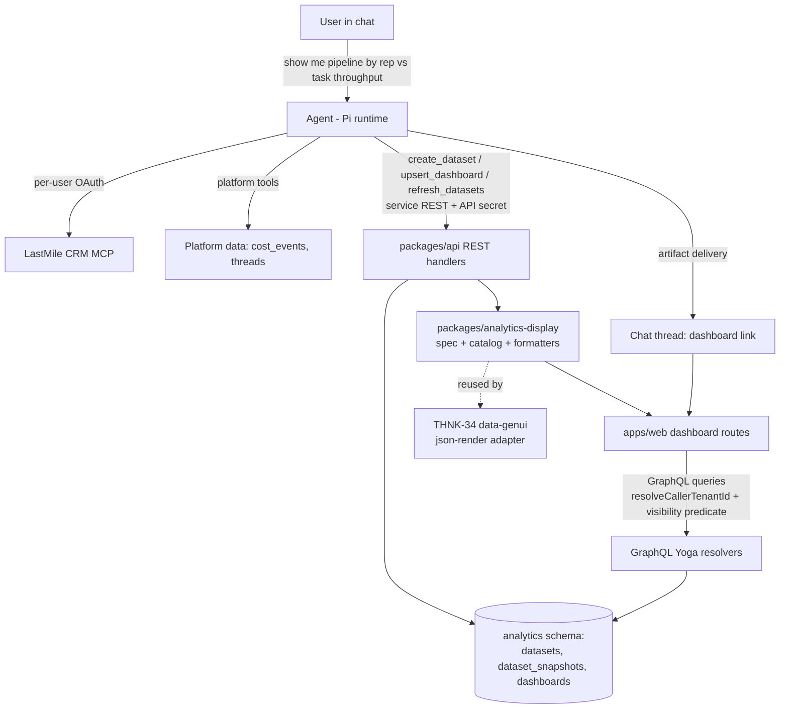
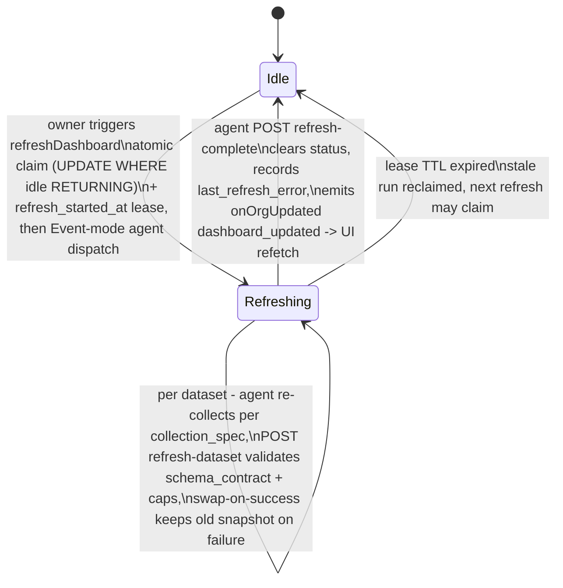
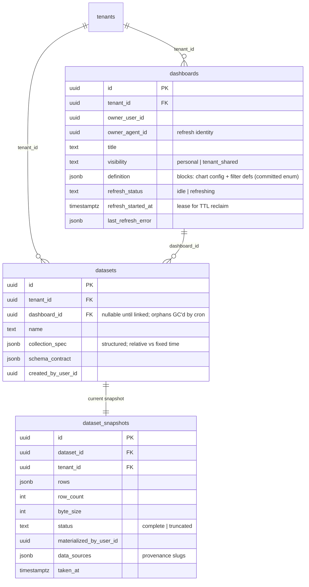

# feat: Agent-Native Analytics Module

## Summary

Build the agent-native analytics module: a shared ThinkWork analytical display/spec foundation, agent tools that materialize Snapshot Datasets from platform data and LastMile CRM, a new `analytics` Postgres schema and GraphQL surface for dashboards, and a native dashboard UI in `apps/web` with client-side filters, per-block freshness, and owner-only refresh. First demo target: LastMile CRM pipeline alongside platform cost/activity data.

---

## Problem Frame

Sales conversations repeatedly ask what self-service analytics ThinkWork offers; today the only answer is the fixed cost dashboard. The origin brainstorm (see origin) settled the product shape: users ask the agent for a view, the agent materializes snapshots, a native UI renders them. The later THNK-34 relationship clarified that the native analytical display layer should not be dashboard-only: THNK-14 owns the canonical chart/table/metric specs and ThinkWork-styled components, while THNK-34 may render those specs inline in Threads through `data-genui` / json-render. This plan turns that shape into implementation units, adding the shared analytical display foundation, failure semantics, sharing rules, and dataset schema contract the brainstorm left to planning.

---

## Requirements

Origin R1–R11 carry forward verbatim (see origin). Plan-added requirements from flow analysis and review:

**Refresh and failure semantics**

- R12. Refresh swaps snapshots per dataset on success; a failed dataset keeps its previous snapshot, and the failure surfaces on the affected blocks.
- R13. Each block shows its dataset's freshness; the dashboard-level stamp shows the oldest snapshot among its datasets (refines origin AE1 for multi-source dashboards).
- R14. Only the dashboard owner can trigger refresh; shared-dashboard viewers are read-only. Refresh runs under the owner's plugin authorizations.
- R15. A refresh request is rejected while one is already in flight for the same dashboard; the UI shows the in-flight state. In-flight state is lease-based: a crashed or timed-out run becomes reclaimable after a TTL, so a dashboard can never be permanently stuck refreshing.
- R16. Refresh validates new data against the dataset's persisted schema contract; on mismatch the refresh fails and the old snapshot is kept.
- R21. A schema-contract mismatch offers the owner a re-baseline: accept the new shape, which updates the contract and flags affected block/filter definitions for repair. Re-baseline is the only sanctioned contract change; the agent never replaces a contract unilaterally.

**Creation and lifecycle**

- R17. A dashboard becomes visible only after all its datasets materialize; datasets orphaned by a failed creation are garbage-collected. Creation errors surface in the chat thread as plain language, never raw errors.
- R18. Snapshot writes enforce a hard row/byte cap derived from the read-path response budget; the agent is told when a query exceeds it and truncation is never silent.
- R19. Deleting a dashboard cascades to its datasets and snapshots; shared viewers get a "no longer available" state.

**Discovery**

- R20. An analytics index route lists the caller's own dashboards and tenant-shared dashboards; a newly created dashboard is linked from the chat thread via artifact delivery.

**Shared analytical display foundation**

- R22. ThinkWork has one canonical analytical display contract for chart, graph, metric, table, filter, freshness, provenance, empty, and error states. Durable dashboards and Thread GenUI adapters consume this contract instead of defining parallel chart/table specs.
- R23. Analytical components render with ThinkWork-owned UI primitives (`@thinkwork/ui` chart/table surfaces and approved palette tokens), never raw chart/table markup or agent-specified styling.
- R24. Data-derived display strings from snapshots, not only definition-authored labels, are treated as untrusted before they reach chart ticks, tooltips, legends, filter options, or table cells.
- R25. THNK-34 may depend on the shared analytical display/spec foundation for inline Thread charts, but it does not depend on dashboard persistence, refresh leases, sharing, or the LastMile demo flow.

---

## Key Technical Decisions

**Data layer**

- **Greenfield `pgSchema("analytics")`** for all new tables, using the compliance schema as the template (`packages/database-pg/src/schema/compliance.ts`, migration `0069`). Extracting a schema later from live `public.*` tables is a multi-PR compat-view arc; born-greenfield is cheap now (see `docs/solutions/database-issues/feature-schema-extraction-pattern.md`).
- **Three tables: `datasets`, `dataset_snapshots`, `dashboards`.** Blocks and filter definitions live inside `dashboards.definition` (typed jsonb) — blocks are never queried independently in v1. Datasets belong to one dashboard (1:N, delete cascades); cross-dashboard dataset reuse is deferred.
- **Datasets persist a `collection_spec` (jsonb) and `schema_contract` (jsonb).** The collection spec is structured (tool calls + arguments), not free-form prose, and distinguishes relative time expressions (re-resolved at each refresh, e.g. "last 90 days") from fixed parameters — otherwise refresh replays a frozen window and "current data" silently fails. The schema contract (column names/types the blocks were built against) is what refresh validates and what the future ingestion spine plugs into — the mechanism behind origin R11/AE4. Contract inference at creation has explicit rules for empty and all-null results (untyped columns recorded as such, not guessed) so a sparse first result doesn't bake in a contract that fails the first real refresh.
- **Snapshots are jsonb rows in Aurora with a hard cap.** The per-snapshot byte cap is derived from the GraphQL read path: snapshots are fetched per-dataset (never aggregated into one response), and the cap must clear the 6MB Lambda response limit with headroom. One current snapshot per dataset; swap-on-success replaces it transactionally. S3 offload for larger snapshots is deferred (precedent: `scripts/backfill-artifact-payloads-to-s3.ts`).

**Shared analytical display/spec foundation**

- **`packages/analytics-display` owns the canonical analytical spec and catalog.** It defines schema-versioned data/view specs for metrics, charts, tables, filters, freshness, provenance, diagnostics, display limits, and safe value formatting. The core export has no React/Recharts dependency; web rendering lives behind a React subpath or app-local adapter that depends on generic `@thinkwork/ui` primitives. This keeps analytics semantics out of `packages/ui` without making API/runtime/mobile consumers import browser chart code.
- **`dashboards.definition` stores analytics-display specs, not a dashboard-only bespoke shape.** Dashboard persistence can add IDs, visibility, ownership, and dataset bindings around the spec, but the block/filter/chart/table contract is the shared contract that THNK-34 can adapt into `data-genui`.
- **The shared foundation is the only dependency edge from THNK-34 to THNK-14.** THNK-34 can render analytical specs inline after this slice exists; it must not wait for `analytics` tables, refresh dispatch, sharing, or LastMile demo validation unless a future GenUI flow explicitly needs durable dashboard behavior.
- **Inline analytical payloads are portable in v1.** U9 defines a render payload shape containing `analyticsDisplayVersion`, validated display spec, bounded inline render data or safe summaries, freshness, provenance, diagnostics, and sensitivity metadata. It does not require dashboard IDs, dataset IDs, or Analytics read APIs for Thread rendering; cross-object references are future work unless resolved server-side into the portable payload before streaming/persistence.
- **Display safety lives beside the spec.** Definition labels and snapshot row values both pass through display formatters before entering Recharts/DataTable render props. Raw values remain available for storage/filtering, but rendered chart/table text is sanitized and length-capped.

**Auth and sharing**

- **Agent write-back goes through narrow service REST endpoints**, authenticated with a scoped analytics write-back credential rather than widening `resolveCaller` to honor service auth (see `docs/solutions/best-practices/service-endpoint-vs-widening-resolvecaller-auth-2026-04-21.md`). The endpoint takes signed tenant/user/agent claims or equivalent server-verifiable headers, cross-checks membership, enforces short TTL/nonce or idempotency replay protection, stores credentials in Secrets Manager/SSM with stage separation and rotation notes, and emits audit records for create/upsert/refresh-complete. If implementation temporarily reuses `THINKWORK_API_SECRET`, U4 must document the compensating controls: storage, rotation, stage separation, rate limits, replay/idempotency, and audit logging. Write-back additionally enforces ownership: any operation touching an existing dashboard or its datasets (upsert on existing ID, refresh writes, linkage changes) requires `invokerUserId == owner_user_id` — R14 must hold on the service path, not only on GraphQL, or a sharee's agent can mutate dashboards the sharee cannot.
- **User-facing CRUD via GraphQL mutations** gated with `resolveCallerTenantId(ctx)` (never trust a `tenantId` arg; `ctx.auth.tenantId` is null for Google-federated users) plus ownership checks — including `setDashboardVisibility`, which only the owner may call (otherwise any tenant member could expose someone's personal CRM data tenant-wide).
- **Sharing is a `visibility` column** with CHECK `IN ('personal', 'tenant_shared')`, default `personal`, plus `owner_user_id` — mirroring routines (`packages/database-pg/src/schema/routines.ts`). The visibility predicate expresses the share as an OR escape so tenant scoping never silently revokes it (see `docs/solutions/logic-errors/thread-visibility-private-space-mention.md`); per-user share lists are deferred.
- **Snapshot provenance is explicit.** Snapshots record `materialized_by_user_id` and the originating data-source slugs; the dashboard UI shows a provenance notice ("data from LastMile CRM as of 2:14 PM"). Sharing a dashboard intentionally shares the materialized copy with viewers who may lack CRM access — the provenance notice makes that legible. Plugin MCP access is per-user OAuth with no tenant-wide fallback, so owner-only refresh (R14) keeps credentials coherent.

**Agent surface**

- **Analytics tools are Pi extensions** registered via `extensionFactories` (stateless; state lives in the analytics tables). Tool invocation records emit `input_preview` / `output_preview` / `status` or the thread UI renders empty rows (see `docs/solutions/architecture-patterns/runtime-swap-tool-parity-and-record-contract.md`). `input_preview` for dataset writes is a bounded summary (row count + column names), never raw rows — CRM values don't belong verbatim in thread records.
- **Tool surface: `create_dataset`, `upsert_dashboard`, `refresh_datasets`.** The agent collects data with its existing tools (platform queries, LastMile CRM MCP), then calls `create_dataset` with rows + collection spec; `upsert_dashboard` composes blocks over dataset IDs and is called last so a dashboard never references unmaterialized datasets (R17). `refresh_datasets` wraps the refresh write-back endpoints (U4) and is the only sanctioned refresh path — on schema mismatch the tool guidance directs the agent to report the mismatch to the owner (offering re-baseline per R21), never to "self-correct" by recreating datasets, and the server enforces this by rejecting upsert/new-linkage while a refresh is in flight.
- **Refresh is dispatch + completion, not a blocking call.** The `refreshDashboard` mutation claims the refresh atomically (`UPDATE … SET refresh_status='refreshing', refresh_started_at=now() WHERE id=$1 AND refresh_status='idle' RETURNING …` — closes the double-click race), then dispatches the owner's agent Event-mode and returns. The existing invoke chain is fire-and-forget by design (`invokeChatAgent` in `packages/api/src/graphql/utils.ts` uses `InvocationType: "Event"`; API Gateway's ~29s window can't hold an agent run), so completion is owned by the write-back path: the agent's final `POST refresh-complete` call clears the status, records `last_refresh_error`, and emits the notify event. A stale lease (`refresh_started_at` older than the TTL) is reclaimable, so a crashed run never bricks refresh.
- **Refresh identity is persisted.** Dashboards store `owner_agent_id` (the owner's paired platform agent at creation); refresh runs as that agent in a fresh system-initiated thread (mirror the wakeup-processor invocation path), so the runtime session has the tenant/agent/thread identity `invokeChatAgent` requires and MCP OAuth resolves to the owner per R14.

**Frontend**

- **Chat→dashboard handoff reuses artifact delivery** (`packages/api/src/handlers/artifact-deliver.ts` pattern); the artifact links to the dashboard route.
- **Refresh completion signaling reuses `onOrgUpdated`.** The existing tenant-scoped event already carries `entityType`/`entityId`/`changeType`; U3 emits `changeType='dashboard_updated'` with `entityId=dashboardId` — no new subscription field, no schema build, no 4-target codegen ripple. `apps/web` uses the URQL document cache with no live invalidation, so the dashboard page refetches `network-only` on that event and on window focus/visibility (mirror `ChatSidebar.tsx`; see `docs/solutions/integration-issues/spaces-urql-doc-cache-no-live-invalidation.md`).
- **Filters are stored in the dashboard definition with a committed v1 enum: `text_contains`, `value_select`, `range` (numeric/date).** The agent defines each block's filterable columns from this enum; the definition jsonb schema is fixed in U4/U5 so `BlockFilterBar` builds against a stable interface. Filtering is client-side over the snapshot, dims rather than hides where the visualization allows, and never resets chart state (see `docs/solutions/best-practices/graph-filter-states-no-restart-2026-04-20.md`). A saved filter referencing a column absent from a post-refresh snapshot cannot occur while R16/R21 hold (mismatch fails the refresh or goes through owner-gated re-baseline, which flags affected filters).
- **All definition-sourced strings are sanitized before render.** Block titles, axis labels, column names, and filter labels pass through a `safeLabel` helper (assert string, strip/reject HTML metacharacters) before reaching Recharts or DataTable props — chart-library label props can bypass React's escaping, and agent-authored definitions are an injection surface (prompt-injected CRM content must not become stored XSS on shared dashboards). The write-back endpoint rejects hostile label strings as defense in depth.
- **THNK-34 renders the shared analytical catalog as an adapter, not a duplicate UI system.** Inline Thread charts/graphs are GenUI delivery scope; saved dashboard persistence, refresh, and sharing remain Analytics scope.

---

## High-Level Technical Design

Authoring and render data flow:



Refresh lifecycle (dashboard-level lease; per-dataset swap; completion owned by write-back, not the mutation):



Data model:



---

## Output Structure

```text
packages/analytics-display/                           # shared analytical spec, catalog, formatters, validators
docs/specs/analytics-display-contract-v1.md           # canonical analytical display contract consumed by THNK-14/THNK-34
packages/database-pg/src/schema/analytics.ts          # pgSchema("analytics"): 3 tables + relations
packages/database-pg/graphql/types/analytics.graphql  # types, queries, mutations
packages/api/src/graphql/resolvers/analytics/         # one file per operation + index.ts
packages/api/src/handlers/analytics-write-back.ts     # service REST: dataset/dashboard/refresh write-back
packages/api/src/lib/analytics/                       # shared validation: caps, schema contract, visibility predicate
packages/pi-extensions/src/analytics-tools.ts         # create_dataset / upsert_dashboard / refresh_datasets
apps/web/src/routes/_authed/analytics.index.tsx       # dashboard index route
apps/web/src/routes/_authed/analytics.$dashboardId.tsx
apps/web/src/components/analytics/                    # DashboardView, BlockRenderer, FreshnessStamp, filters
```

Scope declaration, not a constraint — per-unit `**Files:**` lists are authoritative.

---

## Implementation Units

### Phase 0 — Shared analytical display foundation

### U9. Shared analytical display contract and catalog

- **Goal:** Define the canonical ThinkWork analytical display/spec foundation that durable dashboards and THNK-34 Thread GenUI adapters both consume.
- **Requirements:** Origin R5, R6, R7, R11; R13, R20, R22, R23, R24, R25. Covers AE1, AE2, AE4.
- **Dependencies:** None.
- **Files:** `packages/analytics-display/package.json`, `packages/analytics-display/tsconfig.json`, `packages/analytics-display/src/spec.ts`, `catalog.ts`, `validation.ts`, `formatters.ts`, `diagnostics.ts`, `limits.ts`, `summary.ts`, `index.ts`, optional `src/react/` subpath exports, `packages/analytics-display/src/*.test.ts`, `docs/specs/analytics-display-contract-v1.md`, `apps/web/src/components/analytics/display/` adapter components and tests.
- **Approach:** Create a schema-versioned analytics display contract for metric, chart, table, filter, freshness, provenance, empty, and error states. The contract should describe dataset bindings and column metadata, allowed chart kinds, filter enum, palette token usage, display limits, mobile/thread fallback summaries, diagnostics, and `analyticsDisplayVersion` compatibility rules. Split the package into a React-free core export (`@thinkwork/analytics-display`) for spec, validation, versioned validators, formatters, diagnostics, limits, and safe summaries, plus a route-independent React/web adapter (`@thinkwork/analytics-display/react` or app-local adapters) for `@thinkwork/ui` `ChartContainer`, Recharts primitives, and `DataTable`. The React adapter must expose density/host options for durable dashboard and Thread renderers so THNK-34 does not import dashboard route internals or fork chart/table behavior. Server, runtime, GenUI, and mobile imports must use only the core export. Keep `packages/ui` generic; `packages/analytics-display` owns analytics semantics. Store safe display formatters with the contract so snapshot-derived strings and definition-derived labels are sanitized/length-capped before they reach chart/table render props. Include an explicit adapter surface for THNK-34: GenUI can wrap a portable analytics display render payload in `data-genui`, but cannot add new analytical chart/table components or styling rules.
- **Patterns to follow:** `packages/ui/src/components/ui/chart.tsx`, `packages/ui/src/components/ui/data-table.tsx`, `packages/api/src/lib/applets/source-policy.ts` chart safety rules, `docs/solutions/design-patterns/screen-owned-list-display-adapters-2026-06-14.md`, `packages/workspace-defaults/files/skills/artifact-builder/references/crm-dashboard.md`.
- **Test scenarios:**
  - A valid metric, bar chart, line chart, pie chart, and table spec validates and renders through approved ThinkWork primitives.
  - Snapshot row values containing HTML metacharacters render as escaped/sanitized text in chart labels, tooltips, legends, filter options, and table cells.
  - Unknown chart kinds, unsupported palette tokens, raw colors, raw HTML labels, oversized tables, and oversized chart point sets fail validation with safe diagnostics.
  - The same analytics display spec can be consumed by the dashboard adapter and by a `data-genui` adapter fixture without changing the spec shape.
  - API/runtime/mobile fixtures import the core package without pulling React, Recharts, or `@thinkwork/ui`; only web adapter tests import the React subpath/app adapter.
  - Persisted v1 dashboard definitions and persisted v1 analytical `data-genui` fixtures include `analyticsDisplayVersion` and render through versioned validators or fail into controlled diagnostics.
  - A Thread render payload fixture contains no dashboard IDs or dataset IDs and still renders from bounded inline render data plus freshness/provenance.
  - Empty datasets render stable empty states with freshness/provenance intact.
- **Verification:** Shared package tests pass; contract doc names every field needed by dashboard rendering and Thread GenUI adaptation; dashboard and Thread renderer fixtures import the same shared core/react APIs rather than duplicating chart/table spec types; version compatibility and portable payload fixtures are documented.

### Phase A — Data and API foundation

### U1. Analytics schema and migrations

- **Goal:** Create the `analytics` Postgres schema with `datasets`, `dataset_snapshots`, `dashboards` tables, relations, and indices.
- **Requirements:** Origin R3, R4, R9, R10, R11; R15, R16, R19.
- **Dependencies:** None.
- **Files:** `packages/database-pg/src/schema/analytics.ts`, `packages/database-pg/src/schema/index.ts`, generated `packages/database-pg/drizzle/NNNN_*.sql`, `packages/database-pg/src/schema/analytics.test.ts`.
- **Approach:** Mirror `compliance.ts` for `pgSchema` usage and `cost-events.ts` for conventions: `tenant_id` FK on every table, `idx_<table>_tenant_*` indices leading with `tenant_id`, CHECK constraints for `visibility` and `refresh_status` enums, `withTimezone` timestamps. Columns per the ER diagram, including `owner_agent_id`, `refresh_started_at` (lease), and `data_sources` provenance. `definition`, `collection_spec`, `schema_contract` as typed jsonb. Everything Drizzle can generate goes through `db:generate`; any hand-rolled SQL carries `-- creates:` markers for the `db:migrate-manual` gate.
- **Patterns to follow:** `packages/database-pg/src/schema/compliance.ts`, `cost-events.ts`, `routines.ts` (visibility CHECK).
- **Test scenarios:**
  - Schema exports compile and relations resolve (index.ts wiring).
  - CHECK constraints reject invalid `visibility` and `refresh_status` values.
  - Test expectation for migration SQL itself: none — verified by `db:generate` output review and the deploy drift gate.
- **Verification:** `pnpm --filter @thinkwork/database-pg db:generate` produces a clean journaled migration; `db:push` applies on the dev stage.

### U2. GraphQL read surface

- **Goal:** Queries to list dashboards (own + tenant-shared), fetch a dashboard with its blocks, and fetch dataset snapshots per-dataset, with correct visibility predicates.
- **Requirements:** Origin R4, R5, R9, R10; R13, R20. Covers AE3.
- **Dependencies:** U1.
- **Files:** `packages/database-pg/graphql/types/analytics.graphql`, `packages/api/src/graphql/resolvers/analytics/listDashboards.query.ts`, `dashboard.query.ts`, `datasetSnapshot.query.ts`, `resolvers/analytics/index.ts`, `resolvers/index.ts`, `packages/api/src/lib/analytics/visibility.ts`, colocated `.test.ts` files.
- **Approach:** One file per operation. Tenant resolution via `resolveCallerTenantId(ctx)`; the visibility predicate is a shared helper: `(tenant match) AND (owner = caller OR visibility = 'tenant_shared')` — share grant as an OR escape. Snapshots are fetched per-dataset, never aggregated into one response, so the per-snapshot cap bounds each payload under the 6MB Lambda limit. Responses include per-dataset `takenAt`, provenance slugs, and the dashboard-level oldest stamp. After type changes, run codegen in `apps/cli`, `apps/web`, `apps/mobile`, `packages/api`.
- **Patterns to follow:** `resolvers/costs/costSummary.query.ts`, `resolvers/messages/messages.query.ts` (tenant resolution), `__tests__/messages-tenant-scoping.test.ts`.
- **Test scenarios:**
  - Covers AE3. Owner sees personal dashboard; another tenant user does not; after visibility flips to `tenant_shared`, they do; a different tenant never does.
  - Google-federated caller (null `ctx.auth.tenantId`) resolves tenant correctly and is scoped.
  - Visibility predicate SQL-render test: `new PgDialect().sqlToQuery(...)` asserts the OR escape is present (mirror `resolvers/threads/access.test.ts`).
  - Dashboard with two datasets of different `taken_at` returns the older one as the dashboard stamp.
- **Verification:** Resolver tests green; codegen clean in all four consumers.

### U3. Mutations and refresh dispatch

- **Goal:** Owner-gated mutations for rename, delete (cascade), visibility, and `refreshDashboard` — atomic lease claim, Event-mode agent dispatch, stale-lease reclaim, and the dashboard-updated notify emit.
- **Requirements:** Origin R8; R12, R14, R15, R19. Covers AE1 (refines), F2.
- **Dependencies:** U1, U2.
- **Files:** `resolvers/analytics/renameDashboard.mutation.ts`, `deleteDashboard.mutation.ts`, `setDashboardVisibility.mutation.ts`, `refreshDashboard.mutation.ts`, `acceptDashboardRebaseline.mutation.ts` + tests, `packages/database-pg/graphql/types/analytics.graphql`, `packages/api/src/graphql/notify.ts` usage.
- **Approach:** All mutations — including `setDashboardVisibility` and re-baseline acceptance — require `resolveCallerTenantId` + `caller == owner_user_id`; non-owners get a clear authz error even on shared dashboards. `refreshDashboard` claims atomically (`UPDATE … WHERE refresh_status='idle' OR refresh_started_at < now() - TTL RETURNING`), dispatches the owner's agent (`owner_agent_id`) Event-mode in a fresh system-initiated thread with the dashboard's collection specs and dataset IDs as context (mirror the wakeup-processor invocation path), and returns the in-flight state. Reads expose an `effectiveRefreshStatus` or equivalent derived state so `refreshing` plus an expired `refresh_started_at` renders as timed-out/retryable for the owner rather than a permanently disabled UI. Dispatch failure clears the claim immediately and records `last_refresh_error`. Completion is not this mutation's job — the agent's `refresh-complete` write-back (U4) clears status and emits `onOrgUpdated` with `changeType='dashboard_updated'`, `entityId=dashboardId` (reuses the existing event; no schema build). `acceptDashboardRebaseline` applies a stored/proposed contract only after owner confirmation, validates it through schema-contract and analytics-display checks, blocks agent-only acceptance, records an audit event, and flags affected block/filter definitions for repair.
- **Patterns to follow:** `resolvers/costs/upsertBudgetPolicy.mutation.ts`, `invokeChatAgent` in `graphql/utils.ts` (Event-mode dispatch shape), `graphql/notify.ts`.
- **Test scenarios:**
  - Covers F2/AE1. Owner refresh dispatches; completion via U4 updates per-dataset stamps; dashboard stamp is oldest-of.
  - Non-owner refresh on a shared dashboard is rejected (R14); non-owner `setDashboardVisibility` is rejected.
  - Two concurrent refresh claims: exactly one wins the atomic UPDATE; the other returns the in-flight state (R15).
  - Stale lease (refresh_started_at past TTL) is claimable by a new refresh; a fresh lease is not.
  - Stale lease renders as timed-out/retryable for the owner; clicking refresh reclaims it through the normal atomic claim path.
  - Dispatch failure clears the claim and records `last_refresh_error` — never a stuck `refreshing` state.
  - Owner can accept a proposed re-baseline; non-owner/sharee and agent-only attempts are rejected and audited.
  - Delete cascades datasets and snapshots (R19); delete by non-owner rejected.
- **Verification:** Mutation tests green; the lease invariant (no permanently-stuck refresh) holds by construction across crash scenarios.

### U4. Service write-back endpoints

- **Goal:** REST endpoints the agent calls to materialize datasets/snapshots, upsert dashboards, write refreshed snapshots, and signal refresh completion — enforcing ownership, caps, schema contracts, and creation semantics.
- **Requirements:** Origin R1, R2, R3; R12, R16, R17, R18, R21. Covers AE4 (contract mechanism), F1.
- **Dependencies:** U1, U9.
- **Files:** `packages/api/src/handlers/analytics-write-back.ts`, `packages/api/src/handlers/crons/analytics-orphan-datasets-gc.ts`, `packages/api/src/lib/analytics/caps.ts`, `schema-contract.ts` + colocated tests; `scripts/build-lambdas.sh` (build_handler entry and cron handler registration); `terraform/modules/app/lambda-api/handlers.tf` (lambda registration + route-map entries, mirroring `artifact-deliver`); Terraform Scheduler/IAM wiring for the orphan dataset GC cron.
- **Approach:** Mirror the narrow service endpoint pattern from `handlers/skills.ts`, but scope the analytics write-back credential to this surface: explicit tenant/user/agent claims, membership cross-check, TTL/nonce or idempotency replay protection, Secrets Manager/SSM storage with stage separation and rotation notes, and audit logging for create/upsert/refresh-complete. OPTIONS preflight bypasses auth. If v1 reuses `THINKWORK_API_SECRET`, document those compensating controls in the U4 PR instead of relying on the global secret by implication. Four endpoints:
  - `POST create-dataset` — rows + explicit column metadata + structured collection spec + inferred schema contract (explicit inference rules for empty/all-null results); enforces the response-budget-derived row/byte cap (reject with an agent-readable message; truncation only with `status: 'truncated'`); records `materialized_by_user_id` and `data_sources`; rejects hostile definition labels via the shared analytics-display validators.
  - `POST upsert-dashboard` — links dataset IDs and is the moment the dashboard becomes visible (R17). Validates each dataset ID is (a) in the request tenant, (b) created by the invoker, (c) unlinked or linked to this same dashboard; rejected while the dashboard's refresh is in flight (blocks the agent "self-correct by rebuild" path that would defeat R16).
  - `POST refresh-dataset` — new rows for an existing dataset; validates against the stored `schema_contract`; mismatch returns a structured error carrying a user-readable `message`, the proposed contract metadata, and a re-baseline offer flag (R21); success swaps the snapshot transactionally. The agent may report the offer but cannot accept it.
  - `POST refresh-complete` — clears `refresh_status`, records per-dataset failures in `last_refresh_error`, emits the `dashboard_updated` notify event. This, not the mutation, owns completion.
  - Ownership: all operations on existing dashboards/datasets require `invokerUserId == owner_user_id`. Structured errors carry a user-readable `message` field the agent can relay verbatim. Orphaned datasets (created, never linked) are GC'd by a scheduled cron after 24h — inline-only cleanup never fires for crashed creations. The cron deletes only datasets older than the threshold with no dashboard link and preserves linked datasets.
- **Execution note:** Start with failing contract tests for the cap, ownership, and schema-mismatch responses — these responses are the agent's UX.
- **Patterns to follow:** `handlers/skills.ts`, `handlers/artifact-deliver.ts`; `docs/solutions/integration-issues/lambda-options-preflight-must-bypass-auth-2026-04-21.md`; `crons/` for the GC job.
- **Test scenarios:**
  - Covers F1. create-dataset then upsert-dashboard yields a visible dashboard; upsert referencing a missing dataset ID fails.
  - Covers AE4. refresh-dataset matching the contract swaps the snapshot; mismatched columns/types returns the structured mismatch error with re-baseline flag and the old snapshot survives (R16/R21).
  - Linkage rejections: dataset from another tenant; dataset created by a different invoker; dataset already linked to a different dashboard.
  - Ownership: invoker ≠ owner on upsert/refresh of an existing dashboard → 403 (sharee's agent cannot mutate).
  - upsert-dashboard during `refresh_status='refreshing'` is rejected.
  - Rows over the cap rejected with the narrow-your-query message; truncated writes carry `status: 'truncated'` (R18).
  - create-dataset payload with `<script>` in a block/label string is rejected.
  - Wrong/missing service secret → 401; invoker not in tenant → 403; OPTIONS → 200 without auth.
  - Empty rows accepted: empty snapshot with explicit column metadata/untyped-column contract (renderable empty state; first real refresh can re-baseline).
  - Replay or stale write-back request is rejected; audit records identify tenant, user, agent, dashboard/dataset, and operation.
  - Orphan GC deletes unlinked datasets older than 24h and their snapshots, while preserving linked and fresh unlinked datasets.
- **Verification:** Contract tests green; endpoints exercised once end-to-end from a local agent-container run; routes reachable on the dev stage (Terraform route map applied).

### Phase B — Agent surface

### U5. Analytics Pi extension tools

- **Goal:** `create_dataset`, `upsert_dashboard`, `refresh_datasets` tools the agent uses to author and refresh dashboards, registered via `extensionFactories`, with composition guardrails.
- **Requirements:** Origin R1, R2; R12, R17, R18, R21. Covers F1, F3.
- **Dependencies:** U4, U9.
- **Files:** `packages/pi-extensions/src/analytics-tools.ts` + test, extension factory registration (where `task-status.ts` et al. are wired), agent guidance/prompt addition.
- **Approach:** `defineExtension()` + TypeBox params, calling U4's REST endpoints with the API secret and `x-tenant-id`/`x-agent-id` headers (mirror `task-status.ts`). Stateless. Tool descriptions teach the loop: collect data with existing tools → `create_dataset` per source with rows and column metadata → `upsert_dashboard` with analytics-display specs and filter definitions → deliver the dashboard artifact link. Refresh loop: re-collect per the provided collection specs → `refresh_datasets` (wrapping `POST refresh-dataset` per dataset, then `POST refresh-complete`). On schema mismatch the guidance directs the agent to report the mismatch to the owner and offer re-baseline (R21) — never recreate datasets. Cap-exceeded responses pass through verbatim so the agent can narrow the query. **Block composition guardrails** come from `packages/analytics-display`: time-series → line/area; categorical comparison → bar; proportional breakdown → pie only at ≤5 categories; mixed/unknown shapes → table; block titles are human-readable phrases, never column identifiers; colors come from approved ThinkWork chart palette tokens, never agent-specified. On creation failure, the agent delivers plain language built from the structured error's `message` field ("I wasn't able to build that dashboard — [reason]. You can try again or refine the request."). Every invocation record emits `input_preview` (bounded: row count + column names, never raw rows) / `output_preview` / `status`.
- **Patterns to follow:** `packages/pi-extensions/src/task-status.ts`, `send-email.ts`; `docs/solutions/spikes/2026-05-29-pi-extension-loading-agentcore-spike.md`.
- **Test scenarios:**
  - Covers F1. Tool calls produce correct REST payloads (URL, headers, body shape) for create-dataset, upsert-dashboard, refresh-dataset, and refresh-complete.
  - Agent-authored dashboard specs are rejected if they use analytical components or palette/styling rules outside `packages/analytics-display`.
  - Cap-exceeded and schema-mismatch responses surface in the tool result, not swallowed; mismatch result includes the re-baseline framing.
  - Tool records include the three preview/status fields; `input_preview` contains column names and row count, not row values.
  - Registration test: factory exports load (missing export fails at build).
- **Verification:** Unit tests green; deployed-stage E2E — confirm the tools appear in `assembleTools` output on the dev runtime, not just locally (container builds don't auto-repull; see Risks).

### Phase C — UI

### U6. Analytics index route and navigation

- **Goal:** `/analytics` index in the primary navigation listing own + tenant-shared dashboards with freshness stamps.
- **Requirements:** R20; origin R4, R10. Covers AE3 (browse path).
- **Dependencies:** U2.
- **Files:** `apps/web/src/routes/_authed/analytics.index.tsx`, `apps/web/src/components/analytics/AnalyticsIndex.tsx` + `.test.tsx`, primary nav registration, `apps/web/src/lib` query documents.
- **Approach:** Analytics is a first-class work surface for managers/operators, so it lives in the **primary nav**, not settings — settings placement signals a power-user utility and relocating after launch breaks bookmarks. Thin route file, component carries the page. URQL `useQuery` with `useTenant()` and `pause: !tenantId`. Owned and shared sections (shared entries carry owner attribution). Four states: **loading** — skeleton cards matching the list layout, no bare spinner; **fully empty** — the create hint ("ask your agent…", final copy in implementation) as the front door for the agent-native story; **partial empty** — user has no own dashboards but shared ones exist: render the shared section without the empty-state hint; **query error** — inline error with retry, not a full-page boundary.
- **Patterns to follow:** `routes/_authed/settings.activity.tsx` + `SettingsAnalytics.tsx` structure, `settings-queries.ts` document pattern.
- **Test scenarios:**
  - Lists owned and shared dashboards with stamps; shared shows owner attribution.
  - Fully-empty renders the create hint; partial-empty renders shared without the hint.
  - Loading renders skeletons; query error renders inline retry.
- **Verification:** Component tests green; route reachable from primary nav on dev.

### U7. Dashboard view: blocks, filters, refresh, states

- **Goal:** The dashboard route rendering blocks (charts/tables) over snapshots with client-side filters, per-block freshness, refresh control, and the full state set.
- **Requirements:** Origin R5, R6, R7; R12–R15, R19. Covers AE1, AE2, F2.
- **Dependencies:** U2, U3, U9.
- **Files:** `apps/web/src/routes/_authed/analytics.$dashboardId.tsx`, `apps/web/src/components/analytics/DashboardView.tsx`, `BlockRenderer.tsx`, `FreshnessStamp.tsx`, `BlockFilterBar.tsx`, `apps/web/src/components/analytics/display/` adapter components + `.test.tsx` files.
- **Approach:** `BlockRenderer` consumes `packages/analytics-display` specs and maps them to `ChartContainer`/Recharts (bar, line, pie, area) or `DataTable` from `@thinkwork/ui`. Definition-sourced strings and snapshot row display values both pass analytics-display formatters before reaching chart/table props (stored-XSS guard). Filters come from the committed enum (`text_contains`, `value_select`, `range`) in the stored block definitions, apply client-side over snapshot rows, dim rather than hide where the visualization allows, and never reset chart state. Refresh control: visible to all, **disabled with tooltip for non-owners** ("Only the dashboard owner can refresh") — hidden would make the feature undiscoverable; active in-flight state comes from `effectiveRefreshStatus`, not raw `refresh_status`, so an expired lease renders as timed-out/retryable for the owner; completion via the `dashboard_updated` event + window-focus/visibility refetch, both `network-only` (mirror `ChatSidebar.tsx`). **Staleness policy v1:** `FreshnessStamp` always renders a human-relative timestamp ("2 hours ago") with a full ISO `aria-label`; no threshold-based styling or nudges (that's the deferred follow-up). Per-block freshness plus dashboard oldest-of stamp and the provenance notice ("data from LastMile CRM as of …"); failed-dataset blocks pin the error from `last_refresh_error` (user-readable `message` only). Unauthorized access (never-shared dashboard URL) renders identically to deleted — "This dashboard is not available" with a link to the index — so existence doesn't leak. **Accessibility minimums:** filter inputs labeled and keyboard-navigable in tab order; refresh button `aria-label` flips to "Refreshing…" in active refresh and "Retry refresh" after timeout; block grid is a region landmark named by the dashboard title. Handle cold-cache deep links with callback refs/ResizeObserver for chart sizing (see `docs/solutions/logic-errors/admin-graph-dims-measure-ref-2026-04-20.md`).
- **Patterns to follow:** `SettingsAnalytics.tsx` (charts, shimmer, page header), `ChatSidebar.tsx` (subscription-triggered + window-focus refetch), `packages/ui` `chart.tsx` and `data-table.tsx`.
- **Test scenarios:**
  - Covers AE1. Two datasets with different `taken_at`: each block shows its own stamp; header shows the older one; no implication of live data.
  - Covers AE2. Applying a filter narrows rows from the snapshot with no network request; clearing restores; chart state survives filtering.
  - Covers F2. Refresh click → in-flight UI → updated stamps on the `dashboard_updated` event; refetch also fires on window focus.
  - Expired refresh lease renders a retryable timeout state for the owner, and retry reclaims the lease.
  - Non-owner sees the disabled refresh control with tooltip (R14); concurrent-refresh rejection renders the in-flight notice, not an error toast (R15).
  - Block titles containing HTML metacharacters render as escaped text (safeLabel).
  - Snapshot row values containing HTML metacharacters render safely in chart ticks/tooltips/legends, filter options, and table cells.
  - Block over an empty snapshot renders the empty state with freshness intact.
  - Partial-failure dashboard: failed block pins its readable error; sibling blocks render normally (R12).
  - Unauthorized and deleted dashboards render the same "not available" state.
  - Deep link with cold cache renders charts at correct dimensions.
- **Verification:** Component tests green; manual pass on dev across the states above.

### U8. Chat handoff and demo readiness

- **Goal:** Dashboard artifact delivery into the chat thread, and end-to-end validation of the demo path: LastMile CRM pipeline + platform cost/activity mashup on the dev stage.
- **Requirements:** R17, R20; origin R2. Covers F1 end-to-end.
- **Dependencies:** U5, U6, U7, U9.
- **Files:** Artifact delivery wiring in `analytics-tools.ts` or via `handlers/artifact-deliver.ts` consumption; demo validation notes in the PR.
- **Approach:** After `upsert_dashboard` succeeds, the agent delivers an artifact linking to `/analytics/$dashboardId`. Validate the full demo: tenant has the LastMile CRM MCP server registered (`tenant_mcp_servers`) and the demo user connected via OAuth; ask the agent for the pipeline-vs-cost mashup; confirm dashboard, filters, refresh — including that a refresh with a relative time window demonstrably returns newer-window data (collection-spec time semantics). Creation failure mid-materialization surfaces plain language in the chat thread and leaves no visible dashboard (R17); the unlinked datasets GC within 24h via the cron.
- **Execution note:** This unit is mostly verification on the deployed dev stage — container tool changes can merge green and silently never reach the runtime (no auto-repull); explicitly update the runtime and verify `assembleTools` includes the analytics tools.
- **Test scenarios:**
  - Covers F1. E2E on dev: chat request → dashboard artifact → open → blocks render CRM + cost data with stamps and provenance.
  - Refresh on dev returns newer-window data for a relative-time dataset.
  - User without LastMile connection: agent reports the connect-first message in chat; no orphan dashboard appears.
  - Mid-creation failure (kill one dataset write): no dashboard visible; plain-language error in thread.
- **Verification:** Demo script runs clean on dev twice (fresh creation + refresh).

---

## Scope Boundaries

**Deferred for later** (carried from origin, plus plan-local)

- Drill-throughs into row-level data; scheduled/automatic refresh; hand-editing builder UI.
- Registry ingestion spine and live data — the `schema_contract` on datasets is the designed seam (origin R11).
- Plugin-packaged analytics UI surface.
- Inline Thread rendering of analytical charts/graphs is out of THNK-14 scope. THNK-34 owns the `data-genui` / json-render delivery path and consumes the shared analytics-display foundation; this plan owns saved dashboard routes and persistence.

**Outside this product's identity** (carried from origin)

- Embedded third-party BI (Metabase remains parked; see `docs/ideation/2026-06-10-001-executive-dashboard-registry-second-route.md`).
- General-purpose BI over data ThinkWork doesn't reach through plugins.

### Deferred to Follow-Up Work

- Per-user share lists (v1 is the tenant-wide visibility toggle).
- S3 offload for snapshots beyond the cap.
- Delegating authoring/refresh to a specialist Agent Profile child session (see `docs/solutions/agent-profiles-pi-subagent-model-stacking-2026-06-07.md`) — v1 uses the user's platform agent directly.
- Cross-dashboard dataset reuse.
- Staleness-prompted refresh nudges and threshold-based stamp styling.
- Additional Thread GenUI analytical interactions beyond rendering the shared specs inline.

---

## System-Wide Impact

- New Postgres schema (`analytics`) — first feature schema after `compliance`; deploy drift gate must pass.
- New REST endpoints on the API Lambda — registered in `scripts/build-lambdas.sh` and the Terraform route map; OPTIONS preflight bypasses auth.
- GraphQL type changes ripple codegen across `apps/cli`, `apps/web`, `apps/mobile`, `packages/api`. No new subscription field — refresh signaling reuses `onOrgUpdated`, so no `schema:build` ripple.
- Agent container changes (new Pi extension) require an explicit runtime update on each stage — merging green is not deployment.
- New shared `packages/analytics-display` package becomes a cross-issue contract consumed by THNK-14 dashboards and THNK-34 Thread GenUI adapters; breaking changes require both issue paths to update together.
- A scheduled GC cron for orphaned datasets joins the existing `crons/` set.
- Refresh/authoring runs land in `cost_events` like any agent activity; per-user cost attribution covers them with no new pipeline (refresh invoker = owner per R14).

---

## Risks & Dependencies

- **LastMile CRM MCP expressiveness is assumed, not verified** (origin assumption). U8 validates it; if pipeline queries can't produce dataset-shaped results, the fallback is enriching the agent guidance or adding a CRM-side tool — surface early, in Phase B, not at demo time.
- **LLM-driven collection is nondeterministic across refreshes.** Mitigated by the structured `collection_spec` and `schema_contract` validation with owner-gated re-baseline (R16/R21); residual risk is semantically-different-but-shape-identical data, accepted for v1. Numeric values also transit LLM tool-call arguments between collection and `create_dataset` — transcription fidelity is untested; the U8 demo exercises it.
- **Shared dashboards can go quietly stale.** If the owner's plugin OAuth expires or the owner leaves the tenant, refresh becomes unavailable and viewers see aging data; the provenance/freshness stamps make the age visible, but there is no proactive signal. Accepted for v1; revisit with the staleness-nudge follow-up.
- **Snapshot growth in Aurora.** Response-budget-derived caps (R18) bound the worst case at 400+ agent scale; S3 offload is the pressure valve if real usage pushes the cap.
- **Write-back credential blast radius grows** if analytics reuses the global service secret. Mitigate in U4 with a scoped analytics credential, signed/verifiable tenant/user/agent claims, TTL/nonce or idempotency replay protection, Secrets Manager/SSM rotation notes, stage separation, rate limits, and audit logging. If v1 temporarily reuses `THINKWORK_API_SECRET`, those compensating controls are part of the implementation scope, not a deferred platform nicety.
- **Parallel analytical UI catalogs would fracture the product.** Mitigated by making THNK-14 own `packages/analytics-display` and requiring THNK-34 to adapt that contract rather than defining separate json-render chart/table components.

---

## Open Questions

**Resolve before ship (product)**

- Owner-only refresh (R14) is a plan-added constraint derived from per-user OAuth coherence; the origin's R8 had no ownership restriction. Confirm with product whether this is positioned as a feature (auditable, intentional) or a disclosed v1 limitation in the sales demo script.

**Deferred to implementation**

- Exact cap numbers (rows, bytes) — derive in U4 from the 6MB response budget with headroom; record the chosen values in the U4 PR.
- Lease TTL value for refresh reclaim — settle in U3 against observed agent-run durations on dev.
- Final empty-state copy for the analytics index — settle in U6.
- First Thread GenUI analytics adapter details — owned by THNK-34 after U9 defines the shared contract.

---

## Sources / Research

- Origin: `docs/brainstorms/2026-06-12-agent-native-analytics-requirements.md` (R1–R11, A1–A3, F1–F3, AE1–AE4 referenced throughout). Tracked in Linear THNK-14.
- Conventions: `packages/database-pg/src/schema/cost-events.ts`, `compliance.ts`, `routines.ts`; `packages/api/src/graphql/resolvers/costs/`; `packages/api/src/handlers/skills.ts`, `artifact-deliver.ts`, `chat-agent-invoke.ts` (Event-mode dispatch reality); `packages/pi-extensions/src/task-status.ts`; `apps/web/src/components/settings/SettingsAnalytics.tsx`; `apps/web` `ChatSidebar.tsx` (subscription + focus refetch); `packages/ui/src/components/ui/chart.tsx`, `data-table.tsx`; `subscriptions.graphql` (`OrgUpdateEvent`).
- Load-bearing learnings: `docs/solutions/database-issues/feature-schema-extraction-pattern.md`, `best-practices/service-endpoint-vs-widening-resolvecaller-auth-2026-04-21.md`, `best-practices/every-admin-mutation-requires-requiretenantadmin-2026-04-22.md`, `logic-errors/thread-visibility-private-space-mention.md`, `architecture-patterns/runtime-swap-tool-parity-and-record-contract.md`, `architecture-patterns/managed-app-mcp-oauth-lifecycle-2026-06-06.md`, `integration-issues/spaces-urql-doc-cache-no-live-invalidation.md`, `workflow-issues/agentcore-runtime-no-auto-repull-requires-explicit-update-2026-04-24.md`.
- LastMile reference patterns (architectural reference only, no port): `lastmile/web-apps/apps/lmi` — block/dataset/dashboard model, pivot SQL, SELECT-only validation.
- Related issue: Linear THNK-34 consumes the shared analytical display/spec foundation for inline Thread charts/graphs via `data-genui` / json-render; it does not block dashboard persistence, refresh, sharing, or LastMile demo work.
