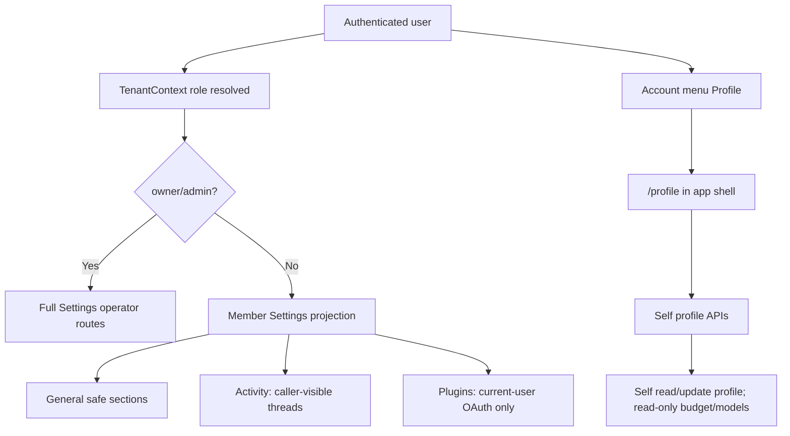

# Implementation Plan: Role-Aware Settings Access

## Overview

Implement role-aware access for Settings so owner/admin users keep the full operator console while non-operator users get a narrow self-service surface:

- General settings with deployment/operator-only content removed.
- Activity limited to the caller's own visible work.
- Plugins limited to authenticating already-installed app/plugin connections.
- Profile available from the account menu, outside the Settings side navigation, with self-only read/update affordances and read-only role, budget, and model access.

The UI should make non-operator access feel intentional, but backend authorization remains the real boundary. This plan therefore pairs each visible route change with resolver or REST handler checks for the corresponding data/mutation path.

## Problem Frame

THNK-12 asks for "Role Access" after the Settings experience proved too operator-shaped for regular users. The current app already has a tenant-role concept in `apps/web/src/context/TenantContext.tsx` and a partial operator-only Settings navigation model, but several gaps remain:

- Some non-operator-safe pages are hidden because the route is wrapped in `OperatorGuard`.
- Some operator-only pages can still be reached directly if the route itself is not guarded.
- Profile is embedded in the Settings users admin flow instead of being a normal self-service account page.
- Frontend hiding is not enough: budget, model approval, tenant-member, plugin token, and activity data paths need explicit self/admin authorization semantics.

The desired end state is not a second app. It is the same authenticated shell with role-aware entry points and hard backend boundaries.

## Requirements Trace

| Requirement                                                                                  | Plan coverage                                                                                  |
| -------------------------------------------------------------------------------------------- | ---------------------------------------------------------------------------------------------- |
| R1-R3: non-operators can access Settings, but only General, Activity, Plugins                | Units 1, 2, and 5 update Settings navigation and route guards.                                 |
| R4-R7: General hides deployment, resources, releases, and operator sections                  | Unit 2 audits `SettingsGeneral` and related tests for every operator-only section.             |
| R8-R11: Activity is visible but caller-scoped                                                | Unit 2 updates the Activity route and tests; Unit 4 audits resolver behavior if needed.        |
| R12-R15: Plugins are authentication-only for installed apps/plugins                          | Unit 5 creates a restricted plugins surface and hardens user MCP token endpoints.              |
| R16-R18: Profile appears in the account menu and opens outside Settings                      | Unit 3 adds `/profile` in the normal app shell and updates `SpacesSidebar`.                    |
| R19-R23: Self profile hides privileged controls and keeps role, budget, and models read-only | Units 3 and 4 split reusable profile UI from admin-only mutation paths and add backend checks. |

## Scope Boundaries

In scope:

- Role-aware Settings navigation and direct-route behavior.
- Non-operator General, Activity, Plugins, and Profile UX.
- Self/admin backend authorization for budget/model/profile/plugin-token data paths touched by the feature.
- Tests covering both navigation hiding and direct access.

Out of scope:

- Creating a new role taxonomy beyond the existing tenant membership model.
- Shipping the full application/plugin catalog engine from `docs/plans/2026-06-12-001-feat-application-plugins-plan.md`.
- Making non-operators manage tenant-wide settings, connectors, users, billing, deployment, or MCP configuration.
- Changing Cognito group semantics unless implementation discovers a mismatch with the current tenant membership schema.

## Context And Research

Important existing patterns:

- `apps/web/src/context/TenantContext.tsx` exposes `role`, `isOperator`, `roleResolved`, `tenantId`, and `userId`. `isOperator` currently means `owner` or `admin`.
- `apps/web/src/components/settings/OperatorGuard.tsx` redirects non-operators to `/settings/general`.
- `apps/web/src/components/settings/settings-nav.tsx` already supports `operatorOnly`, but currently treats Workspace as non-operator-visible and Activity as operator-only. THNK-12 changes that shape.
- `apps/web/src/components/settings/SettingsGeneral.tsx` already hides Deployment and Resources & URLs for non-operators through `showOperator`.
- `apps/web/src/routes/_authed/settings.activity.tsx` and `apps/web/src/routes/_authed/settings.activity.threads.tsx` currently wrap Activity in `OperatorGuard`.
- `apps/web/src/routes/_authed/settings.managed-applications.tsx` currently lacks an `OperatorGuard`, despite the nav hiding managed applications from non-operators.
- `apps/web/src/components/settings/SettingsActivityHome.tsx` combines Analytics and Threads tabs. Analytics is operator-shaped; Threads is the better candidate for non-operator self activity.
- `apps/web/src/components/settings/SettingsUserDetail.tsx` renders admin user details from `SettingsTenantMembersQuery`, which enumerates tenant members and is not appropriate as the data source for self profile.
- `apps/web/src/components/settings/UserModelsSection.tsx` currently allows model approval toggles and needs a read-only mode.
- `apps/web/src/components/SpacesSidebar.tsx` is the account menu location for adding Profile near Settings and Log out.
- `packages/api/src/graphql/resolvers/core/authz.ts` contains the row-derived tenant authorization helpers, including `requireTenantAdmin` and `requireTenantMember`.
- `packages/api/src/graphql/resolvers/costs/userBudgetStatus.query.ts` needs explicit self/admin read semantics before budget data is exposed to non-operators.
- `packages/api/src/graphql/resolvers/tenant-agent/userModelCatalog.query.ts` currently requires tenant admin; self profile needs read-only self access while `setUserModelApproval` remains admin-only.
- `packages/api/src/handlers/skills.ts` allows members to use user MCP endpoints, so the handler must ensure non-operators cannot spoof `x-principal-id` for another user's tokens.

Relevant institutional docs:

- `docs/solutions/best-practices/every-admin-mutation-requires-requiretenantadmin-2026-04-22.md` requires row-derived admin checks before admin side effects.
- `docs/solutions/architecture-patterns/managed-app-mcp-oauth-lifecycle-2026-06-06.md` separates per-user OAuth from tenant-wide managed app lifecycle.
- `docs/plans/2026-06-05-004-feat-spaces-settings-activity-plan.md` documents the current Activity route split and tab behavior.
- `docs/plans/2026-06-09-001-feat-tenant-model-catalog-plan.md` describes tenant-constrained user model approvals.
- `docs/plans/2026-06-12-001-feat-application-plugins-plan.md` is the future plugin engine context; THNK-12 should not depend on that larger project landing first.

## Key Technical Decisions

1. Use `useTenant().isOperator` as the frontend role split.
   - Owner/admin users keep the operator Settings experience.
   - Any resolved non-owner/admin role is treated as non-operator.
   - If a future `viewer` role exists server-side, implementation should include it in read-only membership checks without making it an operator.

2. Keep `OperatorGuard` for operator-only pages and add role-aware exceptions only where required.
   - Activity should stop being globally operator-only.
   - Managed Applications, MCP Servers, Users, Billing, Usage, Spaces, Workspace, Memory, and Evals should remain route-guarded even if a user guesses the URL.

3. Non-operator Activity should be Threads/self activity, not Analytics.
   - `/settings/activity` should either redirect non-operators to `/settings/activity/threads` or render the Threads view directly.
   - The Analytics tab and cost/usage visuals remain operator-only.
   - The first implementation should use the existing caller-visible thread contract. If the operator view depends on broader tenant-wide visibility, add or preserve an explicit operator-only path rather than broadening member access.

4. Profile belongs in the normal app shell at `/profile`.
   - It should reuse presentational pieces from `SettingsUserDetail` where practical.
   - It should not query the full tenant member list for self profile.
   - It should accept only the current caller as its subject.

5. Budget and model data need self/admin read boundaries.
   - Non-operators may read their own monthly budget and own model catalog state.
   - Budget policy mutation and model approval mutation remain admin/service-only.
   - UI disabled states are helpful, but resolver authorization is mandatory.

6. Plugins gets a restricted self-service projection.
   - Add a member-visible Settings item named `Plugins`.
   - The page should only show already-installed/auth-capable apps/plugins and per-user authentication state/actions.
   - It should not expose install, enable, delete, tenant configuration, catalog browsing, status administration, or MCP server details.
   - Harden REST user MCP endpoints so a non-operator cannot set `x-principal-id` to another user.

## Proposed User Experience

| Surface                | Operator behavior                                                                                                | Non-operator behavior                                                                             |
| ---------------------- | ---------------------------------------------------------------------------------------------------------------- | ------------------------------------------------------------------------------------------------- |
| Settings nav           | Full operator nav remains available.                                                                             | Only General, Activity, and Plugins are visible.                                                  |
| General                | Existing full tenant/deployment details.                                                                         | Safe tenant basics only; deployment, resources, URLs, releases, and operator sections hidden.     |
| Activity               | Current Analytics and Threads tabs.                                                                              | Self activity only; no Analytics tab.                                                             |
| Plugins                | Existing admin Applications/MCP pages remain available. Plugins may also be visible as the user's own auth page. | Installed/auth-capable plugins only, with authenticate/reconnect/disconnect for the current user. |
| Profile                | Admin user management remains under Settings Users. Account menu Profile opens own profile.                      | Account menu Profile opens own profile in the app shell.                                          |
| Profile role           | Admin controls remain in Settings Users, subject to existing owner protections.                                  | Role is read-only.                                                                                |
| Profile monthly budget | Admin controls remain in Settings Users.                                                                         | Monthly budget is visible read-only.                                                              |
| Profile models         | Admin controls remain in Settings Users.                                                                         | Model approval rows are visible read-only.                                                        |

## Implementation Units

### Unit 1: Settings Navigation And Route Access

Goal: make route visibility and direct access match the role-access model.

Touchpoints:

- `apps/web/src/components/settings/settings-nav.tsx`
- `apps/web/src/components/settings/settings-nav.test.tsx`
- `apps/web/src/components/settings/SettingsSidebar.tsx`
- `apps/web/src/routes/_authed/settings.*.tsx`
- `apps/web/src/routes/_authed/settings.managed-applications.tsx`

Tasks:

- Update visible Settings nav for non-operators to exactly General, Activity, and Plugins.
- Hide Workspace from non-operators even though it is currently not marked operator-only.
- Keep operator-only route wrappers on direct access paths.
- Add an `OperatorGuard` to `settings.managed-applications.tsx`.
- Remove or replace the Activity `OperatorGuard` with role-aware handling in Unit 2.
- Ensure nav does not briefly reveal operator-only items while `roleResolved` is false.

Tests:

- Non-operator visible nav is only General, Activity, Plugins.
- Owner/admin nav still includes the full operator set.
- Direct navigation to managed applications and other operator-only routes redirects or blocks non-operators.
- Activity remains reachable for non-operators.

### Unit 2: General And Activity Member Views

Goal: expose only safe General content and caller-scoped Activity.

Touchpoints:

- `apps/web/src/components/settings/SettingsGeneral.tsx`
- `apps/web/src/components/settings/SettingsActivityHome.tsx`
- `apps/web/src/components/settings/SettingsActivity.tsx`
- `apps/web/src/components/settings/SettingsActivityHome.test.tsx`
- `apps/web/src/components/settings/SettingsActivity.test.tsx`
- `apps/web/src/routes/_authed/settings.activity.tsx`
- `apps/web/src/routes/_authed/settings.activity.threads.tsx`
- `packages/api/src/graphql/resolvers/threads/threadsPaged.query.ts`, only if implementation finds the current caller-visible contract insufficient

Tasks:

- Audit `SettingsGeneral` for every operator-only section named in the brainstorm: Deployment, Resources & URLs, Releases, and equivalent operator/admin panels.
- Add tests that non-operators do not trigger deployment/resource queries and do not see those sections.
- Make Activity role-aware:
  - Operators see the current Analytics and Threads tabs.
  - Non-operators see only the Threads/self activity view.
  - `/settings/activity` should resolve to the member-safe activity view for non-operators.
- Confirm the underlying thread query is caller-scoped for non-operators.
- If the resolver currently cannot express both operator tenant-wide and member self-only behavior, add a small explicit contract rather than relying on frontend filters.

Tests:

- Non-operator Activity does not render Analytics/cost usage UI.
- Non-operator Activity renders caller-visible threads and keeps row navigation working.
- Operator Activity behavior is unchanged.
- Backend tests cover any resolver changes made to distinguish self and tenant-wide activity.

### Unit 3: Self Profile Route And Reusable Profile UI

Goal: add a normal-shell Profile page that reuses profile UI without exposing admin user management.

Touchpoints:

- `apps/web/src/components/SpacesSidebar.tsx`
- `apps/web/src/components/SpacesSidebar.test.tsx`
- `apps/web/src/routes/_authed/_shell/profile.tsx`
- `apps/web/src/components/settings/SettingsUserDetail.tsx`
- `apps/web/src/components/settings/UserModelsSection.tsx`
- New or extracted profile components under `apps/web/src/components/profile/` or `apps/web/src/components/settings/`

Tasks:

- Add a Profile item to the account menu near Settings and Log out, with a separator before destructive/session actions.
- Create `/profile` under the authenticated shell route, not under Settings.
- Extract shared profile presentation from `SettingsUserDetail` so admin user detail and self profile can share fields without sharing authorization assumptions.
- Ensure the self profile page only targets the current caller.
- Make Role read-only on self profile.
- Make Monthly Budget visible read-only on self profile.
- Add a read-only mode to `UserModelsSection` so model rows are visible but toggles do not mutate.
- Hide any Danger Zone or destructive account controls from self profile.
- Preserve existing admin Settings Users behavior, including current owner/self role protections.

Tests:

- Account menu Profile navigates to `/profile`.
- Self profile renders in the normal shell, not the Settings side nav.
- Role and monthly budget controls are disabled/read-only.
- Model toggles are disabled and do not call `SetUserModelApprovalMutation`.
- Admin user detail still supports allowed edits.

### Unit 4: Backend Authorization For Self Profile, Budget, And Models

Goal: make the backend enforce the role-access boundaries the UI presents.

Touchpoints:

- `packages/database-pg/graphql/types/*.graphql`, if new operations are needed
- `packages/api/src/graphql/resolvers/core/*`
- `packages/api/src/graphql/resolvers/costs/userBudgetStatus.query.ts`
- `packages/api/src/graphql/resolvers/costs/upsertBudgetPolicy.mutation.ts`
- `packages/api/src/graphql/resolvers/costs/deleteBudgetPolicy.mutation.ts`
- `packages/api/src/graphql/resolvers/tenant-agent/userModelCatalog.query.ts`
- `packages/api/src/graphql/resolvers/tenant-agent/setUserModelApproval.mutation.ts`
- `apps/web/src/lib/settings-queries.ts`
- `apps/web/src/lib/graphql-queries.ts`

Tasks:

- Add or reuse a self profile query that returns only the current caller's editable profile fields plus read-only role, monthly budget, and model state.
- Avoid using `SettingsTenantMembersQuery` for `/profile`.
- Add a self profile mutation only for allowed self-editable fields, or update an existing profile mutation with explicit self/admin rules.
- Add self/admin authorization for budget reads:
  - Caller can read own budget status.
  - Owner/admin can read tenant members' budget status.
  - Non-operator cannot read another user's budget.
- Ensure budget policy mutations require owner/admin through row-derived tenant checks.
- Update `userModelCatalog` so a caller can read their own model catalog state while owners/admins can read managed users.
- Keep `setUserModelApproval` admin/service-only.
- Regenerate GraphQL/codegen outputs for affected consumers.

Tests:

- Non-operator can read own profile, own budget status, and own model catalog.
- Non-operator cannot read another user's budget/model state.
- Non-operator cannot mutate budget policy or model approvals.
- Owner/admin behavior remains intact.
- Google-federated callers still resolve tenant identity through the established fallback path.

### Unit 5: Plugins Self-Service Surface

Goal: expose a safe plugin authentication page without exposing plugin administration.

Touchpoints:

- `apps/web/src/components/settings/settings-nav.tsx`
- `apps/web/src/routes/_authed/settings.plugins.tsx`
- New `apps/web/src/components/settings/SettingsPlugins.tsx`
- `apps/web/src/lib/mcp-api.ts`
- `packages/api/src/handlers/skills.ts`
- Existing MCP/application settings components only where reusable without leaking admin controls

Tasks:

- Add a Settings Plugins route visible to non-operators.
- Build a restricted list from installed/auth-capable app/plugin sources currently available to the web app.
- Show current-user auth state and actions only:
  - Authenticate/connect.
  - Reconnect.
  - Disconnect/clear own token, if this is already a supported user action.
- Do not expose install, enable/disable, delete, server configuration, key status administration, tenant status, catalog browsing, or MCP server details.
- Harden user MCP REST endpoints:
  - Non-operator Cognito callers may only use their own resolved user id.
  - Owners/admins may inspect or manage other users only where existing admin UX requires it.
  - Service/API-key behavior should remain compatible with existing server-side workflows.

Tests:

- Non-operator Plugins page shows only auth-capable installed entries.
- Non-operator cannot see admin controls.
- Non-operator cannot spoof another user's `x-principal-id` in user MCP endpoints.
- Owner/admin MCP and managed application routes still work.

### Unit 6: Integration, Codegen, And Verification

Goal: finish with generated artifacts, focused tests, and smoke coverage for the role split.

Touchpoints:

- `apps/web/src/routeTree.gen.ts`
- Generated GraphQL artifacts for `apps/web` and `packages/api`, as required by schema changes.
- Targeted Vitest suites in `apps/web` and `packages/api`.

Tasks:

- Regenerate TanStack route tree after adding `/profile` and `/settings/plugins`.
- Regenerate GraphQL codegen for every affected consumer.
- Run focused frontend tests for Settings nav, Activity, Profile, UserModels, Plugins, and account menu.
- Run focused backend tests for budget/model/profile/plugin-token authorization.
- Run package typechecks for touched packages.
- Browser-smoke the app as operator and non-operator if test fixtures or deployed-stage accounts are available.

Verification commands should be selected during implementation based on touched files, but likely include:

- `pnpm --filter @thinkwork/web test -- <targeted vitest files>`
- `pnpm --filter @thinkwork/api test -- <targeted vitest files>`
- `pnpm --filter @thinkwork/web typecheck`
- `pnpm --filter @thinkwork/api typecheck`
- Relevant codegen scripts after GraphQL changes

## System-Wide Impact

- **Frontend routing:** new `/profile` shell route and new `/settings/plugins` Settings route.
- **Settings navigation:** role-visible item set changes, including hiding Workspace for non-operators and exposing Activity/Plugins.
- **Activity:** role-aware tab model; non-operators should not see Analytics.
- **Profile:** shared profile component boundaries between admin user management and self-service account profile.
- **GraphQL API:** self/admin read rules for profile, budget, and model catalog data.
- **REST API:** user MCP endpoints need caller/user-id consistency checks for non-operators.
- **Generated code:** route tree and GraphQL artifacts likely change.

## Risks And Mitigations

| Risk                                                                           | Mitigation                                                                                                                                     |
| ------------------------------------------------------------------------------ | ---------------------------------------------------------------------------------------------------------------------------------------------- |
| Frontend hiding creates a false sense of security                              | Pair every exposed self-service surface with backend authorization tests.                                                                      |
| Non-operators see cost/usage Analytics through Activity                        | Hide Analytics for non-operators and add tests for direct `/settings/activity` access.                                                         |
| Profile reuses admin `SettingsTenantMembersQuery` and leaks tenant member data | Add a self profile query/path and avoid tenant-wide member enumeration on `/profile`.                                                          |
| User MCP endpoints trust `x-principal-id`                                      | Resolve the caller on the server and reject non-operator requests for another user id.                                                         |
| Read-only model toggles still fire mutations                                   | Add a true read-only mode and tests that no mutation executes.                                                                                 |
| Existing operator flows regress                                                | Keep admin routes guarded but otherwise unchanged; add owner/admin regression tests for affected components.                                   |
| Future plugin engine work conflicts with this page                             | Keep THNK-12 Plugins as a restricted current-user auth projection, not the tenant plugin catalog.                                              |
| Role names expand beyond owner/admin/member                                    | Use "operator" as owner/admin and "non-operator" as the UI decision; extend server read allow-lists only for real roles present in the schema. |

## Open Questions Resolved During Planning

- **Activity scope:** use caller-visible/self activity for non-operators; keep Analytics and any tenant-wide aggregation operator-only.
- **Plugins route shape:** create a restricted `/settings/plugins` projection rather than reusing the full Applications/MCP admin pages.
- **Profile implementation:** use a dedicated `/profile` shell route and shared UI components, not Settings Users with a self id.
- **API gate strategy:** explicitly audit and harden budget, model catalog, self profile, and user MCP token paths.

## Remaining Implementation Questions

- Exact GraphQL operation names for self profile should be chosen after inspecting existing generated schema and resolver conventions.
- If the backend currently models a `viewer` role, implementation should include it in non-operator read-only checks; otherwise do not introduce it just for THNK-12.
- If existing operator Activity is already caller-visible rather than tenant-wide, broadening it should be treated as a separate product decision unless THNK-12 explicitly requires it.

## Acceptance Checklist

- Non-operator Settings side nav shows only General, Activity, Plugins.
- Non-operator direct access to operator Settings routes is blocked or redirected.
- Non-operator General omits deployment, resources/URLs, releases, and operator sections.
- Non-operator Activity shows only caller-visible activity and no Analytics tab.
- Non-operator Plugins allows only current-user authentication actions for installed/auth-capable plugins.
- Profile appears in the account menu near Settings and Log out.
- Profile opens at `/profile` in the normal app shell.
- Self profile role and monthly budget are visible read-only.
- Self profile model access is visible read-only.
- Self profile hides destructive or admin-only controls.
- Backend rejects non-operator access to another user's profile/budget/model/plugin-token data.
- Backend rejects non-operator budget and model approval mutations.
- Owner/admin Settings behavior remains intact.
