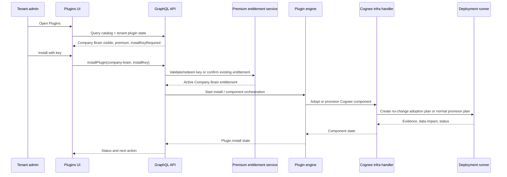
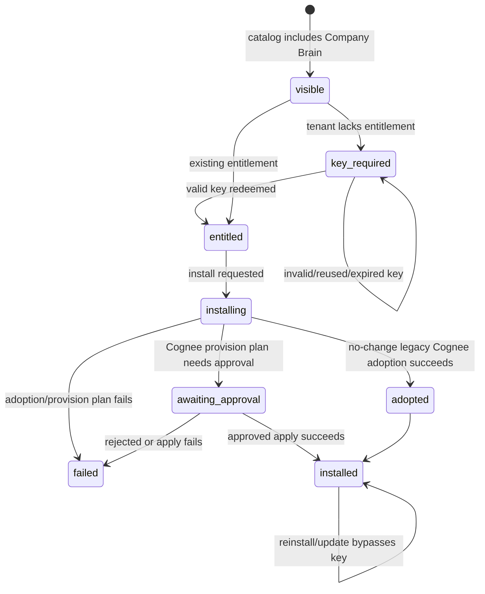
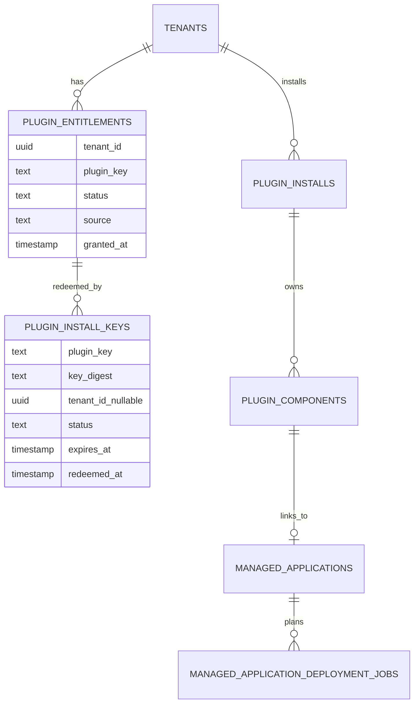

# feat: Company Brain premium plugin

## Summary

Ship Company Brain as the first premium Application Plugin. V1 keeps the scope
focused on the premium plugin shell: Company Brain is always discoverable in the
Plugins catalog, installation is gated by a ThinkWork-issued one-time key, key
redemption creates a persistent tenant entitlement, and the plugin takes over
ownership of the internal Cognee-powered substrate component through the
existing managed-app deployment machinery. The existing Memory / Ontology graph
explorer remains the working UI. Full Brain product behavior stays in THNK-6.

Customer-facing rule: **Company Brain is the product; Cognee is internal
implementation machinery.** Customer-facing catalog, install, lifecycle, and
status copy should say Company Brain, Brain substrate, knowledge graph, Memory /
Ontology, or Brain operations. Cognee may appear in operator-only evidence,
Terraform/deployment-runner details, logs, and implementation docs.

This plan assumes the Application Plugins foundation from
`docs/plans/2026-06-12-001-feat-application-plugins-plan.md` has landed or is
rebased into the implementation branch. If the current checkout still lacks
`packages/plugin-catalog`, the plugin engine, and Plugins settings UI, do not
recreate that foundation here; start from the THNK-1/Application Plugins branch
or merged main.

---

## Problem Frame

Cognee is already a managed application and the technical base for ThinkWork's
knowledge graph direction, but it must stop being treated as a customer-facing
thing to install. THNK-15 should make the Company Brain packaging, entitlement,
and lifecycle model real while treating Cognee as an internal substrate
component and without moving into THNK-6's larger Full Brain product surface.

The tricky parts are not the catalog label alone. The first premium plugin needs
secure one-time install keys, a tenant entitlement model that survives
reinstalls and upgrades, an adoption path for tenants that already have Cognee,
and UI routing that moves status/lifecycle ownership into Plugins while keeping
Memory / Ontology usable.

---

## Requirements Trace

From origin `docs/brainstorms/2026-06-13-company-brain-premium-plugin-requirements.md`:

- R1. Company Brain is always visible in the Plugins catalog.
- R2. Catalog and plugin detail mark Company Brain as premium and key-gated.
- R3. Installing without an entitlement requires an install key.
- R4. Valid install keys are one-time and cannot be reused.
- R5. Successful redemption creates a persistent tenant entitlement.
- R6. A persistent entitlement allows future install, reinstall, and update
  without another key.
- R7. V1 includes a temporary backdoor key for dev/testing until real operator
  key generation exists.
- R8. Company Brain v1 is an Application Plugin that owns Cognee as an internal
  infrastructure component, not as a customer-visible plugin or license.
- R9. The internal substrate component reuses the existing Cognee managed-app
  adapter and deployment-runner plan/approval/apply path where appropriate.
- R10. Existing internal Cognee deployments are adopted after entitlement when a
  no-change adoption plan verifies safety.
- R11. Failed no-change adoption stops install with readable evidence and no
  partial ownership migration.
- R12. New entitled tenants provision Company Brain's internal substrate through
  the normal infrastructure component flow.
- R13. Destructive actions preserve internal substrate data-impact disclosure
  and approval.
- R14. Company Brain plugin detail becomes the install, entitlement, and status
  home.
- R15. Existing Memory / Ontology remains the working graph explorer in v1.
- R16. Legacy Cognee / managed-application entry points are reduced only after
  Company Brain plugin detail covers the same lifecycle needs.
- R17. Full Brain product behavior belongs to THNK-6.

**Origin actors:** A1 tenant administrator, A2 ThinkWork operator, A3 plugin
engine, A4 deployment runner, A5 end user / agent runtime.

**Origin flows:** F1 premium catalog discovery, F2 install-key redemption, F3
existing Cognee adoption, F4 new tenant install, F5 manage graph workspace.

**Origin acceptance examples:** AE1 catalog/key prompt, AE2 one-time key and
persistent entitlement, AE3 temporary backdoor key, AE4 no-change Cognee
adoption, AE5 plugin detail links to Memory / Ontology.

---

## Scope Boundaries

### In scope for THNK-15

- Company Brain catalog entry and manifest metadata.
- Premium entitlement and install-key infrastructure for Company Brain.
- Minimal ThinkWork operator key issuance path plus the requested temporary
  backdoor key for dev/testing.
- Install gate integration with the Application Plugins engine.
- Internal Cognee-powered substrate adoption/provisioning as the Company Brain
  infrastructure component.
- Plugin detail UI for premium status, key entry, lifecycle status, and the
  Memory / Ontology link.
- Redirect or reduction of legacy Cognee entry points once the Company Brain
  plugin detail path covers install/status needs.
- Smoke coverage for catalog visibility, key redemption, entitlement
  persistence, Cognee adoption failure evidence, and graph explorer continuity.

### Deferred to THNK-6

- Agent-facing Brain access.
- Hindsight observation formalization.
- Ontology-gated graph-of-record cutover.
- Wiki materialization from Cognee.
- Compounding memory write-back.
- Brain dashboards and richer Brain UI.
- Retirement of future `brain.*` runtime surfaces.

### Out of scope

- Stripe checkout, subscription billing, or self-serve paid plan management.
- Public marketplace or third-party plugin publishing.
- Rendering plugin-declared UI surfaces.
- Automatic entitlement for tenants merely because legacy Cognee exists.
- Duplicate internal substrate deployments for tenants that already run the
  legacy Cognee deployment.

---

## Context & Research

### Repo patterns and constraints

- `docs/plans/2026-06-12-001-feat-application-plugins-plan.md` defines the
  plugin manifest, plugin engine, install/component state, infrastructure
  handler, and Plugins settings UI that THNK-15 extends.
- `packages/deployment-runner/src/apps/registry.ts` has the closed managed-app
  adapter contract for `cognee`, `twenty`, and `kestra`. Company Brain should
  use the Cognee adapter rather than a new Terraform path.
- `packages/deployment-runner/src/apps/cognee.ts` already declares Cognee's
  required inputs, Terraform variable mapping, smoke contract, status outputs,
  and data-impact disclosure.
- `packages/database-pg/src/schema/deployments.ts` stores
  `managed_applications`, deployment jobs, deployment events, plan digests,
  evidence prefixes, approval metadata, and data-impact payloads. Adoption must
  preserve these invariants.
- `packages/api/src/graphql/resolvers/deployments/startManagedApplicationPlan.mutation.ts`
  is the current admin-gated deployment job creation pattern with idempotency,
  event append, and Step Functions start.
- `packages/api/src/graphql/resolvers/core/managedApplications.ts` still has
  environment-derived Cognee status readers. This becomes compatibility glue
  during the migration, not the long-term source of plugin state.
- `apps/web/src/components/settings/SettingsCogneeApplication.tsx`,
  `apps/web/src/components/settings/ManagedApplicationRouteGuard.tsx`,
  `apps/web/src/components/settings/ManagedApplicationLifecycleActions.tsx`,
  and `apps/web/src/components/settings/SettingsMemoryHome.tsx` are the current
  Cognee status/action and Memory / Ontology integration points.
- `packages/api/src/graphql/resolvers/core/authz.ts` and
  `docs/solutions/best-practices/every-admin-mutation-requires-requiretenantadmin-2026-04-22.md`
  establish the mutation rule: derive the tenant safely and call
  `requireTenantAdmin`; do not trust `ctx.auth.tenantId` for Google-federated
  users.
- `packages/api/src/lib/compliance/emit.ts` and
  `packages/database-pg/src/schema/compliance.ts` are the audit path. New
  `plugin.*` event types must be added deliberately to the allowlist and
  redaction checks.
- `packages/api/src/handlers/mcp-admin-keys.ts` and
  `packages/api/src/handlers/deployment-sessions.ts` show existing high-entropy
  generated token patterns: `randomBytes(32)`, raw token returned once, SHA-256
  hash persisted, and constant-time comparison where a stored secret is checked
  against caller input.
- `docs/solutions/architecture-patterns/managed-app-mcp-oauth-lifecycle-2026-06-06.md`
  says infrastructure lifecycle and connector/user auth lifecycle are separate
  state machines. THNK-15 should keep Company Brain entitlement, Cognee
  infrastructure, and future Brain user access separate.
- `docs/solutions/integration-issues/spaces-urql-doc-cache-no-live-invalidation.md`
  means web status screens must explicitly refetch after install/key actions
  and while infra jobs progress.
- `docs/solutions/best-practices/cognee-thread-ingest-explorer-2026-06-04.md`
  confirms Cognee verification should use ThinkWork GraphQL/smoke paths rather
  than direct private ALB browser access.
- `docs/solutions/workflow-issues/manually-applied-drizzle-migrations-drift-from-dev-2026-04-21.md`
  applies to any hand-rolled migration or constraint used for entitlement/key
  tables.
- `docs/solutions/best-practices/oauth-client-credentials-in-secrets-manager-2026-04-21.md`
  is relevant for the backdoor key and optional key-hash pepper: avoid
  plaintext tfvars and prefer Secrets Manager/SSM-backed runtime config.

### External security references

- OWASP Cryptographic Storage Cheat Sheet:
  `https://cheatsheetseries.owasp.org/cheatsheets/Cryptographic_Storage_Cheat_Sheet.html`
  supports using cryptographically secure random generation and keeping secret
  material out of plain storage.
- OWASP Password Storage Cheat Sheet:
  `https://cheatsheetseries.owasp.org/cheatsheets/Password_Storage_Cheat_Sheet.html`
  is the fallback guidance if install keys ever become user-chosen or
  low-entropy codes. Generated high-entropy keys are closer to API tokens than
  passwords, but low-entropy secrets would require password-style hashing.
- NIST SP 800-63B:
  `https://pages.nist.gov/800-63-4/sp800-63b.html` supports using approved
  random generation for verifier-generated secrets and rate limiting for online
  guessing resistance.
- Node.js `node:crypto` docs:
  `https://nodejs.org/api/crypto.html` covers the runtime cryptographic
  primitives already used in this repo.

---

## Key Technical Decisions

- **Company Brain is a normal Application Plugin with premium metadata.**
  Reuse the Application Plugins manifest/package model from THNK-1. Add
  premium fields to the manifest/catalog layer only where the engine and UI can
  enforce them; do not create a parallel "premium apps" system.

- **Entitlement is persistent tenant state, not install state.** A tenant can
  be entitled even before, during, or after a specific install. Entitlement is
  what lets reinstall/update bypass a key; install state remains owned by the
  plugin engine. This directly preserves R5 and R6.

- **Install keys are ThinkWork-generated high-entropy tokens.** Generate at
  least 32 random bytes, present the raw key once, and persist only a digest
  plus metadata. This matches existing token patterns in `mcp-admin-keys` and
  `deployment-sessions`. If implementation introduces human-chosen or short
  invite-style codes, switch to a password-storage design instead of SHA-256.

- **Use a keyed digest when practical, but do not block on a new crypto stack.**
  Prefer HMAC-SHA-256 with a stage secret loaded from Secrets Manager/SSM. If
  the Application Plugins foundation already has a token-hash helper, reuse it.
  The fallback acceptable for v1 is the repo's existing high-entropy
  `sha256(raw)` token pattern, paired with long random keys and redemption rate
  limiting.

- **The backdoor key exercises the same entitlement path.** The temporary
  testing key must create the same persistent entitlement record as a generated
  key, emit the same audit events, and be stage-scoped by config. Do not special
  case the rest of install after the backdoor succeeds.

- **Key issuance is operator-only and minimal in v1.** Provide a small internal
  issuance path for ThinkWork operators, not a customer-facing UI. Prefer a
  service-credential or platform-operator-gated mutation/script that creates a
  one-time key for a plugin and optional tenant scope, returning the raw key
  once. Tenant admins can redeem keys but cannot mint premium entitlements for
  themselves.

- **Redemption and entitlement creation are transactional.** Key status moves
  from issued to redeemed exactly once, and the active entitlement is inserted
  or reused in the same database transaction. Install/adoption records are
  created only after that DB transition succeeds and before any external
  deployment side effect starts. Replays are safe: the same key cannot grant
  another tenant, and an already-entitled tenant can continue install/update
  without presenting another key.

- **Install gating happens before infrastructure ownership changes.** Company
  Brain install may not adopt or provision Cognee until the tenant already has
  an entitlement or successfully redeems a key. Existing Cognee alone is not a
  premium entitlement.

- **Adoption is a no-change infrastructure plan, then ownership flip.** For an
  existing Cognee tenant, the infra handler creates an adoption/upgrade plan
  through the existing Cognee adapter and treats "no changes" as the safety
  signal. Only after that evidence exists should the managed app/component be
  marked plugin-owned. If no-change verification fails, leave the legacy Cognee
  state untouched and surface evidence.

- **New tenant provisioning follows the normal infra component path.** If no
  legacy Cognee deployment exists, Company Brain invokes the existing Cognee
  plan/approval/apply flow and preserves data-impact disclosure.

- **Plugin detail becomes the product home; Memory / Ontology stays the graph
  workspace.** The plugin page owns premium status, key entry, entitlement,
  install lifecycle, and status. It links to the existing Memory / Ontology
  explorer for actual graph work in v1.

- **Legacy Cognee routes redirect only after parity.** Keep compatibility until
  plugin detail can show entitlement, install status, adoption failure evidence,
  and lifecycle actions. Then redirect `settings.applications.cognee` to the
  Company Brain plugin detail and hide/reduce Cognee in the generic managed-app
  list.

- **Compliance events are first-class.** Emit audit events for key creation,
  redemption success/failure, entitlement grant/revoke, install start, adoption
  success/failure, and destructive action approval. Add event types and
  redaction rules before emitting them.

---

## High-Level Technical Design

Premium install flow:



State model sketch:



Data relationship sketch:



The exact table names can follow whatever Application Plugins already landed
as, but the relationship boundaries should stay intact: entitlement is
tenant/plugin state, install is plugin lifecycle state, and Cognee infrastructure
remains represented by managed-app deployment rows and evidence.

---

## Output Structure

Expected areas after THNK-1 has landed:

```text
packages/plugin-catalog/src/plugins/company-brain/manifest.ts
packages/plugin-catalog/src/plugins/company-brain/manifest.test.ts

packages/database-pg/src/schema/plugins.ts
packages/database-pg/graphql/types/plugins.graphql
packages/database-pg/drizzle/<migration>_company_brain_premium_entitlements.sql

packages/api/src/lib/plugins/premium-entitlements.ts
packages/api/src/lib/plugins/premium-entitlements.test.ts
packages/api/src/lib/plugins/engine.ts
packages/api/src/lib/plugins/handlers/infra.ts
packages/api/src/graphql/resolvers/plugins/*.ts
packages/api/src/graphql/resolvers/plugins/*.test.ts
packages/api/src/lib/compliance/*.ts

packages/deployment-runner/src/apps/cognee.ts
packages/deployment-runner/src/apps/registry.ts
packages/deployment-runner/src/apps/*.test.ts

apps/web/src/components/settings/plugins/CompanyBrainPluginDetail.tsx
apps/web/src/components/settings/plugins/InstallKeyDialog.tsx
apps/web/src/components/settings/plugins/*.test.tsx
apps/web/src/routes/_authed/settings.plugins.company-brain.tsx
apps/web/src/routes/_authed/settings.applications.cognee.tsx
apps/web/src/components/settings/SettingsMemoryHome.tsx

plugins/company-brain/smoke/company-brain-plugin-smoke.mjs
docs/solutions/<optional-after-implementation>.md
```

If THNK-1 lands with different file names, use its established module layout
and keep the same responsibilities.

---

## Implementation Units

### U1. Add Company Brain manifest and premium catalog metadata

**Purpose:** Make Company Brain always discoverable as a premium plugin while
declaring Cognee as its infrastructure component.

**Requirements covered:** R1, R2, R8, R17. **Flows:** F1. **Acceptance:** AE1.

**Approach:**

- Add a `company-brain` manifest to the plugin catalog.
- Include premium metadata: display label, install key requirement, entitlement
  product key, and support copy for ThinkWork-provided keys.
- Declare a Cognee infrastructure component using the Application Plugins infra
  component contract rather than adding custom Company Brain deployment logic.
- Keep UI surface declarations minimal/reserved. Do not add Full Brain runtime
  or rendered plugin UI surface requirements.
- Extend manifest/catalog validation so premium plugins cannot omit the fields
  needed by the install gate.

**Primary files:**

- `packages/plugin-catalog/src/plugins/company-brain/manifest.ts`
- `packages/plugin-catalog/src/plugins/company-brain/manifest.test.ts`
- `packages/plugin-catalog/src/contracts.ts`
- `packages/plugin-catalog/src/catalog.test.ts`

**Tests and verification:**

- Catalog query returns Company Brain for an unentitled tenant.
- Manifest validation fails if `premium` is true but install-key metadata is
  missing.
- Manifest contains exactly the Cognee infrastructure component for v1 and no
  Full Brain runtime component.

---

### U2. Add premium entitlement and install-key storage

**Purpose:** Create persistent tenant entitlement state and one-time key state
that the plugin engine can enforce.

**Requirements covered:** R3, R4, R5, R6, R7. **Flows:** F2. **Acceptance:** AE2,
AE3.

**Approach:**

- Extend the Application Plugins schema with generic premium tables rather than
  Company Brain-only tables:
  - plugin entitlement rows keyed by tenant and plugin key.
  - plugin install-key rows keyed by plugin key and digest, with status,
    optional tenant scope, expiry, issuer metadata, redemption metadata, and
    audit correlation.
- Enforce one active entitlement per tenant/plugin and one redemption per key.
- Store only key digests, never raw keys.
- Include enough metadata to answer support questions: created by, intended
  tenant if scoped, redeemed by, redeemed tenant, source, expiration, revoked
  timestamp, digest algorithm/version, key-secret version when applicable, and
  failure-safe status.
- Add GraphQL types/fields for tenant plugin entitlement status and premium key
  requirements without exposing key digests.

**Primary files:**

- `packages/database-pg/src/schema/plugins.ts`
- `packages/database-pg/graphql/types/plugins.graphql`
- `packages/database-pg/drizzle/<migration>_company_brain_premium_entitlements.sql`
- `packages/api/src/graphql/resolvers/plugins/*.ts`

**Tests and verification:**

- Database constraints prevent duplicate active entitlements for the same
  tenant/plugin.
- A redeemed key cannot be redeemed again by the same tenant or a different
  tenant.
- Expired and revoked keys cannot grant entitlement.
- GraphQL never returns raw keys or key digests.
- Hand-rolled migration markers are present if the migration needs partial
  indexes or custom checks.

---

### U3. Implement key issuance, redemption, backdoor, and audit

**Purpose:** Provide the secure key lifecycle and the requested temporary test
path.

**Requirements covered:** R3, R4, R5, R6, R7. **Flows:** F2. **Acceptance:** AE2,
AE3.

**Approach:**

- Add a premium entitlement service under the plugin API layer.
- Generate operator-issued keys with `node:crypto` CSPRNG, at least 32 random
  bytes, and a recognizable prefix for support/debugging.
- Return the raw key only once at creation time.
- Persist a digest only. Prefer HMAC-SHA-256 with a stage secret from
  Secrets Manager/SSM; if THNK-1 already added a token helper, reuse it. The
  fallback is the existing repo pattern of SHA-256 over a high-entropy generated
  token.
- Add redemption rate limiting or attempt throttling keyed by tenant, plugin,
  actor, and remote request metadata. Treat invalid key attempts as auditable
  security events.
- Implement the backdoor key as stage-scoped config that maps to the same
  entitlement creation path. It must be disabled by absence of config and should
  not ship as a plaintext committed value.
- Provide a minimal ThinkWork-operator issuance path. Prefer service-credential
  or platform-operator gating; tenant admins may redeem but may not issue keys
  for themselves.
- Emit compliance events transactionally for key created, key redeemed, key
  failed, key revoked, and entitlement granted.

**Primary files:**

- `packages/api/src/lib/plugins/premium-entitlements.ts`
- `packages/api/src/lib/plugins/premium-entitlements.test.ts`
- `packages/api/src/graphql/resolvers/plugins/*.ts`
- `packages/api/src/lib/compliance/emit.ts`
- `packages/database-pg/src/schema/compliance.ts`
- `terraform/modules/app/*`

**Tests and verification:**

- Valid generated key grants entitlement and marks the key redeemed.
- Reusing the same key returns a clear error and does not change entitlement.
- Tenant-scoped key fails for another tenant.
- Backdoor key works only when configured for the stage and still creates a
  normal entitlement row.
- Invalid key attempts are throttled/audited.
- Non-admin tenant members cannot redeem on behalf of the tenant.
- Tenant admins cannot issue premium keys.

---

### U4. Integrate entitlement gating into plugin install/update

**Purpose:** Make the Application Plugins install flow enforce premium access
while preserving normal installed/updated plugin behavior for entitled tenants.

**Requirements covered:** R3, R5, R6, R8. **Flows:** F2, F4. **Acceptance:** AE1,
AE2, AE3.

**Approach:**

- Extend `installPlugin` so premium plugins require either an active tenant
  entitlement or a provided install key.
- When a key is provided, redeem it and create/reuse entitlement in the same DB
  transition that persists the install attempt. Start external deployment work
  only after that transition succeeds.
- Let `reinstall` and `upgradePlugin` bypass key prompts when entitlement is
  active.
- Make failure states readable: invalid key, reused key, expired key, revoked
  key, wrong tenant, and missing key should produce distinct operator-facing
  messages without leaking digests or existence details across tenants.
- Keep idempotency explicit so a user retry after a network error cannot create
  duplicate installs or double-redeem a key.

**Primary files:**

- `packages/api/src/lib/plugins/engine.ts`
- `packages/api/src/graphql/resolvers/plugins/*.ts`
- `packages/api/src/lib/plugins/premium-entitlements.ts`
- `packages/api/src/lib/plugins/engine.test.ts`

**Tests and verification:**

- Unentitled tenant sees Company Brain but install returns `installKeyRequired`
  without a key.
- Valid key starts install and creates entitlement.
- Existing entitlement allows install/update without `installKey`.
- Invalid key does not start Cognee adoption/provisioning.
- Retrying the same install request is idempotent.

---

### U5. Add Cognee adoption and provisioning as the Company Brain infra component

**Purpose:** Move Cognee under Company Brain plugin ownership without duplicate
infrastructure or hidden destructive changes.

**Requirements covered:** R8, R9, R10, R11, R12, R13. **Flows:** F3, F4.
**Acceptance:** AE4.

**Approach:**

- Extend the Application Plugins infra handler so the Company Brain component
  resolves to the existing Cognee `ManagedAppAdapter`.
- For tenants with an existing Cognee managed application, create an adoption
  plan through the deployment machinery and require a no-change result before
  marking the component/plugin as owner.
- If the runner cannot currently express adoption distinctly, start with the
  existing upgrade plan path and record an implementation note only if a
  dedicated `adopt` operation is truly needed after reading runner evidence.
- Store the link between the plugin component and the `managed_applications`
  row or deployment job so status can reconcile from deployment events.
- For new tenants, call the normal Cognee plan/approval/apply path.
- Preserve Cognee data-impact disclosure for destructive actions and expose the
  same approval gate from the plugin detail page.
- Do not flip ownership if the plan has changes, errors, or missing evidence.

**Primary files:**

- `packages/api/src/lib/plugins/handlers/infra.ts`
- `packages/api/src/graphql/resolvers/deployments/startManagedApplicationPlan.mutation.ts`
- `packages/api/src/graphql/resolvers/core/managedApplications.ts`
- `packages/deployment-runner/src/apps/cognee.ts`
- `packages/deployment-runner/src/apps/registry.ts`
- `packages/database-pg/src/schema/deployments.ts`

**Tests and verification:**

- Existing Cognee plus entitlement creates a no-change adoption plan and then
  marks the component plugin-owned.
- Adoption failure leaves legacy Cognee ownership/status untouched and surfaces
  evidence to the plugin detail query.
- New tenant install creates a normal Cognee plan with existing data-impact
  disclosure.
- Destroy/park actions require the same approval/data-impact treatment as the
  managed-app Cognee path.
- Deployment job idempotency prevents duplicate plan jobs on user retry.

---

### U6. Build Company Brain plugin detail and key-entry UX

**Purpose:** Give tenant admins a clear premium install/status home in Plugins.

**Requirements covered:** R1, R2, R3, R14, R15, R16. **Flows:** F1, F2, F5.
**Acceptance:** AE1, AE5.

**Approach:**

- Add Company Brain plugin detail UI within the Plugins settings surface from
  THNK-1.
- Show premium state, entitlement state, install status, Cognee component
  status, adoption/provision evidence, and next actions.
- When unentitled, install opens a key-entry dialog.
- When entitled, install/update/reinstall actions skip key entry.
- Include a direct action/link to the existing Memory / Ontology graph explorer.
- Use explicit urql refetch/polling after redemption, install, approval, and
  status-changing actions.
- Keep copy product-facing: "Company Brain" is the visible product; Cognee
  appears only where implementation detail or migration evidence is needed.

**Primary files:**

- `apps/web/src/components/settings/plugins/CompanyBrainPluginDetail.tsx`
- `apps/web/src/components/settings/plugins/InstallKeyDialog.tsx`
- `apps/web/src/routes/_authed/settings.plugins.company-brain.tsx`
- `apps/web/src/graphql/*.graphql`
- `apps/web/src/components/settings/SettingsMemoryHome.tsx`

**Tests and verification:**

- Unentitled tenant can see Company Brain in catalog and detail.
- Install opens key dialog when no entitlement exists.
- Valid redemption updates UI to entitled/installing without a full page reload.
- Existing entitlement shows install/update actions without key input.
- Installed plugin detail links to Memory / Ontology and the graph explorer
  still loads.
- Long error messages fit within dialog/status containers on mobile and desktop.

---

### U7. Redirect/reduce legacy Cognee managed-application surfaces

**Purpose:** Avoid two competing product homes after Company Brain can own the
same lifecycle information.

**Requirements covered:** R14, R15, R16. **Flows:** F5. **Acceptance:** AE5.

**Approach:**

- Audit current Cognee entry points and only change each one after U6 exposes
  equivalent status/action affordances.
- Redirect the legacy Cognee route to Company Brain plugin detail, with query
  or toast context only if useful.
- Hide or reduce Cognee in the generic managed-applications list once plugin
  detail is the lifecycle home.
- Keep Memory / Ontology gating compatible during rollout: it can read the
  plugin-owned Cognee component status first and fall back to legacy
  deploymentStatus while tenants are in transition.
- Avoid removing legacy GraphQL fields until web/mobile consumers have moved.

**Primary files:**

- `apps/web/src/routes/_authed/settings.applications.cognee.tsx`
- `apps/web/src/components/settings/SettingsCogneeApplication.tsx`
- `apps/web/src/components/settings/ManagedApplicationRouteGuard.tsx`
- `apps/web/src/components/settings/ManagedApplicationsPage.tsx`
- `apps/web/src/components/settings/SettingsMemoryHome.tsx`
- `packages/api/src/graphql/resolvers/core/managedApplications.ts`

**Tests and verification:**

- Visiting the old Cognee settings route lands on or points to Company Brain
  plugin detail after parity.
- Managed Applications no longer presents Cognee as an independent install home.
- Memory / Ontology remains visible for tenants with plugin-owned Cognee.
- Tenants not yet migrated do not lose access to the graph explorer.

---

### U8. Add smoke coverage, rollout checks, and operator docs

**Purpose:** Validate the cross-system behavior in deployed dev/stage before
shipping.

**Requirements covered:** R1-R16. **Flows:** F1-F5. **Acceptance:** AE1-AE5.

**Approach:**

- Add a smoke script that exercises the GraphQL/API path and, where practical,
  a browser path:
  - catalog visibility for unentitled tenant.
  - missing/invalid key blocked.
  - generated or configured test key redemption.
  - entitlement persists across reinstall/update checks.
  - existing Cognee adoption failure/success evidence is readable.
  - new tenant provision path reaches the normal approval state.
  - plugin detail links to Memory / Ontology and the graph explorer loads.
- Add operator notes for issuing keys, configuring/removing the temporary
  backdoor key, interpreting adoption evidence, and supporting tenants during
  migration.
- Record a short solution note after implementation if adoption or key lifecycle
  produces reusable patterns for future premium plugins.

**Primary files:**

- `plugins/company-brain/smoke/company-brain-plugin-smoke.mjs`
- `docs/solutions/<optional-after-implementation>.md`
- `docs/plans/2026-06-13-002-feat-company-brain-premium-plugin-plan.md`

**Tests and verification:**

- Deployed dev/stage smoke proves all acceptance examples.
- Backdoor key is absent or disabled in production configuration.
- Operator docs explain how to issue and revoke keys without exposing raw keys
  after creation.
- Adoption failure has enough evidence for support to decide whether to retry,
  fix infrastructure drift, or leave legacy Cognee untouched.

---

## System-Wide Impact

- **Database:** New entitlement/key state and possibly plugin-component links to
  `managed_applications`. Any partial indexes or enum/check additions need
  migration markers and drift reporting.
- **GraphQL:** Plugin catalog/state queries need premium fields. Install/update
  mutations need optional install-key input and readable error shapes.
- **Auth and authorization:** Redeem/install/update remain tenant-admin
  mutations. Key issuance is platform/operator-only. Do not infer tenant from
  `ctx.auth.tenantId` alone.
- **Security:** Raw keys are shown once, not stored. Invalid attempts are
  throttled and audited. Backdoor key is config-scoped and temporary.
- **Compliance:** New plugin/premium audit event types and redaction rules are
  required before emitting events.
- **Deployment runner:** Cognee remains the underlying adapter. Adoption may
  require a new runner status/evidence field if current plan summaries cannot
  clearly assert no-change.
- **Web:** Plugins becomes the Company Brain home. Memory / Ontology retains
  graph exploration. urql refetch/polling is required after lifecycle actions.
- **Mobile:** If mobile reads deployment status or Memory / Ontology state, keep
  compatibility fields until mobile has a plugin-owned status path.
- **Operations:** ThinkWork needs a practical way to issue, revoke, and support
  one-time keys before a customer-facing paid workflow exists.
- **Future premium plugins:** Entitlement/key work should be generic enough for
  the next premium plugin, not hardcoded to Company Brain except in manifest
  data and UI copy.

---

## Risks & Mitigations

- **Risk: A leaked or committed backdoor key grants production entitlement.**
  Mitigation: backdoor is stage-scoped config, never committed as plaintext,
  audited on use, and absent/disabled in production.

- **Risk: Offline key guessing if key digests leak.** Mitigation: generated
  keys use high entropy; raw keys are never stored; prefer HMAC with a
  server-side secret; throttle online redemption attempts.

- **Risk: Tenant admin can self-issue premium keys.** Mitigation: separate
  redemption authorization from operator issuance authorization, and test both
  boundaries.

- **Risk: Existing Cognee adoption accidentally changes infrastructure.**
  Mitigation: require no-change evidence before ownership migration and leave
  legacy Cognee untouched on any drift/error.

- **Risk: UI shows both Cognee and Company Brain as separate products.**
  Mitigation: do U7 only after plugin detail parity, then redirect/reduce
  legacy entry points.

- **Risk: Memory / Ontology disappears during migration.** Mitigation: keep a
  compatibility fallback from legacy deployment status while plugin-owned status
  rolls out.

- **Risk: Application Plugins foundation is not actually merged.** Mitigation:
  treat THNK-1 as a prerequisite; do not rebuild plugin engine/catalog in this
  ticket.

---

## Rollout Plan

1. Land generic premium entitlement/key support behind the plugin engine.
2. Add Company Brain manifest and catalog visibility.
3. Validate key generation/redemption in dev with the backdoor and at least one
   generated operator key.
4. Validate new-tenant Cognee provision path reaches the normal plan approval.
5. Validate existing-tenant Cognee adoption against a dev tenant with Cognee
   already running.
6. Enable Company Brain plugin detail as the primary status home.
7. Redirect/reduce legacy Cognee settings entry points after parity.
8. Remove or disable the temporary backdoor key outside explicit dev/test
   stages.

---

## Open Questions

### Resolved During Planning

- **Install-key storage:** Generated high-entropy keys should be stored as
  digests only, preferably HMAC-SHA-256 with a stage secret and otherwise the
  repo's existing SHA-256 high-entropy token pattern.
- **Backdoor behavior:** The backdoor key must grant the same entitlement as a
  generated key and be stage-scoped configuration, not a committed secret.
- **Operator issuance:** V1 needs a minimal internal issuance path; tenant
  admins redeem keys but do not mint them.
- **Existing Cognee migration:** Entitlement/key first, then no-change adoption
  plan, then ownership flip. Failure stops without partial migration.
- **UI home:** Plugin detail owns install/status/entitlement; Memory / Ontology
  remains the graph workspace.
- **Park/destroy availability:** Keep destructive lifecycle actions available
  only through the existing approval/data-impact path, surfaced from plugin
  detail when parity exists.

### Deferred to Implementation

- Exact platform-operator authorization primitive for key issuance if THNK-1 has
  not already introduced one.
- Whether the deployment runner needs an explicit `adopt` operation or can use
  the existing upgrade plan evidence for no-change adoption.
- Exact names of plugin engine tables/files after the Application Plugins branch
  lands.
- Whether the backdoor key config lives in SSM Parameter Store or Secrets
  Manager for the first deployment.

---

## Documentation / Operational Notes

- Update operator docs or runbooks with:
  - how ThinkWork generates one-time Company Brain install keys.
  - how a key is scoped, revoked, expired, and audited.
  - how to configure and remove the temporary backdoor key.
  - how to interpret adoption failure evidence.
  - how to direct users from legacy Cognee routes to Company Brain plugin
    detail.
- After implementation, consider a `docs/solutions/` note for reusable premium
  entitlement patterns, since this will likely be reused by future paid plugins.

---

## Definition of Done

- Company Brain is visible in Plugins for an unentitled tenant and clearly
  marked premium/key-gated.
- A valid generated key and the configured dev/test backdoor key both create
  persistent Company Brain entitlements.
- A redeemed key cannot be reused.
- Existing entitlement allows reinstall/update without another key.
- Install cannot adopt or provision Cognee before entitlement.
- Existing Cognee adoption requires no-change evidence and leaves legacy Cognee
  untouched on failure.
- New tenant Company Brain install provisions Cognee through the existing
  managed-app adapter path.
- Plugin detail shows entitlement/install/component status and links to
  Memory / Ontology.
- Legacy Cognee entry points are redirected or reduced only after plugin detail
  parity.
- Smoke coverage demonstrates AE1-AE5 in a deployed dev/stage environment.
