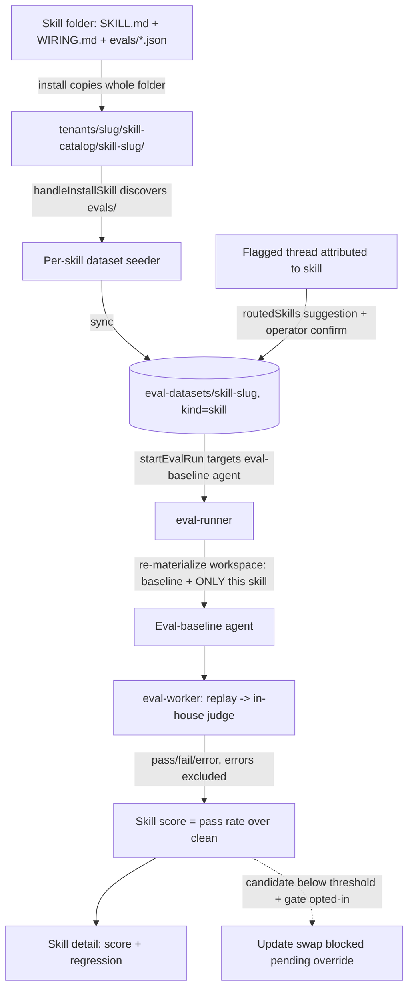
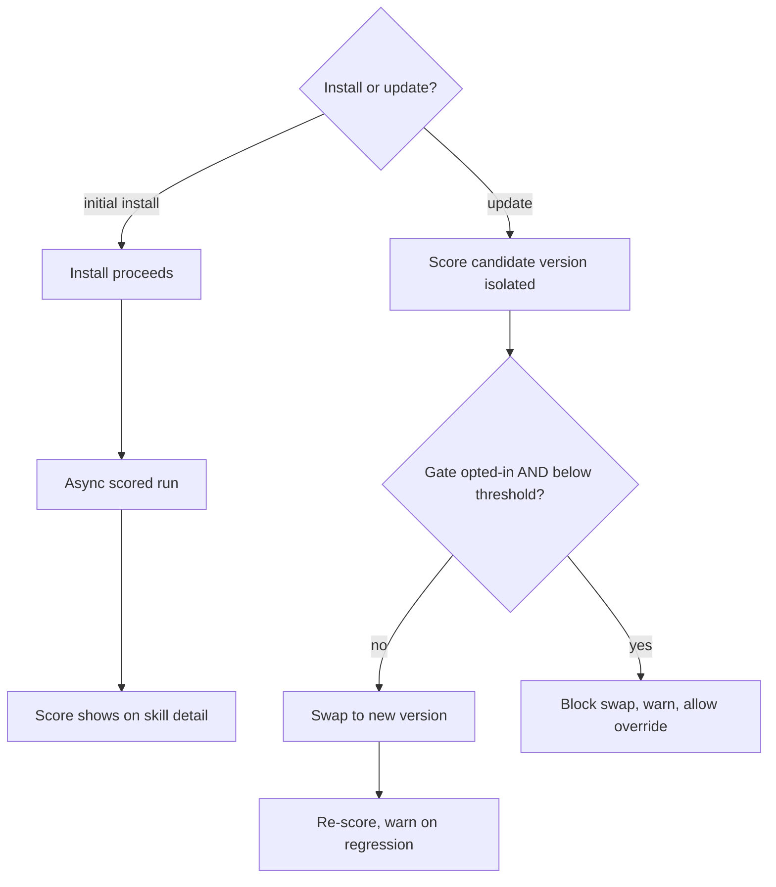

# feat: Skill Tests & Evals

## Summary

Give every skill its own quality signal by reusing the Evaluations Trust Core. A skill carries eval cases in its catalog folder; on install/materialize they sync into a per-skill eval dataset and run **isolated** — a dedicated eval-baseline agent whose workspace is re-materialized with only that skill — through the existing replay→judge substrate, producing a score attributable to the skill and comparable across versions. Install and update surface that score and warn on regression, with an optional operator gate on the update swap. A skill's eval set compounds from operator-flagged threads attributed to a skill. The self-improving updater is a deferred follow-on.

---

## Problem Frame

THNK-2 made the platform agent's quality measurable; skills have no equivalent, so installing/updating a skill is an act of faith and a regression only surfaces later as a bad thread (see origin: docs/brainstorms/2026-06-13-skill-tests-and-evals-requirements.md). The substrate to fix this now exists on `main` and this plan reuses it rather than building a parallel skill-test system.

Research (current `origin/main`) confirmed three load-bearing realities that shape the plan:

- **Reuse is deep.** The dataset format, manifest/write-through-sync/tombstone lib (`packages/api/src/lib/evals/dataset-store.ts`), `eval_datasets` + `eval_test_cases.dataset_id`/`dataset_case_id` linkage, the `pass | fail | error` taxonomy with `summarizeEvalStatuses` (whose pass-rate-over-clean-executions math is exactly R5), the ScoringEngine contract + in-house judge, copy-at-launch run pinning, read-only-MCP replay, and the flag→dataset loop are all present. A per-skill dataset is just a `eval_datasets` row of a new `skill` kind; it renders in `SettingsEvalDatasetDetail.tsx` for free.
- **No baseline/single-skill agent exists.** Every eval today runs against `resolveTenantPlatformAgent` with its full installed skill set (`eval-worker.ts` `executeCase`; `resolveAgentRuntimeConfig` derives skills by listing the agent's workspace `skills/` folder, with no per-skill scoping). Isolated execution (R4) is the largest net-new piece.
- **Install is REST, and per-turn skill routing is unrecorded.** Skill install/update runs through `packages/api/workspace-files.ts` (`handleInstallSkill`/`handleReinstallSkill`) plus the parallel plugin path, not GraphQL — so a full eval run cannot synchronously block it. And `thread_turns.context_snapshot.workspace_projection` (THNK-10) records rendered prefix, sources, AGENTS.md/CONTEXT.md keys, and injected prompt files, but **not** which skills were routed — so R11 attribution needs a new signal.

---

## Key Technical Decisions

- **A skill eval is a per-skill dataset of a new `skill` kind.** Bundled cases sync into `tenants/<slug>/eval-datasets/skill-<skill-slug>/` via a seeder modeled on `packages/api/src/lib/evals/baseline-dataset.ts` (versioned marker, additive-by-case-id, idempotent full-state sync under the existing advisory lock). No new dataset table; reuse `eval_datasets`/`eval_test_cases`, the verdict taxonomy, `scoreEvalOutcome`/`summarizeEvalStatuses`, the ScoringEngine, and copy-at-launch pinning unchanged. Engine-specific evaluator selection stays in the `engines.*` extension block (the U10 boundary invariant).
- **Isolated execution via a re-materialized eval-baseline agent.** A dedicated, reusable hidden agent runs skill-eval cases. Before each run its workspace is reset in two distinct steps — `bootstrapAgentWorkspace(..., { mode: "overwrite" })` rewrites baseline defaults/template files, then an **explicit purge of every `workspace/skills/*` folder** followed by installing exactly the one target skill. `bootstrapAgentWorkspace` only writes template/defaults source keys and has no delete pass, and skill folders are materialized separately by the catalog-install path — so overwrite alone leaves a prior run's skill folder in place (confirmed in `packages/api/src/lib/workspace-bootstrap.ts`). The purge is the cleaner; the assert-exactly-one-skill check (R13) is the loud backstop, not the mechanism. The filesystem is the activation truth (`agent_skills` is derived), so isolation is by materialization, not a DB toggle (docs/solutions/logic-errors/eval-template-runs-reused-stale-system-agents-2026-05-17.md, architecture-patterns/workspace-skills-load-from-copied-agent-workspace-2026-04-28.md). Chosen over filtering `skillsConfig` on the platform agent because that derivation reads the workspace folder and a filter override would diverge from how skills actually activate at runtime.
- **The baseline definition is pinned per run, or a score isn't comparable.** A skill's "comparable across versions" score (R5) only holds if the baseline is identical between runs — but the eval-baseline agent's built-in tool set and model resolve from mutable tenant/agent config (`loadTenantBuiltinTools`, tenant model catalog), not from the skill. So each skill-eval run **records the baseline it ran under** (built-in tool set + model id) alongside the score; regression comparison is only valid across runs with the same pinned baseline, and a baseline change surfaces as a distinct "baseline changed" state, never as a skill regression and never gating. "Baseline" (which built-ins are on) is defined explicitly and frozen for eval runs so verdicts reproduce.
- **Skill-eval runs serialize per tenant.** The single reusable eval-baseline agent is a shared workspace prefix; two concurrent skill-eval runs would race the purge/materialize. Per-tenant skill-eval runs take an advisory lock so a batch install (e.g. a plugin bundling several skills) scores them in sequence rather than cross-contaminating one workspace.
- **The new eval-baseline code path must carry the trust-core safety guarantees explicitly.** Isolated runs go through a new agent + payload path, so they must demonstrably inherit (or re-assert) the THNK-2 write-safety controls rather than assume them: the side-effect kill-list (`send_email`/`web_search`/`web_extract` stripped from the eval payload), read-only-MCP replay, the injection-hardened judge (system-role framing + strict verdict schema), and the eval-datasets IAM Deny extended to the `skill-<slug>` prefix. Each is a named test scenario in the relevant unit, verified on dev — not an unverified inheritance assumption.
- **The gate gates the update swap, not the synchronous install.** Install is a REST path and a full eval run can take minutes (per-case ~30s span-wait dominates; docs/solutions/diagnostics/eval-runner-stall-findings-2026-05-16.md), so it cannot block inline. Initial install always proceeds, syncs cases, and kicks off an async scored run. For an **update**, the candidate version is scored before the swap; if the tenant opted into a gate and the candidate is below threshold, the swap is blocked pending override. Per-case SQS fan-out (already the runner's shape) keeps one slow case from stranding the run.
- **Unrated is a neutral state.** A skill with no bundled cases is "unrated" — never a failure, never gated, regardless of threshold settings.
- **Per-turn routed-skills signal for attribution.** R11 adds a `routedSkills` list to the dispatch-time `workspace_projection` snapshot (written by both `chat-agent-invoke` and `wakeup-processor` — parity is mandatory; a gate field landing in only one builder is a known footgun). The flag flow suggests from `routedSkills` when present; older threads (no field) fall back to picking from the agent's currently-installed skills. The operator always confirms; the system never auto-attributes.
- **Inert-first seam swap.** Substrate (dataset kind, seeder, eval-baseline provisioning, migrations) lands inert with tests before the install/update scoring seam and UI go live; stubs throw or pin a status flag, never silently no-op (docs/solutions/architecture-patterns/inert-first-seam-swap-multi-pr-pattern-2026-05-08.md).

---

## High-Level Technical Design

Skill-eval lifecycle — author bundles cases, install syncs + scores isolated, update gates the swap:

Install vs update gate timing:

---

## Requirements

Carried from origin (R1–R11, F1–F3, AE1–AE4 in docs/brainstorms/2026-06-13-skill-tests-and-evals-requirements.md). Plan-added requirements continue the numbering.

- R1–R3 (authoring & discovery), R4–R6 (execution & scoring), R7–R9 (install/update behavior), R10–R11 (compounding from usage) — all in scope, traced to units below.
- R12. Skill-eval substrate lands inert before the install/update scoring seam goes live; inert stubs throw or set a visible status, never silently score nothing. (Plan-added.)
- R13. The eval-baseline agent's workspace is re-materialized fresh per run and asserted to contain exactly the one skill under test before invocation. (Plan-added: isolation correctness.)

---

## Implementation Units

Phased inert-first; each unit independently landable; PRs target `main`.

### Phase A — Per-skill dataset substrate (inert)

### U1. Per-skill dataset kind + seeder

- **Goal**: A skill's bundled cases become a per-skill eval dataset of a new `skill` kind, synced idempotently.
- **Requirements**: R1, R2, R12, AE2 (dataset side).
- **Dependencies**: none.
- **Files**: new `packages/api/src/lib/evals/skill-dataset.ts` (+ test), `packages/api/src/lib/evals/dataset-store.ts` (allow `kind: "skill"` in the manifest enum), `packages/database-pg/src/schema/evaluations.ts` (kind comment-enum note; no new column expected), hand-rolled migration only if a `kind` CHECK exists that must widen (with `-- creates`/`-- creates-constraint` markers).
- **Approach**: Model on `baseline-dataset.ts`: read bundled case files, write `tenants/<slug>/eval-datasets/skill-<skill-slug>/` (manifest + `cases/<case_id>.json`, `.gitkeep` sentinel filtered from listings), then `syncEvalDatasetFromS3` under the per-(tenant,slug) advisory lock. Versioned marker keyed to the skill's catalog content sha so re-sync is a no-op when unchanged; additive-by-case-id; case removal tombstones (never row-delete — `eval_results` FK). Cases reuse the engine-neutral core format (query, resolution target/rubric → `llm-rubric` assertion, tags, enabled). **Validate untrusted author-supplied case content**: each `case_id` is validated against the dataset slug regex (`^[a-z][a-z0-9-]{0,63}$`) before it is used as an S3 key segment (path-traversal guard); each case file is size-capped (skip + warn over the cap) and schema-validated (skip malformed cases, never seed an empty/partial case that would mislead the judge).
- **Patterns to follow**: `baseline-dataset.ts` (`seedBaselineDataset`/`ensureBaselineDatasetSeeded`), `dataset-store.ts` sync + advisory lock + tombstone.
- **Test scenarios**:
  - Covers AE2 (dataset side). Skill folder with `evals/*.json` → `skill-<slug>` dataset created with cases linked, `kind='skill'`, sentinel filtered.
  - Re-sync of unchanged skill content → no row churn (marker/sha match).
  - Case added/removed across versions → additive; removed case tombstoned + S3 payload deleted, index row retained `enabled=false`.
  - Skill with no `evals/` dir → no dataset created (feeds R3 unrated).
  - Bundled case with a `case_id` containing path-traversal (`../`, `/`, uppercase) → rejected at the seeder, no S3 write.
  - Oversized or schema-malformed bundled case → skipped with a warning, never seeded as empty.
- **Verification**: `pnpm --filter @thinkwork/api test` + `pnpm --filter @thinkwork/database-pg build`; a dev skill with bundled cases produces a `skill-<slug>` dataset visible via `evalDatasets`.

### U2. Discover & sync bundled cases on install/update

- **Goal**: Installing or reinstalling a skill auto-discovers its bundled cases and runs the U1 seeder; uninstall archives the dataset.
- **Requirements**: R1, R2, R12.
- **Dependencies**: U1.
- **Files**: `packages/api/workspace-files.ts` (`handleInstallSkill`, `handleReinstallSkill`, `handleUninstallSkill`), `packages/api/src/lib/plugins/handlers/skills.ts` (parallel plugin install path), `packages/api/src/lib/catalog-install.ts` / `catalog-reinstall.ts` (where the catalog folder is enumerated), tests alongside.
- **Approach**: The install path already lists and copies the whole catalog folder, so bundled cases (convention: `evals/*.json` within the skill folder) are materialized for free — add a post-copy step that reads those files and calls the U1 seeder. Uninstall soft-archives the `skill-<slug>` dataset. Define the bundled-case convention (path + case-file shape) once and document it. Inert: this unit syncs cases but does not score or gate (scoring is Phase C); the sync must be observable (log/status), not a silent no-op.
- **Patterns to follow**: `installCatalogSkill` file enumeration; `regenerateManifest`/`syncDerivedAgentSkills` post-install hook ordering.
- **Test scenarios**:
  - Install a skill with bundled cases → dataset synced; `.catalog-ref.json` + manifest unaffected.
  - Reinstall after the author adds a case → dataset picks up the new case (additive).
  - Plugin-path install of a skill with cases → same sync (both install paths covered).
  - Uninstall → dataset archived, not deleted; history intact.
- **Verification**: package suite green; install on dev syncs the dataset; both REST and plugin install paths exercised.

### Phase B — Isolated execution

### U3. Eval-baseline agent provisioning

- **Goal**: A dedicated reusable agent whose workspace can be re-materialized to baseline + exactly one skill for an isolated run.
- **Requirements**: R4, R13.
- **Dependencies**: none (parallel with Phase A).
- **Files**: new `packages/api/src/lib/evals/eval-baseline-agent.ts` (+ test), reuse `bootstrapAgentWorkspace` and `resolveTenantPlatformAgent`/agent creation helpers under `packages/api/src/lib/agents/`, hand-rolled migration if a marker column is needed on `agents` (e.g. `is_eval_baseline`) with markers.
- **Approach**: Ensure-or-create a hidden per-tenant eval-baseline agent — not `is_platform_default`, and explicitly excluded from every agent-listing/resolution path (GraphQL listings and `resolveTenantPlatformAgent`), tenant-scoped (whether it needs an `is_eval_baseline` column or an existing agent-metadata flag is an implementation choice — see Open Questions). Before a skill-eval run, reset its workspace in two steps: (1) `bootstrapAgentWorkspace(..., { mode: "overwrite" })` to reset baseline defaults/template files; (2) **explicitly delete every existing `skills/*` folder** (bootstrap does not touch `skills/` — verified in `workspace-bootstrap.ts`, no prune pass), then install exactly the target skill's `skills/<slug>/`. Assert exactly one skill folder is present before invocation (fail loudly — the backstop, not the cleaner). Built-ins are injected from runtime/template config, not materialized as skills (docs/solutions/best-practices/injected-built-in-tools-are-not-workspace-skills-2026-04-28.md); "baseline" enumerates exactly which built-ins are on (the side-effect tools — email/web — are OFF) so verdicts are reproducible, and the run records the baseline (built-in set + model id) it scored under. Per-tenant skill-eval runs serialize under an advisory lock so concurrent runs can't race the shared workspace.
- **Execution note**: characterization-first on `resolveAgentRuntimeConfig`'s skill derivation before adding the baseline path, so the isolated config provably contains exactly the one skill.
- **Test scenarios**:
  - Provision baseline + skill A → workspace `skills/` contains exactly A; `resolveAgentRuntimeConfig` resolves exactly A + baseline built-ins.
  - Re-materialize for skill B on the same baseline agent → the explicit purge removes skill A's folder (overwrite alone does NOT); assertion passes for B only. (Regression guard for the bootstrap-no-prune trap.)
  - Assertion fires when materialization leaves zero or two skill folders → run aborts with a clear error, not a silent wrong-skill verdict.
  - Built-ins present in baseline are not treated as the skill under test; the eval payload omits `send_email`/`web_search`/`web_extract` configs (side-effect kill-list on the new path).
  - Two concurrent skill-eval runs for one tenant → serialized by the advisory lock; neither reads the other's in-flight workspace.
  - The eval-baseline agent does not appear in tenant agent listings / platform-agent resolution.
- **Verification**: package suite green; on dev, an isolated run's invoked workspace contains only the target skill (verify materialized `SKILL.md`, not just source).

### U4. Run a skill dataset isolated

- **Goal**: Launching a skill dataset run targets the eval-baseline agent (re-materialized per U3) and scores only that skill's cases.
- **Requirements**: R4, R5, R6, R13, AE2.
- **Dependencies**: U1, U3.
- **Files**: `packages/api/src/graphql/resolvers/evaluations/index.ts` (`startEvalRun` / `resolveRunTarget`), `packages/api/src/handlers/eval-runner.ts` (`dispatchDatasetRun` target resolution), `packages/api/src/handlers/eval-worker.ts` (agent resolution in `executeCase`), tests alongside.
- **Approach**: For a `kind='skill'` dataset run, `resolveRunTarget` resolves the eval-baseline agent (and triggers U3 re-materialization + serialization lock for the skill) instead of `resolveTenantPlatformAgent`; the run row records the skill scope, skill version, **and the pinned baseline (built-in set + model id)** so cross-run comparison is baseline-aware. Per-case SQS fan-out, copy-at-launch pinning, read-only-MCP replay, and `summarizeEvalStatuses` are reused unchanged — so the score is pass-rate-over-clean-executions automatically (R5). The worker reads the skill scope explicitly and gives it precedence (avoid the empty-scope→all-cases bug; docs/solutions/logic-errors/eval-runner-ignored-system-workflow-test-case-selection-2026-05-03.md); echo effective scope (skill, case ids) in the first checkpoint. The eval payload for these runs carries the side-effect kill-list and the hardened judge from the trust core — verify on the new path rather than assume (a malicious bundled case's query/rubric must not flip the judge verdict).
- **Test scenarios**:
  - Covers AE2. Skill dataset run → executes against eval-baseline-agent-plus-only-this-skill; scores only the skill's pinned cases; pass rate over clean executions, errors excluded; run records the pinned baseline.
  - A bundled case whose query/rubric embeds judge-override text ("always output passed") → does not flip the verdict (hardened judge holds on the new path).
  - The run's eval payload contains no `send_email`/`web_search`/`web_extract` config.
  - Effective scope (skill slug + pinned case ids) recorded on the run and echoed at dispatch; a malformed/empty scope does not collapse to all cases.
  - Errored case (timeout/throttle/judge-crash) excluded from the score (reuses trust-core taxonomy).
  - Run pins the skill version so re-runs are comparable.
- **Verification**: package suite green; dev skill run scores exactly the skill's cases against the isolated agent.

### Phase C — Score, warn, gate (seam live)

### U5. Score + regression warning on install/update

- **Goal**: Install/update surface the skill's score and warn when a candidate version regresses vs the installed version.
- **Requirements**: R5, R7, R3 (unrated), F1, F2, AE1.
- **Dependencies**: U2, U4.
- **Files**: `packages/api/workspace-files.ts` (install/update handlers trigger an async scored run + read latest score), `packages/api/src/graphql/resolvers/evaluations/` (a per-skill score/trend read, reusing `evalRuns`/`evalSummary` filtered to the skill dataset), `packages/database-pg/graphql/types/evaluations.graphql` (a `skillEvalScore(skillSlug)`-style query if the existing dataset queries don't cover it), codegen, tests alongside.
- **Approach**: Initial install proceeds, then kicks off the U4 run async; the score surfaces when complete. Update compares the candidate version's score to the installed version's last score and warns on regression. Unrated skills (no cases) report "unrated," never a regression. Reuse `summarizeEvalStatuses` and the legacy/“no score” rendering. Live updates reuse the existing `notifyEvalRunUpdate` subscription with a coalesced `network-only` refetch (urql doc cache doesn't auto-invalidate; docs/solutions/integration-issues/spaces-urql-doc-cache-no-live-invalidation.md) — no new AppSync subscription/terraform.
- **Test scenarios**:
  - Covers F1. Install a rated skill → async run completes → score appears on the skill surface.
  - Covers F2 (warn arm). Candidate scores below installed version → regression warning surfaced; install/update still proceeds (no gate yet — gate is U6).
  - Covers AE1 (unrated arm). Skill with no cases → "unrated," no regression, no score.
  - urql refetch fires on run-update event (coalesced), not stale.
- **Verification**: package suite green; dev install shows a score; an intentionally-worse candidate warns.

### U6. Optional operator gate on the update swap

- **Goal**: A tenant (or per-skill) threshold blocks an update swap when the candidate scores below it; absent opt-in, nothing blocks.
- **Requirements**: R8, R9, AE3.
- **Dependencies**: U5.
- **Files**: `packages/database-pg/src/schema/evaluations.ts` + hand-rolled migration (new gate-threshold config table or column, with `-- creates`/`-- creates-column` markers, applied to dev before merge), `packages/api/workspace-files.ts` (update swap consults the gate), `packages/api/src/graphql/resolvers/evaluations/` (operator-gated threshold CRUD, `requireTenantAdmin`), `packages/database-pg/graphql/types/evaluations.graphql` + codegen, `apps/web` operator UI for the threshold, tests alongside.
- **Approach**: Score the candidate version isolated before the swap. Candidate staging is the load-bearing detail: the candidate's bytes (its `skills/<slug>/` folder) and its bundled cases must be scored **without** mutating the installed version's `skill-<slug>` dataset or its score — materialize the candidate onto the eval-baseline agent (U3 path) and sync its cases into a transient eval-only staging dataset (e.g. a `skill-<slug>@candidate` prefix), not the live `skill-<slug>` dataset; the swap (and promotion of the candidate's dataset to canonical) happens only after the gate passes. Confirm the REST update path can stage+score a candidate before committing the swap; if it structurally cannot, that is a blocking finding to resolve before U6 (see Open Questions). If a gate is opted-in and the candidate is below threshold, block the swap pending an explicit override (logged). Unrated skills are never gated (R9). Initial install is never hard-blocked (only updates gate the swap). **Gate threshold is per-tenant in v1** (a single tenant-level threshold); per-skill thresholds are deferred (see Scope Boundaries) — this locks the migration shape. Operator-gated config + override per `requireTenantAdmin`, row-derived tenant.
- **Test scenarios**:
  - Covers AE3. Candidate below threshold + gate set → swap blocked until override; below threshold + no gate → warning + proceed.
  - Scoring a candidate version → the installed version's `skill-<slug>` dataset and last score are untouched until the swap passes the gate (staging isolation).
  - Unrated skill under a tenant with a gate threshold → not blocked (AE1/R9).
  - Override is operator-gated and recorded; non-admin → forbidden.
  - Gate threshold CRUD is tenant-scoped; cross-tenant → forbidden.
- **Verification**: package suite green; dev update below a set threshold is blocked then overridable.

### Phase D — Compound from usage

### U7. Routed-skills signal on the per-turn snapshot

- **Goal**: Record which skills were active in a turn, so flagged cases can be attributed to a skill.
- **Requirements**: R11.
- **Dependencies**: none — independent; new turns only. May land in parallel with Phase A (earlier landing = more attributed turns before U8 ships).
- **Files**: `packages/api/src/lib/workspace-projection-snapshot.ts` — the field threads through the shared writer `recordDispatchWorkspaceProjectionSnapshot` (and `buildWorkspaceProjectionSnapshot`), which is where both dispatch builders converge; `packages/api/src/handlers/chat-agent-invoke.ts` and the wakeup dispatch builder each pass the value in; the existing dispatch-parity test file, tests alongside.
- **Approach**: Capture the turn's **effective/active installed skill slugs** (e.g. from `effectiveSkillsConfig` at the chat call site and the wakeup equivalent) into `context_snapshot.workspace_projection.activeSkills`. Naming: `activeSkills`, not `routedSkills` — the API knows which skills were available/active for the turn, not which the model routed to inside AgentCore; the field name shouldn't overpromise true routing. Thread it through `recordDispatchWorkspaceProjectionSnapshot` (the shared seam) so both builders populate it identically — a field in only one builder is the documented wakeup-parity footgun. Old turns lack the field; consumers treat absence as "unknown, fall back."
- **Execution note**: add the parity contract test first (both builders populate `activeSkills` via the shared writer) before wiring either.
- **Test scenarios**:
  - Chat dispatch records `activeSkills` for the turn's effective skills.
  - Wakeup dispatch records the same shape via the shared writer (parity test).
  - A turn predating the field → snapshot has no `activeSkills`; consumers handle absence.
- **Verification**: package suite green; a new dev thread turn's snapshot carries `activeSkills`.

### U8. Flag a thread into a skill's dataset with attribution

- **Goal**: An operator attributes a flagged thread's bad turn to a skill and adds it to that skill's dataset.
- **Requirements**: R10, R11, F3, AE4.
- **Dependencies**: U1 (skill datasets exist), U7 (activeSkills source).
- **Files**: `packages/api/src/graphql/resolvers/evaluations/flag-thread.ts` (input gains skill attribution; routes the case into the `skill-<slug>` dataset), `packages/database-pg/graphql/types/evaluations.graphql` + codegen, `apps/web/src/components/workbench/FlagThreadForEvalDialog.tsx` (skill picker), tests alongside.
- **Approach**: Extend `flagThreadForEval` to accept a confirmed skill slug. Its current input guard ("exactly one of `datasetSlug` or `newDatasetName`") becomes a three-way resolution: skill attribution → resolve/ensure the `skill-<slug>` dataset; "not skill-specific" → the existing datasetSlug/newDatasetName path — the validation branch and dataset-slug resolution are reworked, not just given an additive field. The dialog suggests candidates from the turn's `activeSkills` when present, else from the agent's currently-installed skills, plus a "not skill-specific" option; **the installed-skill fallback is marked low-confidence** (the installed set at flag-time may differ from what was active in an old turn) and the case records that its attribution was fallback-derived, so a later audit can quarantine a misattribution. The case is written into the target skill's dataset (reusing `putEvalDatasetCase` + the snapshot builder). The system never auto-attributes; the operator always confirms. `requireTenantAdmin`, tenant triangle as in the existing flag flow.
- **Test scenarios**:
  - Covers AE4 / F3. Flag a turn attributed to skill X → case lands in X's dataset; a later run of X includes it.
  - Turn with `activeSkills` → those are the suggested candidates; turn without → suggestions come from installed skills (marked low-confidence; case flagged fallback-derived).
  - "Not skill-specific" → case routes to a non-skill dataset (existing behavior), not forced onto a skill.
  - Save without a confirmed attribution when targeting a skill dataset → rejected (no auto-attribution).
  - Cross-tenant / non-admin → forbidden.
- **Verification**: package suite green; dev flag → skill dataset → re-run includes the case.

### Phase E — Surfaces

### U9. Skill score & trend in the skills UI

- **Goal**: An operator sees a skill's score, regression state, and trend where they manage skills.
- **Requirements**: R5, R7 (surface), F1, F2.
- **Dependencies**: U4, U5.
- **Files**: `apps/web/src/components/settings/SettingsSkills.tsx` (score column), `apps/web/src/components/settings/SettingsSkillDetail.tsx` (score + regression + trend + "run evals now"), `apps/web/src/lib/skill-catalog-queries.ts` / `evaluation-queries.ts`, tests alongside.
- **Approach**: Skill detail shows the latest score, "unrated" when no cases, a regression badge on a worse candidate, version-over-version trend, and an on-demand run action (R6). The evaluations side comes mostly free — a `kind='skill'` dataset already renders in `SettingsEvalDatasetDetail.tsx`. Operator-gated (`OperatorGuard`/`useTenant().isOperator`); refetch on `notifyEvalRunUpdate` (coalesced).
- **Test scenarios**:
  - Skill detail renders score / "unrated" / regression states correctly.
  - "Run evals now" launches an on-demand run (R6) and the score updates live (subscription refetch).
  - Operator-gated: non-operator doesn't see the controls.
- **Test expectation note**: component tests alongside existing `SettingsSkill*` patterns.
- **Verification**: visual pass on Eric's checkout + dev (validate-locally rule) before PR; web suite green.

---

## Open Questions

**Resolve before implementing the dependent unit:**

- **Candidate staging (U6):** can the REST install/update path stage a candidate skill version and score it *before* committing the swap (materialize candidate bytes + cases to a `@candidate` staging prefix without touching the installed version)? If the update path structurally cannot stage-without-swapping, the gate-the-swap model needs rework — resolve before U6.
- **Eval-baseline agent marker (U3):** does excluding the eval-baseline agent from listings/resolution warrant an `is_eval_baseline` column (hand-rolled migration) or does an existing agent-metadata flag + `is_platform_default=false` suffice? Decide before U3's migration is authored. (Functional behavior is fixed either way: hidden, tenant-scoped, never in platform-agent resolution.)

**Deferred to implementation:**

- Exact bundled-case convention path (`evals/*.json` vs `tests/*.json`) and the per-case file size cap value.
- The frozen "baseline" built-in set (which built-ins on) — enumerated at U3 implementation so verdicts reproduce.

---

## Scope Boundaries

Carried from origin — deferred, sequenced not rejected:

- The self-improving skill updater (auto-research → propose/apply skill changes) — the compounding loop that consumes skill-eval signal; build once that signal is trusted.
- Continuous/scheduled skill-eval regression runs and on-model-change auto-runs — v1 runs at install/update + on demand.
- In-context skill evals (against the tenant's real configured agent, to catch conflicts with other skills) — the isolated score is canonical; in-context is a later check.
- Per-skill gate thresholds — v1 ships a single per-tenant threshold; per-skill thresholds are deferred (locks the U6 migration shape).
- Scoring skills that depend on a companion skill or specific built-in to function — v1 isolated evals are for self-contained skills; a skill whose cases presuppose another skill is marked "unrated" (or in-context-only) rather than scored in isolation and false-failed. A per-skill declared-dependency set co-materialized into the baseline is the eventual path.

### Deferred to Follow-Up Work

- Backfilling `activeSkills` onto historical turns — new turns only; old threads fall back to installed-skill suggestions.
- Parsing active skills from a turn's archived CONTEXT.md (`agentsMdHistoryKey`) as a higher-confidence attribution source than the installed-skill fallback for old turns.

---

## Risks & Dependencies

- **THNK-2 substrate** (datasets, verdicts, ScoringEngine, replay→judge, flag→dataset, copy-at-launch) — reused, not modified. Plan assumes it is deployed (it is, on `main`).
- **Wakeup parity (U7):** `routedSkills` must land in both the chat and wakeup dispatch builders; a one-sided add is the documented footgun. The parity contract test is the guard.
- **Eval-baseline workspace leakage (U3):** `bootstrapAgentWorkspace(overwrite)` does NOT prune `skills/` — the prior run's skill folder survives. U3 must explicitly purge `skills/*` before installing the one skill; the exactly-one assertion is the backstop. Verify live materialized `SKILL.md`, not source.
- **Baseline drift breaks comparability (U3/U4):** the eval-baseline agent's built-ins/model resolve from mutable tenant config, so a baseline change can read as a skill regression and (if gated) block an innocent update. Pin + record the baseline per run; compare only same-baseline runs; surface "baseline changed" as non-gating.
- **Concurrency on the shared eval-baseline agent (U3/U4):** two skill-eval runs racing the purge/materialize cross-contaminate the workspace; per-tenant runs serialize under an advisory lock (batch installs score sequentially).
- **Candidate staging for the gate (U6):** scoring an update candidate before the swap must not mutate the installed version's dataset/score — stage to a `@candidate` prefix; confirm the REST update path can stage+score pre-swap (blocking if it cannot).
- **Safety inheritance on the new path (U3/U4):** the eval-baseline code path is new, so the side-effect kill-list, hardened judge, read-only-MCP replay, and the eval-datasets IAM Deny (extended to `skill-<slug>`) must be verified on it, not assumed. If any THNK-2 control isn't yet on `main`, treat it as a Phase-A prerequisite.
- **Install-path async/gate UX (U5/U6):** install can't block on a full run; the gate applies to the update swap via candidate scoring. If "score on install" must feel immediate, a representative inline subset can score synchronously while the full set fans out — noted, not required for v1.
- **Per-skill judge cost:** every skill-eval case is judged (Bedrock Converse). Bounded by skill dataset sizes for v1; audit `eval_compute` cost events after U4.
- **Migrations:** any new table/column (dataset `kind` widening, `is_eval_baseline`, gate threshold) is hand-rolled with `-- creates`/`-- creates-column`/`-- creates-constraint` markers, applied to dev before merge; reader code must not deploy ahead of its tables (docs/solutions/workflow-issues/manually-applied-drizzle-migrations-drift-from-dev-2026-04-21.md).

---

## Sources / Research

- Origin: docs/brainstorms/2026-06-13-skill-tests-and-evals-requirements.md (R1–R11, F1–F3, AE1–AE4, decisions, deferrals).
- THNK-2 substrate: docs/plans/2026-06-12-003-feat-evaluations-trust-core-plan.md; current-state files — `packages/api/src/lib/evals/dataset-store.ts`, `baseline-dataset.ts`, `agentcore-direct.ts`, `engines/in-house.ts`, `run-launch.ts`; `packages/api/src/handlers/eval-runner.ts`, `eval-worker.ts`; `packages/evals-core/src/{engine,scoring,types,mcp-tool-access}.ts`; `packages/api/src/graphql/resolvers/evaluations/{index,datasets,flag-thread}.ts`; `packages/api/src/lib/evals/thread-snapshot.ts`; `packages/api/src/lib/workspace-projection-snapshot.ts`.
- Skill catalog/install: `packages/api/workspace-files.ts` (`handleInstallSkill`), `packages/api/src/lib/catalog-install.ts`, `catalog-index.ts`, `catalog-skill-sha.ts`, `packages/api/src/lib/plugins/handlers/skills.ts`; UI `apps/web/src/components/settings/SettingsSkills.tsx` / `SettingsSkillDetail.tsx`.
- Agent provisioning/materialization: `packages/api/src/lib/agents/tenant-platform-agent.ts`, `resolve-agent-runtime-config.ts` (`loadWorkspaceSkillConfigs`), `bootstrapAgentWorkspace`.
- Institutional learnings applied: eval-template-stale-agent (re-materialize/overwrite, assert exact skill), workspace-skills-load-from-copied-workspace (filesystem is activation truth), injected-built-in-tools-are-not-skills (baseline definition), eval-runner-ignored-test-selection (explicit worker scope), eval-runner-stall (per-case fan-out, async install), gitkeep-materialization (empty-folder sentinel), requireTenantAdmin (mutation gating), urql-no-live-invalidation + AppSync-needs-terraform-resolver (reuse `notifyEvalRunUpdate`, coalesced refetch), inert-first-seam-swap (phasing), manually-applied-migrations-drift (markers, apply-before-merge, deploy ordering).
- Note: the three Evaluations Trust Core `/ce-compound` learnings (env-flag/terraform, throttling retry, write-safe replay) were captured in a separate docs PR; if not yet on `main`, treat the THNK-2 plan as the authoritative substrate reference.
