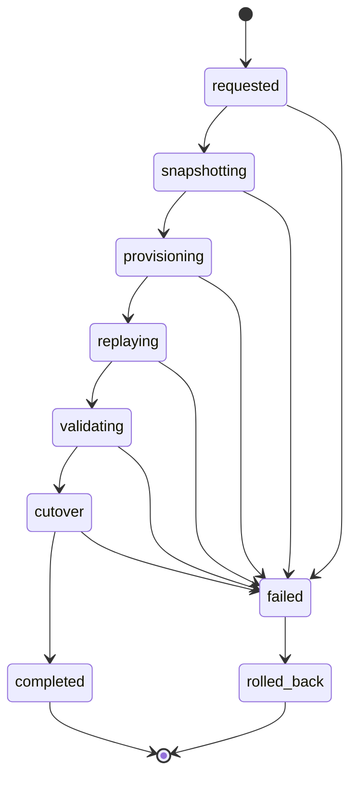
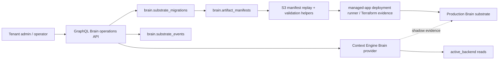

# feat: Company Brain remaining substrate

## Overview

THNK-6 already shipped the first dogfood proof milestone through child issues
THNK-17, THNK-18, THNK-19, and THNK-20. Those units provide the Company Brain
plugin shell prerequisite, substrate status contract, tenant-scoped Cognee
provisioning contract, canonical S3 artifacts/manifests, and first-party
Context Engine `query_brain_context` reads.

This plan covers the remaining parent-scope Company Brain substrate work:
default-to-production migration orchestration, migration-aware Brain reads,
Brain operations UI, and docs/smoke closure. Company Brain remains the
customer-facing product. Cognee is internal substrate machinery and may appear
only in operator evidence, Terraform/deployment-runner details, logs, tests,
and implementation docs.

---

## Problem Frame

Company Brain should become a premium, tenant-scoped substrate rather than a
flag-gated memory feature. The dogfood proof now establishes contracts and
active/default reads, but the product still lacks a safe default-to-production
upgrade path, explicit migration read semantics, an operational surface for
admins/operators, and final documentation/smoke coverage that proves the
substrate is useful through ThinkWork-controlled access paths.

The implementation must preserve the original THNK-6 decisions: S3 artifacts
and manifests are canonical replay inputs, production graph/vector runs on
Neptune Analytics rather than direct OpenSearch vector storage, vault pages are
materialized projections rather than the graph of record, Hindsight remains the
episodic memory layer, ontology approval gates trusted structured knowledge,
and agents reach Brain through Context Engine / restricted MCP access rather
than raw storage backends.

---

## Requirements Trace

- R1. Implement default-to-production migration phases: requested,
  snapshotting, provisioning, replaying, validating, cutover, completed,
  failed, and rolled_back.
- R2. Migration replays from canonical S3 artifacts/manifests and validates
  source counts, graph/entity/edge counts, ontology version, vector dimension,
  vector index health, and representative retrieval parity before cutover.
- R3. Default remains the active backend until validation passes; failed or
  rolled-back migrations do not redirect first-party reads to production.
- R4. Migration-aware `query_brain_context` reads report active, shadow,
  fallback, and vault provenance without exposing Cognee, Neptune, S3 keys, or
  raw source ids to tenant callers.
- R5. Brain operations UI owns ingestion, ontology, graph/vector, vault,
  migration, MCP access, cost, evidence, and failure actions; plugin detail
  remains lifecycle/tier summary with deep links.
- R6. Tenant admins see redacted posture and actions; ThinkWork operators see
  backend evidence and can distinguish approval-required, provisioning,
  validation, rollback, and failure states.
- R7. Documentation and smoke coverage verify Company Brain through GraphQL,
  Context Engine, and the restricted MCP profile, including an agent-facing
  value proof with provenance.

---

## Scope Boundaries

- Do not reopen THNK-17, THNK-18, THNK-19, or THNK-20 dogfood proof scope
  except to consume their merged contracts.
- Do not expose Cognee as a customer-visible product, plugin, license,
  install option, storage choice, or raw MCP surface.
- Do not implement billing/checkout automation beyond operational tier and
  approval posture already represented by plugin entitlement.
- Do not make OpenSearch a direct Company Brain production vector store.
- Do not treat EFS or markdown vault projections as canonical Company Brain
  storage.
- Do not run manual deploys, production mutations, or direct Lambda updates;
  changes ship through PRs to `main`.

### Deferred to Follow-Up Work

- Full `brain.*` retirement and complete wiki cutover after graph-backed agent
  retrieval, page materialization, and operations evidence are working.
- External Brain MCP write/delete tools, proposal/approval write-back, and
  rollback-governed compounding updates beyond read-first access.
- Automatic commercial/billing upgrade policy beyond operator/commercial/cost
  approval hooks in the operations model.

---

## Context & Research

### Relevant Code and Patterns

- `packages/database-pg/src/schema/brain.ts` defines
  `brain.substrate_states`, `brain.substrate_migrations`,
  `brain.substrate_events`, and `brain.artifact_manifests`.
- `packages/api/src/graphql/resolvers/brain/companyBrainStatus.query.ts`
  projects redacted tenant status and operator evidence for substrate and
  migration state.
- `packages/api/src/lib/context-engine/providers/company-brain.ts` gates
  `query_brain_context` on active substrate status and required retrieval /
  provenance capabilities.
- `packages/api/src/lib/knowledge-graph/artifacts.ts` writes canonical source
  artifacts, ingestion manifests, and vault projections without making the
  `wiki_exports` bucket authoritative.
- `packages/deployment-runner/src/apps/cognee.ts` and
  `terraform/modules/app/cognee` normalize tenant-scoped Brain desired config,
  default/production storage tiers, Neptune Analytics production settings, and
  private-substrate posture.
- `apps/web/src/components/settings/plugins/PluginDetail.tsx` already links
  Company Brain plugin detail to the Memory / Ontology area; Brain operations
  should become the deeper lifecycle/operations destination.

### Institutional Learnings

- `docs/plans/autopilot/THNK-17-status.md`: explicit substrate state is
  authoritative over legacy environment-derived Cognee status and tenant
  callers must not see backend evidence.
- `docs/plans/autopilot/THNK-18-status.md`: tenant-scoped Brain provisioning
  is expressed through managed-app desired config and Terraform runner outputs.
- `docs/plans/autopilot/THNK-19-status.md`: canonical Brain artifacts live in
  the Brain artifact bucket and manifests, not `wiki_exports`.
- `docs/plans/autopilot/THNK-20-status.md`: first-party reads use active
  default substrate state through Context Engine; production migration and
  migration-aware reads were intentionally deferred.
- `docs/solutions/best-practices/context-engine-adapters-operator-verification-2026-04-29.md`:
  provider failures should be local statuses rather than whole-query failures.
- `docs/solutions/best-practices/cognee-thread-ingest-explorer-2026-06-04.md`:
  validate Cognee/Brain behavior through ThinkWork GraphQL and Context Engine
  paths, not direct private backend access.

### External References

- Cognee docs confirm the storage split: relational metadata/state,
  vector-store providers including LanceDB and Neptune Analytics, graph-store
  providers, and S3-backed storage support.
- AWS Neptune Analytics docs confirm vector index dimensions are fixed at graph
  creation and that stopped graphs preserve data/configuration while reducing
  compute cost, rather than scaling to zero.
- AWS Neptune Database full-text search with OpenSearch Serverless is a
  separate Neptune Database replication pattern, not a reason to add direct
  OpenSearch vector storage to Company Brain production.

---

## Key Technical Decisions

- Build migration orchestration as API/domain logic over the existing
  substrate tables first, not as an immediate deployed runner mutation. The
  API can record requested/progress/failure/cutover evidence safely while the
  deployment runner remains the provisioning substrate for production Brain
  config.
- Treat S3 manifest replay enumeration and validation as pure, testable
  helpers. Live replay into Cognee/Neptune remains deploy-time/runtime work;
  the PR should pin the state machine, evidence contract, and safety checks
  without running production mutations.
- Keep `active_backend` authoritative for Context Engine reads. During
  migration, shadow production evidence is surfaced in metadata/status, but
  reads continue against default unless cutover has completed.
- Use role-aware GraphQL fields and UI rendering for redaction rather than
  duplicating separate tenant/operator pages.
- Ship the remaining scope in PR-sized units: U4 migration orchestration, U5b
  migration-aware reads, U6 operations UI, and U7 docs/smoke closure.

---

## Open Questions

### Resolved During Planning

- THNK-15 is Done and no longer blocks THNK-6.
- THNK-17, THNK-18, THNK-19, and THNK-20 are Done on `main`; they are inputs,
  not work to repeat.
- The first unit should be U4 migration orchestration because U5b and U6 depend
  on durable migration state/progress semantics.

### Deferred to Implementation

- Exact GraphQL mutation names should follow nearby resolver conventions once
  the existing schema organization is inspected during U4.
- Exact UI route name for Brain operations can be finalized during U6 based on
  current TanStack Router layout and settings/memory IA.
- Live deployed smoke may remain dry-run/local unless AWS stage credentials are
  available and the command does not mutate production.

---

## High-Level Technical Design

> This illustrates the intended approach and is directional guidance for
> review, not implementation specification. The implementing agent should treat
> it as context, not code to reproduce.

---

## Implementation Units

- U4. **Default-to-production migration orchestration**

**Goal:** Add the API/domain contract that records and advances Brain
default-to-production migration jobs safely, validates replay prerequisites
from canonical manifests, records events/evidence, and blocks unsafe cutover.

**Requirements:** R1, R2, R3, R6

**Dependencies:** THNK-17, THNK-18, THNK-19

**Files:**

- Modify: `packages/database-pg/graphql/types/brain.graphql`
- Modify: `packages/api/src/graphql/resolvers/brain/companyBrainStatus.query.ts`
- Modify: `packages/api/src/graphql/resolvers/brain/index.ts`
- Create: `packages/api/src/graphql/resolvers/brain/companyBrainMigration.mutation.ts`
- Create: `packages/api/src/graphql/resolvers/brain/companyBrainMigration.test.ts`
- Create or modify: `packages/api/src/lib/company-brain/migration.ts`
- Test: `packages/database-pg/__tests__/migration-0166-company-brain-substrate.test.ts`
- Modify: generated GraphQL outputs for `apps/cli`, `apps/web`, `apps/mobile`,
  and `packages/api` if the schema changes require codegen.
- Modify: `docs/plans/autopilot/THNK-6-status.md`

**Approach:**

- Add admin/operator-gated mutations for requesting production migration,
  recording phase progress/failure, validating replay evidence, cutting over,
  and marking rollback/rolled_back when required.
- Validate source manifest availability, embedding model/vector dimension
  consistency, empty-source behavior, and replay/cutover state transitions
  before any mutation can move to cutover/completed.
- Keep default backend active until validation and cutover succeed.
- Record user-facing redacted errors and operator evidence separately.
- Add substrate events for each meaningful transition.

**Patterns to follow:**

- Admin/service authorization from `companyBrainStatus.query.ts` and existing
  settings/managed-application mutations.
- Manual migration marker discipline from
  `packages/database-pg/__tests__/migration-0166-company-brain-substrate.test.ts`
  if new columns or constraints are needed.

**Test scenarios:**

- Happy path: operator requests production migration from a ready default
  substrate, manifest prerequisites pass, phases advance in order, and cutover
  changes the substrate to production only at the end.
- Edge case: empty manifest/source set can be validated explicitly but cannot
  silently cut over without an operator evidence reason.
- Error path: vector dimension mismatch fails validation and leaves
  `active_backend` on default.
- Error path: replay validation failure records failure state, event evidence,
  and tenant-safe error text without S3 keys/source ids.
- Error path: non-admin tenant member cannot request migration or cutover.
- Integration: status query surfaces the latest migration phase/status and
  redacts operator evidence for tenant members.

**Verification:**

- The system can model and test production migration lifecycle without running
  a deployment or mutating production resources.

- U5b. **Migration-aware Brain reads**

**Goal:** Extend `query_brain_context` so reads are aware of migration and
shadow production state while preserving active-backend safety.

**Requirements:** R3, R4, R7

**Dependencies:** U4, THNK-20

**Files:**

- Modify: `packages/api/src/lib/context-engine/providers/company-brain.ts`
- Modify: `packages/api/src/lib/context-engine/providers/company-brain.test.ts`
- Modify: `packages/api/src/handlers/mcp-context-engine.requester-context.test.ts`
- Modify: `scripts/smoke/company-brain-context-engine-smoke.mjs`
- Modify: `docs/plans/autopilot/THNK-6-status.md`

**Approach:**

- Load the latest migration with substrate state and expose migration phase,
  validation posture, and shadow evidence as provider status/provenance
  metadata.
- Use default active reads during requested/snapshotting/provisioning/replaying
  and failed/rolled_back states.
- Use production only after completed cutover or explicit `active_backend`
  production state.
- Ensure Brain-only calls do not silently fall back to Hindsight when migration
  makes Brain unavailable; they return explicit provider status.

**Patterns to follow:**

- Provider-local status handling from current Company Brain provider and
  Context Engine adapter learnings.

**Test scenarios:**

- Happy path: completed migration with production active backend returns
  production provenance.
- Happy path: validating migration includes shadow evidence but reads still
  use default active backend.
- Error path: failed migration reports status and does not query shadow
  production.
- Error path: rolled_back migration keeps default provenance and exposes
  rollback status.

**Verification:**

- Agent-facing Brain reads remain safe and explainable throughout migration.

- U6. **Brain operations UI and action model**

**Goal:** Build the Brain operations surface for tenant admins/operators:
status, tier, ingestion, ontology, graph/vector, vault, migration, MCP access,
cost posture, evidence, and failure actions.

**Requirements:** R5, R6

**Dependencies:** U4, U5b as available for richer read/migration posture

**Files:**

- Create: `apps/web/src/routes/_authed/settings.brain-operations.tsx` or the
  route name selected during implementation.
- Create: `apps/web/src/components/settings/brain/BrainOperationsPage.tsx`
- Create: `apps/web/src/components/settings/brain/BrainOperationsPage.test.tsx`
- Modify: `apps/web/src/components/settings/plugins/PluginDetail.tsx`
- Modify: `apps/web/src/lib/settings-queries.ts`
- Modify: `apps/web/src/routeTree.gen.ts` if route generation updates it.
- Modify: generated web GraphQL files when queries/mutations change.
- Modify: `docs/plans/autopilot/THNK-6-status.md`

**Approach:**

- Make plugin detail show lifecycle/tier summary and a deep link to Brain
  operations.
- Render a dense operations page with a top status/action band and sections for
  ingestion, ontology, graph/vector, vault, migration, MCP access, cost, and
  evidence.
- Use the existing `companyBrainStatus` query and U4 mutations; hide
  operator-only evidence when absent.
- Prioritize degraded, migration, approval-required, and failure states over
  healthy detail.

**Patterns to follow:**

- Existing settings page primitives in
  `apps/web/src/components/settings/SettingsContent`.
- Plugin detail patterns in `PluginDetail.tsx`.
- Frontend design guidance for work-focused operational tools: dense,
  scannable, restrained UI.

**Test scenarios:**

- Happy path: default-tier tenant status renders tier, health, counters,
  capabilities, and redacted migration posture.
- Happy path: operator evidence renders backend providers, S3/Neptune posture,
  deployment job ids, and migration evidence when present.
- Error path: failed/degraded substrate promotes blocking action and failure
  text.
- Error path: non-operator view does not render Cognee endpoints, S3 roots,
  Neptune ids/endpoints, or EFS ids.
- Integration: plugin detail links Company Brain users to Brain operations
  rather than only Memory / Ontology.

**Verification:**

- Tenant admins and operators can inspect and act on Brain posture without
  exposing raw substrate details to regular tenant callers.

- U7. **Documentation and smoke closure**

**Goal:** Update docs and smoke coverage so Company Brain install, migration,
operations, Context Engine reads, and restricted MCP posture are verifiable
through ThinkWork-owned surfaces.

**Requirements:** R7

**Dependencies:** U4, U5b, U6

**Files:**

- Modify: `docs/src/content/docs/api/context-engine.mdx`
- Modify: `docs/runbooks/brain-v0-dogfood.md`
- Modify: `scripts/smoke/README.md`
- Modify: `scripts/smoke/company-brain-context-engine-smoke.mjs`
- Create or modify: `scripts/smoke/company-brain-operations-smoke.mjs`
- Modify: `docs/plans/autopilot/THNK-6-status.md`

**Approach:**

- Document default vs production tier, replay migration, rollback posture,
  active/shadow read behavior, Brain operations UI, and restricted read-first
  MCP profile.
- Keep smoke scripts deploy-safe by requiring explicit stage/API config and
  avoiding production mutation commands by default.
- Add dry-run fixtures for local CI and live-mode checks for deployed stages.

**Patterns to follow:**

- Existing smoke scripts under `scripts/smoke`.
- Context Engine docs and THNK-20 dogfood smoke.

**Test scenarios:**

- Happy path: dry-run smoke verifies GraphQL/Context Engine operation names,
  migration-aware status expectations, and provenance fields.
- Error path: missing stage/API config exits with a clear non-mutating message.
- Integration: docs link the Brain operations and Context Engine access paths
  without presenting Cognee as customer-facing product.

**Verification:**

- A maintainer can follow docs/smoke to validate Company Brain value through
  GraphQL, Context Engine, and MCP access paths.

---

## System-Wide Impact

- **Interaction graph:** U4 introduces migration mutations that affect
  substrate state, events, artifacts/manifests, status query projection,
  Context Engine provider status, and web operations UI.
- **Error propagation:** Tenant-safe errors stay generic; operator evidence
  carries backend ids, S3 roots, validation summaries, and runner evidence.
- **State lifecycle risks:** Phase transitions must be monotonic unless moving
  to failed/rolled_back; active backend must not flip before successful cutover.
- **API surface parity:** GraphQL schema/codegen consumers must stay aligned
  across API, CLI, web, and mobile when Brain types change.
- **Integration coverage:** Unit tests need to cover reducer/validation logic,
  resolver authorization, provider status, and UI redaction; live smoke remains
  optional unless credentials are available.
- **Unchanged invariants:** Hindsight episodic memory, current Brain pages,
  plugin install lifecycle, and canonical S3 manifest writing continue to work
  as shipped by completed child issues.

---

## Risks & Dependencies

| Risk                                                               | Mitigation                                                                                            |
| ------------------------------------------------------------------ | ----------------------------------------------------------------------------------------------------- |
| Migration cuts over to production before validation is trustworthy | Keep default active until explicit validation and cutover success; test every failure path            |
| Tenant callers see backend evidence                                | Centralize projection/redaction in GraphQL and test absence of S3/Neptune/Cognee details              |
| Replay validation relies on local files                            | Enumerate canonical S3 manifest rows and block migration when manifests are missing                   |
| Vector dimension mismatch creates unusable Neptune graph           | Validate embedding model/dimension before provisioning/cutover state can pass                         |
| U6 UI becomes a marketing page instead of an operations surface    | Use existing settings primitives and dense operational sections                                       |
| Docs imply OpenSearch or Cognee is the product                     | Keep customer-facing language on Company Brain / Context Engine; reserve Cognee for internal evidence |

---

## Documentation / Operational Notes

- Record all progress in `docs/plans/autopilot/THNK-6-status.md`.
- Move THNK-6 to `In Progress` when implementation begins, to `Verification`
  when a PR is opened, and to `Done` only when all remaining units are merged.
- Use one branch/PR per implementation unit unless implementation reveals a
  truly inseparable dependency.
- Do not manually deploy or mutate production resources; PR merge remains the
  deployment path.

---

## Sources & References

- Linear issue: THNK-6, "ThinkWork Brain"
- Linear blocker: THNK-15, "Company Brain Plugin Shell"
- Completed child issues: THNK-17, THNK-18, THNK-19, THNK-20
- Linear docs: "Implementation plan: Company Brain physical substrate",
  "Company Brain physical substrate requirements", "OKF considered and
  deferred for Company Brain"
- Status ledgers:
  `docs/plans/autopilot/THNK-17-status.md`,
  `docs/plans/autopilot/THNK-18-status.md`,
  `docs/plans/autopilot/THNK-19-status.md`,
  `docs/plans/autopilot/THNK-20-status.md`
