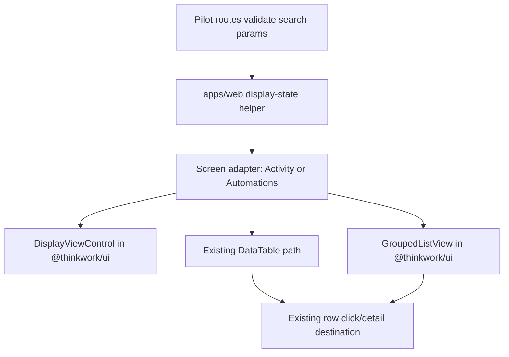
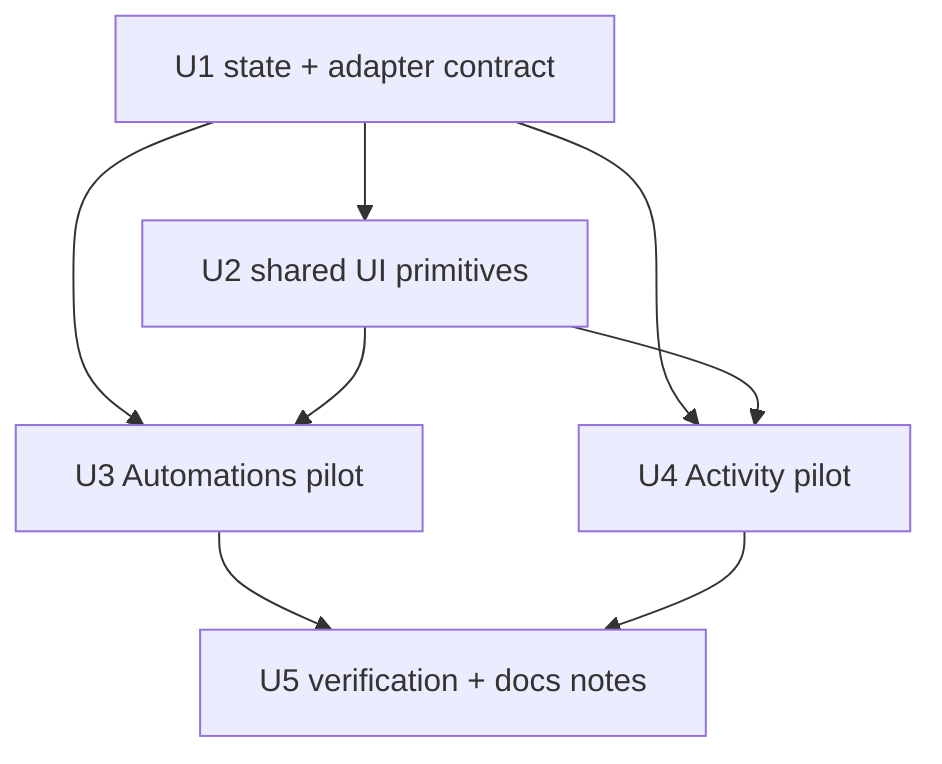

# feat: Add reusable List View and Display configuration

## Overview

Add a ThinkWork-native List View pattern for row collections and a controlled Display configuration popover that can switch eligible screens between Table and List. V1 proves the pattern on Settings Activity and Settings Automations, preserving both screens' existing data sources, search/filter context, row navigation, loading/error/empty states, and the current Table path.

The reusable work should borrow the LastMile interaction model, but not the CRM/task-specific implementation. The ThinkWork version should be built from `@thinkwork/ui` primitives, typed screen-owned configuration, and TanStack Router search state.

---

## Problem Frame

ThinkWork settings surfaces currently lean on dense `DataTable` rows even when the user is scanning workflow-like records by status, owner, type, recency, or agent. Tables remain valuable for precise comparison, but grouped list scanning is better for operational review. THNK-22 asks for the LastMile-style pattern: a Display control, selectable Table/List modes, List grouping/sub-grouping/sorting/direction, empty-group toggles, and selectable row properties. The product boundary from the requirements is important: this is not a broad table rewrite, not Board/Map/Calendar, and not server-persisted saved views (see origin: `docs/brainstorms/2026-06-14-list-view-and-view-configuration-requirements.md`).

---

## Requirements Trace

- R1. Introduce a reusable List View pattern for row collections with a primary label plus metadata properties.
- R2. Keep existing Table views available on eligible screens.
- R3. Prove v1 on a small pilot set, not every table-heavy screen.
- R4. Use Settings Activity and Settings Automations as the v1 pilots.
- R5. Add a Display control on eligible screens.
- R6. Show only modes implemented for the current screen; v1 pilot screens expose Table and List only.
- R7. Support List grouping, optional sub-grouping, sort field, sort direction, and show/hide empty groups where applicable.
- R8. Support screen-owned display-property selection.
- R9. Preserve active search/filter context while changing view mode or List configuration.
- R10. Restore view/configuration through route-local search state; saved named views are not part of v1.
- R11. Render collapsible group and sub-group headers with labels and counts.
- R12. Render dense list rows with a primary title and selected metadata, not every table column.
- R13. Preserve existing row-click navigation/detail behavior from List view.
- R14. Preserve existing loading, empty, and error behavior when switching modes.
- R15. Establish eligibility rules for future adoption.
- R16. Leave precision/auditing screens Table-only.
- R17. Use LastMile as interaction reference while adapting to ThinkWork patterns and `@thinkwork/ui`.

**Origin actors:** A1 ThinkWork operator, A2 ThinkWork end user, A3 implementation planner

**Origin flows:** F1 switch supported surface from Table to List, F2 configure List view, F3 use a List row as an entry point

**Origin acceptance examples:** AE1 Settings Automations filtered Table-to-List switch, AE2 Settings Activity grouping/properties, AE3 Display omits unimplemented modes, AE4 route-restored List config, AE5 row actions and states preserved

---

## Scope Boundaries

- Do not replace every ThinkWork data table in v1.
- Do not build Board, Map, Calendar, saved named views, shared defaults, or server-persisted preferences.
- Do not add backend grouping, filtering, or pagination contracts solely for this work.
- Do not turn List view into card grids or dashboard tiles.
- Do not remove existing Table behavior, row navigation, search/filter, loading, empty, error, or table pagination behavior from the pilot screens.

### Deferred to Follow-Up Work

- Future screen adoption beyond Settings Activity and Settings Automations.
- Server-side saved views, team defaults, or user preference persistence.
- Board/Map/Calendar modes if separately scoped.
- Backend grouping/pagination if a future high-volume screen cannot reasonably group client-side.

---

## Context & Research

### Relevant Code and Patterns

- `apps/web/src/components/settings/SettingsActivity.tsx` already maps thread rows into `ActivityItem`s, filters by local search and `day`, renders a custom toolbar, and navigates rows to `/settings/activity/$threadId`.
- `apps/web/src/components/settings/SettingsActivityHome.tsx` owns Activity tabs and reads route search with `useSearch({ strict: false })`, preserving the existing `day` filter pattern across Activity routes.
- `apps/web/src/routes/_authed/settings.activity.threads.tsx` validates the current `day` route search parameter and is the right route to extend with List configuration params for the Threads facet.
- `apps/web/src/components/settings/SettingsAutomations.tsx` fetches scheduled jobs, keeps local search state, renders `DataTable`, and navigates rows to `/settings/automations/$scheduledJobId`.
- `packages/ui/src/components/ui/data-table.tsx` is the current shared table primitive. It should remain table-specific; List should be a sibling primitive rather than overloading DataTable internals.
- `packages/ui/src/components/ui/popover.tsx`, `select.tsx`, `switch.tsx`, `toggle-group.tsx`, `badge.tsx`, `button.tsx`, and `collapsible.tsx` provide the needed Display/List building blocks.
- `apps/web/src/routes/_authed/_shell/memory.brain.tsx` and `memory.pages.tsx` show the local TanStack Router pattern for route-backed `view` state with validation and `replace: true`.
- LastMile reference, in `lastmile/web-apps` repo-relative paths:
  - `apps/lmi/src/components/header/header-display.tsx` shows the Display popover model: enabled view list, view-specific sections, grouping/sub-grouping/sorting/direction, empty toggles, and display properties.
  - `apps/lmi/src/app/[locale]/(crm)/opportunities/opportunity-display.tsx` shows screen-owned options for supported modes.
  - `apps/lmi/src/components/list-view/list-view-controlled.tsx` and `apps/lmi/src/components/tasks/task-list-view.tsx` show the dense grouped-list projection and collapsible group headers.

### Institutional Learnings

- `docs/solutions/design-patterns/audit-existing-ui-and-data-model-before-parallel-build-2026-04-28.md` applies here as a planning caution: audit and reuse existing UI/data patterns before building a parallel surface. This plan reuses Settings list panes, route search state, `@thinkwork/ui` primitives, and existing screen row models rather than adding a new backend or separate app surface.
- `docs/plans/2026-06-05-004-feat-spaces-settings-activity-plan.md` is the closest recent Activity/settings precedent: keep Activity route state explicit, preserve row drill-in context, and prefer local helpers over cross-app coupling.
- `docs/plans/2026-05-16-004-refactor-datatable-fixed-40px-row-height-plan.md` reinforces that `DataTable` has a deliberately dense, clipped table contract. List View should not mutate that table contract for all callers.

### External References

- None. Local React 19, TanStack Router, TanStack Table, Radix/shadcn-style primitives, and LastMile source are sufficient.

---

## Key Technical Decisions

- Build List View as a sibling controlled primitive to `DataTable`, not a mode inside `DataTable`. This keeps table sorting/pagination behavior stable while giving List its own grouped rendering contract.
- Put reusable visual primitives in `@thinkwork/ui`; put ThinkWork screen adapters and route-state validation in `apps/web`. The shared package should know about generic rows/groups/properties, not Settings Activity or scheduled jobs.
- Use TanStack Router search params for v1 restoration: `view`, `group`, `subgroup`, `sort`, `dir`, `emptyGroups`, `emptySubgroups`, and `props`. Invalid or unsupported values fall back to each screen's defaults.
- Keep search/filter state screen-owned. Display/List changes operate on the same already-filtered row collection so AE1 and R9 hold without introducing a global list-state store.
- Default both pilots to Table. List configuration is restored when present or when the user selects List, but v1 should not surprise existing users by changing first-load behavior.
- Use screen-owned adapters for labels, group keys, sort comparators, empty group definitions, row title, metadata properties, and row-click behavior.
- Treat Table pagination as unchanged. V1 List view renders the filtered client-side pilot collection as a scrollable grouped list; if a future screen requires server pagination, that is a follow-up backend contract.

---

## Open Questions

### Resolved During Planning

- Which two pilot surfaces should v1 use? Resolved: Settings Activity and Settings Automations. Both already have row metadata suited to status/type/owner/recency scanning and existing tests/utilities to extend.
- Should v1 persist Display configuration through route search params or local component state? Resolved: route search params. This directly satisfies R10/AE4 and matches existing web patterns for `view` and `day`.
- What are the pilot defaults?
  - Settings Activity: Table default; List defaults to group by recency, sub-group by status, sort by updated desc, visible properties `status`, `type`, `agent`, `duration`, `cost`, `updated`.
  - Settings Automations: Table default; List defaults to group by status, sub-group by trigger type, sort by name asc, visible properties `type`, `schedule`, `owner`, `lastRun`.
- Should Board from the LastMile screenshot appear disabled? Resolved: no. Display offers only Table and List on v1 pilots.

### Deferred to Implementation

- Exact component/file names may adjust to match local style once implementation starts, but the split between shared primitives, shared app helpers, and screen adapters should remain.
- Exact responsive spacing for the Display popover and grouped rows should be tuned with browser screenshots after the first implementation pass.

---

## High-Level Technical Design

> _This illustrates the intended approach and is directional guidance for review, not implementation specification. The implementing agent should treat it as context, not code to reproduce._

---

## Implementation Units

- U1. **Define Display/List state and adapter contracts**

**Goal:** Create the typed route-state and row-adapter foundation used by shared UI components and pilot screens.

**Requirements:** R1, R5, R6, R7, R8, R9, R10, R15, R16, R17; supports F1 and F2

**Dependencies:** None

**Files:**

- Create: `apps/web/src/lib/list-view-display.ts`
- Test: `apps/web/src/lib/list-view-display.test.ts`

**Approach:**

- Define shared app-level types for view mode, grouping option, sorting option, display property, sort direction, and normalized display state.
- Add validators/normalizers that accept raw route search values and a screen config, then return a supported state with screen defaults.
- Use stable compact route param names: `view`, `group`, `subgroup`, `sort`, `dir`, `emptyGroups`, `emptySubgroups`, and `props`.
- Ensure unsupported modes and options are dropped rather than rendered as disabled UI.
- Provide pure grouping/sorting helpers that operate on an already-filtered row array and a screen-owned adapter.
- Model empty groups as optional adapter-provided definitions so Activity can expose recency/status buckets and Automations can expose active/disabled/type buckets without hard-coding either screen into shared UI.

**Patterns to follow:**

- `apps/web/src/routes/_authed/_shell/memory.brain.tsx`
- `apps/web/src/routes/_authed/settings.activity.threads.tsx`
- `apps/web/src/lib/settings-activity.ts`
- LastMile reference: `apps/lmi/src/components/header/header-display.tsx`

**Test scenarios:**

- Happy path: valid route search for List mode, grouping, sub-grouping, sort, direction, empty toggles, and properties normalizes to the same values.
- Covers AE3: unsupported mode values such as `board`, `map`, or `calendar` normalize away when the screen supports only Table/List.
- Covers AE4: serialized List config round-trips through parse/normalize without needing server persistence.
- Edge case: unknown grouping/sorting/property values are removed and replaced with screen defaults.
- Edge case: sub-grouping equal to grouping is reset to `none` or the screen default.
- Happy path: grouping/sorting helpers receive a filtered row list and preserve row identity for downstream row-click behavior.

**Verification:**

- Route search parsing is deterministic and screen-scoped.
- The helper can be used by both pilot screens without importing React or UI components.

---

- U2. **Add shared Display and Grouped List primitives to `@thinkwork/ui`**

**Goal:** Provide reusable controlled UI primitives for the Display popover and dense grouped list rendering.

**Requirements:** R1, R5, R6, R7, R8, R11, R12, R17; supports F1, F2, AE2, AE3

**Dependencies:** U1 for the app contract shape; UI package should stay generic and may define parallel package-local prop types rather than importing from `apps/web`.

**Files:**

- Create: `packages/ui/src/components/ui/display-view-control.tsx`
- Create: `packages/ui/src/components/ui/grouped-list-view.tsx`
- Modify: `packages/ui/src/index.ts`
- Test: `packages/ui/test/display-view-control.test.tsx`
- Test: `packages/ui/test/grouped-list-view.test.tsx`
- Test: `packages/ui/test/exports.test.ts`

**Approach:**

- Implement a controlled `DisplayViewControl` with:
  - mode buttons for only the supplied modes
  - List-only grouping, sub-grouping, sort, direction, empty-group toggles, and display-property toggles
  - no internal route knowledge
  - icons from `lucide-react`
  - compact, Settings-compatible Popover layout using existing `Button`, `Select`, `Switch`, `Badge`, `Separator`, and tooltip-friendly button labels where useful
- Implement `GroupedListView` as a dense list primitive with:
  - optional group and sub-group headers
  - collapsible group state controlled internally or via callbacks
  - counts on group headers
  - a row render prop so screens own titles, chips, and click affordances
  - screen-provided empty state
  - fixed, stable layout constraints so group toggles and row metadata do not shift row geometry unexpectedly
- Keep `DataTable` unchanged. Shared List primitives should not change existing table behavior or exported table props.

**Patterns to follow:**

- `packages/ui/src/components/ui/data-table.tsx` for package style, tests, and export conventions
- `packages/ui/src/components/ui/popover.tsx`
- `packages/ui/src/components/ui/select.tsx`
- `packages/ui/src/components/ui/collapsible.tsx`
- LastMile reference: `apps/lmi/src/components/list-view/list-view-controlled.tsx`

**Test scenarios:**

- Covers AE3: when `modes=["table", "list"]`, Display renders Table and List controls and does not render Board, Map, or Calendar.
- Happy path: selecting List calls `onStateChange` with the next view mode and leaves other config intact.
- Happy path: changing grouping, sub-grouping, sort, direction, and properties emits controlled updates.
- Edge case: sub-grouping options exclude the currently selected primary grouping.
- Covers AE2: grouped list renders group headers with labels/counts and selected row metadata from the row render prop.
- Edge case: collapsing a group hides its rows and preserves other group expansion states.
- Empty state: no rows renders the supplied empty state rather than a table-flavored fallback.

**Verification:**

- `@thinkwork/ui` exports the new primitives.
- Existing `DataTable` tests continue to pass without behavior changes.
- Shared primitives are generic enough that both pilot screens can use them without screen-specific branches.

---

- U3. **Adopt Display/List on Settings Automations**

**Goal:** Wire the shared Display/List pattern into Settings Automations while preserving current search, table, row navigation, loading, error, and empty behavior.

**Requirements:** R2, R3, R4, R5, R6, R7, R8, R9, R10, R11, R12, R13, R14; covers F1, F2, F3, AE1, AE3, AE4, AE5

**Dependencies:** U1, U2

**Files:**

- Modify: `apps/web/src/routes/_authed/settings.automations.index.tsx`
- Modify: `apps/web/src/components/settings/SettingsAutomations.tsx`
- Create: `apps/web/src/components/settings/SettingsAutomations.test.tsx`
- Test: `apps/web/src/routes/_authed/_shell/-automations.$scheduledJobId.test.tsx` if route navigation assertions need adjustment

**Approach:**

- Extend the Automations route with `validateSearch` using U1's normalizer and Table/List-only supported modes.
- Read normalized display state in the route or component, update route search with `replace: true`, and pass state into `DisplayViewControl`.
- Keep the existing local search input and apply it before Table/List projection so switching modes preserves active search context.
- Keep the current `DataTable` path intact for Table mode, including `pageSize={25}`, empty state, and row click navigation.
- Add an Automations list adapter:
  - group options: `status`, `type`, `owner`, `none`
  - sub-group options: `type`, `owner`, `status`, `none`
  - sort options: `name`, `lastRun`, `schedule`, `status`, `type`
  - default List config: group `status`, sub-group `type`, sort `name` asc
  - properties: `type`, `schedule`, `owner`, `status`, `lastRun`
- Render List rows with the scheduled job name as the primary title, optional description as secondary text, and selected metadata chips/text. Reuse existing formatting helpers such as `formatSchedule`, `JOB_TYPE_LABELS`, `relativeTime`, and the existing enabled/status visuals.
- Preserve row click navigation to `/settings/automations/$scheduledJobId` from both Table and List rows.
- Use screen-specific loading/error/empty branches already present in `SettingsTablePane`; List only replaces the row collection renderer once data is available.

**Patterns to follow:**

- `apps/web/src/components/settings/SettingsAutomations.tsx`
- `apps/web/src/routes/_authed/settings.automations.index.tsx`
- `apps/web/src/routes/_authed/_shell/-automations.utils.ts`
- `apps/web/src/routes/_authed/_shell/-automations.$scheduledJobId.test.tsx`

**Test scenarios:**

- Covers AE1: with search text active, switching from Table to List keeps the filtered automations and does not show non-matching rows.
- Covers AE3: the Automations Display control renders only Table and List modes.
- Covers AE4: List route search for view/group/subgroup/sort/direction/properties restores the List view after component mount.
- Covers AE5: clicking an automation List row navigates to the same scheduled job detail route as the Table row.
- Error path: failed job fetch still renders the existing error message and does not render stale List rows.
- Empty state: no jobs renders the existing no-automations message in both modes.
- Edge case: an unsupported route property such as `props=unknown` is ignored and default visible properties are used.

**Verification:**

- Existing Automations table behavior is unchanged when `view` is absent or `view=table`.
- Automations List mode supports grouping/sub-grouping/sorting/properties from route state and the Display popover.
- Search context is preserved while switching modes and changing List options.

---

- U4. **Adopt Display/List on Settings Activity**

**Goal:** Wire the shared Display/List pattern into the Activity Threads facet while preserving Activity analytics tabs, day filter behavior, table row navigation, subscriptions, loading/error/empty states, and existing Activity tests.

**Requirements:** R2, R3, R4, R5, R6, R7, R8, R9, R10, R11, R12, R13, R14; covers F1, F2, F3, AE2, AE3, AE4, AE5

**Dependencies:** U1, U2

**Files:**

- Modify: `apps/web/src/routes/_authed/settings.activity.threads.tsx`
- Modify: `apps/web/src/routes/_authed/settings.activity_.$threadId.tsx` only if search validation needs to preserve display params on back links; otherwise keep detail route day-only
- Modify: `apps/web/src/components/settings/SettingsActivityHome.tsx`
- Modify: `apps/web/src/components/settings/SettingsActivity.tsx`
- Modify: `apps/web/src/lib/settings-activity.ts`
- Test: `apps/web/src/lib/settings-activity.test.ts`
- Test: `apps/web/src/components/settings/SettingsActivity.test.tsx`
- Test: `apps/web/src/components/settings/SettingsActivityHome.test.tsx`

**Approach:**

- Extend the Threads route search validation to include Display/List params alongside the existing `day` filter.
- Preserve `day` semantics exactly: chart clicks and Clear date continue to update only `day`, while Display changes preserve current `day` and search text.
- Update `SettingsActivityHome` loose search coercion so it passes both `selectedDay` and normalized display state to the Threads facet without affecting the Analytics facet.
- Keep the current `DataTable` path intact for Table mode, including `hideHeader`, `pageSize={10}`, chart/toolbar placement, subscriptions, and row click navigation.
- Add Activity list adapter:
  - group options: `recency`, `status`, `type`, `agent`, `none`
  - sub-group options: `status`, `type`, `agent`, `none`
  - sort options: `updated`, `title`, `status`, `type`, `cost`, `duration`
  - default List config: group `recency`, sub-group `status`, sort `updated` desc
  - properties: `status`, `type`, `agent`, `duration`, `cost`, `updated`
- Extend `settings-activity.ts` with pure helper functions for recency labels/buckets, Activity sort comparators, property value formatting, and empty group definitions where safe.
- Render List rows with the existing `InlineShortcutText` title behavior and selected metadata chips/text. Keep status/type colors from existing constants.
- Preserve row click navigation to `/settings/activity/$threadId` with the existing `day` search value and title fallback state.

**Patterns to follow:**

- `apps/web/src/components/settings/SettingsActivity.tsx`
- `apps/web/src/components/settings/SettingsActivityHome.tsx`
- `apps/web/src/routes/_authed/settings.activity.threads.tsx`
- `apps/web/src/lib/settings-activity.ts`
- `docs/plans/2026-06-05-004-feat-spaces-settings-activity-plan.md`

**Test scenarios:**

- Covers AE2: grouping Activity by recency/status renders collapsible group headers with counts and selected metadata only.
- Covers AE3: the Activity Display control renders only Table and List modes.
- Covers AE4: List route search restores view, grouping, sub-grouping, sort, direction, empty toggles, selected properties, and `day` together.
- Covers AE5: clicking an Activity List row navigates to the same thread detail route and preserves the selected `day` search.
- Happy path: changing Display options does not reset local search text or selected chart day.
- Integration: thread and turn subscriptions still trigger network refresh while in List mode.
- Edge case: invalid `day` plus valid List config drops only the invalid day and keeps valid display config.
- Empty/loading/error: current loading shimmer, GraphQL error message, and "No activity" empty state remain coherent in both modes.

**Verification:**

- Activity Analytics tab remains unaffected.
- Threads Table mode remains the default when no `view` search param is present.
- Activity List mode composes with chart day filtering, search, refresh, subscriptions, and row drill-in.

---

- U5. **Verification, documentation notes, and rollout hardening**

**Goal:** Confirm the shared primitives and pilots behave together, document adoption rules for future screens, and make rollout safe.

**Requirements:** R3, R14, R15, R16, R17; supports all acceptance examples

**Dependencies:** U3, U4

**Files:**

- Modify: `docs/plans/2026-06-14-005-feat-list-view-display-configuration-plan.md` only if implementation discovers a plan correction before work begins
- Create or modify: `docs/solutions/design-patterns/reusable-list-view-display-configuration.md` only if implementation reveals a reusable adoption pattern worth compounding
- Test: no new test file required beyond U1-U4 unless browser verification exposes a missing integration scenario

**Approach:**

- Run focused web and UI test coverage for the files touched in U1-U4.
- Run typecheck for `@thinkwork/ui` and `@thinkwork/web` because this crosses a shared package boundary.
- Use the web dev server with the worktree `.env` copied from the main checkout before browser verification.
- Browser-check `/settings/automations` and `/settings/activity/threads` at desktop and narrow widths:
  - Display popover opens without clipping important controls
  - only Table/List modes appear
  - List groups collapse/expand
  - selected properties affect rows
  - search/day filters survive Display changes
  - row click navigation still works
  - Table view remains available and visually unchanged
- Capture any reusable future-adoption rule only after implementation confirms it, especially the screen adapter shape and when not to adopt List view.

**Patterns to follow:**

- Existing web worktree env guidance in `AGENTS.md`
- `docs/solutions/design-patterns/audit-existing-ui-and-data-model-before-parallel-build-2026-04-28.md`

**Test scenarios:**

- Integration: switching between Table/List repeatedly does not lose active search or valid route search state.
- Integration: browser refresh on a List route restores the same mode/config and still fetches the correct screen data.
- Visual regression: Display popover and grouped List rows do not overlap toolbar text, pagination, or row metadata at representative desktop/narrow widths.
- Regression: unrelated `DataTable` callers compile and continue to use the existing table-only API.

**Verification:**

- All unit/component tests added in U1-U4 pass.
- `@thinkwork/ui` and `@thinkwork/web` typecheck cleanly.
- Manual/browser verification confirms both pilot screens meet AE1-AE5.

---

## System-Wide Impact

- **Interaction graph:** Settings routes own search validation; screen components own current filters/data; `@thinkwork/ui` owns controlled display/list rendering; existing detail routes continue to own row destinations.
- **Error propagation:** Shared UI primitives should not catch data errors. Activity GraphQL errors and Automations API errors remain screen-specific, exactly as they are today.
- **State lifecycle risks:** Route search params may outlive a screen's supported options. U1 normalization must drop unsupported values so a stale shared URL cannot advertise nonexistent modes or crash rendering.
- **API surface parity:** The shared UI package gains new exports. Existing `DataTable` API remains unchanged.
- **Integration coverage:** Unit tests prove normalization and rendering; component tests prove pilot wiring; browser checks prove popover/layout behavior that jsdom cannot reliably validate.
- **Unchanged invariants:** No backend contracts, GraphQL schema, scheduled job API, thread data source, auth behavior, or server-side pagination changes are part of v1.

---

## Risks & Dependencies

| Risk                                                        | Mitigation                                                                                                                      |
| ----------------------------------------------------------- | ------------------------------------------------------------------------------------------------------------------------------- |
| Shared primitive becomes too screen-specific                | Keep screen adapters in `apps/web` and `@thinkwork/ui` props generic; no Activity or Automation branches in package components. |
| Route params conflict with existing Activity `day` behavior | Extend validation carefully and test `day` plus display params together; Display updates preserve `day`.                        |
| List mode accidentally changes Table behavior               | Keep List as a sibling renderer and retain current `DataTable` props/tests.                                                     |
| Grouped List is visually too loose or card-like             | Use dense rows, compact metadata, section headers, and browser review against the LastMile screenshots.                         |
| Client-side grouping feels slow on larger future screens    | V1 pilots already load bounded/client-side row sets. Backend grouping is deferred until a future adopter proves it is needed.   |
| Unsupported shared URLs expose unimplemented modes          | Normalize unsupported modes/options out of route state and render only supplied mode buttons.                                   |

---

## Documentation / Operational Notes

- Roll out behind normal code review; no database migration, feature flag, or backend deploy sequencing is required.
- V1 should land as a web/UI change with shared package tests and focused browser verification.
- If the implementation produces a clean reusable adapter pattern, compound it under `docs/solutions/design-patterns/` so future List View adoption can be planned without re-reading THNK-22.
- Keep the Linear issue in review until the plan has been accepted and the implementation agent can verify worktree env availability for browser checks.

---

## Sources & References

- **Origin document:** [docs/brainstorms/2026-06-14-list-view-and-view-configuration-requirements.md](../brainstorms/2026-06-14-list-view-and-view-configuration-requirements.md)
- **Linear issue:** THNK-22 List View
- **Linear document:** Requirements: List View and View Configuration
- **ThinkWork code:** `apps/web/src/components/settings/SettingsActivity.tsx`
- **ThinkWork code:** `apps/web/src/components/settings/SettingsAutomations.tsx`
- **ThinkWork code:** `apps/web/src/lib/settings-activity.ts`
- **ThinkWork code:** `packages/ui/src/components/ui/data-table.tsx`
- **LastMile reference:** `apps/lmi/src/components/header/header-display.tsx` in the `lastmile/web-apps` repo
- **LastMile reference:** `apps/lmi/src/components/list-view/list-view-controlled.tsx` in the `lastmile/web-apps` repo
- **Institutional learning:** `docs/solutions/design-patterns/audit-existing-ui-and-data-model-before-parallel-build-2026-04-28.md`
- **Related plan:** `docs/plans/2026-06-05-004-feat-spaces-settings-activity-plan.md`
