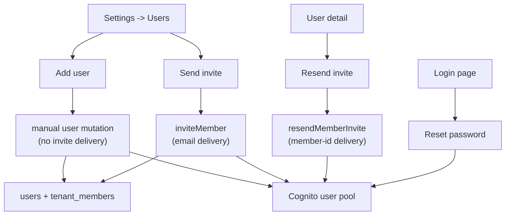
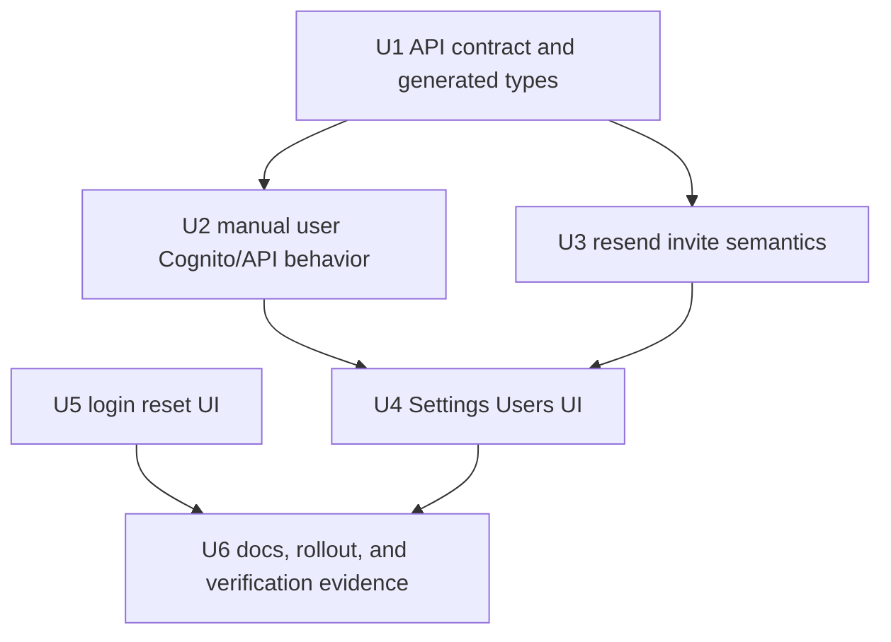
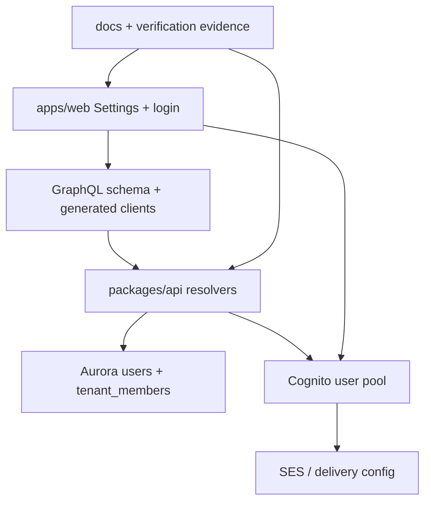

# feat: Manual user setup and password reset

## Overview

THNK-29 adds three deliberately separate account setup paths:

| Path                        | Operator or user intent                                      | Delivery side effect         | Primary surface                   |
| --------------------------- | ------------------------------------------------------------ | ---------------------------- | --------------------------------- |
| Add user                    | Create tenant access without emailing the user               | No invite email              | Settings -> Users                 |
| Send invite / Resend invite | Attempt an email-backed setup message                        | Cognito/SES delivery attempt | Settings -> Users and user detail |
| Reset password              | Let a password-capable user establish or recover credentials | Cognito reset-code email     | Login page                        |

The implementation should split API contracts before refining UI copy. Today,
`inviteMember` is both "create member" and "maybe resend invite"; THNK-28
proved that idempotency replay can report success without a Cognito resend
attempt. The new plan keeps email delivery paths explicit, creates manual users
without exposing passwords to operators, and adds a login-page reset flow that
password users can complete without operator intervention.

---

## Problem Frame

Operators need to pre-provision a user for a tenant without sending an
invitation email immediately, while still retaining a trustworthy email invite
path when they do want Cognito to send a setup message (see origin:
`docs/brainstorms/2026-06-15-manual-setup-requirements.md`). Manually added
users must have a self-service way to establish credentials from the login page,
and the UI must stop implying that an email was sent when no new delivery
attempt happened.

The work is authentication-sensitive and spans GraphQL, Cognito, generated
client types, web Settings UI, and login UI. It must preserve tenant-admin
authorization before any Cognito/SES side effect.

---

## Requirements Trace

**Settings user setup**

- R1. Users page presents Add user and Send invite as distinct primary actions
  with clear plus/add and send/email iconography.
- R2. Add user creates tenant access without sending or claiming to send an
  invitation email.
- R3. Add user collects email, optional display name, and role for v1.
- R4. Add user refreshes the users list with accurate role/status and explicit
  duplicate/already-member handling.

**Invite and resend delivery**

- R5. Send invite remains an email-delivery action with invitation-specific
  naming, iconography, and messaging.
- R6. Invite and resend success must not be reused from an earlier
  create/invite idempotency result when no new delivery attempt happened.
- R7. Email delivery, Cognito configuration, and sandbox failures are visible to
  the operator; success text means a delivery attempt actually occurred.

**Login password reset**

- R8. Login exposes Reset password when email/password sign-in is available.
- R9. Reset password supports request-code, code plus new password, confirmation,
  and return-to-sign-in behavior.
- R10. Reset copy avoids casual account enumeration while surfacing real
  configuration, rate-limit, or recovery failures.
- R11. Google OAuth remains preferred for federated users; reset is for password
  users and manually added password-capable users.

**Authorization, credentials, and table usability**

- R12. Manual add, invite, resend, role assignment, and removal remain
  operator-only capabilities.
- R13. Operators never create, view, copy, or distribute a user's password.
- R14. Search/table operations remain usable while setup actions stay easy to
  discover at the top of the Users surface.

**Origin actors:** A1 Operator, A2 Manual user, A3 Invited user, A4 Password
user.

**Origin flows:** F1 Manual user setup, F2 Invite by email, F3 Password reset
from login.

**Origin acceptance examples:** AE1 manual add without invite copy, AE2 delivery
failure does not show invite success, AE3 duplicate active member is explicit,
AE4 reset code flow enables sign-in, AE5 non-operator cannot access user
management actions.

---

## Scope Boundaries

- No bulk import, SCIM, Google Workspace directory sync, external IdP
  provisioning, or tenant self-join flow.
- No operator-visible password assignment or password copy/paste workflow.
- No change to Google OAuth account creation, hosted OAuth behavior, or the
  "Create one" environment-onboarding path.
- No mobile-specific reset UI change unless implementation discovers the web
  component is safely shared; mobile already has a separate forgot-password
  screen.
- No requirement to add a new persistent "manual" tenant-member status if
  membership plus Cognito state can communicate the state accurately after the
  manual-add Cognito sequence is validated.
- No "manual add now, send setup email later" flow in v1. Manually added users
  establish credentials through Reset password or approved out-of-band guidance
  to use Reset password. Send invite remains for operators who want email
  delivery at setup time.
- No broad CLI or legacy tenant-handler behavior change. THNK-29 should audit
  those surfaces for contradiction, but web GraphQL Settings and login are the
  product scope.

### Deferred to Follow-Up Work

- Broader account-management controls such as MFA reset, disabling users, and
  operator-triggered admin reset are outside this implementation unless needed
  to satisfy the login-page reset path.
- SES production-access remediation is an operational prerequisite for broad
  live email delivery, but not a UI feature in this plan.

---

## Context & Research

### Relevant Code and Patterns

- `apps/web/src/components/settings/SettingsUsers.tsx` currently has one
  `+ Invite member` action and one invite dialog wired to
  `SettingsInviteMemberMutation`.
- `apps/web/src/components/settings/SettingsUserDetail.tsx` currently resends by
  calling `inviteMember` and shows "Invite resent" after any GraphQL success.
- `apps/web/src/lib/settings-queries.ts` is the typed GraphQL document home for
  Settings. Generated web types live under `apps/web/src/gql/`.
- `apps/web/src/lib/auth.ts` already exposes `forgotPassword` and
  `confirmForgotPassword`.
- `apps/web/src/components/auth/EmailPasswordForm.tsx` handles sign-in and
  `NEW_PASSWORD_REQUIRED`, but has no reset-password state.
- `packages/database-pg/graphql/types/core.graphql` defines canonical GraphQL
  inputs and mutations. Edits require schema/codegen updates in consumers.
- `packages/api/src/graphql/resolvers/core/inviteMember.mutation.ts` gates with
  `requireTenantAdmin`, wraps delivery in `runWithIdempotency`, creates Cognito
  users with email delivery, and has a pending-user `MessageAction=RESEND`
  branch.
- `packages/api/src/graphql/resolvers/core/addTenantMember.mutation.ts` only
  links an existing principal ID; it is not an operator-ready manual user setup
  flow.
- `packages/api/src/graphql/resolvers/core/tenantMembers.query.ts` resolves
  `cognitoStatus` through Cognito `AdminGetUser`.
- `terraform/modules/foundation/cognito/main.tf` configures verified-email
  account recovery and seven-day temporary passwords.
- `terraform/modules/app/lambda-api/iam-grouped.tf` currently grants
  `AdminCreateUser`, `AdminGetUser`, `AdminUpdateUserAttributes`, and
  `ListUsers`; a manual password-capable user strategy may require
  `AdminSetUserPassword`.

### Institutional Learnings

- `docs/solutions/integration-issues/tei-resend-invite-idempotency-and-ses-sandbox-2026-06-15.md`:
  THNK-28 showed `Invite resent` can be a false success when `inviteMember`
  idempotency replays a prior result and never reaches Cognito.
- `docs/solutions/integration-issues/controller-vars-allowlist-blocks-cognito-ses-invite-emails.md`:
  `AdminCreateUser` success and `FORCE_CHANGE_PASSWORD` prove account creation,
  not inbox delivery. Verification needs Cognito/SES evidence.
- `docs/solutions/best-practices/every-admin-mutation-requires-requiretenantadmin-2026-04-22.md`:
  admin-reachable mutations must call `requireTenantAdmin(ctx, tenantId)` before
  Cognito/SES side effects, and row-derived tenant IDs are required for existing
  rows.
- `docs/src/content/docs/applications/cli/commands.mdx`: the CLI already treats
  reset password as Cognito-backed account recovery, useful for locked or
  `FORCE_CHANGE_PASSWORD` users.

### External References

- AWS Cognito `AdminCreateUser` documentation: default behavior sends a welcome
  message, `MessageAction=SUPPRESS` suppresses delivery, and
  `MessageAction=RESEND` is the explicit resend path.
- AWS Cognito `ForgotPassword` documentation: requests a reset code through the
  pool's account-recovery configuration and can fail for missing users,
  ineligible users, delivery/configuration errors, or rate limits.
- AWS Cognito `ConfirmForgotPassword` documentation: accepts the delivered code
  plus a new password and returns an empty success response.

---

## Key Technical Decisions

- Add dedicated GraphQL contracts for manual add and resend instead of adding a
  mode flag to `inviteMember`. This prevents email and non-email flows from
  sharing idempotency semantics and gives UI copy trustworthy result shapes.
- Implement manual add as password-capable Cognito creation without invite
  delivery. The preferred backing strategy is:
  `AdminCreateUser(MessageAction=SUPPRESS)` to create/resolve the user without
  email, followed by setting a generated permanent password that is never
  exposed, so login-page `ForgotPassword` can establish the user's real password.
  Implementation must validate this against real Cognito behavior before
  inserting the tenant-member row.
- Generate hidden manual-user passwords with a cryptographically secure generator
  and hold them only long enough to call Cognito. They must never enter GraphQL
  inputs/results, idempotency records, logs, telemetry, error strings, or
  durable verification artifacts.
- Require action-scoped idempotency keys for human setup actions. The UI must
  generate a per-submit operation attempt ID and reuse it only for transport
  retry of the same submit; a later human click must get a fresh attempt ID.
- Keep `inviteMember` as the create-and-send invite path, but make delivery
  failures propagate visibly. Success copy means Cognito accepted a create/send
  attempt, not that the recipient opened or received the message.
- Add a dedicated `resendMemberInvite` mutation keyed by tenant member ID, not
  free-form email. It should resolve tenant/user from the row, gate by that
  tenant, allow only resendable Cognito statuses, call `AdminCreateUser` with
  `MessageAction=RESEND`, and return typed outcomes.
- Enforce role boundaries on create paths. Owners may create owners; admins may
  create members/admins but not owners. This aligns create/invite with the
  existing role-change protection in user detail.
- Derive user-facing credential/access labels from membership and Cognito state
  when those fields can distinguish setup states. If the validated manual-add
  sequence collapses manual unclaimed users into the same state as active
  confirmed users, add a small persistent marker or status before building UI
  badge logic.
- Add reset-password UI inside or adjacent to `EmailPasswordForm` so it shares
  existing auth configuration and sign-in styling.
- Use neutral request-code copy for unknown/nonexistent accounts, but surface
  actionable errors for auth not configured, delivery configuration/rate-limit
  failures, expired/mismatched codes, and password-policy failures.

---

## Open Questions

### Resolved During Planning

- Should resend use a new mutation? Yes. THNK-28 shows the shared
  `inviteMember` idempotency namespace makes success untrustworthy for resend.
- Should manual add reuse `addTenantMember`? No. It only accepts a principal ID
  and cannot create the password-capable Cognito/user row from an email.
- Where should Add user and Send invite live? In the Users header action area,
  with search remaining in the table toolbar. On narrow layouts, stack or wrap
  the two actions above the search/table controls while preserving distinct
  accessible names and touch targets.
- Should operators handle passwords? No. Generated or temporary credentials must
  never be displayed or copied by operators.
- Can manual users be invited later? Not in v1. Add user intentionally avoids
  email delivery; Send invite is the email-backed setup path. Manual users need
  Reset password guidance rather than a later "send setup email" action.
- Are status labels still deferred? The exact component copy can be tuned during
  implementation, but the state/action matrix in U4 is the plan-owned baseline.

### Deferred to Implementation

- Exact manual-add Cognito sequence: confirm in code/tests and deployed smoke
  whether `AdminCreateUser(SUPPRESS)` plus `AdminSetUserPassword(Permanent=true)`
  is required for reliable login-page recovery, then grant the minimum IAM
  actions and prove credential-state repair is retry-safe.
- Exact GraphQL result type names: choose names consistent with nearby schema
  conventions during implementation.
- Whether to extract shared Cognito helpers for GraphQL and legacy tenant
  handlers: do it only if implementation would otherwise duplicate behavior or
  leave the old handler with misleading semantics.

---

## High-Level Technical Design

> _This illustrates the intended approach and is directional guidance for
> review, not implementation specification. The implementing agent should treat
> it as context, not code to reproduce._

---

## Implementation Units

- U1. **GraphQL Contract And Generated Types**

**Goal:** Define distinct API contracts for manual add and resend, regenerate
typed clients, and keep existing invite semantics available.

**Requirements:** R1, R2, R5, R6, R7, R12, R13; F1, F2; AE1, AE2.

**Dependencies:** None.

**Files:**

- Modify: `packages/database-pg/graphql/types/core.graphql`
- Modify: `packages/api/src/graphql/resolvers/core/index.ts`
- Modify: `apps/web/src/lib/settings-queries.ts`
- Modify: `apps/web/src/gql/`
- Modify: `apps/cli/src/gql/`
- Modify: `apps/mobile/src/gql/` or the local generated GraphQL output path
  used by mobile codegen
- Modify: `packages/api/src/gql/` or the local generated GraphQL output path
  used by API codegen
- Test: `packages/api/src/__tests__/graphql-contract.test.ts`

**Approach:**

- Add a manual-add mutation that accepts tenant ID plus email, optional name,
  role, and a required client-generated operation attempt ID/idempotency key.
- Add a resend mutation keyed by tenant member ID plus a required
  client-generated operation attempt ID/idempotency key.
- Prefer a typed resend result over a bare `TenantMember` so the UI can
  distinguish "delivery attempted", "not pending", and errors without parsing
  strings.
- Do not allow resend to fall back to server-derived input-hash idempotency.
  Two separate human clicks for the same member must be two separate delivery
  attempts; only transport retry of one click may replay.
- Do not remove `inviteMember`; update its documentation and typed operation
  names so it remains the email-backed invite path.
- Regenerate codegen for `apps/cli`, `apps/web`, `apps/mobile`, and
  `packages/api` after editing canonical GraphQL.

**Execution note:** Implement the schema and contract tests first; downstream UI
work depends on generated operation shapes.

**Patterns to follow:**

- Canonical schema pattern in `packages/database-pg/graphql/types/*.graphql`.
- Settings typed query pattern in `apps/web/src/lib/settings-queries.ts`.
- Existing codegen guidance in `AGENTS.md`.

**Test scenarios:**

- Happy path: schema exposes manual add, invite, and resend as distinct
  mutations with typed inputs/results.
- Contract: existing `inviteMember` remains present for CLI/web callers.
- Contract: generated web Settings operations compile against the new schema.
- Contract: manual add and resend inputs require an operation attempt ID, and
  resend has no server-derived fallback that can replay later clicks.
- Error path: no schema field shares a name or result shape that would let the
  UI treat resend as a generic invite success.

**Verification:**

- Generated types reflect the new API fields in every consumer with a codegen
  script.
- GraphQL contract tests pass and existing `inviteMember` callers still compile.

---

- U2. **Manual User API And Cognito Backing**

**Goal:** Create tenant user access without sending invite email and without
operator-visible passwords.

**Requirements:** R2, R3, R4, R8, R12, R13; F1, F3; AE1, AE3, AE4, AE5.

**Dependencies:** U1.

**Files:**

- Create: `packages/api/src/graphql/resolvers/core/addManualUser.mutation.ts`
- Modify: `packages/api/src/graphql/resolvers/core/index.ts`
- Modify: `packages/api/src/graphql/resolvers/core/authz.ts` if a shared
  owner-or-admin role helper is needed
- Modify: `packages/api/src/graphql/resolvers/core/inviteMember.mutation.ts`
  if shared Cognito/user-row helpers are extracted
- Modify: `terraform/modules/app/lambda-api/iam-grouped.tf`
- Test: `packages/api/src/__tests__/manual-user-setup.test.ts`
- Test: `packages/api/src/__tests__/core-mutations-authz.test.ts`

**Approach:**

- Gate with `requireTenantAdmin(ctx, tenantId)` before any Cognito call.
- Enforce owner-role creation rules server-side: admins can create member/admin,
  owners can create owner.
- Normalize email and detect an existing tenant member before creating new
  records or consulting idempotency replay; duplicate active membership should be
  a clear GraphQL error, not a cached prior success.
- Use Cognito admin APIs to create or resolve a native Cognito user without
  invite delivery. Preferred direction: suppress the initial invitation, set a
  generated permanent password that is never returned, set/retain verified email
  attributes needed for account recovery, and rely on login-page reset for the
  user to set their real password.
- Generate the hidden permanent password with a cryptographically secure random
  generator. Keep it in memory only long enough to call Cognito and explicitly
  exclude it from GraphQL variables, returned objects, idempotency payloads,
  logs, telemetry, errors, and test snapshots.
- Make credential-state finalization repairable. After create or lookup, inspect
  Cognito state, ensure verified email/recovery eligibility, and repeat the
  required password-finalization step until the user is in the chosen
  reset-capable state before inserting `tenant_members`.
- Add an early decision gate for state modeling: if the validated Cognito
  sequence cannot distinguish a manual unclaimed user from a confirmed active
  user, add a minimal persistent marker/status before building UI labels or
  setup actions.
- Insert or update the `users` row with the Cognito sub as the stable user ID,
  then insert `tenant_members` with `principal_type: "user"` and `status:
"active"`.
- Make the operation idempotent for network retry of one submit, but do not let
  idempotency hide a duplicate/already-member user from the operator.
- Treat partial failures as retry-safe: a retry should resolve the existing
  Cognito user, repair credential state if needed, and finish the DB link rather
  than create another account or link an unusable account.

**Execution note:** Start with API tests for gate-before-Cognito and duplicate
handling before changing resolver behavior.

**Patterns to follow:**

- Gate-before-side-effect ordering in
  `packages/api/src/graphql/resolvers/core/inviteMember.mutation.ts`.
- Workspace folder naming via
  `@thinkwork/database-pg/utils/workspace-folder-name`.
- Admin mutation guidance in
  `docs/solutions/best-practices/every-admin-mutation-requires-requiretenantadmin-2026-04-22.md`.

**Test scenarios:**

- Covers AE1. Happy path: owner/admin manually adds `new.user@example.com` as
  member; Cognito create uses no invite delivery, DB user/member rows are
  created, returned member has the requested role/status, and no password value
  is returned.
- Covers AE3. Edge case: adding an email that is already an active tenant member
  returns an explicit duplicate/already-member error and does not insert a second
  row.
- Edge case: Cognito user exists but tenant membership does not; resolver
  resolves the existing sub and creates the missing tenant member.
- Error path: non-operator member is forbidden and no Cognito command is sent.
- Error path: admin attempts to create an owner; resolver rejects before Cognito
  side effects.
- Error path: Cognito create/set-password fails; resolver surfaces a useful
  failure and does not report manual add success.
- Error path: generated password never appears in GraphQL results, idempotency
  result JSON, logs, error messages, or test snapshots.
- Integration: `AdminCreateUser(SUPPRESS)` succeeds and the password-finalization
  step fails; retry repairs Cognito before inserting or returning the tenant
  member.
- Integration: retry after Cognito succeeded but DB write failed resolves the
  existing Cognito user and completes the DB link.

**Verification:**

- API tests prove manual add has no invite delivery side effect, no password
  exposure, retry-safe credential/DB repair behavior, duplicate protection, and
  operator-only authorization.

---

- U3. **Trustworthy Invite And Resend Semantics**

**Goal:** Preserve email invite behavior while making resend success truthful and
idempotency-safe.

**Requirements:** R5, R6, R7, R12; F2; AE2, AE5.

**Dependencies:** U1.

**Files:**

- Create: `packages/api/src/graphql/resolvers/core/resendMemberInvite.mutation.ts`
- Modify: `packages/api/src/graphql/resolvers/core/inviteMember.mutation.ts`
- Modify: `packages/api/src/graphql/resolvers/core/index.ts`
- Modify: `packages/api/src/lib/idempotency.ts` only if a new helper is needed
  for resend-specific keys
- Test: `packages/api/src/__tests__/inviteMember-computer-claim.test.ts`
- Test: `packages/api/src/__tests__/resend-member-invite.test.ts`
- Test: `packages/api/src/__tests__/core-mutations-authz.test.ts`

**Approach:**

- Keep `inviteMember` for first-time send-invite submission. It should continue
  to gate first, attempt Cognito delivery, create/link user/member rows, and
  surface Cognito/SES configuration or delivery failures.
- Add `resendMemberInvite` that resolves the tenant/member/user row by member
  ID, gates on the row-derived tenant ID, checks the Cognito user status, and
  calls Cognito `AdminCreateUser` with `MessageAction=RESEND` only for
  resendable states such as `FORCE_CHANGE_PASSWORD` or `UNCONFIRMED`.
- Use a separate idempotency namespace from `inviteMember` and require a
  client-generated operation attempt ID. A retry of the same click may replay,
  but a later human resend action must use a fresh attempt ID and reach Cognito
  again.
- Return typed resend outcomes. Do not show success for confirmed users,
  non-pending users, Cognito delivery failures, sandbox failures, or skipped
  attempts.
- Audit `apps/cli/src/commands/user.ts` and `packages/api/src/handlers/tenants.ts`
  for invite/reset semantic contradictions. Extract shared Cognito user
  lookup/create helpers only if needed to keep existing CLI or legacy handler
  behavior from drifting.

**Execution note:** Add a regression test for the THNK-28 idempotency replay
case before replacing the UI call site.

**Patterns to follow:**

- Existing pending-user resend branch in
  `packages/api/src/graphql/resolvers/core/inviteMember.mutation.ts`.
- THNK-28 diagnosis in
  `docs/solutions/integration-issues/tei-resend-invite-idempotency-and-ses-sandbox-2026-06-15.md`.

**Test scenarios:**

- Covers AE2. Error path: Cognito/SES delivery failure from send invite returns
  an error and does not produce invite-sent text.
- Happy path: first send invite creates or links the Cognito user/member and
  attempts email delivery.
- Happy path: resend for `FORCE_CHANGE_PASSWORD` member calls Cognito with
  `MessageAction=RESEND` and returns a delivery-attempted result.
- Regression: an existing successful `inviteMember` idempotency row for the same
  user does not cause `resendMemberInvite` to skip Cognito.
- Regression: two separate resend clicks for the same tenant member use two
  distinct operation attempt IDs and both call Cognito; retrying one click may
  replay only that click.
- Edge case: confirmed user returns a non-resendable outcome and does not call
  `AdminCreateUser`.
- Error path: non-operator member cannot resend and no Cognito command is sent.
- Error path: missing member/user returns not found without probing arbitrary
  email addresses.

**Verification:**

- API tests prove resend uses row-derived auth, a distinct idempotency namespace,
  action-scoped idempotency, and truthful typed outcomes.

---

- U4. **Settings Users Add/Invite UX**

**Goal:** Split Add user and Send invite in the operator UI, preserve table
usability, and wire the user-detail resend button to the new resend contract.

**Requirements:** R1, R2, R3, R4, R5, R6, R7, R12, R14; F1, F2; AE1, AE2,
AE3, AE5.

**Dependencies:** U1, U2, U3.

**Files:**

- Modify: `apps/web/src/components/settings/SettingsUsers.tsx`
- Modify: `apps/web/src/components/settings/SettingsUserDetail.tsx`
- Modify: `apps/web/src/components/settings/SettingsContent.tsx` only if the
  existing header action styles need a two-action layout
- Modify: `apps/web/src/lib/settings-queries.ts`
- Test: `apps/web/src/components/settings/SettingsUsers.test.tsx`
- Test: `apps/web/src/components/settings/SettingsUserDetail.test.tsx`

**Approach:**

- Replace the single `+ Invite member` action with two header actions:
  Add user with a plus icon and Send invite with a send/email icon. The app uses
  `lucide-react`; use the closest local icon equivalent unless Tabler is already
  present during implementation.
- Keep search in the table toolbar and maintain the current row click/detail
  behavior.
- Add separate dialogs for Add user and Send invite, both collecting email,
  optional name, and role. Copy must make Add user a no-email action and Send
  invite an email-delivery action.
- Generate a fresh operation attempt ID on each Add user, Send invite, and
  Resend invite submit; reuse it only while retrying the same in-flight submit.
- Filter role options by caller role and rely on server enforcement for the
  final authority.
- Refresh the members query after success. Manual-add success copy must not
  mention an invitation email.
- Show explicit duplicate/already-member errors for Add user.
- Update user detail resend to call the dedicated resend mutation and render
  success only for delivery-attempted outcomes. Render non-resendable and
  delivery-failure outcomes distinctly.
- Derive display badges/status text from the state/action matrix below. Add a
  persistent manual/setup marker first if membership plus Cognito status cannot
  distinguish manual unclaimed users.

**Status/action matrix:**

| State source                           | Suggested visible label | Primary action          | Copy constraint                                |
| -------------------------------------- | ----------------------- | ----------------------- | ---------------------------------------------- |
| Manual add, not yet claimed            | Access added            | Reset password guidance | Never imply an invite email was sent           |
| Invite created, pending Cognito status | Invite pending          | Resend invite           | Success means delivery attempted               |
| Resend accepted by Cognito             | Invite resent           | None or wait state      | Show only after `MessageAction=RESEND` attempt |
| Confirmed/password-ready user          | Active                  | Manage role/details     | No invite/resend success copy                  |
| Non-resendable Cognito status          | Active or needs support | No resend action        | Explain resend is unavailable if surfaced      |
| Cognito/config/delivery failure        | Action failed           | Retry after correction  | State that no email was sent/resent            |

**Responsive/accessibility behavior:**

- Desktop and wide tablet: Add user and Send invite remain in the Users header
  action area; search remains in the table toolbar.
- Narrow layouts: actions may wrap or stack above the search/table controls, but
  both keep visible labels, distinct accessible names, and standard touch
  targets.
- Dialogs should return focus to the triggering action on close, submit via
  keyboard, announce validation/API errors through existing form error patterns,
  and avoid layout shifts that obscure table search or row content.

**Execution note:** Implement component tests around visible copy before doing
visual polish; this feature is copy/side-effect sensitive.

**Patterns to follow:**

- Current table/search layout in `SettingsUsers.tsx`.
- Header action patterns in `SettingsTablePane` and
  `SettingsPageTitle`.
- Existing resend tests in `SettingsUserDetail.test.tsx`.

**Test scenarios:**

- Covers AE1. Happy path: clicking Add user submits the manual-add mutation,
  refreshes the list, closes the dialog, and does not render "invite sent" or
  equivalent email copy.
- Covers AE2. Error path: Send invite delivery/configuration GraphQL error is
  visible and success copy is not shown.
- Covers AE3. Error path: duplicate Add user response displays already-member
  copy and keeps the dialog available for correction.
- Covers AE5. Access: non-operator settings navigation cannot reach Users user
  management actions; UI tests should preserve the existing operator-only
  settings nav behavior where covered locally.
- Happy path: header contains two distinct actions with accessible names Add
  user and Send invite, and table search still filters rows.
- Responsive/accessibility: narrow layout keeps both actions discoverable above
  search/table controls, focus returns after dialog close, and form errors are
  announced without trapping keyboard users.
- Status labeling: manual added, invite pending, resent, active, non-resendable,
  and delivery-failed states render the matrix labels/actions without email-copy
  ambiguity.
- Edge case: admin callers do not see owner as a selectable role; owner callers
  can preserve/create owner where permitted.
- Regression: resend button uses the dedicated resend mutation and does not call
  `inviteMember`.
- Error path: resend non-pending outcome does not show "Invite resent".

**Verification:**

- Web component tests prove the two user-management intents are visibly and
  behaviorally distinct, search/table behavior is preserved, and resend no
  longer reuses the invite mutation.

---

- U5. **Login-Page Password Reset Flow**

**Goal:** Add a self-service reset path for password users and manually added
users from the web login page.

**Requirements:** R8, R9, R10, R11, R13; F3; AE4.

**Dependencies:** None for UI shell; U2 for end-to-end manual-user validation.

**Files:**

- Modify: `apps/web/src/components/auth/EmailPasswordForm.tsx`
- Modify: `apps/web/src/lib/auth.ts` only if helper return/error shaping is
  needed
- Test: `apps/web/src/components/auth/EmailPasswordForm.test.tsx`
- Test: `apps/web/src/routes/-sign-in.test.tsx` if the sign-in route owns
  visibility or OAuth/password availability assertions

**Approach:**

- Add a Reset password link or mode inside the email/password form when the
  password form is rendered.
- Step 1: collect email and call `forgotPassword`. On success, use neutral copy
  such as checking email if an account is eligible, without confirming account
  existence.
- Step 2: collect code, new password, and confirmation; call
  `confirmForgotPassword`; return to the sign-in credentials step after success.
- Provide recovery exits in both reset steps: Back to sign in, change email or
  request a new code, resend code with rate-limit-aware disabled/loading states,
  and cancel/reset local form state.
- Map reset errors separately from sign-in errors. Neutralize unknown user/not
  eligible where appropriate, but surface auth configuration, rate limit,
  delivery failure, expired/mismatched code, and password-policy errors.
- Update the expired temporary password sign-in copy to direct users to Reset
  password instead of asking an administrator for a new password.
- Keep Google OAuth visually and behaviorally unchanged.

**Execution note:** Test the state machine first; most risk is in copy and
transitions, not visual layout.

**Patterns to follow:**

- Existing `NEW_PASSWORD_REQUIRED` state in `EmailPasswordForm.tsx`.
- Existing Cognito helpers in `apps/web/src/lib/auth.ts`.
- Mobile forgot-password flow in `apps/mobile/app/forgot-password.tsx` as
  behavioral prior art, adapted to web styling and anti-enumeration copy.

**Test scenarios:**

- Covers AE4. Happy path: user opens Reset password, submits email, submits code
  plus matching new passwords, and returns to sign-in with success guidance.
- Edge case: password and confirmation mismatch prevents confirm call and shows
  local validation.
- Edge case: user can change email/request a new code, resend code, cancel, or
  return to sign-in without stale code/password state carrying across modes.
- Error path: `UserNotFoundException` or equivalent first-step ineligibility
  uses neutral confirmation/error copy that does not casually enumerate.
- Error path: `CodeMismatchException` and `ExpiredCodeException` are explicit on
  the code step.
- Error path: `InvalidPasswordException` shows password-policy guidance.
- Error path: rate-limit/configuration/delivery failures are visible enough for
  the user/operator to understand the reset did not proceed.
- Regression: Google OAuth action and normal email/password sign-in still work
  as before.
- Regression: expired temporary password sign-in error points toward Reset
  password instead of operator password handling.

**Verification:**

- Auth component tests cover reset request, confirmation, failure modes,
  anti-enumeration copy, and unchanged Google/email sign-in paths.

---

- U6. **Documentation, Rollout, And Verification Evidence**

**Goal:** Give implementers and Verification an explicit deployed-stage checklist
for proving THNK-29 in AWS, where local-only testing cannot prove Cognito/SES
behavior.

**Requirements:** R1-R14; F1-F3; AE1-AE5.

**Dependencies:** U2, U3, U4, U5.

**Files:**

- Modify: `docs/src/content/docs/applications/cli/commands.mdx` if CLI semantics
  change or new parity notes are needed
- Modify: `docs/src/content/docs/applications/admin/authentication-and-tenancy.mdx`
  or the relevant web/admin user-management doc if visible operator behavior is
  documented there
- Inspect: `apps/cli/src/commands/user.ts`
- Inspect: `packages/api/src/handlers/tenants.ts`
- Create or modify: `docs/verification/manual-user-setup-e2e.md`
- Test: no standalone unit test required if this unit only writes docs and
  verification evidence

**Approach:**

- Document the final operator semantics: Add user creates access without email,
  Send invite attempts email delivery, Resend invite attempts delivery only for
  pending/invitable users, Reset password is user-driven.
- Record operational prerequisites for live email validation: Cognito user pool
  email configuration, SES sender authorization, SES sandbox/production status,
  and controlled recipient identity when sandboxed.
- Add an end-to-end verification artifact template that captures UI result,
  GraphQL result, Cognito status, CloudTrail event presence, SES telemetry where
  available, inbox/controlled-recipient result, and reset sign-in result.
- Add evidence redaction rules: use synthetic controlled addresses where
  possible, never commit or comment reset codes/passwords/tokens, redact
  screenshots/logs for unnecessary PII, and keep raw CloudTrail/SES/inbox
  evidence in restricted temporary storage rather than durable docs.
- Record the CLI/legacy handler parity audit outcome. If those surfaces retain
  old behavior intentionally, document that they were inspected and why web
  GraphQL is the only changed product surface for THNK-29.

**Patterns to follow:**

- Existing deployed verification style in
  `docs/verification/tei-new-environment-deployment-e2e.md`.
- Email invite diagnostics from
  `docs/solutions/integration-issues/tei-resend-invite-idempotency-and-ses-sandbox-2026-06-15.md`.

**Test scenarios:**

- Test expectation: none -- this unit is documentation and operational
  verification scaffolding. Behavioral coverage belongs to U2-U5.

**Verification:**

- Verification has a concrete checklist and evidence template before the issue
  moves from implementation to done.

---

## End-To-End Validation Criteria For Verification

Verification must run against a deployed AWS stage. Local web/component tests are
necessary but not sufficient because Cognito, SES, CloudTrail, and deployed auth
configuration determine whether the product behavior is real.

1. **Manual add without email**
   - Operator signs in as owner/admin and opens Settings -> Users.
   - Operator clicks Add user, enters `manual-thnk29-<timestamp>@...`, optional
     name, and member role.
   - UI reports manual user creation without invite/email success copy.
   - Users table shows the new row with expected role and a credential/access
     status that does not imply an invite was sent.
   - Cognito contains the user with verified email/recovery eligibility and no
     invite-delivery CloudTrail evidence for that manual-add action.
   - Operator never sees a password or temporary password.
   - Evidence uses a synthetic controlled address or redacts unnecessary PII; no
     password, token, or reset code is recorded.

2. **Duplicate manual add**
   - Operator repeats Add user for the same active tenant member.
   - UI shows already-member/duplicate copy and no duplicate row appears.
   - Cognito has no unnecessary second create/send side effect.

3. **Send invite delivery truthfulness**
   - Operator clicks Send invite for a controlled address.
   - In a configured delivery environment, UI success corresponds to a new
     Cognito create/send attempt; record the CloudTrail `AdminCreateUser` event
     and Cognito user status.
   - In a sandbox/configuration failure scenario, UI shows failure and does not
     show "Invite sent" or "Invite resent".

4. **Resend invite delivery truthfulness**
   - For a pending/resendable user, operator clicks Resend invite.
   - UI success corresponds to a new Cognito `AdminCreateUser` call with
     `MessageAction=RESEND`; record CloudTrail evidence and any SES telemetry
     available.
   - Existing `inviteMember` idempotency rows do not prevent the resend call from
     reaching Cognito.
   - Two separate resend clicks use distinct operation attempt IDs and both
     produce distinct Cognito attempts; retrying one in-flight click may replay
     only that click.
   - Confirmed/non-pending users do not show resend success or trigger Cognito
     resend.

5. **Login reset for manually added password user**
   - Manual user opens the login page, chooses Reset password, submits email,
     receives or is eligible for a reset code, enters code plus new password,
     and can sign in with the new password.
   - Unknown/ineligible first-step copy does not casually enumerate accounts.
   - Expired/mismatched code, password-policy, rate-limit, and configuration
     failures are visible and actionable.
   - Verification records that the reset worked without storing the reset code,
     password, tokens, or unredacted inbox screenshots.

6. **Access control**
   - Non-operator member cannot access Add user, Send invite, Resend invite,
     role assignment, or removal from Settings.
   - API tests or deployed probes show non-operator calls fail before Cognito/SES
     side effects.

---

## System-Wide Impact

- **Interaction graph:** Settings Users calls GraphQL for manual add, invite,
  and resend; login reset calls Cognito client-side helpers; tenant-member query
  continues to read Cognito status.
- **Error propagation:** GraphQL must preserve Cognito/SES create, resend, and
  delivery failures as operator-visible errors. Login reset should neutralize
  enumeration-sensitive first-step failures but surface configuration,
  rate-limit, code, and password-policy failures.
- **State lifecycle risks:** Cognito writes are external side effects and cannot
  be rolled back transactionally with Aurora. Manual add and invite must be
  idempotent and retry-safe for Cognito-created, credential-finalization, and
  DB-missing cases.
- **API surface parity:** Web is the primary scope. U3/U6 explicitly inspect CLI
  docs and legacy tenant handlers so existing `thinkwork user invite` and
  reset-password behavior are not accidentally contradicted.
- **Integration coverage:** Unit tests alone cannot prove email delivery. Final
  validation needs deployed Cognito/SES/CloudTrail evidence.
- **Unchanged invariants:** Google OAuth remains preferred and unchanged.
  Ordinary members remain unable to manage users. Operators never handle user
  passwords. Manual add does not create a self-join path.

---

## Risks & Dependencies

| Risk                                                                        | Mitigation                                                                                                                                         |
| --------------------------------------------------------------------------- | -------------------------------------------------------------------------------------------------------------------------------------------------- |
| Manual add creates a Cognito state that cannot use forgot-password recovery | Validate the selected Cognito sequence with API tests and deployed smoke; prefer permanent hidden generated password plus verified email if needed |
| Resend repeats THNK-28 false success                                        | Dedicated member-ID resend mutation, separate idempotency namespace, typed outcomes, and regression coverage                                       |
| Optional/actionless idempotency hides later human clicks                    | Require per-submit operation attempt IDs and disable server-derived fallback for resend                                                            |
| Cognito/SES reports success differently from inbox delivery                 | Define UI success as delivery attempt accepted, not inbox receipt; Verification captures CloudTrail/SES/inbox evidence separately                  |
| SES sandbox blocks live delivery                                            | Surface failure to operators; validate sandbox behavior with controlled verified recipients or record expected failure                             |
| Admin users can create owners through new create paths                      | Enforce owner-only owner creation server-side and filter UI role options                                                                           |
| Cognito succeeds but credential finalization or DB write fails              | Make operations retry-safe by resolving existing Cognito users, repairing credential state, and completing the missing DB link                     |
| Codegen churn misses a consumer                                             | Regenerate every package with a `codegen` script after canonical GraphQL changes                                                                   |
| Login reset copy leaks account existence                                    | Use neutral first-step copy for unknown/ineligible accounts and test exception mapping                                                             |
| Verification artifacts leak credentials or PII                              | Use controlled synthetic addresses, redact evidence, and never store reset codes, passwords, or tokens                                             |

---

## Documentation / Operational Notes

- This feature should ship through a normal PR to `main` so the GraphQL Lambda,
  web app, Terraform IAM, and generated clients deploy together.
- If `AdminSetUserPassword` is needed for manual users, update Terraform IAM in
  the same implementation PR and verify least-privilege scope against the user
  pool ARN.
- Run the deployed smoke only after a stack with the new API/web code is live.
  The repo has no local-only end-to-end mode.
- For worktree web verification, copy `apps/web/.env` from the main checkout and
  use a Cognito-allowlisted Vite port as documented in `AGENTS.md`.
- Record Verification evidence in `docs/verification/manual-user-setup-e2e.md`
  or the issue comment before moving THNK-29 beyond Verification.
- Durable verification records must be redacted. Raw CloudTrail, SES, inbox, or
  auth artifacts that contain sensitive identifiers should be kept only in
  restricted temporary storage long enough to complete review.

---

## Sources & References

- **Origin document:** `docs/brainstorms/2026-06-15-manual-setup-requirements.md`
- **Linear issue:** THNK-29 Manual Setup
- **Linear requirements document:** https://linear.app/thinkworkai/document/requirements-manual-setup-08c89899b4cd
- **Requirements PR:** https://github.com/thinkwork-ai/thinkwork/pull/2507
  merged into `main` on 2026-06-15 as
  `57c5cc71a885abf06d5edeefd9bca46df029ef24`
- **Related learning:** `docs/solutions/integration-issues/tei-resend-invite-idempotency-and-ses-sandbox-2026-06-15.md`
- **Related learning:** `docs/solutions/integration-issues/controller-vars-allowlist-blocks-cognito-ses-invite-emails.md`
- **Related learning:** `docs/solutions/best-practices/every-admin-mutation-requires-requiretenantadmin-2026-04-22.md`
- **AWS docs:** https://docs.aws.amazon.com/cognito-user-identity-pools/latest/APIReference/API_AdminCreateUser.html
- **AWS docs:** https://docs.aws.amazon.com/cognito-user-identity-pools/latest/APIReference/API_ForgotPassword.html
- **AWS docs:** https://docs.aws.amazon.com/cognito-user-identity-pools/latest/APIReference/API_ConfirmForgotPassword.html
