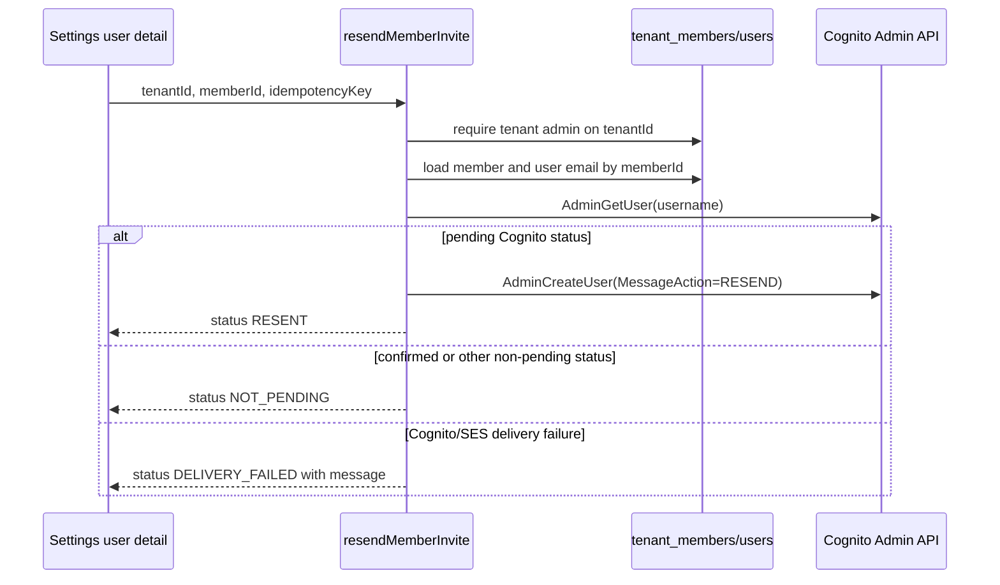

# fix: Add dedicated member invite resend flow

## Overview

Add a dedicated `resendMemberInvite` GraphQL mutation and wire the Settings user-detail resend action to it. The current UI reuses `inviteMember` with the original `{ email, name, role }` payload and no client idempotency key, so a prior successful invite can be replayed from `mutation_idempotency` before Cognito is reached. The new path should use a separate idempotency namespace, rely on server-resolved member/user state, and return a typed result that lets the UI distinguish a real resend attempt from not-pending or delivery-failure outcomes.

This should ship as one atomic implementation PR. Splitting schema, resolver, generated types, and UI wiring into separate PRs would create transient broken contracts across `packages/database-pg`, `packages/api`, and `apps/web`.

---

## Problem Frame

THNK-28 reports that TEI Settings -> Users showed **Invite resent** after Eric clicked **Resend invite**, but no email arrived. The merged debug artifact proves the click did not reach Cognito: CloudTrail for the reported window had no `AdminGetUser` or `AdminCreateUser` events for the TEI user pool. The strongest code-level cause is idempotency replay: the resend button calls `inviteMember` with the same input shape as the original invite, and `runWithIdempotency` derives the key from that input when the client does not provide `idempotencyKey`.

The fix must not mutate production, request SES production access, or run live invite/resend mutations. TEI SES sandbox remains an operational dependency that can still make delivery fail after the application resend path reaches Cognito.

---

## Requirements Trace

- R1. The Settings user-detail resend action must not reuse `inviteMember` for resend attempts.
- R2. Resend must require tenant-admin authorization before Cognito calls.
- R3. Resend must resolve the target tenant member/user server-side by member id and tenant id, not by a free-form email payload from the client.
- R4. A prior `inviteMember` idempotency row must not suppress a human resend attempt.
- R5. Resend must only report success when Cognito accepted a delivery attempt for a pending status such as `FORCE_CHANGE_PASSWORD` or `UNCONFIRMED`.
- R6. Non-pending Cognito users must return a typed not-pending result instead of sending another invitation.
- R7. Cognito/SES delivery failures must surface to the UI as failure, not as **Invite resent**.
- R8. The generated GraphQL contract must stay current in the consumers that expose codegen for this schema.
- R9. Existing CLI and agent-facing admin-ops member-management surfaces should expose the dedicated resend path instead of leaving resend as a web-only capability.

---

## Scope Boundaries

- Do not change TEI SES sandbox/production-access configuration.
- Do not perform production GraphQL resend calls, Cognito admin calls, or SES sends during implementation.
- Do not change `inviteMember` create-invite behavior except for optional helper extraction needed by the dedicated resend path.
- Do not add rate limiting in this PR unless it falls out naturally as a tiny guard; the core bug is idempotency replay and typed resend reporting.
- Do not add mobile UI for resend unless codegen requires generated mobile GraphQL type updates.
- Do not add new production/admin operations beyond narrow wrappers around the dedicated GraphQL mutation.

---

## Context & Research

### Relevant Code and Patterns

- `apps/web/src/components/settings/SettingsUserDetail.tsx` currently renders the resend button when `member.cognitoStatus` is `FORCE_CHANGE_PASSWORD` or `UNCONFIRMED`, but calls `SettingsInviteMemberMutation`.
- `apps/web/src/components/settings/SettingsUserDetail.test.tsx` has the existing resend UI regression test that currently expects `inviteMember`.
- `apps/web/src/lib/settings-queries.ts` is the typed GraphQL operation source for Settings mutations.
- `packages/database-pg/graphql/types/core.graphql` is the canonical GraphQL schema source for core mutations and types.
- `packages/api/src/graphql/resolvers/core/inviteMember.mutation.ts` contains the existing Cognito pending-user `MessageAction: "RESEND"` branch and the `RESENDABLE_INVITE_STATUSES` set.
- `packages/api/src/graphql/resolvers/core/index.ts` registers core mutation resolvers.
- `packages/api/src/lib/idempotency.ts` namespaces idempotency by `mutationName`; a new mutation name gives resend a separate namespace from `inviteMember`.
- `packages/api/src/__tests__/inviteMember-computer-claim.test.ts` demonstrates local Cognito command mocking for invite/resend behavior.

### Institutional Learnings

- `docs/solutions/integration-issues/tei-resend-invite-idempotency-and-ses-sandbox-2026-06-15.md` documents the THNK-28 causal chain and verification limits.
- `docs/solutions/workflow-issues/manually-applied-drizzle-migrations-drift-from-dev-2026-04-21.md` is relevant only as a reminder that schema work should follow documented generation paths; this fix should not require DB migrations.

### External References

- No external research is needed. The repo already contains the Cognito resend implementation pattern and the failure is caused by local idempotency behavior.

---

## Key Technical Decisions

- Add `resendMemberInvite` instead of overloading `inviteMember`: this separates create-invite idempotency from human resend attempts and removes free-form email/name/role payload trust from the resend path.
- Return a typed resend result object instead of `TenantMember`: the UI needs to know whether Cognito accepted a resend, the user was not pending, or delivery failed.
- Use `mutationName: "resendMemberInvite"` in `runWithIdempotency`: this ensures existing `inviteMember` rows cannot replay the resend path while preserving retry safety for the same resend click.
- Resolve by `tenantId` plus `memberId`: this keeps authorization and target selection anchored to tenant membership data already shown by Settings.
- Treat Cognito delivery exceptions as a typed failure result from the resolver core: the idempotency wrapper should store the failed result for retry visibility when the failure is a known delivery failure, while unexpected authorization/lookup errors should still throw.

---

## Open Questions

### Resolved During Planning

- Should this be the dedicated mutation or the smallest idempotency-key-only UI patch? Use the dedicated mutation. The codebase already has clear resolver and codegen patterns, and the root cause is a semantic mismatch between create-invite and resend.
- Should resend use member id or user id? Use tenant member id plus tenant id. The Settings route identifies the member row, and the resolver can load the associated user email from `principal_id`.
- Should this be one PR or multiple PRs? One PR. The generated schema/types, resolver, and UI call site are one contract change and are not useful independently.

### Deferred to Implementation

- Exact TypeScript names for the result type and status enum: choose names that match local GraphQL codegen style.
- Exact helper extraction from `inviteMember.mutation.ts`: extract only if it reduces duplication without making the create-invite path harder to read.

---

## High-Level Technical Design

> _This illustrates the intended approach and is directional guidance for review, not implementation specification. The implementing agent should treat it as context, not code to reproduce._

---

## Implementation Units

- U1. **Add the resend mutation contract and resolver**

**Goal:** Provide a dedicated server-side resend operation with its own idempotency namespace, tenant-admin gate, member/user resolution, pending-state guard, and typed resend outcome.

**Requirements:** R2, R3, R4, R5, R6, R7, R8

**Dependencies:** None

**Files:**

- Modify: `packages/database-pg/graphql/types/core.graphql`
- Modify: `packages/api/src/graphql/resolvers/core/index.ts`
- Create: `packages/api/src/graphql/resolvers/core/resendMemberInvite.mutation.ts`
- Test: `packages/api/src/__tests__/resendMemberInvite.test.ts`
- Modify generated as needed: `apps/cli/src/gql/graphql.ts`, `apps/mobile/lib/gql/graphql.ts`, `apps/web/src/gql/graphql.ts`, `apps/web/src/gql/gql.ts`

**Approach:**

- Add input and result types for `resendMemberInvite(tenantId, input)`.
- Reuse or mirror the pending Cognito statuses from `inviteMember`.
- Call `requireTenantAdmin(ctx, tenantId)` before any Cognito command.
- Resolve the target member from `tenant_members` by `memberId` and `tenantId`, require `principal_type=user`, then load the corresponding user for email/name.
- Wrap the resend core in `runWithIdempotency` using mutation name `resendMemberInvite` and a client key supplied by the UI.
- Call `AdminGetUser` first; if status is not resendable, return `NOT_PENDING`.
- For resendable users, call `AdminCreateUser` with `MessageAction: "RESEND"` and return `RESENT`.
- Catch known Cognito delivery failures and return `DELIVERY_FAILED` with a message; let unexpected lookup/auth errors throw.

**Execution note:** Start with API tests that fail against the current code: one for invite idempotency isolation and one for delivery failure reporting.

**Patterns to follow:**

- `packages/api/src/graphql/resolvers/core/inviteMember.mutation.ts`
- `packages/api/src/__tests__/inviteMember-computer-claim.test.ts`
- `packages/api/src/__tests__/core-mutations-authz.test.ts`

**Test scenarios:**

- Happy path: pending Cognito user with `FORCE_CHANGE_PASSWORD` returns `RESENT` and sends `AdminCreateUser` with `MessageAction: "RESEND"`.
- Edge case: pending Cognito user with `UNCONFIRMED` also resends.
- Edge case: confirmed Cognito user returns `NOT_PENDING` and does not call `AdminCreateUser`.
- Error path: non-admin caller is rejected before any Cognito command.
- Error path: member id outside the tenant returns a not-found error and does not call Cognito.
- Error path: Cognito delivery failure such as `CodeDeliveryFailureException` returns `DELIVERY_FAILED` with a message.
- Integration: seed or simulate a prior `inviteMember` idempotency row/result and prove `resendMemberInvite` still runs its Cognito path because the mutation namespace differs.

**Verification:**

- API tests prove the resolver reaches Cognito for resend despite prior invite idempotency and surfaces delivery failure without pretending success.
- Generated GraphQL schema and typed client artifacts include the new mutation/result types.
- `terraform/schema.graphql` should remain unchanged because it is AppSync subscription-only and this is an HTTP GraphQL mutation.

---

- U2. **Wire Settings user detail to the dedicated resend mutation**

**Goal:** Make the web Settings resend button call `resendMemberInvite` with a resend-specific idempotency key and show UI copy based on typed server status.

**Requirements:** R1, R5, R6, R7, R8

**Dependencies:** U1

**Files:**

- Modify: `apps/web/src/lib/settings-queries.ts`
- Modify: `apps/web/src/components/settings/SettingsUserDetail.tsx`
- Test: `apps/web/src/components/settings/SettingsUserDetail.test.tsx`
- Modify generated as needed: `apps/web/src/gql/graphql.ts`, `apps/web/src/gql/gql.ts`

**Approach:**

- Replace the `SettingsInviteMemberMutation` usage in `ResendInviteButton` with a `SettingsResendMemberInviteMutation`.
- Pass `tenantId`, `memberId`, and a click-scoped `idempotencyKey` such as `resend-member-invite:<memberId>:<crypto.randomUUID()>`.
- Treat `RESENT` as the only success state that displays **Invite resent**.
- Show server-provided delivery/not-pending messaging for `DELIVERY_FAILED` and `NOT_PENDING`.
- Keep the existing button visibility based on `member.cognitoStatus` so confirmed users do not see the action during normal page render.

**Execution note:** Update the existing UI test before or alongside the component change so it proves the old `inviteMember` mutation is no longer used.

**Patterns to follow:**

- Existing mutation patterns in `apps/web/src/lib/settings-queries.ts`
- Existing `SettingsUserDetail.test.tsx` urql mocks and assertions

**Test scenarios:**

- Happy path: clicking resend calls `SettingsResendMemberInviteMutation` with tenant id, member id, and a resend idempotency key; the UI shows **Invite resent** only when status is `RESENT`.
- Error path: GraphQL transport errors show the GraphQL error message and do not show **Invite resent**.
- Error path: typed `DELIVERY_FAILED` result shows the server message and does not show **Invite resent**.
- Edge case: typed `NOT_PENDING` result shows a non-success message and does not show **Invite resent**.
- Regression: the old `inviteMember` mock is not called by the detail resend action.

**Verification:**

- The Settings user-detail tests prove resend behavior uses the dedicated mutation and failure outcomes are visible to the operator.

---

- U3. **Record autopilot progress and run focused verification**

**Goal:** Keep the required THNK-28 progress artifact current and verify the implementation without production mutations.

**Requirements:** R8

**Dependencies:** U1, U2

**Files:**

- Create/modify: `docs/plans/autopilot/THNK-28-status.md`

**Approach:**

- Record this Ready to Work after Debug pass, plan path, branch, PR, checks, CI, merge, and issue-state transitions.
- Run focused API/UI tests and codegen/schema checks locally.
- Do not run live TEI resend, Cognito, SES, or production mutation commands.

**Test scenarios:**

- Test expectation: none - this is an automation tracking artifact, not executable product behavior.

**Verification:**

- Status doc reflects implementation progress and final PR/merge outcome before moving THNK-28 to Verification.

---

- U4. **Expose resend through CLI and agent-facing admin ops**

**Goal:** Keep tenant member administration surfaces aligned with the new dedicated resend contract.

**Requirements:** R9

**Dependencies:** U1

**Files:**

- Modify: `apps/cli/src/commands/member.ts`
- Modify: `apps/cli/__tests__/member-registration.test.ts`
- Modify generated: `apps/cli/src/gql/graphql.ts`, `apps/cli/src/gql/gql.ts`
- Modify: `packages/admin-ops/src/_fields.ts`, `packages/admin-ops/src/users.ts`, `packages/admin-ops/src/index.ts`
- Modify: `packages/lambda/admin-ops-mcp.ts`
- Test: `packages/lambda/__tests__/admin-ops-mcp.test.ts`

**Approach:**

- Add `thinkwork member resend <memberId>` with a click/run-scoped resend idempotency key.
- Include `cognitoStatus` in CLI/admin-ops member lists so operators and agents can inspect pending invite state.
- Add a `tenant_members_resend_invite` MCP tool that calls the same GraphQL mutation and preserves tenant-key pinning and principal attribution.

**Verification:**

- CLI registration tests cover the new command.
- Admin-ops MCP tests prove the new tool calls `resendMemberInvite` with a resend idempotency key.

---

## System-Wide Impact

- **Interaction graph:** Settings user detail -> GraphQL typed mutation -> Yoga resolver -> `requireTenantAdmin` -> Drizzle member/user lookup -> Cognito Admin API.
- **Error propagation:** Authorization and target lookup errors should throw GraphQL errors. Known Cognito delivery failures should return typed `DELIVERY_FAILED` so the UI can render the outcome without conflating it with success.
- **State lifecycle risks:** `runWithIdempotency` stores resend outcomes under a separate `resendMemberInvite` namespace. A failed delivery result may be replayed for the same click key; a new click key should attempt resend again.
- **API surface parity:** Web Settings, CLI member management, and admin-ops MCP tools all route resend through `resendMemberInvite`. Mobile only receives generated schema type updates.
- **Integration coverage:** Tests must cover the cross-layer issue that caused THNK-28: old invite idempotency data must not suppress the new resend mutation.
- **Unchanged invariants:** `inviteMember` remains the create-invite/member mutation and should continue protecting first invites from duplicate email sends on retry.

---

## Risks & Dependencies

| Risk                                                                                                          | Mitigation                                                                                                         |
| ------------------------------------------------------------------------------------------------------------- | ------------------------------------------------------------------------------------------------------------------ |
| Returning `DELIVERY_FAILED` as a successful GraphQL response could be mistaken for success by future clients. | Name the status clearly and make the web UI treat only `RESENT` as success.                                        |
| A generated schema/type artifact is missed.                                                                   | Run schema build and codegen for all consumers with a `codegen` script.                                            |
| Helper extraction accidentally changes create-invite behavior.                                                | Keep extraction small or duplicate the few resend-specific lines; preserve existing invite tests.                  |
| TEI SES sandbox still prevents arbitrary delivery after the fix.                                              | Document in status/PR that production access remains an ops prerequisite and do not claim live inbox verification. |

---

## Documentation / Operational Notes

- Update `docs/plans/autopilot/THNK-28-status.md` as work progresses.
- PR description should call out that this product fix intentionally does not request SES production access or run production resend mutations.
- After the PR merges and deploys, live TEI verification should wait for SES production access or use a verified recipient.

---

## Sources & References

- **Origin document:** `docs/solutions/integration-issues/tei-resend-invite-idempotency-and-ses-sandbox-2026-06-15.md`
- **Linear issue:** `THNK-28`
- **Debug PR:** `https://github.com/thinkwork-ai/thinkwork/pull/2504`
- Related code: `packages/api/src/graphql/resolvers/core/inviteMember.mutation.ts`
- Related code: `apps/web/src/components/settings/SettingsUserDetail.tsx`
