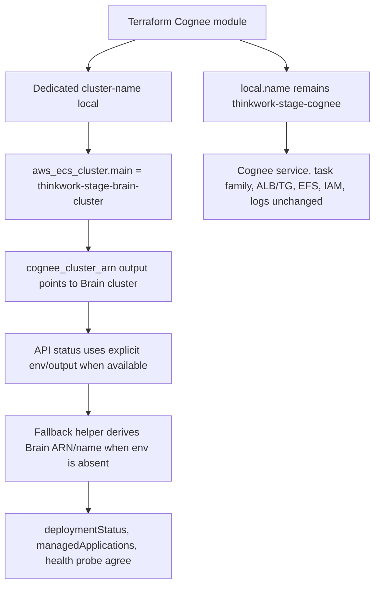

# fix: Rename legacy Cognee ECS cluster to Brain

## Overview

Rename the legacy stage-wide Company Brain ECS cluster from
`thinkwork-${stage}-cognee-cluster` to `thinkwork-${stage}-brain-cluster`
while keeping Cognee as the internal implementation app key, service name,
task family, container name, container image, database, log group, and
managed-app contract.

The implementation should isolate cluster identity from the broader Cognee
resource name local, update API/admin fallback reporting to the Brain cluster
name, and treat the merge to `main` as the dev cutover event because the
shared `dev` stage is continuously deployed from `main`.

---

## Problem Frame

The dev Company Brain substrate is healthy but operator-facing AWS ECS still
shows the legacy cluster name `thinkwork-dev-cognee-cluster`. This leaks
implementation vocabulary into the stage-wide Brain resource identity. AWS ECS
does not support an in-place cluster rename: cluster update operations modify
settings such as Container Insights, default capacity providers, and tags, and
service updates explicitly cannot change the cluster name. The safe path is a
Terraform-owned replacement/migration of the cluster identity, with proof that
the existing Cognee service dependencies are preserved or intentionally
reattached (see origin: `docs/brainstorms/2026-06-15-rename-cognee-cluster-requirements.md`).

---

## Requirements Trace

- R1. The live dev Company Brain ECS cluster ends as `thinkwork-dev-brain-cluster`.
- R2. Future legacy stage-wide Cognee substrate deployments derive ECS cluster
  identity as `thinkwork-${stage}-brain-cluster`.
- R3. The managed application key, service name, task family, container name,
  container image, database, API routes, GraphQL fields, and implementation docs
  remain Cognee unless a concrete dependency requires otherwise.
- R4. The plan accounts for ECS cluster name immutability and does not assume an
  AWS CLI in-place rename.
- R5. The dev cutover preserves or intentionally reattaches the existing Cognee
  task definition, desired count, internal ALB/target group, EFS storage,
  security groups, IAM roles, CloudWatch log group, and Terraform ownership.
- R6. Terraform remains the durable source of truth after cutover.
- R7. API/admin deployment status and health checks report/probe the actual
  Brain cluster ARN/name.
- R8. Verification proves dev is healthy under the Brain name and future deploys
  will not recreate or revert to the Cognee cluster name.

**Origin actors:** A1 ThinkWork operator, A2 Terraform/deployment runner,
A3 API/admin status surfaces.

**Origin flows:** F1 Dev cluster migration, F2 Future deployment naming.

**Origin acceptance examples:** AE1 covers dev AWS/admin visibility and
service health; AE2 covers fresh future deploy naming and `cognee_cluster_arn`
output; AE3 covers the non-rebrand boundary; AE4 covers replacement/import/state
sequence and rollback posture.

---

## Scope Boundaries

- Do not rename the Cognee managed application key, database, container name,
  container image, API routes, GraphQL fields, Knowledge Graph product surface,
  or user-facing feature language.
- Do not migrate Company Brain data, alter Cognee ingestion behavior, or change
  Hindsight/memory semantics.
- Do not generalize all Cognee resource names. THNK-30 changes only the legacy
  stage-wide ECS cluster identity.
- Do not add local-only, Docker Compose, Kubernetes, GCP, or Azure paths.
- Do not run production mutation commands as part of this work.

---

## Context & Research

### Relevant Code and Patterns

- `terraform/modules/app/cognee/main.tf` currently uses
  `local.legacy_name = "thinkwork-${var.stage}-cognee"` and
  `aws_ecs_cluster.main.name = "${local.name}-cluster"`. `local.name` also
  drives IAM roles, ALB/TG, EFS, task family, and service names, so the
  implementation must not rename `local.name` wholesale.
- `terraform/modules/app/cognee/outputs.tf` and
  `terraform/modules/thinkwork/outputs.tf` expose `cognee_cluster_arn`.
  Keep this Terraform output as the durable infrastructure source of truth while
  its value points to the Brain-named ECS cluster.
- `terraform/modules/thinkwork/main.tf` forwards `cognee_cluster_arn` into the
  Lambda API module, but `terraform/modules/app/lambda-api/handlers.tf` does
  not set `COGNEE_CLUSTER_ARN` because the GraphQL Lambda env block is close to
  AWS Lambda's 4 KB limit.
- `packages/api/src/graphql/resolvers/core/deploymentStatus.query.ts`,
  `packages/api/src/graphql/resolvers/core/managedApplications.ts`, and
  `packages/api/src/graphql/resolvers/core/knowledgeGraphHealthCheck.query.ts`
  each reconstruct the old `thinkwork-${stage}-cognee-cluster` fallback today.
- Existing tests to extend include
  `apps/cli/__tests__/terraform-cognee-fixture.test.ts`,
  `packages/api/src/graphql/resolvers/core/general-reads-authz.test.ts`,
  `packages/api/src/graphql/resolvers/core/managedApplications.test.ts`, and
  `packages/api/src/graphql/resolvers/core/knowledgeGraphHealthCheck.query.test.ts`.

### Institutional Learnings

- `docs/solutions/architecture-patterns/company-brain-provisioning-contract-tenant-scoped-2026-06-15.md`:
  Company Brain/Cognee infrastructure should expose operator evidence through
  Terraform outputs; downstream callers should not reconstruct names.
- `docs/solutions/workflow-issues/branch-deploy-to-continuous-cd-dev-stage-is-ephemeral.md`:
  shared `dev` is continuously deployed from `main`, so branch deploys are
  temporary and local `thinkwork deploy -s dev` is unsafe. Validate durable
  behavior after merge/main CD.
- `docs/solutions/runtime-errors/ecs-exec-existing-tasks-need-force-new-deployment-2026-05-13.md`:
  if ECS Exec is used during verification, confirm the task has the
  `ExecuteCommandAgent` running; service-level flips only apply to newly
  launched tasks.
- `docs/plans/cognee-terraform-infrastructure-autopilot-status.md`:
  accepted Cognee dev evidence includes ECS service desired/running `1/1`,
  healthy ALB target, `/health` 200 logs, and GraphQL status/health returning
  healthy.

### External References

- AWS ECS cluster updates document updates to capacity providers, Container
  Insights, and tags, not cluster renames:
  https://docs.aws.amazon.com/AmazonECS/latest/developerguide/update-cluster-v2.html
- AWS ECS `update-cluster-settings` modifies settings for an existing named
  cluster and has no new-name parameter:
  https://docs.aws.amazon.com/cli/latest/reference/ecs/update-cluster-settings.html
- AWS ECS `update-service` says the service's cluster name cannot be changed:
  https://docs.aws.amazon.com/cli/latest/reference/ecs/update-service.html
- Terraform AWS provider docs for `aws_ecs_cluster` support importing clusters
  by cluster name, which is useful for state recovery if an operator-created
  Brain cluster ever needs adoption:
  https://registry.terraform.io/providers/hashicorp/aws/latest/docs/resources/ecs_cluster

---

## Key Technical Decisions

- Isolate cluster identity in a dedicated Terraform local rather than renaming
  `local.name`: this changes only the ECS cluster while preserving Cognee
  implementation resource names and avoiding accidental replacement of ALB,
  EFS, IAM, task family, service, and secret identities.
- Keep `cognee_cluster_arn` as the durable Terraform source of truth and
  `COGNEE_CLUSTER_ARN` only as an optional compatibility override when already
  present. Do not add or wire a new Brain-named env alias in this scope; the
  GraphQL Lambda env-size risk is not worth it for this scoped rename.
- Update API fallbacks to Brain naming through a shared helper: when an explicit
  cluster ARN exists, use it; otherwise derive `thinkwork-${stage}-brain-cluster`
  once and share it across deployment status, managed-app status, and health
  probes.
- Treat implementation merge as the dev cutover trigger: because `main` CD
  applies to the shared `dev` stage, implementation should merge only when the
  operator is ready to accept a short Cognee service replacement window.
- Prefer Terraform replacement over ad hoc AWS CLI mutation: one-off AWS CLI
  reads are fine for proof, but mutation must happen through Terraform/main CD
  and the final owner must remain Terraform state.
- Gate non-dev rollout explicitly: this plan authorizes dev proof only. Any
  production/customer stage with legacy Cognee enabled must stay pinned or
  blocked behind a stage-specific approval/maintenance window before receiving
  the module change.

---

## Open Questions

### Resolved During Planning

- Safest dev cutover sequence: use Terraform-owned cluster/service replacement
  after a pre-merge plan review, not an AWS CLI rename. The implementation PR
  should merge only during an acceptable dev maintenance window, then main CD
  should reconcile the Brain cluster and reattach the existing service
  dependencies.
- Status/health source of truth: keep Terraform `cognee_cluster_arn` as the
  durable applied identity, treat `COGNEE_CLUSTER_ARN` as an optional legacy
  override if it is already present, and use Brain-named fallback derivation.
  Do not add or wire a new `BRAIN_CLUSTER_ARN` env var in this scope.

### Deferred to Implementation

- Exact Terraform replacement graph for the stage: implementation must inspect
  the non-production plan before merge/cutover and confirm only the ECS cluster
  and any required service cluster binding are replaced. This must be a saved
  CI-equivalent refreshed plan using the same deploy inputs/secrets surface as
  main CD, not an unrelated local plan. If no reusable plan-only workflow exists,
  implementation must add a PR-visible plan artifact path before cutover.
- Whether the first apply destroys the old ECS service before creating the new
  one: depends on the provider plan and ECS service lifecycle behavior. The
  plan accepts brief dev downtime but requires evidence that persistent
  dependencies remain attached after steady state.

---

## High-Level Technical Design

> This illustrates the intended approach and is directional guidance for review,
> not implementation specification. The implementing agent should treat it as
> context, not code to reproduce.

---

## Implementation Units

- U1. **Isolate the legacy ECS cluster name in Terraform**

**Goal:** Make the legacy stage-wide ECS cluster name Brain-based while
preserving existing Cognee implementation resource names.

**Requirements:** R1, R2, R3, R4, R6; covers AE2 and AE3.

**Dependencies:** None.

**Files:**

- Modify: `terraform/modules/app/cognee/main.tf`
- Modify: `terraform/modules/app/cognee/outputs.tf`
- Modify: `terraform/modules/thinkwork/outputs.tf`
- Modify: `terraform/modules/app/cognee/README.md`
- Test: `apps/cli/__tests__/terraform-cognee-fixture.test.ts`

**Approach:**

- Add a cluster-specific local for the legacy stage-wide path that evaluates to
  `thinkwork-${stage}-brain-cluster`.
- Keep `local.name`, `local.resource_short_name`, service name, task family,
  ALB/TG, EFS, IAM role names, secret paths, and log group names on the current
  Cognee-derived values.
- Keep `cognee_cluster_arn` output names for compatibility, but update
  descriptions/docs to clarify the ARN is the Company Brain ECS cluster for the
  Cognee service.
- Do not change tenant-scoped Brain instance naming.

**Patterns to follow:**

- Existing tenant-scoped naming in `terraform/modules/app/cognee/main.tf`.
- Existing structural Terraform assertions in
  `apps/cli/__tests__/terraform-cognee-fixture.test.ts`.

**Test scenarios:**

- Happy path: legacy stage-wide module source contains a Brain cluster-name
  derivation and `aws_ecs_cluster.main.name` uses that derivation.
- Happy path: service/task/log/ALB/EFS/IAM naming assertions continue to match
  Cognee-derived names, proving THNK-30 did not become a global rebrand.
- Happy path: container name and container image references remain Cognee-based
  where the module intentionally describes implementation substrate behavior.
- Edge case: tenant-scoped Brain instance naming still derives from
  `brain_instance_key`/`brain_tenant_id`, not from the new legacy cluster local.
- Integration: composite `cognee_cluster_arn` output remains present and points
  through the Cognee module output.

**Verification:**

- Static Terraform fixture coverage proves only cluster identity changes.
- Terraform module validation succeeds for both the Cognee app module and the
  composite Thinkwork module.

---

- U2. **Centralize Cognee/Brain cluster identity in API status**

**Goal:** Make deployment status, managed-app status, and health probes agree on
the Brain cluster when no explicit cluster ARN env is present.

**Requirements:** R7, R8; covers AE1.

**Dependencies:** U1.

**Files:**

- Create or modify: `packages/api/src/graphql/resolvers/core/cogneeClusterIdentity.ts`
- Modify: `packages/api/src/graphql/resolvers/core/deploymentStatus.query.ts`
- Modify: `packages/api/src/graphql/resolvers/core/managedApplications.ts`
- Modify: `packages/api/src/graphql/resolvers/core/knowledgeGraphHealthCheck.query.ts`
- Test: `packages/api/src/graphql/resolvers/core/general-reads-authz.test.ts`
- Test: `packages/api/src/graphql/resolvers/core/managedApplications.test.ts`
- Test: `packages/api/src/graphql/resolvers/core/knowledgeGraphHealthCheck.query.test.ts`

**Approach:**

- Implement one small helper that resolves the cluster ARN and cluster name from
  `COGNEE_CLUSTER_ARN` when present, otherwise derives the Brain fallback from
  stage, region, and account ID.
- Use the helper in all three current fallback sites instead of duplicating
  string literals.
- Preserve the compact `COGNEE = backend|endpoint` env contract and avoid adding
  a new GraphQL Lambda env var.

**Patterns to follow:**

- Existing `readCogneeStatus()` env compatibility behavior in
  `packages/api/src/graphql/resolvers/core/managedApplications.ts`.
- Existing AWS-control-plane health probe in
  `packages/api/src/graphql/resolvers/core/knowledgeGraphHealthCheck.query.ts`.

**Test scenarios:**

- Happy path: with `COGNEE` enabled, `STAGE=dev`, region/account present, and no
  `COGNEE_CLUSTER_ARN`, `deploymentStatus.cogneeClusterArn` contains
  `cluster/thinkwork-dev-brain-cluster`.
- Happy path: managed application status for key `cognee` reports the same
  Brain cluster ARN fallback as deployment status.
- Happy path: `knowledgeGraphHealthCheck` calls ECS `DescribeServices` with
  `cluster: "thinkwork-dev-brain-cluster"` when no explicit ARN is present.
- Edge case: when `COGNEE_CLUSTER_ARN` is set, all status/health paths use it
  exactly as an optional compatibility override, but tests distinguish this from
  the default Brain fallback so implementation does not accidentally wire it as
  a new required env var.
- Error path: when account ID is absent, status returns `null` for the fallback
  ARN while the health probe can still use the Brain cluster name.

**Verification:**

- API unit tests prove every current old-cluster fallback is gone or explicitly
  limited to historical docs.
- Health probe tests prove the control-plane probe targets the Brain cluster.

---

- U3. **Extend smoke/evidence checks for cluster identity**

**Goal:** Make post-deploy proof fail clearly if Terraform, GraphQL status, and
AWS ECS disagree on cluster identity.

**Requirements:** R1, R5, R7, R8; covers AE1 and AE4.

**Dependencies:** U1, U2.

**Files:**

- Modify: `plugins/company-brain/smoke/cognee-managed-app-smoke.mjs`
- Modify: `terraform/modules/app/cognee/README.md`
- Modify: `docs/src/content/docs/guides/business-ontology-operations.mdx`

**Approach:**

- Extend the Cognee managed-app smoke to include the Terraform
  `cognee_cluster_arn` output, GraphQL `deploymentStatus.cogneeClusterArn`,
  the Cognee managed application `clusterArn`, and
  `knowledgeGraphHealthCheck` result in one evidence payload.
- Add a non-secret assertion that enabled legacy stage-wide deployments should
  report a Brain cluster name. If an explicit `COGNEE_CLUSTER_ARN` override is
  present and points at the old Cognee cluster, smoke/readiness must fail unless
  the evidence names a break-glass recovery reason and owner.
- Update operator docs to state that the cluster is Brain-named while Cognee
  remains the implementation service/key.
- State that committed verification artifacts must sanitize AWS identifiers:
  no raw secret ARNs, account IDs, environment values, or full resource IDs in
  repo docs. Raw evidence belongs in restricted CI, S3, or operator records.
- Use an explicit smoke assertion matrix:
  - Disabled Cognee: skip cluster identity assertions and report skipped.
  - Enabled Cognee: Terraform `cognee_cluster_arn`,
    `deploymentStatus.cogneeClusterArn`, Cognee managed app `clusterArn`, ECS
    service cluster, and health-check target all normalize to `brain-cluster`.
  - Missing Terraform output while enabled: fail smoke, because Terraform is the
    durable source of truth.
  - Explicit `COGNEE_CLUSTER_ARN`: accept only when it is Brain-named or when a
    break-glass recovery note is included.
  - ARN-vs-name comparison: extract the ECS cluster name from ARNs before
    comparing.

**Patterns to follow:**

- Existing smoke evidence shape in `plugins/company-brain/smoke/cognee-managed-app-smoke.mjs`.
- Existing smoke expectations in `terraform/modules/app/cognee/README.md`.

**Test scenarios:**

- Happy path: smoke evidence for an enabled deployment records matching
  Terraform and GraphQL cluster identity ending in `brain-cluster`.
- Edge case: disabled Cognee deployments remain skippable and do not fail on a
  missing cluster ARN.
- Error path: smoke reports a clear mismatch when Terraform output and GraphQL
  status disagree on cluster ARN/name.

**Verification:**

- The smoke output contains enough cluster/service/health evidence for the
  Verification phase to evaluate R1, R5, R7, and R8 without exposing secrets.

---

- U4. **Execute and document the dev cutover proof**

**Goal:** Complete the dev cluster replacement through the normal PR/main-CD
path and capture durable evidence for Verification.

**Requirements:** R1, R4, R5, R6, R8; covers AE1 and AE4.

**Dependencies:** U1, U2, U3.

**Files:**

- Create: `docs/verification/rename-cognee-cluster-dev-cutover.md`

**Approach:**

- Before implementation merge, review the non-production Terraform plan and
  confirm the replacement surface is limited to the ECS cluster and any required
  ECS service binding to that cluster. EFS, ALB/TG, security groups, IAM roles,
  database, secrets, and log group should not be replaced unless the plan calls
  out why. The implementation should save the refreshed plan artifact, inspect
  its structured resource changes, and gate merge on the allowlist below.
- Inventory enabled non-dev stages before rollout. If any production/customer
  stage has the legacy stage-wide Cognee substrate enabled, do not deploy this
  Terraform change there until that stage has its own maintenance window and
  plan review. If any repo workflow can deploy non-dev from this branch/main
  without human approval, add or use an environment approval/stage allowlist
  gate before merging the implementation. The inventory source should be named:
  Terraform workspaces/state outputs, deployment-controller environments, GitHub
  environments/variables, and known registry module consumers.
- Merge the implementation PR only during an acceptable dev maintenance window,
  because `main` CD is the durable dev apply.
- After main CD settles, capture read-only AWS and GraphQL evidence showing the
  Brain cluster is active, the Cognee service is steady, the ALB target is
  healthy, Terraform output matches API status, and
  `thinkwork-dev-cognee-cluster` is absent or explicitly marked for
  time-boxed decommission.
- If the apply fails before the new service reaches steady state, rollback is a
  PR-based revert to the previous Terraform naming plus main CD, not a
  production mutation command. Reverting the name is also a replacement, so
  rollback criteria must accept another dev outage or use import/state recovery
  only to restore Terraform ownership of the intended cluster. Any state
  recovery must be dev-only unless separately approved, use a named AWS role,
  hold the remote-state lock, back up state first, document exact import IDs,
  receive peer/operator approval, and end with a refreshed clean plan.
- Add a recovery matrix before cutover. It should cover at least: Terraform
  state points to old cluster and AWS old service is active; state points to new
  cluster and AWS new service is active; state points to new cluster but service
  is missing or draining; both clusters exist; neither service is steady; and
  CI times out after creating valid AWS resources. Each row should name the
  allowed recovery action and whether import/state repair is permitted.
- Authoritative pre-cutover plan source: a GitHub Actions/deployment-controller
  plan job that uses the shared `dev` backend and the same deploy
  secrets/variables as `.github/workflows/deploy.yml`, but writes a refreshed
  plan artifact and structured resource-change summary instead of applying.
  If no such path exists, the implementation PR must add a temporary or durable
  plan-artifact step before cutover approval.

**Patterns to follow:**

- Evidence style from `docs/plans/cognee-terraform-infrastructure-autopilot-status.md`.
- Deployment workflow cautions from
  `docs/solutions/workflow-issues/branch-deploy-to-continuous-cd-dev-stage-is-ephemeral.md`.

**Test scenarios:**

- Test expectation: none -- this unit captures operational evidence after the
  code changes are deployed rather than adding runtime behavior.

**Verification:**

- The evidence artifact proves Terraform output, AWS ECS, ALB target health,
  GraphQL deployment status, managed-app status, and health check all agree on
  `thinkwork-dev-brain-cluster`.

---

## System-Wide Impact

- **Interaction graph:** Terraform creates the ECS cluster and service binding;
  Lambda API status reads compact Cognee env plus fallback identity; web/admin
  surfaces consume GraphQL status without schema changes.
- **Error propagation:** If the cluster replacement fails, Terraform/main CD
  should fail visibly. API health should report unhealthy or unable to complete
  rather than hiding a stale cluster name.
- **State lifecycle risks:** ECS cluster identity is immutable, so replacement
  may briefly interrupt the dev Cognee service. Persistent state should remain
  in EFS, database, secrets, IAM, and ALB/TG resources that are not renamed.
- **API surface parity:** GraphQL field names remain `cogneeClusterArn` and
  managed application key remains `cognee`; only returned values/fallbacks
  change.
- **Access control:** AWS cluster identifiers remain operator-only evidence.
  `deploymentStatus`, managed-app status, and health-check paths must preserve
  existing admin/service authorization and negative tests for unauthorized
  callers.
- **Integration coverage:** Unit tests prove fallback behavior; post-merge smoke
  proves real AWS service and target health under the Brain cluster, checks
  both old and new cluster names read-only, and confirms a refreshed clean plan.
- **Unchanged invariants:** Cognee remains private/internal-only, disabled by
  default for new deployments unless explicitly enabled, and still uses the
  compact GraphQL Lambda `COGNEE` env projection.

---

## Risks & Dependencies

| Risk                                                                                                       | Mitigation                                                                                                                                                                                                 |
| ---------------------------------------------------------------------------------------------------------- | ---------------------------------------------------------------------------------------------------------------------------------------------------------------------------------------------------------- |
| Terraform replaces more than the ECS cluster/service binding because `local.name` was renamed too broadly. | U1 isolates cluster naming and adds fixture tests proving service, ALB/TG, EFS, IAM, task family, and logs stay Cognee-named.                                                                              |
| Main CD applies the cutover before operators expect it.                                                    | Treat implementation merge as the dev cutover trigger and merge only during an acceptable dev window.                                                                                                      |
| GraphQL Lambda env grows past the 4 KB limit.                                                              | Do not add `BRAIN_CLUSTER_ARN`; keep compact `COGNEE` and use Brain fallback derivation.                                                                                                                   |
| Terraform plan/apply uses `-refresh=false` and misses drift.                                               | Require a pre-cutover refreshed plan review or explicit drift read for the non-production dev substrate before merging the implementation PR.                                                              |
| Old and new services briefly contend for the same target group or desired count.                           | Accept a short dev-only service replacement window; verify desired/running counts and ALB target health after apply.                                                                                       |
| Rollback recreates the old cluster but leaves unclear Terraform ownership.                                 | Roll back through PR/main CD and verify state/output ownership after the revert; use import only for recovery if an operator-created cluster must be adopted.                                              |
| Deterministic API fallback appears correct while Terraform state/output still points elsewhere.            | Verification must compare GraphQL status against Terraform output and read-only AWS ECS describe results, then confirm a post-apply plan is clean.                                                         |
| A production/customer stage already has legacy Cognee enabled.                                             | Inventory enabled stages before rollout and do not deploy the implementation to non-dev stages without an explicit maintenance window.                                                                     |
| The old empty cluster remains visible and keeps confusing operators.                                       | Verification must prove `thinkwork-dev-cognee-cluster` is absent/decommissioned, or record a time-boxed owner/date if AWS deletion is temporarily blocked.                                                 |
| An explicit old `COGNEE_CLUSTER_ARN` override masks the fallback fix.                                      | Smoke/readiness must fail for legacy stage-wide deployments when the override points at `thinkwork-${stage}-cognee-cluster`, unless break-glass recovery evidence is present.                              |
| Committed proof leaks infrastructure metadata.                                                             | Verification docs must redact raw secret ARNs, account IDs, full resource IDs, and env values; raw evidence stays in restricted operator/CI/S3 records.                                                    |
| State import/recovery adopts the wrong resource or masks drift.                                            | State recovery requires named role, state backup, remote-state lock, exact import IDs, peer approval, refreshed plan, and dev-only scope unless separately approved.                                       |
| ECS replacement exceeds the deploy job timeout.                                                            | Define a cutover timeout budget before merge; if current CI timeout is insufficient, raise it for this apply or document manual continuation criteria for a timeout after valid AWS resources are created. |

---

## Operational / Rollout Notes

- This is a dev cutover with repo-wide Terraform consequences. The code path
  changes future legacy stage-wide deployments for any stage, but the current
  workflow must not run production mutation commands.
- Non-dev rollout gate: customer/prod stacks must remain on their current
  module version or deploy gate until an approved maintenance window. If a
  non-dev stack has no legacy Cognee substrate enabled, record that inventory
  result before allowing the new module code to reach that stage. Inventory must
  name the checked sources: Terraform workspaces/state outputs,
  deployment-controller environments, GitHub environments/variables, and known
  registry module consumers. The verification artifact must record either
  "no non-dev legacy Cognee enabled" or the blocked stage list with owner/date.
- The implementation PR should call out that merging to `main` will trigger the
  shared dev deploy and may briefly interrupt the Cognee service while ECS
  replacement reaches steady state.
- Safe proof path for dev:
  1. Capture baseline read-only evidence for the old dev cluster: cluster
     exists, Cognee service desired/running counts, target health, EFS id,
     service task definition, and GraphQL status/health.
  2. Generate and save a CI-equivalent refreshed non-production Terraform plan
     with the same deploy inputs/secrets surface as main CD. Review its
     structured resource changes and confirm expected replacement scope. The
     authoritative artifact should come from GitHub Actions/deployment
     controller context using the shared `dev` backend, not a local-only plan.
  3. Merge the implementation PR to `main` during the selected dev window.
  4. Wait for main CD Terraform apply to settle.
  5. Capture final evidence in `docs/verification/rename-cognee-cluster-dev-cutover.md`.
- Terraform plan allowlist for the dev cutover:
  - Expected: `aws_ecs_cluster.main` replacement to
    `thinkwork-dev-brain-cluster`.
  - Acceptable if unavoidable: `aws_ecs_service.cognee` replacement/relocation
    to the new cluster while preserving service name and dependencies.
  - Abort for review: ALB/TG, EFS, IAM roles, secrets, database, CloudWatch log
    group, task family, service name, or managed application key replacement or
    rename.
- Recovery matrix required before cutover:
  - State old / AWS old service active: proceed only after refreshed plan
    allowlist passes.
  - State new / AWS new service active: verify health, old cluster absence, and
    clean plan.
  - State new / service missing or draining: use the saved plan/apply logs and
    read-only AWS state to decide between rerun, PR revert, or dev-only state
    repair.
  - Both old and new clusters exist: keep the healthy service path, remove or
    decommission the stale cluster through Terraform-owned recovery, and record
    owner/date if removal is blocked.
  - CI timeout after resources are valid: continue only under the documented
    timeout continuation criteria; otherwise restore through PR/state recovery.
- Verification must explicitly confirm:
  - AWS ECS has an active `thinkwork-dev-brain-cluster`.
  - Cognee ECS service `thinkwork-dev-cognee` is active under the Brain cluster.
  - Desired/running/pending counts are `1/1/0` or match the configured desired
    count with no pending tasks.
  - The ALB target group is healthy for the service's desired count.
  - The EFS file system id, DB name, secret ARNs, IAM role names, ALB/TG names,
    and log group are preserved or intentionally documented as reattached, using
    redacted or partial identifiers in committed evidence.
  - `deploymentStatus.cogneeClusterArn` and the Cognee managed application
    `clusterArn` point to the Brain cluster.
  - `knowledgeGraphHealthCheck` returns healthy using the Brain cluster.
  - Unauthorized or non-admin callers still cannot retrieve operator AWS
    identifiers through deployment status or health-check paths.
  - `COGNEE_CLUSTER_ARN` is absent from the GraphQL Lambda env or points to the
    Brain cluster; an old-cluster override is not readiness-acceptable outside a
    named break-glass recovery note.
  - `thinkwork-dev-cognee-cluster` is absent from ECS, or explicitly documented
    as a temporary decommission item with owner/date because AWS deletion is
    blocked.
  - Read-only ECS checks were performed against both
    `thinkwork-dev-brain-cluster` and `thinkwork-dev-cognee-cluster`.
  - A fresh legacy stage-wide plan would create
    `thinkwork-${stage}-brain-cluster`, not the old Cognee cluster name.
  - A post-apply Terraform plan is clean, proving Terraform remains source of
    truth and will not recreate the old cluster.

---

## Sources & References

- Origin document:
  `docs/brainstorms/2026-06-15-rename-cognee-cluster-requirements.md`
- Linear issue: `THNK-30`
- Linear requirements document:
  https://linear.app/thinkworkai/document/requirements-rename-cognee-cluster-2989a9f5db00
- Requirements PR: https://github.com/thinkwork-ai/thinkwork/pull/2515
- Related code: `terraform/modules/app/cognee/main.tf`
- Related code: `terraform/modules/app/cognee/outputs.tf`
- Related code: `terraform/modules/thinkwork/outputs.tf`
- Related code: `terraform/modules/app/lambda-api/handlers.tf`
- Related code:
  `packages/api/src/graphql/resolvers/core/deploymentStatus.query.ts`
- Related code:
  `packages/api/src/graphql/resolvers/core/managedApplications.ts`
- Related code:
  `packages/api/src/graphql/resolvers/core/knowledgeGraphHealthCheck.query.ts`
- Related tests: `apps/cli/__tests__/terraform-cognee-fixture.test.ts`
- Related tests:
  `packages/api/src/graphql/resolvers/core/general-reads-authz.test.ts`
- Related tests:
  `packages/api/src/graphql/resolvers/core/managedApplications.test.ts`
- Related tests:
  `packages/api/src/graphql/resolvers/core/knowledgeGraphHealthCheck.query.test.ts`
- AWS ECS cluster update docs:
  https://docs.aws.amazon.com/AmazonECS/latest/developerguide/update-cluster-v2.html
- AWS ECS update-cluster-settings docs:
  https://docs.aws.amazon.com/cli/latest/reference/ecs/update-cluster-settings.html
- AWS ECS update-service docs:
  https://docs.aws.amazon.com/cli/latest/reference/ecs/update-service.html
- Terraform `aws_ecs_cluster` docs:
  https://registry.terraform.io/providers/hashicorp/aws/latest/docs/resources/ecs_cluster
