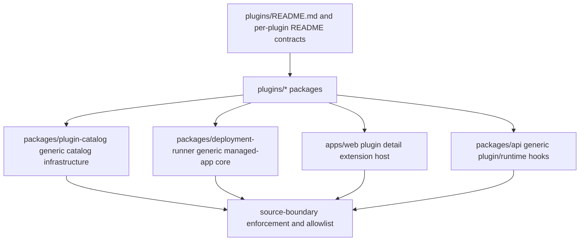

# refactor: Co-locate application plugin source

## Overview

Move ThinkWork Application Plugin ownership from scattered shared locations into
root-level `plugins/<plugin-key>/` packages. The revised THNK-31 boundary is not
only manifest colocation: each plugin package must own its product-specific
source, UI surfaces, runtime/substrate assets, Terraform and deployment hooks,
smokes, docs, tests, and operational evidence. Shared packages remain generic
plugin platform infrastructure.

The repo already has root plugin packages and has moved manifests, package
tests, and smoke scripts for Twenty CRM, Twenty, Company Brain, and LastMile. The
remaining work is the stronger ownership pass: remove first-party plugin source
ownership from `packages/plugin-catalog`, move managed-app adapters and
Terraform source behind plugin packages, render plugin-specific operator UI from
plugin detail, treat Cognee as Company Brain substrate, and drive the migration
allowlist down to only historical or generic-platform exceptions.

---

## Problem Frame

TEI ThinkWork's plugin model should let a maintainer or future plugin author
open `plugins/<plugin-key>/` and understand the plugin as one
submission-shaped package. Today, important plugin behavior is still scattered:
web Company Brain/Cognee settings screens, API Company Brain and LastMile
helpers, the Cognee Dockerfile, managed-app deployment adapters, Terraform
modules, CLI fixture tests, and release/build references remain outside plugin
packages. That makes review, future submissions, and repository enforcement
ambiguous even though the first package migration slices have landed.

---

## Requirements Trace

- R1-R4: `plugins/<plugin-key>/` is the product ownership boundary for each
  plugin, including manifests, skills, UI, runtime assets, deployment adapters,
  Terraform, docs, tests, smokes, and runbooks.
- R5-R8: Shared packages, including `packages/plugin-catalog`, keep only
  generic plugin infrastructure and must discover plugin packages rather than
  manually owning first-party plugin source.
- R9-R11: Plugin-specific web/operator screens are owned by plugin packages and
  rendered from plugin detail for this migration, with Company Brain ontology
  and knowledge-graph operations moving under `plugins/company-brain/`.
- R12-R14: Cognee is Company Brain's internal substrate; Twenty CRM and Twenty
  managed-app infrastructure moves behind plugin-owned source; LastMile remains
  package-local for skill/MCP-only content.
- R15-R19: A canonical plugin spec plus per-plugin README contracts define what
  plugin authors own and what remains platform code; plugin-builder emits that
  shape.
- R20-R23: Twenty CRM, Twenty, Company Brain/Cognee, and LastMile preserve existing
  product behavior through migration.
- R24-R27: Tooling lists, validates, builds, tests, and enforces plugins from
  the folder source of truth; compatibility paths are removed after a full
  migration/release pass.

**Origin actors:** A1 Plugin author, A2 Platform maintainer, A3 Release
operator, A4 Tenant/operator user.

**Origin flows:** F1 Plugin review, F2 Catalog and deployment discovery, F3
Plugin-owned operator UI, F4 Future plugin submission.

**Origin acceptance examples:** AE1 Twenty CRM full-shape review, AE2 generic
`packages/plugin-catalog`, AE3 Company Brain plugin-owned UI, AE4 Cognee as
Company Brain substrate, AE5 Twenty behavior parity, AE6 plugin-builder output,
AE7 source-boundary enforcement.

---

## Scope Boundaries

- Do not change plugin install, activation, deployment, MCP registration,
  dispatch, or user activation behavior while moving source.
- Do not redesign Company Brain ontology workflows; this plan changes source
  ownership and rendering context, not the ontology product behavior.
- Do not move generic database schema, GraphQL transport, authentication,
  install state machines, deployment-runner core, shared UI shell code, or
  common test harnesses into plugin packages merely because plugins consume
  them.
- Do not introduce local-only, Kubernetes, Docker Compose, GCP, or Azure paths.
- Do not manually deploy or mutate production resources.
- Do not remove compatibility wrappers until all first-party plugins have moved
  and the release path has completed a migration pass.

### Deferred to Follow-Up Work

- A broader marketplace/app-shell UI surface beyond plugin detail is deferred;
  plugin detail rendering is sufficient for THNK-31.
- Promoting Cognee to a standalone shared platform service is deferred unless a
  future requirements pass explicitly changes the product framing.

---

## Context & Research

### Relevant Code and Patterns

- `plugins/{twenty,twenty,company-brain,lastmile}/` already define first-party
  plugin package roots, manifests, package tests, and package-local smokes.
- `packages/plugin-catalog/src/plugin-package.ts` defines the current first
  party package contract; `packages/plugin-catalog/src/plugins/index.ts` still
  manually imports first-party plugin packages.
- `packages/deployment-runner/src/apps/registry.ts` owns the current managed
  app adapter registry, while `packages/deployment-runner/src/apps/{twenty,twenty,cognee}.ts`
  remain plugin-specific implementation files.
- `apps/web/src/components/settings/plugins/PluginDetail.tsx` is the generic
  plugin detail route and is the correct first host for plugin-declared UI
  surfaces.
- `apps/web/src/components/settings/SettingsCogneeApplication.tsx` and
  `apps/web/src/routes/_authed/settings.applications.cognee.tsx` are current
  legacy Cognee settings paths. The route already redirects to
  `/settings/plugins/company-brain`, but the source ownership is still outside
  the Company Brain plugin package.
- `packages/api/src/lib/company-brain/`, `packages/api/src/lib/knowledge-graph/cognee-client.ts`,
  `packages/api/src/lib/context-engine/providers/company-brain.ts`,
  `packages/api/src/lib/lastmile/tasks-adapter.ts`, and
  `packages/api/src/lib/plugins/twenty-cutover.ts` are remaining plugin-specific
  API/runtime paths.
- `scripts/verify-plugin-source-boundary.mjs` and
  `scripts/plugin-source-boundary-allowlist.mjs` already enforce and document
  migration exceptions.

### Institutional Learnings

- `docs/solutions/architecture-patterns/terraform-plugin-builder-skills-stop-at-adapter-gaps-2026-06-14.md`
  establishes that Terraform plugin-builder workflows must stop at managed-app
  adapter gaps instead of generating unsupported infrastructure claims.
- `docs/solutions/runbooks/company-brain-premium-plugin-operations-2026-06-13.md`
  frames Company Brain as the customer-facing premium plugin and Cognee as the
  internal substrate adapter. Customer-facing copy should say Company Brain
  except where deployment evidence or implementation notes require Cognee.

### External References

- Not used. The repo already has current local patterns for plugin packages,
  managed-app adapters, plugin detail UI, source-boundary enforcement, and
  Company Brain operations.

---

## Key Technical Decisions

- Keep `packages/plugin-catalog` as the generic plugin platform package for
  now. Renaming can be reconsidered later, but this plan measures success by
  removing first-party source ownership and manual plugin-specific registry
  code from that package.
- Follow-up from THNK-37: root `plugins/*` packages remain the authored source
  of truth, but runtime freshness now flows through a GitHub-hosted signed
  catalog artifact. That artifact is generated from package source, verified by
  the API, cached as a trusted snapshot, and compared against tenant install
  pins in Settings -> Plugins. This does not move plugin ownership to GitHub or
  allow API runtime evaluation of remote TypeScript.
- Replace hand-owned first-party registries with package discovery or generated
  aggregate files whose source of truth is `plugins/*`. Generated aggregate
  files are acceptable only when static imports are required for bundling or
  typechecking, and they must be mechanically refreshed from plugin package
  metadata.
- Host plugin-owned UI inside the existing plugin detail page first. The shared
  web app owns routing, auth, layout, GraphQL transport, and the extension host;
  plugin packages own the plugin-specific panels rendered inside that host.
- Treat Cognee as Company Brain substrate. Move Cognee runtime, Dockerfile,
  Terraform, adapter, smoke, and operations source under
  `plugins/company-brain/`, while preserving current image names, Terraform
  variable names, managed-app keys, and deployment evidence labels for behavior
  compatibility.
- Preserve historical DB migration tests outside plugin packages. They verify
  immutable schema history, not active plugin source, and should be the only
  likely permanent source-boundary exception.

---

## Open Questions

### Resolved During Planning

- Should `packages/plugin-catalog` be renamed now? Keep the name in this pass
  and make it generic-only. Rename/split only if implementation proves the name
  continues to hide first-party ownership after manual registries are removed.
- What UI surface contract is sufficient? A plugin-detail extension slot is
  sufficient for THNK-31. Broader marketplace/app-shell surfaces are deferred.
- How should Cognee image and Terraform wiring survive the move? Move source
  under `plugins/company-brain/`, but keep release/build aliases, managed-app
  key strings, Terraform variables, outputs, and deployed resource semantics
  compatible until a separate migration explicitly changes them.
- Which allowlist categories may remain? Historical immutable DB migration tests
  and documented shared false positives may remain. Plugin-specific web, API,
  Cognee runtime, deployment-runner adapter, Terraform module, CLI fixture, and
  compatibility wrapper entries must be removed or converted to generic
  platform paths before THNK-31 moves to Verification.

### Deferred to Implementation

- Exact generated registry shape for static TypeScript imports: choose the
  smallest form that keeps package builds and Lambda bundling deterministic.
- Exact file split for plugin-owned web panels: preserve current component
  behavior and tests, but let implementation choose whether to expose one
  Company Brain panel module or several smaller panel descriptors.
- Exact Terraform source relocation mechanics: implementation may use temporary
  compatibility wrappers if release packaging or module publishing requires one
  migration pass, but wrappers must be named in the allowlist with removal
  evidence.

---

## Output Structure

This tree shows the intended ownership shape. It is directional; implementation
may adjust names while preserving the ownership boundary.

```text
plugins/
  README.md
  company-brain/
    README.md
    src/
      manifest.ts
      api/
      deployment/
      web/
    runtime/cognee/
      Dockerfile
    terraform/cognee/
    smoke/
    test/
  lastmile/
    src/
      api/
      discovery.fixture.ts
      manifest.ts
  twenty/
    src/
      deployment/
      manifest.ts
    terraform/twenty/
  twenty/
    src/
      api/
      deployment/
      manifest.ts
    terraform/twenty/
```

---

## High-Level Technical Design

> _This illustrates the intended approach and is directional guidance for
> review, not implementation specification. The implementing agent should treat
> it as context, not code to reproduce._



---

## Implementation Units

- U1. **Define the canonical plugin specification**

**Goal:** Document the plugin package contract in one canonical place and make
each first-party plugin README describe its owned source, UI surfaces,
runtime/substrate assets, Terraform/deployment hooks, smokes, tests, and
temporary compatibility links.

**Requirements:** R1-R4, R15-R19, F1, F4, AE1, AE6.

**Dependencies:** None.

**Files:**

- Create: `plugins/README.md`
- Modify: `plugins/twenty/README.md`
- Modify: `plugins/twenty/README.md`
- Modify: `plugins/company-brain/README.md`
- Modify: `plugins/lastmile/README.md`
- Modify: `packages/plugin-catalog/src/plugin-package.ts`
- Test: `packages/plugin-catalog/src/__tests__/plugin-package.test.ts`

**Approach:**

- Define what belongs in a plugin package, what must remain shared platform
  code, and how temporary compatibility links are documented.
- Extend the package contract only where the spec needs machine-readable
  ownership metadata, such as optional UI, API, deployment, runtime, Terraform,
  or docs descriptors.
- Keep customer-facing plugin copy separate from internal substrate names, with
  Company Brain as the customer-facing name and Cognee as substrate evidence.

**Patterns to follow:**

- Existing `defineFirstPartyPluginPackage` validation in
  `packages/plugin-catalog/src/plugin-package.ts`.
- Current package README style in `plugins/twenty/README.md`.
- Company Brain operational language from
  `docs/solutions/runbooks/company-brain-premium-plugin-operations-2026-06-13.md`.

**Test scenarios:**

- Happy path: a plugin package with matching `packageKey`, `sourceRoot`, and
  manifest validates and exposes any declared ownership descriptors.
- Error path: mismatched package key/source root/manifest key still fails with
  actionable diagnostics.
- Edge case: a plugin README can point to temporary compatibility wrappers only
  when the wrapper is documented as migration debt.
- Covers AE6. A generated or hand-authored package shape has enough metadata and
  README guidance for plugin-builder output validation.

**Verification:**

- Maintainers can read `plugins/README.md` plus one plugin README and know what
  source is owned by the plugin package versus the shared platform.

---

- U2. **Make catalog registration generic-only**

**Goal:** Remove first-party plugin ownership from `packages/plugin-catalog` by
making package discovery the source of truth for catalog manifests and package
metadata.

**Requirements:** R5-R8, R20-R24, F2, AE2.

**Dependencies:** U1.

**Files:**

- Modify: `packages/plugin-catalog/src/plugins/index.ts`
- Modify: `packages/plugin-catalog/src/index.ts`
- Modify: `packages/plugin-catalog/scripts/build-catalog.ts`
- Modify: `packages/plugin-catalog/package.json`
- Modify: `plugins/*/src/index.ts`
- Test: `packages/plugin-catalog/src/__tests__/catalog.test.ts`
- Test: `packages/plugin-catalog/src/__tests__/build-catalog.test.ts`
- Test: `packages/plugin-catalog/src/__tests__/contracts.test.ts`
- Test: `packages/plugin-catalog/src/__tests__/plugin-package.test.ts`

**Approach:**

- Replace manually maintained first-party manifest exports with a generic
  discovery or generated aggregate path sourced from `plugins/*` package
  metadata.
- Preserve deterministic catalog ordering by sorting discovered packages by
  plugin key.
- Keep `packages/plugin-catalog` focused on contracts, validation, catalog
  build/signing, and generic discovery. Do not move plugin-specific manifests,
  fixtures, parity tests, or registry decisions back into the package.

**Patterns to follow:**

- Current `allPluginManifests` deterministic sorting.
- Existing catalog and contract tests under `packages/plugin-catalog/src/__tests__/`.

**Test scenarios:**

- Happy path: all first-party plugin manifests are discovered from plugin
  packages and sorted deterministically.
- Error path: an invalid plugin package fails catalog build before signing.
- Edge case: removing a plugin package from workspace discovery removes it from
  the catalog aggregate without leaving stale plugin-specific imports in
  `packages/plugin-catalog`.
- Covers AE2. `packages/plugin-catalog` contains generic infrastructure only.

**Verification:**

- No hand-owned first-party plugin manifest list or plugin-specific source
  remains in `packages/plugin-catalog` except generated aggregate code whose
  source is `plugins/*`.

---

- U3. **Move managed-app deployment adapters behind plugins**

**Goal:** Let plugin packages own Twenty CRM, Twenty, and Company Brain/Cognee
managed-app adapter definitions while `packages/deployment-runner` keeps only
generic managed-app planning/apply orchestration.

**Requirements:** R4-R6, R12-R13, R20-R22, R24, F2, AE1, AE4, AE5.

**Dependencies:** U1, U2.

**Files:**

- Modify: `packages/deployment-runner/src/apps/registry.ts`
- Move: `packages/deployment-runner/src/apps/twenty.ts` to
  `plugins/twenty/src/deployment/managed-app.ts`
- Move: `packages/deployment-runner/src/apps/twenty.ts` to
  `plugins/twenty/src/deployment/managed-app.ts`
- Move: `packages/deployment-runner/src/apps/cognee.ts` to
  `plugins/company-brain/src/deployment/cognee-managed-app.ts`
- Modify: `packages/deployment-runner/src/apps/utils.ts`
- Modify: `plugins/{twenty,twenty,company-brain}/src/index.ts`
- Test: `packages/deployment-runner/test/deployment-runner-managed-apps.test.ts`
- Test: `packages/deployment-runner/test/deployment-runner.test.ts`
- Test: `plugins/twenty/test/manifest.test.ts`
- Test: `plugins/twenty/test/manifest.test.ts`
- Test: `plugins/company-brain/test/manifest.test.ts`

**Approach:**

- Export managed-app descriptors from plugin packages and have the
  deployment-runner registry consume them through a generic adapter contract.
- Keep `ManagedAppKey` semantics compatible for existing rows, Terraform
  variables, deployment evidence, and plugin install component state.
- Preserve Twenty CRM-specific compact topology guardrails from `AGENTS.md` while
  moving Twenty CRM adapter source into the Twenty CRM plugin package.

**Patterns to follow:**

- Current `ManagedAppAdapter` interface in
  `packages/deployment-runner/src/apps/registry.ts`.
- Existing smoke command references already pointing at plugin package paths.

**Test scenarios:**

- Happy path: `buildManagedAppPlan` still returns the same Terraform variables,
  smoke contracts, status outputs, and data impact for Twenty CRM, Twenty, and
  Cognee after adapters move.
- Error path: unknown managed-app keys still fail through the generic registry.
- Integration: Company Brain install/adoption still maps its substrate component
  to managed app key `cognee` with unchanged evidence labels.
- Covers AE1, AE4, AE5. Twenty CRM, Twenty, and Company Brain/Cognee behavior stays
  stable while source ownership moves.

**Verification:**

- `packages/deployment-runner/src/apps/` contains only generic registry/core
  code or temporary compatibility wrappers with allowlist removal notes.

---

- U4. **Move Terraform and Cognee runtime source under plugin ownership**

**Goal:** Relocate first-party managed-app Terraform modules and Cognee runtime
source into owning plugin packages while preserving current release and
deployment compatibility.

**Requirements:** R4, R12-R13, R20-R22, F1, F2, AE1, AE4, AE5.

**Dependencies:** U3.

**Files:**

- Move: `plugins/twenty/terraform/twenty/**` to `plugins/twenty/terraform/twenty/**`
- Move: `terraform/modules/app/twenty/**` to `plugins/twenty/terraform/twenty/**`
- Move: `terraform/modules/app/cognee/**` to
  `plugins/company-brain/terraform/cognee/**`
- Move: `packages/cognee/Dockerfile` to
  `plugins/company-brain/runtime/cognee/Dockerfile`
- Modify: `apps/cli/__tests__/terraform-twenty-fixture.test.ts`
- Modify: `apps/cli/__tests__/terraform-twenty-fixture.test.ts`
- Modify: `apps/cli/__tests__/terraform-cognee-fixture.test.ts`
- Modify: release/build packaging references under `scripts/release/**`
- Test: relevant CLI Terraform fixture tests
- Test: relevant release manifest tests under `scripts/release/__tests__/`

**Approach:**

- Move source files to plugin packages first, then add temporary compatibility
  wrappers or generated copy steps only where Terraform module publication or
  release packaging still expects legacy paths.
- Keep deployed Terraform variable names, outputs, image aliases, and managed
  app keys stable.
- Make the Company Brain README and operations docs describe Cognee only as
  internal substrate/deployment evidence.

**Patterns to follow:**

- Existing release manifest tests that assert plugin-local smoke command paths.
- Terraform plugin-builder guidance that stops at adapter gaps and does not
  invent unsupported managed-app paths.

**Test scenarios:**

- Happy path: CLI fixture tests find Twenty CRM, Twenty, and Cognee Terraform source
  from plugin-owned paths.
- Integration: release manifest/build packaging includes plugin-owned Terraform
  and Cognee runtime source while preserving existing artifact names.
- Error path: stale legacy Terraform or Dockerfile paths in the allowlist fail
  after the source has moved.
- Covers AE4. Cognee Dockerfile/runtime source is owned by Company Brain unless
  a future requirements pass promotes it.

**Verification:**

- `terraform/modules/app/{twenty,twenty,cognee}` and `packages/cognee` no longer
  contain first-party plugin source, except temporary wrappers with documented
  removal gates.

---

- U5. **Render plugin-owned UI from plugin detail**

**Goal:** Move Company Brain/Cognee operator UI ownership into
`plugins/company-brain/` and render it inside the shared plugin detail page.

**Requirements:** R9-R11, R16-R18, R22, F3, AE3.

**Dependencies:** U1, U2.

**Files:**

- Modify: `apps/web/src/components/settings/plugins/PluginDetail.tsx`
- Create: generic web extension host/registry under
  `apps/web/src/components/settings/plugins/`
- Move: `apps/web/src/components/settings/SettingsCogneeApplication.tsx` to
  `plugins/company-brain/src/web/`
- Move or wrap Company Brain ontology/knowledge graph operations UI currently
  under `apps/web/src/components/settings/brain/**` and
  `apps/web/src/components/settings/knowledge-graph/**` as plugin-owned panels
  where the UI is Company Brain-specific.
- Modify: `apps/web/src/routes/_authed/settings.applications.cognee.tsx`
- Modify: `plugins/company-brain/src/index.ts`
- Test: `apps/web/src/components/settings/plugins/PluginDetail.test.tsx`
- Test: `apps/web/src/components/settings/SettingsCogneeApplication.test.tsx`
  or its plugin-owned replacement

**Approach:**

- Add a generic plugin-detail extension point that can render plugin-declared
  panels from package-owned source.
- Move Company Brain ontology, knowledge graph, migration, operations, and
  substrate evidence panels into `plugins/company-brain/` while keeping the
  plugin detail route as the user-facing entry point.
- Leave legacy Cognee settings routes as redirects or thin compatibility hosts
  during migration; they must not own the plugin-specific screen source.

**Patterns to follow:**

- Current route redirect from `settings.applications.cognee` to
  `/settings/plugins/company-brain`.
- Existing `PluginDetail.test.tsx` coverage for plugin status, install, retry,
  and activation behavior.

**Test scenarios:**

- Happy path: opening `/settings/plugins/company-brain` renders Company
  Brain-owned ontology/knowledge graph or substrate operations panels from
  plugin package source.
- Edge case: non-Company Brain plugin detail pages continue rendering generic
  catalog/install/activation UI without requiring plugin-owned panels.
- Compatibility: legacy Cognee application route redirects or hosts the shared
  plugin detail panel without becoming the owning source.
- Covers AE3. Company Brain UI is reviewed from `plugins/company-brain/` and
  rendered from plugin detail.

**Verification:**

- `apps/web` owns only the generic plugin detail frame, routing, auth/data
  hooks, and extension host for Company Brain plugin-specific UI.

---

- U6. **Move plugin-specific API/runtime helpers behind package exports**

**Goal:** Relocate active plugin-specific API/runtime helpers into plugin
packages or generic extension hooks, leaving `packages/api` with shared
GraphQL/plugin engine infrastructure.

**Requirements:** R3-R6, R8, R11-R14, R22-R24, F1, F2, AE3, AE7.

**Dependencies:** U1, U2, U3.

**Files:**

- Move: `packages/api/src/lib/company-brain/migration.ts` to
  `plugins/company-brain/src/api/migration.ts`
- Move: `packages/api/src/lib/context-engine/providers/company-brain.ts` to
  `plugins/company-brain/src/api/context-engine-provider.ts`
- Move: `packages/api/src/lib/knowledge-graph/cognee-client.ts` to
  `plugins/company-brain/src/api/cognee-client.ts`
- Move: `packages/api/src/graphql/resolvers/core/cogneeClusterIdentity.ts` to a
  generic resolver plus plugin-owned substrate descriptor, or to
  `plugins/company-brain/src/api/` if it remains Company Brain-specific.
- Move: `packages/api/src/lib/lastmile/tasks-adapter.ts` to
  `plugins/lastmile/src/api/tasks-adapter.ts`
- Move: `packages/api/src/lib/plugins/twenty-cutover.ts` to
  `plugins/twenty/src/api/cutover.ts`
- Modify: generic API plugin/runtime registries under `packages/api/src/lib/plugins/`
- Test: matching moved unit tests under each plugin package
- Test: `packages/api/test/integration/context-engine/company-brain-context.e2e.test.ts`

**Approach:**

- Move plugin-specific behavior and tests with the owning plugin package.
- Add generic API extension points only for the contracts shared resolvers need
  to call, such as context-engine providers, activation/cutover hooks, or
  substrate identity evidence.
- Preserve GraphQL schema, resolver names, plugin install state behavior, and
  runtime error propagation.

**Patterns to follow:**

- Existing `packages/api/src/lib/plugins` engine/activation/store boundaries.
- Package-local tests already added for manifest and catalog parity slices.

**Test scenarios:**

- Happy path: Company Brain context-engine provider, migration helper, Cognee
  client, LastMile tasks adapter, and Twenty cutover behavior remain unchanged
  after moving source.
- Error path: API errors still surface through the same resolver/plugin engine
  paths after plugin-owned hooks fail.
- Integration: Company Brain context integration coverage still proves the
  graph/context flow with plugin-owned provider source.
- Covers AE7. New plugin-specific API source outside `plugins/<plugin-key>/`
  fails enforcement unless explicitly generic.

**Verification:**

- `packages/api` no longer owns active first-party plugin behavior for Company
  Brain, Cognee, LastMile, or Twenty.

---

- U7. **Update plugin-builder, authoring docs, and release docs**

**Goal:** Align plugin-authoring workflows with the stronger package ownership
contract so new plugins are generated into the same shape THNK-31 enforces.

**Requirements:** R15-R19, R24, F4, AE6.

**Dependencies:** U1, U2, U3, U5.

**Files:**

- Modify: `.agents/skills/thinkwork-plugin-builder/SKILL.md`
- Modify: `.agents/skills/thinkwork-plugin-builder/assets/**`
- Modify: `.agents/skills/thinkwork-plugin-builder/references/**`
- Modify: `.agents/skills/thinkwork-plugin-builder/scripts/scan-plugin-builder-output.mjs`
- Modify: `.agents/skills/thinkwork-plugin-builder/tests/plugin-builder-skill.test.mjs`
- Modify: docs under `docs/` that describe application plugin authoring,
  catalog publication, managed applications, or smokes
- Modify: `scripts/smoke/README.md`

**Approach:**

- Update generated contribution plans, manifests, tests, publication
  checklists, and adapter-gap reviews to use root `plugins/<plugin-key>/`
  package ownership.
- Teach the builder scanner to fail output that puts plugin-specific UI,
  Terraform, runtime assets, smokes, or API behavior in shared package paths.
- Preserve the adapter-gap stop from THNK-26: unsupported infrastructure still
  produces a review artifact, not a fake managed-app component.

**Patterns to follow:**

- Existing plugin-builder tests and fixture scanner.
- `docs/solutions/architecture-patterns/terraform-plugin-builder-skills-stop-at-adapter-gaps-2026-06-14.md`.

**Test scenarios:**

- Happy path: plugin-builder fixtures generate root plugin package output with
  README/spec guidance and package-local tests.
- Error path: scanner rejects generated plugin-specific source under
  `packages/plugin-catalog`, `packages/deployment-runner`, `apps/web`, or
  `terraform/modules/app` unless it is explicitly generic or an adapter-gap
  review.
- Covers AE6. Generated output passes the canonical plugin package validation.

**Verification:**

- A future plugin author following docs or the builder skill lands source under
  `plugins/<plugin-key>/` by default.

---

- U8. **Close enforcement allowlist and remove compatibility wrappers**

**Goal:** Make the source-boundary check durable by removing migrated
plugin-specific allowlist entries, keeping only historical/generic exceptions,
and deleting compatibility wrappers after the full migration pass.

**Requirements:** R24-R27, F1, F2, AE7.

**Dependencies:** U2, U3, U4, U5, U6, U7.

**Files:**

- Modify: `scripts/plugin-source-boundary-allowlist.mjs`
- Modify: `scripts/verify-plugin-source-boundary.mjs`
- Modify: `scripts/__tests__/verify-plugin-source-boundary.test.mjs`
- Remove: migrated compatibility wrappers under `packages/plugin-catalog`,
  `packages/deployment-runner`, `packages/api`, `apps/web`, `packages/cognee`,
  and `terraform/modules/app`
- Modify: `docs/plans/autopilot/THNK-31-status.md`

**Approach:**

- Remove allowlist entries in the same PR as each source move when possible.
- Preserve only historical DB migration coverage and explicitly shared
  false-positive entries after the migration is complete.
- Keep the check actionable: violations should say which plugin key matched,
  where source belongs, and how to document temporary migration debt.
- Update THNK-31 status evidence with merged PR URLs, allowlist count changes,
  and remaining blocker categories using `TEI ThinkWork` project framing.

**Patterns to follow:**

- Existing stale-allowlist detection in `scripts/verify-plugin-source-boundary.mjs`.
- Existing source-boundary tests under `scripts/__tests__/verify-plugin-source-boundary.test.mjs`.

**Test scenarios:**

- Happy path: plugin-owned source under `plugins/<plugin-key>/` passes.
- Error path: newly added plugin-specific source outside the owning package
  fails with actionable guidance.
- Edge case: historical DB migration tests remain accepted as immutable history.
- Edge case: shared false positives such as deployment-control-twenty remain in
  the shared allowlist, not migration debt.
- Covers AE7. Misplaced plugin-specific files fail repository checks.

**Verification:**

- The source-boundary check reports zero active plugin-specific migration debt
  before THNK-31 advances to Verification.

---

## System-Wide Impact

- **Interaction graph:** Plugin packages feed catalog build/signing, API runtime
  hooks, deployment-runner managed-app planning, web plugin detail rendering,
  release packaging, smoke validation, and repository enforcement.
- **Error propagation:** Plugin-owned package validation failures should surface
  at catalog build or package test time; deployment adapter failures should keep
  current managed-application plan/apply error behavior; API hook failures
  should keep existing GraphQL/plugin engine error paths.
- **State lifecycle risks:** Existing plugin install rows, managed application
  rows, Terraform state, deployment jobs, entitlements, and user activation rows
  must not be migrated or rewritten solely for source relocation.
- **API surface parity:** GraphQL schemas, plugin catalog fields, managed-app
  keys, Terraform variables/outputs, smoke command contracts, and OAuth return
  routes remain behavior-compatible.
- **Integration coverage:** Unit tests must be supplemented with package/cross
  layer tests for catalog discovery, deployment-runner adapter parity, Company
  Brain plugin detail rendering, API runtime hooks, release packaging, and
  source-boundary enforcement.
- **Unchanged invariants:** AWS-only deployment, no manual production mutation,
  no local-only plugin install path, and existing Twenty CRM compact ECS topology
  guardrails remain in force.

---

## Risks & Dependencies

| Risk                                                                                              | Mitigation                                                                                                                                                        |
| ------------------------------------------------------------------------------------------------- | ----------------------------------------------------------------------------------------------------------------------------------------------------------------- |
| Moving source breaks package builds or static bundling because TypeScript needs explicit imports. | Use generated aggregate files sourced from `plugins/*` metadata when dynamic discovery is not viable; test generated output rather than hand-owning plugin lists. |
| Terraform module relocation breaks release packaging or published module expectations.            | Move source first, preserve compatibility wrappers or build-copy steps for one release pass, and remove wrappers only after release evidence exists.              |
| Company Brain UI move accidentally changes ontology UX.                                           | Treat UI move as source/rendering-context migration only; keep existing component behavior and tests.                                                             |
| Cognee substrate names leak into customer-facing plugin copy.                                     | Follow Company Brain runbook language: Company Brain is customer-facing; Cognee appears only in deployment evidence, logs, and implementation notes.              |
| Enforcement creates noisy false positives for generic platform files.                             | Keep a separate shared false-positive allowlist with reasons; do not mix shared terms with temporary migration debt.                                              |
| The plan becomes too large for one PR.                                                            | Use one implementation PR per unit or smaller coherent slice; update status evidence after each merged PR before advancing THNK-31.                               |

---

## Documentation / Operational Notes

- Update `docs/plans/autopilot/THNK-31-status.md` after every merged
  implementation/status PR with PR URL, merge commit, allowlist count changes,
  and remaining categories.
- Use `TEI ThinkWork` in status evidence, comments, and docs that refer to
  project framing.
- Do not move THNK-31 to Verification until all implementation PRs and
  automation-created status artifact PRs are merged, compatibility wrappers have
  a completed migration/release pass, and source-boundary enforcement reports
  no active plugin-specific migration debt.
- Do not deploy manually or run production mutation commands as part of this
  source migration.

---

## Sources & References

- **Origin document:** [docs/brainstorms/2026-06-15-plugin-source-colocation-requirements.md](../brainstorms/2026-06-15-plugin-source-colocation-requirements.md)
- Related plan: [docs/plans/2026-06-12-001-feat-application-plugins-plan.md](2026-06-12-001-feat-application-plugins-plan.md)
- Related brainstorm: [docs/brainstorms/2026-06-14-twenty-application-plugin-requirements.md](../brainstorms/2026-06-14-twenty-application-plugin-requirements.md)
- Related brainstorm: [docs/brainstorms/2026-06-14-plugin-builder-skill-requirements.md](../brainstorms/2026-06-14-plugin-builder-skill-requirements.md)
- Plugin packages: `plugins/twenty/`, `plugins/n8n/`,
  `plugins/company-brain/`, `plugins/lastmile/`
- Catalog contracts: `packages/plugin-catalog/src/plugin-package.ts`,
  `packages/plugin-catalog/src/plugins/index.ts`
- Managed-app registry: `packages/deployment-runner/src/apps/registry.ts`
- Web plugin detail: `apps/web/src/components/settings/plugins/PluginDetail.tsx`
- Source-boundary enforcement: `scripts/verify-plugin-source-boundary.mjs`,
  `scripts/plugin-source-boundary-allowlist.mjs`
- Institutional learning:
  `docs/solutions/architecture-patterns/terraform-plugin-builder-skills-stop-at-adapter-gaps-2026-06-14.md`
- Runbook:
  `docs/solutions/runbooks/company-brain-premium-plugin-operations-2026-06-13.md`
