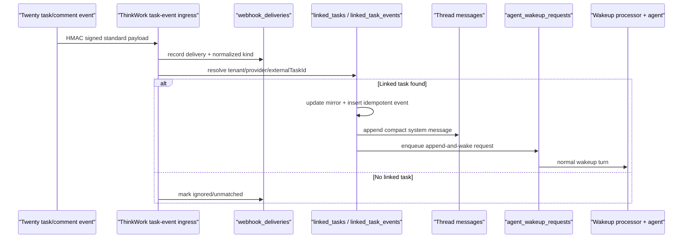

# Thread Event Sources Implementation Plan

## Overview

Thread Event Sources lets approved external producers send structured events into a known ThinkWork Thread, append a compact Thread message, and trigger the normal agent wake loop. The first end-to-end proof is customer onboarding with Twenty:

1. A won opportunity in Twenty starts a Customer Space Thread through the existing CRM opportunity webhook.
2. The Thread/agent creates or mirrors onboarding tasks in Twenty and records the returned Twenty task ids in `linked_tasks`.
3. Later Twenty task status and comment events resolve by `tenant_id + provider + external_task_id`, append a compact system message to the owning Thread, record a durable linked-task event, and enqueue an agent wakeup.

This plan reuses the current linked-task and webhook-event substrate. It does not introduce a CRM-specific link table.

## Requirements Trace

- R1-R4: accept generic external event payloads from approved producers, starting with Twenty task status and comment events.
- R5-R8: route only through known linked task identity; never fuzzy-match by title, customer name, or CRM record text.
- R9-R12: support append-only and append-and-wake policy; default customer onboarding to append-and-wake; agent behavior remains instruction-driven.
- R13-R15: retain unmatched events for diagnostics without waking a Thread or attempting manual attach in v1.
- R16-R18: prefer a Twenty app logic-function producer, keep webhook fallback, and prove the status/comment demo path.

Acceptance examples from the requirements:

- AE1: linked Twenty task status update posts a Thread message and enqueues a wakeup.
- AE2: linked Twenty task comment posts a Thread message and enqueues a wakeup.
- AE3: unknown Twenty task id is retained for diagnostics but does not post or wake.
- AE4: duplicate external event id is idempotent.
- AE5: existing closed-won opportunity kickoff continues to create the onboarding Thread.

## Context And Research

### Existing ThinkWork substrate

- `packages/database-pg/src/schema/linked-tasks.ts` already models mirrored tasks and task events with uniqueness on `(tenant_id, provider, external_task_id)` and `(tenant_id, provider, external_event_id)`.
- `packages/api/src/handlers/webhooks/task-event.ts` already accepts authenticated task events at `POST /webhooks/task-event/{tenantId}` and hands normalized payloads to linked-task sync.
- `packages/api/src/lib/linked-tasks/sync-linked-task.ts` already resolves a linked task by external id, updates the mirror, inserts `linked_task_events`, writes system Thread milestones, and can enqueue the coordinator for completion summaries.
- `packages/database-pg/src/schema/webhook-deliveries.ts` already has the right durable shape for inbound webhook deliveries, including provider event id, external task id, normalized kind, resolution status, thread id, and body preview. Today the token-based `packages/api/src/handlers/webhooks.ts` path writes those rows; the integration-specific `_shared.ts` path used by `task-event` does not yet share that recorder.
- `packages/api/src/handlers/webhooks/_shared.ts` already provides the public webhook auth pattern: per-tenant/per-integration HMAC secret at `thinkwork/tenants/{tenantId}/webhooks/{integration}/signing-secret`, rate limiting, and direct handled responses.
- `packages/api/src/lib/spaces/customer-onboarding-workflow.ts` already starts the Customer Space Thread from the CRM opportunity webhook, creates linked tasks through an external task adapter, and enqueues the kickoff triage wakeup.
- `packages/api/src/handlers/wakeup-processor.ts` processes `agent_wakeup_requests`; the dispatch-parity solution doc warns that new wakeup sources must preserve runtime payload parity with direct chat turns.
- `plugins/twenty/src/manifest.ts` currently ships the Twenty managed application as infrastructure plus MCP server. It does not yet ship a Twenty app package component.

### Existing docs to preserve

- `docs/solutions/architecture-patterns/managed-app-mcp-oauth-lifecycle-2026-06-06.md`: Twenty managed app lifecycle and per-user MCP OAuth are separate state machines. Task creation through Twenty MCP must not fall back to tenant-wide user credentials.
- `docs/solutions/architecture-patterns/wakeup-processor-payload-parity-with-chat-agent-invoke-2026-06-12.md`: any new wakeup source must be validated on the wakeup-dispatched turn, not only the first direct chat turn.
- `packages/api/src/handlers/webhooks/README.md`: new public integration handlers should reuse the webhook route/auth pattern rather than create bespoke auth.

### Twenty docs

Twenty app logic functions are server-side TypeScript functions. The docs describe HTTP, cron, and database-event triggers. Database-event triggers can run on workspace object lifecycle events such as `person.updated`, `*.created`, and filtered `updated` events, and the event payload includes the workspace id, object metadata, record id, actor fields, and before/after/diff/updatedFields data. Logic functions can also expose tools and workflow actions. The plan uses those database-event triggers as the preferred producer path and keeps a signed webhook fallback using the same ThinkWork payload contract.

References:

- `https://docs.twenty.com/developers/extend/apps/getting-started/concepts`
- `https://docs.twenty.com/developers/extend/apps/getting-started/quick-start`
- `https://docs.twenty.com/developers/extend/apps/logic/logic-functions`
- `https://docs.twenty.com/developers/extend/apps/config/install-hooks`

## Key Technical Decisions

1. **Use `linked_tasks`, not a CRM-specific link table.** A Twenty task is just another external task provider. Add `twenty` support to the existing provider checks, GraphQL enum, and sync code.
2. **Keep startup separate from task event replay.** The existing closed-won opportunity webhook remains the Customer Space Thread creation path. Thread Event Sources begins after there is a known Thread/task anchor.
3. **Route only by exact linked task identity.** V1 resolution is `tenant_id + provider + external_task_id`; optional `threadId` in the payload is diagnostic/cross-checking only and must not override the linked task row.
4. **Use `webhook_deliveries` for unmatched diagnostics.** The table already exists for durable inbound event records and can represent unresolved linked task events. Extract/reuse the token webhook delivery recorder or add equivalent integration-specific delivery recording to `_shared.ts`; add columns only if the existing status/kind fields cannot express needed diagnostics.
5. **Post compact system messages, then wake normally.** Status/comment events write `messages.role = "system"` and should keep the existing client-safe sender type, likely `sender_type = "system"`, with metadata such as `source = "external_event"`. Only add a new sender type after checking all clients. Wakeups go through `agent_wakeup_requests`, not bespoke agent logic.
6. **Default customer onboarding to append-and-wake.** The simple v1 wake policy lives in existing JSON metadata/config where possible, with `append_and_wake` as the Customer Space default and `append_only` available for future quieter producers.
7. **Use the same standard payload for Twenty app logic functions and webhook fallback.** Twenty-native logic functions and generic webhook producers both call the same ThinkWork endpoint with HMAC-signed normalized JSON.
8. **Do not hardcode agent behavior.** The wake payload tells the agent what event arrived; the agent's instructions decide whether to update the plan, ask a question, summarize, or stay quiet.

## Target Standard Payload

The ingress should accept a provider-neutral shape and normalize legacy provider variants into it:

```json
{
  "schemaVersion": "thread-event-source.v1",
  "producer": "twenty",
  "eventId": "twenty-event-123",
  "eventType": "task.status_changed",
  "occurredAt": "2026-06-16T15:30:00Z",
  "externalTaskId": "twenty-task-abc",
  "threadId": "optional-cross-check-only",
  "status": "done",
  "comment": {
    "id": "comment-123",
    "body": "Customer uploaded SOC 2.",
    "authorDisplay": "Avery Customer"
  },
  "task": {
    "title": "Collect security documents",
    "url": "https://crm.example/tasks/twenty-task-abc"
  },
  "actor": {
    "providerUserId": "twenty-user-123",
    "displayName": "Avery Customer"
  },
  "metadata": {
    "sourceObject": "task"
  }
}
```

Normalization rules:

- `producer` maps to linked-task provider; initially allow `lastmile`, `thinkwork`, and `twenty` where appropriate.
- `eventId` is the idempotency key for `linked_task_events.external_event_id`; if missing, derive a stable content hash for wakeup idempotency but still record the delivery.
- `externalTaskId` is required for linked-task routing.
- `threadId`, if present, must match the resolved linked task's Thread or the event is rejected/retained without waking.
- Comment text is truncated for the Thread message and retained in metadata/body preview under existing PII retention rules.

## High-Level Flow



## Implementation Units

### U1. Extend linked-task provider and event contracts

Files:

- `packages/database-pg/src/schema/linked-tasks.ts`
- `packages/database-pg/graphql/types/linked-tasks.graphql`
- `packages/api/src/graphql/resolvers/linked-tasks/*`
- Drizzle migration under `packages/database-pg/drizzle/`
- Generated GraphQL/codegen outputs where required

Work:

- Add `twenty` to linked task provider constraints and GraphQL enum.
- Add a `comment_added` linked task event type, unless implementation proves `writeback_posted` is already semantically correct for inbound external comments. Prefer explicit `comment_added` for operator diagnostics.
- Keep the existing unique indexes for exact linked task and external event idempotency.
- Verify GraphQL enum mapping still uppercases provider/event values correctly.

Verification:

- `pnpm --filter @thinkwork/database-pg db:generate` or a hand-authored migration with markers if needed.
- `pnpm schema:build`.
- `pnpm --filter @thinkwork/api test -- src/__tests__/graphql-contract.test.ts`.
- Add/update linked-task resolver tests for `TWENTY` and `COMMENT_ADDED`.

### U2. Generalize task-event normalization for Thread Event Sources

Files:

- `packages/api/src/handlers/webhooks/task-event.ts`
- `packages/api/src/handlers/webhooks/_shared.ts`
- `packages/api/src/handlers/webhooks.ts`
- `packages/api/src/__tests__/webhook-task-event.test.ts`
- `packages/api/src/handlers/webhooks/README.md`
- `scripts/smoke/webhook-smoke.sh`

Work:

- Accept the standard `thread-event-source.v1` payload alongside existing LastMile-shaped payloads.
- Recognize Twenty status update and comment events, including nested Twenty database-event payload shapes if the native app logic function forwards raw Twenty event fields.
- Pass `provider: "twenty"` into linked-task sync.
- Treat unmatched linked task ids as authenticated, retained, non-waking events.
- Extract the token webhook delivery accumulator/recorder into a small shared helper, or add equivalent recording to the integration-specific `_shared.ts` path, so every authenticated task-event request writes exactly one `webhook_deliveries` row.
- Populate delivery metadata fields already present in `webhook_deliveries`: `provider_name`, `provider_event_id`, `external_task_id`, `provider_user_id`, `normalized_kind`, `thread_id`, `resolution_status`, and response status. For unauthenticated traffic, preserve the existing fail-closed/no-enumeration behavior unless the current token webhook recorder already establishes a safe pattern for rejected rows.

Verification:

- Extend `webhook-task-event.test.ts` for Twenty status update, Twenty comment, unknown task id, malformed payload, duplicate event id, and thread id mismatch.
- Re-run `packages/api/src/__tests__/webhook-shared.test.ts` to preserve HMAC and rate-limit behavior.
- Use `scripts/smoke/webhook-smoke.sh --integration task-event` with a Twenty payload fixture.

### U3. Add linked-task event append-and-wake semantics

Files:

- `packages/api/src/lib/linked-tasks/sync-linked-task.ts`
- `packages/api/src/lib/linked-tasks/sync-linked-task.test.ts`
- `packages/api/src/lib/spaces/coordinator-agent.ts` or a new small wakeup helper if the coordinator reason enum should stay customer-onboarding-specific
- `packages/api/src/handlers/wakeup-processor.ts`
- `packages/api/src/handlers/wakeup-processor.*.test.ts`

Work:

- Broaden sync input/repository provider types from LastMile-only to provider-neutral linked task providers.
- Distinguish milestone-only behavior from Thread Event Source behavior:
  - status/comment events from configured event sources append a compact Thread message.
  - append-and-wake policy enqueues an agent wakeup for each idempotent event.
  - duplicate external event ids do not post or enqueue again.
- Add `comment_added` handling that writes a concise message such as `Twenty comment on Collect security documents: Customer uploaded SOC 2.`
- Change the repository event insert path to return the inserted `linked_task_events.id` instead of only `boolean`, so the wakeup payload can reference the exact event row. Duplicate external event ids should return a no-op result without a linked task event id.
- Add wakeup source/reason metadata, for example:
  - `source: "thread_event_source"`
  - `trigger_detail: "twenty:task:<externalTaskId>:<eventType>"`
  - payload includes `threadId`, `spaceId`, `linkedTaskId`, `linkedTaskEventId`, `producer`, `eventType`, compact message, and safe metadata.
- Ensure `wakeup-processor` response persistence does not duplicate messages for this source. If the wakeup itself carries a posted system message, either add the source to `SOURCES_WITH_MESSAGES` only with an explicit test or keep response handling on the standard automation path after validating Thread output.

Verification:

- Unit tests for status change, comment, append-only, append-and-wake, duplicate event id, and completion-summary coexistence.
- Source-inspection or behavior test in `wakeup-processor.system-prompt.test.ts`/dispatch parity tests showing the new wakeup source receives the same runtime fields agents rely on in direct chat.

### U4. Link Twenty task creation/mirroring to ThinkWork tasks

Files:

- `packages/api/src/lib/spaces/customer-onboarding-workflow.ts`
- `packages/api/src/lib/spaces/customer-onboarding-workflow.test.ts`
- Existing task adapter code used by the workflow
- `plugins/twenty/README.md` or plugin docs if the Twenty task tool contract needs to be documented

Work:

- Extend customer onboarding's linked task creation path to support `provider: "twenty"` in addition to `lastmile` and `thinkwork`.
- Record Twenty task ids and URLs returned by task creation/mirroring in `linked_tasks`.
- Preserve native ThinkWork checklist fallback when Twenty task creation is unavailable.
- Do not use tenant-wide Twenty credentials for user-scoped MCP calls. If task creation is agent-driven through Twenty MCP, record the MCP result through a dedicated upsert helper rather than guessing ids later.
- Keep existing won-opportunity Thread kickoff behavior unchanged.

Verification:

- Workflow tests for:
  - external Twenty task creation results become `linked_tasks.provider = "twenty"`.
  - idempotent rerun does not duplicate linked tasks.
  - fallback native checklist still works when Twenty task mirroring is disabled/unavailable.
  - kickoff triage wakeup still enqueues once.

### U5. Add the Twenty producer package/fallback contract

Files:

- `plugins/twenty/`
- `plugins/twenty/test/manifest.test.ts`
- New Twenty app source or smoke fixture files under the plugin boundary
- `docs/brainstorms/2026-06-16-thread-event-sources-requirements.md` only if a clarifying addendum becomes necessary

Work:

- Add a small producer artifact for Twenty task status/comment database events. Preferred shape is a Twenty app logic function that:
  - subscribes to task status/comment changes,
  - maps Twenty's database-event payload into `thread-event-source.v1`,
  - signs the raw JSON body with the tenant integration secret supplied through Twenty app configuration or install-time secret material,
  - posts to `POST /webhooks/task-event/{tenantId}`.
- If the current ThinkWork plugin manifest cannot install Twenty app logic functions yet, keep the native producer artifact as source/documented packaging work and make the webhook fallback the shipped v1 demo path.
- Add payload fixtures used by tests and smoke scripts so future native packaging does not drift from the server contract.

Verification:

- Manifest/package tests continue passing.
- Payload fixture round-trips through `resolveTaskEvent`.
- Operator docs identify the signing secret path and fallback webhook endpoint.

### U6. Diagnostics and operator visibility

Files:

- `packages/api/src/graphql/resolvers/webhooks/*`
- `packages/database-pg/graphql/types/webhooks.graphql`
- Existing webhook delivery tests

Work:

- Because integration-specific task-event deliveries may have `webhook_id = null`, add a tenant-scoped admin diagnostics query/filter if `webhookDeliveries(webhookId)` cannot expose them.
- Ensure unmatched events are queryable by provider name, event id, external task id, normalized kind, resolution status, and received time.
- Document that delivery rows are PII-bearing and already subject to the 90-day cleanup policy.

Verification:

- Resolver tests cover unmatched task events appearing with non-waking status.
- No event body or comment text is added to analytics/export paths.

### U7. End-to-end verification runbook

Files:

- New or updated verification doc under `docs/`
- `scripts/smoke/webhook-smoke.sh`
- Optional Twenty smoke script under `plugins/twenty/smoke/`

Work:

- Write the exact E2E validation recipe for Verification:
  - install/deploy Twenty managed app through ThinkWork,
  - connect the current user's Twenty MCP auth,
  - trigger a won opportunity,
  - verify Customer Space Thread creation,
  - verify ThinkWork-created/mirrored Twenty tasks have `linked_tasks` rows,
  - send or trigger status/comment events,
  - observe Thread messages,
  - observe queued/finished wakeup turns,
  - observe unmatched event diagnostics,
  - teardown through ThinkWork managed-application flow.
- Include SQL/GraphQL snippets for inspecting linked task rows, delivery rows, messages, and wakeup requests without exposing secrets.

Verification:

- Runbook reviewed against AGENTS.md's application-plugin verification gate.
- Smoke fixture can be executed against a deployed stage with a real HMAC signature.

## Ordering

1. U1 provider/event schema and generated contracts.
2. U2 payload normalization and delivery retention.
3. U3 linked-task append-and-wake behavior.
4. U4 customer onboarding Twenty task linking.
5. U5 Twenty producer artifact/fallback fixtures.
6. U6 diagnostics query/doc adjustments.
7. U7 E2E verification runbook.

U2 and U3 can be developed with fake repository tests after U1 contracts are in place. U4 should land before deployed E2E so there is a real linked Twenty task to route events into. U5 can run in parallel once the server contract is stable.

## Verification Strategy

Local/static verification:

- `pnpm --filter @thinkwork/database-pg db:generate` or validate hand-authored migration markers.
- `pnpm schema:build`.
- `pnpm --filter @thinkwork/api codegen`.
- `pnpm --filter @thinkwork/web codegen`, `pnpm --filter @thinkwork/mobile codegen`, and `pnpm --filter @thinkwork/cli codegen` if GraphQL schema outputs change.
- `pnpm --filter @thinkwork/api test -- src/__tests__/webhook-task-event.test.ts src/__tests__/webhook-shared.test.ts src/lib/linked-tasks/sync-linked-task.test.ts src/lib/spaces/customer-onboarding-workflow.test.ts src/__tests__/graphql-contract.test.ts`.
- `pnpm --filter @thinkwork/api test -- src/handlers/wakeup-processor.system-prompt.test.ts src/handlers/wakeup-processor.dispatch-parity.test.ts` if wakeup payload/source logic changes.
- `pnpm --filter @thinkwork/plugin-twenty test` if plugin fixtures/manifest change.
- `pnpm format:check`.

Deployed Verification acceptance:

1. Twenty is installed through the ThinkWork managed-application path and the MCP connector is connected for the acting user.
2. A Twenty won-opportunity event starts a new Customer Space Thread through the existing `crm-opportunity` route.
3. The onboarding flow creates or mirrors multiple Twenty tasks and records `linked_tasks.provider = "twenty"` with external task ids, space id, and Thread id.
4. A Twenty status update for a linked task produces exactly one `linked_task_events` row, one compact Thread system message, one delivery row, and one queued/finished `agent_wakeup_requests` item.
5. A Twenty comment for a linked task produces the same post-and-wake evidence with `comment_added`.
6. Replaying the same external event id does not create a second linked task event, Thread message, or wakeup.
7. Sending an event for an unknown Twenty task id creates a diagnostic delivery row and does not create a Thread message or wakeup.
8. The wakeup turn is a normal agent turn; any response is governed by the Thread/agent instructions, not hardcoded event logic.
9. Teardown goes through the ThinkWork managed-application flow, and the verification record includes teardown evidence.

## Risks And Mitigations

- **Twenty native app packaging may not be installable by the current plugin manifest.** Mitigation: keep the server-side contract and signed webhook fallback as the v1 shippable path, with native logic-function source/fixtures ready for the app-package upgrade.
- **Twenty logic functions need access to the ThinkWork endpoint and signing secret.** Mitigation: treat endpoint/tenant/secret injection as part of the producer contract; if Twenty app configuration cannot store the secret safely in v1, use the webhook fallback until plugin install hooks can provision it.
- **Comment events may not have a stable Twenty object/event shape across releases.** Mitigation: normalize from the standard payload first; keep raw Twenty payload handling isolated to the producer artifact and fixtures.
- **Wakeup message duplication is easy to miss.** Mitigation: add source-specific wakeup processor tests and inspect Thread messages in deployed E2E.
- **Provider enum/check constraint changes can drift across Drizzle, GraphQL, and resolver mapping.** Mitigation: include schema build, GraphQL contract tests, and migration review in the first unit.
- **User-scoped Twenty MCP credentials can be bypassed accidentally.** Mitigation: keep task creation through existing MCP auth paths and fail closed to native ThinkWork checklist when the user is not connected.
- **PII in comments and webhook previews.** Mitigation: reuse `webhook_deliveries` retention/redaction guidance, truncate Thread messages, and avoid analytics/export surfaces.
- **Unmatched events could tempt fuzzy matching.** Mitigation: tests explicitly assert unknown task id is retained but does not post or wake.

## Rollout Notes

- Roll out behind server-side support for `provider = "twenty"` and the task-event route first.
- Configure per-tenant signing secret at `thinkwork/tenants/{tenantId}/webhooks/task-event/signing-secret`.
- Start with operator-triggered/smoke webhook fallback payloads before enabling automatic Twenty logic-function forwarding.
- After deployed validation, enable the Twenty producer for one Customer Space workflow before generalizing to other producers.
- Monitor `webhook_deliveries` for `resolution_status = ignored/error`, `linked_task_events` duplicate rates, and `agent_wakeup_requests` backlog for `thread_event_source`.

## Out Of Scope

- Fuzzy matching events to Threads/tasks.
- A broad CRM-work-links table or CRM-specific routing UI.
- Manual attach/replay UI for unmatched events.
- Vendor-specific agent behavior hardcoded in the event handler.
- General support for non-task CRM events beyond the payload envelope and diagnostics.

## Open Questions For Implementation

1. What exact Twenty task/comment object names and database-event trigger filters are available in the self-hosted Twenty version deployed by ThinkWork?
2. Does the current plugin package/manifest system have a supported app-logic-function component type, or should native producer installation wait for a plugin-platform follow-up?
3. Should the v1 wake policy be stored on Thread metadata, Space integration metadata, or workflow config? Prefer existing JSON metadata unless implementation finds an existing policy object.
4. What exact message `sender_type` values are accepted by all clients? Default to `sender_type = "system"` with metadata `source = "external_event"` unless client review proves a new sender type is safe.
