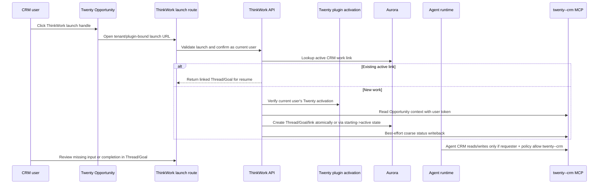
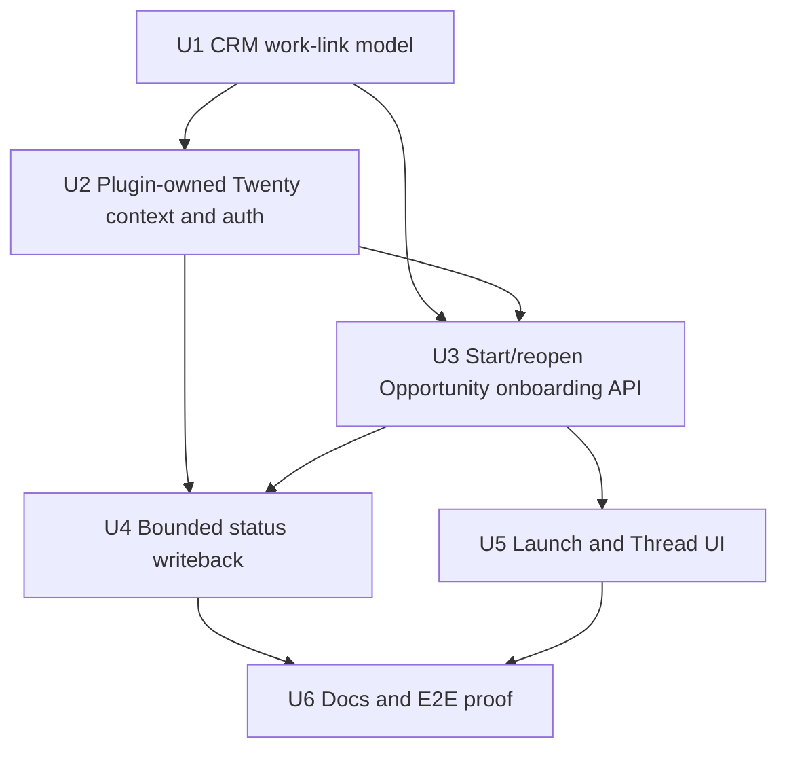

# feat: Add Twenty-native Operating Surface Spike

## Overview

Add the first Twenty-native ThinkWork workflow: a revenue or customer-facing user starts customer onboarding from a Twenty Opportunity record, ThinkWork creates or reopens the linked Thread/Goal, the agent uses the current user's Twenty plugin activation for CRM reads and bounded writeback, and the user can resume from either the CRM record or the ThinkWork work trail.

The spike proves product shape, not a full CRM app inside ThinkWork. Twenty remains the business/customer operating surface. ThinkWork remains the governed runtime, Thread ledger, Goal contract, review path, memory, audit, and operating evidence source.

V1 is intentionally Opportunity-only. Company launch is deferred until the product has a clear Company-to-outcome mapping.

---

## Problem Frame

ThinkWork can already deploy Twenty as a managed application, install the Twenty plugin, and expose the plugin-owned `twenty--crm` MCP component. The missing layer is the business workflow bridge: CRM users should not have to leave an Opportunity record, re-explain the account in generic chat, and manually connect the result back to the CRM.

The safest first entry point is a ThinkWork-authenticated launch route reached from a lightweight Twenty launch handle on the Opportunity record. The launch route verifies tenant/app binding, preserves the selected CRM context, checks the current user's Twenty plugin activation, and asks the user to confirm start/resume before any new work is created. This keeps user-scoped authorization and ThinkWork governance load-bearing while still making the CRM record the starting surface.

The spike is falsifiable. It should answer whether starting from a Twenty Opportunity is materially better than the current ThinkWork-side onboarding/chat-plus-connector path.

---

## Requirements Trace

- R1. Twenty records are the starting point for business work.
- R2. ThinkWork does not rebuild Twenty-owned CRM primitives.
- R3. ThinkWork remains the source of truth for agent execution, audit, memory, approvals, cost, guardrails, evaluations, and long-running state.
- R4. Repeated starts for the same CRM record and workflow reopen/resume linked work unless the user deliberately starts a separate outcome.
- R5. The first workflow starts from a Twenty Opportunity record and creates or reopens a linked ThinkWork Thread.
- R6. Accountable onboarding work promotes the Thread into a Goal with owner, mode, progress, completion rule, and review policy.
- R7. Twenty-side status remains lightweight: coarse state, generic next action, and a link to ThinkWork.
- R8. Human decisions, approvals, exception handling, and completion review stay in ThinkWork.
- R9. CRM reads/writes use the current user's Twenty plugin activation; no tenant-wide credential fallback is allowed.
- R10. Twenty UI owns record inspection, CRM views, manual record actions, tasks, notes, and object context.
- R11. ThinkWork UI owns Thread detail, Goal detail, audit, governance, runtime health, plugin/OAuth health, review queues, and diagnostics.
- R12. Customer-sensitive or revenue-sensitive decisions route to ThinkWork Thread/Goal context before the agent proceeds.
- R13. The smallest proof uses one configured record class and one repeatable workflow: opportunity-to-customer-onboarding.
- R14. The spike proves the full loop: CRM record -> linked ThinkWork work -> user-authorized CRM context -> lightweight CRM status -> resume from both surfaces.
- R15. The spike includes at least one human review or missing-input path.
- R16. The team can see whether the CRM record became a better starting point than generic chat plus a connector.
- R17. Executive Operating Review remains a companion branch; v1 preserves its evidence trail without building the review dashboard.
- R18. Later operating review must combine CRM state with ThinkWork Thread/Goal state.
- R19. Operating-review summaries must drill into both CRM records and ThinkWork work trails.

**Origin actors:** A1 revenue/customer-facing user, A2 ThinkWork agent runtime, A3 workflow owner, A4 operator, A5 customer/external stakeholder, A6 manager/executive reviewer.

**Origin flows:** F1 start accountable work from a CRM record, F2 resume work from either surface, F3 human review or missing input, F4 configure the first workflow, F5 review operational state across accounts.

**Origin acceptance examples:** AE1 CRM record starts/reopens Thread, AE2 onboarding Thread becomes Goal, AE3 Twenty shows lightweight status while ThinkWork keeps the ledger, AE4 approval happens in ThinkWork under user auth, AE5 spike evidence proves or disproves the product bet, AE6 linked onboarding Goals preserve operating-review evidence.

---

## Scope Boundaries

### Deferred for later

- Company-record launch. It needs an explicit Company-to-onboarding outcome model, including how to choose or create the Opportunity when a Company has multiple active Opportunities.
- Rich embedded ThinkWork panels inside Twenty beyond the smallest status/action handle needed for the spike.
- Broad support for every Twenty object type, workflow trigger, and custom object.
- Bidirectional synchronization of every ThinkWork status, event, task, approval, artifact, and audit item into Twenty.
- A generalized cross-CRM abstraction for Salesforce, HubSpot, Attio, or other CRMs.
- Background-only Twenty workflow execution that starts agent work without a ThinkWork confirmation screen.
- A manager-facing Executive Operating Review dashboard/query UI. V1 preserves link/provenance data so a later plan can build that readout after several linked onboarding Goals exist.

### Outside this product's identity

- Replacing Twenty with a ThinkWork-native CRM.
- Making Twenty the source of truth for agent execution, audit, guardrails, memory, or review policy.
- Treating Twenty tasks as ThinkWork's durable workflow engine.
- Building a generic "AI assistant inside every app" surface where CRM record context is incidental.

---

## Context & Research

### Current Plugin Architecture

- Current `main` uses root plugin packages as first-party source boundaries. Twenty-owned runtime/deployment/smoke/test code belongs under `plugins/twenty/`.
- The Twenty package owns the manifest, Terraform runtime source, smoke scripts, and plugin package export:
  - `plugins/twenty/src/index.ts`
  - `plugins/twenty/src/manifest.ts`
  - `plugins/twenty/src/deployment/managed-app.ts`
  - `plugins/twenty/src/api/cutover.ts`
  - `plugins/twenty/terraform/twenty/*`
  - `plugins/twenty/smoke/*`
- `packages/plugin-catalog` owns plugin package validation and component contracts.
- Twenty MCP is plugin-owned after cutover. The v1 runtime path should resolve the installed `twenty` plugin, its `crm` MCP component, the plugin-owned `tenant_mcp_servers` row with slug `twenty--crm`, and the current user's active plugin activation/token.
- Legacy `managed_application_key="twenty-crm"` rows and per-server `user_mcp_tokens` are compatibility/cutover fallback only, not the primary plan path.

### Relevant Code and Patterns

- `plugins/twenty/README.md`, `plugins/twenty/src/manifest.ts`, and `plugins/twenty/src/api/cutover.ts` are the current Twenty package boundary.
- `packages/api/src/lib/plugins/activation.ts`, `packages/api/src/lib/plugins/handlers/mcp.ts`, and `packages/api/src/lib/plugins/dispatch-parity.test.ts` cover plugin activation and MCP dispatch behavior.
- `packages/api/src/lib/mcp-configs.ts` is still the runtime assembly seam; this plan must verify it includes the plugin-owned `twenty--crm` row for the requester when the Space/agent policy allows it.
- `packages/api/src/lib/spaces/customer-onboarding-workflow.ts` creates/reopens onboarding Threads, ensures Goals, records missing-input requests, creates linked task/checklist rows, and refreshes Goal files.
- `packages/api/src/graphql/resolvers/spaces/startCustomerOnboarding.mutation.ts` is the current authenticated manual-start seam.
- `packages/api/src/handlers/webhooks/crm-opportunity.ts` is the current CRM opportunity webhook seam for close-won onboarding events. This plan should reuse workflow behavior without turning the authenticated launch route into a background-only webhook.
- `packages/database-pg/src/schema/threads.ts` and `packages/database-pg/src/schema/goals.ts` provide metadata fields, but R4 needs an indexed durable link table rather than metadata-only lookup.
- `apps/web/src/components/spaces/StartOnboardingDialog.tsx` is the existing ThinkWork-side onboarding start UI.
- `apps/web/src/components/settings/SettingsCrm.tsx` and plugin settings surfaces separate infrastructure/plugin health from user activation state.
- `apps/web/src/components/workbench/SpacesThreadDetailRoute.tsx` renders Goal state, review actions, checklist progress, and customer-onboarding metadata.

### Institutional Learnings

- `docs/solutions/architecture-patterns/plugin-source-boundaries-package-owned-deploy-verified-2026-06-17.md`: first-party plugin source belongs under `plugins/<plugin-key>/`; platform packages should expose provider-neutral seams.
- `docs/solutions/architecture-patterns/managed-app-mcp-oauth-lifecycle-2026-06-06.md`: managed applications should reconcile real MCP connectors, keep user OAuth separate, and never fall back to tenant-wide credentials for CRM user actions.
- `docs/solutions/integration-issues/twenty-crm-email-ses-config-2026-06-06.md`: health checks and login are insufficient proof for Twenty; release verification must exercise the actual user-facing path.
- `docs/src/content/docs/concepts/goals.mdx`: Goals are the outcome contract, and Goal markdown is context, not authority.
- `docs/src/content/docs/concepts/threads.mdx`: integration-origin work should reopen by external metadata rather than creating duplicate Threads.

### External References

- Twenty Objects docs: standard People, Companies, Opportunities, Notes, Tasks, and custom objects support the selected CRM record scope. https://docs.twenty.com/user-guide/data-model/capabilities/objects
- Twenty Workflow Triggers docs: manual triggers can pass selected records through Cmd+K/top-navbar actions; record-created triggers are risky for manually-created records because Twenty autosaves before fields are complete. https://docs.twenty.com/user-guide/workflows/capabilities/workflow-triggers
- Twenty Workflow Actions docs: workflow actions can search/update/upsert records and make HTTP requests; v1 should use this only for lightweight handles or follow-up repair until self-hosted parity is verified. https://docs.twenty.com/user-guide/workflows/capabilities/workflow-actions
- Twenty product/app-extension positioning: Twenty is evolving toward composable CRM/internal apps, but this repo should verify self-hosted app extension capability before depending on rich embedded panels. https://twenty.com/

---

## Key Technical Decisions

| Decision | Rationale |
| --- | --- |
| Use an authenticated ThinkWork launch route as the v1 start confirmation | It preserves current-user Cognito identity and user-scoped Twenty plugin activation while still letting the user begin from a Twenty Opportunity handle. |
| Scope v1 to Twenty Opportunity -> Customer Onboarding | This satisfies R13, avoids undefined Company mapping, and reuses the existing customer-onboarding workflow, Goal, checklist, and review paths. |
| Keep public API first-slice-specific | Use `startTwentyCustomerOnboarding` or an equivalently constrained mutation; provider/object/workflow/outcome fields are internal link keys, not a generalized CRM workflow API. |
| Add a durable CRM work-link table | R4 duplicate prevention and later operating-review evidence need indexed, queryable state; Thread/Goal metadata remains useful provenance but should not be the only key. |
| Use plugin-owned Twenty auth and MCP dispatch | Current architecture resolves Twenty through the `twenty` plugin install/component and user plugin activation, with legacy managed-MCP token paths as fallback only. |
| Keep Twenty-specific source in `plugins/twenty` | Platform API/web code should expose provider-neutral CRM workflow seams; Twenty MCP normalization, package smokes, and package docs live in the Twenty plugin package. |
| Write back only non-sensitive CRM-visible status | V1 writeback is coarse state, generic next action, and authenticated ThinkWork deep link. Owner names, missing-field details, approval reasons, and runtime/audit details stay in ThinkWork. |
| Preserve operating-review evidence as link/provenance data | R17 makes Executive Operating Review a companion branch; v1 should preserve data without shipping a manager-facing dashboard/query UI. |

---

## Terminology Contract

- **Launch handle:** a Twenty-visible affordance on an Opportunity record that opens the ThinkWork launch route. It is used to start or resume work.
- **Status handle:** a Twenty-visible status/update artifact written by ThinkWork after start/reopen or required review states. It is used to show coarse state and a ThinkWork link.
- V1 may use the same underlying Twenty artifact type for both if deployed tools force it, but implementation must treat their responsibilities separately so status writeback never overwrites the launch path.
- The Twenty-side entry experience must be discoverable on the Opportunity record without requiring the user to retype record context in ThinkWork. If the only available v1 handle is a manually installed link/note, Verification must classify the result as an integration proof, not a fully native operating-surface proof.

---

## Launch Contract

### Canonical route

Use a generic platform route with constrained v1 values:

```text
/crm/:provider/:objectType/:objectId/:workflowKey
```

Allowed v1 values:

- `provider = "twenty"`
- `objectType = "opportunity"`
- `workflowKey = "customer_onboarding"`
- `objectId = <Twenty Opportunity id>`

Required query/state:

- `tenantSlug` or `tenantId`
- `pluginInstallId` or a signed launch nonce that resolves to tenant + plugin install + managed app context
- optional `outcomeKey`; omitted means the default onboarding outcome
- optional display snapshot fields, treated as untrusted hints only

Server-side validation before side effects:

- caller is authenticated and belongs to the tenant named by the launch state
- the `twenty` plugin install belongs to that tenant and has a `crm` MCP component
- the resolved MCP row is plugin-owned for that install, normally slug `twenty--crm`
- the current user has an active Twenty plugin activation when creating new work, refreshing CRM context, or writing CRM status
- the Opportunity is readable through that user's Twenty plugin MCP token
- optional `outcomeKey` is normalized and collision-checked before it can create separate work

Malformed links, unsupported values, tenant mismatch, missing plugin install, missing activation, or unreadable Opportunity show a bounded error and do not create Thread, Goal, link, or writeback rows.

### Auth detour

If the launch route needs a Twenty activation, pass the full current launch URL as `returnTo` to the plugin activation flow, preferably `/settings/plugins/twenty`. Success returns to the launch confirmation with Opportunity context intact. Failure or cancellation returns to the launch route with an actionable error and leaves work unstarted.

### Existing-link resume

Lookup of a bound active CRM work link may happen before requiring fresh Twenty activation, after tenant and ThinkWork access checks. If a valid link exists, the route may return the Thread/Goal for resume with a `crmAuthRequiredForRefresh` status. A live Twenty activation is still required for creating new work, refreshing CRM facts, or writing CRM status.

### Separate outcomes

If a link already exists, the launch confirmation defaults to "Resume existing work." A secondary "Start separate onboarding outcome" action requires explicit confirmation and a user-visible outcome name/key. The API must reject accidental duplicate outcome keys.

---

## Data, Security, And Privacy Contract

- Launch params and record snapshots are untrusted hints. Persisted CRM facts must come from the user-authorized Twenty plugin MCP read. If snapshot data conflicts with MCP data, show the verified MCP value or reject the launch.
- Escape any snapshot text rendered on the confirmation screen.
- `crm_work_links` stores only the minimum fields required for duplicate prevention, provenance, status/writeback state, and later evidence. Do not persist raw provider payloads unless implementation records a specific field-level need.
- Allowed metadata should be explicit and redacted: provider/object identifiers, sanitized record display name, record URL, workflow/outcome key, status/writeback state, plugin install/component ids, and safe diagnostic codes.
- Avoid customer emails, billing addresses, deal value, free-form notes, approval reasons, missing-field contents, and raw comments in link metadata or logs.
- GraphQL fields containing CRM/customer metadata are tenant-scoped and role-scoped. Cross-account list/readiness surfaces are tenant owner/admin or operator-only. Ordinary Space members see CRM provenance only through already-authorized Thread/Goal detail.
- Verification evidence in Linear must redact sensitive CRM/customer data.
- Link rows should survive Thread/Goal deletion as tombstoned historical evidence where policy allows. Prefer lifecycle columns (`state`, `archived_at`, `deactivated_at`, `deleted_thread_id`) and `SET NULL`/restricted deletes over cascade deletion.
- Background writeback must revalidate that the stored requester is still active in the tenant, can access the linked Space/Thread, and has an active plugin activation for the same plugin-owned MCP row. Otherwise record pending reauth/reassignment and do not write.

---

## High-Level Technical Design



---

## Implementation Units



### U1. CRM Work-Link Model

**Goal:** Add a durable, tenant-scoped link between one Twenty Opportunity onboarding outcome and the ThinkWork Thread/Goal that owns execution.

**Requirements:** R3, R4, R7, R17, R18, R19; F2, F5; AE3, AE6.

**Files:**

- Create: `packages/database-pg/src/schema/crm-work-links.ts`
- Create: `packages/database-pg/drizzle/NNNN_crm_work_links.sql`
- Modify: `packages/database-pg/src/schema/index.ts`
- Modify: `packages/database-pg/graphql/types/*.graphql`
- Test: `packages/database-pg/__tests__/schema-crm-work-links.test.ts`
- Test: `packages/api/src/__tests__/graphql-contract.test.ts`

**Approach:**

- Model provider, object type, object id, object URL, workflow key, outcome key, Thread id, Goal id, requester user id, last authorized writeback user id, plugin install id, MCP component/server id, lifecycle state, status handle fields, last writeback state, and sanitized provider metadata.
- Allow only `provider="twenty"`, `object_type="opportunity"`, and `workflow_key="customer_onboarding"` in v1 API helpers.
- Enforce tenant isolation and a partial unique active link for `(tenant_id, provider, object_type, object_id, workflow_key, outcome_key)` where state is active/starting.
- Use lifecycle columns (`state`, `archived_at`, `deactivated_at`, `failure_code`, `failure_message`) so partial starts and historical evidence are explicit.
- Prefer tombstoned/deactivated rows over cascade deletion. Tests should prove completed/cancelled/deleted work remains inspectable enough for later operating-review evidence.
- Avoid raw provider payload persistence. Store only approved, sanitized metadata fields.

**Verification:**

- Schema and migration tests cover active uniqueness, tombstone behavior, tenant scoping, sanitized metadata shape, and GraphQL contract generation.

---

### U2. Plugin-Owned Twenty Context And Auth

**Goal:** Resolve Twenty Opportunity context and status-write capability through the installed Twenty plugin, current user's plugin activation, and plugin-owned MCP component.

**Requirements:** R1, R5, R9, R10, R14; F1, F4; AE1, AE4.

**Files:**

- Create provider-neutral API helpers under `packages/api/src/lib/crm-record-workflows/`
- Add Twenty-specific context/writeback adapter code under `plugins/twenty/src/api/`
- Add Twenty-specific tests under `plugins/twenty/test/api/`
- Modify: `packages/api/src/lib/plugins/*` only for generic extension points needed by CRM workflow code
- Test: `packages/api/src/lib/plugins/dispatch-parity.test.ts`
- Test: plugin package tests for `plugins/twenty`

**Approach:**

- Locate the installed `twenty` plugin and its `crm` MCP component/`tenant_mcp_servers` row (`management_source="plugin"`, slug normally `twenty--crm`, `plugin_install_id` set).
- Require an active `UserPluginActivation` for the requester when creating new work, refreshing CRM context, or writing CRM status.
- Resolve/call MCP through the same plugin activation token path used by `buildMcpConfigs`.
- Keep legacy `managed_application_key="twenty-crm"` and per-server token lookup only as compatibility fallback for pre-cutover tenants.
- Verify the Customer Onboarding Space/coordinating agent policy allows the plugin-owned Twenty MCP server. Add tests proving `buildMcpConfigs` includes `twenty--crm` for the requester and that Space/workspace MCP policy does not filter it out.
- Isolate exact deployed Twenty tool names behind the `plugins/twenty` adapter.

**Verification:**

- Tests prove connected plugin users can resolve Opportunity context, disconnected users receive plugin-activation-required responses, legacy fallback is bounded, and runtime dispatch includes `twenty--crm` only for authorized requester + allowed policy.

---

### U3. Start Or Reopen Twenty Opportunity Onboarding

**Goal:** Add the API path that starts from one Twenty Opportunity record, creates or reopens linked customer-onboarding work, promotes/ensures the Goal, and persists the CRM work link.

**Requirements:** R1, R3, R4, R5, R6, R8, R12, R13, R14, R15, R16; F1, F2, F3, F4; AE1, AE2, AE4, AE5.

**Files:**

- Create: `packages/api/src/graphql/resolvers/crm/startTwentyCustomerOnboarding.mutation.ts`
- Create: `packages/api/src/graphql/resolvers/crm/startTwentyCustomerOnboarding.mutation.test.ts`
- Create/modify provider-neutral CRM resolver index files as needed
- Modify: `packages/database-pg/graphql/types/*.graphql`
- Modify: `packages/api/src/lib/spaces/customer-onboarding-workflow.ts`
- Modify: `packages/api/src/lib/spaces/customer-onboarding-workflow.test.ts`

**Approach:**

- Public mutation is first-slice-specific, for example `startTwentyCustomerOnboarding`.
- Accept only `objectType=OPPORTUNITY`, Opportunity id/url, tenant/plugin launch context, optional untrusted record snapshot, and optional explicit outcome key.
- Verify tenant membership, Space access, tenant/plugin binding, and launch contract before any side effects.
- Lookup an active bound link before requiring fresh Twenty activation. Existing active link returns the linked Thread/Goal and an auth-refresh/writeback status if the current user's plugin activation is missing.
- Creating new work requires active Twenty plugin activation and an MCP read of the Opportunity. Snapshot data may only help the confirmation UI; persisted facts come from the MCP read.
- Create Thread/Goal/link in one DB transaction when practical. If not practical, use a two-phase link state (`starting` -> `active` -> `failed`) and reopen only active links with valid Thread/Goal ids.
- Make coordinator wakeup and CRM writeback post-commit best-effort.
- Keep missing-input behavior so the spike includes a ThinkWork review/request path.

**Verification:**

- Tests cover start, reopen without fresh CRM auth, create requiring plugin activation, tenant/app mismatch, untrusted snapshot conflict, separate outcome confirmation/keying, partial-start failure repair, and missing-input review path.

---

### U4. Bounded Twenty Status Writeback

**Goal:** Write a minimal, non-sensitive Twenty-side status handle that shows coarse ThinkWork state and a link back to the Thread/Goal.

**Requirements:** R7, R8, R9, R10, R11, R12, R14, R15; F2, F3; AE3, AE4.

**Files:**

- Create provider-neutral writeback orchestration under `packages/api/src/lib/crm-record-workflows/`
- Add Twenty-specific writeback adapter under `plugins/twenty/src/api/`
- Add Twenty-specific writeback tests under `plugins/twenty/test/api/`
- Modify customer-onboarding workflow/progress helpers only where the first slice needs status facts

**Approach:**

- V1 writeback triggers are start/reopen and the required customer-onboarding missing-input/review state. Defer generic `reviewGoal`, `updateThread`, completion/cancellation, and broad lifecycle hooks unless verification proves they are required for the first loop.
- CRM-visible fields are non-sensitive by construction: authenticated ThinkWork deep link, coarse state, and generic action label. Avoid owner names, missing-field details, approval reasons, customer-sensitive notes, audit/runtime data, and internal diagnostics.
- Before background writeback, revalidate requester tenant membership, Space/Thread access, plugin activation, and CRM record writability. If invalid, record pending reauth/reassignment and do not write.
- Writeback failure does not roll back Thread/Goal work. Record failure state on the link.
- Retry policy for v1: retry on next relevant onboarding state change and expose an operator/user repair action when permitted. Do not introduce a scheduled retry worker in this slice.

**Verification:**

- Tests prove writeback is user-scoped, non-sensitive, best-effort, and limited to the v1 onboarding states.

---

### U5. Launch And Thread UI Continuity

**Goal:** Build the web launch/confirmation surface and Thread/Goal provenance UI so users can start from Twenty and resume from either surface.

**Requirements:** R1, R2, R7, R10, R11, R12, R14, R16; F1, F2, F3; AE1, AE3, AE4, AE5.

**Files:**

- Create generic route/component files under `apps/web/src/routes/_authed/crm.$provider.$objectType.$objectId.$workflowKey.tsx` and `apps/web/src/components/crm/`
- Keep Twenty-specific copy/fixtures/setup docs under `plugins/twenty/`
- Modify: `apps/web/src/lib/graphql-queries.ts`
- Modify: `apps/web/src/components/settings/SettingsCrm.tsx` only for provider-neutral/plugin-linked setup affordances
- Modify: `apps/web/src/components/workbench/SpacesThreadDetailRoute.tsx`

**Approach:**

- Launch route validates the v1 allowlist: `twenty`, `opportunity`, `customer_onboarding`.
- Auth-required state deep-links to the Twenty plugin activation page with `returnTo` preserving the full launch URL.
- Existing-link state shows "Resume existing work" as primary. "Start separate onboarding outcome" is secondary, explicit, and requires user-visible outcome key/name confirmation.
- CRM Settings IA remains bounded:
  - Deployment/plugin health
  - Launch handle setup
  - User plugin activation link
  - Linked-work diagnostics only for admin/operator roles
  - Empty states for not provisioned, plugin not installed, no user activation, no linked work, and writeback failure
- Thread detail shows a CRM provenance block with prioritized actions: open CRM record, copy ThinkWork link, view writeback state, repair/reconnect when permitted, and jump to Goal review.
- Review ergonomics matrix for CRM-origin onboarding should define visible context, allowed actors, actions, disabled/loading/error states, Thread/Goal transition, and resulting writeback for missing input, approval needed, changes requested, approved/completed, canceled, writeback pending, and writeback failed.

**Verification:**

- Web tests cover launch, auth-required return flow, reopen, separate outcome confirmation, malformed params, Thread provenance actions, and review/writeback states.

---

### U6. Documentation, Smoke Path, And Spike Proof

**Goal:** Document setup and provide explicit end-to-end validation for Verification against the deployed ThinkWork/Twenty plugin path.

**Requirements:** R13, R14, R15, R16, R17, R18, R19; F1-F5; AE1-AE6.

**Files:**

- Create: `docs/verification/twenty-native-operating-surface.md`
- Modify: `docs/src/content/docs/applications/admin/managed-applications.mdx`
- Modify: plugin/admin docs that describe Twenty plugin activation and launch handle setup
- Modify: `docs/src/content/docs/concepts/goals.mdx`
- Add/modify Twenty package smoke fixtures under `plugins/twenty/smoke/` if needed

**Approach:**

- Document setup: Twenty managed app running, `twenty` plugin installed, `crm` MCP component approved, current user activated for the plugin, Customer Onboarding Space available, Opportunity record has launch handle.
- Define the exact Verification checklist and evidence to collect in Linear.
- Require deployed ThinkWork/Twenty verification before implementation can be marked done.
- Preserve teardown expectations for temporary CRM records, handles, and test users.
- Add spike proof criteria:
  - compare Twenty-record start against current ThinkWork-side onboarding/chat-plus-connector path
  - record time to correct Thread/Goal, amount of re-explaining avoided, duplicate-work rate, resume success from both surfaces, missing-input/review completion, and revenue-user confidence
  - define a go/no-go outcome: continue only if the Twenty Opportunity path clearly reduces re-entry/context setup and users can resume from both surfaces without duplicate work

**Verification:**

- The Verification worker has a clear, executable checklist and does not have to infer product proof criteria from implementation PRs.

---

## Ordering And Rollout

1. U1 additive schema/migration and GraphQL contract.
2. U2 plugin-owned Twenty context/auth and runtime MCP assignment proof.
3. U3 first-slice `startTwentyCustomerOnboarding` API.
4. U4 bounded writeback for start/reopen and required review state.
5. U5 launch route and Thread provenance UI.
6. U6 verification docs/smoke/proof criteria.

Deployment sequence:

1. Land additive DB schema and migration.
2. Run `pnpm schema:build` and codegen for every consumer with a `codegen` script.
3. Deploy API/web only after migration is applied or guard code paths until every deployed environment has `crm_work_links`.
4. Enable launch/writeback verification in one deployed stage.
5. Keep native/rich Twenty app extension packaging disabled until self-hosted capability is proven.

---

## System-Wide Impact

- **Interaction graph:** Twenty Opportunity launch handle -> generic web confirmation route -> first-slice GraphQL mutation -> CRM link persistence -> customer-onboarding workflow -> Goal/review -> plugin-owned Twenty writeback.
- **Error propagation:** Auth/access/tenant-binding failures block before side effects. CRM writeback failures are recorded on the link and surfaced in ThinkWork without rolling back Thread/Goal work.
- **State lifecycle risks:** Duplicate creation is prevented by the CRM work-link key. Partial starts are represented by lifecycle state, not active half-links.
- **API surface parity:** GraphQL schema changes require codegen for `apps/web`, `apps/mobile`, `apps/cli`, and `packages/api` if shared generated artifacts are touched.
- **Plugin source boundary:** Provider-neutral platform code belongs in platform packages; Twenty-specific adapters, smokes, and package docs belong under `plugins/twenty`.
- **Integration coverage:** Unit tests prove contracts, but release readiness requires deployed ThinkWork + Twenty plugin activation + real Opportunity launch + status writeback.

---

## Risks & Mitigations

| Risk | Mitigation |
| --- | --- |
| Self-hosted Twenty lacks the exact tools needed for status writeback | Isolate tool discovery in `plugins/twenty`; start with the smallest supported handle; treat missing write capability as a Verification blocker with evidence rather than adding tenant credentials. |
| Launch route feels less native than an embedded Twenty app | Define the minimum native-entry bar and classify manual-link fallback as integration proof rather than full native proof. Preserve the API contract for future Twenty app extensions. |
| Duplicate Threads appear if same Opportunity starts from multiple handles | U1 unique active link and U3 reopen-first behavior are required before UI launch ships. |
| CRM writeback discloses sensitive ThinkWork state | Write back only coarse non-sensitive status and authenticated ThinkWork link. Keep owner names, missing details, review reasons, and audit/runtime data in ThinkWork. |
| User/plugin authority changes after start | Revalidate tenant/Space access and plugin activation before background writeback; otherwise record pending reauth/reassignment. |
| Operating-review scope expands into dashboard work | V1 preserves link/provenance data only; dashboard/query UI is deferred. |

---

## Documentation / Operational Notes

- Implementation should update GraphQL codegen in every consumer with a `codegen` script after schema changes.
- Web verification from a worktree must copy `apps/web/.env` from the main checkout before running the dev server, per AGENTS.md.
- Deployed Verification must prove the actual ThinkWork/Twenty plugin path: managed Twenty running, plugin installed, plugin MCP approved, user activation connected, Opportunity launch, Thread/Goal creation or reopen, user-authorized CRM context, lightweight status writeback, missing-input/review routing, and resume from both surfaces.
- Do not mutate production or run destructive CRM cleanup during automated verification without explicit action-time approval.

---

## End-to-End Validation Criteria for Verification

- A deployed Twenty CRM instance is running and visible from ThinkWork CRM settings.
- The `twenty` plugin is installed; its `crm` MCP component is approved/enabled and resolves to the plugin-owned `twenty--crm` row.
- The verifying user activates the Twenty plugin, and runtime evidence shows `buildMcpConfigs` includes `twenty--crm` for that requester when the Customer Onboarding Space/agent policy allows it.
- A real Twenty Opportunity record includes the configured ThinkWork launch handle.
- Starting from that Opportunity opens the ThinkWork launch route with tenant/plugin-bound context.
- Confirming start creates a new Thread and Goal, or reopens the existing linked Thread/Goal for the same Opportunity/workflow/outcome key.
- Reopening an existing linked Opportunity works even if CRM refresh/writeback requires reactivation; it must not create duplicate work.
- The agent/runtime reads CRM context using the verifying user's Twenty plugin activation; evidence must show no tenant-wide credential fallback.
- Twenty receives a coarse, non-sensitive status handle with current state and a ThinkWork Thread/Goal link.
- A missing-input or review-required path routes the human to ThinkWork Thread/Goal context and does not proceed through background CRM-only action.
- Thread detail shows CRM provenance and writeback status/actions.
- Launch params and snapshots are treated as untrusted; persisted facts come from user-authorized MCP reads.
- Verification records redacted screenshots/browser observations, relevant URLs, Opportunity id, Thread/Goal ids, status writeback evidence, product proof metrics, and cleanup actions in Linear.
- Spike conclusion states whether the Twenty Opportunity path beats the current ThinkWork-side onboarding/chat-plus-connector path on context setup, duplicate avoidance, resume success, and revenue-user confidence.

---

## Sources & References

- Origin document: [docs/brainstorms/2026-06-16-twenty-native-operating-surface-requirements.md](../brainstorms/2026-06-16-twenty-native-operating-surface-requirements.md)
- Supporting Linear document: `Requirements: Twenty-native ThinkWork operating surface`
- Supporting Linear document: `Twenty-native ThinkWork workflow options`
- Related plan: [docs/plans/2026-06-05-003-feat-twenty-crm-managed-app-plan.md](2026-06-05-003-feat-twenty-crm-managed-app-plan.md)
- Related plan: [docs/plans/2026-06-06-003-feat-twenty-crm-mcp-oauth-plan.md](2026-06-06-003-feat-twenty-crm-mcp-oauth-plan.md)
- Related learning: [docs/solutions/architecture-patterns/plugin-source-boundaries-package-owned-deploy-verified-2026-06-17.md](../solutions/architecture-patterns/plugin-source-boundaries-package-owned-deploy-verified-2026-06-17.md)
- Related learning: [docs/solutions/architecture-patterns/managed-app-mcp-oauth-lifecycle-2026-06-06.md](../solutions/architecture-patterns/managed-app-mcp-oauth-lifecycle-2026-06-06.md)
- Related learning: [docs/solutions/integration-issues/twenty-crm-email-ses-config-2026-06-06.md](../solutions/integration-issues/twenty-crm-email-ses-config-2026-06-06.md)
- Related code: `plugins/twenty/src/manifest.ts`
- Related code: `plugins/twenty/src/api/cutover.ts`
- Related code: `packages/api/src/lib/plugins/activation.ts`
- Related code: `packages/api/src/lib/plugins/handlers/mcp.ts`
- Related code: `packages/api/src/lib/mcp-configs.ts`
- Related code: `packages/api/src/lib/spaces/customer-onboarding-workflow.ts`
- Related code: `packages/api/src/graphql/resolvers/spaces/startCustomerOnboarding.mutation.ts`
- Linear issue: THNK-33
- Prior artifact PRs: #2543, #2544, and #2551
- Twenty Objects docs: https://docs.twenty.com/user-guide/data-model/capabilities/objects
- Twenty Workflow Triggers docs: https://docs.twenty.com/user-guide/workflows/capabilities/workflow-triggers
- Twenty Workflow Actions docs: https://docs.twenty.com/user-guide/workflows/capabilities/workflow-actions
- Twenty product/app-extension positioning: https://twenty.com/
