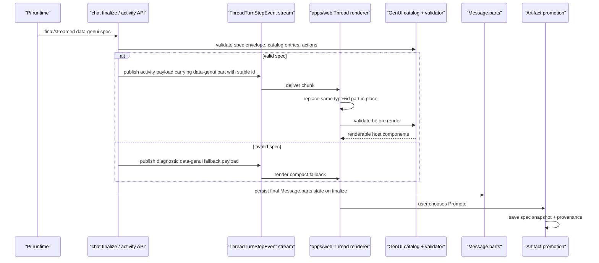
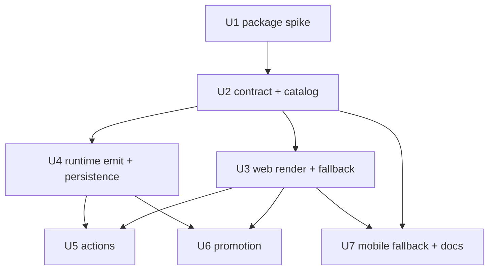

# feat: Thread GenUI with json-render

## Overview

Add a first-class `data-genui` typed message part for web Threads so agents can
stream small, host-owned UI surfaces inline in the conversation. The v1 path is
web-first, catalog-constrained, and persisted in `Message.parts` for
conversation reloads, but not promoted into durable artifacts by default; users
deliberately promote useful inline UI into durable artifacts.

The preferred render substrate is `@json-render/core` + `@json-render/react`,
but production adoption is gated by an explicit spike because the current npm
release has peer and bundle questions against `apps/web`. If the spike fails,
the product contract remains: a host-owned JSON registry with the same
`data-genui` envelope, validation, actions, persistence, fallback, and
promotion behavior.

---

## Problem Frame

ThinkWork Threads currently have the right transport primitives for streamed
and persisted typed parts, but unknown `data-*` parts render only as compact
debug strips. THNK-34 needs that substrate to become a real operating surface:
agents can compose task cards, decision panels, summaries, compact forms, and
other conversation-native UI without sending arbitrary TSX, imports, CSS, or
browser code. The origin requirements define the product shape and explicitly
defer the technical choices around json-render validation, catalog scope,
update semantics, action routing, persisted payload shape, fallbacks, promotion,
and mobile compatibility (see origin: `docs/brainstorms/2026-06-16-generative-ui-json-render-requirements.md`).

---

## Requirements Trace

### Transport & Updates

- R1. Web Threads support an explicit `data-genui` typed message part, not
  markdown fences or raw assistant text.
- R2. Every `data-genui` part has a stable id for in-place streamed updates.
- R4. Same-id updates replace the existing rendered UI instead of appending
  duplicate cards.
- R9. V1 uses whole-spec replacement for same-id updates; patching is deferred
  unless the spike proves json-render patches are required and safer.

### Catalog & Renderer Substrate

- R3. The payload is a structured JSON spec constrained by a host-owned catalog.
- R6. json-render packages must pass React 19, Vite, Tailwind/shadcn, pnpm,
  bundle, license, and security gates before production adoption.
- R7. Prefer json-render when the spike validates the fit.
- R8. If json-render fails, preserve the JSON/catalog product contract with a
  smaller host-owned renderer instead of returning to agent-authored TSX.
- R10. ThinkWork owns the catalog; agents compose only approved entries.

### Rendering & Fallbacks

- R5. V1 renders in `apps/web`; mobile compatibility is a design constraint and
  fallback requirement.
- R13. Generated UI matches the web Thread visual language and does not add
  nested chrome that fights message layout.
- R15. Invalid or unsupported specs render a compact recoverable fallback.
- R16. Generated UI remains tenant-scoped and does not fetch tenant data from
  the browser except through allowlisted host actions.

### Actions

- R11. Catalog actions are allowlisted and schema-validated.
- R12. Actions that need agent follow-up route through normal Thread
  message/command/wakeup paths.

### Persistence & Promotion

- R14. Persisted `Message.parts` retain the final generated UI spec for reload.
- R17. Inline generated UI does not automatically create artifacts.
- R18. Users have a deliberate way to promote useful inline UI into a durable
  artifact.
- R19. Promotion snapshots the current spec plus provenance; later inline
  updates do not mutate the saved artifact.

### Mobile & Rollout Invariants

- R20. The contract has a mobile compatibility story through a shared subset or
  graceful mobile fallback.
- R21. Existing mobile `_type` GenUI cards and web durable artifact rendering
  keep working during rollout.
- R22. V1 does not replace AppSync subscriptions, AI SDK `UIMessage`, or
  `Message.parts` persistence.

**Origin actors:** A1 end user, A2 ThinkWork agent runtime, A3 web Thread
renderer, A4 host component catalog owner, A5 durable artifact path, A6 mobile
Thread renderer.

**Origin flows:** F1 agent streams a new inline UI, F2 agent updates an existing
inline UI, F3 user invokes an allowed action, F4 user reopens a Thread
containing inline UI, F5 user promotes inline UI to a durable artifact.

**Origin acceptance examples:** AE1 render approved task review card, AE2
same-id update and reload final card once, AE3 unsupported component fallback,
AE4 approve action routes through Thread state, AE5 save dashboard preview as
artifact snapshot, AE6 mobile fallback plus existing mobile GenUI continuity.

---

## Scope Boundaries

- V1 is web Thread conversation rendering first.
- V1 does not replace AppSync, `UIMessage`, `Message.parts`, or the current
  Thread wake/finalize flow.
- V1 does not use markdown fences as the canonical generated UI transport.
- V1 does not let agents ship arbitrary React/TSX, imports, CSS, browser APIs,
  or same-origin executable code through this path.
- V1 does not automatically persist every generated UI as an artifact.
- V1 does not migrate existing applets or durable artifacts to json-render.
- V1 does not require broad catalog coverage; the first catalog should prove a
  small useful subset.
- V1 does not make json-render a platform-wide dependency until U1 passes the
  adoption gates.

### Deferred to Follow-Up Work

- Full mobile render parity for the json-render catalog after the web contract
  stabilizes.
- json-render patch/diff updates if real implementation evidence shows
  whole-spec replacement is too heavy or loses useful progressive behavior.
- Catalog marketplace, tenant-authored components, or runtime-installed catalog
  entries.
- Migration of durable applets/artifacts onto the `data-genui` renderer.

---

## Context & Research

### Relevant Code and Patterns

- `apps/web/src/lib/ui-message-chunk-parser.ts` already treats any `data-*`
  chunk as protocol traffic and validates known AI SDK chunk shapes, but the
  older `ComputerThreadChunk` subscription it was built for is retired.
- `apps/web/src/lib/ui-message-merge.ts` already replaces a `data-*` part by
  matching `type` and `id`, which supports whole-spec replacement for
  `data-genui` without changing the subscription schema.
- `apps/web/src/components/workbench/render-typed-part.tsx` is the single web
  switch for typed parts; unknown `data-*` currently render as a small debug
  strip.
- `apps/web/src/components/workbench/TaskThreadView.tsx` and
  `apps/web/src/components/spaces/ThreadConversation.tsx` normalize persisted
  `Message.parts` and render typed parts on reload.
- `packages/database-pg/graphql/types/messages.graphql` and
  `packages/database-pg/src/schema/messages.ts` expose/persist `Message.parts`
  as `AWSJSON`/`jsonb`; no database migration is needed for an additive
  `data-genui` shape.
- `packages/database-pg/graphql/types/subscriptions.graphql` exposes the
  current live stream as `ThreadTurnStepEvent.payload` via
  `onThreadTurnStep`; `packages/api/src/handlers/chat-agent-activity.ts`
  persists those events and publishes them best-effort.
- `packages/api/src/lib/chat-finalize/process-finalize.ts` is the turn-finalize
  path that inserts assistant messages or reuses runtime-created messages.
- `packages/pi-runtime-core/src/activity-client.ts` and
  `packages/pi-runtime-core/src/finalize-client.ts` are the current runtime
  callback clients for live activity and durable finalize payloads.
- `packages/agentcore-pi/agent-container/src/server.ts` owns the active Pi
  runtime response/finalize callback path for agent turns.
- `packages/api/src/graphql/resolvers/artifacts/createArtifact.mutation.ts` and
  `packages/api/src/graphql/resolvers/applets/applet.shared.ts` are the
  existing durable artifact/applet persistence references.
- `apps/mobile/lib/genui-registry.ts` is the current mobile `_type`/```genui
  registry precedent; it is not the canonical web contract.

### Institutional Learnings

- `docs/plans/2026-05-13-006-feat-computer-inline-genui-fragment-lifecycle-plan.md`
  already established the lifecycle pattern: stable inline part ids, same-id
  in-place updates, `messages.parts` persistence, ephemeral-by-default, and
  explicit save.
- `docs/solutions/architecture-patterns/recipe-catalog-llm-dsl-validator-feedback-loop-2026-05-01.md`
  supports catalog + schema validation with actionable errors rather than
  trusting prompts.
- `docs/plans/2026-05-10-004-refactor-artifact-payloads-s3-plan.md` and
  `docs/solutions/architecture-patterns/per-turn-snapshot-needs-content-addressed-immutable-storage.md`
  support snapshotting promoted outputs instead of linking durable records to
  mutable inline state.
- `docs/solutions/ui-bugs/failed-thread-turn-default-open-layout-shift-2026-06-14.md`
  warns that fallback/error UI in Threads must stay compact and visually stable.
- `docs/solutions/architecture-patterns/wakeup-processor-payload-parity-with-chat-agent-invoke-2026-06-12.md`
  requires runtime capability parity between direct chat and wakeup/resume
  paths.
- `docs/solutions/architecture-patterns/inert-first-seam-swap-multi-pr-pattern-2026-05-08.md`
  supports landing parser/schema/fallback safely before live runtime emission.

### External References

- [json-render docs](https://json-render.dev/docs) describe the catalog model:
  developers define components/actions, the model emits constrained JSON, and
  host components render natively.
- [vercel-labs/json-render](https://github.com/vercel-labs/json-render) is
  Apache-2.0 and documents `@json-render/core`, `@json-render/react`,
  `@json-render/shadcn`, and `@json-render/react-native`.
- npm metadata checked during planning showed `@json-render/*` version `0.19.0`
  with Apache-2.0 license. `@json-render/react` peers on React `^19.2.3`, while
  `apps/web` currently declares React `^19.0.0`; this is a U1 adoption gate.

---

## Key Technical Decisions

| Decision                                                       | Rationale                                                                                                                                                                                |
| -------------------------------------------------------------- | ---------------------------------------------------------------------------------------------------------------------------------------------------------------------------------------- |
| `data-genui` is an additive AI SDK `data-*` part               | It reuses the existing parser, merge, render, and persisted `parts` surfaces while riding the current `ThreadTurnStepEvent.payload` live stream and finalize persistence path.           |
| V1 uses whole-spec replacement by stable id                    | The existing data-part merge already replaces by `type` + `id`; this satisfies in-place UX with less complexity than patch semantics.                                                    |
| json-render is gated, not assumed                              | The product requirement is safe Thread-native generated UI. Package fit, React peer compatibility, bundle impact, and API stability must be proven before production dependency landing. |
| Catalog and validation are host-owned code                     | Agents can compose only approved components, props, data bindings, and action ids. Tenant/runtime-authored components are out of v1 scope.                                               |
| Validation runs before render and before persistence/promotion | Specs are untrusted input even when host components render them. Invalid specs fail closed into a compact fallback.                                                                      |
| Actions route through Thread state                             | UI actions become normal host-validated Thread messages or command/wakeup events so the work stays auditable in the conversation.                                                        |
| Promotion snapshots the current spec                           | A durable artifact captures the current spec and provenance. Later inline updates are conversation state only and do not mutate saved outputs.                                           |
| Mobile v1 fallback is explicit                                 | Mobile must not blank or crash on `data-genui`; it can render a readable summary/fallback while shared catalog parity is planned later.                                                  |

---

## Open Questions

### Resolved During Planning

- **Whole-spec vs patch updates:** Use whole-spec replacement for v1. Defer
  patches until implementation evidence justifies the added validation and
  conflict complexity.
- **Persisted payload shape:** Persist the final `data-genui` part as a
  canonical data envelope under `Message.parts`: stable `type`, `id`, and a
  `data` object containing schema version, spec, status/diagnostics, action
  metadata, and mobile fallback summary.
- **Fallback posture:** Invalid, malformed, unsupported, or catalog-mismatched
  specs render a compact `GenUIFallback`, not the generic unknown-data strip.
- **Promotion semantics:** Use an explicit user gesture that snapshots the
  current spec and source message provenance into the existing artifact path.

### Deferred to Implementation

- Exact json-render package APIs and import names after the U1 spike; the plan
  should not hard-code them before the dependency is installed and compiled.
- Final catalog component names and prop schemas after design/implementation
  starts; the v1 scope is fixed, not every prop name.
- Exact action transport for each initial action. The plan constrains action
  routing to existing Thread message/command/wakeup paths, but implementers may
  choose the narrowest existing hook per action.
- Exact display route for promoted `data-genui` snapshots. Planning chooses
  `ArtifactType.DATA_VIEW` with `metadata.kind = "genui_snapshot"` to avoid an
  enum/schema migration in v1; implementation owns the viewer details.

---

## High-Level Technical Design

> _This illustrates the intended approach and is directional guidance for review, not implementation specification. The implementing agent should treat it as context, not code to reproduce._



---

## Implementation Units

The units are ordered so the contract and fallbacks can land before live agent
emission. U1 can run in parallel with some design prep, but no production
json-render dependency or live runtime emission should merge until U1 passes.



- U1. **Validate json-render adoption gates**

**Goal:** Prove or reject `@json-render/core`, `@json-render/react`, and
optionally `@json-render/shadcn` as the production substrate for `data-genui`.

**Requirements:** R6, R7, R8, R20.

**Dependencies:** None.

**Files:**

- Modify: `apps/web/package.json`
- Modify: `pnpm-lock.yaml`
- Create: `docs/spikes/2026-06-17-json-render-adoption.md`
- Test: `apps/web/src/components/workbench/genui/json-render-smoke.test.tsx`

**Approach:**

- Install only the minimal packages needed for a compile/render smoke. Treat
  `@json-render/shadcn` as optional; prefer ThinkWork-owned components for v1
  if the prebuilt package pulls in too much UI surface.
- Verify TypeScript compile, Vite test bundling, React 19 peer compatibility,
  pnpm workspace lock behavior, bundle impact, Apache-2.0 license, and basic
  renderer behavior using a tiny host catalog.
- Add package trust gates before production adoption: package provenance,
  transitive dependency review, vulnerability/license scan, pinned lockfile
  state, no `eval`/dynamic code execution, no hidden dynamic import or remote
  fetch behavior, CSP compatibility, and a documented fallback if any gate
  fails.
- Record the verdict in the spike doc. If any material gate fails, keep U2-U7
  intact but implement the renderer with a small host-owned registry using the
  same spec envelope.

**Execution note:** Run this as a characterization spike before production
renderer work. The spike may add and then remove package dependencies if the
gate fails; the final PR should leave the lockfile in the chosen state.

**Patterns to follow:**

- `apps/web/src/components/workbench/render-typed-part.test.tsx` for focused
  renderer smoke coverage.
- Existing package-gated plan docs under `docs/spikes/` or `docs/plans/` for
  recording adoption evidence.

**Test scenarios:**

- Happy path: a minimal approved spec renders a host component inside a jsdom
  test without arbitrary code.
- Error path: a spec with an unknown component fails validation before render.
- Error path: a spec with invalid props fails validation with a diagnostic that
  can be displayed to a developer/agent.
- Compatibility: the smoke compiles against `apps/web` React/Vite/Tailwind
  versions without peer overrides or hidden duplicate React copies.
- Security: the spike confirms the renderer does not require `eval`, remote
  fetches, unsafe CSP changes, or unreviewed vulnerable/transitive packages.
- Fallback path: if json-render is rejected, the spike doc records concrete
  evidence and names the host-registry fallback path.

**Verification:**

- The spike doc states go/no-go with evidence.
- The minimal smoke test passes in `apps/web`.
- `pnpm-lock.yaml` reflects only the chosen dependency state.

- U2. **Define the `data-genui` contract and v1 catalog**

**Goal:** Create the durable contract, TypeScript types, validation schema, and
small v1 host catalog that all emitters/renderers/promoters use.

**Requirements:** R1, R2, R3, R9, R10, R11, R13, R14, R15, R16, R20, R22; AE1,
AE2, AE3, AE4, AE6.

**Dependencies:** U1 only for the renderer-adapter verdict. The
substrate-agnostic envelope, shared validation package, and catalog contract can
start before U1 finishes because they must survive either verdict.

**Files:**

- Create: `docs/specs/thread-genui-json-render-contract-v1.md`
- Create: `packages/genui/package.json`
- Create: `packages/genui/tsconfig.json`
- Create: `packages/genui/src/catalog.ts`
- Create: `packages/genui/src/spec.ts`
- Create: `packages/genui/src/validation.ts`
- Create: `packages/genui/src/actions.ts`
- Create: `packages/genui/src/diagnostics.ts`
- Create: `packages/genui/src/hash.ts`
- Modify: `packages/api/package.json`
- Modify: `packages/pi-runtime-core/package.json`
- Modify: `packages/agentcore-pi/package.json`
- Modify: `apps/web/package.json`
- Modify: `apps/mobile/package.json`
- Modify: `apps/web/src/components/workbench/genui/catalog.ts`
- Modify: `apps/web/src/lib/ui-message-types.ts`
- Test: `packages/genui/src/validation.test.ts`
- Test: `packages/genui/src/hash.test.ts`
- Test: `apps/web/src/lib/ui-message-chunk-parser.test.ts`
- Test: `apps/web/src/lib/ui-message-merge.test.ts`

**Approach:**

- Define a canonical envelope for persisted and streamed parts:
  `type: data-genui`, stable `id`, and `data` containing `schemaVersion`,
  `catalogVersion`, `spec`, `status`, optional sanitized `diagnostic`, optional
  `actions`, required `mobileFallback`, optional promotion metadata, and a
  spec hash when persisted or promoted.
- Put canonical types, catalog schemas, validation, limits, action descriptors,
  and diagnostic codes in `packages/genui` so web, API, runtime, mobile, action
  routing, and promotion consume the same contract. Keep React renderer
  components and visual composition in `apps/web`.
- Include canonicalization and spec-hash helpers in `packages/genui`; action
  submissions and promotion requests must bind to the exact spec revision the
  user saw, not only the stable part id.
- Keep v1 catalog deliberately small: a task/decision card, metric summary,
  compact table/list, and simple form/action component are enough to satisfy
  the requirements without inventing a component marketplace.
- Name the first v1 workflow as **task review and approval**: a Thread agent can
  present a task review card, update its status in place, accept one approved
  action, and let the user promote the resulting review snapshot. Metric,
  table/list, and form components should support that workflow first; broader
  dashboard-style catalog coverage is follow-up unless needed for the workflow.
- Validate component names, props, action ids, mobile fallback summaries,
  catalog version compatibility, payload size/depth, table row/chart point
  limits, URL/media fields, strict unknown-key rejection, and disallowed
  browser/data-fetch behavior.
- Define a fail-closed URL/media policy: v1 should default to no remote media
  or same-origin/proxied artifact media only, no credentials, strict referrer
  behavior, type/size limits, and sanitized diagnostics for disallowed URLs.
- Define per-component interaction/layout contracts for the v1 catalog,
  including required regions, priority order, primary action placement,
  diagnostic placement, empty content behavior, collapse/overflow behavior,
  read-only versus actionable regions, and required versus optional fields.
- Specify same-id whole-spec replacement in the contract and assert the current
  `ui-message-merge.ts` behavior with tests.

**Patterns to follow:**

- Existing `data-user-question`, `data-runbook-confirmation`, and queue data
  parts for canonical `data-*` envelope shape.
- `docs/specs/computer-ai-elements-contract-v1.md` for stream-protocol contract
  style, while making this web Thread spec its own current contract.

**Test scenarios:**

- Covers AE1. A valid task review spec with id `genui:task-review:123` passes
  validation and preserves its stable id.
- Covers AE2. Two `data-genui` chunks with the same id leave one accumulated
  part with the second whole spec.
- Covers AE3. Unknown component `UnapprovedChart3D` fails validation and
  produces a diagnostic payload.
- Covers AE4. Unknown action id or invalid action params fail closed.
- Edge case: missing `schemaVersion`, missing `spec.root`, missing `elements`,
  non-object props, and oversized payloads fail validation.
- Edge case: catalog version mismatch either renders through a compatible
  catalog adapter or fails into fallback with only sanitized component/version
  diagnostics.
- Edge case: specs over v1 depth, row, chart point, or byte limits are rejected
  before render.
- Edge case: disallowed remote media or URL fields fail validation before render
  and expose only sanitized component/version diagnostics.
- Edge case: same id with different part type does not corrupt unrelated
  `data-*` parts.
- Integration: persisted `Message.parts` JSON using the contract normalizes
  into a renderable `AccumulatedPart`.

**Verification:**

- Contract doc covers wire shape, persisted shape, validation, update semantics,
  action semantics, fallback semantics, promotion provenance, and mobile
  fallback fields.
- API/runtime/web/mobile import the same `packages/genui` contract in tests.
- Type/parser/merge tests pass without GraphQL or database schema changes.

- U3. **Render web Thread GenUI with compact fallbacks**

**Goal:** Render valid `data-genui` parts inline in web Threads and replace the
generic debug strip with a recoverable `GenUIFallback` for invalid or
unsupported generated UI.

**Requirements:** R1, R3, R4, R5, R10, R13, R14, R15, R16, R21, R22; AE1,
AE2, AE3.

**Dependencies:** U1, U2.

**Files:**

- Create: `apps/web/src/components/workbench/genui/GenUIRenderer.tsx`
- Create: `apps/web/src/components/workbench/genui/GenUIFallback.tsx`
- Create: `apps/web/src/components/workbench/genui/components/TaskReviewCard.tsx`
- Create: `apps/web/src/components/workbench/genui/components/DecisionPanel.tsx`
- Create: `apps/web/src/components/workbench/genui/components/MetricSummary.tsx`
- Create: `apps/web/src/components/workbench/genui/components/CompactTable.tsx`
- Create: `apps/web/src/components/workbench/genui/components/ActionForm.tsx`
- Modify: `apps/web/src/components/workbench/render-typed-part.tsx`
- Modify: `apps/web/src/components/workbench/TaskThreadView.tsx`
- Modify: `apps/web/src/components/spaces/ThreadConversation.tsx`
- Test: `apps/web/src/components/workbench/genui/GenUIRenderer.test.tsx`
- Test: `apps/web/src/components/workbench/genui/GenUIFallback.test.tsx`
- Test: `apps/web/src/components/workbench/render-typed-part.test.tsx`
- Test: `apps/web/src/components/workbench/TaskThreadView.test.tsx`
- Test: `apps/web/src/components/spaces/ThreadConversation.test.tsx`

**Approach:**

- Add a `data-genui` branch in `render-typed-part.tsx` that validates before
  rendering. Invalid specs render `GenUIFallback` and preserve surrounding text
  and message layout.
- Track last-good live render state for same-id updates during an active stream:
  an invalid update shows a compact "update rejected" warning beside the
  previous-good UI instead of blanking the card. Persisted final invalid specs
  render fallback because there is no durable last-good state in v1.
- Keep components visually native to the Thread surface: dense, quiet, no nested
  card chrome when the message bubble already provides structure, and stable
  dimensions for loading/error states.
- Define responsive and accessibility behavior for each catalog component and
  fallback: narrow and wide Thread widths, mobile fallback boundaries, minimum
  touch targets, keyboard tab order, focus restoration after action/promotion,
  form/table semantics, screen-reader labels, `aria-live` handling for same-id
  updates and rejected updates, and horizontal overflow versus stacking rules.
- Reuse `normalizePersistedParts` so reloaded Threads render final specs from
  `Message.parts`; live streams and persisted reloads should use the same
  renderer.

**Patterns to follow:**

- `UserQuestionCard` and `RunbookConfirmation` typed-part rendering for
  structured inline UI.
- `GeneratedArtifactCard.tsx` for compact artifact affordance density.
- The fallback lessons in `docs/solutions/ui-bugs/failed-thread-turn-default-open-layout-shift-2026-06-14.md`.

**Test scenarios:**

- Covers AE1. Valid task review spec renders host-owned task card inline.
- Covers AE2. Rerendering with the same part id and a changed spec updates the
  visible UI in place without a duplicate card.
- Covers AE2. A valid card followed by an invalid same-id live update keeps the
  last-good card visible and adds a compact rejected-update warning.
- Covers AE2. Reloaded persisted `Message.parts` renders one final card.
- Covers AE3. Unknown component renders `GenUIFallback` with component name and
  no arbitrary code execution.
- Error path: invalid props render fallback while text before/after the part
  remains visible.
- Error path: thrown renderer error is caught and converted to fallback.
- Edge case: empty table/list states render stable empty states.
- Accessibility: action controls have accessible names, keyboard focus, and do
  not trap focus inside a message.

**Verification:**

- Web typed-part tests prove valid, invalid, live, and persisted paths.
- Manual dev smoke can inject a fixture part and see inline GenUI plus fallback
  behavior in both Workbench and Spaces Thread surfaces.

- U4. **Emit and persist `data-genui` from the runtime path**

**Goal:** Let the active agent runtime emit validated `data-genui` parts during
Thread turns and ensure final assistant messages persist the final specs in
`Message.parts`.

**Requirements:** R1, R2, R3, R4, R10, R14, R15, R16, R22; AE1, AE2, AE3.

**Dependencies:** U2, U3.

**Files:**

- Modify: `packages/agentcore-pi/agent-container/src/server.ts`
- Modify: `packages/agentcore-pi/agent-container/tests/server.test.ts`
- Modify: `packages/pi-runtime-core/src/activity-client.ts`
- Modify: `packages/pi-runtime-core/src/finalize-client.ts`
- Modify: `packages/pi-runtime-core/src/agent-loop.ts`
- Modify: `packages/api/src/lib/chat-finalize/types.ts`
- Modify: `packages/api/src/lib/chat-finalize/notify.ts`
- Modify: `packages/api/src/lib/chat-finalize/process-finalize.ts`
- Modify: `packages/api/src/handlers/chat-agent-activity.ts`
- Modify: `packages/api/src/handlers/wakeup-processor.ts`
- Modify: `apps/web/src/components/workbench/SpacesThreadDetailRoute.tsx`
- Modify: `apps/web/src/lib/graphql-queries.ts`
- Test: `packages/api/src/handlers/chat-agent-finalize.test.ts`
- Test: `packages/api/src/handlers/chat-agent-activity.test.ts`
- Test: `packages/pi-runtime-core/src/finalize-client.test.ts`
- Test: `packages/pi-runtime-core/src/activity-client.test.ts`
- Test: `apps/web/src/components/workbench/SpacesThreadDetailRoute.test.tsx`

**Approach:**

- Add a narrow runtime helper/tool surface that accepts a candidate GenUI spec,
  validates it through `packages/genui`, assigns or preserves a stable part id,
  and emits the canonical `data-genui` part in both live activity payloads and
  final response parts.
- Use the current `ThreadTurnStepEvent.payload` stream for live updates. Do not
  build on the retired `ComputerThreadChunkEvent`/`onComputerThreadChunk` path;
  `packages/api/src/__tests__/graphql-contract.test.ts` intentionally asserts
  that path is gone.
- Define a concrete `ThreadTurnStepEvent.payload` envelope for UIMessage chunks,
  for example a namespaced activity payload that carries `kind`, `seq`,
  `messageId` or run id, and the `UIMessageChunk`. Add a web adapter/reducer
  that routes only those GenUI/typed-part payloads through
  `mergeUIMessageChunk`, uses sequence numbers for replay dedupe, and keeps
  ordinary activity events in the existing activity timeline.
- Support reconnect/replay from stored `threadTurnEvents(afterSeq)` where
  available; nil, empty, malformed, duplicate, and non-GenUI payloads must be
  ignored or surfaced as compact diagnostics without corrupting
  `streamState.parts`.
- Mirror capability through both direct chat and wakeup/resume dispatch so
  scheduled or resumed turns can emit the same UI.
- On finalize, persist only the final known `data-genui` spec per id in
  `Message.parts`; do not persist a mutation log.
- Treat `Message.parts` as the canonical durable contract for assistant GenUI.
  Keep `content` as preview/fallback text so `notifyNewMessage` can stay
  lightweight and clients can refetch message detail after finalize.
- Invalid runtime specs should produce a diagnostic part/fallback, not a
  malformed persisted row or arbitrary browser behavior.
- Update both `insertAssistantMessage` in `packages/api/src/lib/chat-finalize/notify.ts`
  and the separate wakeup/background insert path in
  `packages/api/src/handlers/wakeup-processor.ts`; otherwise active chat and
  resumed/scheduled turns will diverge.

**Execution note:** Implement runtime emission test-first around direct and
wakeup parity. This area has a history of one dispatch path receiving a new
capability before the other.

**Patterns to follow:**

- `packages/api/src/lib/user-questions/question-message.ts` for structured
  question parts persisted in messages.
- `packages/api/src/handlers/chat-agent-activity.ts` for live
  `ThreadTurnStepEvent` delivery that does not replace finalize as the durable
  record.
- `docs/solutions/architecture-patterns/wakeup-processor-payload-parity-with-chat-agent-invoke-2026-06-12.md`.

**Test scenarios:**

- Covers AE1. Runtime emits a valid `data-genui` task card with stable id and
  the web receives it through `onThreadTurnStep.payload`.
- Covers AE1. The web `ThreadTurnStepEvent` adapter converts only the typed-part
  payloads into `streamState.parts` and does not pollute the activity timeline.
- Covers AE2. Runtime emits two specs with the same id; activity stream sends
  updates and finalize persists the final spec once.
- Covers AE3. Runtime attempts an unsupported component; API/runtime emits a
  diagnostic payload and does not persist an invalid renderable spec.
- Error path: validation failure is surfaced to the agent as actionable feedback
  and capped to avoid infinite retry loops.
- Integration: direct chat dispatch and wakeup/resume dispatch both include the
  GenUI capability and produce the same persisted part shape.
- Integration: reconnect/replay after a missed live event dedupes by sequence
  and converges to the same final visible part.
- Error path: nil, empty, malformed, duplicate, or unrelated activity payloads
  do not mutate the GenUI part accumulator.
- Integration: `notifyNewMessage` remains content-only, and the web client
  refetches message detail on assistant finalize/new-message events so parts
  appear for viewers that missed live activity.
- Security: tenant id/thread id are resolved server-side; a spec cannot request
  tenant data fetches from the browser.

**Verification:**

- API/runtime tests prove live event and final persisted state.
- No GraphQL schema or AppSync subscription replacement is needed.
- A local or dev-stage smoke turn can produce at least two catalog-constrained
  cards and one same-id update.

- U5. **Route catalog actions through Thread state**

**Goal:** Make allowlisted GenUI actions useful without giving generated UI
arbitrary client behavior.

**Requirements:** R11, R12, R13, R16; AE4.

**Dependencies:** U2, U3, U4.

**Files:**

- Create: `apps/web/src/components/workbench/genui/actions.ts`
- Create: `apps/web/src/components/workbench/genui/use-genui-action.ts`
- Create: `packages/api/src/graphql/resolvers/messages/handleGenUIAction.mutation.ts`
- Modify: `apps/web/src/components/workbench/genui/GenUIRenderer.tsx`
- Modify: `packages/database-pg/graphql/types/messages.graphql`
- Modify: `packages/api/src/graphql/resolvers/messages/index.ts`
- Modify: `apps/web/src/components/workbench/TaskThreadView.tsx`
- Modify: `apps/web/src/lib/graphql-queries.ts`
- Regenerate: affected GraphQL schema/codegen outputs for `packages/api` and
  `apps/web`; include `apps/mobile` only if U5 exposes mobile action calls.
- Test: `apps/web/src/components/workbench/genui/actions.test.ts`
- Test: `apps/web/src/components/workbench/genui/use-genui-action.test.tsx`
- Test: `packages/api/src/graphql/resolvers/messages/handleGenUIAction.test.ts`

**Approach:**

- Define action descriptors in the catalog with schema-validated params and a
  route target such as append Thread message, invoke existing command, or resume
  agent wakeup.
- Add a server-side action resolver/mutation so tenant membership, thread
  visibility, source message id, source part id, action schema, catalog version,
  action expiry, spec hash or monotonically increasing part revision, rate
  limit/quota, and idempotency key are checked before dispatch. The client-side
  hook is a UX convenience, not the authorization boundary.
- Components emit only action ids and params. The host validates action id,
  schema, current thread/tenant context, and component permission before
  dispatch.
- The default v1 path for agent follow-up is a normal Thread message whose
  content/metadata records the user action. This keeps audit and wakeup behavior
  inside the existing conversation loop.
- Model the action UI states explicitly: idle, hover/focus, submitting,
  submitted, validation rejected, stale-source rejected, duplicate ignored,
  transport failure/retry, and agent follow-up pending. Each state should define
  visible text, disabled/enabled behavior, retry behavior, and the
  audit/message side effect.
- Enforce per-user, per-thread, and per-action throttles before work dispatch;
  idempotency keys should have a TTL and repeated unique-key abuse should not
  create unbounded messages or wakeups.
- Unknown actions and invalid params fail closed into the rendered UI with a
  recoverable state.

**Patterns to follow:**

- `UserQuestionCard` answer submission for structured card-to-thread flow.
- The existing `sendMessage`/composer single-submit invariant for avoiding
  duplicate user turns.
- Existing mention and user-question metadata conventions for auditable Thread
  messages.

**Test scenarios:**

- Covers AE4. Clicking approved `approve` action validates params and appends
  or dispatches a normal Thread event/message.
- Covers AE4. The resulting agent follow-up goes through normal Thread
  transport rather than arbitrary browser APIs.
- Error path: unknown action id is rejected and shown in a compact card state.
- Error path: invalid params are rejected before dispatch and no message is
  sent.
- Edge case: double-click or rapid submit does not create duplicate Thread
  messages.
- Edge case: stale action from an old spec revision is rejected or recorded as
  stale according to the server spec-hash/part-revision check.
- Edge case: repeated unique-key submissions are rate-limited or quota-limited
  before they create repeated messages or wakeups.
- Security: action params cannot override tenant id, thread id, or sender id.

**Verification:**

- Action unit tests and resolver/dispatch tests prove validation, dispatch, error, and
  duplicate-submit behavior.
- `pnpm schema:build` plus affected package `codegen` and typecheck commands
  pass after the new mutation is added.
- Manual smoke clicks one allowlisted action and observes a normal Thread turn.

- U6. **Promote inline GenUI into durable artifacts**

**Goal:** Add an explicit promotion path that snapshots the current `data-genui`
spec with provenance into the existing durable artifact system.

**Requirements:** R17, R18, R19; AE5.

**Dependencies:** U2, U3, U4.

**Files:**

- Create: `apps/web/src/components/workbench/genui/PromoteGenUIButton.tsx`
- Create: `apps/web/src/components/workbench/genui/use-promote-genui.ts`
- Create: `packages/api/src/graphql/resolvers/artifacts/promoteGenUIArtifact.mutation.ts`
- Modify: `apps/web/src/components/workbench/genui/GenUIRenderer.tsx`
- Modify: `apps/web/src/lib/graphql-queries.ts`
- Modify: `packages/api/src/graphql/resolvers/artifacts/createArtifact.mutation.ts`
- Modify: `packages/database-pg/graphql/types/artifacts.graphql`
- Modify: `apps/web/src/routes/_authed/_shell/artifacts.$id.tsx`
- Regenerate: affected GraphQL schema/codegen outputs for `packages/api` and
  `apps/web`
- Test: `apps/web/src/components/workbench/genui/use-promote-genui.test.tsx`
- Test: `apps/web/src/components/workbench/genui/PromoteGenUIButton.test.tsx`
- Test: `packages/api/src/graphql/resolvers/artifacts/promoteGenUIArtifact.test.ts`
- Test: `packages/api/src/__tests__/artifact-resolvers-payloads.test.ts`

**Approach:**

- Show a deliberate promote/save affordance only for valid, complete
  `data-genui` parts. Hide or disable it for streaming, diagnostic, or invalid
  states.
- On click, send the source thread id, source message id, part id, schema
  version, and spec hash to a server-verified promotion path. The server derives
  the artifact payload and provenance from persisted/current `Message.parts`
  rather than trusting a browser-supplied spec snapshot.
- The server must verify authenticated tenant membership, artifact-create
  permission, source thread visibility, source message membership in that
  thread/tenant, source part id existence, and spec-hash equality against the
  server-side persisted/current part before writing the artifact. Client-sent
  provenance is a request, not trusted proof.
- Specify the promotion UX end to end: the affordance sits inside the valid
  `data-genui` renderer actions area, click enters an in-flight disabled state,
  success shows an inline artifact link with an option to open in the existing
  artifact surface, duplicate clicks are coalesced, failures show a compact
  retryable state, and returning to the Thread preserves scroll/focus context.
- Store the promoted content as `ArtifactType.DATA_VIEW` with
  `metadata.kind = "genui_snapshot"` and a canonical JSON/S3 payload. Later
  same-id inline replacements do not update the artifact unless a separate
  artifact update flow is explicitly invoked.
- Avoid a new artifact enum in v1. If implementation proves `DATA_VIEW` cannot
  represent the snapshot honestly, pause and update this plan before adding a
  schema/codegen migration.
- Run a small `DATA_VIEW` viewer/payload preflight before the full promotion
  path: create or fixture a `metadata.kind = "genui_snapshot"` payload, open it
  through the existing artifact route, and verify the route can honestly display
  or hand off the snapshot. If that fails, stop and update the artifact type
  decision before wiring promotion.

**Patterns to follow:**

- `GeneratedArtifactCard.tsx` for compact artifact actions in Threads.
- `packages/api/src/graphql/resolvers/artifacts/createArtifact.mutation.ts` for
  artifact creation and source message linkage.
- Artifact payload S3 conventions in `docs/runbooks/artifact-payloads-s3.md`.

**Test scenarios:**

- Covers AE5. Promoting a dashboard preview creates one durable artifact with
  `metadata.kind = "genui_snapshot"`, source message id, part id, catalog
  version, spec hash, spec snapshot, and provenance.
- Covers AE5. Updating the inline part after promotion does not mutate the
  saved artifact payload.
- Error path: invalid or diagnostic GenUI cannot be promoted.
- Error path: artifact creation failure shows a recoverable UI state and leaves
  inline GenUI unchanged.
- Error path: spoofed source message id, missing part id, or mismatched spec hash
  is rejected server-side and does not create an artifact.
- Error path: nil/empty source message, source-not-found, part-missing,
  invalid-part, hash-mismatch, and stale repeated-click requests all return
  recoverable UI states without writing artifacts.
- Edge case: repeated clicks while promotion is in flight create at most one
  artifact.
- Integration: promoted artifact appears through the existing artifact query and
  Thread durable artifact references when applicable.

**Verification:**

- Web/API tests prove snapshot immutability and provenance.
- Manual smoke promotes a valid inline preview and opens the resulting artifact
  from the existing artifact surface.

- U7. **Add mobile fallback and documentation**

**Goal:** Ensure mobile and documentation handle the new contract safely while
web v1 ships first.

**Requirements:** R5, R20, R21, R22; AE6.

**Dependencies:** U2, U3.

**Files:**

- Modify: `apps/mobile/lib/genui-registry.ts`
- Modify: `apps/mobile/lib/graphql-queries.ts`
- Modify: `apps/mobile/app/thread/[threadId]/index.tsx`
- Modify: `apps/mobile/app/threads/[id]/conversation.tsx`
- Regenerate: `apps/mobile/lib/gql/graphql.ts`
- Regenerate: `apps/mobile/lib/gql/gql.ts`
- Test: `apps/mobile/lib/genui-registry.test.ts`
- Test: `apps/mobile/app/threads/[id]/conversation.test.tsx`
- Create: `docs/src/content/docs/applications/web/thread-generative-ui.mdx`
- Modify: `docs/src/content/docs/applications/mobile/threads-and-chat.mdx`

**Approach:**

- Add `parts` to the mobile Thread/message queries that need to satisfy AE6.
  Add a mobile parser/normalizer branch that recognizes persisted `data-genui`
  parts and renders required `mobileFallback` summary plus a clear
  unsupported-on-mobile state when no native catalog renderer exists.
- Do not replace existing `_type`/```genui mobile cards; they remain supported
while the web `data-genui` contract rolls out.
- Document v1 web scope, contract shape, mobile fallback behavior, catalog
  ownership, action security, and artifact promotion semantics.

**Patterns to follow:**

- `apps/mobile/lib/genui-registry.ts` for current typed mobile card fallback
  behavior.
- Mobile GraphQL generated `Message.parts` field and current conversation
  rendering paths.

**Test scenarios:**

- Covers AE6. A mobile Thread containing persisted `data-genui` renders a
  readable fallback summary instead of a blank region.
- Covers AE6. Existing mobile `_type` GenUI cards continue to render.
- Edge case: a `data-genui` part without `mobileFallback` renders a generic but
  stable unsupported message.
- Error path: malformed `data-genui` JSON does not crash the conversation.
- Documentation: docs explain web-first scope and mobile fallback without
  promising mobile parity in v1.

**Verification:**

- Mobile tests prove fallback and existing registry continuity.
- Docs build passes.

---

## System-Wide Impact

- **Interaction graph:** Runtime emits `data-genui`; API/finalize validates and
  persists; `ThreadTurnStepEvent` streams live updates; web normalizes/renders;
  actions route back through Thread messages/commands; promotion writes
  artifact snapshots.
- **Error propagation:** Invalid specs become structured diagnostics and
  compact fallbacks. Runtime/API validation errors must be actionable to agents
  but safe for users.
- **State lifecycle risks:** Same-id updates replace final state only; no v1
  mutation log. Promotion snapshots current state and decouples from later
  inline updates.
- **API surface parity:** Direct chat and wakeup/resume paths must receive the
  same runtime GenUI capability. Web Workbench and Spaces Thread surfaces must
  render persisted parts consistently. Mobile must fallback safely.
- **Integration coverage:** Unit tests alone will not prove the full path; final
  Verification needs a real Thread turn, streamed update, reload, action, mobile
  fallback, and artifact promotion proof.
- **Unchanged invariants:** AppSync subscription schema, AI SDK stream protocol,
  `Message.parts` jsonb storage, existing mobile `_type` GenUI, and existing
  artifact/app rendering remain intact.

---

## Risks & Dependencies

| Risk                                                          | Likelihood | Impact | Mitigation                                                                                                                     |
| ------------------------------------------------------------- | ---------- | ------ | ------------------------------------------------------------------------------------------------------------------------------ |
| json-render peer/API mismatch with current React/Vite stack   | Medium     | High   | U1 gates adoption and keeps host-owned fallback viable.                                                                        |
| Agent-produced specs bypass validation or expose tenant data  | Medium     | High   | Validate server-side and client-side; catalog disallows browser fetches; action params cannot override tenant/thread identity. |
| Whole-spec replacement becomes too heavy for large specs      | Low        | Medium | Keep v1 catalog small; defer patch semantics until measured evidence exists.                                                   |
| Action routing creates duplicate messages                     | Medium     | Medium | Reuse transport single-submit patterns and add double-submit tests.                                                            |
| Fallback UI becomes noisy or layout-shifting                  | Medium     | Medium | Compact fallback, collapsed diagnostics, and visual stability tests.                                                           |
| Runtime capability lands in direct chat but not wakeup/resume | Medium     | High   | U4 includes parity tests and cites the existing parity learning.                                                               |
| Promotion accidentally links to mutable inline state          | Medium     | High   | Snapshot spec payload and provenance; test later inline update does not mutate artifact.                                       |
| Mobile opens a Thread with unsupported web GenUI              | High       | Medium | U7 fallback renders readable summary and preserves existing mobile cards.                                                      |

---

## Documentation / Operational Notes

- Add a new contract spec under `docs/specs/` before live emission so future
  runtime and mobile work has a single reference.
- Document json-render adoption verdict, including package versions and any
  bundle/peer caveats.
- Web rollout can be inert-first: contract, parser, merge tests, fallback, and
  renderer can ship before runtime emits real `data-genui`.
- Live rollout should start with a small internal catalog and a fixture/dev
  agent prompt that can produce two cards, one same-id update, one valid action,
  and one invalid-component fallback.
- Monitor client render errors and validation diagnostics after live emission.
  Unknown `data-genui` failures should be visible but not break the transcript.

---

## End-to-End Validation Criteria for Verification

Verification is complete only when all of the following are proven after the
implementation PRs are merged and deployed or safely runnable in the documented
dev environment:

- A web Thread streams at least two valid `data-genui` parts from an agent turn,
  and both render as host-owned inline UI rather than markdown or debug strips.
- A same-id update replaces the existing rendered UI in place, and reloading the
  Thread shows the final card exactly once from persisted `Message.parts`.
- An invalid spec, such as an unapproved component, renders `GenUIFallback`
  without hiding surrounding assistant text or executing arbitrary code.
- One allowlisted UI action validates params, records a normal Thread
  message/command/wakeup event, and triggers agent follow-up through the normal
  loop.
- Promoting a valid inline UI creates a durable artifact snapshot with source
  thread/message/part provenance, and later inline updates do not mutate the
  saved artifact.
- Mobile opens the same Thread and shows a readable fallback for `data-genui`
  while existing mobile `_type` GenUI cards still render.
- Existing Thread message rendering, `data-user-question`, runbook queue parts,
  generated artifact cards, and artifact detail pages continue to work.
- Evidence is recorded in Linear with PR URLs, merge commits, test commands,
  browser/mobile observations, and any deployed resource or Thread ids that are
  safe to share.

---

## Sources & References

- **Origin document:** [docs/brainstorms/2026-06-16-generative-ui-json-render-requirements.md](../brainstorms/2026-06-16-generative-ui-json-render-requirements.md)
- **Linear issue:** THNK-34 Generative UI
- **Requirements PR:** https://github.com/thinkwork-ai/thinkwork/pull/2565
- **Requirements merge commit:** `a3af4a1f59ef4dd55ae0d9ac05ee542f260baf2a`
- **json-render docs:** https://json-render.dev/docs
- **json-render GitHub:** https://github.com/vercel-labs/json-render
- Related code: `apps/web/src/lib/ui-message-chunk-parser.ts`
- Related code: `apps/web/src/lib/ui-message-merge.ts`
- Related code: `apps/web/src/components/workbench/render-typed-part.tsx`
- Related code: `apps/web/src/components/workbench/TaskThreadView.tsx`
- Related code: `apps/web/src/lib/graphql-queries.ts`
- Related code: `packages/database-pg/graphql/types/messages.graphql`
- Related code: `packages/database-pg/graphql/types/subscriptions.graphql`
- Related code: `packages/api/src/handlers/chat-agent-activity.ts`
- Related code: `packages/api/src/handlers/wakeup-processor.ts`
- Related code: `packages/api/src/lib/chat-finalize/notify.ts`
- Related code: `packages/api/src/lib/chat-finalize/process-finalize.ts`
- Related code: `packages/pi-runtime-core/src/activity-client.ts`
- Related code: `packages/pi-runtime-core/src/finalize-client.ts`
- Related code: `packages/agentcore-pi/agent-container/src/server.ts`
- Related code: `apps/mobile/lib/graphql-queries.ts`
- Related code: `apps/mobile/lib/genui-registry.ts`
- Related learning: `docs/plans/2026-05-13-006-feat-computer-inline-genui-fragment-lifecycle-plan.md`
- Related learning: `docs/solutions/architecture-patterns/recipe-catalog-llm-dsl-validator-feedback-loop-2026-05-01.md`
- Related learning: `docs/solutions/architecture-patterns/inert-first-seam-swap-multi-pr-pattern-2026-05-08.md`
- Related learning: `docs/solutions/architecture-patterns/wakeup-processor-payload-parity-with-chat-agent-invoke-2026-06-12.md`
