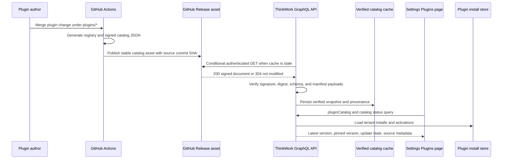
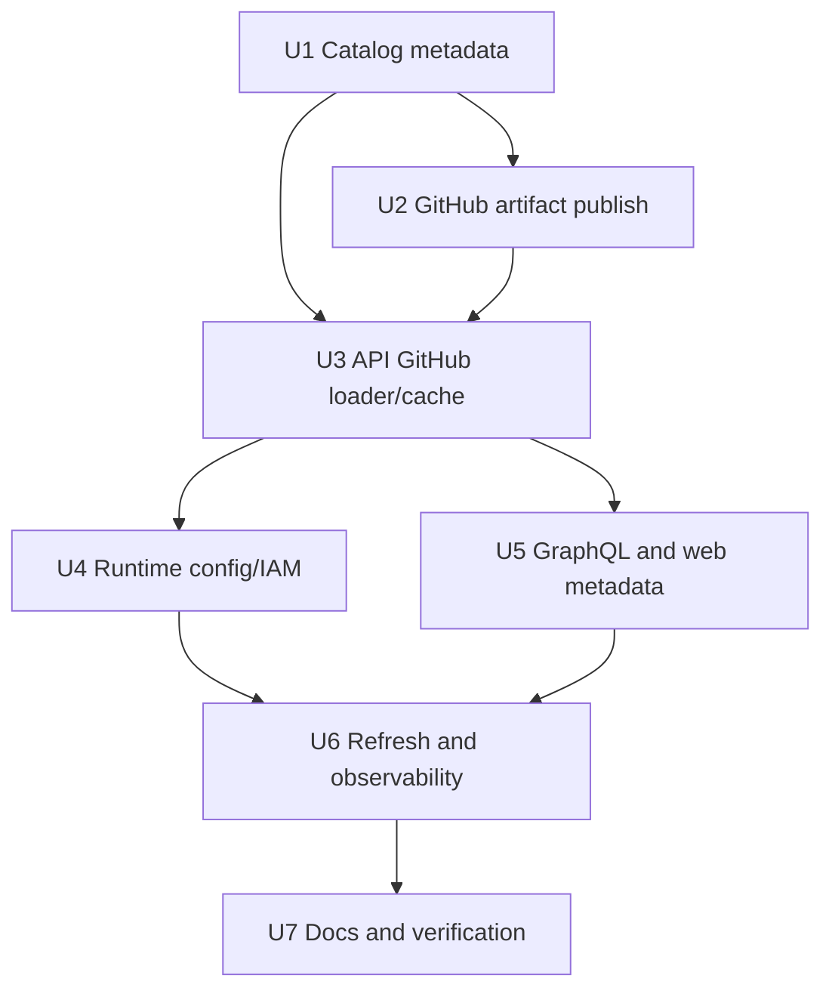
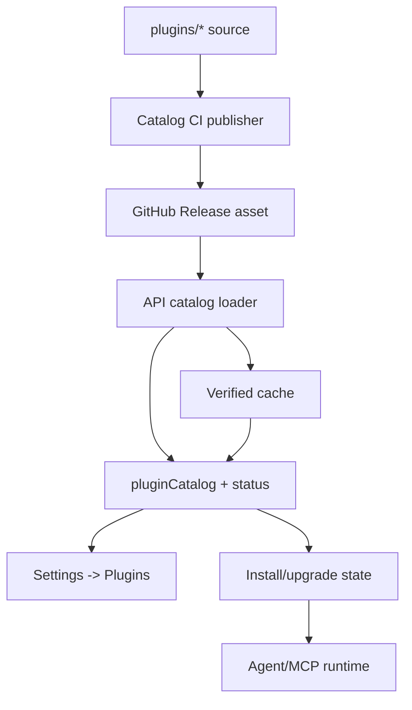

# feat: GitHub-backed plugin catalog

## Overview

Move plugin catalog freshness to GitHub while keeping ThinkWork GraphQL/API as
the runtime trust boundary. Root `plugins/*` remains the authored source of
truth. CI turns that source into a signed, machine-readable catalog artifact.
The API fetches, verifies, caches, and serves only trusted catalog snapshots.
Settings -> Plugins continues to call GraphQL and compares each tenant's
installed pinned version with the latest version from the verified catalog.

The browser must not fetch GitHub directly, and the API must not compile or
evaluate plugin TypeScript fetched from GitHub at request time. GitHub is the
freshness source; the signed catalog document is the runtime contract.

---

## Problem Frame

The Plugins settings surface already models the important distinction between
catalog latest version and a tenant's installed pinned version. Today, however,
the catalog available to the API is bundled into the deployed API artifact. A
plugin version bump under root `plugins/<plugin-key>/` therefore does not appear
as an available update until the platform deploys again.

THNK-37 needs a faster and still trustworthy path: a change under root
`plugins/*` should publish a signed catalog artifact to GitHub, and deployed
ThinkWork stages should be able to see that new version through the API without
a full app deploy. This extends the application-plugin catalog requirement
from the origin document and follows THNK-31's source-boundary decision that
first-party plugin source belongs under `plugins/<plugin-key>/`.

---

## Requirements Trace

- R1. GitHub `thinkwork-ai/thinkwork` `main` remains the authoritative authored
  source for first-party plugin packages under `plugins/*`.
- R2. Settings -> Plugins continues to read through ThinkWork GraphQL, not
  browser-side GitHub calls.
- R3. Runtime catalog freshness comes from a signed catalog artifact generated
  from `plugins/*`, not from compiling raw GitHub TypeScript in the API.
- R4. The API verifies every externally fetched catalog with the existing
  ed25519 trusted public key and payload digest checks before exposing or
  installing it.
- R5. The API caches the verified catalog snapshot with source commit, response
  validator, fetched time, digest, and stale/fallback metadata.
- R6. GitHub fetches are authenticated when configured, conditional when
  possible, rate-limit aware, and never issued per row or per component render.
- R7. Plugin install and upgrade continue to pin a catalog version and payload
  digest from a verified snapshot.
- R8. GraphQL and web surfaces expose enough source metadata for operators to
  understand latest repo version, installed version, update availability, and
  stale/unavailable catalog status without breaking the existing
  `pluginCatalog: [PluginCatalogEntry!]!` list contract.
- R9. The rollout preserves the bundled catalog fallback so deployed
  environments do not lose plugin installability while the GitHub-backed
  channel is configured.
- R10. LastMile remains installable/upgradeable through the user-facing
  ThinkWork plugin flow after the catalog source changes.

**Origin actors:** A1 ThinkWork plugin publisher, A2 tenant administrator, A3
end user, A4 agent runtime.

**Origin flows:** F1 Publish, F2 Install, F5 Uninstall / deactivate. This plan
primarily deepens F1 and the catalog-visible portion of F2.

**Origin acceptance examples:** AE5 is the direct driver: when ThinkWork
publishes a new plugin version to the catalog, the tenant admin can see and
install the update.

---

## Scope Boundaries

- Do not fetch or parse the catalog directly in `apps/web`; the browser remains
  a GraphQL client.
- Do not compile, evaluate, or import TypeScript fetched from GitHub inside the
  API Lambda.
- Do not change the plugin manifest component taxonomy, activation flow,
  LastMile OAuth behavior, MCP dispatch gating, or managed-application
  lifecycle semantics.
- Do not replace the existing signed catalog verification model; extend the
  source loader around it.
- Do not make GitHub availability a hard requirement for normal Plugins page
  reads when a valid cached or bundled catalog is available.
- Do not introduce manual production mutation commands as part of rollout.
- Do not broaden the Plane/Twenty/LastMile plugin source boundary outside
  `plugins/<plugin-key>/` for plugin-specific code.

### Deferred to Follow-Up Work

- Webhook-driven refresh from GitHub push events. V1 can use scheduled refresh
  plus operator-triggered refresh.
- A public third-party marketplace or self-publishing workflow. The catalog
  remains ThinkWork-curated.
- Push notifications or banners outside Settings -> Plugins when plugin
  updates become available.

---

## Context & Research

### Relevant Code and Patterns

- `plugins/catalog/src/catalog.ts` owns the current signed catalog document,
  stable JSON, ed25519 signing, digest verification, schema validation, and
  manifest re-validation.
- `plugins/catalog/scripts/build-catalog.ts` already builds signed catalog JSON
  from the generated first-party registry and requires `PLUGIN_CATALOG_SIGNING_KEY`
  or `--key`.
- `plugins/catalog/scripts/generate-plugin-registry.ts` discovers root
  `plugins/*` packages and generates `plugins/catalog/src/registry/generated-first-party.ts`.
- `packages/api/src/lib/plugins/catalog-source.ts` is the API's single catalog
  trust boundary. It reads the trusted public key from SSM, verifies signed
  documents when signed mode is active, and preserves unsigned bundled fallback
  when no key is configured.
- `packages/api/src/graphql/resolvers/plugins/queries.ts` overlays tenant
  install state on `getPluginCatalog()` and computes `updateAvailable` by
  comparing catalog latest version with install `pinned_version`.
- `packages/database-pg/graphql/types/plugins.graphql` defines the current
  `pluginCatalog` list shape and plugin install/upgrade mutations.
- `apps/web/src/lib/settings-queries.ts`,
  `apps/web/src/components/settings/plugins/PluginsPage.tsx`, and
  `apps/web/src/components/settings/plugins/PluginDetail.tsx` already query
  catalog latest version, installed pinned version, update availability, and
  explicit urql refetches after mutations.
- `.github/workflows/release.yml` is the closest GitHub Release asset
  publishing precedent. `.github/workflows/verify.yml` is the likely home for
  validation checks, while a new plugin-catalog workflow can own channel
  publication.
- `packages/api/src/graphql/resolvers/deployments/deploymentReleases.query.ts`
  is the closest local GitHub fetch precedent: `api.github.com`, explicit
  `User-Agent`, optional `GITHUB_TOKEN`, warm-container caching, and stale on
  fetch failure.
- `terraform/modules/app/lambda-api/iam-grouped.tf` already grants stage-wide
  SSM reads to API Lambdas; new catalog config should prefer SSM/runtime config
  over growing Lambda environment variables.

### Institutional Learnings

- `docs/solutions/architecture-patterns/plugin-source-boundaries-package-owned-deploy-verified-2026-06-17.md`
  says plugin package source should stay package-owned, shared code should
  consume packages through generic extension points, and package-owned smoke
  verification is required after source-boundary changes.
- `docs/solutions/integration-issues/spaces-urql-doc-cache-no-live-invalidation.md`
  warns that urql document cache does not self-invalidate; Plugins UI must
  explicitly refetch after refresh, install, and upgrade actions.
- `docs/solutions/best-practices/every-admin-mutation-requires-requiretenantadmin-2026-04-22.md`
  applies to any operator-triggered refresh mutation because it touches an
  external system and catalog control surface.
- The application plugin plan notes the GraphQL Lambda environment is near the
  4KB cap; new catalog source settings should be SSM/runtime-config backed
  where practical.

### External References

- GitHub REST Release assets support stable downloadable assets attached to a
  release tag; use this for the `main` catalog channel rather than bot commits
  of generated JSON.
- GitHub REST best practices recommend authenticated requests, conditional
  requests with validators, avoiding tight polling, and handling rate limits
  without retry storms.
- GitHub REST unauthenticated primary rate limit is low enough that production
  stages should use authenticated requests when available and rely on cache/TTL
  even for a public repository.

---

## Key Technical Decisions

- **Fetch a signed catalog artifact, not raw plugin source.** The API cannot
  safely compile arbitrary TypeScript from GitHub at runtime. CI should build a
  signed JSON catalog from `plugins/*`, publish it as a stable GitHub Release
  asset for the `main` catalog channel, and embed the source commit SHA in the
  signed payload.
- **Keep GraphQL as the web trust boundary.** The Settings page still calls
  `pluginCatalog`; the resolver returns catalog entries, install overlays,
  update availability, and source metadata. Browser-direct GitHub fetches would
  bypass entitlement/install overlays and move trust decisions into the client.
- **Extend the existing catalog verifier instead of creating a parallel trust
  model.** The current ed25519/digest path in `plugins/catalog/src/catalog.ts`
  is the correct anchor. New provenance fields must be covered by the signed
  bytes or explicitly tied to the verified digest.
- **Persist only verified snapshots.** GitHub response metadata is untrusted
  until the catalog document verifies. Cache writes must happen after
  verification and record source commit, digest, fetched time, and stale state.
- **Prefer stale verified catalog over unavailable live GitHub.** If GitHub is
  down or rate-limited but a previously verified snapshot exists, browse and
  install/upgrade from that snapshot with stale metadata. If no verified
  external snapshot exists, fall back to the bundled catalog to preserve today's
  behavior. Never fall back from signed mode to unsigned remote data.
- **Expose provenance as a sibling field.** Keep `pluginCatalog` as the list
  consumed by current clients. Add `pluginCatalogStatus` or an equivalent
  sibling query for source, repository, ref, commit SHA, catalog digest,
  fetched/generated times, stale state, and last refresh outcome.
- **Treat manual refresh as an admin operation.** If Settings gains "check
  GitHub now" behavior, it must require tenant admin, coalesce repeated calls,
  and return status metadata without changing install state directly.

---

## Open Questions

### Resolved During Planning

- Should the browser call GitHub directly? No. The API remains the trust and
  tenant overlay boundary.
- Should the API compile plugin packages fetched from GitHub? No. Runtime uses
  a signed catalog artifact generated from `plugins/*`.
- Should a GitHub outage make Settings -> Plugins empty? No. Serve the last
  verified snapshot when available; otherwise use bundled fallback.
- Should the existing `pluginCatalog` field be replaced? No. Preserve the list
  shape and add sibling provenance/status metadata.

### Deferred to Implementation

- Exact cache backend and key layout: S3 is the likely fit for a JSON document
  with metadata, but the implementer should reuse existing artifact/cache
  ownership if a better repo pattern exists.
- Exact refresh cadence: start with a conservative TTL and/or scheduled refresh
  interval that respects GitHub rate limits; tune after observing deployed
  behavior.
- Exact stable release/tag naming: use a channel such as
  `plugin-catalog-main` unless implementation finds an established repo
  convention. The invariant is that the asset is generated from `main`, signed,
  and names the source commit SHA.
- Exact GraphQL field naming for status/provenance: choose names that match
  existing schema style during implementation, while preserving the sibling
  status-field decision.

---

## High-Level Technical Design

> *This illustrates the intended approach and is directional guidance for review, not implementation specification. The implementing agent should treat it as context, not code to reproduce.*

---

## Implementation Units

- U1. **Extend catalog artifact metadata**

**Goal:** Make signed catalog documents carry enough provenance for a
GitHub-backed runtime source.

**Requirements:** R1, R3, R4, R5, R8

**Dependencies:** None

**Files:**
- Modify: `plugins/catalog/src/catalog.ts`
- Modify: `plugins/catalog/scripts/build-catalog.ts`
- Modify: `plugins/catalog/src/__tests__/catalog.test.ts`
- Modify: `plugins/catalog/src/__tests__/build-catalog.test.ts`
- Modify: `plugins/catalog/package.json`

**Approach:**
- Extend the signed catalog document or signed catalog metadata with
  provenance fields: repository, ref/channel, source commit SHA, generated-at,
  and catalog digest.
- Keep plugin/version payload semantics unchanged so install pins still refer
  to version payload digests.
- Keep schema validation fail-closed. Older bundled documents should either
  remain valid through optional metadata or move through an explicit schema
  version bump with tests.
- Ensure provenance fields that influence trust or operator display are covered
  by the signature or tied to the verified digest.

**Patterns to follow:**
- Stable JSON and ed25519 verification in `plugins/catalog/src/catalog.ts`.
- Generated-registry check before catalog build in
  `plugins/catalog/scripts/build-catalog.ts`.

**Test scenarios:**
- Happy path: building a catalog with source metadata produces a document that
  verifies and exposes the same plugin/version payloads.
- Edge case: a catalog without optional source metadata still verifies for the
  bundled fallback path, or fails with an intentional schema-version message if
  schema v2 is chosen.
- Error path: tampering with source metadata covered by the signature causes
  verification failure.
- Error path: invalid repository/ref/commit metadata shape is rejected during
  validation.

**Verification:**
- Catalog package tests prove generated, signed, verified, tampered, and
  backwards-compatible documents behave deterministically.

---

- U2. **Publish a GitHub-hosted signed catalog artifact**

**Goal:** Ensure every merge to plugin source can produce a fresh, signed,
machine-readable catalog artifact that the API can fetch from GitHub.

**Requirements:** R1, R3, R6, R9

**Dependencies:** U1

**Files:**
- Create: `.github/workflows/plugin-catalog.yml`
- Modify: `.github/workflows/verify.yml`
- Modify: `plugins/README.md`
- Modify: `plugins/catalog/scripts/build-catalog.ts`
- Test: `plugins/catalog/src/__tests__/build-catalog.test.ts`

**Approach:**
- Add CI coverage that runs plugin registry generation check, catalog
  validation, and signed catalog build for `plugins/**` changes.
- Publish or update one stable GitHub Release asset for the `main` catalog
  channel. The asset body is the signed catalog JSON, and the signed metadata
  names the source commit SHA.
- Keep the asset immutable at the document level even if the release channel is
  updated: cache keys and operator metadata should use document digest/commit,
  not trust the moving release tag alone.
- Store the signing private key only in GitHub Actions secrets. Deployed stages
  trust only the public key through SSM/runtime config.
- Document how the artifact maps back to `plugins/*`, including how operators
  can confirm which commit a stage is reading.

**Patterns to follow:**
- Release asset publishing in `.github/workflows/release.yml`.
- Generated plugin package registry checks in `plugins/catalog/package.json`.

**Test scenarios:**
- Happy path: a plugin manifest version bump causes the workflow to produce a
  signed artifact with that version and the merge commit SHA.
- Edge case: plugin-only docs changes do not publish a misleading catalog
  version change but leave the previous artifact valid.
- Error path: missing signing key fails the publish step with an actionable
  message.
- Error path: stale generated registry fails CI before a catalog artifact can
  publish.

**Verification:**
- The stable catalog release asset contains a signed catalog document that can
  be verified locally with the trusted public key and traced to a Git commit
  under `plugins/*`.

---

- U3. **Add GitHub-backed catalog loading and cache**

**Goal:** Teach the API catalog source to load a verified catalog snapshot from
GitHub with cache and fallback behavior.

**Requirements:** R2, R3, R4, R5, R6, R7, R9

**Dependencies:** U1, U2

**Files:**
- Modify: `packages/api/src/lib/plugins/catalog-source.ts`
- Create: `packages/api/src/lib/plugins/catalog-github-source.ts`
- Modify: `packages/api/src/lib/plugins/catalog-source.test.ts`
- Create: `packages/api/src/lib/plugins/catalog-github-source.test.ts`
- Modify: `packages/api/package.json` if a GitHub client dependency is needed

**Approach:**
- Split catalog loading into explicit source modes: bundled fallback, signed
  bundled document, GitHub-backed verified snapshot, and cached stale snapshot.
- Fetch the stable GitHub Release asset or release metadata with a ThinkWork
  `User-Agent`, GitHub API version header, optional authorization, and
  `If-None-Match` or last-modified validators when available.
- Verify the signed document before replacing any cache. Persist verified
  snapshot metadata separately from untrusted response metadata.
- Serve cached verified catalog when GitHub returns `304 Not Modified`, returns
  a transient error, or is rate-limited. Surface stale metadata for UI, but
  keep install/upgrade using verified payloads only.
- Preserve existing bundled fallback so environments without GitHub catalog
  configuration keep working.

**Patterns to follow:**
- Fail-closed trust behavior in `packages/api/src/lib/plugins/catalog-source.ts`.
- GitHub fetch headers, warm-container TTL, and stale-on-failure behavior in
  `packages/api/src/graphql/resolvers/deployments/deploymentReleases.query.ts`.

**Test scenarios:**
- Happy path: GitHub returns a newer signed document; `getPluginCatalog()`
  verifies it, caches it, and returns latest versions from the remote artifact.
- Happy path: GitHub returns `304`; the API serves the cached verified snapshot
  without re-verifying a missing body.
- Edge case: no GitHub configuration returns the bundled catalog exactly as
  today.
- Edge case: cached verified snapshot plus transient GitHub 5xx returns the
  cached catalog marked stale rather than throwing.
- Error path: no cached snapshot plus bad GitHub signature refuses the remote
  document and falls back only to explicitly allowed bundled source.
- Error path: malformed remote signed document fails closed and does not
  overwrite the last good cache.
- Integration: install/upgrade version resolution uses the same verified
  snapshot returned by `pluginCatalog`.

**Verification:**
- API unit tests cover remote success, `304`, stale fallback, no-config
  fallback, bad signature, malformed payload, and rate-limit errors.

---

- U4. **Wire runtime configuration and IAM**

**Goal:** Provide deployed stages with safe configuration for GitHub catalog
source, optional auth, trusted public key, and cache storage.

**Requirements:** R4, R5, R6, R7, R9

**Dependencies:** U3

**Files:**
- Modify: `terraform/modules/app/lambda-api/variables.tf`
- Modify: `terraform/modules/app/lambda-api/runtime-config.tf`
- Modify: `terraform/modules/app/lambda-api/iam-grouped.tf`
- Modify: `terraform/modules/app/lambda-api/handlers.tf`
- Modify: `terraform/modules/thinkwork/variables.tf`
- Modify: `terraform/examples/greenfield/main.tf`
- Test: existing Terraform module fixture/test paths if present

**Approach:**
- Add narrow runtime configuration for catalog source mode, GitHub owner/repo,
  ref/channel, release selector or artifact path, cache TTL, and cache object
  location.
- Prefer SSM parameters read through the existing runtime-config pattern over
  many new Lambda environment variables.
- Add optional GitHub token secret support for authenticated reads. Do not
  require user PATs; prefer a repository-scoped GitHub App installation token
  or narrowly scoped secret where available.
- Grant API Lambdas only the cache read/write permissions and secret/parameter
  reads required for catalog refresh.
- Keep trusted public key under the existing
  `/thinkwork/{stage}/plugin-catalog/trusted-public-key` model unless U1
  requires a versioned companion parameter.

**Patterns to follow:**
- Stage-wide SSM read pattern in
  `terraform/modules/app/lambda-api/iam-grouped.tf`.
- Runtime config conventions in
  `terraform/modules/app/lambda-api/runtime-config.tf`.
- Existing `/thinkwork/${stage}/...` parameter naming.

**Test scenarios:**
- Happy path: Terraform renders catalog source parameters and the API role can
  read them.
- Happy path: cache bucket/key permissions allow only required object
  operations.
- Edge case: empty catalog GitHub configuration leaves bundled fallback active.
- Error path: missing optional GitHub token does not prevent public-repo fetch,
  but unauthenticated mode is visible in metadata/logs.
- Error path: missing trusted public key in a configured signed stage fails
  closed according to the existing trust model.

**Verification:**
- Terraform plan output shows scoped SSM/secret/cache permissions and no broad
  repository-write capability for the API Lambda.

---

- U5. **Expose catalog source metadata through GraphQL and web**

**Goal:** Let operators see whether listed latest plugin versions come from
GitHub, cache, or bundled fallback, and understand available upgrades.

**Requirements:** R2, R5, R8

**Dependencies:** U3

**Files:**
- Modify: `packages/database-pg/graphql/types/plugins.graphql`
- Modify: `terraform/schema.graphql`
- Modify: `packages/api/src/graphql/resolvers/plugins/queries.ts`
- Modify: `packages/api/src/graphql/resolvers/plugins/index.ts`
- Modify: `packages/api/src/graphql/resolvers/plugins/plugins-resolvers.test.ts`
- Modify: `apps/web/src/lib/settings-queries.ts`
- Modify: `apps/web/src/components/settings/plugins/PluginsPage.tsx`
- Modify: `apps/web/src/components/settings/plugins/PluginDetail.tsx`
- Modify: `apps/web/src/components/settings/plugins/PluginsPage.test.tsx`
- Modify: `apps/web/src/components/settings/plugins/PluginDetail.test.tsx`
- Regenerate: GraphQL/codegen outputs for `packages/api`, `apps/web`,
  `apps/mobile`, and `apps/cli` where scripts exist

**Approach:**
- Preserve `pluginCatalog: [PluginCatalogEntry!]!` as the existing list field.
  Add a sibling query such as `pluginCatalogStatus: PluginCatalogStatus!` for
  source/freshness metadata so current consumers remain source-compatible.
- Display lightweight provenance in Settings only where it helps: latest
  version versus installed pinned version, update available state, stale
  catalog notice, and optional commit/source timestamp.
- Keep refresh actions as GraphQL actions. Any forced remote refresh mutation
  must be operator-only, explicit, and protected against repeated clicks.
- Preserve self-service-only behavior for non-operators; catalog source details
  are mainly an operator concern.

**Patterns to follow:**
- Existing `SettingsPluginCatalogQuery` and explicit urql refresh calls.
- Existing Plugin Detail upgrade banner and `updateAvailable` behavior.
- Explicit refetch guidance in
  `docs/solutions/integration-issues/spaces-urql-doc-cache-no-live-invalidation.md`.

**Test scenarios:**
- Happy path: installed plugin pinned at `0.1.0` with remote latest `0.1.1`
  renders update available and upgrade action.
- Happy path: catalog metadata shows GitHub source commit and fetched time when
  remote source is active.
- Integration: clients querying only `pluginCatalog` continue to receive the
  list shape unchanged.
- Edge case: stale verified catalog renders a non-blocking stale notice while
  still showing installed plugins.
- Edge case: bundled fallback renders without an alarming error when GitHub
  source is disabled.
- Error path: catalog unavailable still shows the existing unavailable state and
  does not hide already-installed plugin state incorrectly.
- Authorization: non-operator users do not receive operator-only forced refresh
  controls.

**Verification:**
- API resolver tests prove schema compatibility and status metadata. Web tests
  prove update/status copy, stale metadata, fallback mode, and non-operator
  behavior render correctly from mocked GraphQL results.

---

- U6. **Add refresh operations and observability**

**Goal:** Make catalog freshness operationally visible and refreshable without
making every page load call GitHub.

**Requirements:** R5, R6, R7, R8

**Dependencies:** U3, U4, U5

**Files:**
- Modify: `packages/database-pg/graphql/types/plugins.graphql`
- Modify: `packages/api/src/graphql/resolvers/plugins/mutations.ts`
- Modify: `packages/api/src/graphql/resolvers/plugins/index.ts`
- Modify: `packages/api/src/graphql/resolvers/plugins/plugins-resolvers.test.ts`
- Modify: `packages/api/src/lib/plugins/catalog-github-source.ts`
- Modify: `terraform/modules/app/lambda-api/handlers.tf`
- Modify: `terraform/modules/app/lambda-api/iam-grouped.tf`
- Create or modify: scheduled refresh wiring under
  `terraform/modules/app/lambda-api/` or the existing scheduler module if more
  appropriate

**Approach:**
- Add one operator-only refresh path if the UI needs manual "check GitHub now"
  behavior. It should return catalog metadata and avoid changing install state
  directly.
- Add scheduled/background refresh if feasible in the existing Lambda/API
  module. The schedule warms the verified cache and logs status; it does not
  install or upgrade plugins.
- Emit structured logs or metrics for refresh result, source commit, catalog
  digest, stale age, rate-limit response, and verification failures.
- Coalesce or TTL-gate repeated refresh attempts to avoid GitHub secondary rate
  limits.

**Patterns to follow:**
- Admin mutation authorization rules from
  `docs/solutions/best-practices/every-admin-mutation-requires-requiretenantadmin-2026-04-22.md`.
- Existing EventBridge/Lambda scheduling patterns in the app Terraform modules.

**Test scenarios:**
- Happy path: tenant admin triggers refresh, API fetches a newer verified
  catalog, and subsequent `pluginCatalog` reads show the new latest version.
- Edge case: refresh called twice inside the minimum interval returns current
  metadata without another GitHub request.
- Error path: GitHub 403/rate-limit response leaves the last verified catalog
  in place and returns user-safe status.
- Error path: verification failure is logged, not cached, and the previous
  verified catalog remains active.
- Authorization: non-admin refresh attempts fail before any external GitHub
  call.

**Verification:**
- Resolver tests prove admin-only refresh, rate-limit coalescing, stale
  fallback, and non-mutating behavior.

---

- U7. **Update authoring, release, and verification docs**

**Goal:** Document the new catalog publication and runtime freshness model so
plugin authors, release operators, and verification agents use it correctly.

**Requirements:** R1, R3, R5, R6, R7, R8, R9, R10

**Dependencies:** U1-U6

**Files:**
- Modify: `plugins/README.md`
- Modify: `docs/src/content/docs/applications/plugins.mdx` or the current
  plugin docs page if named differently
- Modify: `docs/plans/2026-06-15-003-refactor-plugin-source-colocation-plan.md`
  if it needs a follow-up note
- Modify:
  `docs/solutions/architecture-patterns/plugin-source-boundaries-package-owned-deploy-verified-2026-06-17.md`
  if implementation uncovers a durable pattern change
- Modify: `scripts/smoke/README.md` if present, or package-local smoke docs
- Modify: plugin package smokes as needed, especially
  `plugins/lastmile/smoke/lastmile-plugin-smoke.mjs`

**Approach:**
- Explain the distinction between authored plugin source (`plugins/*`),
  generated signed catalog artifact, API verified cache, and installed pinned
  versions.
- Add verification expectations: publish or locate a new catalog artifact,
  refresh the API cache, observe Settings latest version/update status, upgrade
  or install through ThinkWork, and verify plugin MCP integration after
  install/upgrade.
- Keep THNK-31 language aligned with root `plugins/` source ownership and
  package-local smoke verification.

**Patterns to follow:**
- Deployed verification gate in
  `docs/solutions/architecture-patterns/plugin-source-boundaries-package-owned-deploy-verified-2026-06-17.md`.
- LastMile package-owned smoke posture in
  `plugins/lastmile/smoke/lastmile-plugin-smoke.mjs`.

**Test scenarios:**
- Test expectation: none -- documentation-only unit, but examples must remain
  truthful against implemented GraphQL fields, CI workflow names, and smoke
  commands.

**Verification:**
- Docs describe how a plugin version bump becomes visible without a full app
  deploy and how to verify LastMile remains installable/upgradeable through
  ThinkWork.

---

## System-Wide Impact

- **Interaction graph:** GitHub Actions publishes signed catalog artifacts; API
  catalog loader fetches/verifies/caches; GraphQL overlays tenant installs; web
  renders update metadata; upgrade mutations continue to pin verified payloads.
- **Error propagation:** GitHub/network/rate-limit errors become catalog
  metadata and stale fallback where a verified snapshot exists.
  Signature/digest failures are logged and never exposed as trusted catalog
  entries.
- **State lifecycle risks:** Cached snapshots can become stale; each snapshot
  must include fetched time, source commit, digest, and staleness. Upgrade must
  use the verified snapshot that produced the displayed version.
- **API surface parity:** Web codegen and GraphQL schema must stay aligned.
  CLI/mobile codegen should regenerate even if they do not display the new
  metadata immediately.
- **Integration coverage:** Unit tests must be complemented by a deployed smoke
  where LastMile or a test plugin version appears as an update and the existing
  ThinkWork install/upgrade path still works.
- **Unchanged invariants:** Plugin install state remains in Aurora; activation
  and MCP dispatch gating do not change; direct MCP servers continue unchanged;
  plugin package source remains under root `plugins/<plugin-key>/`.

---

## Verification Strategy

Verification must prove both artifact freshness and the user-facing ThinkWork
plugin flow.

- **Artifact publication:** Bump a plugin version under `plugins/*` in a test
  branch or controlled main merge, run the catalog CI path, and confirm the
  stable GitHub Release asset contains a signed catalog document with the
  expected plugin version, source commit SHA, digest, and signature.
- **Local trust checks:** Verify the artifact with the trusted public key and
  confirm tampering with payload, provenance, digest, or signature fails closed.
- **API cache checks:** In an environment configured for GitHub-backed catalog,
  force or wait for refresh, then confirm GraphQL returns the newer latest
  version plus source metadata. Repeat with GitHub `304`, rate limit/transient
  error, malformed artifact, and bad signature mocks or staged fixtures.
- **Settings UI checks:** Open Settings -> Plugins as an operator and confirm
  installed pinned version, latest GitHub-backed version, update availability,
  stale/fallback metadata, refresh behavior, and non-operator controls render
  correctly.
- **LastMile end-to-end gate:** Through the deployed ThinkWork app/runner, keep
  or create a LastMile install, observe the installed pinned version versus the
  verified latest version, perform an upgrade or reinstall when applicable, and
  run the package-owned LastMile smoke so `lastmile--crm`,
  `lastmile--tasks`, and `lastmile--routing` remain exposed through ThinkWork.
- **Safety gate:** Demonstrate that GitHub outage, rate limit, malformed
  artifact, and bad signature never become a trusted catalog and never overwrite
  the last verified cache.

---

## Risks & Dependencies

| Risk | Mitigation |
|------|------------|
| API trusts mutable GitHub `main` too directly | Fetch only signed catalog artifacts, verify ed25519 signature and payload digests, and record source commit SHA. |
| GitHub rate limits or outage break Settings -> Plugins | Use authenticated conditional requests, warm-container and persisted cache, scheduled refresh, and stale verified fallback. |
| Generated artifact drifts from root `plugins/*` source | CI must run registry check and catalog build from root plugin packages before publishing. Artifact metadata must name the source commit. |
| Catalog freshness and install pinning diverge | Use one verified catalog source for both `pluginCatalog` reads and `getPluginVersion()` upgrade/install resolution. |
| Terraform/env changes exceed Lambda config limits | Prefer SSM/runtime config and scoped IAM over many new Lambda environment variables. |
| Browser shows stale or confusing update status | Expose source metadata and stale state in GraphQL; keep copy concise and non-alarming. |
| Signing key leaks or is misused | Keep private key only in GitHub Actions secrets, avoid logging secrets, and deploy only the public key/trust anchor. |

---

## Alternative Approaches Considered

- **Browser fetches GitHub directly:** Rejected. It bypasses tenant install
  overlays, creates CORS/rate-limit issues, and moves trust decisions into the
  client.
- **API compiles raw plugin source from GitHub:** Rejected. Runtime TypeScript
  compilation/evaluation of mutable repo source is too risky and brittle for
  installable infrastructure and OAuth/MCP metadata.
- **Only publish catalog through full platform deploys:** Rejected as the
  current limitation; it does not satisfy the goal of seeing plugin updates
  from root `plugins/` without redeploying the API.
- **CI publishes signed catalog only to deployment-owned S3:** Viable as a
  contingency, but less aligned with the desired GitHub source-of-truth model.
  The selected plan lets GitHub host or identify the signed artifact while the
  API still uses deployment-owned cache for reliability.

---

## Operational / Rollout Notes

- Deployed environments should start in bundled fallback mode until the signed
  GitHub artifact path, trusted public key, cache location, and optional token
  are configured.
- Operators should be able to answer which catalog source is active, which
  GitHub commit it came from, when it was fetched, whether it is stale, and
  which installed plugins have newer catalog versions.
- The publish workflow must never expose the private signing key in logs or
  artifacts.
- Rollout can be staged: first ship artifact publication, then API verified
  cache in bundled-fallback mode, then enable GitHub-backed source for a dev
  stage, then roll to production after LastMile verification passes.
- LastMile remains the final practical verification target because it proves
  ThinkWork install/activation/MCP behavior, not only catalog display.

---

## Sources & References

- **Origin document:** `docs/brainstorms/2026-06-12-application-plugins-requirements.md`
- Related requirements: `docs/brainstorms/2026-06-15-plugin-source-colocation-requirements.md`
- Related plan: `docs/plans/2026-06-12-001-feat-application-plugins-plan.md`
- Related issue: THNK-31, THNK-37
- Related solution:
  `docs/solutions/architecture-patterns/plugin-source-boundaries-package-owned-deploy-verified-2026-06-17.md`
- Current API catalog source: `packages/api/src/lib/plugins/catalog-source.ts`
- Current catalog builder/verifier: `plugins/catalog/src/catalog.ts`,
  `plugins/catalog/scripts/build-catalog.ts`
- Current Settings UI:
  `apps/web/src/components/settings/plugins/PluginsPage.tsx`,
  `apps/web/src/components/settings/plugins/PluginDetail.tsx`
- Current GraphQL schema: `packages/database-pg/graphql/types/plugins.graphql`
