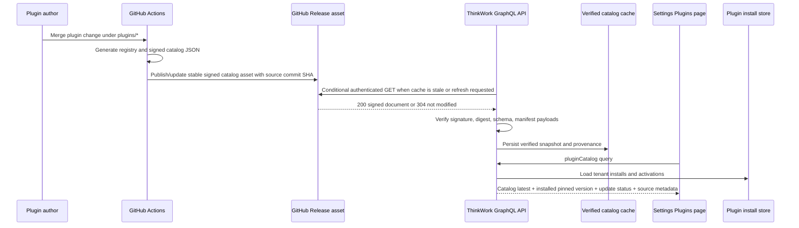

# feat: GitHub-backed plugin catalog

## Overview

Make the root `plugins/` folder on GitHub the freshness source for the Settings -> Plugins catalog without moving catalog trust or tenant install state into the browser. The web app continues to call ThinkWork GraphQL. The API fetches a GitHub-hosted signed catalog artifact generated from `plugins/*`, verifies it with the existing ed25519 catalog trust model, caches the verified snapshot, and overlays tenant install state so operators can see when an installed plugin is behind the latest published version.

This plan intentionally does not make the browser fetch GitHub directly and does not make the API compile arbitrary TypeScript fetched from GitHub at request time. GitHub is the upstream source of truth; the signed catalog document is the runtime contract.

---

## Problem Frame

The current Plugins settings page is already shaped around catalog latest version versus installed pinned version, but "latest" comes from the catalog bundled into the deployed API artifact. That means a plugin version published under root `plugins/<plugin-key>/` does not become visible as an available update until the platform deploys again.

The product goal from the current discussion is stronger: root `plugins/` should be the source of truth operators see in ThinkWork. When a plugin version changes in the repo, Settings -> Plugins should be able to show that newer version and offer the existing upgrade path without requiring a full app redeploy. This extends the original application plugin requirement that ThinkWork publishes plugins to a curated catalog deployed platforms can check (see origin: `docs/brainstorms/2026-06-12-application-plugins-requirements.md`) and respects the THNK-31 ownership boundary that plugin-specific source lives under `plugins/<plugin-key>/` (see `docs/brainstorms/2026-06-15-plugin-source-colocation-requirements.md`).

---

## Requirements Trace

- R1. GitHub `thinkwork-ai/thinkwork` `main` remains the authoritative authored source for first-party plugin packages under `plugins/*`.
- R2. The Settings Plugins page continues to read through ThinkWork GraphQL, not browser-side GitHub calls.
- R3. Runtime catalog freshness comes from a signed, machine-readable catalog artifact generated from `plugins/*`, not from compiling raw GitHub TypeScript in the API.
- R4. The API verifies every externally fetched catalog with the existing trusted public key and payload digest checks before exposing or installing it.
- R5. The API caches the verified catalog snapshot with commit SHA, ETag or equivalent validator, fetched time, digest, and staleness metadata.
- R6. GitHub fetches are authenticated when configured, conditional when possible, rate-limit aware, and never issued per row or per component render.
- R7. Plugin install and upgrade continue to pin a catalog version and payload digest; a GitHub outage must not silently downgrade trust or install an unverified payload.
- R8. GraphQL and web surfaces expose enough catalog source metadata for operators to understand latest repo version, installed version, update availability, and stale/unavailable catalog status without breaking the existing `pluginCatalog: [PluginCatalogEntry!]!` contract.
- R9. The rollout preserves the existing bundled catalog fallback so deployed environments do not lose plugin installability while the GitHub-backed channel is being configured.

**Origin actors:** A1 ThinkWork plugin publisher, A2 tenant administrator, A3 end user, A4 agent runtime.

**Origin flows:** F1 Publish, F2 Install, F5 Uninstall / deactivate. This plan primarily deepens F1 and the catalog-visible part of F2.

**Origin acceptance examples:** AE5 is the direct driver: when ThinkWork publishes a new plugin version to the catalog, the tenant admin can see and install the update.

---

## Scope Boundaries

- Do not fetch or parse the catalog directly in `apps/web`; the browser remains a GraphQL client.
- Do not compile, evaluate, or import TypeScript fetched from GitHub inside the API Lambda.
- Do not change the plugin manifest shape, component taxonomy, activation flow, LastMile OAuth behavior, or MCP dispatch gating.
- Do not replace the existing signed catalog verification model; extend its source loader.
- Do not make GitHub availability a hard requirement for normal Plugins page reads when a valid cached or bundled catalog is available.
- Do not introduce manual production mutation commands as part of the rollout.

### Deferred to Follow-Up Work

- Webhook-driven refresh from GitHub push events. V1 can use scheduled refresh plus operator-triggered refresh.
- A public third-party marketplace or self-publishing workflow. The catalog remains ThinkWork-curated.
- Push notifications or banners outside the Plugins settings surface when plugin updates become available.

---

## Context & Research

### Relevant Code and Patterns

- `apps/web/src/components/settings/plugins/PluginsPage.tsx` already reads `SettingsPluginCatalogQuery`, renders latest version text, filters installed plugins, and manually refreshes the urql query.
- `apps/web/src/components/settings/plugins/PluginDetail.tsx` already has upgrade action wiring based on `entry.updateAvailable` and `entry.latestVersion`.
- `apps/web/src/lib/settings-queries.ts` defines `SettingsPluginCatalogQuery` with `latestVersion`, `updateAvailable`, version payload digests, and install pinned version.
- `packages/database-pg/graphql/types/plugins.graphql` defines `pluginCatalog`, `PluginCatalogEntry`, and the upgrade mutation contract.
- `packages/api/src/graphql/resolvers/plugins/queries.ts` overlays tenant installs on top of `getPluginCatalog()` and already computes `updateAvailable` by comparing catalog latest version to installed `pinned_version`.
- `packages/api/src/lib/plugins/catalog-source.ts` is the single API access point for the plugin catalog. It already supports signed mode through `verifyPluginCatalog()` and unsigned bundled-manifest fallback.
- `plugins/catalog/src/catalog.ts` owns canonical catalog shape, stable hashing, signing, verification, and manifest re-validation.
- `plugins/catalog/scripts/build-catalog.ts` already builds a signed catalog JSON from generated `plugins/*` package registry entries.
- `plugins/catalog/scripts/generate-plugin-registry.ts` discovers root plugin packages and generates the static first-party registry.
- `packages/api/src/graphql/resolvers/deployments/deploymentReleases.query.ts` is the closest local GitHub fetch precedent: it uses `api.github.com`, a `User-Agent`, optional `GITHUB_TOKEN`, warm-container caching, and stale-on-fetch-failure behavior.
- `terraform/modules/app/lambda-api/iam-grouped.tf` already grants stage-wide SSM reads to API Lambdas; catalog runtime config should use SSM rather than growing Lambda env vars where possible.

### Institutional Learnings

- `docs/solutions/architecture-patterns/plugin-source-boundaries-package-owned-deploy-verified-2026-06-17.md` says plugin package source should stay package-owned, shared code should consume packages through generic extension points, and package-owned smoke verification is required after source-boundary changes.
- `docs/solutions/integration-issues/spaces-urql-doc-cache-no-live-invalidation.md` warns that urql document cache does not self-invalidate; the Plugins UI should explicitly refetch after refresh, install, and upgrade actions.
- `docs/solutions/best-practices/every-admin-mutation-requires-requiretenantadmin-2026-04-22.md` applies to any operator-triggered refresh mutation because it touches external systems and catalog control surfaces.
- The application plugin plan notes that the GraphQL Lambda env is near the 4KB cap; new catalog source settings should be SSM/runtime-config backed where practical rather than many new env vars.

### External References

- GitHub repository contents API supports file reads by `path` and `ref`, returns `304 Not Modified`, and documents that recursive repository contents should use Git Trees when directory size grows: https://docs.github.com/en/rest/repos/contents
- GitHub Git Trees API can recursively read tree entries but has response size and entry limits that should be treated as guardrails rather than a primary runtime parsing strategy: https://docs.github.com/en/rest/git/trees
- GitHub REST API unauthenticated primary rate limit is 60 requests/hour per originating IP; authenticated requests have higher limits, and GitHub App installation tokens start at 5,000 requests/hour: https://docs.github.com/en/rest/using-the-rest-api/rate-limits-for-the-rest-api
- GitHub REST best practices recommend avoiding polling, authenticating requests, and using conditional requests with ETags/last-modified where appropriate: https://docs.github.com/en/rest/using-the-rest-api/best-practices-for-using-the-rest-api

---

## Key Technical Decisions

- **Fetch a signed catalog artifact, not raw plugin source.** The API cannot safely compile arbitrary TypeScript from GitHub at runtime. CI should generate a signed JSON catalog from `plugins/*`, publish it as a stable GitHub Release asset for the `main` catalog channel, and embed the source commit SHA in the signed payload. The API fetches that document from GitHub and verifies it with the existing trusted public key.
- **Keep GraphQL as the web boundary.** The Settings page still asks `pluginCatalog`; the resolver returns catalog entries, install overlays, update availability, and source metadata. Browser-direct GitHub fetches would bypass entitlement/install overlays and create CORS, rate-limit, and trust issues.
- **Use GitHub as upstream and S3/SSM/local memory as cache/control plane.** The GitHub response is the freshness source. The API persists the last verified snapshot in S3 or an equivalent deployment-owned cache and keeps a warm-container memory cache for normal reads. SSM stores source configuration and trusted key material references.
- **Prefer stale verified catalog over unavailable live GitHub.** If GitHub is down or rate-limited but a previously verified catalog exists, browse and install/upgrade from that verified snapshot with stale metadata. If no verified external snapshot exists, fall back to the bundled catalog to preserve today's behavior. Never fall back from signed mode to unsigned remote data.
- **Treat operator refresh as an explicit admin action.** A scheduled/background refresh can keep the cache warm, and the existing refresh button can ask GraphQL for a network-only read. If an operator-triggered forced refresh is added, it must require tenant admin and rate-limit itself.
- **Expose source provenance without breaking the catalog list field.** Keep `pluginCatalog` as the list consumed by current clients. Add a sibling status/query field such as `pluginCatalogStatus` for `source`, `repository`, `ref`, `commitSha`, `catalogSha256`, `fetchedAt`, `generatedAt`, `stale`, and last refresh status so Settings can make freshness understandable without leaking trust internals or forcing every consumer to change shape.

---

## Open Questions

### Resolved During Planning

- Should the browser call GitHub directly? No. The API remains the trust and tenant overlay boundary.
- Should the API compile plugin packages fetched from GitHub? No. Runtime uses a signed catalog artifact generated from `plugins/*`.
- Should a GitHub outage make the Plugins page empty? No. Serve the last verified snapshot when available; otherwise use the bundled catalog fallback.

### Deferred to Implementation

- Exact cache backend: S3 is the likely fit for a JSON document with metadata, but the implementer may reuse an existing artifact bucket or add a narrow bucket/key after inspecting Terraform ownership.
- Exact refresh cadence: start with a conservative TTL and/or scheduled refresh interval that respects GitHub rate limits; tune after observing production behavior.
- Exact GitHub release/tag naming: use a stable catalog channel such as `plugin-catalog-main` unless the repo already has a clearer release convention by implementation time. The important invariant is that the asset is generated from `main`, signed, and names the source commit SHA.

---

## High-Level Technical Design

> *This illustrates the intended approach and is directional guidance for review, not implementation specification. The implementing agent should treat it as context, not code to reproduce.*

---

## Implementation Units

- U1. **Extend catalog artifact metadata**

**Goal:** Make signed catalog documents carry enough provenance for a GitHub-backed runtime source.

**Requirements:** R1, R3, R4, R5, R8

**Dependencies:** None

**Files:**
- Modify: `plugins/catalog/src/catalog.ts`
- Modify: `plugins/catalog/scripts/build-catalog.ts`
- Modify: `plugins/catalog/src/__tests__/catalog.test.ts`
- Modify: `plugins/catalog/src/__tests__/build-catalog.test.ts`
- Modify: `plugins/catalog/package.json`

**Approach:**
- Extend the signed catalog document or catalog metadata with source provenance fields that do not affect plugin payload semantics: repository, ref, commit SHA, generated-at, and catalog digest.
- Keep schema validation fail-closed. Older bundled documents should either remain valid through optional metadata or move through an explicit schema version bump with tests.
- Keep `build:catalog` as the local source of truth for generating the artifact from root `plugins/*` package registry output.

**Patterns to follow:**
- `plugins/catalog/src/catalog.ts` canonical stable JSON and ed25519 verification.
- `plugins/catalog/scripts/build-catalog.ts` existing generated-registry check before build.

**Test scenarios:**
- Happy path: building a catalog with source metadata produces a document that verifies and exposes the same plugin/version payloads.
- Edge case: a catalog without optional source metadata still verifies when it represents the bundled fallback path, or fails with an intentional schema-version message if schema v2 is chosen.
- Error path: tampering with source metadata covered by the signature causes verification failure.
- Error path: source commit SHA or repository fields with invalid shape are rejected during validation.

**Verification:**
- Catalog package tests prove generated, signed, verified, and tampered documents behave deterministically.

---

- U2. **Publish a GitHub-hosted signed catalog artifact**

**Goal:** Ensure every merge to plugin source can produce a fresh, signed, machine-readable catalog artifact that the API can fetch from GitHub.

**Requirements:** R1, R3, R6, R9

**Dependencies:** U1

**Files:**
- Create or modify: `.github/workflows/plugin-catalog.yml`
- Modify: `.github/workflows/verify.yml`
- Modify: `plugins/README.md`
- Modify: `plugins/catalog/scripts/build-catalog.ts`
- Test: `plugins/catalog/src/__tests__/build-catalog.test.ts`

**Approach:**
- Add CI coverage that runs plugin registry generation check, catalog validation, and signed catalog build for `plugins/**` changes.
- Publish or update one stable GitHub Release asset for the `main` catalog channel, with the signed catalog JSON as the asset body and source commit SHA embedded in the signed metadata. A stable release asset avoids bot commits of generated files while remaining fetchable through GitHub APIs.
- Keep the asset immutable-at-the-document level even if the release channel is updated: each document names the commit SHA, generated time, catalog digest, and signature. API cache keys and operator metadata should use the document digest/commit rather than trusting the moving release tag alone.
- Store the signing private key only in GitHub Actions secrets; only the public key is trusted by deployed ThinkWork stages through SSM.
- Document how the artifact maps back to `plugins/*`, including how operators can confirm which commit a stage is reading.

**Patterns to follow:**
- Existing release workflows in `.github/workflows/release.yml` for publishing signed release assets.
- Existing supply-chain and plugin source-boundary checks.

**Test scenarios:**
- Happy path: a plugin manifest version bump causes the catalog workflow to produce a signed artifact with that version and the merge commit SHA.
- Edge case: plugin-only docs changes do not publish a misleading catalog version change but still leave the previous artifact valid.
- Error path: missing signing key fails the publish step with an actionable message.
- Error path: stale generated registry fails CI before a catalog artifact can publish.

**Verification:**
- The stable catalog release asset contains a signed catalog document that can be verified locally with the trusted public key and traced to a Git commit under `plugins/*`.

---

- U3. **Add GitHub-backed catalog loading and cache**

**Goal:** Teach the API catalog source to load a verified catalog snapshot from GitHub with cache and fallback behavior.

**Requirements:** R2, R3, R4, R5, R6, R7, R9

**Dependencies:** U1, U2

**Files:**
- Modify: `packages/api/src/lib/plugins/catalog-source.ts`
- Create: `packages/api/src/lib/plugins/catalog-github-source.ts`
- Modify: `packages/api/src/lib/plugins/catalog-source.test.ts`
- Create: `packages/api/src/lib/plugins/catalog-github-source.test.ts`
- Modify: `packages/api/package.json` if a GitHub client dependency is needed

**Approach:**
- Split catalog loading into explicit source modes: bundled, signed bundled document, GitHub-backed verified snapshot, and cached stale snapshot.
- Fetch the stable GitHub Release asset or its release metadata with `Accept: application/vnd.github+json`, a ThinkWork `User-Agent`, API version header, optional authorization, and `If-None-Match` or last-modified validators when available.
- Verify the signed document before replacing the current cache. Persist verified snapshot metadata separately from untrusted response metadata.
- Serve cached verified catalog when GitHub returns `304 Not Modified`, returns a transient error, or is rate-limited. Surface stale metadata for UI, but keep install and upgrade using verified payloads only.
- Preserve existing bundled fallback so environments without GitHub catalog configuration keep working.

**Patterns to follow:**
- `packages/api/src/lib/plugins/catalog-source.ts` fail-closed trust behavior.
- `packages/api/src/graphql/resolvers/deployments/deploymentReleases.query.ts` GitHub fetch headers, warm-container TTL, and stale-on-failure pattern.

**Test scenarios:**
- Happy path: when GitHub returns a newer signed document, `getPluginCatalog()` verifies it, caches it, and returns latest versions from the remote artifact.
- Happy path: when GitHub returns `304`, the API serves the cached verified snapshot without re-verifying a missing body.
- Edge case: with no GitHub configuration, the API returns the bundled catalog exactly as today.
- Edge case: with a cached verified snapshot and a transient GitHub 5xx, the API returns the cached catalog marked stale rather than throwing.
- Error path: with no cached snapshot and a bad signature from GitHub, the API refuses the remote document and falls back only to the explicitly allowed bundled source.
- Error path: with a trusted public key present and a malformed remote signed document, verification fails closed and does not overwrite the last good cache.
- Integration: install/upgrade version resolution uses the same verified snapshot returned by `pluginCatalog`.

**Verification:**
- API unit tests cover remote success, 304, stale fallback, no-config fallback, bad signature, malformed payload, and rate-limit errors.

---

- U4. **Wire runtime configuration and IAM**

**Goal:** Provide deployed stages with safe configuration for GitHub catalog source, optional auth, trusted public key, and cache storage.

**Requirements:** R4, R5, R6, R7, R9

**Dependencies:** U3

**Files:**
- Modify: `terraform/modules/app/lambda-api/variables.tf`
- Modify: `terraform/modules/app/lambda-api/runtime-config.tf`
- Modify: `terraform/modules/app/lambda-api/iam-grouped.tf`
- Modify: `terraform/modules/app/lambda-api/handlers.tf`
- Modify: `terraform/modules/thinkwork/variables.tf`
- Modify: `terraform/examples/greenfield/main.tf`
- Test: relevant Terraform module tests if present, or add focused assertions in existing Terraform fixture tests

**Approach:**
- Add narrow runtime configuration for catalog source mode, GitHub owner/repo/ref/artifact path or release selector, cache TTL, and cache object location. Prefer SSM parameters read through the existing runtime-config pattern over many new Lambda env vars.
- Add optional GitHub token secret support for authenticated reads. Do not require user PATs; prefer a repository-scoped GitHub App installation token or narrowly scoped secret where available.
- Grant API Lambdas only the cache read/write permissions and secret/parameter reads required for catalog refresh.
- Keep trusted public key under the existing `/thinkwork/{stage}/plugin-catalog/trusted-public-key` model unless U1 requires a versioned companion parameter.

**Patterns to follow:**
- Stage-wide SSM read pattern in `terraform/modules/app/lambda-api/iam-grouped.tf`.
- Runtime config comments in `terraform/modules/app/lambda-api/runtime-config.tf`.
- Existing release/deployment SSM parameter naming under `/thinkwork/${stage}/...`.

**Test scenarios:**
- Happy path: Terraform renders catalog source SSM parameters and the API role can read them.
- Happy path: cache bucket/key permissions allow only required object operations.
- Edge case: empty catalog GitHub configuration leaves the bundled catalog fallback active.
- Error path: missing optional GitHub token does not prevent public-repo fetch, but unauthenticated mode is visible in metadata/logs.
- Error path: missing trusted public key in a configured signed stage fails closed according to the existing catalog trust model.

**Verification:**
- Terraform plan output shows scoped SSM/secret/cache permissions and no broad repository-write capability for the API Lambda.

---

- U5. **Expose catalog source metadata through GraphQL and web**

**Goal:** Let operators see whether the listed "latest" plugin versions come from GitHub, cache, or bundled fallback, and understand available upgrades.

**Requirements:** R2, R5, R8

**Dependencies:** U3

**Files:**
- Modify: `packages/database-pg/graphql/types/plugins.graphql`
- Modify: `terraform/schema.graphql`
- Modify: `packages/api/src/graphql/resolvers/plugins/queries.ts`
- Modify: `packages/api/src/graphql/resolvers/plugins/plugins-resolvers.test.ts`
- Modify: `apps/web/src/lib/settings-queries.ts`
- Modify: `apps/web/src/components/settings/plugins/PluginsPage.tsx`
- Modify: `apps/web/src/components/settings/plugins/PluginDetail.tsx`
- Modify: `apps/web/src/components/settings/plugins/PluginsPage.test.tsx`
- Modify: `apps/web/src/components/settings/plugins/PluginDetail.test.tsx`
- Regenerate: GraphQL/codegen outputs for `packages/api`, `apps/web`, `apps/mobile`, and `apps/cli` where scripts exist

**Approach:**
- Preserve `pluginCatalog: [PluginCatalogEntry!]!` as the existing list field. Add a sibling query such as `pluginCatalogStatus: PluginCatalogStatus!` for source/freshness metadata so current consumers remain source-compatible.
- Display lightweight provenance in Settings only where it helps: latest version versus installed pinned version, update available state, stale catalog notice, and optional commit SHA/source timestamp.
- Keep the refresh button as GraphQL refresh. If a forced remote refresh mutation is added, it must be operator-only, explicit, and protected against repeated clicks.
- Preserve self-service-only behavior for non-operators; catalog source details are mainly an operator concern.

**Patterns to follow:**
- Existing `SettingsPluginCatalogQuery` and explicit urql refresh calls.
- Existing Plugin Detail upgrade banner and `updateAvailable` behavior.
- `docs/solutions/integration-issues/spaces-urql-doc-cache-no-live-invalidation.md` for explicit refetch expectations.

**Test scenarios:**
- Happy path: installed plugin pinned at `0.1.0` with remote latest `0.1.1` renders update available and upgrade action.
- Happy path: catalog metadata shows GitHub source commit and fetched time when remote source is active.
- Integration: existing clients that query only `pluginCatalog` continue to receive the list shape unchanged.
- Edge case: stale verified catalog renders a non-blocking stale notice while still showing installed plugins.
- Edge case: bundled fallback renders without a scary error when GitHub source is disabled.
- Error path: catalog unavailable still shows the existing unavailable state and does not hide already-installed plugin state incorrectly.
- Authorization: non-operator users do not receive operator-only forced refresh controls.

**Verification:**
- Web tests prove update/status copy, stale metadata, fallback mode, and non-operator behavior render correctly from mocked GraphQL results.

---

- U6. **Add refresh operations and observability**

**Goal:** Make catalog freshness operationally visible and refreshable without making every page load call GitHub.

**Requirements:** R5, R6, R7, R8

**Dependencies:** U3, U4, U5

**Files:**
- Modify: `packages/database-pg/graphql/types/plugins.graphql`
- Modify: `packages/api/src/graphql/resolvers/plugins/mutations.ts`
- Modify: `packages/api/src/graphql/resolvers/plugins/plugins-resolvers.test.ts`
- Modify: `packages/api/src/lib/plugins/catalog-github-source.ts`
- Modify: `terraform/modules/app/lambda-api/handlers.tf`
- Modify: `terraform/modules/app/lambda-api/iam-grouped.tf`
- Create or modify: scheduled refresh wiring under `terraform/modules/app/lambda-api/` or an existing scheduler module if more appropriate

**Approach:**
- Add one operator-only refresh path if the UI needs manual "check GitHub now" behavior. It should return catalog metadata and avoid changing install state directly.
- Add scheduled/background refresh if feasible in the existing Lambda/API module. The schedule warms the verified cache and logs status; it does not install or upgrade plugins.
- Emit structured logs or metrics for refresh result, source commit, catalog digest, stale age, rate-limit response, and verification failures.
- Ensure repeated refresh attempts are coalesced or TTL-gated to avoid GitHub secondary rate limits.

**Patterns to follow:**
- Admin mutation authorization rules from `docs/solutions/best-practices/every-admin-mutation-requires-requiretenantadmin-2026-04-22.md`.
- Existing scheduled job / EventBridge patterns if a separate refresh handler is needed.

**Test scenarios:**
- Happy path: tenant admin triggers refresh, API fetches a newer verified catalog, and subsequent `pluginCatalog` reads show the new latest version.
- Edge case: refresh called twice inside the minimum interval returns the current metadata without another GitHub request.
- Error path: GitHub 403/rate-limit response leaves the last verified catalog in place and returns a user-safe status.
- Error path: verification failure is logged, not cached, and the previous verified catalog remains active.
- Authorization: non-admin refresh attempts fail before any external GitHub call.

**Verification:**
- Resolver tests prove admin-only refresh, rate-limit coalescing, stale fallback, and non-mutating behavior.

---

- U7. **Update authoring, release, and verification docs**

**Goal:** Document the new catalog publication and runtime freshness model so plugin authors, release operators, and verification agents use it correctly.

**Requirements:** R1, R3, R5, R6, R7, R8, R9

**Dependencies:** U1-U6

**Files:**
- Modify: `plugins/README.md`
- Modify: `docs/src/content/docs/applications/plugins.mdx` or the current plugin docs page if named differently
- Modify: `docs/plans/2026-06-15-003-refactor-plugin-source-colocation-plan.md` if it needs a follow-up note
- Modify: `docs/solutions/architecture-patterns/plugin-source-boundaries-package-owned-deploy-verified-2026-06-17.md` if implementation uncovers a durable pattern change
- Modify: `scripts/smoke/README.md`
- Modify: plugin package smokes as needed, especially `plugins/lastmile/smoke/lastmile-plugin-smoke.mjs`

**Approach:**
- Explain the distinction between authored plugin source (`plugins/*`), generated signed catalog artifact, API verified cache, and installed pinned versions.
- Add verification expectations: publish or locate a new catalog artifact, refresh the API cache, observe Settings latest version/update status, upgrade or install through ThinkWork, and verify the plugin still exposes MCP servers after install/upgrade.
- Keep THNK-31 language aligned with TEI ThinkWork framing and root `plugins/` source ownership.

**Patterns to follow:**
- `docs/solutions/architecture-patterns/plugin-source-boundaries-package-owned-deploy-verified-2026-06-17.md` deployed verification gate.
- `plugins/lastmile/smoke/lastmile-plugin-smoke.mjs` package-owned smoke posture.

**Test scenarios:**
- Test expectation: none -- documentation-only unit, but examples must remain truthful against the implemented GraphQL fields and CLI/smoke names.

**Verification:**
- Docs describe how a plugin version bump becomes visible without a full app deploy and how to verify LastMile remains installed/upgradeable through ThinkWork.

---

## System-Wide Impact

- **Interaction graph:** GitHub Actions publishes signed catalog artifacts; API catalog loader fetches/verifies/caches; GraphQL overlays tenant installs; web renders update metadata; upgrade mutations continue to pin verified payloads.
- **Error propagation:** GitHub/network/rate-limit errors become catalog metadata and stale fallback where a verified snapshot exists; signature/digest failures are logged and never exposed as trusted catalog entries.
- **State lifecycle risks:** Cached snapshots can become stale; each snapshot must include fetched time, source commit, digest, and staleness. Upgrade must use the verified snapshot that produced the displayed version.
- **API surface parity:** Web codegen and GraphQL schema must stay aligned. CLI or future operator surfaces that consume `pluginCatalog` should see compatible metadata rather than a separate endpoint.
- **Integration coverage:** Unit tests alone should be complemented by a deployed smoke where a test plugin or LastMile version bump appears as an update and the existing ThinkWork install/upgrade path still works.
- **Unchanged invariants:** Plugin install state remains in Aurora; activation and MCP dispatch gating do not change; direct MCP servers continue unchanged; plugin package source remains under root `plugins/<plugin-key>/`.

---

## Risks & Dependencies

| Risk | Mitigation |
|------|------------|
| API trusts mutable GitHub `main` too directly | Fetch only signed catalog artifacts, verify ed25519 signature and payload digests, and record source commit SHA. |
| GitHub rate limits or outage break Settings Plugins | Use authenticated conditional requests, warm-container and persisted cache, scheduled refresh, and stale verified fallback. |
| Generated artifact drifts from root `plugins/*` source | CI must run registry check and catalog build from root plugin packages before publishing. Artifact metadata must name the source commit. |
| Catalog freshness and install pinning diverge | Use one verified catalog source for both `pluginCatalog` reads and `getPluginVersion()` upgrade/install resolution. |
| Terraform/env changes exceed Lambda config limits | Prefer SSM/runtime config and scoped IAM over many new Lambda environment variables. |
| Browser shows stale or confusing update status | Expose source metadata and stale state in GraphQL; keep copy concise and non-alarming. |

---

## Alternative Approaches Considered

- **Browser fetches GitHub directly:** Rejected. It bypasses tenant install overlays, creates CORS/rate-limit issues, and moves trust decisions into the client.
- **API compiles raw plugin source from GitHub:** Rejected. Runtime TypeScript compilation/evaluation of mutable repo source is too risky and brittle for installable infrastructure and OAuth/MCP metadata.
- **Only publish catalog through full platform deploys:** Rejected as the current limitation; it does not satisfy the goal of seeing plugin updates from root `plugins/` without redeploying the API.
- **CI publishes signed catalog to S3 only:** Viable as a fallback, but less aligned with the user's desired GitHub source-of-truth mental model. The selected plan lets GitHub host or identify the signed artifact while still using deployment-owned cache for reliability.

---

## Documentation / Operational Notes

- Operators should be able to answer: which catalog source is active, which GitHub commit it came from, when it was fetched, whether it is stale, and which installed plugins have newer catalog versions.
- The publish workflow must never expose the private signing key in logs or artifacts.
- Deployed environments should start in bundled fallback mode until the signed GitHub artifact path, trusted public key, and optional token are configured.
- LastMile remains the final practical verification target because it proves the ThinkWork install/activation/MCP path, not only catalog display.

---

## Sources & References

- **Origin document:** `docs/brainstorms/2026-06-12-application-plugins-requirements.md`
- Related requirements: `docs/brainstorms/2026-06-15-plugin-source-colocation-requirements.md`
- Related plan: `docs/plans/2026-06-12-001-feat-application-plugins-plan.md`
- Related solution: `docs/solutions/architecture-patterns/plugin-source-boundaries-package-owned-deploy-verified-2026-06-17.md`
- Current API catalog source: `packages/api/src/lib/plugins/catalog-source.ts`
- Current catalog builder/verifier: `plugins/catalog/src/catalog.ts`, `plugins/catalog/scripts/build-catalog.ts`
- Current Settings UI: `apps/web/src/components/settings/plugins/PluginsPage.tsx`, `apps/web/src/components/settings/plugins/PluginDetail.tsx`
- Current GraphQL schema: `packages/database-pg/graphql/types/plugins.graphql`
- GitHub repository contents API: https://docs.github.com/en/rest/repos/contents
- GitHub Git Trees API: https://docs.github.com/en/rest/git/trees
- GitHub REST rate limits: https://docs.github.com/en/rest/using-the-rest-api/rate-limits-for-the-rest-api
- GitHub REST best practices: https://docs.github.com/en/rest/using-the-rest-api/best-practices-for-using-the-rest-api
