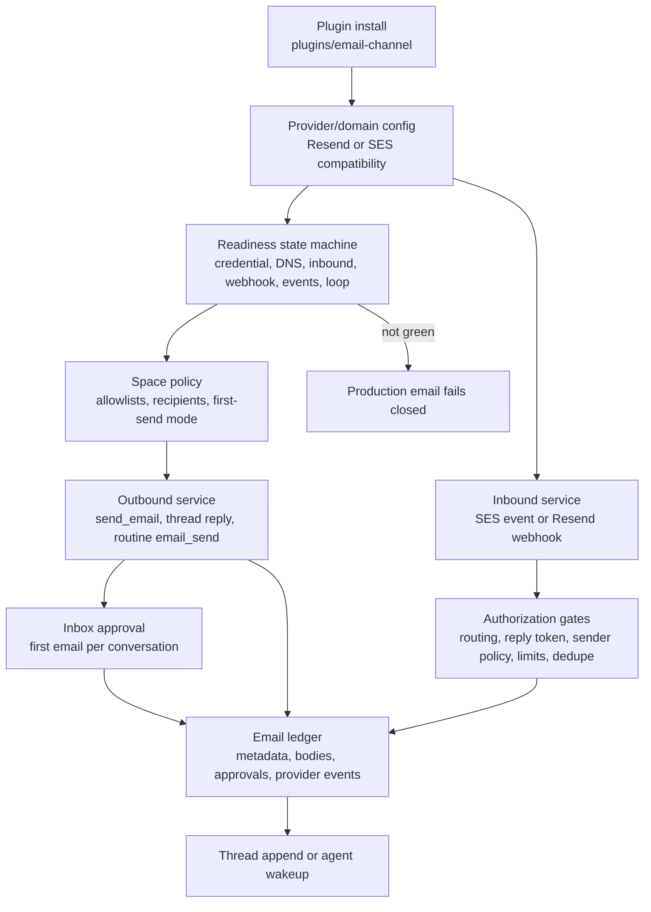
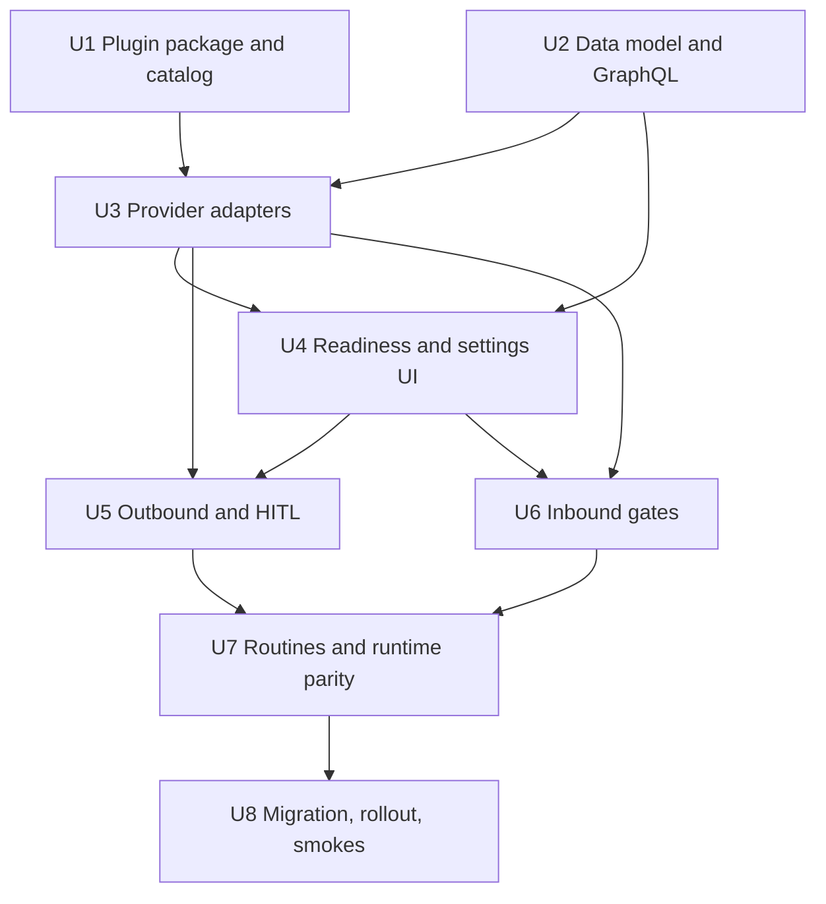
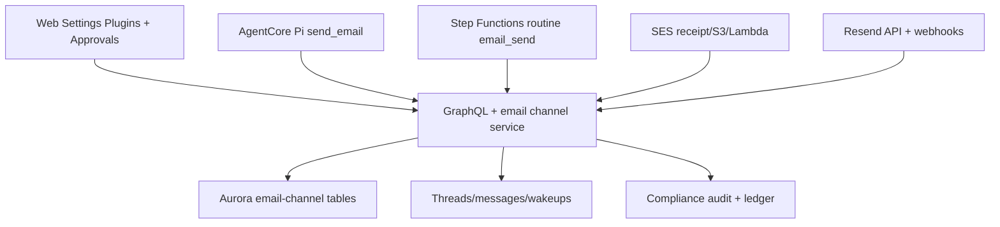

# feat: Email channel plugin

## Overview

Build the Email Channel Plugin as the tenant-owned control plane for agent and
Space email. The work converts today's SES-assumed path into a provider-backed
email channel with Resend as the recommended external provider, SES as the
AWS-native compatibility path, full-loop readiness, inbound authorization,
first-send human review, a conversation ledger, and deployed validation through
the ThinkWork install path.

The plugin does not replace every product email in ThinkWork. It owns
agent/Space conversation email and routine `email_send` only when that routine
operates as agent/Space work.

---

## Problem Frame

ThinkWork already has email plumbing: SES receipt rules save inbound mail to S3,
`email-inbound` parses and routes Space addresses, `email-send` and
`thread-reply` send SES mail, reply tokens continue conversations, and Space
email triggers gate cold-contact routing. The missing product shape is ownership
and safety: email provider setup is platform-assumed, readiness is implicit,
inbound gates are SES-specific, outbound trust is not represented as a review
state, and audit evidence is scattered across messages, wakeups, tokens, and
logs.

This plan keeps useful substrate and introduces a provider-neutral channel
model. The channel becomes installable and inspectable through the application
plugin system while shared platform code continues to own generic install,
activation, GraphQL, database, and runtime contracts.

---

## Requirements Trace

- R1. Email plugin owns tenant agent and Space email channel behavior.
- R2. V1 supports Resend as recommended provider and SES as compatibility.
- R3. SMTP, Postmark, Mailgun, and other providers are deferred.
- R4. Platform transactional mail remains outside v1.
- R5. V1 supports ThinkWork-owned tenant subdomains and customer-owned
  dedicated subdomains.
- R6. V1 does not use customer primary/root mail domains for agent email.
- R7. Production agent email fails closed until full-loop readiness passes.
- R8. Resend should be the fast readiness path; SES may expose sandbox delays.
- R9. Inbound is closed by default except registered tenant users.
- R10. Admins can allow outside sender emails/domains per Space.
- R11. Every inbound message passes provider trust, routing, authorization,
  rate-limit, idempotency, and audit gates before waking work.
- R12. First outbound email in each new conversation requires human review.
- R13. Review uses the existing HITL/inbox approval pattern.
- R14. Later replies in the same conversation may be autonomous within policy.
- R15. The ledger captures messages, approvals, readiness tests, provider
  events, failures, and inbound decisions.
- R16. Ledger retention distinguishes durable audit metadata from raw body
  retention and redaction.
- R17. Existing SES-backed conversations and reply routing are not stranded.
- R18. Routine `email_send` acting as agent/Space work uses the same channel
  readiness, approval, policy, and ledger rules.

**Origin actors:** A1 tenant administrator, A2 Space owner or reviewer, A3
tenant user, A4 external sender or recipient, A5 agent runtime and routines, A6
platform operator.

**Origin flows:** F1 plugin install and readiness, F2 first outbound email, F3
inbound email wakes work, F4 routine email work, F5 SES compatibility and
migration.

**Origin acceptance examples:** AE1 Resend readiness on a ThinkWork-owned
subdomain, AE2 fail-closed incomplete readiness, AE3 non-allowlisted inbound
rejection, AE4 edit-and-approve first outbound send, AE5 reconstructable
ledger, AE6 routine email in scope while platform transactional email remains
outside.

---

## Scope Boundaries

- Do not move Cognito invitations, Stripe/welcome email, Twenty invitations, or
  other platform/product transactional email behind the Email plugin.
- Do not add SMTP, Postmark, Mailgun, or other non-Resend providers in v1.
- Do not support customer primary/root mail domains for v1 agent email.
- Do not create a new review product surface when the existing HITL/inbox
  approval pattern can carry first-send review.
- Do not treat provider status alone as production readiness; v1 requires an
  active send -> receive/reply loop test.
- Do not allow open inbound email to create or wake agent work by default.
- Do not bypass the ThinkWork application plugin install path for Verification.

### Deferred to Follow-Up Work

- A public/provider marketplace or arbitrary tenant-authored email provider
  adapters.
- SMTP outbound-only compatibility after v1 proves the provider contract.
- Platform transactional mail consolidation.
- Provider-side historical event backfill beyond events observed after channel
  install.
- Advanced deliverability analytics beyond readiness, event ledger, bounce, and
  complaint visibility.

---

## Context & Research

### Relevant Code and Patterns

- `plugins/README.md` and `docs/solutions/architecture-patterns/plugin-source-boundaries-package-owned-deploy-verified-2026-06-17.md`
  require first-party plugin-specific source to live under
  `plugins/<plugin-key>/`, with package-local tests and smokes.
- `plugins/catalog/src/contracts.ts`, `plugins/lastmile/src/manifest.ts`, and
  `plugins/twenty/src/manifest.ts` define the existing manifest, component, and
  credential patterns. Email likely needs a catalog extension for provider
  channel components or a reserved UI surface plus shared platform handlers.
- `packages/database-pg/src/schema/email-channel.ts` currently holds only
  `email_reply_tokens`; it is the right schema module to expand for domains,
  provider installs, readiness, policies, conversations, messages, events, and
  body-retention references.
- `packages/api/src/handlers/email-inbound.ts` implements SES-specific inbound
  routing, registered-user/private-Space checks, reply-token consumption,
  idempotency by SES message id, and hourly rate limits.
- `packages/api/src/handlers/email-send.ts`, `packages/api/src/lib/email/thread-reply.ts`,
  and `packages/pi-extensions/src/send-email.ts` send through SES directly and
  should become clients of the channel service.
- `apps/web/src/components/approvals/ApprovalDetail.tsx` and
  `apps/web/src/components/approvals/EditAndApproveForm.tsx` already render an
  email-draft approval shape through inbox items.
- `packages/api/src/lib/routines/recipe-catalog.ts` and
  `packages/api/src/__tests__/routines-publish-flow.test.ts` define the
  routine `email_send` recipe and its validation path.
- `terraform/modules/app/ses-email/main.tf` owns SES domain, DKIM, MX, receipt
  rule, S3, and Lambda integration; SES remains a compatibility provider, not
  dead code.
- `docs/plans/2026-06-12-002-feat-customer-domain-namespace-plan.md` already
  handles web plus SES identity for `<tenant>.thinkwork.ai`, so the Email
  plugin must be data-driven about domains instead of hard-coding one address
  regex.

### Institutional Learnings

- `docs/solutions/integration-issues/tei-resend-invite-idempotency-and-ses-sandbox-2026-06-15.md`:
  SES sandbox failures must surface honestly; apparent success without a real
  provider attempt is worse than a visible block.
- `docs/solutions/integration-issues/twenty-crm-email-ses-config-2026-06-06.md`:
  app-email readiness needs a real send/invite smoke, not just a healthy app
  runtime.
- `docs/solutions/workflow-issues/manually-applied-drizzle-migrations-drift-from-dev-2026-04-21.md`:
  hand-rolled migrations need `-- creates:` markers and drift reporting.
- `docs/solutions/best-practices/injected-built-in-tools-are-not-workspace-skills-2026-04-28.md`:
  `send_email` is an injected built-in tool, not a workspace skill to resurrect.
- `docs/solutions/architecture-patterns/plugin-source-boundaries-package-owned-deploy-verified-2026-06-17.md`:
  plugin changes are not complete until the deployed ThinkWork install,
  activation, runtime, and MCP/tool path are proved.

### External References

- Resend Receiving Emails: inbound uses `email.received` webhooks and receiving
  domains can receive any local part on the configured domain.
- Resend Verify Webhook Requests: webhook verification uses signing secrets and
  raw request bodies; payload re-serialization breaks verification.
- Resend Managing Webhooks: webhooks deliver JSON event payloads, include event
  types such as delivery/bounce/complaint, and can be replayed.
- Resend MCP and agents docs: Resend exposes agent-oriented send/receive,
  domains, webhooks, API keys, and received-email tooling.
- Resend API key docs: keys are created from the Resend API Keys dashboard,
  have permission modes such as `sending_access` and `full_access`, can be
  domain-scoped for sending access, and the key value is only viewable when it
  is created.
- AWS SES sandbox and quotas docs: sandboxed accounts can send only to verified
  recipients/domains, with 200 messages per 24 hours and 1 message per second.
- AWS SES receiving/S3 docs: receipt rules, S3 storage, Lambda actions, region
  constraints, and the 40 MB inbound message limit remain compatibility
  concerns.

---

## Key Technical Decisions

- **Email channel state is first-class and provider-neutral.** Add canonical DB
  rows for tenant email domains, provider installs, Space policies,
  conversations, ledger messages, provider events, readiness checks, and body
  retention. Existing `email_reply_tokens` remains part of this module.
- **Resend and SES implement one channel service contract.** The contract covers
  send, inbound normalization, webhook/event verification, domain/readiness
  state, provider event ingestion, and ledger writes. `email-send`,
  `email-inbound`, `thread-reply`, routines, and runtime tools call the shared
  service rather than provider SDKs directly.
- **Provider trust is per event, not per header.** Resend requests require raw
  body signature verification before JSON parsing; SES events keep their Lambda
  invocation trust boundary plus S3 object validation. Message headers remain
  routing evidence, never authority.
- **Domains are data-driven.** The existing
  `space@tenant.thinkwork.ai` shape is preserved as SES compatibility. New
  channel routing resolves against `email_domains` records so Resend can use a
  ThinkWork-owned pattern such as `space@tenant.mail.thinkwork.ai` and
  customer-owned dedicated subdomains without changing code.
- **Readiness is a state machine with named checks.** Production behavior is
  blocked until provider credentials, send domain verification, inbound MX or
  receiving setup, webhook signature verification, delivery/bounce/complaint
  event reachability, and an active send -> receive/reply loop test pass for
  the selected domain/provider.
- **Sandbox/testing mode is operator-only and non-production.** Admins can run
  explicit test sends/receives while readiness is incomplete, but agents,
  routines, inbound wakeups, and auto-replies fail closed until readiness is
  green.
- **First-send approval is per conversation.** A conversation starts when there
  is no approved `email_conversation` for the Space, recipients, and thread
  context. Approval stores the draft, any edited draft, reviewer, decision, and
  resulting provider message id in the ledger. Later replies inherit autonomy
  only inside that conversation and policy.
- **Raw bodies are retained separately from audit metadata.** Durable DB ledger
  rows keep metadata, hashes, decisions, and body references. Raw inbound and
  outbound body snapshots live in encrypted object storage with
  `retention_until`, `redacted_at`, and redaction provenance. Seed the v1 raw
  body retention default to 30 days unless a tenant policy explicitly overrides
  it; audit metadata follows platform audit retention.
- **Existing SES conversations migrate by registration, not by pretending they
  were Resend.** Register current SES domains and reply-token paths as SES
  compatibility provider state, dual-read old tokens/messages, and write all new
  events into the ledger after cutover.
- **Verification must prove the real install path.** The final gate is a
  deployed ThinkWork tenant installing the Email plugin, configuring provider
  readiness, approving first send, processing inbound, validating routine email,
  checking ledger evidence, and tearing down/parking through the managed flow.

---

## Open Questions

### Resolved During Planning

- **What should the default ThinkWork-owned domain pattern be?** Use
  data-driven domains. Seed SES compatibility for existing
  `space@tenant.thinkwork.ai`; allow the Resend default to be
  `space@tenant.mail.thinkwork.ai` or another configured ThinkWork-owned
  subdomain without code changes.
- **How should readiness be represented?** Store per-check rows/events plus a
  derived overall state. Readiness can be explained by failed checks and cannot
  be overridden for production behavior.
- **How should inbound idempotency be keyed?** Use provider event id when
  present, provider message id, and normalized `Message-ID` as layered unique
  keys scoped to provider install and tenant domain. Header-only ids do not
  authorize work.
- **How should raw-body retention work?** Keep metadata durable in the ledger,
  store body snapshots out of row payloads, and require `retention_until` plus
  redaction state for every body object reference.
- **How should SES migration work?** Register existing SES domains and active
  reply-token paths as compatibility provider state, then route new sends and
  inbound events through the shared service while keeping old tokens valid until
  expiry or configured migration close.

### Deferred to Implementation

- Exact TypeScript type names and final table column names.
- Exact rate-limit numbers beyond the required dimensions: tenant, Space,
  sender, source domain, provider install, and conversation.
- Whether the provider contract needs a new plugin manifest component type or a
  reserved `ui-surface` plus plugin-specific shared handler in the first PR.
- The final Resend SDK version and whether raw Svix verification is imported
  directly or used through the Resend SDK wrapper.
- Exact raw body redaction job cadence and whether retention cleanup runs in an
  existing sweeper or a new Lambda.

---

## Output Structure

```text
plugins/email-channel/
  README.md
  package.json
  src/
    index.ts
    manifest.ts
    provider-contract.ts
    resend/
    ses/
  smoke/
    email-channel-plugin-smoke.mjs
  test/

packages/database-pg/src/schema/email-channel.ts
packages/database-pg/graphql/types/email-channel.graphql

packages/api/src/lib/email-channel/
  provider-contract.ts
  channel-service.ts
  readiness.ts
  ledger.ts
  inbound-authz.ts
  first-send-approval.ts
  providers/
    resend.ts
    ses.ts

packages/api/src/handlers/
  email-inbound.ts
  email-provider-webhook.ts
  email-readiness-probe.ts

apps/web/src/components/settings/plugins/email-channel/
docs/runbooks/email-channel-plugin-runbook.md
docs/verification/email-channel-plugin-e2e.md
```

---

## High-Level Technical Design

> _This illustrates the intended approach and is directional guidance for
> review, not implementation specification. The implementing agent should treat
> it as context, not code to reproduce._





---

## Implementation Units

- U1. **Email plugin package and catalog contract**

**Goal:** Create the package-owned Email plugin source boundary and catalog
entry without turning shared packages into plugin-specific code dumps.

**Requirements:** R1-R4, R17; F1, F5

**Dependencies:** None

**Files:**

- Create: `plugins/email-channel/package.json`
- Create: `plugins/email-channel/README.md`
- Create: `plugins/email-channel/src/index.ts`
- Create: `plugins/email-channel/src/manifest.ts`
- Create: `plugins/email-channel/src/provider-contract.ts`
- Create: `plugins/email-channel/test/manifest.test.ts`
- Modify: `plugins/catalog/src/contracts.ts`
- Regenerate: `plugins/catalog/src/registry/generated-first-party.ts`
- Modify: `plugins/catalog/scripts/generate-plugin-registry.ts`
- Modify: `scripts/verify-plugin-source-boundary.mjs`

**Approach:**

- Add `plugins/email-channel` as the package-owned home for Email plugin
  manifests, provider-specific helpers, smokes, tests, and docs.
- Keep generic install/activation state in the existing plugin engine. Add only
  the smallest catalog contract extension needed to declare an email-channel
  capability, or explicitly model v1 as an installed plugin with reserved UI
  surface plus shared email-channel handlers.
- Register Resend and SES compatibility as provider options in the package
  contract. Do not list SMTP/Postmark/Mailgun in v1.
- Add package-local manifest tests and ensure source-boundary verification
  treats Email plugin source as owned by `plugins/email-channel`.

**Patterns to follow:**

- `plugins/lastmile/src/index.ts` for package descriptors.
- `plugins/twenty/src/manifest.ts` for infrastructure-adjacent plugin
  contracts.
- `plugins/README.md` for package ownership expectations.

**Test scenarios:**

- Happy path: catalog build includes `email-channel` with the expected display
  name, version, and provider declarations.
- Error path: manifest validation rejects unknown provider keys and any SMTP,
  Postmark, or Mailgun declaration in v1.
- Integration: source-boundary check allows Email plugin files under
  `plugins/email-channel` and rejects new Email-plugin-specific branches in
  unrelated shared packages unless allowlisted as generic contracts.

**Verification:**

- The package participates in pnpm workspace checks and the generated catalog
  can publish the Email plugin without install-time side effects.

---

- U2. **Email channel data model, GraphQL, and ledger contract**

**Goal:** Add durable provider-neutral state for domains, provider installs,
readiness, Space policy, conversations, ledger events, provider events, and raw
body retention.

**Requirements:** R5-R7, R9-R11, R15-R17; F1, F3, F5; AE1-AE3, AE5

**Dependencies:** U1 for naming alignment, but schema can land inert first.

**Files:**

- Modify: `packages/database-pg/src/schema/email-channel.ts`
- Modify: `packages/database-pg/src/schema/index.ts`
- Create: `packages/database-pg/drizzle/0170_email_channel_plugin.sql`
- Create: `packages/database-pg/drizzle/0170_email_channel_plugin_rollback.sql`
- Create: `packages/database-pg/graphql/types/email-channel.graphql`
- Modify: canonical GraphQL source files under
  `packages/database-pg/graphql/types/*.graphql` as needed for shared enums or
  cross-type references
- Modify: `packages/database-pg/__tests__/email-channel-schema.test.ts`
- Modify: `packages/api/src/__tests__/graphql-contract.test.ts`
- Create: `packages/api/src/graphql/resolvers/email-channel/`
- Modify: `packages/api/src/graphql/resolvers/index.ts`
- Modify: `apps/web/src/lib/settings-queries.ts`
- Modify: generated GraphQL artifacts in `apps/cli`, `apps/web`,
  `apps/mobile`, and `packages/api`

**Approach:**

- Add tables for tenant email domains, provider installs, readiness checks,
  Space sender allowlists, conversations, ledger messages/events, provider
  events, body object references, and migration mapping from existing SES
  tokens/messages.
- Keep `email_reply_tokens` intact and link new rows to it where possible.
- Add check constraints for provider enum values (`resend`, `ses`) and
  readiness status values.
- Store body metadata and object refs in DB, not large raw body payloads.
  Require `retention_until`, `content_hash`, `redacted_at`, and redaction
  provenance for every raw body object reference.
- Expose admin/operator queries and mutations for domain status, readiness
  status, Space sender allowlists, ledger search by conversation/thread, and
  provider event detail. Do not expose raw secrets.
- Emit compliance-compatible event types for approval, policy, readiness,
  provider event, and retention/redaction decisions.

**Execution note:** Start with schema and GraphQL contract tests so every later
unit has stable primitives.

**Patterns to follow:**

- `packages/database-pg/src/schema/plugins.ts` for state vocabulary and check
  constraints.
- `packages/database-pg/src/schema/compliance.ts` for audit/redaction envelope
  thinking.
- `packages/database-pg/drizzle/0122_space_email_triggers.sql` and
  `docs/solutions/workflow-issues/manually-applied-drizzle-migrations-drift-from-dev-2026-04-21.md`
  for manual migration markers.

**Test scenarios:**

- Happy path: schema tests confirm tables, indexes, uniqueness, and allowed
  status/provider constraints exist.
- Happy path: GraphQL contract exposes channel state without exposing provider
  secrets or raw body object contents.
- Error path: invalid provider/status values fail at schema or resolver
  validation.
- Edge case: multiple providers can exist historically for a tenant, but only
  one provider/domain pair can be active for production sending per Space.
- Integration: generated GraphQL artifacts include the new types and no
  existing email trigger fields disappear.
- Covers AE5: ledger query can reconstruct inbound authorization, approval,
  edited draft, send, and provider event references while raw body retention is
  represented separately.

**Verification:**

- Database and GraphQL tests prove the channel state can support the product
  requirements before live provider code is wired.

---

- U3. **Provider adapter service for Resend and SES compatibility**

**Goal:** Implement one EmailProvider contract and route SES/Resend behavior
through a shared service, while keeping SES compatibility for existing domains
and reply tokens.

**Requirements:** R2, R5-R8, R11, R15, R17; F1, F3, F5; AE1, AE2, AE5

**Dependencies:** U1, U2

**Files:**

- Create: `packages/api/src/lib/email-channel/provider-contract.ts`
- Create: `packages/api/src/lib/email-channel/channel-service.ts`
- Create: `packages/api/src/lib/email-channel/providers/resend.ts`
- Create: `packages/api/src/lib/email-channel/providers/ses.ts`
- Create: `packages/api/src/lib/email-channel/readiness.ts`
- Create: `packages/api/src/lib/email-channel/ledger.ts`
- Create: `packages/api/src/lib/email-channel/__tests__/provider-contract.test.ts`
- Create: `packages/api/src/lib/email-channel/__tests__/resend-provider.test.ts`
- Create: `packages/api/src/lib/email-channel/__tests__/ses-provider.test.ts`
- Modify: `packages/api/src/handlers/email-send.ts`
- Modify: `packages/api/src/handlers/email-inbound.ts`
- Modify: `packages/api/src/lib/email/thread-reply.ts`
- Modify: `scripts/build-lambdas.sh`

**Approach:**

- Define provider methods for `send`, `normalizeInbound`, `verifyEvent`,
  `ingestProviderEvent`, `readinessChecks`, and `domainInstructions`.
- Implement SES as a compatibility adapter over existing SES SDK calls, S3 raw
  mail parsing, receipt rule event shape, and reply-token correlation.
- Implement Resend send/event/inbound normalization using API-key and webhook
  secret refs resolved server-side. Verification must use raw body bytes before
  JSON parsing.
- Normalize provider event types into the ledger: sent, delivered, delayed,
  failed, bounced, complained, opened/clicked when available, and received.
- Keep provider-specific payloads in event metadata with redaction and size
  limits. Store raw webhook payloads only as body/event object refs when needed
  for audit.
- Update lambda build bundling only for handlers that need new SDK/Svix
  dependencies.

**Patterns to follow:**

- `packages/api/src/lib/plugins/engine.ts` for dependency-injected service
  boundaries.
- `packages/api/src/handlers/email-inbound.ts` for SES parsing and current
  token handling.
- `scripts/build-lambdas.sh` for handlers that inline newer SDK dependencies.

**Test scenarios:**

- Happy path: SES adapter preserves existing send and inbound normalized event
  shapes for `space@tenant.thinkwork.ai`.
- Happy path: Resend adapter accepts a signed raw webhook payload and produces
  a normalized inbound event with provider ids, sender, recipients, headers,
  subject, body refs, and attachments metadata.
- Error path: Resend webhook with missing or invalid Svix headers is rejected
  before parsing and records an auditable provider-trust failure.
- Error path: SES sandbox/provider send failure maps to a fail-closed channel
  error rather than a generic success.
- Edge case: duplicate provider event id is idempotent and does not append
  duplicate ledger rows.
- Integration: `email-send` and `thread-reply` can call the service without
  knowing which provider owns the active domain.

**Verification:**

- Unit tests prove both providers satisfy the same contract and the existing SES
  path remains available while Resend support is introduced.

---

- U4. **Readiness state machine and plugin settings surface**

**Goal:** Give tenant admins a guided install/configuration path, readiness
checks, test mode, and Space policy controls in the existing Plugins settings
surface.

**Requirements:** R5-R10, R12-R14; F1-F3; AE1-AE4

**Dependencies:** U2, U3

**Files:**

- Create: `packages/api/src/handlers/email-readiness-probe.ts`
- Create: `packages/api/src/lib/email-channel/readiness-probes.ts`
- Create: `packages/api/src/graphql/resolvers/email-channel/readiness.mutations.ts`
- Create: `packages/api/src/graphql/resolvers/email-channel/policy.mutations.ts`
- Create: `apps/web/src/components/settings/plugins/email-channel/EmailChannelSettings.tsx`
- Create: `apps/web/src/components/settings/plugins/email-channel/EmailReadinessPanel.tsx`
- Create: `apps/web/src/components/settings/plugins/email-channel/ResendApiKeyInstructions.tsx`
- Create: `apps/web/src/components/settings/plugins/email-channel/SpaceEmailPolicyPanel.tsx`
- Create: `apps/web/src/components/settings/plugins/email-channel/EmailLedgerPanel.tsx`
- Create: `apps/web/src/components/settings/plugins/email-channel/*.test.tsx`
- Modify: `apps/web/src/components/settings/plugins/PluginDetail.tsx`
- Modify: `apps/web/src/lib/settings-queries.ts`
- Modify: `terraform/modules/app/lambda-api/main.tf`
- Modify: `terraform/modules/app/lambda-api/outputs.tf`
- Modify: `scripts/build-lambdas.sh`

**Approach:**

- Extend the plugin detail page with an Email-channel-specific settings panel
  rendered by shared plugin shell code, following plugin source-boundary rules.
- Admins can choose Resend or SES compatibility, enter secret refs/credentials
  through existing secret-safe patterns, inspect DNS/domain instructions, and
  run explicit test sends/receives.
- For Resend, the plugin detail/configuration panel must include concise setup
  guidance before the credential field: where to open the Resend API Keys
  dashboard, that the admin should create a dedicated ThinkWork production key,
  which permission mode the selected setup requires, how to domain-scope the key
  when `sending_access` is sufficient, and that Resend only shows the key value
  at creation time. Prefer the least-privileged permission that supports the
  selected automation path; require `full_access` only if ThinkWork is expected
  to manage or verify provider resources that cannot be handled with a
  send-scoped key.
- Store the Resend key through the existing secret-safe credential flow. The UI
  should never echo the submitted key after save; it should show only a masked
  status, last verification time, and rotation action.
- Readiness checks are individually visible and auditable. A green derived state
  requires credentials, sending domain, inbound receiving, webhook/event
  reachability, delivery/bounce/complaint reachability, and loop test.
- Space policy controls manage registered-user behavior, private-Space
  membership, outside sender allowlists, and first-send approval mode. No open
  inbound default.
- UI must make incomplete readiness visibly blocked for production agent/routine
  behavior while allowing operator test mode.

**Patterns to follow:**

- `apps/web/src/components/settings/plugins/PluginDetail.tsx` for plugin
  install/update/activation patterns and explicit query refetches.
- `docs/plans/2026-05-27-004-feat-space-email-trigger-management-plan.md` for
  Space email lifecycle and trigger UI conventions.
- `packages/api/src/graphql/resolvers/plugins/mutations.ts` for admin-gated,
  RequestResponse mutation behavior.

**Test scenarios:**

- Covers AE1: configured Resend domain with all checks green shows production
  Space email available.
- Covers AE2: missing inbound or webhook check keeps production sends and
  inbound wakeups blocked while operator test mode remains available.
- Happy path: Resend setup panel explains how to create a dedicated API key in
  Resend, recommends the least-privileged permission for the chosen setup, and
  links to official API key docs without exposing a saved secret value.
- Error path: a Resend key with insufficient permission surfaces a provider
  readiness error that tells the admin which permission/domain scope is missing
  without logging or rendering the key.
- Happy path: admin adds a Space-level sender/domain allowlist and the policy
  query returns it without exposing secrets.
- Error path: non-admin user cannot configure provider, domain, readiness, or
  allowlist policy.
- Edge case: urql document cache is explicitly refetched after readiness or
  policy mutation.
- Integration: plugin detail continues to render installed plugins if catalog
  browse is degraded.

**Verification:**

- Admin UI and resolver tests prove tenant admins can configure and inspect the
  channel while production behavior remains fail-closed until readiness passes.

---

- U5. **Outbound channel, first-send HITL, and ledger writes**

**Goal:** Route direct agent sends, thread replies, and first outbound
conversation sends through readiness, policy, HITL, provider send, and ledger
logic.

**Requirements:** R7, R12-R16, R18; F2, F4; AE2, AE4-AE6

**Dependencies:** U2, U3, U4

**Files:**

- Modify: `packages/api/src/handlers/email-send.ts`
- Modify: `packages/api/src/lib/email/thread-reply.ts`
- Modify: `packages/pi-extensions/src/send-email.ts`
- Modify: `packages/pi-extensions/test/capabilities.test.ts`
- Create: `packages/api/src/lib/email-channel/first-send-approval.ts`
- Create: `packages/api/src/lib/email-channel/outbound-policy.ts`
- Create: `packages/api/src/lib/email-channel/__tests__/first-send-approval.test.ts`
- Modify: `packages/api/src/graphql/resolvers/inbox/approveInboxItem.mutation.ts`
- Modify: `packages/api/src/graphql/resolvers/inbox/rejectInboxItem.mutation.ts`
- Modify: `apps/web/src/components/approvals/approval-types.ts`
- Modify: `apps/web/src/components/approvals/ApprovalDetail.tsx`
- Modify: `apps/web/src/components/approvals/EditAndApproveForm.tsx`
- Modify: `apps/web/src/components/approvals/*.test.tsx`
- Modify: `packages/api/src/handlers/email-send.test.ts`
- Modify: `packages/api/src/lib/email/thread-reply.test.ts`

**Approach:**

- `send_email` requests ask the channel service to evaluate readiness, Space
  policy, recipient policy, rate limits, and conversation approval state.
- If the send is the first outbound email for a new conversation, create an
  inbox item with `actionType: email_send`, the draft, recipient, subject, body,
  context/evidence, and a ledger pending state. Do not send until approval.
- Approve sends the original or edited draft through the provider adapter,
  records reviewer/decision/edited draft/provider id, and opens the approved
  conversation window.
- Deny records the decision and returns a non-send result to the agent/runtime.
- Later replies in the approved conversation can send autonomously if readiness,
  recipient, rate-limit, and Space policy still pass.
- Raw outbound bodies get body object refs with `retention_until`; durable
  metadata stays in ledger rows.

**Execution note:** Implement first-send approval behavior test-first; it is the
main blast-radius reducer for outbound email.

**Patterns to follow:**

- Existing email approval UI in `apps/web/src/components/approvals`.
- `packages/api/src/graphql/resolvers/inbox/routine-approval-bridge.ts` for
  decision-to-side-effect bridging.
- `packages/pi-extensions/src/send-email.ts` for current tool payload shape.

**Test scenarios:**

- Covers AE4: first outbound draft creates an inbox item, reviewer edits and
  approves, edited draft is sent, approval is recorded, and later same-thread
  reply is autonomous within policy.
- Covers AE2: incomplete readiness blocks agent/routine send before provider
  call.
- Error path: provider send failure keeps conversation unapproved for autonomy
  and records a failed ledger/provider event.
- Edge case: recipient list changes during edit-and-approve is rejected unless
  the approval payload explicitly supports recipient edits.
- Edge case: reply mode with stale or missing conversation approval re-enters
  review instead of sending silently.
- Integration: `send_email` tool response distinguishes pending review from
  sent, so agents do not claim delivery before approval.
- Covers AE5: ledger query shows draft, edited draft, reviewer, send decision,
  provider message id, and body retention refs.

**Verification:**

- Outbound cannot send production mail before readiness and first-send review,
  and approved sends leave reconstructable evidence.

---

- U6. **Inbound webhook normalization, authorization, rate limits, and wakeup**

**Goal:** Replace SES-specific inbound assumptions with a provider-neutral gate
that handles Resend webhooks and SES events before appending threads or waking
agents.

**Requirements:** R7, R9-R11, R15-R17; F3, F5; AE2, AE3, AE5

**Dependencies:** U2, U3, U4

**Files:**

- Modify: `packages/api/src/handlers/email-inbound.ts`
- Create: `packages/api/src/handlers/email-provider-webhook.ts`
- Create: `packages/api/src/lib/email-channel/inbound-authz.ts`
- Create: `packages/api/src/lib/email-channel/inbound-routing.ts`
- Create: `packages/api/src/lib/email-channel/rate-limits.ts`
- Create: `packages/api/src/lib/email-channel/idempotency.ts`
- Create: `packages/api/src/lib/email-channel/__tests__/inbound-authz.test.ts`
- Create: `packages/api/src/lib/email-channel/__tests__/inbound-routing.test.ts`
- Modify: `packages/api/src/handlers/email-inbound.test.ts`
- Create: `packages/api/src/handlers/email-provider-webhook.test.ts`
- Modify: `packages/api/src/lib/email/cold-contact-trigger.ts`
- Modify: `packages/api/src/lib/email/space-address.ts`
- Modify: `packages/api/src/lib/email/space-address.test.ts`
- Modify: `terraform/modules/app/lambda-api/main.tf`
- Modify: `terraform/modules/app/api-gateway/main.tf`

**Approach:**

- Add an HTTP webhook handler for provider events, including Resend inbound and
  delivery/bounce/complaint events. The handler must retain raw body for
  signature verification before parsing.
- Refactor SES Lambda event handling to produce the same normalized inbound
  envelope as the webhook handler.
- Route recipients by configured email domain records and Space address policy,
  not a hard-coded `*.thinkwork.ai` regex.
- Gate inbound in order: provider trust, recipient-to-tenant/Space routing,
  reply token or cold-contact authorization, registered user/private Space
  membership, explicit Space allowlist for outside senders, idempotency, rate
  limits, ledger write, thread append or wakeup.
- Rejections are auditable and silent externally unless a future product
  requirement chooses bounce/notice behavior.
- Attachments are recorded as metadata/body refs; executable content is never
  passed directly to agents as authority.

**Patterns to follow:**

- Existing `processColdContact`, `appendReplyToThread`, and
  `insertWakeupRequest` behavior in `email-inbound.ts`.
- `packages/api/src/lib/email/space-address.ts` tests for routing helpers.
- Resend webhook verification guidance: raw payload plus Svix headers.

**Test scenarios:**

- Covers AE3: non-tenant, non-allowlisted sender to an enabled Space is
  rejected, no thread/wakeup is created, and rejection ledger metadata does not
  leak sensitive routing details.
- Happy path: registered tenant user can email an enabled public Space and
  create a thread through SES and Resend normalized paths.
- Happy path: allowlisted external sender can wake/create work for the specific
  Space only.
- Error path: invalid Resend signature rejects before parsing and before any
  ledger body snapshot is trusted as provider-originated.
- Error path: replayed provider event id or normalized message id is idempotent.
- Edge case: private Space requires membership even for registered tenant user.
- Edge case: expired or overused reply token cannot authorize a reply.
- Integration: successful inbound appends or wakes after the ledger row commits,
  not before.

**Verification:**

- Inbound messages cannot create or wake work unless every product gate passes,
  and all accepted/rejected paths leave operator-auditable records.

---

- U7. **Routine, runtime, and cross-surface email parity**

**Goal:** Ensure routine `email_send`, runtime tool injection, auto-replies, and
UI/CLI/mobile surfaces honor the same Email plugin readiness, approval, policy,
and ledger rules.

**Requirements:** R1, R4, R7, R12-R18; F2, F4, F5; AE2, AE4-AE6

**Dependencies:** U5, U6

**Files:**

- Modify: `packages/api/src/lib/routines/recipe-catalog.ts`
- Modify: `packages/api/src/handlers/routine-asl-validator.ts`
- Modify: `packages/api/src/handlers/routine-execution-callback.ts`
- Modify: `packages/api/src/handlers/email-send.ts`
- Modify: `packages/api/src/__tests__/routines-publish-flow.test.ts`
- Modify: `packages/api/src/handlers/routine-asl-validator.test.ts`
- Modify: `packages/api/src/lib/resolve-agent-runtime-config.ts`
- Modify: `packages/api/src/lib/__tests__/resolve-agent-runtime-config.test.ts`
- Modify: `packages/api/src/handlers/chat-agent-invoke.ts`
- Modify: `packages/api/src/handlers/wakeup-processor.ts`
- Modify: `packages/api/src/handlers/chat-agent-invoke.runtime-routing.test.ts`
- Modify: `packages/agentcore-pi/agent-container/tests/server.test.ts`
- Modify: `apps/cli/src/commands/inbox/*`
- Modify: `apps/mobile/lib/mobile-inbox.ts`
- Modify: `apps/mobile/lib/mobile-inbox.test.ts`

**Approach:**

- Classify routine `email_send` as channel-owned when the routine has
  Space/agent context. Such sends use the same channel service, not the direct
  SES shortcut.
- Preserve platform transactional exclusions by keeping Cognito, Stripe/welcome,
  Twenty invitations, and unrelated product email on existing paths.
- Runtime config should inject `send_email` only when the active Space/tool
  policy allows it and the channel can at least produce a meaningful pending
  review or fail-closed response. It must not expose a tool that can bypass
  readiness.
- `thread-reply` auto-replies use conversation approval and readiness policy,
  not direct SES best-effort send.
- CLI/mobile inbox surfaces can inspect and decide email approval items with
  edited draft values as the web surface does.

**Patterns to follow:**

- `packages/api/src/lib/builtin-tool-policy-aliases.ts` for tool policy parity.
- `packages/api/src/lib/evals/agentcore-direct.ts` and AgentCore tests for
  side-effect kill-list behavior.
- Existing CLI inbox command structure under `apps/cli/src/commands/inbox/`.

**Test scenarios:**

- Covers AE6: routine Space `email_send` uses channel readiness/approval/ledger,
  while Cognito invite and Stripe/welcome paths are unchanged.
- Covers AE2: routine `email_send` with incomplete readiness fails before
  provider send and records the blocked state.
- Happy path: runtime `send_email` request can return pending-review state and
  does not report sent until approval/provider send completes.
- Edge case: shared thread with `send_email` blocked by Space tool policy does
  not inject the tool even if channel readiness is green.
- Integration: `chat-agent-invoke` and `wakeup-processor` build equivalent
  send-email config and cannot diverge.
- Integration: mobile and CLI can approve/reject email approval items without
  losing edited draft payload.

**Verification:**

- Every in-scope email surface uses the channel service. Out-of-scope platform
  transactional paths remain untouched and documented.

---

- U8. **SES migration, observability, documentation, and deployed validation**

**Goal:** Safely migrate existing SES-backed behavior, add operational evidence,
and prove the Email plugin through a deployed ThinkWork install and teardown
path.

**Requirements:** R1-R18; F1-F5; AE1-AE6

**Dependencies:** U1-U7

**Files:**

- Create: `packages/api/scripts/backfill-email-channel-ses-compat.ts`
- Create: `packages/api/scripts/backfill-email-channel-ses-compat.test.ts`
- Create: `plugins/email-channel/smoke/email-channel-plugin-smoke.mjs`
- Create: `docs/runbooks/email-channel-plugin-runbook.md`
- Create: `docs/verification/email-channel-plugin-e2e.md`
- Modify: `docs/src/content/docs/applications/admin/plugins.mdx`
- Modify: `docs/src/content/docs/concepts/spaces/triggers-and-channels.mdx`
- Modify: `docs/runbooks/pi-runtime-capability-smoke.md`
- Modify: `packages/api/src/lib/compliance/redaction.ts`
- Modify: `packages/database-pg/src/schema/compliance.ts`
- Modify: `packages/database-pg/drizzle/*compliance*`
- Modify: `.github/workflows/verify.yml` if source-boundary or smoke dry-run
  checks need registration

**Approach:**

- Backfill current SES tenant domains, Space trigger state, reply-token
  compatibility pointers, and active email conversations into channel state.
  Do not attempt to reconstruct historical raw body retention for old mail.
- Add operator runbook steps for installing, configuring Resend, validating SES
  compatibility, reading ledger entries, rotating secrets, redacting raw bodies,
  and rolling back to fail-closed.
- Add smoke script modes: dry-run configuration inspection, post-install
  readiness inspection, live Resend loop test, SES compatibility loop test, HITL
  first-send test, routine `email_send` test, and teardown/park confirmation.
- Add compliance redaction types for email events and ensure payloads never
  store full raw bodies in audit events.
- Keep deploy target coverage honest: if shared API/library code changes,
  verify every Lambda consuming email channel code is rebuilt/deployed.

**Execution note:** Verification must use the user-facing ThinkWork plugin
install flow. Local Docker, direct provider dashboard tests, or Terraform-only
shortcuts do not satisfy THNK-35.

**Patterns to follow:**

- `plugins/lastmile/smoke/lastmile-plugin-smoke.mjs` for deployed plugin smoke
  shape.
- `docs/verification/manual-user-setup-e2e.md` for evidence-table style.
- `docs/solutions/architecture-patterns/plugin-source-boundaries-package-owned-deploy-verified-2026-06-17.md`
  for final verification bar.

**Test scenarios:**

- Covers AE1: live Resend install on a ThinkWork-owned tenant email domain
  reaches green readiness and enables production Space email.
- Covers AE2: live incomplete readiness blocks production sends and inbound
  wakeups.
- Covers AE3: live non-allowlisted external sender is rejected and auditable.
- Covers AE4: live first outbound send requires edit-and-approve, then later
  reply in same conversation can send autonomously within policy.
- Covers AE5: live operator can reconstruct message, authz, approval, edited
  draft, provider delivery event, and retention/redaction state from ledger.
- Covers AE6: live routine `email_send` uses the channel; Cognito/Stripe/Twenty
  transactional paths are unchanged.
- Migration: existing SES reply token still routes a reply after compatibility
  backfill, and new sends write channel ledger rows.
- Teardown: uninstall/park disables production email and provider webhook intake
  without orphaning active audit records or raw body retention cleanup.

**Verification:**

- THNK-35 is ready for Verification only after the deployed install, readiness,
  inbound, outbound, routine, ledger, migration, and teardown criteria in
  `docs/verification/email-channel-plugin-e2e.md` have recorded evidence.

---

## System-Wide Impact



- **Interaction graph:** plugin install, settings UI, provider webhook/API,
  SES Lambda, `email-send`, `thread-reply`, routine `email_send`, inbox
  approval, thread append/wakeup, compliance audit, and raw body cleanup all
  cross the new channel service.
- **Error propagation:** production behavior fails closed with explicit channel
  errors. Operator test mode may surface provider details, but agent-facing
  errors should be actionable without leaking secrets or route internals.
- **State lifecycle risks:** readiness checks can go stale, provider webhooks
  can replay, raw body objects need redaction cleanup, and migration must keep
  old reply tokens valid until expiry.
- **API surface parity:** GraphQL, web, CLI, mobile, runtime, routines, and
  smokes need the same approval and ledger semantics.
- **Integration coverage:** unit tests prove gates, but Verification needs live
  DNS/webhook/provider evidence because deliverability and inbound routing are
  external contracts.
- **Unchanged invariants:** platform transactional mail remains outside this
  plugin; direct tool-policy blocking of `send_email` still wins; eval/replay
  side-effect kill lists continue to suppress email.

---

## Risks & Dependencies

| Risk                                                  | Likelihood | Impact | Mitigation                                                                                                                         |
| ----------------------------------------------------- | ---------- | ------ | ---------------------------------------------------------------------------------------------------------------------------------- |
| Resend API/webhook behavior differs from assumptions  | Medium     | High   | Use official docs and SDK behavior in U3, keep provider contract tests, and require live Resend loop smoke in U8.                  |
| SES sandbox or quota blocks compatibility validation  | High       | Medium | Surface SES readiness separately, keep SES path compatibility, and document sandbox as an external gate.                           |
| Webhook replay or spoofing wakes agents               | Medium     | High   | Verify raw signatures before parsing, idempotency keys on provider event/message ids, and rate-limit before wakeup.                |
| First-send approval is bypassed by a legacy send path | Medium     | High   | Move `email-send`, `thread-reply`, runtime tool, and routine recipe through one service; add parity tests for both dispatch paths. |
| Raw email bodies are retained too long                | Medium     | High   | Store raw bodies outside audit rows with retention/redaction state and a cleanup path; audit stores metadata and hashes only.      |
| Migration strands active SES replies                  | Medium     | High   | Backfill/register SES compatibility state and dual-read existing reply tokens until expiry or closeout.                            |
| Plugin source leaks into shared packages              | Medium     | Medium | Keep Email-specific code in `plugins/email-channel`; shared packages expose generic contracts only; run source-boundary checks.    |
| UI shows stale readiness due to document cache        | Medium     | Medium | Explicit network refetch after readiness/policy/provider mutations, following existing plugin UI pattern.                          |

---

## Phased Delivery

### Phase 1: Inert Substrate

- U1 and U2 can land without changing production email behavior.
- U3 can land behind provider selection/readiness guards while SES remains the
  active compatibility path.

### Phase 2: Admin Configuration and Gates

- U4 makes readiness and policy visible.
- U5 and U6 move outbound/inbound behavior behind the channel service and
  fail-closed gates.

### Phase 3: Parity and Migration

- U7 closes routine/runtime/CLI/mobile parity gaps.
- U8 backfills SES compatibility, publishes docs/smokes, and validates the
  deployed plugin path.

---

## Documentation / Operational Notes

- Update admin docs for plugin install, Resend setup, SES compatibility, Space
  allowlists, first-send approval, and ledger inspection.
- The Resend setup docs and plugin detail page should include an API-key
  checklist: create a dedicated key in Resend, choose the least-privileged
  permission/domain scope that supports the selected automation mode, paste the
  key once into ThinkWork, run readiness verification, and rotate the key by
  creating a replacement before deleting the old one.
- Add an operator runbook for readiness failures, webhook secret rotation,
  provider event replay, raw body redaction, and SES fallback.
- Verification requires a deployed stack. There is no local-only acceptance for
  this feature.
- Rollout should start with one internal/dogfood tenant and a ThinkWork-owned
  tenant email domain before customer-owned domains.
- Rollback posture is fail-closed: disable production channel behavior, retain
  ledger/audit records, keep SES compatibility registered, and stop provider
  webhooks from waking agents.

---

## End-to-End Validation Criteria for Verification

THNK-35 can enter Verification only when all of the following evidence is
recorded in `docs/verification/email-channel-plugin-e2e.md` and linked from the
Linear issue:

- **Install path:** a tenant admin installs the Email plugin through Settings ->
  Plugins, not by direct Terraform or provider dashboard setup.
- **Resend credential guidance:** the plugin detail page gives the admin clear
  API-key instructions, links to Resend's API key docs, stores the submitted key
  through the secret-safe flow, masks it after save, and reports insufficient
  permission/domain scope as readiness failures.
- **Resend readiness:** credentials, DNS/domain verification, inbound receiving,
  webhook signature verification, delivery/bounce/complaint reachability, and
  send -> receive/reply loop all pass for a ThinkWork-owned tenant subdomain.
- **Fail-closed:** with one readiness check intentionally incomplete,
  production agent sends and inbound wakeups are blocked while operator test
  mode remains available.
- **First-send HITL:** an agent drafts first outbound email, inbox review shows
  recipient/subject/body/context/evidence, reviewer edits and approves, the
  edited draft sends, and later replies in that conversation are autonomous
  within policy.
- **Inbound authorization:** registered tenant user inbound succeeds; private
  Space non-member fails; non-tenant sender fails until explicitly allowlisted
  for that Space; every rejection is auditable.
- **Routine parity:** routine `email_send` acting as Space work uses the Email
  plugin readiness, approval, policy, and ledger path.
- **SES compatibility:** an existing SES-backed reply-token flow continues after
  compatibility registration, and new SES sends write channel ledger rows.
- **Ledger and retention:** operator can reconstruct accepted and rejected
  inbound, approval decisions, edited drafts, provider events, and body
  retention/redaction state without raw bodies living indefinitely in audit
  rows.
- **Transactional mail exclusion:** Cognito invitations, Stripe/welcome email,
  and Twenty invitations remain on existing paths.
- **Teardown:** uninstall/park through the ThinkWork managed plugin flow blocks
  production channel behavior and webhook wakeups while preserving audit/ledger
  evidence and cleanup jobs.

---

## Sources & References

- **Origin document:** `docs/brainstorms/2026-06-17-email-channel-plugin-requirements.md`
- **Linear issue:** THNK-35, "Email Functionality"
- **Requirements PR:** https://github.com/thinkwork-ai/thinkwork/pull/2577
- **Application plugin plan:** `docs/plans/2026-06-12-001-feat-application-plugins-plan.md`
- **Plugin source boundary:** `docs/solutions/architecture-patterns/plugin-source-boundaries-package-owned-deploy-verified-2026-06-17.md`
- **Space email trigger plan:** `docs/plans/2026-05-27-004-feat-space-email-trigger-management-plan.md`
- **Customer domain namespace plan:** `docs/plans/2026-06-12-002-feat-customer-domain-namespace-plan.md`
- **Existing email handlers:** `packages/api/src/handlers/email-inbound.ts`,
  `packages/api/src/handlers/email-send.ts`,
  `packages/api/src/lib/email/thread-reply.ts`,
  `packages/api/src/lib/email/space-address.ts`
- **Existing email schema:** `packages/database-pg/src/schema/email-channel.ts`
- **Existing approval UI:** `apps/web/src/components/approvals/ApprovalDetail.tsx`
- **Existing routine email:** `packages/api/src/lib/routines/recipe-catalog.ts`
- **SES Terraform:** `terraform/modules/app/ses-email/main.tf`
- **Resend Receiving Emails:** https://resend.com/docs/dashboard/receiving/introduction
- **Resend Verify Webhook Requests:** https://resend.com/docs/webhooks/verify-webhooks-requests
- **Resend Managing Webhooks:** https://resend.com/docs/webhooks/introduction
- **Resend Email for agents:** https://resend.com/agents
- **Resend API Keys:** https://resend.com/docs/dashboard/api-keys/introduction
- **Resend Create an API Key:** https://resend.com/docs/create-an-api-key
- **Resend Handle API Keys:** https://resend.com/docs/knowledge-base/how-to-handle-api-keys
- **AWS SES sandbox production access:** https://docs.aws.amazon.com/ses/latest/dg/request-production-access.html
- **AWS SES quotas:** https://docs.aws.amazon.com/ses/latest/dg/quotas.html
- **AWS SES S3 receiving action:** https://docs.aws.amazon.com/ses/latest/dg/receiving-email-action-s3.html
