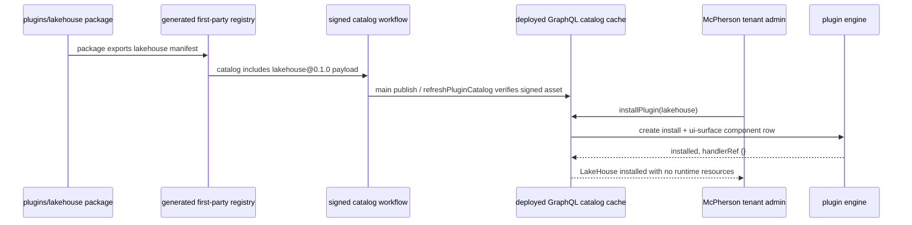

# feat: Add LakeHouse plugin shell

## Overview

Add a first-party `lakehouse` Application Plugin shell that appears in the
ThinkWork plugin catalog and can be installed for McPherson without deploying
LakeHouse infrastructure or runtime capabilities yet. The shell establishes the
stable product identity, package ownership boundary, catalog publication path,
and tenant install proof that later datalake, warehouse, MCP, skill, UI, and
operations work can extend.

This is a shell slice only. It must be visible and installable through the
normal ThinkWork plugin path, but it must not create LakeHouse AWS resources,
Terraform deployments, MCP registrations, skills, schedules, data pipelines,
storage buckets, warehouses, credentials, or user OAuth activations.

---

## Problem Frame

THNK-45 needs a catalog-visible LakeHouse plugin for McPherson before the next
status conversation. The approved requirements intentionally narrowed the work:
prove the product and install path now, leave real LakeHouse resources for
later, and avoid a McPherson-only shortcut that would split plugin identity or
hide behavior outside the first-party package boundary (see origin:
`docs/brainstorms/2026-06-18-lakehouse-plugin-shell-requirements.md`).

The current repo already has the shape needed for this: root-level
`plugins/<plugin-key>/` packages export machine-readable package descriptors,
the plugin catalog registry is generated from `plugins/*/package.json`, and
`ui-surface` components are declared-only in v1. A UI-surface-only manifest is
therefore the least-side-effect valid component shape for the shell.

---

## Requirements Trace

- R1. Use the stable plugin key `lakehouse`.
- R2. Customer-facing copy identifies the LakeHouse solution shell for the
  McPherson install proof without promising live datalake, warehouse, query,
  monitoring, or automation capabilities in this slice. Public catalog fields
  should stay tenant-neutral unless stakeholder acceptance for globally visible
  McPherson-specific wording is recorded.
- R3. Source lives under the root first-party plugin package boundary with a
  package descriptor reviewable as one unit.
- R4. LakeHouse is visible in the ThinkWork plugin catalog and installable by a
  tenant administrator through the same plugin install flow as other first-party
  plugins.
- R5. Installing the shell has no LakeHouse resource, Terraform, MCP, skill,
  schedule, pipeline, bucket, warehouse, credential, or OAuth side effects.
- R6. The shell manifest is structurally valid under the current plugin catalog
  contract.
- R7. Catalog registry generation and source-boundary checks treat LakeHouse as
  a first-party plugin package.
- R8. Repository validation proves the package manifest, generated registry,
  catalog package, and plugin source boundary are valid.
- R9. Product verification proves McPherson can see and install the shell
  through the normal ThinkWork plugin path, not by direct mutation.
- R10. Later LakeHouse infrastructure, MCP, skill, UI, and operations work
  extends the same `lakehouse` package and version line unless new requirements
  explicitly change identity.
- R11. Package documentation makes deferred resource deployment explicit.

**Origin actors:** A1 ThinkWork plugin author, A2 release/operator maintainer,
A3 McPherson tenant administrator, A4 future LakeHouse implementer.

**Origin flows:** F1 publish shell, F2 install for McPherson, F3 extend later.

**Origin acceptance examples:** AE1 catalog-valid first-party shell with no
provisioning components, AE2 McPherson install with no resource or credential
side effects, AE3 future LakeHouse work extends the same package identity.

---

## Scope Boundaries

- Do not deploy LakeHouse resources in this slice.
- Do not add Terraform modules, managed-application adapters, MCP servers,
  agent skills, rendered UI panels, data pipelines, warehouse schemas, or
  credentials.
- Do not use Docker Compose, Kubernetes, GCP, Azure, or local-only substitutes.
- Do not bypass the normal ThinkWork plugin catalog/install path for
  Verification.
- Do not add McPherson-specific branching to shared plugin platform code.
- Do not rename or fork the plugin identity later without a new requirements
  decision.

### Deferred to Follow-Up Work

- LakeHouse infrastructure modules, managed-app adapters, storage/warehouse
  resources, MCP tools, skills, rendered operator UI, monitoring, and data
  pipeline behavior.
- Premium entitlement or customer-specific gating, unless later requirements
  decide the LakeHouse product should be key-gated.
- Package-owned live smoke tooling beyond the status-meeting install proof.

---

## Context & Research

### Relevant Code and Patterns

- `plugins/README.md` defines `plugins/<plugin-key>/` as the canonical
  first-party plugin ownership boundary and describes package descriptors,
  package-local tests, signed catalog publication, and deployed install
  verification.
- `plugins/catalog/src/contracts.ts` defines the four v1 component types and
  documents `ui-surface` as declared-only in v1.
- `plugins/email-channel/src/manifest.ts` is the closest inert precedent: empty
  OAuth scopes plus a single `ui-surface` component.
- `plugins/email-channel/test/manifest.test.ts` validates a package-local
  manifest and first-party package boundary without runtime side effects.
- `plugins/catalog/scripts/generate-plugin-registry.ts` discovers
  `@thinkwork/plugin-*` packages under `plugins/*/package.json` and renders
  `plugins/catalog/src/registry/generated-first-party.ts`.
- `plugins/catalog/package.json` carries explicit workspace dependencies on
  each first-party plugin package so static registry imports can resolve.
- `plugins/catalog/src/__tests__/plugin-registry.test.ts` and
  `plugins/catalog/src/__tests__/plugin-package.test.ts` guard generated
  registry freshness and first-party package aggregation.
- `packages/api/src/lib/plugins/engine.ts` records `ui-surface` components as
  provisioned no-ops with `handler_ref` equal to `{}`; component handlers are
  the only path that creates MCP, skill, or infrastructure side effects.
- `packages/api/src/lib/plugins/engine.test.ts` already covers mixed manifests
  where a UI surface installs as a no-op, which the LakeHouse package-local
  tests should complement by proving the LakeHouse manifest declares only that
  no-op component.
- `apps/web/src/lib/settings-queries.ts` and
  `apps/web/src/components/settings/plugins/PluginDetail.tsx` already browse,
  refresh, install, and inspect plugin catalog entries generically.
- `scripts/verify-plugin-source-boundary.mjs` names first-party plugin keys for
  source-boundary enforcement and must learn `lakehouse`; its coverage lives in
  `scripts/__tests__/verify-plugin-source-boundary.test.mjs`.

### Institutional Learnings

- `docs/solutions/architecture-patterns/plugin-source-boundaries-package-owned-deploy-verified-2026-06-17.md`
  requires plugin-specific source to live under `plugins/<plugin-key>/`, shared
  registries to be generated from plugin packages, and plugin migration slices
  to prove the deployed ThinkWork install path.
- The same solution note also cautions against provider/plugin-specific source
  leaking into shared paths; LakeHouse should add only generic registry and
  source-boundary plumbing outside `plugins/lakehouse/`.
- `docs/solutions/integration-issues/lastmile-plugin-install-blocked-by-missing-context-md-2026-06-17.md`
  reinforces that application-plugin verification should use the deployed
  ThinkWork install path rather than direct catalog or database mutation.

### External References

- Not used. The repo has current local patterns for first-party plugin packages,
  inert UI-surface manifests, generated registry publication, source-boundary
  enforcement, and deployed plugin install verification.

---

## Key Technical Decisions

- **Use a UI-surface-only manifest as the inert component shape.** The manifest
  should declare one `ui-surface` component, empty `requiredOauthScopes`, and no
  capabilities. This satisfies the non-empty component contract while the
  plugin engine treats the component as a provisioned no-op.
- **Create a normal first-party package, not a catalog exception.** LakeHouse
  should live under `plugins/lakehouse/` with `package.json`, `tsconfig.json`,
  `src/manifest.ts`, `src/index.ts`, package-local tests, and `README.md`.
- **Let generated catalog plumbing discover the package.** Add
  `@thinkwork/plugin-lakehouse` as a catalog workspace dependency, refresh the
  lockfile, regenerate the first-party registry, and update expectations that
  list first-party plugin packages.
- **Teach source-boundary tooling the new key.** `lakehouse` should be scanned
  like every other first-party plugin so future LakeHouse-specific source fails
  if it leaks outside `plugins/lakehouse/` without an explicit shared exception.
  The shared catalog dependency, generated registry, registry tests,
  source-boundary scanner, and scanner tests are intentional platform plumbing;
  runtime/product-specific LakeHouse source remains package-owned.
- **Make deployed install evidence the Verification gate.** Repository checks
  are necessary but not sufficient; THNK-45 should pass Verification only after
  the signed catalog path exposes LakeHouse in the deployed McPherson
  environment and a normal tenant-admin install records an installed no-op
  component.
- **Do not add premium/key gating in this shell slice.** The requirements ask
  for a catalog-visible shell that McPherson can install quickly, and a premium
  key would not hide the catalog entry itself. Treat global catalog visibility
  as a product/security gate: prefer tenant-neutral public catalog copy, and
  require explicit stakeholder acceptance before shipping McPherson-specific
  wording in globally visible fields. If confidentiality is required, send the
  issue back to requirements rather than quietly adding a new entitlement or
  tenant-visibility behavior.

---

## Open Questions

### Resolved During Planning

- **What inert component shape should satisfy the current validator without
  side effects?** Use a single `ui-surface` component. The catalog contract says
  UI surfaces are declared-only in v1, and the plugin engine records them as
  provisioned no-ops with `{}` handler refs.
- **Which deployed-stage evidence is fastest while preserving the normal path?**
  Use the signed catalog publication path from the merge to `main`, refresh the
  deployed API catalog cache from Settings -> Plugins or GraphQL, install
  LakeHouse through the normal plugin install mutation, and inspect the
  resulting installed state and component list.
- **Should the shell require premium install keys?** No for this slice. The
  requirement is that McPherson can install the shell quickly; entitlement
  gating can be planned later if LakeHouse becomes a premium or customer-scoped
  product.
- **Is global catalog visibility acceptable for a McPherson-oriented shell?**
  The current catalog is global and the requirements forbid a McPherson-only
  hard-coded exception. Therefore the implementation should use tenant-neutral
  public catalog fields by default while preserving McPherson as the target
  verification environment. If stakeholders require McPherson-specific public
  wording, record explicit acceptance of that visibility before implementation.

### Deferred to Implementation

- Exact customer-facing description text can be refined while implementing. It
  must start from the draft copy in U1, be tenant-neutral by default, keep the
  shell boundary explicit, and avoid promising live LakeHouse capabilities.
  McPherson-specific public copy requires explicit stakeholder acceptance
  because the current catalog is global.
- Exact `intendedMount` string can follow the closest current plugin-detail
  convention, provided it remains inert and does not require a rendered
  LakeHouse panel in this slice.
- Exact deployed evidence format can use the fastest available combination of
  Settings UI, GraphQL response, database read-only inspection, and GitHub
  catalog workflow metadata, as long as it proves the normal plugin path.

---

## Output Structure

This is the intended new package shape. The generated registry file is listed
in the relevant unit rather than shown as authored package source.

```text
plugins/lakehouse/
  README.md
  package.json
  tsconfig.json
  src/
    index.ts
    manifest.ts
  test/
    manifest.test.ts
```

---

## High-Level Technical Design

> _This illustrates the intended approach and is directional guidance for
> review, not implementation specification. The implementing agent should treat
> it as context, not code to reproduce._



---

## Implementation Units

- U1. **LakeHouse Package Shell**

**Goal:** Create the first-party `plugins/lakehouse/` package with an inert,
catalog-valid manifest and documentation that makes deferred resource
deployment explicit.

**Requirements:** R1, R2, R3, R5, R6, R10, R11; supports F1, F3; covers AE1,
AE3.

**Dependencies:** None.

**Files:**

- Create: `plugins/lakehouse/package.json`
- Create: `plugins/lakehouse/tsconfig.json`
- Create: `plugins/lakehouse/src/manifest.ts`
- Create: `plugins/lakehouse/src/index.ts`
- Create: `plugins/lakehouse/README.md`

**Approach:**

- Follow the package shape in `plugins/email-channel/` and
  `plugins/lastmile/`.
- Use `pluginKey: "lakehouse"` and a customer-facing display name such as
  `LakeHouse`.
- Set manifest version `0.1.0`, `requiredOauthScopes: []`, no premium metadata,
  no capabilities, and exactly one `ui-surface` component. `package.json`
  should follow the existing private workspace package version convention unless
  repo patterns require otherwise.
- Ensure manifest copy says this is McPherson's LakeHouse solution shell and
  that live datalake, warehouse, query, monitoring, automation, MCP, skill, and
  infrastructure capabilities are deferred. In globally visible catalog fields,
  use tenant-neutral wording unless stakeholder acceptance for McPherson-specific
  copy has been recorded.
- Start from this public catalog copy, then refine only within the same
  constraints:
  - Display name: `LakeHouse`
  - Description: `LakeHouse solution shell for enterprise data platform planning. Installs the product identity now while datalake, warehouse, query, monitoring, automation, MCP, skills, and infrastructure capabilities are deferred.`
- Reject copy that claims the plugin can deploy, query, monitor, automate,
  provision, connect to, or operate LakeHouse infrastructure in this slice.
- Export a `lakehousePluginPackage` descriptor with owned sources for manifest
  and docs, and no compatibility links. U3 adds the package-local test source
  to the descriptor after creating that test.
- Keep all LakeHouse-specific source under `plugins/lakehouse/`.

**Patterns to follow:**

- `plugins/email-channel/src/manifest.ts`
- `plugins/email-channel/src/index.ts`
- `plugins/email-channel/README.md`
- `plugins/README.md`

**Test scenarios:**

- Happy path: validating the LakeHouse manifest returns plugin key
  `lakehouse`, version `0.1.0`, empty OAuth scopes, and one UI-surface
  component.
- Edge case: manifest serialization contains no placeholder URLs, credentials,
  `.invalid` endpoints, Terraform module keys, MCP endpoint fields, or skill
  source.
- Integration: defining the first-party package validates source root
  `plugins/lakehouse`, manifest key `lakehouse`, owned source paths under the
  package root, and no compatibility links.

**Verification:**

- A reviewer can open `plugins/lakehouse/` and understand that the package is a
  deliberate shell, not an unfinished runtime.
- The manifest is valid under the shared catalog contract and cannot provision
  runtime resources because it declares no handler-backed component type.

- U2. **Catalog Registry and Boundary Plumbing**

**Goal:** Make the LakeHouse package discoverable as a first-party catalog
entry and enforce its package boundary.

**Requirements:** R3, R4, R6, R7, R8; supports F1; covers AE1.

**Dependencies:** U1.

**Files:**

- Modify: `plugins/catalog/package.json`
- Modify: `pnpm-lock.yaml`
- Modify: `plugins/catalog/src/registry/generated-first-party.ts`
- Modify: `plugins/catalog/src/__tests__/plugin-registry.test.ts`
- Modify: `plugins/catalog/src/__tests__/plugin-package.test.ts`
- Modify: `scripts/verify-plugin-source-boundary.mjs`
- Modify: `scripts/__tests__/verify-plugin-source-boundary.test.mjs`

**Approach:**

- Regenerate the first-party registry from `plugins/*/package.json` so
  `@thinkwork/plugin-lakehouse` is imported and exported mechanically.
- Add `@thinkwork/plugin-lakehouse` to the catalog package workspace
  dependencies so the generated static import resolves in tests, build, and
  catalog packaging.
- Run `pnpm install` after adding the workspace package so `pnpm-lock.yaml`
  satisfies frozen-lockfile CI.
- Update deterministic registry/package tests to include `lakehouse` in sorted
  first-party plugin lists.
- Add `lakehouse` to source-boundary scanning with owning root
  `plugins/lakehouse/`, and extend source-boundary tests so both in-package and
  out-of-package LakeHouse terms are covered.
- Avoid hand-maintained catalog exceptions or McPherson-specific shared code.
- Keep the only LakeHouse references outside `plugins/lakehouse/` to the
  explicit shared plumbing in this unit: catalog package dependency, generated
  registry, registry/package tests, source-boundary scanner, and scanner tests.

**Patterns to follow:**

- `plugins/catalog/scripts/generate-plugin-registry.ts`
- `plugins/catalog/package.json`
- `plugins/catalog/src/__tests__/plugin-registry.test.ts`
- `plugins/catalog/src/__tests__/plugin-package.test.ts`
- `scripts/verify-plugin-source-boundary.mjs`
- `scripts/__tests__/verify-plugin-source-boundary.test.mjs`

**Test scenarios:**

- Happy path: registry discovery includes `lakehouse`,
  `@thinkwork/plugin-lakehouse`, and `lakehousePluginPackage` in deterministic
  sorted order.
- Happy path: `allPluginManifests` includes `lakehouse` alongside existing
  first-party plugins.
- Edge case: source-boundary verification treats file paths containing
  `lakehouse` outside the allowed shared plumbing and `plugins/lakehouse/` as
  violations unless they are documented shared exceptions. This follows the
  current path-based scanner; content-based scanning is not part of this shell
  slice.
- Edge case: source-boundary verification accepts LakeHouse-specific source
  inside `plugins/lakehouse/`.
- Integration: the checked-in generated registry matches the registry renderer
  output after adding the package.

**Verification:**

- The generated registry and catalog package tests prove LakeHouse is published
  through the same aggregate path as other first-party plugins.
- Source-boundary verification protects future LakeHouse work from leaking into
  shared platform code.

- U3. **Package and Catalog Validation Coverage**

**Goal:** Add focused tests that prove LakeHouse is a valid shell and cannot
accidentally grow side-effecting components in this slice.

**Requirements:** R5, R6, R8, R11; supports F1, F3; covers AE1, AE3.

**Dependencies:** U1, U2.

**Files:**

- Create: `plugins/lakehouse/test/manifest.test.ts`
- Modify: `plugins/lakehouse/package.json`
- Modify: `plugins/lakehouse/src/index.ts`

**Approach:**

- Add package-local tests mirroring the style of
  `plugins/email-channel/test/manifest.test.ts`.
- Use repository package conventions: keep `plugins/lakehouse/package.json`
  version at `0.0.0`; put the catalog plugin version in
  `lakehouseManifest.versions[0].version` as `0.1.0`.
- Assert the manifest has exactly one component and that the component type is
  `ui-surface`.
- Assert no component type is `infrastructure`, `mcp-server`, or `skills`, and
  no required OAuth scopes are declared.
- Assert README/package documentation contains an explicit deferred-resource
  note so future implementers do not treat the missing runtime as accidental.
- Add `plugins/lakehouse/test/manifest.test.ts` to
  `lakehousePluginPackage.ownedSources`.
- Wire the package `test` and `typecheck` scripts consistently with existing
  plugin packages.

**Patterns to follow:**

- `plugins/email-channel/test/manifest.test.ts`
- `plugins/sendgrid/test/manifest.test.ts`
- `plugins/company-brain/test/manifest.test.ts`

**Test scenarios:**

- Happy path: `validatePluginManifest(lakehouseManifest)` accepts the manifest.
- Happy path: `defineFirstPartyPluginPackage(lakehousePluginPackage)` accepts
  the package descriptor and owned source list.
- Edge case: the test fails if a future edit adds an infrastructure, MCP, or
  skills component before the requirements and verification plan are updated.
- Edge case: the test fails if required OAuth scopes or credential-like values
  appear in the shell manifest.
- Integration: catalog package tests and package-local tests together prove the
  manifest is valid both standalone and through the first-party registry.

**Verification:**

- Package-local and catalog-level tests give a reviewer confidence that the
  shell is intentionally inert and registry-visible.

- U4. **Deployed McPherson Install Evidence**

**Goal:** Prove the merged shell is visible and installable through the deployed
ThinkWork plugin path for McPherson, and record Verification-ready evidence in
Linear.

**Requirements:** R4, R5, R9; supports F2; covers AE2.

**Dependencies:** U1, U2, U3 merged to `main` and the Plugin Catalog workflow
published or republished the signed catalog asset.

**Files:**

- Test expectation: none -- this is a deployed verification and evidence unit,
  not an authored source change. Do not add committed smoke tooling in this
  shell slice; record one-off deployed verification evidence in Linear. If
  repeatable LakeHouse smoke tooling becomes necessary, plan it as follow-up
  package-owned work under `plugins/lakehouse/`.

**Approach:**

- Confirm the `Plugin Catalog` workflow for `main` produced a signed catalog
  artifact whose source commit is the LakeHouse merge commit.
- In the deployed McPherson-capable ThinkWork environment, refresh the plugin
  catalog through Settings -> Plugins or the matching GraphQL mutation.
- Confirm `pluginCatalog` includes `lakehouse`, version `0.1.0`, empty
  `requiredOauthScopes`, and a single `ui-surface` component.
- Install LakeHouse through the normal tenant-admin plugin install flow.
- Record the authenticated subject, role, tenant id/slug, and installed row
  tenant id so the evidence proves a McPherson tenant administrator performed a
  McPherson-scoped install.
- Confirm the installed record is `installed`, pinned to `lakehouse@0.1.0`,
  with one provisioned `ui-surface` component and `handler_ref` equal to `{}`.
- Capture a pre/post no-side-effect inventory from authoritative sources:
  plugin install/component rows, `managed_applications`, deployment jobs,
  `tenant_mcp_servers`, tenant skill-catalog/workspace prefixes, user plugin
  activations, activation tokens, credential/secret references, schedules,
  pipelines, relevant S3 prefixes, warehouse/database resources, and Terraform
  plan/state evidence. Only the LakeHouse plugin install and its UI-surface
  component should change.
- Record the no-side-effect inventory as a before/after table with the source
  checked, the pre-install count or identifier set, the post-install count or
  identifier set, and the expected delta. The only allowed positive delta is
  one LakeHouse plugin install row plus its UI-surface component row.
- Use count-only or id-only evidence for token, credential, and secret stores.
  Do not paste raw tokens, credentials, connection strings, SSM paths carrying
  secrets, or secret material into Linear.
- Record explicit product/requester acceptance in Linear that a globally visible
  McPherson-oriented shell with no runtime LakeHouse capability is acceptable
  for this slice. If that acceptance is not available, keep the issue in review
  rather than quietly adding tenant-targeting or entitlement behavior.
- Uninstall and reinstall the shell through the same UI/GraphQL path before
  passing Verification, proving teardown removes only LakeHouse plugin engine
  rows and remains side-effect-free.
- Prepare a status packet for the customer/status meeting: catalog entry
  screenshot or copied entry, installed-state proof, redacted no-side-effect
  inventory, source commit/catalog digest, and a customer-safe caveat that live
  LakeHouse infrastructure, query, monitoring, automation, MCP, and skills are
  intentionally deferred.
- Record the evidence in THNK-45 before moving the issue to Verification or
  marking Verification passed during implementation/verification work.

**Minimum no-side-effect evidence matrix:**

| Side-effect class                                    | Evidence source                                                                                                                                                                                                   |
| ---------------------------------------------------- | ----------------------------------------------------------------------------------------------------------------------------------------------------------------------------------------------------------------- |
| Managed applications and deployment jobs             | Read-only deployed GraphQL/admin view or database records for managed applications and deployment jobs filtered by tenant and `lakehouse`/LakeHouse identifiers before and after install.                         |
| MCP registrations                                    | Tenant MCP server listing or backing table filtered by tenant and LakeHouse identifiers before and after install.                                                                                                 |
| Skill materialization                                | Tenant skill catalog/workspace listing or S3 prefixes for the tenant before and after install; no `lakehouse` skill catalog prefix or workspace folder should appear.                                             |
| OAuth activations, tokens, and credentials           | User activation, OAuth token, credential, and secret-reference records filtered by tenant/plugin identifiers before and after install; no new LakeHouse entries should appear.                                    |
| Schedules and pipelines                              | Scheduled jobs and pipeline records filtered by tenant and LakeHouse identifiers before and after install.                                                                                                        |
| Buckets, warehouses, and Terraform-managed resources | Existing deployment evidence, Terraform state or plan inspection, and AWS read-only inventory for LakeHouse-named storage/warehouse resources before and after install; no new LakeHouse resources should appear. |

**Patterns to follow:**

- `plugins/README.md` release and verification checklist.
- `docs/solutions/architecture-patterns/plugin-source-boundaries-package-owned-deploy-verified-2026-06-17.md`
- Existing Settings -> Plugins GraphQL queries in
  `apps/web/src/lib/settings-queries.ts`.

**Test scenarios:**

- Integration: after catalog refresh, Settings -> Plugins shows LakeHouse as a
  catalog entry and does not require an install key or OAuth connection.
- Integration: installing LakeHouse creates the plugin install and component
  rows through `installPlugin`, not through direct database or catalog mutation.
- Integration: install evidence records the authenticated caller as a McPherson
  tenant administrator and the installed row as scoped to the McPherson tenant.
- Integration: uninstalling the shell deletes only the LakeHouse install and
  component state and does not require infrastructure destructive confirmation.
- Error path: if the catalog refresh is stale or missing the LakeHouse commit,
  stop and record the publish/cache blocker instead of manually inserting the
  catalog entry.
- Error path: if the signed catalog workflow needs a fallback, the only allowed
  fallback is re-running or manually dispatching the signed catalog workflow
  and verifying the resulting source commit and digest. Direct DB mutation,
  local catalog injection, unsigned asset substitution, or browser/API cache
  tampering is not valid evidence.
- Error path: if install creates any handler-backed resource, stop before
  closing Verification and treat it as a regression against R5.

**Verification:**

- THNK-45 has Linear evidence linking the plan, implementation PR, catalog
  source commit, deployed catalog metadata, installed plugin state, no-side-
  effect checks, and readiness notes for future LakeHouse expansion.

---

## System-Wide Impact

- **Interaction graph:** Authored plugin source flows through generated
  registry, signed catalog publication, deployed API catalog refresh, Settings
  -> Plugins, and the plugin engine install path.
- **Error propagation:** Catalog-generation failures should fail repo checks;
  signed catalog publish/refresh failures should be recorded as deployment
  blockers; install failures should remain structured plugin-engine errors.
- **State lifecycle risks:** The only expected persistent runtime state is the
  plugin install row plus one no-op UI-surface component row. Any deployment
  job, MCP server, skill materialization, activation, token, credential, or
  managed application is outside the intended lifecycle.
- **API surface parity:** Existing plugin GraphQL queries and mutations should
  handle LakeHouse generically; no new LakeHouse-specific API or UI branch is
  planned.
- **Integration coverage:** Repository tests prove catalog/package validity;
  deployed validation proves signed catalog freshness and tenant install
  behavior.
- **Unchanged invariants:** Plugin install, activation, upgrade, uninstall,
  premium entitlement, and managed-application handlers remain generic and
  unchanged. This plan adds a package that consumes those contracts.

---

## Verification Strategy

- **Package validation:** LakeHouse package tests prove manifest validity,
  package descriptor validity, shell copy boundaries, and absence of
  side-effecting components.
- **Catalog validation:** Catalog registry tests prove generated discovery,
  aggregate manifest publication, deterministic ordering, and checked-in
  registry freshness.
- **Boundary validation:** Source-boundary verification proves LakeHouse-specific
  source is confined to `plugins/lakehouse/` unless explicitly shared.
- **Repository validation:** Standard PR checks should pass for formatting,
  linting, typechecking, and tests affected by `plugins/**`.
- **Deployed validation:** After merge, the signed catalog artifact and deployed
  McPherson install path prove user-facing readiness. This is the gate for
  passing THNK-45 Verification later.

### Explicit End-to-End Validation Criteria for Verification

THNK-45 is ready to pass Verification only when all of these are true:

- The implementation PR is merged to `main`, and the merge commit is recorded.
- The Plugin Catalog workflow published or republished
  `thinkwork-plugin-catalog-main.json` from that merge commit.
- The deployed API catalog metadata reports the expected repository, ref,
  source commit SHA, catalog digest, and non-stale refresh status, or a
  signed workflow rerun/manual dispatch with the expected source commit and
  digest.
- McPherson's Settings -> Plugins catalog shows `LakeHouse` / `lakehouse`
  version `0.1.0` with exactly one UI-surface component and no OAuth scopes.
- A tenant administrator installs LakeHouse through the normal plugin install
  flow.
- Evidence records the authenticated subject, role, tenant id/slug, and
  installed row tenant id, proving the action was McPherson-scoped and
  tenant-admin authorized.
- The installed state is `installed`, pinned to the expected payload digest,
  with exactly one provisioned `ui-surface` component and `handler_ref` equal
  to `{}`.
- No LakeHouse managed application, deployment job, tenant MCP server, skill
  catalog folder, user activation, OAuth token, credential, schedule, pipeline,
  bucket, warehouse, or Terraform-managed resource is created by the install.
- The no-side-effect claim is backed by pre/post inventory evidence from the
  relevant DB rows, S3 prefixes, deployment-job/managed-app surfaces, and
  Terraform plan/state. Token, credential, and secret evidence is count-only or
  id-only and redacted.
- Uninstall/reinstall removes and recreates only LakeHouse plugin engine state
  and leaves the same no-side-effect inventory unchanged.
- A status packet exists for the meeting with the catalog entry, installed-state
  proof, redacted no-side-effect inventory, source commit/catalog digest, and
  customer-safe caveat about deferred live capabilities.
- Linear or an equivalent written project record shows requester/product-owner
  acceptance that this slice exposes a shell-only LakeHouse catalog entry and
  intentionally does not provide runtime LakeHouse capability yet.
- Linear THNK-45 contains links or copied evidence for the plan, implementation
  PR, merged commit, catalog metadata, installed state, no-side-effect checks,
  and any residual readiness notes.

---

## Risks & Dependencies

| Risk                                                                                                     | Mitigation                                                                                                                                                                                                                                                   |
| -------------------------------------------------------------------------------------------------------- | ------------------------------------------------------------------------------------------------------------------------------------------------------------------------------------------------------------------------------------------------------------ |
| The current catalog contract requires at least one component, tempting a handler-backed placeholder.     | Use `ui-surface`, which is explicitly declared-only in v1 and already handled as a plugin-engine no-op.                                                                                                                                                      |
| Customer-facing shell copy could imply LakeHouse capabilities that do not exist yet.                     | Add package-local tests/review checks around manifest copy and README language; keep runtime capabilities explicitly deferred.                                                                                                                               |
| The generated registry could be stale or hand-edited.                                                    | Regenerate from package metadata and keep the existing registry freshness test as the source of truth.                                                                                                                                                       |
| Source-boundary tooling might not protect a newly introduced plugin key.                                 | Add `lakehouse` to the boundary scanner in the same implementation slice.                                                                                                                                                                                    |
| McPherson-oriented catalog copy may be visible to other tenants because the catalog is currently global. | Use tenant-neutral public catalog copy by default. If stakeholders require McPherson-specific public wording, record explicit visibility acceptance before implementation; if confidentiality is required, pause and resolve tenant visibility requirements. |
| Verification evidence could leak secret material while proving no credentials or tokens were created.    | Use count-only or id-only evidence for token, credential, and secret stores; redact sensitive values and never paste raw secrets into Linear.                                                                                                                |
| The signed catalog asset may not publish quickly enough for the status meeting.                          | Record workflow/publish state immediately after merge; use the existing operator refresh path or manual workflow dispatch if the source change is merged but catalog publication is delayed.                                                                 |
| A deployed install could be blocked by stale API cache or stage configuration.                           | Treat stale cache as a Verification blocker, not a reason to bypass the plugin path; use `refreshPluginCatalog` and record exact catalog metadata.                                                                                                           |

---

## Documentation / Operational Notes

- `plugins/lakehouse/README.md` should be the package-local handoff for future
  LakeHouse implementers and should state that infrastructure/resource work is
  intentionally deferred.
- Rollout depends on the existing Plugin Catalog workflow after merge to
  `main`; docs-only changes under `plugins/lakehouse/` will not republish the
  catalog, but manifest/package changes should.
- Operators should refresh the deployed catalog cache through ThinkWork before
  concluding the plugin is missing.
- Because the current catalog is global, public LakeHouse catalog copy should
  stay tenant-neutral by default. Any McPherson-specific public wording needs
  explicit stakeholder acceptance before implementation, or a new requirements
  pass for tenant-targeted visibility.
- If future work adds real LakeHouse resources, it should bump the existing
  `lakehouse` manifest version and add handler-backed components in the same
  package rather than creating a second plugin identity.

---

## Sources & References

- **Origin document:** `docs/brainstorms/2026-06-18-lakehouse-plugin-shell-requirements.md`
- **Linear issue:** THNK-45
- **Requirements PR:** #2635, merged 2026-06-18 at merge commit
  `00d77ba42d09f859f2f38ce8c407fe0004fdfc61`
- `plugins/README.md`
- `plugins/catalog/src/contracts.ts`
- `plugins/catalog/src/plugin-package.ts`
- `plugins/catalog/scripts/generate-plugin-registry.ts`
- `plugins/catalog/package.json`
- `plugins/catalog/src/registry/generated-first-party.ts`
- `plugins/catalog/src/__tests__/plugin-registry.test.ts`
- `plugins/catalog/src/__tests__/plugin-package.test.ts`
- `plugins/email-channel/src/manifest.ts`
- `plugins/email-channel/test/manifest.test.ts`
- `packages/api/src/lib/plugins/engine.ts`
- `packages/api/src/lib/plugins/engine.test.ts`
- `apps/web/src/lib/settings-queries.ts`
- `scripts/verify-plugin-source-boundary.mjs`
- `scripts/__tests__/verify-plugin-source-boundary.test.mjs`
- `docs/solutions/architecture-patterns/plugin-source-boundaries-package-owned-deploy-verified-2026-06-17.md`
- `docs/solutions/integration-issues/lastmile-plugin-install-blocked-by-missing-context-md-2026-06-17.md`
