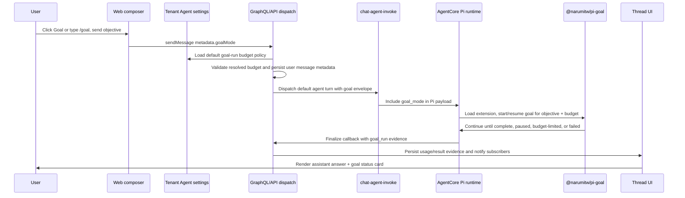
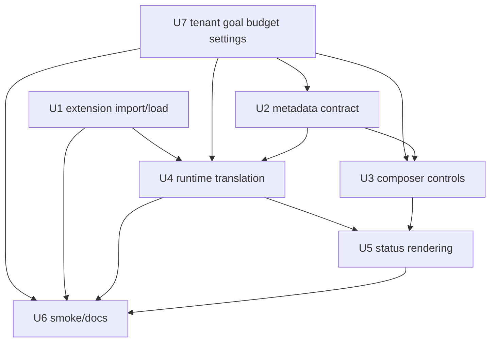

# feat: Pi goal composer mode

## Overview

Add composer-launched Goal mode for Pi agent turns by importing and leveraging `@narumitw/pi-goal`, then wrapping it in Thinkwork's composer, dispatch, runtime, settings, and conversation-rendering contracts. A user can start a goal-run with a dead-simple composer affordance such as a Goal icon or `/goal ...` shorthand; Thinkwork resolves the actual token/cost guardrail from tenant Agent configuration before Pi starts work.

This plan intentionally keeps the existing Thread Detail `ThreadGoal` workflow separate. THNK-21 is a per-turn runtime mode, not the durable workflow goal/review system (see origin: `docs/brainstorms/2026-06-18-thnk-21-pi-goal-composer-requirements.md`).

---

## Problem Frame

Today, a normal composer message can wake the default Pi agent, but the user has no first-class way to say "keep working on this objective until it is actually done, within our workspace budget policy." The linked Pi extension already implements the core goal loop, including `/goal`, `goal_complete`, session-scoped state, token budgets, continuation guards, and budget-limited states. Thinkwork needs to expose that capability as an ergonomic web composer mode and make its state visible in the thread without making the user configure budgets in the prompt or creating a second product meaning for "goal."

---

## Requirements Trace

- R1. Composer surfaces Goal mode for the next agent turn only.
- R2. Goal mode resolves its default token/cost budget from tenant Settings -> Agent configuration; normal users do not configure a budget while composing the prompt.
- R3. Admin/operator users can configure the tenant goal-run budget policy in Settings, with a safe built-in fallback for tenants that have not customized it yet.
- R4. The submitted message carries a goal-mode envelope for runtime and UI distinction.
- R5. The main web experience supports a one-step Goal icon/toggle and may also accept `/goal ...` as shorthand; neither path exposes budget fields in the composer.
- R6. Import, pin, and load `@narumitw/pi-goal`; do not rewrite the goal loop.
- R7. Runtime receives objective and server-resolved budget values in the shape `pi-goal` needs.
- R8. Goal mode applies only to the submitted objective and continuations.
- R9. Edits, pause, and budget changes during an in-flight turn apply before the next continuation.
- R10. Goal-run stops on completion, budget exhaustion, cancellation, or runtime failure.
- R11-R15. Conversation renders completion and budget-paused status, including summary, usage, verification evidence, and resume affordance.
- R16-R18. Existing `ThreadGoal` records, review workflow, files, and Thread Detail behavior are not used or changed for v1.

**Origin actors:** A1 end user, A2 Pi agent, A3 Thinkwork runtime, A4 Thinkwork web client.

**Origin flows:** F1 start a goal-run from composer, F2 complete a goal-run, F3 pause after budget exhaustion and resume with more budget.

**Origin acceptance examples:** AE1 composer goal/send, AE2 imported extension receives objective/budget, AE3 completion card, AE4 budget-reached resume, AE5 no `ThreadGoal` mutation.

---

## Scope Boundaries

- Do not build Thread Detail controls for this feature in v1.
- Do not create, update, or require `ThreadGoal` records.
- Do not route goal completion through `reviewGoal`, `CONFIRM_COMPLETION`, or `REQUEST_CHANGES`.
- Do not require users to configure token/cost budgets in the composer or prompt.
- Do not require slash-command syntax in the main composer UX, though `/goal ...` shorthand may be supported for power users.
- Do not build tenant-wide active-goal dashboards/admin controls.
- Do not create a new goal-run persistence table in v1 unless implementation proves the imported extension cannot safely resume from Thinkwork's existing Pi session store.

### Deferred to Follow-Up Work

- Multi-thread or admin goal dashboards: follow-up issue after per-turn goal-run evidence is stable.
- Human review policy for autonomous goal completion: separate product design because it overlaps with existing Thread Goal review semantics.
- Rich goal editing while an agent turn is actively executing: v1 applies changes before the next continuation, matching the origin decision.

---

## Context & Research

### Relevant Code and Patterns

- `apps/web/src/components/workbench/SpacesComposer.tsx` and `apps/web/src/components/workbench/TaskThreadView.tsx` own the empty-thread and follow-up composer controls.
- `apps/web/src/components/workbench/SpacesWorkbench.tsx` and `apps/web/src/components/workbench/SpacesThreadDetailRoute.tsx` build `sendMessage` metadata for attachments, pinned skills, and model selection.
- `packages/database-pg/src/schema/core.ts`, `packages/database-pg/graphql/types/core.graphql`, `packages/api/src/graphql/resolvers/core/updateTenantSettings.mutation.ts`, and `apps/web/src/components/settings/SettingsAgents.tsx` already form the tenant Settings path that should own the goal-run budget policy.
- `packages/database-pg/graphql/types/messages.graphql` already exposes `SendMessageInput.metadata: AWSJSON`; use this for goal-mode metadata instead of adding a parallel mutation for follow-up sends.
- `packages/api/src/graphql/resolvers/messages/sendMessage.mutation.ts`, `packages/api/src/lib/mentions/default-agent-routing.ts`, and `packages/api/src/graphql/utils.ts` form the direct default-agent dispatch path.
- `packages/api/src/handlers/chat-agent-invoke.ts` builds the AgentCore Pi invocation payload.
- `packages/agentcore-pi/agent-container/src/server.ts` loads Pi extension factories through `buildInvocationResources` and forwards `extensionToolNames` into `runAgentLoop`.
- `packages/pi-runtime-core/src/agent-loop.ts` uses `DefaultResourceLoader.extensionFactories` and `buildToolAllowlist`; extension-registered tools must be listed or the SDK gates them out.
- `packages/pi-runtime-core/src/finalize-client.ts` and `packages/api/src/lib/chat-finalize/process-finalize.ts` carry runtime results into `thread_turns.usage_json`, `thread_turns.result_json`, assistant messages, and thread updates.
- `apps/web/src/components/workbench/TaskThreadView.tsx` already renders `TaskThreadTurn` activity from `usageJson` / `resultJson`.
- `apps/web/src/components/workbench/render-typed-part.tsx` can render `data-*` parts and is the right extension point if goal status becomes a typed assistant-message part.

### Institutional Learnings

- `docs/solutions/spikes/2026-05-29-pi-extension-loading-agentcore-spike.md` says programmatic `extensionFactories` are the right cloud mechanism for bundled Pi extensions, and extension tool names must be folded into the allowlist.
- `docs/solutions/agent-profile-pi-goal-compatibility-2026-06-08.md` warns against direct adoption of an older `@ramarivera/pi-goal` in the closed-loop Agent Profile path because hidden continuation and non-tenant storage could bypass Thinkwork controls. This plan applies that warning to THNK-21 as an integration risk: use `@narumitw/pi-goal`, but verify continuation, storage, logging, and budget behavior before enabling it.
- `docs/runbooks/pi-runtime-capability-smoke.md` says Pi capability smokes must verify persisted `thread_turns.usage_json` evidence, not model-written prose.

### External References

- `@narumitw/pi-goal` package page: version `0.4.2`, published June 13, 2026, MIT, Pi extension manifest `./src/goal.ts`, `goal_complete` tool, `/goal --tokens`, states `active`, `paused`, `budget_limited`, `complete`, session-scoped state, and guarded auto-continuation.
- `narumiruna/pi-extensions` repository: describes `@narumitw/pi-goal` as the extension for goal-driven task completion.

---

## Key Technical Decisions

- **Use `messages.metadata.goalMode` as the v1 goal envelope:** `SendMessageInput.metadata` already reaches both persistence and the default-agent dispatch path. Reusing it avoids a GraphQL schema migration for follow-up messages while preserving a clear contract.
- **Resolve budget server-side from tenant Agent configuration:** Composer metadata should communicate intent (`enabled`, `action`, objective, optional goal id), not ask the end user to pick token/cost limits. The API loads the tenant default goal-run budget from Settings -> Agent configuration, validates it, and forwards a resolved runtime budget to AgentCore.
- **Keep runtime state in the Pi session store:** `@narumitw/pi-goal` is session-scoped, and Thinkwork already resumes Pi sessions through S3 when workspace bucket and tenant slug are available. V1 stores UI evidence on the turn, not a new goal-run table.
- **Add a thin Thinkwork adapter around the imported extension:** The adapter should import/pin the upstream package, register its factory, declare `goal_complete` for the allowlist, and translate composer goal envelopes into extension-visible commands or state without making users type slash commands.
- **Gate the import on source review:** Because Pi packages execute code inside the agent runtime and can influence continuation behavior, implementation must inspect the pinned package source before enabling it in production. Treat unexpected network calls, filesystem writes outside the session/workspace contract, unsanitized logs, or non-tenant-scoped persistence as blockers.
- **Thinkwork owns continuation eligibility at cloud boundaries:** If `pi-goal` attempts hidden follow-ups, the adapter must ensure they route through existing turn/finalize/budget controls and do not bypass `thread_turns`, cost recording, tenant scoping, or user pause/budget edits.
- **Render goal-run evidence in the conversation, not Thread Detail:** Completion and budget-paused status belongs next to the assistant result and turn activity. Existing `ThreadInfoGoal` stays about durable workflow goals.
- **Budget changes apply before the next continuation:** This preserves the origin decision and avoids trying to interrupt an already executing AgentCore turn.

---

## Open Questions

### Resolved During Planning

- **Where should v1 start Goal mode?** Composer, not Thread Detail. This was explicitly corrected by the user and carried from the origin document.
- **Where should the default goal budget live?** Tenant Settings -> Agent configuration, not the composer. The composer should stay a one-step Goal intent surface.
- **Should Thinkwork build goal mode from scratch?** No. Import and leverage `@narumitw/pi-goal`, with only the Thinkwork-specific integration layer.
- **Does v1 need a new database table?** No by default. Message metadata plus Pi session state plus `thread_turns` evidence cover the v1 behavior if the package behaves as documented.
- **How should the user see completion?** Assistant answer plus compact conversation card/turn evidence, not Thread Goal review.

### Deferred to Implementation

- **Exact upstream export shape:** Confirm whether `@narumitw/pi-goal` exposes a direct ESM extension factory or only the Pi package manifest entry. The plan's adapter unit owns that proof.
- **Exact resume command translation:** Implementation should prove whether resume/add-budget is best expressed as `/goal resume`, `/goal --tokens <new budget>`, `/goal edit`, or a direct extension API call.
- **Exact UI part shape:** Use either `thread_turns.result_json.goal_run` / `usage_json.goal_run` or a `data-goal-run` typed message part, whichever best fits existing renderer constraints during implementation.

---

## High-Level Technical Design

> _This illustrates the intended approach and is directional guidance for review, not implementation specification. The implementing agent should treat it as context, not code to reproduce._



---

## Implementation Units

- U1. **Pin and load the upstream Pi goal extension**

**Goal:** Import `@narumitw/pi-goal` as the runtime goal extension and prove it registers in the AgentCore Pi extension-loading path with `goal_complete` available to the model.

**Requirements:** R6, R7, R10, AE2

**Dependencies:** None

**Files:**

- Modify: `packages/agentcore-pi/package.json`
- Modify: `pnpm-lock.yaml`
- Modify: `packages/agentcore-pi/agent-container/src/server.ts`
- Modify or create: `packages/agentcore-pi/agent-container/src/runtime/pi-goal-adapter.ts`
- Test: `packages/agentcore-pi/agent-container/tests/server.test.ts`
- Test: `packages/pi-runtime-core/test/agent-loop.test.ts`

**Approach:**

- Add `@narumitw/pi-goal` as a pinned dependency where the AgentCore Pi container can bundle it.
- Record a source-review finding for the pinned version before enabling the adapter. Confirm no unexpected network clients, no secret/log leakage, no global goal-state file writes, and no continuation path that bypasses Thinkwork's turn pipeline.
- Create a small adapter that imports the upstream extension factory, exposes a stable Thinkwork wrapper, and declares `goal_complete` for `extensionToolNames`.
- Wire the adapter into `buildInvocationResources` only when the payload carries a validated `goal_mode` envelope or resume/cancel action.
- Preserve the existing `DefaultResourceLoader.extensionFactories` mechanism. Avoid filesystem Pi package discovery in the cloud runtime.
- Review upstream source behavior during implementation before enabling it: session state location, continuation scheduling, logging, and tool names.

**Execution note:** Start with a failing runtime assembly test that proves the extension factory and `goal_complete` allowlist entry are present when `goal_mode` is supplied.

**Patterns to follow:**

- `createMemoryExtension` wiring in `packages/agentcore-pi/agent-container/src/server.ts`
- `packages/pi-extensions/src/define-extension.ts`
- `buildToolAllowlist` tests in `packages/pi-runtime-core/test/agent-loop.test.ts`

**Test scenarios:**

- Happy path: payload with `goal_mode.enabled: true` adds the upstream extension factory and includes `goal_complete` in `extensionToolNames`.
- Security gate: pinned upstream source review is captured in a test fixture, solution note, or implementation checklist before production enablement.
- Edge case: normal payload without goal metadata does not load the goal extension or expose goal tools.
- Error path: upstream extension import/register failure is surfaced through the existing extension-load failure logging path instead of silently disabling Goal mode.
- Integration: `runAgentLoop` receives the extension factory and allowlist entry together so Pi's SDK does not gate out `goal_complete`.

**Verification:**

- AgentCore Pi package installs and builds with the pinned dependency.
- Runtime assembly tests prove the extension is present only for goal-mode turns and that `goal_complete` is reachable.

---

- U7. **Add tenant Agent goal budget settings**

**Goal:** Give admins a single tenant-level place to configure the default budget policy used by composer-launched goal-runs.

**Requirements:** R2, R3, R7, AE1, AE2, AE4

**Dependencies:** None

**Files:**

- Modify: `packages/database-pg/src/schema/core.ts`
- Modify: `packages/database-pg/graphql/types/core.graphql`
- Create: `packages/database-pg/drizzle/<next>_tenant_goal_budget_settings.sql`
- Modify: `packages/api/src/graphql/resolvers/core/updateTenantSettings.mutation.ts`
- Modify: `apps/web/src/components/settings/SettingsAgents.tsx`
- Modify as needed: `apps/web/src/lib/settings-queries.ts`
- Test: `packages/api/src/graphql/resolvers/core/updateTenantSettings.mutation.test.ts`
- Test: `apps/web/src/components/settings/SettingsAgents.test.tsx`

**Approach:**

- Add tenant settings fields for goal-run defaults, at minimum a positive token budget. Include a cost-budget field only if the existing cost-event pipeline can enforce it deterministically at runtime; otherwise document cost as display/telemetry and enforce tokens in v1.
- Surface the setting under Settings -> Agents / Agent configuration, near existing execution controls, so admins set the workspace policy once.
- Seed a conservative built-in default for tenants without a saved setting. The runtime should fail closed only if neither the setting nor fallback can be resolved.
- Keep this setting tenant-scoped rather than user-scoped or prompt-scoped. Per-user overrides and per-goal advanced controls are follow-up product decisions.
- Preserve existing `tenant_settings` update authorization through `update_tenant_settings`.

**Patterns to follow:**

- Existing `tenant_settings` fields in `packages/database-pg/src/schema/core.ts` and `packages/database-pg/graphql/types/core.graphql`
- Settings feature updates in `apps/web/src/lib/settings-queries.ts`
- Execution controls layout in `apps/web/src/components/settings/SettingsAgents.tsx`

**Test scenarios:**

- Happy path: an admin saves a positive default goal token budget and reloads Settings; the saved value is rendered.
- Edge case: an empty saved value uses the built-in fallback without blocking simple composer Goal mode.
- Error path: negative, zero, non-integer, or above-policy values are rejected by the API with a clear validation error.
- Authorization: non-admin tenant members cannot update the tenant goal budget setting.
- Integration: a goal-mode send with no composer budget can resolve the tenant default budget for dispatch.

**Verification:**

- Tenant settings GraphQL exposes the default goal budget fields, and Settings -> Agent configuration can save/read them.
- The budget source of truth is tenant configuration, not composer-local state.

---

- U2. **Define and validate the composer goal metadata contract**

**Goal:** Carry Goal mode intent from composer to dispatch using a bounded, validated metadata envelope on the user message, then resolve the runtime budget from tenant Agent configuration.

**Requirements:** R1, R2, R3, R4, R5, R8, R9, AE1

**Dependencies:** U7 for tenant budget fields; U1 for final runtime field names, but intent validation can start independently.

**Files:**

- Modify: `apps/web/src/components/workbench/SpacesComposer.tsx`
- Modify: `apps/web/src/components/workbench/TaskThreadView.tsx`
- Modify: `apps/web/src/components/workbench/SpacesWorkbench.tsx`
- Modify: `apps/web/src/components/workbench/SpacesThreadDetailRoute.tsx`
- Modify or create: `apps/web/src/components/workbench/goal-mode.ts`
- Modify: `packages/api/src/graphql/resolvers/messages/sendMessage.mutation.ts`
- Modify: `packages/api/src/lib/mentions/default-agent-routing.ts`
- Modify: `packages/api/src/graphql/utils.ts`
- Test: `apps/web/src/components/workbench/SpacesComposer.test.tsx`
- Test: `apps/web/src/components/workbench/TaskThreadView.test.tsx`
- Test: `apps/web/src/components/workbench/SpacesWorkbench.test.tsx`
- Test: `apps/web/src/components/workbench/SpacesThreadDetailRoute.test.tsx`
- Test: `packages/api/src/graphql/resolvers/messages/sendMessage.mutation.test.ts`
- Test: `packages/api/src/lib/mentions/default-agent-routing.test.ts`

**Approach:**

- Define a stable composer metadata shape such as `metadata.goalMode = { enabled, action, objective, goalRunId? }`. Do not put the normal default token budget in composer metadata.
- Keep the objective equal to the submitted composer text for new runs. Do not introduce a separate hidden goal prompt in v1.
- Validate goal intent server-side before dispatch, then load and validate the tenant default goal-run budget from Settings -> Agent configuration. The dispatch/invoke payload may include `resolvedBudget`, but persisted user metadata should remain the user's intent rather than a UI-supplied budget form.
- Forward the parsed envelope through `dispatchDefaultAgentChatTurn`, `invokeChatAgent`, wakeup fallback payloads, and `chat-agent-invoke`.
- Preserve attachment, pinned skill, requested model, and mention metadata composition.

**Patterns to follow:**

- Attachment metadata canonicalization in `sendMessage.mutation.ts`
- Pinned skill forwarding in `default-agent-routing.ts`
- Requested model metadata handling in `SpacesWorkbench.tsx` and `SpacesThreadDetailRoute.tsx`

**Test scenarios:**

- Covers AE1. Happy path: enabling Goal mode adds `metadata.goalMode` with objective/action only while preserving attachments, skills, mentions, and requested model metadata.
- Covers AE1. Edge case: composer sends Goal mode without any budget field, and the API resolves the tenant default budget before dispatch.
- Error path: API rejects malformed goal intent or an invalid tenant budget setting and does not dispatch the agent.
- Integration: direct default-agent dispatch and wakeup fallback both carry the same normalized goal envelope.
- Regression: normal sends without Goal mode preserve existing metadata and dispatch behavior.

**Verification:**

- A persisted user message clearly identifies whether its following turn is a goal-run.
- The dispatch payload reaching `chat-agent-invoke` contains a normalized goal envelope plus server-resolved budget values and no UI-only fields.

---

- U3. **Add composer Goal mode controls**

**Goal:** Expose a polished Goal mode control in both empty-thread and follow-up composers without requiring budget configuration in the prompt.

**Requirements:** R1, R2, R3, R5, R15, AE1

**Dependencies:** U2, U7

**Files:**

- Modify: `apps/web/src/components/workbench/SpacesComposer.tsx`
- Modify: `apps/web/src/components/workbench/TaskThreadView.tsx`
- Modify or create: `apps/web/src/components/workbench/GoalModeControls.tsx`
- Modify or create: `apps/web/src/components/workbench/goal-mode.ts`
- Test: `apps/web/src/components/workbench/SpacesComposer.test.tsx`
- Test: `apps/web/src/components/workbench/TaskThreadView.test.tsx`

**Approach:**

- Add an icon-driven Goal mode toggle near existing composer tools, visually distinct from the existing agent toggle.
- Support `/goal ...` as a shorthand that flips Goal mode on and strips the command prefix from the submitted objective, if this can fit the existing composer parser without making slash commands a larger product surface.
- Do not render a token/cost budget field in the composer. At most, expose a compact tooltip or passive label that says the run uses the workspace default from Agent settings.
- When Goal mode is enabled, force or require agent dispatch; a goal-run cannot be sent as a human-only message.
- Keep controls compact inside the existing composer footer. Avoid adding in-app instructional copy beyond labels/tooltips and accessible names.
- Reset Goal mode after successful send unless the user explicitly re-enables it for the next turn.

**Patterns to follow:**

- Existing composer agent toggle and model picker in `SpacesComposer.tsx` / `TaskThreadView.tsx`
- `ComposerModelPicker` for compact control behavior
- Existing `useComposerSkillPins` pattern for shared composer state

**Test scenarios:**

- Covers AE1. Happy path: user toggles Goal mode, sends a normal objective, and the submit callback receives normalized goal intent without any composer budget field.
- Covers AE1. Happy path: user types `/goal reconcile the customer list`, the composer submits `reconcile the customer list` as the objective with Goal mode enabled.
- Edge case: Goal mode with no approved model available stays blocked by existing model-selection rules.
- Edge case: file-only message with Goal mode enabled is rejected or requires text objective, because `pi-goal` needs an objective.
- Regression: disabling Goal mode removes goal metadata but leaves agent toggle/model/attachments behavior unchanged.
- Accessibility: toggle has an accessible name, pressed state, disabled state, and keyboard access; `/goal` shorthand is not the only accessible activation path.

**Verification:**

- Both composer surfaces support the same Goal mode behavior and metadata output.
- UI layout remains stable on narrow widths and does not collide with existing attachment/model/agent controls.

---

- U4. **Translate goal envelopes into Pi runtime behavior**

**Goal:** Start, pause, resume, cancel, and budget-extend goal-runs in the Pi runtime while keeping continuation and budget control inside Thinkwork's turn pipeline.

**Requirements:** R6, R7, R8, R9, R10, R13, R14, AE2, AE4

**Dependencies:** U1, U2, U7

**Files:**

- Modify: `packages/api/src/handlers/chat-agent-invoke.ts`
- Modify: `packages/agentcore-pi/agent-container/src/server.ts`
- Modify: `packages/agentcore-pi/agent-container/src/runtime/pi-goal-adapter.ts`
- Modify: `packages/pi-runtime-core/src/finalize-client.ts`
- Modify: `packages/pi-runtime-core/src/types.ts`
- Test: `packages/api/src/handlers/chat-agent-invoke.runtime-routing.test.ts`
- Test: `packages/agentcore-pi/agent-container/tests/server.test.ts`
- Test: `packages/pi-runtime-core/test/finalize-client.test.ts`

**Approach:**

- Add `goal_mode` to the AgentCore invoke payload after API validation.
- In the Pi container, translate `goal_mode.action` into the upstream extension's expected command or API path. New goal-runs should start from the submitted composer objective and server-resolved tenant budget without exposing budget syntax to the user.
- Capture goal lifecycle evidence from the extension where available: status, goal id, summary/objective, iteration, token budget, tokens used, completion notes, and budget-limited reason.
- Ensure upstream continuation does not bypass Thinkwork's dispatch/finalize path. If `pi-goal` queues hidden follow-ups in the Pi session, verify those follow-ups still result in normal AgentCore turns with `thread_turns`, cost recording, and callback finalization. If not, disable/bridge hidden continuation with a Thinkwork-managed continuation callback before enabling v1.
- Resume/add-budget should operate on the same Pi session goal state, not create a new `ThreadGoal` or a new unrelated goal.

**Technical design:** Directional translation sketch, not implementation specification:

```text
new goal intent + resolved tenant budget -> adapter starts upstream /goal with --tokens and objective
budget extension -> API resolves updated tenant/admin budget, adapter updates budget, then resumes budget_limited goal
pause/cancel -> adapter applies command before next continuation
completion/budget_limited -> adapter adds goal_run evidence to RunAgentLoopResult
```

**Patterns to follow:**

- `message_attachments` payload shaping in `chat-agent-invoke.ts`
- `buildFinalizeBody` in `packages/pi-runtime-core/src/finalize-client.ts`
- Agent Profile loop evidence patterns in `packages/api/src/lib/chat-finalize/types.ts`

**Test scenarios:**

- Covers AE2. Happy path: a goal-mode payload results in a Pi invocation where the upstream extension receives the objective and budget.
- Covers AE4. Happy path: a budget-extension/resume action uses the resolved Settings budget, targets the same session goal id, and does not start a new objective.
- Edge case: pause/edit/budget changes recorded while a turn is running are not applied to the current executing run; they are applied before the next continuation.
- Error path: unsafe upstream continuation behavior fails closed with a visible runtime error rather than untracked hidden turns.
- Integration: finalize body includes goal-run evidence under `response.goal_run` or an equivalent stable field.

**Verification:**

- Persisted `thread_turns.usage_json` or `result_json` contains goal-run evidence for goal-mode turns.
- Runtime logs and tests prove normal non-goal Pi turns remain unchanged.

---

- U5. **Persist and render goal-run status in the thread**

**Goal:** Show completion and budget-paused states in the conversation without using Thread Detail `ThreadGoal` UI.

**Requirements:** R11, R12, R13, R14, R15, R16, R17, R18, AE3, AE4, AE5

**Dependencies:** U2, U4, U7

**Files:**

- Modify: `packages/api/src/lib/chat-finalize/types.ts`
- Modify: `packages/api/src/lib/chat-finalize/process-finalize.ts`
- Modify: `packages/api/src/lib/chat-finalize/notify.ts`
- Modify: `apps/web/src/components/workbench/TaskThreadView.tsx`
- Modify: `apps/web/src/components/workbench/render-typed-part.tsx`
- Modify or create: `apps/web/src/components/workbench/GoalRunCard.tsx`
- Modify: `apps/web/src/components/workbench/SpacesThreadDetailRoute.tsx`
- Test: `packages/api/src/lib/chat-finalize/process-finalize.test.ts`
- Test: `apps/web/src/components/workbench/TaskThreadView.test.tsx`
- Test: `apps/web/src/components/workbench/render-typed-part.test.tsx`
- Test: `apps/web/src/components/workbench/SpacesThreadDetailRoute.test.tsx`

**Approach:**

- Persist a bounded `goal_run` projection on completed turns. It should include status, objective/summary, token budget, token usage, completion notes/evidence when available, and resume eligibility for budget-limited states.
- Render a compact card next to the assistant response or in turn activity. Prefer `TaskThreadView`'s turn-evidence path so it works after reload and through subscriptions.
- Add a resume action for budget-limited states. It should send a normal follow-up message with `metadata.goalMode.action = "resume"` or equivalent, not invoke Thread Goal review; any budget increase is handled through Settings/Admin policy, not an inline composer budget field.
- Do not render this state in `ThreadInfoGoal`, `ThreadWorkspaceView`, or the Thread Detail goal files panel.

**Patterns to follow:**

- `ThreadTurnActivity` and `actionRowsForTurn` in `TaskThreadView.tsx`
- `data-runbook-confirmation` rendering in `render-typed-part.tsx`
- Thread turn refresh/subscription handling in `SpacesThreadDetailRoute.tsx`

**Test scenarios:**

- Covers AE3. Happy path: completed goal-run renders assistant answer plus a completion card with summary, budget used, and verification notes.
- Covers AE4. Happy path: budget-limited goal-run renders paused/budget state, current budget-used evidence, and a resume affordance that explains when admin budget policy is the blocker.
- Covers AE5. Regression: a thread that also has a durable `ThreadGoal` keeps its Thread Detail goal state unchanged when a composer goal-run completes.
- Edge case: missing optional verification notes still renders a useful completion card without crashing.
- Error path: malformed `goal_run` evidence falls back to a bounded debug/status row rather than breaking the transcript.

**Verification:**

- Reloading a thread reconstructs goal-run cards from persisted turn evidence.
- No `goals` table mutation or `reviewGoal` mutation is required for a composer goal-run.

---

- U6. **Codegen, smoke coverage, and rollout documentation**

**Goal:** Regenerate affected contracts, add focused smoke coverage, and document operational expectations for an imported goal extension.

**Requirements:** R6, R10, R15, R16-R18, AE2-AE5

**Dependencies:** U1-U5, U7

**Files:**

- Modify as needed: `apps/web/src/gql/graphql.ts`
- Modify as needed: `apps/mobile/gql/graphql.ts`
- Modify as needed: `apps/cli/src/gql/graphql.ts`
- Modify as needed: `packages/api/src/gql/graphql.ts`
- Modify or create: `docs/runbooks/pi-runtime-capability-smoke.md`
- Modify or create: `docs/solutions/thnk-21-pi-goal-composer-mode.md`
- Test or smoke: `packages/api/src/__smoke__/pi-marco-smoke.ts`
- Test: `packages/api/src/__tests__/graphql-contract.test.ts` if schema/codegen changes are needed

**Approach:**

- Run codegen only if schema or generated GraphQL documents change. The preferred v1 path should avoid schema changes for follow-up messages, but new query fields or typed parts may still require regeneration.
- Add a smoke scenario that sends a goal-mode composer message and validates persisted evidence in `thread_turns.usage_json` / `result_json`, especially `goal_complete` or budget-limited state.
- Document dependency pin, upstream source-review expectations, and how to diagnose missing `goal_complete` tool evidence.
- Record the product boundary from `ThreadGoal` so future work does not accidentally merge the two goal concepts.

**Patterns to follow:**

- `docs/runbooks/pi-runtime-capability-smoke.md`
- `packages/api/src/__smoke__/pi-marco-smoke.ts`
- Existing solution docs under `docs/solutions/`

**Test scenarios:**

- Integration: deployed smoke proves a goal-mode turn persists runtime evidence and does not rely on model prose alone.
- Security gate: rollout docs name the pinned `@narumitw/pi-goal` version and summarize the reviewed continuation, persistence, logging, and network behavior.
- Regression: normal Pi runtime capability smoke still passes without goal metadata.
- Contract: if schema fields change, GraphQL contract tests assert the new fields are present and existing fields remain.

**Verification:**

- Implementer can run focused package tests plus the Pi runtime smoke before moving THNK-21 out of Plan Review.
- Operational docs explain what to inspect when goal mode appears to run but no goal evidence persists.

---

## System-Wide Impact



- **Interaction graph:** Web composers create goal intent metadata; API resolves tenant Agent configuration budget and dispatches; `chat-agent-invoke` forwards payload; AgentCore Pi loads the imported extension; finalize persists evidence; the thread UI renders status from turn data.
- **Error propagation:** Invalid tenant budget settings fail at GraphQL validation before dispatch; upstream runtime integration failures surface as failed turns with visible thread activity; finalize failures follow existing retry/idempotency behavior.
- **State lifecycle risks:** Goal state lives in the Pi session; UI evidence lives on the turn. Resume must target the same session goal id and avoid duplicate continuation prompts.
- **API surface parity:** Empty-thread and follow-up composers must produce the same metadata shape. Direct dispatch and wakeup fallback must carry the same envelope.
- **Integration coverage:** Unit tests prove shape and UI; smoke tests prove the imported extension actually registers/calls tools in AgentCore.
- **Unchanged invariants:** Existing `ThreadGoal`, `reviewGoal`, `ThreadInfoGoal`, and goal-file panels remain workflow-goal features and are not reused for composer goal mode.

---

## Risks & Dependencies

| Risk                                                                                 | Mitigation                                                                                                                                         |
| ------------------------------------------------------------------------------------ | -------------------------------------------------------------------------------------------------------------------------------------------------- |
| Upstream `@narumitw/pi-goal` hidden continuation bypasses Thinkwork turn tracking    | U4 must review and test continuation behavior. Fail closed or bridge continuation through existing AgentCore/finalize dispatch before enabling v1. |
| Third-party extension executes unexpected code inside the AgentCore Pi runtime       | U1 requires pinned-source review before production enablement; U6 documents reviewed version and security findings.                                |
| `goal_complete` registers but is gated out by Pi's tool allowlist                    | U1 declares and tests `goal_complete` in `extensionToolNames`, following the existing extension allowlist pattern.                                 |
| Tenant budget policy is too hidden from users when a run pauses                      | Render budget-used evidence and a Settings/admin pointer in the paused card; keep actual configuration out of the composer.                        |
| Budget accounting differs between upstream token usage and Thinkwork persisted usage | Persist both upstream goal-run usage and Thinkwork `thread_turns.usage_json` totals; render bounded labels from persisted evidence.                |
| Composer goal-run gets confused with durable `ThreadGoal` workflow                   | Scope boundary, UI placement, and AE5 regression tests explicitly keep `goals` table/review flow untouched.                                        |
| Upstream package export shape changes                                                | Pin version, review source, and isolate import in `pi-goal-adapter.ts` so breakage is localized.                                                   |
| Goal mode could run without a budget through malformed metadata                      | API resolves the budget from tenant settings and runtime treats missing/invalid resolved budget as a rejected goal-mode turn.                      |

---

## Documentation / Operational Notes

- Update the Pi runtime smoke runbook with a goal-mode evidence check.
- Add a solution note after implementation documenting how `@narumitw/pi-goal` was adapted for AgentCore and what upstream behaviors are intentionally constrained.
- Linear issue should stay in `Plan Review` until a human accepts the import/adapter approach and the continuation-risk mitigation.

---

## Sources & References

- Origin document: `docs/brainstorms/2026-06-18-thnk-21-pi-goal-composer-requirements.md`
- Ideation document: `docs/ideation/2026-06-18-thnk-21-pi-agent-goal-mode-ideation.md`
- Linear issue: THNK-21
- External package: `https://pi.dev/packages/%40narumitw/pi-goal`
- External repository: `https://github.com/narumiruna/pi-extensions`
- Extension-loading spike: `docs/solutions/spikes/2026-05-29-pi-extension-loading-agentcore-spike.md`
- Compatibility warning: `docs/solutions/agent-profile-pi-goal-compatibility-2026-06-08.md`
- Runtime smoke runbook: `docs/runbooks/pi-runtime-capability-smoke.md`
