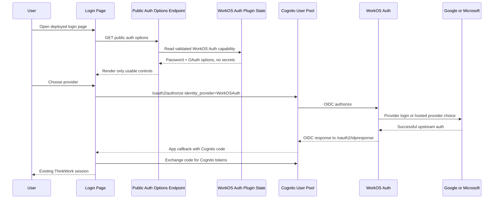
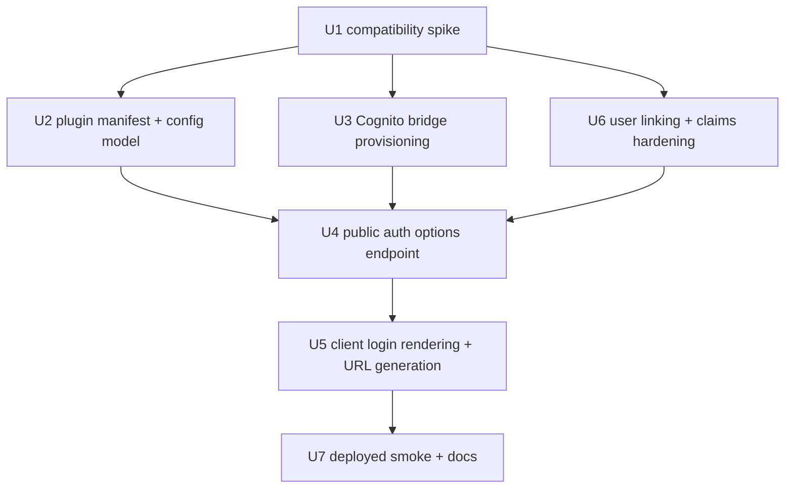
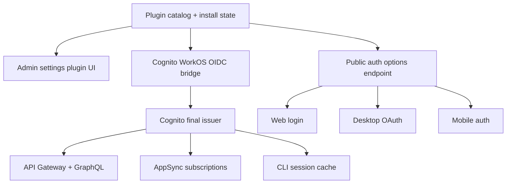

# feat: Add WorkOS Auth plugin upstream of Cognito

> Status update, 2026-06-19: this plan is superseded for the secure logout and
> account-switching requirement. U1 live validation proved that Cognito can
> receive a WorkOS-backed OIDC callback and issue Cognito tokens, but it also
> proved the hosted Cognito -> WorkOS nested IdP shape cannot guarantee a fresh
> WorkOS/provider account choice after logout. WorkOS' documented logout flow
> requires the WorkOS access token `sid`; Cognito's hosted federation path keeps
> the upstream WorkOS token/session id away from ThinkWork. PR #2667 is therefore
> only fail-closed evidence, not a shippable product implementation. Continue
> with `docs/plans/2026-06-19-001-feat-workos-primary-auth-bridge-plan.md`.

## Problem Frame

ThinkWork needs Google, Microsoft, and future enterprise SSO to be simple for
customers without weakening the platform's existing authentication contract.
Today, API Gateway, AppSync, the web app, mobile, desktop, CLI, and AWS-backed
runtime paths all expect Cognito-issued tokens. WorkOS should therefore be the
upstream OAuth/SSO broker, while Cognito remains the final issuer for ThinkWork
sessions (see origin:
`docs/brainstorms/2026-06-18-thnk-43-workos-auth-plugin-requirements.md`).

The WorkOS Auth capability is installable and configurable as a ThinkWork
plugin. Login controls are hidden until that plugin is installed, configured,
and validation proves that Cognito can complete the WorkOS bridge. Cognito
email/password remains available for deployments that allow password users.

The plugin is the customer/operator packaging and settings entry point, not a
reason to force login infrastructure into per-user plugin activation semantics.
Implementation should keep the auth-provider runtime in a dedicated subsystem
owned by the plugin lifecycle.

## Requirements Trace

| Origin requirement | Plan treatment                                                                                                                                                                                                   |
| ------------------ | ---------------------------------------------------------------------------------------------------------------------------------------------------------------------------------------------------------------- |
| R1, R2, R8         | Public auth options endpoint returns only password availability and validated plugin-backed OAuth options; default login remains Cognito email/password only.                                                    |
| R3, R12            | WorkOS Auth ships as a first-party plugin manifest with an admin settings/configuration surface and install health, not as global login UI.                                                                      |
| R4, R5, R10        | All clients continue using Cognito authorize/token exchange and Cognito token storage; WorkOS tokens are never accepted directly by ThinkWork APIs in v1.                                                        |
| R6, R7, R13        | Plugin configuration validates/stores WorkOS/Cognito bridge settings server-side, keeps secrets out of runtime config, and publishes no user-facing OAuth options when validation fails.                         |
| R9                 | The target UX is configured provider buttons such as Google and Microsoft. The first unit must prove Cognito can safely route or hint the upstream WorkOS provider before separate provider buttons are shipped. |
| R11                | Customers configure Google/Microsoft with WorkOS, not directly in each Cognito pool, after WorkOS Auth is selected as the plugin path.                                                                           |

Acceptance examples AE1-AE4 are preserved as verification scenarios in the
implementation units below.

| Origin flow/example                          | Plan treatment                                                                                                                    |
| -------------------------------------------- | --------------------------------------------------------------------------------------------------------------------------------- |
| F1. Plugin not installed                     | U4/U5 return and render no OAuth options, leaving password controls available when configured.                                    |
| F2. Plugin installed and configured          | U2/U3 store validated configuration and provision the Cognito WorkOS bridge before U4 publishes public options.                   |
| F3. WorkOS-backed OAuth sign-in              | U5 routes through Cognito authorize/token exchange; U6 hardens linking and claims so the rest of ThinkWork sees Cognito sessions. |
| AE1. No plugin means no OAuth controls       | U4/U5 tests cover absent plugin/config and empty options.                                                                         |
| AE2. Valid plugin config publishes options   | U2/U3/U4 require validation before public options appear.                                                                         |
| AE3. Microsoft sign-in yields Cognito tokens | U1/U5/U6/U7 verify Microsoft through WorkOS still lands in the Cognito session path.                                              |
| AE4. Missing secret hides controls           | U2/U4/U7 fail closed for users and surface diagnostics only to admins/operators.                                                  |

## Scope Boundaries

- Do not accept WorkOS JWTs directly in API Gateway, AppSync, GraphQL, mobile,
  desktop, CLI, or AgentCore paths in v1.
- Do not migrate Cognito email/password users into WorkOS.
- Do not display Google, Microsoft, or SSO buttons until the WorkOS Auth plugin
  install is valid for the deployment.
- Do not continue one-off Google/Microsoft Cognito social-provider setup as the
  long-term customer path.
- Do not force every tenant or deployment to install WorkOS Auth.

## Context & Research

Local code already supports the final-token shape we want:

- `apps/web/src/lib/auth.ts` has generic Cognito Hosted UI URL construction via
  `getHostedSignInUrl({ identityProvider })`, plus existing code exchange and
  Cognito local-storage token persistence.
- `apps/web/src/routes/sign-in.tsx` currently hardcodes a Google button. It
  should render public auth options instead.
- `apps/desktop/src/main/oauth.ts`, `apps/mobile/lib/auth.ts`, and
  `packages/react-native-sdk/src/auth/cognito.ts` still have Google-specific
  OAuth paths. They need provider-driven Cognito authorize URL generation.
- `apps/cli/src/cognito-oauth.ts` already uses the generic Cognito Hosted UI
  flow. It needs only an option-selection story if CLI login should bypass
  Hosted UI to a provider.
- `terraform/modules/foundation/cognito/main.tf` and
  `terraform/modules/foundation/cognito/variables.tf` already support generic
  Cognito OIDC identity providers through `oidc_identity_providers`.
- `terraform/modules/thinkwork/variables.tf` passes that generic OIDC provider
  contract through the composite module.
- `plugins/catalog/src/contracts.ts` currently allows `mcp-server`, `skills`,
  `infrastructure`, and `ui-surface` components, plus capability metadata. It
  does not yet model an auth-provider capability.
- `packages/api/src/lib/plugins/engine.ts` and
  `packages/api/src/lib/plugins/handlers/infra.ts` provide the install,
  component, approval, and managed-infrastructure pattern to follow.
- `packages/api/src/handlers/cognito-pre-signup.ts` currently assumes Google
  when linking external-provider users. It must become provider-name agnostic
  enough for the WorkOS-backed Cognito IdP.
- `packages/database-pg/graphql/types/plugins.graphql` exposes authenticated
  plugin install/admin state. Login needs a separate public-safe surface because
  unauthenticated users cannot call normal plugin queries.

Institutional guidance:

- `docs/solutions/runbooks/company-brain-premium-plugin-operations-2026-06-13.md`
  demonstrates plugin install/admin workflows, install-key secrecy, and smoke
  evidence expectations.
- `docs/solutions/best-practices/oauth-client-credentials-in-secrets-manager-2026-04-21.md`
  supports keeping OAuth client credentials server-side.
- `docs/solutions/best-practices/service-endpoint-vs-widening-resolvecaller-auth-2026-04-21.md`
  argues for narrow service endpoints instead of widening core authenticated
  resolver boundaries.
- `docs/src/content/docs/applications/mobile/authentication.mdx` confirms mobile
  auth depends on Cognito token exchange, token storage, and tenant resolution.

External references:

- AWS Cognito OIDC IdP docs state that Cognito can act as an intermediate
  between OIDC IdPs and applications, map upstream claims, then issue Cognito
  tokens. They also require HTTPS OIDC endpoints, `client_secret_post`, valid
  JWKS `kid`, and registering the Cognito `/oauth2/idpresponse` URL with the
  upstream IdP:
  <https://docs.aws.amazon.com/cognito/latest/developerguide/cognito-user-pools-oidc-idp.html>
- AWS federation docs confirm Cognito standardizes backend tokens and that
  `identity_provider` can silently redirect to a selected IdP:
  <https://docs.aws.amazon.com/cognito/latest/developerguide/cognito-user-pools-identity-federation.html>
- WorkOS OAuth Applications docs describe OAuth applications using the
  authorization-code flow and OIDC library discovery:
  <https://workos.com/docs/authkit/connect/oauth>
- WorkOS Social Login docs confirm Google, Microsoft, GitHub, and Apple social
  login support after provider configuration:
  <https://workos.com/docs/authkit/social-login>
- WorkOS Google and Microsoft integration docs confirm those providers are
  configured in WorkOS and have provider-specific redirect/provider setup:
  <https://workos.com/docs/integrations/google-oauth> and
  <https://workos.com/docs/integrations/microsoft-oauth>
- WorkOS Standalone Connect docs are relevant as a rejected/contingency option:
  they support keeping an existing auth system as source of truth, but v1 should
  avoid a parallel WorkOS-token acceptance path unless the Cognito OIDC bridge
  proves impossible:
  <https://workos.com/docs/reference/workos-connect/standalone>

## Key Technical Decisions

| Decision                                                                      | Rationale                                                                                                                                                                                                                                                                                         | Rejected alternative                                                                |
| ----------------------------------------------------------------------------- | ------------------------------------------------------------------------------------------------------------------------------------------------------------------------------------------------------------------------------------------------------------------------------------------------- | ----------------------------------------------------------------------------------- |
| WorkOS Auth is a plugin-controlled Cognito OIDC bridge.                       | Matches the user requirement that OAuth controls appear only after plugin install/configuration while preserving Cognito as the platform issuer.                                                                                                                                                  | Global Google/Microsoft buttons backed by direct Cognito social providers.          |
| Cognito remains the final token issuer for v1.                                | Avoids changing API Gateway, AppSync, GraphQL auth, mobile/desktop/CLI token storage, Bedrock/runtime assumptions, and tenant resolver behavior.                                                                                                                                                  | Accept WorkOS JWTs directly throughout the platform.                                |
| Public login state comes from a narrow unauthenticated auth-options endpoint. | Static Vite/runtime config cannot safely reflect tenant plugin state and normal plugin GraphQL queries require login.                                                                                                                                                                             | Put plugin secrets or full plugin install state in `thinkwork-runtime-config.json`. |
| Provider buttons are published data, not hardcoded UI.                        | The WorkOS Auth plugin should decide which public options are configured and healthy; web/mobile/desktop render those options.                                                                                                                                                                    | Keep `getGoogleSignInUrl()` and add a hardcoded Microsoft clone.                    |
| First implementation unit proves WorkOS-to-Cognito compatibility.             | Cognito has specific OIDC requirements and may not forward WorkOS provider hints. Separate Google/Microsoft buttons are only honest if the route can complete.                                                                                                                                    | Build UI first and discover provider-routing limits during deployed testing.        |
| Incomplete plugin config hides user-facing OAuth controls.                    | Broken buttons are worse than absent buttons and match AE4. Admins see install/configuration health in settings.                                                                                                                                                                                  | Show disabled or broken controls on the public login page.                          |
| Auth-provider infrastructure is deployment-scoped with tenant references.     | Plugin installs are tenant-scoped, but Cognito IdPs and app-client provider lists are user-pool/deployment resources. The plugin UX should create or reference one deployment-level WorkOS Auth config, then expose tenant/deployment availability through explicit references and host mappings. | Let one tenant-scoped plugin install own creation/deletion of a shared Cognito IdP. |
| Hiding a button is not authorization.                                         | Once a Cognito IdP exists, callers can manually construct `/oauth2/authorize` URLs. Plugin invalidation must also disable/remove the IdP from app clients or enforce validity in a Cognito trigger/callback-side gate.                                                                            | Treat the public auth-options response as the only control plane.                   |

Auth-provider vocabulary used below:

- **Deployment auth resource:** the deployment-scoped WorkOS-to-Cognito bridge
  keyed by Cognito user pool/app clients, issuer/domain, IdP name, and secret
  refs.
- **Tenant auth reference:** the tenant/deployment opt-in row that says a tenant
  may publish the deployment auth resource on specific hosts.
- **Plugin configuration row:** the admin-facing plugin state and validation
  status that drives settings UI and lifecycle actions.
- **Public auth option:** the redacted projection served to unauthenticated
  login clients after the deployment auth resource and tenant reference are
  both valid.

## Customer Setup Contract

For hosted ThinkWork deployments, the customer-facing setup must be:

1. Install the WorkOS Auth plugin from Settings.
2. Enter WorkOS application details needed by ThinkWork, with secrets redacted
   after save.
3. Select configured provider options such as Google and Microsoft, or a single
   SSO option if provider-specific routing is not supported.
4. Click Validate.
5. See OAuth controls on the public login screen only after validation succeeds.

Customer-facing surfaces must not ask tenant admins to edit Cognito identity
provider names, Cognito app-client provider assignments, callback URL internals,
Terraform variables, or IAM mutation choices for hosted deployments. Those are
operator/deployment internals. The setup is not ready if Google/Microsoft login
requires a customer to open AWS Cognito.

The admin configuration surface should have explicit states: uninstalled,
installed but unconfigured, saving, validating, valid, partially valid by
provider, invalid with safe diagnostic code, retrying validation, rotating
secret, disabling, and uninstalling. Invalid and partial states are visible only
to admins/operators; public login fails closed unless the configured publication
set has a fully valid route. If provider-specific Google/Microsoft routing is
not valid but the core WorkOS bridge is valid and U1 accepted the fallback UX,
the only public OAuth option is the single approved SSO fallback.

## High-Level Technical Design

This is directional flow guidance, not implementation code:

If the spike proves Cognito cannot pass provider-specific hints to WorkOS, the
plugin can still publish a single WorkOS-backed "Continue with SSO" option for
v1, but separate Google/Microsoft buttons must wait for a supported bridge or a
reviewed product decision.

## Open Questions

Resolved for this plan:

- Cognito remains the final issuer.
- WorkOS Auth is an installable/configurable plugin.
- OAuth controls stay hidden until plugin configuration validates.
- Cognito email/password remains available where configured.
- Existing plugin OAuth activation is not the login auth path.

Planning-owned unknowns converted into early implementation work:

- Which WorkOS surface is the right upstream Cognito OIDC IdP: AuthKit OAuth
  Application, WorkOS Connect OAuth Application, or another AuthKit-compatible
  domain.
- Whether Cognito can pass a provider-specific hint that WorkOS honors for
  direct Google/Microsoft buttons.
- Whether runtime Cognito IdP changes should be applied through the deployment
  control plane, Terraform re-apply, or a tightly scoped AWS service endpoint.

Implementation must not proceed past Unit 1 into user-facing buttons until these
unknowns have evidence.

## Implementation Units

### U1. WorkOS-to-Cognito OIDC Compatibility Spike

**Goal:** Prove the exact upstream WorkOS surface and request shape Cognito can
use before UI or plugin state advertises provider buttons.

**Requirements covered:** R4, R5, R6, R9, R10, R11; F2, F3; AE3.

**Approach:**

- Create a spike note under
  `docs/solutions/spikes/2026-06-18-workos-cognito-oidc-compatibility.md`.
- Test the candidate WorkOS AuthKit/Connect OAuth Application surface against
  Cognito user-pool OIDC requirements: issuer discovery, authorization endpoint,
  token endpoint, userinfo endpoint, JWKS, `kid`, signing algorithm,
  `client_secret_post`, `openid email profile` scopes, and `/oauth2/idpresponse`
  redirect registration.
- Prove whether Cognito's `/oauth2/authorize` request can carry a WorkOS
  provider hint for Google vs Microsoft. If not, document the fallback UX before
  any separate provider buttons ship.
- Verify that final Cognito/WorkOS-mapped claims identify the actual upstream
  provider or WorkOS connection and match the selected public option. If the
  final claims cannot prove the selected provider/connection, publish only the
  single WorkOS SSO fallback.
- Capture required claim mappings for Cognito user attributes, including email,
  name, username/preferred username, stable upstream subject, WorkOS
  organization or connection identity, and actual provider/connection used.

**Files likely touched:**

- Create:
  `docs/solutions/spikes/2026-06-18-workos-cognito-oidc-compatibility.md`
- Modify only if the spike finds reusable repo fixtures helpful:
  `terraform/examples/greenfield/terraform.tfvars.example`
  `terraform/modules/foundation/cognito/variables.tf`

**Tests / verification:**

- Test expectation: no production code tests in this unit.
- Verification evidence in the spike doc must include:
  - Cognito OIDC provider configuration values, redacted.
  - WorkOS redirect URI setup, redacted.
  - A successful Cognito-issued token after WorkOS sign-in, or a precise
    incompatibility finding.
  - Provider-specific routing result for Google and Microsoft, including final
    mapped claims that prove whether the actual upstream provider or connection
    matched the clicked public option.

### U2. Add WorkOS Auth Plugin Manifest and Admin Configuration Model

**Goal:** Represent WorkOS Auth as a first-party plugin with installable
metadata, admin-only configuration, validated auth-provider state, and admin
health.

**Requirements covered:** R1, R3, R6, R7, R8, R12, R13; F1, F2; AE1, AE2, AE4.

**Approach:**

- Add a first-party `workos-auth` plugin under `plugins/workos-auth/`.
- Add an `auth-provider` plugin component contract up front. The current catalog
  contract requires a non-empty component list and only models `mcp-server`,
  `skills`, `infrastructure`, and `ui-surface`; capability metadata alone cannot
  validate or install WorkOS Auth. Keep capability metadata only for catalog
  display.
- Do not reuse `user_plugin_activations`; login auth is deployment/tenant
  infrastructure, not a per-user integration grant.
- Store WorkOS client id, client secret, issuer/domain, provider enablement,
  provider-routing evidence, validation state, and safe diagnostics server-side.
  Secrets should use the existing plugin secret or tenant credential patterns,
  never public runtime config.
- Use a dedicated auth-provider persistence model instead of overloading
  `tenant_credentials`: a deployment auth resource table, tenant auth reference
  rows, secret refs, validation-state vocabulary, provider-option metadata,
  host mapping fields, rotation behavior, and uninstall/decommission rules.
- Model ownership as a deployment-level auth-provider resource keyed by Cognito
  user pool/app clients, with tenant/deployment references. Uninstall removes a
  tenant reference; it disables/removes the shared Cognito IdP only when no
  enabled reference remains, or when an operator explicitly decommissions the
  deployment auth resource.
- Expose admin configuration and health in plugin settings. User-facing login
  controls should depend on validation state, not raw install state.
- Define the admin state matrix before building the settings UI: for each named
  state, record visible status text, enabled/disabled fields, primary and
  secondary actions, destructive-action confirmation, secret redaction behavior,
  validation progress, provider-level diagnostics, and exit transitions.
- Keep public option response shape and cache behavior out of this unit; U4 owns
  translating validated state into unauthenticated login metadata.

**Files likely touched:**

- Create:
  `plugins/workos-auth/src/index.ts`
  `plugins/workos-auth/src/manifest.ts`
  `plugins/workos-auth/package.json`
  `plugins/workos-auth/tsconfig.json`
  `plugins/workos-auth/test/manifest.test.ts`
- Modify:
  `plugins/catalog/src/contracts.ts`
  `plugins/catalog/src/__tests__/contracts.test.ts`
  `plugins/catalog/src/registry/generated-first-party.ts`
  `plugins/catalog/scripts/generate-plugin-registry.ts`
  `packages/database-pg/src/schema/plugins.ts`
  `packages/database-pg/graphql/types/plugins.graphql`
  `packages/api/src/graphql/resolvers/plugins/mutations.ts`
  `packages/api/src/graphql/resolvers/plugins/queries.ts`
  `apps/web/src/components/settings/plugins/PluginDetail.tsx`
  `apps/web/src/components/settings/plugins/PluginDetail.test.tsx`
- Create if a dedicated auth-provider table is selected:
  `packages/database-pg/drizzle/<next>_workos_auth_configs.sql`

**Tests / verification:**

- Manifest validation accepts `workos-auth` with an `auth-provider` component and
  rejects auth config with exposed secret fields.
- `plugins/workos-auth/src/index.ts` exports the package descriptor and manifest
  using the existing first-party plugin package pattern.
- Installing the plugin without required config leaves the auth capability
  unpublished and reports admin-visible configuration status.
- Valid config persists Google/Microsoft option metadata only after validation;
  U4 is responsible for exposing it publicly.
- Admin UI covers unconfigured, saving, validating, valid, partially valid,
  invalid, retry, rotation, disabling, and uninstalling states.
- Hosted customer admin flow requires no Cognito/AWS-console fields.
- Normal plugin install/uninstall behavior remains unchanged for existing
  Twenty, Company Brain, SendGrid, and email-channel manifests.

### U3. Provision the Cognito-to-WorkOS Bridge

**Goal:** Configure or validate Cognito's WorkOS OIDC identity provider as part
of the plugin lifecycle without making customers hand-edit Cognito for each
Google/Microsoft provider.

**Requirements covered:** R4, R5, R6, R7, R11, R12, R13; F2, F3; AE2, AE3,
AE4.

**Approach:**

- Reuse the generic OIDC provider substrate in
  `terraform/modules/foundation/cognito/main.tf` where deployment-time apply is
  the right path.
- For hosted/customer deployments, prefer the existing deployment-control-plane
  pattern over ad hoc browser-driven AWS mutations. If runtime mutation is
  necessary, isolate it behind an operator-gated service endpoint with tight IAM
  limited to `CreateIdentityProvider`, `UpdateIdentityProvider`,
  `DescribeIdentityProvider`, `ListIdentityProviders`,
  `UpdateUserPoolClient`, and related read actions on the target pool. Add
  `DeleteIdentityProvider` only if the runtime path owns physical IdP deletion;
  otherwise runtime teardown removes the provider from app clients and
  Terraform/operator decommission owns physical deletion.
- Add idempotent validation that the Cognito app clients include the WorkOS IdP
  in `supported_identity_providers`, callback/logout URLs remain exact, and the
  WorkOS redirect URI is the Cognito `/oauth2/idpresponse` URL.
- Add validation egress guardrails for WorkOS discovery/JWKS fetches: require
  HTTPS, allowlist expected WorkOS/AuthKit issuer host patterns or configured
  tenant domains, reject localhost/link-local/private IP resolutions including
  redirects, set short timeouts and response size limits, and redact fetched
  URLs/errors in logs.
- Add a non-UI enforcement point for plugin invalidation. Preferred options are:
  remove/disable the WorkOS IdP from relevant app clients when validation is
  false, use per-deployment/per-tenant app clients where available, or add a
  Cognito trigger/callback gate that rejects WorkOS-authenticated users unless
  the resolved deployment auth resource is valid.
- Select one concrete tenant-scoped enforcement design before public options are
  published: either per-tenant Cognito app clients, or a signed server-issued
  tenant auth reference carried through the authorize/callback path plus
  mandatory WorkOS organization/connection claim validation. Verification must
  include two tenants sharing one deployment where tenant A is valid and tenant B
  is disabled, proving tenant B cannot complete manually constructed authorize
  URLs without breaking tenant A.
- Record sanitized handler state on the plugin component/config row: IdP name,
  issuer/domain, supported provider options, last validation result, last
  validation time, and safe diagnostic codes.
- Treat failed validation as admin-visible configuration failure and
  user-invisible OAuth options.
- Define secret-management behavior: Secrets Manager path, KMS/encryption,
  allowed read/write principals, admin UI redaction, log redaction, stage/tenant
  isolation, rotation procedure, and revalidation/update of the Cognito OIDC
  provider after rotation.
- If runtime Cognito mutation remains an allowed path, require a reviewable
  mutation artifact before apply: proposed before/after Cognito IdP and
  app-client state, operator approval identity, Linear/deployment evidence link,
  immutable audit event, rollback plan, and Terraform drift reconciliation
  rules. If Terraform owns physical IdPs, runtime code should request the
  approved deployment-control-plane apply rather than mutating Cognito directly.
- Define active-session revocation semantics for WorkOS Auth disable, uninstall,
  tenant deprovision, upstream user revocation, and secret rotation: either
  revoke/invalidate affected Cognito refresh sessions or enforce a
  provider-valid-after/session-version check in API auth so already-issued
  Cognito sessions cannot outlive the revoked provider state.

**Files likely touched:**

- Modify:
  `terraform/modules/foundation/cognito/main.tf`
  `terraform/modules/foundation/cognito/variables.tf`
  `terraform/modules/thinkwork/variables.tf`
  `terraform/modules/thinkwork/main.tf`
  `terraform/examples/greenfield/main.tf`
  `terraform/examples/greenfield/terraform.tfvars.example`
  `terraform/modules/app/deployment-control-plane/runner.py`
  `terraform/modules/app/deployment-control-plane/test_runner_bundle.py`
  `packages/api/src/lib/plugins/engine.ts`
  `packages/api/src/lib/plugins/store.ts`
  `packages/api/src/lib/plugins/handlers/infra.ts`
- Create if runtime bridge handling is selected after U1:
  `packages/api/src/lib/plugins/handlers/auth-provider.ts`
  `packages/api/src/lib/plugins/handlers/auth-provider.test.ts`

**Tests / verification:**

- Terraform/unit fixture renders a Cognito OIDC IdP named for WorkOS and adds it
  to admin/mobile app clients without removing `COGNITO`.
- Secret values are accepted as sensitive inputs and are absent from generated
  runtime config and logs.
- Plugin config validation fails closed when WorkOS discovery, JWKS, callback,
  or app-client provider assignment is invalid.
- Manually constructed Cognito authorize URLs cannot complete WorkOS login when
  the plugin/config is invalid or disabled.
- Re-running install/configuration is idempotent and does not create duplicate
  Cognito IdPs.

### U4. Add Public Auth Options Endpoint

**Goal:** Give login pages a narrow unauthenticated way to know which controls
are usable for the current deployment.

**Requirements covered:** R1, R2, R8, R13; F1, F2; AE1, AE4.

**Approach:**

- Add an unauthenticated HTTP endpoint, for example `GET /auth/options`, that
  returns only public-safe data:
  `password.enabled`, `oauthOptions[]`, labels, icons, Cognito IdP name, and
  whether provider-specific routing is supported.
- Resolve the current deployment/tenant by host/stage binding rather than by
  trusting caller-supplied tenant ids. Customer domains must map to exactly one
  deployment auth config or tenant reference. Shared hosts such as
  `app.thinkwork.ai` must return no tenant-scoped WorkOS OAuth options until an
  explicit discovery step selects a tenant safely. Deployment-wide options are
  allowed only when WorkOS Auth is explicitly enabled for the whole deployment
  and documented as a deployment-scoped opt-in.
- Use trusted host metadata from API Gateway `requestContext.domainName`, custom
  domain mapping, and stage for tenant lookup. Ignore client-supplied
  `Host`/`Origin`/`X-Forwarded-Host`/`Forwarded` values for tenant resolution,
  normalize case/punycode/trailing dots, and fail closed for unknown custom
  domains.
- Use explicit cache-control. The login page should not hold stale "enabled"
  options after plugin config is revoked or validation fails.
- Keep admin diagnostics out of the public response. Public failures should
  degrade to no OAuth options.
- Each `oauthOptions[]` entry must include the exact route contract proven in
  U1: Cognito IdP name plus any WorkOS/provider hint parameter required to make
  Google and Microsoft distinct. If U1 cannot prove that route field, publish
  only the single WorkOS SSO option.
- Partial provider validity is fail-closed for the configured publication set:
  hide invalid provider-specific options; publish valid provider-specific
  options only if each returned option has successful validation and proven
  routing; publish the single SSO fallback only when the core WorkOS bridge is
  valid and provider-specific routing is not the accepted route.
- Define fail-closed client behavior for loading, timeout, 404/host mismatch,
  endpoint error, stale data, and malformed/partial responses. Password sign-in
  must remain usable when configured; OAuth controls appear only after valid
  options arrive.

**Files likely touched:**

- Create:
  `packages/api/src/handlers/public-auth-options.ts`
  `packages/api/src/handlers/public-auth-options.test.ts`
  `apps/web/src/lib/auth-options.ts`
  `apps/web/src/lib/auth-options.test.ts`
- Modify:
  `terraform/modules/app/lambda-api/handlers.tf`
  `terraform/modules/app/lambda-api/runtime-config.tf`
  `scripts/build-lambdas.sh`
  `apps/web/src/lib/runtime-config.ts`

**Tests / verification:**

- With no WorkOS Auth plugin install, endpoint returns password availability
  and an empty `oauthOptions`.
- With installed but invalid config, endpoint returns no `oauthOptions`.
- With valid WorkOS Auth config, endpoint returns Google and Microsoft options
  only if U1 proved provider-specific routing; otherwise one WorkOS SSO option.
- Google and Microsoft options generate distinct routed authorize requests; if
  they do not, endpoint publishes only the fallback SSO option.
- Shared hosts return no tenant-scoped OAuth options until tenant context is
  safely resolved; a tenant on a shared host without WorkOS Auth enabled never
  sees another tenant's or deployment's options.
- Endpoint response never includes client secrets, WorkOS API keys, raw plugin
  config, tenant ids not needed by the client, or admin error detail.
- Host/stage mismatch returns a safe empty capability response or a 404, not
  another tenant's auth options.
- Spoofed `Host`, `X-Forwarded-Host`, `Forwarded`, `Origin`, mixed-case,
  punycode, trailing-dot, and unknown custom-domain requests fail closed and do
  not leak another tenant's options.
- Unknown host, shared host, tenant without plugin, invalid plugin, and partial
  provider config cases are covered.

### U5. Render Dynamic Login Controls Across Clients

**Goal:** Replace hardcoded Google login controls with provider-driven WorkOS
Auth options while preserving existing Cognito session exchange.

**Requirements covered:** R1, R2, R8, R9, R10, R13; F1, F3; AE1, AE3, AE4.

**Approach:**

- Generalize web auth helpers from `getGoogleSignInUrl()` to provider-driven
  Cognito authorize URL generation.
- Web login renders options from `GET /auth/options` before email/password. If
  no options are returned, no OAuth divider/button is shown.
- Define a public login state matrix for password enabled/no OAuth, password
  disabled/no OAuth, auth-options loading, auth-options error, host mismatch,
  malformed response, revoked provider after page load, and fallback SSO. The
  matrix should cover visible copy category, controls shown, retry/refresh
  action, and admin/operator support escalation.
- Loading/error behavior is fail-closed for OAuth: do not block configured
  password sign-in, do not render OAuth controls until valid options arrive, and
  show only generic retry/error copy on public pages.
- Require S256 PKCE for every public-client Cognito Hosted UI flow touched by
  this work, with per-attempt state binding and callback tests that reject
  missing, reused, or mismatched `state` and `code_verifier` values. Any
  client-specific exception must be explicit.
- Desktop and mobile reuse the same provider option model where possible, but
  still exchange Cognito codes and store Cognito tokens.
- Add a cross-client parity matrix for web, mobile, desktop, React Native SDK,
  and CLI covering entry point, auth-options fetch timing, loading/no-options
  behavior, fallback SSO label, provider ordering, callback handling,
  cancellation, retry/exit paths, and intentional v1 differences.
- Provider buttons and admin status controls need accessible names independent
  of icon keys, keyboard and screen-reader support for loading/error states,
  mobile touch targets, and responsive handling for multiple providers or long
  tenant/provider labels.
- CLI can keep generic Hosted UI for v1, but should not assume Google in docs or
  URL construction. Add a follow-up CLI option only if operators need
  provider-bypass behavior.
- If U1 selects the single fallback option, define the visible label and handoff
  before implementation. Default proposed label: "Continue with SSO"; WorkOS
  handles provider choice after Cognito redirects upstream.

**Files likely touched:**

- Modify:
  `apps/web/src/lib/auth.ts`
  `apps/web/src/routes/sign-in.tsx`
  `apps/web/src/routes/-sign-in.test.tsx`
  `apps/web/src/routes/auth/callback.tsx`
  `apps/desktop/src/main/oauth.ts`
  `apps/desktop/test/main/oauth.test.ts`
  `apps/mobile/lib/auth.ts`
  `apps/mobile/app/sign-in.tsx`
  `apps/mobile/app/auth/callback.tsx`
  `packages/react-native-sdk/src/auth/cognito.ts`
  `packages/react-native-sdk/src/auth/provider.tsx`
- Conditional only if v1 adds CLI provider bypass:
  `apps/cli/src/cognito-oauth.ts`
  `apps/cli/__tests__/cognito-oauth.test.ts`

**Tests / verification:**

- Web sign-in with no auth options renders no Google/Microsoft button and keeps
  password sign-in available when password sign-in is configured.
- Web sign-in with valid provider options renders Google and Microsoft buttons
  only when those options are returned by the endpoint.
- Clicking a provider button opens Cognito `/oauth2/authorize` with the expected
  WorkOS Cognito IdP, state/redirect parameters, and provider-routing parameter
  proven in U1.
- Public-client authorize/callback tests prove S256 PKCE and state binding:
  missing, reused, or mismatched state/code verifier attempts fail closed.
- Desktop OAuth no longer hardcodes `identity_provider=Google`.
- Mobile SDK and mobile app no longer hardcode Google-specific wording or
  authorize parameters.
- Successful callback still reaches the existing Cognito token exchange/storage
  path.
- Cancellation, upstream provider error, Cognito IdP error, missing/invalid
  state, token exchange failure, disabled provider after click, and retry/exit
  paths are covered for web, desktop, and mobile.

### U6. Harden Cognito Linking, Claims, and Tenant Resolution

**Goal:** Make WorkOS-backed external-provider users link into existing Cognito
users and tenant records without assuming a Google provider prefix.

**Requirements covered:** R4, R5, R6, R10; F3; AE3.

**Approach:**

- Update the Cognito pre-signup trigger to derive configured external provider
  names from Cognito/WorkOS settings instead of a Google-only map.
- Verify whether WorkOS-backed Cognito users produce stable `userName`,
  `identities`, `email`, and `sub` shapes that can be linked safely.
- Require verified email or equivalent WorkOS/upstream assurance before linking
  by email. Validate expected issuer, client/audience, tenant-scoped WorkOS
  organization or connection identity, and stable upstream subject. Missing,
  false, or unmapped stable identity fails closed. If Cognito cannot receive the
  needed WorkOS/upstream identity claims, v1 must not automatically link WorkOS
  users by email unless a reviewed single-tenant/deployment-scoped exception is
  recorded.
- Preserve existing fallback behavior for Google-federated callers where
  `custom:tenant_id` may be missing; do not add resolver logic that trusts a
  caller-supplied tenant id.
- Add targeted tests for new provider-name parsing and native-user linking.

**Files likely touched:**

- Modify:
  `packages/api/src/handlers/cognito-pre-signup.ts`
  `packages/api/src/lib/cognito-auth.ts`
  `packages/api/src/lib/cognito-auth.test.ts`
  `packages/api/src/graphql/resolvers/core/resolve-auth-user.ts`
  `packages/api/src/graphql/resolvers/core/resolve-auth-user.test.ts`
  `docs/src/content/docs/applications/mobile/authentication.mdx`

**Tests / verification:**

- Existing Google external-provider linking still works.
- WorkOS-backed external-provider sign-up links to an existing native Cognito
  user with the same verified email and expected WorkOS issuer/audience/context.
- WorkOS-backed first sign-up creates/links the native destination user when no
  native user exists, matching current behavior.
- Missing email, unverified email, unexpected provider username shapes, or
  tenant/connection mismatch fail safe without cross-tenant linking.
- Missing stable upstream subject, missing WorkOS organization/connection
  identity, or final provider/connection mismatch prevents automatic linking.
- GraphQL tenant resolution still works when `custom:tenant_id` is absent.
- Provider disable/uninstall or tenant deprovision invalidates or rejects
  existing WorkOS-linked Cognito sessions according to the revocation model
  selected in U3.

### U7. Deployment, Smoke Testing, and Documentation

**Goal:** Prove the feature in deployed ThinkWork environments and document the
customer-simple path.

**Requirements covered:** R1-R13; F1-F3; AE1-AE4.

**Approach:**

- Add a smoke script that checks public auth options, Cognito hosted authorize
  URL shape, plugin admin health, and successful Cognito token issuance after a
  WorkOS-backed sign-in.
- Run deployed validation in a controlled environment, then prepare
  operator-approved rollout evidence for app.thinkwork.ai, TEI, and McPherson
  with:
  - plugin absent: no OAuth controls;
  - plugin installed but incomplete: no OAuth controls and admin-visible error;
  - plugin valid: Google/Microsoft or approved WorkOS SSO option appears;
  - Google and Microsoft sign-in land in Cognito token storage.
- Update admin/operator docs so the customer setup path is: install WorkOS Auth
  plugin, enter WorkOS config, validate, then OAuth controls appear.
- Do not automatically enable WorkOS Auth on named deployments as part of the
  feature merge. Activation on app.thinkwork.ai, TEI, and McPherson is a
  separate operator-approved rollout step.

**Files likely touched:**

- Create:
  `plugins/workos-auth/smoke/workos-auth-plugin-smoke.mjs`
  `docs/src/content/docs/applications/admin/workos-auth-plugin.mdx`
  `docs/verification/workos-auth-plugin-e2e.md`
- Modify:
  `docs/src/content/docs/applications/admin/plugins.mdx`
  `docs/src/content/docs/applications/admin/authentication-and-tenancy.mdx`
  `docs/src/content/docs/applications/mobile/authentication.mdx`
  `docs/src/content/docs/applications/cli/commands.mdx`
  `docs/src/content/docs/deploy/greenfield.mdx`

**Tests / verification:**

- Smoke evidence records app.thinkwork.ai, TEI, and McPherson public auth
  options before and after plugin configuration when those deployments are
  explicitly selected for rollout.
- Google sign-in no longer produces Google `redirect_uri_mismatch` for TEI
  because Google is configured in WorkOS, and WorkOS redirects back to Cognito
  `/oauth2/idpresponse`.
- Microsoft sign-in completes through WorkOS and yields Cognito tokens.
- Provider-specific smoke evidence proves the final Cognito/WorkOS-mapped claims
  identify the actual upstream provider or connection and match the selected
  public login option. If the claim is unavailable or differs from the clicked
  button, Verification requires the single SSO fallback instead.
- Removing or invalidating WorkOS Auth hides OAuth options on the next login
  page load.
- Spike and smoke artifacts never include raw auth codes, ID tokens, access
  tokens, or refresh tokens. Evidence uses redacted decoded claims, timestamps,
  request IDs, and masked screenshots.

## System-Wide Impact

Affected surfaces:

- Auth UI: web, desktop, mobile, React Native SDK, CLI docs.
- Auth infrastructure: Cognito user-pool IdP, app clients, callback URLs,
  pre-signup trigger, deployment control plane.
- Plugin platform: catalog contract, install/configuration state, settings
  surface, public capability publication.
- API boundary: new public auth-options endpoint only; no broadening of
  authenticated GraphQL resolver access.
- Secrets: WorkOS client/API secrets and provider credentials stay server-side.
- Tenant identity: external-provider user linking and tenant resolution remain
  Cognito/user-row based.

## Risks & Mitigations

| Risk                                                                | Mitigation                                                                                                                                 |
| ------------------------------------------------------------------- | ------------------------------------------------------------------------------------------------------------------------------------------ |
| WorkOS AuthKit/Connect endpoint fails Cognito OIDC requirements.    | Unit 1 blocks further implementation and records a precise fallback decision before UI work.                                               |
| Cognito cannot forward provider-specific hints to WorkOS.           | Publish a single WorkOS SSO option or redesign provider-button routing; do not ship misleading Google/Microsoft buttons.                   |
| Plugin install mutates auth infrastructure unsafely.                | Prefer deployment-control-plane/Terraform apply; if runtime AWS calls are needed, use operator-gated narrow IAM and idempotent validation. |
| UI hides controls but manual authorize URL still works.             | Add Cognito/app-client or trigger/callback enforcement so invalid/disabled plugin state blocks the flow beyond the login page.             |
| Public endpoint leaks secrets or tenant internals.                  | Return only labels, icon keys, provider ids, Cognito IdP name, and booleans; add explicit negative tests.                                  |
| Public endpoint is abused for auth-posture probing.                 | Use API Gateway throttling/WAF where available, explicit CORS, safe cache-control, and metrics for unusual unauthenticated traffic.        |
| Existing Cognito user linking breaks for Google users.              | Add regression tests around `cognito-pre-signup.ts` and keep Google mapping behavior covered.                                              |
| Email-only linking enables account takeover.                        | Require verified email, expected issuer/audience, stable upstream subject, and tenant/connection context before linking.                   |
| Stale public auth options show broken buttons after config removal. | Use explicit cache-control and login-time fetch; invalid config must fail closed.                                                          |
| Multi-client drift recreates hardcoded Google behavior.             | Add tests for web, desktop, mobile SDK/app, and CLI URL generation.                                                                        |
| Active WorkOS-linked sessions survive provider revocation.          | Select and test Cognito refresh-session revocation or provider-valid-after/session-version enforcement before Verification.                |
| OIDC discovery validation becomes an SSRF path.                     | Constrain issuer/JWKS fetches to expected HTTPS hosts, reject private-network redirects/resolution, and bound timeout/response size.       |
| Tenant B completes manual authorize through Tenant A's bridge.      | Require per-tenant app clients or signed tenant auth references plus WorkOS organization/connection claim validation; smoke-test A/B.      |
| Runtime Cognito mutation drifts from Terraform/deployment state.    | Require reviewable before/after mutation artifacts, operator approval, audit events, rollback notes, and drift reconciliation.             |

## Rollout Plan

1. Complete U1 in a non-production WorkOS/Cognito environment and update this
   plan or the Linear issue if provider-specific routing is not viable.
2. Implement plugin/config and Cognito bridge behind admin-only install state.
3. Ship public auth-options endpoint returning empty options by default.
4. Convert clients to dynamic options while preserving Cognito token exchange.
5. Validate a controlled deployed environment with plugin absent/incomplete
   before enabling WorkOS Auth.
6. For app.thinkwork.ai, TEI, and McPherson, create operator-approved rollout
   tasks that enable the plugin one deployment at a time with smoke evidence.

## Verification Strategy

This plan is ready for implementation as a gated sequence. U1 is the first
executable unit and exists to settle the WorkOS/Cognito compatibility questions
before user-facing OAuth controls are built. U2, U3, and U6 may proceed only
after U1 records evidence for the WorkOS OIDC surface, Cognito OIDC
compatibility, provider-specific routing behavior or fallback requirement, and
claim shapes. U4 may proceed only after U2 selects the dedicated persistence and
tenant-reference model and U3 selects the bridge mutation, secret, enforcement,
and revocation paths. U5 may proceed only after U4 defines the host mapping,
public option contract, partial-validity behavior, and shared-host fail-closed
rules.

Repository-level verification during implementation should prove each unit's
tests and invariants without mutating production. End-to-end Verification must
use a deployed ThinkWork environment because this feature depends on real
Cognito user-pool federation, plugin install/configuration state, public login
metadata, and WorkOS callback behavior.

### Explicit End-to-End Validation Criteria for Verification

THNK-43 is ready to pass Verification only when all of these are true:

- **Plugin absent:** a target deployment with no valid WorkOS Auth plugin
  configuration renders Cognito email/password controls, returns no public
  OAuth options, and cannot complete a manually constructed Cognito authorize
  URL for a disabled/invalid WorkOS IdP.
- **Plugin incomplete or invalid:** installing WorkOS Auth without required
  secrets, with invalid discovery/JWKS/callback configuration, or after secret
  revocation leaves public OAuth options empty while admin/operator surfaces
  show safe diagnostic state.
- **Plugin valid:** validating WorkOS Auth publishes only public-safe login
  metadata for the deployment/host, with no WorkOS secrets, raw tokens, admin
  diagnostics, or unrelated tenant identifiers in runtime config or public API
  responses.
- **Shared-host gating:** shared hosts return no tenant-scoped OAuth options
  until tenant context is safely resolved; deployment-wide options appear only
  after explicit deployment-scoped WorkOS Auth opt-in.
- **Provider routing:** Google and Microsoft buttons appear only if U1 proved
  distinct Cognito-to-WorkOS routing. If distinct routing is not proven, the
  deployed login page shows the approved single WorkOS SSO fallback instead of
  misleading provider-specific buttons.
- **Provider claim match:** provider-specific buttons also require final
  Cognito/WorkOS-mapped claims identifying the actual upstream provider or
  connection and matching the selected public option; otherwise Verification
  requires the single SSO fallback.
- **Cognito final issuer:** a WorkOS-backed Microsoft sign-in and a
  WorkOS-backed Google sign-in or approved SSO fallback both land in the
  existing Cognito code exchange, token storage, refresh, API Gateway,
  AppSync, and tenant-resolution paths.
- **Account linking safety:** existing Google federation behavior still works,
  WorkOS-backed users link only with verified email and expected
  issuer/audience/tenant or connection context plus stable upstream subject, and
  unsafe missing or mismatched claims fail closed without cross-tenant linking.
- **Tenant-scoped enforcement:** in a two-tenant deployment where tenant A has
  valid WorkOS Auth and tenant B is disabled or invalid, tenant B cannot complete
  a manually constructed WorkOS authorize URL, while tenant A still can.
- **Revocation:** disabling, uninstalling, invalidating, or rotating WorkOS
  Auth removes public OAuth options on the next login load and blocks the
  underlying Cognito federation path until validation succeeds again; affected
  WorkOS-linked Cognito refresh sessions are revoked or existing sessions fail
  the selected provider-valid-after/session-version check.
- **Public-client integrity:** web, desktop, mobile, SDK, and any CLI
  provider-bypass flow touched by this work use S256 PKCE and state binding, and
  reject missing, reused, or mismatched callback state/code verifier values.
- **Public login empty state:** deployments with password disabled and no valid
  OAuth options show a non-blank unavailable-auth state with retry and
  admin/operator escalation guidance, without exposing admin diagnostics.
- **Evidence hygiene:** smoke artifacts and Linear comments include redacted
  configuration, decoded claim summaries, timestamps, request IDs, and masked
  screenshots only; they never include raw auth codes, ID tokens, access tokens,
  refresh tokens, client secrets, API keys, or Terraform secret values.

## Documentation

- Add an admin guide for installing/configuring WorkOS Auth.
- Update mobile auth docs from Google-specific wording to Cognito-federated
  OAuth provider wording.
- Update CLI docs if provider selection or Hosted UI behavior changes.
- Add a verification note with redacted deployed evidence for app.thinkwork.ai,
  TEI, and McPherson.

## Implementation Gate Checklist

- [ ] The repo-local plan artifact is merged to `main` and recorded on THNK-43.
- [ ] U1 compatibility spike has a concrete pass/fail result before U2-U7
      begin.
- [ ] Provider-specific Google/Microsoft button routing is either proven or the
      UX fallback is explicitly accepted.
- [ ] U2 selects the dedicated deployment auth resource, tenant reference,
      plugin config, and public option vocabulary/schema.
- [ ] U3 selects secret locations, deployment mutation mechanism, non-UI
      enforcement, active-session revocation, and OIDC discovery guardrails.
- [ ] U4 selects host mapping, shared-host gating, partial-provider semantics,
      and public empty-state behavior before U5 starts.
- [ ] Linear THNK-43 links to this plan and the brainstorm document.
- [ ] Implementation starts from an isolated worktree/branch off current
      `origin/main`.

## Sources & References

- **Linear issue:** THNK-43 WorkOS Auth plugin upstream of Cognito
  <https://linear.app/thinkworkai/issue/THNK-43/workos-auth-plugin-upstream-of-cognito>
- **Linear plan document:** Plan: Add WorkOS Auth plugin upstream of Cognito
  <https://linear.app/thinkworkai/document/plan-add-workos-auth-plugin-upstream-of-cognito-74c951de6ebc>
- **Origin document:**
  `docs/brainstorms/2026-06-18-thnk-43-workos-auth-plugin-requirements.md`
- **Related code and docs:** `apps/web/src/lib/auth.ts`,
  `apps/web/src/routes/sign-in.tsx`, `apps/desktop/src/main/oauth.ts`,
  `apps/mobile/lib/auth.ts`, `packages/react-native-sdk/src/auth/cognito.ts`,
  `apps/cli/src/cognito-oauth.ts`,
  `terraform/modules/foundation/cognito/main.tf`,
  `plugins/catalog/src/contracts.ts`,
  `packages/api/src/handlers/cognito-pre-signup.ts`,
  `packages/database-pg/graphql/types/plugins.graphql`,
  `docs/src/content/docs/applications/mobile/authentication.mdx`
- **Institutional learnings:**
  `docs/solutions/runbooks/company-brain-premium-plugin-operations-2026-06-13.md`,
  `docs/solutions/best-practices/oauth-client-credentials-in-secrets-manager-2026-04-21.md`,
  `docs/solutions/best-practices/service-endpoint-vs-widening-resolvecaller-auth-2026-04-21.md`
- **External docs:**
  <https://docs.aws.amazon.com/cognito/latest/developerguide/cognito-user-pools-oidc-idp.html>,
  <https://docs.aws.amazon.com/cognito/latest/developerguide/cognito-user-pools-identity-federation.html>,
  <https://workos.com/docs/authkit/connect/oauth>,
  <https://workos.com/docs/authkit/social-login>,
  <https://workos.com/docs/integrations/google-oauth>,
  <https://workos.com/docs/integrations/microsoft-oauth>,
  <https://workos.com/docs/reference/workos-connect/standalone>
