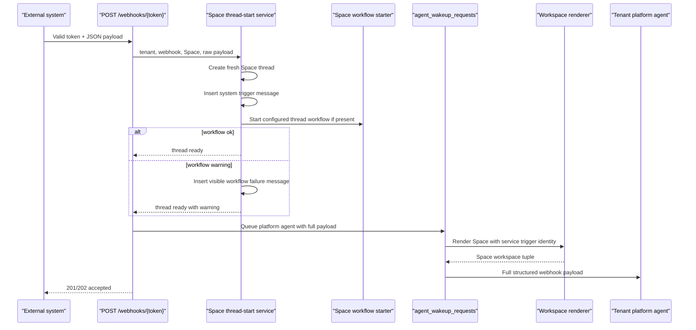

# feat: Add Space webhook thread starts

## Overview

Space-scoped agent webhooks should create useful, non-empty Space threads and then run any automatic Space thread-start workflow before the tenant platform agent is invoked. The first acceptance case is the existing Twenty Customer Stage webhook: a valid Customer-stage payload should create a Customer Space thread, seed a readable system trigger message, start Customer Onboarding goal and checklist state when configured, and wake the platform agent with the full structured webhook payload.

This plan keeps the generic webhook endpoint as the product entry point. It strengthens the runtime contract around thread creation, workflow initialization, delivery warnings, and private Space rendering without changing human Space membership rules.

---

## Problem Frame

The current generic webhook path can accept a valid webhook, create a thread, enqueue an agent wakeup, and still leave humans with an empty "preparing" thread if the wakeup fails before it inserts its synthetic message. The live Twenty Customer Stage case showed that exact failure: the delivery row looked successful, the thread existed in the Customer Space, but it had no messages, no Customer Onboarding metadata, no goal, no linked tasks, and the no-user webhook wakeup failed on private Space workspace access.

The origin requirements define a webhook configured on a Space as a machine trigger for that Space, not a fake human user. Private Space membership continues to gate configuration and viewing. Runtime execution should use an explicit system/service authority after the webhook has passed its token, enabled, tenant, and Space checks (see origin: `docs/brainstorms/2026-06-19-space-webhook-thread-start-requirements.md`).

---

## Requirements Trace

- R1. Space-configured webhooks execute as authorized system triggers for that Space.
- R2. Private Space membership remains a human configuration and viewing gate, not a post-configuration runtime blocker.
- R3. Inbound execution still requires enabled webhook rows, active Space rows, and existing webhook authentication checks.
- R4. Each valid Space webhook call creates a fresh thread in v1.
- R5. Webhook-created threads get an opening system/trigger message before agent invocation.
- R6. Opening messages are attributed to the webhook/system trigger.
- R7. Humans see a readable summary; raw payload stays in metadata and delivery history.
- R8. The platform agent is invoked after durable thread setup.
- R9. The agent receives the full structured webhook payload in turn context.
- R10. No-human webhook invocations render Space context without fabricated `USER.md` or user-scoped memory context.
- R11. Webhook-created Space threads participate in automatic Space thread-start workflow behavior.
- R12. Customer Onboarding starts deterministically when the Space is configured for it.
- R13. Workflow initialization failures are visible in the thread and webhook delivery history.
- R14. Created-thread-with-warning outcomes return accepted 201/202 responses, not retry-inducing non-2xx responses.
- R15. The existing Twenty Customer Stage webhook is the first acceptance case.
- R16. Successful Twenty deliveries must not leave empty threads with timed-out generic webhook turns.

**Origin actors:** A1 tenant operator, A2 external system, A3 Space participant, A4 tenant platform agent, A5 Space workflow starter.

**Origin flows:** F1 generic Space webhook creates an agent-ready thread, F2 Space workflow initializes on webhook-created thread, F3 workflow initialization fails visibly.

**Origin acceptance examples:** AE1 private Space webhook authority, AE2 non-empty readable system message, AE3 full payload to agent without fake user context, AE4 Customer Onboarding workflow initialization, AE5 visible workflow warning, AE6 live Twenty failure no longer recurs.

---

## Scope Boundaries

- No v1 event-level dedupe beyond the existing `x-idempotency-key` behavior. Repeated valid POSTs without an idempotency key still create fresh threads.
- No external payload-to-user mapping for attribution.
- No raw payload dump in the chat transcript.
- No redesign of provider-specific webhook routes such as `crm-opportunity`; those remain separate signed integration handlers.
- No new Space trigger builder UI unless implementation finds an existing setting must be exposed to satisfy the readable-summary contract.
- No database migration is expected for the core behavior. If implementation chooses a new delivery `resolution_status`, update comments, generated docs, and UI handling but do not add a schema migration unless a constraint is discovered.

---

## Context & Research

### Relevant Code and Patterns

- `packages/api/src/handlers/webhooks.ts` owns `POST /webhooks/{token}`, delivery logging, rate limiting, token resolution, idempotency, and agent/routine dispatch. Agent dispatch currently calls `ensureThreadForWork`, queues `agent_wakeup_requests`, and returns 201.
- `packages/database-pg/src/lib/thread-helpers.ts` is the shared auto-thread helper. It sets webhook threads to `backlog` and system attribution when no user id is supplied.
- `packages/api/src/graphql/resolvers/threads/createThread.mutation.ts` already detects Customer Onboarding Spaces and routes manual thread creation through `startCustomerOnboardingWorkflow`.
- `packages/api/src/lib/spaces/customer-onboarding-workflow.ts` creates deterministic Customer Onboarding threads, kickoff messages, goals, linked checklist tasks, progress markdown, and coordinator wakeups.
- `packages/api/src/handlers/wakeup-processor.ts` builds webhook agent messages with full payloads and inserts synthetic user messages for non-chat wakeups, but it inserts that message after workspace rendering, which is too late for failure visibility.
- `packages/api/src/handlers/chat-agent-invoke.ts`, `packages/api/src/handlers/wakeup-processor.ts`, and `packages/api/src/handlers/workspace-renderer.ts` wrap the workspace renderer Lambda. The renderer already supports `invokingServiceIdentity`; the current wakeup wrapper does not pass one.
- `packages/api/src/lib/workspace-renderer/space-membership-check.ts` and `packages/api/src/lib/workspace-renderer/compose-tuple.test.ts` already support private Space access for authorized service identities.
- `packages/database-pg/src/schema/webhook-deliveries.ts` and `packages/database-pg/graphql/types/webhooks.graphql` already expose `threadId`, `threadCreated`, `statusCode`, and `errorMessage` for operator audit. The current Settings query does not fetch `errorMessage`.
- `docs/plans/2026-05-21-005-feat-admin-space-studio-simplification-plan.md` planned Space-scoped webhooks only as far as persisting and propagating `space_id`. This plan completes the runtime behavior.

### Institutional Learnings

- `docs/solutions/workflow-issues/platform-agent-space-runtime-refactor-autopilot-sequencing-2026-05-23.md`: Space runtime and platform-agent changes should preserve a clear invariant and avoid collapsing authorization identities accidentally.
- `docs/solutions/logic-errors/thread-visibility-private-space-mention.md`: Space authorization is easy to over-broaden or over-constrain when coarse Space membership is mixed with narrower grants. This plan should use explicit service-trigger authority rather than weakening generic private Space checks.
- `docs/solutions/best-practices/inline-helpers-vs-shared-package-for-cross-surface-code-2026-04-21.md` is referenced by webhook shared code and supports extracting only when a fourth copy or real cross-surface duplication appears.

### External References

- None. Local webhook, Space, renderer, and onboarding patterns are direct enough that external research would add little practical guidance.

---

## Key Technical Decisions

- Use the generic token webhook endpoint as the acceptance path. The live Twenty workflow calls `POST /webhooks/{token}`, so fixing only the provider-specific `crm-opportunity` route would miss the bug.
- Add a small Space thread-start orchestration seam instead of putting workflow logic directly in `dispatchAgent`. The generic handler should validate and route; thread start behavior should be reusable by future schedule, email, or connector starts.
- Seed the opening system message before queuing the agent. This guarantees a non-empty audit record even if workspace rendering, budget checks, or AgentCore invocation fails later.
- Start Space workflows during thread start, not from agent inference. Customer Onboarding should be deterministic when the Space config says workflow `customer_onboarding`.
- Treat workflow-start failure after thread creation as degraded success. Return 202 or 201 with `warning`, set the delivery warning fields, write a visible system message, and still avoid encouraging external retries into duplicate threads.
- Pass a service identity to workspace rendering only for trusted automation sources that have already resolved a configured Space trigger. Do not pass fake user ids or grant no-user access globally.
- Treat webhook source as non-idempotent unless the caller supplies `x-idempotency-key`. Existing workflow-level dedupe by opportunity id must not collapse ordinary repeated valid webhook POSTs in v1.
- Preserve the full webhook payload in the wakeup payload and thread/message metadata, while keeping the human transcript summary compact.

---

## Open Questions

### Resolved During Planning

- Which webhook auth modes are retained? Keep the existing generic token and rate-limit behavior for `POST /webhooks/{token}`. Provider-specific HMAC routes stay separate.
- Where should the first readable summary come from? Use a built-in summary builder with optional webhook prompt/config override when present. The plan does not require new UI for v1.
- Which helper should become the shared thread-start seam? Add a new API-side Space thread-start service rather than expanding the database package helper with API-only workflow dependencies.
- What warning shape should be returned? Use accepted JSON with `ok`, `threadId`, `wakeupRequestId` when queued, and `warning` or `warnings` when workflow initialization degraded after thread creation.

### Deferred to Implementation

- Exact helper names and module boundaries: choose names that fit nearby API conventions while keeping workflow and webhook handler dependencies acyclic.
- Exact delivery `resolution_status` value for degraded success: prefer a clear status such as `degraded` if the UI and query handling accept it cleanly; otherwise keep `ok` with status 202 and `errorMessage` warning. Implementation should pick the least disruptive option after checking generated client expectations.
- Exact summary text template: keep the first version deterministic and concise, then refine copy during implementation if tests reveal a better fixture shape for Twenty payloads.

---

## High-Level Technical Design

> _This illustrates the intended approach and is directional guidance for review, not implementation specification. The implementing agent should treat it as context, not code to reproduce._

---

## Implementation Units

- U1. **Create a Space webhook thread-start service**

**Goal:** Centralize durable thread creation for agent-targeted Space webhooks, including readable system message insertion, raw payload metadata, and a result object that can carry workflow warnings.

**Requirements:** R4, R5, R6, R7, F1, AE2.

**Dependencies:** None.

**Files:**

- Create: `packages/api/src/lib/spaces/space-webhook-thread-start.ts`
- Test: `packages/api/src/lib/spaces/space-webhook-thread-start.test.ts`
- Modify: `packages/api/src/lib/thread-helpers.ts` only if the implementation needs a thin re-export or type alignment
- Reference: `packages/database-pg/src/lib/thread-helpers.ts`
- Reference: `packages/database-pg/src/schema/messages.ts`

**Approach:**

- Accept tenant id, agent id, webhook id/name/config, optional Space id, parsed payload, and optional prompt.
- Use `ensureThreadForWork` for the fresh thread so identifiers, channel, system attribution, and default Space fallback remain consistent.
- Insert an opening `messages` row before any agent wakeup. Use `role: "system"` or the closest existing system-trigger convention, `sender_type: "system"`, no human sender id, and metadata that records `source: "webhook"`, `webhookId`, and a compact payload reference or summary fields.
- Store the full parsed payload in thread and/or message metadata only where existing PII retention expectations allow it. Delivery history already stores body preview and hash; the agent wakeup payload remains the full agent-facing source.
- Generate a readable summary for humans. For Twenty-like payloads, the summary should include webhook name, event, company/customer/opportunity name when present, and stage/status when present. Fall back to a generic trigger summary for unknown payloads.

**Execution note:** Implement new domain behavior test-first so the first failing test proves webhook-created threads are no longer empty.

**Patterns to follow:**

- Thread creation through `packages/database-pg/src/lib/thread-helpers.ts`.
- Message insert and notification shape from `packages/api/src/graphql/resolvers/threads/createThread.mutation.ts`.
- Metadata parsing and conservative fallbacks from `packages/api/src/lib/spaces/customer-onboarding-workflow.ts`.

**Test scenarios:**

- Covers AE2. Happy path: valid webhook input creates one `webhook` channel thread and inserts one opening system-trigger message before returning.
- Happy path: Twenty-style payload summary includes the webhook name, Customer-stage event, opportunity/company names when present, and does not dump raw JSON into `content`.
- Edge case: empty payload still creates a non-empty generic opening message.
- Edge case: payload with very long string fields is summarized within a bounded transcript length while preserving the full payload for wakeup context.
- Error path: thread creation failure returns a typed failure and does not attempt message insertion.
- Error path: message insertion failure is surfaced as a hard pre-wakeup error because the contract requires a non-empty thread before agent invocation.

**Verification:**

- A webhook thread can be inspected immediately after the service returns and contains a readable system trigger message with webhook metadata.

---

- U2. **Start configured Space workflows from webhook-created threads**

**Goal:** Make webhook-created Space threads participate in automatic Space thread-start workflow behavior, with Customer Onboarding as the concrete v1 workflow.

**Requirements:** R11, R12, R15, F2, AE4.

**Dependencies:** U1.

**Files:**

- Modify: `packages/api/src/lib/spaces/space-webhook-thread-start.ts`
- Test: `packages/api/src/lib/spaces/space-webhook-thread-start.test.ts`
- Reference: `packages/api/src/graphql/resolvers/threads/createThread.mutation.ts`
- Reference: `packages/api/src/lib/spaces/customer-onboarding-workflow.ts`
- Test: `packages/api/src/lib/spaces/customer-onboarding-workflow.test.ts` if source/workflow behavior needs a focused regression

**Approach:**

- Resolve the target Space row when `webhook.space_id` is present and ensure it belongs to the webhook tenant and is active.
- Detect Customer Onboarding using the same criteria as manual thread creation: Space kind, template key, or config workflow normalized to `customer_onboarding`.
- For Customer Onboarding, call `startCustomerOnboardingWorkflow` with `source: "webhook"`, `startedBy: { type: "system" }`, and the parsed webhook payload as opportunity data.
- Preserve R4's fresh-thread contract for webhook source. The existing Customer Onboarding workflow's `findExistingThread` path dedupes by `opportunityId`; implementation should add an explicit workflow option or repository path that bypasses opportunity-id reuse for generic webhook starts unless the generic webhook idempotency layer has already identified the POST as a replay.
- Avoid duplicate thread creation. The existing onboarding workflow currently creates its own case thread, so implementation should choose one of two coherent paths:
  - preferred: extend the workflow starter/repository to initialize an already-created thread; or
  - acceptable if smaller: let Customer Onboarding own thread creation for that workflow Space and have U1 handle generic non-workflow Spaces only.
- Whichever path is chosen, the final returned thread id must be the one recorded on the delivery row and passed into the wakeup.

**Technical design:** Directional decision matrix:

| Space config                        | Thread start behavior                                                                                    |
| ----------------------------------- | -------------------------------------------------------------------------------------------------------- |
| No workflow                         | U1 creates generic webhook thread and opening message                                                    |
| `customer_onboarding` workflow      | Customer Onboarding initializes the thread, goal, checklist, and kickoff artifacts deterministically     |
| Workflow configured but unsupported | Create generic webhook thread, insert visible unsupported-workflow warning, return accepted with warning |

**Patterns to follow:**

- `createCustomerOnboardingThreadFromSpaceTrigger` in `packages/api/src/graphql/resolvers/threads/createThread.mutation.ts`.
- `shouldUseNativeChecklist` and native checklist seeding in `packages/api/src/lib/spaces/customer-onboarding-workflow.ts`.

**Test scenarios:**

- Covers AE4. Happy path: a webhook payload sent to a Customer Onboarding Space calls the onboarding workflow with `source: "webhook"` and returns the workflow-created or workflow-initialized thread id.
- Happy path: Customer Space config with `workflow: "customer_onboarding"` is sufficient even if older config lacks `checklistSystemOfRecord`.
- Happy path: native ThinkWork checklist rows are created when the Space config or manual fallback requires native checklist behavior.
- Covers R4. Edge case: two valid webhook POSTs for the same opportunity id create two fresh threads when no `x-idempotency-key` replay is involved.
- Edge case: generic custom Space with no workflow does not call Customer Onboarding and still creates a generic webhook thread.
- Error path: Customer Onboarding validation failure after thread creation is converted to a workflow warning when possible, not a silent wakeup-only failure.
- Integration: the returned thread id is the same id used for delivery logging and agent wakeup payload.

**Verification:**

- A Twenty Customer Stage webhook into the Customer Space creates a thread with Customer Onboarding metadata, goal state, and linked checklist tasks before the agent wakeup runs.

---

- U3. **Update generic webhook agent dispatch to use the thread-start contract**

**Goal:** Replace the current `dispatchAgent` best-effort thread creation path with the new durable thread-start service and accepted-with-warning response contract.

**Requirements:** R1, R3, R8, R9, R13, R14, R15, R16, F1, F3, AE1, AE3, AE5, AE6.

**Dependencies:** U1, U2.

**Files:**

- Modify: `packages/api/src/handlers/webhooks.ts`
- Test: `packages/api/src/handlers/webhooks.space.test.ts`
- Test: `packages/api/src/__tests__/webhook-crm-opportunity.test.ts` only for non-regression of the provider-specific route if shared fixtures are touched
- Modify: `packages/database-pg/src/schema/webhook-deliveries.ts` comments only if a new degraded status is used
- Modify: `packages/database-pg/graphql/types/webhooks.graphql` comments only if a new degraded status is documented

**Approach:**

- In `dispatchAgent`, call the Space thread-start service before inserting `agent_wakeup_requests`.
- Keep existing token lookup, enabled check, rate limit, JSON parsing, idempotency lookup, and `webhooks.invocation_count` update semantics.
- Set `record.thread_id`, `record.thread_created`, `record.status_code`, `record.error_message`, and `record.resolution_status` consistently for success and degraded success.
- Build the wakeup payload from the thread-start result. Include `threadId`, `spaceId`, `webhookPayload`, `webhookId`, `webhookName`, the readable summary, and a flag such as `openingMessageAlreadyPersisted` so the wakeup processor can avoid inserting duplicate transcript content.
- Return 201 when thread setup and workflow initialization are clean. Return 202 with `warning` or `warnings` when the thread exists but workflow initialization degraded.
- If thread/message creation fails before a durable thread record exists, keep returning a normal error response because external retry is still useful.

**Execution note:** Start with a failing handler-level test that reproduces the live Twenty shape: valid agent webhook with `space_id`, Customer payload, and expected non-empty thread/workflow/wakeup output.

**Patterns to follow:**

- Delivery accumulator pattern in `packages/api/src/handlers/webhooks.ts`.
- Existing `webhook_idempotency` behavior in `dispatchAgent`.
- GraphQL webhook delivery mapper tests in `packages/api/src/graphql/resolvers/webhooks/webhookDeliveries.query.test.ts`.

**Test scenarios:**

- Covers AE1. Happy path: enabled Space-scoped agent webhook with valid token and private Space id is accepted without a user id.
- Covers AE3. Happy path: wakeup payload contains full `webhookPayload`, `threadId`, and `spaceId`.
- Covers AE5. Error path: workflow initialization warning after thread creation returns 202, records `thread_id`, records warning details, and does not return a non-2xx response.
- Covers AE6. Integration: Twenty Customer Stage payload creates or returns a Customer Onboarding thread id, queues one agent wakeup, and never leaves `thread_created` false after success.
- Edge case: webhook without `space_id` still creates a default/general webhook thread with the new opening-message contract.
- Error path: invalid JSON remains 400 and does not create a thread or wakeup.
- Error path: disabled or unknown token remains 404 and does not leak tenant or Space information.
- Edge case: idempotency replay still returns the existing idempotency response and does not create a second fresh thread.

**Verification:**

- The generic token endpoint returns an accepted response whose body and delivery row identify the created thread and any warning.

---

- U4. **Propagate service-trigger authority into no-user Space rendering**

**Goal:** Allow trusted webhook automation wakeups to render private Space context through the existing service identity path, without making all no-user invocations private-Space capable.

**Requirements:** R1, R2, R10, F1, AE1, AE3.

**Dependencies:** U3.

**Files:**

- Modify: `packages/api/src/handlers/wakeup-processor.ts`
- Modify: `packages/api/src/handlers/chat-agent-invoke.ts` only if shared wrapper types need parity
- Modify: `packages/api/src/lib/workspace-renderer/space-membership-check.ts`
- Modify: `packages/api/src/lib/workspace-renderer/types.ts` only if the renderer input type needs a more explicit service-trigger field
- Test: `packages/api/src/lib/workspace-renderer/space-membership.test.ts`
- Test: `packages/api/src/lib/workspace-renderer/compose-tuple.test.ts`
- Test: `packages/api/src/handlers/wakeup-processor.system-prompt.test.ts` or add `packages/api/src/handlers/wakeup-processor.webhook.test.ts`
- Test: `packages/api/src/handlers/chat-agent-invoke.identity.test.ts`
- Test: `packages/api/src/handlers/__tests__/workspace-renderer.test.ts`
- Reference: `packages/api/src/lib/workspace-renderer/space-membership-check.ts`
- Reference: `packages/api/src/lib/workspace-renderer/compose-tuple.test.ts`

**Approach:**

- Extend `renderWorkspaceTupleForWakeup` and, if needed, `renderWorkspaceTupleForInvoke` to pass `invokingServiceIdentity` to the renderer Lambda.
- Use a deterministic service identity for configured Space triggers that is not shaped like a human user id, such as a namespaced `space-trigger` identity tied to tenant id and Space id. Do not use the webhook payload owner, the webhook creator, a tenant user, or the agent's paired human.
- Update private Space access checking so this service identity is allowed only when it matches the active tenant and Space being rendered. The current service-identity hook still routes through `spaceMembers`; that is not sufficient for R1/R2 because configured webhooks should not require fake membership rows.
- Gate service identity propagation on trusted automation context: wakeup source `webhook`, persisted `spaceId`, known webhook id in `trigger_detail` or payload, and system requester attribution.
- Preserve denial for no-user calls that are not configured Space triggers.
- Keep `userId` null for no-human automation so user-scoped memory/tools do not see a fabricated human.

**Patterns to follow:**

- Service identity allowance in `packages/api/src/lib/workspace-renderer/space-membership-check.ts`.
- Existing no-fake-user identity handling in `packages/api/src/handlers/wakeup-processor.ts`.
- Renderer payload pass-through in `packages/api/src/handlers/workspace-renderer.ts`.

**Test scenarios:**

- Covers AE1. Happy path: webhook wakeup for a private Space passes an invoking service identity and the renderer returns a rendered tuple.
- Covers AE3. Happy path: the AgentCore payload still has no `user_id`/current user for webhook automation while Space rendering succeeds.
- Error path: a service identity namespaced to one Space is denied when used to render another Space.
- Error path: a no-user non-webhook wakeup for a private Space still fails with `SpaceAccessDenied`.
- Error path: webhook wakeup without persisted Space id does not receive private Space service authority.
- Integration: renderer wrapper serializes `invokingServiceIdentity` in the Lambda payload.

**Verification:**

- The live class of webhook wakeup no longer fails with `workspace_renderer_access_denied`, and private Space access is still denied for untrusted no-user invocations.

---

- U5. **Align wakeup transcript behavior with pre-seeded webhook messages**

**Goal:** Prevent duplicate or raw JSON webhook transcript messages while preserving full payload access for the agent turn.

**Requirements:** R5, R7, R8, R9, R16, AE2, AE3, AE6.

**Dependencies:** U3.

**Files:**

- Modify: `packages/api/src/handlers/wakeup-processor.ts`
- Test: `packages/api/src/handlers/wakeup-processor.system-prompt.test.ts` or add `packages/api/src/handlers/wakeup-processor.webhook.test.ts`
- Reference: `packages/api/src/__tests__/workspace-wakeup-payload.test.ts`

**Approach:**

- Continue building `agentMessage` for webhook wakeups with the full structured payload enclosed in agent-only context.
- When the wakeup payload says the opening webhook message is already persisted, skip the generic synthetic user-message insert for that webhook turn.
- If no pre-seeded message flag exists, preserve existing fallback insertion for backward compatibility with older queued wakeups.
- Ensure assistant response posting behavior for webhook wakeups remains unchanged except that it should attach to the correct pre-created thread.

**Patterns to follow:**

- Current `case "webhook"` message construction in `packages/api/src/handlers/wakeup-processor.ts`.
- Existing chat-message source skip for already-inserted user messages.

**Test scenarios:**

- Covers AE2. Happy path: webhook wakeup with pre-seeded opening message does not insert a second user-visible raw JSON message.
- Covers AE3. Happy path: agent invocation payload still includes the full webhook payload even when transcript insertion is skipped.
- Edge case: legacy queued webhook wakeup without the pre-seeded flag still inserts a synthetic message so old queued work remains inspectable.
- Error path: if AgentCore returns an assistant response, webhook response posting still creates the assistant message in the thread.

**Verification:**

- Humans see one readable system trigger message, not a raw JSON dump plus a second agent prompt message.

---

- U6. **Expose degraded delivery warnings to operators and update docs**

**Goal:** Make created-with-warning outcomes visible in webhook delivery history and document the Space webhook contract.

**Requirements:** R7, R13, R14, R15, F3, AE5, AE6.

**Dependencies:** U3.

**Files:**

- Modify: `apps/web/src/lib/settings-queries.ts`
- Modify: `apps/web/src/components/settings/SettingsWebhookDetail.tsx`
- Regenerate: `apps/web/src/gql/graphql.ts`
- Regenerate: `apps/web/src/gql/gql.ts`
- Modify: `docs/src/content/docs/applications/admin/webhooks.mdx`
- Modify: `docs/src/content/docs/concepts/spaces/triggers-and-channels.mdx`
- Modify: `docs/src/content/docs/applications/admin/spaces/triggers.mdx`
- Test: `packages/api/src/graphql/resolvers/webhooks/webhookDeliveries.query.test.ts` if warning fields or status mapping changes
- Test: add or update an existing `apps/web` component/query test if one exists for Settings webhook deliveries

**Approach:**

- Fetch `errorMessage`, `threadId`, and `statusCode` in the Settings webhook deliveries query if they are not already present.
- Show a clear warning/degraded badge or detail line when a delivery created a thread but had workflow initialization warnings.
- Keep raw body preview and full delivery details admin-tier only. Do not add raw payload rendering to the thread transcript.
- Update docs to say Space webhooks create fresh Space threads, seed system trigger messages, start configured thread workflows, and return accepted-with-warning responses when workflow init fails after thread creation.

**Patterns to follow:**

- Existing Settings webhook delivery list in `apps/web/src/components/settings/SettingsWebhookDetail.tsx`.
- Existing docs language in `docs/src/content/docs/concepts/spaces/triggers-and-channels.mdx`.

**Test scenarios:**

- Covers AE5. Happy path: a delivery row with `threadCreated`, 202, and `errorMessage` renders as accepted with warning rather than as a generic success or destructive failure.
- Happy path: clean 201 delivery still renders as successful.
- Edge case: older rows without `errorMessage` still render without layout changes.
- Documentation verification: docs describe generic Space webhook behavior and the Twenty Customer Stage acceptance shape without implying provider-specific webhook routes are required.

**Verification:**

- Operators can distinguish clean, failed, and accepted-with-warning webhook deliveries from the Settings detail page.

---

## System-Wide Impact

- **Interaction graph:** `POST /webhooks/{token}` now coordinates thread creation, message insertion, optional Space workflow initialization, wakeup queueing, workspace rendering, AgentCore invocation, delivery history, Settings UI, and Space trigger docs.
- **Error propagation:** Pre-thread failures remain normal error responses. Post-thread workflow warnings become accepted-with-warning responses, visible thread messages, and delivery warning fields. Renderer private-Space denial remains fatal only when no trusted service authority exists.
- **State lifecycle risks:** The critical partial-write boundary is thread created but workflow failed. The plan requires a visible message and delivery warning to prevent silent "preparing" states and retry-induced duplicate threads.
- **API surface parity:** Generic webhooks and provider-specific HMAC webhooks remain separate. This plan changes only the generic token endpoint for agent targets and the shared wakeup/rendering path it uses.
- **Integration coverage:** Handler-level tests must cover webhook endpoint plus thread-start service plus wakeup payload shape. Unit tests alone in the service are not sufficient.
- **Unchanged invariants:** Human private Space membership still controls viewing and configuration. Webhook payloads cannot choose message attribution or impersonate users. No-human automation must not get user-scoped memory context.

---

## Risks & Dependencies

| Risk                                                                              | Mitigation                                                                                                                                                                                                                                         |
| --------------------------------------------------------------------------------- | -------------------------------------------------------------------------------------------------------------------------------------------------------------------------------------------------------------------------------------------------- |
| Service identity accidentally broadens private Space access                       | Use a namespaced tenant+Space service identity, validate it against the exact Space being rendered, gate propagation on webhook source plus persisted webhook/Space context, and keep denial tests for other Spaces and non-webhook no-user calls. |
| Customer Onboarding creates one thread while generic webhook creates another      | In U2, choose one owner for Customer workflow thread creation and assert the same returned thread id is used in delivery and wakeup payloads.                                                                                                      |
| Customer Onboarding opportunity-id dedupe violates fresh-thread webhook semantics | Add an explicit non-deduping workflow path for generic webhook starts and keep existing idempotent behavior only for callers that deliberately request it, such as provider-specific routes or generic webhook `x-idempotency-key` replays.        |
| Delivery status changes break Settings UI assumptions                             | Prefer additive `errorMessage` and 202 handling; if adding a `degraded` status, update query, UI, docs, and tests together.                                                                                                                        |
| Raw webhook payload leaks into chat transcript                                    | Test readable summary separately from full wakeup payload; skip synthetic raw JSON transcript insertion for pre-seeded webhook messages.                                                                                                           |
| Existing queued webhook wakeups regress                                           | Keep fallback behavior for wakeups without the new pre-seeded flag.                                                                                                                                                                                |
| External systems retry into duplicate threads after workflow warnings             | Return 201/202 accepted once a thread exists, and make warning details visible to operators.                                                                                                                                                       |

---

## Documentation / Operational Notes

- Update docs to describe Space webhooks as machine triggers that create fresh Space threads and run configured thread-start workflows.
- Document accepted-with-warning behavior so operators know a 202 does not mean the external sender should blindly retry.
- After implementation, verify the managed Twenty CRM Closed Won/Customer-stage workflow against dev: the ThinkWork delivery row should link to a non-empty Customer Space thread with onboarding goal/checklist state.

---

## Sources & References

- Origin document: `docs/brainstorms/2026-06-19-space-webhook-thread-start-requirements.md`
- Related plan: `docs/plans/2026-05-21-005-feat-admin-space-studio-simplification-plan.md`
- Generic webhook handler: `packages/api/src/handlers/webhooks.ts`
- Thread helper: `packages/database-pg/src/lib/thread-helpers.ts`
- Customer Onboarding workflow: `packages/api/src/lib/spaces/customer-onboarding-workflow.ts`
- Manual Customer Onboarding thread path: `packages/api/src/graphql/resolvers/threads/createThread.mutation.ts`
- Wakeup processor: `packages/api/src/handlers/wakeup-processor.ts`
- Workspace renderer handler: `packages/api/src/handlers/workspace-renderer.ts`
- Space membership check: `packages/api/src/lib/workspace-renderer/space-membership-check.ts`
- Webhook delivery schema: `packages/database-pg/src/schema/webhook-deliveries.ts`
- Admin webhook settings: `apps/web/src/components/settings/SettingsWebhookDetail.tsx`
- Docs: `docs/src/content/docs/concepts/spaces/triggers-and-channels.mdx`
