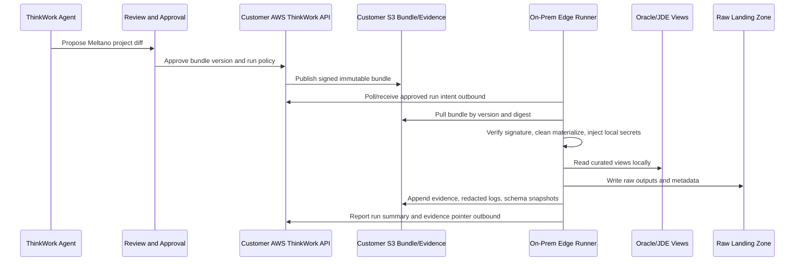
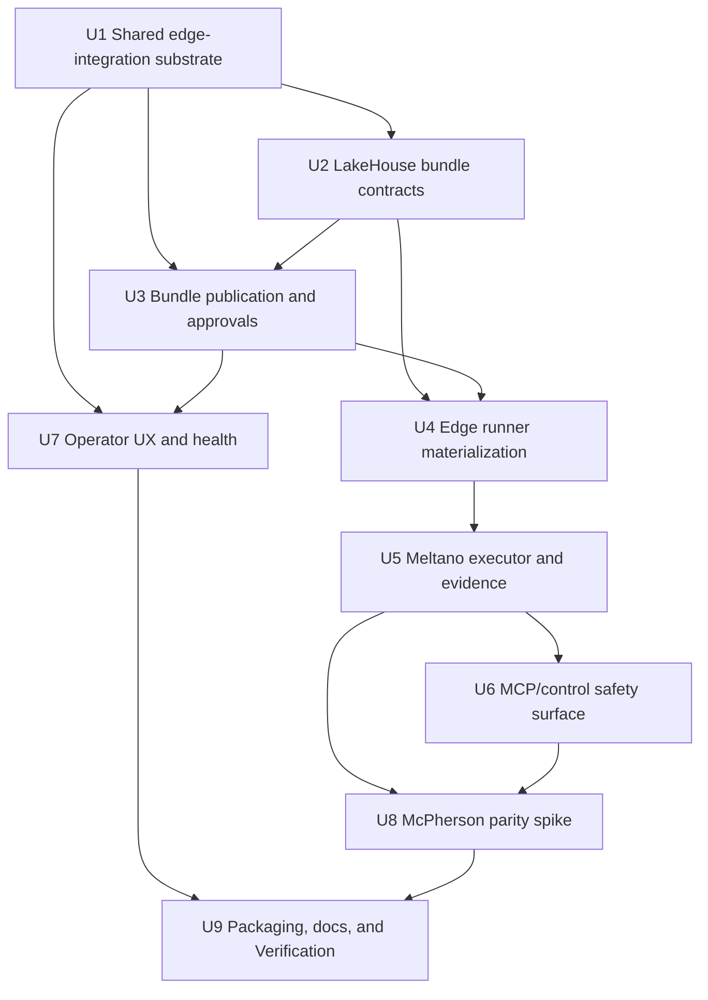

# feat: Add Meltano Edge Runner for LakeHouse Integrations

## Overview

Build the first LakeHouse runtime slice as a ThinkWork-owned Edge Integration
Runner for McPherson/JDE sales extracts. ThinkWork remains the control twenty:
agents author Meltano project changes through a Git-backed review path, the
approved config is published as a signed immutable S3 artifact bundle in the
customer AWS account, the on-prem runner pulls and verifies that bundle before
each run, and ThinkWork receives structured evidence without seeing Oracle row
payloads or raw local credentials.

Meltano is the local execution substrate, not a customer-facing product. The
work extends the existing `lakehouse` plugin package and should start with a
representative McPherson sales slice that can be shadow-run beside Fivetran
before broadening into a reusable integration substrate.

---

## Problem Frame

McPherson currently polls JDE/Oracle hourly and extracts roughly 1.5M sales
rows per month. That shape does not justify a heavy self-managed replication
platform or true redo-log CDC parity for v1. The approved direction is a
code-first, reviewable Meltano project bundle that ThinkWork can author, diff,
approve, publish, run locally near Oracle/JDE, and evaluate through run
evidence (see origin:
`docs/brainstorms/2026-06-19-meltano-edge-runner-requirements.md`).

The current repo already has the right product boundary for this: the
`lakehouse` first-party plugin shell exists, application plugin source should
remain package-owned, and deployment/evidence patterns already use immutable
artifacts, S3 evidence, status pointers, and approval gates. The missing
platform shape is the edge-integration substrate itself: bundle contracts,
customer-AWS publication, runner identity, evidence storage, Meltano-safe
operation, and the first parity proof.

---

## Requirements Trace

- R1. Extend the existing `lakehouse` plugin identity; do not create a second
  product, catalog key, or local-only path.
- R2. Keep ThinkWork as the integration brain and Meltano as local execution.
- R3. Persist desired state, approved bundle version, approval state, run
  policy, evidence, health summaries, and remediation workflow in ThinkWork.
- R4. Keep configuration reviewable as source diffs before execution.
- R5. Define a generated Meltano project bundle shape covering `meltano.yml`,
  environments, plugins, jobs, state/log conventions, destination handoff, and
  dbt/Dagster metadata.
- R6. Use Git-backed review for canonical authoring.
- R7. Publish runner-consumed config as signed immutable S3 artifact bundles in
  customer AWS for v1.
- R8. Pull into a clean local work directory before each run, verify identity
  and digest/signature, and record bundle version plus digest in evidence.
- R9. Reject local runner edits as canonical configuration changes.
- R10. Separate non-sensitive bundle config from local sensitive runtime values.
- R11. Pin or record connector/plugin/runtime versions in evidence.
- R12. Gate state summaries and state recovery controls by policy and explicit
  approval.
- R13. Prefer curated Oracle/JDE extract views or tables.
- R14. Require stable business keys, cursor fields, source/extract timestamps,
  and expected stream names for every selected extract.
- R15. Define rolling-window reconciliation and delete/reversal handling.
- R16. Preserve raw landing metadata for replay and audit.
- R17. Keep the runner outbound-only by default.
- R18. Inject local secrets from customer-approved local sources; ThinkWork
  stores references and policy, not raw Oracle credentials.
- R19. Upload raw outputs to customer AWS and report evidence without source row
  payloads in ThinkWork control-twenty storage.
- R20. Provide read-only MCP/control tools for version, project inspection,
  inventory, catalog/stream introspection, logs, state, schema, and evidence.
- R21. Gate write-capable tools by mode, policy, and allowlists; never expose
  arbitrary shell or unrestricted Meltano CLI execution.
- R22. Use structured MCP success/error envelopes, secret redaction, and audit
  JSONL for write operations.
- R23. Spike 5-10 representative JDE sales views/tables beside Fivetran.
- R24. Compare row counts, freshness, cursor/update handling, late corrections,
  deletes/reversals, schema drift, failed-run recovery, and downstream dbt
  output.
- R25. Decide after the spike whether the runner remains McPherson-specific for
  the next slice or graduates into a reusable substrate.

**Origin actors:** A1 ThinkWork integration designer, A2 McPherson data/platform
owner, A3 on-prem edge operator, A4 ThinkWork agent, A5 LakeHouse implementer.

**Origin flows:** F1 author and approve an integration bundle, F2 run the
approved bundle on the edge, F3 inspect/remediate/audit through MCP, F4
shadow-run against Fivetran.

**Origin acceptance examples:** AE1 reviewable LakeHouse bundle diff, AE2
pull-before-run signed S3 artifact verification, AE3 JDE extract contract, AE4
outbound runner with local secrets and structured evidence, AE5 safe MCP
inspection/write gating, AE6 Fivetran parity report.

---

## Scope Boundaries

- Do not attempt true redo-log CDC parity in v1.
- Do not expose on-prem Oracle/JDE directly to ThinkWork cloud.
- Do not require customer VPN or inbound firewall access for the default
  architecture.
- Do not expose arbitrary shell execution, unrestricted Meltano CLI execution,
  or unbounded filesystem access through MCP.
- Do not make Meltano the customer-facing product UI.
- Do not make local runner state or local project edits the canonical
  integration definition.
- Do not adopt `butkeraites/meltano-mcp-server` wholesale; borrow safety and
  inspection ideas for a ThinkWork-owned control surface.
- Do not introduce Kubernetes, Docker Compose, GCP, or Azure assumptions into
  the default ThinkWork LakeHouse architecture.
- Do not expand beyond a representative McPherson sales slice until the parity
  report is reviewed.

### Deferred to Follow-Up Work

- Generalizing this substrate beyond LakeHouse/McPherson after the parity
  report.
- True redo-log CDC, LogMiner-based CDC, or full Airbyte replacement claims.
- A public marketplace or third-party edge-runner plugin authoring path.
- Fully rendered plugin UI-surface framework if the first slice can ship with
  ordinary Settings/Plugins and LakeHouse-specific route surfaces.

---

## Context & Research

### Relevant Code and Patterns

- `plugins/lakehouse/src/manifest.ts` and `plugins/lakehouse/README.md` define
  the existing LakeHouse plugin shell and explicitly defer runtime capability.
- `plugins/catalog/src/contracts.ts` defines v1 plugin component contracts,
  including `infrastructure`, `mcp-server`, `skills`, and declared-only
  `ui-surface` components.
- `packages/api/src/lib/plugins/engine.ts` owns install/component lifecycle and
  parks infrastructure components behind deployment approval; this should be
  reused only for install/deployment orchestration, not as the edge-runner
  runtime state machine.
- `packages/api/src/lib/plugins/handlers/infra.ts` and
  `packages/database-pg/src/schema/deployments.ts` show the current deployment
  job/evidence model: idempotent jobs, approval gates, manifest digests, plan
  summaries, evidence bucket/prefix pointers, and reconciliation from evidence.
- `packages/api/src/lib/plugins/handlers/mcp.ts` shows plugin-owned MCP rows,
  endpoint indirection through managed applications, user-scoped auth, and
  URL/auth hash pinning.
- `packages/deployment-runner/src/apps/registry.ts` currently admits only
  `cognee`, `twenty`, and `twenty`; LakeHouse runtime work must not fake an
  unsupported `managedAppKey` without adding a real adapter or choosing a
  non-infrastructure plugin slice.
- `packages/database-pg/src/schema/deployments.ts` and deployment resolvers
  provide useful evidence patterns, but edge integration state should use
  provider-neutral names such as `edge_integration_*` where shared storage is
  needed, with LakeHouse-specific behavior kept inside `plugins/lakehouse/`.
- `docs/verification/mcpherson-lakehouse-plugin-builder-proof.md` previously
  recorded the adapter gap for LakeHouse-shaped Terraform and recommended a
  smaller slice or dedicated adapter work before publishing runtime manifests.

### Institutional Learnings

- `docs/solutions/architecture-patterns/plugin-source-boundaries-package-owned-deploy-verified-2026-06-17.md`
  requires first-party plugin behavior to live under `plugins/<plugin-key>/`,
  shared registries to be generated, and deployed install behavior to be proven
  through ThinkWork rather than direct mutation.
- `docs/solutions/architecture-patterns/terraform-plugin-builder-skills-stop-at-adapter-gaps-2026-06-14.md`
  says generated infrastructure manifests must stop at unsupported
  deployment-runner adapter gaps instead of inventing `managedAppKey` values.
- `docs/solutions/architecture-patterns/github-free-customer-deployments-aws-control-twenty-pattern-2026-06-06.md`
  establishes the AWS-native pattern: customer AWS owns steady-state authority,
  S3 stores artifacts/evidence, and operations are visible through jobs and
  approvals.
- `docs/solutions/architecture-patterns/release-manifest-deployment-status-contract-2026-06-11.md`
  separates immutable release/artifact inputs from deployed status pointers;
  LakeHouse bundles should mirror that distinction.
- `docs/solutions/integration-issues/lastmile-plugin-install-blocked-by-missing-context-md-2026-06-17.md`
  reinforces that application-plugin verification must prove the user-facing
  install path and component convergence, not merely local source validity.

### External References

- Meltano docs describe projects as text-based source-of-truth directories with
  `meltano.yml`, jobs, schedules, environments, plugin config, `.env` for
  sensitive/environment-specific values, `.meltano` as environment-local
  runtime state, and state backends for pipeline state.
- Meltano Hub lists `tap-oracle` and variants with catalog/discover/state
  capabilities, but the requirements and community history make connector
  maturity a spike validation item rather than an assumption.
- Prior art `butkeraites/meltano-mcp-server` is useful only as a safety pattern
  reference: allowlists, path sandboxing, redaction, read-only defaults, and
  structured tool responses. The implementation should be ThinkWork-owned.

---

## Key Technical Decisions

- **Name shared storage and API substrate around edge integrations, not only
  LakeHouse.** The first product is LakeHouse, but using provider-neutral
  `edge_integration_*` storage keeps shared schema/API code from becoming a
  plugin-specific source-boundary exception and gives R25 a path to reuse.
- **Keep authored source under `plugins/lakehouse`.** Bundle schemas, sample
  Meltano project layout, runner/MCP runtime code, package-owned smokes, and
  LakeHouse docs belong in the plugin package. Shared packages should expose
  only generic storage, artifact, approval, and GraphQL contracts.
- **Do not make an infrastructure component the first runner delivery path.**
  The on-prem runner is not an AWS managed application. The v1 artifact should
  be a package-owned runner binary/container plus operator installation docs and
  outbound registration, while the plugin install remains the tenant product
  identity. A future AWS deployment adapter can be added only if a later
  requirement turns the runner into customer-AWS-managed infrastructure.
- **Use signed immutable S3 bundles as the runner-consumed source of truth.**
  Git remains the review/authoring path; runner execution consumes only a
  signed customer-AWS S3 bundle with manifest, digest/signature, source commit,
  approved actor, and bundle version.
- **Make evidence append-only and payload-light.** Evidence should record
  bundle identity, run identity, connector versions, schema snapshots, row
  counts, windows, state summaries, freshness, errors, redacted logs, and raw
  landing pointers. It should not copy Oracle credentials or source row
  payloads into ThinkWork storage.
- **Treat Meltano CLI access as an allowlisted executor, not a shell.** The
  runner may invoke Meltano operations through a narrow argv builder and a
  sandboxed project directory. MCP/control tools should never accept raw shell
  fragments or arbitrary CLI arguments.
- **Make the first spike characterization-heavy.** Oracle/JDE cursor semantics,
  tap maturity, late corrections, deletes/reversals, and Fivetran parity are
  not knowable from static planning. The implementation should build
  characterization tests and a parity report before expanding the slice.

---

## Open Questions

### Resolved During Planning

- **What exact S3 bundle shape should the runner consume?** Use a signed
  immutable artifact bundle with a manifest containing schema version,
  integration key, bundle version, source commit, approved actor, approved time,
  `meltano.yml` digest, project file digests, extractor/loader/runtime version
  pins or resolved versions, expected streams, raw destination contract, and
  signature metadata. The exact signature implementation can use the repo's
  release/catalog signing pattern where available, but the runner contract must
  be digest-first and fail-closed.
- **Which ThinkWork mechanism publishes bundles and receives evidence?** Use
  the deployed customer AWS control twenty/API to publish tenant-scoped bundles
  into customer S3 and receive evidence through GraphQL/API plus S3 evidence
  pointers. Do not make ThinkWork cloud reach into on-prem Oracle/JDE.
- **Which MCP tools belong in the first spike?** Include read-only inspection
  tools first (`version`, `project_summary`, `plugins`, `jobs`, `catalog`,
  `selected_streams`, `state_summary`, `recent_logs`, `run_evidence`) and gate
  write/run tools (`accept_bundle`, `test_plugin_config`, `run_job`,
  `recover_state`, `rerun_window`) by explicit policy, mode, allowlist, and
  audit event.
- **What parity query set is required?** The plan defines row count, freshness,
  cursor/update, late correction, delete/reversal, schema drift, failed-run
  recovery, and downstream dbt output comparisons. The exact SQL per selected
  JDE view is an implementation-time collaboration with McPherson because it
  depends on the final curated extract views.

### Deferred to Implementation

- Final `tap-oracle` variant or custom Singer tap choice: decide after a
  focused spike against representative McPherson views and local driver/wallet
  constraints.
- Exact runner deployment packaging: package-owned binary/container and
  systemd/task scheduler shape can be selected with the on-prem operator once
  target host constraints are known, provided outbound-only and artifact
  verification requirements remain intact.
- Exact signing key storage and rotation details: align with the existing
  catalog/release signing implementation and customer AWS KMS/Secrets Manager
  policy during implementation.
- Exact Fivetran parity SQL: derive from the selected 5-10 sales views and the
  existing downstream dbt models.

---

## Output Structure

```text
plugins/lakehouse/
  src/
    edge-integration/
      bundle-contract.ts
      extract-contract.ts
      evidence-contract.ts
      policy-contract.ts
      manifest.ts
    runner/
      README.md
      src/
      test/
    mcp/
      src/
      test/
    parity/
      README.md
      fixtures/
      test/
  smoke/
    lakehouse-edge-runner-smoke.mjs
packages/database-pg/src/schema/
  edge-integrations.ts
packages/api/src/graphql/resolvers/
  edge-integrations/
packages/api/src/lib/
  edge-integrations/
apps/web/src/
  routes/settings/plugins/lakehouse*.tsx
docs/verification/
  mcpherson-meltano-edge-runner-parity.md
```

The tree shows the intended ownership shape, not a rigid implementation
constraint. Shared files should stay provider-neutral; LakeHouse-specific
runtime behavior should stay under `plugins/lakehouse/`.

---

## High-Level Technical Design

> _This illustrates the intended approach and is directional guidance for
> review, not implementation specification. The implementing agent should treat
> it as context, not code to reproduce._



---

## Implementation Units



- U1. **Shared edge-integration substrate**

**Goal:** Add provider-neutral persistence and GraphQL/API contracts for edge
integration definitions, approved bundle versions, runner registrations, run
records, evidence pointers, health summaries, and policy decisions.

**Requirements:** R1, R2, R3, R7, R8, R12, R17, R19; F1, F2, F3; AE1, AE2,
AE4, AE5.

**Dependencies:** None.

**Files:**

- Create: `packages/database-pg/src/schema/edge-integrations.ts`
- Modify: `packages/database-pg/src/schema/index.ts`
- Create: `packages/database-pg/graphql/types/edge-integrations.graphql`
- Create: `packages/api/src/graphql/resolvers/edge-integrations/index.ts`
- Create: `packages/api/src/lib/edge-integrations/store.ts`
- Create: `packages/api/src/lib/edge-integrations/policy.ts`
- Test: `packages/api/src/graphql/resolvers/edge-integrations/edge-integrations.test.ts`
- Test: `packages/api/src/lib/edge-integrations/store.test.ts`
- Test: `packages/api/src/__tests__/graphql-contract.test.ts`

**Approach:**

- Model generic edge integration concepts with `plugin_key` and
  `integration_key` fields so LakeHouse is the first consumer without forcing
  shared schema names to contain plugin-specific terms.
- Keep run/evidence records payload-light: store summary JSON, status,
  row-count/freshness/schema metadata, and S3 evidence pointers rather than raw
  source rows.
- Include idempotency keys for run requests and evidence ingestion so runner
  retries converge instead of duplicating run records.
- Require tenant-admin or system-runner authorization for writes; ordinary
  users should only read surfaces they are allowed to inspect.

**Execution note:** Start with characterization tests for existing deployment
evidence and plugin install authorization patterns before adding new resolver
behavior.

**Patterns to follow:**

- `packages/database-pg/src/schema/deployments.ts`
- `packages/api/src/graphql/resolvers/deployments/managed-application-deployment.test.ts`
- `packages/api/src/lib/plugins/store.ts`
- `packages/api/src/lib/plugins/engine.ts`

**Test scenarios:**

- Happy path: creating an approved bundle record for plugin key `lakehouse`
  stores version, digest, approval metadata, policy, and tenant scope.
- Happy path: runner evidence ingestion with the same idempotency key updates
  the existing run summary rather than creating a duplicate run.
- Edge case: an evidence payload with an unknown bundle digest is rejected and
  leaves the run in a failure state that points to the rejection reason.
- Error path: a non-admin caller cannot approve a bundle or mutate runner
  policy.
- Error path: source-row payload fields are rejected or stripped from evidence
  summaries so ThinkWork control-twenty storage remains payload-light.
- Integration: GraphQL schema exposes bundle, runner, run, and evidence fields
  needed by web and runner clients without breaking existing deployment or
  plugin GraphQL contracts.

**Verification:**

- The database schema, GraphQL schema, and resolver tests prove provider-neutral
  edge integration records can represent LakeHouse bundle/run/evidence state
  with tenant isolation and idempotent evidence ingestion.

---

- U2. **LakeHouse bundle and extract contracts**

**Goal:** Define package-owned LakeHouse contracts for Meltano bundle manifests,
JDE extract specifications, raw landing metadata, runtime policy, and evidence
envelopes.

**Requirements:** R1, R4, R5, R6, R10, R11, R13, R14, R15, R16, R23, R24; F1,
F4; AE1, AE3, AE6.

**Dependencies:** U1.

**Files:**

- Create: `plugins/lakehouse/src/edge-integration/bundle-contract.ts`
- Create: `plugins/lakehouse/src/edge-integration/extract-contract.ts`
- Create: `plugins/lakehouse/src/edge-integration/evidence-contract.ts`
- Create: `plugins/lakehouse/src/edge-integration/policy-contract.ts`
- Modify: `plugins/lakehouse/src/index.ts`
- Modify: `plugins/lakehouse/README.md`
- Test: `plugins/lakehouse/test/edge-integration-contract.test.ts`
- Test: `plugins/lakehouse/test/manifest.test.ts`

**Approach:**

- Treat the bundle manifest as the runner-consumed contract. It should name the
  integration, bundle version, source commit, approved actor/time, project file
  digests, Meltano runtime version, connector/plugin pins or resolved versions,
  expected streams, destination contract, and signature metadata.
- Define extract specs that require stable business keys, cursor fields,
  source timestamps, extract timestamps, stream names, reconciliation windows,
  delete/reversal handling, and raw landing metadata.
- Keep secrets out of the bundle. The bundle can declare secret references and
  required runtime variables; values are injected locally by the runner.
- Preserve the existing `lakehouse` manifest identity and add only contract
  exports/docs unless a later unit intentionally bumps the plugin version.

**Patterns to follow:**

- `plugins/lakehouse/src/manifest.ts`
- `plugins/twenty/src/manifest.ts`
- `plugins/catalog/src/contracts.ts`
- `docs/verification/mcpherson-lakehouse-plugin-builder-proof.md`

**Test scenarios:**

- Happy path: a valid sales-slice bundle manifest with 5 representative
  streams validates when every stream declares keys, cursor fields, timestamps,
  reconciliation, delete/reversal handling, and raw landing metadata.
- Happy path: a manifest can record pinned or resolved Meltano/tap/target
  versions for reproducibility.
- Edge case: a stream with late-correction reconciliation but no window length
  is rejected with a field-specific validation error.
- Error path: a bundle containing raw Oracle credentials, `.env` values, or
  local filesystem-only paths is rejected.
- Error path: a bundle missing signature/digest metadata is not runner
  consumable.
- Integration: LakeHouse package exports the contract types without changing
  the catalog manifest into an unsupported infrastructure component.

**Verification:**

- Package-local tests prove the LakeHouse bundle contract captures all
  planning-required extract and evidence metadata while keeping runtime secrets
  out of repo-authored bundle source.

---

- U3. **Bundle publication and approval lifecycle**

**Goal:** Implement the ThinkWork control-twenty path that turns an approved
Git-backed Meltano project diff into a signed immutable S3 artifact bundle in
customer AWS and records its approval/policy state.

**Requirements:** R3, R4, R6, R7, R8, R9, R10, R11, R17, R19; F1, F2; AE1,
AE2, AE4.

**Dependencies:** U1, U2.

**Files:**

- Create: `packages/api/src/lib/edge-integrations/bundle-publisher.ts`
- Create: `packages/api/src/lib/edge-integrations/signing.ts`
- Create: `packages/api/src/graphql/resolvers/edge-integrations/approveBundle.mutation.ts`
- Create: `packages/api/src/graphql/resolvers/edge-integrations/publishBundle.mutation.ts`
- Modify: `packages/api/src/graphql/resolvers/edge-integrations/index.ts`
- Test: `packages/api/src/lib/edge-integrations/bundle-publisher.test.ts`
- Test: `packages/api/src/graphql/resolvers/edge-integrations/bundle-lifecycle.test.ts`

**Approach:**

- Separate review from publication: Git-backed authoring produces diffs, then
  approval records the source commit and policy, then publication writes an
  immutable content-addressed S3 bundle for runner consumption.
- Use fail-closed digest/signature validation. The record stored in ThinkWork,
  the object key, and the runner manifest must agree on digest and version.
- Store S3 bucket/key and digest metadata in edge integration records; do not
  store private customer tfvars, raw credentials, or row payloads.
- Record local edits as non-canonical by design: runner evidence may report
  dirty materialized directories, but durable changes must flow back through
  Git review and publication.

**Patterns to follow:**

- `plugins/catalog/scripts/build-catalog.ts`
- `packages/api/src/lib/plugins/catalog-github-source.ts`
- `packages/api/src/lib/deployments/start-plan-job.ts`
- `docs/solutions/architecture-patterns/release-manifest-deployment-status-contract-2026-06-11.md`

**Test scenarios:**

- Covers AE1. Happy path: an approved LakeHouse bundle publishes to an
  immutable S3 key and stores source commit, digest, approver, approval time,
  policy, and object pointer.
- Covers AE2. Happy path: the published bundle manifest digest matches the DB
  record and the bundle object key.
- Edge case: republishing identical content is idempotent and returns the
  existing approved bundle version.
- Error path: changed content for an already immutable version is rejected
  instead of overwriting S3.
- Error path: a bundle with secret-looking values fails publication before S3
  write.
- Integration: approval and publication emit audit events with actor, plugin,
  integration key, source commit, digest, and result.

**Verification:**

- API tests prove approved bundles are immutable, signed/digest-bound,
  tenant-scoped, audit-visible, and consumable by a runner without giving local
  runner state canonical authority.

---

- U4. **On-prem edge runner materialization**

**Goal:** Add the package-owned runner that registers outbound, discovers
approved run intent, pulls a bundle by version/digest, verifies it, materializes
into a clean local work directory, and injects local secrets at execution time.

**Requirements:** R8, R9, R10, R11, R17, R18, R19; F2; AE2, AE4.

**Dependencies:** U2, U3.

**Files:**

- Create: `plugins/lakehouse/runner/README.md`
- Create: `plugins/lakehouse/runner/src/config.ts`
- Create: `plugins/lakehouse/runner/src/registration.ts`
- Create: `plugins/lakehouse/runner/src/bundle-fetcher.ts`
- Create: `plugins/lakehouse/runner/src/materialize.ts`
- Create: `plugins/lakehouse/runner/src/secrets.ts`
- Create: `plugins/lakehouse/runner/test/bundle-fetcher.test.ts`
- Create: `plugins/lakehouse/runner/test/materialize.test.ts`
- Create: `plugins/lakehouse/runner/test/secrets.test.ts`

**Approach:**

- Runner communication is outbound-only: poll or request approved work from
  the customer AWS ThinkWork API and pull bundles from customer S3. The default
  architecture must not require inbound firewall access to Oracle/JDE.
- Verify bundle identity before materialization. A digest/signature mismatch
  aborts before any Meltano command runs.
- Materialize every run into a clean directory keyed by run and bundle version.
  `.env`, `.meltano`, logs, and state are local runtime artifacts, not bundle
  source.
- Inject secrets from explicitly configured local sources such as environment,
  file, Vault, or customer Secrets Manager references. The runner should report
  which reference was used, not the value.

**Patterns to follow:**

- `packages/lambda/routine-output-redactor.ts`
- `packages/lambda/sandbox-log-scrubber.ts`
- `docs/solutions/architecture-patterns/github-free-customer-deployments-aws-control-twenty-pattern-2026-06-06.md`

**Test scenarios:**

- Covers AE2. Happy path: the runner fetches an approved bundle by digest,
  verifies it, creates a clean materialization directory, and records bundle
  version/digest in the pending run evidence.
- Covers AE4. Happy path: Oracle and destination secrets are resolved from
  local references and never appear in logs or evidence payloads.
- Edge case: stale files from a previous run are not visible in the new
  materialization directory.
- Error path: digest/signature mismatch aborts before secret resolution or
  Meltano execution.
- Error path: missing local secret reference fails with a redacted,
  remediation-oriented error.
- Integration: runner registration creates or refreshes a runner record without
  exposing inbound network coordinates as required configuration.

**Verification:**

- Runner tests prove pull-before-run clean materialization, digest verification,
  local secret injection, redaction, and outbound registration behavior without
  requiring live Oracle access.

---

- U5. **Meltano executor, state, and evidence capture**

**Goal:** Wrap Meltano execution with allowlisted job invocation, state
summaries/recovery hooks, raw landing uploads, and structured evidence capture
for row counts, freshness, schema snapshots, errors, logs, and runtime
versions.

**Requirements:** R5, R8, R11, R12, R13, R14, R15, R16, R18, R19, R23, R24; F2,
F4; AE2, AE3, AE4, AE6.

**Dependencies:** U4.

**Files:**

- Create: `plugins/lakehouse/runner/src/meltano-executor.ts`
- Create: `plugins/lakehouse/runner/src/state.ts`
- Create: `plugins/lakehouse/runner/src/evidence.ts`
- Create: `plugins/lakehouse/runner/src/raw-landing.ts`
- Create: `plugins/lakehouse/runner/test/meltano-executor.test.ts`
- Create: `plugins/lakehouse/runner/test/state.test.ts`
- Create: `plugins/lakehouse/runner/test/evidence.test.ts`

**Approach:**

- Build argv from approved jobs and known Meltano operations; do not accept raw
  shell snippets or arbitrary user-provided CLI fragments.
- Capture Meltano runtime version, extractor/loader versions, selected stream
  catalog, state ID, run ID, row counts, schema snapshots, log pointers, and
  raw landing object pointers.
- Keep state recovery controls separate from ordinary run execution. Read-only
  state summary is safe; destructive or overwrite-style state changes require
  explicit policy approval and audit.
- Upload raw outputs to customer AWS landing zones; report metadata and
  pointers to ThinkWork.

**Patterns to follow:**

- Meltano project docs on `meltano.yml`, jobs, schedules, `.env`, `.meltano`,
  and state backends.
- `packages/lambda/routine-output-redactor.ts`
- `packages/api/src/lib/deployments/reconcile-job-evidence.ts`

**Test scenarios:**

- Covers AE3. Happy path: a selected extract contract produces evidence with
  stream name, key fields, cursor field, extract window, row count, schema
  snapshot, and raw landing metadata.
- Covers AE4. Happy path: a successful hourly run writes raw output pointers to
  customer AWS and reports only structured evidence and redacted logs.
- Edge case: late-correction rolling windows are represented in evidence so a
  run can show both nominal and reconciliation windows.
- Edge case: connector/runtime versions are recorded even when plugin pins were
  resolved during installation.
- Error path: failed Meltano job reports command category, redacted log tail,
  state summary, and remediation hint without leaking secrets.
- Error path: attempted non-allowlisted job execution is denied before process
  spawn.
- Integration: evidence upload updates the corresponding edge integration run
  record from U1 and preserves S3 evidence pointers.

**Verification:**

- Executor and evidence tests prove Meltano runs are policy-bound,
  reproducible, redacted, and sufficient for parity analysis without source
  row payload storage in ThinkWork.

---

- U6. **ThinkWork Meltano MCP/control server**

**Goal:** Add a ThinkWork-owned MCP/control surface for safe project
inspection, test execution, selected job runs, state summaries, recovery
requests, and audit events over the locally materialized Meltano project.

**Requirements:** R20, R21, R22; F3; AE5.

**Dependencies:** U5.

**Files:**

- Create: `plugins/lakehouse/mcp/src/server.ts`
- Create: `plugins/lakehouse/mcp/src/tools/read-only.ts`
- Create: `plugins/lakehouse/mcp/src/tools/write-gated.ts`
- Create: `plugins/lakehouse/mcp/src/policy.ts`
- Create: `plugins/lakehouse/mcp/src/redaction.ts`
- Create: `plugins/lakehouse/mcp/src/audit.ts`
- Create: `plugins/lakehouse/mcp/test/read-only-tools.test.ts`
- Create: `plugins/lakehouse/mcp/test/write-gated-tools.test.ts`
- Create: `plugins/lakehouse/mcp/test/redaction-audit.test.ts`

**Approach:**

- Default to read-only tools: version, project summary, plugin inventory,
  extractor/loader/job lists, environments, catalog, selected streams, recent
  logs, state summary, schema snapshots, and run evidence.
- Gate write/run tools by explicit runner mode, integration policy, allowlisted
  bundle/job, approved actor, and audit event. Tool inputs should be structured
  and narrow, never shell strings.
- Normalize every response as `{ ok, data, error, meta }` so agents can reason
  over failures consistently.
- Append audit JSONL locally and mirror write-operation summaries into run
  evidence when a run is involved.

**Patterns to follow:**

- `docs/solutions/best-practices/invoke-code-interpreter-stream-mcp-shape-2026-04-24.md`
- `packages/admin-ops/src/routines.ts`
- `packages/lambda/__tests__/admin-ops-mcp.test.ts`
- Prior art `butkeraites/meltano-mcp-server` safety ideas only.

**Test scenarios:**

- Covers AE5. Happy path: read-only tools return project, catalog, stream,
  state, log, and evidence summaries with the structured envelope.
- Covers AE5. Happy path: an allowlisted `run_job` request with approved policy
  executes through the Meltano executor and appends an audit event.
- Edge case: log output containing secret-like values is redacted before tool
  response and audit persistence.
- Error path: write tools are denied when mode, policy, actor, bundle version,
  or job allowlist does not permit them.
- Error path: arbitrary shell or unknown Meltano args are not representable in
  the tool schema.
- Integration: MCP write operations update evidence/audit metadata with actor,
  tool, project, bundle version, policy decision, and result.

**Verification:**

- MCP tests prove agents can inspect and operate the materialized project
  through safe structured tools while arbitrary shell, unrestricted CLI access,
  and secret leakage remain impossible by contract.

---

- U7. **Operator UX, health, and approval surfaces**

**Goal:** Expose LakeHouse integration bundles, runner registrations, run
history, health summaries, evidence links, and approval actions in ThinkWork's
operator surfaces without making Meltano the customer-facing product UI.

**Requirements:** R1, R2, R3, R4, R7, R8, R12, R19, R20; F1, F2, F3; AE1, AE2,
AE5.

**Dependencies:** U1, U3.

**Files:**

- Create: `apps/web/src/routes/settings/plugins/lakehouse.tsx`
- Create: `apps/web/src/components/settings/plugins/lakehouse/LakeHouseIntegrationList.tsx`
- Create: `apps/web/src/components/settings/plugins/lakehouse/LakeHouseRunEvidence.tsx`
- Create: `apps/web/src/components/settings/plugins/lakehouse/LakeHouseBundleApproval.tsx`
- Modify: `apps/web/src/lib/settings-queries.ts`
- Test: `apps/web/src/components/settings/plugins/lakehouse/LakeHouseIntegrationList.test.tsx`
- Test: `apps/web/src/components/settings/plugins/lakehouse/LakeHouseRunEvidence.test.tsx`
- Test: `apps/web/src/routes/settings/plugins/lakehouse.test.tsx`

**Approach:**

- Keep UI restrained and operational: bundle version, approval state, runner
  health, last run, freshness, row-count deltas, schema drift, errors, and
  evidence links.
- Review screens should show source commit, digest, affected streams, expected
  raw destination, policy, and risk notes before approval.
- Remediation should route through policy-bound actions, not arbitrary command
  entry.
- If the generic plugin detail surface cannot yet mount custom UI surfaces,
  add a LakeHouse-specific Settings route linked from the installed plugin
  detail while leaving the manifest's declared UI surface unchanged.

**Patterns to follow:**

- `apps/web/src/components/settings/plugins/PluginDetail.tsx`
- `apps/web/src/lib/settings-queries.ts`
- `apps/web/src/routes/settings/releases.tsx`
- `docs/verification/settings-release-upgrade-safety.md`

**Test scenarios:**

- Covers AE1. Happy path: an approved bundle appears as a reviewable version
  with source commit, digest, affected streams, and approval state.
- Covers AE2. Happy path: a run detail displays bundle version/digest, runner,
  raw landing pointer, row counts, freshness, schema snapshot, and redacted log
  pointer.
- Edge case: a runner with no recent heartbeat is clearly marked unhealthy
  without hiding historical evidence.
- Error path: users without operator permission cannot approve bundles or
  request state recovery.
- Integration: UI renders GraphQL data for bundle, runner, run, and evidence
  records from U1 without relying on local-only fixtures for completion.

**Verification:**

- Web tests prove operators can inspect approvals and evidence through
  ThinkWork UX while Meltano remains an implementation detail behind LakeHouse.

---

- U8. **McPherson sales-slice parity spike**

**Goal:** Implement and document the first 5-10 view McPherson sales-slice
spike, including curated extract contracts, Meltano shadow run, Fivetran
comparison, downstream dbt comparison, and a go/no-go report.

**Requirements:** R13, R14, R15, R16, R23, R24, R25; F4; AE3, AE6.

**Dependencies:** U5, U6.

**Files:**

- Create: `plugins/lakehouse/parity/README.md`
- Create: `plugins/lakehouse/parity/fixtures/sales-slice-extracts.example.json`
- Create: `plugins/lakehouse/parity/src/parity-report.ts`
- Create: `plugins/lakehouse/parity/src/fivetran-comparison.ts`
- Create: `plugins/lakehouse/parity/test/parity-report.test.ts`
- Create: `docs/verification/mcpherson-meltano-edge-runner-parity.md`

**Approach:**

- Treat the sales slice as a characterization spike. The first report must
  compare Meltano results with existing Fivetran output for at least one
  representative window before expanding scope.
- Require McPherson-provided curated views/tables to declare keys, cursor
  fields, timestamps, rolling windows, delete/reversal semantics, and raw
  landing metadata before implementation claims readiness.
- Produce a parity report that is useful even when the outcome is "not ready":
  connector gaps, cursor ambiguity, missing keys, and downstream dbt
  divergence should be explicit findings.

**Patterns to follow:**

- `docs/verification/mcpherson-lakehouse-plugin-builder-proof.md`
- `docs/solutions/best-practices/probe-every-pipeline-stage-before-tuning-2026-04-20.md`
- Existing docs/verification evidence format.

**Test scenarios:**

- Covers AE3. Happy path: a fixture extract contract with keys, cursors,
  timestamps, reconciliation, delete/reversal handling, and raw metadata
  produces a valid parity input.
- Covers AE6. Happy path: parity report summarizes row-count, freshness,
  update/cursor, late correction, delete/reversal, schema drift, failed-run
  recovery, and downstream dbt comparisons.
- Edge case: missing Fivetran comparison data marks the report incomplete
  rather than passing by omission.
- Error path: an extract without stable keys or cursor fields cannot be marked
  ready for the spike.
- Integration: parity report can ingest evidence records from U5 and compare
  them against Fivetran/downstream summaries without raw row payloads.

**Verification:**

- The verification document records the selected views, bundle version, runner
  run IDs, Fivetran comparison window, parity results, unresolved gaps, and the
  explicit R25 decision about McPherson-specific continuation versus reusable
  substrate expansion.

---

- U9. **Packaging, docs, and end-to-end Verification**

**Goal:** Package the runner/control surface for reviewable release, document
operator installation and recovery, add package-owned smoke coverage, and
define the Verification gate for THNK-48 implementation.

**Requirements:** R1-R25; F1-F4; AE1-AE6.

**Dependencies:** U7, U8.

**Files:**

- Create: `plugins/lakehouse/smoke/lakehouse-edge-runner-smoke.mjs`
- Modify: `plugins/lakehouse/package.json`
- Modify: `plugins/lakehouse/README.md`
- Create: `docs/src/content/docs/applications/lakehouse/edge-runner.mdx`
- Create: `docs/src/content/docs/applications/lakehouse/meltano-bundles.mdx`
- Create: `docs/verification/mcpherson-meltano-edge-runner-e2e.md`
- Test: `plugins/lakehouse/test/manifest.test.ts`

**Approach:**

- Package-owned smoke should prove the ThinkWork path: installed LakeHouse
  plugin, approved bundle, runner registration, pull-before-run verification,
  Meltano execution against a safe fixture or approved customer slice, evidence
  upload, UI evidence inspection, and MCP safe-tool behavior.
- Documentation must distinguish local operator install steps from canonical
  config review/publication and must state that local project edits are not
  durable source of truth.
- Verification should explicitly include teardown/disable behavior for runner
  credentials, local materialization cleanup, and any temporary spike artifacts.

**Patterns to follow:**

- `plugins/twenty/smoke/twenty-managed-app-smoke.mjs`
- `plugins/company-brain/smoke/company-brain-plugin-smoke.mjs`
- `docs/solutions/architecture-patterns/plugin-source-boundaries-package-owned-deploy-verified-2026-06-17.md`
- `docs/verification/settings-release-upgrade-safety.md`

**Test scenarios:**

- Happy path: smoke proves an installed LakeHouse plugin can approve/publish a
  bundle, a registered runner pulls/verifies it, and run evidence appears in
  ThinkWork.
- Happy path: MCP read-only tools can inspect the materialized project and
  write-gated tools deny unapproved operations.
- Edge case: stale runner heartbeat or missing local secret produces a
  remediation-specific health status.
- Error path: a tampered bundle fails the smoke before Meltano execution.
- Integration: Verification artifact links PRs, bundle version, run IDs,
  evidence pointers, parity report, and final readiness decision.

**Verification:**

- THNK-48 implementation is not Verification-complete until a deployed
  ThinkWork environment proves the user-facing LakeHouse install path, approved
  bundle publication, on-prem or representative edge runner pull-before-run,
  structured evidence return, MCP safety behavior, Fivetran parity report, and
  explicit cleanup/teardown observations.

---

## System-Wide Impact

- **Interaction graph:** Plugin install establishes LakeHouse identity;
  edge-integration records track desired/run/evidence state; bundle publisher
  writes signed customer-AWS S3 artifacts; runner pulls outbound and reports
  evidence; web settings displays approval and evidence; MCP/control tools
  operate only the local materialized project through policy.
- **Error propagation:** Bundle publication failures surface as approval/publish
  errors with audit events; runner verification failures create failed run
  evidence without executing Meltano; Meltano failures produce redacted log and
  state summaries; parity failures stay in the report rather than blocking raw
  evidence ingestion.
- **State lifecycle risks:** Bundle records are immutable once published;
  runner materialization is per-run and disposable; local edits are
  non-canonical; state recovery is policy-bound; evidence ingestion is
  idempotent; raw landing data remains in customer AWS.
- **API surface parity:** Web, runner, and MCP should all read the same bundle,
  run, evidence, and policy records rather than maintaining separate truth.
- **Integration coverage:** Unit tests alone cannot prove the flow. End-to-end
  Verification must include deployed plugin install, approval, S3 publication,
  runner pull/verify, Meltano execution, evidence upload, UI inspection, MCP
  safety, and Fivetran parity.
- **Unchanged invariants:** Existing `lakehouse` plugin key remains stable;
  existing plugin install/component state machine continues to own plugin
  installation; existing managed-app adapter registry is not bypassed with a
  fake LakeHouse infrastructure key; direct MCP and other plugin installs stay
  unchanged.

---

## Risks & Dependencies

| Risk                                                                    | Mitigation                                                                                                                                                                   |
| ----------------------------------------------------------------------- | ---------------------------------------------------------------------------------------------------------------------------------------------------------------------------- |
| Meltano Oracle connector maturity is insufficient for McPherson views.  | Treat connector choice as a spike output; allow custom tap/wrapper contingency; keep Airbyte/Fivetran fallback explicit.                                                     |
| JDE cursor/update semantics do not support reliable incremental sync.   | Require curated views with stable keys/cursors; include rolling-window reconciliation and parity report before expansion.                                                    |
| Deletes/reversals or late corrections produce silent divergence.        | Make delete/reversal handling and late-window checks part of extract contracts, evidence, and parity report.                                                                 |
| Local runner secrets leak into logs, evidence, or bundle source.        | Keep values local, validate bundles for secret-like values, use redaction tests, and store only references/policy in ThinkWork.                                              |
| S3 bundle tampering or version confusion causes wrong config execution. | Use immutable object keys, digest/signature verification, source commit metadata, and fail-closed runner checks.                                                             |
| MCP/control surface expands into arbitrary shell execution.             | Use typed tool schemas, argv builders, allowlists, read-only default, explicit policy gates, and audit tests.                                                                |
| Shared code violates plugin source-boundary conventions.                | Keep LakeHouse runtime code under `plugins/lakehouse`; use provider-neutral names for shared substrate; update source-boundary checks only for intentional shared contracts. |
| On-prem operations are under-specified.                                 | Make runner packaging and local secret source a documented operator decision, but preserve outbound-only and evidence contracts as non-negotiable.                           |
| Parity success is overstated from too narrow a window.                  | Require at least one representative window and record limitations; do not expand beyond the sales slice until the report is reviewed.                                        |

---

## Documentation / Operational Notes

- Add operator docs for bundle review/publication, runner installation,
  outbound connectivity, local secret configuration, run evidence, state
  recovery, and troubleshooting.
- Add LakeHouse docs that explain ThinkWork as the integration brain and
  Meltano as local execution, avoiding customer-facing Meltano product framing.
- Record parity evidence under `docs/verification/` with bundle version, run
  IDs, Fivetran comparison window, data-quality findings, and R25 readiness
  decision.
- Preserve the Codex/Linear workflow: implementation PRs should keep THNK-48
  updated at material gates and must not move to Verification until runnable
  end-to-end evidence exists.

---

## End-to-End Validation Criteria for Verification

THNK-48 implementation can move through Verification only when all of these are
true in a deployed ThinkWork environment:

- LakeHouse is installed through the normal ThinkWork plugin path; no direct DB
  mutation or local-only shortcut substitutes for install evidence.
- A Git-reviewed Meltano project change is approved, published as a signed
  immutable S3 bundle in customer AWS, and visible with source commit, digest,
  approver, and policy metadata.
- The edge runner registers outbound, pulls the approved bundle by
  version/digest, verifies signature/digest, materializes a clean local project,
  and records bundle identity in run evidence.
- Local secrets are injected from customer-approved references and are absent
  from persisted bundle source, logs, MCP responses, and ThinkWork evidence.
- An allowlisted Meltano job runs for the selected sales slice and writes raw
  outputs plus replay/audit metadata to the customer AWS landing zone.
- ThinkWork receives structured evidence: run ID, bundle version/digest,
  connector/runtime versions, row counts, freshness, schema snapshots, state
  summary, redacted log pointer, raw landing pointer, and error details when
  applicable.
- MCP/control read-only tools can inspect project/catalog/state/log/evidence
  summaries; write/run tools are denied without policy and audited when
  allowed.
- A Fivetran shadow parity report compares the agreed representative window for
  row counts, freshness, cursor/update behavior, late corrections,
  deletes/reversals, schema drift, failed-run recovery, and downstream dbt
  output.
- Teardown/disable evidence shows runner credentials, local materialized
  projects, temporary spike artifacts, and any scheduled run policy were cleaned
  up or intentionally retained with documented ownership.
- The final Linear comment links the plan, implementation PRs, bundle/run
  evidence, parity report, risks, unresolved gaps, and R25 readiness decision.

---

## Alternative Approaches Considered

- **Airbyte Core or self-managed replication platform:** Stronger replication
  platform, but adds a platform/Kubernetes operation surface for an hourly
  polling use case and conflicts with the code-reviewable agent-authored
  project direction.
- **Direct ThinkWork cloud connector to Oracle/JDE:** Simpler control twenty,
  but violates the no-inbound/no-direct-cloud-database boundary.
- **Treat LakeHouse runner as a managed application immediately:** Attractive
  for reuse of deployment jobs, but the runner lives on-prem near Oracle/JDE
  and is not an AWS-managed application in v1. Use runner registration and
  S3/API evidence first; add a deployment adapter only if later requirements
  make customer-AWS-managed runner infrastructure the product.
- **Let MCP mutate local Meltano projects as canonical config:** Convenient for
  agents, but breaks reviewability and source-of-truth guarantees. MCP can
  inspect, test, run, and report; durable config changes must return through
  Git review and signed bundle publication.

---

## Success Metrics

- The first sales-slice parity report gives a defensible expand/hold decision
  for reducing Fivetran dependency.
- Every runner execution is traceable to an approved bundle version, source
  commit, digest/signature, and policy.
- Operators can diagnose failures from ThinkWork evidence without Oracle
  network access, raw credentials, or source row payloads.
- Agents can safely inspect and operate the materialized Meltano project through
  read-only and write-gated MCP tools.

---

## Sources & References

- **Origin document:** [docs/brainstorms/2026-06-19-meltano-edge-runner-requirements.md](../brainstorms/2026-06-19-meltano-edge-runner-requirements.md)
- **Related requirements:** [docs/brainstorms/2026-06-18-lakehouse-plugin-shell-requirements.md](../brainstorms/2026-06-18-lakehouse-plugin-shell-requirements.md)
- **Related requirements:** [docs/brainstorms/2026-06-12-application-plugins-requirements.md](../brainstorms/2026-06-12-application-plugins-requirements.md)
- **Prior proof:** [docs/verification/mcpherson-lakehouse-plugin-builder-proof.md](../verification/mcpherson-lakehouse-plugin-builder-proof.md)
- **Local plugin package:** [plugins/lakehouse/README.md](../../plugins/lakehouse/README.md)
- **Plugin contracts:** [plugins/catalog/src/contracts.ts](../../plugins/catalog/src/contracts.ts)
- **Plugin engine:** [packages/api/src/lib/plugins/engine.ts](../../packages/api/src/lib/plugins/engine.ts)
- **Deployment schema:** [packages/database-pg/src/schema/deployments.ts](../../packages/database-pg/src/schema/deployments.ts)
- **Source-boundary learning:** [docs/solutions/architecture-patterns/plugin-source-boundaries-package-owned-deploy-verified-2026-06-17.md](../solutions/architecture-patterns/plugin-source-boundaries-package-owned-deploy-verified-2026-06-17.md)
- **Adapter-gap learning:** [docs/solutions/architecture-patterns/terraform-plugin-builder-skills-stop-at-adapter-gaps-2026-06-14.md](../solutions/architecture-patterns/terraform-plugin-builder-skills-stop-at-adapter-gaps-2026-06-14.md)
- **Customer deployment pattern:** [docs/solutions/architecture-patterns/github-free-customer-deployments-aws-control-twenty-pattern-2026-06-06.md](../solutions/architecture-patterns/github-free-customer-deployments-aws-control-twenty-pattern-2026-06-06.md)
- **Meltano project docs:** [https://docs.meltano.com/concepts/project/](https://docs.meltano.com/concepts/project/)
- **Meltano CLI docs:** [https://docs.meltano.com/reference/command-line-interface/](https://docs.meltano.com/reference/command-line-interface/)
- **Meltano state backends:** [https://docs.meltano.com/concepts/state_backends/](https://docs.meltano.com/concepts/state_backends/)
- **Meltano production guide:** [https://docs.meltano.com/guide/production/](https://docs.meltano.com/guide/production/)
- **Meltano Hub Oracle tap:** [https://hub.meltano.com/extractors/tap-oracle/](https://hub.meltano.com/extractors/tap-oracle/)
- **Prior MCP idea source:** [https://github.com/butkeraites/meltano-mcp-server](https://github.com/butkeraites/meltano-mcp-server)
