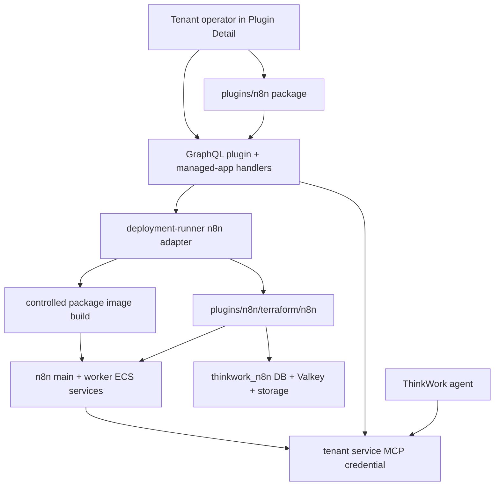
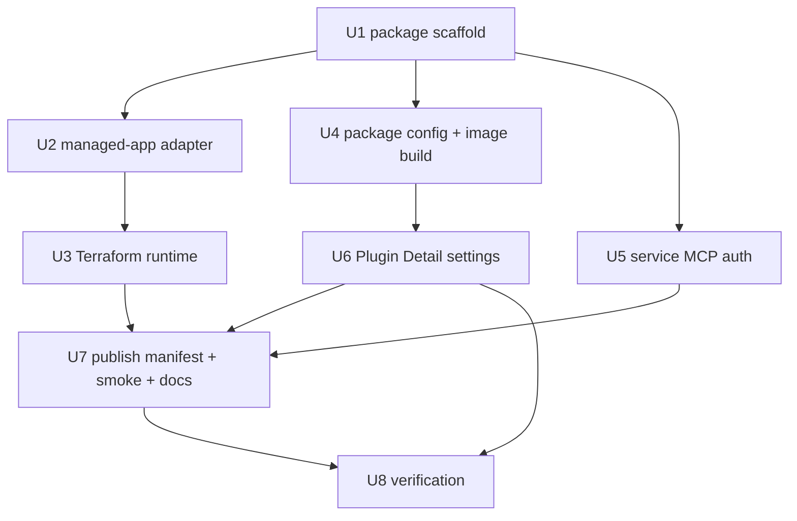

# feat: Add n8n application plugin

## Overview

Add a first-party `n8n` Application Plugin that deploys a clean self-hosted n8n
runtime through ThinkWork's plugin installer and managed-app deployment runner.
The plugin owns the n8n manifest, deployment adapter, Terraform module, wrapper
image assets, Plugin Detail settings for pinned public Code node packages,
native n8n MCP registration, package-local smokes, tests, and operator docs.

V1 keeps n8n as the orchestration application. It does not migrate LastMile
custom nodes or workflows, does not deploy n8n Cloud or Enterprise, and does
not build a custom ThinkWork MCP wrapper around n8n. Agents use n8n's native
instance-level MCP through a tenant service credential, while production
workflow activation remains a shared n8n operator action.

---

## Problem Frame

THNK-50 needs n8n to become a productized ThinkWork Application Plugin rather
than a one-off ECS pattern. The approved requirements deliberately preserve the
useful LastMile runtime lessons, queue-mode n8n on AWS with durable data, while
excluding LastMile-specific custom nodes, credentials, and workflow migration.
The launch premise is customers who already need n8n as the system of record
for workflow automation: keeping those workflows in n8n is more valuable than
forcing an early routine rewrite, while ThinkWork agents add leverage by helping
inspect, draft, test, and maintain workflows. The adoption signal for v1 is a
tenant operator successfully deploying n8n through ThinkWork, enabling native
MCP on representative workflows, and using an agent-assisted draft/test loop
without bypassing the shared n8n operator's activation responsibility.

The current codebase already has most of the plugin substrate:
`plugins/<plugin-key>/` packages, generated first-party catalog registration,
plugin install state, infrastructure components that create managed-app
deployment jobs, package-owned managed-app adapters, Terraform modules, smoke
contracts, and Plugin Detail surfaces. n8n needs to extend that substrate in
three places the existing Twenty CRM/Twenty patterns do not fully cover:

- tenant-scoped native MCP with a service credential rather than per-user OAuth
  or per-user header activation;
- operator-configured pinned npm package specs that cause a controlled image
  rebuild and n8n allow-list update; and
- a queue-mode Terraform topology with main and worker services, a separate
  `thinkwork_n8n` database on the existing database instance, dedicated
  Valkey/Redis, and durable AWS file storage.

---

## Requirements Trace

### Package and Deployment

- R1. Add a first-party `plugins/n8n/` package owning manifest, deployment,
  runtime, settings, smoke, tests, and docs.
- R2. Deploy only through the normal ThinkWork plugin install plus managed-app
  plan/approval/apply/smoke/evidence path.
- R3. Default the public runtime URL to `n8n.[thinkwork domain]`.
- R8. Expose operator status and smoke evidence for endpoint, services, queue,
  database, storage, image digest, package config, and deployment result.
- R9. Use a thin ThinkWork-owned wrapper image based on the official n8n image,
  excluding LastMile custom nodes and vendor-specific packages.

### Runtime Infrastructure

- R4. Deploy n8n in queue mode with a main service and worker service(s).
- R5. Use a separate `thinkwork_n8n` database on the existing ThinkWork
  database instance by default.
- R6. Use a dedicated private managed Valkey/Redis queue for n8n.
- R7. Use durable AWS-backed binary/file storage.

### Package Configuration

- R10. Add n8n Plugin Detail settings for custom Code node npm packages.
- R11. Accept only pinned public npm package specs; reject ranges, git URLs,
  tarballs, private registry packages, registry credentials, and broad
  allow-all configuration.
- R12. Use the approved package list for both image installation and n8n
  external module allow-list configuration, including task-runner placement if
  task runners are enabled.

### MCP and Workflow Operations

- R13. Register n8n's native instance-level MCP server for ThinkWork agents.
- R14. Use a tenant service credential for n8n MCP; do not require per-user n8n
  activation.
- R15. Let agents inspect, draft, create/update, test, and run approved
  workflows through native n8n MCP where the native tool surface supports it.
- R16. Use instruction-level guardrails for publish/unpublish in v1.
- R17. Rely on one native n8n local/shared operator account for production
  activation and recovery.

### Lifecycle

- R18. Route deploys, package edits, upgrades, park, and destroy through the
  managed-app lifecycle.
- R19. Parking stops runtime capacity while retaining data, secrets, storage,
  package configuration, and re-enable path where practical.
- R20. Destroy is explicit and destructive, with cleanup or intentional-retain
  evidence for app-owned resources and credentials.

**Origin actors:** A1 tenant operator, A2 shared n8n operator, A3 ThinkWork
agent, A4 ThinkWork platform, A5 n8n runtime.

**Origin flows:** F1 install/deploy n8n, F2 configure Code node packages, F3
agent drafts or updates workflows, F4 park or destroy n8n.

**Origin acceptance examples:** AE1 managed deploy at `n8n.[thinkwork domain]`;
AE2 approved pinned package update rebuilds/selects digest-pinned image; AE3
invalid package specs fail before plan/apply; AE4 native MCP drafts workflow
changes while activation stays human; AE5 park retains state and destroy records
destructive impact.

---

## Scope Boundaries

- Do not bring over LastMile custom n8n nodes, credentials, workflows, or
  vendor-specific packages.
- Do not replace n8n workflows with ThinkWork Routines in this work.
- Do not deploy n8n Cloud, n8n Enterprise, Kubernetes, Docker Compose, GCP, or
  Azure.
- Do not promise per-user n8n activation, SSO, or user-scoped n8n MCP
  credentials.
- Do not add hard tool-layer blocking for `publish_workflow` or
  `unpublish_workflow` in v1.
- Do not support private npm registries, git dependencies, tarballs, unpinned
  packages, semver ranges, registry credentials, or arbitrary Dockerfile edits.
- Do not make package edits live outside the managed-app approval/evidence
  flow.
- Do not state or imply that publish/unpublish is technically impossible in v1.
  The approved v1 product decision is instruction-level guardrails plus explicit
  operator handoff; hard MCP tool filtering is deferred follow-up work.
- Do not use direct Terraform apply, local Docker Compose, vendor cloud login,
  or manual DB mutation as Verification substitutes for the ThinkWork plugin
  install path.

### Deferred to Follow-Up Work

- Enterprise n8n identity, SSO, user-scoped n8n credentials, or per-user MCP
  authorization.
- A custom ThinkWork n8n control MCP wrapper or hard publish/unpublish tool
  filter.
- Private registry support, dependency vulnerability policy UI, registry
  credentials, or arbitrary build customization.
- Migration of selected n8n workflows into native ThinkWork Routines.

---

## Context & Research

### Relevant Code and Patterns

- `plugins/README.md` defines first-party plugin packages as the ownership
  boundary for manifest, deployment, Terraform, runtime, UI, smoke, tests, and
  docs.
- `plugins/twenty/src/manifest.ts`,
  `plugins/twenty/src/deployment/managed-app.ts`, and
  `plugins/twenty/terraform/twenty/` are the closest managed-app plus MCP
  pattern. Twenty uses `endpointFrom` to resolve a tenant-specific MCP endpoint
  from the managed-app URL, but it uses per-instance user OAuth, which n8n v1
  explicitly does not.
- `plugins/twenty/src/deployment/managed-app.ts` and
  `plugins/twenty/terraform/twenty/` are the closest multi-resource app pattern,
  with app-owned Terraform, smoke contracts, destructive data-impact messaging,
  and plugin package ownership.
- `packages/deployment-runner/src/apps/registry.ts` is the closed adapter
  registry. Adding n8n requires a new `ManagedAppKey`, adapter import, image
  hydration behavior, status outputs, and tests.
- `packages/deployment-runner/src/plan.ts`,
  `packages/deployment-runner/src/apply.ts`, and
  `packages/deployment-runner/test/deployment-runner-managed-apps.test.ts`
  prove how managed-app plans and apply summaries map desired config into
  Terraform variables and smoke evidence.
- `packages/api/src/lib/plugins/handlers/infra.ts` creates plugin-backed
  deployment jobs through the same shared plan-job core used by managed-app
  operator actions. It also seeds app-specific defaults for Twenty CRM today.
- `packages/api/src/lib/plugins/handlers/mcp.ts` provisions plugin-owned
  `tenant_mcp_servers` rows and supports static OAuth, per-instance OAuth, and
  per-user header activation. It does not yet model tenant service credentials
  for a plugin-owned MCP server.
- `plugins/catalog/src/contracts.ts` defines current manifest component and MCP
  auth contracts. Adding a service credential auth mode here is preferable to
  hiding n8n behind `user-provided-headers`, because the requirement explicitly
  rejects per-user activation.
- `apps/web/src/components/settings/plugins/PluginDetail.tsx` is the shared
  plugin detail host. It already contains plugin-specific operator sections for
  Company Brain, Twenty, Twenty CRM credentials, and email-channel settings, so an
  `N8nSettings` panel can be introduced without turning the generic detail page
  into a full schema renderer.
- `packages/database-pg/graphql/types/plugins.graphql`,
  `apps/web/src/lib/settings-queries.ts`, and generated web GraphQL types carry
  the plugin install/catalog surface. New n8n settings mutations should extend
  the plugin/managed-app config surface without exposing secret values.
- `scripts/release/build-release-manifest.ts` and release-manifest tests are
  relevant if n8n static base images or wrapper images become release artifacts.
  Tenant-specific package images should still record digest/evidence in the
  managed-app job rather than pretending they are part of the immutable platform
  release manifest.

### Institutional Learnings

- `docs/solutions/architecture-patterns/plugin-source-boundaries-package-owned-deploy-verified-2026-06-17.md`
  requires plugin-specific source to live under `plugins/<plugin-key>/`,
  registries to be generated from plugin packages, and verification to prove the
  deployed ThinkWork install path.
- `docs/solutions/architecture-patterns/managed-app-mcp-oauth-lifecycle-2026-06-06.md`
  separates managed-app lifecycle from MCP connector lifecycle. n8n should keep
  that separation, while explicitly documenting why its MCP credential is
  tenant service-scoped instead of user-scoped.
- `docs/solutions/architecture-patterns/terraform-plugin-builder-skills-stop-at-adapter-gaps-2026-06-14.md`
  says infrastructure components are valid only when the deployment-runner
  adapter exists. n8n must add the adapter and tests before its manifest can
  truthfully claim `managedAppKey: "n8n"`.
- `docs/solutions/architecture-patterns/release-manifest-deployment-status-contract-2026-06-11.md`
  keeps immutable release artifacts separate from environment deployment
  status. n8n package-image evidence should follow deployment-job evidence
  semantics, not be confused with the active platform release.
- `docs/solutions/workflow-issues/manually-applied-drizzle-migrations-drift-from-dev-2026-04-21.md`
  applies if the plan adds database objects or hand-rolled migrations: drift
  reporter markers and deployed migration evidence matter.

### External References

- n8n queue-mode docs state that queue mode connects main and worker processes
  to Postgres and Redis, and multi-main requires shared queue/database and load
  balancer session persistence. V1 should start with one main service plus
  worker service(s), not Enterprise multi-main.
- n8n supported database docs list Postgres environment variables including
  `DB_TYPE=postgresdb` and `DB_POSTGRESDB_DATABASE`; this grounds the separate
  `thinkwork_n8n` database contract.
- n8n Code node module docs show external modules are disabled unless
  `NODE_FUNCTION_ALLOW_EXTERNAL` is set and packages exist in n8n's
  `node_modules`.
- n8n task-runner docs say extra dependencies require extending the runners
  image and allow-listing packages in `n8n-task-runners.json` when task runners
  are used.
- n8n native MCP docs describe instance-level MCP, access token authentication,
  workflow exposure controls, and workflow-building/editing support. They also
  note that MCP access is not blanket workflow exposure; individual workflows
  or projects/folders still need MCP access enabled inside n8n.

---

## Key Technical Decisions

- **Model n8n as a package-owned first-party plugin.** Create `plugins/n8n/`
  with the same descriptor, manifest, adapter, Terraform, runtime, smoke, test,
  and README shape used by Twenty CRM and Twenty. Shared packages receive only
  generic extension points and generated registry updates; n8n-specific
  validators, runtime templates, and instructions stay under `plugins/n8n/` and
  shared API/web code imports or calls those package-owned contracts.
- **Add a real `n8n` managed-app adapter before publishing the manifest.** The
  manifest's infrastructure component should reference `managedAppKey: "n8n"`
  only after `packages/deployment-runner/src/apps/registry.ts` and tests can
  plan/apply/destroy it.
- **Start with one n8n main service plus configurable workers.** This satisfies
  queue mode without depending on self-hosted Enterprise multi-main. The
  Terraform module can expose desired counts for future scale, but the default
  should be one main service and at least one worker service.
- **Use the existing Aurora instance but a dedicated app database and role.**
  n8n should default to `thinkwork_n8n`, with Terraform or pre-destroy steps
  owning creation/drop evidence for the database and least-privilege app role.
- **Use dedicated managed Valkey/Redis, not shared cache or sidecar.** Queue
  state is part of n8n's runtime correctness. Sharing ThinkWork platform cache
  or task-local Redis would make parking/destroy and scale behavior ambiguous.
- **Treat custom package settings as managed-app desired config.** The operator
  edits a validated package list in Plugin Detail, and saving creates or
  updates desired config that drives a managed-app plan. The package list never
  mutates running services directly.
- **Implement a controlled image-build subflow for package changes.** Empty or
  baseline package config can use the release-published wrapper image. Non-empty
  package config must produce a tenant-scoped, digest-pinned image from a
  controlled Dockerfile/template and record package specs, base image digest,
  resulting image digest, and build evidence in the deployment job. Operators
  may choose packages, not Dockerfile instructions. The managed-app `PLAN`
  phase owns the build or cache lookup so the approval screen contains the exact
  image digest that `APPLY` will consume; rejected plans leave only an unused
  build artifact eligible for ECR lifecycle cleanup, not a runtime change.
- **Validate package specs server-side and client-side.** Web validation gives
  fast feedback, but API/runner validation is authoritative. Accept only npm
  names plus exact versions, dedupe deterministically, and reject everything
  that implies ranges, alternate registries, tarballs, git sources, or
  credentials.
- **Add a service-credential MCP auth mode instead of reusing per-user headers.**
  n8n's selected self-hosted edition requires tenant service access. The
  manifest, MCP handler, secret storage, dispatch path, and UI copy should call
  this a tenant service credential so reviewers do not mistake it for user
  consent.
- **Expose n8n publicly only behind hardened native n8n access.** V1's default
  URL is public HTTPS at `n8n.[thinkwork domain]`, but the Terraform/runtime
  config must disable open sign-up, require the shared operator account, use
  generated secrets, enforce HTTPS-origin/webhook URL settings, and support
  optional allowed public CIDR blocks following the existing managed-app adapter
  pattern. Platform-auth proxying or private-only access is follow-up work
  unless implementation evidence shows native n8n auth is insufficient.
- **Bundle agent instructions for n8n workflow safety.** Because v1 relies on
  instruction-level guardrails, the plugin should include a skill or tool note
  that tells agents to inspect/draft/test/run allowed workflows but not publish,
  unpublish, or otherwise activate production workflow changes. This is an
  accepted v1 limitation, not a hard enforcement guarantee.
- **Make the human activation handoff visible.** Agent output should include a
  workflow draft/test evidence summary and a clear handoff note for the shared
  n8n operator. V1 does not add a separate approval queue, but docs and smokes
  must prove the handoff can be completed in n8n's native UI by the shared
  operator account.
- **Make park and destroy visibly different.** Parking sets runtime capacity to
  stopped/disabled while preserving database, storage, secrets, package config,
  and public URL where practical. Destroy carries destructive data impact and
  cleanup evidence for app-owned runtime resources and tenant service
  credentials.

---

## Open Questions

### Resolved During Planning

- **Are custom packages launch-blocking?** Yes. Eric explicitly said custom
  package functionality is needed for code nodes and should be figured out in
  this slice. The plan may still sequence baseline install work before package
  customization internally, but v1 is not complete until package configuration
  follows the managed-app approval/evidence path.
- **Do task runners belong in v1?** Treat task runners as optional until
  implementation confirms the selected n8n version requires or benefits from
  them. The plan must still design the package config path so allow-list
  placement supports both normal Code node env vars and task-runner
  `n8n-task-runners.json` if task runners are enabled.
- **Where should custom packages live in the product UI?** Add an n8n-specific
  settings panel inside `PluginDetail`, because the requirement names Plugin
  Detail and the package settings are plugin-specific desired config rather
  than a generic plugin manifest feature.
- **Should n8n MCP use per-user activation?** No. The requirements explicitly
  pick tenant service credentials because the selected self-hosted n8n edition
  cannot provide the needed per-user activation model.
- **Is instruction-only publish control acceptable for v1?** Yes, as an
  accepted product limitation from the requirements. Implementation must not
  pretend this is server-enforced; it must document the risk, smoke-check the
  instructions, and leave hard tool filtering for follow-up requirements.
- **Should n8n get a separate database instance?** No. Use the existing
  ThinkWork database instance and default to a separate database named
  `thinkwork_n8n`.
- **Should a shared platform cache or Redis sidecar be used for queue mode?**
  No. Use a dedicated private managed Valkey/Redis resource.

### Deferred to Implementation

- Exact n8n image tag/version and whether the base image digest comes from the
  platform release manifest or a plugin-owned release manifest entry. The
  implementation must pin by digest and test that unpinned images are rejected.
- Exact S3/binary-data environment variables for the selected n8n version.
  Resolve from current official n8n docs during implementation and capture in
  Terraform tests/docs.
- Exact native n8n MCP URL path and token bootstrap/rotation mechanics for the
  selected n8n version. The ThinkWork service credential storage, rotation,
  revocation, park, destroy cleanup, and dispatch injection contract is in U5;
  implementation must verify the vendor-specific mechanics against the running
  self-hosted instance, not only documentation.
- Exact wording for the n8n agent instruction/skill. It must be clear that
  publishing/unpublishing/activation belongs to the shared n8n operator.

---

## High-Level Technical Design

This design is intentionally non-prescriptive at method/function level. It
shows the contracts the implementation must preserve across packages.

For package changes, the desired control flow is:

1. Operator edits the package list in the n8n Plugin Detail settings.
2. Web validates syntax for immediate feedback.
3. API validates and normalizes the package list authoritatively.
4. API stores the normalized list in managed-app desired config and creates an
   `UPGRADE` plan job.
5. The `PLAN` job resolves the base n8n image, builds or selects the
   digest-pinned wrapper image in the controlled build environment, and records
   build evidence before approval.
6. The approved `APPLY` job consumes the already-approved image digest and maps
   package allow-lists into Terraform variables.
7. Terraform updates n8n main/worker task definitions and, if enabled,
   task-runner image/config.
8. Smoke evidence proves the runtime can import configured packages and that
   native MCP still registers.

---

## Implementation Units

### U1. Create the n8n First-Party Package Scaffold

**Requirements:** R1, R2, R9, R13, R16, R17; supports F1, F3.

**Files:**

- `plugins/n8n/package.json`
- `plugins/n8n/tsconfig.json`
- `plugins/n8n/src/index.ts`
- `plugins/n8n/src/manifest.ts`
- `plugins/n8n/README.md`
- `plugins/n8n/test/manifest.test.ts`
- `scripts/verify-plugin-source-boundary.mjs`
- `scripts/__tests__/verify-plugin-source-boundary.test.mjs`

**Approach:**

Add `@thinkwork/plugin-n8n` as a normal first-party plugin package scaffold,
but do not publish a catalog-visible final manifest until U2 and U5 exist. U1
owns package metadata, README skeleton, draft manifest constants, runtime asset
locations, package-local test scaffolding, and source-boundary registration. The
draft manifest may contain placeholders or skipped tests that make the required
future components explicit, but the first registry-published manifest is
completed in U7 after `managedAppKey: "n8n"` and the service credential auth
mode are real.

Update source-boundary tooling so future n8n-specific source outside
`plugins/n8n/` is caught unless it is documented as generic platform plumbing.
Shared API/web paths should not contain durable n8n business logic; they should
host generic mutation, settings-shell, and service-credential infrastructure
that imports or calls package-owned n8n contracts.

**Test Scenarios:**

- `plugins/n8n/test/manifest.test.ts` validates scaffold metadata, package
  descriptor shape, draft component intent, and absence of LastMile runtime
  source. Final manifest component tests move to U7.
- `scripts/__tests__/verify-plugin-source-boundary.test.mjs` proves `n8n` is a
  guarded first-party key and allows only documented shared plumbing.

### U2. Add the n8n Managed-App Adapter and Desired Config Contract

**Requirements:** R2, R3, R4, R5, R6, R7, R8, R9, R12, R18, R19, R20; supports
F1, F2, F4.

**Files:**

- `plugins/n8n/src/deployment/managed-app.ts`
- `packages/deployment-runner/src/apps/registry.ts`
- `packages/deployment-runner/src/apps/utils.ts`
- `packages/deployment-runner/test/deployment-runner-managed-apps.test.ts`
- `packages/api/src/lib/plugins/handlers/infra.ts`
- `packages/api/src/lib/plugins/handlers/infra.test.ts`
- `packages/api/src/graphql/resolvers/core/managedApplications.ts`
- `packages/api/src/graphql/resolvers/deployments/shared.ts`

**Approach:**

Implement `n8nAdapter` in the plugin package and register it in the deployment
runner. Required non-destroy inputs should include the public URL/domain,
certificate ARN, base or resolved image URI, database admin/URL secret inputs
needed to create `thinkwork_n8n`, storage bucket/prefix, n8n encryption key
secret, n8n operator/service credential secret references, and package config
digest/build outputs from U4.

Define greenfield desired-config defaults before starting the first n8n plan:

- derive `publicUrl` from the tenant's ThinkWork domain as
  `https://n8n.<domain>`;
- resolve certificate ARN, hosted-zone/domain inputs, database admin secret,
  VPC/subnet/security-group context, and default storage bucket/prefix from the
  existing deployment configuration surfaces used by managed apps;
- use the release-published baseline n8n wrapper image for empty package config;
- generate n8n encryption, operator, and service credential secret containers
  through Terraform or a pre-plan secret bootstrap with secret values never
  stored in GraphQL; and
- fail closed with a readable plan error when domain/certificate/database
  prerequisites are missing instead of creating a wedged deployment job.

The adapter should map operations to Terraform variables:

- `ENABLE` and `UPGRADE`: `n8n_provisioned=true` and runtime enabled unless
  parked;
- `PARK`: resources retained, desired service capacity disabled/stopped;
- `DESTROY`: `n8n_provisioned=false`, destructive data impact populated, and
  pre-destroy steps listed.

Expose status outputs for endpoint, ALB/target group, cluster, main service,
worker service(s), log groups, database name/secret, Valkey endpoint, storage
bucket/prefix, image digest, package config digest, and service credential
state.

Extend the plugin infrastructure handler only where generic defaults are
needed. Avoid n8n-specific branches when the adapter can own the contract.

**Test Scenarios:**

- `packages/deployment-runner/test/deployment-runner-managed-apps.test.ts`
  builds n8n plan/apply summaries and asserts Terraform variables for main,
  workers, `thinkwork_n8n`, dedicated Valkey, storage, image digest, package
  config, and smoke contracts.
- The same suite rejects unpinned n8n image URIs, missing public URL/cert,
  missing required secrets, and malformed package config digest references.
- `packages/api/src/lib/plugins/handlers/infra.test.ts` proves installing n8n
  creates a managed-app plan job with n8n desired config and preserves existing
  desired config on adoption/upgrade.
- Greenfield infra-handler tests cover nil/empty/error cases for missing domain,
  certificate, database admin secret, storage, baseline image, and generated
  secret prerequisites.

### U3. Build the n8n Terraform Runtime Module

**Requirements:** R3, R4, R5, R6, R7, R8, R18, R19, R20; supports F1, F4.

**Files:**

- `plugins/n8n/terraform/n8n/main.tf`
- `plugins/n8n/terraform/n8n/variables.tf`
- `plugins/n8n/terraform/n8n/outputs.tf`
- `plugins/n8n/terraform/n8n/README.md`
- `terraform/modules/thinkwork/main.tf`
- `terraform/modules/thinkwork/variables.tf`
- `terraform/modules/thinkwork/outputs.tf`
- `apps/cli/__tests__/terraform-plugin-modules.test.ts` or nearest existing
  Terraform packaging fixture

**Approach:**

Create a plugin-owned Terraform module following Twenty CRM/Twenty module
conventions. The module should provision:

- an HTTPS ALB listener/rule and DNS target for `n8n.[thinkwork domain]`;
- an ECS cluster/service/task-definition shape with one main service and one or
  more worker services;
- environment and secret wiring for Postgres, n8n encryption key, queue mode,
  public URL/webhook URL, binary storage, package allow-list, operator account,
  and native MCP service credential;
- a dedicated Valkey/Redis replication group/subnet/security group path;
- durable S3-backed binary/file storage;
- app database/role creation or a clearly separated preflight/provisioning path
  for `thinkwork_n8n` on the existing Aurora instance; and
- CloudWatch logs, IAM roles, security groups, and outputs used by adapter
  status extraction and smokes.

The module should be explicit about retained resources on park versus destroy.
If database creation/drop cannot be cleanly expressed in Terraform without
unsafe provider assumptions, implement the database step as managed pre/post
actions with durable evidence and keep Terraform inputs/outputs honest.

The public endpoint posture for v1 is public HTTPS plus hardened native n8n
auth, not unauthenticated access. Terraform/runtime config should disable
open/self signup, generate the initial shared operator credential into Secrets
Manager, require secure cookie/origin/webhook settings for the public URL, pass
only required secrets into task definitions, and support optional
`allowedPublicCidrBlocks` for tenants that want IP restriction. Do not log
operator passwords, MCP access tokens, package registry metadata beyond specs,
or workflow execution payloads in smoke output.

**Test Scenarios:**

- Terraform validation or packaging tests assert the n8n module is included in
  the CLI/release bundle and exposes the adapter's required variables/outputs.
- Static tests ensure the default database name is `thinkwork_n8n`, runtime
  services use queue mode, and Valkey/Redis is not the shared platform cache or
  an ECS sidecar.
- Destroy data-impact tests list database, storage, Valkey, secrets, ECS, ALB,
  logs, package image references, and MCP service credentials.
- Terraform/static tests assert open signup is disabled, required public URL
  security settings are present, and optional public CIDR allow-lists map to ALB
  access rules without becoming mandatory for all tenants.

### U4. Implement Pinned Package Validation and Controlled Image Builds

**Requirements:** R9, R10, R11, R12, R18; supports F2.

**Files:**

- `plugins/n8n/src/package-config.ts`
- `plugins/n8n/runtime/Dockerfile`
- `plugins/n8n/runtime/n8n-task-runners.json.template`
- `plugins/n8n/src/deployment/image-build.ts`
- `packages/deployment-runner/src/apps/registry.ts`
- `packages/deployment-runner/src/plan.ts`
- `packages/deployment-runner/src/apply.ts`
- `plugins/n8n/test/package-config.test.ts`

**Approach:**

Create one package-owned package-spec validator in `plugins/n8n/`. API and web
plumbing should call or re-export this package-owned contract rather than
duplicating n8n-specific validation in shared files. The normalized config
should be stable: sorted package specs, duplicates collapsed, exact package
names and versions preserved, and a deterministic config digest recorded in
desired config.

Accepted examples:

- `lodash@4.17.21`
- `date-fns@4.1.0`
- scoped public packages with exact versions, if npm name syntax validates.

Rejected examples:

- `lodash`
- `lodash@^4`
- `lodash@latest`
- git URLs, tarball URLs, file paths, workspace/protocol dependencies, private
  registry URLs, registry credentials, and `NODE_FUNCTION_ALLOW_EXTERNAL=*`.

For image build behavior, use the managed-app `PLAN` phase to perform a
controlled build or cache lookup before operator approval. The build idempotency
key should derive from tenant id, n8n base image digest, normalized package
config digest, task-runner mode, and plugin version. The output image tag may be
human-readable, but Terraform and evidence must use the digest-pinned URI.
`APPLY` must consume the approved digest and fail if the digest no longer
matches the plan.

Define a controlled build contract that:

- starts from the approved official n8n base image digest;
- installs only normalized package specs;
- writes allow-list config for n8n Code nodes;
- writes task-runner allow-list config if task runners are enabled;
- pushes or selects a digest-pinned image reference; and
- records package specs, base image digest, output image digest, and build logs
  in deployment evidence.

The build executor should use the existing customer/deployment controller's
AWS-native CodeBuild/ECR boundary unless implementation proves that boundary
cannot perform the image build safely. The build environment must have no tenant
runtime secrets, least-privilege IAM for ECR/log/evidence operations, explicit
network egress policy, package integrity/provenance capture, and a
vulnerability/malware policy check before image promotion. Build failures fail
the plan before approval; apply failures never build a different image than the
approved plan.

**Test Scenarios:**

- Package validator accepts exact public npm specs and rejects all invalid
  examples from AE3 with clear error messages.
- Duplicate package inputs normalize deterministically and produce a stable
  digest.
- Deployment-runner tests prove package config changes alter the n8n plan
  digest and Terraform image/allow-list variables.
- Image-build contract tests prove output image URIs must be digest-pinned and
  tied to the normalized package digest.
- Build security tests or fixtures prove build inputs exclude tenant/runtime
  secrets, IAM permissions are scoped to image/log/evidence operations, and
  rejected package policy results fail planning before Terraform variables are
  generated.

### U5. Add Tenant Service Credential MCP Support for Plugin MCP Servers

**Requirements:** R13, R14, R15, R16, R17, R20; supports F3, F4.

**Files:**

- `plugins/catalog/src/contracts.ts`
- `plugins/catalog/src/__tests__/contracts.test.ts`
- `packages/api/src/lib/plugins/handlers/mcp.ts`
- `packages/api/src/lib/plugins/handlers/mcp.test.ts`
- `packages/api/src/lib/plugins/activation.ts`
- Current MCP dispatch/auth helper paths discovered during implementation
- `packages/database-pg/src/schema/*`
- `packages/database-pg/drizzle/*`
- `packages/database-pg/graphql/types/plugins.graphql`
- `plugins/n8n/src/manifest.ts`

**Approach:**

Extend the MCP manifest contract with a service credential auth mode that is
tenant-scoped and plugin-owned. The provisioned `tenant_mcp_servers` row should
be visible and approved like other plugin MCP rows, but its auth material should
come from a server-side tenant service credential secret, not from
`user_plugin_activation_tokens`.

Use a generic service credential contract rather than a n8n-only special case:
the manifest auth shape should carry only non-secret metadata such as the
credential kind, secret key names, and required header shape. The MCP row should
use either a new generic `auth_type` such as `service_credential` or an
equivalent schema extension whose `auth_config` stores only secret references
and dispatch metadata. If a migration is needed, keep it generic so future
plugin MCP servers can use it, and never expose raw secret values through
GraphQL.

Provisioning should:

- resolve the MCP endpoint from n8n `publicUrl`;
- store only a secret reference and non-secret metadata;
- assign the server to platform default agents;
- preserve url/auth hash drift detection;
- inject the service credential only inside server-side MCP dispatch;
- fail clearly when the secret is missing, empty, revoked, or rejected by n8n;
- support operator-triggered credential rotation and emergency revocation;
- keep audit events for bootstrap, rotation, revoke, and dispatch failures;
- include MCP service credential cleanup in destroy; and
- keep parking distinct from destroy.

Parking should retain the service credential but disable runtime availability
where the managed-app status requires it. Destroy should delete or mark the
secret for deletion, remove the plugin-owned MCP row, and record cleanup
evidence. Rotation should create a new n8n token through the shared operator
account or documented n8n admin mechanism, update the server-side secret ref,
and invalidate the previous token where the selected n8n version supports it.
The exact n8n API/UI mechanics are verified during implementation, but the
ThinkWork storage, dispatch, audit, park, and destroy contract is not deferred.

The plan intentionally does not add hard publish/unpublish filtering in this
unit. It should, however, make the risk visible in handler metadata/tool notes
and preserve an obvious future hook for tool-policy filtering without requiring
schema churn.

**Test Scenarios:**

- Catalog contract tests accept `auth.mode: "tenant-service-credential"` only
  with the required non-secret metadata and reject secret literals in manifests.
- MCP handler tests provision an n8n plugin MCP row with service auth, no
  per-user activation requirement, default agent assignment, and stable endpoint
  resolution from managed-app `publicUrl`.
- Dispatch/auth tests prove a service credential is injected server-side for
  n8n MCP calls and not exposed to clients or user activation queries.
- Destroy tests remove service credential secret refs and MCP rows; park tests
  retain credentials while disabling runtime availability where applicable.
- Rotation/revocation tests cover missing, empty, revoked, and rejected token
  paths and prove raw secret values never appear in GraphQL responses or logs.

### U6. Add n8n Plugin Detail Settings

**Requirements:** R10, R11, R12, R18; supports F2.

**Files:**

- `apps/web/src/components/settings/plugins/PluginDetail.tsx`
- `apps/web/src/components/settings/plugins/n8n/N8nSettings.tsx`
- `apps/web/src/components/settings/plugins/PluginDetail.test.tsx`
- `apps/web/src/lib/settings-queries.ts`
- `apps/web/src/gql/graphql.ts`
- `packages/database-pg/graphql/types/plugins.graphql`
- `packages/api/src/graphql/resolvers/plugins.ts`
- `packages/api/src/graphql/resolvers/plugins.test.ts`

**Approach:**

Render an n8n-specific operator settings section in Plugin Detail when the n8n
plugin is installed. The section should show current normalized package config,
pending desired config, last deployment/package-image evidence, validation
errors, and an action that creates a managed-app plan rather than applying
immediately.

The UI should fit the existing Settings visual language: compact rows,
operator-only controls, clear validation states, and a link into deployment
details/evidence. Use a compact row-based editable package list rather than a
free-form Dockerfile editor: each row has one package spec input, remove
control, inline validation/error text, and an add control. Pasting newline- or
comma-separated specs may populate multiple rows, but the preview must show the
normalized sorted package list and package config digest before creating a plan.
Duplicate specs collapse with an explanatory non-error note; conflicting
versions for the same package are validation errors.

Server mutations should:

- require tenant operator permission;
- validate package specs with the package-owned authoritative validator from
  `plugins/n8n/`;
- update managed-app desired config;
- create or reuse the appropriate `UPGRADE` plan job; and
- return the deployment job id/status so Plugin Detail can show approval state.

Interaction states:

- **Loading:** show the existing plugin-detail loading treatment; package edits
  are unavailable until install and managed-app state are loaded.
- **Empty config:** show no packages configured, baseline image in use, and an
  enabled add-row control.
- **Dirty valid edits:** show normalized preview, digest, and an enabled create
  plan action.
- **Client validation error:** keep focus in the invalid row and disable submit.
- **Server validation error:** replace or supplement row errors with the
  server's authoritative message.
- **Plan creation failure:** keep edits intact and show the deployment-job error
  with retry.
- **Existing in-flight install/upgrade/park/destroy/package job:** disable new
  package plan creation and link to the current approval/evidence surface.
- **Pending approval:** keep the user in Plugin Detail, show the pending job id
  and a link to deployment details; duplicate submits reuse the existing job.
- **Applied success:** show deployed package config, image digest, and latest
  evidence link.
- **Stale/unavailable evidence:** show current desired config but mark evidence
  unavailable without blocking edits unless an in-flight job exists.

Accessibility and responsive expectations: package rows must be operable by
keyboard, remove/add controls need accessible names, validation and job status
changes need screen-reader announcements, focus should move to the first invalid
row or pending-job link after submit, controls should keep normal Settings touch
targets, and mobile layout should stack row controls without horizontal scroll.

**Test Scenarios:**

- Web tests render the n8n settings section only for operators with an installed
  n8n plugin.
- Web tests accept `lodash@4.17.21`, reject `lodash`, `lodash@^4`, git URLs,
  tarballs, and private registry-looking specs before submit, and display
  server validation messages.
- API resolver tests require operator role, persist normalized package config,
  and create a managed-app plan job instead of mutating runtime state.
- Plugin Detail tests show package-change jobs in the same pending approval
  pattern as infrastructure installs.
- Web tests cover loading, empty, dirty valid, client validation, server
  validation, in-flight job disabled state, pending approval, applied success,
  stale evidence, keyboard focus, and accessible status announcements.

### U7. Publish Manifest, Smokes, Docs, and Agent Instructions

**Requirements:** R8, R12, R13, R15, R16, R17, R18, R19, R20; supports F1, F2,
F3, F4.

**Files:**

- `plugins/n8n/src/manifest.ts`
- `plugins/n8n/test/manifest.test.ts`
- `plugins/catalog/package.json`
- `plugins/catalog/src/registry/generated-first-party.ts`
- `plugins/catalog/src/__tests__/plugin-package.test.ts`
- `plugins/n8n/smoke/n8n-managed-app-smoke.mjs`
- `plugins/n8n/smoke/n8n-mcp-smoke.mjs`
- `plugins/n8n/src/skills/n8n-workflow-operator/SKILL.md` or equivalent
  plugin-owned instruction source
- `plugins/n8n/README.md`
- `docs/src/content/docs/applications/admin/managed-applications.mdx`
- `docs/src/content/docs/deploy/managed-applications.mdx`
- `scripts/release/build-release-manifest.ts` only if baseline n8n images become
  release-published artifacts
- `scripts/release/__tests__/build-release-manifest.test.ts` only if baseline
  n8n images become release-published artifacts

**Approach:**

Complete and publish the n8n manifest only after U2 and U5 make the referenced
adapter key and service credential auth mode valid. The final manifest should
declare the infrastructure component, native MCP component, package-owned
instruction/skill component, and any UI-surface declaration used by Plugin
Detail. Regenerate the first-party registry and update catalog tests here, not
in U1.

Create package-owned smokes that prove the managed-app and MCP path through
ThinkWork, not direct local Docker Compose. The managed-app smoke should inspect
GraphQL deployment status/evidence, open the n8n endpoint health path, verify
main/worker service evidence, verify database/queue/storage outputs, and verify
package/image digest evidence when package config is present.

The MCP smoke should register or read the plugin-owned MCP row, list native n8n
MCP tools through ThinkWork's MCP path, and perform a low-risk workflow
inspection or draft/test operation if a disposable workflow is configured. It
must not publish/unpublish production workflows.

The native n8n setup docs and smoke path must also cover workflow exposure:
operators need an explicit step for enabling instance-level MCP and enabling MCP
access on the intended workflow, project, or folder. Verification should include
a known disposable workflow/project/folder so a successful tool list cannot hide
the case where no customer workflows are MCP-accessible.

Agent workflow handoff should be observable: after drafting or updating a
workflow, the agent returns the workflow id/name, draft/test evidence, and a
handoff note for the shared n8n operator to review and activate in the native
n8n UI. V1 records that handoff in the agent/thread evidence rather than a new
ThinkWork approval queue.

Docs should explain:

- what v1 does and does not include;
- queue-mode topology;
- package spec policy and approval flow;
- tenant service credential implications;
- shared n8n operator account recovery/rotation;
- park versus destroy behavior; and
- verification and teardown expectations.

**Test Scenarios:**

- Package-local tests ensure the skill/instruction text includes explicit
  publish/unpublish/activation guardrails.
- Package-local manifest tests validate the final n8n manifest, required
  infrastructure inputs, service credential MCP component, package-owned
  instruction/skill component, and generated registry publication.
- Smoke dry-run mode validates required environment and GraphQL inputs without
  making changes.
- Live smoke mode proves a deployed plugin install path and captures endpoint,
  runtime, package, and MCP evidence.
- Release-manifest tests include n8n baseline images only if the implementation
  chooses release-published base/wrapper images; tenant-specific package images
  remain job evidence.

### U8. End-to-End Verification and Linear Handoff

**Requirements:** R1-R20; supports AE1-AE5.

**Files:**

- `docs/verification/n8n-application-plugin-*.md`
- `plugins/n8n/README.md`
- `docs/plans/autopilot/THNK-50-status.md` only if the implementation workflow
  uses an autopilot ledger

**Approach:**

Verification must use the deployed ThinkWork application-plugin path:

1. Install or upgrade n8n from Settings -> Plugins as a tenant operator.
2. Approve and apply the managed-app deployment plan.
3. Confirm n8n is reachable at `n8n.[thinkwork domain]`.
4. Inspect evidence for main/worker services, `thinkwork_n8n`, dedicated
   Valkey/Redis, durable storage, image digest, package config, and smoke
   status.
5. Configure valid custom packages and prove the resulting managed-app plan,
   approval, image digest, allow-list, and Code node import behavior.
6. Attempt invalid package specs and prove they fail before plan/apply.
7. Verify native n8n MCP through ThinkWork with the tenant service credential.
8. Enable MCP access on a disposable workflow/project/folder and prove agents
   can inspect or draft/test against that target.
9. Confirm agent instructions prohibit publish/unpublish/production activation
   and that the agent returns a human operator handoff summary.
10. Park n8n and prove state is retained.
11. Destroy n8n only after explicit approval and record cleanup/retain evidence.

Keep Linear THNK-50 updated at each material gate: plan written, implementation
PR opened, plan/apply evidence, package-image evidence, MCP verification,
park/destroy verification, and final merge/teardown state.

**Test Scenarios:**

- Repository checks cover plugin package tests, catalog tests, deployment-runner
  tests, API tests, web tests, Terraform validation/packaging tests, source
  boundary check, typecheck, lint, and format.
- Live verification captures installed plugin state, managed-app job ids,
  deployment evidence keys, n8n endpoint proof, package import proof, MCP tool
  list/proof, park evidence, and destroy or retained-state evidence.

---

## System-Wide Impact

- **Plugin catalog:** Adds a new first-party package and generated registry
  entries. Catalog freshness and signed publication semantics remain unchanged.
- **Deployment runner:** Adds a new adapter key and likely a generic extension
  for controlled per-tenant image build evidence. This is a platform-level
  capability and must stay generic enough not to hard-code n8n outside the
  plugin package unless the runner interface requires it.
- **GraphQL/API:** Adds n8n package settings mutations or managed-app desired
  config mutation support, plus tenant service MCP credential support. These
  paths must require operator permission for config/secrets and must not expose
  secret values. Shared API code should stay generic; n8n-specific validation
  and runtime policy live in `plugins/n8n/`.
- **Database:** May need generic schema for service-credential MCP secret refs
  and package desired config/audit fields. Any migration must preserve existing
  OAuth and user-header MCP rows.
- **Web settings:** Adds an operator-only n8n settings panel inside Plugin
  Detail. Existing generic install/update/retry/uninstall flows should remain
  reusable.
- **Terraform/AWS:** Adds ECS main/worker services, dedicated Valkey/Redis,
  database creation/drop handling, S3 storage, secrets, IAM, ALB/DNS, logs, and
  status outputs for n8n.
- **Agent runtime:** n8n MCP becomes available through ThinkWork's MCP path
  using a tenant service credential. Tool instructions must make the human
  activation boundary visible to agents.
- **Release/evidence:** Tenant package images and package digests become
  deployment evidence. Do not blur them with immutable platform release state.

---

## Risks & Mitigations

- **Service credential overreach:** A tenant service credential can act more
  broadly than a user's personal grant. Mitigate with explicit operator setup,
  secret storage, audit/evidence, rotation/revocation paths, default-agent
  assignment review, and strong agent instructions. V1 accepts instruction-level
  publish guardrails as a limitation; it must not market them as hard
  enforcement.
- **Instruction-only publish guardrails:** Native MCP may expose publish tools.
  Mitigate by bundling clear n8n instructions, smoke-checking the instructions,
  and documenting this as a v1 limitation rather than implying a hard block.
- **Package supply-chain risk:** Operator-selected npm packages execute in Code
  nodes. Mitigate by allowing only exact public package versions, recording
  package/image evidence, rejecting alternate sources/credentials, isolating the
  build environment from runtime secrets, checking package policy before image
  promotion, and requiring managed-app approval before runtime changes.
- **Image build reproducibility:** Per-tenant package images can drift if base
  image, package lock behavior, or build executor is vague. Mitigate with base
  image digest pinning, normalized package digests, output image digest capture,
  and build evidence.
- **Database lifecycle risk:** Creating/dropping a database on the existing
  Aurora instance can affect other tenants or schemas if privileges are wrong.
  Mitigate with least-privilege roles, explicit database name defaults,
  pre-destroy evidence, and drift checks for any hand-rolled migrations.
- **Queue/data retention ambiguity:** Parking must not silently delete queue,
  database, secrets, or storage needed to re-enable. Mitigate with adapter
  data-impact summaries and Terraform lifecycle outputs that distinguish park
  from destroy.
- **n8n version behavior changes:** Native MCP, task runners, and binary storage
  env vars are version-sensitive. Mitigate by resolving official docs during
  implementation, pinning images by digest, and verifying against the running
  self-hosted instance.
- **Public endpoint exposure:** The public n8n URL is useful but increases
  attack surface. Mitigate with hardened native n8n auth, disabled signup,
  generated operator credentials, HTTPS-origin settings, optional CIDR
  restriction, and no sensitive payloads in smoke/log evidence.

---

## Documentation & Operational Notes

- `plugins/n8n/README.md` should be the package-owned runbook: install, config,
  package policy, MCP credential setup/rotation, smoke, park, destroy, and
  known v1 limitations.
- Admin docs should make n8n's tenant service credential model and shared local
  operator account explicit.
- Verification docs should include deployed evidence keys and avoid local-only
  substitutes.
- If implementation adds schema migrations, include migration markers and drift
  reporter compatibility per existing database guidance.
- If task runners are enabled, docs must explain that packages are allow-listed
  in runner config, not only main n8n environment variables.
- Docs must state that instruction-level publish/unpublish guardrails are an
  accepted v1 limitation, not a technical impossibility.

---

## Rollout Plan

1. Land package, adapter, Terraform, API, web, smoke, and docs behind the normal
   PR/check flow.
2. Confirm the plugin catalog workflow publishes the new n8n catalog entry after
   merge to `main`.
3. Refresh the deployed API catalog cache or wait for TTL.
4. Install n8n through Settings -> Plugins in a deployed ThinkWork stage.
5. Approve/apply deployment and capture endpoint/runtime evidence.
6. Run package config, invalid package, native MCP, park, and destroy/retain
   verification.
7. Record evidence and final state in THNK-50 before moving out of
   implementation/verification.

---

## Sources & References

- Origin requirements:
  `docs/brainstorms/2026-06-19-n8n-application-plugin-requirements.md`
- Plugin package contract: `plugins/README.md`
- Managed-app precedents: `plugins/twenty/`, `plugins/n8n/`
- Deployment runner registry: `packages/deployment-runner/src/apps/registry.ts`
- Plugin MCP handler: `packages/api/src/lib/plugins/handlers/mcp.ts`
- Plugin infrastructure handler: `packages/api/src/lib/plugins/handlers/infra.ts`
- Plugin Detail host:
  `apps/web/src/components/settings/plugins/PluginDetail.tsx`
- Plugin source boundary learning:
  `docs/solutions/architecture-patterns/plugin-source-boundaries-package-owned-deploy-verified-2026-06-17.md`
- Managed app/MCP lifecycle learning:
  `docs/solutions/architecture-patterns/managed-app-mcp-oauth-lifecycle-2026-06-06.md`
- Adapter-gap learning:
  `docs/solutions/architecture-patterns/terraform-plugin-builder-skills-stop-at-adapter-gaps-2026-06-14.md`
- Release/evidence learning:
  `docs/solutions/architecture-patterns/release-manifest-deployment-status-contract-2026-06-11.md`
- n8n queue mode:
  `https://docs.n8n.io/hosting/scaling/queue-mode/`
- n8n Postgres config:
  `https://docs.n8n.io/hosting/configuration/supported-databases-settings/`
- n8n Code node external modules:
  `https://docs.n8n.io/hosting/configuration/configuration-examples/modules-in-code-node/`
- n8n task runners:
  `https://docs.n8n.io/hosting/configuration/task-runners/`
- n8n instance-level MCP:
  `https://docs.n8n.io/advanced-ai/mcp/accessing-n8n-mcp-server/`
