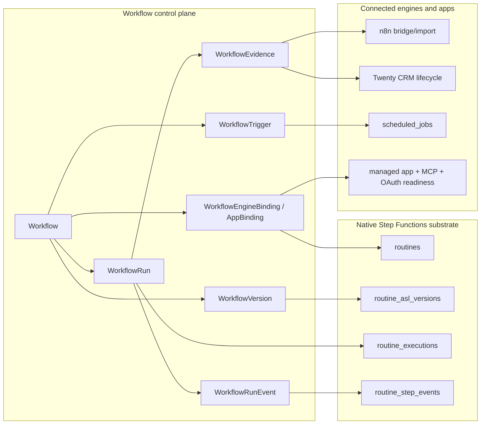
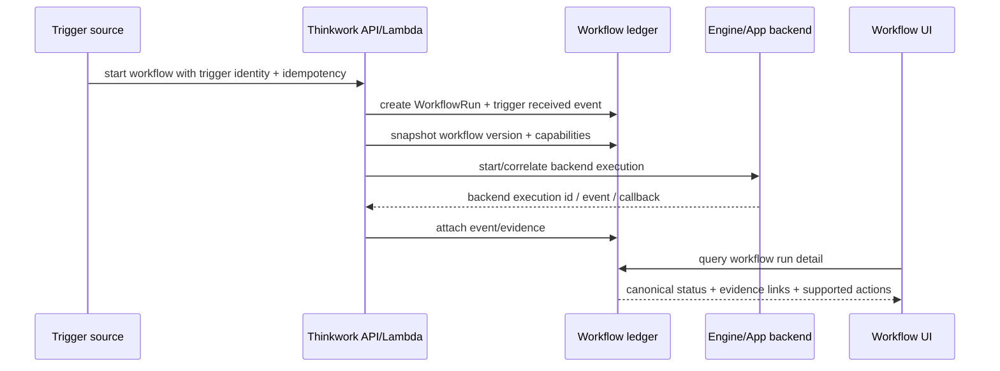

# feat: Add first-class workflow control plane

## Overview

Thinkwork should expose one first-class `Workflow` product surface across Step Functions-backed Routines, n8n bridge/import paths, Twenty CRM lifecycle workflows, connected-app triggers, schedules, webhooks, API calls, and agent invocation. The implementation should add a workflow control plane and canonical run ledger while treating the existing Routine substrate as the first native engine binding, not as a dead-end system to rip out first.

The first useful release is monitoring- and trust-first: one workflow inventory, one run ledger, one run detail experience, explicit trigger identity, engine/app evidence links, capability flags, and a migration/cleanup path that removes confusing user-facing Routine/workflow duplication. Broad visual authoring and runtime unification remain follow-up work.

The n8n path should build on THNK-50 rather than inventing a second connection model. An installed n8n plugin already represents the tenant's managed n8n runtime, workflow-management MCP component, operator instructions, service credential, and package settings. Workflow discovery should therefore start from the n8n plugin detail page: a plugin-owned Workflows tab pulls available n8n workflows through the installed plugin connection and lets an operator connect/promote selected workflows into Thinkwork. The existing package/runtime controls move under a Settings tab on the same page.

This creates a two-level UI model. Plugin pages are source-specific workbenches for discovering, configuring, and promoting workflows from that plugin. `Settings -> Workflows` is the aggregate control-plane view of all workflows that have been promoted/imported/created in Thinkwork, regardless of source: n8n, Twenty, Step Functions-backed Routines, schedules, webhooks, API, or future engines.

---

## Problem Frame

The requirements identify a product split that is already visible in the repo: existing Step Functions-backed Routines, `tenant_workflow_catalog`, n8n import work, managed Twenty CRM, scheduled jobs, app events, and agent tools all carry workflow-like behavior through different nouns and trust models. Operators should not need to know whether an automation originated from a Routine, n8n, Twenty, or a schedule before they can answer what exists, why it ran, what version ran, what happened, and where deeper backend evidence lives.

The plan therefore introduces `Workflow` as the product/control-plane identity and `WorkflowRun` as the durable product ledger. Existing Routine tables remain the native Step Functions execution substrate until compatibility and backfill are proven. User-facing references to "Routine" move toward "Workflow"; internal Routine references are kept only where they describe the Step Functions engine adapter or compatibility layer.

The settings IA should not keep Routines as a peer of Workflows. Step Functions-backed Routines appear as rows in `Settings -> Workflows`; clicking one opens the Workflow detail, which can embed/reuse the existing Routine detail experience as the Step Functions-specific engine detail. This preserves the useful Routine UI investment without presenting "Routines" as a separate product surface.

---

## Requirements Trace

- R1-R5. Add a canonical Workflow identity/control-plane record that wraps existing Step Functions routines, n8n participation, and connected-app lifecycle bindings without presenting separate top-level workflow nouns.
- R6-R11. Add canonical WorkflowRun, event, and evidence records that preserve trigger, version, status, timing, backend IDs, redacted payloads, and capability-specific run operations.
- R12-R14. Define first-class trigger and actor contracts so manual, schedule, webhook, CRM, n8n, API, agent, and child-workflow starts record why they ran and who or what caused them.
- R15-R17. Support n8n through a staged model: stock-node bridge first, supported import/draft diagnostics second, recipe/custom-node promotion later.
- R18-R20. Represent Twenty CRM and other connected apps as typed workflow bindings with readiness and capability flags, while keeping managed app lifecycle, MCP state, user OAuth, and workflow activation separate.
- R21-R22. Reuse and generalize the existing Routine UI and run detail investment, prioritizing observation before broad authoring.
- R23-R24. Leave workflow recipes and agent-composed promotion as later packaging/runtime work.

**Origin actors:** A1 tenant operator, A2 workflow author, A3 tenant agent, A4 connected application, A5 Thinkwork planner/engineer.

**Origin flows:** F1 first-class workflow inventory, F2 workflow run observation, F3 n8n bridge/import lifecycle, F4 CRM lifecycle workflow binding.

**Origin acceptance examples:** AE1 Step Functions routine through workflow run detail, AE2 Twenty CRM event with object/evidence context, AE3 n8n stock-node bridge visible in run ledger, AE4 capability-specific run actions/evidence, AE5 workflow route/alias preserves existing routine monitoring value.

---

## Success Criteria

- A tenant operator can answer what workflows exist, what starts them, what ran recently, what version ran, and where backend evidence lives from one Workflow surface.
- Existing Step Functions-backed Routine value remains intact while Workflow routes/API/tooling become the primary user-facing path.
- Manual and scheduled Step Functions-backed workflow runs both pin and display the exact ASL version row.
- n8n bridge/import and Twenty CRM lifecycle participation show as workflow bindings/runs with explicit readiness, capability, trigger, and evidence context.
- `Settings -> Workflows` aggregates all promoted/imported/created workflows across n8n, Twenty, Step Functions-backed Routines, and future workflow sources.
- `Settings -> Routines` is removed or redirected as a top-level settings surface; existing Routine detail UI is preserved behind Step Functions-backed Workflow detail rows.
- The installed n8n plugin detail page has route-backed Workflows and Settings tabs, mirroring the Memory page tab pattern, and the Workflows tab can discover n8n workflows and connect selected ones into the Thinkwork Workflow control plane.
- User-facing Routine references are cleaned up or explicitly marked compatibility/internal adapter references.
- Workflow migrations and SQL table updates have preflight, postflight, drift, and rollback-readiness coverage for ThinkWork, TEI, and McPherson environments.

---

## Scope Boundaries

- V1 does not migrate every Routine, n8n workflow, or CRM automation into one new runtime.
- V1 does not make n8n the canonical runtime for all Thinkwork workflows.
- V1 does not require every workflow to compile to Step Functions ASL.
- V1 does not remove the existing Routine implementation before the workflow control plane proves itself.
- V1 does not promise a complete visual workflow builder for every engine.
- V1 does not require custom n8n node packaging before a stock-node bridge contract is proven.
- V1 does not attempt a universal event ontology beyond the concrete trigger families Thinkwork already needs.
- V1 does not require retry-from-step, replay, or cancel to work uniformly across every backend.
- V1 does not treat managed app deployment, MCP connector registration, user OAuth, and workflow activation as the same state machine.
- V1 treats Step Functions-backed workflows as the first shippable monitoring slice; n8n and Twenty add participation tiers after that slice proves the ledger/UI shape.

### Deferred to Follow-Up Work

- Full Routine table renames or destructive `routine_*` table removal: defer until the workflow compatibility layer, backfill, API aliases, and UI routes prove stable across deployed environments.
- Full visual cross-engine workflow authoring: defer until monitoring, run trust, and engine capability snapshots are shipped.
- n8n custom node package: defer until the stock-node bridge contract has production examples.
- n8n import activation: defer until the stock-node bridge and evidence path have at least one production-shaped example.
- Agent-composed workflow recipe promotion: defer until WorkflowRun and evidence records can safely explain live work patterns.

---

## Context & Research

### Relevant Code and Patterns

- The root `package.json` is the stricter local build signal for implementation: Node `>=22` and pnpm `>=9`, even though older repo guidance may mention Node `>=20`.
- `packages/database-pg/src/schema/routines.ts` defines the current Routine definition table, including the Step Functions engine partition, ARNs, current version, visibility, owner, and catalog slug.
- `packages/database-pg/src/schema/routine-executions.ts` mirrors Step Functions executions and already records `routine_asl_version_id` for manual runs.
- `packages/database-pg/src/schema/routine-step-events.ts` stores append-only step events, previews, cost, retry count, and offload links that the workflow run detail should reuse.
- `packages/database-pg/graphql/types/routines.graphql` exposes Routine, RoutineExecution, RoutineStepEvent, RoutineAslVersion, `triggerRoutineRun`, `importN8nRoutine`, and tenant tool inventory types.
- `packages/database-pg/graphql/types/customize.graphql` already uses `WorkflowCatalogItem` and `WorkflowBinding` for customize bindings; this naming must be reconciled with the new first-class Workflow domain.
- `packages/database-pg/src/schema/tenant-customize-catalog.ts` uses `tenant_workflow_catalog` for customize/catalog entries. The new control-plane model must distinguish active workflows from catalog/templates.
- `packages/api/src/graphql/resolvers/routines/triggerRoutineRun.mutation.ts` is the best pattern for Step Functions version pinning: it resolves `routine_asl_versions`, starts the version ARN, and persists the exact ASL version row.
- `packages/lambda/job-trigger.ts` currently starts scheduled Routine executions against the alias ARN and omits `routine_asl_version_id`; this is the concrete R9 gap to close early.
- `packages/api/src/graphql/resolvers/routines/importN8nRoutine.mutation.ts` and `packages/api/src/lib/routines/n8n/*` provide a narrow n8n import path that currently creates a Routine directly.
- `packages/api/src/handlers/webhooks/crm-opportunity.ts` and `packages/api/src/lib/spaces/customer-onboarding-workflow.ts` are the current CRM lifecycle path to wrap as connected-app workflow trigger/evidence, not flatten into generic steps.
- `apps/web/src/components/settings/SettingsRoutines.tsx`, `SettingsRoutineDetail.tsx`, `SettingsRoutineExecutionDetail.tsx`, and `apps/web/src/components/routines/ExecutionGraph.tsx` are the existing UI investment to generalize.
- The current n8n plugin detail page at `/settings/plugins/n8n` already displays installed plugin components such as `runtime`, `workflow-management`, `workflow-operator-instructions`, and `package-settings`, plus n8n package settings. This page should become the first plugin-owned UI page with Workflows and Settings tabs.
- `apps/web/src/components/settings/SettingsMemoryHome.tsx` and `apps/web/src/components/settings/SettingsHeaderBar.tsx` provide the existing route-backed header tab pattern to reuse for plugin pages.
- `packages/admin-ops/src/routines.ts` and `packages/lambda/admin-ops-mcp.ts` expose routine create/invoke behavior to agents and need compatibility aliases.
- `packages/api/src/graphql/resolvers/core/managedApplications.ts` and `packages/api/src/lib/managed-mcp-applications.ts` contain managed app lifecycle and MCP reconciliation patterns relevant to Twenty/n8n readiness.
- `packages/deployment-runner/src/apps/twenty.ts` and `terraform/modules/app/*` are relevant when workflow readiness needs to reflect managed app runtime state.

### Institutional Learnings

- `docs/solutions/developer-experience/routine-rebuild-closeout-checkpoints-2026-05-03.md`: workflow products have multiple sources of truth; run detail should render from the version that backed the run, not the latest definition.
- `docs/solutions/architecture-patterns/managed-app-mcp-oauth-lifecycle-2026-06-06.md`: managed app lifecycle, MCP connector state, user OAuth, and app runtime are coupled but separate state machines.
- `docs/solutions/workflow-issues/manually-applied-drizzle-migrations-drift-from-dev-2026-04-21.md`: schema work needs migration markers, preflight checks, drift checks, and explicit application discipline.
- `docs/solutions/integration-issues/spaces-urql-doc-cache-no-live-invalidation.md`: AppSync/subscription events do not automatically refresh web urql document cache; workflow UI needs explicit refetch/polling behavior.
- `docs/solutions/best-practices/every-admin-mutation-requires-requiretenantadmin-2026-04-22.md`: admin mutations that cause external side effects must authorize before starting AWS/app work.

### External References

- No new external research was used for this plan. The codebase already contains the relevant Step Functions, GraphQL, Drizzle, n8n import, managed app, MCP, and web UI patterns; the risky parts are product boundary, migration discipline, and cross-surface consistency rather than missing framework guidance.

---

## Key Technical Decisions

- Create new canonical Workflow tables instead of renaming Routine tables in place: this preserves the working Step Functions substrate, avoids destructive churn, and lets V1 correlate multiple engines/app sources through one product ledger.
- Treat existing `routine_*` rows as native Step Functions engine evidence/bindings: the workflow control plane wraps them first, then later phases can migrate or retire internal names when compatibility is proven.
- Make `WorkflowRun` the product source of truth: Step Functions execution history, n8n execution IDs, CRM event IDs, logs, webhook deliveries, and OpenTelemetry traces attach as evidence/correlation, not as the only durable product record.
- Pin versions before starts: Step Functions-backed workflow runs should resolve the exact `routine_asl_versions` row and start the version ARN for manual and scheduled starts.
- Use typed trigger identity on every run: every run stores trigger type, source system/app, actor/system identity, idempotency key or dedupe handle when available, and invoked workflow version.
- Snapshot engine/app capabilities onto each run: workflow-level capabilities describe normal affordances, but run-level snapshots prevent the UI from showing unsupported retry/cancel/replay actions for a particular backend execution.
- Model readiness as blocking evidence, not silent deactivation: if Twenty/n8n/MCP/user OAuth is unavailable, configured workflows remain visible and attempts create `blocked_not_ready` events with actionable reasons unless the operator explicitly disables them.
- Treat installed Application Plugins as UI extension hosts: plugin detail pages can contribute first-party, route-backed tabs for plugin-owned data and actions. n8n's first tabs are Workflows and Settings; global `Settings -> Workflows` remains the aggregate cross-engine operator view.
- Discover n8n workflows by pulling through the installed n8n plugin connection, not by asking admins for a second n8n URL/API token. The plugin's managed runtime, workflow-management MCP/native n8n access, and tenant service credential are the connection of record.
- Make n8n bridge async-first: stock n8n nodes should be able to call Thinkwork with an idempotency key/correlation ID, receive an acknowledgement/status URL, and optionally wait/callback when supported.
- Import n8n into drafts with diagnostics: unsupported features and credential gaps should create reviewable workflow drafts, not half-activated workflows or opaque import failures.
- Preserve route/API compatibility while cleaning copy: user-facing UI, docs, GraphQL additions, and agent tools move to Workflow names; old Routine routes/mutations stay as compatibility aliases until a tracked cleanup proves no consumers remain.
- Remove Routines from top-level settings navigation once aggregate Workflows exists. Preserve old Routine deep links as redirects or compatibility renderers into the corresponding Workflow detail, with the Routine detail content used only as Step Functions engine-specific detail.

---

## Vocabulary And Support Tiers

| Term                         | Meaning in V1                                                                                    | Where it appears                                                                                      |
| ---------------------------- | ------------------------------------------------------------------------------------------------ | ----------------------------------------------------------------------------------------------------- |
| Workflow                     | Product/control-plane object operators, agents, and API callers use.                             | Primary UI/API/tooling noun.                                                                          |
| Step Functions Routine       | Native engine binding and backend evidence/debug label for existing Routine substrate.           | Workflow detail engine panel, run detail evidence, support docs, logs, compatibility APIs.            |
| Workflow catalog/template    | Reusable recipe/template source, including existing customize catalog rows.                      | Customize/catalog surfaces, not active workflow inventory.                                            |
| WorkflowRun                  | Canonical product run ledger.                                                                    | Run list/detail, agent/API responses, evidence correlation.                                           |
| Workflow evidence            | Backend/app proof linked to a run.                                                               | Step Functions executions, n8n executions, CRM events, webhook deliveries, logs/traces/S3 references. |
| Plugin UI page               | A first-party plugin detail surface with route-backed tabs for plugin-owned source data/actions. | n8n Workflows and Settings tabs; future plugin pages.                                                 |
| Aggregate Workflow inventory | Cross-source list of workflows that Thinkwork owns as product/control-plane records.             | `Settings -> Workflows`, run monitoring, agent/API exposure.                                          |

| Engine/app             | V1 support level                                                                                                           | Deferred support                                              |
| ---------------------- | -------------------------------------------------------------------------------------------------------------------------- | ------------------------------------------------------------- |
| Step Functions Routine | Active workflow identity, manual/scheduled run ledger, run detail, version pinning, evidence, and compatibility routes.    | Destructive Routine table renames/removal.                    |
| n8n bridge             | Stock-node trigger bridge with authenticated ingress, idempotency, WorkflowRun visibility, and evidence links.             | Custom n8n node and broad visual authoring.                   |
| n8n discovery          | Pull available workflows from the installed n8n plugin connection and connect selected ones to Thinkwork Workflow records. | Auto-importing every n8n workflow without operator selection. |
| n8n import             | Draft diagnostics and credential requirements after plugin discovery and bridge contract are proven.                       | Direct activation of arbitrary imports without review.        |
| Twenty CRM             | Connected-app trigger/evidence binding with readiness/capability visibility.                                               | Full CRM-native workflow authoring inside Thinkwork.          |
| Agent/API invocation   | Workflow-named invocation contract after Step Functions-backed workflow runs exist.                                        | Free-form agent-composed workflow runtime as default.         |

---

## Open Questions

### Resolved During Planning

- Should WorkflowRun be new or should Routine be renamed in place? Use new canonical workflow tables and adapter bindings; keep Routine as the Step Functions substrate for V1.
- Should scheduled Step Functions workflow starts pin the exact ASL version? Yes. This directly closes R9 and follows the existing manual-run pattern.
- What actor identity should be visible? Use a typed actor/source contract on every trigger, with room for user, agent, system, API key, connected app, and app-user identity.
- What happens when Twenty/n8n is parked or missing OAuth? Keep the workflow configured, block runtime start with readiness/evidence events, and make the reason visible in UI/API.
- Where does n8n discovery live? In the n8n plugin UI page, using the installed plugin's managed connection; `Settings -> Workflows` shows connected workflows after promotion alongside Twenty, Step Functions-backed Routines, and other sources.
- What happens to `Settings -> Routines`? Remove it as a top-level settings page once `Settings -> Workflows` exists. Preserve Routine detail UI as the Step Functions-specific detail reached from a Workflow row, and preserve old deep links through redirects/compatibility routing.
- Should n8n discovery be pull or push? Pull from Thinkwork through the installed plugin connection for catalog/discovery. Runtime events can push back through bridge/webhook paths later.
- What response mode should n8n bridge use? Async-first with optional short synchronous acknowledgement and explicit status/callback affordances.
- Should unsupported n8n import features block import? They should block activation, not draft creation; diagnostics and credential requirements live on the draft/binding.
- Should CRM record events process immediately? Preserve the original event and support configurable debounce/delay before fetching the object snapshot.

### Deferred to Implementation

- Exact table/index names and migration ordinal: choose during implementation after checking current `packages/database-pg/drizzle/` state.
- Whether workflow run events should physically copy every Routine step event or project them through resolvers for the first slice: decide with test coverage and query performance in hand.
- Final generated TypeScript operation names in `apps/web/src/lib/graphql-queries.ts` and mobile/CLI generated clients: derive from schema/codegen.
- Exact environment connection commands for ThinkWork, TEI, and McPherson: use the deployed stage config/Secrets Manager outputs at execution time, without committing secrets.

---

## High-Level Technical Design

> _This illustrates the intended approach and is directional guidance for review, not implementation specification. The implementing agent should treat it as context, not code to reproduce._

---

## Implementation Units

- U1. **Workflow schema and compatibility model**

**Goal:** Add the durable database model for first-class workflows, workflow versions, triggers, engine/app bindings, workflow runs, run events, and evidence records while preserving Routine substrate compatibility.

**Requirements:** R1-R11, R18-R20, F1, F2, AE1, AE4.

**Dependencies:** None.

**Files:**

- Create: `packages/database-pg/src/schema/workflows.ts`
- Create: `packages/database-pg/src/schema/workflow-runs.ts`
- Create: `packages/database-pg/src/schema/workflow-bindings.ts`
- Modify: `packages/database-pg/src/schema/index.ts`
- Create: `packages/database-pg/drizzle/NNNN_workflow_control_plane.sql`
- Create: `packages/database-pg/drizzle/NNNN_workflow_control_plane_rollback.sql`
- Test: `packages/database-pg/__tests__/workflow-control-plane-schema.test.ts`
- Test: `packages/database-pg/__tests__/migration-NNNN-workflow-control-plane.test.ts`

**Approach:**

- Introduce canonical `workflows`, `workflow_versions`, `workflow_triggers`, `workflow_engine_bindings`, `workflow_runs`, `workflow_run_events`, and `workflow_evidence` or equivalent tables.
- Use explicit engine/app binding records, but only make `step_functions_routine` fully active in the first slice. Keep the model extensible for `n8n_bridge`, `n8n_import`, `twenty_crm`, and future connected-app bindings without requiring unused per-engine fields before their implementation units land.
- Avoid naming collisions with existing `workflow_configs`, which is orchestration configuration rather than the product workflow domain.
- Add compatibility references to existing Routine tables through nullable foreign keys or structured evidence references rather than destructive table renames.
- Keep `tenant_workflow_catalog` semantics separate from active workflow instances; if reused, treat it as a recipe/template/catalog source that can seed workflows, not the workflow identity table itself.
- Include tenant, owner, lifecycle status, current version, trigger family, capability flags, readiness state, and last run fields needed by UI/agents.
- Include migration markers and rollback files following the manual migration drift guidance when drizzle-kit cannot represent required partial indexes or constraints.

**Execution note:** Implement domain behavior test-first around table shape and migration markers before wiring resolvers.

**Patterns to follow:**

- `packages/database-pg/src/schema/routines.ts` for tenant-owned definition rows with CHECK constraints.
- `packages/database-pg/src/schema/routine-executions.ts` for execution indexes and exact version references.
- `packages/database-pg/__tests__/migration-0061.test.ts` for migration marker tests.

**Test scenarios:**

- Happy path: creating a Step Functions-backed workflow binding can reference an existing routine and current ASL version without changing the routine row.
- Happy path: a workflow run can store trigger identity, version, capability snapshot, backend execution reference, and evidence references.
- Edge case: a workflow can exist with no active engine binding while still being visible as draft/blocked.
- Edge case: a binding can be configured but readiness-blocked when its app/MCP/OAuth dependency is unavailable.
- Error path: migration tests fail if required drift markers, rollback drops, or enum/CHECK constraints are missing.
- Integration: schema export includes new tables through `packages/database-pg/src/schema/index.ts` without breaking existing Routine imports.

**Verification:**

- Database schema tests validate table names, key columns, indexes, constraints, and migration marker coverage.
- Existing Routine schema tests still pass without table renames.

---

- U2. **GraphQL workflow API and codegen contract**

**Goal:** Expose first-class Workflow, WorkflowRun, event, evidence, binding, trigger, and readiness types through GraphQL while keeping Routine API compatibility.

**Requirements:** R1-R14, R18-R22, F1, F2, AE1, AE4, AE5.

**Dependencies:** U1.

**Files:**

- Create: `packages/database-pg/graphql/types/workflows.graphql`
- Modify: `packages/database-pg/graphql/schema.graphql`
- Create: `packages/api/src/graphql/resolvers/workflows/index.ts`
- Create: `packages/api/src/graphql/resolvers/workflows/workflows.query.ts`
- Create: `packages/api/src/graphql/resolvers/workflows/workflow.query.ts`
- Create: `packages/api/src/graphql/resolvers/workflows/workflowRuns.query.ts`
- Create: `packages/api/src/graphql/resolvers/workflows/workflowRun.query.ts`
- Create: `packages/api/src/graphql/resolvers/workflows/types.ts`
- Modify: `packages/api/src/graphql/resolvers/index.ts`
- Modify: `apps/web/src/lib/graphql-queries.ts`
- Modify: generated GraphQL outputs in `apps/cli`, `apps/web`, and `apps/mobile` after schema changes.
- Test: `packages/api/src/graphql/resolvers/workflows/workflows.query.test.ts`
- Test: `packages/api/src/graphql/resolvers/workflows/workflowRun.query.test.ts`
- Test: `apps/web/src/lib/graphql-queries.schema.test.ts`

**Approach:**

- Add workflow queries rather than overloading Routine queries with new fields.
- Shape the first Workflow API slice as a projection across canonical workflow rows plus Step Functions Routine binding evidence. Leave n8n/app binding resolver expansion to U5, U6, and U11.
- Include capability flags and readiness reasons directly in the query model so UI and agents do not infer support from engine names.
- Add deprecation notes to Routine GraphQL fields only after workflow equivalents are available and consumers are migrated.
- Preserve tenant auth behavior with `resolveCallerTenantId(ctx)` where required and admin authorization for mutations that can start or alter workflows.

**Patterns to follow:**

- `packages/api/src/graphql/resolvers/routines/index.ts` for resolver module organization.
- `packages/api/src/graphql/resolvers/core/managedApplications.ts` for readiness projection and managed app state.
- Existing generated schema/codegen scripts described in `AGENTS.md`.

**Test scenarios:**

- Happy path: `workflows` returns a Step Functions Routine-backed workflow with binding type, status, triggers, current version, last run, and capabilities.
- Happy path: `workflowRun` returns canonical trigger identity, version, status, and current ledger fields for a Step Functions-backed run after U3/U4 wire correlation.
- Edge case: workflow query returns readiness-blocked bindings without hiding the workflow.
- Error path: non-tenant callers cannot read another tenant's workflows.
- Integration: generated web queries compile against the new schema while existing Routine queries continue to compile.

**Verification:**

- GraphQL schema builds, API resolver tests pass, and available consumer codegen outputs are regenerated.

---

- U3. **Routine adapter and scheduled version pinning**

**Goal:** Make existing Step Functions routines appear as workflows and close the scheduled-run version capture gap.

**Requirements:** R3, R6, R9, R13, R21, F2, AE1.

**Dependencies:** U1, U2.

**Files:**

- Create: `packages/api/src/lib/workflows/routine-adapter.ts`
- Modify: `packages/api/src/graphql/resolvers/routines/triggerRoutineRun.mutation.ts`
- Modify: `packages/lambda/job-trigger.ts`
- Modify: `packages/api/src/handlers/routine-execution-callback.ts`
- Modify: `packages/api/src/handlers/routine-step-callback.ts`
- Test: `packages/api/src/lib/workflows/routine-adapter.test.ts`
- Test: `packages/api/src/graphql/resolvers/routines/triggerRoutineRun.mutation.test.ts`
- Test: `packages/lambda/__tests__/job-trigger.skill-run.test.ts` or a new `packages/lambda/__tests__/job-trigger.routine-workflow.test.ts`
- Test: `packages/api/src/handlers/routine-execution-callback.test.ts`
- Test: `packages/api/src/handlers/routine-step-callback.test.ts`

**Approach:**

- Add an adapter that maps each Step Functions Routine to a Workflow identity and engine binding.
- Ensure manual `triggerRoutineRun` creates or correlates a WorkflowRun before starting or immediately after resolving the exact ASL version, with failure behavior that never leaves an invisible backend run when preventable.
- Change scheduled routine starts in `job-trigger.ts` to resolve `routine_asl_versions`, start the captured version ARN, and persist `routine_asl_version_id`, matching the manual path.
- Correlate `routine_executions` and `routine_step_events` to WorkflowRun events/evidence either by copying event summaries or projecting through the workflow resolver for the first slice.
- Keep legacy `legacy_python` routines visible as archived/unsupported or compatibility-only workflows until they are retired.

**Execution note:** Add characterization tests for current manual and scheduled Routine behavior before changing `job-trigger.ts`.

**Patterns to follow:**

- `packages/api/src/graphql/resolvers/routines/triggerRoutineRun.mutation.ts` for version pinning and runtime input protection.
- `packages/lambda/job-trigger.ts` for schedule dispatch and budget pause behavior.
- `docs/solutions/developer-experience/routine-rebuild-closeout-checkpoints-2026-05-03.md` for version-backed execution detail.

**Test scenarios:**

- Covers AE1. Happy path: manual start creates a WorkflowRun correlated to a RoutineExecution with exact ASL version and Step Functions execution ARN.
- Covers AE1. Happy path: scheduled start resolves the same exact ASL version row pattern as manual start and stores it on the RoutineExecution/WorkflowRun.
- Edge case: routine alias flips after lookup; the run still starts the captured version ARN.
- Edge case: legacy Python routine appears as non-runnable/unsupported in workflow projection without breaking existing archived Routine reads.
- Error path: missing current ASL version prevents backend execution and records/logs a clear failure before starting Step Functions.
- Integration: EventBridge callback updates remain correlated to both RoutineExecution and WorkflowRun views.

**Verification:**

- Scheduled and manual Step Functions-backed workflow runs show the same version-trust fields through workflow API and existing Routine run detail remains functional.

---

- U4. **Canonical trigger, event, and evidence ledger**

**Goal:** Implement the workflow run trust backbone: typed trigger identity, idempotency, event provenance, redacted payload summaries, and backend evidence references.

**Requirements:** R6-R14, R19, R20, F2, AE2, AE3, AE4.

**Dependencies:** U1, U2, U3.

**Files:**

- Create: `packages/api/src/lib/workflows/trigger-contract.ts`
- Create: `packages/api/src/lib/workflows/run-ledger.ts`
- Create: `packages/api/src/lib/workflows/evidence-redaction.ts`
- Modify: `packages/api/src/handlers/webhooks/task-event.ts`
- Modify: `packages/api/src/handlers/connections.connector-trigger.test.ts`
- Modify: `packages/api/src/__tests__/webhook-crm-opportunity.test.ts`
- Test: `packages/api/src/lib/workflows/trigger-contract.test.ts`
- Test: `packages/api/src/lib/workflows/run-ledger.test.ts`
- Test: `packages/api/src/lib/workflows/evidence-redaction.test.ts`

**Approach:**

- Define trigger actors for `user`, `agent`, `system`, `api_key`, `schedule`, `connected_app`, `app_user`, and `child_workflow` where applicable.
- Require stable idempotency/dedupe keys for externally retried starts: schedule fire ID, webhook delivery ID, CRM event ID, n8n execution/correlation ID, API idempotency key, or child-workflow invocation key. Reserve generated fallbacks only for explicitly non-idempotent/manual starts.
- Validate webhook/app-event source authenticity before creating WorkflowRuns: provider signature or shared secret, timestamp tolerance, replay prevention, and tenant/workflow lookup from a trusted signed binding rather than caller-controlled payload fields.
- Model event provenance as native event, app callback, engine history, output-inferred status, or operator decision.
- Store raw payloads by reference when large/sensitive; inline only summaries and safe metadata. Evidence storage must define tenant-scoped access policy, encryption/KMS posture, lifecycle TTL/deletion behavior, resolver authorization, and a no-raw-payload-logging rule.
- Snapshot engine/app capability flags and readiness state at run creation so UI actions are based on the run's actual context.

**Patterns to follow:**

- `packages/api/src/__tests__/idempotency.test.ts` and `packages/api/src/__tests__/idempotency-run-with.test.ts` for dedupe expectations.
- `packages/lambda/routine-output-redactor.ts` for output redaction posture.
- `packages/api/src/handlers/webhooks/task-event.ts` and webhook delivery tests for external event handling.

**Test scenarios:**

- Happy path: schedule, manual, agent, API, and webhook trigger examples normalize into the same typed trigger contract; n8n and CRM engine-specific examples are covered in U5/U6.
- Happy path: evidence links can reference Step Functions execution, webhook delivery, log group, trace ID, and redacted payload summary; n8n and CRM evidence links are covered in U5/U6.
- Edge case: duplicate external trigger with same idempotency key returns or links to the existing WorkflowRun instead of creating a second run.
- Edge case: evidence payload over inline size limit is stored by reference with a summary.
- Error path: missing required actor/source identity blocks workflow start with a clear validation error.
- Error path: external trigger without a stable idempotency key is rejected unless the trigger contract explicitly marks it non-idempotent.
- Error path: webhook/app event with missing signature, expired timestamp, replayed nonce, or tenant mismatch is rejected before ledger creation.
- Error path: secret-like fields are redacted from evidence summaries by default.
- Integration: webhook events create WorkflowRun events without losing their existing webhook delivery records.

**Verification:**

- Run ledger tests demonstrate the shared contract across native Routine/manual/schedule, webhook, and agent/API triggers; n8n and CRM engine-specific behavior is verified in U5 and U6.

---

- U5. **n8n plugin workflow discovery and stock-node bridge**

**Goal:** Extend the installed n8n plugin with a plugin-owned Workflows tab for discovery/promotion, then make connected n8n workflows participate in Thinkwork runs through a stock-node bridge without making n8n the canonical workflow runtime.

**Requirements:** R15-R16, R6-R8, R12-R14, F3, AE3, AE4.

**Dependencies:** U1, U2, U4.

**Files:**

- Create: `apps/web/src/routes/_authed/settings.plugins.n8n.workflows.tsx` or the equivalent route file for the existing `/settings/plugins/n8n` route family.
- Create: `apps/web/src/routes/_authed/settings.plugins.n8n.settings.tsx` or the equivalent route file for the package/runtime Settings tab.
- Create: `apps/web/src/components/settings/plugins/n8n/N8nPluginHome.tsx`
- Create: `apps/web/src/components/settings/plugins/n8n/N8nPluginWorkflows.tsx`
- Create: `apps/web/src/components/settings/plugins/n8n/N8nPluginSettings.tsx`
- Create: `packages/api/src/graphql/resolvers/workflows/discoverN8nWorkflows.query.ts`
- Create: `packages/api/src/graphql/resolvers/workflows/connectN8nWorkflow.mutation.ts`
- Create: `packages/api/src/lib/workflows/n8n-discovery.ts`
- Create: `packages/api/src/lib/workflows/n8n-bridge-contract.ts`
- Create: `packages/api/src/graphql/resolvers/workflows/createN8nWorkflowBridge.mutation.ts`
- Create: `packages/api/src/handlers/webhooks/n8n-bridge.ts` if stock n8n should call a public webhook-style URL rather than authenticated GraphQL.
- Modify: `scripts/build-lambdas.sh` if the bridge uses a new Lambda handler.
- Modify: `terraform/modules/app/*` if the bridge uses a new public route.
- Test: `apps/web/src/components/settings/plugins/n8n/N8nPluginHome.test.tsx`
- Test: `apps/web/src/components/settings/plugins/n8n/N8nPluginWorkflows.test.tsx`
- Test: `packages/api/src/lib/workflows/n8n-discovery.test.ts`
- Test: `packages/api/src/graphql/resolvers/workflows/discoverN8nWorkflows.query.test.ts`
- Test: `packages/api/src/graphql/resolvers/workflows/connectN8nWorkflow.mutation.test.ts`
- Test: `packages/api/src/lib/workflows/n8n-bridge-contract.test.ts`
- Test: `packages/api/src/graphql/resolvers/workflows/createN8nWorkflowBridge.mutation.test.ts`
- Test: `packages/api/src/handlers/webhooks/n8n-bridge.test.ts` if a handler is added.

**Approach:**

- Introduce plugin UI pages as a reusable pattern for first-party plugin detail surfaces. The n8n page should mirror `SettingsMemoryHome`: one stable breadcrumb/title, route-backed header tabs, embedded tab bodies, and no duplicate in-body tab strip.
- Split n8n plugin detail into at least two tabs: `Workflows` for discovered n8n workflows and their Thinkwork connection state, and `Settings` for the current package/runtime controls.
- Discover n8n workflows by pulling through the installed n8n plugin's workflow-management/native MCP connection and tenant service credential. Do not require an operator to enter a second n8n URL or API credential for the managed plugin runtime.
- Show discovered n8n workflows with enough metadata to decide whether to connect them: name, active/inactive state when available, last modified/last execution when available, trigger types when available, existing Thinkwork connection state, readiness, and any discovery warning.
- Let an operator connect/promote a discovered n8n workflow into a canonical Thinkwork Workflow record with an n8n engine/app binding. Connecting should not auto-activate arbitrary imports or copy every n8n workflow by default.
- Keep `Settings -> Workflows` as the aggregate view. The n8n plugin Workflows tab is source-specific discovery/connection; connected items then appear in the aggregate inventory beside Step Functions-backed Routines, Twenty workflows, and future sources.
- Decide the ingress shape explicitly: either n8n calls authenticated GraphQL with a supported credential, or Thinkwork adds a dedicated webhook-style bridge handler with Terraform/API Gateway wiring. Do not leave both implicit.
- Define a bridge contract for stock n8n HTTP/Webhook/Wait nodes: tenant/workflow-scoped signed token or shared secret, hashed/rotatable credential storage, replay window, idempotency key, correlation ID, trigger payload summary, acknowledgement, authenticated or unguessable TTL-bound status URL, signed optional callback URL, and timeout semantics.
- Represent live n8n bridge runs as WorkflowRuns with n8n execution/correlation evidence.
- Leave import/draft diagnostics to U11 after the bridge contract has a production-shaped example.

**Patterns to follow:**

- `apps/web/src/components/settings/SettingsMemoryHome.tsx` for route-backed header tabs and embedded tab bodies.
- `apps/web/src/components/settings/SettingsHeaderBar.tsx` for centered settings tabs in the header.
- Existing `/settings/plugins/n8n` page behavior for installed plugin component/status display and package settings.
- `packages/api/src/handlers/webhooks/README.md` for webhook handler, Terraform route, and bundler wiring if using a public bridge URL.
- `packages/api/src/graphql/resolvers/tenant-credentials/*` for credential lookup and auth safety.

**Test scenarios:**

- Happy path: `/settings/plugins/n8n` renders a stable n8n breadcrumb/title with Workflows and Settings tabs.
- Happy path: the n8n Workflows tab discovers available n8n workflows through the installed plugin connection and shows whether each one is already connected to Thinkwork.
- Happy path: connecting a discovered n8n workflow creates a canonical Workflow with an n8n binding, and the workflow appears in `Settings -> Workflows`.
- Edge case: n8n plugin installed but workflow-management component not ready shows an actionable readiness state instead of an empty workflow list.
- Edge case: discovered n8n workflow is inactive, unsupported, or missing metadata; it can still be displayed with warnings without being auto-connected.
- Covers AE3. Happy path: a stock-node n8n bridge request creates a WorkflowRun with trigger identity, n8n source metadata, and an acknowledgement/status response.
- Edge case: n8n bridge request repeats with the same idempotency key and returns the existing run.
- Error path: n8n bridge request with invalid signature/secret, expired timestamp, tenant mismatch, replayed nonce, or missing stable idempotency key is rejected.

**Verification:**

- Operators can discover and connect n8n workflows from the n8n plugin page, then monitor connected workflows and n8n-origin runs from the aggregate Workflow inventory/run detail with evidence links.

---

- U6. **Connected-app workflow bindings and readiness matrix**

**Goal:** Represent Twenty CRM and future connected-app workflow semantics as typed bindings with readiness, capability flags, and lifecycle evidence.

**Requirements:** R4, R12-R14, R18-R20, F4, AE2, AE4.

**Dependencies:** U1, U2, U4.

**Files:**

- Create: `packages/api/src/lib/workflows/connected-app-bindings.ts`
- Modify: `packages/api/src/lib/managed-mcp-applications.ts`
- Modify: `packages/api/src/graphql/resolvers/core/managedApplications.ts`
- Modify: `packages/api/src/handlers/webhooks/crm-opportunity.ts`
- Modify: `packages/api/src/lib/spaces/customer-onboarding-workflow.ts`
- Modify: `packages/deployment-runner/src/apps/twenty.ts` only if readiness state needs new deployment metadata.
- Modify: `packages/api/src/handlers/connections.connector-trigger.test.ts`
- Modify: `packages/api/src/__tests__/webhook-crm-opportunity.test.ts`
- Modify: `packages/api/src/lib/spaces/customer-onboarding-workflow.test.ts`
- Modify: `apps/web/src/components/settings/SettingsCrm.tsx`
- Test: `packages/api/src/lib/workflows/connected-app-bindings.test.ts`
- Test: `packages/api/src/graphql/resolvers/core/managedApplications.test.ts`

**Approach:**

- Define app binding capability fields for trigger families, actions, resources, credential requirements, health/readiness, evidence link types, and run action support.
- Add a readiness matrix that distinguishes workflow enabled/disabled, managed app provisioned/runtime enabled/parked/destroyed, MCP row installed/enabled, user OAuth active/expired/missing, and policy blocks.
- For CRM lifecycle events, preserve event type, object ID, source app, event timestamp, object snapshot timing, debounce/delay configuration, and evidence link.
- Treat unavailable app state as `blocked_not_ready` run/event evidence rather than silently pausing enabled workflows.

**Patterns to follow:**

- `docs/solutions/architecture-patterns/managed-app-mcp-oauth-lifecycle-2026-06-06.md` for app/MCP/OAuth state separation.
- `packages/api/src/lib/managed-mcp-applications.ts` for managed MCP reconciliation.
- `packages/api/src/graphql/resolvers/core/managedApplications.ts` for deployment/readiness projection.

**Test scenarios:**

- Covers AE2. Happy path: Twenty CRM opportunity stage change creates a WorkflowRun with CRM object, event type, source app, trigger timing, and evidence link.
- Happy path: ready Twenty binding exposes CRM trigger/action capabilities without implying unsupported Step Functions actions.
- Edge case: parked Twenty app leaves configured workflow visible but marks trigger/run as blocked with readiness evidence.
- Edge case: missing user OAuth blocks user-scoped CRM workflow invocation without falling back to tenant-wide credentials.
- Error path: destroyed managed app removes runnable readiness while preserving historical run evidence.
- Integration: managed app status changes update workflow binding readiness projection without mutating workflow activation state.

**Verification:**

- Workflow API and CRM settings agree on app readiness while preserving separate lifecycle controls.

---

- U7. **Workflow inventory and run monitoring UI**

**Goal:** Add the first-class Workflow operator UI by generalizing existing Routine list/detail/run detail components.

**Requirements:** R1-R11, R19, R21-R22, F1, F2, AE1, AE4, AE5.

**Dependencies:** U2, U3, U4. U6 enriches readiness and app-specific panels after the Step Functions-first UI is shippable.

**Files:**

- Create: `apps/web/src/routes/_authed/settings.workflows.index.tsx`
- Create: `apps/web/src/routes/_authed/settings.workflows.$workflowId.tsx`
- Create: `apps/web/src/routes/_authed/settings.workflows.$workflowId_.runs.$runId.tsx`
- Create: `apps/web/src/components/workflows/WorkflowInventory.tsx`
- Create: `apps/web/src/components/workflows/WorkflowDetail.tsx`
- Create: `apps/web/src/components/workflows/WorkflowRunDetail.tsx`
- Create: `apps/web/src/components/workflows/WorkflowEvidencePanel.tsx`
- Modify: `apps/web/src/components/settings/SettingsRoutines.tsx`
- Modify: `apps/web/src/components/settings/SettingsRoutineDetail.tsx`
- Modify: `apps/web/src/components/settings/SettingsRoutineExecutionDetail.tsx`
- Modify: `apps/web/src/components/routines/ExecutionGraph.tsx`
- Modify: `apps/web/src/lib/routine-queries.ts`
- Modify: `apps/web/src/lib/settings-queries.ts`
- Modify: `apps/web/src/routes/_authed/settings.tsx`
- Test: `apps/web/src/components/workflows/WorkflowInventory.test.tsx`
- Test: `apps/web/src/components/workflows/WorkflowRunDetail.test.tsx`
- Test: `apps/web/src/routes/_authed/-settings.workflow-routing.test.tsx`

**Approach:**

- Add `/settings/workflows` as the aggregate workflow route and remove the Routines list from top-level settings navigation.
- Add a settings IA matrix for existing Automations, Routines, Webhooks, CRM, Applications, and Workflows: canonical route, nav label, old route behavior, whether it nests under Workflows, and what remains visible outside Workflows. For Routines, the target behavior is no top-level list; old list routes redirect to Workflows, and old detail routes redirect/render the corresponding Step Functions-backed Workflow detail.
- Display promoted/imported/created workflow identity, status, owner, trigger families, source plugin/engine/app, engine/app bindings, readiness, current version, last run, and supported operations with a default operator scanning model.
- Define default inventory columns/order and filters for readiness, engine/app binding, trigger family, owner, lifecycle status, and last run. Distinguish empty inventory, no search results, and readiness-blocked cohorts.
- Show source-aware affordances without turning the aggregate inventory into a source-specific configuration page: n8n-specific discovery stays in `/settings/plugins/n8n`, CRM-specific app readiness stays in CRM/plugin surfaces, and `Settings -> Workflows` links back to those source pages where appropriate.
- Generalize Routine detail/run detail to render inside Workflow detail for Step Functions-backed rows, including the existing Routine ASL graph and execution detail where the binding is Step Functions-backed.
- Use a canonical run detail hierarchy: summary/status header, trigger/actor card, version/capability snapshot, event timeline, evidence panel, payload/object context, and actions. Engine-specific inserts add Step Functions graph, n8n execution evidence, CRM object/event evidence, and missing/partial evidence states.
- Show capability-specific actions and evidence links through an action-state matrix: visibility rule, disabled reason, confirmation requirement, loading label, success result, failure copy, refresh behavior, permission-blocked state, and emitted run event.
- Add UI state matrices for inventory, workflow detail, run detail, evidence panel, and actions covering loading, empty, no results, API error, unauthorized, not found, readiness blocked, evidence pending, evidence redacted/offloaded, backend missing, stale polling, and divergent ledger/backend state.
- Include responsive/accessibility requirements: mobile inventory columns, detail panel stacking, graph/timeline keyboard navigation, action-menu focus management, screen-reader labels for status/readiness/action availability, and minimum touch targets.
- Keep polling/refetch behavior explicit because GraphQL subscription events do not automatically invalidate web document cache.
- Keep compact settings-style IA; avoid introducing a separate marketing-like workflow console.

**Patterns to follow:**

- `apps/web/src/components/settings/SettingsRoutines.tsx` for settings table pane behavior.
- `apps/web/src/components/settings/SettingsRoutineExecutionDetail.tsx` for run detail layout and polling.
- `apps/web/src/components/routines/ExecutionGraph.tsx` for ASL/manifest-backed graph rendering.
- `docs/solutions/design-patterns/audit-existing-ui-and-data-model-before-parallel-build-2026-04-28.md` for auditing existing UI before parallel builds.

**Test scenarios:**

- Covers AE5. Happy path: `/settings/workflows` lists existing Step Functions routines as workflows with last run and engine binding, while `Settings -> Routines` is absent from primary navigation.
- Covers AE1. Happy path: Step Functions-backed WorkflowRun detail renders workflow identity, trigger, exact version, Step Functions evidence, and step events.
- Covers AE4. Happy path: n8n-backed run shows evidence link and hides unsupported Step Functions-only actions.
- Edge case: readiness-blocked workflow shows actionable reason without disappearing from inventory.
- Edge case: old `/settings/routines` list route redirects to `/settings/workflows`; old `/settings/routines/$routineId` deep link redirects or renders the matching Step Functions-backed Workflow detail without a blank page.
- Edge case: inventory and run detail render evidence pending/redacted/offloaded/backend-missing states without implying the run is fully unknown.
- Error path: workflow not found renders a clear empty/error state.
- Integration: starting a workflow refreshes the activity list and run detail without relying on implicit AppSync cache invalidation.

**Verification:**

- Operators can complete F1 and F2 through the Workflow route; Step Functions-specific Routine detail remains reachable from Workflow detail while old Routine deep links work during transition.

---

- U8. **Workflow/Routine reference cleanup and compatibility deprecation**

**Goal:** Clean up existing workflow and routine references so product surfaces consistently say Workflow, remove Routines as a top-level settings surface, and preserve internal/detail compatibility where Routine remains the Step Functions adapter.

**Requirements:** R1-R5, R21-R22, AE5.

**Dependencies:** U2, U3, U7.

**Files:**

- Modify: `apps/web/src/components/settings/SettingsRoutines.tsx`
- Modify: `apps/web/src/components/settings/SettingsRoutineDetail.tsx`
- Modify: `apps/web/src/components/settings/SettingsRoutineExecutionDetail.tsx`
- Modify: `apps/web/src/routes/_authed/settings.routines.index.tsx`
- Modify: `apps/web/src/routes/_authed/settings.routines.$routineId.tsx`
- Modify: `apps/web/src/routes/_authed/settings.routines.$routineId_.executions.$executionId.tsx`
- Modify: `apps/web/src/routes/_authed/_shell/customize.workflows.tsx`
- Modify: `packages/database-pg/src/schema/tenant-customize-catalog.ts`
- Modify: `apps/web/src/lib/routine-queries.ts`
- Modify: `packages/database-pg/graphql/types/routines.graphql`
- Modify: `packages/database-pg/graphql/types/customize.graphql`
- Modify: relevant docs under `docs/src/` and `docs/solutions/` only where they are user-facing or current operational guidance.
- Test: `apps/web/src/routes/_authed/-settings.workflow-routing.test.tsx`
- Test: `apps/web/src/lib/graphql-queries.schema.test.ts`

**Approach:**

- Run an audit of `routine`, `Routine`, `workflow`, and `Workflow` references and classify each as product-facing, API compatibility, internal adapter, historical docs, or unrelated use.
- Rename product-facing navigation, page titles, breadcrumbs, buttons, empty states, and descriptions from Routine to Workflow.
- Remove Routines from settings primary navigation after `/settings/workflows` ships. Preserve Routine detail components as Step Functions-specific detail modules embedded from Workflow detail.
- Add Workflow-named GraphQL aliases before deprecating Routine-named read operations. Agent/admin tool aliases are owned by U9.
- Keep internal names like `routine_executions` and `routine_step_events` where they describe the native Step Functions adapter and until table renames are deliberately scheduled.
- Update Customize copy so `WorkflowCatalogItem` does not conflict with the new first-class Workflow identity; clarify whether those rows are recipes/templates/catalog entries or active workflows.
- Rename or alias customize-facing concepts toward workflow catalog/template terminology if they would otherwise collide with active Workflow inventory.
- Add deprecation comments where Routine APIs remain intentionally supported.

**Execution note:** Treat this as a controlled migration, not a find/replace. Historical solution docs and table names should not be rewritten unless they are current user/operator guidance.

**Patterns to follow:**

- `docs/solutions/conventions/admin-trim-ui-preserve-backend-mutations-2026-05-13.md` for preserving backend mutations while trimming/changing UI.
- `docs/plans/2026-06-07-003-refactor-applications-and-memory-settings-ia-plan.md` for settings IA route stability.

**Test scenarios:**

- Happy path: settings navigation has Workflows, not Routines, as the visible product surface.
- Happy path: old Routine list route redirects to Workflows; old Routine detail links continue to resolve while showing Workflow-facing copy and Step Functions-specific detail.
- Edge case: internal adapter code can still import Routine types without circular Workflow aliases.
- Error path: removing/renaming Routine GraphQL fields before generated consumers move is caught by schema/codegen tests.
- Integration: workflow route/copy changes do not remove Routine-named API/tool compatibility owned by U9.

**Verification:**

- A repo reference audit has a checked-in summary or comment trail showing which Routine references remain and why.
- User-facing UI/docs no longer present Routines as a separate workflow product, while Step Functions-backed Workflow detail can still show Routine engine detail where useful.

---

- U9. **Agent and API workflow invocation contract**

**Goal:** Let agents, API callers, and child workflows invoke workflows through a Thinkwork workflow contract rather than raw Routine IDs, Step Functions ARNs, n8n URLs, or CRM details.

**Requirements:** R12-R14, R19, R24, F2, AE3, AE4.

**Dependencies:** U2, U3, U4, U8.

**Files:**

- Create: `packages/admin-ops/src/workflows.ts`
- Modify: `packages/admin-ops/src/index.ts`
- Modify: `packages/admin-ops/src/routines.ts`
- Modify: `packages/lambda/admin-ops-mcp.ts`
- Modify: `packages/api/src/graphql/resolvers/routines/tenantToolInventory.query.ts`
- Create: `packages/api/src/graphql/resolvers/workflows/triggerWorkflowRun.mutation.ts`
- Test: `packages/admin-ops/src/workflows.test.ts`
- Test: `packages/lambda/__tests__/admin-ops-mcp.test.ts`
- Test: `packages/api/src/graphql/resolvers/workflows/triggerWorkflowRun.mutation.test.ts`
- Test: `packages/api/src/graphql/resolvers/routines/tenantToolInventory.query.test.ts`

**Approach:**

- Add `triggerWorkflowRun` as the canonical mutation/tool path.
- Support agent-visible workflow inventory with capability and readiness flags.
- Keep `triggerRoutineRun` and `routine_invoke` as compatibility wrappers that delegate into workflow invocation for Step Functions-backed workflows once available.
- Enforce visibility/ownership rules from existing Routine behavior and extend them to Workflow-level tenant/shared/private semantics.
- For API-key workflow invocation, define issuance actor, per-tenant/per-workflow scopes, hashed storage, rotation/revocation, audit logging, rate limits, and tenant isolation tests.
- Prevent agents from needing raw backend identifiers; backend IDs should appear only as evidence after run creation.

**Patterns to follow:**

- `packages/admin-ops/src/routines.ts` for current private/tenant-shared ownership rules.
- `packages/admin-ops/src/routines.test.ts` for agent visibility tests.
- `packages/api/src/graphql/resolvers/routines/tenantToolInventory.query.ts` for tool inventory aggregation.

**Test scenarios:**

- Happy path: agent invokes a tenant-shared workflow and receives a WorkflowRun lite response.
- Happy path: Routine compatibility invocation delegates to WorkflowRun creation for a Step Functions-backed binding.
- Edge case: private workflow can only be invoked by its owning/authorized agent.
- Edge case: readiness-blocked workflow appears in inventory but cannot be invoked without a clear reason.
- Error path: agent/API caller cannot pass raw Step Functions/n8n backend IDs to bypass workflow authorization.
- Error path: revoked, rotated, cross-tenant, over-scoped, or rate-limited API keys cannot invoke workflows and leave audit evidence.
- Integration: tenant tool inventory includes workflows with capability/readiness metadata.

**Verification:**

- Agent-facing tools can start workflows without knowing Routine IDs or backend URLs, while existing Routine tools still operate during deprecation.

---

- U10. **Multi-environment migration, backfill, and SQL operations runbook**

**Goal:** Prepare and execute schema/data migration safely across ThinkWork, TEI, and McPherson environments, including SQL table updates, drift checks, and rollback posture.

**Requirements:** R1-R11, R21-R22, success criteria above, and the 2026-06-20 user requirement to clean up existing Workflow/Routine references and be prepared to update SQL tables in ThinkWork, TEI, and McPherson.

**Dependencies:** U1 for early runbook and backfill design. U2-U9 before final multi-environment execution.

**Files:**

- Create: `docs/runbooks/workflow-control-plane-migration.md`
- Modify: `scripts/db-migrate-manual.sh` only if new marker kinds or checks are needed.
- Modify: `packages/database-pg/drizzle/NNNN_workflow_control_plane.sql`
- Modify: `packages/database-pg/drizzle/NNNN_workflow_control_plane_rollback.sql`
- Create: `packages/database-pg/drizzle/NNNN_workflow_backfill_existing_routines.sql` if backfill cannot be handled by application code.
- Create: `packages/database-pg/drizzle/NNNN_workflow_backfill_existing_routines_rollback.sql` where rollback is safe.
- Test: `packages/database-pg/__tests__/migration-NNNN-workflow-control-plane.test.ts`
- Test: `packages/database-pg/__tests__/migration-NNNN-workflow-backfill.test.ts`

**Approach:**

- Inventory ThinkWork, TEI, and McPherson database/stage names, secrets references, and tenant identifiers at execution time without committing environment secrets.
- Add preflight SQL that confirms required Routine, ASL version, scheduled job, managed app, tenant credential, and workflow catalog structures exist before applying workflow migrations.
- Define migration/backfill order before application read/write wiring: additive tables/columns first, backfill workflows from existing Step Functions routines, then application reads/writes, then user-facing reference cleanup.
- Backfill existing routines into workflows with deterministic ids or unique binding constraints so re-running is idempotent.
- Keep migration files explicit about whether they are drizzle-kit tracked or manual; include `-- creates`, `-- creates-column`, `-- creates-constraint`, and preflight markers where required.
- Run `pnpm db:migrate-manual` or equivalent drift check per environment after manual migrations.
- Add postflight SQL checks for each environment: workflow counts match eligible routines, RoutineExecution rows correlate to WorkflowRuns where expected, scheduled jobs can resolve exact ASL version, and readiness-blocked bindings are visible.
- Plan rollback as disable-new-writes plus compatibility reads first; destructive table removal is outside V1.

**Patterns to follow:**

- `docs/solutions/workflow-issues/manually-applied-drizzle-migrations-drift-from-dev-2026-04-21.md` for manual migration discipline.
- `packages/database-pg/__tests__/migration-0061.test.ts` for version-capture migration testing.
- Existing `AGENTS.md` database and GraphQL schema guidance.

**Test scenarios:**

- Happy path: migration marker tests prove all created tables, columns, indexes, constraints, and rollback drops are declared.
- Happy path: backfill inserts one Workflow per eligible Routine and one binding per Routine without duplicate rows on re-run.
- Edge case: archived or legacy Python routines are backfilled as archived/unsupported or skipped according to documented criteria.
- Edge case: missing manual prerequisite migration fails preflight before partial writes.
- Error path: postflight check fails if a scheduled Routine-backed workflow lacks version-pin capability.
- Integration: ThinkWork, TEI, and McPherson runbook records per-environment preflight, migration, postflight, and rollback readiness outcomes.

**Verification:**

- Runbook exists before application read/write wiring or environment mutation and includes exact preflight/postflight query intent, environment checklist, owner approvals, rollback posture, and drift commands.
- Implementer is prepared to update SQL tables in ThinkWork, TEI, and McPherson once migrations are built and reviewed, with final execution gated until the relevant code paths are ready.

---

- U11. **n8n import draft diagnostics**

**Goal:** Add supported n8n import into reviewable Workflow drafts after the bridge contract has proved the participation model.

**Requirements:** R15-R17, F3, AE3.

**Dependencies:** U5.

**Files:**

- Create: `packages/api/src/graphql/resolvers/workflows/importN8nWorkflowDraft.mutation.ts`
- Modify: `packages/api/src/graphql/resolvers/routines/importN8nRoutine.mutation.ts`
- Modify: `packages/api/src/lib/routines/n8n/workflow-importer.ts`
- Modify: `packages/api/src/lib/routines/n8n/workflow-mapper.ts`
- Test: `packages/api/src/graphql/resolvers/workflows/importN8nWorkflowDraft.mutation.test.ts`
- Test: `packages/api/src/lib/routines/n8n/workflow-importer.test.ts`
- Test: `packages/api/src/lib/routines/n8n/workflow-mapper.test.ts`

**Approach:**

- Change import behavior so supported n8n workflows can produce workflow drafts with source metadata, unsupported-feature diagnostics, credential requirements, and evidence links before activation.
- Keep the current `importN8nRoutine` mutation as a compatibility path until the workflow draft path is shipped and consumers are moved.
- Use credential vault patterns for n8n API keys rather than storing secrets in workflow definitions.
- Constrain imports to the tenant credential's configured n8n base URL. Require HTTPS; reject private, loopback, link-local, metadata-service, and internal DNS targets; cap redirects, payload size, and timeout.
- Treat diagnostics as activation blockers, not draft blockers, unless the source payload cannot be parsed safely.

**Patterns to follow:**

- `packages/api/src/lib/routines/n8n/workflow-importer.ts` for n8n URL/API handling.
- `packages/api/src/lib/routines/n8n/workflow-mapper.ts` for supported-shape diagnostics.
- `packages/api/src/graphql/resolvers/tenant-credentials/*` for credential lookup and auth safety.

**Test scenarios:**

- Happy path: supported n8n import produces a draft workflow with source URL, fetched endpoint, mapped steps, credential requirements, and no active trigger until published.
- Edge case: unsupported n8n node types create draft diagnostics that block activation but preserve source metadata.
- Error path: missing or invalid n8n credential slug returns a safe error without exposing secret details.
- Error path: n8n fetch failure records diagnostic context without creating an active workflow.
- Error path: import URL that targets private/loopback/link-local/metadata/internal hosts or a host outside the credential's configured base URL is rejected.

**Verification:**

- n8n imports create reviewable Workflow drafts with diagnostics and credentials, while activation remains explicit and compatibility import behavior is preserved until consumers migrate.

---

## System-Wide Impact

- **Interaction graph:** Workflow starts can enter through GraphQL, schedules, webhooks, CRM/app events, n8n bridge calls, agent tools, and child workflow invocations. All paths must converge on the WorkflowRun ledger before or immediately around backend execution.
- **Error propagation:** Authorization/readiness/idempotency failures should fail before external side effects. Backend start failures should create or update WorkflowRun events when a run exists, otherwise surface structured errors to the caller/logs.
- **State lifecycle risks:** Partial writes can create backend executions without ledger rows or ledger rows without backend executions. Version pinning, idempotency, and ordered writes need explicit tests.
- **API surface parity:** Web, mobile, CLI, admin MCP, and GraphQL generated consumers need codegen and compatibility planning. Routine APIs remain until Workflow APIs are live and consumers have moved.
- **Integration coverage:** Unit tests alone will not prove schedule to Step Functions to callback to UI; implementation should include at least one cross-layer test or staged deployed verification for manual and scheduled Step Functions-backed workflows.
- **Unchanged invariants:** Existing Routine authoring, ASL publication, RoutineExecution callback handling, and Routine run detail must keep working until workflow UI/API replacements are proven.

---

## Dependencies / Prerequisites

- Existing Step Functions Routine rows and ASL versions are the starting native binding source.
- Existing tenant/stage database access for ThinkWork, TEI, and McPherson must be available to the implementer before running migrations.
- n8n and Twenty managed-app work must expose enough URL/health/credential state to compute workflow readiness.
- GraphQL codegen must run for every consumer with a codegen script after schema changes.
- Implementation should use Node `>=22` and pnpm `>=9` to match the root workspace manifest.
- Environment SQL updates require owner approval and secret-safe execution; no plaintext database URLs or secrets should enter docs, PRs, or Linear.

---

## Risk Analysis & Mitigation

| Risk                                                                                                | Likelihood | Impact | Mitigation                                                                                                                                                    |
| --------------------------------------------------------------------------------------------------- | ---------- | ------ | ------------------------------------------------------------------------------------------------------------------------------------------------------------- |
| In-place Routine rename breaks working Step Functions runtime                                       | Medium     | High   | Use new workflow tables/adapters first; leave Routine tables as substrate until compatibility is proven.                                                      |
| Scheduled runs keep drifting from exact version identity                                            | High       | High   | Make scheduled version pinning an early unit and test it against manual-run behavior.                                                                         |
| User-facing cleanup becomes unsafe find/replace                                                     | Medium     | Medium | Classify references as product-facing, compatibility, internal adapter, historical docs, or unrelated before editing.                                         |
| Migration drift across ThinkWork/TEI/McPherson                                                      | Medium     | High   | Add migration marker tests, preflight/postflight SQL, drift checks, and a per-environment runbook.                                                            |
| WorkflowRun ledger and backend executions diverge                                                   | Medium     | High   | Use idempotency keys, ordered writes, correlation IDs, and recovery/evidence events.                                                                          |
| UI implies unsupported actions across engines                                                       | Medium     | Medium | Snapshot capabilities onto runs and render actions from snapshot, not engine assumptions.                                                                     |
| CRM/n8n readiness state silently drops automations                                                  | Medium     | High   | Keep workflows visible and create `blocked_not_ready` events with actionable evidence.                                                                        |
| Payload/evidence exposes secrets or large PII blobs                                                 | Medium     | High   | Inline summaries only, redaction by default, raw payloads by reference with retention/sensitivity metadata.                                                   |
| External trigger replay starts duplicate workflows                                                  | Medium     | High   | Require stable idempotency keys for retried external sources; reject missing keys unless the trigger is explicitly non-idempotent/manual.                     |
| n8n bridge or webhook ingress accepts spoofed starts                                                | Medium     | High   | Use signed/shared-secret bridge credentials, timestamp tolerance, replay prevention, trusted tenant/workflow binding lookup, and signed callback/status URLs. |
| n8n import fetch becomes SSRF path                                                                  | Medium     | High   | Restrict imports to tenant credential base URLs, require HTTPS, reject private/internal targets, and cap redirects, payload size, and timeout.                |
| API-key workflow invocation bypasses tenant controls                                                | Low        | High   | Define issuance, per-workflow scopes, hashed storage, rotation/revocation, audit logging, rate limits, and tenant isolation tests.                            |
| Multiple "workflow" concepts collide (`workflow_configs`, customize catalog, first-class workflows) | Medium     | Medium | Name new domain objects explicitly and reconcile customize catalog as templates/catalog entries, not active workflows.                                        |
| Environment-specific SQL updates miss one tenant stack                                              | Medium     | High   | Track ThinkWork, TEI, and McPherson separately in the runbook with preflight, migration, postflight, drift check, and rollback readiness rows.                |

---

## Phased Delivery

### Phase 1: Step Functions Workflow Monitoring Slice

- Land U1-U4, a Step Functions-only slice of U7, and the early design/runbook slice of U10.
- Add canonical workflow schema/API, Routine adapter, manual/scheduled version pinning, trigger/evidence contracts, minimal Step Functions run projection, and enough `/settings/workflows` UI for operators to answer what exists and what ran.
- Validate ThinkWork dev environment with additive migrations/backfill design and no destructive cleanup.

### Phase 2: Workflow Product Surface And Compatibility

- Complete U7, land U8-U9, and expand operator controls only where the current engine binding proves the operation.
- Add full workflow inventory/run detail state coverage, route/copy cleanup, Workflow-named agent/API invocation, route aliases, and Routine compatibility deprecations.
- Keep existing Routine links and tools working while new Workflow paths become primary. Cross-engine disable/pause/retry/replay controls remain capability-gated and are not implied where unsupported.

### Phase 3: n8n Bridge, CRM Bindings, And Multi-Environment Rollout

- Land U5-U6 and the final execution slice of U10.
- Add n8n bridge lifecycle, connected-app readiness matrix, CRM lifecycle evidence, and environment SQL migration/backfill execution for ThinkWork, TEI, and McPherson.

### Phase 4: n8n Import Diagnostics

- Land U11 after the stock-node bridge has a production-shaped example.
- Add supported n8n import/draft diagnostics, credential requirements, and activation review without treating arbitrary n8n imports as automatically runnable.

---

## Documentation / Operational Notes

- Add a runbook before applying migrations to non-dev environments.
- Update operator docs to describe Workflow as the first-class product concept and Routine as an internal/native adapter during the transition.
- Document capability flags and readiness states so support can explain why a workflow is visible but blocked.
- Document old route/API compatibility and planned deprecation checkpoints.
- Attach this plan to THNK-59 as `Plan: Add first-class workflow control plane`.

---

## Sources & References

- **Origin document:** `docs/brainstorms/2026-06-20-first-class-workflow-control-plane-requirements.md`
- **Ideation document:** `docs/ideation/2026-06-20-first-class-workflows-ideation.md`
- **Linear issue:** THNK-59
- **Routine schema:** `packages/database-pg/src/schema/routines.ts`
- **Routine executions schema:** `packages/database-pg/src/schema/routine-executions.ts`
- **Routine step events schema:** `packages/database-pg/src/schema/routine-step-events.ts`
- **Routine GraphQL types:** `packages/database-pg/graphql/types/routines.graphql`
- **Customize workflow catalog types:** `packages/database-pg/graphql/types/customize.graphql`
- **Manual routine trigger:** `packages/api/src/graphql/resolvers/routines/triggerRoutineRun.mutation.ts`
- **Scheduled job trigger:** `packages/lambda/job-trigger.ts`
- **n8n importer:** `packages/api/src/graphql/resolvers/routines/importN8nRoutine.mutation.ts`
- **n8n mapping:** `packages/api/src/lib/routines/n8n/workflow-mapper.ts`
- **Workflow UI starting points:** `apps/web/src/components/settings/SettingsRoutines.tsx`, `apps/web/src/components/settings/SettingsRoutineDetail.tsx`, `apps/web/src/components/settings/SettingsRoutineExecutionDetail.tsx`, `apps/web/src/components/routines/ExecutionGraph.tsx`
- **Routine closeout learning:** `docs/solutions/developer-experience/routine-rebuild-closeout-checkpoints-2026-05-03.md`
- **Managed app/MCP learning:** `docs/solutions/architecture-patterns/managed-app-mcp-oauth-lifecycle-2026-06-06.md`
- **Manual migration learning:** `docs/solutions/workflow-issues/manually-applied-drizzle-migrations-drift-from-dev-2026-04-21.md`
