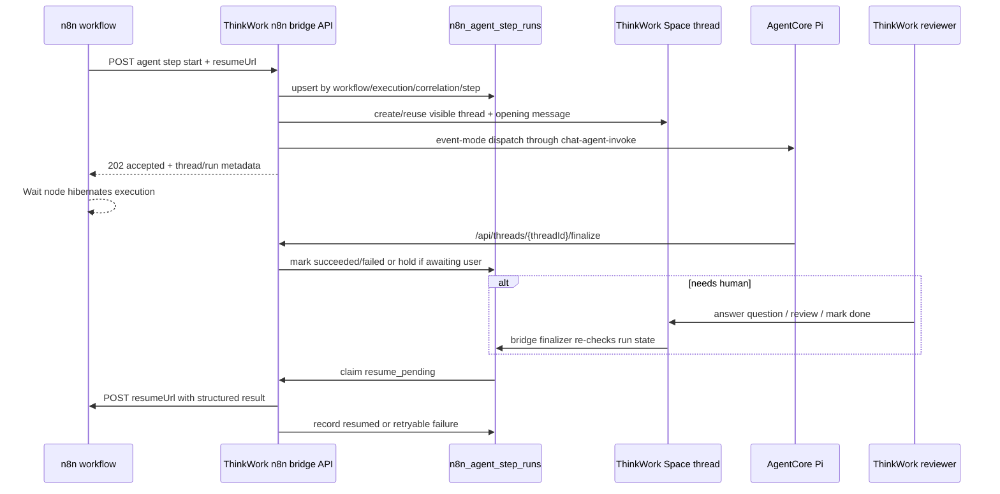
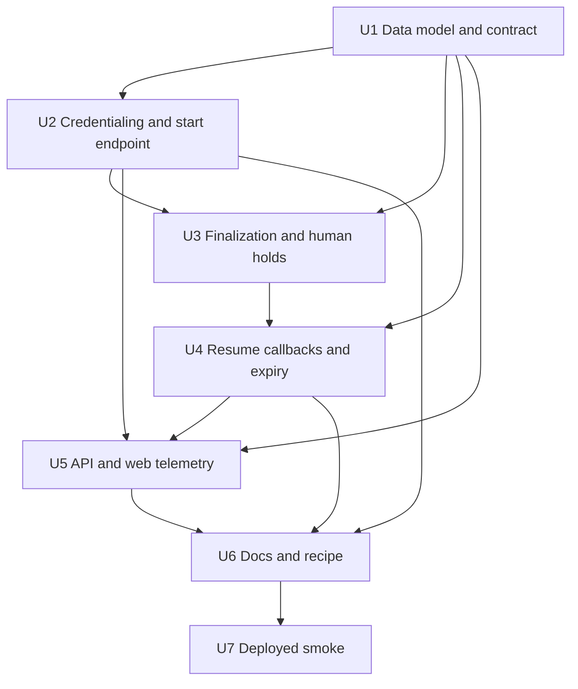

# feat: Add n8n agent-step bridge

## Overview

Add a first-party bridge that lets a managed n8n workflow call ThinkWork as a
durable agent step, hibernate at an n8n Wait node, and resume only when
ThinkWork calls the n8n resume URL with a structured result. The implementation
adds a tenant-scoped bridge credential surface for the managed n8n app, a
bridge-run ledger, a narrow REST start endpoint, callback/resume delivery,
expiry handling, and thread/plugin visibility.

V1 is webhook-first and node-later: workflow authors use stock n8n HTTP Request
and Wait nodes. ThinkWork owns agent dispatch, visible Space threads, human
review, telemetry, timeout, and the final resume payload.

---

## Problem Frame

The approved requirements define n8n as the deterministic workflow owner and
ThinkWork as the agentic step owner. n8n should not poll ThinkWork while agents
or human reviewers work; n8n's Wait node can pause execution and resume from a
webhook URL. This matches the product decision to avoid continuously running
n8n workflow executions while many agent steps wait on ThinkWork.

ThinkWork already has most of the substrate this feature needs: the n8n managed
application plugin, tenant service-credential MCP support, visible Space
threads, AgentCore event-mode dispatch with `/api/threads/{threadId}/finalize`,
pending user questions that derive `AWAITING_USER`, routine approval bridging
patterns for consume-once human resume, and API Gateway/Lambda REST handler
registration. This plan adds a focused bridge around those patterns instead of
introducing a second orchestration engine.

---

## Requirements Trace

- R1. Support n8n calling ThinkWork as a durable agent step and waiting for a
  result.
- R2. Ship a first acceptance example for enrichment, classification, drafting,
  or recommendation inside a deterministic n8n workflow.
- R3. Use stock n8n HTTP Request and Wait nodes; defer custom n8n nodes and
  ThinkWork Control MCP.
- R4. Use the managed n8n tenant context and one tenant-scoped bridge
  credential.
- R5. Accept target Space, task instructions, structured input, correlation id,
  n8n workflow identity, n8n execution identity, optional timeout override, and
  n8n resume URL.
- R6. Attribute bridge work to the managed n8n app plus
  workflow/execution/correlation/request metadata, never a fabricated human.
- R7. Create or resume a normal visible ThinkWork thread in the target Space.
- R8. Make callback/resume the default waiting model.
- R9. Use stable correlation so retries do not create duplicate visible
  ThinkWork threads.
- R10. Keep human-needed states inside the ThinkWork thread/inbox flow.
- R11. Resume n8n only after human-needed work resolves to success, failure, or
  expiry.
- R12. Apply a platform default timeout with bounded per-call override.
- R13. On expiry, resume n8n with a structured expired/failed result, summary,
  and thread/trace links.
- R14. Resume with structured JSON that n8n can branch on.
- R15. Include compact human-readable summary plus ThinkWork thread/trace
  links.
- R16. Do not require n8n to scrape a ThinkWork thread URL.
- R17. Retain bridge telemetry connecting ThinkWork thread, n8n workflow,
  execution, correlation id, resume result, timeout, and final status.

**Origin actors:** A1 n8n workflow author, A2 n8n runtime, A3 ThinkWork bridge,
A4 ThinkWork agent, A5 ThinkWork reviewer/operator, A6 downstream n8n steps.

**Origin flows:** F1 n8n starts a ThinkWork enrichment step, F2 ThinkWork
resumes n8n with a successful result, F3 ThinkWork holds for human review before
resuming n8n, F4 a waiting bridge run expires.

**Origin acceptance examples:** AE1 stock HTTP Request plus Wait hibernation,
AE2 managed app attribution and visible Space thread, AE3 human review
resolution, AE4 timeout expiry resume, AE5 structured v1 recipe without custom
node/MCP.

---

## Scope Boundaries

- Do not build a custom ThinkWork n8n node in v1.
- Do not add a ThinkWork Control MCP surface for n8n.
- Do not make polling the baseline workflow pattern.
- Do not expose per-user n8n-to-ThinkWork OAuth delegation.
- Do not require per-workflow bridge credential setup.
- Do not hide successful bridge work as trace-only background runs.
- Do not ask each n8n workflow to reimplement ThinkWork human review.
- Do not replace the generic Space webhook thread-start or Thread Event Sources
  contracts.
- Do not implement the reverse direction where ThinkWork agents discover and run
  selected n8n workflows as tools.

### Deferred to Follow-Up Work

- Custom n8n node: build only after the HTTP contract has real workflow usage.
- ThinkWork Control MCP: defer until the bridge contract proves the control
  operations worth exposing.
- Bidirectional n8n-as-tool factory: track separately from this n8n-calls-
  ThinkWork agent-step bridge.
- Rich workflow template marketplace: this plan includes a recipe and docs, not
  a full template distribution system.

---

## Context & Research

### Relevant Code and Patterns

- `plugins/n8n/src/manifest.ts` already declares n8n as a first-party managed
  app with tenant service credential MCP auth.
- `packages/api/src/lib/plugins/handlers/mcp.ts` provisions plugin-owned MCP
  rows and resolves `tenant-service-credential` auth from managed-app
  `desired_config`.
- `packages/api/src/graphql/resolvers/plugins/n8n-settings.ts` and
  `apps/web/src/components/settings/plugins/n8n/N8nSettings.tsx` are the current
  n8n Plugin Detail surfaces.
- `packages/api/src/handlers/chat-agent-invoke.ts`,
  `packages/api/src/handlers/chat-agent-finalize.ts`, and
  `packages/api/src/lib/chat-finalize/process-finalize.ts` are the current agent
  turn setup/finalize path.
- `packages/api/src/lib/agent-dispatch-payload.ts` centralizes
  dispatch-critical callback fields. Bridge metadata should travel through an
  additive context field rather than custom one-off dispatch payload
  construction.
- `packages/api/src/graphql/resolvers/threads/updateThread.mutation.ts` owns
  thread status transitions; terminal thread status changes are the right place
  to trigger a bridge finalization check after human review resolves.
- `packages/api/src/graphql/resolvers/threads/lifecycle-status.ts` derives
  `AWAITING_USER` from `pending_user_questions`. The bridge should treat this as
  a non-terminal hold state.
- `packages/api/src/graphql/resolvers/inbox/routine-approval-bridge.ts` shows
  the consume-once bridge pattern: conditional update first, then
  `RequestResponse` resume invocation so downstream errors surface.
- `packages/database-pg/src/schema/routine-approval-tokens.ts` shows the
  partial-unique-index style for pending external resume tokens.
- `packages/api/src/handlers/webhooks.ts` and
  `packages/api/src/lib/spaces/space-webhook-thread-start.ts` show existing
  public ingress, delivery audit, and visible-thread creation patterns.
- `terraform/modules/app/lambda-api/handlers.tf` and `scripts/build-lambdas.sh`
  both need explicit handler registration for new REST handlers.

### Institutional Learnings

- `docs/solutions/architecture-patterns/plugin-source-boundaries-package-owned-deploy-verified-2026-06-17.md`
  keeps n8n-specific source under `plugins/n8n/` and shared code generic.
- `docs/solutions/architecture-patterns/managed-app-mcp-oauth-lifecycle-2026-06-06.md`
  separates managed-app lifecycle from connector/MCP lifecycle.
- `docs/solutions/workflow-issues/manually-applied-drizzle-migrations-drift-from-dev-2026-04-21.md`
  applies to any hand-rolled partial indexes added for bridge idempotency.
- Existing plans repeatedly call out async retry idempotency: use a persistent
  ledger row for retries and visibility rather than relying on Event-mode
  Lambda delivery alone.

### External References

- n8n Wait node documentation:
  `https://docs.n8n.io/integrations/builtin/core-nodes/n8n-nodes-base.wait/`
- n8n waiting documentation: `https://docs.n8n.io/flow-logic/waiting/`
- n8n execution built-ins:
  `https://docs.n8n.io/code/cookbook/builtin/execution/`
- n8n endpoint environment docs:
  `https://docs.n8n.io/hosting/configuration/environment-variables/endpoints/`

---

## Key Technical Decisions

- **Dedicated REST bridge endpoint:** Add `POST /api/integrations/n8n/agent-steps`
  instead of requiring n8n authors to craft GraphQL documents inside HTTP
  Request nodes.
- **Separate inbound bridge credential:** Do not reuse the n8n native MCP
  service credential. MCP auth lets ThinkWork agents call n8n; the bridge
  credential lets n8n call ThinkWork.
- **Bridge-run ledger as the source of truth:** Add `n8n_agent_step_runs`, keyed
  by tenant plus workflow/execution/correlation/step identity. The table owns
  idempotency, status, timeout, resume URL secret handling, final result, retry
  counts, and thread linkage.
- **Reuse normal visible threads and AgentCore dispatch:** Accepted bridge runs
  create or reuse a Space thread, insert a system opening message containing
  safe n8n context, then dispatch the agent through existing event-mode chat
  paths.
- **Hold on ThinkWork human states:** Do not resume n8n while the thread
  lifecycle is `RUNNING` or `AWAITING_USER`, or while the thread is `IN_REVIEW`
  or `BLOCKED`.
- **Resume delivery is idempotent and retried:** Store a sanitized resume URL
  reference and call it from a bridge resume helper. A conditional update claims
  `resume_pending` to `resuming`; success records `resumed`; retryable failures
  return the row to `resume_pending` with attempt metadata.
- **Expiry is a sweeper, not one Scheduler per run:** Add a scheduled bridge
  expiry handler that scans due unresolved runs and resumes n8n with an expired
  payload.
- **Default timeout is conservative and bounded:** Use a platform default of 24
  hours, allow per-call overrides from 5 minutes to 7 days, and reject overrides
  outside that range.
- **Telemetry is first-class but compact:** Surface bridge metadata in thread
  detail and n8n Plugin Detail evidence/status surfaces without exposing raw
  payload or secret material.

---

## Open Questions

### Resolved During Planning

- Request/resume surface: use a dedicated REST endpoint for the stock n8n HTTP
  Request node.
- Correlation storage: use a bridge-run ledger table with a tenant-scoped unique
  key.
- Resume behavior: callback-first with stored attempt state; polling remains
  outside v1.
- Timeout: default 24 hours, bounded override 5 minutes to 7 days.
- Human-needed states: treat existing `AWAITING_USER`, `IN_REVIEW`, and
  `BLOCKED` as holds, not terminal `needs_human` responses.

### Deferred to Implementation

- Exact TypeScript helper names and final module split after the implementer
  fits this into existing API handler conventions.
- Exact SQL migration number and whether drizzle-kit can express all indexes.
  Partial indexes should be hand-rolled with drift reporter markers if needed.
- Final public URL construction for thread and trace links. Use existing
  `ADMIN_URL`/runtime-config conventions and tests to pin the canonical route.
- Final retry schedule for resume delivery. Align exact backoff with existing
  retry helper conventions if one is reusable.

---

## High-Level Technical Design

This illustrates the intended approach and is directional guidance for review,
not implementation specification. The implementing agent should treat it as
context, not code to reproduce.



### Contract Sketch

The exact fields belong in implementation tests, but the v1 request shape
should stay close to this:

```json
{
  "spaceId": "spc_...",
  "agentId": "optional-agent-id",
  "instructions": "Classify this lead and draft a next action.",
  "input": { "lead": { "company": "Example Co" } },
  "correlationId": "workflow-step-key",
  "n8n": {
    "workflowId": "123",
    "workflowName": "Inbound lead routing",
    "executionId": "456",
    "stepId": "classify-lead"
  },
  "timeoutSeconds": 86400,
  "resumeUrl": "https://n8n.example.com/webhook-waiting/..."
}
```

Resume payloads should include stable machine fields:

```json
{
  "status": "succeeded",
  "runId": "uuid",
  "threadId": "uuid",
  "correlationId": "workflow-step-key",
  "output": { "classification": "enterprise", "draft": "..." },
  "error": null,
  "summary": "Lead classified as enterprise; drafted next-step email.",
  "links": {
    "thread": "https://app.example.com/spaces/.../threads/...",
    "trace": "https://app.example.com/settings/activity/..."
  }
}
```

---

## Implementation Units



- U1. **Add bridge-run data model and contract types**

  **Goal:** Create the durable ledger and shared contract definitions for n8n
  agent-step runs.

  **Requirements:** R5, R6, R9, R12, R14, R17; supports AE2, AE4, AE5.

  **Dependencies:** None.

  **Files:**

  - `packages/database-pg/src/schema/n8n-agent-step-runs.ts`
  - `packages/database-pg/src/schema/index.ts`
  - `packages/database-pg/drizzle/NNNN_n8n_agent_step_runs.sql`
  - `packages/database-pg/graphql/types/n8n-agent-step-runs.graphql`
  - `packages/api/src/lib/n8n-agent-step/types.ts`
  - `packages/api/src/lib/n8n-agent-step/contract.test.ts`

  **Approach:** Model one row per accepted or replayed bridge run. Store tenant,
  managed application/install references when available, target Space, agent,
  thread, thread turn, status, workflow id/name, execution id, step id,
  correlation id, request id/idempotency key, timeout/expires timestamps,
  sanitized request metadata, result payload, resume attempt metadata, and final
  resume state. Store the resume URL as secret material: either encrypted via the
  repo's existing secret-store pattern or in Secrets Manager with only a secret
  ref on the row. Use a unique tenant-scoped idempotency key for
  workflow/execution/correlation/step so duplicate starts return the original
  run and thread.

  **Execution note:** Implement the contract tests before wiring the endpoint;
  this is the field-level agreement n8n authors depend on.

  **Patterns to follow:**
  `packages/database-pg/src/schema/routine-approval-tokens.ts`,
  `packages/database-pg/src/schema/pending-user-questions.ts`,
  `packages/database-pg/src/schema/webhook-deliveries.ts`, and
  `docs/solutions/workflow-issues/manually-applied-drizzle-migrations-drift-from-dev-2026-04-21.md`.

  **Test scenarios:**

  - Covers AE2. Given the same tenant/workflow/execution/correlation/step key,
    the contract derives the same bridge idempotency key and does not allow a
    second active visible thread to be created.
  - Given a timeout override below 5 minutes or above 7 days, validation rejects
    the request with a stable error code.
  - Given no timeout override, validation applies the 24-hour platform default.
  - Given request metadata containing credential-looking fields, stored audit
    metadata redacts secret values while preserving workflow/execution
    identifiers.

  **Verification:** The schema exports compile, generated GraphQL schema builds,
  and contract tests pin status names, timeout bounds, idempotency key
  generation, and redaction behavior.

- U2. **Implement bridge credentialing and the start endpoint**

  **Goal:** Let stock n8n HTTP Request nodes start or replay an agent-step run
  through a tenant-scoped bridge credential.

  **Requirements:** R1, R3, R4, R5, R6, R7, R8, R9; covers F1, AE1, AE2.

  **Dependencies:** U1.

  **Files:** `plugins/n8n/src/manifest.ts`,
  `plugins/n8n/src/deployment/managed-app.ts`,
  `plugins/n8n/test/manifest.test.ts`,
  `packages/api/src/graphql/resolvers/plugins/n8n-settings.ts`,
  `packages/api/src/graphql/resolvers/plugins/n8n-settings.test.ts`,
  `apps/web/src/components/settings/plugins/n8n/N8nSettings.tsx`,
  `packages/api/src/handlers/n8n-agent-step-bridge.ts`,
  `packages/api/src/lib/n8n-agent-step/auth.ts`,
  `packages/api/src/lib/n8n-agent-step/start.ts`,
  `packages/api/src/lib/n8n-agent-step/payload.ts`,
  `packages/api/src/handlers/n8n-agent-step-bridge.test.ts`,
  `scripts/build-lambdas.sh`, `terraform/modules/app/lambda-api/handlers.tf`.

  **Approach:** Add `POST /api/integrations/n8n/agent-steps` plus OPTIONS. The
  n8n managed-app deployment/config layer should create a separate inbound
  bridge credential secret, distinct from the native n8n MCP service credential
  used by ThinkWork agents. The n8n Plugin Detail surface should expose bridge
  credential status and rotation, without exposing the raw secret except through
  any existing one-time reveal pattern. The handler accepts only this bridge
  credential, resolves tenant and managed application context, validates the
  payload, creates or reuses the bridge-run row, creates or reuses the visible
  Space thread, inserts a system opening message with safe n8n metadata, and
  dispatches the agent turn through existing Lambda invocation patterns.

  **Test scenarios:** happy path creates a run/thread and returns `202`;
  duplicate starts replay without dispatch; missing/revoked credentials fail
  closed; invalid resume URLs or payloads reject before thread creation;
  rotation makes old credentials stop authenticating.

  **Verification:** Package-local handler tests prove happy path, replay, auth
  failure, invalid payload, and route registration. The build script and
  Terraform handler map both include the new Lambda name.

- U3. **Wire finalization and human-hold behavior**

  **Goal:** Convert ThinkWork agent/thread outcomes into bridge terminal or hold
  states without bypassing existing human-review mechanics.

  **Requirements:** R10, R11, R14, R15; covers F2, F3, AE3.

  **Dependencies:** U1, U2.

  **Files:** `packages/api/src/lib/n8n-agent-step/finalize.ts`,
  `packages/api/src/lib/chat-finalize/process-finalize.ts`,
  `packages/api/src/graphql/resolvers/threads/updateThread.mutation.ts`,
  `packages/api/src/graphql/resolvers/messages/answerUserQuestion.mutation.ts`,
  `packages/api/src/lib/n8n-agent-step/finalize.test.ts`,
  `packages/api/src/handlers/chat-agent-finalize.test.ts`,
  `packages/api/src/graphql/resolvers/messages/answerUserQuestion.mutation.test.ts`,
  `packages/api/src/graphql/resolvers/threads/updateThread.mutation.test.ts`.

  **Approach:** Add a bridge finalizer helper that loads the bridge run by
  thread/turn, inspects the latest turn result and thread lifecycle, and chooses
  hold, `resume_pending` with success/failure payload, or no-op. `processFinalize`
  should call the helper after normal assistant message/thread updates.
  `answerUserQuestion` and terminal thread status updates should re-check bridge
  runs after human input resolves.

  **Test scenarios:** pending user questions hold without callback; answered
  questions plus successful resumed agent turn move to `resume_pending`; retried
  finalize is idempotent; failed turns record a failed payload.

  **Verification:** Tests prove hold versus terminal transitions and callback
  idempotency. Existing chat finalize behavior remains unchanged for non-bridge
  threads.

- U4. **Deliver n8n resume callbacks with retry and expiry**

  **Goal:** Call n8n's Wait-node resume URL exactly when bridge runs reach
  terminal state or expiry, with bounded retry and visible failure state.

  **Requirements:** R8, R11, R12, R13, R14, R15, R17; covers F2, F4, AE4.

  **Dependencies:** U1, U3.

  **Files:** `packages/api/src/lib/n8n-agent-step/resume.ts`,
  `packages/api/src/handlers/n8n-agent-step-expirer.ts`,
  `packages/api/src/handlers/n8n-agent-step-expirer.test.ts`,
  `packages/api/src/lib/n8n-agent-step/resume.test.ts`,
  `scripts/build-lambdas.sh`, `terraform/modules/app/lambda-api/handlers.tf`.

  **Approach:** Implement a resume helper that conditionally claims one
  `resume_pending` run, retrieves the secret resume URL, posts the structured
  result to n8n, records status/HTTP metadata, and updates the run to `resumed`
  on 2xx. Retryable network/5xx failures increment attempts and schedule the
  next retry timestamp; non-retryable 4xx failures mark `resume_failed`. Add a
  scheduled expirer Lambda that claims due unresolved runs, assembles an
  `expired` payload, and routes through the same resume helper.

  **Test scenarios:** expired runs post an `expired` payload; racing expirer
  invocations claim once; 2xx records resumed metadata; 5xx/timeouts retry;
  404/410 fail terminally; missing resume URL secrets fail loudly.

  **Verification:** Resume/expiry tests cover success, retry, terminal failure,
  race idempotency, and expired payload shape. Terraform includes a scheduler
  for the expirer when Lambda handlers deploy.

- U5. **Expose bridge telemetry in API and web surfaces**

  **Goal:** Make bridge state visible to operators and reviewers without
  requiring database access or thread scraping.

  **Requirements:** R6, R15, R17; supports AE2, AE5.

  **Dependencies:** U1, U2, U3, U4.

  **Files:** `packages/database-pg/graphql/types/n8n-agent-step-runs.graphql`,
  `packages/api/src/graphql/resolvers/n8n-agent-step-runs/index.ts`,
  `packages/api/src/graphql/resolvers/n8n-agent-step-runs/n8nAgentStepRuns.query.ts`,
  `packages/api/src/graphql/resolvers/n8n-agent-step-runs/n8n-agent-step-runs.test.ts`,
  `packages/api/src/graphql/resolvers/plugins/n8n-settings.ts`,
  `packages/api/src/graphql/resolvers/plugins/n8n-settings.test.ts`,
  `apps/web/src/lib/settings-queries.ts`,
  `apps/web/src/routes/_authed/_shell/threads.$id.tsx`,
  `apps/web/src/routes/_authed/_shell/activity.$threadId.tsx`,
  `apps/web/src/components/settings/plugins/n8n/N8nSettings.tsx`,
  `apps/web/src/components/settings/plugins/n8n/N8nSettings.test.tsx`.

  **Approach:** Add a tenant-scoped read model for bridge runs by thread and by
  n8n plugin context. Thread detail should show a compact bridge panel/badge
  with workflow name/id, execution id, correlation id, status, timeout, resume
  result, and copied links. n8n Plugin Detail should show recent bridge run
  evidence and failures alongside package/deployment status. Keep secret
  material, raw resume URLs, and full input payloads out of GraphQL responses.

  **Test scenarios:** bridge-present query returns status and redacted metadata;
  cross-tenant probes fail; Plugin Detail includes compact failure evidence; no
  bridge run leaves thread UI unchanged.

  **Verification:** API resolver tests pin tenant scoping and redaction. Web
  tests cover bridge-present and bridge-absent render states.

- U6. **Document the n8n workflow recipe and operator runbook**

  **Goal:** Give workflow authors and operators a working v1 recipe using only
  stock n8n nodes.

  **Requirements:** R1, R2, R3, R4, R5, R8, R14, R16; covers AE1, AE5.

  **Dependencies:** U2, U4, U5.

  **Files:** `plugins/n8n/README.md`,
  `plugins/n8n/src/skills/n8n-workflow-operator/SKILL.md`,
  `docs/src/content/docs/applications/n8n-agent-step-bridge.md`,
  `docs/src/content/docs/applications/n8n.md`,
  `plugins/n8n/test/manifest.test.ts`.

  **Approach:** Add a concise recipe: HTTP Request node starts the bridge, Wait
  node waits for webhook call using n8n's resume URL, downstream branch reads
  `status`, `output`, `error`, `summary`, and `links`. Include timeout behavior,
  retry/idempotency guidance, credential setup, and debugging steps for
  `resume_failed` or expired runs. Update the n8n operator skill so agents know
  how to explain and inspect bridge runs without suggesting a custom node in v1.

  **Test scenarios:** docs include stock HTTP Request plus Wait recipe; docs show
  structured result branching and reject thread scraping; manifest/skill tests
  continue to pass.

  **Verification:** Docs build succeeds and package tests confirm the n8n skill
  still materializes through the plugin manifest.

- U7. **Add end-to-end bridge smoke coverage**

  **Goal:** Prove the bridge contract in a deployed ThinkWork plus managed n8n
  path.

  **Requirements:** R1-R17; covers AE1-AE5.

  **Dependencies:** U1-U6.

  **Files:** `plugins/n8n/smoke/n8n-agent-step-bridge-smoke.mjs`,
  `plugins/n8n/smoke/README.md`,
  `packages/deployment-runner/src/apps/registry.ts`,
  `packages/deployment-runner/test/deployment-runner-managed-apps.test.ts`,
  `.github/workflows/deploy.yml`.

  **Approach:** Extend n8n managed-app smoke evidence with an optional bridge
  smoke that creates or imports a minimal workflow using HTTP Request plus Wait,
  starts it, waits for ThinkWork to accept and complete a simple classification
  request, verifies n8n resumes with structured JSON, and records evidence
  links. Keep this as deployed-environment smoke, not a local Docker substitute.

  **Test scenarios:** deployed smoke records bridge accepted, ThinkWork thread
  created, n8n execution waiting, ThinkWork resumed, and n8n received structured
  terminal payload; unsupported stages record skipped-with-reason; auth/payload
  failures include bridge run id and n8n execution id in evidence.

  **Verification:** Smoke script can run against a deployed stage and writes
  evidence linking n8n execution, bridge run, ThinkWork thread, and resume
  status.

---

## System-Wide Impact

- API surface: adds one external machine-to-machine REST endpoint for managed
  n8n and one scheduled expiry handler.
- Persistence: adds bridge-run state and likely hand-rolled indexes for
  idempotency/expiry scans.
- Agent runtime: does not add a new runtime path; it annotates existing
  dispatch/finalize behavior.
- Web UI: adds read-only bridge telemetry to existing thread and Plugin Detail
  surfaces.
- Operations: adds deployed smoke evidence and expiry/resume failure states that
  support incident review.

---

## Risks & Dependencies

| Risk                                                                 | Mitigation                                                                                              |
| -------------------------------------------------------------------- | ------------------------------------------------------------------------------------------------------- |
| Duplicate n8n retries create duplicate ThinkWork threads             | Enforce tenant-scoped bridge idempotency in U1 and return existing run/thread in U2.                    |
| n8n resume URL leaks in logs or GraphQL                              | Store resume URL as secret material, redact handler logs, and expose only resume status/evidence in U5. |
| Human review never resumes n8n                                       | U3 hooks both agent finalize and human-resolution paths; U4 expiry is the backstop.                     |
| Resume callback succeeds in n8n but ThinkWork records failure        | U4 records HTTP status/body prefix and treats only observed 2xx as resumed.                             |
| Per-run Scheduler objects create operational pressure                | U4 uses a scheduled sweeper over indexed DB rows instead of one AWS Scheduler per run.                  |
| Bridge endpoint accidentally becomes generic public webhook ingress  | U2 authenticates only managed n8n bridge credentials and records managed-app attribution.               |
| Inbound bridge credential is confused with n8n MCP credential        | U2 provisions a separate secret with purpose metadata and tests rotation/auth independently.            |
| Agent output is not structured enough for deterministic n8n branches | U3/U6 define the requested output schema in the agent instruction and always return a stable envelope.  |

---

## Documentation / Operational Notes

- Add operator docs for creating the n8n bridge credential, building the HTTP
  Request plus Wait recipe, reading bridge telemetry, and responding to
  `resume_failed` or `expired` states.
- Record runbook steps for retrying failed resume delivery: inspect bridge run,
  confirm n8n execution still waits, and trigger a controlled retry rather than
  re-running the whole workflow blindly.
- Do not use local Docker Compose as verification. For application-plugin
  verification, prove the deployed ThinkWork-managed n8n path and record managed
  application evidence.
- Keep Linear THNK-54 updated at plan review, implementation start, PR, deploy
  smoke, and final verification gates.

---

## Sources & References

- Requirements: `docs/brainstorms/2026-06-20-n8n-thinkwork-agent-step-bridge-requirements.md`
- Related n8n plugin plan:
  `docs/plans/2026-06-19-003-feat-n8n-application-plugin-plan.md`
- n8n Wait node docs:
  `https://docs.n8n.io/integrations/builtin/core-nodes/n8n-nodes-base.wait/`
- n8n waiting docs: `https://docs.n8n.io/flow-logic/waiting/`
- n8n execution built-ins:
  `https://docs.n8n.io/code/cookbook/builtin/execution/`
- n8n endpoint environment docs:
  `https://docs.n8n.io/hosting/configuration/environment-variables/endpoints/`
- Plugin source boundaries:
  `docs/solutions/architecture-patterns/plugin-source-boundaries-package-owned-deploy-verified-2026-06-17.md`
- Managed app MCP lifecycle:
  `docs/solutions/architecture-patterns/managed-app-mcp-oauth-lifecycle-2026-06-06.md`
- Manual Drizzle migration drift:
  `docs/solutions/workflow-issues/manually-applied-drizzle-migrations-drift-from-dev-2026-04-21.md`

---

## Alternative Approaches Considered

- **GraphQL mutation instead of REST endpoint:** Rejected for v1 because stock
  n8n HTTP Request nodes are easier to author and debug against a narrow REST
  contract.
- **Polling from n8n:** Rejected by requirements. Polling does not use Wait-node
  resume semantics and creates unnecessary runtime pressure.
- **One AWS Scheduler per bridge run:** Rejected because hundreds of waiting
  bridge runs would create avoidable scheduler object churn.
- **A custom n8n node first:** Rejected by requirements. It can wrap the stable
  contract later.
- **Trace-only hidden agent runs:** Rejected because operators need normal Space
  threads for visibility, review, memory, and policy.

---

## Success Metrics

- A workflow author can implement the first bridge using only stock n8n HTTP
  Request and Wait nodes.
- Duplicate start retries for the same n8n execution and bridge step produce one
  ThinkWork thread and one bridge run.
- Human-needed agent work keeps n8n waiting until resolution or expiry.
- Expired runs resume n8n with a structured terminal payload and visible
  operator evidence.
- Thread detail and n8n Plugin Detail expose enough telemetry to connect n8n
  workflow/execution/correlation to ThinkWork thread/run/result without secrets.
- Deployed smoke evidence proves accept -> wait -> ThinkWork result -> n8n
  resume for at least one representative classification/enrichment workflow.

---

## Phased Delivery

### Phase 1: Durable Contract and Endpoint

Land U1 and U2 together or back-to-back. The bridge-run ledger and start
endpoint should merge before finalization/resume behavior so the external
contract has tests and route registration.

### Phase 2: Lifecycle Completion

Land U3 and U4. This is the core correctness phase: agent finalization,
human-hold behavior, callback resume, retry, and expiry.

### Phase 3: Visibility and Authoring

Land U5 and U6. Operators can inspect runs and workflow authors can build the
stock-node recipe.

### Phase 4: Deployed Evidence

Land U7 after the deployed n8n plugin path is stable enough to run the bridge
smoke reliably.

---

## Operational / Rollout Notes

- Feature-gate the bridge endpoint until the n8n managed app can provision the
  tenant bridge credential and public URL policy.
- Deploy persistence before enabling the endpoint. The handler should fail
  closed if the migration is absent.
- Start with dogfood/staging tenants and one representative enrichment workflow.
- Monitor `accepted`, `waiting`, `resume_pending`, `resumed`, `resume_failed`,
  and `expired` counts after rollout.
- Treat `resume_failed` as actionable operator evidence: it means ThinkWork
  finished the agent step but could not resume n8n.
