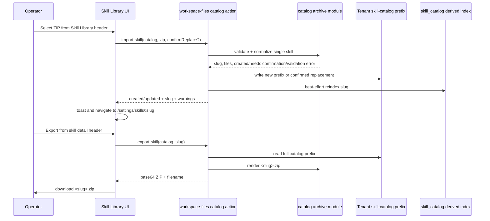

# feat: Skill Library Import and Export

## Overview

Add a first-class single-skill ZIP import/export workflow to the operator Skill
Library. Import accepts one Agent Skills-compatible skill pack, validates and
normalizes it into the tenant S3 skill catalog, generates a default editable
`WIRING.md` when the archive omits ThinkWork wiring, refreshes catalog metadata,
and leaves already-installed workspace copies unchanged. Export packages the
selected catalog skill folder into the same portable single-skill ZIP shape.

---

## Problem Frame

Operators can already browse, inspect, edit, evaluate, install, and update
catalog skills, but they cannot move a complete skill pack between tenants,
environments, backups, or external Agent Skills-compatible tools without manual
file copying. The catalog source of truth is the tenant S3 prefix
`tenants/<tenant-slug>/skill-catalog/<skill-slug>/`, with `skill_catalog` as a
derived read index and `.catalog-ref.json` hashes on installed workspace copies.
This plan extends that existing S3-backed catalog path rather than restoring the
retired tenant plugin ZIP upload flow.

---

## Requirements Trace

- R1. The Skill Library list header includes an UploadIcon import action.
- R2. Import accepts exactly one skill per ZIP.
- R3. Accepted archive shape is either root `SKILL.md` or one top-level folder
  containing `SKILL.md`.
- R4. Import preserves supporting files and directories, including `scripts/`,
  `references/`, `assets/`, `evals/`, and existing `WIRING.md`.
- R5. Import validates required Agent Skills `name` and `description`
  frontmatter plus naming constraints from the current public specification.
- R6. Root-level `SKILL.md` imports use a virtual skill folder named from the
  validated `name` frontmatter.
- R7. Import generates default editable `WIRING.md` when absent.
- R8. Invalid archives fail before mutating the Skill Library and return
  fixable operator errors.
- R9. Import creates a new Skill Library item when the slug is new.
- R10. Import updates an existing Skill Library item only after explicit
  confirmation.
- R11. Import updates the catalog source only; installed workspace copies remain
  unchanged until the existing update/apply path is used.
- R12. Successful import navigates to the imported detail page.
- R13. Success feedback distinguishes created vs updated.
- R14. The detail page exposes imported files, generated wiring, metadata, eval
  score, and update state through existing detail affordances where possible.
- R15. Export lives in the selected skill detail header in v1.
- R16. Export downloads the complete selected catalog skill as a portable
  single-skill ZIP compatible with import.
- R17. Export and re-import of the same archive is a valid round trip.

**Origin actors:** A1 tenant operator, A2 external skill author, A3 ThinkWork
platform, A4 downstream implementation planner.

**Origin flows:** F1 import a new portable skill, F2 import over an existing
Skill Library slug, F3 export a selected skill.

**Origin acceptance examples:** AE1 top-level folder import, AE2 root
`SKILL.md` virtual folder import, AE3 generated `WIRING.md`, AE4 validation
failure leaves catalog unchanged, AE5 confirmed replacement leaves installed
copies unchanged, AE6 detail-page export round trip.

---

## Scope Boundaries

- Multi-skill archive import is out of v1.
- `.claude/skills/*`, `.codex/skills/*`, or broader project/vendor archive
  import is out of v1 unless the archive reduces to one accepted single-skill
  shape.
- Row-level export actions in the Skill Library table are deferred.
- Automatic propagation of imported updates to installed agent/workspace copies
  is out of v1.
- Live two-way sync with external skill authoring tools is out of scope.
- Changing the Agent Skills specification or requiring ThinkWork-only
  frontmatter is out of scope.
- Reworking the existing skill eval/update-gate model is out of scope; import
  interoperates with the current catalog hash, eval dataset, and apply-update
  paths.

---

## Context & Research

### Relevant Code and Patterns

- `packages/api/workspace-files.ts` already has an admin-gated `catalog: true`
  target, S3 catalog `get/list/put/delete`, summary listing, and best-effort
  `reindexCatalogAfterMutation` write-through.
- `packages/api/src/types/catalog-skill.ts` defines the catalog slug and
  manifest/ref validators used by install/reinstall.
- `packages/api/src/lib/skill-md-parser.ts` provides strict and lenient
  `SKILL.md` frontmatter parsing. Import should use strict semantics with a
  spec-compatible name check.
- `packages/api/src/lib/wiring-md.ts` renders parseable `WIRING.md`
  suggestions. `packages/api/src/lib/plugins/handlers/skills.ts` already
  generates default wiring for plugin-provided skills.
- `packages/api/src/lib/catalog-index.ts`,
  `packages/api/src/lib/catalog-install.ts`, and
  `packages/api/src/lib/catalog-reinstall.ts` define the source-hash/index and
  installed-copy behavior that import must preserve.
- `packages/api/src/lib/folder-bundle-importer.ts` and
  `packages/api/src/lib/zip-safety.ts` provide local patterns for ZIP loading,
  path safety, and rollback-before-success validation.
- `apps/web/src/lib/workspace-files-api.ts` is the existing web client for the
  catalog target. `SettingsSkills.tsx` owns the Skill Library list and
  `SettingsSkillDetail.tsx` owns the detail page/editor.

### Institutional Learnings

- `docs/plans/autopilot-status.md` records the May 2026 Pi skill catalog work:
  S3 is the source of truth, the `skill_catalog` table is a derived index, and
  custom skills are authored/inspected through the operator Skills surface.
- `docs/solutions/architecture-patterns/skill-eval-rated-does-not-mean-evaluable-2026-06-15.md`
  warns that eval state and materializability are distinct; import should seed
  bundled eval cases when present but must not assume a skill can run isolated
  evals without valid wiring/runtime support.
- `docs/solutions/workflow-issues/skill-catalog-slug-collision-execution-mode-transitions-2026-04-21.md`
  reinforces that slug collision and execution-mode transitions need explicit
  validation rather than silent overwrite.
- `docs/solutions/best-practices/injected-built-in-tools-are-not-workspace-skills-2026-04-28.md`
  keeps built-in tool slugs out of workspace/catalog skill mechanics.

### External References

- Agent Skills specification, read on 2026-06-21:
  `https://agentskills.io/specification`. Relevant current constraints:
  a skill directory contains `SKILL.md`; required frontmatter fields are
  `name` and `description`; `name` is 1-64 lowercase alphanumeric/hyphen
  characters, cannot start/end with a hyphen, cannot contain consecutive
  hyphens, and must match the parent directory; `description` is 1-1024
  characters; `scripts/`, `references/`, and `assets/` are optional
  directories.

---

## Key Technical Decisions

- **Use `workspace-files` catalog actions for import/export.** The Skill
  Library already talks to `/api/workspaces/files` for catalog source files and
  summary rows; adding catalog-only `import-skill` and `export-skill` actions
  keeps auth, tenant resolution, and index refresh in one place.
- **Create a pure archive module first.** ZIP parsing, archive-shape detection,
  spec validation, path safety, default wiring generation, and ZIP rendering
  belong in a unit-testable module under `packages/api/src/lib/` with S3 and
  HTTP wiring kept thin.
- **Validate all files before writing.** Import builds a complete normalized
  file list, checks size/path/count/slug rules, parses `SKILL.md`, determines
  create-vs-update, and only then mutates S3.
- **Replace catalog prefix atomically enough for S3.** For confirmed updates,
  delete the existing catalog prefix and write the normalized files under the
  same slug, with rollback that restores prior objects when a later write fails.
  The response can include a reindex warning, matching existing catalog
  mutation behavior.
- **Default wiring is minimal and explicit.** Generated `WIRING.md` uses one
  `default` suggestion telling agents to read `skills/<slug>/SKILL.md` for
  covered tasks. It is ordinary editable catalog content and is always included
  in export.
- **Import replacement does not touch installed prefixes.** Existing installed
  copies keep their `.catalog-ref.json.source_sha256`; the current stale/held
  update surfaces continue to show update state when the catalog hash differs.
- **Bound archive inputs conservatively.** Initial limits should fit normal
  text/script skill packs while protecting Lambda memory and S3 fan-out:
  single ZIP request body, no path traversal or absolute paths, no directories
  as files, no hidden macOS metadata files, bounded entry count, bounded
  individual text file size, and bounded total uncompressed size.
- **Preserve binary assets only if the current transport can safely represent
  them.** If the existing `workspace-files` JSON/text path cannot round-trip
  binary entries safely, U1 should either encode binary buffers inside the new
  import/export module and S3 writes, or explicitly reject unsupported binary
  entries with a fixable validation error. Do not corrupt binary assets as
  UTF-8 text.

---

## Open Questions

### Resolved During Planning

- **Validation mechanism:** Reuse `jszip` plus the repo's existing
  `skill-md-parser`, tightening the imported-skill name rule to the current
  Agent Skills spec including no leading/trailing or consecutive hyphens.
- **Default `WIRING.md`:** Use `renderWiringMd` with one `default` suggestion
  and a snippet pointing at `skills/<slug>/SKILL.md`; no hidden metadata channel.
- **Collision behavior:** New slug creates immediately; existing slug requires
  an explicit `confirmReplace: true` request from the UI.
- **Export filename:** Use `<slug>.zip`, with the archive root as
  `<slug>/...` for consistency with top-level-folder import and round-trip
  clarity.
- **Generated wiring in export:** Always include the current catalog files,
  including generated `WIRING.md`, because generated wiring is editable catalog
  source after import.

### Deferred to Implementation

- **Exact numeric archive limits:** Choose constants in the archive module after
  checking Lambda request/body constraints and existing `zip-safety` limits.
- **Binary file handling:** Decide based on the current S3 write/client path
  whether binary assets can be preserved directly or must be rejected in v1 with
  a specific error.
- **Precise held-update copy:** Reuse existing detail/eval state where possible;
  only add copy if implementation shows the existing surface does not make
  catalog-updated/installed-stable understandable.

---

## High-Level Technical Design

> _This illustrates the intended approach and is directional guidance for
> review, not implementation specification. The implementing agent should treat
> it as context, not code to reproduce._

---

## Implementation Units

- U1. **Archive Validation and Packaging Module**

**Goal:** Add a pure backend module that validates single-skill archives,
normalizes accepted archive shapes into catalog-relative files, generates
default wiring, and packages catalog files back into a ZIP.

**Requirements:** R2, R3, R4, R5, R6, R7, R8, R16, R17; AE1, AE2, AE3, AE4,
AE6.

**Dependencies:** None.

**Files:**

- Create: `packages/api/src/lib/catalog-skill-archive.ts`
- Test: `packages/api/src/lib/catalog-skill-archive.test.ts`
- Modify: `packages/api/src/lib/skill-md-parser.ts`
- Test: `packages/api/src/lib/__tests__/skill-md-parser.test.ts`
- Modify: `packages/api/src/types/catalog-skill.ts`
- Test: `packages/api/src/types/catalog-skill.test.ts`

**Approach:**

- Define `parseCatalogSkillArchive` that accepts ZIP bytes and returns either a
  typed validation error list or `{ slug, files, generatedWiring }`.
- Accept only root `SKILL.md` plus sibling files, or exactly one top-level
  folder containing `SKILL.md`; reject multiple skill roots, missing
  `SKILL.md`, absolute paths, `..`, empty path segments, unsafe metadata
  entries, unsupported symlink-like entries, and size/count violations.
- Validate `SKILL.md` using strict parser semantics and align the imported
  `name` rule to the current Agent Skills spec: 1-64 characters,
  lowercase ASCII letters/numbers/hyphens only, no leading/trailing hyphen, no
  consecutive hyphens, and matches the storage slug.
- For root `SKILL.md`, derive the virtual slug from `name`; for top-level-folder
  imports, require folder name and `name` to match.
- Preserve all accepted files under paths relative to the skill root. When
  `WIRING.md` is absent, append generated default wiring as normal file content.
- Define `renderCatalogSkillArchive` that receives `{ slug, files }` and emits a
  ZIP with `<slug>/...` entries and filename `<slug>.zip`.
- Keep archive errors stable enough for UI mapping with codes such as
  `invalid_zip`, `multiple_skills`, `missing_skill_md`,
  `invalid_skill_frontmatter`, `unsafe_path`, `size_limit_exceeded`, and
  `unsupported_binary_file` if binary preservation is not supported.

**Execution note:** Start with the archive module tests so import/export shape
and validation behavior are pinned before API wiring.

**Patterns to follow:**

- `packages/api/src/lib/folder-bundle-importer.ts`
- `packages/api/src/lib/zip-safety.ts`
- `packages/api/src/lib/wiring-md.ts`
- `packages/api/src/lib/plugins/handlers/skills.ts`
- `packages/api/src/lib/__tests__/skill-md-parser.test.ts`

**Test scenarios:**

- Happy path: top-level `pdf-processing/SKILL.md` with valid frontmatter and
  supporting `references/guide.md` normalizes to slug `pdf-processing` and
  preserves both files.
- Happy path: root `SKILL.md` with `name: code-review` normalizes into virtual
  slug `code-review`.
- Happy path: archive without `WIRING.md` receives generated parseable wiring
  with suggestion id `default`.
- Happy path: archive with custom `WIRING.md` preserves it unchanged.
- Happy path: render ZIP from normalized files and parse it again as the same
  slug/files.
- Edge case: `name` with leading, trailing, uppercase, or consecutive hyphen is
  rejected with a frontmatter validation error.
- Edge case: top-level folder name different from `name` is rejected.
- Error path: missing `SKILL.md`, multiple top-level skill folders, path
  traversal, absolute path, and limit violations fail without returning files.
- Error path: unsupported binary asset handling is explicit and covered by the
  chosen v1 behavior.

**Verification:**

- Archive parsing and rendering are deterministic, unit-tested, and free of AWS
  dependencies.

---

- U2. **Catalog Import API Action**

**Goal:** Wire `import-skill` into the admin-gated `workspace-files` catalog
target so validated archives create or explicitly replace tenant S3 catalog
skills, refresh derived metadata, and leave installed copies untouched.

**Requirements:** R7, R8, R9, R10, R11, R13, R14; AE1, AE3, AE4, AE5.

**Dependencies:** U1.

**Files:**

- Modify: `packages/api/workspace-files.ts`
- Test: `packages/api/src/__tests__/workspace-files-handler.test.ts`
- Modify: `packages/api/src/lib/evals/skill-dataset.ts` if import needs a
  shared helper for bundled eval case sync
- Test: `packages/api/src/lib/evals/skill-dataset.test.ts` if helper changes
  are required

**Approach:**

- Extend the catalog target allowlist with `import-skill`.
- Add request fields such as `archiveBase64` and `confirmReplace`. The action is
  valid only with `catalog: true`.
- Resolve tenant slug through the existing catalog target, parse the archive via
  U1, and check whether `tenants/<tenant-slug>/skill-catalog/<slug>/` currently
  has objects.
- If objects exist and `confirmReplace` is not true, return a 409 with a stable
  code and parsed slug so the UI can ask for confirmation without guessing.
- For new imports, write all normalized files under the catalog prefix.
- For confirmed replacement, read existing objects first, delete the old prefix,
  write the new files, and roll back prior objects if a later write fails.
- Reindex the slug with existing `reindexCatalogAfterMutation`; surface warnings
  without failing durable S3 success, matching current catalog mutation behavior.
- Sync bundled `evals/*.json` into the live per-skill eval dataset when present,
  using existing eval dataset helpers where possible. Do not alter installed
  workspace prefixes or `.catalog-ref.json`.
- Return `{ ok, slug, status: "created" | "updated", generatedWiring, warning? }`.

**Patterns to follow:**

- Existing catalog `put`/`delete` paths in `packages/api/workspace-files.ts`
- `reindexCatalogAfterMutation`
- `installCatalogSkill`/`reinstallCatalogSkill` rollback style
- `provisionPluginSkillsComponent` for generated wiring and bundled eval sync

**Test scenarios:**

- Covers AE1. Importing a valid top-level-folder ZIP into an empty catalog writes
  `SKILL.md`, supporting files, generated/preserved `WIRING.md`, reindexes the
  slug, and returns `status: "created"`.
- Covers AE3. Missing `WIRING.md` produces a stored `WIRING.md` visible through
  subsequent catalog `get/list`.
- Covers AE4. Invalid archive returns a 400 validation error and performs no S3
  writes/deletes.
- Covers AE5. Existing slug without `confirmReplace` returns 409 and leaves S3
  unchanged.
- Covers AE5. Existing slug with `confirmReplace: true` replaces catalog files,
  reindexes the slug, returns `status: "updated"`, and does not write to any
  `agents/*/skills/<slug>/` or `spaces/*/skills/<slug>/` prefix.
- Error path: write failure during replacement restores prior objects or reports
  a precise rollback failure.
- Integration: import with `evals/*.json` calls the shared eval dataset sync
  path without blocking catalog success on eval seeding failure.

**Verification:**

- Focused handler tests prove auth/tenant gating, create/update semantics,
  rollback, reindex, and installed-copy non-mutation.

---

- U3. **Catalog Export API Action**

**Goal:** Wire `export-skill` into the catalog target so the selected catalog
skill folder downloads as a portable ZIP compatible with U1 import.

**Requirements:** R15, R16, R17; AE6.

**Dependencies:** U1.

**Files:**

- Modify: `packages/api/workspace-files.ts`
- Test: `packages/api/src/__tests__/workspace-files-handler.test.ts`
- Modify: `apps/web/src/lib/workspace-files-api.ts`
- Test: `apps/web/src/lib/workspace-files-api.test.ts`

**Approach:**

- Extend the catalog target allowlist with `export-skill`.
- Accept a validated `slug`, list and read the full catalog prefix, and return a
  404 if the prefix is empty or lacks `SKILL.md`.
- Use U1 `renderCatalogSkillArchive` so export shape is `<slug>/...` and
  import-compatible.
- Return JSON with `{ ok, slug, filename, contentType, archiveBase64 }`.
- Add web client helper `exportSkillArchive(slug)` that calls the action and
  converts the base64 payload into a browser download blob.

**Patterns to follow:**

- `skillCatalogClient` and `listSkillSummaries` in
  `apps/web/src/lib/workspace-files-api.ts`
- Existing attachment/download browser helper patterns in workbench components

**Test scenarios:**

- Covers AE6. Exporting a catalog skill with `SKILL.md`, `WIRING.md`, and
  supporting files returns `<slug>.zip`; parsing the returned archive through U1
  yields the same files.
- Error path: missing slug, invalid slug, empty prefix, and missing `SKILL.md`
  return fixable errors.
- Client path: `exportSkillArchive("pdf-processing")` sends exactly
  `{ action: "export-skill", catalog: true, slug: "pdf-processing" }` and
  exposes the filename/content for UI download.

**Verification:**

- Backend handler and web client tests prove exported archives round-trip into
  the import parser.

---

- U4. **Skill Library Import UI**

**Goal:** Add the Skill Library header import action, upload flow, slug-collision
confirmation, success/error feedback, and post-success navigation to the skill
detail route.

**Requirements:** R1, R8, R10, R12, R13; AE1, AE2, AE4, AE5.

**Dependencies:** U2.

**Files:**

- Modify: `apps/web/src/components/settings/SettingsSkills.tsx`
- Test: `apps/web/src/components/settings/SettingsSkills.test.tsx`
- Modify: `apps/web/src/lib/workspace-files-api.ts`
- Test: `apps/web/src/lib/workspace-files-api.test.ts`

**Approach:**

- Add an icon-only Upload button with tooltip/accessible label to the
  `SettingsTablePane` toolbar, beside search and the update gate.
- Use a hidden file input accepting `.zip`/`application/zip`, read the selected
  file as an ArrayBuffer, base64 encode it, and call `importSkillArchive`.
- On 409 `skill_exists`, show a confirmation dialog naming the parsed slug and
  re-submit with `confirmReplace: true` only after explicit confirmation.
- On success, refresh the summaries list, show `created` vs `updated` toast
  text, and navigate to `/settings/skills/$skillSlug`.
- On validation/API errors, show the server's fixable message and keep the
  catalog list unchanged.
- Keep the list page information-dense and consistent with existing settings UI;
  no landing/help copy beyond necessary errors and confirmations.

**Patterns to follow:**

- Existing Settings buttons/popovers in `SettingsSkills.tsx`
- Dialog/toast idioms used in nearby settings components
- `useNavigate` route usage in the current table row click behavior

**Test scenarios:**

- Covers AE1. Choosing a valid ZIP calls import, shows a created toast, refreshes
  summaries, and navigates to the imported slug detail page.
- Covers AE2. Root `SKILL.md` import response slug is used for navigation.
- Covers AE4. Validation failure displays the error and does not navigate.
- Covers AE5. 409 response opens confirmation; cancel does nothing; confirm
  resubmits with `confirmReplace: true`, shows updated toast, and navigates.
- Edge case: choosing a non-ZIP or clearing the file picker does not submit.

**Verification:**

- Component tests cover upload state, confirmation flow, toast outcomes, and
  navigation. Focused web typecheck passes.

---

- U5. **Skill Detail Export and Import-State Polish**

**Goal:** Add the detail-header export action and make the imported/updated
catalog state understandable using existing detail/editor/eval affordances.

**Requirements:** R14, R15, R16, R17; AE3, AE5, AE6.

**Dependencies:** U3, U4.

**Files:**

- Modify: `apps/web/src/components/settings/SettingsSkillDetail.tsx`
- Test: `apps/web/src/components/settings/SettingsSkillDetail.test.tsx`
- Modify: `apps/web/src/lib/workspace-files-api.ts` if U3 client helper needs
  UI-specific download glue
- Test: `apps/web/src/lib/workspace-files-api.test.ts`
- Modify: `docs/src/content/docs/applications/admin/skills-catalog.mdx`

**Approach:**

- Add an icon/button action to the page header via `usePageHeaderActions` for
  export from the selected detail page.
- Invoke U3's `exportSkillArchive`, create a Blob with `application/zip`, and
  trigger a browser download using the returned filename.
- Preserve current `WorkspaceFileEditor` behavior so generated `WIRING.md`,
  supporting files, metadata, eval score, and held-update state remain visible
  through existing panels.
- If existing stale/held-update copy is not sufficient after U4/U3 wiring, add
  a compact detail-page note that catalog updates do not mutate installed copies
  until the operator applies the update.
- Update the Skill Library docs with the single-skill import/export workflow,
  accepted archive shapes, generated wiring behavior, and installed-copy
  stability.

**Patterns to follow:**

- `SettingsSkillDetail.tsx` header action pattern
- Existing route/download helpers in web components
- `docs/src/content/docs/applications/admin/skills-catalog.mdx`

**Test scenarios:**

- Covers AE6. Clicking export on a detail page calls the client helper for that
  slug and triggers a `<slug>.zip` download.
- Covers AE3. Detail page still renders the editor defaulting to `SKILL.md`, so
  generated `WIRING.md` is inspectable via the file tree.
- Covers AE5. Imported update messaging does not imply live installed copies
  changed automatically.
- Error path: export API failure shows a toast and does not create a download.

**Verification:**

- Component tests and docs checks pass; a local web smoke confirms header
  controls fit without overlapping the eval panel/editor.

---

## System-Wide Impact

- **Interaction graph:** Web Skill Library list/detail -> `/api/workspaces/files`
  catalog actions -> S3 tenant catalog prefix -> `skill_catalog` derived index
  -> existing detail/editor/eval/update-gate views.
- **Error propagation:** Archive validation returns operator-fixable 400 errors;
  slug collisions return 409 confirmation-needed responses; durable S3 success
  may include non-fatal reindex/eval warnings following existing catalog
  mutation conventions.
- **State lifecycle risks:** Confirmed replacement must not leave mixed old/new
  catalog prefixes. Rollback should restore old files on failed replacement
  where feasible. Installed workspace prefixes and `.catalog-ref.json` must not
  be touched by import.
- **API surface parity:** This plan only adds web/operator catalog actions. CLI
  import/export verbs remain out of scope; existing retired CLI skill verbs stay
  retired.
- **Integration coverage:** Backend handler tests must assert S3 keys and lack of
  installed-prefix writes; web component tests must assert created/updated
  feedback and navigation.
- **Unchanged invariants:** Tenant admin/owner gating remains required for all
  catalog writes. Built-in tool slugs remain rejected. S3 catalog stays source of
  truth, with the DB index as derived read cache.

---

## Risks & Dependencies

| Risk                                                                           | Mitigation                                                                                                                                |
| ------------------------------------------------------------------------------ | ----------------------------------------------------------------------------------------------------------------------------------------- |
| ZIP import corrupts binary assets through the existing text-oriented file path | Decide binary support in U1 and either preserve buffers explicitly through S3 or reject binary entries with a specific error.             |
| Catalog replacement partially writes old and new files                         | Validate before mutation, snapshot prior objects, delete/write under one helper, and roll back on failure.                                |
| Import replacement accidentally updates live agents                            | Add tests that assert no writes under agent/space installed skill prefixes and rely on `.catalog-ref.json` hash drift for explicit apply. |
| Validation drifts from Agent Skills spec                                       | Centralize imported-skill validation in U1 and add tests for the current spec rules read on 2026-06-21.                                   |
| Large archives pressure Lambda/API memory                                      | Add bounded constants and tests for entry count, per-file size, and total uncompressed size.                                              |
| UI confirmation is bypassed on slug collision                                  | Backend must enforce `confirmReplace: true`; UI confirmation is helpful but not trusted.                                                  |

---

## Documentation / Operational Notes

- Update `docs/src/content/docs/applications/admin/skills-catalog.mdx` with the
  accepted ZIP shapes, single-skill limit, generated `WIRING.md`, export
  location, and installed-copy stability.
- No Terraform, database migration, production deploy, or manual S3 mutation is
  required. The normal merge/deploy pipeline ships the Lambda/web changes.
- Keep the CLI's retired tenant ZIP upload messaging unchanged unless a future
  plan intentionally adds CLI parity.

---

## Sources & References

- **Origin document:** `docs/brainstorms/2026-06-20-skill-library-export-import-requirements.md`
- Agent Skills specification: `https://agentskills.io/specification`
- Skill Library list: `apps/web/src/components/settings/SettingsSkills.tsx`
- Skill detail/editor: `apps/web/src/components/settings/SettingsSkillDetail.tsx`
- Catalog client: `apps/web/src/lib/workspace-files-api.ts`
- Catalog storage contract: `packages/api/src/types/catalog-skill.ts`
- Catalog API handler: `packages/api/workspace-files.ts`
- Catalog index: `packages/api/src/lib/catalog-index.ts`
- Catalog install/reinstall: `packages/api/src/lib/catalog-install.ts`,
  `packages/api/src/lib/catalog-reinstall.ts`
- Default wiring precedent:
  `packages/api/src/lib/plugins/handlers/skills.ts`
- Existing ZIP/import safety precedent:
  `packages/api/src/lib/folder-bundle-importer.ts`,
  `packages/api/src/lib/zip-safety.ts`
- Skill Library docs:
  `docs/src/content/docs/applications/admin/skills-catalog.mdx`
