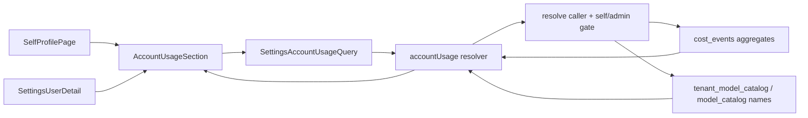

# feat: Add account usage to user profiles

## Overview

Add a user-scoped Account Usage section to the self Profile page and Settings -> Users -> User detail. The section will show a 90-day usage calendar, period totals, and an LLM model breakdown for the viewed user. The data comes from existing `cost_events` rows through a new focused GraphQL query, leaving the existing tenant-wide Settings -> Analytics queries and UI unchanged.

---

## Problem Frame

THNK-60 asks for a Claude/GitHub-like profile usage calendar plus model breakdown at the top of user profile surfaces. Today, `SettingsAnalytics` provides tenant-wide cost trend, user spend, and model spend, but a profile cannot explain the viewed account's own activity. The implementation should reuse the existing cost-event substrate and profile/settings conventions while preserving the product intent from the origin doc: personal and per-user transparency, not billing exports or tenant-wide chargeback (see origin: `docs/brainstorms/2026-06-21-account-usage-requirements.md`).

---

## Requirements Trace

- R1. Show account usage at the top of the user's own Profile page.
- R2. Show the same user-scoped account usage near the top of Settings -> Users -> User detail.
- R3. Provide profile-appropriate loading and empty states.
- R4. Render a recent daily usage calendar for the viewed user.
- R5. Expose day, total spend, input tokens, output tokens, and event count per calendar day.
- R6. Make the visual read as ThinkWork account usage, with explicit usage-volume intensity.
- R7. Show a model breakdown for the viewed user over the same period.
- R8. Include model display name when known, fallback model identifier, spend, tokens, and share of period usage.
- R9. Include compact period totals.
- R10. Normal users can see only their own account usage.
- R11. Operators/admins can see users in their tenant from Settings -> Users.
- R12. Usage remains tenant-scoped and excludes unattributed/system usage from profile views.

**Origin actors:** A1 User, A2 Operator/Admin
**Origin flows:** F1 Self profile usage review, F2 Operator reviews a user's profile
**Origin acceptance examples:** AE1 self profile calendar, AE2 admin user-scoped model breakdown, AE3 no-usage empty state, AE4 self/admin authorization

---

## Scope Boundaries

- This plan does not replace or redesign Settings -> Analytics.
- This plan does not add export, invoicing, chargeback, cross-user ranking, or per-thread drilldown.
- This plan does not add configurable metric selection beyond a fixed, bounded period parameter.
- This plan excludes unattributed/system usage unless it is confidently associated with the viewed user.
- This plan does not introduce new cost storage or migrations; it reads existing `cost_events` rows.

---

## Context & Research

### Relevant Code and Patterns

- `packages/database-pg/src/schema/cost-events.ts` already stores `tenant_id`, `user_id`, `created_at`, `amount_usd`, `model`, `event_type`, `input_tokens`, `output_tokens`, and has `idx_cost_events_user_created` on tenant/user/date.
- `packages/database-pg/graphql/types/costs.graphql` is the canonical GraphQL source for cost types and queries; schema/codegen must follow the repo rules after edits.
- Current package scripts expose GraphQL codegen for `apps/web`, `apps/cli`, and `apps/mobile`. Implementation should re-check package scripts before final verification and run any additional consumer codegen that exists at that time.
- `packages/api/src/graphql/resolvers/costs/*` contains the current tenant-wide cost queries. These are useful aggregation examples but are intentionally tenant-wide.
- `packages/api/src/graphql/resolvers/costs/userBudgetStatus.query.ts` and `packages/api/src/graphql/resolvers/tenant-agent/userModelCatalog.query.ts` demonstrate the right self-or-admin pattern: resolve caller, allow self, require admin/service for other users, and verify tenant/user membership.
- `packages/api/src/graphql/resolvers/core/resolve-auth-user.ts` is the required fallback path for Google-federated callers whose token may not carry `ctx.auth.tenantId`.
- `apps/web/src/components/profile/SelfProfilePage.tsx` is the self profile surface.
- `apps/web/src/components/settings/SettingsUserDetail.tsx` is the operator user detail surface and already colocates profile, budget, model approvals, and workspace files.
- `apps/web/src/components/settings/SettingsAnalytics.tsx` provides formatting and model-name shortening patterns for cost, tokens, and model rows.
- `packages/ui` exports tooltip and chart/table primitives; a calendar heatmap can be built with plain responsive grid + tooltip rather than adding a new visualization library.

### Institutional Learnings

- `docs/solutions/best-practices/every-admin-mutation-requires-requiretenantadmin-2026-04-22.md` says read paths must still scope by `resolveCallerTenantId(ctx)` and should not rely on `ctx.auth.tenantId`, especially for Google-federated users.

### External References

- Not used. Local GraphQL, auth, profile, and analytics patterns are strong enough for this feature.

---

## Key Technical Decisions

- Add a focused `accountUsage` GraphQL query instead of overloading tenant-wide analytics queries: profile usage has stricter user authorization and different response shape, while existing Analytics must remain tenant-wide.
- Query shape accepts `tenantId`, `userId`, and optional `days`, with server-side bounds: explicit tenant pin, explicit viewed user, default 90 days, maximum 365 days.
- Use one resolver to return summary, sparse daily rows, and model rows: the profile panel needs one loading/error boundary and one authorization decision for all data.
- Keep daily rows sparse in the API and densify the calendar in the web component: this avoids SQL `generate_series` complexity and lets the UI control calendar framing and empty days.
- Calendar intensity is primarily based on total spend; when every day in the period has zero spend, fall back to event count so zero-cost activity still appears.
- Model breakdown includes LLM events only: `costByModel` already uses `event_type = "llm"`, and non-LLM tool/compute events either have no model or would make "model breakdown" misleading.
- Resolve model display names server-side from tenant model catalog first, then global model catalog, with the raw model id as fallback.
- Reuse one web component for both self and admin surfaces, passing `{ tenantId, userId, readOnlyContext }` from the page.
- Keep calendar day bucketing aligned with the existing cost time-series resolver's database-day semantics for v1. User-timezone personalization is a future polish item unless implementation finds the current profile timezone can be applied safely without changing cost-query semantics elsewhere.

---

## Open Questions

### Resolved During Planning

- Calendar period: default to 90 days and cap at 365 days. This gives a meaningful profile pattern without a year-wide first render unless a caller explicitly requests it.
- Calendar intensity: use total spend, with event-count fallback for all-zero spend periods. Tooltips must name the metric so the visual is not ambiguous.
- Model rows: include only LLM cost events with model metadata, matching the current tenant-level model breakdown.
- Authorization: mirror `userBudgetStatus`/`userModelCatalog` self-or-admin/service rules and fail closed on cross-tenant users.
- Day bucketing: use the existing cost resolver convention for date buckets. Do not introduce profile-timezone bucketing in this first pass.

### Deferred to Implementation

- Exact responsive calendar cell sizing and tooltip copy: these are best tuned while implementing the component against real layout constraints.
- Exact generated codegen diffs: implementation should run the repo's codegen commands after GraphQL source/query edits and keep only generated outputs that change.
- Whether to include a small period selector in v1: the query can support bounded `days`, but the UI can start fixed at 90 days unless implementation reveals an easy, uncluttered control.

---

## High-Level Technical Design

> _This illustrates the intended approach and is directional guidance for review, not implementation specification. The implementing agent should treat it as context, not code to reproduce._

---

## Implementation Units

- U1. **Add user-scoped account usage GraphQL contract and resolver**

**Goal:** Add a focused API surface that returns one user's profile usage summary, sparse daily rows, and LLM model breakdown with self-or-admin authorization.

**Requirements:** R4, R5, R7, R8, R9, R10, R11, R12; F1, F2; AE2, AE4

**Dependencies:** None

**Files:**

- Modify: `packages/database-pg/graphql/types/costs.graphql`
- Modify: `packages/api/src/graphql/resolvers/costs/index.ts`
- Create: `packages/api/src/graphql/resolvers/costs/accountUsage.query.ts`
- Create: `packages/api/src/graphql/resolvers/costs/accountUsage.query.test.ts`

**Approach:**

- Add account usage types under the cost GraphQL domain, using names that make the profile scope clear, such as account usage summary, daily point, and model summary.
- Add `accountUsage(tenantId: ID!, userId: ID!, days: Int): AccountUsage!`.
- Validate `days` with a safe default of 90 and a hard maximum of 365.
- Resolve the caller via `resolveCaller(ctx)` for Cognito; allow the query when the caller is the viewed `userId`; otherwise require `requireAdminOrServiceCaller(ctx, tenantId, "account_usage:read")`.
- Verify the viewed user exists inside `tenantId` before aggregating. This check is load-bearing for self callers with stale or cross-tenant arguments.
- Aggregate sparse daily rows from `cost_events` where `tenant_id`, `user_id`, and `created_at >= periodStart`; include total spend, LLM spend, compute spend, tools spend, input tokens, output tokens, and event count.
- Aggregate model rows from LLM `cost_events` only. Join or post-load tenant/global model names so the response can include a display name while preserving the raw model id.
- Return period start/end and summary totals in the same response.
- Treat the `account_usage:read` operation name as part of the service/admin-skill contract. If implementation discovers no admin-skill or service consumer should read account usage, narrow the non-self branch to `requireTenantAdmin` and document that decision in the PR rather than leaving an unused allowlist string.

**Execution note:** Start with resolver authorization and aggregation tests before filling in the resolver body; this is the highest-risk surface.

**Patterns to follow:**

- `packages/api/src/graphql/resolvers/costs/userBudgetStatus.query.ts`
- `packages/api/src/graphql/resolvers/tenant-agent/userModelCatalog.query.ts`
- `packages/api/src/graphql/resolvers/costs/costTimeSeries.query.ts`
- `packages/api/src/graphql/resolvers/costs/costByModel.query.ts`

**Test scenarios:**

- Happy path: a self caller requesting their own usage in their tenant receives summary totals, daily rows, and LLM model rows for only that user.
- Happy path: an owner/admin caller requesting another tenant member's usage passes the admin/service gate and receives that member's usage.
- Covers AE4. Error path: a non-admin member requesting another user's usage receives a forbidden error before cost rows are read.
- Covers AE4. Error path: a self caller passes their own `userId` but a different `tenantId`; the resolver verifies user membership and rejects/not-founds instead of returning cross-tenant data.
- Error path: an `apikey` caller without `account_usage:read` in its agent allowlist is rejected by the non-self gate.
- Edge case: a valid user with no cost rows returns zero totals and empty daily/model rows rather than throwing.
- Edge case: `days` above the maximum is clamped or rejected according to the chosen validation posture, and the test documents the chosen behavior.
- Edge case: daily aggregation uses the same date-bucket convention as the existing cost time series, so a row near midnight is assigned predictably and the test pins the chosen bucket format.
- Integration: generated GraphQL schema includes the new query and fields, and the resolver is exported from the cost resolver index.

**Verification:**

- API tests prove self/admin/cross-tenant behavior and aggregation shape.
- Generated GraphQL artifacts compile against the new canonical cost schema.

---

- U2. **Add typed web query and reusable account usage section**

**Goal:** Build a reusable web component that fetches account usage, densifies sparse daily rows into a calendar grid, and renders profile-appropriate totals, calendar, model rows, loading, error, and empty states.

**Requirements:** R3, R4, R5, R6, R7, R8, R9; F1, F2; AE1, AE2, AE3

**Dependencies:** U1

**Files:**

- Modify: `apps/web/src/lib/settings-queries.ts`
- Create: `apps/web/src/components/profile/AccountUsageSection.tsx`
- Create: `apps/web/src/components/profile/AccountUsageSection.test.tsx`
- Generated: `apps/web/src/gql/`

**Approach:**

- Add `SettingsAccountUsageQuery` in `settings-queries.ts`, scoped to the fields the profile component needs.
- Implement `AccountUsageSection` with props for `tenantId`, `userId`, and optional `days`, defaulting to 90.
- Use the profile/settings visual language: compact metrics, restrained table/list rows, 8px-or-less radius where card framing is needed, and no marketing-style hero treatment.
- Densify the response's sparse daily rows into a stable 90-day grid. Empty days render at zero intensity; active days render a bounded intensity bucket.
- Use accessible tooltips/focus labels for day cells with date, spend, tokens, and event count. If total period spend is zero, bucket by event count and label that fallback explicitly.
- Render model rows sorted by spend, with display name, raw id fallback, token totals, cost, and share of period LLM spend.
- Keep the component tolerant of absent tenant/user ids by pausing the query and rendering a lightweight unavailable/empty state rather than crashing.
- Keep authorization/network errors visually contained and generic in the UI. The component can expose enough context for troubleshooting, but it should not leak raw resolver details into a profile page.

**Execution note:** Add component tests before integrating into pages so the data-shaping and empty-state behavior is pinned independently.

**Patterns to follow:**

- `apps/web/src/components/settings/SettingsAnalytics.tsx`
- `apps/web/src/components/settings/SettingsContent.tsx`
- `apps/web/src/components/profile/SelfProfilePage.test.tsx`
- `packages/ui/src/components/ui/tooltip.tsx`

**Test scenarios:**

- Covers AE1. Happy path: given three daily rows, the component renders totals, a 90-day grid, active intensity cells, and day detail labels containing spend, tokens, and event count.
- Covers AE2. Happy path: given two model rows and period total, the component sorts models by spend and renders display name, token totals, spend, and share.
- Covers AE3. Edge case: given zero totals and empty rows, the component renders a profile-appropriate "no usage yet" state and does not hide the section.
- Edge case: given model rows with missing display names, the component falls back to the model id or shortened model id.
- Edge case: given all daily spend values are zero but event counts are nonzero, the component still marks activity using event-count fallback and labels the fallback metric.
- Error path: when the query returns an authorization or network error, the component renders a small failure state inside the section without breaking the rest of the profile.
- Error path: raw GraphQL error text is not dumped verbatim into the profile surface when the failure is authorization-related.
- Integration: the query pauses when `tenantId` or `userId` is missing and does not dispatch an invalid GraphQL request.

**Verification:**

- Component tests cover the calendar, model breakdown, empty state, fallback intensity, and query pause behavior.
- The component remains reusable by both profile surfaces without duplicating fetch or shaping logic.

---

- U3. **Mount account usage on self and Settings user profile surfaces**

**Goal:** Place the reusable section at the top of both required profile contexts with the right tenant/user ids and existing profile permissions preserved.

**Requirements:** R1, R2, R3, R10, R11, R12; F1, F2; AE1, AE2, AE3, AE4

**Dependencies:** U2

**Files:**

- Modify: `apps/web/src/components/profile/SelfProfilePage.tsx`
- Modify: `apps/web/src/components/profile/SelfProfilePage.test.tsx`
- Modify: `apps/web/src/components/settings/SettingsUserDetail.tsx`
- Modify: `apps/web/src/components/settings/SettingsUserDetail.test.tsx`

**Approach:**

- Mount `AccountUsageSection` immediately after the page title in `SelfProfilePage`, before `ProfileSection` and `UserModelsSection`.
- Pass the resolved tenant id already used by self profile budget/model sections, and the loaded `me.id`.
- Mount `AccountUsageSection` immediately after the title in `SettingsUserDetail`, before `ProfileSection`, `UserModelsSection`, `UserWorkspaceSection`, and danger actions.
- Reuse existing loading behavior: do not render account usage until the viewed user is known; show the component's own internal loading once ids are available.
- Preserve existing profile edit, budget, role, model approval, workspace editor, and danger section behaviors.

**Patterns to follow:**

- Existing `SelfProfilePage` title/profile ordering.
- Existing `SettingsUserDetail` member lookup and test mocking style.
- `UserModelsSection` integration pattern in both tests.

**Test scenarios:**

- Covers AE1. Happy path: self profile renders Account Usage before the profile form and passes the authenticated user's id.
- Covers AE2. Happy path: Settings user detail renders Account Usage before editable profile details and passes the selected member user's id.
- Covers AE3. Edge case: when the self profile has no user yet, the page preserves its existing loading/not-loaded behavior and does not mount the usage query with blank ids.
- Error path: when Settings user detail cannot find the member, the not-found state renders and the usage section is not mounted with stale route params.
- Integration: self profile still passes read-only model/budget props for member role, and Settings user detail still renders user model/workspace/danger sections after usage.

**Verification:**

- Page tests prove placement and props for both surfaces.
- Existing profile edit and budget tests remain valid after the new section is inserted.

---

- U4. **Regenerate schema artifacts and close verification gaps**

**Goal:** Keep GraphQL generated artifacts and regression tests aligned across the monorepo after adding the new canonical cost query.

**Requirements:** R1-R12 as generated contract support; success criteria from the origin doc

**Dependencies:** U1, U2, U3

**Files:**

- Modify: `terraform/schema.graphql`
- Generated: `apps/cli/src/gql/`
- Generated: `apps/mobile/lib/gql/`
- Generated: `apps/web/src/gql/`
- Test: `apps/web/src/components/settings/SettingsAnalytics.test.tsx`
- Test: `packages/api/src/graphql/resolvers/costs/accountUsage.query.test.ts`
- Test: `apps/web/src/components/profile/AccountUsageSection.test.tsx`
- Test: `apps/web/src/components/profile/SelfProfilePage.test.tsx`
- Test: `apps/web/src/components/settings/SettingsUserDetail.test.tsx`

**Approach:**

- Run the repo's GraphQL schema generation and codegen steps after source edits. Although only web uses the new operation, CLI/mobile generated schema artifacts may change because the canonical schema changed. Re-check package scripts before finishing; if another package such as `@thinkwork/api` exposes a `codegen` script by then, include it rather than relying on this plan's current package-script snapshot.
- Keep `SettingsAnalytics` tests asserting the tenant-wide analytics query remains tenant-wide; this guards against accidentally rewriting the existing dashboard for profile needs.
- Add a lightweight source/test assertion if useful to ensure the profile component uses `accountUsage`, while analytics still uses `costSummary`, `costByUser`, `costByModel`, and `costTimeSeries`.
- Do not add a database migration unless implementation discovers a verified performance need not covered by `idx_cost_events_user_created`.

**Patterns to follow:**

- Existing generated client preset directories in `apps/web/src/gql/`, `apps/cli/src/gql/`, and `apps/mobile/lib/gql/`.
- Existing source-string regression style in `apps/web/src/components/settings/SettingsAnalytics.test.tsx`.

**Test scenarios:**

- Happy path: generated web types accept `SettingsAccountUsageQuery` and the component compiles against them.
- Integration: tenant-wide `SettingsAnalytics` still references existing tenant-wide queries and does not call the new profile query.
- Edge case: generated CLI/mobile artifacts remain schema-valid even without new documents.
- Test expectation: no new runtime behavior beyond the tests in U1-U3; this unit verifies generated contract consistency and regression coverage.

**Verification:**

- Typecheck passes for web/API after generated artifacts are updated.
- Targeted API and web tests pass for resolver, profile usage component, and both profile surfaces.
- Existing Analytics tests still pass, proving the profile query did not disturb tenant analytics.

---

## System-Wide Impact

- **Interaction graph:** Profile pages call one new GraphQL query; the query reads `users`, `cost_events`, and model catalog tables. No writes, background jobs, or external services are introduced.
- **Error propagation:** Authorization failures should stay inside the usage section on the web surface; profile editing and other sections should remain usable.
- **Security/privacy boundary:** The resolver is the enforcement point for self/admin access. The web component is not a security boundary and must not infer authorization from role props alone.
- **State lifecycle risks:** No persistent state is created. The only lifecycle concern is generated GraphQL artifacts drifting from canonical schema if codegen is skipped.
- **API surface parity:** Web is the only UI consumer in v1, but canonical schema changes require generated artifacts for every package with a codegen script.
- **Integration coverage:** Resolver tests cover auth/aggregation; component/page tests cover self/admin surfaces; existing Analytics tests cover unchanged tenant-wide behavior.
- **Unchanged invariants:** Settings -> Analytics remains tenant-wide. Budget and model approval behavior remains unchanged. No `cost_events` storage shape changes.

---

## Risks & Dependencies

| Risk                                                             | Mitigation                                                                                                                                                                                 |
| ---------------------------------------------------------------- | ------------------------------------------------------------------------------------------------------------------------------------------------------------------------------------------ |
| Cross-tenant or cross-user data exposure through a profile query | Mirror `userBudgetStatus` self-or-admin/service auth, verify viewed user belongs to tenant, and test self, admin, non-admin, and cross-tenant cases.                                       |
| Over-broad service/admin-skill read access                       | Treat `account_usage:read` as an explicit allowlist operation; if no service consumer is intended, prefer `requireTenantAdmin` for non-self Cognito access and document the narrower gate. |
| Profile query becomes a slow aggregation for large tenants       | Scope by `(tenant_id, user_id, created_at)` using existing index and cap period at 365 days; defer any new index until implementation verifies a real query-plan need.                     |
| Calendar communicates the wrong metric                           | Choose spend as the primary intensity metric, event-count fallback for zero-spend periods, and make tooltip/legend copy explicit.                                                          |
| Generated schema artifacts drift                                 | Include schema/codegen updates and generated directories in the plan, with verification that all consumers remain valid.                                                                   |
| The new profile view accidentally changes tenant Analytics       | Keep a focused new query and preserve existing `SettingsAnalytics` queries/tests.                                                                                                          |

---

## Documentation / Operational Notes

- Linear THNK-60 should be updated when the plan is saved and again when implementation starts.
- No public docs update is required for v1 unless implementation changes navigation labels or adds a user-facing help affordance.
- Local browser verification for implementation should use the web dev server guidance in `AGENTS.md`; profile/API-backed pages need the ignored web `.env` copied in worktrees.

---

## Sources & References

- **Origin document:** [docs/brainstorms/2026-06-21-account-usage-requirements.md](../brainstorms/2026-06-21-account-usage-requirements.md)
- **Linear issue:** THNK-60
- `packages/database-pg/src/schema/cost-events.ts`
- `packages/database-pg/graphql/types/costs.graphql`
- `packages/api/src/graphql/resolvers/costs/userBudgetStatus.query.ts`
- `packages/api/src/graphql/resolvers/tenant-agent/userModelCatalog.query.ts`
- `packages/api/src/graphql/resolvers/core/resolve-auth-user.ts`
- `packages/api/src/graphql/resolvers/core/authz.ts`
- `apps/web/src/components/profile/SelfProfilePage.tsx`
- `apps/web/src/components/settings/SettingsUserDetail.tsx`
- `apps/web/src/components/settings/SettingsAnalytics.tsx`
- `docs/solutions/best-practices/every-admin-mutation-requires-requiretenantadmin-2026-04-22.md`
