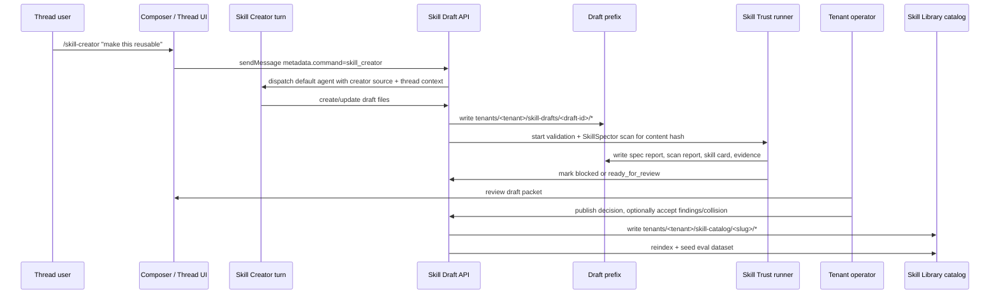

# feat: ThinkWork Skill Creator system

## Overview

Add a thread-accessible `/skill-creator` flow that helps any tenant user draft a
new Agent Skills-compatible skill, validates it against the public Agent Skills
spec and ThinkWork best practices, runs a Skill Trust pipeline based on the
actual NVIDIA SkillSpector / skill-card / signing guidance, and queues the skill
for tenant-operator review before publication into the existing Skill Library.

The system deliberately separates draft creation from catalog publication: any
thread user can create or iterate on a draft, while only tenant operators can
perform the audited publish decision that writes into
`tenants/<tenant-slug>/skill-catalog/<skill-slug>/`.

---

## Problem Frame

THNK-11 asks ThinkWork to help users turn a useful thread or workflow into a
reusable skill without requiring them to understand every file, catalog, eval,
and trust rule up front. Today, the Skill Library has a solid operator import,
export, edit, install, update, and eval path, but there is no creator workflow
from a thread, no draft review queue, and no integrated trust packet before a
new generated skill enters the tenant catalog.

The key product decision from the brainstorm is now resolved: **draft broadly,
publish narrowly**. Users get the convenience of `/skill-creator` wherever they
work; operators keep control over trusted catalog publication.

---

## Requirements Trace

- R1. `/skill-creator` is available from web thread composers in the first
  public release, with the backend command contract designed for mobile/RN
  parity. Mobile and React Native SDK composer support are an explicit
  follow-on before claiming "any ThinkWork thread composer."
- R2. `/skill` continues to mean force-pin an existing catalog skill; it must
  not be repurposed as the creator.
- R3. The creator asks enough questions to establish reusable intent, trigger,
  outputs, source material, tools/APIs, permissions, and tests.
- R4. A user can draft from the current thread/workflow, source artifacts, or an
  existing skill that needs modification.
- R5. Generated skills conform to the Agent Skills spec and ThinkWork skill best
  practices before they can be submitted for approval.
- R6. Generated skills include `SKILL.md`, supporting files when needed,
  ThinkWork `WIRING.md`, risk/trust metadata, and suggested eval cases when
  available.
- R7. Spec validation must run before publication.
- R8. NVIDIA SkillSpector must scan the complete skill directory before
  publication; critical/high findings block approval unless explicitly accepted
  with rationale.
- R9. The review packet includes a skill card, scan report, eval evidence when
  present, signature status, and publication recommendation.
- R10. Publishing writes into the existing tenant Skill Library source of truth
  and refreshes the derived `skill_catalog` index.
- R11. Slug collisions require explicit operator confirmation; installed copies
  remain unchanged until the existing update/apply path is used.
- R12. The implementation consumes upstream creator/trust assets directly where
  practical and records provenance so ThinkWork can benefit from future updates.
- R13. Only tenant operators can publish a draft into the Skill Library.
- R14. Non-expert authors get progressive intake, plain-language validation and
  trust feedback, preview/revision before submission, and clear "what happens
  next" status after submission.
- R15. The trusted release packet applies to skill-creator drafts and
  import-as-draft flows. Existing direct catalog import remains an operator-only
  recovery/legacy path and must be labeled outside the trusted release packet
  until it is fully migrated.

**Origin actors:** A1 thread user/skill author, A2 tenant operator, A3 ThinkWork
platform, A4 downstream implementation planner

**Origin flows:** F1 start creator from a thread, F2 draft a skill, F3 validate
and trust-scan the draft, F4 operator reviews and makes the publish decision,
F5 published skill appears in Skill Library

**Origin acceptance examples:** AE1 slash-command creator intake, AE2 generated
spec-valid skill draft, AE3 blocked high-risk trust scan, AE4 operator approval
publishes to Skill Library, AE5 existing installed copies are not silently
mutated

---

## Scope Boundaries

- This plan does not auto-publish generated skills for non-operators.
- This plan does not replace the existing Skill Library import/export flow; it
  builds on it.
- This plan does not change `/skill` force-pin semantics.
- This plan does not require live two-way sync with every external skill
  repository in v1. It adds explicit upstream provenance and refresh mechanics
  for the named creator/trust assets.
- This plan does not implement ThinkWork-generated OMS signing in v1. Signature
  verification/status is in scope; generated drafts are marked `unsigned` unless
  a follow-up adds signer/certificate configuration and signing operations.
- This plan does not install a newly published skill into agents automatically.
  Existing install/update paths remain the activation mechanism.
- This plan does not execute skill scripts during trust scanning. The trust
  runner performs static/spec/trust checks against staged files.
- This plan does not claim mobile/RN `/skill-creator` availability in the first
  public release. It adds backend command metadata that mobile can reuse and
  documents mobile parity as the next surface.

---

## Context & Research

### Relevant Code and Patterns

- `apps/web/src/components/spaces/SkillMenu.tsx` detects the existing `/skill`
  slash query and lists catalog skills.
- `apps/web/src/components/workbench/useComposerSkillPins.ts` converts `/slug`
  text tokens into pinned skill metadata at send time.
- `apps/web/src/components/workbench/SpacesComposer.tsx`,
  `apps/web/src/components/workbench/SpacesWorkbench.tsx`, and
  `apps/web/src/components/workbench/SpacesThreadDetailRoute.tsx` pass
  `metadata.skills` through `sendMessage`.
- `packages/api/src/lib/skills/message-pinned-skills.ts` and
  `packages/api/src/lib/mentions/default-agent-routing.ts` validate pinned
  skills against the tenant catalog and enforce blocklists at dispatch.
- `packages/database-pg/src/schema/skills.ts` defines `skill_catalog` as a
  derived per-tenant read cache of the S3 catalog source.
- `packages/api/src/lib/catalog-skill-archive.ts` validates and normalizes
  single-skill ZIP archives, generates `WIRING.md`, and renders export ZIPs.
- `packages/api/workspace-files.ts` already implements admin-gated
  `import-skill` / `export-skill`, S3 rollback behavior, reindex warnings, and
  bundled eval dataset sync.
- `apps/web/src/components/settings/SettingsSkills.tsx` and
  `apps/web/src/components/settings/SettingsSkillDetail.tsx` are the current
  operator Skill Library surfaces.
- `packages/api/src/lib/evals/skill-dataset.ts`,
  `packages/api/src/lib/evals/skill-eval-run.ts`, and
  `packages/api/src/lib/evals/skill-eval-gate.ts` provide per-skill eval
  dataset seeding, scored runs, and update-gate behavior.
- `packages/workspace-defaults/files/skills/artifact-builder/SKILL.md` shows
  how a system-provided workspace skill is shipped in defaults today.
- `packages/api/src/lib/plugins/handlers/skills.ts` shows generated
  `WIRING.md`, catalog seeding, index refresh, and skill eval sync for bundled
  plugin skills.
- `packages/database-pg/graphql/types/skill-catalog.graphql` powers the current
  catalog picker and should be extended only for catalog reads; draft lifecycle
  needs its own contract.

### Institutional Learnings

- `docs/solutions/best-practices/every-admin-mutation-requires-requiretenantadmin-2026-04-22.md`
  requires tenant-admin gating before any publish-side effect.
- `docs/solutions/best-practices/injected-built-in-tools-are-not-workspace-skills-2026-04-28.md`
  keeps platform-owned tools separate from editable workspace skills; the
  creator is a workflow/tooling capability, while its generated outputs are
  tenant catalog skills.
- `docs/solutions/architecture-patterns/skill-eval-rated-does-not-mean-evaluable-2026-06-15.md`
  warns that having eval cases does not prove a skill can be materialized; the
  review packet must distinguish dataset presence from eval/run eligibility.
- `docs/solutions/workflow-issues/skill-catalog-slug-collision-execution-mode-transitions-2026-04-21.md`
  reinforces that slug collision and behavior changes need explicit review.

### External References

- Anthropic `skill-creator` skill:
  `https://github.com/anthropics/skills/tree/main/skills/skill-creator`.
  Relevant behavior: intake, draft `SKILL.md`, generate test prompts, run
  with-skill/baseline evals, iterate through user review, and package output.
- Agent Skills specification: `https://agentskills.io/specification`.
  Relevant constraints: skill directory with `SKILL.md`; required `name` and
  `description`; strict name/description limits; optional `scripts/`,
  `references/`, `assets/`, `license`, `compatibility`, `metadata`, and
  `allowed-tools`; progressive disclosure.
- Agent Skills best practices:
  `https://agentskills.io/skill-creation/best-practices`. Relevant guidance:
  start from real expertise and task traces, keep coherent units, calibrate
  control, prefer procedures/checklists/gotchas/templates, and validate through
  execution loops.
- NVIDIA Skill Trust pipeline:
  `https://docs.nvidia.com/skills/agent-skill-trust-pipeline`. Relevant gate:
  author narrow skill, scan with SkillSpector, fix/accept high-risk findings,
  complete skill card, sign/publish, and verify before use.
- NVIDIA scanning docs:
  `https://docs.nvidia.com/skills/scanning-agent-skills`. Relevant behavior:
  SkillSpector scans repos/URLs/zips/dirs/files and emits terminal, JSON,
  Markdown, or SARIF reports.
- NVIDIA release checklist and skill cards:
  `https://docs.nvidia.com/skills/release-checklist` and
  `https://docs.nvidia.com/skills/skill-cards`. Relevant artifact packet:
  `SKILL.md`, support dirs, skill card, scan report, Tier-3 eval dataset,
  `BENCHMARK.md`, signature status, and verification instructions.

---

## Key Technical Decisions

- **Draft broadly, publish narrowly.** Any tenant thread user can create and
  submit a draft; `publishSkillDraft` requires tenant-operator authority. In
  code, "tenant operator" means the existing tenant `owner` or `admin` roles
  enforced with `requireTenantAdmin`.
- **Keep `/skill` and `/skill-creator` separate.** `/skill` remains catalog
  force-pin. `/skill-creator` becomes a command dispatch with its own metadata,
  not an entry in the skill picker.
- **Use one v1 command interaction.** `/skill-creator` is a reserved slash
  command that submits an inline creator turn. It does not open a modal in v1.
  Missing intake is asked in-thread, the visible command token is stripped from
  the persisted user message text, and the thread renders a draft status card
  after draft creation.
- **Persist drafts outside the catalog.** Draft files and evidence live under a
  tenant draft prefix until approval, with DB rows for lifecycle/status. The
  catalog is touched only by the publish mutation.
- **Reuse catalog import/export primitives for publication.** The final publish
  path should reuse `catalog-skill-archive` validation/normalization and the
  existing catalog S3 write/reindex/eval sync behavior rather than introducing
  a second catalog writer.
- **Use actual upstream assets with provenance.** Seed/sync the upstream
  Anthropic `skill-creator` skill as a tracked hidden platform dispatch asset,
  and package NVIDIA SkillSpector as a runner dependency rather than
  reimplementing scanner heuristics in TypeScript. The hidden asset must not
  appear in the normal Skill Library picker.
- **Make trust evidence first-class.** SkillSpector reports, spec validation,
  skill card, eval evidence, acceptance rationale, and signature status are
  durable draft evidence, not transient UI decorations.
- **Fail closed on high-risk findings.** Critical/high SkillSpector findings
  block approval unless an operator records explicit acceptance rationale.
- **External signatures are verified, generated signatures are status-tracked.**
  If a draft/import includes `skill.oms.sig`, verify and display status. If
  ThinkWork signing config is absent, mark generated drafts as unsigned rather
  than pretending they are fully signed.
- **Do not auto-install published skills.** Publication creates/updates catalog
  source and refreshes derived metadata. Agent installation and stale update
  application remain explicit existing workflows.
- **Bind trust evidence to content.** Every trust run, scan report, skill card
  result, signature result, and accepted finding is tied to an immutable
  `input_content_hash`. Any draft file mutation marks prior trust evidence
  stale, and publish rejects unless the current draft hash equals the latest
  completed trust run hash.
- **Default Skill Library import to trusted draft review.** The operator UI
  should import portable ZIPs as drafts and run the same trust/review packet.
  Existing direct `import-skill` stays available only as an admin recovery path
  and is labeled as outside the trusted release packet.

---

## Security and Data Handling

- Draft files, trust reports, and skill cards are tenant data and must inherit
  workspace bucket encryption/KMS posture.
- Draft writes enforce archive-like limits: maximum file count, maximum
  individual file bytes, maximum total draft bytes, maximum path length, bounded
  report size, and allowed file types where practical.
- A draft can have only one active trust run. Trust-run retries are
  rate-limited per user and per tenant.
- Draft submission and publish preflight include secret scanning and PII review
  suitable for markdown/source artifacts. Secrets must be referenced by
  SSM/Secrets Manager names or credential references, not embedded in skill
  files, reports, or cards.
- Scanner logs and UI errors must redact file contents, suspected secrets,
  tokens, and private thread excerpts.
- Operator review packets contain sanitized summaries and excerpts by default.
  Source thread links still enforce normal thread/artifact ACLs; tenant-operator
  review does not grant automatic full access to unrelated private thread data.
- Rejected and failed drafts need retention/deletion behavior documented before
  launch so stale sensitive drafts are not retained indefinitely.

---

## Open Questions

### Resolved During Planning

- Actor model: any thread user can draft/request publication; tenant operators
  make the audited publish decision.
- Slash command name: implement `/skill-creator`; do not overload `/skill`.
- Catalog target: publish to the existing tenant S3 skill catalog and derived
  `skill_catalog` index.
- Trust scanner: integrate actual SkillSpector in a runner job instead of
  recreating its rules.
- Approval gate: critical/high findings block publish unless formally accepted.

### Deferred to Implementation

- Exact `skill_drafts` status enum names can be tuned during schema work, but
  approval and publication are one v1 transaction: there is no durable
  approved-but-unpublished state unless implementation deliberately adds that
  extra operator workflow.
- SkillSpector runner shape: v1 targets a Python 3.12 Lambda container image
  that invokes the actual SkillSpector CLI against a staged draft directory.
  U4 begins with a spike that proves the image can run a fixture scan and emit
  JSON/Markdown/SARIF reports before trust UI work proceeds.
- ThinkWork signing keys are out of v1. Generated drafts show `unsigned`; a
  follow-up can add signing once certificate and key custody decisions exist.

---

## High-Level Technical Design

> _This illustrates the intended approach and is directional guidance for
> review, not implementation specification. The implementing agent should treat
> it as context, not code to reproduce._

---

## Implementation Units

- U1. **Add Skill Draft Data Model and GraphQL Lifecycle**

**Goal:** Create the durable draft/review substrate that separates user-authored
skill drafts from operator-published catalog entries without front-loading the
trust runner or catalog publication implementation.

**Requirements:** R4, R6, R9, R10, R11, R13; F2, F3, F4, F5; AE2, AE3, AE4,
AE5

**Dependencies:** None

**Files:**

- Modify: `packages/database-pg/src/schema/skills.ts`
- Modify: `packages/database-pg/src/schema/index.ts`
- Create: `packages/database-pg/graphql/types/skill-creator.graphql`
- Create: `packages/database-pg/drizzle/00xx_add_skill_drafts.sql`
- Modify: `packages/api/src/graphql/resolvers/index.ts`
- Create: `packages/api/src/graphql/resolvers/skill-creator/index.ts`
- Create: `packages/api/src/graphql/resolvers/skill-creator/skillDrafts.query.ts`
- Create: `packages/api/src/graphql/resolvers/skill-creator/skillDraft.query.ts`
- Create: `packages/api/src/graphql/resolvers/skill-creator/createSkillDraft.mutation.ts`
- Create: `packages/api/src/graphql/resolvers/skill-creator/updateSkillDraft.mutation.ts`
- Create: `packages/api/src/graphql/resolvers/skill-creator/submitSkillDraft.mutation.ts`
- Create: `packages/api/src/graphql/resolvers/skill-creator/rejectSkillDraft.mutation.ts`
- Create: `packages/api/src/graphql/resolvers/skill-creator/skillDrafts.query.test.ts`
- Create: `packages/api/src/graphql/resolvers/skill-creator/skillDraft.lifecycle.test.ts`

**Approach:**

- Add `skill_drafts` with tenant id, draft id, slug, title/display name,
  source thread/message ids, requested-by user id, status, summary, current
  content hash, source kind, inbox item id, and timestamps.
- Keep U1 statuses intentionally small: `draft`, `submitted`, `rejected`, and
  `failed`. U4/U5 add trust and publication statuses after their tables and
  services exist.
- Add `skill_draft_events` for append-only lifecycle evidence: created,
  updated, submitted, rejected, and failed. U4/U5 append trust and publication
  event types later.
- Store draft files in S3 under `tenants/<tenant-slug>/skill-drafts/<draft-id>/`
  and keep DB rows as the index/control plane.
- Define GraphQL types for draft summary, draft detail, source pointer,
  requester, current content hash, and lifecycle events. Trust result, findings,
  signature status, and publish readiness fields are added in U4/U5.
- Allow tenant members to create/update/submit their own drafts inside their
  tenant. Require tenant-operator authority for listing all tenant drafts and
  rejection.
- Gate side-effecting operator mutations with `requireTenantAdmin(ctx, tenantId)`
  before writing review state.
- Keep read paths tenant-scoped via caller tenant resolution, not raw
  `ctx.auth.tenantId`.

**Patterns to follow:**

- `packages/database-pg/src/schema/skills.ts`
- `packages/database-pg/src/schema/deployments.ts`
- `packages/api/src/graphql/resolvers/deployments/shared.ts`
- `packages/api/src/graphql/resolvers/core/authz.ts`
- `docs/solutions/best-practices/every-admin-mutation-requires-requiretenantadmin-2026-04-22.md`

**Test scenarios:**

- Happy path: a tenant member creates a draft from a thread and receives a
  tenant-scoped draft id and S3 prefix metadata.
- Happy path: the requester updates their draft while it is in `draft` state,
  the current content hash changes, and an event is appended.
- Happy path: submitting a draft changes status to `submitted` and records a
  pending review/trust event placeholder without launching future unit logic.
- Authorization: a tenant member cannot list all tenant drafts or reject another
  user's draft.
- Authorization: an operator can list pending drafts and reject a draft with a
  visible rationale.
- Cross-tenant safety: a caller from tenant A cannot read, update, submit, or
  reject a tenant B draft by id.
- Ordering: reject/list-all operator mutations call tenant-admin gating before
  review side effects.
- State machine: rejected/published drafts cannot be updated through the normal
  author edit mutation without an explicit reopen path.

**Verification:**

- API resolver tests prove lifecycle, tenant scoping, and admin gating.
- Drizzle migration and GraphQL schema/codegen compile across consumers.

---

- U2. **Implement Draft File Storage, Spec Validation, and Catalog Publish Reuse**

**Goal:** Let creator agents and UI edit draft files safely, validate complete
draft directories, and publish ready files through the existing catalog
import/write-through mechanics.

**Requirements:** R5, R6, R7, R10, R11; F2, F3, F5; AE2, AE4, AE5

**Dependencies:** U1

**Files:**

- Modify: `packages/api/src/lib/catalog-skill-archive.ts`
- Modify: `packages/api/src/lib/catalog-skill-archive.test.ts`
- Modify: `packages/api/workspace-files.ts`
- Modify: `packages/api/src/__tests__/workspace-files-handler.test.ts`
- Create: `packages/api/src/lib/skill-drafts/files.ts`
- Create: `packages/api/src/lib/skill-drafts/files.test.ts`
- Create: `packages/api/src/lib/skill-drafts/publish.ts`
- Create: `packages/api/src/lib/skill-drafts/publish.test.ts`
- Modify: `apps/web/src/lib/workspace-files-api.ts`
- Modify: `apps/web/src/lib/workspace-files-api.test.ts`

**Approach:**

- Extract the catalog import write path into a reusable service that accepts a
  normalized file list and options for collision confirmation, reindex, and eval
  sync.
- Add a directory/file-list validation entry point beside
  `parseCatalogSkillArchive` so drafts do not need to zip themselves just to
  validate.
- Extend `workspace-files` or add a sibling API target for `skillDraftId` with
  `get`, `list`, `put`, and `delete` over the draft prefix. Target resolution
  must reject requests that include more than one target, require a non-empty
  `skillDraftId`, resolve the draft row before S3 access, enforce requester
  ownership for author writes, allow tenant-operator read/review access, and
  allow service-auth writes only from the creator runtime affordance.
- Lock writes by status: author and creator-service writes are allowed only
  while a draft is `draft`, `failed`, or returned for changes; submitted,
  trust-running, ready, publishing, and published drafts are read-only unless an
  explicit reopen/request-changes mutation moves them back to an editable state.
- Every successful file mutation recomputes `current_content_hash` and marks any
  prior trust evidence stale by clearing publish readiness fields added in
  U4/U5.
- Enforce draft limits at this layer: file count, per-file bytes, total bytes,
  path length, allowed path shape, and bounded binary handling.
- Validate draft paths with the same path-safety rules as catalog archive import
  and reject built-in tool slugs.
- Generate `WIRING.md` when missing using the same default wiring pattern as
  catalog import/plugin skill seeding.
- Add `publishSkillDraft` service that reads the draft prefix, recomputes the
  current content hash, validates it as a complete Agent Skills directory,
  checks trust readiness for that exact hash, checks slug collision state, and
  writes to `skill-catalog/<slug>/` using the shared catalog service.
- Add import-as-draft support by reusing archive parsing to stage an uploaded
  ZIP under a draft prefix rather than writing directly to `skill-catalog/`.
  Settings UI should prefer this trusted import path; direct catalog import
  remains an operator recovery path outside the release packet.
- On publish, sync bundled `evals/*.json` into the per-skill eval dataset and
  launch the existing non-blocking skill eval run just like catalog import.
- On replacement, preserve the existing import behavior: update catalog source,
  refresh `skill_catalog`, and leave installed workspace copies unchanged.

**Patterns to follow:**

- `packages/api/src/lib/catalog-skill-archive.ts`
- `packages/api/workspace-files.ts`
- `packages/api/src/lib/plugins/handlers/skills.ts`
- `packages/api/src/lib/evals/skill-dataset.ts`
- `docs/solutions/architecture-patterns/skill-eval-rated-does-not-mean-evaluable-2026-06-15.md`

**Test scenarios:**

- Happy path: a draft containing `SKILL.md` plus support files validates as a
  complete catalog candidate without creating a ZIP.
- Happy path: missing `WIRING.md` gets generated and stored as ordinary draft
  content before review.
- Error path: invalid `SKILL.md`, unsafe paths, missing description, slug/name
  mismatch, and built-in slug conflicts fail validation with fixable errors.
- Publish path: a ready draft publishes to `skill-catalog/<slug>/`, refreshes
  the index, and records the published content hash on the draft.
- Collision path: an existing catalog slug blocks publish until the operator
  passes explicit replacement confirmation.
- Replacement path: confirmed publish replaces catalog files but does not write
  to any installed `agents/*/skills/<slug>/` or `spaces/*/skills/<slug>/`
  prefix.
- Eval path: bundled `evals/*.json` are synced; eval sync warnings do not
  falsely report catalog publication failure.
- Rollback path: a catalog write failure during replacement restores prior
  catalog objects or reports precise rollback failure.
- Stale evidence path: editing any draft file after a ready trust run makes
  publish fail until trust reruns against the new hash.
- API target path: missing `skillDraftId`, multiple targets, unauthorized owner,
  locked status, empty draft prefix, S3 read/write failure, and oversized draft
  all return structured errors.

**Verification:**

- Unit and handler tests prove validation, draft file CRUD, publication,
  collision handling, rollback, and installed-copy non-mutation.

---

- U3. **Seed Upstream Skill Creator Assets and Wire `/skill-creator` Dispatch**

**Goal:** Make `/skill-creator` available from thread composers and dispatch the
creator workflow using upstream skill-creator assets with recorded provenance.

**Requirements:** R1, R2, R3, R4, R12; F1, F2; AE1, AE2

**Dependencies:** U1, U2

**Files:**

- Create: `packages/api/src/lib/skill-creator/upstream-sources.ts`
- Create: `packages/api/src/lib/skill-creator/upstream-sources.test.ts`
- Create: `scripts/sync-upstream-skill-creator.ts`
- Modify: `packages/workspace-defaults/src/index.ts`
- Add: `packages/workspace-defaults/files/skills/skill-creator/SKILL.md`
- Add: `packages/workspace-defaults/files/skills/skill-creator/references/`
- Modify: `packages/workspace-defaults/src/__tests__/parity.test.ts`
- Modify: `apps/web/src/components/spaces/SkillMenu.tsx`
- Modify: `apps/web/src/components/workbench/useComposerSkillPins.ts`
- Modify: `apps/web/src/components/workbench/SpacesComposer.tsx`
- Modify: `apps/web/src/components/workbench/SpacesWorkbench.tsx`
- Modify: `apps/web/src/components/workbench/SpacesThreadDetailRoute.tsx`
- Modify: `apps/mobile/components/chat/ChatInput.tsx`
- Modify: `apps/mobile/hooks/useGraphQLChat.ts`
- Modify: `packages/react-native-sdk/examples/chat-ui/ThinkworkChat.tsx`
- Modify: `apps/web/src/components/workbench/SpacesWorkbench.test.tsx`
- Modify: `apps/web/src/components/workbench/SpacesThreadDetailRoute.test.tsx`
- Modify: `apps/mobile/components/chat/ChatInput.test.tsx` if a local test
  harness exists; otherwise add the nearest chat-input test.
- Modify: `packages/api/src/graphql/resolvers/threads/createThread.mutation.ts`
- Modify: `packages/api/src/graphql/resolvers/messages/sendMessage.mutation.ts`
- Modify: `packages/api/src/lib/mentions/default-agent-routing.ts`
- Modify: `packages/api/src/handlers/chat-agent-invoke.ts`
- Modify: `packages/api/src/handlers/wakeup-processor.ts`
- Modify: `packages/agentcore-pi/agent-container/src/server.ts`
- Create: `packages/agentcore-pi/agent-container/src/runtime/skill-drafts.ts`
- Create: `packages/agentcore-pi/agent-container/tests/skill-drafts.test.ts`
- Create: `packages/api/src/lib/skill-creator/command-metadata.ts`
- Create: `packages/api/src/lib/skill-creator/command-metadata.test.ts`

**Approach:**

- Add an upstream source registry for the Anthropic `skill-creator` skill:
  repository URL, source path, fetched commit/tag, content digest, license, and
  last refreshed timestamp.
- Add a sync script that fetches the upstream skill files and writes the
  defaults package sources with a provenance sidecar. The committed files should
  stay recognizable as upstream content; ThinkWork-specific behavior belongs in
  wrapper instructions or runtime command metadata, not a silent rewrite of the
  upstream skill.
- Seed `skill-creator` as a hidden platform dispatch asset available to the
  platform agent used for thread dispatch. It must not be indexed into
  `tenantSkillCatalog`, displayed in the `/skill` picker, or installed as an
  ordinary tenant catalog skill.
- Update composer slash parsing so `/skill-creator` is treated as a reserved
  command, not as a partial `/skill` catalog query for `skill-creator`.
- On submit, remove or normalize the command token as needed and attach
  structured message metadata such as `{ command: { type: "skill_creator" } }`.
- Interaction contract: submit starts an assistant creator turn in the same
  thread. Missing intake is asked inline in the thread. The command can be
  cancelled by abandoning the draft before submission, and retry creates a new
  draft unless the requester explicitly continues an existing draft card.
- In send-message, direct invoke, and wakeup dispatch paths, recognize the
  command metadata and provide creator context: current thread id, source
  message id, requester id, draft API affordance, and the upstream
  skill-creator instructions.
- Add a Pi runtime extension/tool for skill drafts that can create, update,
  list, and submit draft files via service-auth. It must call the API draft
  target rather than writing S3 directly, and must pass tenant/thread/requester
  context from the invocation payload.
- The creator turn should ask intake questions when required, then create or
  update a draft through the draft lifecycle rather than writing directly to the
  catalog.
- Keep the public web slash command behind a feature flag until U4, U5, and the
  minimal U6 status card are also available. Backend command metadata can land
  earlier for integration tests.
- Keep `/skill` force-pin extraction unchanged for ordinary `/slug` tokens.

**Patterns to follow:**

- `apps/web/src/components/spaces/SkillMenu.tsx`
- `apps/web/src/components/workbench/useComposerSkillPins.ts`
- `packages/api/src/lib/skills/message-pinned-skills.ts`
- `packages/api/src/lib/mentions/default-agent-routing.ts`
- `packages/workspace-defaults/files/skills/artifact-builder/SKILL.md`

**Test scenarios:**

- Composer: typing `/skill-creator` does not open the Skill Library picker.
- Composer: submitting `/skill-creator make this reusable` sends command
  metadata and does not add a pinned catalog skill.
- Composer: the persisted user message omits the raw `/skill-creator` token or
  renders it as command chrome rather than ordinary prose.
- Composer: existing `/crm-dashboard` or `/skill` picker behavior is unchanged.
- Dispatch: a message with skill-creator command metadata routes to the default
  agent with creator context and upstream creator instructions.
- Runtime: `sendMessage`, `chat-agent-invoke`, and `wakeup-processor` carry the
  same command context into Pi.
- Runtime: the Pi skill-draft tool creates/updates/submits draft files through
  service-auth and cannot write outside the draft prefix.
- Mobile/RN parity: mobile and React Native SDK components either support the
  command metadata or explicitly hide the command until their follow-on UI work
  lands; no surface should silently send `/skill-creator` as plain text.
- Draft: the command flow creates a draft row/prefix instead of catalog files.
- Upstream sync: provenance records the fetched source URL, commit/digest, and
  license; parity tests fail if committed default files drift from their source
  without updating provenance.

**Verification:**

- Web and API tests prove command parsing, metadata, dispatch, and upstream
  source provenance without regressing force-pinned skills.

---

- U4. **Add Skill Trust Runner with SkillSpector, Skill Cards, and Signature Status**

**Goal:** Run the actual NVIDIA-aligned trust pipeline on staged skill drafts
and on existing catalog skills, then write durable evidence that gates operator
approval and gives operators a per-skill trust report from the Skill Library.

**Requirements:** R7, R8, R9, R12; F3, F4; AE2, AE3

**Dependencies:** U1, U2

**Files:**

- Create: `packages/api/src/lib/skill-trust/spec-validation.ts`
- Create: `packages/api/src/lib/skill-trust/spec-validation.test.ts`
- Create: `packages/api/src/lib/skill-trust/skill-card.ts`
- Create: `packages/api/src/lib/skill-trust/skill-card.test.ts`
- Create: `packages/api/src/lib/skill-trust/findings.ts`
- Create: `packages/api/src/lib/skill-trust/findings.test.ts`
- Create: `packages/skill-trust-runner/Dockerfile`
- Create: `packages/skill-trust-runner/pyproject.toml`
- Create: `packages/skill-trust-runner/src/handler.py`
- Create: `packages/skill-trust-runner/tests/test_handler.py`
- Modify: `scripts/build-lambdas.sh` or add the existing repo-standard
  container-image build script hook for this package
- Modify: `terraform/modules/app/*`
- Modify: `terraform/modules/thinkwork/*`
- Modify: `packages/api/src/graphql/resolvers/skill-creator/submitSkillDraft.mutation.ts`
- Create: `packages/api/src/graphql/resolvers/skill-creator/startSkillTrustRun.mutation.ts`
- Create: `packages/api/src/graphql/resolvers/skill-creator/acceptSkillTrustFinding.mutation.ts`
- Create: `packages/api/src/graphql/resolvers/skill-creator/skillTrustRun.test.ts`
- Modify: `packages/api/workspace-files.ts`
- Modify: `apps/web/src/lib/workspace-files-api.ts`
- Modify: `apps/web/src/components/settings/SettingsSkillDetail.tsx`
- Modify: `apps/web/src/components/settings/SettingsSkillDetail.test.tsx`

**Approach:**

- Implement a trust-run state machine in application code: spec validation,
  generated skill card validation, SkillSpector scan, optional signature
  verification, eval packet detection, and publish-readiness summary.
- Add a catalog-skill trust target beside the draft target. Operators can start
  a trust run for `skill-catalog/<slug>/` from the Skill Library detail page;
  the run uses the same SkillSpector runner, artifact detection, severity
  policy, signature status, and report parsing as draft trust runs, but it does
  not mutate catalog source or installed agent copies.
- Add a shield icon to the Skill Library detail header. Clicking it opens a
  right-side "Skill trust" sheet scoped to the current skill with a run button,
  latest report status, severity counts, SkillSpector provenance, skill-card /
  eval / benchmark / signature evidence, and links or expandable sections for
  detailed findings.
- Start U4 with a runner spike: build a Python 3.12 Lambda container image,
  invoke the actual SkillSpector CLI against a fixture skill, and prove
  JSON/Markdown/SARIF reports are emitted and uploaded. Do not build the review
  UI on mocked scanner output until this spike passes.
- Package `skill-trust-runner` as that Lambda container image. Pin the
  SkillSpector source/version/commit in package metadata so scanner updates are
  reviewed deliberately.
- The runner downloads draft files from S3 to a temp directory, runs static scan
  mode first, writes reports back under
  `skill-drafts/<draft-id>/trust/<run-id>/`, and updates `skill_trust_runs`.
- Runner security contract: use a least-privilege role scoped to the one draft
  prefix and trust output prefix for the run; provide no tenant/runtime secrets
  in the environment; avoid broad network egress unless explicitly required and
  documented; run non-root/read-only where the base image allows; enforce strict
  timeout, memory, and temp-storage caps; clean temp directories; redact logs;
  and include Terraform/IAM assertions for prefix scope.
- Each trust run records `input_content_hash`, runner image digest,
  SkillSpector version/provenance, report keys, and completion status.
- Parse SkillSpector findings into stable severity counts and categories. Treat
  critical/high as blocking unless accepted by an operator with rationale.
- Generate or validate `skill-card.md` from draft metadata, source thread,
  intended use, owner, license/terms, risks/mitigations, expected outputs,
  eval tasks/metrics, version/signature identifier, and ethical considerations.
- Detect `BENCHMARK.md`, bundled `evals/*.json`, and completed skill eval score
  evidence; distinguish absent evidence from failing evidence.
- Verify `skill.oms.sig` when a signature and certificate chain are present and
  verification tooling/config exists. If unavailable, record `unverified` with
  reason. For ThinkWork-generated unsigned drafts, record `unsigned`.
- Add `acceptSkillTrustFinding` requiring tenant-operator authority, finding id,
  severity, stable finding fingerprint, `input_content_hash`, trust run id,
  rationale, and optional expiration/review note.
- Publish readiness requires a valid spec report, completed SkillSpector report,
  completed skill card, no unaccepted critical/high findings, and known
  signature status, all for the current draft content hash.

**Patterns to follow:**

- `packages/api/src/lib/evals/skill-eval-run.ts`
- `packages/lambda/`
- `scripts/build-lambdas.sh`
- `terraform/modules/app`
- `packages/database-pg/src/schema/deployments.ts`

**Test scenarios:**

- Spec validation: valid draft passes with normalized slug/hash; invalid
  frontmatter blocks readiness.
- SkillSpector success: runner stores JSON/Markdown reports and marks the draft
  ready when no blocking findings exist.
- Blocking scan: a high finding marks the draft `blocked` and prevents publish.
- Acceptance: an operator records rationale for a high finding; readiness
  recomputes as publishable only when all blocking findings for the same content
  hash are accepted.
- Staleness: editing draft files after a completed trust run makes the prior
  scan, skill card result, signature result, and finding acceptances stale until
  trust reruns.
- Runner isolation: Terraform/IAM tests or assertions prove the runner cannot
  read arbitrary tenant prefixes or receive broad application secrets.
- Abuse limits: repeated trust-run attempts respect one-active-run and rate
  limits; oversized drafts fail before runner invocation.
- Authorization: non-operators cannot accept blocking findings or force a trust
  run into ready state.
- Signature: an included `skill.oms.sig` with missing verifier config records
  `unverified` rather than passing silently.
- Skill card: missing required skill-card fields block readiness with fixable
  errors.
- Runner failure: scanner crash records failed trust run and preserves the draft
  for retry without mutating catalog files.
- Catalog scan: opening a Skill Library detail page and clicking the shield
  opens a trust sheet for that slug; running the pipeline scans the complete
  catalog skill directory and renders the resulting report without changing the
  catalog or installed copies.
- Catalog authorization: non-operators cannot start catalog skill trust runs.

**Verification:**

- Unit tests cover report parsing, skill card requirements, blocking policy, and
  authorization. Runner tests mock SkillSpector invocation and S3 report writes.
  Web tests cover the shield header action, sheet states, run dispatch, and
  report rendering.

---

- U5. **Build Operator Review, Approval, and Publish Flow**

**Goal:** Give operators a complete review queue and approval surface that turns
a ready draft into a Skill Library catalog entry only after trust gates pass.

**Requirements:** R8, R9, R10, R11, R13; F4, F5; AE3, AE4, AE5

**Dependencies:** U1, U2, U4

**Files:**

- Create: `packages/api/src/graphql/resolvers/skill-creator/publishSkillDraft.mutation.ts`
- Create: `packages/api/src/graphql/resolvers/skill-creator/publishSkillDraft.mutation.test.ts`
- Modify: `apps/web/src/lib/skill-creator-queries.ts`
- Create: `apps/web/src/components/settings/skill-creator/SkillDraftsQueue.tsx`
- Create: `apps/web/src/components/settings/skill-creator/SkillDraftDetail.tsx`
- Create: `apps/web/src/components/settings/skill-creator/SkillTrustEvidencePanel.tsx`
- Create: `apps/web/src/components/settings/skill-creator/SkillDraftApprovalDialog.tsx`
- Create: `apps/web/src/components/settings/skill-creator/SkillDraftsQueue.test.tsx`
- Create: `apps/web/src/components/settings/skill-creator/SkillDraftDetail.test.tsx`
- Modify: `packages/database-pg/src/schema/inbox-items.ts`
- Modify: `packages/api/src/graphql/resolvers/inbox/*`
- Modify: `apps/web/src/components/settings/SettingsSkills.tsx`
- Modify: `apps/web/src/routes/__root.tsx` or the relevant settings route file

**Approach:**

- Add Settings -> Skills tabs for `Published` and `Drafts`, with a pending
  count badge on `Drafts`. The existing published list stays the default tab
  for operators arriving to manage live skills.
- Group draft queue rows by `Ready for review`, `Blocked`, `Submitted`,
  `Changes requested`, and `Published/rejected`, with requester, source thread
  summary, proposed slug, trust summary, updated timestamp, assigned operator,
  and collision status.
- Create or reuse an inbox item when a draft is submitted or becomes
  ready-for-review so operator approval is not hidden in Settings. The inbox
  item links to the draft detail, source thread summary, requester, and current
  blocker/readiness state.
- Detail view shows editable/previewable draft files, `SKILL.md` summary,
  `WIRING.md`, skill card, SkillSpector report, severity counts, accepted
  findings, eval evidence, signature status, sanitized source-thread summary,
  event history, and source thread link when the viewer also has normal access
  to that thread.
- Detail hierarchy: header/status/actions first; readiness blockers second;
  trust evidence third; draft files fourth; sanitized source context fifth;
  event history last.
- `publishSkillDraft` is the audited approval+publication transaction. It
  requires tenant-operator authority, validates the row's current tenant and
  status, rechecks trust readiness server-side for the current content hash,
  handles slug collision confirmation, and only then calls the shared catalog
  publish service.
- On successful publish, mark draft as published, record catalog slug/hash,
  append event, refresh/navigate to the existing skill detail page, and surface
  any non-fatal index/eval warnings.
- On blocked publish, return structured readiness failures so the UI can direct
  the operator to missing scan, missing skill card, unaccepted finding, invalid
  spec, or collision confirmation.
- Do not let the UI be the only gate: server-side publish must enforce all
  trust and admin checks.
- UI state coverage is part of scope: loading, empty, unauthorized, fetch error,
  submitted, trust-running, blocked, ready, stale-after-edit, partial evidence,
  source-thread unavailable, publishing, success, success-with-warnings,
  failure, retry trust run, request changes, reject, and published states.
- Accessibility/responsive coverage is part of scope: tabs and queue support
  keyboard navigation and ARIA state; severity is labeled with text/icons rather
  than color alone; approval dialogs trap focus and return it; trust status
  changes are announced; touch targets meet mobile minimums; queue/detail
  collapse cleanly on narrow viewports.

**Patterns to follow:**

- `apps/web/src/components/settings/SettingsSkills.tsx`
- `apps/web/src/components/settings/SettingsSkillDetail.tsx`
- `packages/api/src/graphql/resolvers/deployments/approveManagedApplicationDeployment.mutation.ts`
- `packages/api/workspace-files.ts`

**Test scenarios:**

- Queue: operators see submitted/blocked/ready drafts; non-operators do not see
  the review queue.
- Inbox: submitting or readying a draft creates/updates an operator-visible
  inbox item, and rejecting/requesting changes updates requester-visible status.
- Detail: trust evidence renders spec status, SkillSpector severity counts,
  skill card status, eval evidence, and signature status.
- Publish happy path: ready draft creates a catalog skill, marks draft
  published, records event, and navigates to Skill Library detail.
- Blocked path: publish fails when high findings are unaccepted, spec validation
  is stale, current content hash does not match trust run hash, skill card is
  missing, or trust run failed.
- Collision path: existing catalog slug requires explicit confirmation before
  replacement.
- Installed-copy safety: publishing over an existing slug does not mutate
  installed copies until existing update/apply flows run.
- Authorization: non-operators cannot reject, accept high findings, request
  changes, or publish.
- UI states: queue/detail/dialog have loading, empty, unauthorized, stale,
  publishing, warning, failure, and retry states with accessible labels and
  focus behavior.

**Verification:**

- API tests prove server-side readiness and authz gates. Web tests cover queue,
  detail evidence, blocked publish, collision confirmation, and success path.

---

- U6. **Expose Author-Facing Draft Status in Threads**

**Goal:** Let the drafting user see what happened after invoking
`/skill-creator` without needing Settings access.

**Requirements:** R1, R3, R4, R5, R6, R9, R13; F1, F2, F3; AE1, AE2, AE3

**Dependencies:** U1, U3, U4, U5

**Files:**

- Modify: `apps/web/src/components/workbench/TaskThreadView.tsx`
- Modify: `apps/web/src/components/workbench/SpacesThreadDetailRoute.tsx`
- Create: `apps/web/src/components/workbench/SkillDraftStatusCard.tsx`
- Create: `apps/web/src/components/workbench/SkillDraftStatusCard.test.tsx`
- Modify: `packages/api/src/graphql/resolvers/messages/*` if message artifact
  linking is needed
- Modify: `packages/database-pg/src/schema/messages.ts` only if existing
  message metadata/artifact linkage cannot represent draft cards

**Approach:**

- When a creator turn creates or updates a draft, attach draft id/status in the
  assistant message metadata or as a message artifact so the thread can render a
  compact draft status card.
- Show proposed skill name/slug, draft status, next action, trust summary, and
  whether operator approval is required.
- For the requester, allow continuing the draft conversation or opening a
  read-only draft preview. For operators, include a review link when they have
  Settings access.
- Show plain-language explanations for validation, eval, and trust states. The
  author should not need to understand S3, SkillSpector internals, or catalog
  hashes to know what to fix or what happens next.
- Do not expose raw S3 keys, scanner internals, or cross-tenant draft ids.
- If trust scan blocks the draft, render a concise "needs changes" status and
  leave detailed finding review to the operator/review surface unless the
  requester has access.
- The card covers loading, pending, trust-running, blocked, changes requested,
  ready for operator review, published, rejected, source unavailable, and retry
  states. It must be keyboard reachable and screen-reader friendly.

**Patterns to follow:**

- `apps/web/src/components/workbench/GeneratedArtifactCard.tsx`
- `apps/web/src/components/workbench/TaskThreadView.tsx`
- `packages/database-pg/src/schema/messages.ts`

**Test scenarios:**

- A message with draft metadata renders a status card with slug, status, and
  next step.
- A requester without operator role sees approval pending but not operator-only
  review controls.
- An operator sees the review link from the thread card.
- Blocked trust status renders as needs changes without dumping full scanner
  report text into the thread.
- Missing/deleted draft renders a small unavailable state rather than crashing
  the thread.

**Verification:**

- Component tests cover requester/operator display and blocked/missing states.

---

- U7. **Document Operations, Refresh, and Verification Runbooks**

**Goal:** Make the upstream sync and trust pipeline operable after the feature
ships.

**Requirements:** R7, R8, R9, R12; F3, F4, F5

**Dependencies:** U3, U4, U5

**Files:**

- Create: `docs/solutions/architecture-patterns/skill-creator-draft-publish-trust-pipeline.md`
- Modify: `docs/`
- Create: `packages/api/src/lib/skill-creator/upstream-refresh.test.ts` if the
  refresh behavior is implemented server-side

**Approach:**

- Document the draft-vs-catalog boundary, operator approval rule, and installed
  copy non-mutation behavior.
- Document how to refresh upstream `skill-creator` assets, how provenance is
  recorded, and how reviewers should evaluate upstream diffs before deploying
  them.
- Document trust-run evidence locations and recovery paths for failed scanner
  jobs.
- Document which severity levels block publication and how acceptance rationale
  is audited.
- Document the U3 sync script as the v1 upstream refresh path. Do not add CLI
  surface in THNK-11; open a follow-up only if operators need a supported CLI
  after first use.

**Test scenarios:**

- Docs/runbook review confirms an operator can answer: where is the draft, where
  is trust evidence, why is publish blocked, how do I rerun trust, and what
  happens after publish.
- If server-side upstream refresh is implemented, tests cover dry-run refresh,
  provenance diff, and failure when upstream fetch is unavailable.

**Verification:**

- Documentation matches implemented file paths, states, and commands.

---

## Sequencing

1. Land U1 first so all other work has a durable draft/status contract.
2. Land U2 next to establish file safety, validation, and catalog publish reuse.
3. Land U3 behind a feature flag so the command/runtime path can be tested
   without making public drafts that operators cannot review yet.
4. Land U4 to prove the SkillSpector runner shape and make trust evidence plus
   blocking policy real.
5. Land U5 to give operators inbox routing and the publish-decision surface.
6. Land U6 to close the author-facing loop in threads.
7. Land U7 with the final implemented runbooks and documented upstream refresh
   script path.
8. Enable the public web `/skill-creator` flag only after U3, U4, U5, and the
   minimal U6 status card are verified together as a vertical slice.

---

## Verification Plan

- Run API unit tests for skill draft lifecycle, draft file validation, publish
  service, trust-run parsing, and authz gates.
- Run web component tests for `/skill-creator` command behavior, draft status
  card, review queue, trust evidence panel, collision confirmation, and publish
  success/failure.
- Run mobile/RN command-contract tests or explicit-disabled-state tests so
  non-web composers do not silently treat `/skill-creator` as plain text.
- Run GraphQL schema/codegen for `apps/cli`, `apps/web`, `apps/mobile`, and
  `packages/api` after adding the `skill-creator` GraphQL contract.
- Run workspace-defaults parity tests after seeding upstream creator assets.
- Run a trust-run integration smoke with a fixture skill containing one known
  safe draft and one fixture high-risk finding, verifying the high-risk draft
  cannot publish until accepted.
- Run an edit-after-ready smoke proving a previously ready draft cannot publish
  after file edits until trust reruns for the new content hash.
- Run a catalog publish smoke proving the generated skill appears in
  Settings -> Skills and `tenantSkillCatalog`, while existing installed copies
  of the same slug remain unchanged until the normal update path is applied.

---

## Risks and Mitigations

- **Risk: upstream assets drift silently.** Mitigate with a source registry,
  digest/provenance sidecar, parity tests, and an explicit sync/review command.
- **Risk: scanner packaging becomes fragile in Lambda.** Mitigate by isolating
  SkillSpector in a Python 3.12 Lambda container boundary and testing fixture
  invocation before UI/review work depends on it.
- **Risk: trust evidence goes stale after edits.** Mitigate by binding all trust
  results and accepted findings to `input_content_hash` and rejecting publish
  when the current draft hash differs.
- **Risk: hidden approval queue stalls drafts.** Mitigate by creating/updating
  inbox items when drafts are submitted or ready, not only a Settings tab.
- **Risk: users confuse drafts with published skills.** Mitigate with clear
  statuses, thread draft cards, and no catalog entry until operator publish.
- **Risk: publish side effects bypass trust gates.** Mitigate with server-side
  readiness checks in `publishSkillDraft`; UI gating is only a convenience.
- **Risk: slug replacement surprises installed agents.** Mitigate by preserving
  the existing catalog-source-only replacement behavior and surfacing collision
  confirmation.
- **Risk: eval evidence is overstated.** Mitigate by showing eval cases, run
  eligibility, score, and missing evidence as separate states.
- **Risk: direct import bypasses trust.** Mitigate by defaulting Skill Library
  uploads to import-as-draft and labeling direct import as an operator recovery
  path outside the trusted release packet.

---

## Done Criteria

- Web `/skill-creator` can be invoked from a thread without breaking `/skill`
  picker/pin behavior, and non-web composers either support the command
  metadata or explicitly keep the command disabled until parity work lands.
- A user can create and submit a skill draft with spec-valid files stored under
  a tenant draft prefix.
- The author sees progressive intake, preview/revision, plain-language trust
  feedback, and a draft status card in the source thread.
- Trust runs produce durable spec, SkillSpector, skill-card, eval, and signature
  status evidence bound to the current draft content hash.
- Critical/high findings block publish until accepted by an operator with
  rationale.
- A tenant operator can receive an inbox-routed review item, review/reject a
  draft, request changes, or perform the audited publish decision into the
  existing Skill Library.
- Skill Library upload defaults to trusted import-as-draft; any direct catalog
  import path is clearly labeled as outside the trusted release packet.
- Published skills appear in the Skill Library/catalog picker and do not
  silently mutate installed copies.
- Upstream creator/trust assets have recorded provenance and a documented
  refresh path.
