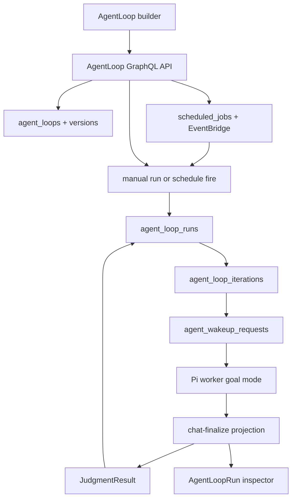
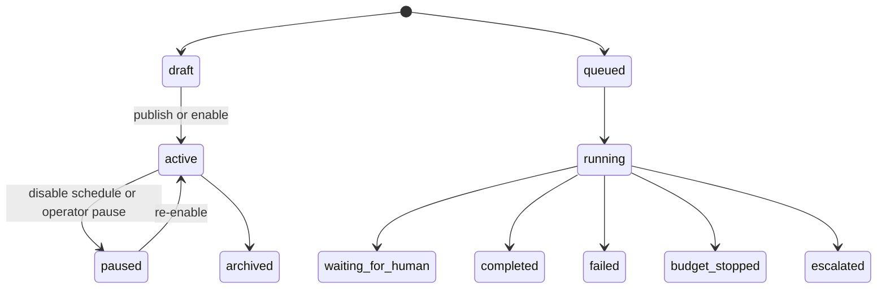
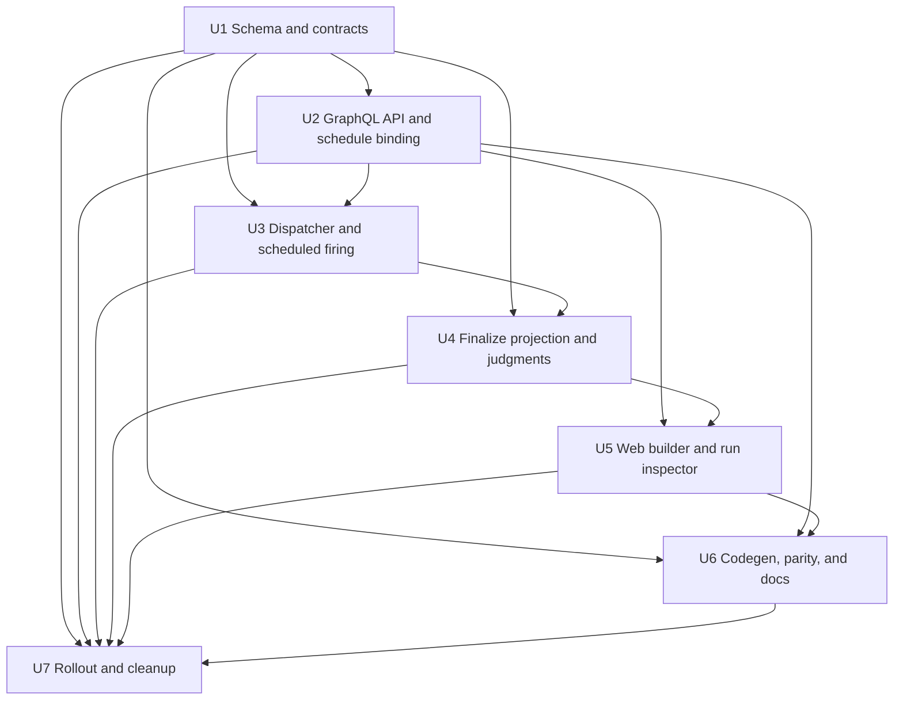

# feat: Add AgentLoop foundation

## Overview

ThinkWork should land `AgentLoop` as the first-class automation primitive before
adding richer verification, event-driven, n8n, or hill-climbing behavior. Phase
1 creates the product object, durable run model, manual/schedule triggers,
goal-mode worker execution, shared judgment contract, loop policy enforcement,
and a minimal web builder/run inspector.

The plan intentionally replaces the user-facing Automations noun. Existing
`scheduled_jobs`, EventBridge Scheduler wiring, wakeup dispatch, Pi goal-mode
evidence, and workflow-style run/evidence UI patterns should be reused where
they are the right substrate, but the product surface is `AgentLoop` and
`AgentLoopRun`.

---

## Problem Frame

The requirements define AgentLoop as a durable autonomous contract:
trigger, goal, worker, judge, loop policy, state, and evidence. ThinkWork has
several adjacent pieces already: scheduled jobs for EventBridge plumbing,
workflow runs for product-ledger precedent, Pi goal mode for worker completion
evidence, Agent Profile loop policy for bounded review controls, and settings UI
for scheduling and run inspection. What is missing is the first-class product
model that ties those pieces together without making users learn a separate
Automations feature.

This plan targets Phase 1 only. It must leave obvious extension points for
Phase 2 verification loops, Phase 3 event-driven/n8n participation, and Phase 4
hill-climbing, but it should not build those later phases prematurely.

---

## Requirements Trace

- R1-R4. Add first-class `AgentLoop`, version, run, iteration, judgment, and
  evidence concepts; replace Automations as the v1 automation surface.
- R5-R6. Ship a web form builder and run inspector with manual and schedule
  triggers only.
- R7-R8. Store explicit `GoalSpec` and `WorkerSpec` so the runtime knows what
  outcome to pursue and which agent/profile does the work.
- R9-R10, R18. Define a shared `JudgeSpec`/`JudgmentResult` contract. Phase 1
  exposes executable self-check and human-approval escalation modes; model
  judge remains in the shared contract as a Phase 2 verification-loop mode and
  must not be selectable as a working Phase 1 AgentLoop behavior.
- R11-R13. Enforce `LoopPolicy` limits and record iteration/judgment evidence
  that explains continue/complete/fail/budget-stop/escalation outcomes.
- R14-R17. Preserve Phase 2-4 extension seams without implementing independent
  verification loops, external event triggers, n8n authoring, or hill-climbing
  in Phase 1.

**Origin actors:** A1 operator or builder, A2 worker agent, A3 judge, A4 human
approver, A5 planner or implementer.

**Origin flows:** F1 create a Phase 1 AgentLoop, F2 run and inspect a Phase 1
AgentLoop, F3 add verification behavior in Phase 2, F4 add event-driven and
hill-climbing behavior in later phases.

**Origin acceptance examples:** AE1 scheduled AgentLoop replaces Automation,
AE2 run inspector explains stop reason, AE3 separate judge can reject and
continue/escalate in Phase 2, AE4 n8n remains non-authoritative in Phase 3, AE5
future learning promotions use JudgeSpec-compatible evidence.

---

## Scope Boundaries

### Deferred for later

- Visual loop designer.
- API/webhook/external-event triggers.
- n8n-authored loop design as a primary creation surface.
- Full eval-suite authoring inside AgentLoop v1.
- Executable model judges, reviewer-agent judges, composite judges,
  eval-threshold judges, external callback judges, and data predicate judges.
- Hill-climbing promotion, rollback, champion/challenger comparison, and
  compounding-memory updates.
- Advanced concurrency, prioritization, and fleet-level loop governance.

### Outside this product's identity

- Treating n8n, EventBridge, or any scheduler as the source of truth for loop
  identity, goal, judgment, state, or evidence.
- Shipping Automations and AgentLoops as separate long-term product concepts.
- Defining AgentLoop as only a prompt schedule or background job.
- Replacing evaluations with AgentLoops. They should share judgment primitives
  where useful, but remain distinct product capabilities.

### Deferred to Follow-Up Work

- Migrating evaluations to consume the shared `JudgeSpec` contract directly.
  Phase 1 should introduce the shared shape and avoid conflicts, but eval
  storage/query migration can follow separately.
- Migrating old/deep Automation URLs and copy after the AgentLoop surface proves
  stable. Phase 1 should redirect or rename enough to avoid a competing product
  noun.

### Product Taxonomy

- AgentLoop is the user-facing primitive for autonomous goal/policy loops:
  trigger, goal, worker, judge, loop policy, run state, and evidence.
- Workflow remains the orchestration primitive for explicit multi-step
  processes and app/agent steps. Future Workflows may contain or trigger
  AgentLoops, but Workflow is not the AgentLoop run ledger.
- Evaluations remain the scoring/test-case product. They should share judgment
  contracts where useful, but they are not how users create automation loops.
- `scheduled_jobs` and EventBridge remain plumbing. They should not appear as a
  separate product concept in Phase 1 UI copy.

### First-Use Acceptance Path

Phase 1 acceptance should include one named operator scenario, not only a blank
builder smoke test: an operator creates a weekly scheduled AgentLoop from a
small preset named `Weekly Agent Check-In`, chooses a worker, defines goal
criteria, runs it now, then verifies the scheduled/manual run in the inspector.
The preset can be UI default data or documentation-backed starter content, but
U5 must own the artifact and test path. This proves the replacement for today's
automation-shaped need without requiring the operator to understand every field
from first principles.

### Loop Suitability Gate

The builder and docs should make the loop-worthiness test explicit before a
scheduled AgentLoop is enabled:

- The task repeats often enough to justify automation, usually weekly or more.
- Bad output can be rejected automatically by a test, hard rule, measurable
  condition, self-check criteria, or human-escalation gate.
- The worker can complete the job end to end with available tools/connectors.
- Done is objective enough to express as completion criteria, not only taste.

If a candidate loop fails this test, the UI should steer the operator toward a
manual run or ordinary prompt-style workflow rather than a recurring AgentLoop.

---

## Context & Research

### Relevant Code and Patterns

- `packages/database-pg/src/schema/scheduled-jobs.ts` defines
  `scheduled_jobs`, `thread_turns`, and `thread_turn_events`. `scheduled_jobs`
  is suitable as schedule plumbing but not as the AgentLoop product object.
- `packages/lambda/job-schedule-manager.ts` creates, updates, deletes, and
  targets EventBridge Scheduler rules. It already supports `triggerId` provided
  by callers and sends payloads to `job-trigger`.
- `packages/lambda/job-trigger.ts` is the schedule firing entry point. The old
  `agent_*` branch is intentionally disabled, so AgentLoop needs a new
  `agent_loop_schedule` branch rather than reviving legacy agent automations.
- `packages/api/src/handlers/scheduled-jobs.ts` and
  `packages/api/src/graphql/resolvers/triggers/runScheduledJob.mutation.ts`
  show the current admin-facing create/update/fire pattern and the importance of
  surfacing EventBridge side-effect failures.
- `packages/database-pg/src/schema/workflow-runs.ts` and
  `packages/api/src/lib/workflows/run-ledger.ts` are the best in-repo precedent
  for product-first run/events/evidence ledgers.
- `packages/api/src/lib/workflows/trigger-contract.ts` shows a normalized
  trigger contract with actor, source, idempotency, and correlation fields.
- `packages/api/src/lib/agent-profile-loop-policy.ts` already normalizes
  max iterations, max review loops, review gate, fail behavior, runtime/token,
  and cost budgets for Agent Profiles.
- `packages/api/src/lib/goal-mode.ts`,
  `packages/agentcore-pi/agent-container/src/runtime/pi-goal-adapter.ts`, and
  `packages/api/src/lib/chat-finalize/process-finalize.ts` provide the current
  goal-mode runtime payload and `goal_run` evidence projection.
- `packages/api/src/handlers/chat-agent-invoke.ts` and
  `packages/api/src/handlers/wakeup-processor.ts` both build AgentCore dispatch
  payloads. AgentLoop must respect dispatch parity so manual and scheduled
  paths carry the same goal/judge context.
- `apps/web/src/components/settings/SettingsAutomations.tsx`,
  `apps/web/src/components/scheduled-jobs/ScheduledJobForm.tsx`, and
  `apps/web/src/components/scheduled-jobs/ScheduledJobDetail.tsx` are useful UI
  scaffolding to rename/reframe, not a product concept to preserve.
- `apps/web/src/components/workflows/WorkflowRunDetail.tsx` and
  `apps/web/src/components/workflows/WorkflowEvidencePanel.tsx` provide the
  closest UI pattern for a run timeline and evidence inspector.
- `apps/web/src/components/settings/settings-nav.tsx` currently exposes
  Automations as a settings nav item. Phase 1 should replace this with
  AgentLoops.

### Institutional Learnings

- `docs/solutions/architecture-patterns/external-workflow-agent-step-bridges-need-resumable-ledgers-2026-06-21.md`:
  external and long-running agent work needs resumable ledgers, idempotency, and
  redacted telemetry. Phase 1 should not treat loop starts as one-shot fire and
  forget.
- `docs/solutions/architecture-patterns/wakeup-processor-payload-parity-with-chat-agent-invoke-2026-06-12.md`:
  runtime-gated fields must be present in both direct and wakeup dispatch
  builders. AgentLoop goal/judge payload fields need parity tests.
- `docs/solutions/agent-profile-closed-loops-2026-06-08.md`: bounded loop
  policy and reviewer behavior already exist for Agent Profiles and should
  inform AgentLoop policy names and evidence semantics.
- `docs/solutions/agent-profile-pi-goal-compatibility-2026-06-08.md`: keep
  ThinkWork-owned goal state and continuation policy; do not let raw Pi goal
  hidden continuation bypass ThinkWork budgets and finalization.
- `docs/solutions/workflow-issues/manually-applied-drizzle-migrations-drift-from-dev-2026-04-21.md`:
  schema work that needs hand-rolled SQL must include migration markers and
  drift discipline.

### External References

- The LangChain loop framing, Forward Future loop library, and Anatoli
  Kopadze's X article "Loops explained: Claude, GPT, Mira and what actually
  works" shaped the upstream requirements and final plan checks; the
  implementation plan remains driven by local ThinkWork architecture and
  already shipped substrate.

---

## Key Technical Decisions

- Add dedicated AgentLoop product tables rather than forcing AgentLoop through
  `workflow_runs`: `workflow_runs` requires workflow identity and engine
  bindings that are useful precedent but not the right source of truth for a
  first-class autonomous loop.
- Reuse ledger patterns, not workflow table identity: AgentLoop should have its
  own run/iteration/judgment/evidence surfaces while borrowing the workflow
  ledger conventions for trigger identity, events, evidence redaction, and run
  inspector UX.
- Keep `scheduled_jobs` as schedule plumbing: scheduled AgentLoops create a
  schedule row/binding that EventBridge can fire, but AgentLoop owns identity,
  goal, policy, state, and evidence.
- Introduce a shared judgment contract in `packages/agent-loops-core` now, but
  migrate evals later: Phase 1 should not block on converting the evaluation
  product.
- Execute Phase 1 worker iterations through existing wakeup/Pi goal mode:
  AgentLoop can enqueue a worker wakeup carrying `goalMode` and loop metadata;
  finalization projects `goal_run` evidence back into AgentLoopRun.
- Treat self-check as the Phase 1 executable judgment mode: it maps to worker
  goal completion evidence. Store the shared `JudgeSpec` shape so model judges
  and reviewer-agent judges can arrive in Phase 2, but do not expose
  `model_judge` as a Phase 1 selectable mode.
- Human approval in Phase 1 is an escalation/blocked state, not a full approval
  workflow engine: record that human approval is required, expose the
  waiting/escalated state in the inspector, and provide no approve/resume action
  until Phase 2.
- Manual run uses the same dispatcher as scheduled run: "Run now" must create
  the same AgentLoopRun and iteration structure as an EventBridge firing. That
  dispatcher lives in a shared package that both GraphQL resolvers and Lambda
  handlers can import without reversing package dependencies.
- Scheduled loops should graduate from a reliable manual run. Phase 1 should
  make it easy to run now first and inspect the result before enabling or
  trusting a recurring schedule, especially for newly created loops.

---

## Open Questions

### Resolved During Planning

- How should AgentLoopRun relate to WorkflowRun? Use dedicated AgentLoop run
  tables and reuse workflow-ledger patterns. Future Workflows can reference or
  contain AgentLoops rather than making `workflow_runs` the AgentLoop source of
  truth.
- How should `JudgeSpec` relate to evals? Define a shared contract now under an
  API/domain boundary; use it in AgentLoops first and defer eval storage/API
  migration.
- What should enforce Phase 1 budget and loop policy? Store LoopPolicy on
  AgentLoopVersion, enforce start-time limits in the dispatcher, enforce
  iteration/terminal transitions in the finalization projector, and continue
  using existing user budget pause controls for scheduled cost ownership.
- Should Phase 1 include external event trigger idempotency/replay semantics?
  No. Keep them documented as Phase 3 follow-up.

### Deferred to Implementation

- Exact migration ordinal and whether drizzle-kit can generate all DDL or needs
  hand-rolled SQL with drift markers.
- Exact enum spelling for status and event types after implementer checks
  generated GraphQL/codegen naming.
- Exact model-judge invocation mechanism for Phase 1 if a simple post-turn model
  judge is implemented before Phase 2 reviewer-agent loops.
- Whether the first UI uses GraphQL exclusively or temporarily reuses REST
  helpers during route migration. The plan prefers GraphQL for the new
  AgentLoop surface.

---

## High-Level Technical Design

> _This illustrates the intended approach and is directional guidance for review, not implementation specification. The implementing agent should treat it as context, not code to reproduce._

---

## Implementation Units

- U1. **AgentLoop schema and shared contracts**

**Goal:** Add the durable database and shared contract foundation for
AgentLoop definitions, versions, runs, iterations, judgments, and evidence.

**Requirements:** R1-R4, R7-R13, R18, F1, F2, AE1, AE2.

**Dependencies:** None.

**Files:**

- Create: `packages/database-pg/src/schema/agent-loops.ts`
- Modify: `packages/database-pg/src/schema/index.ts`
- Modify: `packages/database-pg/src/schema/scheduled-jobs.ts`
- Create: `packages/database-pg/graphql/types/agent-loops.graphql`
- Create: `packages/agent-loops-core/package.json`
- Create: `packages/agent-loops-core/tsconfig.json`
- Create: `packages/agent-loops-core/src/contracts.ts`
- Create: `packages/database-pg/drizzle/NNNN_agent_loops.sql`
- Test: `packages/agent-loops-core/src/contracts.test.ts`
- Test: `packages/database-pg/__tests__/agent-loops-schema.test.ts`
- Test: `packages/database-pg/__tests__/migration-NNNN-agent-loops.test.ts`

**Approach:**

- Add `agent_loops` for identity and current lifecycle metadata, including
  tenant, name, slug, description, owner, current version, enabled state, and
  last run summary.
- Add `agent_loop_versions` to snapshot `TriggerSpec`, `GoalSpec`,
  `WorkerSpec`, `JudgeSpec`, `LoopPolicy`, and evidence policy. Versioned
  snapshots are the source of truth for run inspection.
- Add `agent_loop_runs` with status, trigger family/source, actor, idempotency
  key/correlation, schedule binding, current iteration, terminal reason,
  started/finished timestamps, cost, and compact input/output summaries.
- Add `agent_loop_iterations`, `agent_loop_judgments`, and
  `agent_loop_evidence` or equivalent tables so the inspector can show the
  loop timeline without scraping thread messages.
- Add a nullable `agent_loop_id` or schedule binding reference on
  `scheduled_jobs` so EventBridge rows can point back to AgentLoop without
  making `scheduled_jobs` the product table.
- Define shared TypeScript contracts for `GoalSpec`, `WorkerSpec`,
  `JudgeSpec`, `JudgmentResult`, and `LoopPolicy` in
  `packages/agent-loops-core` so API, Lambda, and future eval code can share
  the shape without importing from each other.
- Keep Phase 1 AgentLoop validation limited to executable `self_check` and
  terminal `human_approval` escalation. The shared contract may name
  `model_judge` for future compatibility, but AgentLoop create/update
  validation must reject it until the Phase 2 verifier is implemented.
- Validate `TriggerSpec`, `GoalSpec`, `WorkerSpec`, `JudgeSpec`, and
  `LoopPolicy` server-side: max lengths for free-form goal and criteria
  fields, tenant ownership for worker agent/profile and schedule references,
  allowlisted Phase 1 enum values, bounded structured judge outputs, and clear
  rejections for cross-tenant IDs or oversized inputs.
- Use additive SQL and follow manual migration marker guidance if the generated
  migration cannot express partial indexes or checks cleanly.

**Execution note:** Start with contract and schema tests so status transitions,
policy normalization, and migration expectations are pinned before resolver
wiring.

**Patterns to follow:**

- `packages/database-pg/src/schema/workflows.ts`
- `packages/database-pg/src/schema/workflow-runs.ts`
- `packages/api/src/lib/workflows/trigger-contract.ts`
- `packages/api/src/lib/agent-profile-loop-policy.ts`
- `docs/solutions/workflow-issues/manually-applied-drizzle-migrations-drift-from-dev-2026-04-21.md`

**Test scenarios:**

- Happy path: an active AgentLoop can have a current version snapshot containing
  manual/schedule trigger specs, a goal intent/criteria pair, a worker agent,
  a self-check judge, and bounded loop policy.
- Happy path: an AgentLoopRun can reference its definition version, schedule
  binding, iterations, judgments, and evidence without depending on
  `workflow_runs`.
- Edge case: editing an AgentLoop creates or selects a new version without
  mutating prior run snapshots.
- Edge case: policy normalization rejects zero/negative max iterations,
  runtimes, token budgets, or cost budgets.
- Error path: unsupported Phase 1 trigger or judge modes fail validation with
  clear errors.
- Error path: cross-tenant worker/profile ids, unsupported judge modes, and
  oversized goal/spec fields fail validation before persistence.
- Integration: `scheduled_jobs.agent_loop_id` or equivalent binding can be null
  for legacy scheduled jobs and set for AgentLoop schedules.
- Integration: migration tests fail if drift markers or required indexes are
  missing.

**Verification:**

- Schema exports compile, migration tests pass, and contract tests prove the
  Phase 1 shape without requiring UI or runtime code.

---

- U2. **AgentLoop GraphQL API and schedule binding**

**Goal:** Expose first-class AgentLoop CRUD, publish/update, run history, run
detail, manual run, and schedule management through GraphQL.

**Requirements:** R1-R6, R11-R13, F1, F2, AE1, AE2.

**Dependencies:** U1.

**Files:**

- Modify: `packages/database-pg/graphql/types/agent-loops.graphql`
- Modify: `packages/api/src/graphql/resolvers/index.ts`
- Create: `packages/api/src/graphql/resolvers/agent-loops/index.ts`
- Create: `packages/api/src/graphql/resolvers/agent-loops/agentLoops.query.ts`
- Create: `packages/api/src/graphql/resolvers/agent-loops/agentLoop.query.ts`
- Create: `packages/api/src/graphql/resolvers/agent-loops/agentLoopRun.query.ts`
- Create: `packages/api/src/graphql/resolvers/agent-loops/saveAgentLoop.mutation.ts`
- Create: `packages/api/src/graphql/resolvers/agent-loops/deleteAgentLoop.mutation.ts`
- Create: `packages/api/src/graphql/resolvers/agent-loops/triggerAgentLoopRun.mutation.ts`
- Create: `packages/api/src/lib/agent-loops/schedule-binding.ts`
- Test: `packages/api/src/graphql/resolvers/agent-loops/agentLoops.resolver.test.ts`
- Test: `packages/api/src/lib/agent-loops/schedule-binding.test.ts`
- Modify: `apps/web/src/gql/graphql.ts`

**Approach:**

- Add GraphQL types for AgentLoop, AgentLoopVersion, AgentLoopRun,
  AgentLoopIteration, AgentLoopJudgment, and AgentLoopEvidence using
  product-language field names.
- Add `saveAgentLoop` as create/update for the form builder. On schedule trigger
  changes, synchronize the associated `scheduled_jobs` row and EventBridge
  schedule through the existing job-schedule-manager RequestResponse path.
- Add `triggerAgentLoopRun` for manual "Run now". It should use the same run
  dispatcher as schedule firing and return the created/accepted AgentLoopRun,
  not only a Lambda dispatch acknowledgement.
- Add list/detail queries that support the Phase 1 UI: list loops, inspect a
  loop with current version and recent runs, inspect a run with timeline and
  evidence.
- Authorize reads and mutations at operator/admin level for the Phase 1
  settings surface. Every AgentLoop query and mutation must resolve the caller
  tenant, scope definitions/runs/judgments/evidence by tenant, and deny
  non-operator or cross-tenant reads.
- Define delete/archive behavior before exposing `deleteAgentLoop`: Phase 1
  should prefer archive/disable, clean up schedule bindings, preserve redacted
  run evidence for audit/history unless an explicit purge path is added, and
  make post-delete evidence visibility predictable.
- Keep existing scheduled-job GraphQL and REST APIs functional for legacy
  callers, but avoid introducing new user-facing Automations copy.
- Regenerate schemas/codegen for every consumer with a codegen script after the
  GraphQL source changes.

**Execution note:** Add resolver tests before UI work so the builder has a
stable contract.

**Patterns to follow:**

- `packages/database-pg/graphql/types/workflows.graphql`
- `packages/api/src/graphql/resolvers/workflows/index.ts`
- `packages/api/src/graphql/resolvers/workflows/workflowRun.query.ts`
- `packages/api/src/graphql/resolvers/triggers/createScheduledJob.mutation.ts`
- `packages/api/src/graphql/resolvers/triggers/updateScheduledJob.mutation.ts`
- `packages/api/src/graphql/resolvers/triggers/runScheduledJob.mutation.ts`

**Test scenarios:**

- Happy path: creating a manual-only AgentLoop creates a draft/active loop and
  version without an EventBridge schedule.
- Happy path: creating a scheduled AgentLoop creates or updates a
  `scheduled_jobs` binding and stores the schedule name once EventBridge
  provisioning succeeds.
- Happy path: manual `triggerAgentLoopRun` creates a run with trigger family
  `manual`, actor identity, version snapshot, and first queued iteration.
- Edge case: changing only name/goal/judge creates a new version but does not
  unnecessarily recreate the EventBridge schedule.
- Edge case: disabling a scheduled AgentLoop disables the schedule but preserves
  run history.
- Error path: EventBridge schedule provisioning failure surfaces to the caller
  with a repairable state rather than silently losing the schedule.
- Error path: non-operator callers cannot create, update, delete, or run
  AgentLoops.
- Error path: non-operator and cross-tenant callers cannot list or read
  AgentLoops, runs, judgments, or evidence.
- Error path: deleting or archiving a loop disables schedule bindings and leaves
  retained run evidence in the documented state.
- Integration: AgentLoop queries return runs, iterations, judgments, and
  evidence in the shape required by the run inspector.

**Verification:**

- GraphQL contract tests pass, generated web types include AgentLoop operations,
  and legacy scheduled-job tests still pass.

---

- U3. **AgentLoop dispatcher and scheduled firing path**

**Goal:** Start AgentLoopRuns from manual and scheduled triggers using one
dispatcher that creates a run, creates the first iteration, and enqueues the
worker agent with goal-mode metadata.

**Requirements:** R6-R8, R10-R13, F2, AE1, AE2.

**Dependencies:** U1, U2.

**Files:**

- Create: `packages/agent-loops-core/src/dispatcher.ts`
- Create: `packages/agent-loops-core/src/run-ledger.ts`
- Modify: `packages/api/package.json`
- Modify: `packages/lambda/package.json`
- Modify: `packages/lambda/job-trigger.ts`
- Modify: `packages/lambda/job-schedule-manager.ts`
- Modify: `packages/api/src/handlers/wakeup-processor.ts`
- Modify: `packages/api/src/lib/agent-dispatch-payload.ts`
- Test: `packages/agent-loops-core/src/dispatcher.test.ts`
- Test: `packages/lambda/__tests__/job-trigger.agent-loop.test.ts`
- Test: `packages/api/src/handlers/wakeup-processor.dispatch-parity.test.ts`

**Approach:**

- Add a dependency-safe shared dispatcher in `packages/agent-loops-core` that
  accepts AgentLoop id/version, trigger info, actor info, and
  idempotency/correlation values. It creates a run, creates iteration 1, and
  inserts an `agent_wakeup_requests` row with source such as `agent_loop`.
- Add `@thinkwork/agent-loops-core` as a workspace dependency of both
  `@thinkwork/api` and `@thinkwork/lambda`; do not import `packages/api` from
  Lambda.
- Carry loop metadata in the wakeup payload: AgentLoopRun id, iteration id,
  version id, goal objective, completion criteria, loop policy, judge mode, and
  a runtime `goalMode` envelope.
- Update `job-trigger` with an `agent_loop_schedule` branch that loads the
  AgentLoop binding from the schedule row and calls the same dispatcher. Do not
  revive the disabled legacy `agent_*` scheduled branch.
- Extend wakeup dispatch so the TypeScript/wakeup-record `goalMode` envelope is
  forwarded for AgentLoop wakeups and converted to the AgentCore wire field
  `goal_mode` at the dispatch boundary, matching the existing runtime payload
  convention.
- Record the wakeup id and later thread_turn id on the AgentLoop iteration so
  the inspector can link to runtime evidence.
- Apply start-time policy checks: enabled loop, active version, max iterations,
  schedule enabled, budget pause, and user cost-owner budget status where
  available.
- Keep manual and scheduled trigger idempotency distinct: manual runs may be
  non-idempotent by default; schedule fires must use a deterministic key such
  as `agent_loop_schedule:{scheduled_job_id}:{scheduled_fire_id}`. The
  implementer must confirm which EventBridge/Lambda event fields are always
  present, define the fallback when a fire id is missing, and test that retries
  of the same fire do not create duplicate runs while separate fires do.

**Execution note:** Treat dispatch-path parity as characterization-first. The
same goal/loop metadata must reach AgentCore from manual and scheduled starts.

**Patterns to follow:**

- `packages/api/src/lib/workflows/run-ledger.ts`
- `packages/api/src/lib/workflows/trigger-contract.ts`
- `packages/api/src/lib/mentions/default-agent-routing.ts`
- `packages/api/src/handlers/wakeup-processor.ts`
- `packages/lambda/job-trigger.ts`
- `docs/solutions/architecture-patterns/wakeup-processor-payload-parity-with-chat-agent-invoke-2026-06-12.md`

**Test scenarios:**

- Happy path: manual dispatch creates an AgentLoopRun, iteration, wakeup, and
  payload with `goalMode.action=start`.
- Happy path: scheduled EventBridge firing routes through
  `agent_loop_schedule`, creates the same run/iteration structure, and updates
  scheduled last-run metadata.
- Happy path: retrying the same scheduled fire reuses or returns the existing
  AgentLoopRun, while a later scheduled fire creates a new run.
- Edge case: disabled or budget-paused schedule does not enqueue a worker and
  records a skipped or blocked run event where appropriate.
- Edge case: stale schedule referencing an archived/deleted AgentLoop records a
  failed/blocked run reason rather than throwing an opaque Lambda error.
- Error path: worker wakeup insertion failure marks the AgentLoopRun/iteration
  failed with a bounded error message.
- Integration: wakeup-processor dispatch payload includes AgentLoop metadata
  and converts wakeup `goalMode` to wire `goal_mode` for source `agent_loop`.
- Integration: existing chat_message goal-mode tests continue to pass.

**Verification:**

- Dispatcher tests prove manual/scheduled equivalence, and Lambda tests prove
  EventBridge payloads reach the AgentLoop branch.

---

- U4. **Finalize projection, judgments, and loop policy transitions**

**Goal:** Convert worker runtime completion into AgentLoop iterations,
judgments, terminal statuses, escalation states, and evidence.

**Requirements:** R9-R13, R18, F2, AE2, AE3.

**Dependencies:** U1, U3.

**Files:**

- Create: `packages/api/src/lib/agent-loops/finalize-projection.ts`
- Create: `packages/api/src/lib/agent-loops/judgment.ts`
- Modify: `packages/api/src/lib/chat-finalize/process-finalize.ts`
- Modify: `packages/api/src/lib/chat-finalize/types.ts`
- Modify: `packages/api/src/handlers/wakeup-processor.ts`
- Test: `packages/api/src/lib/agent-loops/finalize-projection.test.ts`
- Test: `packages/api/src/lib/agent-loops/judgment.test.ts`
- Test: `packages/api/src/lib/chat-finalize/process-finalize.test.ts`

**Approach:**

- During finalize, detect thread turns whose context snapshot or wakeup payload
  carries an AgentLoopRun/iteration id.
- Normalize runtime `goal_run` evidence into a Phase 1 `JudgmentResult`:
  complete, continue, budget_stopped, failed, or needs_human_approval.
- For `self_check`, treat `goal_complete`/completed goal evidence as a
  completion judgment and budget-limited evidence as budget-stopped.
- For `model_judge`, keep the shared contract shape only. AgentLoop Phase 1
  must reject `model_judge` as a selectable/executable mode and defer the
  post-turn model-judge adapter to Phase 2 verification loops.
- For `human_approval`, transition runs to `waiting_for_human` or `escalated`
  with evidence and do not enqueue another iteration automatically. Phase 1 UI
  shows the blocked/escalated state and evidence only; approve/reject/resume
  actions are Phase 2 work.
- Enforce `LoopPolicy`: stop at max iterations, max runtime, max token/cost
  budget when known, retry/backoff policy, and fail/escalation behavior.
- If judgment says continue and policy allows it, create the next iteration and
  enqueue the next wakeup with `goalMode.action=resume` or a fresh objective
  according to the runtime evidence available.
- Store redacted evidence summaries only. Do not stringify arbitrary raw
  runtime output into inspector previews.

**Execution note:** Implement new domain behavior test-first; bugs here can
cause runaway loops or false completion.

**Patterns to follow:**

- `packages/api/src/lib/chat-finalize/process-finalize.ts`
- `packages/api/src/__tests__/pi-runtime-capability-smoke.test.ts`
- `apps/web/src/components/workbench/GoalRunCard.tsx`
- `docs/solutions/agent-profile-pi-goal-compatibility-2026-06-08.md`
- `docs/solutions/architecture-patterns/external-workflow-agent-step-bridges-need-resumable-ledgers-2026-06-21.md`

**Test scenarios:**

- Happy path: completed `goal_run` evidence records a completed judgment,
  marks iteration complete, marks run completed, and stores completion summary.
- Happy path: active/incomplete goal evidence records a continue judgment and
  enqueues the next iteration when max iterations and budget allow.
- Happy path: human approval judge records a waiting/escalated state after a
  worker result, exposes no approve/resume action in Phase 1, and does not
  auto-continue.
- Error path: AgentLoop create/update rejects `model_judge` for Phase 1 even
  though the shared contract reserves that mode for Phase 2.
- Edge case: missing or malformed `goal_run` evidence records a failed or
  needs-review judgment with a safe diagnostic.
- Edge case: max iterations reached records terminal reason
  `max_iterations_reached` and does not enqueue another wakeup.
- Edge case: budget-limited evidence records terminal reason
  `budget_stopped`.
- Error path: projection failure does not break normal chat finalization; it
  records a bounded AgentLoop error that can be inspected.
- Integration: AgentLoop evidence contains no raw secrets or arbitrary
  object-stringified previews.

**Verification:**

- Finalize tests prove every Phase 1 terminal reason and continuation path, and
  existing goal-mode finalize tests still pass.

---

- U5. **AgentLoop web builder and run inspector**

**Goal:** Replace the Automations UI with a first-class AgentLoops settings
surface that can create/edit loops, run them manually, manage schedule triggers,
and inspect run timelines/evidence.

**Requirements:** R1-R6, R9-R13, F1, F2, AE1, AE2.

**Dependencies:** U2, U4.

**Files:**

- Create: `apps/web/src/components/agent-loops/AgentLoopInventory.tsx`
- Create: `apps/web/src/components/agent-loops/AgentLoopForm.tsx`
- Create: `apps/web/src/components/agent-loops/AgentLoopDetail.tsx`
- Create: `apps/web/src/components/agent-loops/AgentLoopRunDetail.tsx`
- Create: `apps/web/src/components/agent-loops/AgentLoopEvidencePanel.tsx`
- Create: `apps/web/src/components/agent-loops/agent-loop-presets.ts`
- Create: `apps/web/src/routes/_authed/settings.agent-loops.index.tsx`
- Create: `apps/web/src/routes/_authed/settings.agent-loops.$agentLoopId.tsx`
- Create: `apps/web/src/routes/_authed/settings.agent-loops.$agentLoopId_.runs.$runId.tsx`
- Modify: `apps/web/src/components/settings/settings-nav.tsx`
- Modify: `apps/web/src/lib/graphql-queries.ts`
- Test: `apps/web/src/components/agent-loops/AgentLoopInventory.test.tsx`
- Test: `apps/web/src/components/agent-loops/AgentLoopForm.test.tsx`
- Test: `apps/web/src/components/agent-loops/AgentLoopRunDetail.test.tsx`
- Test: `apps/web/src/routes/_authed/-settings.agent-loop-routing.test.tsx`

**Approach:**

- Add `Settings -> AgentLoops` and remove/redirect the top-level Automations
  settings item so there are not two competing product surfaces.
- Build a form-based builder with sections for Trigger, Goal, Worker, Judge,
  Policy, and Evidence. Reuse `SchedulePicker` for schedule triggers.
- Add the `Weekly Agent Check-In` preset as the Phase 1 first-use path. It
  should prefill a weekly schedule, self-check judge, conservative loop policy,
  and starter goal/criteria text that the operator can edit before saving.
- Default Phase 1 trigger choices to manual and schedule only.
- Require goal intent and completion criteria before save.
- Let the builder select the primary worker agent/profile using existing agent
  settings/query patterns.
- Support Phase 1 judge modes in the UI: self-check and human approval
  escalation. Do not show model judge, reviewer-agent, eval-threshold, or other
  advanced judge modes until those modes execute real verification behavior.
- Support LoopPolicy fields: max iterations, max runtime, token/cost budget,
  retry/backoff summary, and escalation behavior.
- Show a loop-suitability checklist for scheduled loops: repeated task,
  objective completion criteria, available worker/tools, and a rejection gate.
  Keep it lightweight guidance, not a blocking wizard.
- Add "Run now" on the detail page that calls `triggerAgentLoopRun` and routes
  to or refreshes the new run.
- Define Run now interaction states: disable the action while the mutation is
  pending, route to the returned AgentLoopRun on success, show recoverable
  inline errors on failure, and require an explicit product decision before
  allowing concurrent manual runs for the same AgentLoop.
- Define lifecycle controls: save creates an active loop by default unless the
  user chooses disabled/draft, pause disables schedule firing without deleting
  history, archive hides the loop from active lists after confirmation, and
  delete is not exposed until the archive/retention semantics are implemented.
- Implement run detail as a dense inspector: run summary, trigger, version,
  iterations, judgments, terminal reason, policy snapshot, evidence, and linked
  thread turn/runtime evidence when present.
- For human-approval runs, show a waiting/escalated inspector state with
  rationale/evidence and no approve/reject/resume controls in Phase 1.
- Reuse visual density and patterns from `WorkflowRunDetail`, not the older
  scheduled-job run sheet.
- Ensure list/detail/form/run-detail work at narrow and desktop widths, all
  controls are keyboard reachable with visible focus, route changes and
  mutation results move focus predictably, timelines/evidence panels have
  accessible names/structure, and action targets follow the existing settings
  UI touch-target standard.

**Execution note:** UI work should follow the existing settings design system;
avoid marketing-style explanation copy and keep the surface operator-focused.

**Patterns to follow:**

- `apps/web/src/components/settings/SettingsAutomations.tsx`
- `apps/web/src/components/scheduled-jobs/ScheduledJobForm.tsx`
- `apps/web/src/components/workflows/WorkflowRunDetail.tsx`
- `apps/web/src/components/workflows/WorkflowEvidencePanel.tsx`
- `apps/web/src/components/settings/settings-nav.tsx`
- `apps/web/src/components/settings/SettingsContent.tsx`

**Test scenarios:**

- Happy path: operator opens AgentLoops list, sees active/paused loops, schedule
  summary, last run status, and owner.
- Happy path: operator creates a scheduled AgentLoop with goal intent,
  completion criteria, worker, self-check judge, and policy; submitted mutation
  contains the expected structured specs.
- Happy path: operator starts from the `Weekly Agent Check-In` preset, edits the
  goal criteria, saves, runs now, and reaches the returned run inspector.
- Happy path: operator can run a new scheduled loop manually and inspect the
  result before enabling or trusting the recurring schedule.
- Happy path: operator clicks Run now and sees a new AgentLoopRun with queued or
  running status.
- Happy path: run detail renders iteration timeline, judgment result, evidence,
  and terminal reason for a completed run.
- Edge case: manual-only loops render without schedule fields and can still run
  now.
- Edge case: human-approval runs show waiting/escalated state without implying
  completion or offering unsupported approve/resume actions.
- Error path: mutation or schedule provisioning errors render actionable inline
  errors without losing form data.
- Error path: duplicate Run now clicks cannot create accidental duplicate runs
  while the mutation is pending.
- Integration: old `/settings/automations` route redirects or clearly lands on
  AgentLoops, preserving user navigation while removing the old noun.
- Integration: AgentLoop list, form, detail, and run detail are keyboard
  navigable and usable at the supported settings breakpoints.

**Verification:**

- Web component tests cover builder and inspector states; route tests prove the
  settings nav uses AgentLoops and legacy Automations entry points no longer
  appear as a parallel product.

---

- U6. **GraphQL/codegen, CLI/mobile parity, and docs**

**Goal:** Keep generated schemas, client types, and user/developer docs aligned
with the new AgentLoop product surface.

**Requirements:** R1-R5, R18, F1, A5.

**Dependencies:** U1, U2, U5.

**Files:**

- Modify: `terraform/schema.graphql`
- Modify: `apps/web/src/gql/graphql.ts`
- Modify: `apps/web/src/gql/gql.ts`
- Modify: `apps/cli/src/gql/graphql.ts`
- Modify: `apps/cli/src/gql/gql.ts`
- Modify: `apps/mobile/lib/gql/graphql.ts`
- Modify: `apps/mobile/lib/gql/gql.ts`
- Modify: `apps/mobile/lib/graphql-queries.ts` only if mobile exposes AgentLoop
  operations in Phase 1.
- Modify: `docs/brainstorms/2026-06-22-thnk-46-agent-loop-definition-requirements.md`
- Create: `docs/plans/2026-06-22-001-feat-agent-loop-foundation-plan.md`
- Create or modify: `docs/solutions/architecture-patterns/agent-loop-foundation-2026-06-22.md`
- Test: `packages/api/src/__tests__/graphql-contract.test.ts`
- Test: relevant CLI/mobile generated-operation smoke tests if AgentLoop
  operations are exposed there in Phase 1.

**Approach:**

- Regenerate the AppSync schema from canonical GraphQL source.
- Regenerate codegen for `apps/cli`, `apps/web`, `apps/mobile`, and
  `packages/api` if their scripts consume the shared schema.
- Decide whether CLI/mobile need AgentLoop operations in Phase 1. If not,
  explicitly keep them read-only or absent and document the web/operator scope.
- Update docs/copy to reflect AgentLoop replacing Automations for v1
  automation-style behavior.
- Add product taxonomy docs/copy that explain when to use AgentLoop versus
  Workflow versus Evaluations, and that `scheduled_jobs` is internal plumbing.
- Document the loop-suitability gate and manual-run-first guidance so operators
  do not turn one-off or taste-based prompts into recurring loops.
- Add a first-use operator path in docs or UI defaults: create a weekly
  scheduled AgentLoop from a small template/preset, run it now, then inspect
  the run evidence.
- Capture a solution note after implementation if the dispatcher/finalize
  projection establishes a reusable pattern for future loop phases.

**Patterns to follow:**

- `package.json` `schema:build`
- Consumer `codegen` scripts in `apps/cli/package.json`,
  `apps/web/package.json`, and `apps/mobile/package.json`
- `packages/api/src/__tests__/graphql-contract.test.ts`
- Existing `docs/solutions/architecture-patterns/*` files.

**Test scenarios:**

- Happy path: generated web GraphQL types include AgentLoop queries/mutations
  used by the UI.
- Edge case: CLI/mobile codegen remains clean even if no UI uses AgentLoop yet.
- Error path: GraphQL contract test fails if new AgentLoop operations are absent
  from the assembled schema.
- Integration: AppSync subscription-only schema generation remains valid after
  adding AgentLoop types.
- Integration: docs/settings copy use the AgentLoop/Workflow/Evaluation
  taxonomy consistently and the first-use acceptance path is covered.

**Verification:**

- Schema/codegen artifacts are updated consistently and no consumer references a
  stale Automations-only contract for the Phase 1 surface.

---

- U7. **Operational rollout and migration cleanup**

**Goal:** Roll out AgentLoops without breaking existing scheduled-job plumbing,
and remove enough Automations copy/routes to avoid product duplication.

**Requirements:** R1, R2, R6, R11-R13.

**Dependencies:** U1-U6.

**Files:**

- Modify: `terraform/modules/app/lambda-api/handlers.tf`
- Modify: `packages/api/src/handlers/scheduled-jobs.ts`
- Modify: `apps/web/src/routes/_authed/settings.automations.index.tsx`
- Modify: `apps/web/src/routes/_authed/settings.automations.$scheduledJobId.tsx`
- Modify: `apps/web/src/routes/_authed/_shell/automations.index.tsx`
- Modify: `apps/web/src/routes/_authed/_shell/automations.$scheduledJobId.tsx`
- Test: `packages/api/src/__tests__/admin-rest-auth-bridge.test.ts`
- Test: `apps/web/src/components/settings/settings-nav.test.ts`
- Test: `apps/web/src/routes/_authed/-settings.agent-loop-routing.test.tsx`

**Approach:**

- Ensure any new handler or route is included in Terraform only if GraphQL is
  insufficient. Prefer GraphQL for new AgentLoop API to avoid growing REST
  surface area.
- Keep scheduled-job REST routes for legacy/internal support, but remove or
  redirect user-facing Automations pages.
- Before redirecting Automations routes, inventory existing `scheduled_jobs` by
  trigger/source/product ownership. For any user-facing Automation rows, require
  migration into AgentLoop records, a read-only compatibility page, or an
  explicit documented decision that they are internal-only and safe to hide.
- Avoid adding large environment variables to `graphql-http`, whose env block
  is already near the AWS limit. Follow existing SSM/naming-convention patterns
  if a new Lambda reference is unavoidable.
- Preserve existing scheduled job behavior for evals, skill runs, routines,
  idle learning, and internal jobs.
- Include rollout notes for applying migrations before deploying Lambda/web code
  that expects AgentLoop tables.
- Update THNK-46 with plan, implementation start, verification, and final
  evidence as work proceeds.

**Patterns to follow:**

- `terraform/modules/app/lambda-api/handlers.tf`
- `packages/api/src/__tests__/admin-rest-auth-bridge.test.ts`
- `apps/web/src/routes/_authed/-settings.workflow-routing.test.tsx`
- `docs/solutions/workflow-issues/manually-applied-drizzle-migrations-drift-from-dev-2026-04-21.md`

**Test scenarios:**

- Happy path: existing `/api/scheduled-jobs` behavior still lists/fires legacy
  scheduled jobs for supported internal surfaces.
- Happy path: settings nav shows AgentLoops and no competing Automations item.
- Edge case: direct old Automations route redirects to AgentLoops or shows a
  compatibility page without creating a second product concept.
- Edge case: existing user-facing scheduled jobs are migrated, preserved behind
  compatibility access, or explicitly documented as internal-only before the
  old Automations UI disappears.
- Error path: missing AgentLoop tables fail loudly during deployment validation
  rather than as opaque runtime errors after merge.
- Integration: Terraform/API route changes do not remove existing scheduled job
  routes used by evals or internal jobs.

**Verification:**

- Route/auth bridge tests pass, settings nav tests pass, and rollout notes make
  migration ordering explicit.

---

## System-Wide Impact

- **Interaction graph:** AgentLoop touches database schema, GraphQL API,
  EventBridge scheduled-job plumbing, job-trigger Lambda, wakeup-processor,
  chat finalization, web settings routes, codegen, and docs.
- **Error propagation:** Schedule provisioning errors must surface to the
  builder; dispatch/finalize errors must become AgentLoopRun terminal evidence;
  normal chat finalization should not be failed solely by a projection bug.
- **State lifecycle risks:** Partial starts can leave run rows without wakeups,
  iterations without thread turns, or schedules pointing at archived loops.
  Dispatcher and projection code need idempotent/recoverable state transitions.
- **API surface parity:** New AgentLoop GraphQL operations need generated types
  wherever the schema is consumed. Legacy scheduled-job REST/GraphQL behavior
  should remain intact for internal consumers.
- **Integration coverage:** Unit tests alone are not enough. The implementer
  should cover create -> schedule binding -> job-trigger -> wakeup -> finalize
  projection -> inspector data shape at integration boundaries.
- **Operating metrics:** Track cost and quality in terms operators can act on:
  accepted/completed runs, rejected/escalated runs, retry count, and cost per
  accepted run/change. Raw token spend and loop count are not enough to tell
  whether the loop is paying for itself.
- **Unchanged invariants:** n8n, Workflow, Eval, Routine, skill-run, idle
  learning, and internal scheduled-job behavior remain distinct. AgentLoop does
  not replace evaluations or workflow control plane records in Phase 1.

---

## Risks & Dependencies

| Risk                                                            | Likelihood | Impact | Mitigation                                                                                                                                    |
| --------------------------------------------------------------- | ---------- | ------ | --------------------------------------------------------------------------------------------------------------------------------------------- |
| AgentLoop duplicates Workflow semantics                         | Medium     | High   | Use dedicated AgentLoop identity for autonomous loops; document Workflow as orchestration/composition that may later contain AgentLoop steps. |
| Loop dispatch starts but finalization fails to update run state | Medium     | High   | Make finalize projection idempotent and non-fatal to normal chat, with visible AgentLoop error evidence.                                      |
| Scheduled jobs become confusing after replacing Automations     | Medium     | Medium | Treat `scheduled_jobs` as plumbing in code/UI copy; expose AgentLoop in product navigation.                                                   |
| Wakeup payload parity regression                                | High       | High   | Add parity tests for `goalMode` and AgentLoop metadata across manual/scheduled/wakeup paths.                                                  |
| Runaway loops or high spend                                     | Medium     | High   | Enforce max iterations, runtime/token/cost budgets, user budget pause, and terminal reasons before enqueueing continuations.                  |
| Low-value loops waste money                                     | Medium     | Medium | Add loop-suitability guidance, manual-run-first workflow, and cost-per-accepted-run/change metrics.                                           |
| Schema migration drift                                          | Medium     | High   | Use generated migrations where possible; otherwise include manual markers, drift tests, and explicit rollout notes.                           |
| Phase 1 absorbs Phase 2-4 scope                                 | Medium     | Medium | Keep independent reviewer-agent loops, external triggers, n8n authoring, and hill-climbing under follow-up scope.                             |

---

## Phased Delivery

### Phase 1: First-class AgentLoop foundation

- Land schema/contracts, GraphQL API, manual/scheduled dispatcher, finalize
  projection, form builder, and run inspector.
- Replace user-facing Automations navigation/copy with AgentLoops.
- Verify one manual loop, one scheduled loop, and one first-use weekly
  AgentLoop scenario through run evidence.
- Include evidence for accepted/rejected run counts and cost per accepted
  run/change in the inspector or run summary data model.

### Phase 2: Verification loops

- Add independent reviewer/model/agent judge behavior with accept/reject/retry
  semantics and richer `JudgmentResult`.

### Phase 3: Event-driven loops

- Add API/webhook/workflow/app-event/n8n trigger families with replay,
  authorization, idempotency, and resume semantics.

### Phase 4: Hill-climbing loops

- Add comparison, promotion, rollback, learning, and compounding behavior for
  better policies/templates/memories.

---

## Documentation / Operational Notes

- The implementation should update THNK-46 at material gates: implementation
  start, migration plan, PR state, verification result, and final evidence.
- Database migrations must be applied before Lambda/web deploys that assume
  AgentLoop tables exist.
- Operator docs should present AgentLoops as the automation concept; avoid
  teaching Automations as a separate product.
- Operator docs and settings copy should not present model judges as available
  AgentLoop behavior until Phase 2 verification loops implement them.
- Operator docs should recommend proving a loop manually before scheduling it
  and should explain when a prompt should stay manual instead of becoming an
  AgentLoop.

---

## Sources & References

- **Origin document:** [docs/brainstorms/2026-06-22-thnk-46-agent-loop-definition-requirements.md](docs/brainstorms/2026-06-22-thnk-46-agent-loop-definition-requirements.md)
- Related ideation: [docs/ideation/2026-06-22-thnk-46-agent-loop-ideation.md](docs/ideation/2026-06-22-thnk-46-agent-loop-ideation.md)
- Workflow precedent: `docs/plans/2026-06-20-001-feat-first-class-workflow-control-plane-plan.md`
- Agent Profile loop precedent: `docs/plans/2026-06-08-001-feat-agent-profile-closed-loops-plan.md`
- Scheduled-job schema: `packages/database-pg/src/schema/scheduled-jobs.ts`
- Workflow ledger schema: `packages/database-pg/src/schema/workflow-runs.ts`
- Workflow ledger helper: `packages/api/src/lib/workflows/run-ledger.ts`
- Goal mode API/runtime: `packages/api/src/lib/goal-mode.ts`
- Pi goal adapter: `packages/agentcore-pi/agent-container/src/runtime/pi-goal-adapter.ts`
- Wakeup dispatch: `packages/api/src/handlers/wakeup-processor.ts`
- Job trigger: `packages/lambda/job-trigger.ts`
- Automations UI to replace: `apps/web/src/components/settings/SettingsAutomations.tsx`
- Workflow run UI pattern: `apps/web/src/components/workflows/WorkflowRunDetail.tsx`
- Loop suitability/cost framing: `https://x.com/AnatoliKopadze/status/2068328135611822149`
