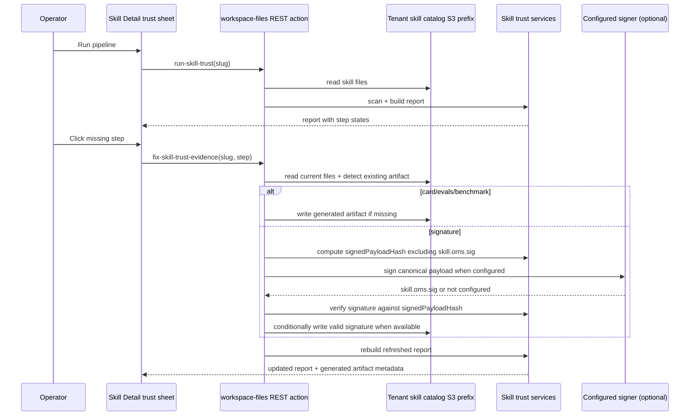

# feat: Generate missing skill trust evidence

## Overview

Extend the Skill Detail trust sheet so an operator can click a pipeline step,
understand what that step proves, see the current evidence state for the
selected catalog skill, and generate the missing release evidence needed for the
trust packet: `skill-card.md`, `evals/smoke.json`, `BENCHMARK.md`, and
`skill.oms.sig` when real signing configuration is available.

Also tighten the Skill Library operator UI around that trust flow: Published and
Drafts become header tabs like the n8n plugin detail surface, draft rows open an
editable draft detail route, imports enter the draft/trust policy instead of
registering directly into the catalog, and published skills expose the skill
card as a first-class document affordance.

The feature keeps the trust story honest. Card, eval, and benchmark fixes can be
generated from the catalog skill contents. Signature fixing must either create a
valid detached OMS signature over the exact catalog directory or report that
signing is not configured; it must not create a placeholder that looks verified.

---

## Problem Frame

THNK-11 established a trust-gated Skill Library boundary: drafts and catalog
skills can run an NVIDIA SkillSpector-backed pipeline, and the Skill Detail
shield sheet reports missing release evidence. The current UI proves the scanner
can run, but it leaves the operator staring at `missing` badges with no guided
recovery path.

Operators need a reviewable, on-demand way to complete release evidence from the
same Skill Detail surface: inspect the missing step, understand why it matters,
click a fix action, and rerun the report against the exact updated catalog
contents.

The surrounding Skill Library UI should reinforce the same policy. Drafts should
not feel like a secondary table with one-off action buttons; they should be
editable skill records with their own detail view and publish affordance.
Imported archives should not bypass the draft review queue. Skill cards should
answer "what does this skill do?" without requiring the operator to read raw
`SKILL.md` first.

---

## Requirements Trace

### Skill Library Navigation and Draft Detail UI

- R1. Published and Drafts are route-backed header tabs on the Skill Library,
  following the `N8nPluginHome` header-tab pattern rather than in-page tabs.
- R2. On the Published tab, the update gate sits on the same toolbar row as the
  search input, right-justified.
- R3. On the Drafts tab, clicking a draft row opens a Skill Detail editor view
  for that draft.
- R4. Draft detail replaces the evals toolbar icon with a publish icon; publish
  remains tenant-operator gated and uses the existing publish mutation.
- R5. The Drafts table removes the generic Action column and instead includes a
  requested-by/requester column.

### Trust Step Detail Behavior

- R6. After a trust report exists, every pipeline step row is clickable and opens
  a step detail view inside the trust sheet.
- R7. The step detail explains the step purpose, current state, detected
  artifact path or absence, and whether the current state blocks trust
  completion.

### Evidence Generation and Signing

- R8. Operators can generate missing `skill-card.md`, `evals/smoke.json`, and
  `BENCHMARK.md` artifacts from the selected catalog skill's current `SKILL.md`
  and supporting files.
- R9. The skill card includes an LLM- or agent-generated human-readable summary
  of what the skill does, written for operators reviewing the Skill Library.
- R10. Published Skill Detail exposes the skill card as a header document icon
  that opens the card when present and explains how to generate it when missing.
- R11. Operators can generate `skill.oms.sig` only through a real signing path
  over a canonical signed payload hash that excludes `skill.oms.sig`; when
  signing is not configured, the UI explains the missing prerequisite rather
  than creating fake evidence.

### Authorization, Persistence, and Idempotency

- R12. Evidence generation is tenant-admin gated server-side and writes only to
  the tenant catalog source of truth under
  `tenants/<tenant-slug>/skill-catalog/<skill-slug>/`.
- R13. Evidence generation is idempotent by default: existing evidence is not
  overwritten, and generated writes use object-store conditional writes rather
  than a read-then-write check alone.
- R14. After a fix completes, the trust report refreshes so the operator sees the
  updated step status and content hash.
- R15. Generated artifacts are deterministic and reviewable, include provenance
  that they were generated by ThinkWork, and avoid claiming stronger validation
  than occurred.
- R16. Uploaded/imported skill archives enter the skill draft policy instead of
  being automatically registered into the published catalog.

### Unchanged Invariants

- R17. The implementation preserves existing `/skill-creator`, publish, export,
  install, and on-demand run semantics. Direct catalog import becomes an
  operator recovery path only, not the default Skill Library upload behavior.

**Origin actors:** A2 tenant operator, A4 Skill Library system, A5 trust pipeline

**Origin flows:** F2 verify and refine the draft, F3 approve and publish, F4
import or update an externally authored skill

**Origin acceptance examples:** AE3 eval evidence, AE4 review packet evidence,
AE5 signature verification, AE6 Skill Library publication/update boundaries

---

## Scope Boundaries

- This plan does not auto-fix SkillSpector findings or spec validation failures.
- This plan does not make missing evidence block catalog publication by itself;
  it improves recovery and trust completeness for catalog skills.
- This plan does not mutate installed agent/workspace copies. Generated evidence
  lands in the catalog source only.
- This plan does not auto-publish uploaded archives. Upload creates or updates a
  draft for review.
- This plan does not silently overwrite existing skill cards, evals, benchmarks,
  or signatures.
- This plan does not implement artifact replacement. Existing artifacts are
  view-only in this workflow; replacement remains a follow-up with its own
  confirmation and review affordance.
- This plan does not claim a signature is verified unless the signature is
  actually produced or verified by the configured signing/verification tooling.
- This plan does not add a durable `skill_trust_runs` table. The UI may keep the
  current session report, while generated files and refreshed reports remain the
  durable evidence.

---

## Context & Research

### Relevant Code and Patterns

- `apps/web/src/components/settings/SettingsSkillDetail.tsx` owns the Skill
  Detail toolbar, shield button, trust sheet, evidence rows, run action, and
  current session `SkillTrustReport` state.
- `apps/web/src/components/settings/SettingsSkills.tsx` currently owns the
  Skill Library Published/Drafts view state, upload action, update gate,
  published table, draft table, and draft publish button.
- `apps/web/src/components/settings/SettingsSkillDetail.test.tsx` already mocks
  the workspace-files client, opens the trust sheet, runs the pipeline, and
  asserts failure toasts.
- `apps/web/src/components/settings/SettingsSkills.test.tsx` covers direct
  archive import, draft listing, and draft publish behavior that will need to
  shift to draft-first imports and clickable draft rows.
- `apps/web/src/lib/workspace-files-api.ts` defines the frontend
  `SkillTrustReport` type and calls the workspace-files REST action
  `run-skill-trust`.
- `apps/web/src/components/settings/plugins/n8n/N8nPluginHome.tsx` uses
  `usePageHeaderActions({ tabs: [...] })` for route-backed header tabs, and
  `N8nPluginHome.test.tsx` asserts there is no in-page `TabsList`.
- `packages/api/workspace-files.ts` owns catalog actions, tenant-admin gating,
  catalog object reads/writes, `run-skill-trust`, and the REST analogue of
  `requireTenantAdmin`.
- `packages/api/src/lib/skill-trust/catalog-report.ts` computes the trust report
  from files, detects `skill-card.md`, `evals/*.json`, `BENCHMARK.md`, and
  `skill.oms.sig`, and summarizes missing evidence.
- `packages/api/src/lib/skill-trust/catalog-report.test.ts` covers the current
  report builder evidence statuses and high-severity blocking behavior.
- `packages/api/src/lib/skill-trust/skillspector.ts` invokes the configured
  SkillSpector runner and returns normalized scanner findings.
- `packages/database-pg/graphql/types/skill-creator.graphql` already exposes
  `skillDraft(id: ID!)`, `skillDrafts`, requester fields, and publish mutations.
- `docs/solutions/architecture-patterns/skill-creator-draft-publish-trust-pipeline.md`
  documents the current trust pipeline, catalog prefix boundaries, and local
  verification expectations.

### Institutional Learnings

- `docs/solutions/best-practices/every-admin-mutation-requires-requiretenantadmin-2026-04-22.md`
  applies because evidence generation is tenant-scoped, side-effecting catalog
  mutation.
- `docs/solutions/architecture-patterns/skill-creator-draft-publish-trust-pipeline.md`
  requires trust evidence to bind to the exact scanned content hash and keeps
  draft files separate from catalog skills.
- `docs/solutions/architecture-patterns/skill-eval-rated-does-not-mean-evaluable-2026-06-15.md`
  applies to the eval/benchmark fix: generated eval files are starter evidence,
  not proof that an isolated eval run succeeded.

### External References

- NVIDIA trust pipeline:
  `https://docs.nvidia.com/skills/agent-skill-trust-pipeline`. The release gate
  combines SkillSpector scanning, skill card completion, detached OMS signing,
  and verification before use.
- NVIDIA signing docs:
  `https://docs.nvidia.com/skills/signing-agent-skills`. Signing happens after
  scanning/card review and publishes `skill.oms.sig` with the skill.
- NVIDIA skill-card docs:
  `https://docs.nvidia.com/skills/skill-cards`. Skill cards answer owner,
  license, use case, geography, output shape, risks, and supporting references.
- NVIDIA skills repository:
  `https://github.com/nvidia/skills`. Published verified skills include
  `SKILL.md`, `skill-card.md`, `skill.oms.sig`, eval JSON, and `BENCHMARK.md`.

---

## Key Technical Decisions

- **Keep fixes behind the workspace-files catalog boundary.** The current
  on-demand trust run is a catalog REST action, already tenant-admin gated for
  catalog writes. Adding `fix-skill-trust-evidence` there avoids a parallel
  GraphQL mutation and keeps the Skill Detail UI on one client path.
- **Move Published/Drafts to route-backed header tabs.** Follow the n8n plugin
  detail pattern: Skill Library tabs live in `usePageHeaderActions`, backed by
  `/settings/skills` and a Drafts route, not by an in-page segmented control.
- **Make draft skills first-class detail records.** Draft rows navigate to a
  draft detail/editor route that reuses the existing workspace file editor with
  `skillDraftId`, while published skills keep the catalog detail route.
- **Route uploads into drafts.** The default upload/import action creates a
  draft from the archive and navigates to the draft detail/review path. Direct
  catalog import remains a lower-level recovery action, not the Skill Library
  default.
- **Generate evidence from the catalog snapshot being inspected.** The backend
  reads the selected catalog prefix, computes the current report/content hash,
  writes the missing artifact, and returns a refreshed report. This prevents the
  UI from fixing stale local state.
- **Treat the skill card as the operator summary artifact.** The card should
  include an LLM/agent-generated human-readable summary plus structured release
  fields. Published skill details expose it through a document icon so an
  operator can understand the skill before reading raw source.
- **Model steps explicitly in the UI.** Instead of hard-coded `TrustEvidence`
  calls with only label/value, the sheet should build a typed step model with
  id, label, status, artifact paths, purpose text, fixability, and action state.
- **Treat generated evals and benchmarks as starter release evidence.** The eval
  fix creates a small smoke dataset derived from the skill description and
  allowed tools. The benchmark fix documents what has and has not been measured.
  It should not invent pass rates or claim comparative uplift without a real
  run. The report and UI should distinguish starter/generated evidence from
  measured or validated evidence.
- **Require real signing for signature fixes.** The signature step can call a
  concrete configured signer when available. If no signer is configured, the
  step detail marks the state as `missing_signing_config` and disables the fix
  or returns a clear prerequisite error. A fake `skill.oms.sig` is worse than no
  signature.
- **Separate freshness hash from signed payload hash.** `contentHash` remains the
  refreshed catalog freshness hash for all files. Signature generation and
  verification use a canonical `signedPayloadHash` or signing manifest that
  excludes `skill.oms.sig`, avoiding a self-referential signature target.
- **Re-verify signatures after any content-changing fix.** If an existing
  `skill.oms.sig` no longer verifies against the refreshed signed payload after
  card/eval/benchmark generation, the report must mark the signature as stale or
  invalid rather than leaving it generically present.
- **Do not overwrite operator-authored evidence.** If an artifact already exists,
  the primary action is view/rerun. This plan intentionally excludes replacement
  UI and replacement backend behavior.
- **Make no-overwrite an object-store invariant.** Generated artifact writes use
  S3 conditional creation such as `IfNoneMatch: "*"`. If another writer creates
  the artifact between list and write, the fix action returns an existing
  artifact result and refreshes the report without overwriting.

---

## Security and Data Handling

- Signing credentials, if enabled, must live in KMS-backed signing
  infrastructure or Secrets Manager, scoped by stage and tenant/publisher as
  appropriate. They must never be committed, embedded in browser-visible config,
  stored in `.env`, or logged.
- Signing and verification IAM should be least-privilege. The workspace-files
  handler can request a signature only through the configured signer path and
  only after tenant-admin authorization has passed.
- Signature success requires post-sign verification against the same canonical
  signed payload hash. Wrong key, malformed signature, or content tampering after
  signing must produce a non-success signature state.
- Generated skill cards, evals, and benchmarks should copy from an explicit
  allowlist of skill metadata fields and generated prose. They must not copy
  credentials, OAuth tokens, tenant secrets, or unnecessary PII from supporting
  files into release artifacts.

---

## Open Questions

### Resolved During Planning

- **Where should the fix API live?** Use `packages/api/workspace-files.ts`
  alongside `run-skill-trust`, because the UI already reaches catalog trust
  actions through `apps/web/src/lib/workspace-files-api.ts` and the handler has
  tenant-admin gating plus catalog S3 write helpers.
- **Should signature generation create a placeholder?** No. NVIDIA's model
  treats `skill.oms.sig` as a detached cryptographic signature over the exact
  release directory. A placeholder would make the trust report misleading.
- **Should generated evals/benchmarks claim trust completion?** They may satisfy
  artifact presence, but their evidence state and contents must distinguish
  starter/generated evidence from measured benchmark or eval results.
- **Should artifact replacement be part of this release?** No. Replacement is a
  follow-up; the first implementation refuses overwrite and shows existing
  artifact paths.
- **What does a signature cover?** Signature generation uses a canonical signed
  payload hash or manifest that excludes `skill.oms.sig`. The report may still
  show the full refreshed `contentHash` separately.
- **Should uploaded archives publish directly?** No. The Skill Library upload
  path should create a draft so the same trust pipeline and publish policy apply
  to generated and imported skills.
- **Is the skill card the human-readable summary?** Yes for this workflow. The
  generated card is the reviewable, human-readable skill summary, with extra
  governance fields beyond a short description.

### Deferred to Implementation

- **Exact generated file templates:** The implementer should derive final
  markdown/JSON wording from the existing skill metadata and any upstream
  template text available in the repo at implementation time.
- **Signer configuration shape:** If a signing adapter already exists or lands
  before implementation, wrap it minimally. Otherwise keep the signature step
  honest with `missing_signing_config` and do not introduce a speculative signer
  abstraction.
- **Exact LLM path for skill-card summary:** Reuse the repo's existing
  server-side model/agent invocation pattern when available. If no safe
  invocation path is practical in the implementation unit, use a deterministic
  summary fallback and leave model generation behind a typed unavailable state.

---

## High-Level Technical Design

> _This illustrates the intended approach and is directional guidance for
> review, not implementation specification. The implementing agent should treat
> it as context, not code to reproduce._

---

## Implementation Units

- U1. **Add trust evidence fix domain service**

**Goal:** Add backend generation logic for missing trust evidence artifacts and a
single result shape that includes the refreshed trust report.

**Requirements:** R8, R9, R11, R12, R13, R14, R15

**Dependencies:** None

**Files:**

- Create: `packages/api/src/lib/skill-trust/evidence-fixes.ts`
- Test: `packages/api/src/lib/skill-trust/evidence-fixes.test.ts`
- Modify: `packages/api/src/lib/skill-trust/catalog-report.ts`
- Test: `packages/api/src/lib/skill-trust/catalog-report.test.ts`

**Approach:**

- Define a finite set of fixable step ids: `skillCard`, `evalDataset`,
  `benchmark`, and `signature`.
- Generate `skill-card.md` from parsed `SKILL.md` metadata, description,
  allowed tools, license metadata, owner fallback, detected supporting files,
  risk notes, ThinkWork provenance, and a human-readable operator summary.
- Prefer an existing server-side LLM/agent generation path for the summary when
  safely available; otherwise produce a deterministic summary and mark the card
  as generated without model assistance.
- Generate a seeder-valid smoke eval file, preferably `evals/smoke.json`, with
  the existing skill eval case fields accepted by `validateSkillCaseInput`
  (`query`, expected behavior, and `rubric` or `resolution_target`).
- Generate `BENCHMARK.md` as a benchmark readiness/report artifact that records
  source and refreshed hashes, eval dataset path, and whether a measured run
  exists.
- For signature, detect concrete signer/verifier configuration first. If none
  exists, return a typed prerequisite result and do not add a speculative signing
  abstraction or write `skill.oms.sig`.
- When signing is configured, compute a canonical signed payload hash that
  excludes `skill.oms.sig`, sign that payload, verify the produced signature
  before success, and report the signed payload hash separately from the full
  refreshed `contentHash`.
- Update the report model to represent prerequisite and evidence-quality states
  such as `missing_signing_config`, `starter_generated`, `measured`,
  `verified`, `stale`, or `invalid` without breaking existing missing/present
  consumers.

**Patterns to follow:**

- `packages/api/src/lib/skill-trust/catalog-report.ts` for artifact detection
  and content hashing.
- `packages/api/src/lib/skill-md-parser.js` usage through the report builder.
- `packages/api/src/lib/evals/skill-dataset.ts` for conservative eval language
  and skill-specific dataset naming ideas.

**Test scenarios:**

- Happy path: skill missing `skill-card.md` -> generator returns that file path,
  markdown includes human summary, owner/license/use case/risk/provenance
  sections, and refreshed report marks skill card present.
- Error path: model summary generation is unavailable -> deterministic fallback
  card is created without blocking the trust recovery workflow.
- Happy path: skill missing evals -> generator writes `evals/smoke.json` with at
  least one seeder-valid smoke case and refreshed report marks eval dataset as
  starter-generated, not measured.
- Happy path: skill missing benchmark -> generator writes `BENCHMARK.md` with no
  fabricated pass rate and refreshed report marks benchmark as
  starter-generated, not measured.
- Error path: requested step already has an artifact -> default behavior refuses
  overwrite and returns the existing path.
- Error path: signature requested with no configured signer -> no file is
  written and the result reports signing configuration as the prerequisite.
- Error path: configured signer returns a malformed signature or wrong-key
  signature -> no signature success is returned and the refreshed report does
  not mark the signature verified.
- Edge case: existing signature followed by card/eval/benchmark generation ->
  refreshed report re-verifies the signature and marks it stale/invalid if it no
  longer matches the new signed payload.
- Integration: generated eval case passes `validateSkillCaseInput` or equivalent
  seeding validation before the fix action reports success.
- Edge case: invalid or missing `SKILL.md` -> no generated evidence is written
  because the trust report cannot establish a reliable source skill identity.

**Verification:**

- Unit tests prove each fixable step either writes exactly one missing artifact
  or returns a typed non-mutating explanation.

---

- U2. **Expose catalog evidence fixes through workspace-files**

**Goal:** Add an authenticated catalog action that reads the current catalog
skill, applies one evidence fix, writes the artifact when allowed, and returns a
fresh report.

**Requirements:** R12, R13, R14, R17

**Dependencies:** U1

**Files:**

- Modify: `packages/api/workspace-files.ts`
- Test: `packages/api/workspace-files.test.ts` or the existing workspace-files
  handler test file if one is already colocated under `packages/api`
- Modify: `apps/web/src/lib/workspace-files-api.ts`

**Approach:**

- Add `fix-skill-trust-evidence` as a catalog-only action beside
  `run-skill-trust`.
- Require a valid catalog slug and valid step id.
- Reuse existing catalog object listing/size limits before generation.
- Gate with the existing catalog write authorization path; non-admin tenant
  members receive 403 before any S3 write or signing side effect.
- Write generated artifacts with the same S3 content-type conventions already
  used by catalog import/publish paths.
- Use conditional S3 creation (`IfNoneMatch: "*"`) for generated artifact writes.
  On precondition failure, return an existing-artifact result and rebuild the
  trust report from the current catalog contents.
- After successful writes, call the same catalog reindex path used by existing
  catalog mutations so the `skill_catalog` projection and list-page SHA stay
  fresh. Include a non-fatal `indexWarning` in the response when reindexing
  fails.
- Return `{ trustReport, fixedStep, artifactPath?, prerequisite?, indexWarning? }`
  so the UI can update without making a second request.

**Patterns to follow:**

- `handleRunSkillTrust` and `WRITE_ACTIONS` in `packages/api/workspace-files.ts`.
- `handleImportSkill` / catalog write rollback behavior in
  `packages/api/workspace-files.ts`.
- `runSkillTrustPipeline` in `apps/web/src/lib/workspace-files-api.ts`.

**Test scenarios:**

- Happy path: admin fixes missing skill card -> S3 receives
  `<slug>/skill-card.md` and response includes a refreshed report.
- Happy path: admin fixes missing evals -> response contains
  `artifactPath` with the generated eval JSON path.
- Happy path: successful fix triggers catalog reindex and propagates any
  non-fatal `indexWarning`.
- Error path: non-admin calls the action -> returns 403 and does not write.
- Error path: unsupported target or invalid slug -> returns 400 with no write.
- Error path: catalog skill lacks `SKILL.md` -> returns the same loud failure
  shape as `run-skill-trust`.
- Error path: signature requested without signer -> returns a prerequisite
  result and does not create `skill.oms.sig`.
- Race path: artifact appears after list but before write -> conditional write
  fails, generated content is not written, and response points to the existing
  artifact with a refreshed report.

**Verification:**

- The workspace-files API can fix a missing non-signature artifact and then
  immediately report it as present for the same catalog slug.

---

- U3. **Add clickable trust step detail UI**

**Goal:** Turn the trust evidence list into clickable rows with a detail surface
that explains each step and exposes the appropriate fix action.

**Requirements:** R6, R7, R11, R13, R15, R17

**Dependencies:** U2

**Files:**

- Modify: `apps/web/src/components/settings/SettingsSkillDetail.tsx`
- Test: `apps/web/src/components/settings/SettingsSkillDetail.test.tsx`
- Modify: `apps/web/src/lib/workspace-files-api.ts`

**Approach:**

- Replace the current repeated `TrustEvidence` calls with a typed step list that
  includes spec, SkillSpector, skill card, evals, benchmark, and signature.
- Make each row a stable-height button with the existing color-coded outline and
  badge treatment.
- Open a Step Detail view when clicked. On desktop, use a split trust sheet:
  step list on the left and detail panel on the right. On mobile/narrow sheets,
  use a single-panel drill-in with a "Back to steps" control.
- Include purpose text, current status, artifact path when present, current
  content hash, and fix eligibility.
- Order rows to keep the pipeline understandable: Spec and SkillSpector first,
  then missing or non-complete fixable evidence, then already-satisfied evidence.
  On desktop, default-select the first missing/non-complete fixable step after a
  report; on mobile, show no detail until the operator taps a row.
- Show "Generate missing component" for missing card/evals/benchmark, "Generate
  signature" only when signing is configured, a signing prerequisite message when
  it is not, and no fix action for Spec/SkillSpector.
- Cover detail action states explicitly:
  eligible missing artifact, generating, generated and report refreshed,
  generation failed, existing artifact, signing not configured, signature
  stale/invalid, and artifact written but catalog reindex returned a warning.
- After a successful fix, replace `trustReport` with the returned refreshed
  report, refresh the file editor/list view, and toast the generated artifact
  path or prerequisite state.
- Move focus to the detail heading on row open and return focus to the selected
  row on back/close. Rows and action buttons should have meaningful accessible
  names, selected state, and touch targets of at least 44px.

**Patterns to follow:**

- Existing sheet and toolbar styling in `SettingsSkillDetail.tsx`.
- Existing eval sheet action/loading/error patterns in `SettingsSkillDetail.tsx`.
- Existing color-coded outline badge UI from the current trust evidence rows.

**Test scenarios:**

- Happy path: clicking "Skill card" opens detail with purpose text, missing
  state, and a generate action.
- Happy path: generate skill card calls the client with slug `web-research` and
  step `skillCard`, then updates the list to the refreshed skill-card status.
- Happy path: clicking "Signature" when signer is not configured shows the
  prerequisite explanation instead of a fake success.
- Happy path: after generating `BENCHMARK.md`, the editor target key changes or
  equivalent refresh hook fires so the generated file appears in the file list.
- Error path: failed generation surfaces a toast and keeps the previous report
  visible.
- Warning path: generated artifact succeeds but catalog reindex warns -> report
  updates and the warning is visible without pretending the index refresh
  succeeded.
- Edge case: before any report exists, the sheet still shows the run prompt and
  does not render stale step details.
- Accessibility: step rows are keyboard-focusable buttons with meaningful names
  and no layout shift while a fix is running; mobile drill-in has working back
  navigation and focus restoration.

**Verification:**

- Operators can run the trust pipeline, click each evidence row, and see a
  detail surface with correct purpose/current-state/fix affordances.

---

- U4. **Connect catalog and editor refresh behavior**

**Goal:** Keep catalog projections, the file editor, and trust state coherent
after generated evidence is written.

**Requirements:** R13, R14, R17

**Dependencies:** U2, U3

**Files:**

- Modify: `apps/web/src/components/settings/SettingsSkillDetail.tsx`
- Modify: `apps/web/src/lib/workspace-files-api.ts`
- Test: `apps/web/src/components/settings/SettingsSkillDetail.test.tsx`

**Approach:**

- Ensure a generated artifact appears in the left file list after the fix. If
  the `WorkspaceFileEditor` only refreshes from key changes, bump a lightweight
  `targetKey` refresh token after successful generation.
- Do not force-open generated files unless the detail action explicitly provides
  a "View file" affordance; the primary trust flow stays in the sheet.
- Do not add replacement support in this unit. Existing artifacts show their
  path and view/rerun affordances only.
- Ensure UI state can surface a non-fatal `indexWarning` from the fix action
  without hiding the generated artifact or refreshed report.

**Patterns to follow:**

- Existing `targetKey` usage for `WorkspaceFileEditor`.
- Existing archive export/import refresh and toast behavior in Skill Library
  settings surfaces.

**Test scenarios:**

- Happy path: after generating `BENCHMARK.md`, the editor target key changes or
  equivalent refresh hook fires.
- Edge case: fixing a step while a different file is open does not clobber the
  editor's current unsaved local text.
- Error path: failed fix does not refresh the editor or clear selected detail.
- Warning path: catalog reindex warning remains visible until the next
  successful report/fix refresh.

**Verification:**

- A locally verified operator flow shows newly generated files in the Skill
  Detail file list without navigating away.

---

- U5. **Polish Skill Library header tabs and toolbar**

**Goal:** Move Published/Drafts navigation into the page header and align the
update gate with the search input.

**Requirements:** R1, R2

**Dependencies:** None

**Files:**

- Modify: `apps/web/src/components/settings/SettingsSkills.tsx`
- Modify/Create route files under `apps/web/src/routes/_authed/` for the Drafts
  Skill Library tab if route-backed tabs require a new route
- Test: `apps/web/src/components/settings/SettingsSkills.test.tsx`

**Approach:**

- Follow `apps/web/src/components/settings/plugins/n8n/N8nPluginHome.tsx` by
  passing `tabs` through `usePageHeaderActions`.
- Published remains the default Skill Library route; Drafts gets its own route
  or equivalent route-backed pathname so the selected tab survives reload/share.
- Remove the in-page Published/Drafts segmented control.
- On the Published tab, place the search input and update gate on the same row,
  with the gate right-justified. The upload icon remains in the header action
  area.
- On the Drafts tab, keep draft-specific error/empty states in the content area,
  not in the toolbar.

**Patterns to follow:**

- `apps/web/src/components/settings/plugins/n8n/N8nPluginHome.tsx`.
- `apps/web/src/components/settings/plugins/n8n/N8nPluginHome.test.tsx`.
- Existing `SettingsTablePane` toolbar conventions.

**Test scenarios:**

- Happy path: Skill Library registers header tabs for Published and Drafts and
  the component source no longer renders an in-page tab list for those tabs.
- Happy path: Published tab renders search input and update gate on one toolbar
  row, with the gate in the right-aligned control group.
- Happy path: Drafts tab shows draft count in the header tab label or adjacent
  badge without duplicating the in-page segmented control.

**Verification:**

- Local UI matches the n8n plugin header-tab placement and keeps the search/gate
  row visually balanced on desktop.

---

- U6. **Make draft skills open in a detail editor**

**Goal:** Let operators click a draft row and edit/review that draft in Skill
Detail instead of publishing from an action cell.

**Requirements:** R3, R4, R5

**Dependencies:** U5

**Files:**

- Modify: `apps/web/src/components/settings/SettingsSkills.tsx`
- Modify/Create draft detail route files under `apps/web/src/routes/_authed/`
- Modify: `apps/web/src/components/settings/SettingsSkillDetail.tsx`
- Modify: `apps/web/src/lib/workspace-files-api.ts` if draft detail needs a
  narrowed draft client helper
- Test: `apps/web/src/components/settings/SettingsSkills.test.tsx`
- Test: `apps/web/src/components/settings/SettingsSkillDetail.test.tsx`

**Approach:**

- Add a route for draft skill detail, keyed by draft id rather than slug, so
  duplicate or colliding slugs remain unambiguous.
- Reuse `WorkspaceFileEditor` with the existing `{ skillDraftId }` target and
  default-open `SKILL.md`.
- In Drafts table, remove the Action column and make rows clickable. Add a
  Requested by column using `SkillDraftSummary.requester`.
- In draft detail, show a publish icon in the header where the evals icon would
  be for published skills. Keep trust/info actions available when they make
  sense for draft review; do not show eval score actions on drafts.
- Publishing from draft detail uses the existing `publishSkillDraft` mutation and
  navigates to the published catalog detail after success.

**Patterns to follow:**

- Current published `SettingsSkillDetail` header action pattern.
- Existing `skillDraftId` workspace-files target support in
  `apps/web/src/lib/workspace-files-api.ts`.
- Existing `PublishSkillDraftMutation` flow in `SettingsSkills.tsx`.

**Test scenarios:**

- Happy path: clicking a draft row navigates to the draft detail route and opens
  `SKILL.md` in the editor.
- Happy path: Drafts table has Draft, Requested by, and Status columns, and no
  Action column.
- Happy path: draft detail header shows a publish icon and does not show the
  evals icon.
- Happy path: clicking publish in draft detail calls `publishSkillDraft` and
  navigates to the published skill detail on success.
- Error path: publish collision still uses the existing replace confirmation
  flow without losing the draft detail context.

**Verification:**

- Operators can review/edit a submitted draft from the Skill Drafts tab and
  publish from the draft detail header.

---

- U7. **Route uploaded skill archives into drafts**

**Goal:** Make uploaded/imported skills follow the same draft trust policy as
generated skills.

**Requirements:** R16, R17

**Dependencies:** U5, U6

**Files:**

- Modify: `apps/web/src/components/settings/SettingsSkills.tsx`
- Modify: `apps/web/src/lib/workspace-files-api.ts`
- Modify: `packages/api/workspace-files.ts` or add GraphQL/API support for
  archive-to-draft creation, depending on the existing draft creation boundary
- Test: `apps/web/src/components/settings/SettingsSkills.test.tsx`
- Test: `apps/web/src/lib/workspace-files-api.test.ts`
- Test: relevant API handler/resolver tests under `packages/api`

**Approach:**

- Replace the default upload path's direct `import-skill` catalog write with an
  archive-to-draft path.
- The archive-to-draft path should parse and validate the portable skill archive,
  write files under `skill-drafts/<draft-id>/`, create a `skill_drafts` row with
  source kind `import` or equivalent metadata, and return the draft id/slug.
- Navigate to the new draft detail route after upload instead of the published
  catalog detail.
- Preserve direct catalog import only as an explicit recovery/legacy path outside
  the default UI flow; do not surface it as the ordinary upload button behavior.
- Slug collisions are handled at publish time, not during upload.

**Patterns to follow:**

- `packages/api/src/lib/catalog-skill-archive.ts` for archive parsing.
- `packages/api/src/lib/skill-drafts/files.ts` for draft file validation and
  content hashes.
- `packages/api/src/graphql/resolvers/skill-creator/*` draft lifecycle
  resolvers.
- Existing `importSkillArchive` tests as regression coverage to update.

**Test scenarios:**

- Happy path: uploading a valid skill archive creates a draft, shows a success
  toast, refetches Drafts, and navigates to draft detail.
- Happy path: uploaded archive does not create or update a `skill_catalog` row
  before publish.
- Error path: invalid archive surfaces the existing archive validation message
  and creates no draft.
- Edge case: uploaded archive slug collides with a published skill -> upload
  still creates a draft; publish later prompts for replace.

**Verification:**

- Local UI upload produces a draft row/detail, and the trust pipeline can be run
  before the skill is published.

---

- U8. **Expose skill cards in the published catalog**

**Goal:** Make the skill card easy to find from published Skill Detail and keep
it aligned with the trust pipeline's skill-card generation.

**Requirements:** R9, R10, R15

**Dependencies:** U1, U3

**Files:**

- Modify: `apps/web/src/components/settings/SettingsSkillDetail.tsx`
- Test: `apps/web/src/components/settings/SettingsSkillDetail.test.tsx`
- Modify: `apps/web/src/lib/workspace-files-api.ts` if a helper is needed to
  read `skill-card.md`

**Approach:**

- Add a document-style icon to the published Skill Detail header for the skill
  card.
- If `skill-card.md` exists, open it in a sheet or focus it in the existing
  editor. Prefer a read-friendly sheet if the current editor view is too raw for
  quick operator review.
- If the card is missing, open the trust sheet's Skill Card detail and expose the
  generation path.
- The card's first section should provide the human-readable summary requested
  by operators, followed by governance fields from the trust pipeline.

**Patterns to follow:**

- Existing header icon affordances in `SettingsSkillDetail.tsx`.
- Existing sheet patterns for trust/info/evals.
- Skill-card path detection in `catalog-report.ts`.

**Test scenarios:**

- Happy path: published skill with `skill-card.md` shows a document icon and
  opens the card.
- Missing path: clicking the document icon when no card exists routes the
  operator to the Skill Card trust detail with a generate action.
- Draft path: draft detail does not show published-only skill-card icon unless
  the draft detail explicitly supports previewing its draft card.

**Verification:**

- Operators can inspect a published skill's human-readable skill card from the
  header without hunting through the file tree.

---

- U9. **Update docs and local validation coverage**

**Goal:** Document the recovery workflow and verify the full operator experience
on `localhost:5175`.

**Requirements:** R1-R17

**Dependencies:** U1, U2, U3, U4, U5, U6, U7, U8

**Files:**

- Modify:
  `docs/solutions/architecture-patterns/skill-creator-draft-publish-trust-pipeline.md`
- Modify: `docs/plans/autopilot-status.md` if this work is executed in the
  existing autopilot ledger
- Test: `apps/web/src/components/settings/SettingsSkillDetail.test.tsx`
- Test: `apps/web/src/components/settings/SettingsSkills.test.tsx`
- Test: `packages/api/src/lib/skill-trust/evidence-fixes.test.ts`

**Approach:**

- Update the runbook with the step-detail/fix workflow, generated artifact
  meanings, and the signature prerequisite rule.
- Include local verification notes that use `http://localhost:5175`, not
  `127.0.0.1`, because authentication is origin-sensitive.
- For browser validation, use an existing catalog skill with missing trust
  evidence, run the pipeline, generate at least one non-signature artifact, and
  rerun the report to confirm the badge changes.
- Validate the Drafts tab, draft row navigation, draft detail publish icon,
  archive upload-to-draft behavior, and published skill-card document icon.

**Patterns to follow:**

- Verification checklist format in
  `docs/solutions/architecture-patterns/skill-creator-draft-publish-trust-pipeline.md`.
- Existing localhost warning in the same runbook.

**Test scenarios:**

- Integration: local UI run on `localhost:5175` opens
  `/settings/skills/account-health-review`, runs the pipeline, opens a missing
  step, fixes it, and shows the refreshed present badge.
- Integration: signature detail explains missing signing config when no signer
  is configured.
- Regression: existing trust run and error toast behavior still work.
- Integration: uploaded archive becomes a draft, not a published catalog skill,
  until the operator publishes it.
- Integration: draft row opens the draft editor and publish icon publishes the
  draft through the governed path.
- Integration: published Skill Detail document icon opens the skill card or
  routes to generation when missing.

**Verification:**

- Local browser validation demonstrates the end-to-end evidence fix path for at
  least Skill Card or Benchmark, the upload-to-draft path, and draft-detail
  publish from `http://localhost:5175`.

---

## System-Wide Impact

- **Interaction graph:** Skill Detail UI -> workspace-files REST action ->
  catalog S3 prefix -> SkillSpector/report builder -> optional configured
  signer.
- **Skill Library navigation:** Header tabs route operators between Published
  and Drafts. Draft rows navigate into draft detail/editor. Upload navigates to
  draft detail instead of published catalog detail.
- **Error propagation:** Backend fix failures return typed codes and no partial
  UI success; frontend keeps the previous report visible and surfaces the reason
  in the step detail/toast.
- **State lifecycle risks:** Generated artifacts change the content hash. The
  backend must return a refreshed report for the new hash so the operator does
  not confuse old evidence with new content. Signature evidence also carries a
  separate signed payload hash that excludes `skill.oms.sig`.
- **Catalog index lifecycle:** Evidence writes must refresh the derived
  `skill_catalog` projection or return an index warning so list-page SHA and
  detail-page file state do not drift.
- **API surface parity:** This is initially a web/operator Skill Detail feature.
  CLI/mobile parity is not required because the user request targets the local
  settings UI.
- **Integration coverage:** Unit tests cover generation and handler behavior;
  local browser validation covers the click-through operator flow.
- **Unchanged invariants:** `/skill-creator` draft creation, draft publish,
  direct export, installed agent copies, and SkillSpector scanning remain
  unchanged except for richer recovery affordances on catalog detail pages and a
  draft-first default upload policy.

---

## Risks & Dependencies

| Risk                                                 | Mitigation                                                                                                                                    |
| ---------------------------------------------------- | --------------------------------------------------------------------------------------------------------------------------------------------- |
| Fake trust evidence weakens the enterprise story     | Generated artifacts include provenance and avoid claiming unmeasured eval/benchmark results; signature fix requires real signing.             |
| Signature support is not configured in local/dev     | Treat this as a visible prerequisite state, not a blocker for card/eval/benchmark fixes.                                                      |
| Operator overwrites hand-written evidence            | Use conditional S3 creation and make replacement out of scope for this first release.                                                         |
| Content hash changes after a fix                     | Return a refreshed trust report from the fix action, keep `contentHash` separate from `signedPayloadHash`, and re-verify existing signatures. |
| Cross-tenant catalog writes                          | Reuse workspace-files tenant resolution and tenant-admin gating before any S3 write or signing side effect.                                   |
| Generated evals are mistaken for proven eval results | Use starter/generated evidence states, seeder-valid smoke cases, and UI copy that separates artifact presence from measured results.          |
| Signer credential mishandling                        | Require KMS/Secrets Manager-backed signer configuration, least-privilege IAM, stage scoping, and no logging of key material.                  |
| Upload bypasses trust review                         | Route default archive uploads to skill drafts, and keep direct catalog import out of the primary UI.                                          |
| Draft/published routes confuse operators             | Use header tabs and breadcrumbs matching the n8n route-backed tab pattern; draft detail is keyed by draft id.                                 |
| LLM-generated card summary leaks sensitive context   | Generate from allowlisted metadata/prose only, with deterministic fallback and no copying of secrets or unnecessary PII.                      |

---

## Documentation / Operational Notes

- Update the trust pipeline runbook with the new step detail and fix flow.
- Update the runbook to state that uploaded archives create drafts by default and
  only become catalog skills after publish.
- Document the Skill Library header-tab and draft-detail policy so future
  Settings surfaces do not reintroduce in-page tab drift.
- Document that signing requires configured signing infrastructure and that
  unsigned skills remain visibly unsigned.
- Local validation should use `http://localhost:5175/...` so Cognito auth works
  with the current dev callback setup.

---

## Sources & References

- **Origin document:**
  `docs/brainstorms/2026-06-21-skill-creator-system-requirements.md`
- **Prior implementation plan:**
  `docs/plans/2026-06-21-003-feat-skill-creator-system-plan.md`
- **Trust pipeline runbook:**
  `docs/solutions/architecture-patterns/skill-creator-draft-publish-trust-pipeline.md`
- **Admin authz rule:**
  `docs/solutions/best-practices/every-admin-mutation-requires-requiretenantadmin-2026-04-22.md`
- **NVIDIA trust pipeline:**
  `https://docs.nvidia.com/skills/agent-skill-trust-pipeline`
- **NVIDIA signing guide:** `https://docs.nvidia.com/skills/signing-agent-skills`
- **NVIDIA skill cards:** `https://docs.nvidia.com/skills/skill-cards`
- **NVIDIA verified skills repository:** `https://github.com/nvidia/skills`
