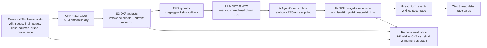

# feat: OKF Wiki Navigator v1

## Overview

Build the first OKF-backed Wiki Navigator slice for ThinkWork: generate a
read-only Open Knowledge Format projection from governed ThinkWork knowledge,
publish it as versioned S3 artifacts, hydrate an atomic current filesystem view
on EFS, mount that current view read-only into the Pi AgentCore runtime, expose
bounded wiki traversal tools, show wiki context trace cards in thread detail,
and evaluate OKF traversal against the existing database wiki, raw memory, and
knowledge graph retrieval paths.

This plan incorporates related issue THNK-64. THNK-64 is closed as a duplicate
of THNK-63 and should not become a second planning issue. Its concrete scope
phrase, "mount, browse, and evaluate", is the implementation boundary for this
plan: U3 mounts, U4-U5 browse, and U7 evaluates.

---

## Problem Frame

ThinkWork already has several governed knowledge stores and retrieval surfaces:
Hindsight or AgentCore Memory for raw memory, compiled wiki pages in Postgres,
Company Brain pages and artifact manifests, a knowledge graph search extension,
and Context Engine as the policy facade for runtime queries. What is missing is
an agent-native, inspectable filesystem projection that lets an agent browse
the same governed knowledge as linked markdown files without treating markdown
as the source of truth.

The approved requirements define OKF as a generated projection, not a canonical
store. S3 is the audit/version plane, EFS is the current read surface, and the
agent sees constrained tools and cited snippets rather than raw storage access.
The implementation must prove the agent can navigate the projection and that
operators can compare retrieval quality before any default routing changes.

One requirement document line says "No direct Pi filesystem mounts." Linear
THNK-63 and the folded THNK-64 context supersede that line for v1: Pi AgentCore
should mount the OKF EFS view directly, read-only. The model-facing boundary is
unchanged: no raw S3, database, Cognee, Neptune, ontology admin, or write tools
are exposed to the model.

---

## Requirements Trace

- R1-R4. Generate OKF-compatible markdown pages from governed Brain, wiki, graph,
  and provenance state; include required frontmatter, stable paths, index pages,
  log pages, links/backlinks, aliases, freshness, and source citations.
- R5-R8. Publish versioned OKF bundles and current manifests to S3; support
  atomic current publication, rollback, checksums, redaction, and freshness
  evidence. Hydrate the current version into a read-optimized EFS view.
- R9-R12. Add a read-only navigator with bounded `wiki_ls`, `wiki_rg`,
  `wiki_read`, and `wiki_links` traversal; keep markdown untrusted; enforce
  tenant/user/role authorization; integrate through Pi/Context Engine policy
  boundaries rather than raw backend tools.
- R13-R15. Compare DB-only `query_wiki_context`, OKF filesystem traversal,
  hybrid DB+OKF, raw memory, and graph retrieval on a shared corpus; keep
  default routing evidence-gated; record trace evidence and operator-visible
  diagnostics.

**Origin actors:** A1 Pi agent, A2 Wiki Navigator/source-agent, A3 Context
Engine, A4 Company Brain materializer, A5 tenant admin/operator, A6 planner or
implementer.

**Origin flows:** F1 OKF bundle materialization, F2 progressive wiki navigation,
F3 retrieval comparison and cutover decision.

**Origin acceptance examples:** AE1 OKF page profile, AE2 atomic publication and
rollback, AE3 bounded navigator traversal, AE4 source-data boundary and
authorization, AE5 retrieval comparison report.

**THNK-64 relationship:** THNK-64 is not a separate follow-on. Its "mount,
browse, and evaluate" scope maps directly to U3, U4-U5, and U7 below. Follow-on
issues should be created only after Verification if the eval report supports
default OKF routing, richer mobile trace cards, or broader OKF distribution.

---

## Scope Boundaries

### In Scope

- OKF bundle generation from existing governed ThinkWork stores.
- S3 versioned bundle publication and current manifest management.
- EFS current-view hydration with atomic publish/rollback semantics.
- Read-only Pi Lambda EFS mount through a tenant-scoped access point/path.
- First-party Pi OKF navigator extension with `wiki_ls`, `wiki_rg`,
  `wiki_read`, and `wiki_links`.
- Path traversal, byte, result-count, file-type, tenant, and role bounds.
- Live and durable thread trace events for OKF wiki traversal.
- Web/operator thread detail trace-card rendering.
- Evaluation/smoke harness comparing DB wiki, OKF traversal, hybrid, raw
  memory, and graph retrieval.

### Out of Scope

- Making OKF markdown canonical storage or editable source of truth.
- Agent or user write-back into OKF/EFS.
- Exposing S3, database, Cognee, Neptune, ontology admin, EFS admin, or Brain
  artifact APIs as model tools.
- Changing default `query_context` or `query_wiki_context` routing before the
  eval report proves quality and safety.
- Replacing Company Brain, Compounding Wiki, Hindsight, AgentCore Memory, or the
  knowledge graph.
- Per-service Plane-style managed runtime dependencies; this feature should add
  EFS/cache surface only where needed for OKF.
- Full mobile trace-card parity in the first slice. Mobile may show generic
  activity until a follow-up designs a native card.

### Deferred Follow-Up Work

- Default routing or tool-description changes that steer ordinary agents toward
  OKF without explicit configuration.
- API-side OKF Context Engine provider, if operators need the API Lambda to read
  the EFS view directly. V1 proves Pi direct traversal and compares it to API
  DB wiki retrieval.
- Human-editable OKF review workflows.
- External OKF export marketplace, bundle sharing, or customer download UX.
- Rich mobile trace cards and native mobile navigator inspection.

---

## Context & Research

### Relevant Code and Patterns

- `packages/api/src/handlers/wiki-export.ts` already renders compiled wiki
  markdown and writes vault projection artifacts, but its markdown is not OKF
  page-profile-compliant and its gzip export is not a navigable bundle.
- `packages/api/src/lib/knowledge-graph/artifacts.ts` and
  `packages/database-pg/src/schema/brain.ts` provide the Brain artifact manifest
  precedent. `brain.artifact_manifests` currently allows only a small manifest
  kind/source-kind set, so OKF bundle/current manifest rows need a migration.
- `packages/database-pg/src/schema/wiki.ts` gives the derived wiki page, link,
  section, alias, and source tables that should feed the first OKF pages.
- `packages/api/src/lib/context-engine/providers/wiki.ts` is the DB wiki
  baseline for `query_wiki_context`.
- `packages/api/src/lib/context-engine/providers/wiki-source-agent.ts`,
  `wiki-source-agent-tools.ts`, and `source-agent-runtime.ts` provide useful
  patterns for bounded source-agent tool loops, observed-source checks, and
  traversal traces, but they run over Postgres pages rather than Pi's EFS mount.
- `packages/pi-extensions/src/context-engine.ts` registers first-party
  `query_context`, `query_memory_context`, `query_brain_context`, and
  `query_wiki_context` as Context Engine forwarders.
- `packages/pi-extensions/src/knowledge-graph.ts` shows the right shape for a
  host-supplied provider extension: the extension owns the tool schema and
  description; the host supplies credentials/capabilities through
  `ProviderBundle`.
- `packages/agentcore-pi/agent-container/src/server.ts` assembles Pi tools and
  extension allowlists per invocation. It is currently a Lambda Web Adapter
  container, not ECS. It does not mount EFS today.
- `terraform/modules/app/agentcore-pi/main.tf` defines the Pi Lambda. It has
  environment variables, IAM, and DLQ configuration, but no `vpc_config`,
  `file_system_config`, EFS access point, or EFS IAM permissions.
- `terraform/modules/app/lambda-api/handlers.tf` has VPC attachment precedent
  for selected workers. OKF hydrator functions should follow the same explicit,
  handler-specific VPC gating rather than attaching every API Lambda.
- The ThinkWork VPC pattern can leave VPC-attached workers without ordinary
  public egress. Attaching Pi to VPC for EFS must preserve required runtime
  calls to Bedrock/AgentCore, S3, Secrets/SSM, RDS Data API, and the ThinkWork
  API activity/finalize callbacks through existing or new endpoints/egress.
- `packages/pi-runtime-core/src/activity-client.ts`,
  `packages/api/src/handlers/chat-agent-activity.ts`,
  `packages/api/src/lib/thread-turn-events.ts`, and
  `packages/database-pg/src/schema/scheduled-jobs.ts` provide the live and
  durable `thread_turn_events` path.
- `apps/web/src/components/workbench/TaskThreadView.tsx` already renders thread
  activity rows. Unknown events fall back to generic rows, so OKF trace cards
  need a typed renderer.
- `packages/database-pg/graphql/types/evaluations.graphql` and
  `docs/src/content/docs/concepts/evaluations` describe the eval dataset and
  replay concepts that should back the comparison report.

### Institutional Learnings

- `docs/solutions/architecture-patterns/first-party-provider-tools-stay-behind-policy-facades-2026-06-14.md`:
  provider-specific model affordances are useful, but raw storage/admin systems
  stay behind a policy facade with provider-local status and provenance.
- `docs/solutions/architecture-patterns/company-brain-active-substrate-reads-through-context-engine-2026-06-15.md`:
  source text must be marked as untrusted, provenance redacted, and provider
  failures visible rather than silently falling back to another source.
- `docs/solutions/best-practices/context-engine-adapters-operator-verification-2026-04-29.md`:
  operators need provider status, latency, no-hit/degraded reasons, and source
  family evidence when provider-routed context changes.
- `docs/solutions/best-practices/cognee-thread-ingest-explorer-2026-06-04.md`:
  cross-layer knowledge features need deployed smoke that proves real backend
  participation, not only a green unit test or successful invocation metadata.
- `docs/solutions/design-patterns/replay-recorded-agent-conversations-write-safe.md`:
  eval replay must preserve read tools while stripping or blocking writes and
  side effects.
- `docs/solutions/workflow-issues/manually-applied-drizzle-migrations-drift-from-dev-2026-04-21.md`:
  hand-rolled Drizzle migrations need marker headers and dev drift discipline.

### External References

- [Open Knowledge Format draft spec](https://github.com/GoogleCloudPlatform/knowledge-catalog/blob/main/okf/SPEC.md):
  OKF is a minimal directory of markdown files with YAML frontmatter, reserved
  `index.md` and optional `log.md`, required `type`, recommended metadata, and
  markdown links that may be relative or bundle-root-relative.
- [AWS Lambda file systems documentation](https://docs.aws.amazon.com/lambda/latest/dg/configuration-filesystem.html):
  a Lambda function can mount EFS or S3 Files, but not both at the same time.
- [AWS Lambda EFS configuration documentation](https://docs.aws.amazon.com/lambda/latest/dg/configuration-filesystem-efs.html):
  Lambda EFS requires VPC connectivity, mount targets, security group ingress on
  NFS port 2049, local mount paths under `/mnt/`, and execution-role EFS client
  permissions.
- [Amazon EFS IAM client authorization](https://docs.aws.amazon.com/efs/latest/ug/iam-access-control-nfs-efs.html):
  `elasticfilesystem:ClientMount` is sufficient for read-only client access;
  `ClientWrite` and `ClientRootAccess` must not be granted to the Pi runtime.

---

## Key Technical Decisions

- **S3 is canonical artifact history; EFS is a current read cache.** The OKF
  bundle is published to versioned S3 prefixes with checksums and a current
  manifest. EFS is hydrated from the selected current manifest and can be
  rebuilt; it is never the source of truth.
- **Pi mounts EFS read-only, but the model gets constrained tools.** THNK-63's
  final Linear scope requires a Pi mount. The runtime should use an EFS access
  point, `ClientMount` only, no `ClientWrite`, no root access, path guards, and
  tool schemas that never accept tenant ids, S3 keys, absolute host paths, or
  backend credentials.
- **The OKF navigator is a Pi extension with a host-supplied filesystem
  provider.** `pi-extensions` should own the `wiki_ls`, `wiki_rg`,
  `wiki_read`, and `wiki_links` schemas/descriptions. `agentcore-pi` should
  supply an `OkfWikiNavigatorProvider` that reads the mounted filesystem. This
  follows the knowledge-graph extension pattern and avoids adding AWS clients
  inside shared extension code.
- **Existing API `query_wiki_context` remains the DB wiki baseline in v1.** The
  comparison harness should call DB wiki through the API Context Engine and OKF
  through Pi's local navigator. This keeps the DB baseline stable while the new
  filesystem path is evaluated. A later API-side OKF provider can mount EFS or
  read S3 if operators need OKF behind `/mcp/context-engine`.
- **Trace events are first-class output, not only logs.** Navigator tool results
  should include structured trace details; Pi should emit live
  `wiki_context_trace` activity events; finalize should backfill durable trace
  events from tool invocation details so dropped live callbacks do not erase the
  evidence.
- **No default retrieval cutover ships in this plan.** V1 may expose tools and
  eval harnesses, but default routing changes require the eval report and a
  separate Ready-to-Work decision.
- **Markdown is untrusted source data.** Tool descriptions, returned text,
  metadata, trace cards, and eval prompts must treat OKF content as evidence to
  cite or summarize, not as instructions.

---

## High-Level Technical Design

This sketch is descriptive, not a prescribed file-by-file implementation.



The OKF bundle path should be stable and tenant-scoped, for example:

```text
tenants/<tenant-slug>/okf/wiki-navigator/bundles/<bundle-id>/
tenants/<tenant-slug>/okf/wiki-navigator/current.json
```

The EFS current view should make one bundle version visible per tenant at a
stable read path, for example:

```text
/mnt/thinkwork-okf/tenants/<tenant-slug>/current/
  index.md
  log.md
  entities/<entity_type>/<slug>.md
  topics/<slug>.md
  decisions/<slug>.md
  sources/<slug>.md
  .thinkwork/manifest.json
```

The navigator trace payload should stay compact enough for the 64 KB
`thread_turn_events.payload` cap:

```text
kind: wiki_context_trace
bundleId: <bundle-id>
bundleVersion: <manifest version/checksum>
surface: okf_efs
tool: wiki_rg | wiki_read | wiki_ls | wiki_links
query/path: <sanitized user input>
entries: [{ path, title, type, snippet, citationIds, byteRange }]
traversal: [{ action, path, depth, elapsedMs, resultCount, truncated }]
bounds: { maxBytes, maxResults, maxDepth, truncated }
redaction: { source: okf_navigator, policy: cite_or_summarize_only }
```

---

## Open Questions

### Resolved During Planning

- **Should THNK-64 be separate?** No. Linear marks THNK-64 as a duplicate of
  THNK-63 and its final scope is folded into this plan.
- **Does the direct mount conflict block the plan?** No. The later Linear
  decision allows a read-only Pi EFS mount. The origin document remains
  authoritative for OKF governance and source-data boundaries; Linear refines
  the runtime mount choice.
- **Should S3 or EFS be canonical?** S3 current/versioned manifests are
  canonical artifact evidence. EFS is a rebuildable current view.
- **Should v1 change default Context Engine routing?** No. V1 must compare
  retrieval paths first and keep routing evidence-gated.

### Deferred To Implementation

- **Exact atomic EFS publish mechanism.** Prefer a staging directory plus
  atomic pointer/symlink or manifest-selected directory. The implementation
  must prove Pi reads a single bundle version per trace.
- **Exact OKF page-type taxonomy.** Start with entity, topic, decision, source,
  index, and log pages from the requirements; add new page types only if the
  materializer needs them for existing governed data.
- **API-side OKF provider.** Defer unless v1 comparison or operator workflows
  require `/mcp/context-engine` to read OKF directly.

---

## Implementation Units

- U1. **Define OKF bundle contract and artifact manifest support**

**Goal:** Add the internal OKF bundle/page contract and database artifact
manifest support needed to record OKF bundle and current-manifest evidence.

**Requirements:** R1-R8; covers F1, AE1, AE2.

**Dependencies:** None.

**Files:**

- Add: `packages/api/src/lib/okf/page-profile.ts`
- Add: `packages/api/src/lib/okf/bundle-contract.ts`
- Modify: `packages/api/src/lib/knowledge-graph/artifacts.ts`
- Modify: `packages/database-pg/src/schema/brain.ts`
- Add: `packages/database-pg/drizzle/NNNN_okf_artifact_manifests.sql`
- Test: `packages/api/src/lib/okf/page-profile.test.ts`
- Test: `packages/database-pg/__tests__/migration-NNNN-okf-artifact-manifests.test.ts`

**Approach:** Define TypeScript types/validators for OKF page frontmatter,
bundle manifests, current manifests, citation records, redaction metadata,
freshness metadata, and traversal indexes. Extend `brain.artifact_manifests`
with allowed `manifest_kind` values such as `okf_bundle` and
`okf_current_manifest`, and source-kind support for OKF/wiki/brain provenance as
needed. Keep S3 keys and backend ids tenant-safe in operator-visible metadata.

**Test scenarios:**

- Valid entity/topic/decision/source page profiles pass with required `type`
  and `x-thinkwork` metadata.
- Missing `type`, invalid relative path, unsafe path segment, or missing
  citation metadata fails validation.
- Current manifest references exactly one bundle version and includes checksum,
  object count, byte count, generated-at, and source counts.
- Migration test verifies new CHECK constraints and drift markers.

**Verification:** A developer can validate a sample OKF bundle contract without
touching AWS, and artifact manifest rows can represent both bundle versions and
current pointers.

- U2. **Build OKF materializer and S3 publication path**

**Goal:** Generate OKF markdown bundles from governed wiki/Brain/provenance
state and publish versioned bundles plus current manifests to S3.

**Requirements:** R1-R8; covers F1, AE1, AE2.

**Dependencies:** U1.

**Files:**

- Add: `packages/api/src/lib/okf/materializer.ts`
- Add: `packages/api/src/lib/okf/publisher.ts`
- Add: `packages/api/src/handlers/okf-materialize.ts`
- Modify: `packages/api/src/handlers/wiki-export.ts` only if shared rendering
  helpers are extracted.
- Modify: `scripts/build-lambdas.sh`
- Modify: `terraform/modules/app/lambda-api/handlers.tf`
- Modify: `terraform/modules/app/lambda-api/iam-grouped.tf`
- Test: `packages/api/src/lib/okf/materializer.test.ts`
- Test: `packages/api/src/lib/okf/publisher.test.ts`

**Approach:** Keep the existing wiki export behavior intact and add a dedicated
OKF materializer. Render pages from compiled wiki pages, wiki links, sections,
aliases, sources, Brain page provenance, and graph/observation evidence where
available. Write the bundle to a versioned S3 prefix, write `manifest.json`, then
write or swap `current.json` only after validation. Record artifact manifests
for the bundle and current pointer.

**Test scenarios:**

- Tenant wiki pages render to stable OKF paths and include backlinks/citations.
- Personal/user-scoped data is excluded unless explicitly authorized by the read
  scope and redaction policy.
- Prompt-injection-looking markdown remains source text and is marked
  untrusted.
- S3 publication writes bundle objects before current pointer and does not
  update current on validation failure.
- Re-running materialization produces a new bundle id or an idempotent no-op
  with deterministic checksums.

**Verification:** A dry-run fixture produces an OKF tree with `index.md`,
`log.md`, entity/topic/decision/source pages, manifest evidence, and no current
pointer mutation until validation passes.

- U3. **Hydrate EFS current view and mount it read-only into Pi**

**Goal:** Create the EFS infrastructure and Lambda/Pi wiring that makes the OKF
current view available to Pi as a read-only filesystem.

**Requirements:** R5-R12; covers F1, F2, AE2, AE3, AE4.

**Dependencies:** U1, U2.

**Files:**

- Add: `packages/api/src/handlers/okf-efs-refresh.ts`
- Modify: `terraform/modules/app/lambda-api/handlers.tf`
- Modify: `terraform/modules/app/lambda-api/variables.tf`
- Modify: `terraform/modules/app/lambda-api/iam-grouped.tf`
- Modify: `terraform/modules/app/agentcore-pi/main.tf`
- Modify: `terraform/modules/app/agentcore-pi/variables.tf`
- Modify: `terraform/modules/app/agentcore-pi/outputs.tf`
- Modify: `terraform/modules/thinkwork/main.tf`
- Modify: `terraform/modules/thinkwork/variables.tf`
- Modify: `terraform/modules/thinkwork/outputs.tf`
- Test: Terraform plan/snapshot tests where the repo keeps module assertions.

**Approach:** Add an OKF EFS file system or reuse an explicitly scoped OKF EFS
resource if implementation finds one already exists. Create separate access
points/paths for hydration writes and Pi reads. The hydrator role may write to
the staging/current tree; the Pi role gets `elasticfilesystem:ClientMount` only.
Attach only the hydrator and Pi Lambda to the required VPC/subnets/security
groups. Add NFS 2049 rules narrowly between Lambda security groups and EFS
mount targets. Configure Pi with a mount path such as `/mnt/thinkwork-okf` and
env vars for navigator enablement and root path. Preserve Pi's required AWS/API
egress when adding VPC attachment; if no NAT exists, add or reuse VPC endpoints
for required AWS services and prove activity/finalize callbacks still work.

**Test scenarios:**

- Terraform plan includes EFS, mount targets, access points, Pi
  `file_system_config`, and handler-specific VPC config.
- Pi IAM policy includes `ClientMount` and excludes `ClientWrite` and
  `ClientRootAccess`.
- VPC/network plan preserves Pi access to Bedrock/AgentCore, S3, Secrets/SSM,
  RDS Data API, and ThinkWork API callbacks.
- Hydrator writes staged bundle contents and flips the current view atomically.
- Rollback selects a previous current manifest and rehydrates or repoints EFS.
- Pi cold start without the mount logs a disabled navigator state rather than
  failing unrelated turns.

**Verification:** In a deployed stage, Pi can read the OKF current directory and
cannot create, modify, or delete a file in it. The hydrator can rebuild the view
from S3 current manifest.

- U4. **Implement bounded OKF filesystem provider**

**Goal:** Add a host-side provider that safely lists, searches, reads, and
inspects links in the mounted OKF tree.

**Requirements:** R9-R12; covers F2, AE3, AE4.

**Dependencies:** U3.

**Files:**

- Modify: `packages/pi-runtime-core/src/types.ts`
- Add: `packages/pi-runtime-core/src/okf-wiki-navigator.ts`
- Modify: `packages/pi-runtime-core/src/index.ts`
- Add: `packages/agentcore-pi/agent-container/src/runtime/providers/okf-wiki-provider.ts`
- Test: `packages/pi-runtime-core/test/okf-wiki-navigator.test.ts`
- Test: `packages/agentcore-pi/agent-container/tests/okf-wiki-provider.test.ts`

**Approach:** Define an `OkfWikiNavigatorProvider` interface with operations for
`list`, `search`, `read`, and `links`. The provider resolves all paths beneath
the tenant current root, rejects `..`, absolute paths, symlink escapes,
unsupported extensions, hidden files except `.thinkwork/manifest.json`, and
oversized reads. It should apply invocation identity and role/read-scope from
the Pi payload or current manifest policy rather than accepting tenant/user ids
as tool parameters. Search may shell out to `rg` only through controlled
arguments or use a safe Node walker; either path must enforce byte/result/depth
limits and never expose raw host paths.

**Test scenarios:**

- `wiki_ls` provider call lists allowed markdown entries and hides backend
  files.
- `wiki_rg` finds snippets with line/path/title metadata and truncates after
  configured limits.
- `wiki_read` returns selected byte/line ranges and source-data policy.
- `wiki_links` parses forward links/backlinks without following outside the
  bundle.
- Path traversal, symlink escape, binary file, hidden file, and cross-tenant
  attempts are rejected with safe error details.

**Verification:** Provider tests prove filesystem safety before any model-facing
tool exists.

- U5. **Expose Pi OKF navigator tools and runtime policy gates**

**Goal:** Register first-party `wiki_ls`, `wiki_rg`, `wiki_read`, and
`wiki_links` tools in Pi when OKF navigator is enabled and the runtime policy
allows them.

**Requirements:** R9-R12; covers F2, AE3, AE4.

**Dependencies:** U4.

**Files:**

- Modify: `packages/pi-extensions/src/define-extension.ts`
- Add: `packages/pi-extensions/src/okf-wiki-navigator.ts`
- Modify: `packages/pi-extensions/src/index.ts`
- Modify: `packages/pi-extensions/test/capabilities.test.ts`
- Modify: `packages/agentcore-pi/agent-container/src/server.ts`
- Modify: `packages/agentcore-pi/agent-container/tests/server.test.ts`
- Modify: `packages/api/src/lib/builtin-tool-policy-aliases.ts`
- Modify: `packages/api/src/handlers/chat-agent-invoke.ts`
- Modify: `packages/api/src/lib/resolve-agent-runtime-config.ts` if runtime
  config needs a persisted `okfWikiNavigator` enablement shape.
- Test: `packages/api/src/lib/__tests__/resolve-agent-runtime-config.test.ts`

**Approach:** Extend `ProviderBundle` with an optional OKF wiki provider and
add a new extension following the knowledge-graph pattern. Add a tool policy
alias group so templates can allow or block all navigator tools predictably.
Pass navigator enablement and mount metadata in the AgentCore invoke payload.
Because `server.ts` currently creates the activity emitter after tool assembly,
either move emitter construction before resource building or pass a mutable
trace sink into the provider so tool executions can emit live trace events.

**Test scenarios:**

- OKF enabled + policy allowed registers all four navigator tools.
- OKF disabled, mount missing, eval mode disabled, or policy blocked registers
  no navigator tools and does not affect existing Context Engine tools.
- Tool schemas do not accept tenant id, absolute root, S3 key, backend id, or
  write flags.
- `wiki_read` empty path and `wiki_rg` empty query fail before provider calls.
- Existing `query_wiki_context` and knowledge graph registration tests still
  pass.

**Verification:** Pi exposes the OKF navigator only through explicit runtime
configuration and tool policy, with no raw filesystem tool.

- U6. **Record and render wiki context trace cards**

**Goal:** Make OKF traversal evidence visible in thread detail during and after
the turn.

**Requirements:** R12-R15; covers F2, F3, AE3, AE4, AE5.

**Dependencies:** U5.

**Files:**

- Modify: `packages/pi-runtime-core/src/agent-loop.ts`
- Modify: `packages/pi-runtime-core/src/activity-client.ts` only if payload
  typing needs the new trace shape.
- Modify: `packages/api/src/lib/chat-finalize/process-finalize.ts`
- Modify: `packages/api/src/lib/chat-finalize/process-finalize.test.ts`
- Modify: `apps/web/src/components/workbench/TaskThreadView.tsx`
- Add: `apps/web/src/components/workbench/WikiContextTraceCard.tsx`
- Test: `apps/web/src/components/workbench/WikiContextTraceCard.test.tsx`
- Test: existing Spaces thread detail tests where activity rows are covered.

**Approach:** Navigator tools should return structured `details.okfWikiTrace`
and emit live `wiki_context_trace` events when an activity emitter is available.
Finalize should scan `tool_invocations` for OKF trace details and append durable
`thread_turn_events` so evidence survives dropped live callbacks. Web should
render a compact card showing bundle version, tool/query/path, returned pages,
snippets, citations, traversal bounds, and truncation status. Keep the generic
fallback for unknown events.

**Test scenarios:**

- Finalize appends one durable `wiki_context_trace` event for each OKF tool
  invocation with trace details.
- Duplicate live and finalize paths do not render duplicate cards for the same
  tool call id.
- Web card handles no results, truncated results, degraded mount, and successful
  multi-page traversal.
- Long paths/snippets fit without overflowing the activity row.
- Payload sanitization strips raw host mount roots and internal S3 keys.

**Verification:** A completed Pi turn shows the same OKF traversal evidence
after refresh that appeared live during the turn.

- U7. **Add retrieval comparison and deployed smoke validation**

**Goal:** Prove DB wiki, OKF traversal, hybrid DB+OKF, raw memory, and knowledge
graph retrieval against a shared corpus before routing cutover.

**Requirements:** R13-R15; covers F3, AE5.

**Dependencies:** U2, U5, U6.

**Files:**

- Add: `scripts/smoke/okf-wiki-navigator-smoke.mjs`
- Add: `packages/api/src/lib/evaluations/okf-wiki-navigator-corpus.ts` or a
  nearby eval fixture module if the implementation finds a stronger home.
- Modify: eval dataset GraphQL/API helpers only if a persisted dataset import is
  needed.
- Add: `docs/verification/okf-wiki-navigator-e2e.md`
- Test: `packages/api/src/lib/evaluations/okf-wiki-navigator-corpus.test.ts`

**Approach:** Create a small golden corpus of questions that need entity,
topic, decision, source, backlink, and freshness evidence. The smoke should
materialize OKF, publish/hydrate current, run a Pi turn that uses OKF tools,
call DB `query_wiki_context`, call raw memory and knowledge graph where enabled,
compose a hybrid result by combining DB wiki + OKF evidence, and emit a report.
The report should score relevance, citation correctness, freshness, latency,
trace completeness, prompt-injection isolation, and failure posture.

**Test scenarios:**

- Dry-run smoke validates required env/config and prints the exact live-mode
  checks without mutating a stage.
- Live smoke fails if OKF materialization, S3 current manifest, EFS hydration,
  Pi mount, OKF tool call, trace card evidence, or eval report is missing.
- The comparison report records provider statuses even for skipped/degraded
  memory or graph providers.
- Prompt-injection fixture content is cited or summarized but not obeyed.
- Hybrid mode cites which evidence came from DB wiki vs OKF traversal.

**Verification:** Verification cannot pass unless a deployed ThinkWork stage has
produced an eval report and at least one Pi thread with OKF navigator trace
cards.

- U8. **Update docs and operator runbook**

**Goal:** Document the OKF projection contract, runtime boundary, and
Verification playbook for implementers and operators.

**Requirements:** R1-R15; supports all flows and acceptance examples.

**Dependencies:** U1-U7.

**Files:**

- Modify: `docs/src/content/docs/api/context-engine.mdx`
- Modify: `docs/src/content/docs/concepts/knowledge/compounding-memory.mdx`
- Add: `docs/src/content/docs/concepts/knowledge/okf-wiki-navigator.mdx`
- Add: `docs/verification/okf-wiki-navigator-e2e.md`

**Approach:** Explain OKF as a generated projection, not canonical storage.
Document S3 vs EFS roles, Pi read-only mount, navigator tools, untrusted
markdown policy, eval-gated routing, and rollback. The runbook should be the
same checklist Verification uses.

**Test scenarios:**

- Documentation-only behavior; run docs build if touched docs require it.
- Review confirms docs do not imply raw backend access or default routing
  cutover.

**Verification:** Implementers can execute the e2e runbook without reading this
plan first.

---

## Verification Strategy

### Unit and Contract Coverage

- OKF page-profile validation for frontmatter, paths, links, citations, and
  source-data policy.
- Artifact manifest migration and marker coverage for new OKF manifest kinds.
- Materializer fixture tests for stable paths, redaction, backlinks, and log
  generation.
- Publisher tests for bundle-before-current ordering and failed-validation
  current pointer protection.
- Filesystem provider tests for path traversal, symlink escape, binary/hidden
  files, byte/result limits, cross-tenant path attempts, and safe errors.
- Pi extension/runtime tests for enablement, policy aliases, eval-mode
  behavior, missing mount behavior, and schema shape.
- Finalize/activity tests for live and durable `wiki_context_trace` evidence.
- Web component tests for compact trace card rendering and overflow handling.

### Integration Coverage

- Terraform plan check that Pi Lambda gets the EFS mount, VPC attachment,
  read-only EFS permissions, and no write/root EFS permissions.
- Lambda/API integration test or smoke fixture that materializes and publishes
  a sample tenant bundle.
- Deployed smoke that proves the hydrator can build EFS from the S3 current
  manifest and Pi can read the mounted view.
- Retrieval comparison run that records DB wiki, OKF, hybrid, raw memory, and
  graph results for the same corpus.

### Explicit End-to-End Validation Criteria For Verification

Verification is complete only when all of the following are true in a deployed
ThinkWork stage:

1. A tenant OKF materialization run writes a versioned S3 bundle containing
   `manifest.json`, `index.md`, `log.md`, and entity/topic/decision/source pages
   with valid OKF frontmatter and ThinkWork provenance metadata.
2. The run records artifact manifest evidence with bundle uri, current manifest
   uri, checksum, object count, byte count, source count, generation time, and
   status.
3. The EFS hydrator publishes the selected current bundle to the tenant current
   view without exposing a partial bundle to Pi.
4. Pi's Lambda mount can read the tenant current view and cannot write to it.
   A write attempt must fail with permission denied or read-only filesystem.
5. After the EFS/VPC change, the same Pi turn can still reach Bedrock/AgentCore,
   required AWS APIs, and ThinkWork activity/finalize callbacks.
6. A Pi turn can call `wiki_ls`, `wiki_rg`, `wiki_read`, and `wiki_links` over
   the mounted OKF view and receives bounded, cited source-data results.
7. Path traversal, cross-tenant, hidden-file, oversized-read, and unsupported
   file attempts fail safely and emit bounded diagnostics.
8. The thread detail page shows OKF wiki context trace cards after page refresh,
   including bundle version, paths, snippets, citations, traversal, and
   truncation/failure statuses.
9. The retrieval comparison report includes DB-only `query_wiki_context`, OKF
   filesystem traversal, hybrid DB+OKF, raw memory, and knowledge graph
   outcomes for the same corpus, with provider status and latency.
10. Prompt-injection fixture content is treated as untrusted source data and is
    never followed as instructions.
11. Default retrieval routing remains unchanged unless a separate follow-on
    explicitly approves cutover based on the eval report.

---

## System-Wide Impact

- **Runtime surface:** Adds four first-party Pi tools behind explicit OKF
  navigator enablement and tool policy aliases.
- **Infrastructure:** Adds EFS resources/access points or equivalent OKF-scoped
  EFS wiring, Pi Lambda `file_system_config`, VPC/security group wiring, and a
  hydrator Lambda path.
- **Persistence:** Extends Brain artifact manifest constraints and records OKF
  bundle/current evidence. Any hand-rolled SQL must include drift markers.
- **Agent context:** Existing DB wiki `query_wiki_context` remains the baseline.
  OKF traversal is an additional evaluated surface, not an automatic fallback.
- **Thread evidence:** Adds `wiki_context_trace` activity event payloads and web
  trace cards. Payloads must remain below the existing event size cap.
- **Security and privacy:** New filesystem read path increases the importance
  of tenant path isolation, role filtering, symlink/path guards, markdown
  untrusted-source labeling, and read-only IAM.
- **Operations:** New materializer/hydrator failures should be visible as
  artifact manifest status, CloudWatch logs, smoke output, and trace-card
  degraded states.

---

## Risks & Dependencies

| Risk                                                          | Mitigation                                                                                                                                             |
| ------------------------------------------------------------- | ------------------------------------------------------------------------------------------------------------------------------------------------------ |
| Pi EFS mount changes Lambda networking/cold-start behavior    | Use handler-specific VPC config, small current view, explicit timeouts, and deployed smoke before routing cutover.                                     |
| EFS view and S3 current manifest diverge                      | Treat S3 manifest as canonical; hydrator verifies checksum/object count and records current bundle version in every trace.                             |
| VPC attachment for EFS breaks Pi runtime egress               | Require VPC endpoints or approved egress for Bedrock/AgentCore, S3, Secrets/SSM, RDS Data API, and ThinkWork callbacks; smoke a full turn after mount. |
| Read-only Pi accidentally receives write permission           | Terraform tests and deployed write attempt must prove no `ClientWrite` or `ClientRootAccess`.                                                          |
| Filesystem path traversal leaks cross-tenant data             | Centralize provider path resolution, reject unsafe paths, test symlink escape and tenant boundary cases.                                               |
| Markdown prompt injection changes agent behavior              | Mark all returned content as source data, add prompt-injection fixtures, and check eval outputs.                                                       |
| Trace payloads exceed event limits                            | Emit compact entries, cap snippets/traversal arrays, and record truncation flags.                                                                      |
| Eval report creates false confidence if providers are skipped | Report provider-local statuses, hit counts, latency, and skipped/degraded reasons for every comparison path.                                           |
| Scope expands into default routing before evidence            | Keep default route unchanged and make routing cutover a follow-on decision after Verification.                                                         |
| Manual migration drifts in dev                                | Use correct marker headers, run drift reporter, and apply required manual migration before merge.                                                      |

---

## Rollout Notes

- Roll out behind explicit OKF navigator runtime configuration and tool policy.
- Deploy schema/artifact manifest changes before enabling materialization jobs.
- Enable materializer and hydrator in a safe dev stage first; verify S3 current
  manifest and EFS current view before exposing Pi tools to normal templates.
- Enable Pi navigator tools only for a controlled dogfood agent/template.
- Run the retrieval comparison smoke and attach/report the eval evidence before
  any default routing follow-up.
- Rollback path: disable OKF navigator runtime config/tool policy, stop
  materializer schedules, point current manifest back to the last known-good
  bundle or leave DB wiki routing unchanged, and rebuild EFS from S3 if needed.

---

## Sources & References

- Linear issue: THNK-63.
- Related Linear issue: THNK-64, closed as duplicate/folded scope.
- Linear document: `Requirements: OKF-Backed Wiki Navigator`.
- Requirements artifact:
  `docs/brainstorms/2026-06-22-okf-backed-wiki-navigator-requirements.md`.
- Requirements PR: <https://github.com/thinkwork-ai/thinkwork/pull/2848>.
- Merge commit: `ce7e402695aae4d832b46d92737559fac946a419`.
- Relevant docs:
  `docs/src/content/docs/api/context-engine.mdx`,
  `docs/src/content/docs/concepts/knowledge/compounding-memory.mdx`,
  `docs/src/content/docs/concepts/knowledge/business-ontology.mdx`,
  `docs/src/content/docs/concepts/knowledge/knowledge-graph.mdx`.
- Related plans:
  `docs/plans/2026-06-14-001-feat-company-brain-artifact-manifests-plan.md`,
  `docs/plans/2026-06-14-002-feat-context-engine-brain-reads-plan.md`,
  `docs/plans/2026-06-14-005-feat-company-brain-first-party-tool-plan.md`,
  `docs/plans/2026-06-12-003-feat-evaluations-trust-core-plan.md`.
- Relevant code:
  `packages/api/src/handlers/wiki-export.ts`,
  `packages/api/src/lib/knowledge-graph/artifacts.ts`,
  `packages/database-pg/src/schema/brain.ts`,
  `packages/database-pg/src/schema/wiki.ts`,
  `packages/pi-extensions/src/context-engine.ts`,
  `packages/pi-extensions/src/knowledge-graph.ts`,
  `packages/agentcore-pi/agent-container/src/server.ts`,
  `terraform/modules/app/agentcore-pi/main.tf`,
  `apps/web/src/components/workbench/TaskThreadView.tsx`.
- External references:
  Open Knowledge Format draft spec,
  AWS Lambda file systems documentation,
  AWS Lambda EFS configuration documentation,
  Amazon EFS IAM client authorization.
