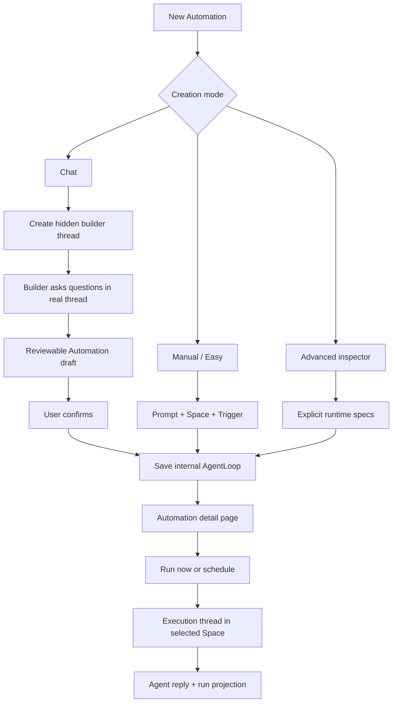

# Prompt-first Automations

## Summary

The AgentLoop foundation established the durable runtime object for recurring and manual agent work. The next product step is to make that foundation feel like Automations: a prompt-first product object that runs in a real Space and produces real thread activity, while advanced loop mechanics stay available but out of the user's way.

This plan keeps `AgentLoop` as the internal compatibility construct and user-facing API substrate for now. The product surface, documentation, navigation, and mental model become **Automations**. Users create Automations through three modes:

1. **Chat**: default path. A hidden builder thread in a system-managed Space asks clarifying questions, prepares a reviewable draft, and creates the Automation only after confirmation.
2. **Manual / Easy**: prompt, Space, and trigger. The system derives the internal goal, judge, worker, and policy defaults.
3. **Advanced**: an inspector side panel for explicit goal, judge, trigger, evidence, and policy controls.

The detail page should present the Automation as a prompt document with a compact status rail. Runs should execute in the configured Space through first-class thread conversation activity. Run inspector screens remain useful for debugging, but they are secondary to the conversation thread.

## Requirements Trace

Source requirements come from `docs/brainstorms/2026-06-22-thnk-46-agent-loop-definition-requirements.md`.

- R1-R3: Use "Automation" in product UI/docs while preserving AgentLoop internally.
- R4-R6: Prompt-first Automation object with first-class run history.
- R7, R22: Chat builder uses a real hidden thread in a real Space without polluting normal navigation.
- R8-R11: Creation supports Chat, Manual / Easy, and Advanced modes.
- R12-R16: Easy mode creates from prompt, Space, and trigger, including prompts without explicit goal criteria.
- R17-R21: Advanced settings stay available but are progressively disclosed.
- R23-R27: Runs execute in selected Space as real thread activity.
- AE1-AE6: Preserve the internal AgentLoop runtime, scheduler, JudgeSpec, and run projection foundation.

## Product Decisions

### Preserve the Runtime, Replace the Product Surface

The prior foundation plan correctly made AgentLoop a durable runtime primitive. This plan should not undo that work. The implementation should add an Automation product layer over the existing runtime instead of introducing a second scheduler, a second run table, or a second worker dispatch path.

Rejected alternative: fully rename `AgentLoop` tables, GraphQL types, and package names in this phase. That would create high migration and codegen churn without improving the user experience. The better cut is to make every visible surface say Automation while preserving internal compatibility.

### Naming

- User-facing noun: **Automation**.
- Internal construct: `AgentLoop`.
- Database and existing GraphQL type names can remain `agent_loops` / `AgentLoop` in this phase to avoid risky broad renames.
- New user-visible docs, route labels, page titles, button labels, empty states, and error messages must say "Automation".
- If product-facing GraphQL aliases are added, they must wrap the existing AgentLoop resolvers and tables rather than fork the data model.

### Route Compatibility

The preferred user route should become `/settings/automations`, but `/settings/agent-loops` must continue to work during and after this phase.

Rationale:

- Existing bookmarks, docs, and local dev sessions already use `/settings/agent-loops`.
- Route compatibility is cheap compared with a broken settings surface.
- Product language can improve immediately even while internal route and component names are cleaned up incrementally.

### Creation Modes

Default creation opens Chat mode.

Chat mode:

- Starts or resumes a hidden builder thread.
- Uses a builder prompt that explains Automations briefly, then asks focused questions.
- Produces a reviewable draft containing name, prompt, Space, trigger, inferred goal, and inferred judge settings.
- Requires user confirmation before saving the Automation.
- Links the setup thread from the Automation detail page only.

Manual / Easy mode:

- Requires prompt, Space, and trigger.
- Saves directly.
- Hides worker selection.
- Uses the main tenant Agent as the worker.
- Uses deterministic server defaults for goal, judge, evidence, and policy when explicit goal criteria are missing.

Advanced mode:

- Is an inspector side panel, not the dominant new-automation route.
- Exposes current AgentLoop controls for operators who need them.
- Reuses the same save path and data model as Chat and Easy.
- Preserves current advanced capabilities while removing them from the default flow.

### Detail Page

The Automation detail page should not read like a serialized runtime object. It should read like:

- Left/main: title and prompt document.
- Right/status rail: active state, Space, trigger, next run, last run, last result, cost, and run button.
- Secondary sections: recent runs, linked setup thread, linked run threads.
- Advanced inspector: side panel for goal, judge, policy, evidence, and raw runtime metadata.

### Loop Designer Skill

Chat creation should use a ThinkWork-native loop-design skill rather than a one-off prompt hidden in application code.

`ksimback/looper` is a useful reference and candidate source for the first curated skill-library entry. It is MIT licensed and focuses on the exact missing layer: coaching a fuzzy loop idea into a reviewable loop design before execution. The implementation should pull this into the Skill Library as an **Automation Loop Designer** skill, preserving attribution and license notices, but adapting the language and output contract to ThinkWork:

- User-facing object: Automation.
- Output artifact: structured `AutomationDraft`, not `loop.yaml` as the primary product contract.
- Runtime target: existing AgentLoop save path and ThinkWork threads, not Looper's external Python runner.
- Verification taxonomy: programmatic, judge, and human criteria mapped into `JudgeSpec`, `goalSpec`, `sourceMetadata`, and future advanced inspector fields.
- Control rubric: max iterations, revision caps, no-progress stops, budget/time caps, and human checkpoints mapped into loop policy and source metadata.
- Privacy rubric: explicit disclosure when a reviewer/judge model or external tool would receive workspace context.
- Observability rubric: state/log expectations mapped to Automation run evidence and setup-thread history.

The skill should power Chat mode's interview and draft review. Easy mode should remain deterministic and form-based, but can reuse the same normalization and inference vocabulary. Advanced mode should expose the generated criteria and control settings for inspection and editing.

Do not vendor Looper's Claude-specific slash command as-is. The valuable part is the design rubric and artifact discipline; the ThinkWork integration should be a Skill Library seed that emits our draft contract.

## Scope Boundaries

### In Scope

- Product language correction from AgentLoops to Automations.
- Prompt-first create experience with Chat, Easy, and Advanced modes.
- Hidden builder thread support using existing Spaces and Threads infrastructure.
- Space selection for every Automation, defaulting to the tenant Agent default Space.
- Direct runs and scheduled runs continuing to create real execution threads in the selected Space.
- UI tests and resolver tests for the new creation and visibility behavior.
- Documentation updates for the new Automations product shape.

### Out of Scope

- Renaming database tables or fully migrating GraphQL type names away from `AgentLoop`.
- Replacing AWS Scheduler / EventBridge for scheduled execution.
- Adding n8n or a visual workflow canvas.
- Multi-worker loop graphs.
- Model-judge execution beyond current Phase 1 support.
- Full eval-runner unification with JudgeSpec beyond preserving the shared direction.
- Production deployment work.

### Deferred Follow-up Work

- Product-facing GraphQL alias layer if API consumers need `Automation` naming.
- Automation template management as a first-class settings surface.
- More advanced chat-builder extraction with structured tool calls if the initial implementation uses a deterministic review draft fallback.
- Bulk migration of old `AgentLoop` documentation and comments that are not visible to users.

## Existing Architecture Notes

The current implementation already has the right runtime spine:

- `packages/database-pg/graphql/types/agent-loops.graphql` defines `AgentLoop`, `AgentLoopRun`, `SaveAgentLoopInput`, and `TriggerAgentLoopRunInput`.
- `packages/api/src/graphql/resolvers/agent-loops/saveAgentLoop.mutation.ts` persists loop records, versions, specs, and schedule bindings.
- `packages/api/src/graphql/resolvers/agent-loops/triggerAgentLoopRun.mutation.ts` creates an execution thread and dispatches the loop.
- `packages/lambda/job-trigger.ts` does the same for scheduled runs.
- `packages/agent-loops-core/src/contracts.ts` owns trigger, goal, worker, judge, loop policy, and evidence contracts.
- `packages/api/src/lib/agent-loops/finalize-projection.ts` updates run projection from thread-turn outcomes and judgments.
- `apps/web/src/components/agent-loops/AgentLoopInventory.tsx`, `AgentLoopForm.tsx`, `AgentLoopDetail.tsx`, and `AgentLoopRunDetail.tsx` are the current web surfaces.

The main problem is not the substrate. The problem is that the first product surface exposes the substrate directly.

## High-Level Design

### Data Model Strategy

Reuse the existing `agent_loops` tables and versioned specs.

The prompt-first layer should pass around an Automation draft before saving. The draft is not a new persisted product model unless implementation needs short-lived server state for Chat mode. It is a contract with these fields:

- `name`: proposed display name.
- `prompt`: the user-authored Automation instruction.
- `spaceId`: execution Space.
- `trigger`: manual or schedule trigger draft.
- `goal`: explicit or inferred objective and completion criteria.
- `judge`: explicit or inferred self-check criteria.
- `advanced`: optional policy/evidence overrides.
- `source`: creation mode, builder thread ID, preset/template ID, and inference flags.

Prompt-first data should be represented through existing fields where possible:

- `goalSpec.objective`: normalized prompt or inferred objective.
- `goalSpec.completionCriteria`: inferred criteria or a deterministic "runtime completion inferred from agent outcome" criterion.
- `judgeSpec`: self-check default with generated criteria.
- `workerSpec`: main tenant Agent.
- `sourceMetadata`: creation mode, builder thread ID, prompt text, inference state, preset/template ID when present.
- `space_id`: selected Automation execution Space.

Do not make `completionCriteria` nullable in the core contract unless implementation proves that deterministic criteria are insufficient. The current core normalizer expects non-empty criteria, and preserving that invariant reduces scheduler and judge risk.

For new Chat and Easy saves, the selected default Space should be sent and persisted explicitly. Backend fallback to the tenant Agent default Space is only a compatibility path for older callers or incomplete payloads.

### Hidden Builder Space Strategy

Use existing `spaces` and `threads` instead of adding a parallel setup-conversation system.

Create or reuse a system-managed Space with:

- `template_key`: `system:automation_builder`
- `access_mode`: private
- `config.visibility`: `system_hidden`
- `status`: active

The helper must be tenant-scoped and idempotent. It should find the existing system builder Space by stable metadata before creating one, and creation should be safe under concurrent "New Automation" clicks.

Create hidden builder threads with:

- `metadata.systemHidden`: true
- `metadata.purpose`: `automation_builder`
- `metadata.creationMode`: `chat`
- participant access for the creating user

Normal thread list and search resolvers must exclude these hidden threads. Direct thread lookup should still work for explicit participants so the Automation detail page can link to setup history.

Rejected alternatives:

- Public system Space: easier to query, but too likely to leak builder threads into navigation and search.
- Client-only filtering: easy to implement, but unsafe because hidden threads could still leak through alternate thread queries or future UI surfaces.
- Separate setup-conversation table: cleaner isolation, but it would bypass the real thread model that the product intentionally wants to reuse.

## Open Questions

### Resolved During Planning

- **Should AgentLoop be renamed everywhere now?** No. The product surface becomes Automations; internal AgentLoop names remain for compatibility.
- **Should Chat setup use fake local wizard state?** No. Chat setup uses a real hidden thread in a real Space so it can be inspected later from the Automation detail page.
- **Should prompt-only Automations be blocked when there is no explicit goal?** No. They should save with inferred/default goal and judge metadata, then let runtime evidence and Advanced inspection make the inference visible.
- **Should default creation expose a worker picker?** No. The worker is the main tenant Agent in this phase.

### Deferred to Implementation

- Exact GraphQL shape for Chat builder start/confirm can be a new mutation pair or a thin extension of existing AgentLoop mutations, as long as it accepts/returns the Automation draft contract above, preserves the data model, and confirms before save.
- Exact builder prompt wording can iterate during implementation, but it must produce a reviewable draft and ask focused questions rather than dumping the Advanced form into chat.
- Exact route-tree mechanics can be chosen during implementation, but the visible preferred route must be `/settings/automations` and the old route must remain compatible.
- Exact deterministic fallback criteria text can be chosen during implementation, but it must be stable, testable, and marked as inferred metadata.

## Implementation Units

### Unit 1: Product Language and Route Compatibility

Goal: finish the visible product rename while preserving internal compatibility.

Tasks:

- Update user-facing strings from "AgentLoop" / "AgentLoops" to "Automation" / "Automations".
- Add `/settings/automations` as the preferred route if route-tree churn is small; keep `/settings/agent-loops` as a redirect or compatibility alias.
- Remove advanced substrate language from inventory hero copy.
- Update docs to describe Automations as the product object backed by AgentLoop internals.
- Add a short supersession note to the prior solution doc so future work does not re-expose AgentLoop naming by accident.

Likely files:

- `apps/web/src/components/agent-loops/AgentLoopInventory.tsx`
- `apps/web/src/components/agent-loops/AgentLoopDetail.tsx`
- `apps/web/src/components/agent-loops/AgentLoopRunDetail.tsx`
- `apps/web/src/components/shell/ChatSidebar.tsx`
- `apps/web/src/routes/_authed/settings.agent-loops.index.tsx`
- `apps/web/src/routes/_authed/settings.agent-loops.$agentLoopId.tsx`
- `docs/src/content/docs/applications/admin/automations.mdx`
- `docs/solutions/architecture-patterns/agent-loop-foundation-2026-06-22.md`

Verification:

- Existing web component tests continue to pass.
- Add or update assertions that visible navigation and headings say Automations.
- Direct navigation to `/settings/agent-loops` still reaches the Automations surface.
- Direct navigation to `/settings/automations` reaches the same surface.

### Unit 2: Prompt-First Draft Normalization

Goal: make prompt-first creation a server-recognized path that still produces valid AgentLoop specs.

Tasks:

- Add a small `automation-draft` helper that converts prompt, Space, trigger, and optional inferred answers into existing AgentLoop specs.
- Default worker to the main tenant Agent. Do not expose worker choice in Easy mode.
- Default judge to self-check.
- If the user prompt does not contain clear completion criteria, generate a stable fallback criterion and mark `sourceMetadata.goalInference` as `runtime_inferred`.
- Preserve explicit Advanced criteria when provided.
- Ensure `spaceId` defaults to the tenant Agent default Space in the UI and is sent explicitly for new Chat/Easy saves.
- Keep backend default-Space fallback only for legacy or incomplete callers.
- Keep the existing `saveAgentLoop` mutation compatible for Advanced/internal callers.

Approach notes:

- Treat Easy and Chat as draft-producing clients of the existing save path, not as separate persistence models.
- Normalize on the server as well as the client so future mobile/CLI/API callers cannot bypass required defaults.
- Keep inferred defaults visible in `sourceMetadata` so the Advanced inspector can explain what the system chose.

Likely files:

- `packages/api/src/lib/agent-loops/automation-draft.ts`
- `packages/api/src/lib/agent-loops/automation-draft.test.ts`
- `packages/api/src/graphql/resolvers/agent-loops/saveAgentLoop.mutation.ts`
- `packages/agent-loops-core/src/contracts.ts`
- `apps/web/src/components/agent-loops/agent-loop-types.ts`
- `apps/web/src/components/agent-loops/agent-loop-utils.ts`

Verification:

- Unit tests for prompt-only draft, explicit goal draft, scheduled draft, and missing default Space.
- Resolver test proving Easy-mode payload saves a valid loop without user-authored criteria.
- Existing Advanced save behavior remains compatible.

### Unit 3: Hidden Builder Threads

Goal: support real setup conversations without showing builder threads in normal navigation.

Tasks:

- Add helper logic to create or find the system-managed Automation Builder Space.
- Extend thread creation helpers or add an Automation-specific helper to attach metadata and participants.
- Exclude hidden builder threads from `threads` and `threadsPaged` list/search resolvers.
- Preserve direct thread access for explicit participants.
- Add metadata to builder threads linking them to draft/Automation IDs when available.
- Ensure ChatSidebar does not need fragile client-only filtering to hide system threads.
- Ensure hidden builder Space and thread activity do not contribute to visible Space sections or unread counts unless a future product decision explicitly exposes them.

Approach notes:

- Hidden builder thread filtering belongs in API list/search resolvers, not only in web UI.
- Direct thread lookup must still enforce existing tenant and participant access.
- The system Space should be created lazily by the builder start path to avoid a manual migration requirement for existing tenants.
- The builder Space helper should be concurrency-safe and tenant-scoped.

Likely files:

- `packages/database-pg/src/lib/thread-helpers.ts`
- `packages/database-pg/src/lib/thread-helpers.test.ts`
- `packages/api/src/graphql/resolvers/threads/threads.query.ts`
- `packages/api/src/graphql/resolvers/threads/threadsPaged.query.ts`
- `packages/api/src/graphql/resolvers/threads/thread.query.ts`
- `packages/api/src/graphql/resolvers/threads/threadsPaged.query.test.ts`
- `apps/web/src/components/shell/ChatSidebar.tsx`

Verification:

- Resolver tests show hidden builder threads are absent from sidebar/search queries.
- Direct thread query works for the creating user.
- Direct thread query rejects unrelated users.

### Unit 4: Chat Creation Mode

Goal: make the default New Automation path a guided chat builder.

Tasks:

- Add a ThinkWork-native **Automation Loop Designer** skill to the Skill Library, adapted from `ksimback/looper` with MIT attribution and license preservation.
- Convert Looper's goal, verification, council, control, privacy, and observability rubrics into the skill's interview and draft-generation instructions.
- Make the skill emit a structured `AutomationDraft` payload that maps cleanly to `goalSpec`, `judgeSpec`, `loopPolicy`, `sourceMetadata`, and the selected Space/trigger.
- Do not expose Looper's external Python runner as the primary path; ThinkWork remains the durable orchestrator.
- Add a mutation or helper action to start/resume an Automation builder thread.
- Add a web Chat mode shell that opens the builder thread and shows draft state.
- Seed the builder thread with the Automation Loop Designer skill prompt.
- Let the builder ask clarifying questions and collect answers in the thread.
- Produce a reviewable draft with name, prompt, Space, trigger, inferred goal, and inferred judge settings.
- Require confirmation before save.
- After confirmation, save the Automation and link `sourceMetadata.builderThreadId`.

Approach notes:

- The builder thread is setup history, not the execution thread. Execution still happens through run threads in the selected Automation Space.
- The review draft is the contract between chat and save. It should be serializable and testable without relying on UI-only state.
- If the model cannot infer a crisp goal, the draft should say that explicitly and use runtime-inferred defaults.
- Saving an Automation from Chat should not archive or delete the builder thread; it remains linked setup history from the detail page.
- The imported skill is product scaffolding, not runtime orchestration. The durable execution path remains AgentLoop runs, scheduled jobs, and thread wakeups.

Likely files:

- `tenants/<tenant-slug>/skill-catalog/automation-loop-designer/SKILL.md`
- `packages/system-workspace` skill-library seed files if the repo keeps curated seed skills there.
- `packages/database-pg/graphql/types/agent-loops.graphql`
- `packages/api/src/graphql/resolvers/agent-loops/startAutomationBuilder.mutation.ts`
- `packages/api/src/graphql/resolvers/agent-loops/confirmAutomationDraft.mutation.ts`
- `packages/api/src/lib/agent-loops/automation-builder.ts`
- `packages/api/src/lib/agent-loops/automation-builder.test.ts`
- `apps/web/src/components/agent-loops/AutomationBuilderChat.tsx`
- `apps/web/src/components/agent-loops/AutomationDraftReview.tsx`
- `apps/web/src/lib/graphql-queries.ts`

Verification:

- Web test proves New Automation defaults to Chat mode.
- Web test proves Chat mode creates or resumes a hidden builder thread.
- Skill-library test or snapshot proves the Automation Loop Designer skill is installed/seeded with preserved Looper attribution and emits the expected draft shape.
- API test proves confirming a draft creates an Automation linked to the builder thread.
- If GraphQL changes, run schema build and codegen for every affected consumer.

### Unit 5: Easy Mode and Advanced Inspector

Goal: replace the current advanced-first form with a simple prompt-first form and side-panel advanced controls.

Tasks:

- Split current `AgentLoopForm` into smaller components:
  - Chat launcher / builder view.
  - Easy form.
  - Advanced inspector side panel.
  - Preset/template side sheet.
- Easy form fields: prompt, Space, trigger, active toggle when useful.
- Remove worker selection from Easy and default creation.
- Replace inline preset section with an icon button that opens the preset/template side sheet.
- Selecting a preset prefills prompt, trigger, and advanced draft values, then returns to the selected creation mode.
- Keep Advanced capable of editing goal criteria, judge criteria, evidence policy, and loop policy.

Likely files:

- `apps/web/src/components/agent-loops/AgentLoopForm.tsx`
- `apps/web/src/components/agent-loops/AutomationEasyForm.tsx`
- `apps/web/src/components/agent-loops/AutomationAdvancedInspector.tsx`
- `apps/web/src/components/agent-loops/AutomationPresetSheet.tsx`
- `apps/web/src/components/agent-loops/agent-loop-utils.ts`
- `apps/web/src/components/agent-loops/AgentLoopForm.test.tsx`

Verification:

- Easy mode can save prompt + default Space + manual trigger.
- Scheduled Easy mode requires a schedule value.
- Worker selection is not visible in Easy mode.
- Advanced inspector still saves explicit criteria and policy fields.
- Preset side sheet prefills draft data.

### Unit 6: Prompt Document Detail Page

Goal: redesign Automation detail so it reads as a user-owned prompt with status, not a runtime dump.

Tasks:

- Replace stacked runtime cards with a two-column prompt/detail layout.
- Main column: title, prompt, editable description if supported, recent run thread links.
- Status rail: status, Space, trigger, next run, last ran, last result, cost, run button, pause/resume.
- Move goal, judge, policy, evidence, worker, raw JSON, and version details into an Advanced inspector side panel.
- Show the hidden builder setup thread link only from this detail page.
- Keep run inspector accessible from recent runs, but make the execution thread the primary CTA.

Likely files:

- `apps/web/src/components/agent-loops/AgentLoopDetail.tsx`
- `apps/web/src/components/agent-loops/AutomationStatusRail.tsx`
- `apps/web/src/components/agent-loops/AutomationAdvancedInspector.tsx`
- `apps/web/src/components/agent-loops/AutomationRunsList.tsx`
- `apps/web/src/components/agent-loops/AgentLoopRunDetail.tsx`
- `apps/web/src/components/agent-loops/AgentLoopDetail.test.tsx`

Verification:

- Detail page displays prompt and compact status rail.
- Advanced fields are hidden until the inspector opens.
- Builder setup thread link appears only when metadata exists.
- Run thread link is visible when a run has `threadId`.

### Unit 7: Execution Thread Parity and End-to-End Validation

Goal: prove prompt-first Automations run through real thread activity in the configured Space.

Tasks:

- Ensure manual and scheduled run paths continue to use `space_id` / selected Space.
- Ensure thread creation includes enough metadata to connect run, Automation, and Space.
- Verify wakeup payload parity with direct chat expectations.
- Add tests around `thread_id`, `space_id`, and visible assistant reply projection.
- Run local dev server and browser validation after implementation.

Likely files:

- `packages/api/src/graphql/resolvers/agent-loops/triggerAgentLoopRun.mutation.ts`
- `packages/lambda/job-trigger.ts`
- `packages/api/src/lib/agent-loops/finalize-projection.ts`
- `packages/api/src/graphql/resolvers/agent-loops/triggerAgentLoopRun.mutation.test.ts`
- `packages/lambda/job-trigger.test.ts`
- `apps/web/src/components/agent-loops/AgentLoopRunDetail.tsx`

Verification:

- Manual run creates a thread in the configured Space.
- Scheduled run creates a thread in the configured Space.
- Run projection updates status after the thread turn completes.
- Browser validation shows the execution thread conversation, not only a run-evaluation screen.

### Unit 8: Documentation, Codegen, and Release Readiness

Goal: make the new product shape durable for users and future implementers.

Tasks:

- Update docs to describe Automations, Chat creation, Easy mode, Advanced inspector, Spaces, and run threads.
- Document the Automation Loop Designer skill, including Looper attribution/license if the skill is derived from or vendors Looper content.
- Update screenshots or descriptions that still show AgentLoops.
- Rebuild GraphQL schemas and generated clients if schema changes are made.
- Add migration notes if hidden builder Space is created lazily.
- Update the THNK-46 issue with the plan link and implementation phase summary.

Likely files:

- `docs/src/content/docs/applications/admin/automations.mdx`
- `docs/brainstorms/2026-06-22-thnk-46-agent-loop-definition-requirements.md`
- `docs/solutions/architecture-patterns/agent-loop-foundation-2026-06-22.md`
- `terraform/schema.graphql`
- `apps/web/src/gql/graphql.ts`
- `apps/cli/src/gql/graphql.ts`
- `apps/mobile/src/gql/graphql.ts`
- `packages/api/src/gql/graphql.ts`

Verification:

- `pnpm schema:build` if GraphQL source changes.
- `pnpm --filter @thinkwork/web codegen` and other consumer codegen scripts when needed.
- Focused unit/component tests first, then broader affected package checks.
- Local web validation on port 5174 with copied `.env` if using a worktree.

## System-Wide Impact

### Web App

- Settings navigation and routes gain Automation naming and route compatibility.
- Creation changes from one advanced form to three modes.
- Detail changes from runtime-card layout to prompt/status layout.
- Sidebar/search must not show hidden builder threads.
- Run thread navigation becomes the primary way to inspect execution.

### GraphQL and API

- Existing AgentLoop mutations remain the compatibility layer.
- New or extended mutations may be needed for builder start/confirm and prompt-first draft normalization.
- Thread list/search resolvers must understand system-hidden metadata.
- Direct thread lookup must continue to enforce existing access rules.
- GraphQL codegen must run for every consumer if schema source changes.

### Database

- No new Automation table is planned.
- Existing `spaces.config`, `spaces.template_key`, and `threads.metadata` can carry system-hidden semantics.
- If implementation needs new indexes for hidden-thread filtering or metadata lookup, that should be added as a focused migration with resolver tests proving the query shape.

### Runtime and Scheduling

- Manual and scheduled runs continue through existing dispatcher and wakeup paths.
- Prompt-first defaults must produce valid `GoalSpec`, `JudgeSpec`, `WorkerSpec`, and policy values before dispatch.
- Wakeup payload parity matters because scheduled Automations must behave like direct/manual runs once execution reaches the agent.
- Builder threads and execution threads are different lifecycle objects. Builder threads live in the hidden system Space; execution threads live in the selected Automation Space.

### Security and Access

- Hidden builder threads are user data and must remain tenant-scoped.
- Hidden does not mean unauthenticated. The creating user should be an explicit participant, and unrelated users should not be able to fetch the thread directly.
- Client-only hiding is not sufficient for privacy or product correctness.

### Documentation

- Public/admin docs should teach Automations, not AgentLoops.
- Internal solution docs should record that AgentLoop remains the backing runtime so future contributors do not remove compatibility unintentionally.

## Test Strategy

Start with the smallest tests that prove behavior:

- Core draft normalization tests.
- API resolver tests for saving Easy Automations and hidden thread filtering.
- Web component tests for creation modes and detail layout.

Then run broader checks for affected packages:

- `pnpm --filter @thinkwork/api test`
- `pnpm --filter @thinkwork/web test`
- `pnpm --filter @thinkwork/web typecheck`
- `pnpm --filter @thinkwork/database-pg typecheck`

Before PR, run the repo's normal pre-commit-equivalent checks if the implementation footprint crosses package boundaries:

- `pnpm lint`
- `pnpm typecheck`
- `pnpm test`
- `pnpm format:check`

End-to-end validation should include:

- New Automation opens in Chat mode.
- Chat mode creates a hidden builder thread.
- Builder thread does not appear in sidebar or normal search.
- Confirmed draft creates an Automation.
- Easy mode creates an Automation with prompt, Space, and trigger only.
- Automation runs in the configured Space and surfaces a real thread reply.
- Detail page shows prompt/status first and advanced settings only in the side panel.

## Risks

### Hidden Threads Leaking Into Navigation

Risk: builder threads appear in the sidebar or search, creating clutter and confusing users.

Mitigation: filter at resolver level using thread metadata and system Space config. Add tests for sidebar/search resolvers.

### Direct Thread Access Breaking

Risk: hiding builder threads also prevents users from reopening setup history from detail.

Mitigation: use private system Space plus explicit thread participants. List queries hide; direct lookup still respects participant access.

### Easy Mode Produces Weak Judge Criteria

Risk: prompt-only Automations save with generic criteria that are not useful.

Mitigation: store inference metadata, make Advanced criteria easy to inspect, and let Chat mode improve criteria through questions. Preserve valid core invariants even when criteria are inferred.

### Product/API Naming Drift

Risk: internal `AgentLoop` names leak back into UI because component and GraphQL names remain.

Mitigation: test visible copy, update docs, and add supersession note to the foundation solution doc.

### Route Churn

Risk: renaming routes from `/settings/agent-loops` to `/settings/automations` breaks existing links.

Mitigation: add the new route as preferred, keep the old route as a compatibility redirect/alias.

### Builder Implementation Complexity

Risk: a fully agentic builder with structured tool extraction is larger than the UI work.

Mitigation: define the durable builder thread, review draft, and confirm-save contract first. Use deterministic normalization as fallback so Chat and Easy can ship without blocking on perfect extraction.

## Rollout Plan

1. Land product language and docs correction.
2. Land prompt-first normalization and Easy save behavior.
3. Land hidden builder threads and list filtering.
4. Land Chat builder creation flow.
5. Land detail page redesign.
6. Validate a real Automation run end to end in local dev.
7. Ship via normal PR and CI flow.

Each unit should be independently reviewable. Units 2 and 3 are the backend foundations for the user-visible Chat and detail work; avoid merging the Chat UI before hidden-thread filtering is verified.

## Implementation Notes

- Preserve the existing AgentLoop dispatcher and run projection path.
- Prefer adding thin Automation-oriented helpers over duplicating AgentLoop resolver logic.
- Do not create a second automation table.
- Do not expose worker selection in default creation.
- Treat Space as required in the user flow.
- Default Space comes from Agent settings.
- Keep Advanced available for operators, but do not let it dominate the default path.
- Update docs and tests in the same PR as user-facing behavior changes.
