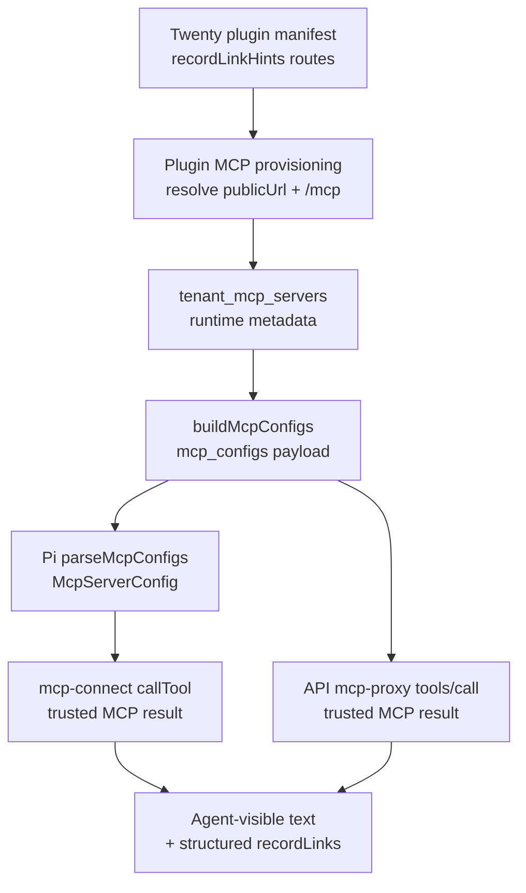

# feat: MCP record link hints

## Overview

Twenty CRM MCP tools can return real CRM object ids, but the Pi runtime does not
receive the non-secret browser URL contract needed to turn those ids into
usable record links. This plan adds an internal MCP record-link hint contract,
stores vetted plugin-provided hints outside auth config, threads those hints
through the existing `mcp_configs` dispatch seam, and lets the Pi MCP adapter
and API MCP proxy decorate authenticated Twenty MCP results with deterministic
links.

The first target is the plugin-owned `twenty--crm` server. The design stays
provider-neutral at shared boundaries, keeps Twenty-specific route knowledge
inside the Twenty plugin package, and preserves the existing current-user OAuth
gate: no Twenty links are generated unless the current turn has an authorized
Twenty MCP tool result.

---

## Problem Frame

The user-visible failure is that an agent can answer from Twenty CRM data and
print an Opportunity ID, then fails when asked for the link. It says it lacks a
tool to get a web URL and asks the user for the workspace URL. The root cause is
not a failed MCP read. It is a context handoff gap: `buildMcpConfigs` emits only
server name, MCP endpoint URL, auth, transport, and tools, and Pi parses only
those fields. The MCP endpoint URL (`https://<crm-host>/mcp`) is treated as a
transport endpoint, not as a browser-origin plus record-route contract.

This used to work in narrower paths because the native Twenty webhook logic
canonicalizes Opportunity URLs into `/object/opportunity/<id>#<workspaceId>`.
That webhook path helps CRM-launched onboarding work, but ad hoc chat queries
through MCP only see object ids. The fix should make link context available at
the same runtime layer that sees authenticated MCP results, rather than relying
on model guessing or prompt-only instructions.

---

## Requirements Trace

- R1. When an authorized Twenty MCP tool result includes a supported CRM record
  id, the agent has a grounded browser URL for that record, can include it in
  the answer, and deployed verification proves the URL opens the intended
  record for an authorized user.
- R2. Record-link hints are non-secret runtime metadata, not OAuth/auth config,
  and changing them must not silently alter the user credential contract.
- R3. Twenty-specific URL patterns live at the Twenty plugin boundary; shared
  API/runtime code only handles a provider-neutral record-link hint shape.
- R4. Link generation uses only ids observed in the current authenticated MCP
  tool result, not arbitrary ids supplied by a user message.
- R5. The dispatch path works for direct chat and resumed/wakeup turns because
  it rides the shared `mcp_configs` runtime-config seam.
- R6. Unknown, malformed, unsupported, or custom object results degrade by
  omitting generated links instead of emitting guessed or broken URLs.
- R7. Verification proves the deployed ThinkWork + Twenty plugin path, not only
  manifest validation, tools/list, or local unit tests.
- R8. Generated CRM record ids, names, and URLs are treated as thread-visible
  business data. Existing thread visibility governs who can read them, and
  diagnostics/logs must not persist raw CRM payloads or record links outside the
  intended thread/tool-result storage.
- R9. Existing installed Twenty tenants receive record-link metadata through a
  versioned plugin upgrade or explicit repair/backfill path without requiring
  users to reinstall or re-authorize OAuth.
- R10. User-facing MCP call paths that consume `buildMcpConfigs`, including the
  mobile/API `mcp-proxy` path, either reuse the same enrichment behavior or have
  an explicit scope exclusion and verification note.

---

## Scope Boundaries

- This plan does not add tenant-wide or admin fallback credentials for Twenty
  CRM.
- This plan does not build a generic cross-CRM linking system for Salesforce,
  HubSpot, Attio, or custom CRMs.
- `recordLinkHints` is a first-party/internal runtime extension for the Twenty
  v1 repair, not a public marketplace plugin contract. Treat public third-party
  author support as follow-up product work after another provider needs it.
- This plan does not claim full Twenty native app status writeback or embedded
  Twenty panels.
- This plan does not require a broad ThinkWork CRM UI change; the user-visible
  fix is in agent answers/tool results.
- This plan does not persist generated record links to `crm_work_links` for ad
  hoc chat queries. That table remains for durable workflow links.

### Deferred to Follow-Up Work

- Full custom object support: add only after live Twenty route patterns and MCP
  result shapes are verified for those objects.
- UI rendering of structured `recordLinks` in thread activity rows: this plan
  preserves structured details, but the first user-facing target is the agent's
  answer text.

---

## Context & Research

### Relevant Code and Patterns

- `plugins/twenty/src/manifest.ts` declares the `twenty` plugin's `crm`
  MCP component with `endpointFrom` managed app `publicUrl` plus `/mcp`.
- `packages/api/src/lib/plugins/handlers/mcp.ts` resolves `endpointFrom`,
  provisions or repairs `tenant_mcp_servers`, and currently records only
  `resolvedEndpointUrl` in component `handler_ref`.
- `packages/database-pg/src/schema/mcp-servers.ts` has MCP auth, ownership, and
  tools fields, but no durable non-secret runtime metadata field.
- `packages/api/src/lib/mcp-configs.ts` builds the runtime `McpServerConfig`
  payload and currently emits no app origin or record-route metadata.
- `packages/api/src/handlers/mcp-proxy.ts` also consumes `buildMcpConfigs` for
  mobile-facing MCP calls but currently forwards raw MCP call results without
  Pi's `mcp-connect.ts` enrichment layer.
- `packages/api/src/lib/resolve-agent-runtime-config.ts` is the shared runtime
  config helper used by dispatch paths; changes here are preferable to one-off
  chat-only payload fields.
- `packages/agentcore-pi/agent-container/src/server.ts` parses `mcp_configs`
  and currently drops unknown metadata.
- `packages/agentcore-pi/agent-container/src/mcp.ts` and
  `packages/agentcore-pi/agent-container/src/mcp-connect.ts` define the MCP
  tool wiring and are the right layer to enrich MCP results without exposing
  OAuth bearers.
- `plugins/twenty/twenty-app/src/logic-functions/thinkwork-webhook.logic-function.ts`
  already normalizes Opportunity URLs to `/object/opportunity/<id>` and appends
  a workspace hash when a workspace id is available.

### Institutional Learnings

- `docs/solutions/architecture-patterns/managed-app-mcp-oauth-lifecycle-2026-06-06.md`
  says managed app infrastructure and per-user MCP OAuth are coupled but
  separate state machines. Keep current-user OAuth strict; do not introduce a
  tenant credential fallback to make CRM reads or links easier.
- `docs/solutions/architecture-patterns/plugin-source-boundaries-package-owned-deploy-verified-2026-06-17.md`
  says plugin-specific behavior belongs under `plugins/<plugin-key>/`, while
  shared code should expose generic extension points.
- `docs/solutions/architecture-patterns/runtime-swap-tool-parity-and-record-contract.md`
  says runtime-visible tool record shapes are contracts. If link hints live
  only in raw MCP details, they may not survive into the agent-visible answer or
  future UI consumers.
- `docs/solutions/architecture-patterns/wakeup-processor-payload-parity-with-chat-agent-invoke-2026-06-12.md`
  says payload-gated runtime capabilities must work for wakeup/resume turns,
  not just first direct chat turns.
- `docs/solutions/integration-issues/twenty-crm-email-ses-config-2026-06-06.md`
  warns that health checks and login do not prove a Twenty capability works.
  Record links require a deployed agent-level proof.

### External References

- No new external research is required for the shared ThinkWork contracts. The
  only uncertain external behavior is exact Twenty route coverage beyond
  Opportunity; this plan treats unverified object routes as implementation-time
  checks and suppresses links when uncertain.

---

## Key Technical Decisions

- **Use a generic `recordLinkHints` runtime contract:** Shared code should know
  how to carry and apply hints, but not hardcode Twenty object routes. For v1,
  this is an internal first-party extension, not a public plugin-author
  contract.
- **Do not add a generic base URL source abstraction yet:** Static route/object
  hints can live in the Twenty manifest, while the browser base URL is derived
  during provisioning from the already-resolved managed app `publicUrl` used by
  `endpointFrom`. Add a generic source resolver only after a second plugin needs
  a different source rule.
- **Store hints outside `auth_config`:** `auth_config` participates in OAuth
  resource resolution and URL-hash approval. Link metadata belongs in a
  separate non-secret runtime metadata path so route-copy changes do not look
  like credential changes.
- **Govern runtime metadata mutations explicitly:** Because record-link metadata
  will not trigger OAuth approval/hash drift, store enough metadata source and
  version information to audit repairs, log metadata changes, and disable or
  roll back bad hints without touching user OAuth.
- **Generate links only from trusted tool results:** The runtime should enrich
  ids returned by the authenticated MCP call, not ids from arbitrary user text
  or prior conversation context.
- **Expose generated links in both text and structured details:** Agent-visible
  result text prevents the model from guessing; structured details preserve an
  audit/UI path.
- **Use existing thread visibility as the audience boundary:** Generated links
  in assistant text and `details.recordLinks` are visible wherever the thread or
  tool result is visible. Twenty still enforces click-through access in its own
  app, but ThinkWork should treat record ids, names, and URLs as business data
  and avoid logging them outside intended thread/tool-result persistence.
- **Ship with conservative Twenty route coverage:** Opportunity is known from
  existing code. Company/person routes can be included only when verified
  against live or fixture evidence; otherwise omit rather than guess.
- **Treat hashless URLs as unshipped until validated:** The native app has
  `TWENTY_WORKSPACE_ID`, but the MCP plugin path currently does not. If
  `https://<host>/object/opportunity/<id>` does not reliably open the record
  without `#<workspaceId>`, add a non-secret workspace id source to the managed
  app/plugin metadata before enabling link generation.

---

## Open Questions

### Resolved During Planning

- Should this be prompt-only or runtime metadata? Runtime metadata. Prompt-only
  instructions would still make the model infer a URL pattern without grounded
  data.
- Should link hints live in `auth_config`? No. That mixes display/runtime
  metadata with auth and changes approval-hash semantics.
- Should the runtime create links for any UUID the user names? No. Links should
  be created only for ids observed in authenticated MCP results.

### Deferred to Implementation

- Exact Twenty route list beyond Opportunity: verify Company and Person route
  patterns against real Twenty behavior or package fixtures before enabling
  them.
- Exact extractor coverage for MCP result shapes: implement conservatively
  against observed Twenty structured content/text JSON shapes and expand only
  with tests.
- Final database migration number/name: use the next available Drizzle
  migration at implementation time.

---

## High-Level Technical Design

> _This illustrates the intended approach and is directional guidance for review, not implementation specification. The implementing agent should treat it as context, not code to reproduce._

The critical trust boundary is between `Tool` and `Answer`: the link enricher
only uses records extracted from the current MCP response returned by the
authorized server. It should not scan arbitrary conversation text for UUIDs.

---

## Implementation Units

- U1. **Add Provider-Neutral Record-Link Hint Contract**

**Goal:** Define the non-secret record-link hint shape and a durable storage
location that plugin provisioning can write and runtime dispatch can read.

**Requirements:** R2, R3, R5

**Dependencies:** None

**Files:**

- Modify: `plugins/catalog/src/contracts.ts`
- Modify: `plugins/catalog/src/__tests__/contracts.test.ts`
- Modify: `packages/database-pg/src/schema/mcp-servers.ts`
- Create: `packages/database-pg/drizzle/<next>_tenant_mcp_runtime_metadata.sql`
- Test: `packages/database-pg/__tests__/<migration-test>.test.ts`

**Approach:**

- Add a typed optional record-link hint field to MCP server components. Keep it
  provider-neutral but narrow: route templates, supported object types,
  id-field guidance, metadata version/source, and optional workspace/hash
  metadata. Do not add a generic base URL source resolver in this unit.
- Add a non-secret JSONB metadata column to `tenant_mcp_servers`, named around
  runtime metadata rather than auth. This avoids abusing `auth_config` or
  `tools`.
- Validate hints as static route templates and safe object-type keys. Reject
  absolute route templates, query-bearing templates, or malformed placeholder
  shapes.
- Keep approval hash behavior anchored to URL/auth config. Link-copy/route
  metadata should be governed by plugin version/install repair, explicit
  metadata version/source, and operator-visible repair logs, not MCP OAuth
  approval drift.

**Execution note:** Start with contract and migration tests so later units have
an explicit pass-through target.

**Patterns to follow:**

- `plugins/catalog/src/contracts.ts` validation style for `endpointFrom`,
  `toolNotes`, and auth modes.
- `packages/database-pg/src/schema/mcp-servers.ts` JSONB schema pattern.
- Existing migration tests under `packages/database-pg/__tests__/`.

**Test scenarios:**

- Happy path: a manifest MCP component with valid record-link hints validates
  and preserves the hint object.
- Error path: a route template with an absolute URL, query string, missing id
  placeholder, or non-string object type fails manifest validation.
- Migration path: applying the migration adds the runtime metadata column with
  null/default behavior that does not invalidate existing MCP rows.
- Edge case: a component with no record-link hints remains valid and produces no
  runtime metadata.
- Governance path: metadata carries a source/version marker so repair changes
  are auditable without reclassifying them as OAuth approval changes.

**Verification:**

- Plugin catalog validation accepts only safe non-secret link hint metadata.
- Existing MCP rows can remain valid without backfilled metadata.

---

- U2. **Publish Twenty Record Hints During Plugin Provisioning**

**Goal:** Make the Twenty plugin declare its supported record routes and have
plugin MCP provisioning persist tenant-specific base URL metadata when
`endpointFrom` resolves.

**Requirements:** R1, R2, R3, R6, R9

**Dependencies:** U1

**Files:**

- Modify: `plugins/twenty/src/manifest.ts`
- Modify: `plugins/twenty/test/manifest.test.ts`
- Modify: `packages/api/src/lib/plugins/handlers/mcp.ts`
- Modify: `packages/api/src/lib/plugins/handlers/mcp.test.ts`
- Test: `plugins/twenty/test/manifest.test.ts`
- Test: `packages/api/src/lib/plugins/handlers/mcp.test.ts`

**Approach:**

- Publish a new Twenty plugin version for the hint change, preserve the
  existing pinned version in the catalog, and drive the existing plugin upgrade
  path rather than mutating `0.1.0` in place.
- Add Twenty-owned link hints to the new `crm` MCP component version. The first
  route must include Opportunity because existing native-app code already proves
  `/object/opportunity/<id>`.
- For Company and Person, either verify and add route templates during
  implementation or leave them disabled until fixture/live evidence confirms
  exact Twenty routes.
- During provisioning, combine static plugin hints with the resolved managed
  app public URL. Store the browser base URL separately from the MCP endpoint
  URL, require `https:` for deployed origins, and allow only explicit
  localhost/dev-test exceptions.
- Persist the same metadata on insert, repair, and manual-row adoption paths so
  existing installed tenants can be repaired idempotently.
- Add an explicit upgrade/backfill verification path for an already-installed
  Twenty plugin row: after upgrade or repair, the existing row has runtime
  metadata without forcing requester OAuth re-authorization.
- Do not hardcode or reuse the native app's default workspace id. Include
  workspace id only if it is explicitly present as non-secret managed app/plugin
  configuration.
- Before enabling hashless Opportunity links, verify that
  `https://<host>/object/opportunity/<id>` opens the intended record in the
  deployed Twenty app. If not, add the workspace id metadata source first.

**Patterns to follow:**

- `resolvePluginMcpEndpointContext` in
  `packages/api/src/lib/plugins/handlers/mcp.ts`.
- Existing endpointFrom tests in
  `packages/api/src/lib/plugins/handlers/mcp.test.ts`.
- Twenty native URL normalization in
  `plugins/twenty/twenty-app/src/logic-functions/thinkwork-webhook.logic-function.ts`.

**Test scenarios:**

- Happy path: provisioning `twenty--crm` from `publicUrl=https://crm.example.com`
  stores MCP URL `https://crm.example.com/mcp` and runtime record-link base URL
  `https://crm.example.com`.
- Rollout path: upgrading an install pinned to the previous Twenty version
  re-runs the MCP component handler and stores runtime metadata without
  re-authorizing requester OAuth.
- Edge case: `publicUrl` with path, query, hash, or trailing slash is normalized
  before runtime metadata is stored.
- Integration: adopting an existing manual row with the same URL updates the row
  with plugin ownership and record-link metadata.
- Error path: invalid `publicUrl` still fails before any metadata is written.
- Error path: `http:` public URLs in deployed environments do not produce
  runtime record-link metadata.
- Edge case: missing workspace id produces routes without a hash fragment.
- Usability path: hashless Opportunity URLs are opened or resolved against the
  deployed Twenty app before they are accepted as shippable.

**Verification:**

- A provisioned Twenty plugin row contains non-secret record-link metadata
  derived from the managed app URL and no token material.

---

- U3. **Thread Link Hints Through API Runtime Config**

**Goal:** Include vetted record-link hints in `mcp_configs` for authorized MCP
servers without changing OAuth behavior or direct/wakeup dispatch parity.

**Requirements:** R1, R2, R4, R5, R10

**Dependencies:** U1, U2

**Files:**

- Modify: `packages/api/src/lib/mcp-configs.ts`
- Modify: `packages/api/src/lib/resolve-agent-runtime-config.ts`
- Modify: `packages/api/src/lib/__tests__/mcp-configs-plugin-auth.test.ts`
- Modify: `packages/api/src/lib/__tests__/mcp-configs-approved-filter.test.ts`
- Modify: `packages/api/src/lib/__tests__/resolve-agent-runtime-config.test.ts`
- Modify: `packages/api/src/handlers/wakeup-processor.dispatch-parity.test.ts`
- Test: `packages/api/src/lib/__tests__/mcp-configs-plugin-auth.test.ts`
- Test: `packages/api/src/lib/__tests__/mcp-configs-approved-filter.test.ts`
- Test: `packages/api/src/lib/__tests__/resolve-agent-runtime-config.test.ts`

**Approach:**

- Extend the API-side `McpServerConfig` type with optional record-link hints.
- Select runtime metadata from `tenant_mcp_servers` and pass only validated,
  non-secret fields into the returned config.
- Keep current auth gates unchanged. If a plugin MCP server is skipped because
  requester activation is missing, expired, revoked, or hash/approval fails,
  no link hints should reach Pi.
- Ensure direct chat and wakeup/resume dispatch paths continue using the same
  runtime config output instead of hand-copying new payload fields.
- Preserve URL dedupe behavior: if a plugin row wins over a direct row, its link
  hints travel with the winning plugin config.

**Execution note:** Add pass-through tests before changing runtime consumers;
this guards against the known "field exists but is dropped later" failure mode.

**Patterns to follow:**

- Existing plugin auth tests in
  `packages/api/src/lib/__tests__/mcp-configs-plugin-auth.test.ts`.
- Approval/hash filtering tests in
  `packages/api/src/lib/__tests__/mcp-configs-approved-filter.test.ts`.
- Dispatch parity guardrails in
  `docs/solutions/architecture-patterns/wakeup-processor-payload-parity-with-chat-agent-invoke-2026-06-12.md`.

**Test scenarios:**

- Happy path: an approved, enabled, plugin-owned Twenty row with active
  requester activation emits auth plus record-link hints.
- Error path: missing requester activation skips the MCP config entirely and
  emits no hints.
- Error path: URL hash mismatch or pending/rejected row skips the MCP config
  and emits no hints.
- Integration: runtime config output includes hints for both direct chat and
  wakeup/resume payload construction through the shared helper.
- Integration: `mcp-proxy` receives the same hint-bearing config from
  `buildMcpConfigs` for a caller with an active requester activation.
- Edge case: manual/direct MCP rows without metadata continue emitting the
  existing config shape.

**Verification:**

- Runtime configs contain link hints only when the matching MCP server itself
  is included for the current requester.

---

- U4. **Preserve Link Hints Inside Pi MCP Config Parsing**

**Goal:** Teach the Pi runtime to parse and carry record-link hints without
breaking bearer handle safety, header auth, or existing MCP tool registration.

**Requirements:** R1, R2, R5

**Dependencies:** U3

**Files:**

- Modify: `packages/agentcore-pi/agent-container/src/server.ts`
- Modify: `packages/agentcore-pi/agent-container/src/mcp.ts`
- Modify: `packages/agentcore-pi/agent-container/src/mcp-connect.ts`
- Modify: `packages/agentcore-pi/agent-container/tests/server.test.ts`
- Modify: `packages/agentcore-pi/agent-container/tests/mcp.test.ts`
- Modify: `packages/agentcore-pi/agent-container/tests/mcp-connect.test.ts`
- Test: `packages/agentcore-pi/agent-container/tests/server.test.ts`
- Test: `packages/agentcore-pi/agent-container/tests/mcp.test.ts`

**Approach:**

- Extend Pi's `McpServerConfig` and `ConnectMcpServerArgs` with optional
  record-link hints.
- Parse only safe hint fields from `payload.mcp_configs`; ignore malformed hint
  metadata instead of dropping the entire MCP server.
- Pass hints into `connectMcpServer` alongside URL, headers, server name,
  transport, registry, and tool whitelist.
- Keep bearer token handling unchanged. Hints must never include or serialize
  bearer material, and the existing handle-store tests should still prove that.

**Patterns to follow:**

- `parseMcpConfigs` in `packages/agentcore-pi/agent-container/src/server.ts`.
- `buildMcpTools` bearer-handle contract in
  `packages/agentcore-pi/agent-container/src/mcp.ts`.
- Existing MCP config tests in
  `packages/agentcore-pi/agent-container/tests/mcp.test.ts`.

**Test scenarios:**

- Happy path: `parseMcpConfigs` preserves valid record-link hints on a Twenty
  config.
- Edge case: malformed hint metadata is ignored while the MCP config remains
  usable.
- Security path: serialized tool definitions still do not contain bearer token
  fixtures after hints are added.
- Integration: `buildMcpTools` forwards hints to the connect factory without
  changing auth headers or transport selection.

**Verification:**

- Pi receives the same hints emitted by API runtime config and still passes the
  existing MCP auth-scrubbing contract tests.

---

- U5. **Enrich Authenticated MCP Results With Record Links**

**Goal:** Convert supported records from current MCP tool results into
agent-visible links and structured `recordLinks` details.

**Requirements:** R1, R4, R6, R8

**Dependencies:** U4

**Files:**

- Modify: `packages/agentcore-pi/agent-container/src/mcp-connect.ts`
- Create: `packages/agentcore-pi/agent-container/src/mcp-record-links.ts`
- Create: `packages/agentcore-pi/agent-container/tests/mcp-record-links.test.ts`
- Modify: `packages/agentcore-pi/agent-container/tests/mcp-connect.test.ts`
- Test: `packages/agentcore-pi/agent-container/tests/mcp-record-links.test.ts`
- Test: `packages/agentcore-pi/agent-container/tests/mcp-connect.test.ts`

**Approach:**

- Add a small result-enrichment helper that receives the current server's
  record-link hints and the current MCP response.
- Extract supported record ids only from the tool response, favoring structured
  content or parseable JSON text. Use conservative tool-name/object-type
  inference only when the result shape is otherwise trusted and covered by
  tests.
- Capture representative Twenty MCP response envelopes before finalizing the
  extractor. At minimum, fixture or live evidence must show where Opportunity
  ids, names, and object-type context appear in the current MCP result.
- URL-encode ids, join them with the vetted base URL and route template, and
  optionally append workspace hash only when present in hints.
- Dedupe links by object type and id, cap multi-record output, and prefer names
  from the MCP result when present.
- Append a short "Record links" block to the tool result text and include the
  same links in `details.recordLinks`. On MCP `isError`, preserve existing
  error behavior and do not synthesize links.
- Keep the helper below first-class MCP tools and the API proxy path by
  designing it as a reusable post-call enrichment step.
- Avoid logging raw record URLs, record ids, names, or full MCP payloads from
  the enrichment path. These values may persist in intended thread/tool-result
  storage, but diagnostics should use counts/server/tool names instead.

**Execution note:** Implement the extractor test-first because this is where
false positives would create bad links.

**Patterns to follow:**

- `textFromMcpContent` and `details.raw` handling in
  `packages/agentcore-pi/agent-container/src/mcp-connect.ts`.
- Runtime record-shape guidance in
  `docs/solutions/architecture-patterns/runtime-swap-tool-parity-and-record-contract.md`.

**Test scenarios:**

- Happy path: a single Opportunity result containing an id produces one
  `https://<crm-host>/object/opportunity/<id>` link in text and details.
- Happy path: a list result with multiple supported records produces deduped
  links up to the configured cap.
- Edge case: duplicate records, missing names, or already-linked records do not
  produce repeated or malformed link blocks.
- Edge case: unsupported object types or custom objects produce no generated
  links.
- Error path: malformed ids, absolute route templates, missing base URL, or MCP
  `isError` responses produce no links and preserve existing tool behavior.
- Security path: ids from input params or user message text are ignored unless
  they also appear in the current MCP result.
- Data-handling path: enrichment diagnostics do not log raw CRM record links,
  ids, names, or full MCP payloads.

**Verification:**

- Tool responses give the parent model concrete links for supported Twenty
  records and no guessed links for unsupported or untrusted shapes.

---

- U6. **Apply Enrichment to API MCP Proxy**

**Goal:** Keep the mobile/API `mcp-proxy` tool-call path consistent with Pi
runtime MCP calls when it consumes the same hint-bearing `buildMcpConfigs`
output.

**Requirements:** R1, R4, R6, R8, R10

**Dependencies:** U3, U5

**Files:**

- Modify: `packages/api/src/handlers/mcp-proxy.ts`
- Modify: `packages/api/src/lib/mcp-client-call.ts`
- Modify: `packages/api/src/handlers/mcp-proxy.test.ts`
- Modify: `packages/api/src/lib/mcp-client-call.test.ts`
- Test: `packages/api/src/handlers/mcp-proxy.test.ts`
- Test: `packages/api/src/lib/mcp-client-call.test.ts`

**Approach:**

- Reuse the same record-link extraction rules for API-side MCP calls. If direct
  code sharing with Pi would create an awkward package dependency, keep the
  extraction contract and fixtures identical and add parity tests rather than
  introducing a broad shared package prematurely.
- Thread `recordLinkHints` from the selected `McpServerConfig` into the
  `mcpCallTool`/proxy response handling path.
- For `tools/call`, return enriched content and structured `recordLinks` when
  the current authenticated MCP result includes supported records.
- Preserve current proxy behavior for `isError`, transport errors, tool
  allowlists, and caller-scoped OAuth.
- If implementation proves this path is not part of the current deployed
  agent-answer flow, document the explicit scope exclusion in this plan's
  verification notes before skipping code changes.

**Patterns to follow:**

- `packages/api/src/handlers/mcp-proxy.ts` caller-scoped `buildMcpConfigs`
  authorization and forwarding behavior.
- `packages/api/src/lib/mcp-client-call.ts` raw result preservation and
  `textFromMcpContent` parity with Pi.
- U5's MCP record-link fixture set.

**Test scenarios:**

- Happy path: `mcp-proxy` tools/call for an authorized Twenty config returns
  enriched content and structured `recordLinks` for a supported Opportunity.
- Error path: missing requester activation means no MCP config and no hints
  reach the proxy call.
- Error path: MCP `isError` results are forwarded without generated links.
- Parity path: the same Opportunity fixture produces equivalent record links in
  Pi enrichment and API proxy enrichment.
- Data-handling path: proxy logs contain operation/server/tool/count fields but
  not raw record URLs, ids, names, or full MCP payloads.

**Verification:**

- Mobile/API MCP tool-call paths do not regress to returning bare CRM ids when
  the same authorized Twenty result would produce links in Pi.

---

- U7. **Document and Verify the Deployed Twenty Path**

**Goal:** Update docs and smoke guidance so the fix is verified through the
actual ThinkWork plugin/runtime path.

**Requirements:** R1, R5, R7, R8, R9, R10

**Dependencies:** U1, U2, U3, U4, U5, U6

**Files:**

- Modify: `docs/src/content/docs/concepts/mcp-tools.mdx`
- Modify: `docs/src/content/docs/applications/admin/mcp-servers.mdx`
- Modify: `docs/verification/twenty-native-operating-surface.md`
- Modify: `plugins/twenty/smoke/twenty-mcp-oauth-smoke.mjs`
- Test: `plugins/twenty/smoke/twenty-mcp-oauth-smoke.mjs`

**Approach:**

- Document that some plugin MCP servers can expose non-secret record-link hints
  and that ThinkWork only uses them after authorized tool results.
- Extend Twenty verification to include an agent turn that reads a real
  Opportunity and returns a managed Twenty URL.
- Open or otherwise resolve the generated URL as an authorized user in the
  deployed Twenty app and confirm it lands on the intended record. A URL-shaped
  string alone is not sufficient proof.
- Ensure the smoke proof distinguishes health/tools-list from actual
  current-user MCP data access and link generation.
- Include an existing-install upgrade/repair proof: a tenant with a Twenty
  plugin install pinned before this change receives runtime metadata after the
  versioned upgrade or repair path without reinstalling and without new OAuth
  activation.
- Include an API `mcp-proxy` parity proof when that path is in scope for the
  deployed user flow; if excluded, document the exclusion and why it cannot
  affect the reported bug.
- Confirm web and mobile chat surfaces render the final answer URL as a
  clickable link in the actual user path.
- Include a runtime freshness check or evidence step so a stale AgentCore image
  is not mistaken for a code failure.

**Patterns to follow:**

- Verification gates in `docs/verification/twenty-native-operating-surface.md`.
- MCP OAuth proof progression in
  `docs/solutions/architecture-patterns/managed-app-mcp-oauth-lifecycle-2026-06-06.md`.
- Plugin-owned smoke guidance in
  `docs/solutions/architecture-patterns/plugin-source-boundaries-package-owned-deploy-verified-2026-06-17.md`.

**Test scenarios:**

- Integration: with Twenty running, plugin installed, and requester activated,
  the smoke drives an agent/runtime MCP call that returns at least one supported
  record link and verifies that the link opens the intended record.
- Error path: when requester activation is absent, the smoke records a
  connection-needed/skipped state and no generated CRM links.
- Regression: tools/list or `/healthz` alone is not accepted as proof of link
  generation.
- Regression: upgraded existing installs receive metadata; fresh installs are
  not the only passing case.
- Regression: diagnostics and smoke output do not print raw CRM payloads beyond
  the intentionally captured final answer/link evidence.

**Verification:**

- Deployed evidence shows a current-user Twenty MCP read and a final agent
  answer containing a deterministic managed Twenty record URL that opens the
  intended record for an authorized user.

---

## System-Wide Impact

- **Interaction graph:** Plugin manifest -> plugin MCP provisioning ->
  `tenant_mcp_servers` runtime metadata -> `buildMcpConfigs` -> Pi
  `parseMcpConfigs` or API `mcp-proxy` -> MCP result enrichment -> agent
  answer/tool result.
- **Error propagation:** Invalid manifest hints fail catalog validation. Invalid
  tenant `publicUrl` still fails endpoint resolution. Malformed runtime hints
  in Pi should be ignored with bounded diagnostics rather than crashing all MCP
  tools.
- **State lifecycle risks:** Existing plugin rows must be repairable so installed
  tenants receive metadata after upgrade. Because installs are version/digest
  pinned, the change must ship through a new Twenty plugin version or explicit
  repair/backfill path. Parked/disabled/destroyed MCP behavior remains governed
  by existing plugin row enablement and teardown paths.
- **API surface parity:** Direct chat and wakeup/resume turns must consume the
  same `mcp_configs` shape. The existing mobile/API `mcp-proxy` path consumes
  `buildMcpConfigs` and must reuse equivalent enrichment behavior or be
  explicitly excluded from this release's user-facing promise.
- **Integration coverage:** Unit tests prove field pass-through and extraction,
  but deployed verification must prove the full ThinkWork install/activation/
  agent turn path, including that generated links open the intended Twenty
  record.
- **Unchanged invariants:** OAuth bearer tokens remain handle-shaped in Pi and
  are never serialized into tool definitions. Tenant-wide credentials are not
  introduced. Existing thread visibility governs generated link visibility.
  `crm_work_links` remains the durable workflow-link table and is not repurposed
  for ad hoc chat results.

---

## Risks & Dependencies

| Risk                                                       | Mitigation                                                                                                                                                   |
| ---------------------------------------------------------- | ------------------------------------------------------------------------------------------------------------------------------------------------------------ |
| Incorrect Twenty route pattern creates bad links           | Support only verified object routes; omit links for unknown/custom objects; include route tests and deployed smoke evidence.                                 |
| Metadata field exists but is dropped at a handoff          | Add pass-through tests at plugin provisioning, API config, Pi parsing, and connect factory boundaries.                                                       |
| Link generation leaks access assumptions                   | Generate links only after an authenticated current-user MCP result; do not generate from user-provided ids alone.                                            |
| Runtime metadata in auth config changes approval semantics | Store non-secret link metadata outside `auth_config` and keep URL/auth hash behavior unchanged.                                                              |
| Direct chat works but wakeup/resume does not               | Keep the feature on shared runtime config and extend dispatch parity tests.                                                                                  |
| Existing installed tenants keep null metadata              | Ship a new Twenty plugin version or explicit repair/backfill path, then verify an already-installed tenant receives metadata without OAuth re-authorization. |
| Hashless Twenty links do not open records                  | Treat hashless Opportunity URLs as unshipped until deployed verification opens or resolves them; add workspace id metadata if required.                      |
| API MCP proxy returns bare ids while Pi returns links      | Add proxy enrichment/parity tests or document an explicit exclusion if that path cannot affect the reported flow.                                            |
| CRM links/ids leak through logs                            | Treat generated links as business data; log counts/server/tool names, not raw URLs, ids, names, or full MCP payloads.                                        |
| Stale AgentCore runtime hides the fix in dev               | Include runtime freshness evidence in deployed verification.                                                                                                 |

---

## Documentation / Operational Notes

- Update admin/MCP docs to describe record-link hints as non-secret runtime
  metadata, not credentials.
- Update Twenty verification docs so "agent can provide a CRM link" is a
  deployed proof item, and make "the link opens the intended record" part of
  the proof.
- Operators should not treat `tools/list`, login, or `/healthz` as sufficient
  proof of this behavior.
- Operators should treat generated record links as normal thread-visible
  business data, not credentials, and avoid copying raw CRM payloads into logs or
  troubleshooting artifacts.
- If workspace-hash support becomes required, add a non-secret managed app or
  plugin setting rather than reusing the native app's hardcoded default.

---

## Sources & References

- Supporting requirements: `docs/brainstorms/2026-06-05-twenty-crm-managed-application-requirements.md`
- Supporting requirements: `docs/brainstorms/2026-06-16-twenty-native-operating-surface-requirements.md`
- Related code: `plugins/twenty/src/manifest.ts`
- Related code: `packages/api/src/lib/plugins/handlers/mcp.ts`
- Related code: `packages/api/src/lib/mcp-configs.ts`
- Related code: `packages/api/src/handlers/mcp-proxy.ts`
- Related code: `packages/api/src/lib/mcp-client-call.ts`
- Related code: `packages/agentcore-pi/agent-container/src/server.ts`
- Related code: `packages/agentcore-pi/agent-container/src/mcp-connect.ts`
- Related code: `plugins/twenty/twenty-app/src/logic-functions/thinkwork-webhook.logic-function.ts`
- Related verification: `docs/verification/twenty-native-operating-surface.md`
- Institutional learning: `docs/solutions/architecture-patterns/managed-app-mcp-oauth-lifecycle-2026-06-06.md`
- Institutional learning: `docs/solutions/architecture-patterns/plugin-source-boundaries-package-owned-deploy-verified-2026-06-17.md`
- Institutional learning: `docs/solutions/architecture-patterns/runtime-swap-tool-parity-and-record-contract.md`
- Institutional learning: `docs/solutions/architecture-patterns/wakeup-processor-payload-parity-with-chat-agent-invoke-2026-06-12.md`
- Institutional learning: `docs/solutions/integration-issues/twenty-crm-email-ses-config-2026-06-06.md`
