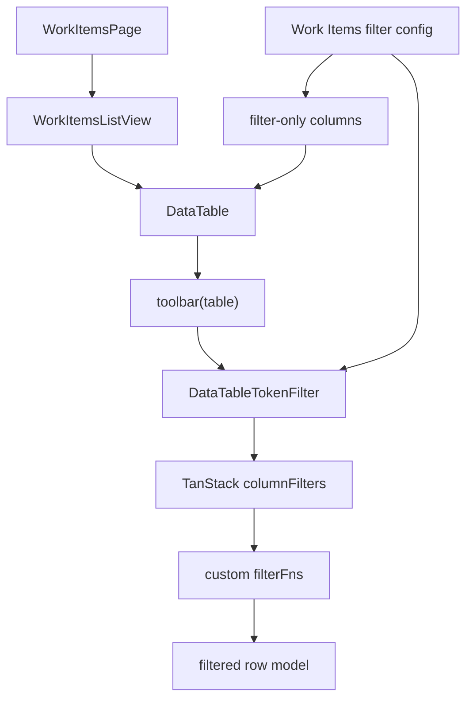

# feat: Port data-table-filter to Work Items

## Overview

Port the Bazza UI data-table-filter interaction into ThinkWork as a reusable `@thinkwork/ui` primitive, then pilot it only on the `/work-items` list table. V1 keeps filtering client-side and TanStack Table-native: active tokens become TanStack column filter values, custom filter functions evaluate already-loaded rows, and no token edit changes route search params, saved views, or backend filter inputs.

The Work Items page should lose its saved-view controls and select-heavy filter row. Route state can still carry non-token context such as `view`, `sort`, `spaceId`, and `threadId` for existing navigation paths, but the new token filter bar is local to the page/list experience. Legacy filter search params such as `search`, `statusCategory`, `priority`, `due`, `blocked`, `required`, and `applicable` must not remain as invisible backend filters.

Because V1 is client-side, the UX contract is explicit: token filters apply only to the currently loaded Work Items slice. The page should avoid implying global search across every Work Item until server-backed token filtering is designed.

---

## Problem Frame

The origin requirements define a compact Bazza/Linear-style tokenized filter bar for Work Items. ThinkWork currently has a basic `data-table-filter-bar` plus a Work Items-specific row of selects and saved-view controls. That gives operators filtering mechanics, but not the intended tokenized interaction, and it couples the page to URL/server filters and saved-view mutations in places where V1 should be local and immediate.

The plan therefore introduces the smallest reusable table-filter primitive that can power this pilot without importing Bazza's full filter engine, Next.js assumptions, `nuqs`, server faceting, or broad table migration (see origin: `docs/brainstorms/2026-06-25-data-table-filter-work-items-requirements.md`).

---

## Requirements Trace

- R1. Add a reusable tokenized data-table filter primitive with filter button, active tokens, segmented subject/operator/value controls, remove, and clear actions.
- R2. Make the primitive TanStack Table oriented rather than route, `nuqs`, or server-state oriented.
- R3. Support text, single-option, boolean, and due-state fields for the Work Items pilot.
- R4. Keep filter changes local and immediate; they must not update URL params, saved views, or backend filter inputs.
- R5. Pilot only on `/work-items` list view.
- R6. Expose Work Items token filters for search/title text, Space, status category rendered as "Status", priority, due state, required, blocked, and applicable.
- R7. Remove the old select-heavy `WorkItemFilters` row as the primary filtering UI.
- R8. Remove visible Work Items saved-view functionality from the page while leaving backend APIs out of scope.
- R9. Preserve table columns, pagination, status updates, thread links, metrics, refresh, loading, error, and empty states.
- R10. Keep board view outside the V1 filter contract.
- R11. Match the Bazza/Linear-style visual grammar closely enough to be recognizable.
- R12. Use ThinkWork primitives and theme tokens.
- R13. Make the filter bar responsive without text overlap.
- R14. Reset table pagination to the first page when token filters change, so matching rows are not hidden by a stale page index.

**Origin actors:** A1 ThinkWork operator; A2 implementation planner.

**Origin flows:** F1 Build a Work Items filter from tokens; F2 Edit and clear active filters.

**Origin acceptance examples:** AE1 Status token filters Done rows; AE2 text token filters searchable Work Item text; AE3 token edits do not mutate URL or saved views; AE4 token bar replaces individual select boxes; AE5 status updates and thread links still work while filtered.

---

## Scope Boundaries

- Do not port Next.js assumptions, `nuqs`, or Bazza's server-side filtering examples.
- Do not make token filters route-restorable or shareable.
- Do not keep Work Items saved-view UI in the pilot.
- Do not remove or redesign backend saved-view APIs solely because `/work-items` stops using them.
- Do not convert other ThinkWork tables to the new primitive in this plan.
- Do not require board view to participate in token filtering.
- Do not introduce backend pagination, server faceting, or new GraphQL filtering work.

### Deferred to Follow-Up Work

- Server-backed token filtering: a later issue can define URL/state/server semantics if the loaded-row limit becomes too constraining.
- Broader table adoption: migrate other `DataTable` surfaces only after the Work Items pilot validates the primitive.
- Board-mode filtering parity: add a non-TanStack adapter only if operators need token filters in board view.

---

## Context & Research

### Relevant Code and Patterns

- `packages/ui/src/components/ui/data-table.tsx` already owns TanStack state and exposes a `toolbar(table)` render prop. This is the main integration point for token filters.
- `packages/ui/src/components/ui/data-table-filter-bar.tsx` has simple search/facet/sort/group controls, but not tokenized subject/operator/value filters.
- `packages/ui/src/components/ui/display-view-control.tsx` shows the desired shared-primitive boundary: generic UI in `@thinkwork/ui`, screen-owned configuration in `apps/web`.
- `packages/ui/src/components/ui/popover.tsx`, `command.tsx`, `dropdown-menu.tsx`, `button.tsx`, `badge.tsx`, and `input.tsx` provide the primitives needed for the token menu and editors.
- `packages/ui/test/data-table.test.tsx` uses SSR-oriented component tests for the shared DataTable. New filter logic should add direct helper tests and focused render tests rather than relying only on manual UI verification.
- `apps/web/src/components/work-items/WorkItemsPage.tsx` currently owns Work Items fetching, metrics, saved-view queries/mutations, view tabs, old filter row, status updates, and rendering of board/list modes.
- `apps/web/src/components/work-items/WorkItemsListView.tsx` renders `DataTable` with Work Item columns and is the correct pilot surface for the table toolbar.
- `apps/web/src/components/work-items/work-item-filters.ts` currently mixes route state, backend input construction, due filters, and saved-view serialization. This plan should reduce its Work Items page role rather than expand it.
- `apps/web/src/routes/_authed/_shell/spaces.$spaceId.tsx` links to `/work-items` with `spaceId`, so route state should still support Space context even though token filters are client-side.
- `docs/plans/autopilot/THNK-69-status.md` documents that Work Items web was recently added with targeted tests around display, filters, saved views, sidebar navigation, route summaries, and GraphQL schema guards.

### Institutional Learnings

- `docs/solutions/design-patterns/screen-owned-list-display-adapters-2026-06-14.md` says reusable UI primitives should stay generic while screens own domain labels, grouping/filtering keys, and row semantics. Apply the same split here: `@thinkwork/ui` owns token UI and generic filter evaluation; Work Items owns filter config and row accessors.
- `docs/solutions/design-patterns/audit-existing-ui-and-data-model-before-parallel-build-2026-04-28.md` warns against building parallel operator surfaces before auditing existing UI/data models. Apply it by replacing the existing Work Items filter controls rather than adding a second filter row, and by leaving backend saved-view APIs alone.

### External References

- Bazza UI data-table-filter docs: https://ui.bazza.dev/docs/data-table-filter
- Bazza static TanStack demo: https://github.com/bazzalabs/ui/tree/canary/apps/web/app/demos/client/tst-static
- Bazza TanStack adapter pattern: `createTSTColumns` attaches custom filter functions and `createTSTFilters` converts filter models into TanStack `ColumnFiltersState`.
- TanStack Table v8 column filtering docs: https://tanstack.com/table/latest/docs/guide/column-filtering. The relevant pattern is client-side `getFilteredRowModel`, `ColumnFiltersState`, and custom `filterFn`s.

---

## Key Technical Decisions

- **Use compact ThinkWork filter state, not the full Bazza engine.** The shared primitive should define a small filter model for V1 and store that model as TanStack column filter values. This preserves R2 without carrying Bazza's full column builder, faceting service, i18n engine, or server strategy surface.
- **Drive filters through the DataTable toolbar/table instance.** `DataTable` already passes its TanStack table instance to `toolbar(table)`. The token primitive should render there and call column/table filter APIs, rather than forcing every caller to construct `useReactTable` manually.
- **Add DataTable support for filter-only hidden columns.** Work Items needs columns such as searchable text, status category, due state, and booleans that may not be visible as cells. `DataTable` should accept `initialColumnVisibility` for pilot columns to participate in filtering without rendering headers, cells, or fixed-layout `<col>` entries.
- **Keep route context separate from token filters.** `view`, `sort`, `spaceId`, and `threadId` can continue to affect page context and server fetches where existing navigation relies on them. New token filters must not write route search params or saved views, and legacy filter params must be dropped or ignored rather than applied invisibly.
- **Hide token filtering in board view while preserving list filters during page lifetime.** Board remains available, but V1 token filtering is only a list/DataTable capability. If a user switches from list to board and back while `WorkItemsPage` remains mounted, the list token state should still be there.
- **Use single-value tokens in V1.** Option and boolean tokens support `is`/`is not`; text supports `contains`/`does not contain`. Multi-select operators such as `any of`/`none of` are follow-up work.
- **Reset pagination on filter edits.** Applying, editing, removing, or clearing token filters should call `table.setPageIndex(0)` or equivalent after the column filter state changes.
- **Remove Work Items saved-view page wiring, not backend contracts.** Delete or stop rendering the Work Items saved-view controls and remove page-level saved-view queries/mutations when unused. Leave GraphQL operations/backing APIs alone unless implementation discovers they are purely frontend dead code.

---

## Open Questions

### Resolved During Planning

- Should the primitive own filter state or manipulate TanStack directly? It should own a compact filter model and store it in TanStack column filters through the table instance. This keeps UI generic and avoids a second app-level state source.
- Which Work Item filter columns should V1 support? Use `searchText`, `spaceId`, `statusCategory`, `priority`, `dueState`, `required`, `blocked`, and `applicable`. Render `statusCategory` as a "Status" token to match operator language. Keep owner out of V1 because it is not part of the current filter row and has ambiguous source data.
- What happens in Space-scoped routes? When route `spaceId` already scopes the loaded dataset, omit or disable the Space token and show clear disabled/unavailable state copy if it appears in the menu.
- What happens in board view? Board view remains outside token filtering. The token toolbar appears only inside list/DataTable mode, but list tokens are preserved while the page stays mounted.
- What is the due-state contract? Use an app-owned helper: `overdue` is before the local start of today, `due_soon` is on/after the local start of today and before seven days from that boundary, and rows outside those ranges have no due-state token match.

### Deferred to Implementation

- Exact component and helper names: choose names consistent with nearby `data-table-*` files during implementation.
- Final prop names: prefer `initialColumnVisibility` and `resetPageOnFilterChange` unless local naming conventions point to clearer equivalents during implementation.

---

## High-Level Technical Design

> _This illustrates the intended approach and is directional guidance for review, not implementation specification. The implementing agent should treat it as context, not code to reproduce._

The shared filter primitive renders tokens and editors from screen-provided column config. Work Items adds filter-only columns/accessors to the existing table. Token edits write filter values to TanStack column filters; custom filter functions interpret those values against row data.

---

## Implementation Units

- U1. **Add shared token filter model and primitive**

**Goal:** Create the reusable `@thinkwork/ui` token filter primitive and helper filter functions without wiring Work Items yet.

**Requirements:** R1, R2, R3, R11, R12, R13, R14; F1, F2; AE1, AE2, AE4.

**Dependencies:** None.

**Files:**

- Create: `packages/ui/src/components/ui/data-table-token-filter.tsx`
- Modify: `packages/ui/src/index.ts`
- Test: `packages/ui/test/data-table-token-filter.test.tsx`

**Approach:**

- Define a small filter-column config type with id, label, optional icon, type (`text`, `option`, or `boolean`), operators, options/value labels, loading/error/empty menu copy, and disabled/unavailable copy.
- Define a filter value shape that can be stored directly in TanStack `columnFilters`: operator plus a single value. One token is allowed per field in V1; adding the same field edits/replaces the existing token.
- Export generic filter functions for text contains/not-contains, option is/is-not, and boolean is/is-not. Work Items due-state calculation belongs in the app adapter rather than the shared package.
- Build the token UI from ThinkWork primitives: `Popover` or `DropdownMenu` for subject/operator/value menus, `Command` for searchable option picking when useful, `Button` for icon actions, and `Input` for text input.
- Keep the component generic: it receives a TanStack table instance and filter-column config; it does not know about Work Items, Spaces, saved views, or route search.
- Preserve the Bazza visual grammar with segmented tokens: subject segment with icon, muted operator segment, value segment, and close segment. Use ThinkWork tokens/classes rather than copying non-native site chrome.
- Interaction contract: Add Filter opens the subject menu; picking a subject advances to operator/value editing; text commits on Enter or Apply; Escape cancels the draft; empty drafts are discarded; token subject/operator/value segments reopen their relevant editor; remove deletes one token; Clear removes all tokens.
- Accessibility and responsive contract: icon-only controls have accessible labels/tooltips, focus returns to the triggering segment after a popover closes, Escape/Enter work consistently, touch targets stay at least 36px where layout allows, tokens have stable max widths, and long labels truncate or wrap without overlap.
- After any applied filter edit, call `table.setPageIndex(0)` or the agreed DataTable reset helper so pagination cannot strand matching rows offscreen.

**Execution note:** Implement the filter value helpers test-first before completing the visual component; those helpers are the long-lived contract between tokens and TanStack filters.

**Patterns to follow:**

- `packages/ui/src/components/ui/display-view-control.tsx` for generic shared primitive shape and compact popover controls.
- `packages/ui/src/components/ui/data-table-filter-bar.tsx` for existing table-toolbar naming and export conventions.
- Bazza `Filter.Root`, `Filter.List`, and `Filter.Item` composition as interaction reference, not as code to reproduce wholesale.

**Test scenarios:**

- Happy path: text filter value `contains onboarding` matches rows with case-insensitive searchable text and rejects unrelated rows.
- Happy path: option filter `status is DONE` matches only rows whose accessor value is `DONE`.
- Happy path: boolean filter `blocked is true` matches true values and rejects false/null values.
- Edge case: empty text value is treated as no active filter and does not hide all rows.
- Edge case: removing the only token leaves `table.getState().columnFilters` without that column id and resets page index to `0`.
- Edge case: option labels render from config even when the stored value is an internal id.
- Edge case: selecting the same field twice edits/replaces the existing token rather than creating duplicate tokens.
- Edge case: option menus render loading, no matches, unavailable, and query failed states from config.
- Edge case: Escape cancels a draft without mutating column filters; Enter commits a valid text draft.
- Covers AE4. Render path shows segmented subject/operator/value/remove areas rather than a row of independent select boxes.

**Verification:**

- Shared tests prove filter helper behavior and token rendering.
- `@thinkwork/ui` exports the new primitive without breaking existing `DataTable` imports.

---

- U2. **Extend DataTable for hidden filter columns**

**Goal:** Let callers add filter-only TanStack columns and initial visibility without rendering those columns or affecting visible table layout.

**Requirements:** R2, R3, R9.

**Dependencies:** U1.

**Files:**

- Modify: `packages/ui/src/components/ui/data-table.tsx`
- Test: `packages/ui/test/data-table.test.tsx`

**Approach:**

- Add a narrow DataTable prop for initial column visibility. Use TanStack's existing `columnVisibility` state rather than inventing another visibility mechanism.
- Ensure hidden filter-only columns still participate in `getFilteredRowModel()` while remaining absent from header and body visible-cell rendering.
- Generate fixed-layout `<colgroup>` entries from visible leaf columns only; hidden filter-only columns must not produce extra `<col>` elements or distort widths.
- Keep existing `filterValue`/`filterColumn`, sorting, pagination, row selection, generated-column normalization, and `toolbar(table)` behavior intact.
- Review the empty-state `colSpan`; if hidden columns are present, span visible leaf columns rather than raw input column count so empty rows remain visually correct.

**Patterns to follow:**

- Existing `DataTable` internal TanStack state management in `packages/ui/src/components/ui/data-table.tsx`.
- Existing table tests in `packages/ui/test/data-table.test.tsx` that assert rendered markup and row-height invariants.

**Test scenarios:**

- Happy path: a hidden column configured in initial visibility is absent from rendered headers/cells.
- Happy path: a hidden column configured in initial visibility is absent from rendered `<colgroup>` output.
- Happy path: a hidden column with a filter function still filters visible rows.
- Edge case: empty-state row spans the visible column count when filter-only hidden columns are present.
- Regression: generated-app column definitions and `rows` alias still render as before.
- Regression: 40px row-height tests still pass for body and empty-state rows.

**Verification:**

- `DataTable` can host filter-only columns for Work Items without visual column leakage.
- Existing table behavior and generated-app compatibility remain unchanged.

---

- U3. **Create Work Items filter adapter and table columns**

**Goal:** Add Work Items-specific token filter configuration and filter-only columns beside the Work Items list view.

**Requirements:** R3, R5, R6, R9, R10; F1; AE1, AE2, AE5.

**Dependencies:** U1, U2.

**Files:**

- Modify: `apps/web/src/components/work-items/WorkItemsListView.tsx`
- Create: `apps/web/src/components/work-items/work-item-table-filters.ts`
- Test: `apps/web/src/components/work-items/work-item-table-filters.test.ts`
- Test: `apps/web/src/components/work-items/WorkItemsListView.test.tsx`

**Approach:**

- Define Work Items filter config in an app-level adapter, not inside `@thinkwork/ui`.
- Add filter-only column/accessor ids for `searchText`, `spaceId`, `statusCategory`, `priority`, `dueState`, `required`, `blocked`, and `applicable`.
- Build option lists from existing Work Item helpers: Spaces from query results, status categories from `WORK_ITEM_CATEGORY_ORDER` but rendered as "Status", priority from `WORK_ITEM_PRIORITY_ORDER`, boolean labels from the old filter row's semantics, and due-state options from a new app-owned `workItemDueState` helper.
- Define `workItemDueState` explicitly as `overdue` before local start of today and `due_soon` on/after local start of today but before seven days from that boundary. Do not reuse helper behavior that includes overdue rows in due-soon.
- Keep title/notes searchable through one text filter column so text tokens can match the same practical content as the old search input.
- Use `toolbar(table)` to render the token filter bar only in `WorkItemsListView`.
- Keep status updates and thread links inside the existing visible columns; filtering must not change row action wiring.
- When a route context already scopes `spaceId`, hide or disable the Space token option if showing it would imply filtering outside the loaded Space-scoped dataset.
- Lift list token filter state high enough to preserve it while switching between list and board within the mounted `WorkItemsPage`, while still keeping it local to the page and out of the URL.
- Surface the loaded-slice contract in empty/no-match copy where relevant: token filters refine the currently loaded Work Items, not every matching item in the backend.

**Patterns to follow:**

- `apps/web/src/components/work-items/work-item-display.ts` for labels, status category normalization, due helpers, and priority ordering.
- `apps/web/src/components/work-items/WorkItemsListView.tsx` for current table layout and row actions.
- `docs/solutions/design-patterns/screen-owned-list-display-adapters-2026-06-14.md` for screen-owned adapter boundaries.

**Test scenarios:**

- Covers AE1. Given rows with Done and Todo status categories, applying `statusCategory is DONE` shows only Done rows.
- Covers AE2. Given rows with title or notes containing `onboarding`, applying a text token for `onboarding` shows matching title/notes rows and hides unrelated rows.
- Happy path: Space token options are built from the provided Spaces query data and match `spaceId`.
- Happy path: due-state token distinguishes overdue and due-soon rows using the explicit app-owned day-boundary helper.
- Happy path: required/blocked/applicable boolean tokens filter true and false rows correctly.
- Happy path: when the route has `spaceId`, the Space token is omitted or unavailable and no Space token suggests widening beyond the loaded dataset.
- Covers AE5. A filtered row still renders `WorkItemStatusSelect`, and changing status calls the existing `onStatusChange` callback with the row and status.
- Covers AE5. A filtered row with a thread link still renders the thread link target.
- Edge case: an invalid or missing status/category value falls back to existing normalization and does not crash filtering.

**Verification:**

- Work Items list has token filters for the fields named in R6.
- The list table filters client-side against loaded rows, communicates that scope, and preserves existing row actions.

---

- U4. **Remove Work Items saved-view and old filter UI from the page**

**Goal:** Stop exposing saved views and the old select-heavy filter row on `/work-items` while preserving route context needed by existing navigation.

**Requirements:** R4, R7, R8, R9, R10; F2; AE3, AE4.

**Dependencies:** U3.

**Files:**

- Modify: `apps/web/src/components/work-items/WorkItemsPage.tsx`
- Modify: `apps/web/src/components/work-items/work-item-filters.ts`
- Modify: `apps/web/src/routes/_authed/_shell/work-items.index.tsx`
- Modify: `apps/web/src/components/shell/ChatSidebar.test.tsx`
- Modify: `apps/web/src/routes/_authed/_shell/-spaces-spaceId.test.ts`
- Delete or stop using: `apps/web/src/components/work-items/WorkItemFilters.tsx`
- Delete or stop using: `apps/web/src/components/work-items/WorkItemSavedViews.tsx`
- Test: `apps/web/src/components/work-items/WorkItemsPage.test.ts`
- Test: `apps/web/src/components/work-items/work-item-filters.test.ts`
- Test: `apps/web/src/components/work-items/WorkItemSavedViews.test.tsx` if the component remains; otherwise delete with the component.

**Approach:**

- Remove `WorkItemSavedViews` rendering and the saved-view query/mutation hooks from `WorkItemsPage`.
- Remove `WorkItemFilters` rendering from `WorkItemsPage`; token filters now live inside the list table toolbar.
- Keep route parsing for page context that existing links need: `view`, `sort`, `spaceId`, and `threadId`.
- Stop passing legacy filter params into `buildWorkItemsInput`. If old URLs contain `search`, `statusCategory`, `priority`, `due`, `blocked`, `required`, or `applicable`, drop or ignore those params rather than applying them invisibly. Do not import them into token state in V1.
- Ensure token filter edits never call `onStateChange`, `navigate`, saved-view mutations, or Work Items refetch solely for filtering.
- Preserve list token state locally while `WorkItemsPage` remains mounted. Switching to board hides the token toolbar and board ignores list tokens; switching back to list restores the prior list tokens.
- Remove saved-view serialization helpers from `work-item-filters.ts` when they become frontend-dead, but do not remove GraphQL saved-view documents or backend APIs unless a separate cleanup explicitly scopes that work.
- Revisit metrics after removing the old filter row: keep them scoped to the fetched row set, not token-filtered rows, unless implementation can cheaply derive filtered metrics from the table without coupling the header to TanStack internals.

**Patterns to follow:**

- Existing `WorkItemsPage` update-state logic for preserving default `view` and `sort`.
- `docs/solutions/design-patterns/audit-existing-ui-and-data-model-before-parallel-build-2026-04-28.md` for avoiding parallel UI and preserving existing backend substrate when out of scope.

**Test scenarios:**

- Covers AE3. Editing token filters does not call route `onStateChange` or saved-view mutations.
- Covers AE4. Work Items page no longer renders the old select-heavy filter controls.
- Covers R8. Work Items page no longer renders saved-view selector/save/delete controls.
- Regression: `/work-items?statusCategory=DONE&search=x` does not apply invisible backend filters, and the page either normalizes those params away or ignores them while rendering unfiltered loaded rows.
- Happy path: `/work-items?view=board&spaceId=space-1` still opens board mode with Space context from existing Space links.
- Happy path: list/board tab changes still update route `view` and preserve default sort behavior.
- Happy path: token filters entered in list mode are still present after switching to board and back during the same page session.
- Regression: refresh button still invokes the Work Items query refresh.
- Regression: loading, error, and empty states still render in the same page regions.

**Verification:**

- Visible Work Items saved-view and old filter UI are gone.
- Existing route navigation contexts still work.
- Token filters remain local to list mode.

---

- U5. **Polish visual fit and verification coverage**

**Goal:** Verify the token filter bar matches the reference interaction, behaves on desktop/mobile widths, and does not regress the Work Items page.

**Requirements:** R9, R11, R12, R13, R14; AE1, AE2, AE3, AE4, AE5.

**Dependencies:** U1, U2, U3, U4.

**Files:**

- Test: `packages/ui/test/data-table-token-filter.test.tsx`
- Test: `apps/web/src/components/work-items/WorkItemsListView.test.tsx`
- Test: `apps/web/src/components/work-items/WorkItemsPage.test.ts`
- Verify: browser smoke against `/work-items`

**Approach:**

- Compare the rendered Work Items filter bar against the Bazza docs/demo and original product screenshot supplied in the brainstorm: compact toolbar, outlined segmented tokens, icon subject cells, muted operator segments, clear value segments, and close buttons.
- Ensure buttons use icon-first affordances where appropriate and tooltips/labels are available for non-obvious icon-only controls.
- Validate responsive behavior: desktop keeps the toolbar compact; tablet/narrow widths allow token wrapping or horizontal token scrolling; text must not overlap or escape the toolbar; popovers remain reachable; focus returns after closing.
- Keep visual changes tightly scoped to the filter toolbar and existing Work Items spacing; avoid restyling the whole page.
- Add focused tests for the important behavioral contracts, then use browser verification for visual fit because SSR tests cannot prove wrapping, popover placement, or overlap.

**Patterns to follow:**

- Frontend design guidance in `AGENTS.md`: icons in buttons, compact operational UI, stable dimensions, no text overlap, and no nested card-like chrome.
- Existing Work Items table density in `apps/web/src/components/work-items/WorkItemsListView.tsx`.

**Test scenarios:**

- Covers AE1. UI-level test adds a status token and confirms table rows update.
- Covers AE2. UI-level test adds a text token and confirms only matching Work Items remain.
- Covers AE3. UI-level test clears filters and confirms route state callbacks are not invoked.
- Covers AE5. UI-level test filters rows, then invokes a row status change and confirms the existing callback fires.
- Edge case: applying a token filter from a later pagination page resets the table to page one.
- Edge case: a long Space name or Work Item text value truncates/wraps professionally inside the token instead of overflowing.
- Edge case: clearing all filters restores the original loaded row set.

**Verification:**

- Shared package and web tests cover helper behavior and Work Items integration.
- Browser smoke on `/work-items` confirms the token bar renders, wraps, opens menus, filters rows, clears filters, and leaves board mode free of token-filter UI.

---

## System-Wide Impact

- **Interaction graph:** Work Items route still owns fetching and view mode. Work Items list owns table columns and filter config. `DataTable` owns TanStack state. The new token primitive writes column filters through the table instance passed by `toolbar(table)`.
- **Error propagation:** Client-side filter errors should be prevented by config validation and safe fallback labels. Backend GraphQL errors remain page-level Work Items errors and are not affected by token edits.
- **State lifecycle risks:** There are now two scopes: route context state (`view`, `sort`, `spaceId`, `threadId`) and local token filter state. The plan intentionally prevents token state from writing to route or saved views, and it explicitly prevents old filter params from becoming hidden server filters.
- **Loaded-slice filtering:** V1 filters the fetched Work Items slice, not all backend matches. No-match copy, issue scope, and follow-up planning should keep that limitation visible.
- **API surface parity:** Backend saved-view APIs and GraphQL documents are not part of this feature. Removing visible Work Items saved-view UI should not break other API consumers.
- **Integration coverage:** Unit tests should cover filter predicates and route-state helpers. UI tests/browser smoke should cover token interactions with the DataTable row model and existing row actions.
- **Unchanged invariants:** Work Items fetching remains tenant-scoped through the existing query. Status updates, thread links, pagination, refresh, loading, error, and empty states remain part of the Work Items page.

---

## Risks & Dependencies

| Risk                                                                              | Mitigation                                                                                                                                |
| --------------------------------------------------------------------------------- | ----------------------------------------------------------------------------------------------------------------------------------------- |
| The shared primitive grows into a full Bazza engine clone.                        | Keep U1 limited to V1 types/operators and table-instance integration; defer faceting, server strategies, i18n, and query-string adapters. |
| Hidden filter-only columns leak into visible table markup or fixed-layout widths. | U2 adds explicit visibility support and tests header/body/empty-state/`<colgroup>` rendering.                                             |
| Legacy route filters remain active but invisible.                                 | U4 drops or ignores old filter params and tests URLs that include old search/status params.                                               |
| Client-side filters look global but only cover loaded rows.                       | U3 and U5 document the loaded-slice contract in copy and verification; server-backed token filtering is deferred explicitly.              |
| Filtering from a later page shows empty rows even though matches exist.           | U1 and U5 reset pagination to page one on filter edits and test the non-first-page case.                                                  |
| Removing saved-view UI accidentally removes backend contracts.                    | U4 scopes removal to page wiring/components and leaves GraphQL/API cleanup out unless frontend-dead code is isolated and safe.            |
| Space-scoped links lose context.                                                  | Preserve route `spaceId` context for existing `/spaces/$spaceId` board links and test it.                                                 |
| Board view semantics become confusing.                                            | Hide token filters in board mode and document board filtering as follow-up work.                                                          |
| Token UI matches behavior but misses the visual reference.                        | U5 includes browser verification and responsive checks against the Bazza/reference visual grammar.                                        |

---

## Documentation / Operational Notes

- The repo-local plan should be attached to `THNK-72` as a Linear document for review.
- No public docs are required for V1 unless implementation decides this primitive should be advertised to generated app authors or other teams.
- No deployment, data migration, or backend operational work is expected.

---

## Sources & References

- **Origin document:** `docs/brainstorms/2026-06-25-data-table-filter-work-items-requirements.md`
- **Linear issue:** `THNK-72`
- Related code: `packages/ui/src/components/ui/data-table.tsx`
- Related code: `packages/ui/src/components/ui/data-table-filter-bar.tsx`
- Related code: `apps/web/src/components/work-items/WorkItemsPage.tsx`
- Related code: `apps/web/src/components/work-items/WorkItemsListView.tsx`
- Related code: `apps/web/src/components/work-items/work-item-filters.ts`
- Related learning: `docs/solutions/design-patterns/screen-owned-list-display-adapters-2026-06-14.md`
- Related learning: `docs/solutions/design-patterns/audit-existing-ui-and-data-model-before-parallel-build-2026-04-28.md`
- Related status: `docs/plans/autopilot/THNK-69-status.md`
- Bazza UI reference: https://ui.bazza.dev/docs/data-table-filter
- Bazza TanStack demo: https://github.com/bazzalabs/ui/tree/canary/apps/web/app/demos/client/tst-static
- TanStack Table filtering guide: https://tanstack.com/table/latest/docs/guide/column-filtering
