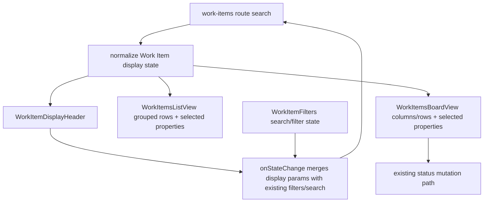

# feat: Add Work Items display header

## Overview

Add a focused Display header to `/work-items` that controls the existing Work Items List and Board modes through route/search state. The header should follow the LastMile `HeaderDisplay` interaction shape for List and Board configuration, but it should use Work Item concepts and ThinkWork UI primitives instead of copying LastMile dispatch labels or table-column behavior.

The implementation should remove the visible Work Item saved-view flow from this page, replace the separate List/Board tab control with Display, and preserve active Work Item filters/search while display settings change.

---

## Problem Frame

The Work Items page currently splits view shaping across saved-view UI, List/Board tabs, filter selects, and a simple sort select. The requirements call for one route-state-only Display header that lets a Work Item user switch between List and Board, choose grouping/sub-grouping/sorting/direction/options, and control which Work Item metadata appears in the current view (see origin: `docs/brainstorms/2026-06-25-work-items-display-header-requirements.md`).

This is a narrower follow-on to THNK-22. It should use the THNK-22 screen-owned adapter pattern, but the target surface is now `/work-items` and the in-scope modes are List and Board only.

---

## Requirements Trace

- R1. Replace the current saved-view selector and separate List/Board tabs with a single Display header control.
- R2. Offer only `List` and `Board` modes; do not expose Table, Map, or Calendar.
- R3. Remove saved Work Item Views from the visible Work Items flow for this iteration.
- R4. Persist display changes in route/search state so refresh, browser navigation, and shared links restore the view shape.
- R5. Treat route state as the source of truth for mode, grouping, sub-grouping, sorting, direction, empty visibility, and display properties.
- R6. Preserve Work Item filters and search terms when display settings change.
- R7. List mode supports grouping, sub-grouping, sort by, direction, show empty groups, show empty sub-groups, and display properties.
- R8. List display properties are Work Item-native metadata choices.
- R9. Board mode supports columns, row grouping, sub-grouping, sort by, direction, show empty columns, show empty rows, and display properties.
- R10. Existing Board status updates and card actions keep working after display settings change.
- R11. List and Board rendering respects selected display properties without changing underlying Work Item data.
- R12. Labels use Work Item language and avoid LastMile dispatch concepts.
- R13. The Display header follows the LastMile interaction structure using ThinkWork UI primitives and Work Items styling.

**Origin actors:** A1 Work Item user, A2 Implementation planner.

**Origin flows:** F1 switch between List and Board, F2 configure List view, F3 configure Board view.

**Origin acceptance examples:** AE1 Display shows only List/Board and no saved views; AE2 search survives Board grouping and URL restore; AE3 hiding Due date removes due metadata from List rows; AE4 Board column changes do not break status mutation; AE5 property labels are Work Item-native.

---

## Scope Boundaries

- Do not build or retain saved named Work Item Views in the `/work-items` user flow.
- Do not add Table, Map, Calendar, or TanStack table column-order/column-visibility controls.
- Do not change Work Item creation, status mutation, GraphQL schema, or backend filtering contracts solely for this display-header work.
- Do not import LastMile domain labels or dispatch-specific behavior into ThinkWork Work Items.
- Do not convert unrelated Settings tables or other list surfaces.

### Deferred to Follow-Up Work

- Shared Board-capable display primitive: keep the first Work Items implementation screen-owned; extract to `@thinkwork/ui` later only if a second Board/List surface needs the same behavior.
- Backend/server grouping: keep v1 grouping over already-loaded Work Items; introduce backend grouping only if product scope later requires larger result sets or server pagination.

---

## Context & Research

### Relevant Code and Patterns

- `apps/web/src/routes/_authed/_shell/work-items.index.tsx` owns TanStack Router search validation and passes route state into `WorkItemsPage`.
- `apps/web/src/components/work-items/WorkItemsPage.tsx` owns Work Items queries, metrics, saved-view UI, List/Board tabs, filters, refresh, status mutation, and mode rendering.
- `apps/web/src/components/work-items/work-item-filters.ts` currently mixes route parsing, backend Work Items input construction, sort state, saved-view conversion, and filter helpers.
- `apps/web/src/components/work-items/WorkItemsListView.tsx` currently renders a `DataTable` with Work Item columns.
- `apps/web/src/components/work-items/WorkItemsBoardView.tsx` currently renders status lanes and `WorkItemCard` cards.
- `apps/web/src/components/work-items/WorkItemCard.tsx` already contains the compact Work Item metadata layout and status mutation control.
- `packages/ui/src/components/ui/display-view-control.tsx` and `packages/ui/src/components/ui/grouped-list-view.tsx` are the THNK-22 reusable primitives for Table/List display settings and grouped list rendering.
- `apps/web/src/lib/list-view-display.ts` contains route-state normalization and grouping/sorting helpers from THNK-22.
- `apps/web/src/components/settings/SettingsActivity.tsx` and `apps/web/src/components/settings/SettingsAutomations.tsx` show the screen-owned adapter pattern: page-specific option config, route state normalization, Display control, and grouped list renderer.
- `docs/plans/2026-06-25-001-feat-data-table-filter-work-items-plan.md` is adjacent Work Items toolbar work. If both plans are implemented close together, the implementer should reconcile header/filter layout and saved-view removal once.

### Institutional Learnings

- `docs/solutions/design-patterns/screen-owned-list-display-adapters-2026-06-14.md` says reusable display primitives should remain generic while each screen owns domain labels, grouping keys, row semantics, and route-state projection.
- `docs/solutions/design-patterns/audit-existing-ui-and-data-model-before-parallel-build-2026-04-28.md` argues for replacing or adapting the existing surface rather than adding parallel UI. Apply that by replacing the current Work Items saved-view/tabs view controls instead of adding a second display toolbar.

### External References

- None. Local THNK-22 display patterns and the referenced LastMile source are sufficient for this frontend plan.

---

## Key Technical Decisions

- **Build a Work Items-specific Display header first.** The existing `DisplayViewControl` supports Table/List and list settings; Work Items needs List/Board plus board columns/rows. A screen-owned `WorkItemDisplayHeader` keeps the first Board implementation local and avoids broadening `@thinkwork/ui` before there is another consumer.
- **Split display state from filter state.** Work Item filters/search continue to use the existing filter route fields for now; Display owns mode, List/Board grouping, sort, direction, empty visibility, and property selection.
- **Use per-mode route keys.** Preserve List and Board configuration independently while switching modes, mirroring LastMile's separate List and Board state. Prefer explicit keys such as `listGroup`, `listSubgroup`, `listSort`, `listDir`, `listProps`, `boardColumn`, `boardRow`, `boardSubgroup`, `boardSort`, `boardDir`, and `boardProps`.
- **Use Work Item-native option sets.** Grouping/sorting/property labels should derive from Work Item concepts: status, priority, owner, due state/date, Space, source/thread indicators, required, blocked, applicable, created, updated, and completed.
- **Keep GraphQL saved-view APIs untouched.** Remove visible Work Items saved-view usage and unused page-level queries/mutations, but do not alter schema/resolvers or generated GraphQL documents solely for this UI change.

---

## Open Questions

### Resolved During Planning

- Should this use route state or saved views? Route state. Saved views are explicitly out of scope and should be removed from the Work Items user flow.
- Should Table mode be included? No. The Display header offers List and Board only.
- Should LastMile labels be copied exactly? No. The interaction structure is the reference; option labels must use Work Item vocabulary.
- Should the shared `DisplayViewControl` be expanded immediately for Board? No. Use a Work Items-specific header first and extract later only if reuse pressure appears.

### Deferred to Implementation

- Exact option labels and ordering: use the option set in this plan as the starting contract, but adjust final wording to fit existing Work Item helper labels and UI copy.
- Final grouping helper shape: implementation may reuse `apps/web/src/lib/list-view-display.ts` where it fits or create Work Items-specific helpers when Board columns/rows need different structures.
- Coordination with the data-table-filter plan: if `docs/plans/2026-06-25-001-feat-data-table-filter-work-items-plan.md` lands first, rebase this plan's page/header assumptions against that changed toolbar.

---

## High-Level Technical Design

> _This illustrates the intended approach and is directional guidance for review, not implementation specification. The implementing agent should treat it as context, not code to reproduce._

---

## Implementation Units

- U1. **Define Work Items display route state**

**Goal:** Add a typed route-state contract and helpers for Work Items display configuration without changing backend Work Items filters.

**Requirements:** R4, R5, R6, R7, R8, R9, R12; F1, F2, F3; AE2.

**Dependencies:** None.

**Files:**

- Modify: `apps/web/src/components/work-items/work-item-filters.ts`
- Create: `apps/web/src/components/work-items/work-item-view-display.ts`
- Test: `apps/web/src/components/work-items/work-item-filters.test.ts`
- Test: `apps/web/src/components/work-items/work-item-view-display.test.ts`

**Approach:**

- Extend `WorkItemRouteSearch` with display-only fields for List and Board configuration while preserving existing filter/search fields.
- Remove `savedViewId` from the active route/search model unless implementation needs a short compatibility bridge to parse-and-drop old links.
- Keep backend input construction limited to existing Work Item filters. Display settings must not be sent to the Work Items GraphQL query.
- Define Work Item display option types and defaults in a screen-owned adapter:
  - View: `list`, `board`.
  - List grouping/sub-grouping: `none`, `status`, `priority`, `owner`, `space`, `dueState`, `required`, `blocked`, `applicable`, `source`.
  - Board columns: `status`, `priority`, `owner`, `space`, `dueState`.
  - Board rows/sub-grouping: same Work Item grouping vocabulary, excluding duplicate current column/row selections in the UI where practical.
  - Sorts: `updated`, `created`, `due`, `priority`, `title`, `completed`.
  - Display properties: status, priority, owner, due date, Space, thread count/source, created, updated, completed, required, blocked, applicable.
- Normalize unsupported route values back to defaults. Normalize stale subgroups that duplicate the primary group/row or become invalid when grouping is `none`.
- Serialize non-default display settings back into route params while preserving search/filter params.
- Preserve legacy `sort` handling intentionally: either map inbound `sort` to the current view's sort when no per-mode sort exists, or keep `sort` only as a compatibility alias until UI no longer emits it. Document the chosen behavior in tests.

**Patterns to follow:**

- `apps/web/src/lib/list-view-display.ts` for route-state normalization, unsupported option fallback, duplicate property removal, and stale subgroup cleanup.
- `apps/web/src/components/work-items/work-item-filters.ts` for existing search-param parsing style and Work Items input construction.

**Test scenarios:**

- Happy path: parsing `view=board`, `search=onboarding`, `boardColumn=priority`, `boardRow=owner`, `boardSort=due`, and `boardDir=asc` preserves `search` while producing Board display state.
- Covers AE2. Serializing the same Board display state writes the non-default display keys and keeps the active search/filter keys.
- Edge case: unsupported view, grouping, sort, direction, and property values fall back to defaults instead of leaking invalid labels into UI.
- Edge case: subgroup equal to primary grouping resets to `none`; board subgroup equal to board row resets to `none`; board row equal to board column resets or is excluded according to the final helper contract.
- Regression: `buildWorkItemsInput` ignores display-only keys and still sends only tenant/filter/search fields to GraphQL.
- Regression: saved-view helper behavior is removed or isolated so visible Work Items flow no longer depends on saved-view serialization.

**Verification:**

- Route helper tests prove display settings round-trip independently from filters/search.
- Backend Work Items query variables are unchanged except for existing filters/search.

---

- U2. **Create the Work Items Display header**

**Goal:** Add the user-facing Display control that replaces saved-view controls and List/Board tabs on `/work-items`.

**Requirements:** R1, R2, R3, R7, R8, R9, R12, R13; F1, F2, F3; AE1, AE5.

**Dependencies:** U1.

**Files:**

- Create: `apps/web/src/components/work-items/WorkItemDisplayHeader.tsx`
- Test: `apps/web/src/components/work-items/WorkItemDisplayHeader.test.tsx`

**Approach:**

- Build a Work Items-specific popover using `@thinkwork/ui` `Button`, `Popover`, `Select`, `Switch`, `Badge` or `Checkbox`, and existing icon style.
- Render List and Board mode buttons in the top segment. Do not render Table, Map, or Calendar.
- For List, render LastMile-style controls: grouping, sub-grouping, sort by, direction, show empty groups, show empty sub-groups, and display properties.
- For Board, render LastMile-style controls: columns, rows, sub-grouping, sort by, direction, show empty columns, show empty rows, and display properties.
- Use Work Item-native labels from U1 config. Do not include LastMile-only labels such as organization, order number, estimate, task type, or fuel-dispatch terms.
- Prevent unchecking every display property, matching the existing shared display control's "at least one property" safety.
- Emit a complete next display state through `onChange`; the page owns merging that state into route search.

**Patterns to follow:**

- `packages/ui/src/components/ui/display-view-control.tsx` for popover structure, mode segment, select rows, switches, and property toggles.
- LastMile `src/components/header/header-display.tsx` for the per-mode configuration order and the visual idea of Display properties as compact toggles.
- `apps/web/src/components/settings/SettingsActivity.tsx` for header action placement and route-state-driven display changes.

**Test scenarios:**

- Covers AE1. Rendering the header exposes List and Board buttons and does not expose Table, Map, Calendar, or saved-view controls.
- Happy path: selecting Board calls `onChange` with `view: "board"` without mutating unrelated List config.
- Happy path: changing List grouping, sort, direction, empty toggles, and a display property emits a state that preserves current Board config.
- Happy path: changing Board columns, rows, sort, direction, empty toggles, and a display property emits a state that preserves current List config.
- Covers AE5. Property option labels are Work Item-native and do not include LastMile dispatch-specific terms.
- Edge case: when a grouping option is selected, duplicate sub-grouping options are unavailable or reset.
- Edge case: the last selected display property cannot be removed.

**Verification:**

- Component tests demonstrate the full Display header interaction without depending on Work Items network data.

---

- U3. **Wire Display into the Work Items page and remove saved-view UI**

**Goal:** Replace page-level saved-view/tabs view controls with the new Display header while preserving filters, metrics, refresh, loading/error states, and status mutation.

**Requirements:** R1, R2, R3, R4, R5, R6, R10; F1; AE1, AE2, AE4.

**Dependencies:** U1, U2.

**Files:**

- Modify: `apps/web/src/components/work-items/WorkItemsPage.tsx`
- Modify: `apps/web/src/components/work-items/WorkItemFilters.tsx`
- Modify: `apps/web/src/routes/_authed/_shell/work-items.index.tsx`
- Delete or stop using: `apps/web/src/components/work-items/WorkItemSavedViews.tsx`
- Delete or stop using: `apps/web/src/components/work-items/WorkItemSavedViews.test.tsx`
- Test: `apps/web/src/components/work-items/WorkItemsPage.test.ts`
- Test: `apps/web/src/components/work-items/work-item-filters.test.ts`

**Approach:**

- Remove Work Item saved-view queries and mutations from `WorkItemsPage`. The page should no longer query saved views, save views, delete views, or render saved-view loading state.
- Remove the List/Board `Tabs` control and render `WorkItemDisplayHeader` in the header action area beside refresh.
- Keep `WorkItemFilters` for search and filtering unless implementation is intentionally combined with the separate data-table-filter plan. Remove the Sort select from `WorkItemFilters` once sorting lives in Display.
- Route updates from Display must merge with the current filter/search fields and clear no filters unless the user explicitly changes filters.
- Continue to show metrics, loading, error, empty states, and refresh behavior as today.
- Keep status mutation callback and toast behavior unchanged.

**Patterns to follow:**

- Existing `WorkItemsPage` `updateState` callback for preserving defaults.
- `apps/web/src/routes/_authed/_shell/work-items.index.tsx` `validateSearch` / `navigate` pattern.
- `docs/solutions/design-patterns/audit-existing-ui-and-data-model-before-parallel-build-2026-04-28.md` for replacing existing controls rather than adding parallel ones.

**Test scenarios:**

- Covers AE1. Page-level rendering no longer includes saved-view selector/save/delete controls or List/Board tabs; Display is the only view-mode control.
- Covers AE2. Updating Display to Board with `boardColumn=priority` preserves an existing `search` value and any active filter values in the state passed to `onStateChange`.
- Happy path: refresh still calls the Work Items query refresh path.
- Happy path: List and Board render from `state.view` after the Display header updates route state.
- Regression: removing saved-view UI also removes saved-view queries/mutations from the page so no unused saved-view fetch runs for `/work-items`.
- Regression: filter controls still update route state and backend input as before, excluding the moved sort control.

**Verification:**

- Work Items page tests confirm visible saved-view controls are gone, Display owns mode switching, and filter/search state survives Display changes.

---

- U4. **Adapt List and Board rendering to display state**

**Goal:** Make Work Items List and Board honor grouping, sorting, empty group visibility, and selected display properties.

**Requirements:** R7, R8, R9, R10, R11, R12; F2, F3; AE3, AE4, AE5.

**Dependencies:** U1, U3.

**Files:**

- Modify: `apps/web/src/components/work-items/WorkItemsListView.tsx`
- Modify: `apps/web/src/components/work-items/WorkItemsBoardView.tsx`
- Modify: `apps/web/src/components/work-items/WorkItemCard.tsx`
- Create: `apps/web/src/components/work-items/WorkItemListRow.tsx`
- Test: `apps/web/src/components/work-items/WorkItemsListView.test.tsx`
- Test: `apps/web/src/components/work-items/WorkItemsBoardView.test.tsx`
- Test: `apps/web/src/components/work-items/WorkItemCard.test.tsx`
- Test: `apps/web/src/components/work-items/work-item-view-display.test.ts`

**Approach:**

- Change `WorkItemsListView` from a table-shaped list into a grouped Work Item list when display grouping is active. It may use `GroupedListView` from `@thinkwork/ui` with a Work Item-specific row renderer.
- Create a compact `WorkItemListRow` that always shows a stable title/status/action baseline and conditionally shows selected display metadata.
- Pass selected display properties into `WorkItemCard` so Board cards can hide/show metadata without losing status mutation or Open thread actions.
- Update `WorkItemsBoardView` to build columns from the selected board column key:
  - `status`: existing status/category lanes.
  - `priority`: priority lanes ordered by `WORK_ITEM_PRIORITY_ORDER`.
  - `owner`: owner buckets derived from `workItemOwnerLabel`, including Unassigned.
  - `space`: Space buckets from loaded Spaces.
  - `dueState`: overdue, due soon, later, no due date.
- Support optional Board row grouping and sub-grouping inside columns when selected. Keep row grouping visually restrained so columns remain scannable.
- Sort rows/cards within each group using the selected sort and direction.
- Use `showEmptyColumns`, `showEmptyRows`, `showEmptyGroups`, and `showEmptySubgroups` to include or omit known empty buckets where the option has a finite known set. Do not fabricate endless empty buckets for owner-derived values.
- Preserve `onStatusChange` and thread link actions exactly through the row/card renderers.

**Patterns to follow:**

- `packages/ui/src/components/ui/grouped-list-view.tsx` for collapsible grouped rendering.
- `apps/web/src/lib/list-view-display.ts` for sorting and group construction behavior.
- `apps/web/src/components/work-items/WorkItemCard.tsx` for existing Work Item metadata presentation and status action placement.
- `apps/web/src/components/work-items/work-item-display.ts` for labels, due helpers, owner/source labels, priority ordering, and status category normalization.

**Test scenarios:**

- Covers AE3. In List view with `due date` hidden, rows omit due-date metadata while still rendering title, status, and row action/status control.
- Happy path: List grouping by priority with sub-grouping by owner renders grouped sections with correct counts and sorted rows.
- Edge case: List grouping `none` renders a single All group or ungrouped list without stale sub-group headers.
- Covers AE4. Board column `priority` renders priority lanes and still allows a card's status selector to call the existing status-change callback.
- Happy path: Board column `status` preserves the existing status/category lane behavior and counts.
- Happy path: Board row grouping by Space inside status columns renders rows/groups without dropping cards.
- Edge case: `showEmptyColumns=false` hides empty finite lanes; `showEmptyColumns=true` shows known empty status/priority/due lanes.
- Covers AE5. List row and Board card display labels do not contain LastMile-specific domain terms.

**Verification:**

- List and Board tests prove grouping, sorting, property visibility, and status actions can coexist.

---

- U5. **Update regression coverage and visual verification notes**

**Goal:** Add enough coverage and verification guidance that implementation can safely remove saved views and alter the primary Work Items view controls without regressing navigation or layout.

**Requirements:** R1, R2, R3, R4, R6, R10, R13; AE1, AE2, AE4, AE5.

**Dependencies:** U2, U3, U4.

**Files:**

- Modify: `apps/web/src/components/work-items/WorkItemsPage.test.ts`
- Modify: `apps/web/src/components/work-items/work-item-filters.test.ts`
- Create or modify: `apps/web/src/components/work-items/WorkItemDisplayHeader.test.tsx`
- Create or modify: `apps/web/src/components/work-items/WorkItemsListView.test.tsx`
- Create or modify: `apps/web/src/components/work-items/WorkItemsBoardView.test.tsx`

**Approach:**

- Keep helper tests close to route-state and grouping helpers; keep component tests focused on UI contract rather than network behavior.
- Add route restoration cases for List and Board display params plus active Work Item filters.
- Add a page-level regression asserting saved-view UI and saved-view network wiring are gone from `/work-items`.
- Add a browser/manual verification note for the implementing PR: open `/work-items`, switch List/Board, change display settings, refresh, check mobile/narrow layout, and update a Board card status.

**Patterns to follow:**

- Existing Work Items helper tests in `WorkItemsPage.test.ts` and `work-item-filters.test.ts`.
- Existing Settings tests that mock `DisplayViewControl`/`GroupedListView` for behavior-focused assertions.

**Test scenarios:**

- Integration: route state with `view=board`, `search=onboarding`, and non-default Board display params restores Board mode and preserves search.
- Regression: no saved-view selector, save button, delete button, or saved-view loading text appears on the page.
- Regression: changing a display setting does not clear `spaceId`, `threadId`, `search`, status filters, priority filters, or boolean filters.
- Visual/behavioral smoke: Display popover fits the Work Items header on desktop and wraps/collapses cleanly on narrow widths without text overlap.
- Integration: Board status update path still calls the existing mutation callback after Board columns change.

**Verification:**

- The implementing PR has tests for helpers, the Display header, List rendering, Board rendering, and page-level saved-view removal.
- Manual or browser smoke evidence confirms the Display header renders and route-restores correctly in the running app.

---

## System-Wide Impact

- **Interaction graph:** The Work Items route owns search validation and navigation. `WorkItemsPage` owns query variables, Display state updates, filters, refresh, and status mutation. List/Board renderers consume display state and loaded Work Items only.
- **Error propagation:** Backend GraphQL errors remain page-level Work Items errors. Display helper errors should be prevented through normalization and safe defaults.
- **State lifecycle risks:** Search/filter state and display state share the same route object. Display updates must merge rather than replace existing filter/search keys.
- **API surface parity:** GraphQL Work Item saved-view schema and operations remain available in the codebase, but `/work-items` should stop using them visibly. Other consumers are not changed by this plan.
- **Integration coverage:** Helper tests alone are insufficient because the key risk is route-state merging in `WorkItemsPage`; page/component tests should cover that merge.
- **Unchanged invariants:** Work Item tenant scoping, backend filtering, status mutation, thread links, metrics, refresh, loading, empty, and error states should remain unchanged.

---

## Risks & Dependencies

| Risk                                                                | Mitigation                                                                                                                         |
| ------------------------------------------------------------------- | ---------------------------------------------------------------------------------------------------------------------------------- |
| Display route keys collide with existing filter keys such as `sort` | Use per-mode display keys and add parser/serializer tests for legacy and new keys.                                                 |
| Saved-view removal leaves dead imports or still-running queries     | Remove visible UI and page-level queries/mutations together; add a regression test that saved-view loading/controls do not render. |
| Board columns beyond status make status mutation confusing          | Keep status controls on cards and do not imply drag/drop/status movement for non-status columns.                                   |
| Empty bucket semantics become noisy for owner-derived groups        | Only show finite known empty buckets for status, priority, due state, and spaces; avoid fabricating unbounded owner empties.       |
| This plan overlaps with the data-table-filter Work Items plan       | Reconcile saved-view removal and toolbar layout if either plan lands first; avoid doing the same deletion twice.                   |

---

## Documentation / Operational Notes

- Linear issue: THNK-73.
- No backend migration, deployment config, or schema update is expected.
- If implementation substantially generalizes a Board-capable display control, add or update a `docs/solutions/` pattern doc. Otherwise the existing THNK-22 screen-owned adapter solution is enough.

---

## Sources & References

- **Origin document:** `docs/brainstorms/2026-06-25-work-items-display-header-requirements.md`
- Related issue: THNK-73
- Prior related issue: THNK-22
- Related plan: `docs/plans/2026-06-14-005-feat-list-view-display-configuration-plan.md`
- Adjacent plan: `docs/plans/2026-06-25-001-feat-data-table-filter-work-items-plan.md`
- Related code: `apps/web/src/routes/_authed/_shell/work-items.index.tsx`
- Related code: `apps/web/src/components/work-items/WorkItemsPage.tsx`
- Related code: `apps/web/src/components/work-items/work-item-filters.ts`
- Related code: `apps/web/src/components/work-items/WorkItemsListView.tsx`
- Related code: `apps/web/src/components/work-items/WorkItemsBoardView.tsx`
- Related code: `apps/web/src/components/work-items/WorkItemCard.tsx`
- Related code: `packages/ui/src/components/ui/display-view-control.tsx`
- Related code: `packages/ui/src/components/ui/grouped-list-view.tsx`
- Related code: `apps/web/src/lib/list-view-display.ts`
- Learning: `docs/solutions/design-patterns/screen-owned-list-display-adapters-2026-06-14.md`
- Learning: `docs/solutions/design-patterns/audit-existing-ui-and-data-model-before-parallel-build-2026-04-28.md`
