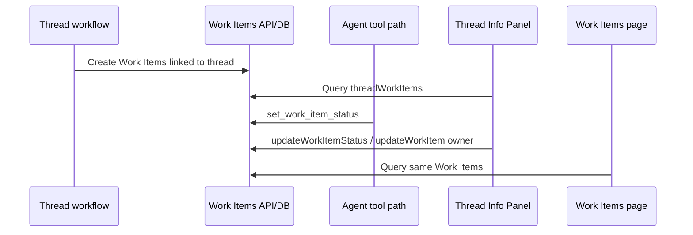
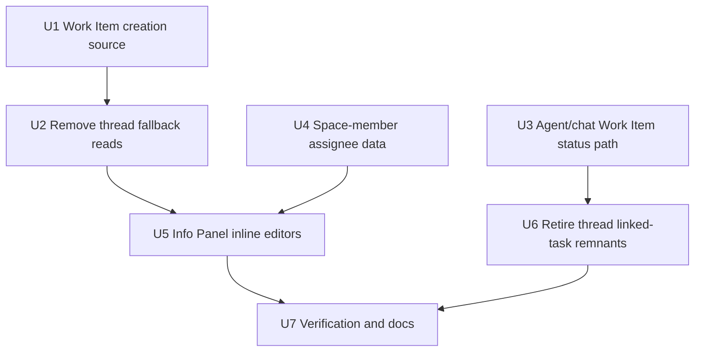
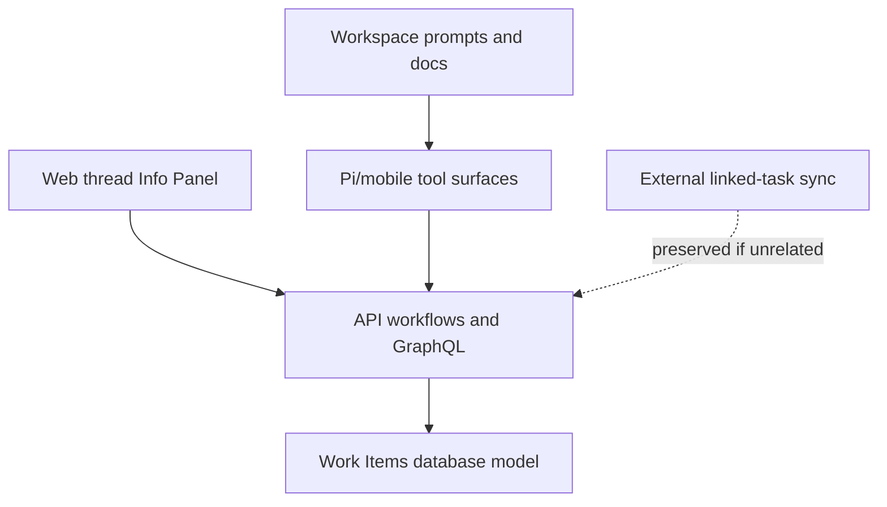

# feat: Cut thread tasks over to Work Items

## Overview

THNK-76 hard-cuts Space thread task progress from the older linked-task and
progress-markdown task model to native Work Items. After this lands, thread
Progress rows are Work Items, Info Panel edits mutate Work Items, agent/chat task
status updates use `set_work_item_status`, and new thread task creation writes
Work Items directly.

This is intentionally not a compatibility migration. Existing linked-task and
progress-markdown code can remain only where it serves unrelated external task
sync or narrative goal/progress files. It must not remain as a thread task row
source, a fallback UI path, or a thread task mutation path.

## Source Requirements

- R1-R4: New Space thread progress tasks must be native Work Items linked to the
  originating thread, with no markdown or linked-task fallback.
- R5-R7: Chat/agent task status mutations must continue through the native Work
  Item tool path and record provenance.
- R8-R12: The Thread Info Panel Progress section must render Work Items and
  support inline status and assignee edits using the Work Items selector
  patterns; assignees come from Space membership.
- R13-R15: User-facing thread task UI/API copy and behavior must use Work Item
  language and remove legacy linked-task/progress-markdown thread-task paths.

## Current System Findings

- `apps/web/src/components/workbench/SpacesThreadDetailRoute.tsx` already queries
  `ThreadWorkItemsQuery`, but it falls back to `ThreadProgressMarkdownQuery` and
  `ThreadLinkedTasksQuery` when native Work Items are absent.
- `apps/web/src/components/workbench/TaskThreadView.tsx` renders Progress rows as
  a clickable checklist that pre-fills the composer. It does not expose inline
  Work Item status or assignee selectors.
- `apps/web/src/components/work-items/WorkItemListRow.tsx` contains the status
  icon selector and assignee selector interaction patterns required by THNK-76,
  but they are local to the Work Items page today.
- `packages/api/src/lib/spaces/customer-onboarding-workflow.ts` still creates
  `linked_tasks` rows first, then creates Work Items with `linkedTaskId`
  metadata.
- `packages/api/src/lib/spaces/customer-onboarding-progress-md.ts` loads Work
  Item-backed progress tasks first, then falls back to `linked_tasks`.
- `packages/pi-extensions/src/task-status.ts` and
  `apps/mobile/lib/agent/extensions/task-status-extension.ts` both advertise
  `set_task_status` and `set_work_item_status`.
- `packages/api/src/lib/work-items/work-item-status-tool.ts` still syncs Work
  Item status changes back to linked tasks and returns `linkedTaskId`.
- `packages/api/src/lib/linked-tasks/*` also supports external linked-task sync.
  That integration should be audited and left alone unless a reference is
  specifically tied to Thread Progress tasks.

Institutional learning from
`docs/solutions/design-patterns/audit-existing-ui-and-data-model-before-parallel-build-2026-04-28.md`
applies here: adapt the existing Work Items model and controls instead of
building a parallel thread-only task system.

## Key Decisions

| Decision | Plan Choice | Reason |
|---|---|---|
| Cutover shape | Hard cutover | Eric confirmed no one is using the old thread task path, so compatibility layers add complexity without value. |
| Thread Progress source | `threadWorkItems` only | Avoids three competing task sources and makes `/work-items` and the thread agree. |
| Agent status tool | `set_work_item_status` only for thread tasks | Work Items own durable task state and already capture event provenance. |
| Info Panel controls | Reuse/extract Work Items selectors | Matches the Work Items page screenshots and avoids duplicate UI behavior. |
| Assignee source | Space members | Thread work belongs to the Space, not the whole tenant roster. |
| Linked-task cleanup | Remove thread-task usage, preserve unrelated external sync | THNK-76 is about thread tasks, not external provider task ingestion. |

## High-Level Design



The implementation should delete row-source fallbacks in the same PR that makes
Work Item creation authoritative. If the UI is cut over before creation is cut
over, new onboarding threads could briefly appear empty. If creation is cut over
before UI cleanup, old fallback code remains misleading. These two units should
land together even if reviewed as separate commits.

## Implementation Units



### U1. Create thread progress as Work Items directly

**Goal:** Customer-onboarding and thread progress workflows create native Work
Items without first creating `linked_tasks` rows or storing `linkedTaskId`
compatibility metadata.

**Files to inspect/edit:**

- `packages/api/src/lib/spaces/customer-onboarding-workflow.ts`
- `packages/api/src/lib/spaces/customer-onboarding-workflow.test.ts`
- `packages/api/src/lib/work-items/customer-onboarding.ts`
- `packages/database-pg/graphql/types/spaces.graphql`
- `packages/database-pg/graphql/types/crm-work-links.graphql`
- `packages/api/src/graphql/resolvers/spaces/startCustomerOnboarding.mutation.ts`
- `packages/api/src/graphql/resolvers/crm/startCustomerOnboardingFromCrmRecord.mutation.ts`
- `packages/api/src/handlers/webhooks/crm-opportunity.ts`
- `packages/api/src/lib/spaces/space-webhook-thread-start.ts`

**Approach:**

1. Replace the onboarding loop that calls `repository.createLinkedTask(...)`
   before `repository.createWorkItem(...)` with a Work Item-only creation path.
2. Remove `linkedTaskId` from Work Item metadata for ThinkWork-created thread
   tasks.
3. Change workflow summaries and recorder metrics from linked-task language to
   Work Item language.
4. Audit GraphQL result types that expose `linkedTasks` from onboarding
   mutations. If only current web/mobile generated types and webhook tests use
   the field, remove it and regenerate codegen. If a short-lived compatibility
   response is needed for external webhook callers, return an empty deprecated
   field without using it internally and schedule deletion in U6.
5. Keep external provider task sync code out of this unit unless it is invoked
   by ThinkWork-created thread tasks.

**Tests:**

- Update onboarding workflow tests so a new thread creates Work Items and zero
  ThinkWork linked tasks.
- Cover idempotent onboarding: repeating the workflow should not duplicate Work
  Items.
- Cover webhook/CRM start paths so they no longer count linked tasks as the
  thread task creation signal.
- Confirm generated GraphQL types compile after result-shape changes.

### U2. Make `threadWorkItems` the only Thread Progress row source

**Goal:** The web thread route renders Progress rows only from Work Items. It no
longer queries linked tasks or progress markdown to build the Info Panel task
list.

**Files to inspect/edit:**

- `apps/web/src/components/workbench/SpacesThreadDetailRoute.tsx`
- `apps/web/src/components/workbench/SpacesThreadDetailRoute.test.tsx`
- `apps/web/src/components/workbench/TaskThreadView.tsx`
- `apps/web/src/lib/graphql-queries.ts`
- `apps/web/src/lib/graphql-queries.test.ts`

**Approach:**

1. Remove `ThreadLinkedTasksQuery` and `ThreadProgressMarkdownQuery` from
   `SpacesThreadDetailRoute.tsx` for Progress-row construction.
2. Delete `parseProgressMarkdownTasks(...)` from the thread Progress path, or
   keep it only if another non-task surface still uses it.
3. Make `infoPanelChecklistTasks` a direct mapping from `threadWorkItems`.
4. Keep `ThreadGoalFilesQuery` and goal/record rendering intact; THNK-76 does
   not remove unrelated goal files or workspace projections.
5. Update loading, polling, error, and empty states so Work Items are the only
   Progress task source. Empty copy should not say "No linked tasks."

**Tests:**

- A thread with Work Items renders the expected Progress rows.
- A thread with no Work Items renders the Work Item empty state, even if old
  markdown/linked-task fixtures exist in the test harness.
- Active-thread polling refreshes `threadWorkItems`, not legacy task queries.
- `graphql-queries.test.ts` no longer expects thread linked-task/progress
  markdown queries for the workbench route.

### U3. Route chat and agent task status through Work Items only

**Goal:** Thread task status changes use `set_work_item_status` and no longer
advertise or execute `set_task_status` for thread task progress.

**Files to inspect/edit:**

- `packages/pi-extensions/src/task-status.ts`
- `packages/pi-extensions/test/capabilities.test.ts`
- `apps/mobile/lib/agent/extensions/task-status-extension.ts`
- `apps/mobile/lib/agent/compat/pi-contract.ts`
- `apps/mobile/lib/platform-tools-client.ts`
- `packages/api/src/handlers/task-status-tool.ts`
- `packages/api/src/handlers/task-status-tool.test.ts`
- `packages/api/src/lib/task-status-tool.ts`
- `packages/api/src/lib/task-status-tool.test.ts`
- `packages/api/src/lib/work-items/work-item-status-tool.ts`
- `packages/api/src/lib/work-items/work-item-status-tool.test.ts`

**Approach:**

1. Stop registering `set_task_status` in Pi and mobile thread task extensions.
2. Update platform contract docs/tests to describe `set_work_item_status` as the
   native task-status tool.
3. Remove linked-task sync from `setWorkItemStatus(...)` and remove
   `linkedTaskId` from its result shape.
4. Decide whether `/api/tasks/status` and `packages/api/src/lib/task-status-tool.ts`
   can be deleted outright after reference auditing. If external linked-task sync
   still needs it, make it non-thread-only and ensure thread prompts/extensions
   cannot call it.
5. Keep provenance in Work Item events: actor, thread ID, thread turn ID, tool
   call ID, note, manual metadata, and timestamp.

**Tests:**

- Pi/mobile capability tests expose `set_work_item_status` and not
  `set_task_status` for thread contexts.
- `set_work_item_status` updates a Work Item status and writes a Work Item event
  with provenance.
- Work Item status tool tests no longer expect `linkedTaskId` sync.
- Any retained `/api/tasks/status` tests explicitly prove it is not part of the
  new thread-task path.

### U4. Query Space members for Thread Progress assignees

**Goal:** The Info Panel assignee picker lists Unassigned plus the current
Space's members, not every tenant member.

**Files to inspect/edit:**

- `packages/database-pg/graphql/types/spaces.graphql`
- `packages/api/src/graphql/resolvers/spaces/types.ts`
- `packages/api/src/graphql/resolvers/spaces/spaces.query.test.ts`
- `apps/web/src/lib/graphql-queries.ts`
- `apps/web/src/components/workbench/SpacesThreadDetailRoute.tsx`
- `apps/web/src/components/workbench/SpacesThreadDetailRoute.test.tsx`

**Approach:**

1. Prefer the existing `Space.members` field if the route already has a Space
   object in scope or can add members to an existing Space query.
2. If that makes the current query too broad, add a focused query for the
   thread's Space members.
3. Map Space members into the same small assignee summary shape used by Work
   Items selectors: `id`, `name`, `email`.
4. If a Work Item is assigned to a user who is no longer a Space member, display
   the current owner label but do not include that user as a selectable new
   assignee unless product decides otherwise during implementation.

**Tests:**

- Assignee options include Unassigned and Space members.
- Tenant members outside the Space are absent.
- Removed Space members disappear from the selectable list after refetch.
- A Work Item with an owner still renders a stable label even when the owner is
  not in the current member option list.

### U5. Add inline Work Item status and assignee editors to Progress rows

**Goal:** Thread Info Panel Progress rows support direct status and assignee
updates using the Work Items page interaction patterns.

**Files to inspect/edit:**

- `apps/web/src/components/workbench/TaskThreadView.tsx`
- `apps/web/src/components/workbench/SpacesThreadDetailRoute.tsx`
- `apps/web/src/components/workbench/TaskThreadView.test.tsx`
- `apps/web/src/components/workbench/SpacesThreadDetailRoute.test.tsx`
- `apps/web/src/components/work-items/WorkItemListRow.tsx`
- New shared Work Items selector components, likely under
  `apps/web/src/components/work-items/`

**Approach:**

1. Extract reusable status and assignee selector components from
   `WorkItemListRow.tsx`, keeping styling and search behavior consistent with
   the Work Items page.
2. Extend `ThreadInfoChecklistTask` or introduce a Work Item-specific Progress
   row model so rows carry `workItemId`, `status`, `statusId`, `ownerUserId`,
   `title`, `required`, `blocked`, `notes`, and `updatedAt`.
3. Pass Work Item statuses, Space-member assignees, and mutation callbacks from
   `SpacesThreadDetailRoute.tsx` into `TaskThreadView.tsx`.
4. Use `UpdateWorkItemStatusMutation` for status changes and
   `UpdateWorkItemMutation` for owner changes. Refetch `threadWorkItems` after
   successful mutations.
5. Prevent selector clicks from triggering the existing row-level task prompt.
   Keep row click available for the composer prompt outside the inline controls
   if it remains useful.
6. Surface mutation failures with existing workbench toast/error patterns.

**Tests:**

- Clicking a Progress row status icon opens the status selector and applies a
  Work Item status mutation.
- Clicking the assignee affordance opens the Space-member picker and applies an
  owner mutation.
- Selector clicks do not prefill the composer.
- Progress percent and required-complete count recalculate after status changes.
- Error paths leave the visible row stable and show a recoverable error.

### U6. Retire thread-task linked-task remnants and compatibility language

**Goal:** Remove leftover thread task references to linked tasks,
`PROGRESS.md`/`TASKS.md` as task authorities, and legacy task-status tooling
after U1-U5 make Work Items authoritative.

**Files to inspect/edit:**

- `packages/database-pg/graphql/types/linked-tasks.graphql`
- `packages/api/src/graphql/resolvers/linked-tasks/*`
- `packages/api/src/graphql/resolvers/linked-tasks/*.test.ts`
- `apps/web/src/gql/graphql.ts`
- `apps/mobile/lib/gql/graphql.ts`
- `apps/cli/src/gql/graphql.ts`
- `packages/workspace-defaults/src/index.ts`
- `packages/system-workspace/*`
- `docs/src/content/docs/concepts/agents/workspace-architecture/workspace-tree.mdx`
- `docs/src/content/docs/concepts/agents/workspace-architecture/turn-lifecycle.mdx`
- `docs/src/content/docs/guides/spaces/goals-and-files.mdx`
- `docs/runbooks/twenty-task-event-server-contract.md`

**Approach:**

1. Run a reference audit for `threadLinkedTasks`, `threadProgressMarkdown`,
   `UpdateLinkedTaskMutation`, `set_task_status`, `linkedTaskId`, and
   `progress_model`.
2. Delete web/mobile/CLI generated GraphQL references by removing schema fields
   only after all application query documents stop using them.
3. Remove or rewrite docs and default workspace prompt language that tells
   agents to update thread task status through `set_task_status` or by treating
   `PROGRESS.md`/`TASKS.md` as the task source.
4. Preserve `packages/api/src/lib/linked-tasks/*` and
   `docs/runbooks/twenty-task-event-server-contract.md` only for external
   provider sync if reference auditing confirms those paths are unrelated to
   ThinkWork thread Progress rows.
5. If any legacy GraphQL fields are retained for external consumers, mark them
   deprecated and ensure THNK-76 UI/runtime paths have zero dependencies on
   them.

**Tests:**

- `rg` audits show no thread Progress UI or agent extension references to
  linked-task task paths.
- Codegen succeeds for web, mobile, CLI, and API after GraphQL schema changes.
- Resolver tests for removed fields are deleted; retained external sync tests
  still pass.
- Docs no longer instruct agents or users to use `set_task_status` for Work
  Item-backed thread tasks.

### U7. Verification and rollout checks

**Goal:** Prove the hard cutover works across creation, UI, chat/tool updates,
and documentation without shipping a compatibility bridge.

**Commands:**

```bash
pnpm --filter @thinkwork/api test
pnpm --filter @thinkwork/web test
pnpm --filter @thinkwork/pi-extensions test
pnpm --filter @thinkwork/mobile test
pnpm --filter @thinkwork/api --if-present codegen
pnpm --filter @thinkwork/web --if-present codegen
pnpm --filter @thinkwork/mobile --if-present codegen
pnpm --filter thinkwork-cli --if-present codegen
pnpm -r --if-present typecheck
pnpm format:check
```

Adjust package-specific commands to the scripts that actually exist at
implementation time; do not use `npm`.

**Manual verification:**

1. Start a new customer-onboarding thread in a deployed stage.
2. Confirm the thread has linked Work Items and no ThinkWork-created
   `linked_tasks` rows for its Progress checklist.
3. Open the thread Info Panel and confirm Progress rows render from Work Items.
4. Change a status from the Progress row selector and confirm `/work-items`
   reflects the same status.
5. Change an assignee from the Progress row selector and confirm only Space
   members were offered.
6. Trigger an agent/chat task status update and confirm it writes a Work Item
   event through `set_work_item_status`.
7. Confirm old progress markdown or linked-task rows, if present in a test
   environment, do not appear as Progress rows when `threadWorkItems` is empty.

## System-Wide Impact



- API creation paths stop creating ThinkWork linked tasks for thread Progress.
- Web removes legacy read fallbacks and adds Work Item mutation controls.
- Pi/mobile stop advertising the legacy thread task status tool.
- Work Item status updates stop syncing back to linked tasks for native thread
  tasks.
- Docs and workspace defaults stop presenting `PROGRESS.md`, `TASKS.md`, or
  `set_task_status` as the task source of truth.
- External provider linked-task sync remains in scope only when it is unrelated
  to Thread Progress rows.

## Risks and Mitigations

- **Hidden consumer of onboarding `linkedTasks` response fields.** Mitigate with
  schema/codegen audits across web, mobile, CLI, API, and webhook handlers before
  deleting fields.
- **Accidental removal of external provider linked-task sync.** Keep
  `packages/api/src/lib/linked-tasks/*` separate from ThinkWork-created thread
  task cleanup unless tests prove a reference is exclusively legacy Thread
  Progress behavior.
- **Thread Info Panel loses progress for existing threads without Work Items.**
  This is an accepted hard-cutover consequence. The UI should show an empty Work
  Item state rather than falling back to old task rows.
- **Assignee selector exposes too broad a roster.** Use Space membership as the
  query source and add a regression test proving tenant-only members are absent.
- **Selector extraction regresses the Work Items page.** Keep the extracted
  components API-compatible with `WorkItemListRow.tsx` and cover both Work Items
  page and Info Panel usages.
- **Prompt/docs drift keeps agents calling old tools.** Include workspace
  defaults and docs in U6 so runtime instructions match the hard cutover.

## Open Questions for Implementation

- Should onboarding GraphQL result fields named `linkedTasks` be deleted in the
  first PR, or retained as deprecated empty fields for one release? The product
  decision is hard cutover; the implementation decision depends on reference
  auditing and generated client impact.
- If a Work Item owner is no longer a Space member, should the Info Panel allow
  clearing that owner only, or also preserve the current owner as a selectable
  disabled/current option? The plan defaults to display-only current owner plus
  Space-member-only selectable choices.
- Should retained external linked-task APIs be renamed or documented to make the
  boundary clearer? This can be deferred unless implementation finds ambiguity
  that risks reintroducing thread-task compatibility.

## Definition of Done

- New thread progress items are Work Items linked to threads.
- Thread Info Panel Progress rows read only `threadWorkItems`.
- Info Panel status and assignee edits mutate Work Items and refetch Progress.
- Chat/agent task status updates use `set_work_item_status` and keep provenance.
- `set_task_status`, `threadLinkedTasks`, progress-markdown parsing, and
  linked-task sync are removed from native thread task paths.
- Space Progress assignee choices are restricted to Space members.
- Docs, workspace defaults, GraphQL generated types, and tests align with the
  Work Item-only thread task model.
