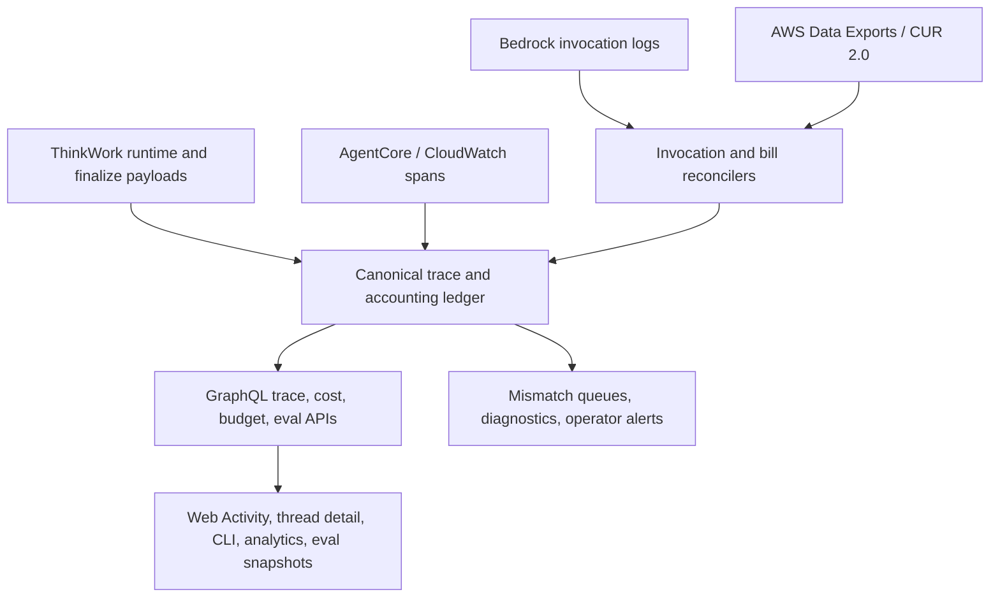
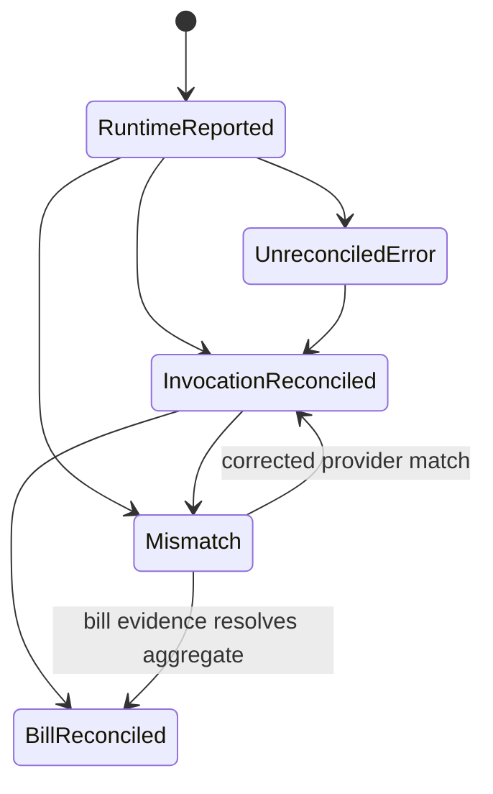
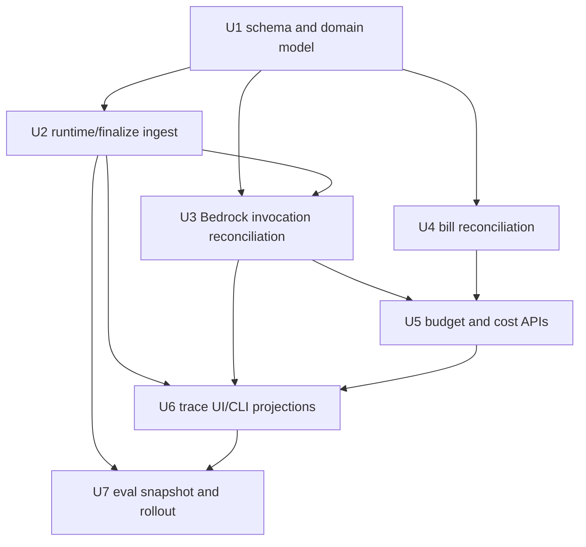
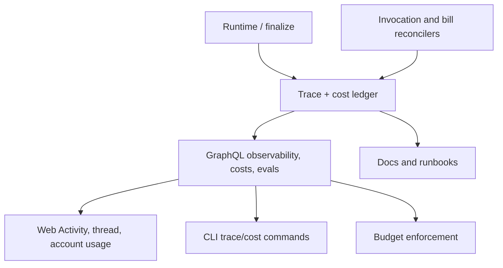

# feat: Build trusted trace and cost accounting substrate

## Overview

ThinkWork needs a trusted trace and cost accounting substrate underneath the
simple thread history projection. The current implementation has useful pieces:
`thread_turns.usage_json`, `cost_events`, runtime diagnostics, CloudWatch span
fetching, Bedrock invocation-log lookup, CLI trace commands, and eval snapshots.
Those pieces are joined differently by different surfaces, so they cannot yet
serve as bill-grade accounting or a complete operator trace.

This plan creates a ThinkWork-owned trace and accounting ledger, reconciles model
invocations against provider-observed Bedrock invocation logs, reconciles
aggregate spend against provider billing exports, and moves GraphQL, web, CLI,
budget, and eval projections onto that substrate. AWS observability remains the
native infrastructure evidence layer, but not the only usable product surface.

---

## Problem Frame

Thread history should be the friendly view, not the source of truth. Today,
Activity, trace CLI commands, eval flagging, and budget-facing cost views combine
different fragments of execution evidence. That makes it hard to answer basic
operator questions such as: what model calls happened, how many tokens were
actually billed, which tool call caused the spend, whether a runtime value was
trusted, and which provider evidence supports the number.

The highest-risk product consequence is budget enforcement. Prior zero-token
incidents show that runtime normalizer drift can silently corrupt usage. THNK-74
requires exact provider-bill reconciliation, and per-invocation Bedrock
invocation-log reconciliation is also required before the platform can treat
token and cost numbers as enforcement-grade. See the origin requirements in
`docs/brainstorms/2026-06-25-trusted-trace-cost-accounting-substrate-requirements.md`.

---

## Requirements Trace

- R1. ThinkWork owns a canonical trace model; thread history, Activity, CLI,
  analytics, evals, and audit views are projections from it.
- R2. Every turn has stable trace identity linking turn, runtime session, model
  invocation, tool invocation, memory/context lookup, workspace hydration,
  response finalization, and cost rows.
- R3. The trace model supports parent/child relationships for model calls, tool
  calls, agent profile runs, sub-agent/profile lanes, memory calls, and runtime
  phases.
- R4. The substrate retains source evidence references for AWS observability and
  billing drill-out.
- R5. Simple product surfaces may stay simple, but no simple surface may be the
  only place trace evidence exists.
- R6. Per-invocation provider-observed reconciliation is required for model
  usage.
- R7. Exact provider-bill reconciliation is required for aggregate model, tool,
  memory, and runtime spend.
- R8. Every usage/cost row carries explicit reconciliation state:
  runtime-reported, invocation-reconciled, bill-reconciled, mismatch, or
  unreconciled/error.
- R9. Hard budget enforcement uses only usage meeting the configured
  reconciliation bar.
- R10. Reconciliation mismatches are visible to operators with tenant, user,
  turn, provider, model/tool, time window, and suspected-cause context.
- R11. Historical usage that cannot be reconciled remains marked with its true
  confidence state.
- R12. Operators can inspect turn trace detail inside ThinkWork without manually
  searching CloudWatch or X-Ray.
- R13. Trace detail shows sequence, token counts, cache-read tokens, estimated
  and reconciled cost, duration, errors, workspace/context evidence, and source
  evidence references.
- R14. CLI trace commands expose canonical evidence with diagnostic empty states.
- R15. Flagging a thread for evaluation snapshots available trace evidence.
- R16. The substrate preserves enough provenance for future trace judgment and
  audit workflows.
- R17. AWS observability remains infrastructure evidence, but trace detail is not
  locked inside CloudWatch.
- R18. Langfuse-style trace/eval workbench exploration is separate from the
  trusted accounting substrate.

**Origin actors:** A1 tenant operator, A2 tenant user, A3 ThinkWork runtime, A4
accounting reconciler, A5 eval system, A6 product surfaces.

**Origin flows:** F1 turn execution produces canonical trace evidence; F2 usage
is reconciled before hard budget enforcement; F3 operator inspects a bad turn;
F4 production failure becomes an eval case with evidence.

**Origin acceptance examples:** AE1 zero-token runtime mismatch; AE2 monthly
provider billing variance; AE3 in-product failed-turn trace inspection; AE4 eval
case includes trace evidence; AE5 historical unreconciled usage is labeled.

---

## Scope Boundaries

- This plan does not make Langfuse, CloudWatch, or X-Ray the ThinkWork product
  source of truth for budgets.
- This plan does not require exact real-time provider bills before a turn can
  complete. Bill reconciliation is asynchronous, but becomes accounting truth
  when available.
- This plan does not expose raw prompt/tool payloads everywhere. Redaction,
  retention, tenant roles, and payload visibility must be explicit in the
  implementation.
- This plan does not replace the simple thread history experience.
- This plan does not silently reinterpret historical usage as exact when source
  provider evidence is missing.
- This plan does not reintroduce Mastra or promptfoo for evaluations; AWS
  Bedrock AgentCore Evaluations remains the backing store.

### Deferred to Follow-Up Work

- THNK-75 explores a Langfuse-style trace/eval workbench for richer trace review,
  annotation, comparison, and evaluator authoring. That workbench may consume or
  mirror this substrate, but it does not replace it as source of truth.
- Full trace retention policy, cross-tenant analytics exports, and long-term
  warehouse modeling can be expanded after the substrate proves the canonical
  event and reconciliation model.

---

## Context & Research

### Relevant Code and Patterns

- `packages/database-pg/src/schema/cost-events.ts` defines the current
  `cost_events` table. It already carries tenant/user/agent IDs, request ID,
  event type, provider/model, token fields, duration, trace ID, metadata, and a
  uniqueness constraint on `(request_id, event_type)`, but it lacks explicit
  reconciliation lifecycle fields.
- `packages/database-pg/src/schema/scheduled-jobs.ts` defines `thread_turns`,
  including `usage_json`, `result_json`, `context_snapshot`, and related
  `thread_turn_events`. This is a projection source today and should become a
  consumer of canonical trace/accounting evidence.
- `packages/api/src/lib/cost-recording.ts` extracts usage from several runtime
  shapes and records model/tool/runtime cost estimates. When usage is missing it
  can record zero-token estimated rows, so this area needs characterization
  coverage before becoming enforcement-grade.
- `packages/api/src/lib/chat-finalize/process-finalize.ts` persists finalize
  diagnostics and composes `turnUsage` from diagnostics, tool invocations,
  model-routed tool calls, agent profile runs, parent usage, and aggregate cost.
  This is the natural handoff point from runtime evidence into the canonical
  ledger.
- `packages/api/src/lib/agentcore-spans.ts` and
  `packages/api/src/lib/agentcore-spans.test.ts` already normalize span-shaped
  records from `aws/spans` and runtime log groups. This should remain an AWS
  source-evidence adapter, not the product data model.
- `packages/api/src/graphql/resolvers/observability/threadTraces.query.ts`
  currently builds trace events from filtered `cost_events`.
- `packages/api/src/graphql/resolvers/observability/turnInvocationLogs.query.ts`
  queries Bedrock invocation logs by turn time window. Its current test coverage
  focuses on timestamp normalization and should be expanded for reconciliation.
- `packages/database-pg/graphql/types/observability.graphql` and
  `packages/database-pg/graphql/types/costs.graphql` define the public GraphQL
  projection surfaces that need reconciliation state and canonical evidence.
- `apps/cli/src/commands/trace.ts` exposes `trace thread` and `trace turn`; this
  should stay a parity surface for canonical trace detail.
- `apps/web/src/components/settings/SettingsActivityExecutionTrace.tsx`,
  `apps/web/src/components/workbench/FlagThreadForEvalDialog.tsx`, and
  `apps/web/src/components/workbench/TaskThreadView.tsx` already render pieces
  of execution evidence and should switch to canonical trace projections.

### Institutional Learnings

- `docs/solutions/runtime-errors/wakeup-turns-zero-token-usage-extractusage-2026-06-11.md`
  documents the prior zero-token wakeup usage bug. The plan should preserve the
  lesson: test the real `extractUsage` path, do not copy its logic into tests,
  and label historical zero-token data truthfully.
- `docs/plans/2026-06-06-005-fix-tool-tracking-fallback-cost-plan.md` shows the
  existing direction for parent/child routed-model and tool-cost evidence. This
  plan should generalize that shape instead of creating another parallel join.
- `docs/src/content/docs/concepts/control/budgets-usage-and-audit.mdx` already
  describes an OTel-style span and audit model, but also admits current cost
  numbers are estimates and the canonical cost record is the AWS bill. This plan
  brings implementation closer to that product promise.
- `docs/src/content/docs/applications/admin/analytics.mdx` notes that analytics
  cost attribution is evolving. The new substrate should make confidence state
  visible rather than hiding that evolution.

### External References

- AWS Bedrock AgentCore Observability emits runtime telemetry into CloudWatch
  Application Signals and Transaction Search:
  `https://docs.aws.amazon.com/bedrock-agentcore/latest/devguide/observability-configure.html`
  and
  `https://docs.aws.amazon.com/bedrock-agentcore/latest/devguide/observability.html`.
- CloudWatch Transaction Search treats spans as structured log records and can
  search, analyze, visualize, and subscribe to span streams, but span log groups
  have CloudWatch-specific constraints and are not a ThinkWork product model:
  `https://docs.aws.amazon.com/AmazonCloudWatch/latest/monitoring/CloudWatch-Transaction-Search.html`.
- Bedrock model invocation logging can deliver invocation logs and model
  input/output records to CloudWatch Logs and/or S3:
  `https://docs.aws.amazon.com/bedrock/latest/userguide/model-invocation-logging.html`.
- Bedrock token observability documents that `InputTokenCount` excludes cached
  tokens and cache-write usage may need separate accounting:
  `https://docs.aws.amazon.com/bedrock/latest/userguide/quotas-token-burndown.html`.
- AWS Data Exports/CUR 2.0 is the current recommended path for detailed AWS cost
  and usage export:
  `https://docs.aws.amazon.com/cur/latest/userguide/what-is-data-exports.html`.
- CUR reports update up to three times daily and include estimated charges by
  product, usage type, operation, and other line-item dimensions:
  `https://docs.aws.amazon.com/cur/latest/userguide/what-is-cur.html`.

---

## Key Technical Decisions

- **ThinkWork-owned canonical ledger, AWS-backed source evidence:** Store a
  canonical trace/accounting model in ThinkWork Postgres and retain references to
  CloudWatch spans, Bedrock invocation logs, S3 objects, and billing export rows.
  Rationale: CloudWatch is excellent evidence infrastructure, but product
  surfaces need queryable, tenant-aware, redacted, correlated data with stable
  semantics.
- **Append evidence first, project views second:** Model runtime events,
  observations, reconciliation facts, and cost states as appendable evidence,
  then derive thread history, Activity, CLI, analytics, eval snapshots, and
  budget views. Rationale: this prevents each projection from inventing its own
  partial trace semantics.
- **Provider evidence wins over runtime estimates:** Runtime-reported usage is
  recorded as an initial observation. Bedrock invocation logs can correct or
  mark mismatches at invocation level. CUR/Data Export rows become the aggregate
  bill-grade baseline. Rationale: budgets require auditable provider alignment,
  not just application self-reporting.
- **Reconciliation state is first-class:** Cost rows and derived usage must carry
  state, source, timestamps, variance, and confidence. Rationale: users can see
  estimates, but strict budgets and exact spend views must distinguish estimated,
  invocation-reconciled, bill-reconciled, mismatch, and unreconciled data.
- **Budgets enforce from configured confidence:** Hard enforcement should not
  silently trust runtime-only rows. A tenant or stage may choose conservative
  behavior for delayed bill data, but the enforcement basis must be explicit.
  Rationale: this protects users from both under-counting and over-blocking.
- **No historical silent upgrade:** Backfilled historical rows should remain
  unreconciled unless source evidence can actually prove them. Rationale:
  presenting old estimates as exact would violate AE5 and erode trust.
- **Build substrate before workbench:** THNK-75 can explore a trace/eval
  workbench, including Langfuse-style UX or integrations. THNK-74 should first
  establish the source-of-truth substrate that any workbench consumes.

---

## Alternative Approaches Considered

| Approach                                      | Why not chosen for THNK-74                                                                                                                                                       |
| --------------------------------------------- | -------------------------------------------------------------------------------------------------------------------------------------------------------------------------------- |
| Keep CloudWatch as the main trace UI          | It preserves AWS-native evidence but leaves tenant-aware product access, eval snapshots, budget confidence, and user-facing projections dependent on console drill-out.          |
| Adopt Langfuse as the default source of truth | Langfuse may be useful for workbench UX, but exact AWS bill reconciliation and ThinkWork budget enforcement need a product-owned accounting ledger.                              |
| Extend `cost_events` only                     | This is the smallest schema change, but it keeps trace structure, source evidence, and reconciliation facts overloaded into one table and makes richer trace projections harder. |
| Build only a trace workbench first            | It improves debugging UX but does not solve bill-grade cost accounting or budget enforcement confidence.                                                                         |

---

## Open Questions

### Resolved During Planning

- Which billing baseline should anchor exact provider-bill reconciliation? Use
  AWS Data Exports/CUR 2.0 as the primary AWS-native billing export path, with
  implementation responsible for wiring stage/account prerequisites.
- Should AWS observability or ThinkWork be the default product source of truth?
  ThinkWork owns the canonical trace/accounting substrate; AWS observability
  provides provider/source evidence references and drill-out.
- Should Langfuse block this substrate? No. Langfuse/workbench exploration is a
  separate THNK-75 effort and can consume this substrate later.

### Deferred to Implementation

- Exact table and column names for canonical trace events, observations,
  reconciliation facts, and cost states. The plan defines the model boundaries;
  final schema should follow repository conventions during implementation.
- Exact Bedrock invocation-log fields available for every model path and whether
  S3 delivery, CloudWatch delivery, or both should be enabled by default.
  Implementation should prove this with sample fixtures and deployed evidence.
- Exact variance tolerances for bill reconciliation. Implementation can start
  with configurable defaults and surface variance, but product owners should
  approve enforcement thresholds before strict customer-facing blocking.
- Exact retention and redaction policy for raw invocation payload references.
  The substrate must store source references and safe summaries; raw payload
  exposure can remain role-gated and policy-driven.
- Whether historical rows can be partially reconciled from existing Bedrock log
  retention windows. Rows without proof remain unreconciled.

---

## High-Level Technical Design

> _This illustrates the intended approach and is directional guidance for
> review, not implementation specification. The implementing agent should treat
> it as context, not code to reproduce._

The intended lifecycle is:

| Stage                     | Primary evidence                                 | Accounting state                              |
| ------------------------- | ------------------------------------------------ | --------------------------------------------- |
| Runtime finalize          | Runtime usage, tool/profile evidence, phase logs | `runtime-reported` or `unreconciled/error`    |
| Invocation reconciliation | Bedrock invocation log evidence                  | `invocation-reconciled` or `mismatch`         |
| Bill reconciliation       | CUR/Data Export line items                       | `bill-reconciled` or `mismatch`               |
| Product projection        | Canonical ledger rows and safe summaries         | Surface-specific views with confidence labels |

Reconciliation state should behave like an auditable lifecycle rather than a
single mutable label. Each transition should retain the previous observation,
the evidence that justified the transition, the actor/process that made it, and
the time window it applies to. Mismatch resolution can add new evidence or a
human/operator disposition, but it should not erase the original runtime,
invocation, or bill facts.

---

## Implementation Units

- U1. **Define canonical trace and accounting schema**

**Goal:** Create the durable data model and TypeScript domain layer for traces,
trace events/observations, source-evidence references, reconciliation facts, and
cost confidence states.

**Requirements:** R1, R2, R3, R4, R8, R11; supports F1, F2, AE5.

**Dependencies:** None.

**Files:**

- Create: `packages/database-pg/src/schema/trace-ledger.ts`
- Modify: `packages/database-pg/src/schema/index.ts`
- Modify: `packages/database-pg/src/schema/cost-events.ts`
- Modify: `packages/database-pg/graphql/types/observability.graphql`
- Modify: `packages/database-pg/graphql/types/costs.graphql`
- Create: `packages/api/src/lib/trace-ledger/trace-types.ts`
- Create: `packages/api/src/lib/trace-ledger/reconciliation-state.ts`
- Create: `packages/api/src/lib/trace-ledger/reconciliation-state.test.ts`
- Create: `packages/database-pg/drizzle/<next>_trace_cost_substrate.sql`

**Approach:**

- Add a canonical ledger model without forcing all existing projections to move
  in the same unit. The model should represent trace identity, parent/child
  relationships, event/observation type, safe summary metadata, source evidence
  references, reconciliation status, and provider variance facts.
- Keep `cost_events` compatible during migration, but add or relate
  reconciliation state so existing analytics can dual-read before switching.
- Treat source evidence as references and safe summaries, not as uncontrolled raw
  payload storage. Include enough fields to reopen CloudWatch, Bedrock log, S3,
  or billing evidence.
- Represent current reconciliation state as a derived view over durable evidence
  records when practical. If implementation stores a denormalized current state
  for query speed, tests should prove it remains consistent with the evidence
  lifecycle.

**Execution note:** Add characterization tests for reconciliation-state behavior
before changing cost semantics. This area is budget-critical.

**Patterns to follow:**

- `packages/database-pg/src/schema/cost-events.ts` for tenant-scoped cost data.
- `packages/database-pg/graphql/types/observability.graphql` for trace-facing
  GraphQL vocabulary.
- `packages/database-pg/drizzle/` migrations, including hand-rolled migration
  headers where the repo expects drift reporting.

**Test scenarios:**

- Happy path: creating a runtime-reported model usage observation produces a
  trace-linked accounting row with tenant, turn, provider, model, token counts,
  source type, and `runtime-reported` state.
- Happy path: attaching an invocation reconciliation fact updates or derives the
  current state as `invocation-reconciled` while preserving the original runtime
  observation.
- Edge case: a historical row with no source evidence remains `unreconciled`
  and is not auto-upgraded.
- Error path: invalid state transitions, such as bill reconciliation without a
  source reference, are rejected or represented as explicit error state rather
  than silently accepted.
- Error path: a mismatch resolution appends resolving evidence or disposition
  without deleting the original runtime and provider observations.
- Integration: generated GraphQL types expose reconciliation state and source
  evidence fields needed by observability and cost resolvers.

**Verification:**

- The schema can represent a full turn with nested tool/model/profile evidence,
  runtime estimate, invocation evidence, bill evidence, and an unreconciled
  historical cost row.
- Existing `cost_events` consumers can continue to function during dual-write or
  dual-read migration.

---

- U2. **Ingest runtime and finalize evidence into the ledger**

**Goal:** Dual-write runtime/finalize evidence into the canonical ledger while
preserving existing thread and cost projections.

**Requirements:** R1, R2, R3, R5, R12, R13; supports F1, F3, AE3.

**Dependencies:** U1.

**Files:**

- Create: `packages/api/src/lib/trace-ledger/record-trace-evidence.ts`
- Create: `packages/api/src/lib/trace-ledger/record-trace-evidence.test.ts`
- Modify: `packages/api/src/lib/chat-finalize/process-finalize.ts`
- Modify: `packages/api/src/lib/chat-finalize/process-finalize.test.ts`
- Modify: `packages/api/src/lib/cost-recording.ts`
- Modify: `packages/api/src/lib/cost-recording.extract-usage.test.ts`
- Modify: `packages/api/src/lib/agentcore-phase-log.ts`
- Modify: `packages/agentcore-pi/agent-container/src/server.ts`
- Modify: `packages/pi-runtime-core/src/agent-loop.ts`

**Approach:**

- Use finalize processing as the first reliable ingestion boundary because it
  already sees parent usage, diagnostics, tool invocations, model-routed tool
  evidence, agent profile runs, and workspace reconciliation diagnostics.
- Preserve existing `usage_json` and `cost_events` writes while adding ledger
  writes, so later units can switch readers with lower migration risk.
- Normalize runtime phases, workspace hydration, memory/context lookup, tool
  execution, model-routed tools, and profile runs into parent/child trace
  evidence.
- Store missing or zero token values as runtime observations with explicit
  confidence rather than treating them as bill-grade truth.

**Patterns to follow:**

- `packages/api/src/lib/chat-finalize/process-finalize.ts` for current finalize
  aggregation.
- `packages/api/src/lib/cost-recording.ts` for current cost-event writes and
  usage extraction.
- `packages/pi-runtime-core/src/agent-loop.ts` for tool/model/profile evidence
  emitted by the runtime.

**Test scenarios:**

- Happy path: a turn with one model call, one tool call, and workspace
  diagnostics persists canonical parent/child trace evidence and keeps the
  existing thread projection unchanged.
- Happy path: model-routed tool evidence and agent profile run evidence are
  linked to their parent turn and parent request IDs.
- Edge case: runtime usage reports zero tokens while diagnostics include enough
  request identity to reconcile later; the ledger records runtime-reported zero
  as low confidence, not bill-reconciled usage. Covers AE1.
- Error path: ledger write failure does not falsely mark the turn as
  reconciled; the failure is visible in diagnostics or retryable operational
  evidence.
- Integration: `thread_turns.usage_json`, `cost_events`, and the new ledger rows
  agree on stable turn/request identity for the same finalized turn.

**Verification:**

- New ledger evidence exists for newly finalized turns, including nested runtime
  phases and tool/model/profile relationships.
- Existing Activity, thread, and cost surfaces continue to work before reader
  migration.

---

- U3. **Reconcile Bedrock invocations per invocation**

**Goal:** Add an invocation reconciler that matches runtime/model usage
observations to Bedrock provider-observed invocation logs and records corrected
usage, mismatches, or unreconciled errors.

**Requirements:** R4, R6, R8, R10, R13, R14; supports F2, F3, AE1, AE3.

**Dependencies:** U1, U2.

**Files:**

- Create: `packages/api/src/lib/trace-ledger/bedrock-invocation-reconciler.ts`
- Create: `packages/api/src/lib/trace-ledger/bedrock-invocation-reconciler.test.ts`
- Modify: `packages/api/src/graphql/resolvers/observability/turnInvocationLogs.query.ts`
- Modify: `packages/api/src/graphql/resolvers/observability/turnInvocationLogs.query.test.ts`
- Create: `packages/api/src/handlers/trace-invocation-reconciler.ts`
- Modify: `packages/api/src/handlers/index.ts`
- Modify: `terraform/modules/app/lambda-api/handlers.tf`
- Modify: `terraform/modules/app/iam-grouped.tf`
- Modify: `terraform/modules/app/variables.tf`

**Approach:**

- Reuse the existing Bedrock invocation-log resolver logic as an adapter, but
  move reconciliation rules into a reusable library that can run from GraphQL
  diagnostics and scheduled/background processing.
- Match by strongest available identity first, then fall back to bounded
  tenant/turn/time/model matching with explicit lower confidence. Ambiguous
  matches should produce unreconciled or mismatch evidence, not silent success.
- Record provider-observed token counts, cache-read/cache-write fields when
  present, model ID, request ID, duration, error state, and source log reference.
- Make missing log group, permission denial, malformed record, and timeout states
  diagnosable through GraphQL/CLI.
- Route mismatch records into an operator-visible work queue or diagnostics
  surface with enough context for triage, even if the first implementation is a
  resolver/API projection rather than a dedicated UI.

**Patterns to follow:**

- `packages/api/src/graphql/resolvers/observability/turnInvocationLogs.query.ts`
  for current CloudWatch query shape.
- `packages/api/src/lib/agentcore-spans.ts` for AWS log adapter normalization.
- Terraform Lambda handler/IAM patterns under `terraform/modules/app/`.

**Test scenarios:**

- Happy path: one runtime usage observation matches one Bedrock invocation log;
  provider token counts and source references are recorded as
  `invocation-reconciled`.
- Happy path: runtime reports zero tokens and Bedrock logs report non-zero
  tokens; the ledger records mismatch/correction and budget-facing confidence no
  longer trusts the zero. Covers AE1.
- Edge case: multiple Bedrock records fall inside the time window with the same
  model; the reconciler refuses an ambiguous automatic match unless a stable
  request identity disambiguates it.
- Error path: CloudWatch access denied or log group missing records a
  retryable/unreconciled state with operator-readable diagnostics.
- Integration: `turnInvocationLogs` can show source invocation records and their
  reconciliation result for the same turn.

**Verification:**

- Per-invocation model usage has provider-observed reconciliation state for new
  turns when Bedrock logs are available.
- Operators can distinguish matched, mismatched, ambiguous, and inaccessible
  invocation evidence from ThinkWork.
- A reconciler rerun is idempotent for already-matched invocation evidence and
  appends new facts only when source evidence or resolution state changes.

---

- U4. **Reconcile aggregate spend against AWS billing exports**

**Goal:** Import AWS Data Exports/CUR 2.0 billing rows and reconcile aggregate
spend against invocation/runtime/tool/memory accounting rows by provider,
service, model/operation, tenant attribution, and time window.

**Requirements:** R7, R8, R10, R11; supports F2, AE2, AE5.

**Dependencies:** U1; benefits from U3 for stronger attribution.

**Files:**

- Create: `packages/api/src/lib/billing-reconciliation/aws-cur-import.ts`
- Create: `packages/api/src/lib/billing-reconciliation/aws-cur-import.test.ts`
- Create: `packages/api/src/lib/billing-reconciliation/bill-reconciler.ts`
- Create: `packages/api/src/lib/billing-reconciliation/bill-reconciler.test.ts`
- Create: `packages/api/src/handlers/cost-bill-reconciler.ts`
- Modify: `packages/api/src/handlers/index.ts`
- Modify: `packages/database-pg/src/schema/cost-events.ts`
- Modify: `packages/database-pg/graphql/types/costs.graphql`
- Modify: `terraform/modules/app/lambda-api/handlers.tf`
- Modify: `terraform/modules/app/iam-grouped.tf`
- Modify: `terraform/modules/app/variables.tf`
- Modify: `terraform/modules/app/outputs.tf`

**Approach:**

- Treat CUR/Data Export delivery as asynchronous bill evidence. Import enough
  row metadata to compare provider/service/operation/model/time-window spend to
  ThinkWork accounting projections.
- Store bill reconciliation facts separately from runtime and invocation
  observations so the current bill-grade state can be derived without losing
  earlier evidence.
- Make tenant attribution explicit. Where AWS billing rows cannot directly
  identify tenant/user/turn, reconcile at the strongest defensible aggregate
  level and surface attribution limitations.
- Start with read/import/reconcile primitives that work against sample CUR
  fixtures. Terraform can expose configuration for the export bucket/prefix, but
  customer account setup details may remain an operator prerequisite if AWS
  requires out-of-band billing configuration.
- Make the aggregate attribution level explicit in each bill reconciliation
  fact. Exact billing can be exact at account/service/window level even when
  per-turn allocation remains estimated; the product must show that distinction
  instead of flattening both into one "exact" label.

**Patterns to follow:**

- Existing Lambda handler registration in `packages/api/src/handlers/index.ts`.
- Cost summary resolvers under `packages/api/src/graphql/resolvers/costs/`.
- AWS export delivery and manifest concepts from AWS Data Exports/CUR docs.

**Test scenarios:**

- Happy path: a CUR fixture for a completed billing window matches aggregate
  ThinkWork model usage within tolerance and marks affected rows
  `bill-reconciled`.
- Happy path: a bill row arrives after invocation reconciliation and upgrades
  the aggregate confidence without deleting invocation-level evidence.
- Edge case: historical rows without invocation evidence are included in
  aggregate comparison but remain individually unreconciled when proof is
  missing. Covers AE5.
- Error path: malformed CUR row, missing manifest, or unsupported service code
  creates an import/reconciliation error visible to operators.
- Integration: monthly provider billing variance outside tolerance is surfaced
  with tenant/time-window/provider context. Covers AE2.
- Integration: an account-level CUR match with incomplete tenant attribution
  records bill evidence at the supported aggregate level and leaves per-tenant
  allocation confidence separate.

**Verification:**

- The platform can ingest representative CUR/Data Export files, persist bill
  evidence, and report matched/mismatched aggregate spend.
- Billing reconciliation does not falsely imply exact per-turn proof when the
  provider export only supports aggregate proof.

---

- U5. **Make budgets and cost APIs confidence-aware**

**Goal:** Update cost summaries, account usage, and budget enforcement so strict
decisions depend on configured reconciliation confidence and visible mismatch
state.

**Requirements:** R7, R8, R9, R10, R11; supports F2, AE1, AE2, AE5.

**Dependencies:** U1, U3, U4.

**Files:**

- Modify: `packages/api/src/lib/cost-recording.ts`
- Modify: `packages/api/src/lib/cost-recording.extract-usage.test.ts`
- Modify: `packages/api/src/lib/user-budget-enforcement.ts`
- Modify: `packages/api/src/lib/user-budget-enforcement.test.ts`
- Modify: `packages/api/src/graphql/resolvers/costs/accountUsage.query.ts`
- Modify: `packages/api/src/graphql/resolvers/costs/costSummary.query.ts`
- Modify: `packages/api/src/graphql/resolvers/costs/*.test.ts`
- Modify: `packages/database-pg/graphql/types/costs.graphql`
- Modify: `apps/web/src/components/profile/AccountUsageSection.tsx`

**Approach:**

- Add confidence/reconciliation filters to cost aggregation and budget checks.
  Runtime-only usage may be visible with labels, but hard enforcement should use
  the configured confidence bar.
- Surface mismatch and unreconciled totals separately so operators can see risk
  without mixing estimates into bill-grade numbers.
- Preserve existing cost views during transition by adding fields rather than
  removing current ones immediately.

**Patterns to follow:**

- Existing account usage and budget resolver shapes under
  `packages/api/src/graphql/resolvers/costs/`.
- Existing user budget enforcement helper and tests.
- `docs/src/content/docs/concepts/control/budgets-usage-and-audit.mdx` for the
  product promise around budgets and audit.

**Test scenarios:**

- Happy path: bill-reconciled usage counts toward strict budget enforcement and
  appears in exact spend totals.
- Happy path: invocation-reconciled but not bill-reconciled usage is included
  only when the budget policy allows that confidence level.
- Edge case: runtime-only usage is shown as estimated but does not silently drive
  strict hard-budget blocking. Covers AE1.
- Error path: mismatched usage causes an operator-visible diagnostic and is
  excluded or treated according to explicit policy.
- Integration: account usage GraphQL results include totals split by confidence
  state and remain consumable by the web account usage component. Covers AE5.

**Verification:**

- Budget behavior is explainable from API output: every blocking or warning
  decision can be tied to reconciliation state and source evidence.
- Analytics and account usage show estimated, invocation-reconciled,
  bill-reconciled, mismatch, and unreconciled buckets without double-counting.

---

- U6. **Move trace detail GraphQL, web, and CLI projections onto the substrate**

**Goal:** Replace ad hoc trace joins with canonical trace projections for
operators, CLI users, Activity, thread detail, and analytics-adjacent views.

**Requirements:** R1, R5, R12, R13, R14, R17; supports F1, F3, AE3.

**Dependencies:** U1, U2, U3, U5.

**Files:**

- Modify: `packages/api/src/graphql/resolvers/observability/threadTraces.query.ts`
- Modify: `packages/api/src/graphql/resolvers/observability/threadTraces.query.test.ts`
- Modify: `packages/api/src/graphql/resolvers/observability/turnInvocationLogs.query.ts`
- Modify: `packages/database-pg/graphql/types/observability.graphql`
- Modify: `apps/cli/src/commands/trace.ts`
- Modify: `apps/cli/__tests__/trace.test.ts`
- Modify: `apps/web/src/components/settings/SettingsActivityExecutionTrace.tsx`
- Modify: `apps/web/src/components/workbench/TaskThreadView.tsx`
- Modify: `apps/web/src/components/workbench/FlagThreadForEvalDialog.tsx`
- Create: `apps/web/src/components/settings/SettingsActivityExecutionTrace.test.tsx`

**Approach:**

- Keep the default user experience simple, but make the operator trace expansion
  read canonical trace events, accounting states, and source evidence references.
- Convert `threadTraces` from a `cost_events`-filtered projection to a canonical
  trace query. Keep compatibility fields where CLI/web consumers rely on them.
- Have `turnInvocationLogs` expose provider log evidence plus reconciliation
  status instead of acting as an independent trace source.
- Return diagnostic empty states for no trace, no provider logs, no permission,
  and unreconciled evidence.

**Patterns to follow:**

- Existing observability resolvers under
  `packages/api/src/graphql/resolvers/observability/`.
- `apps/cli/src/commands/trace.ts` formatting and diagnostic style.
- `apps/web/src/components/settings/SettingsActivityExecutionTrace.tsx` timeline
  composition.

**Test scenarios:**

- Happy path: a turn with model, tool, workspace, and reconciliation evidence
  renders in GraphQL, CLI, and web timeline with consistent sequence and state.
  Covers AE3.
- Happy path: CLI `trace turn` shows provider-observed token counts, cache-read
  tokens, reconciled cost, and source evidence references when present.
- Edge case: a turn with only historical unreconciled `cost_events` renders a
  diagnostic unreconciled state rather than pretending trace detail is complete.
  Covers AE5.
- Error path: provider log access failure returns a diagnostic empty/error state
  instead of a generic GraphQL failure. Covers R14.
- Integration: flag-for-eval completeness detects canonical tool/model trace
  evidence rather than only checking old usage JSON fields.

**Verification:**

- Operators can inspect a bad turn from ThinkWork and see sequence, token/cost
  confidence, timing, errors, workspace/context evidence, and source references
  without CloudWatch as the primary UI.
- CLI and web report the same reconciliation state for the same turn.

---

- U7. **Snapshot trace evidence for evals and roll out safely**

**Goal:** Include canonical trace evidence in eval snapshots, backfill existing
data truthfully, update docs/runbooks, and make the rollout observable.

**Requirements:** R11, R15, R16, R17, R18; supports F4, AE4, AE5.

**Dependencies:** U1, U2, U6; benefits from U3, U4, U5 for richer evidence.

**Files:**

- Modify: `packages/api/src/graphql/resolvers/evaluations/flag-thread.ts`
- Modify: `packages/api/src/graphql/resolvers/evaluations/flag-thread.test.ts`
- Modify: `packages/api/src/lib/evals/thread-snapshot.ts`
- Modify: `packages/api/src/lib/evals/thread-snapshot.test.ts`
- Create: `packages/api/src/lib/trace-ledger/backfill-existing-cost-events.ts`
- Create: `packages/api/src/lib/trace-ledger/backfill-existing-cost-events.test.ts`
- Modify: `docs/src/content/docs/concepts/control/budgets-usage-and-audit.mdx`
- Modify: `docs/src/content/docs/applications/admin/analytics.mdx`
- Create: `docs/solutions/observability/trusted-trace-cost-accounting-substrate.md`

**Approach:**

- Extend eval flagging and thread snapshots to include canonical trace evidence
  summaries and provenance references that are safe to retain in eval datasets.
- Backfill existing `cost_events` and `thread_turns.usage_json` into the ledger
  as historical observations with `unreconciled` state unless provider evidence
  can actually prove reconciliation.
- Update documentation to distinguish runtime estimates, invocation-reconciled
  usage, and bill-reconciled accounting.
- Add operational guidance for mismatch triage, delayed CUR delivery, Bedrock
  log gaps, and trace evidence retention.

**Patterns to follow:**

- Existing eval snapshot helpers under `packages/api/src/lib/evals/`.
- Existing docs style in
  `docs/src/content/docs/concepts/control/budgets-usage-and-audit.mdx`.
- Existing solution docs under `docs/solutions/`.

**Test scenarios:**

- Happy path: flagging a production thread for eval stores conversation,
  resolution target, tool/model trace evidence, and source provenance summary.
  Covers AE4.
- Happy path: backfilled historical cost rows appear as historical
  unreconciled evidence with no false upgrade. Covers AE5.
- Edge case: trace evidence contains restricted raw payload references; eval
  snapshot stores safe summaries and source reference IDs, not uncontrolled raw
  prompt/tool payloads.
- Error path: trace evidence lookup fails during eval flagging; the eval case is
  either rejected with a clear diagnostic or saved with explicit trace evidence
  gap metadata, not silent partial truth.
- Integration: documentation examples match the actual GraphQL/API vocabulary
  for reconciliation state.

**Verification:**

- Production failures flagged into eval datasets carry enough trace evidence to
  explain model/tool behavior and support later trace judgment.
- Historical analytics do not present old estimates as bill-grade data.
- Docs and runbooks explain how operators should interpret reconciliation state
  and mismatches.

---

## System-Wide Impact

- **Interaction graph:** Runtime finalize, cost recording, CloudWatch/Bedrock log
  adapters, billing import handlers, GraphQL observability/cost/eval resolvers,
  web Activity/thread/account views, CLI trace commands, and budget enforcement
  all touch the new substrate.
- **Error propagation:** Reconciler failures should become explicit
  unreconciled/error states and operator diagnostics. They should not collapse
  into generic GraphQL errors or silently mark costs as trusted.
- **State lifecycle risks:** Ledger writes are append/evidence-oriented; derived
  current state should avoid double-counting when runtime, invocation, and bill
  evidence all refer to the same usage.
- **API surface parity:** Web, CLI, Activity, trace detail, analytics, budgets,
  and eval snapshots should share the same reconciliation vocabulary.
- **Integration coverage:** Cross-layer tests need to prove that a finalized
  turn can be ingested, reconciled, surfaced, and snapshotted consistently.
- **Unchanged invariants:** ThinkWork remains AWS-only, AgentCore-native, and
  tenant-scoped. Simple thread history remains the default user projection.

---

## Dependencies / Prerequisites

- Bedrock model invocation logging must be enabled and configured with a
  destination that ThinkWork can read for the relevant deployment account/region.
- AgentCore Observability / CloudWatch Transaction Search should remain enabled
  for runtime span evidence and AWS drill-out.
- AWS Data Exports/CUR 2.0 delivery must be configured for the account or
  billing context where exact provider-bill reconciliation is required.
- Terraform/IAM updates must grant reconcilers least-privilege access to the
  relevant CloudWatch Logs, S3 export buckets, and billing export data.
- Product owners must approve default budget confidence policy before strict
  enforcement changes affect customers.

---

## Risk Analysis & Mitigation

| Risk                                                        | Likelihood | Impact | Mitigation                                                                                                                                        |
| ----------------------------------------------------------- | ---------- | ------ | ------------------------------------------------------------------------------------------------------------------------------------------------- |
| Runtime writes and provider logs cannot be matched reliably | Medium     | High   | Prefer stable request IDs; fall back only with explicit lower confidence; surface ambiguous matches as unreconciled/mismatch.                     |
| Bill exports arrive hours after usage                       | High       | Medium | Separate runtime, invocation, and bill states; make enforcement policy explicit; never claim real-time bill-grade status before evidence arrives. |
| Historical data is over-trusted                             | Medium     | High   | Backfill as unreconciled by default and label old analytics truthfully.                                                                           |
| Cost rows are double-counted during migration               | Medium     | High   | Dual-write first, then switch readers; derive current state from evidence references; test aggregation across runtime/invocation/bill evidence.   |
| Raw prompt/tool data leaks through trace surfaces           | Medium     | High   | Store safe summaries and source references by default; gate raw payload drill-out by role and retention policy.                                   |
| Terraform billing prerequisites vary by customer account    | Medium     | Medium | Make billing export configuration explicit, document operator prerequisites, and keep reconciler diagnostics visible.                             |
| The plan becomes a trace workbench project                  | Medium     | Medium | Keep THNK-74 scoped to substrate/accounting; route rich workbench UX to THNK-75.                                                                  |

---

## Phased Delivery

### Phase 1: Substrate and dual-write

- Land U1 and U2 behind compatibility with existing cost/thread projections.
- Backfill only as unreconciled historical evidence until source proof exists.

### Phase 2: Invocation reconciliation and trace projections

- Land U3 and U6 so operators can see provider-observed invocation status in
  ThinkWork and CLI without using CloudWatch as the primary UI.

### Phase 3: Bill reconciliation and budget confidence

- Land U4 and U5 so aggregate provider-bill reconciliation and strict budget
  policy use explicit confidence state.

### Phase 4: Eval, docs, and operational hardening

- Land U7, update docs/runbooks, and create mismatch triage guidance. Use the
  substrate as the foundation for THNK-75 workbench exploration.

---

## Success Metrics

- New turns have canonical trace identity linking runtime, model/tool evidence,
  cost rows, provider invocation evidence, and product projections.
- A zero-token runtime report with non-zero Bedrock invocation evidence is
  visible as corrected/mismatched and cannot silently drive trusted budgets.
- Monthly provider billing export variance is measurable by provider/service,
  model/operation, tenant attribution level, and time window.
- Operators can inspect model calls, tool calls, tokens, cost confidence,
  timings, errors, workspace/context evidence, and source references inside
  ThinkWork.
- Eval cases flagged from production include canonical trace evidence summaries
  and provenance references.

---

## Documentation / Operational Notes

- Update budget/audit documentation to explain `runtime-reported`,
  `invocation-reconciled`, `bill-reconciled`, `mismatch`, and
  `unreconciled/error` states.
- Add an operator runbook for reconciliation mismatches, including zero-token
  discrepancies, missing Bedrock logs, delayed CUR delivery, and IAM failures.
- Document required AWS observability and billing export setup for deployments.
- Keep THNK-74 in Plan Review until human review accepts this plan; Ready to
  Work should mean the substrate scope and budget confidence policy are agreed.
- Leave a solution doc after implementation so future trace/cost work does not
  rebuild parallel projections.

---

## Sources & References

- **Origin document:** `docs/brainstorms/2026-06-25-trusted-trace-cost-accounting-substrate-requirements.md`
- **Linear issue:** THNK-74 `https://linear.app/thinkworkai/issue/THNK-74/trusted-trace-and-cost-accounting-substrate`
- **Follow-up workbench issue:** THNK-75 `https://linear.app/thinkworkai/issue/THNK-75/explore-traceeval-workbench-for-production-traces`
- `packages/database-pg/src/schema/cost-events.ts`
- `packages/database-pg/src/schema/scheduled-jobs.ts`
- `packages/api/src/lib/cost-recording.ts`
- `packages/api/src/lib/chat-finalize/process-finalize.ts`
- `packages/api/src/lib/agentcore-spans.ts`
- `packages/api/src/graphql/resolvers/observability/threadTraces.query.ts`
- `packages/api/src/graphql/resolvers/observability/turnInvocationLogs.query.ts`
- `apps/cli/src/commands/trace.ts`
- `apps/web/src/components/settings/SettingsActivityExecutionTrace.tsx`
- `apps/web/src/components/workbench/FlagThreadForEvalDialog.tsx`
- `docs/solutions/runtime-errors/wakeup-turns-zero-token-usage-extractusage-2026-06-11.md`
- `docs/plans/2026-06-06-005-fix-tool-tracking-fallback-cost-plan.md`
- `docs/src/content/docs/concepts/control/budgets-usage-and-audit.mdx`
- `docs/src/content/docs/applications/admin/analytics.mdx`
- AWS AgentCore Observability:
  `https://docs.aws.amazon.com/bedrock-agentcore/latest/devguide/observability.html`
- CloudWatch Transaction Search:
  `https://docs.aws.amazon.com/AmazonCloudWatch/latest/monitoring/CloudWatch-Transaction-Search.html`
- Bedrock invocation logging:
  `https://docs.aws.amazon.com/bedrock/latest/userguide/model-invocation-logging.html`
- Bedrock token burndown:
  `https://docs.aws.amazon.com/bedrock/latest/userguide/quotas-token-burndown.html`
- AWS Data Exports/CUR:
  `https://docs.aws.amazon.com/cur/latest/userguide/what-is-data-exports.html`
