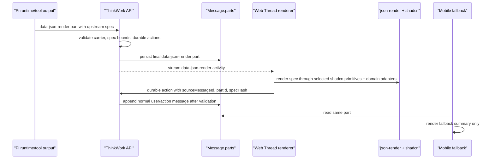
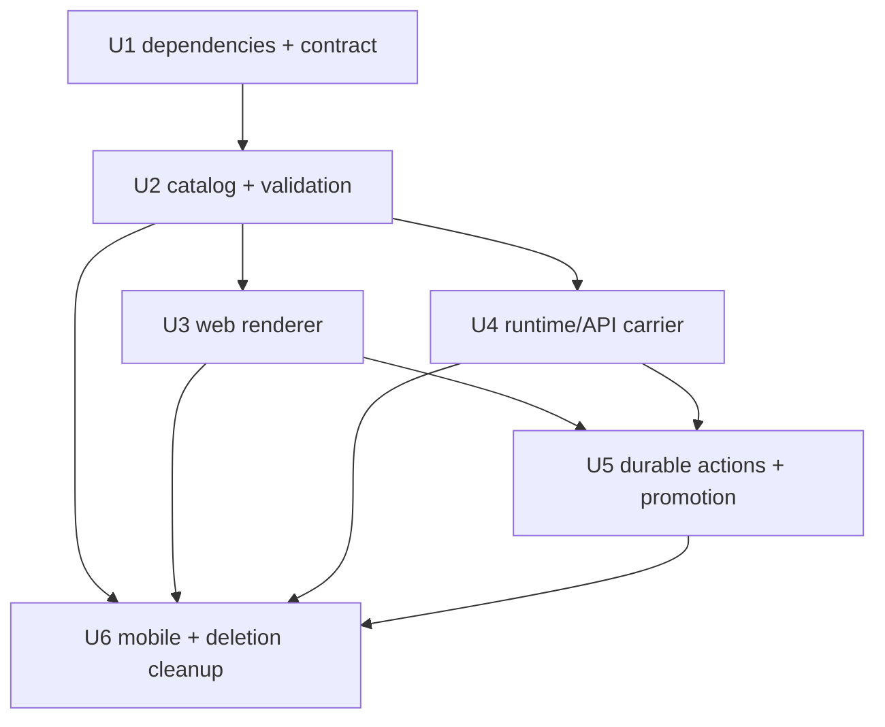

# refactor: Cut Thread UI over to json-render/shadcn

## Overview

THNK-77 replaces the existing Thread GenUI implementation with an upstream
json-render/shadcn foundation. This is a hard cutover: new Thread generated UI
uses a `data-json-render` message part carrying an upstream json-render spec,
the web renderer uses `@json-render/react` plus `@json-render/shadcn`, and the
old `data-genui` / `@thinkwork/genui` contract is removed or treated as
unsupported legacy data.

The current codebase has a mostly complete proprietary implementation under
`packages/genui`, `apps/web/src/components/workbench/genui`, GraphQL mutations,
runtime helpers, Pi extension output, and mobile fallback parsing. The plan is
therefore a replacement/refactor, not a greenfield feature. Preserve useful
host-side safety properties such as validation, compact fallback, tenant checks,
spec-hash binding, idempotency, and mobile fallback. Do not preserve the private
component grammar.

---

## Problem Frame

The previous THNK-34 path implemented a safe Thread UI surface, but it drifted
away from the ecosystem leverage that json-render was supposed to provide. It
made `data-genui` and `@thinkwork/genui` the canonical product contract while
keeping real json-render packages as dev-only smoke dependencies. THNK-77
reverses that decision: ThinkWork owns the Thread carrier, tenant/security
boundary, durable effects, persistence, and promotion behavior, while the UI
tree itself is json-render-shaped and rendered through upstream json-render
packages (see origin:
`docs/brainstorms/2026-06-26-thnk-77-json-render-shadcn-foundation-requirements.md`).

---

## Requirements Trace

- R1. Use real json-render packages in the production Thread render path.
- R2. Carry upstream json-render spec shape: `root`, `elements`, `type`,
  `props`, and `children`.
- R3. Use `@json-render/shadcn` as the primitive catalog and renderer source.
- R4. Replace `data-genui` with a json-render-specific carrier:
  `data-json-render`.
- R5. Remove `@thinkwork/genui` as a package and canonical catalog.
- R6. Render nested json-render specs inline without agent-authored React,
  arbitrary CSS, callbacks, scripts, or unrestricted URLs.
- R7. Persist the final json-render spec for reload.
- R8. Do not migrate, backfill, or read through old `data-genui` payloads.
- R9. Remove legacy fallback assumptions from code and docs.
- R10. Fail closed for invalid, unsupported, oversized, or unsafe specs.
- R11. Build the primitive catalog from upstream json-render/shadcn APIs.
- R12. Add ThinkWork domain components only as json-render catalog entries,
  adapters, or compositions.
- R13. Convert or remove legacy domain components such as `task.review`,
  `workflow.status`, `keyValue.list`, `form.action`, and `analytics.display`.
- R14. Keep json-render local state actions separate from durable ThinkWork
  actions.
- R15. Provide first-cut mobile fallback behavior for `data-json-render`.
- R16. Keep MCP Apps out of scope.

**Origin actors:** A1 end user, A2 ThinkWork agent/runtime, A3 web Thread
renderer, A4 ThinkWork platform, A5 planner/implementer.

**Origin flows:** F1 render a new json-render Thread UI, F2 hard cut over from
old `data-genui`, F3 invoke generated UI actions.

**Origin acceptance examples:** AE1 nested shadcn composition renders through
json-render, AE2 old `data-genui` may be ignored/unsupported, AE3 domain UI is
a json-render entry/adapter/composition, AE4 unsafe specs/actions fail closed,
AE5 mobile shows bounded fallback rather than crashing.

---

## Scope Boundaries

- Do not build a migration, backfill, or compatibility renderer for old
  `data-genui` payloads.
- Do not keep `@thinkwork/genui` as a long-term package, validator, renderer,
  catalog, or fixture source.
- Do not fork json-render's spec into a ThinkWork-only schema.
- Do not adopt arbitrary generated React/TSX or browser-executable code.
- Do not solve MCP Apps or full-app MCP surfaces in this issue.
- Do not require full mobile json-render rendering in the first cutover; mobile
  fallback is in scope, native rendering parity is not.
- Do not create a parallel chart/table catalog if `@thinkwork/analytics-display`
  can remain the domain adapter for analytical payloads.

### Deferred to Follow-Up Work

- Native mobile json-render rendering with `@json-render/react-native`, after
  the web contract is stable.
- Tenant-authored or marketplace catalog entries.
- MCP Apps and full application surfaces.
- Migration or archival rendering of old `data-genui` historical rows, unless a
  future product decision explicitly reverses THNK-77's hard-cutover stance.

---

## Context & Research

### Relevant Code and Patterns

- `packages/genui` currently owns the proprietary part type
  `data-genui`, schema/catalog versions, component grammar, validation, hashing,
  analytics adapter, and fixtures. This package should be deleted or reduced to
  nothing during the cutover.
- `apps/web/src/components/workbench/genui/GenUIRenderer.tsx` validates
  `@thinkwork/genui` data and renders custom React components. It should be
  replaced by a json-render renderer using upstream registry APIs.
- `apps/web/src/components/workbench/render-typed-part.tsx` is the web switch
  that currently routes `data-genui`; it should route `data-json-render` and
  treat `data-genui` as unsupported/unknown.
- `apps/web/src/lib/ui-message-merge.ts` already supports same-type and same-id
  replacement for `data-*` parts, which fits whole-spec replacement for
  `data-json-render`.
- `packages/pi-runtime-core/src/genui-runtime.ts` extracts, validates, and emits
  old GenUI parts from tool results. The replacement should normalize
  `data-json-render` candidates without importing `@thinkwork/genui`.
- `packages/api/src/graphql/resolvers/messages/handleGenUIAction.mutation.ts`
  already demonstrates the durable action safety boundary: tenant/thread
  visibility, assistant source-message validation, persisted source-part lookup,
  spec-hash binding, idempotency, and rate limiting.
- `packages/api/src/graphql/resolvers/artifacts/promoteGenUIArtifact.mutation.ts`
  already snapshots generated UI into a `data_view` artifact with source
  message provenance. The shape should be renamed/rebased onto json-render.
- `apps/mobile/lib/genui-registry.ts` already parses Thread generated UI parts
  into fallback summaries. It should parse `data-json-render` and ignore old
  `data-genui`.
- `docs/specs/thread-genui-json-render-contract-v1.md` and
  `docs/spikes/2026-06-17-json-render-adoption.md` are now superseded by this
  plan's direction where they name `data-genui`, `@thinkwork/genui`, or
  json-render as optional.

### Institutional Learnings

- `docs/solutions/ui-bugs/failed-thread-turn-default-open-layout-shift-2026-06-14.md`
  warns that Thread fallback/error UI must stay compact and stable.
- `docs/solutions/design-patterns/screen-owned-list-display-adapters-2026-06-14.md`
  supports the split between generic primitives and domain adapters. Apply that
  split here: upstream shadcn primitives form layer one; ThinkWork task,
  workflow, form, and analytics behavior lives in explicit json-render
  adapters/compositions.
- `docs/solutions/architecture-patterns/copilotkit-agui-computer-spike-verdict-2026-05-10.md`
  is stale for implementation but reinforces the strategic distinction between
  protocol/ecosystem leverage and ThinkWork-owned tenant/runtime boundaries.
- `docs/specs/analytics-display-contract-v1.md` defines
  `@thinkwork/analytics-display` as the shared analytical payload contract that
  Thread generated UI can consume without inventing a second chart/table system.

### External References

- `@json-render/shadcn@0.19.0` package metadata: Apache-2.0, exports
  `@json-render/shadcn` and `@json-render/shadcn/catalog`, peers on React 19,
  React DOM 19, Tailwind 4, and Zod 4.
- `@json-render/react@0.19.0` package metadata: Apache-2.0, exports
  `@json-render/react` and `@json-render/react/schema`, peers on React
  `^19.2.3`; use the shadcn package install as the production compatibility
  gate because it is the intended web package for this path.
- Upstream json-render documentation describes the desired model: host-defined
  catalogs, validated JSON specs, progressive rendering, and cross-platform
  renderers including React and React Native.
- The json-render shadcn skill/docs describe two entry points:
  `@json-render/shadcn/catalog` for component definitions and
  `@json-render/shadcn` for React implementations, and recommend explicitly
  selecting components instead of blindly spreading every definition.

---

## Key Technical Decisions

| Decision                                                                                                    | Rationale                                                                                                                                                                    |
| ----------------------------------------------------------------------------------------------------------- | ---------------------------------------------------------------------------------------------------------------------------------------------------------------------------- |
| Use `data-json-render` as the Thread message part type                                                      | The carrier should name the upstream contract and make the hard cutover visible in code, tests, and persisted parts.                                                         |
| Store a minimal ThinkWork carrier around an upstream json-render spec                                       | Thread persistence needs `type`, `id`, fallback, spec hash, and durable action metadata; the UI tree remains upstream json-render under `data.spec`.                         |
| Install `@json-render/core`, `@json-render/react`, and `@json-render/shadcn` as production web dependencies | The plan chooses the real package path, not a host-owned replacement. Package/peer compatibility is a required implementation gate, not a deferred question.                 |
| Remove `@thinkwork/genui` instead of renaming it                                                            | Keeping the package would preserve the proprietary schema boundary the user explicitly rejected. Small helpers should move into existing app/package ownership.              |
| Build a two-layer catalog                                                                                   | Layer one is upstream shadcn primitives/actions from package APIs. Layer two is ThinkWork domain entries/adapters/compositions.                                              |
| Keep local json-render actions local                                                                        | json-render state actions such as local state updates must not become server effects.                                                                                        |
| Route durable ThinkWork actions through server validation                                                   | Durable effects use a host-owned action mutation with tenant/thread checks, source message lookup, persisted part lookup, spec-hash binding, idempotency, and rate limiting. |
| Ignore old `data-genui` after cutover                                                                       | Old parts may render as unknown/unsupported; no compatibility renderer or migration is planned.                                                                              |
| Use required mobile fallback for v1                                                                         | Mobile does not need native json-render rendering in THNK-77, but it must show bounded fallback summaries for `data-json-render` parts.                                      |

---

## Open Questions

### Resolved During Planning

- **Thread part name:** Use `data-json-render`.
- **Package direction:** Use the real upstream packages, including
  `@json-render/shadcn`, in the production web render path.
- **Durable action boundary:** Local json-render state/actions stay local;
  durable ThinkWork effects route through a server-validated Thread action
  mutation bound to persisted source part and spec hash.
- **Mobile v1 posture:** Mobile parses `data-json-render` fallback summaries and
  ignores/unsupported-renders old `data-genui`; native json-render rendering is
  follow-up.
- **Old payload posture:** Old `data-genui` parts are not migrated or
  compatibility-rendered.

### Deferred to Implementation

- Exact import names and any API adjustments required by the installed
  `@json-render/shadcn` package after `pnpm install` resolves the lockfile.
- Exact catalog metadata output for upstream primitives/actions after
  introspecting the package exports in the implementation environment.
- Whether old GraphQL mutation names are deleted outright or replaced with
  `handleJsonRenderAction` / `promoteJsonRenderArtifact` in one schema change.
  The behavior must cut over; exact naming can follow existing GraphQL
  conventions during implementation.
- Whether the old `refreshGenUI` mutation is deleted in the same PR or left as
  an unrelated legacy mobile/tool-result cleanup. It is already unimplemented,
  but the implementer should avoid expanding THNK-77 into a broader mobile
  tool-result registry rewrite.

---

## High-Level Technical Design

> _This illustrates the intended approach and is directional guidance for review, not implementation specification. The implementing agent should treat it as context, not code to reproduce._



---

## Implementation Units



- U1. **Adopt upstream json-render/shadcn and define the carrier**

**Goal:** Install the upstream json-render packages for production web use and
replace the old contract doc with a `data-json-render` carrier around an
upstream json-render spec.

**Requirements:** R1, R2, R3, R4, R5, R7, R8, R9, R11, R15, AE1, AE2, AE5.

**Dependencies:** None.

**Files:**

- Modify: `apps/web/package.json`
- Modify: `pnpm-lock.yaml`
- Create: `docs/specs/thread-json-render-contract-v1.md`
- Modify: `docs/specs/thread-genui-json-render-contract-v1.md`
- Modify: `docs/spikes/2026-06-17-json-render-adoption.md`
- Modify: `apps/web/src/components/workbench/genui/json-render-smoke.test.tsx`
- Modify: `apps/web/src/components/workbench/genui/json-render-bundle-smoke.tsx`
- Test: `apps/web/src/components/workbench/genui/json-render-smoke.test.tsx`

**Approach:**

- Move `@json-render/core` and `@json-render/react` out of dev-only spike
  posture and add `@json-render/shadcn` as the production primitive package.
- Verify lockfile compatibility with `apps/web` React 19, React DOM 19,
  Tailwind 4, Zod 4, Vite, and pnpm. Do not solve peer mismatch by suppressing
  it without documenting the reason.
- Define `data-json-render` as the AI SDK typed part. The part has stable `id`
  and `data` containing schema version, upstream json-render `spec`, required
  `mobileFallback`, optional durable action descriptors, status/diagnostics,
  and a deterministic `specHash`.
- Supersede the old `data-genui` spec and spike language so future
  implementers do not follow the rejected fallback path.
- Keep the smoke/bundle verifier, but make it prove the shadcn package path and
  server-safe catalog entry point.

**Patterns to follow:**

- `docs/specs/computer-ai-elements-contract-v1.md` for typed part contract
  style.
- `docs/spikes/2026-06-17-json-render-adoption.md` for useful package-gate
  checks, while reversing its old "dev-only candidate" verdict.

**Test scenarios:**

- Happy path: a minimal json-render spec using a shadcn primitive validates and
  renders through the installed package path.
- Compatibility: package install resolves without duplicate React copies or
  unsupported peer overrides.
- Error path: an unknown component in a json-render spec fails before render.
- Security: the production smoke path does not require `eval`, dynamic remote
  code loading, unsafe CSP changes, or json-render streaming hooks.
- Covers AE2. A `data-genui` fixture is not treated as the new contract.

**Verification:**

- The new contract doc names `data-json-render` and upstream json-render spec
  shape.
- Package metadata and lockfile show production `@json-render/shadcn`
  adoption.
- Old docs are clearly marked superseded where they conflict.

---

- U2. **Build the two-layer catalog and validation boundary**

**Goal:** Replace `@thinkwork/genui` with a thin set of app-owned helpers that
select upstream shadcn primitives/actions and register ThinkWork domain
entries/adapters/compositions.

**Requirements:** R2, R3, R5, R6, R10, R11, R12, R13, R14, AE1, AE3, AE4.

**Dependencies:** U1.

**Files:**

- Create: `apps/web/src/components/workbench/json-render/catalog.ts`
- Create: `apps/web/src/components/workbench/json-render/domain-catalog.ts`
- Create: `apps/web/src/components/workbench/json-render/validation.ts`
- Create: `apps/web/src/components/workbench/json-render/fixtures.ts`
- Create: `packages/api/src/lib/thread-json-render/validation.ts`
- Create: `packages/api/src/lib/thread-json-render/hash.ts`
- Create: `packages/pi-runtime-core/src/json-render-runtime.ts`
- Modify: `packages/pi-extensions/src/analytics-display.ts`
- Delete: `packages/genui/src/catalog.ts`
- Delete: `packages/genui/src/spec.ts`
- Delete: `packages/genui/src/validation.ts`
- Delete: `packages/genui/src/analytics-adapter.ts`
- Test: `apps/web/src/components/workbench/json-render/catalog.test.ts`
- Test: `apps/web/src/components/workbench/json-render/validation.test.ts`
- Test: `packages/api/src/lib/thread-json-render/validation.test.ts`
- Test: `packages/pi-runtime-core/test/json-render-runtime.test.ts`

**Approach:**

- Use `@json-render/shadcn/catalog` as the primitive catalog source and expose
  the full current upstream primitive/action catalog required by THNK-77. Do
  this through an intentional allowlist or generated catalog manifest sourced
  from the package exports, not by hand-cloning the demo schema or blindly
  spreading package internals at runtime.
- Use `@json-render/shadcn` as the primitive implementation registry for web.
- Add ThinkWork layer-two entries only as json-render catalog entries,
  adapters, or compositions. Initial candidates: task review/approval,
  workflow status, form/action composition, key-value/list composition, and
  `analytics.display` adapter backed by `@thinkwork/analytics-display`.
- Prefer compositions of upstream shadcn primitives when enough; use custom
  domain components only when the domain behavior cannot be cleanly expressed
  as primitive composition.
- Keep validation policy at the host boundary: component/action allowlist,
  payload size/depth, URL/media restrictions, durable-action descriptors,
  fallback requirements, status/diagnostics, and spec hash.
- Move only small shared helpers into existing owning packages. Do not create a
  replacement package such as `@thinkwork/json-render` unless implementation
  proves duplication across API/runtime/web is worse than the package cost.

**Patterns to follow:**

- Existing `packages/genui/src/validation.test.ts` as characterization coverage
  to port into json-render-shaped tests.
- `docs/solutions/design-patterns/screen-owned-list-display-adapters-2026-06-14.md`
  for keeping primitives generic and domain adapters screen/platform-owned.
- `docs/specs/analytics-display-contract-v1.md` for the analytics adapter
  boundary.

**Test scenarios:**

- Covers AE1. `Card -> Stack -> Heading/Text/Button` renders from the upstream
  shadcn primitive layer.
- Covers AE3. A task-review surface is represented as a json-render domain
  entry/composition, not as a `ThreadGenUIElement`.
- Covers AE3. An analytics payload validates through
  `@thinkwork/analytics-display` and maps into a json-render domain adapter.
- Covers AE4. Unknown components, invalid props, raw HTML, scripts, callbacks,
  unsafe URL/media fields, and oversized specs fail validation.
- Local action: a json-render local state action is accepted only as local UI
  state and does not produce server action metadata.
- Durable action: a ThinkWork durable action descriptor is validated separately
  from local json-render state actions.

**Verification:**

- There is no production import from `@thinkwork/genui`.
- Catalog tests enumerate upstream shadcn primitives/actions from package APIs.
- Domain components are visibly layered on json-render rather than bypassing it.

---

- U3. **Cut web Thread rendering to `data-json-render`**

**Goal:** Render `data-json-render` parts inline in web Threads through
`@json-render/react` and the combined shadcn/domain registry, while old
`data-genui` becomes unsupported legacy data.

**Requirements:** R1, R2, R3, R4, R6, R8, R10, R11, R12, R13, AE1, AE2, AE3,
AE4.

**Dependencies:** U1, U2.

**Files:**

- Create: `apps/web/src/components/workbench/json-render/ThreadJsonRenderRenderer.tsx`
- Create: `apps/web/src/components/workbench/json-render/ThreadJsonRenderFallback.tsx`
- Modify: `apps/web/src/components/workbench/render-typed-part.tsx`
- Modify: `apps/web/src/components/workbench/TaskThreadView.tsx`
- Modify: `apps/web/src/components/spaces/ThreadConversation.tsx`
- Modify: `apps/web/src/components/workbench/genui/GenUIRenderer.tsx`
- Delete: `apps/web/src/components/workbench/genui/components/TaskReviewCard.tsx`
- Delete: `apps/web/src/components/workbench/genui/components/DecisionPanel.tsx`
- Delete: `apps/web/src/components/workbench/genui/components/TaskStatusSummary.tsx`
- Delete: `apps/web/src/components/workbench/genui/components/WorkflowListPreview.tsx`
- Delete: `apps/web/src/components/workbench/genui/components/ActionForm.tsx`
- Test: `apps/web/src/components/workbench/json-render/ThreadJsonRenderRenderer.test.tsx`
- Test: `apps/web/src/components/workbench/json-render/ThreadJsonRenderFallback.test.tsx`
- Test: `apps/web/src/components/workbench/render-typed-part.test.tsx`
- Test: `apps/web/src/components/workbench/TaskThreadView.test.tsx`
- Test: `apps/web/src/components/spaces/ThreadConversation.test.tsx`

**Approach:**

- Add a `data-json-render` branch in `render-typed-part.tsx`.
- Validate before render, then mount the json-render `Renderer` with the
  selected shadcn primitive registry plus ThinkWork domain registry.
- Preserve compact fail-closed UI. Invalid current specs render fallback;
  invalid live same-id updates may keep last-good UI with a rejected-update
  note if that can be implemented without private schema state.
- Treat `data-genui` as unknown/unsupported. It may show the generic unknown
  data strip or a compact unsupported legacy generated UI message, but it must
  not render through compatibility conversion.
- Preserve Thread density: no nested page chrome, stable loading/error
  dimensions, accessible controls, and no layout jump on fallback.

**Patterns to follow:**

- `apps/web/src/components/workbench/render-typed-part.tsx` for typed-part
  routing.
- Existing `GenUIFallback` tests for compact fallback behavior.
- `docs/solutions/ui-bugs/failed-thread-turn-default-open-layout-shift-2026-06-14.md`
  for stable Thread fallback posture.

**Test scenarios:**

- Covers AE1. A valid nested shadcn json-render spec renders through
  `@json-render/react`.
- Covers AE2. A persisted `data-genui` part does not render through the new
  renderer and does not crash surrounding Thread content.
- Covers AE3. A ThinkWork domain entry renders as json-render registry content.
- Covers AE4. Unknown component, invalid props, unsafe action, and renderer
  throw all become compact fallback states.
- Integration: Workbench and Spaces Thread surfaces both render persisted
  `data-json-render` parts from `Message.parts`.
- Accessibility: local buttons/forms from rendered specs have accessible names,
  keyboard focus, and do not trap focus in a message.

**Verification:**

- Web tests prove valid, invalid, live, persisted, and old-legacy paths.
- Web code no longer imports `@thinkwork/genui`.

---

- U4. **Cut runtime, stream, and persistence paths to `data-json-render`**

**Goal:** Make the Pi/runtime/API path emit, stream, merge, and persist
`data-json-render` parts, and stop recognizing `data-genui` as a current
runtime output.

**Requirements:** R2, R4, R7, R8, R9, R10, R15, AE1, AE2, AE5.

**Dependencies:** U1, U2.

**Files:**

- Modify: `packages/pi-runtime-core/src/agent-loop.ts`
- Modify: `packages/pi-runtime-core/src/genui-runtime.ts`
- Modify: `packages/pi-runtime-core/src/types.ts`
- Modify: `packages/pi-runtime-core/src/activity-client.ts`
- Modify: `packages/pi-runtime-core/src/finalize-client.ts`
- Modify: `packages/agentcore-pi/agent-container/src/server.ts`
- Modify: `packages/pi-extensions/src/analytics-display.ts`
- Modify: `apps/web/src/lib/ui-message-types.ts`
- Modify: `apps/web/src/lib/ui-message-chunk-parser.ts`
- Modify: `apps/web/src/lib/ui-message-merge.ts`
- Test: `packages/pi-runtime-core/test/json-render-runtime.test.ts`
- Test: `packages/pi-runtime-core/test/agent-loop.test.ts`
- Test: `packages/pi-runtime-core/test/activity-client.test.ts`
- Test: `packages/pi-runtime-core/test/finalize-client.test.ts`
- Test: `packages/agentcore-pi/agent-container/tests/genui-contract.test.ts`
- Test: `apps/web/src/lib/ui-message-chunk-parser.test.ts`
- Test: `apps/web/src/lib/ui-message-merge.test.ts`

**Approach:**

- Replace old extraction keys such as `threadGenUI`, `threadGenUIPart`,
  `threadGenUIParts`, and `dataGenUI` with json-render-specific result keys
  such as `jsonRender`, `jsonRenderPart`, or `threadJsonRender`.
- Normalize only `data-json-render` candidates. Do not auto-convert
  `data-genui`.
- Preserve whole-spec replacement by stable part id through the existing
  `data-*` merge behavior.
- Ensure finalize persists the final `data-json-render` part value in
  `Message.parts`.
- Update Pi extension output, especially analytics display, to emit json-render
  domain adapter payloads instead of `threadGenUI`.

**Patterns to follow:**

- Current `packages/pi-runtime-core/src/genui-runtime.ts` tests for extraction,
  diagnostic fallback, activity events, and final merge.
- Existing `Message.parts` persistence and tenant-scoping tests; no database
  migration should be needed.

**Test scenarios:**

- Happy path: a tool result with `threadJsonRender` emits a live activity chunk
  and persists a final `data-json-render` part.
- Covers AE2. A tool result with old `threadGenUI` / `data-genui` is ignored or
  converted to an unsupported diagnostic only if implementation chooses that
  visible unsupported path; it is not converted to the new contract.
- Edge case: same-id `data-json-render` updates replace in place.
- Error path: malformed json-render candidates emit compact diagnostics without
  breaking the assistant final message.
- Integration: finalized assistant message stores final json-render parts in
  `Message.parts` and web reload sees one final part.

**Verification:**

- Runtime and AgentCore Pi tests no longer import `@thinkwork/genui`.
- Streamed and persisted paths use `data-json-render` consistently.

---

- U5. **Rebase durable actions and promotion on json-render**

**Goal:** Preserve the existing durable action and promotion safety model while
renaming/revalidating it around `data-json-render` specs and keeping local
json-render actions separate from server effects.

**Requirements:** R7, R10, R12, R14, AE3, AE4.

**Dependencies:** U2, U3, U4.

**Files:**

- Modify: `packages/database-pg/graphql/types/messages.graphql`
- Modify: `packages/database-pg/graphql/types/artifacts.graphql`
- Modify: `packages/api/src/graphql/resolvers/messages/handleGenUIAction.mutation.ts`
- Modify: `packages/api/src/graphql/resolvers/messages/index.ts`
- Modify: `packages/api/src/graphql/resolvers/artifacts/promoteGenUIArtifact.mutation.ts`
- Modify: `packages/api/src/graphql/resolvers/artifacts/index.ts`
- Modify: `apps/web/src/lib/graphql-queries.ts`
- Create: `apps/web/src/components/workbench/json-render/actions.ts`
- Create: `apps/web/src/components/workbench/json-render/use-json-render-action.ts`
- Create: `apps/web/src/components/workbench/json-render/promote.ts`
- Create: `apps/web/src/components/workbench/json-render/use-promote-json-render.ts`
- Delete: `apps/web/src/components/workbench/genui/actions.ts`
- Delete: `apps/web/src/components/workbench/genui/use-genui-action.ts`
- Delete: `apps/web/src/components/workbench/genui/promote.ts`
- Delete: `apps/web/src/components/workbench/genui/use-promote-genui.ts`
- Test: `packages/api/src/graphql/resolvers/messages/handleGenUIAction.test.ts`
- Test: `packages/api/src/graphql/resolvers/artifacts/promoteGenUIArtifact.test.ts`
- Test: `packages/api/src/graphql/resolvers/artifacts/artifact.query.test.ts`
- Test: `apps/web/src/components/workbench/json-render/actions.test.ts`
- Test: `apps/web/src/components/workbench/json-render/use-json-render-action.test.tsx`
- Test: `apps/web/src/components/workbench/json-render/use-promote-json-render.test.tsx`

**Approach:**

- Rename public/internal concepts from GenUI to JsonRender where practical:
  mutations, inputs, metadata keys, idempotency prefixes, snapshot kind, and
  client hooks. If GraphQL names are changed, run codegen in all consumers with
  codegen scripts.
- Treat GraphQL schema/codegen as one atomic surface. A renamed mutation must
  update schema source, API resolver exports, web query documents, mobile query
  documents, generated types, and any stale generated operation maps in the
  same implementation unit.
- Durable action input must include `threadId`, `sourceMessageId`, `partId`,
  `actionId`, `specHash`, idempotency key, and bounded params.
- Server handler must load the visible Thread, load the assistant source
  message, find the persisted `data-json-render` part, validate the spec and
  durable action descriptor, compare submitted params to persisted action
  params, compare spec hash, rate limit, and append a normal Thread message.
- Local json-render state actions from upstream remain client-local and must not
  call this mutation.
- Promotion stores a `json_render_snapshot` `data_view` artifact containing the
  current `data-json-render` part and source provenance. Old `genui_snapshot`
  artifacts may remain readable only as historical artifact data if existing
  generic artifact readers already show them; no new compatibility viewer is in
  scope.

**Patterns to follow:**

- Existing `handleGenUIAction` implementation for tenant/thread/source/specHash
  safety.
- Existing `promoteGenUIArtifact` implementation for snapshot persistence and
  idempotency.
- Existing GraphQL codegen conventions in `apps/web`, `apps/mobile`,
  `packages/api`, and `apps/cli`.

**Test scenarios:**

- Covers AE4. Durable action succeeds only when the user can see the Thread,
  the source assistant message belongs to that Thread, the persisted part is
  `data-json-render`, the action exists, params match, and spec hash matches.
- Covers AE4. Unknown action, disabled action, stale spec hash, non-assistant
  source message, wrong tenant/thread, and overlong idempotency key fail.
- Local action: a json-render local state action updates local UI state without
  calling the durable mutation.
- Promotion: a ready `data-json-render` part snapshots into a `data_view`
  artifact with source provenance and `json_render_snapshot` metadata.
- Promotion stale path: stale spec hash or invalid source part rejects without
  creating an artifact.
- Rate limit/idempotency: duplicate durable action/promotion returns existing
  result; excessive distinct actions are blocked.

**Verification:**

- Durable action and promotion names/metadata no longer imply `data-genui`.
- Server tests cover tenant, source-message, part, action, spec-hash, and
  idempotency gates.

---

- U6. **Remove old package, update mobile fallback, and clean docs/codegen**

**Goal:** Finish the hard cutover by removing `@thinkwork/genui`, updating
mobile fallback for `data-json-render`, and cleaning docs/generated types so the
old product contract cannot linger.

**Requirements:** R4, R5, R8, R9, R15, R16, AE2, AE5.

**Dependencies:** U2, U3, U4, U5.

**Files:**

- Delete: `packages/genui/package.json`
- Delete: `packages/genui/tsconfig.json`
- Delete: `packages/genui/src/index.ts`
- Delete: `packages/genui/src/actions.ts`
- Delete: `packages/genui/src/adapter-registry.ts`
- Delete: `packages/genui/src/analytics-adapter.ts`
- Delete: `packages/genui/src/catalog.ts`
- Delete: `packages/genui/src/diagnostics.ts`
- Delete: `packages/genui/src/hash.ts`
- Delete: `packages/genui/src/limits.ts`
- Delete: `packages/genui/src/spec.ts`
- Delete: `packages/genui/src/test-fixtures.ts`
- Delete: `packages/genui/src/validation.ts`
- Modify: `apps/web/package.json`
- Modify: `packages/api/package.json`
- Modify: `packages/pi-runtime-core/package.json`
- Modify: `packages/agentcore-pi/package.json`
- Modify: `packages/pi-extensions/package.json`
- Modify: `apps/mobile/package.json`
- Modify: `apps/web/src/gql/graphql.ts`
- Modify: `apps/mobile/lib/gql/graphql.ts`
- Modify: `apps/mobile/lib/genui-registry.ts`
- Modify: `apps/mobile/components/threads/ActivityTimeline.tsx`
- Modify: `apps/mobile/hooks/useGraphQLChat.ts`
- Modify: `apps/mobile/hooks/useGatewayChat.ts`
- Modify: `docs/brainstorms/2026-06-16-generative-ui-json-render-requirements.md`
- Modify: `docs/plans/2026-06-17-001-feat-thread-genui-json-render-plan.md`
- Test: `apps/mobile/lib/genui-registry.test.ts`
- Test: `apps/mobile/lib/genui-contract.test.ts`
- Test: `apps/mobile/components/threads/ActivityTimeline.test.tsx`

**Approach:**

- Remove workspace dependencies on `@thinkwork/genui` and delete the package.
- Rename mobile Thread fallback concepts to json-render where they refer to
  Thread generated UI. Existing mobile `_type`/```genui tool-result cards can
remain if they are a separate legacy mobile content parser, but they must not
be confused with Thread `data-json-render`.
- Parse `data-json-render` fallback summaries from `Message.parts`.
- Ignore old `data-genui` in mobile or show an unsupported legacy generated UI
  state without validating/rendering it.
- Regenerate GraphQL clients after schema/mutation renames.
- Mark old THNK-34 plan/spec/spike artifacts superseded by THNK-77 where they
  contradict the cutover.

**Patterns to follow:**

- Existing `apps/mobile/lib/genui-registry.ts` fallback parser behavior.
- Repo codegen rules in `AGENTS.md` for GraphQL consumers.

**Test scenarios:**

- Covers AE5. Mobile opens a Thread with `data-json-render` and shows the
  required fallback title, summary, lines, status, and diagnostics.
- Covers AE2. Mobile opens a Thread with old `data-genui` and does not crash or
  attempt compatibility rendering.
- Existing `_type` mobile tool-result cards still render if they are not part
  of the Thread json-render contract.
- Workspace check: `rg "@thinkwork/genui|data-genui|ThreadGenUI"` returns only
  superseded docs or explicit legacy-unsupported tests.

**Verification:**

- `@thinkwork/genui` no longer appears in workspace package dependencies.
- Mobile fallback works for `data-json-render`.
- Old docs/specs are clearly superseded, and current generated GraphQL types
  reflect the new mutation names if renamed.

---

## System-Wide Impact

- **Interaction graph:** Runtime/tool output, API activity/finalize, GraphQL
  mutations, web typed-part rendering, mobile fallback, and artifact promotion
  all move from `data-genui` to `data-json-render`.
- **Error propagation:** Invalid specs fail closed at every host boundary: API
  validation, web render validation, durable action validation, promotion
  validation, and mobile fallback parsing.
- **State lifecycle risks:** Whole-spec same-id replacement remains the v1
  update model. Spec hash binds durable actions and promotion to the visible
  revision.
- **API surface parity:** GraphQL schema, web queries, mobile generated types,
  runtime callback payloads, and Pi extension outputs must be renamed together.
- **Integration coverage:** Unit tests alone are insufficient; at least one
  flow must prove runtime output reaches web via stream and persists into
  `Message.parts` for reload.
- **Unchanged invariants:** No database migration should be required because
  `Message.parts` remains JSON. Tenant visibility and source-message checks
  stay mandatory because generated UI can trigger durable Thread actions.

---

## Risks & Dependencies

| Risk                                                                        | Mitigation                                                                                                                    |
| --------------------------------------------------------------------------- | ----------------------------------------------------------------------------------------------------------------------------- |
| `@json-render/shadcn` export/API shape differs from assumptions             | U1 makes package import and catalog introspection the first implementation gate.                                              |
| Removing `@thinkwork/genui` causes broad compile fallout                    | U2-U6 sequence replaces imports slice by slice, with package deletion last.                                                   |
| Durable actions accidentally treat json-render local state as server intent | U5 explicitly separates local state actions from ThinkWork durable action descriptors and tests both paths.                   |
| Historical Threads with `data-genui` look broken                            | This is accepted by THNK-77. Render a compact unsupported state if easy; do not build compatibility.                          |
| Web adopts the full upstream primitive catalog too broadly                  | Catalog selection should be explicit and policy-constrained even when sourced from upstream APIs.                             |
| Mobile loses generated UI context                                           | U6 requires `mobileFallback` for `data-json-render` and tests fallback parsing.                                               |
| Analytics display gets duplicated again                                     | U2 keeps `@thinkwork/analytics-display` as the domain adapter for analytical payloads.                                        |
| GraphQL rename lands half-applied across web/mobile/API                     | U5 treats schema, resolvers, query documents, and generated operation maps as one atomic surface with tests in each consumer. |

---

## Documentation / Operational Notes

- THNK-77 should update Linear with the final plan path once written.
- Any PR implementing this plan should call out the breaking persisted-data
  behavior: old `data-genui` may become unsupported.
- GraphQL schema changes require codegen in `apps/cli`, `apps/web`,
  `apps/mobile`, and `packages/api` if mutation names or inputs change.
- No feature flag is required unless implementation discovers a package or
  runtime risk that makes a staged rollout materially safer. The product
  decision is hard cutover.

---

## Alternative Approaches Considered

- **Keep `@thinkwork/genui` and change its internals:** Rejected because the
  package boundary preserves the proprietary product contract and invites
  future drift.
- **Continue the THNK-34 data-genui envelope with json-render underneath:**
  Rejected because the carrier still tells agents and implementers that the
  ThinkWork dialect is canonical.
- **Build a compatibility reader for old `data-genui`:** Rejected by THNK-77's
  hard-cutover requirement.
- **Use json-render core/react only and keep custom components:** Rejected as
  the primary path because it misses the leverage of `@json-render/shadcn` in a
  shadcn-based app.

---

## Success Metrics

- Production web Thread rendering imports `@json-render/react` and
  `@json-render/shadcn`.
- New generated UI parts are `data-json-render` and contain upstream
  json-render specs.
- `@thinkwork/genui` is removed from package dependencies and the workspace.
- Old `data-genui` fixtures do not pass as new valid parts.
- A nested shadcn primitive composition, one ThinkWork domain composition, one
  durable action, one promotion, one invalid fallback, and one mobile fallback
  are covered by tests.

---

## Sources & References

- **Origin document:** [docs/brainstorms/2026-06-26-thnk-77-json-render-shadcn-foundation-requirements.md](../brainstorms/2026-06-26-thnk-77-json-render-shadcn-foundation-requirements.md)
- Related issue: [THNK-77](https://linear.app/thinkworkai/issue/THNK-77/adopt-json-rendershadcn-as-the-thread-genui-foundation)
- Superseded plan: [docs/plans/2026-06-17-001-feat-thread-genui-json-render-plan.md](2026-06-17-001-feat-thread-genui-json-render-plan.md)
- Superseded spec: [docs/specs/thread-genui-json-render-contract-v1.md](../specs/thread-genui-json-render-contract-v1.md)
- Existing spike: [docs/spikes/2026-06-17-json-render-adoption.md](../spikes/2026-06-17-json-render-adoption.md)
- Analytics contract: [docs/specs/analytics-display-contract-v1.md](../specs/analytics-display-contract-v1.md)
- External docs: [json-render](https://json-render.dev/)
- External package: [@json-render/shadcn](https://www.npmjs.com/package/@json-render/shadcn)
- External repository: [vercel-labs/json-render](https://github.com/vercel-labs/json-render)
