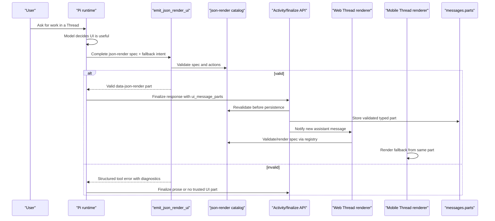
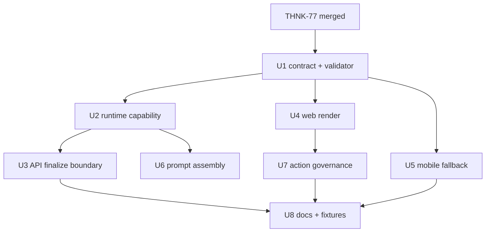

# feat: Thread json-render UI runtime emission

## Overview

Add a narrow runtime path that lets Thread agents intentionally emit complete
json-render UI specs as typed message parts. This is a follow-on to THNK-77,
which cuts ThinkWork over from the legacy `data-genui` / `@thinkwork/genui`
surface to upstream json-render and shadcn-backed web rendering.

THNK-78 does not introduce another ThinkWork UI DSL. The canonical inner UI
payload is a json-render spec using the flat `root` plus `elements` grammar,
where each element uses `type`, `props`, and `children`. ThinkWork owns only the
Thread transport envelope, validation boundary, persistence, action policy,
fallback text, and cross-surface rendering behavior.

The desired product behavior is complete-spec emission, not progressive UI
streaming. While an assistant turn is running, the client can show ordinary turn
loading/progress. Once the runtime has a complete validated component part, web
renders it inline and mobile renders the fallback from the same typed part.

## Problem Frame

THNK-77 establishes json-render as the Thread UI rendering foundation, but it
does not answer the runtime question: how does an agent choose to produce a
trusted inline UI instead of prose or markdown? If the answer is "parse JSON
from assistant text", ThinkWork will recreate the legacy ambiguity that THNK-77
is removing. If the answer is "ship json-render skills to every end-user
agent", ThinkWork will blur developer tooling with runtime policy and expose far
more surface than agents need during customer work.

THNK-78 should instead provide one intentional runtime capability:
`emit_json_render_ui` (capability slug `thread-json-render-ui`). The model calls
that capability with a complete json-render spec and required Thread metadata.
The host validates the spec against the ThinkWork json-render catalog before it
is streamed, persisted, or rendered. Invalid or unsupported specs fail closed.

## Requirements Trace

- R1. Runtime exposes a narrow UI emission capability/tool accepting a complete
  json-render spec plus Thread metadata.
- R2. Emitted specs validate against the ThinkWork json-render catalog before
  stream, persistence, or render.
- R3. Canonical spec shape uses json-render standard fields, including element
  `type`; legacy `component` fields are not canonical.
- R4. Runtime does not parse markdown fences, `_type`, or legacy
  `{ component, props }` shapes as supported UI.
- R5. Web renders a complete validated spec after the component message part is
  ready; incomplete turns show loading/progress rather than partial UI.
- R6. Mobile renders the required fallback from the same typed part; there is
  no mobile-only dialect.
- R7. Upstream json-render skills remain developer tooling only and are not
  bundled into runtime skills or workspace defaults.
- R8. Invalid specs fail closed: no arbitrary code, invented components,
  browser fetches, or trusted UI persistence.

**Acceptance examples from THNK-78:**

- AE1. A valid `emit_json_render_ui` call stores a typed part and web renders it
  through the json-render catalog/registry.
- AE2. Fenced JSON, `_type`, and legacy shapes are not trusted UI.
- AE3. Mobile shows fallback for the typed UI part.
- AE4. Upstream json-render skills stay dev-only; runtime exposes only narrow
  guidance/tooling.
- AE5. Malformed or catalog-mismatched specs are rejected before trusted render
  or persistence.

## Scope Boundaries

- This plan starts after THNK-77 lands. If THNK-77 names the shared json-render
  package or catalog module differently than the paths below, use THNK-77's
  package and do not recreate `@thinkwork/genui`.
- Do not support `data-genui`, `_type`, fenced `genui` code blocks, or legacy
  `{ component, props }` payloads as canonical UI. Historical/test/dev rows may
  render as raw JSON, markdown, or unsupported fallback.
- Do not add upstream json-render skills to tenant workspaces, default skills,
  materialized `workspace/skills`, or runtime skill catalogs.
- Do not implement json-render JSONL patch streaming for v1. Complete specs are
  validated as objects.
- Do not add an on-device mobile runtime or mobile-only UI grammar. Mobile v1 is
  fallback-first from the same typed part.
- Do not allow tenant-authored components, arbitrary JS/TSX/CSS, remote browser
  fetches, dynamic imports, or unreviewed catalog entries through this path.
- Do not automatically promote inline UI to durable artifacts; promotion remains
  a separate explicit product flow.

## Context & Research

### json-render Contract

- `https://json-render.dev/docs/specs` describes specs as JSON documents. The
  React schema examples use a flat `root` key and an `elements` map; each
  element has `type`, `props`, and `children`.
- `https://json-render.dev/docs/catalog` defines the catalog as the vocabulary
  of components/actions AI may generate. The catalog is the guardrail.
- `https://json-render.dev/docs/api/core` exposes catalog methods including
  `prompt()`, `validate(spec)`, `zodSchema()`, and `jsonSchema()`.
- `https://json-render.dev/docs/generation-modes` documents standalone and
  inline JSONL patch streaming. THNK-78 intentionally chooses complete-spec
  object emission, not JSONL progressive rendering.
- `https://json-render.dev/docs/skills` documents skills for coding agents and
  development workflows. These are not runtime capabilities for end-user
  ThinkWork agents.

### Existing ThinkWork Seams

- `packages/database-pg/drizzle/0082_messages_parts_jsonb.sql` and
  `packages/database-pg/graphql/types/messages.graphql` already support durable
  `messages.parts` / `Message.parts`.
- `docs/specs/computer-ai-elements-contract-v1.md` establishes that typed parts
  persist as the final merged `UIMessage.parts` shape, while legacy
  `messages.content` remains lossy text fallback.
- `packages/pi-runtime-core/src/agent-loop.ts` currently extracts legacy GenUI
  candidates out of tool results. THNK-78 should replace this with an explicit
  tool result from `emit_json_render_ui`, not generic object crawling.
- `packages/pi-runtime-core/src/finalize-client.ts` and
  `packages/api/src/lib/chat-finalize/process-finalize.ts` already carry final
  `ui_message_parts` into assistant message persistence.
- `packages/api/src/handlers/chat-agent-activity.ts` can carry live turn
  activity, but THNK-78 should not publish partial UI specs there.
- `packages/api/src/handlers/chat-agent-invoke.ts` and
  `packages/api/src/handlers/wakeup-processor.ts` independently build runtime
  invoke payloads. Any emission capability gate must be wired and tested on both
  paths.
- `apps/web/src/components/spaces/ThreadConversation.tsx`,
  `apps/web/src/lib/ui-message-types.ts`, and post-THNK-77 json-render renderer
  modules are the web read/render path for persisted typed parts.
- `apps/mobile/lib/genui-registry.ts` and mobile Thread timeline code currently
  demonstrate fallback parsing for legacy typed UI. THNK-78 should replace that
  with `data-json-render` fallback parsing after THNK-77.

### Institutional Learnings

- `docs/solutions/best-practices/injected-built-in-tools-are-not-workspace-skills-2026-04-28.md`
  says platform-owned tools belong in runtime config, not workspace skills.
- `docs/solutions/best-practices/activation-runtime-narrow-tool-surface-2026-04-26.md`
  is superseded for Activation, but the narrow-tool-surface pattern still
  applies: focused runtimes should expose only expected tools and enforce
  invariants at the tool boundary.
- `docs/solutions/architecture-patterns/wakeup-processor-payload-parity-with-chat-agent-invoke-2026-06-12.md`
  requires direct chat and wakeup/resume parity for payload-gated runtime
  capabilities.
- `docs/solutions/architecture-patterns/runtime-swap-tool-parity-and-record-contract.md`
  requires a single durable record shape across runtime and UI consumers.
- `docs/solutions/architecture-patterns/mobile-pi-compatible-host-contract-2026-05-30.md`
  clarifies that mobile is a managed-AgentCore client surface, not an on-device
  agent runtime.
- `docs/specs/analytics-display-contract-v1.md` reserves analytical display as
  a shared platform contract. THNK-78 should render analytics via the
  post-THNK-77 catalog adapter, not create a second chart/table DSL.

## Key Technical Decisions

| Decision | Rationale |
| --- | --- |
| Use `data-json-render` as the typed part carrier | THNK-77 explicitly hard-cuts away from `data-genui`; the carrier names the upstream contract instead of ThinkWork legacy. |
| Keep the inner `spec` json-render-standard | `root`, `elements`, element `type`, `props`, and `children` preserve json-render compatibility and avoid a proprietary UI grammar. |
| Expose an injected built-in runtime tool | `emit_json_render_ui` is platform-owned, policy-gated, and context-aware; it does not belong in `workspace/skills`. |
| Validate before trusted persistence | A malformed spec should not become a trusted message part merely because it came from the model. |
| Complete-spec v1, no JSONL UI streaming | The product preference is loading/progress until the component part is ready; this removes partial-spec merge and repair complexity. |
| Fail closed for legacy shapes | Markdown fences, `_type`, and `{ component, props }` can still be visible as text/raw JSON, but never become trusted UI. |
| Mobile fallback is required in the same part | Mobile v1 stays compatible without inventing a native-only dialect. |
| json-render skills stay dev-only | They help developers build catalogs and renderers; runtime agents get only the narrow emission capability and generated catalog guidance. |

## Proposed Typed Part Shape

This is the ThinkWork-owned envelope around the json-render spec. The field
names should be confirmed against THNK-77's final contract before
implementation, but the shape should stay conceptually stable.

```json
{
  "type": "data-json-render",
  "id": "json-render:thread:01J...",
  "data": {
    "schemaVersion": "thread-json-render/v1",
    "catalogVersion": "thread-json-render-catalog/v1",
    "status": "ready",
    "spec": {
      "root": "card-1",
      "elements": {
        "card-1": {
          "type": "Card",
          "props": { "title": "Deployment summary" },
          "children": ["summary-1"]
        },
        "summary-1": {
          "type": "Text",
          "props": { "content": "3 checks passed, 1 warning needs review." },
          "children": []
        }
      }
    },
    "fallback": {
      "title": "Deployment summary",
      "summary": "3 checks passed, 1 warning needs review.",
      "lines": ["Open on web to review the generated UI."]
    },
    "specHash": "sha256:..."
  }
}
```

Notes:

- `spec` is validated by the json-render catalog.
- `fallback` is required and validated by ThinkWork. Hosts may derive it for
  known catalog entries, but the typed part should carry the final fallback that
  mobile and unsupported clients render.
- `specHash` should be computed by the host after canonicalization, not trusted
  from the model.
- Action declarations, if any, must reference catalog-known action ids and
  parameter schemas. Action execution remains a host API/Thread workflow, never
  arbitrary client code.

## High-Level Technical Design



## Implementation Units

### U1. Finalize Post-THNK-77 Contract and Validator

**Goal:** Extend the json-render contract from THNK-77 with the runtime-emitted
typed part envelope, complete-spec validation rules, fallback requirements, and
legacy-shape rejection rules.

**Requirements:** R2, R3, R4, R6, R8; AE2, AE3, AE5.

**Dependencies:** THNK-77 merged.

**Files:**

- Modify: `docs/specs/thread-json-render-contract-v1.md`
- Modify: `docs/src/content/docs/applications/web/thread-generative-ui.mdx`
- Modify: `docs/src/content/docs/applications/mobile/threads-and-chat.mdx`
- Modify: `packages/thread-json-render/src/spec.ts`
- Modify: `packages/thread-json-render/src/validation.ts`
- Modify: `packages/thread-json-render/src/hash.ts`
- Test: `packages/thread-json-render/src/validation.test.ts`
- Test: `packages/thread-json-render/src/hash.test.ts`

If THNK-77 uses a different shared package path, apply these changes there. The
important constraint is a React-free shared contract package usable by runtime,
API, web, and mobile.

**Approach:**

- Define `THREAD_JSON_RENDER_PART_TYPE = "data-json-render"`.
- Define the complete typed part envelope, fallback shape, catalog version,
  status values, diagnostics, action declarations, and spec hash semantics.
- Validate with the THNK-77 json-render catalog via `catalog.validate(spec)` or
  the package's exported schema helpers.
- Enforce limits: max serialized bytes, max element count, max depth, max props
  object size, allowed URL/media policies, strict unknown-key rejection for
  ThinkWork envelope fields, and no arbitrary browser fetch/code fields.
- Add explicit tests that `_type`, `data-genui`, fenced payload text, and
  `{ component, props }` do not normalize into `data-json-render`.
- Ensure invalid specs return sanitized diagnostics suitable for model/tool
  feedback without exposing tenant secrets or raw stack traces.

**Verification:**

- `pnpm --filter @thinkwork/thread-json-render test`
- `pnpm --filter @thinkwork/thread-json-render typecheck`

### U2. Add the Injected Runtime Capability

**Goal:** Register `emit_json_render_ui` as a platform-owned built-in runtime
tool gated by template/runtime policy, not as a workspace skill.

**Requirements:** R1, R2, R7, R8; AE1, AE4, AE5.

**Dependencies:** U1.

**Files:**

- Modify: `packages/api/src/lib/builtin-tool-slugs.ts`
- Modify: `packages/api/src/lib/resolve-agent-runtime-config.ts`
- Modify: `packages/api/src/handlers/chat-agent-invoke.ts`
- Modify: `packages/api/src/handlers/wakeup-processor.ts`
- Modify: `packages/pi-runtime-core/src/types.ts`
- Modify: `packages/pi-runtime-core/src/agent-loop.ts`
- Create: `packages/pi-runtime-core/src/json-render-runtime.ts`
- Test: `packages/pi-runtime-core/src/json-render-runtime.test.ts`
- Test: `packages/pi-runtime-core/src/agent-loop.test.ts`
- Test: `packages/api/src/handlers/wakeup-processor.system-prompt.test.ts`

**Approach:**

- Add capability slug `thread-json-render-ui` and tool name
  `emit_json_render_ui`.
- Inject the tool only when the agent/template/runtime payload allows it.
- Keep the tool description narrow: emit complete json-render UI only when UI is
  clearly more useful than prose; otherwise answer normally.
- Generate tool guidance from the THNK-77 catalog prompt or JSON Schema, but do
  not install upstream json-render skills into the agent workspace.
- Tool input includes a complete `spec`, `fallback` title/summary/lines, and
  optional action declarations. Runtime/tool code computes id and hash unless
  the host chooses to let callers supply a stable id under strict validation.
- Tool output returns a validated `data-json-render` part or a structured tool
  error. The agent loop appends only successful validated parts to
  `uiMessageParts`.
- Remove or bypass the legacy object-crawling extractor pattern currently used
  for GenUI. The only trusted runtime path is the explicit tool result.
- Add direct chat and wakeup/resume parity assertions for payload fields, system
  prompt guidance, and tool registration.

**Verification:**

- `pnpm --filter @thinkwork/pi-runtime-core test -- json-render-runtime`
- `pnpm --filter @thinkwork/pi-runtime-core test -- agent-loop`
- `pnpm --filter @thinkwork/api test -- wakeup-processor.system-prompt`

### U3. Harden API Finalize and Activity Boundaries

**Goal:** Revalidate runtime-emitted UI parts at the API boundary and persist
only trusted final complete parts.

**Requirements:** R2, R5, R8; AE1, AE5.

**Dependencies:** U1, U2.

**Files:**

- Modify: `packages/api/src/lib/chat-finalize/types.ts`
- Modify: `packages/api/src/lib/chat-finalize/notify.ts`
- Modify: `packages/api/src/lib/chat-finalize/process-finalize.ts`
- Modify: `packages/api/src/handlers/chat-agent-activity.ts`
- Modify: `packages/api/src/handlers/wakeup-processor.ts`
- Test: `packages/api/src/lib/chat-finalize/process-finalize.test.ts`
- Test: `packages/api/src/handlers/chat-agent-activity.test.ts`
- Test: `packages/api/src/handlers/wakeup-processor.test.ts`

**Approach:**

- Replace legacy `normalizeThreadGenUIParts` behavior with
  `normalizeThreadJsonRenderParts`.
- Persist only parts that validate as `data-json-render` against the current
  catalog. Drop invalid parts and record sanitized diagnostics on the turn.
- Do not trust UI parts received through live activity unless they are complete
  final parts. For v1, prefer sending the typed part only in finalize/new-message
  persistence; live activity can keep ordinary progress/loading events.
- Preserve `messages.content` as text fallback. It should not contain hidden
  parseable UI that the client later upgrades.
- Confirm tenant scoping remains unchanged for `Message.parts`.
- Ensure wakeup processor source-specific assistant message insertions call the
  same normalizer as chat finalize.

**Verification:**

- `pnpm --filter @thinkwork/api test -- process-finalize`
- `pnpm --filter @thinkwork/api test -- chat-agent-activity`
- `pnpm --filter @thinkwork/api test -- wakeup-processor`

### U4. Render Complete Parts on Web

**Goal:** Render validated `data-json-render` message parts through the
post-THNK-77 json-render registry and show normal turn loading until parts are
complete.

**Requirements:** R3, R4, R5, R8; AE1, AE2, AE5.

**Dependencies:** U1, THNK-77 renderer modules.

**Files:**

- Modify: `apps/web/src/lib/ui-message-types.ts`
- Modify: `apps/web/src/lib/ui-message-chunk-parser.ts`
- Modify: `apps/web/src/lib/ui-message-merge.ts`
- Modify: `apps/web/src/components/spaces/ThreadConversation.tsx`
- Modify: `apps/web/src/components/workbench/render-typed-part.tsx`
- Modify: `apps/web/src/components/workbench/json-render/ThreadJsonRenderPart.tsx`
- Test: `apps/web/src/lib/ui-message-chunk-parser.test.ts`
- Test: `apps/web/src/lib/ui-message-merge.test.ts`
- Test: `apps/web/src/components/spaces/ThreadConversation.test.tsx`
- Test: `apps/web/src/components/workbench/render-typed-part.test.tsx`

**Approach:**

- Add or update the typed part switch to recognize `data-json-render`.
- Revalidate before render with the shared package. Rendering code should handle
  only validated data.
- Use THNK-77's json-render registry and providers. The renderer should not
  translate `component` to `type`.
- Display unsupported/invalid fallback for malformed persisted data. Do not
  attempt to repair into a trusted component.
- Keep the in-flight assistant turn UI as existing loading/progress until the
  complete message is available; do not introduce a partial JSONL renderer.
- Add tests proving fenced JSON and legacy shapes remain markdown/raw content or
  unsupported fallback rather than native UI.

**Verification:**

- `pnpm --filter @thinkwork/web test -- ThreadConversation`
- `pnpm --filter @thinkwork/web test -- render-typed-part`
- `pnpm --filter @thinkwork/web typecheck`

### U5. Mobile Fallback From the Same Part

**Goal:** Parse and render `data-json-render` fallback summaries in mobile
Threads without adding a separate native spec dialect.

**Requirements:** R6, R8; AE3, AE5.

**Dependencies:** U1.

**Files:**

- Modify: `apps/mobile/lib/genui-registry.ts`
- Modify: `apps/mobile/hooks/useGraphQLChat.ts`
- Modify: `apps/mobile/hooks/useGatewayChat.ts`
- Modify: `apps/mobile/components/threads/ActivityTimeline.tsx`
- Modify: `apps/mobile/app/thread/[threadId]/index.tsx`
- Modify: `apps/mobile/app/threads/[id]/conversation.tsx`
- Test: `apps/mobile/lib/genui-registry.test.ts`
- Test: `apps/mobile/components/threads/ActivityTimeline.test.tsx`

**Approach:**

- Rename or replace the mobile fallback parser to
  `parseThreadJsonRenderFallbacks`.
- Parse `Message.parts` as array or AWSJSON string and read only
  `type === "data-json-render"`.
- Validate the part with the shared package before presenting full fallback.
- For invalid parts, render a stable unsupported generated-view state.
- Do not keep fenced `genui` parsing as part of the supported THNK-78 flow. If
  legacy parsing remains temporarily for unrelated mobile cleanup, it must not
  normalize into `data-json-render`.
- Add tests for valid fallback, missing fallback, malformed JSON, and legacy
  payloads.

**Verification:**

- `pnpm --filter @thinkwork/mobile test -- genui-registry`
- `pnpm --filter @thinkwork/mobile typecheck`

### U6. Agent Guidance and Catalog Prompt Assembly

**Goal:** Give models enough catalog-aware guidance to call the tool correctly
without shipping json-render developer skills to runtime workspaces.

**Requirements:** R1, R3, R7; AE4.

**Dependencies:** U1, U2.

**Files:**

- Modify: `packages/pi-extensions/src/system-prompt-compose.ts`
- Modify: `packages/workspace-defaults/files/AGENTS.md`
- Modify: `packages/workspace-defaults/src/index.ts`
- Test: `packages/pi-extensions/src/system-prompt-compose.test.ts`
- Test: `packages/workspace-defaults/src/__tests__/parity.test.ts`

**Approach:**

- Add a concise runtime prompt block only when `emit_json_render_ui` is
  registered for the turn.
- Include catalog vocabulary generated from the ThinkWork catalog prompt or
  schema, plus ThinkWork-specific rules: complete object only, use element
  `type`, do not output markdown fences for UI, include fallback, call the tool
  instead of writing JSON in prose.
- Keep upstream json-render skill installation instructions out of runtime
  defaults and tenant materialized skills.
- Add tests proving default workspace skill materialization does not include
  json-render upstream skills and that the prompt block appears only when the
  capability is enabled.

**Verification:**

- `pnpm --filter @thinkwork/pi-extensions test -- system-prompt-compose`
- `pnpm --filter @thinkwork/workspace-defaults test`

### U7. Action Governance for json-render UI

**Goal:** Route json-render actions through ThinkWork-owned, schema-validated
Thread workflows without allowing arbitrary client execution.

**Requirements:** R2, R8.

**Dependencies:** U1, U4.

**Files:**

- Modify: `packages/thread-json-render/src/actions.ts`
- Modify: `packages/api/src/graphql/resolvers/messages/handleJsonRenderAction.mutation.ts`
- Modify: `packages/api/src/graphql/types/messages.graphql`
- Modify: `apps/web/src/components/workbench/json-render/ThreadJsonRenderPart.tsx`
- Test: `packages/api/src/graphql/resolvers/messages/handleJsonRenderAction.test.ts`
- Test: `apps/web/src/components/workbench/json-render/ThreadJsonRenderPart.test.tsx`

**Approach:**

- If THNK-77 already creates an action resolver, extend it; otherwise add a new
  action mutation rather than reusing legacy GenUI action names.
- Validate source message id, part id, spec hash, tenant/thread ownership,
  action id, and action params before dispatch.
- Route actions to existing Thread message/wakeup flows when an agent follow-up
  is needed.
- Treat json-render built-in UI state actions separately from server actions.
  UI-local state changes must not become server mutations unless explicitly
  mapped.

**Verification:**

- `pnpm --filter @thinkwork/api test -- handleJsonRenderAction`
- `pnpm --filter @thinkwork/web test -- ThreadJsonRenderPart`

### U8. Docs, Fixtures, and Evaluation Coverage

**Goal:** Make the runtime contract easy to review and prevent regressions back
to markdown parsing or legacy payload trust.

**Requirements:** R1-R8; AE1-AE5.

**Dependencies:** U1-U7.

**Files:**

- Modify: `docs/specs/thread-json-render-contract-v1.md`
- Modify: `docs/src/content/docs/applications/web/thread-generative-ui.mdx`
- Modify: `docs/src/content/docs/applications/mobile/threads-and-chat.mdx`
- Create: `docs/fixtures/thread-json-render/valid-card.json`
- Create: `docs/fixtures/thread-json-render/invalid-legacy-component.json`
- Create: `docs/fixtures/thread-json-render/invalid-fenced-markdown.md`
- Test: `packages/pi-runtime-core/src/json-render-runtime.test.ts`
- Test: `apps/web/src/components/spaces/ThreadConversation.test.tsx`
- Test: `apps/mobile/lib/genui-registry.test.ts`

**Approach:**

- Document the final envelope, examples, rejection cases, mobile behavior, and
  action routing.
- Add fixtures that implementers and future reviews can use as golden payloads.
- Add one integration-style runtime test that simulates a tool call producing a
  valid spec and verifies final `uiMessageParts`.
- Add regression tests that legacy/fenced shapes never become trusted UI.

**Verification:**

- `pnpm --filter @thinkwork/pi-runtime-core test -- json-render-runtime`
- `pnpm --filter @thinkwork/web test -- ThreadConversation`
- `pnpm --filter @thinkwork/mobile test -- genui-registry`
- `pnpm format:check`

## Execution Order



Recommended implementation phases:

1. Land U1 alone if possible. This makes the contract reviewable before runtime
   behavior changes.
2. Land U2 plus U3 together or in a tightly coordinated PR so runtime output is
   revalidated before persistence.
3. Land U4 and U5 as client compatibility PRs.
4. Land U6 after the tool path exists so prompt guidance reflects real runtime
   capability gating.
5. Land U7 only after render/fallback behavior is stable.
6. Land U8 documentation and fixtures with or immediately after the final code
   changes.

## Risks and Mitigations

- **THNK-77 contract drift:** Paths and package names may change. Mitigate by
  treating this plan's package names as placeholders for THNK-77's actual shared
  json-render contract package.
- **Model emits prose JSON instead of tool calls:** Mitigate with narrow prompt
  guidance, tool availability gating, and tests that prose/fenced JSON remains
  untrusted.
- **Invalid spec becomes persisted UI:** Mitigate with validation in both the
  runtime tool and API finalize normalizer.
- **Wakeup/resume path misses the capability:** Mitigate with direct chat versus
  wakeup payload parity tests.
- **Mobile blank states:** Mitigate with required fallback and mobile tests for
  malformed/missing fallback parts.
- **Catalog prompt gets too large:** Mitigate by exposing only the v1 Thread
  catalog subset and compact action schemas.
- **Action overreach:** Mitigate with source message/part/hash validation and
  host-owned action dispatch.
- **Confusion with json-render skills:** Mitigate with docs and tests proving
  upstream skills are not materialized as runtime/workspace skills.

## Non-Goals and Deferred Work

- Progressive JSONL patch UI streaming.
- Native React Native json-render rendering in v1.
- Tenant-authored component catalogs.
- Durable artifact promotion changes beyond action plumbing needed for source
  part identity.
- Migration for historical `data-genui` messages.
- Browser-side data fetching from generated specs.
- Using upstream `@json-render/mcp` as the end-user runtime path.

## Acceptance Checklist

- A model can call `emit_json_render_ui` with a complete valid spec and the final
  assistant message persists a `data-json-render` part.
- Web renders the persisted part through the json-render catalog/registry.
- Web and API reject or ignore fenced JSON, `_type`, `data-genui`, and
  `{ component, props }` as trusted UI.
- Mobile renders fallback from the same `data-json-render` part.
- Invalid or catalog-mismatched specs are rejected before render/trusted
  persistence.
- No upstream json-render skills are added to runtime defaults or materialized
  workspace skills.
- Direct chat and wakeup/resume dispatch paths have parity tests for the
  capability.

## Sources and References

- Linear issue: `THNK-78`
- Linear document: `Brainstorm: thread-json-render-ui runtime emission`
- Related Linear issue: `THNK-77`
- `docs/specs/computer-ai-elements-contract-v1.md`
- `docs/specs/analytics-display-contract-v1.md`
- `docs/solutions/best-practices/injected-built-in-tools-are-not-workspace-skills-2026-04-28.md`
- `docs/solutions/best-practices/activation-runtime-narrow-tool-surface-2026-04-26.md`
- `docs/solutions/architecture-patterns/wakeup-processor-payload-parity-with-chat-agent-invoke-2026-06-12.md`
- `docs/solutions/architecture-patterns/runtime-swap-tool-parity-and-record-contract.md`
- `docs/solutions/architecture-patterns/mobile-pi-compatible-host-contract-2026-05-30.md`
- `https://json-render.dev/docs/specs`
- `https://json-render.dev/docs/catalog`
- `https://json-render.dev/docs/api/core`
- `https://json-render.dev/docs/generation-modes`
- `https://json-render.dev/docs/skills`
